This chapter on Fourier analysis covers three broad areas: Fourier series in @sec-fourier-series to @sec-approximation-trigonometric-polynomials, more general orthonormal series called Sturm–Liouville expansions in @sec-sturm-liouville-problems and @sec-orthogonal-series, and Fourier integrals and transforms in @sec-fourier-integral to @sec-fourier-transform.

The central starting point of Fourier analysis is Fourier series. They are infinite series designed to represent general periodic functions in terms of simple ones, namely, cosines and sines. This trigonometric system is orthogonal, allowing the computation of the coefficients of the Fourier series by use of the well-known Euler formulas, as shown in @sec-fourier-series. Fourier series are very important to the engineer and physicist because they allow the solution of ODEs in connection with forced oscillations (@sec-forced-oscillations) and the approximation of periodic functions (@sec-approximation-trigonometric-polynomials). Moreover, applications of Fourier analysis to PDEs are given in <!-- TODO: replace Chap. 12 with actual chapter label -->Chap. 12. Fourier series are, in a certain sense, more universal than the familiar Taylor series in calculus because many discontinuous periodic functions that come up in applications can be developed in Fourier series but do not have Taylor series expansions.

The underlying idea of the Fourier series can be extended in two important ways. We can replace the trigonometric system by other families of orthogonal functions, e.g., Bessel functions and obtain the Sturm–Liouville expansions. Note that related @sec-sturm-liouville-problems and @sec-orthogonal-series used to be part of <!-- TODO: replace Chap. 5 with actual chapter label -->Chap. 5 but, for greater readability and logical coherence, are now part of Chapter 11. The second expansion is applying Fourier series to nonperiodic phenomena and obtaining Fourier integrals and Fourier transforms. Both extensions have important applications to solving PDEs as will be shown in <!-- TODO: replace Chap. 12 with actual chapter label -->Chap. 12.

In a digital age, the discrete Fourier transform plays an important role. Signals, such as voice or music, are sampled and analyzed for frequencies. An important algorithm, in this context, is the fast Fourier transform. This is discussed in @sec-fourier-transform.

Note that the two extensions of Fourier series are independent of each other and may be studied in the order suggested in this chapter or by studying Fourier integrals and transforms first and then Sturm–Liouville expansions.

**Prerequisite:** Elementary integral calculus (needed for Fourier coefficients).  
**Sections that may be omitted in a shorter course:** @sec-approximation-trigonometric-polynomials to @sec-fourier-transform.  
**References and Answers to Problems:** <!-- TODO: replace App. 1 with actual link -->App. 1 Part C, <!-- TODO: replace App. 2 with actual link -->App. 2.

## Fourier Series {#sec-fourier-series}

Fourier series are infinite series that represent periodic functions in terms of cosines and sines. As such, Fourier series are of greatest importance to the engineer and applied mathematician. To define Fourier series, we first need some background material.

A function $f(x)$ is called a **periodic function** if $f(x)$ is defined for all real $x$, except possibly at some points, and if there is some positive number $p$, called a **period** of $f(x)$, such that
$$
f(x + p) = f(x)
$$ {#eq-11-1}
for all $x$.

(The function $f(x) = \tan x$ is a periodic function that is not defined for all real $x$ but undefined for some points (more precisely, countably many points), that is $x \neq \pm\pi/2, \pm3\pi/2, \dots$.)

The graph of a periodic function has the characteristic that it can be obtained by periodic repetition of its graph in any interval of length $p$ (@fig-11-258).

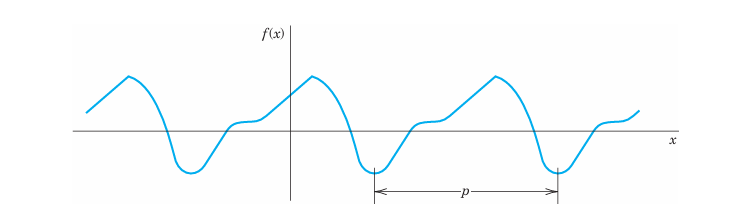{#fig-11-258}

The smallest positive period is often called the **fundamental period**. (See Probs. 2–4.)

Familiar periodic functions are the cosine, sine, tangent, and cotangent. Examples of functions that are not periodic are $x, x^2, x^3, e^x, \cosh x$, and $\ln x$, to mention just a few.

If $f(x)$ has period $p$, it also has the period $2p$ because (@eq-11-1) implies $f(x + 2p) = f([x + p] + p) = f(x + p) = f(x)$, etc.; thus for any integer $n = 1, 2, 3, \dots$,
$$
f(x + np) = f(x)
$$ {#eq-11-2}
for all $x$.

Furthermore if $f(x)$ and $g(x)$ have period $p$, then $af(x) + bg(x)$ with any constants $a$ and $b$ also has the period $p$.

Our problem in the first few sections of this chapter will be the representation of various functions $f(x)$ of period $2\pi$ in terms of the simple functions
$$
1, \quad \cos x, \quad \sin x, \quad \cos 2x, \quad \sin 2x, \quad \dots, \quad \cos nx, \quad \sin nx, \quad \dots
$$ {#eq-11-3}
All these functions have the period $2\pi$. They form the so-called **trigonometric system**. @fig-11-259 shows the first few of them (except for the constant 1, which is periodic with any period).

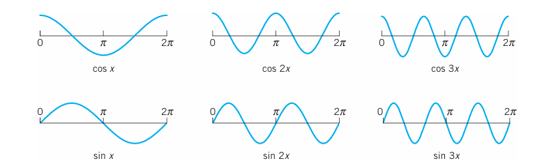{#fig-11-259}

The series to be obtained will be a **trigonometric series**, that is, a series of the form
$$
a_0 + \sum_{n=1}^{\infty} (a_n \cos nx + b_n \sin nx) = a_0 + a_1 \cos x + b_1 \sin x + a_2 \cos 2x + b_2 \sin 2x + \dots
$$ {#eq-11-4}
where $a_0, a_1, b_1, a_2, b_2, \dots$ are constants, called the **coefficients** of the series. We see that each term has the period $2\pi$. Hence if the coefficients are such that the series converges, its sum will be a function of period $2\pi$.

Expressions such as (@eq-11-4) will occur frequently in Fourier analysis. To compare the expression on the right with that on the left, simply write the terms in the summation. Convergence of one side implies convergence of the other and the sums will be the same.

Now suppose that $f(x)$ is a given function of period $2\pi$ and is such that it can be represented by a series (@eq-11-4), that is, (@eq-11-4) converges and, moreover, has the sum $f(x)$. Then, using the equality sign, we write
$$
f(x) = a_0 + \sum_{n=1}^{\infty} (a_n \cos nx + b_n \sin nx)
$$ {#eq-11-5}
and call (@eq-11-5) the **Fourier series** of $f(x)$. We shall prove that in this case the coefficients of (@eq-11-5) are the so-called **Fourier coefficients** of $f(x)$, given by the **Euler formulas**
$$
a_0 = \frac{1}{2\pi} \int_{-\pi}^{\pi} f(x) \, dx
$$ {#eq-11-6-0}
$$
a_n = \frac{1}{\pi} \int_{-\pi}^{\pi} f(x) \cos nx \, dx, \quad n = 1, 2, \dots
$$ {#eq-11-6-a}
$$
b_n = \frac{1}{\pi} \int_{-\pi}^{\pi} f(x) \sin nx \, dx, \quad n = 1, 2, \dots
$$ {#eq-11-6-b}

The name "Fourier series" is sometimes also used in the exceptional case that (@eq-11-5) with coefficients (@eq-11-6-0)–(@eq-11-6-b) does not converge or does not have the sum $f(x)$—this may happen but is merely of theoretical interest. (For Euler see footnote 4 in Sec. 2.5.)

### A Basic Example
Before we derive the Euler formulas (@eq-11-6-0)–(@eq-11-6-b), let us consider how (@eq-11-5) and (@eq-11-6-0)–(@eq-11-6-b) are applied in this important basic example. Be fully alert, as the way we approach and solve this example will be the technique you will use for other functions. Note that the integration is a little bit different from what you are familiar with in calculus because of the $n$. Do not just routinely use your software but try to get a good understanding and make observations: How are continuous functions (cosines and sines) able to represent a given discontinuous function? How does the quality of the approximation increase if you take more and more terms of the series? Why are the approximating functions, called the partial sums of the series, in this example always zero at $0$ and $\pi$? Why is the factor $1/n$ (obtained in the integration) important?

### EXAMPLE 1 Periodic Rectangular Wave (Fig. 260) {#ex-11-1}
Find the Fourier coefficients of the periodic function $f(x)$ in @fig-11-260. The formula is
$$
f(x) = \begin{cases} -k & \text{if } -\pi < x < 0 \\ k & \text{if } 0 < x < \pi \end{cases} \quad \text{and} \quad f(x + 2\pi) = f(x)
$$ {#eq-11-7}
Functions of this kind occur as external forces acting on mechanical systems, electromotive forces in electric circuits, etc. (The value of $f(x)$ at a single point does not affect the integral; hence we can leave $f(x)$ undefined at $x = -\pi, 0$, and $\pi$.)

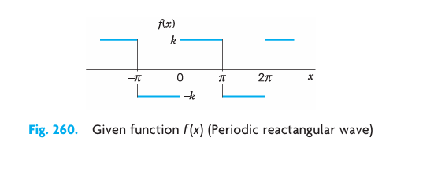{#fig-11-260}

**Solution.**
From (@eq-11-6-0) we obtain $a_0 = 0$. This can also be seen without integration, since the area under the curve of $f(x)$ between $-\pi$ and $\pi$ (taken with a minus sign where $f(x)$ is negative) is zero.

From (@eq-11-6-a) we obtain the coefficients $a_1, a_2, \dots$ of the cosine terms. Since $f(x)$ is given by two expressions, the integrals from $-\pi$ to $\pi$ split into two integrals:
$$
a_n = \frac{1}{\pi} \int_{-\pi}^{\pi} f(x) \cos nx \, dx = \frac{1}{\pi} \left[ \int_{-\pi}^{0} (-k) \cos nx \, dx + \int_{0}^{\pi} k \cos nx \, dx \right] = \frac{1}{\pi} \left[ \left. -k \frac{\sin nx}{n} \right|_{-\pi}^{0} + \left. k \frac{\sin nx}{n} \right|_{0}^{\pi} \right] = 0
$$
because $\sin nx = 0$ at $x = -\pi, 0$, and $\pi$ for all $n = 1, 2, \dots$. We see that all these cosine coefficients are zero. That is, the Fourier series of (@eq-11-7) has no cosine terms, just sine terms, it is a Fourier sine series with coefficients obtained from (@eq-11-6-b);
$$
b_n = \frac{1}{\pi} \int_{-\pi}^{\pi} f(x) \sin nx \, dx = \frac{1}{\pi} \left[ \int_{-\pi}^{0} (-k) \sin nx \, dx + \int_{0}^{\pi} k \sin nx \, dx \right] = \frac{1}{\pi} \left[ \left. k \frac{\cos nx}{n} \right|_{-\pi}^{0} - \left. k \frac{\cos nx}{n} \right|_{0}^{\pi} \right]
$$
Since $\cos(-\alpha) = \cos \alpha$ and $\cos 0 = 1$, this yields
$$
b_n = \frac{k}{n\pi} [ \cos 0 - \cos(-n\pi) - \cos n\pi + \cos 0 ] = \frac{2k}{n\pi} (1 - \cos n\pi)
$$
Now, $\cos \pi = -1, \cos 2\pi = 1, \cos 3\pi = -1, \dots$; in general,
$$
\cos n\pi = \begin{cases} -1 & \text{for odd } n \\ 1 & \text{for even } n \end{cases}
$$
and thus
$$
1 - \cos n\pi = \begin{cases} 2 & \text{for odd } n \\ 0 & \text{for even } n \end{cases}
$$
Hence the Fourier coefficients $b_n$ of our function are
$$
b_1 = \frac{4k}{\pi}, \quad b_2 = 0, \quad b_3 = \frac{4k}{3\pi}, \quad b_4 = 0, \quad b_5 = \frac{4k}{5\pi}, \quad \dots
$$
Since the $a_n$ are zero, the Fourier series of $f(x)$ is
$$
f(x) = \frac{4k}{\pi} \left( \sin x + \frac{1}{3} \sin 3x + \frac{1}{5} \sin 5x + \dots \right)
$$ {#eq-11-8}

The partial sums are
$$
S_1 = \frac{4k}{\pi} \sin x, \quad S_2 = \frac{4k}{\pi} \left( \sin x + \frac{1}{3} \sin 3x \right), \quad S_3 = \frac{4k}{\pi} \left( \sin x + \frac{1}{3} \sin 3x + \frac{1}{5} \sin 5x \right), \quad \dots
$$
Their graphs in @fig-11-261 seem to indicate that the series is convergent and has the sum $f(x)$, the given function.

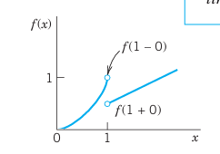{#fig-11-261}

We notice that at $x = 0$ and $x = \pi$, the points of discontinuity of $f(x)$, all partial sums have the value zero, the arithmetic mean of the limits $-k$ and $k$ of our function, at these points. This is typical.

Furthermore, assuming that $f(x)$ is the sum of the series and setting $x = \pi/2$, we have
$$
f(\pi/2) = k = \frac{4k}{\pi} \left( 1 - \frac{1}{3} + \frac{1}{5} - \frac{1}{7} + \dots \right)
$$
Thus
$$
1 - \frac{1}{3} + \frac{1}{5} - \frac{1}{7} + \dots = \frac{\pi}{4}
$$
This is a famous result obtained by Leibniz in 1673 from geometric considerations. It illustrates that the values of various series with constant terms can be obtained by evaluating Fourier series at specific points. $\blacksquare$

### Derivation of the Euler Formulas (6)
The key to the Euler formulas (@eq-11-6-0)–(@eq-11-6-b) is the orthogonality of (@eq-11-3), a concept of basic importance, as follows. Here we generalize the concept of inner product (Sec. 9.3) to functions.

**THEOREM 1 Orthogonality of the Trigonometric System (3)**
The trigonometric system (@eq-11-3) is orthogonal on the interval $[-\pi, \pi]$ (hence also on $[0, 2\pi]$ or any other interval of length $2\pi$ because of periodicity); that is, the integral of the product of any two functions in (@eq-11-3) over that interval is 0, so that for any integers $n$ and $m$,
$$
\int_{-\pi}^{\pi} \cos nx \cos mx \, dx = 0 \quad (n \neq m)
$$ {#eq-11-9-a}
$$
\int_{-\pi}^{\pi} \sin nx \sin mx \, dx = 0 \quad (n \neq m)
$$ {#eq-11-9-b}
$$
\int_{-\pi}^{\pi} \sin nx \cos mx \, dx = 0 \quad (\text{for all } n \text{ and } m)
$$ {#eq-11-9-c}

**PROOF**
This follows simply by transforming the integrands trigonometrically from products into sums. In (@eq-11-9-a) and (@eq-11-9-b), by (11) in App. A3.1,
$$
\cos nx \cos mx = \frac{1}{2} \cos(n + m)x + \frac{1}{2} \cos(n - m)x
$$
$$
\sin nx \sin mx = \frac{1}{2} \cos(n - m)x - \frac{1}{2} \cos(n + m)x
$$
Since $m \neq n$ (integer!), the integrals on the right are all 0. Similarly, in (@eq-11-9-c), for all integer $m$ and $n$ (without exception; do you see why?)
$$
\sin nx \cos mx = \frac{1}{2} \sin(n + m)x + \frac{1}{2} \sin(n - m)x
$$
giving 0 upon integration. $\square$

### Application of Theorem 1 to the Fourier Series (5)
We prove (@eq-11-6-0). Integrating on both sides of (@eq-11-5) from $-\pi$ to $\pi$, we get
$$
\int_{-\pi}^{\pi} f(x) \, dx = \int_{-\pi}^{\pi} \left[ a_0 + \sum_{n=1}^{\infty} (a_n \cos nx + b_n \sin nx) \right] \, dx
$$
We now assume that termwise integration is allowed. (We shall say in the proof of Theorem 2 when this is true.) Then we obtain
$$
\int_{-\pi}^{\pi} f(x) \, dx = a_0 \int_{-\pi}^{\pi} dx + \sum_{n=1}^{\infty} \left[ a_n \int_{-\pi}^{\pi} \cos nx \, dx + b_n \int_{-\pi}^{\pi} \sin nx \, dx \right]
$$
The first term on the right equals $2\pi a_0$. Integration shows that all the other integrals are 0. Hence division by $2\pi$ gives (@eq-11-6-0).

We prove (@eq-11-6-a). Multiplying (@eq-11-5) on both sides by $\cos mx$ with any fixed positive integer $m$ and integrating from $-\pi$ to $\pi$, we have
$$
\int_{-\pi}^{\pi} f(x) \cos mx \, dx = \int_{-\pi}^{\pi} \left[ a_0 + \sum_{n=1}^{\infty} (a_n \cos nx + b_n \sin nx) \right] \cos mx \, dx
$$ {#eq-11-10}
We now integrate term by term. Then on the right we obtain an integral of $a_0 \cos mx$, which is 0; an integral of $a_n \cos nx \cos mx$, which is $\pi a_m$ for $n = m$ and 0 for $n \neq m$ by (@eq-11-9-a); and an integral of $b_n \sin nx \cos mx$, which is 0 for all $n$ and $m$ by (@eq-11-9-c). Hence the right side of (@eq-11-10) equals $a_m \pi$. Division by $\pi$ gives (@eq-11-6-a) (with $m$ instead of $n$).

We finally prove (@eq-11-6-b). Multiplying (@eq-11-5) on both sides by $\sin mx$ with any fixed positive integer $m$ and integrating from $-\pi$ to $\pi$, we get
$$
\int_{-\pi}^{\pi} f(x) \sin mx \, dx = \int_{-\pi}^{\pi} \left[ a_0 + \sum_{n=1}^{\infty} (a_n \cos nx + b_n \sin nx) \right] \sin mx \, dx
$$ {#eq-11-11}
Integrating term by term, we obtain on the right an integral of $a_0 \sin mx$, which is 0; an integral of $a_n \cos nx \sin mx$, which is 0 by (@eq-11-9-c); and an integral of $b_n \sin nx \sin mx$, which is $b_m \pi$ if $n = m$ and 0 if $n \neq m$, by (@eq-11-9-b). This implies (@eq-11-6-b) (with $n$ denoted by $m$). This completes the proof of the Euler formulas (@eq-11-6-0)–(@eq-11-6-b) for the Fourier coefficients.

### Convergence and Sum of a Fourier Series
The class of functions that can be represented by Fourier series is surprisingly large and general. Sufficient conditions valid in most applications are as follows.

**THEOREM 2 Representation by a Fourier Series**
Let $f(x)$ be periodic with period $2\pi$ and piecewise continuous (see Sec. 6.1) in the interval $[-\pi, \pi]$. Furthermore, let $f(x)$ have a left-hand derivative and a right-hand derivative at each point of that interval. Then the Fourier series (@eq-11-5) of $f(x)$ [with coefficients (@eq-11-6-0)–(@eq-11-6-b)] converges. Its sum is $f(x)$, except at points $x_0$ where $f(x)$ is discontinuous. There the sum of the series is the average of the left- and right-hand limits of $f(x)$ at $x_0$.

> **Footnote 2:** The left-hand limit of $f(x)$ at $x_0$ is defined as the limit of $f(x)$ as $x$ approaches $x_0$ from the left and is commonly denoted by $f(x_0 - 0)$. Thus
> $$
> f(x_0 - 0) = \lim_{h \to 0^+} f(x_0 - h)
> $$
> as $h \to 0$ through positive values. The right-hand limit is denoted by $f(x_0 + 0)$ and
> $$
> f(x_0 + 0) = \lim_{h \to 0^+} f(x_0 + h)
> $$
> as $h \to 0$ through positive values. The left- and right-hand derivatives of $f(x)$ at $x_0$ are defined as the limits of
> $$
> \frac{f(x_0 - h) - f(x_0 - 0)}{-h} \quad \text{and} \quad \frac{f(x_0 + h) - f(x_0 + 0)}{h}
> $$
> respectively, as $h \to 0$ through positive values. Of course if $f(x)$ is continuous at $x_0$, the last term in both numerators is simply $f(x_0)$.

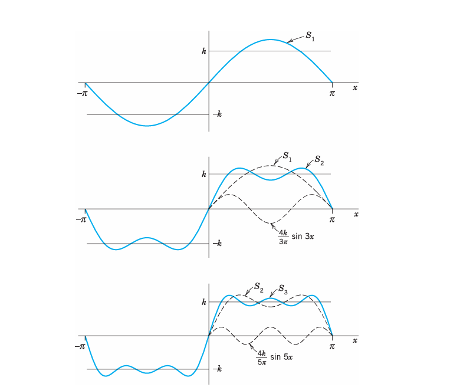{#fig-11-262}

**PROOF**
We prove convergence, but only for a continuous function $f(x)$ having continuous first and second derivatives. And we do not prove that the sum of the series is $f(x)$ because these proofs are much more advanced; see, for instance, Ref. [C12] listed in App. 1.

Integrating (@eq-11-6-a) by parts, we obtain
$$
a_n = \frac{1}{n\pi} \left. f(x) \sin nx \right|_{-\pi}^{\pi} - \frac{1}{n\pi} \int_{-\pi}^{\pi} f'(x) \sin nx \, dx
$$
The first term on the right is zero. Another integration by parts gives
$$
a_n = \frac{1}{n^2\pi} \left. f'(x) \cos nx \right|_{-\pi}^{\pi} - \frac{1}{n^2\pi} \int_{-\pi}^{\pi} f''(x) \cos nx \, dx
$$
The first term on the right is zero because of the periodicity and continuity of $f'(x)$. Since $f''(x)$ is continuous in the interval of integration, we have $|f''(x)| < M$ for an appropriate constant $M$. Furthermore, $|\cos nx| \le 1$. It follows that
$$
|a_n| = \frac{1}{n^2\pi} \left| \int_{-\pi}^{\pi} f''(x) \cos nx \, dx \right| \le \frac{1}{n^2\pi} \int_{-\pi}^{\pi} M \, dx = \frac{2M}{n^2}
$$
Similarly, $|b_n| \le \frac{2M}{n^2}$ for all $n$. Hence the absolute value of each term of the Fourier series of $f(x)$ is at most equal to the corresponding term of the series
$$
|a_0| + 2M \left( 1 + \frac{1}{2^2} + \frac{1}{3^2} + \dots \right)
$$
which is convergent. Hence that Fourier series converges and the proof is complete. $\square$

(Readers already familiar with uniform convergence will see that, by the Weierstrass test in Sec. 15.5, under our present assumptions the Fourier series converges uniformly, and our derivation of (6) by integrating term by term is then justified by Theorem 3 of Sec. 15.5.)

### EXAMPLE 2 Convergence at a Jump as Indicated in Theorem 2 {#ex-11-2}
The rectangular wave in Example 1 has a jump at $x = 0$. Its left-hand limit there is $-k$ and its right-hand limit is $k$ (@fig-11-261). Hence the average of these limits is 0. The Fourier series (@eq-11-8) of the wave does indeed converge to this value when $x = 0$ because then all its terms are 0. Similarly for the other jumps. This is in agreement with Theorem 2. $\blacksquare$

**Summary.** A Fourier series of a given function $f(x)$ of period $2\pi$ is a series of the form (@eq-11-5) with coefficients given by the Euler formulas (@eq-11-6-0)–(@eq-11-6-b). Theorem 2 gives conditions that are sufficient for this series to converge and at each $x$ to have the value $f(x)$, except at discontinuities of $f(x)$, where the series equals the arithmetic mean of the left-hand and right-hand limits of $f(x)$ at that point.

## Problem Set 11.1 {#sec-problem-set-11-1}

### 1–5 PERIOD, FUNDAMENTAL PERIOD
The fundamental period is the smallest positive period. Find it for:
1. $\cos x, \sin x, \cos 2x, \sin 2x, \cos \pi x, \sin \pi x, \cos 2\pi x, \sin 2\pi x$
2. $\cos nx, \sin nx, \cos \frac{2\pi n x}{k}, \sin \frac{2\pi n x}{k}$
3. If $f(x)$ and $g(x)$ have period $p$, show that $h(x) = af(x) + bg(x)$ ($a, b$ constant) has the period $p$. Thus all functions of period $p$ form a vector space.
4. **Change of scale.** If $f(x)$ has period $p$, show that $f(ax)$, $a \neq 0$, and $f(x/b)$, $b \neq 0$, are periodic functions of $x$ of periods $p/a$ and $bp$, respectively. Give examples.
5. Show that $f(x) = \text{const}$ is periodic with any period but has no fundamental period.

### 6–10 GRAPHS OF $2\pi$-PERIODIC FUNCTIONS
Sketch or graph $f(x)$ which for $-\pi < x < \pi$ is given as follows:
6. $f(x) = |x|$
7. $f(x) = |\sin x|, \quad f(x) = \sin |x|$
8. $f(x) = e^{-|x|}, \quad f(x) = |e^{-x}|$
9. $f(x) = \begin{cases} x & \text{if } -\pi < x < 0 \\ \pi - x & \text{if } 0 < x < \pi \end{cases}$
10. $f(x) = \begin{cases} -\cos^2 x & \text{if } -\pi < x < 0 \\ \cos^2 x & \text{if } 0 < x < \pi \end{cases}$

11. **Calculus review.** Review integration techniques for integrals as they are likely to arise from the Euler formulas, for instance, definite integrals of $e^{-2x} \cos nx$, $x \cos nx$, $x^2 \sin nx$, etc.

### 12–21 FOURIER SERIES
Find the Fourier series of the given function $f(x)$, which is assumed to have the period $2\pi$. Show the details of your work. Sketch or graph the partial sums up to that including $S_5$ (or $S_3$ if the terms are zero).
12. $f(x)$ in Prob. 6
13. $f(x)$ in Prob. 9
14. $f(x) = x^2 \quad (-\pi < x < \pi)$
15. $f(x) = x^2 \quad (0 < x < 2\pi)$
16. $f(x) = \begin{cases} 0 & \text{if } -\pi < x < 0 \\ x & \text{if } 0 < x < \pi \end{cases}$
17. $f(x) = \begin{cases} 0 & \text{if } -\pi < x < 0 \\ \pi & \text{if } 0 < x < \pi \end{cases}$
18. $f(x) = \begin{cases} -k & \text{if } -\pi < x < 0 \\ k & \text{if } 0 < x < \pi \end{cases}$ (Wait, isn't this Example 1?)
19. $f(x) = \begin{cases} 0 & \text{if } -\pi < x < -\pi/2 \\ 1 & \text{if } -\pi/2 < x < \pi/2 \\ 0 & \text{if } \pi/2 < x < \pi \end{cases}$
20. $f(x) = \begin{cases} 0 & \text{if } -\pi < x < 0 \\ 1 & \text{if } 0 < x < \pi/2 \\ 0 & \text{if } \pi/2 < x < \pi \end{cases}$
21. $f(x) = \begin{cases} -1 & \text{if } -\pi < x < -\pi/2 \\ 1 & \text{if } -\pi/2 < x < \pi/2 \\ -1 & \text{if } \pi/2 < x < \pi \end{cases}$

22. **CAS EXPERIMENT. Graphing.** Write a program for graphing partial sums of the following series. Guess from the graph what $f(x)$ the series may represent. Confirm or disprove your guess by using the Euler formulas.
    (a) $2 \left( \sin x - \frac{1}{2} \sin 2x + \frac{1}{3} \sin 3x - \frac{1}{4} \sin 4x + \dots \right)$
    (b) $\frac{1}{2} - \frac{4}{\pi^2} \left( \cos x + \frac{1}{9} \cos 3x + \frac{1}{25} \cos 5x + \dots \right)$
    (c) $\frac{2}{3}\pi^2 - 4 \left( \cos x - \frac{1}{4} \cos 2x + \frac{1}{9} \cos 3x - \frac{1}{16} \cos 4x + \dots \right)$
23. **Discontinuities.** Verify the last statement in Theorem 2 for the discontinuities of $f(x)$ in Prob. 21.
24. **CAS EXPERIMENT. Orthogonality.** Integrate and graph the integral of the product $\cos mx \cos nx$ (with various integer $m$ and $n$ of your choice) from $-a$ to $a$ as a function of $a$ and conclude orthogonality of $\cos mx$ and $\cos nx$ ($m \neq n$) for $a = \pi$ from the graph. For what $m$ and $n$ will you get orthogonality for $a = \pi/2$? $a = \pi/3$, $a = \pi/4$? Other $a$? Extend the experiment to $\sin mx \sin nx$ and $\cos mx \sin nx$.
25. **CAS EXPERIMENT. Order of Fourier Coefficients.** The order seems to be $1/n$ if $f$ is discontinuous, and $1/n^2$ if $f$ is continuous but $f' = df/dx$ is discontinuous, $1/n^3$ if $f$ and $f'$ are continuous but $f''$ is discontinuous, etc. Try to verify this for examples. Try to prove it by integrating the Euler formulas by parts. What is the practical significance of this?

## Arbitrary Period. Even and Odd Functions. Half-Range Expansions {#sec-arbitrary-period-even-odd-functions}

We now expand our initial basic discussion of Fourier series.

**Orientation.** This section concerns three topics:
1. Transition from period $2\pi$ to any period $2L$, for the function $f$, simply by a transformation of scale on the $x$-axis.
2. Simplifications. Only cosine terms if $f$ is even ("Fourier cosine series"). Only sine terms if $f$ is odd ("Fourier sine series").
3. Expansion of $f$ given for $0 \le x \le L$ in two Fourier series, one having only cosine terms and the other only sine terms ("half-range expansions").

### 1. From Period $2\pi$ to Any Period $p = 2L$
Clearly, periodic functions in applications may have any period, not just $2\pi$ as in the last section (chosen to have simple formulas). The notation $p = 2L$ for the period is practical because $L$ will be a length of a violin string in Sec. 12.2, of a rod in heat conduction in Sec. 12.5, and so on.

The transition from period $2\pi$ to period $p = 2L$ is effected by a suitable change of scale, as follows. Let $f(x)$ have period $p = 2L$. Then we can introduce a new variable $v$ such that $f(x)$, as a function of $v$, has period $2\pi$. If we set
$$
x = \frac{L}{\pi} v \quad \text{so that} \quad v = \frac{\pi}{L} x
$$ {#eq-11-2-1}
then $v = \pm\pi$ corresponds to $x = \pm L$. This means that $f$, as a function of $v$, has period $2\pi$ and, therefore, a Fourier series of the form
$$
f(x) = f\left(\frac{L}{\pi} v\right) = a_0 + \sum_{n=1}^{\infty} \left( a_n \cos nv + b_n \sin nv \right)
$$ {#eq-11-2-2}
with coefficients obtained from (6) in the last section:
$$
a_0 = \frac{1}{2\pi} \int_{-\pi}^{\pi} f\left(\frac{L}{\pi} v\right) \, dv, \quad a_n = \frac{1}{\pi} \int_{-\pi}^{\pi} f\left(\frac{L}{\pi} v\right) \cos nv \, dv, \quad b_n = \frac{1}{\pi} \int_{-\pi}^{\pi} f\left(\frac{L}{\pi} v\right) \sin nv \, dv
$$

We could write these integrals in terms of the original variable $x$. We have $v = \frac{\pi}{L} x$, so $dv = \frac{\pi}{L} dx$, and the limits of integration $v = -\pi$ and $v = \pi$ correspond to $x = -L$ and $x = L$. This yields the following formulas for the Fourier coefficients of a function $f(x)$ of period $2L$:
$$
a_0 = \frac{1}{2L} \int_{-L}^{L} f(x) \, dx
$$ {#eq-11-2-3-0}
$$
a_n = \frac{1}{L} \int_{-L}^{L} f(x) \cos \frac{n\pi x}{L} \, dx, \quad n=1, 2, \dots
$$ {#eq-11-2-3-a}
$$
b_n = \frac{1}{L} \int_{-L}^{L} f(x) \sin \frac{n\pi x}{L} \, dx, \quad n=1, 2, \dots
$$ {#eq-11-2-3-b}

The Fourier series of $f(x)$ is:
$$
f(x) = a_0 + \sum_{n=1}^{\infty} \left( a_n \cos \frac{n\pi x}{L} + b_n \sin \frac{n\pi x}{L} \right)
$$ {#eq-11-2-4}

Just as in @sec-fourier-series, we continue to call (@eq-11-2-4) with any coefficients a trigonometric series. And we can integrate from $0$ to $2L$ or over any other interval of length $p = 2L$ because of periodicity.

### EXAMPLE 1 Periodic Rectangular Wave {#ex-11-2-1}
Find the Fourier series of the function (@fig-11-263):
$$
f(x) = \begin{cases} 0 & \text{if } -2 < x < -1 \\ k & \text{if } -1 < x < 1 \\ 0 & \text{if } 1 < x < 2 \end{cases} \quad \text{and} \quad f(x+4) = f(x), \quad p = 2L = 4, \quad L = 2
$$ {#eq-11-2-5}

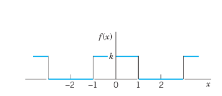{#fig-11-263}

**Solution.** From (@eq-11-2-3-0) we obtain $a_0 = k/2$ (verify!). From (@eq-11-2-3-a) we obtain:
$$
a_n = \frac{1}{2} \int_{-2}^{2} f(x) \cos \frac{n\pi x}{2} \, dx = \frac{1}{2} \int_{-1}^{1} k \cos \frac{n\pi x}{2} \, dx = \frac{2k}{n\pi} \sin \frac{n\pi}{2}
$$
Thus $a_n = 0$ if $n$ is even, and:
$$
a_n = \frac{2k}{n\pi} \quad \text{if } n=1, 5, 9, \dots
$$
$$
a_n = -\frac{2k}{n\pi} \quad \text{if } n=3, 7, 11, \dots
$$
From (@eq-11-2-3-b) we find that $b_n = 0$ for $n=1, 2, \dots$. Hence the Fourier series is a Fourier cosine series (that is, it has no sine terms):
$$
f(x) = \frac{k}{2} + \frac{2k}{\pi} \left( \cos \frac{\pi x}{2} - \frac{1}{3} \cos \frac{3\pi x}{2} + \frac{1}{5} \cos \frac{5\pi x}{2} - + \dots \right)
$$ {#eq-11-2-6}
$\blacksquare$

### EXAMPLE 2 Periodic Rectangular Wave. Change of Scale {#ex-11-2-2}
Find the Fourier series of the function (@fig-11-264):
$$
f(x) = \begin{cases} -k & \text{if } -2 < x < 0 \\ k & \text{if } 0 < x < 2 \end{cases} \quad \text{and} \quad f(x+4) = f(x), \quad p = 2L = 4, \quad L = 2
$$ {#eq-11-2-7}

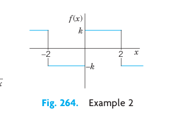{#fig-11-264}

**Solution.** Since $L = 2$, we have in (1) $v = \frac{\pi x}{2}$ and obtain from (8) in @sec-fourier-series with $v$ instead of $x$:
$$
g(v) = \frac{4k}{\pi} \left( \sin v + \frac{1}{3} \sin 3v + \frac{1}{5} \sin 5v + \dots \right)
$$
the present Fourier series:
$$
f(x) = \frac{4k}{\pi} \left( \sin \frac{\pi x}{2} + \frac{1}{3} \sin \frac{3\pi x}{2} + \frac{1}{5} \sin \frac{5\pi x}{2} + \dots \right)
$$ {#eq-11-2-8}
Confirm this by using (@eq-11-2-3-b) and integrating. $\blacksquare$

### EXAMPLE 3 Half-Wave Rectifier {#ex-11-2-3}
A sinusoidal voltage $E \sin \omega t$, where $t$ is time, is passed through a half-wave rectifier that clips the negative portion of the wave (@fig-11-265). Find the Fourier series of the resulting periodic function:
$$
u(t) = \begin{cases} 0 & \text{if } -L < t < 0 \\ E \sin \omega t & \text{if } 0 < t < L \end{cases} \quad \text{and} \quad p = 2L = \frac{2\pi}{\omega}, \quad L = \frac{\pi}{\omega}
$$ {#eq-11-2-9}

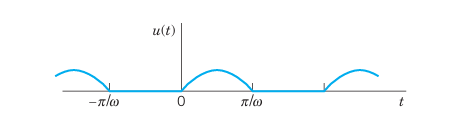{#fig-11-265}

**Solution.** Since $u = 0$ when $-L < t < 0$, we obtain from (@eq-11-2-3-0), with $t$ instead of $x$:
$$
a_0 = \frac{\omega}{2\pi} \int_{0}^{\pi/\omega} E \sin \omega t \, dt = \frac{E}{\pi}
$$
and from (@eq-11-2-3-a), by using formula (11) in App. A3.1 with $x = \omega t$ and $y = n\omega t$:
$$
a_n = \frac{\omega}{\pi} \int_{0}^{\pi/\omega} E \sin \omega t \cos n\omega t \, dt = \frac{\omega E}{\pi} \int_{0}^{\pi/\omega} \frac{1}{2} \left[ \sin(1+n)\omega t + \sin(1-n)\omega t \right] \, dt
$$
If $n = 1$, the integral on the right is zero, and if $n = 2, 3, \dots$, we obtain:
$$
a_n = \frac{\omega E}{2\pi} \left[ \left. -\frac{\cos(1+n)\omega t}{(1+n)\omega} \right|_{0}^{\pi/\omega} - \left. \frac{\cos(1-n)\omega t}{(1-n)\omega} \right|_{0}^{\pi/\omega} \right] = \frac{E}{2\pi} \left[ \frac{-\cos(1+n)\pi + 1}{1+n} + \frac{-\cos(1-n)\pi + 1}{1-n} \right]
$$
If $n$ is odd, this is equal to zero, and for even $n$ we have:
$$
a_n = \frac{E}{2\pi} \left[ \frac{2}{1+n} + \frac{2}{1-n} \right] = -\frac{2E}{(n-1)(n+1)\pi}, \quad (n = 2, 4, 6, \dots)
$$
In a similar fashion we find from (@eq-11-2-3-b) that $b_1 = E/2$ and $b_n = 0$ for $n=2, 3, \dots$. Consequently,
$$
u(t) = \frac{E}{\pi} + \frac{E}{2} \sin \omega t - \frac{2E}{\pi} \left( \frac{1}{1 \cdot 3} \cos 2\omega t + \frac{1}{3 \cdot 5} \cos 4\omega t + \dots \right)
$$ {#eq-11-2-10}
$\blacksquare$

### 2. Simplifications: Even and Odd Functions
If $f(x)$ is an even function, that is, $f(-x) = f(x)$ (@fig-11-266), its Fourier series (@eq-11-2-4) reduces to a **Fourier cosine series**:
$$
f(x) = a_0 + \sum_{n=1}^{\infty} a_n \cos \frac{n\pi x}{L} \quad (f \text{ even})
$$ {#eq-11-2-5-star}

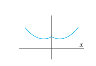{#fig-11-266}

with coefficients (note: integration from $0$ to $L$ only!):
$$
a_0 = \frac{1}{L} \int_{0}^{L} f(x) \, dx, \quad a_n = \frac{2}{L} \int_{0}^{L} f(x) \cos \frac{n\pi x}{L} \, dx, \quad n=1, 2, \dots
$$ {#eq-11-2-6-star}

If $f(x)$ is an odd function, that is, $f(-x) = -f(x)$ (@fig-11-267), its Fourier series (@eq-11-2-4) reduces to a **Fourier sine series**:
$$
f(x) = \sum_{n=1}^{\infty} b_n \sin \frac{n\pi x}{L} \quad (f \text{ odd})
$$ {#eq-11-2-5-double-star}

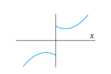{#fig-11-267}

with coefficients:
$$
b_n = \frac{2}{L} \int_{0}^{L} f(x) \sin \frac{n\pi x}{L} \, dx, \quad n=1, 2, \dots
$$ {#eq-11-2-6-double-star}

These formulas follow from (@eq-11-2-4) and (@eq-11-2-3-0)–(@eq-11-2-3-b) by remembering from calculus that the definite integral gives the net area under the curve of a function between the limits of integration. This implies:
$$
\int_{-L}^{L} g(x) \, dx = 2 \int_{0}^{L} g(x) \, dx \quad \text{for even } g
$$ {#eq-11-2-7-a}
$$
\int_{-L}^{L} h(x) \, dx = 0 \quad \text{for odd } h
$$ {#eq-11-2-7-b}

Formula (@eq-11-2-7-b) implies the reduction to the cosine series (even $f$ makes $f(x) \sin(n\pi x/L)$ odd because $\sin$ is odd) and to the sine series (odd $f$ makes $f(x) \cos(n\pi x/L)$ odd because $\cos$ is even). Similarly, (@eq-11-2-7-a) reduces the integrals in (@eq-11-2-6-star) and (@eq-11-2-6-double-star) to integrals from $0$ to $L$.

#### Summary of Special Cases
**Even Function of Period $2\pi$.** If $f$ is even and $L = \pi$, then
$$
f(x) = a_0 + \sum_{n=1}^{\infty} a_n \cos nx
$$
with coefficients:
$$
a_0 = \frac{1}{\pi} \int_{0}^{\pi} f(x) \, dx, \quad a_n = \frac{2}{\pi} \int_{0}^{\pi} f(x) \cos nx \, dx, \quad n=1, 2, \dots
$$

**Odd Function of Period $2\pi$.** If $f$ is odd and $L = \pi$, then
$$
f(x) = \sum_{n=1}^{\infty} b_n \sin nx
$$
with coefficients:
$$
b_n = \frac{2}{\pi} \int_{0}^{\pi} f(x) \sin nx \, dx, \quad n=1, 2, \dots
$$

### EXAMPLE 4 Fourier Cosine and Sine Series {#ex-11-2-4}
The rectangular wave in Example 1 of @sec-fourier-series is odd, hence its Fourier series has only sine terms. The wave in Example 1 above is even, hence it has only cosine terms. In Example 3 you can see that the Fourier cosine series represents $u(t) - \frac{E}{2} \sin \omega t - \frac{E}{\pi}$. Can you prove that this is an even function? $\blacksquare$

Further simplifications result from the following property:

**THEOREM 1 Sum and Scalar Multiple**
- The Fourier coefficients of a sum $f_1 + f_2$ are the sums of the corresponding Fourier coefficients of $f_1$ and $f_2$.
- The Fourier coefficients of $cf$ are $c$ times the corresponding Fourier coefficients of $f$.

### EXAMPLE 5 Sawtooth Wave {#ex-11-2-5}
Find the Fourier series of the function (@fig-11-268):
$$
f(x) = x + \pi \quad \text{if } -\pi < x < \pi \quad \text{and} \quad f(x+2\pi) = f(x)
$$ {#eq-11-2-11}

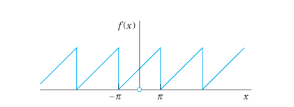{#fig-11-268}

**Solution.** We have $f = f_1 + f_2$, where $f_1 = x$ and $f_2 = \pi$. The Fourier coefficients of $f_2$ are zero, except for the first one (the constant term), which is $\pi$. Hence, by Theorem 1, the Fourier coefficients $a_n, b_n$ are those of $f_1$, except for $a_0$, which is $\pi$. Since $f_1$ is odd, $a_n = 0$ for $n=1, 2, \dots$, and
$$
b_n = \frac{2}{\pi} \int_{0}^{\pi} x \sin nx \, dx
$$
Integrating by parts, we obtain:
$$
b_n = \frac{2}{\pi} \left[ \left. -\frac{x \cos nx}{n} \right|_{0}^{\pi} + \int_{0}^{\pi} \frac{\cos nx}{n} \, dx \right] = -\frac{2}{n} \cos n\pi
$$
Hence $b_1 = 2, b_2 = -1, b_3 = 2/3, b_4 = -1/2, \dots$, and the Fourier series of $f(x)$ is:
$$
f(x) = \pi + 2 \left( \sin x - \frac{1}{2} \sin 2x + \frac{1}{3} \sin 3x - + \dots \right)
$$ {#eq-11-2-12}
(See @fig-11-269 for the partial sums $S_1, S_2, S_3, S_{20}$.) $\blacksquare$

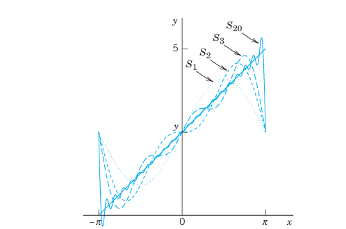{#fig-11-269}

### 3. Half-Range Expansions
Half-range expansions are Fourier series of functions $f(x)$ defined on an interval $0 \le x \le L$. Figure 270 explains the idea. We want to represent $f(x)$ in @fig-11-270(0) by a Fourier series. $f(x)$ may represent the shape of a distorted violin string or the temperature in a metal bar of length $L$.

We can extend $f(x)$ to the interval $-L \le x \le 0$ in two different ways:
1. As an **even function** $f_1(x)$ of period $2L$ (@fig-11-270(a)). Its Fourier series will contain only cosine terms (and the constant $a_0$).
2. As an **odd function** $f_2(x)$ of period $2L$ (@fig-11-270(b)). Its Fourier series will contain only sine terms.

This explains the name **half-range expansions**: $f(x)$ is given only on half the interval of periodicity of length $2L$.

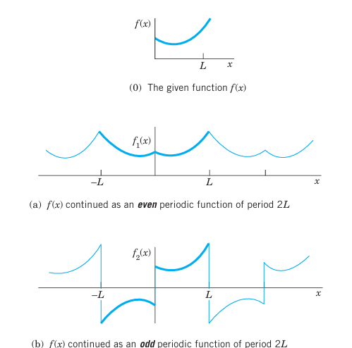{#fig-11-270}

### EXAMPLE 6 "Triangle" and Its Half-Range Expansions {#ex-11-2-6}
Find the two half-range expansions of the function (@fig-11-271):
$$
f(x) = \begin{cases} \frac{2k}{L} x & \text{if } 0 < x < L/2 \\ \frac{2k}{L}(L - x) & \text{if } L/2 < x < L \end{cases}
$$ {#eq-11-2-13}

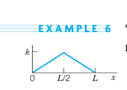{#fig-11-271}

**Solution.**  
**(a) Even periodic extension.** From (@eq-11-2-6-star) we obtain:
$$
a_0 = \frac{1}{L} \left[ \int_{0}^{L/2} \frac{2k}{L} x \, dx + \int_{L/2}^{L} \frac{2k}{L}(L - x) \, dx \right] = \frac{k}{2}
$$
$$
a_n = \frac{2}{L} \left[ \int_{0}^{L/2} \frac{2k}{L} x \cos \frac{n\pi x}{L} \, dx + \int_{L/2}^{L} \frac{2k}{L}(L - x) \cos \frac{n\pi x}{L} \, dx \right]
$$
For the first integral we obtain by integration by parts:
$$
\int_{0}^{L/2} x \cos \frac{n\pi x}{L} \, dx = \left. \frac{Lx}{n\pi} \sin \frac{n\pi x}{L} \right|_{0}^{L/2} - \int_{0}^{L/2} \frac{L}{n\pi} \sin \frac{n\pi x}{L} \, dx = \frac{L^2}{2n\pi} \sin \frac{n\pi}{2} + \frac{L^2}{n^2\pi^2} \left( \cos \frac{n\pi}{2} - 1 \right)
$$
Similarly, for the second integral we obtain:
$$
\int_{L/2}^{L} (L - x) \cos \frac{n\pi x}{L} \, dx = \left. \frac{L(L - x)}{n\pi} \sin \frac{n\pi x}{L} \right|_{L/2}^{L} + \int_{L/2}^{L} \frac{L}{n\pi} \sin \frac{n\pi x}{L} \, dx = -\frac{L^2}{2n\pi} \sin \frac{n\pi}{2} + \frac{L^2}{n^2\pi^2} \left( \cos n\pi - \cos \frac{n\pi}{2} \right)
$$
Inserting these results into the formula for $a_n$, the sine terms cancel and we get:
$$
a_n = \frac{4k}{n^2\pi^2} \left( 2 \cos \frac{n\pi}{2} - \cos n\pi - 1 \right)
$$
Thus,
$$
a_2 = -\frac{8k}{\pi^2}, \quad a_6 = -\frac{8k}{9\pi^2}, \quad a_{10} = -\frac{8k}{25\pi^2}, \quad \dots
$$
and $a_n = 0$ if $n \neq 2, 6, 10, \dots$ (for even $n$ not divisible by 4, and all odd $n$). Hence the Fourier cosine series is (@fig-11-272(a)):
$$
f(x) = \frac{k}{2} - \frac{8k}{\pi^2} \left( \frac{1}{2^2} \cos \frac{2\pi x}{L} + \frac{1}{6^2} \cos \frac{6\pi x}{L} + \dots \right)
$$ {#eq-11-2-14}

**(b) Odd periodic extension.** Similarly, from (@eq-11-2-6-double-star) we obtain:
$$
b_n = \frac{8k}{n^2\pi^2} \sin \frac{n\pi}{2}
$$
Hence the Fourier sine series is (@fig-11-272(b)):
$$
f(x) = \frac{8k}{\pi^2} \left( \sin \frac{\pi x}{L} - \frac{1}{9} \sin \frac{3\pi x}{L} + \frac{1}{25} \sin \frac{5\pi x}{L} - + \dots \right)
$$ {#eq-11-2-15}
$\blacksquare$

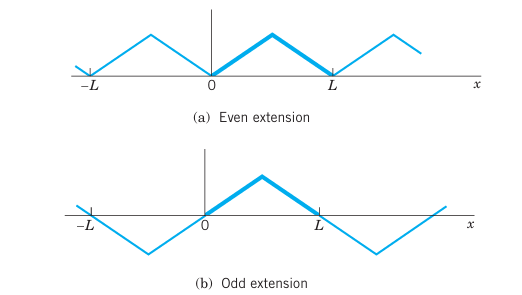{#fig-11-272}

## Problem Set 11.2 {#sec-problem-set-11-2}

### 1–7 EVEN AND ODD FUNCTIONS
Are the following functions even or odd or neither even nor odd?
1. $e^x, \quad e^{-|x|}, \quad x^3 \cos nx, \quad x^2 \tan \pi x, \quad \sinh x \cosh x$
2. $\sin^2 x, \quad \sin(x^2), \quad \ln x, \quad x(x^2+1), \quad x \cot x$
3. Sums and products of even functions
4. Sums and products of odd functions
5. Absolute values of odd functions
6. Product of an odd times an even function
7. Find all functions that are both even and odd.

### 8–17 FOURIER SERIES FOR PERIOD $p = 2L$
Find the Fourier series of the given function $f(x)$, which is assumed to have period $p = 2L$. Show details of your work.
8. $f(x) = \begin{cases} 0 & \text{if } -1 < x < 0 \\ 1 & \text{if } 0 < x < 1 \end{cases} \quad (L=1)$
9. $f(x) = \begin{cases} -1 & \text{if } -2 < x < -1 \\ x & \text{if } -1 < x < 1 \\ 1 & \text{if } 1 < x < 2 \end{cases} \quad (L=2)$
10. $f(x) = \begin{cases} 0 & \text{if } -4 < x < 0 \\ x & \text{if } 0 < x < 4 \end{cases} \quad (L=4)$
11. $f(x) = x^2 \quad (-1 < x < 1), \quad p = 2$
12. $f(x) = 1 - x^2/4 \quad (-2 < x < 2), \quad p = 4$
13. $f(x) = \begin{cases} 0 & \text{if } -2 < x < -1 \\ k & \text{if } -1 < x < 1 \\ 0 & \text{if } 1 < x < 2 \end{cases} \quad (L=2)$
14. $f(x) = \cos \pi x \quad (-1 < x < 1), \quad p = 2$
15. $f(x) = \sin \pi x \quad (0 < x < 1), \quad p = 1$
16. $f(x) = x|x| \quad (-1 < x < 1), \quad p = 2$
17. $f(x) = \begin{cases} -1 & \text{if } -1 < x < 0 \\ 1 & \text{if } 0 < x < 1 \end{cases} \quad (L=1)$

18. **Rectifier.** Find the Fourier series of the function obtained by passing the voltage $v(t) = V \cos 100\pi t$ through a half-wave rectifier that clips the negative half-waves.
19. **Trigonometric Identities.** Show that the familiar identities $\cos^3 x = \frac{3}{4} \cos x + \frac{1}{4} \cos 3x$ and $\sin^3 x = \frac{3}{4} \sin x - \frac{1}{4} \sin 3x$ can be interpreted as Fourier series expansions. Develop $\cos^4 x$.
20. **Numeric Values.** Using Prob. 11, show that $1 - \frac{1}{4} + \frac{1}{9} - \frac{1}{16} + \dots = \frac{\pi^2}{12}$ and $1 + \frac{1}{4} + \frac{1}{9} + \frac{1}{16} + \dots = \frac{\pi^2}{6}$.
21. **CAS PROJECT. Fourier Series of $2L$-Periodic Functions.**
    (a) Write a program for obtaining partial sums of a Fourier series (@eq-11-2-4).
    (b) Apply the program to Probs. 8–11, graphing the first few partial sums of each of the four series on common axes. Choose the first five or more partial sums until they approximate the given function reasonably well. Compare and comment.
22. Obtain the Fourier series in Prob. 8 from that in Prob. 17.

### 23–29 HALF-RANGE EXPANSIONS
Find (a) the Fourier cosine series, (b) the Fourier sine series. Sketch $f(x)$ and its two periodic extensions. Show the details.
23. $f(x) = 1 \quad (0 < x < L)$
24. $f(x) = \begin{cases} 1 & \text{if } 0 < x < L/2 \\ 0 & \text{if } L/2 < x < L \end{cases}$
25. $f(x) = \begin{cases} x & \text{if } 0 < x < L/2 \\ L - x & \text{if } L/2 < x < L \end{cases}$ (This is Example 6)
26. $f(x) = x^2 \quad (0 < x < L)$
27. $f(x) = L - x \quad (0 < x < L)$
28. $f(x) = \begin{cases} x & \text{if } 0 < x < L/2 \\ 0 & \text{if } L/2 < x < L \end{cases}$
29. $f(x) = \sin x \quad (0 < x < \pi)$
30. Obtain the solution to Prob. 26 from that of Prob. 27.

## Forced Oscillations {#sec-forced-oscillations}

Fourier series have important applications for both ODEs and PDEs. In this section we shall focus on ODEs and cover similar applications for PDEs in Chap. 12. All these applications will show our indebtedness to Euler’s and Fourier’s ingenious idea of splitting up periodic functions into the simplest ones possible.

From Sec. 2.8 we know that forced oscillations of a body of mass $m$ on a spring of modulus $k$ are governed by the ODE:
$$
m y'' + c y' + k y = r(t)
$$ {#eq-11-3-1}
where $y = y(t)$ is the displacement from rest, $c$ the damping constant, $k$ the spring constant (spring modulus), and $r(t)$ the external force depending on time $t$. @fig-11-274 shows the model and @fig-11-275 its electrical analog, an RLC-circuit governed by:
$$
L I'' + R I' + \frac{1}{C} I = E'(t)
$$ {#eq-11-3-1-star}
(See Sec. 2.9).

We consider (@eq-11-3-1). If $r(t)$ is a sine or cosine function and if there is damping ($c > 0$), then the steady-state solution is a harmonic oscillation with frequency equal to that of $r(t)$. However, if $r(t)$ is not a pure sine or cosine function but is any other periodic function, then the steady-state solution will be a superposition of harmonic oscillations with frequencies equal to that of $r(t)$ and integer multiples of these frequencies. And if one of these frequencies is close to the (practical) resonant frequency of the vibrating system (see Sec. 2.8), then the corresponding oscillation may be the dominant part of the response of the system to the external force. This is what the use of Fourier series will show us. Of course, this is quite surprising to an observer unfamiliar with Fourier series, which are highly important in the study of vibrating systems and resonance. Let us discuss the entire situation in terms of a typical example.

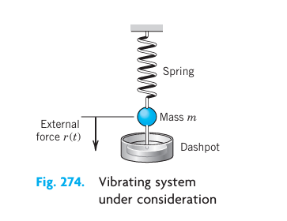{#fig-11-274}

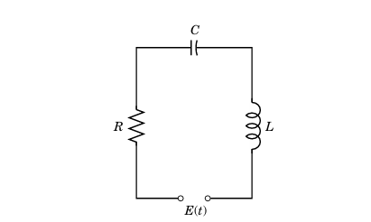{#fig-11-275}

### EXAMPLE 1 Forced Oscillations under a Nonsinusoidal Periodic Driving Force {#ex-11-3-1}
In (@eq-11-3-1), let $m = 1$ g, $c = 0.05$ g/sec, and $k = 25$ g/sec$^2$, so that (@eq-11-3-1) becomes:
$$
y'' + 0.05 y' + 25 y = r(t)
$$ {#eq-11-3-2}
where $r(t)$ is measured in g$\cdot$cm/sec$^2$. Let (@fig-11-276):
$$
r(t) = \begin{cases} t + \pi/2 & \text{if } -\pi < t < 0 \\ -t + \pi/2 & \text{if } 0 < t < \pi \end{cases} \quad \text{and} \quad r(t + 2\pi) = r(t)
$$ {#eq-11-3-3}
Find the steady-state solution $y(t)$.

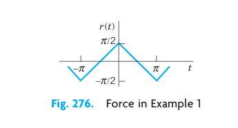{#fig-11-276}

**Solution.** We represent $r(t)$ by a Fourier series, finding:
$$
r(t) = \frac{4}{\pi} \left( \cos t + \frac{1}{9} \cos 3t + \frac{1}{25} \cos 5t + \dots \right)
$$ {#eq-11-3-4}
Then we consider the ODE:
$$
y'' + 0.05 y' + 25 y = \frac{4}{n^2 \pi} \cos nt \quad (n = 1, 3, 5, \dots)
$$ {#eq-11-3-5}
whose right side is a single term of the series (@eq-11-3-4). From Sec. 2.8 we know that the steady-state solution $y_n(t)$ of (@eq-11-3-5) is of the form:
$$
y_n(t) = A_n \cos nt + B_n \sin nt
$$ {#eq-11-3-6}
By substituting this into (@eq-11-3-5) we find that:
$$
A_n = \frac{4(25 - n^2)}{n^2 \pi D_n}, \quad B_n = \frac{4(0.05 n)}{n^2 \pi D_n}
$$ {#eq-11-3-7}
where
$$
D_n = (25 - n^2)^2 + (0.05 n)^2
$$ {#eq-11-3-8}
Since the ODE (@eq-11-3-2) is linear, we may expect the steady-state solution to be:
$$
y(t) = y_1(t) + y_3(t) + y_5(t) + \dots
$$ {#eq-11-3-9}
where $y_n(t)$ is given by (@eq-11-3-6) and (@eq-11-3-7). In fact, this follows readily by substituting (@eq-11-3-9) into (@eq-11-3-2) and using the Fourier series of $r(t)$, provided that termwise differentiation of (@eq-11-3-9) is permissible. (Readers already familiar with the notion of uniform convergence [Sec. 15.5] may prove that (@eq-11-3-9) may be differentiated term by term.)

From (@eq-11-3-7) we find that the amplitude of (@eq-11-3-6) is (a factor $\sqrt{D_n}$ cancels out):
$$
C_n = \sqrt{A_n^2 + B_n^2} = \frac{4}{n^2 \pi \sqrt{D_n}}
$$
Values of the first few amplitudes are:
$$
C_1 = 0.0531, \quad C_3 = 0.0088, \quad C_5 = 0.2037, \quad C_7 = 0.0011, \quad C_9 = 0.0003
$$
@fig-11-277 shows the input (multiplied by 0.1) and the output. For $n = 5$ the quantity $D_n$ is very small, the denominator of $C_5$ is small, and $C_5$ is so large that $y_5$ is the dominating term in (@eq-11-3-9). Hence the output is almost a harmonic oscillation of five times the frequency of the driving force, a little distorted due to the term $y_1$, whose amplitude is about 25% of that of $y_5$. You could make the situation still more extreme by decreasing the damping constant $c$. Try it. $\blacksquare$

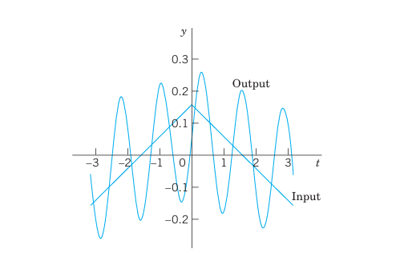{#fig-11-277}

## Problem Set 11.3 {#sec-problem-set-11-3}

1. **Coefficients $C_n$.** Derive the formula for $C_n$ from $A_n$ and $B_n$.
2. **Change of spring and damping.** In Example 1, what happens to the amplitudes $C_n$ if we take a stiffer spring, say, of $k=49$? If we increase the damping?
3. **Phase shift.** Explain the role of the $B_n$'s. What happens if we let $c \to 0$?
4. **Differentiation of input.** In Example 1, what happens if we replace $r(t)$ with its derivative, the rectangular wave? What is the ratio of the new $C_n$ to the old ones?
5. **Sign of coefficients.** Some of the $A_n$ in Example 1 are positive, some negative. All $B_n$ are positive. Is this physically understandable?

### 6–11 GENERAL SOLUTION
Find a general solution of the ODE $y'' + \omega^2 y = r(t)$ with $r(t)$ as given. Show the details of your work.
6. $r(t) = \sin at + \sin bt, \quad \omega^2 \neq a^2, b^2$
7. $r(t) = \sin t, \quad \omega = 0.5, 0.9, 1.1, 1.5, 10$
8. **Rectifier.** $r(t) = \frac{\pi}{4} |\cos t| \quad \text{if } -\pi < t < \pi \quad \text{and} \quad r(t+2\pi) = r(t), \quad |\omega| \neq 0, 2, 4, \dots$
9. What kind of solution is excluded in Prob. 8 by $|\omega| \neq 0, 2, 4, \dots$?
10. **Rectifier.** $r(t) = \frac{\pi}{4} |\sin t| \quad \text{if } 0 < t < 2\pi \quad \text{and} \quad r(t+2\pi) = r(t), \quad |\omega| \neq 0, 2, 4, \dots$
11. $r(t) = \begin{cases} -1 & \text{if } -\pi < t < 0 \\ 1 & \text{if } 0 < t < \pi \end{cases} \quad \text{and} \quad r(t+2\pi) = r(t), \quad |\omega| \neq 1, 3, 5, \dots$
12. **CAS Program.** Write a program for solving the ODE and for jointly graphing input and output of an initial value problem involving that ODE. Apply the program to Probs. 7 and 11 with initial values of your choice.

### 13–16 STEADY-STATE DAMPED OSCILLATIONS
Find the steady-state oscillations of $y'' + c y' + y = r(t)$ with $c > 0$ and $r(t)$ as given. Show the details. In Probs. 14–16 sketch $r(t)$.
13. $r(t) = \sum_{n=1}^{N} (a_n \cos nt + b_n \sin nt)$
14. $r(t) = \begin{cases} -1 & \text{if } -\pi < t < 0 \\ 1 & \text{if } 0 < t < \pi \end{cases} \quad \text{and} \quad r(t+2\pi) = r(t)$
15. $r(t) = t(\pi^2 - t^2) \quad (-\pi < t < \pi) \quad \text{and} \quad r(t+2\pi) = r(t)$
16. $r(t) = \begin{cases} t & \text{if } -\pi/2 < t < \pi/2 \\ \pi - t & \text{if } \pi/2 < t < 3\pi/2 \end{cases} \quad \text{and} \quad r(t+2\pi) = r(t)$

### 17–19 RLC-CIRCUIT
Find the steady-state current $I(t)$ in the RLC-circuit in @fig-11-275, where $R = 10\ \Omega$, $L = 1$ H, $C = 10^{-4}$ F and with $E(t)$ V as follows and periodic with period $2\pi$. Graph or sketch the first four partial sums. Note that the coefficients of the solution decrease rapidly. *Hint.* Remember that the ODE contains $E'(t)$, not $E(t)$, cf. Sec. 2.9.
17. $E(t) = \begin{cases} -50t^2 & \text{if } -\pi < t < 0 \\ 50t^2 & \text{if } 0 < t < \pi \end{cases}$
18. $E(t) = \begin{cases} 100(t - t^2) & \text{if } -\pi < t < 0 \\ 100(t + t^2) & \text{if } 0 < t < \pi \end{cases}$
19. $E(t) = 200t(\pi^2 - t^2) \quad (-\pi < t < \pi)$

20. **CAS EXPERIMENT. Maximum Output Term.** Graph and discuss outputs of $y'' + c y' + k y = r(t)$ with $r(t)$ as in Example 1 for various $c$ and $k$ with emphasis on the maximum $C_n$ and its ratio to the second largest $|C_n|$.

## Approximation by Trigonometric Polynomials {#sec-approximation-trigonometric-polynomials}

Fourier series play a prominent role not only in differential equations but also in approximation theory, an area that is concerned with approximating functions by other functions—usually simpler functions. Here is how Fourier series come into the picture.

Let $f(x)$ be a function on the interval $-\pi \le x \le \pi$ that can be represented on this interval by a Fourier series. Then the $N$-th partial sum of the Fourier series
$$
f(x) \approx a_0 + \sum_{n=1}^{N} \left( a_n \cos nx + b_n \sin nx \right)
$$ {#eq-11-4-1}
is an approximation of the given $f(x)$. In (@eq-11-4-1) we choose an arbitrary $N$ and keep it fixed. Then we ask whether (@eq-11-4-1) is the "best" approximation of $f$ by a trigonometric polynomial of the same degree $N$, that is, by a function of the form
$$
F(x) = A_0 + \sum_{n=1}^{N} \left( A_n \cos nx + B_n \sin nx \right) \quad (N \text{ fixed})
$$ {#eq-11-4-2}
Here, "best" means that the "error" of the approximation is as small as possible.

Of course we must first define what we mean by the error of such an approximation. We could choose the maximum of $|f(x) - F(x)|$. But in connection with Fourier series it is better to choose a definition of error that measures the goodness of agreement between $f$ and $F$ on the whole interval $-\pi \le x \le \pi$. This is preferable since the sum $f$ of a Fourier series may have jumps: $F$ in @fig-11-278 is a good overall approximation of $f$, but the maximum of $|f(x) - F(x)|$ (more precisely, the supremum) is large. We choose
$$
E = \int_{-\pi}^{\pi} (f - F)^2 \, dx
$$ {#eq-11-4-3}

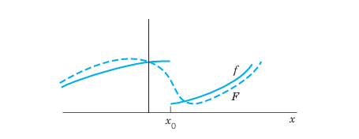{#fig-11-278}

This is called the **square error** of $F$ relative to the function $f$ on the interval $-\pi \le x \le \pi$. Clearly, $E \ge 0$.

$N$ being fixed, we want to determine the coefficients in (@eq-11-4-2) such that $E$ is minimum. Since $(f - F)^2 = f^2 - 2fF + F^2$, we have
$$
E = \int_{-\pi}^{\pi} f^2 \, dx - 2 \int_{-\pi}^{\pi} fF \, dx + \int_{-\pi}^{\pi} F^2 \, dx
$$ {#eq-11-4-4}

We square (@eq-11-4-2), insert it into the last integral in (@eq-11-4-4), and evaluate the occurring integrals. This gives integrals of $\cos^2 nx$ and $\sin^2 nx$ ($n \ge 1$), which equal $\pi$, and integrals of $\cos nx$, $\sin nx$, and $(\cos nx)(\sin mx)$, which are zero (just as in @sec-fourier-series). Thus
$$
\int_{-\pi}^{\pi} F^2 \, dx = \int_{-\pi}^{\pi} \left[ A_0 + \sum_{n=1}^{N} \left( A_n \cos nx + B_n \sin nx \right) \right]^2 \, dx
$$
$$
= \pi \left( 2A_0^2 + A_1^2 + \dots + A_N^2 + B_1^2 + \dots + B_N^2 \right)
$$

We now insert (@eq-11-4-2) into the integral of $fF$ in (@eq-11-4-4). This gives integrals of $f \cos nx$ as well as $f \sin nx$, just as in Euler's formulas, @sec-fourier-series, for $a_n$ and $b_n$ (each multiplied by $A_n$ or $B_n$). Hence
$$
\int_{-\pi}^{\pi} fF \, dx = \pi \left( 2A_0 a_0 + A_1 a_1 + \dots + A_N a_N + B_1 b_1 + \dots + B_N b_N \right)
$$

With these expressions, (@eq-11-4-4) becomes
$$
E = \int_{-\pi}^{\pi} f^2 \, dx - 2\pi \left[ 2A_0 a_0 + \sum_{n=1}^{N} \left( A_n a_n + B_n b_n \right) \right] + \pi \left[ 2A_0^2 + \sum_{n=1}^{N} \left( A_n^2 + B_n^2 \right) \right]
$$ {#eq-11-4-5}

We now take $A_n = a_n$ and $B_n = b_n$ in (@eq-11-4-2). Then in (@eq-11-4-5) the last term cancels half of the second term. Hence for this choice of the coefficients of $F$ the square error, call it $E^*$, is
$$
E^* = \int_{-\pi}^{\pi} f^2 \, dx - \pi \left[ 2a_0^2 + \sum_{n=1}^{N} \left( a_n^2 + b_n^2 \right) \right]
$$ {#eq-11-4-6}

We finally subtract (@eq-11-4-6) from (@eq-11-4-5). Then the integrals drop out and we get terms $A_n^2 - 2A_n a_n + a_n^2 = (A_n - a_n)^2$ and similar terms $(B_n - b_n)^2$:
$$
E - E^* = \pi \left\{ 2(A_0 - a_0)^2 + \sum_{n=1}^{N} \left[ (A_n - a_n)^2 + (B_n - b_n)^2 \right] \right\}
$$

Since the sum of squares of real numbers on the right cannot be negative, $E - E^* \ge 0$, thus
$$
E \ge E^*
$$
and $E = E^*$ if and only if $A_0 = a_0, \dots, B_N = b_N$. This proves the following fundamental minimum property of the partial sums of Fourier series.

### THEOREM 1 Minimum Square Error {#thm-11-4-1}
The square error of $F$ in (@eq-11-4-2) (with fixed $N$) relative to $f$ on the interval $-\pi \le x \le \pi$ is minimum if and only if the coefficients of $F$ in (@eq-11-4-2) are the Fourier coefficients of $f$. This minimum value $E^*$ is given by (@eq-11-4-6).

From (@eq-11-4-6) we see that $E^*$ cannot increase as $N$ increases, but may decrease. Hence with increasing $N$ the partial sums of the Fourier series of $f$ yield better and better approximations to $f$, considered from the viewpoint of the square error.

Since $E^* \ge 0$ and (@eq-11-4-6) holds for every $N$, we obtain from (@eq-11-4-6) the important **Bessel's inequality**
$$
2a_0^2 + \sum_{n=1}^{N} \left( a_n^2 + b_n^2 \right) \le \frac{1}{\pi} \int_{-\pi}^{\pi} f(x)^2 \, dx
$$ {#eq-11-4-7}
for the Fourier coefficients of any function $f$ for which the integral on the right exists. (For F. W. Bessel see <!-- TODO: replace Sec. 5.5 with actual link -->Sec. 5.5.)

It can be shown (see <!-- TODO: replace C12 in App. 1 with actual link -->[C12] in App. 1) that for such a function $f$, **Parseval's theorem** holds; that is, formula (@eq-11-4-7) holds with the equality sign, so that it becomes **Parseval's identity**
$$
2a_0^2 + \sum_{n=1}^{\infty} \left( a_n^2 + b_n^2 \right) = \frac{1}{\pi} \int_{-\pi}^{\pi} f(x)^2 \, dx
$$ {#eq-11-4-8}

### EXAMPLE 1 Minimum Square Error for the Sawtooth Wave {#ex-11-4-1}
Compute the minimum square error $E^*$ of $F(x)$ with $N = 1, 2, \dots, 10, 20, \dots, 100$ and $1000$ relative to
$$
f(x) = x + \pi \quad (-\pi < x < \pi)
$$
on the interval $-\pi \le x \le \pi$.

**Solution.**
$$
F(x) = \pi + 2 \left( \sin x - \frac{1}{2} \sin 2x + \frac{1}{3} \sin 3x - + \dots + \frac{(-1)^{N+1}}{N} \sin Nx \right)
$$
by Example 5 in @sec-arbitrary-period-even-odd-functions. From this and (@eq-11-4-6),
$$
E^* = \int_{-\pi}^{\pi} (x + \pi)^2 \, dx - \pi \left[ 2\pi^2 + 4 \sum_{n=1}^{N} \frac{1}{n^2} \right]
$$

Numeric values are:

| $N$ | $E^*$ | $N$ | $E^*$ | $N$ | $E^*$ | $N$ | $E^*$ |
|---|---|---|---|---|---|---|---|
| 1 | 8.1045 | 6 | 1.9295 | 20 | 0.6129 | 70 | 0.1782 |
| 2 | 4.9629 | 7 | 1.6730 | 30 | 0.4120 | 80 | 0.1561 |
| 3 | 3.5666 | 8 | 1.4767 | 40 | 0.3103 | 90 | 0.1389 |
| 4 | 2.7812 | 9 | 1.3216 | 50 | 0.2488 | 100 | 0.1250 |
| 5 | 2.2786 | 10 | 1.1959 | 60 | 0.2077 | 1000 | 0.0126 |

$F = S_1, S_2, S_3$ are shown in Fig. 269 in @sec-arbitrary-period-even-odd-functions, and $F = S_{20}$ is shown in @fig-11-279. Although $|f(x) - F(x)|$ is large at the endpoints $-\pi$ and $\pi$ (how large?), where $f$ is discontinuous, $F$ approximates $f$ quite well on the whole interval, except near $\pm\pi$, where "waves" remain owing to the **Gibbs phenomenon**, which we shall discuss in the next section.

Can you think of functions $f$ for which $E^*$ decreases more quickly with increasing $N$? $\blacksquare$

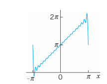{#fig-11-279}

---

## Problem Set 11.4 {#sec-problem-set-11-4}

1. **CAS Problem.** Do the numeric and graphic work in Example 1 in the text.
2. **factors on which the decrease of $E^*$ with $N$ depends.** For each function considered find the smallest $N$ such that $E^* < 0.1$.

### 2–5 MINIMUM SQUARE ERROR
Find the trigonometric polynomial $F(x)$ of the form (@eq-11-4-2) for which the square error with respect to the given $f(x)$ on the interval $-\pi < x < \pi$ is minimum. Compute the minimum value for $N = 1, 2, \dots, 5$ (or also for larger values if you have a CAS).
2. $f(x) = x \quad (-\pi < x < \pi)$
3. $f(x) = |x| \quad (-\pi < x < \pi)$
4. $f(x) = x^2 \quad (-\pi < x < \pi)$
5. $f(x) = \begin{cases} -1 & \text{if } -\pi < x < 0 \\ 1 & \text{if } 0 < x < \pi \end{cases}$

6. **Why are the square errors in Prob. 5 substantially larger than in Prob. 3?**
7. $f(x) = x^3 \quad (-\pi < x < \pi)$
8. $f(x) = |\sin x| \quad (-\pi < x < \pi)$, full-wave rectifier.
9. **Monotonicity.** Show that the minimum square error (@eq-11-4-6) is a monotone decreasing function of $N$. How can you use this in practice?
10. **CAS EXPERIMENT. Size and Decrease of $E^*$.** Compare the size of the minimum square error $E^*$ for functions of your choice. Find experimentally the factors on which the decrease of $E^*$ with $N$ depends.

### 11–15 PARSEVAL'S IDENTITY
Using (@eq-11-4-8), prove that the series has the indicated sum. Compute the first few partial sums to see that the convergence is rapid.
11. $1 + \frac{1}{3^2} + \frac{1}{5^2} + \dots = \frac{\pi^2}{8} \approx 1.233700550$. (Use Example 1 in @sec-fourier-series).
12. $1 + \frac{1}{2^4} + \frac{1}{3^4} + \dots = \frac{\pi^4}{90} \approx 1.082323234$. (Use Prob. 14 in @sec-fourier-series).
13. $1 + \frac{1}{3^4} + \frac{1}{5^4} + \frac{1}{7^4} + \dots = \frac{\pi^4}{96} \approx 1.014678032$. (Use Prob. 17 in @sec-fourier-series).
14. $\int_{-\pi}^{\pi} \cos^4 x \, dx = \frac{3\pi}{4}$.
15. $\int_{-\pi}^{\pi} \cos^6 x \, dx = \frac{5\pi}{8}$.

## Sturm–Liouville Problems. Orthogonal Functions {#sec-sturm-liouville-problems}

The idea of the Fourier series was to represent general periodic functions in terms of cosines and sines. The latter formed a trigonometric system. This trigonometric system has the desirable property of orthogonality which allows us to compute the coefficients of the Fourier series by the Euler formulas.

The question then arises, can this approach be generalized? That is, can we replace the trigonometric system of @sec-fourier-series by other orthogonal systems (sets of other orthogonal functions)? The answer is "yes" and will lead to generalized Fourier series, including the Fourier–Legendre series and the Fourier–Bessel series in @sec-orthogonal-series.

To prepare for this generalization, we first have to introduce the concept of a **Sturm–Liouville Problem**. (The motivation for this approach will become clear as you read on.)

Consider a second-order ODE of the form
$$
\left[ p(x) y' \right]' + \left[ q(x) + \lambda r(x) \right] y = 0
$$ {#eq-11-5-1}
on some interval $a \le x \le b$, satisfying boundary conditions of the form
$$
\begin{aligned}
(a) \quad k_1 y + k_2 y' &= 0 \quad \text{at } x = a \\
(b) \quad l_1 y + l_2 y' &= 0 \quad \text{at } x = b
\end{aligned}
$$ {#eq-11-5-2}
Here $\lambda$ is a parameter, and $k_1, k_2, l_1, l_2$ are given real constants. Furthermore, at least one constant in each condition (@eq-11-5-2) must be different from zero. (We will see in Example 1 that, if $p(x) = r(x) = 1$ and $q(x) = 0$, then $\sin \sqrt{\lambda} x$ and $\cos \sqrt{\lambda} x$ satisfy (@eq-11-5-1) and constants can be found to satisfy (@eq-11-5-2).) Equation (@eq-11-5-1) is known as a **Sturm–Liouville equation**.[^4] Together with conditions ((@eq-11-5-2)) and ((@eq-11-5-2)), it is known as the **Sturm–Liouville problem**. It is an example of a **boundary value problem**.

A boundary value problem consists of an ODE and given boundary conditions referring to the two boundary points (endpoints) $x = a$ and $x = b$ of a given interval $a \le x \le b$.

### Eigenvalues, Eigenfunctions
Clearly, $y \equiv 0$ is a solution—the "trivial solution"—of the problem (@eq-11-5-1), (@eq-11-5-2) for any $\lambda$ because (@eq-11-5-1) is homogeneous and (@eq-11-5-2) has zeros on the right. This is of no interest. We want to find **eigenfunctions** $y(x)$, that is, solutions of (@eq-11-5-1) satisfying (@eq-11-5-2) without being identically zero. We call a number $\lambda$ for which an eigenfunction exists an **eigenvalue** of the Sturm–Liouville problem (@eq-11-5-1), (@eq-11-5-2).

Many important ODEs in engineering can be written as Sturm–Liouville equations. The following example serves as a case in point.

### EXAMPLE 1 Trigonometric Functions as Eigenfunctions. Vibrating String {#ex-11-5-1}
Find the eigenvalues and eigenfunctions of the Sturm–Liouville problem
$$
y'' + \lambda y = 0, \quad y(0) = 0, \quad y(\pi) = 0
$$ {#eq-11-5-3}
This problem arises, for instance, if an elastic string (a violin string, for example) is stretched a little and fixed at its ends $x = 0$ and $x = \pi$ and then allowed to vibrate. Then $y(x)$ is the "space function" of the deflection $u(x, t)$ of the string, assumed in the form $u(x, t) = y(x) w(t)$, where $t$ is time. (This model will be discussed in great detail in <!-- TODO: replace Secs. 12.2–12.4 with actual links -->Secs. 12.2–12.4.)

**Solution.** From (@eq-11-5-1) and (@eq-11-5-2) we see that $p = 1, q = 0, r = 1$ in (@eq-11-5-1), and $a = 0, b = \pi, k_1 = 1, k_2 = 0, l_1 = 1, l_2 = 0$ in (@eq-11-5-2).

For negative $\lambda = -\mu^2$ ($\mu > 0$), a general solution of the ODE in (@eq-11-5-3) is $y(x) = c_1 e^{\mu x} + c_2 e^{-\mu x}$. From the boundary conditions we obtain $c_1 = c_2 = 0$, so that $y \equiv 0$, which is not an eigenfunction.

For $\lambda = 0$ the situation is similar.

For positive $\lambda = \mu^2$ ($\mu > 0$), a general solution is
$$
y(x) = A \cos \mu x + B \sin \mu x
$$
From the first boundary condition we obtain $y(0) = A = 0$. The second boundary condition then yields:
$$
y(\pi) = B \sin \mu \pi = 0
$$
Since we want $y \not\equiv 0$, we must choose $B \neq 0$, which requires $\sin \mu \pi = 0$, thus:
$$
\mu = 1, 2, 3, \dots
$$
For $\mu = 0$ we have $y \equiv 0$. For $\lambda = \mu^2 = 1, 4, 9, 16, \dots$, taking $B = 1$, we obtain
$$
y(x) = \sin n x \quad (n = \mu = 1, 2, \dots)
$$
Hence the eigenvalues of the problem are $\lambda = n^2$, where $n = 1, 2, \dots$, and corresponding eigenfunctions are
$$
y_n(x) = \sin n x \quad (n = 1, 2, \dots)
$$
$\blacksquare$

Note that the solution to this problem is precisely the trigonometric system of the Fourier series considered earlier. It can be shown that, under rather general conditions on the functions $p, q, r$ in (@eq-11-5-1), the Sturm–Liouville problem (@eq-11-5-1), (@eq-11-5-2) has infinitely many eigenvalues. The corresponding rather complicated theory can be found in <!-- TODO: replace Ref. [A11] with actual link -->Ref. [A11] listed in App. 1.

Furthermore, if $p, q, r$, and $p'$ in (@eq-11-5-1) are real-valued and continuous on the interval $a \le x \le b$ and $r(x)$ is positive throughout that interval (or negative throughout that interval), then all the eigenvalues of the Sturm–Liouville problem (@eq-11-5-1), (@eq-11-5-2) are real. (Proof in <!-- TODO: replace App. 4 with actual link -->App. 4.) This is what the engineer would expect since eigenvalues are often related to frequencies, energies, or other physical quantities that must be real.

The most remarkable and important property of eigenfunctions of Sturm–Liouville problems is their **orthogonality**, which will be crucial in series developments in terms of eigenfunctions, as we shall see in the next section. This suggests that we should next consider orthogonal functions.

### Orthogonal Functions
Functions $y_1(x), y_2(x), \dots$ defined on some interval $a \le x \le b$ are called **orthogonal** on this interval with respect to the weight function $r(x) > 0$ if for all $m$ and all $n$ different from $m$,
$$
(y_m, y_n) = \int_a^b r(x) y_m(x) y_n(x) \, dx = 0 \quad (m \neq n)
$$ {#eq-11-5-4}
$(y_m, y_n)$ is a standard notation for this integral. The **norm** $\|y_m\|$ of $y_m$ is defined by
$$
\|y_m\| = \sqrt{(y_m, y_m)} = \sqrt{\int_a^b r(x) y_m^2(x) \, dx}
$$ {#eq-11-5-5}
Note that this is the square root of the integral in (@eq-11-5-4) with $n = m$.

The functions $y_1, y_2, \dots$ are called **orthonormal** on $a \le x \le b$ if they are orthogonal on this interval and all have norm 1. Then we can write (@eq-11-5-4) and (@eq-11-5-5) jointly by using the Kronecker symbol[^6] $\delta_{mn}$, namely,
$$
(y_m, y_n) = \int_a^b r(x) y_m(x) y_n(x) \, dx = \delta_{mn} = \begin{cases} 0 & \text{if } m \neq n \\ 1 & \text{if } m = n \end{cases}
$$

If $r(x) = 1$, we more briefly call the functions orthogonal instead of orthogonal with respect to $r(x) = 1$; similarly for orthonormality. Then
$$
(y_m, y_n) = \int_a^b y_m(x) y_n(x) \, dx = 0 \quad (m \neq n), \quad \|y_m\| = \sqrt{(y_m, y_m)} = \sqrt{\int_a^b y_m^2(x) \, dx}
$$

The next example serves as an illustration of the material on orthogonal functions just discussed.

### EXAMPLE 2 Orthogonal Functions. Orthonormal Functions. Notation {#ex-11-5-2}
The functions $y_m(x) = \sin mx$, $m = 1, 2, \dots$ form an orthogonal set on the interval $-\pi \le x \le \pi$, because for $m \neq n$ we obtain by integration (see formula (11) in <!-- TODO: replace App. A3.1 with actual link -->App. A3.1):
$$
(y_m, y_n) = \int_{-\pi}^{\pi} \sin mx \sin nx \, dx = \frac{1}{2} \int_{-\pi}^{\pi} \cos (m - n)x \, dx - \frac{1}{2} \int_{-\pi}^{\pi} \cos (m + n)x \, dx = 0 \quad (m \neq n)
$$
The norm $\|y_m\| = \sqrt{(y_m, y_m)}$ equals $\sqrt{\pi}$ because
$$
\|y_m\|^2 = (y_m, y_m) = \int_{-\pi}^{\pi} \sin^2 mx \, dx = \pi \quad (m = 1, 2, \dots)
$$
Hence the corresponding orthonormal set, obtained by division by the norm, is
$$
\frac{\sin x}{\sqrt{\pi}}, \quad \frac{\sin 2x}{\sqrt{\pi}}, \quad \frac{\sin 3x}{\sqrt{\pi}}, \quad \dots
$$
$\blacksquare$

Theorem 1 shows that for any Sturm–Liouville problem, the eigenfunctions associated with these problems are orthogonal. This means, in practice, if we can formulate a problem as a Sturm–Liouville problem, then by this theorem we are guaranteed orthogonality.

### THEOREM 2 Orthogonality of Eigenfunctions of Sturm–Liouville Problems {#thm-11-5-2}
Suppose that the functions $p, q, r$, and $p'$ in the Sturm–Liouville equation (@eq-11-5-1) are real-valued and continuous and $r(x) > 0$ on the interval $a \le x \le b$. Let $y_m(x)$ and $y_n(x)$ be eigenfunctions of the Sturm–Liouville problem (@eq-11-5-1), (@eq-11-5-2) that correspond to different eigenvalues $\lambda_m$ and $\lambda_n$, respectively. Then $y_m, y_n$ are orthogonal on that interval with respect to the weight function $r$, that is,
$$
(y_m, y_n) = \int_a^b r(x) y_m(x) y_n(x) \, dx = 0 \quad (m \neq n)
$$ {#eq-11-5-6}
If $p(a) = 0$, then ((@eq-11-5-2)) can be dropped from the problem. If $p(b) = 0$, then ((@eq-11-5-2)) can be dropped. [It is then required that $y$ and $y'$ remain bounded at such a point, and the problem is called **singular**, as opposed to a regular problem in which (@eq-11-5-2) is used.]

If $p(a) = p(b)$, then (@eq-11-5-2) can be replaced by the "periodic boundary conditions"
$$
y(a) = y(b), \quad y'(a) = y'(b)
$$ {#eq-11-5-7}
The boundary value problem consisting of the Sturm–Liouville equation (@eq-11-5-1) and the periodic boundary conditions (@eq-11-5-7) is called a **periodic Sturm–Liouville problem**.

**PROOF** By assumption, $y_m$ and $y_n$ satisfy the Sturm–Liouville equations
$$
(p y_m')' + (q + \lambda_m r) y_m = 0
$$
$$
(p y_n')' + (q + \lambda_n r) y_n = 0
$$
respectively. We multiply the first equation by $y_n$, the second by $-y_m$, and add:
$$
(\lambda_m - \lambda_n) r y_m y_n = y_n (p y_m')' - y_m (p y_n')' = \left[ p (y_m' y_n - y_m y_n') \right]'
$$
where the last equality can be readily verified by performing the indicated differentiation of the expression in brackets. This expression is continuous on $a \le x \le b$ since $p$ and $p'$ are continuous by assumption and $y_m, y_n$ are solutions of (@eq-11-5-1). Integrating over $x$ from $a$ to $b$, we thus obtain
$$
(\lambda_m - \lambda_n) \int_a^b r y_m y_n \, dx = \left[ p (y_m' y_n - y_m y_n') \right]_a^b \quad (a < b)
$$ {#eq-11-5-8}
The expression on the right equals the sum of the subsequent Lines 1 and 2:
$$
\begin{aligned}
&\phantom{-}p(b) \left[ y_m'(b) y_n(b) - y_m(b) y_n'(b) \right] \quad (\text{Line 1}) \\
&-p(a) \left[ y_m'(a) y_n(a) - y_m(a) y_n'(a) \right] \quad (\text{Line 2})
\end{aligned}
$$ {#eq-11-5-9}
Hence if (@eq-11-5-9) is zero, (@eq-11-5-8) with $\lambda_m - \lambda_n \neq 0$ implies the orthogonality (@eq-11-5-6). Accordingly, we have to show that (@eq-11-5-9) is zero, using the boundary conditions (@eq-11-5-2) as needed.

**Case 1. $p(a) = p(b) = 0$.** Clearly, (@eq-11-5-9) is zero, and (@eq-11-5-2) is not needed.

**Case 2. $p(a) \neq 0, p(b) = 0$.** Line 1 of (@eq-11-5-9) is zero. Consider Line 2. From ((@eq-11-5-2)) we have:
$$
\begin{aligned}
k_1 y_n(a) + k_2 y_n'(a) &= 0 \\
k_1 y_m(a) + k_2 y_m'(a) &= 0
\end{aligned}
$$
Let $k_2 \neq 0$. We multiply the first equation by $y_m(a)$, the second by $-y_n(a)$ and add:
$$
k_2 \left[ y_m'(a) y_n(a) - y_m(a) y_n'(a) \right] = 0
$$
This is $k_2$ times Line 2 of (@eq-11-5-9), which thus is zero since $k_2 \neq 0$. If $k_2 = 0$, then $k_1 \neq 0$ by assumption, and the argument of proof is similar.

**Case 3. $p(a) = 0, p(b) \neq 0$.** Line 2 of (@eq-11-5-9) is zero. From ((@eq-11-5-2)) it follows that Line 1 of (@eq-11-5-9) is zero; this is similar to Case 2.

**Case 4. $p(a) \neq 0, p(b) \neq 0$.** We use both ((@eq-11-5-2)) and ((@eq-11-5-2)) and proceed as in Cases 2 and 3.

**Case 5. $p(a) = p(b)$.** Then (@eq-11-5-9) becomes:
$$
p(b) \left[ y_m'(b) y_n(b) - y_m(b) y_n'(b) - y_m'(a) y_n(a) + y_m(a) y_n'(a) \right]
$$
The expression in brackets $[ \dots ]$ is zero, either by (@eq-11-5-2) used as before, or more directly by (@eq-11-5-7). Hence in this case, (@eq-11-5-7) can be used instead of (@eq-11-5-2), as claimed. This completes the proof of Theorem 2. $\blacksquare$

### EXAMPLE 3 Application of Theorem 2. Vibrating String {#ex-11-5-3}
The ODE in Example 1 is a Sturm–Liouville equation with $p = 1, q = 0$, and $r = 1$. From Theorem 2 it follows that the eigenfunctions $y_m = \sin mx$ ($m = 1, 2, \dots$) are orthogonal on the interval $0 \le x \le \pi$. $\blacksquare$

Example 3 confirms, from this new perspective, that the trigonometric system underlying the Fourier series is orthogonal, as we knew from @sec-fourier-series.

### EXAMPLE 4 Application of Theorem 2. Orthogonality of the Legendre Polynomials {#ex-11-5-4}
Legendre’s equation $(1 - x^2) y'' - 2x y' + n(n + 1) y = 0$ may be written:
$$
\left[ (1 - x^2) y' \right]' + \lambda y = 0, \quad \lambda = n(n + 1)
$$
Hence, this is a Sturm–Liouville equation (@eq-11-5-1) with $p = 1 - x^2$, $q = 0$, and $r = 1$. Since $p(-1) = p(1) = 0$, we need no boundary conditions, but have a "singular" Sturm–Liouville problem on the interval $-1 \le x \le 1$. We know that for $n = 0, 1, \dots$, hence $\lambda = 0, 1 \cdot 2, 2 \cdot 3, \dots$, the Legendre polynomials $P_n(x)$ are solutions of the problem. Hence these are the eigenfunctions. From Theorem 2 it follows that they are orthogonal on that interval, that is:
$$
\int_{-1}^{1} P_m(x) P_n(x) \, dx = 0 \quad (m \neq n)
$$ {#eq-11-5-10}
$\blacksquare$

What we have seen is that the trigonometric system, underlying the Fourier series, is a solution to a Sturm–Liouville problem, as shown in Example 1, and that this trigonometric system is orthogonal, which we knew from @sec-fourier-series and confirmed in Example 3.

[^4]: JACQUES CHARLES FRANÇOIS STURM (1803–1855) was born and studied in Switzerland and then moved to Paris, where he later became the successor of Poisson in the chair of mechanics at the Sorbonne (the University of Paris).
[^6]: LEOPOLD KRONECKER (1823–1891), German mathematician at Berlin University, who made important contributions to algebra, group theory, and number theory.

---

## Problem Set 11.5 {#sec-problem-set-11-5}

1. **Proof of Theorem 2.** Carry out the details in Cases 3 and 4.
2. **Normalization of eigenfunctions.** Normalization of eigenfunctions $y_m$ of (@eq-11-5-1), (@eq-11-5-2) means that we multiply $y_m$ by a nonzero constant $c_m$ such that $c_m y_m$ has norm 1. Show that $z_m = c_m y_m$ with any $c_m \neq 0$ is an eigenfunction for the eigenvalue corresponding to $y_m$.
3. **Change of $x$.** Show that if the functions $y_0(x), y_1(x), \dots$ form an orthogonal set on an interval $a \le x \le b$ (with $r(x) = 1$), then the functions $y_0(ct + k), y_1(ct + k), \dots$, $c > 0$, form an orthogonal set on the interval $(a - k)/c \le t \le (b - k)/c$.
4. **Change of $x$.** Using Prob. 3, derive the orthogonality of $1, \cos \pi x, \sin \pi x, \cos 2\pi x, \sin 2\pi x, \dots$ on $-1 \le x \le 1$ ($r(x) = 1$) from that of $1, \cos x, \sin x, \cos 2x, \sin 2x, \dots$ on $-\pi \le x \le \pi$.
5. **Legendre polynomials.** Show that the functions $P_n(\cos u)$, $n = 0, 1, \dots$, form an orthogonal set on the interval $0 \le u \le \pi$ with respect to the weight function $\sin u$.
6. **Transformation to Sturm–Liouville form.** Show that $y'' + f(x) y' + (g(x) + \lambda h(x)) y = 0$ takes the form (@eq-11-5-1) if you set $p = \exp(\int f \, dx)$, $q = pg$, $r = hp$. Why would you do such a transformation?

### 7–13 STURM–LIOUVILLE PROBLEMS
Find the eigenvalues and eigenfunctions. Verify orthogonality. Start by writing the ODE in the form (@eq-11-5-1), using Prob. 6. Show details of your work.
7. $y'' + \lambda y = 0, \quad y(0) = 0, \quad y(10) = 0$
8. $y'' + \lambda y = 0, \quad y'(0) = 0, \quad y'(L) = 0$
9. $y'' + \lambda y = 0, \quad y(0) = 0, \quad y'(L) = 0$
10. $y'' + \lambda y = 0, \quad y(0) = y(1), \quad y'(0) = y'(1)$
11. $(x y')' + \frac{\lambda + 1}{x} y = 0, \quad y(1) = 0, \quad y(e^\pi) = 0$. (Set $x = e^t$).
12. $y'' - 2y' + (\lambda + 1) y = 0, \quad y(0) = 0, \quad y(1) = 0$
13. $y'' + 8y' + (\lambda + 16) y = 0, \quad y(0) = 0, \quad y(\pi) = 0$

### 14 TEAM PROJECT. Special Functions. Orthogonal Polynomials {#team-11-5-14}
Orthogonal polynomials play a great role in applications. For this reason, Legendre polynomials and various other orthogonal polynomials have been studied extensively; see <!-- TODO: replace Refs. [GenRef1], [GenRef10] in App. 1 with actual links -->Refs. [GenRef1], [GenRef10] in App. 1. Consider some of the most important ones as follows.
(a) **Chebyshev polynomials**[^cheby] of the first and second kind are defined by
$$
T_n(x) = \cos (n \arccos x)
$$
$$
U_n(x) = \frac{\sin [(n + 1) \arccos x]}{\sqrt{1 - x^2}}
$$
respectively, where $n = 0, 1, \dots$. Show that
$$
T_0 = 1, \quad T_1(x) = x, \quad T_2(x) = 2x^2 - 1, \quad T_3(x) = 4x^3 - 3x
$$
$$
U_0 = 1, \quad U_1(x) = 2x, \quad U_2(x) = 4x^2 - 1, \quad U_3(x) = 8x^3 - 4x
$$
Show that the Chebyshev polynomials $T_n(x)$ are orthogonal on the interval $-1 \le x \le 1$ with respect to the weight function $r(x) = \frac{1}{\sqrt{1 - x^2}}$. (Hint. To evaluate the integral, set $\arccos x = u$.) Verify that $T_n(x)$, $n = 0, 1, 2, 3$, satisfy the Chebyshev equation:
$$
(1 - x^2) y'' - x y' + n^2 y = 0
$$

(b) **Orthogonality on an infinite interval: Laguerre polynomials**[^laguerre] are defined by $L_0 = 1$, and
$$
L_n(x) = \frac{e^x}{n!} \frac{d^n}{dx^n} \left( x^n e^{-x} \right), \quad n = 1, 2, \dots
$$
Show that
$$
L_1(x) = 1 - x, \quad L_2(x) = 1 - 2x + \frac{1}{2} x^2, \quad L_3(x) = 1 - 3x + 3x^2 - \frac{1}{6} x^3
$$
Prove that the Laguerre polynomials are orthogonal on the positive axis $0 \le x < \infty$ with respect to the weight function $r(x) = e^{-x}$. (Hint. Since the highest power in $L_n$ is $x^n$, it suffices to show that $\int_0^\infty e^{-x} x^k L_n(x) \, dx = 0$ for $k < n$. Do this by $k$ integrations by parts.)

[^cheby]: PAFNUTY CHEBYSHEV (1821–1894), Russian mathematician, is particularly known for his important work in approximation theory, probability, and number theory.
[^laguerre]: EDMOND LAGUERRE (1834–1886), French mathematician, who contributed to geometry and analysis.

## Orthogonal Series. Generalized Fourier Series {#sec-orthogonal-series}

Fourier series are made up of the trigonometric system (@sec-fourier-series), which is orthogonal, and orthogonality was essential in obtaining the Euler formulas for the Fourier coefficients. Orthogonality will also give us coefficient formulas for the desired generalized Fourier series, including the Fourier–Legendre series and the Fourier–Bessel series. This generalization is as follows.

Let $y_0, y_1, y_2, \dots$ be orthogonal with respect to a weight function $r(x)$ on an interval $a \le x \le b$, and let $f(x)$ be a function that can be represented by a convergent series
$$
f(x) = \sum_{m=0}^{\infty} a_m y_m(x) = a_0 y_0(x) + a_1 y_1(x) + \dots
$$ {#eq-11-6-1}
This is called an **orthogonal series**, **orthogonal expansion**, or **generalized Fourier series**. If the $y_m$ are the eigenfunctions of a Sturm–Liouville problem, we call (@eq-11-6-1) an **eigenfunction expansion**. In (@eq-11-6-1) we use again $m$ for summation since $n$ will be used as a fixed order of Bessel functions.

Given $f(x)$, we have to determine the coefficients in (@eq-11-6-1), called the **Fourier constants** of $f(x)$ with respect to $y_0, y_1, \dots$. Because of the orthogonality, this is simple. Similarly to @sec-fourier-series, we multiply both sides of (@eq-11-6-1) by $r(x)y_n(x)$ ($n$ fixed) and then integrate on both sides from $a$ to $b$. We assume that term-by-term integration is permissible. (This is justified, for instance, in the case of "uniform convergence," as is shown in <!-- TODO: replace Sec. 15.5 with actual link -->Sec. 15.5.) Then we obtain:
$$
(f, y_n) = \int_a^b r f y_n \, dx = \int_a^b r \left( \sum_{m=0}^{\infty} a_m y_m \right) y_n \, dx = \sum_{m=0}^{\infty} a_m \int_a^b r y_m y_n \, dx = \sum_{m=0}^{\infty} a_m (y_m, y_n)
$$
Because of the orthogonality, all the integrals on the right are zero, except when $m = n$. Hence the whole infinite series reduces to the single term
$$
a_n (y_n, y_n) = a_n \|y_n\|^2
$$
Thus:
$$
(f, y_n) = a_n \|y_n\|^2
$$
Assuming that all the functions $y_n$ have nonzero norm, we can divide by $\|y_n\|^2$; writing again $m$ for $n$, to be in agreement with (@eq-11-6-1), we get the desired formula for the Fourier constants:
$$
a_m = \frac{(f, y_m)}{\|y_m\|^2} = \frac{1}{\|y_m\|^2} \int_a^b r(x) f(x) y_m(x) \, dx \quad (m = 0, 1, \dots)
$$ {#eq-11-6-2}
This formula generalizes the Euler formulas (6) in @sec-fourier-series as well as the principle of their derivation, namely, by orthogonality.

### EXAMPLE 1 Fourier–Legendre Series {#ex-11-6-1}
A **Fourier–Legendre series** is an eigenfunction expansion
$$
f(x) = \sum_{m=0}^{\infty} a_m P_m(x) = a_0 P_0 + a_1 P_1(x) + a_2 P_2(x) + \dots = a_0 \cdot 1 + a_1 x + a_2 \cdot \frac{1}{2} (3x^2 - 1) + \dots
$$
in terms of Legendre polynomials (<!-- TODO: replace Sec. 5.3 with actual link -->Sec. 5.3). The latter are the eigenfunctions of the Sturm–Liouville problem in Example 4 of @sec-sturm-liouville-problems on the interval $-1 \le x \le 1$. We have $r(x) = 1$ for Legendre’s equation, and (@eq-11-6-2) gives:
$$
a_m = \frac{2m + 1}{2} \int_{-1}^{1} f(x) P_m(x) \, dx, \quad m = 0, 1, \dots
$$ {#eq-11-6-3}
because the norm is
$$
\|P_m\|^2 = \int_{-1}^{1} P_m(x)^2 \, dx = \frac{2}{2m + 1} \quad (m = 0, 1, \dots)
$$ {#eq-11-6-4}
as we state without proof. The proof of (@eq-11-6-4) is tricky; it uses Rodrigues’s formula in <!-- TODO: replace Problem Set 5.2 with actual link -->Problem Set 5.2 and a reduction of the resulting integral to a quotient of gamma functions.

For instance, let $f(x) = \sin \pi x$. Then we obtain the coefficients:
$$
a_m = \frac{2m + 1}{2} \int_{-1}^{1} (\sin \pi x) P_m(x) \, dx
$$
Thus:
$$
a_1 = \frac{3}{2} \int_{-1}^{1} x \sin \pi x \, dx = \frac{3}{\pi} \approx 0.95493
$$
and similarly:
$$
a_3 \approx -1.15824, \quad a_5 \approx 0.21929, \quad a_7 \approx -0.01664, \dots
$$
Hence the Fourier–Legendre series of $\sin \pi x$ is:
$$
\sin \pi x \approx 0.95493 P_1(x) - 1.15824 P_3(x) + 0.21929 P_5(x) - 0.01664 P_7(x) + 0.00068 P_9(x) - 0.00001 P_{11}(x) + \dots
$$
The coefficient of $P_{13}$ is about $3 \times 10^{-7}$. The sum of the first three nonzero terms gives a curve that practically coincides with the sine curve. Can you see why the even-numbered coefficients are zero? Why $a_3$ is the absolutely biggest coefficient? $\blacksquare$

### EXAMPLE 2 Fourier–Bessel Series {#ex-11-6-2}
These series model vibrating membranes (<!-- TODO: replace Sec. 12.9 with actual link -->Sec. 12.9) and other physical systems of circular symmetry. We derive these series in three steps.

**Step 1. Bessel’s equation as a Sturm–Liouville equation.** The Bessel function $J_n(x)$ with fixed integer $n \ge 0$ satisfies Bessel's equation (<!-- TODO: replace Sec. 5.5 with actual link -->Sec. 5.5):
$$
\tilde{x}^2 \frac{d^2 J_n}{d\tilde{x}^2} + \tilde{x} \frac{d J_n}{d\tilde{x}} + \left( \tilde{x}^2 - n^2 \right) J_n = 0
$$
where $J_n' = dJ_n/d\tilde{x}$ and $J_n'' = d^2J_n/d\tilde{x}^2$. We set $\tilde{x} = kx$. Then $x = \tilde{x}/k$, and by the chain rule, $dJ_n/dx = (dJ_n/d\tilde{x})k$ and $d^2J_n/dx^2 = (d^2J_n/d\tilde{x}^2)k^2$. In the first two terms of Bessel’s equation, $k^2$ and $k$ drop out and we obtain:
$$
x^2 J_n''(kx) + x J_n'(kx) + \left( k^2 x^2 - n^2 \right) J_n(kx) = 0
$$
Dividing by $x$ and using $(x J_n'(kx))' = x J_n''(kx) + J_n'(kx)$ gives the Sturm–Liouville equation
$$
\left[ x J_n'(kx) \right]' + \left( k^2 x - \frac{n^2}{x} \right) J_n(kx) = 0
$$ {#eq-11-6-5}
with $p(x) = x, q(x) = -n^2/x, r(x) = x$, and parameter $\lambda = k^2$. Since $p(0) = 0$, Theorem 2 in @sec-sturm-liouville-problems implies orthogonality on an interval $0 \le x \le R$ (with $R$ given and fixed) of those solutions $J_n(kx)$ that are zero at $x = R$, that is,
$$
J_n(kR) = 0 \quad (n \text{ fixed})
$$ {#eq-11-6-6}
Note that $q(x) = -n^2/x$ is discontinuous at 0, but this does not affect the proof of Theorem 2.

**Step 2. Orthogonality.** It can be shown (see <!-- TODO: replace Ref. [A13] with actual link -->Ref. [A13]) that $J_n(x)$ has infinitely many positive zeros, say,
$$
x = \alpha_{n,1} < \alpha_{n,2} < \dots < \alpha_{n,m} < \dots
$$
(see Fig. 110 in <!-- TODO: replace Sec. 5.4 with actual link -->Sec. 5.4 for $n = 0$ and $1$). Hence we must have
$$
k_m R = \alpha_{n,m} \quad \text{thus} \quad k_m = \frac{\alpha_{n,m}}{R} \quad (m = 1, 2, \dots)
$$ {#eq-11-6-7}
This proves the following orthogonality property.

### THEOREM 3 Orthogonality of Bessel Functions {#thm-11-6-3}
For each fixed nonnegative integer $n$, the sequence of Bessel functions of the first kind $J_n(k_{n,1} x), J_n(k_{n,2} x), \dots$ with $k_{n,m} = \alpha_{n,m}/R$ as in (@eq-11-6-7) forms an orthogonal set on the interval $0 \le x \le R$ with respect to the weight function $r(x) = x$, that is,
$$
\int_{0}^R x J_n(k_{n,m} x) J_n(k_{n,j} x) \, dx = 0 \quad (m \neq j; \ n \text{ fixed})
$$ {#eq-11-6-8}

Hence we have obtained infinitely many orthogonal sets of Bessel functions, one for each of $J_0, J_1, J_2, \dots$. Each set is orthogonal on an interval $0 \le x \le R$ with a fixed positive $R$ of our choice and with respect to the weight $x$. The orthogonal set for $J_n$ is $J_n(k_{n,1} x), J_n(k_{n,2} x), J_n(k_{n,3} x), \dots$, where $n$ is fixed and $k_{n,m}$ is given by (@eq-11-6-7).

**Step 3. Fourier–Bessel series.** The Fourier–Bessel series corresponding to $J_n$ ($n$ fixed) is
$$
f(x) = \sum_{m=1}^{\infty} a_m J_n(k_{n,m} x) = a_1 J_n(k_{n,1} x) + a_2 J_n(k_{n,2} x) + a_3 J_n(k_{n,3} x) + \dots
$$ {#eq-11-6-9}
The coefficients are (with $\alpha_{n,m} = k_{n,m} R$):
$$
a_m = \frac{2}{R^2 J_{n+1}^2(\alpha_{n,m})} \int_{0}^R x f(x) J_n(k_{n,m} x) \, dx, \quad m = 1, 2, \dots
$$ {#eq-11-6-10}
because the square of the norm is
$$
\|J_n(k_{n,m} x)\|^2 = \int_{0}^R x J_n^2(k_{n,m} x) \, dx = \frac{R^2}{2} J_{n+1}^2(\alpha_{n,m})
$$ {#eq-11-6-11}
as we state without proof (which is tricky; see the discussion beginning on p. 576 of <!-- TODO: replace [A13] with actual link -->[A13]). $\blacksquare$

### EXAMPLE 3 Special Fourier–Bessel Series {#ex-11-6-3}
For instance, let us consider $f(x) = 1 - x^2$ and take $R = 1$ and $n = 0$ in the series (@eq-11-6-9), simply writing $\lambda_m$ for $\alpha_{0,m}$. Then $k_m = \lambda_m$, where the first few values are $\lambda_1 = 2.405, \lambda_2 = 5.520, \lambda_3 = 8.654, \lambda_4 = 11.792$, etc. (use a CAS or Table A1 in App. 5). Next we calculate the coefficients $a_m$ by (@eq-11-6-10):
$$
a_m = \frac{2}{J_1^2(\lambda_m)} \int_0^1 x(1-x^2) J_0(\lambda_m x) \, dx
$$

This can be integrated by a CAS or by formulas as follows. First use $[x J_1(\lambda x)]' = \lambda x J_0(\lambda x)$ from Theorem 1 in <!-- TODO: replace Sec. 5.4 with actual link -->Sec. 5.4 and then integration by parts:
$$
\int_0^1 x(1-x^2) J_0(\lambda_m x) \, dx = \left. \frac{1-x^2}{\lambda_m} x J_1(\lambda_m x) \right|_0^1 - \int_0^1 \frac{x J_1(\lambda_m x)}{\lambda_m} (-2x) \, dx
$$
The integral-free part is zero. The remaining integral can be evaluated by $[x^2 J_2(\lambda x)]' = \lambda x^2 J_1(\lambda x)$ from Theorem 1 in <!-- TODO: replace Sec. 5.4 with actual link -->Sec. 5.4. This gives
$$
a_m = \frac{4 J_2(\lambda_m)}{\lambda_m^2 J_1^2(\lambda_m)} \quad (\lambda_m = \alpha_{0,m})
$$
Since $J_2(\lambda_m) = \frac{2}{\lambda_m} J_1(\lambda_m) - J_0(\lambda_m)$ and $J_0(\lambda_m) = 0$, we have $J_2(\lambda_m) = \frac{2}{\lambda_m} J_1(\lambda_m)$, which simplifies $a_m$ to:
$$
a_m = \frac{8}{\lambda_m^3 J_1(\lambda_m)}
$$

Numeric values can be obtained from a CAS (or from the table on p. 409 of Ref. [GenRef1] in App. 1, together with the recurrence formula in Theorem 1 of <!-- TODO: replace Sec. 5.4 with actual link -->Sec. 5.4). This gives the eigenfunction expansion of $1-x^2$ in terms of Bessel functions $J_0$, that is:
$$
1-x^2 = 1.1081 J_0(2.405x) - 0.1398 J_0(5.520x) + 0.0455 J_0(8.654x) - 0.0210 J_0(11.792x) + \dots
$$
A graph would show that the curve of $1-x^2$ and that of the sum of the first three terms practically coincide. $\blacksquare$

### Mean Square Convergence. Completeness
Ideas on approximation in @sec-approximation-trigonometric-polynomials generalize from Fourier series to orthogonal series (@eq-11-6-1) that are made up of an orthonormal set that is "complete," that is, consists of "sufficiently many" functions so that (@eq-11-6-1) can represent large classes of other functions.

In this connection, **convergence is convergence in the norm**, also called **mean-square convergence**; that is, a sequence of functions $f_k$ is called convergent with the limit $f$ if
$$
\lim_{k \to \infty} \|f_k - f\| = 0
$$
written out by (5) in @sec-sturm-liouville-problems (where we can drop the square root, as this does not affect the limit):
$$
\lim_{k \to \infty} \int_a^b r(x) [f_k(x) - f(x)]^2 \, dx = 0
$$ {#eq-11-6-12}

Accordingly, the series (@eq-11-6-1) converges and represents $f$ if
$$
\lim_{k \to \infty} \int_a^b r(x) [s_k(x) - f(x)]^2 \, dx = 0
$$ {#eq-11-6-13}
where $s_k$ is the $k$-th partial sum of (@eq-11-6-1):
$$
s_k(x) = \sum_{m=0}^k a_m y_m(x)
$$ {#eq-11-6-14}
Note that the integral in (@eq-11-6-13) generalizes (3) in @sec-approximation-trigonometric-polynomials.

We now define completeness. An orthonormal set $y_0, y_1, \dots$ on an interval $a \le x \le b$ is **complete** in a set of functions $S$ defined on $a \le x \le b$ if we can approximate every $f$ belonging to $S$ arbitrarily closely in the norm by a linear combination $a_0 y_0 + \dots + a_k y_k$, that is, technically, if for every $\epsilon > 0$ we can find constants $a_0, \dots, a_k$ (with $k$ large enough) such that
$$
\|f - (a_0 y_0 + \dots + a_k y_k)\| < \epsilon
$$ {#eq-11-6-15}
Ref. [GenRef7] in App. 1 uses the more modern term *total* for complete.

We can now extend the ideas in @sec-approximation-trigonometric-polynomials that guided us to Bessel’s and Parseval’s formulas. Performing the square in (@eq-11-6-13) and using (@eq-11-6-14), we first have (analog of (4) in @sec-approximation-trigonometric-polynomials):
$$
\int_a^b r(x)[s_k(x) - f(x)]^2 \, dx = \int_a^b r s_k^2 \, dx - 2 \int_a^b r f s_k \, dx + \int_a^b r f^2 \, dx
$$
$$
= \int_a^b r \left( \sum_{m=0}^k a_m y_m \right)^2 \, dx - 2 \sum_{m=0}^k a_m \int_a^b r f y_m \, dx + \int_a^b r f^2 \, dx
$$
The first integral on the right equals $\sum_{m=0}^k a_m^2$ because $\int_a^b r y_m y_l \, dx = 0$ for $m \neq l$ and $\int_a^b r y_m^2 \, dx = 1$. In the second sum on the right, the integral equals $a_m$ by (@eq-11-6-2) with $\|y_m\|^2 = 1$. Hence the first term on the right cancels half of the second term, so that the right side reduces to:
$$
-\sum_{m=0}^k a_m^2 + \int_a^b r f^2 \, dx
$$
This is nonnegative because in the previous formula the integrand on the left is nonnegative (recall that the weight $r(x)$ is positive!) and so is the integral on the left. This proves the important **Bessel’s inequality** (analog of (7) in @sec-approximation-trigonometric-polynomials):
$$
\sum_{m=0}^k a_m^2 \le \|f\|^2 = \int_a^b r(x) f(x)^2 \, dx \quad (k = 1, 2, \dots)
$$ {#eq-11-6-16}

Here we can let $k \to \infty$, because the left sides form a monotone increasing sequence that is bounded by the right side, so that we have convergence by the familiar Theorem 1 in <!-- TODO: replace App. A3.3 with actual link -->App. A3.3. Hence:
$$
\sum_{m=0}^{\infty} a_m^2 \le \|f\|^2
$$ {#eq-11-6-17}

Furthermore, if $y_0, y_1, \dots$ is complete in a set of functions $S$, then (@eq-11-6-13) holds for every $f$ belonging to $S$. By (@eq-11-6-13) this implies equality in (@eq-11-6-16) with $k \to \infty$. Hence in the case of completeness every $f$ in $S$ satisfies the so-called **Parseval equality** (analog of (8) in @sec-approximation-trigonometric-polynomials):
$$
\sum_{m=0}^{\infty} a_m^2 = \|f\|^2 = \int_a^b r(x) f(x)^2 \, dx
$$ {#eq-11-6-18}

As a consequence of (@eq-11-6-18) we prove that in the case of completeness there is no function orthogonal to every function of the orthonormal set, with the trivial exception of a function of zero norm:

### THEOREM 4 Completeness {#thm-11-6-4}
Let $y_0, y_1, \dots$ be a complete orthonormal set on $a \le x \le b$ in a set of functions $S$. Then if a function $f$ belongs to $S$ and is orthogonal to every $y_m$, it must have norm zero. In particular, if $f$ is continuous, then $f$ must be identically zero.

**PROOF** Since $f$ is orthogonal to every $y_m$, the left side of (@eq-11-6-18) must be zero. If $f$ is continuous, then $\|f\| = 0$ implies $f(x) \equiv 0$, as can be seen directly from (5) in @sec-sturm-liouville-problems with $f$ instead of $y_m$ because $r(x) > 0$ by assumption. $\blacksquare$

---

## Problem Set 11.6 {#sec-problem-set-11-6}

### 1–7 FOURIER–LEGENDRE SERIES
Showing the details, develop:
1. $63x^5 - 90x^3 + 35x$
2. $(x + 1)^2$
3. $1 - x^4$
4. $1, x, x^2, x^3, x^4$
5. **Even and odd expansions.** Prove that if $f(x)$ is even (is odd, respectively), its Fourier–Legendre series contains only $P_m(x)$ with even $m$ (only $P_m(x)$ with odd $m$, respectively). Give examples.
6. What can you say about the coefficients of the Fourier–Legendre series of $f(x)$ if the Maclaurin series of $f(x)$ contains only powers $x^{4m}$ ($m = 0, 1, 2, \dots$)?
7. What happens to the Fourier–Legendre series of a polynomial $f(x)$ if you change a coefficient of $f(x)$? Experiment. Try to prove your answer.

### 8–13 CAS EXPERIMENT
**FOURIER–LEGENDRE SERIES.** Find and graph (on common axes) the partial sums up to $S_{m_0}$ whose graph practically coincides with that of $f(x)$ within graphical accuracy. State $m_0$. On what does the size of $m_0$ seem to depend?
8. $f(x) = \sin \pi x$
9. $f(x) = \sin 2\pi x$
10. $f(x) = e^{-x^2}$
11. $f(x) = (1 + x^2)^{-1}$
12. $f(x) = J_0(\alpha_{0,1} x)$, $\alpha_{0,1}$ = the first positive zero of $J_0(x)$
13. $f(x) = J_0(\alpha_{0,2} x)$, $\alpha_{0,2}$ = the second positive zero of $J_0(x)$

### 14 TEAM PROJECT. Orthogonality on the Entire Real Axis. Hermite Polynomials {#team-11-6-14}
These orthogonal polynomials are defined by $He_0 = 1$ and
$$
He_n(x) = (-1)^n e^{x^2/2} \frac{d^n}{dx^n} \left( e^{-x^2/2} \right), \quad n = 1, 2, \dots
$$ {#eq-11-6-19}

(a) **Small Values of $n$.** Show that
$$
He_1(x) = x, \quad He_2(x) = x^2 - 1, \quad He_3(x) = x^3 - 3x, \quad He_4(x) = x^4 - 6x^2 + 3
$$

(b) **Generating Function.** A generating function of the Hermite polynomials is
$$
e^{tx - t^2/2} = \sum_{n=0}^{\infty} \frac{He_n(x)}{n!} t^n
$$ {#eq-11-6-20}
Prove this. (Hint. Use the formula for the coefficients of a Maclaurin series and note that $tx - t^2/2 = x^2/2 - (x - t)^2/2$.)

(c) **Derivative.** Differentiating the generating function with respect to $x$, show that
$$
He_n'(x) = n He_{n-1}(x)
$$ {#eq-11-6-21}

(d) **Orthogonality on the $x$-Axis.** Orthogonality on the $x$-axis needs a weight function that goes to zero sufficiently fast as $x \to \pm\infty$. Show that the Hermite polynomials are orthogonal on $-\infty < x < \infty$ with respect to the weight function $r(x) = e^{-x^2/2}$. (Hint. Use integration by parts and (@eq-11-6-21).)

(e) **ODEs.** Show that
$$
He_{n+1}(x) = x He_n(x) - He_n'(x)
$$ {#eq-11-6-22}
Using this with $n-1$ instead of $n$ and (@eq-11-6-21), show that $y = He_n(x)$ satisfies the ODE
$$
y'' - x y' + n y = 0
$$ {#eq-11-6-23}
Show that $w = e^{-x^2/4} y$ is a solution of Weber's equation
$$
w'' + \left( n + \frac{1}{2} - \frac{1}{4} x^2 \right) w = 0 \quad (n = 0, 1, \dots )
$$ {#eq-11-6-24}

### 15 CAS EXPERIMENT. Fourier–Bessel Series {#cas-11-6-15}
Use Example 2 and $R = 1$, so that you get the series
$$
f(x) = \sum_{m=1}^{\infty} a_m J_0(\lambda_{0,m} x) = a_1 J_0(\lambda_1 x) + a_2 J_0(\lambda_2 x) + a_3 J_0(\lambda_3 x) + \dots
$$ {#eq-11-6-25}
with the zeros $\lambda_m = \alpha_{0,m}$ from your CAS (see also Table A1 in App. 5).
(a) Graph the terms $J_0(\lambda_1 x), \dots, J_0(\lambda_{10} x)$ for $0 \le x \le 1$ on common axes.
(b) Write a program for calculating partial sums of (@eq-11-6-25). Find out for what $f(x)$ your CAS can evaluate the integrals. Take two such $f(x)$ and comment empirically on the speed of convergence by observing the decrease of the coefficients.
(c) Take $f(x) = 1$ in (@eq-11-6-25) and evaluate the integrals for the coefficients analytically by (21a), Sec. 5.4, with $\nu = 1$. Graph the first few partial sums on common axes.

## Fourier Integral {#sec-fourier-integral}

Fourier series are powerful tools for problems involving functions that are periodic or are of interest on a finite interval only. @sec-arbitrary-period-even-odd-functions and @sec-forced-oscillations first illustrated this, and various further applications follow in <!-- TODO: replace Chap. 12 with actual link -->Chap. 12. Since, of course, many problems involve functions that are nonperiodic and are of interest on the whole $x$-axis, we ask what can be done to extend the method of Fourier series to such functions. This idea will lead to "Fourier integrals."

In Example 1 we start from a special function $f_L$ of period $2L$ and see what happens to its Fourier series if we let $L \to \infty$. Then we do the same for an arbitrary function $f$ of period $2L$. This will motivate and suggest the main result of this section, which is an integral representation given in Theorem 5 below.

### EXAMPLE 1 Rectangular Wave {#ex-11-7-1}
Consider the periodic rectangular wave $f_L(x)$ of period $2L > 2$ given by
$$
f_L(x) = \begin{cases} 0 & \text{if } -L < x < -1 \\ 1 & \text{if } -1 < x < 1 \\ 0 & \text{if } 1 < x < L \end{cases}
$$
The left part of @fig-11-280 shows this function for $2L = 4, 8, 16$ as well as the nonperiodic function $f(x)$, which we obtain from $f_L$ if we let $L \to \infty$:
$$
f(x) = \lim_{L \to \infty} f_L(x) = \begin{cases} 1 & \text{if } -1 < x < 1 \\ 0 & \text{otherwise} \end{cases}
$$

We now explore what happens to the Fourier coefficients of $f_L$ as $L$ increases. Since $f_L$ is even, $b_n = 0$ for all $n$. For $a_n$ the Euler formulas (6), @sec-arbitrary-period-even-odd-functions, give
$$
a_0 = \frac{1}{2L} \int_{-1}^{1} \, dx = \frac{1}{L}
$$
$$
a_n = \frac{1}{L} \int_{-1}^{1} \cos \frac{n\pi x}{L} \, dx = \frac{2 \sin (n\pi/L)}{n\pi} = \frac{2 \sin w_n}{L w_n} \quad \text{where} \quad w_n = \frac{n\pi}{L}
$$

This sequence of Fourier coefficients is called the **amplitude spectrum** of $f_L$ because $|a_n|$ is the maximum amplitude of the wave $a_n \cos (n\pi x / L)$. @fig-11-280 shows this spectrum for the periods $2L = 4, 8, 16$. We see that for increasing $L$ these amplitudes become more and more dense on the positive $w$-axis, where $w_n = n\pi/L$. Indeed, for $2L = 4, 8, 16$ we have $1, 3, 7$ amplitudes per "half-wave" of the function $(2 \sin w)/(Lw)$ (dashed in the figure). Hence for $2L = 2^k$ we have $2^{k-1}-1$ amplitudes $w_n$ per half-wave, so that these amplitudes will eventually be everywhere dense on the positive $w$-axis (and will decrease to zero).

The outcome of this example gives an intuitive impression of what to expect if we turn from our special function to an arbitrary one, as we shall do next. $\blacksquare$

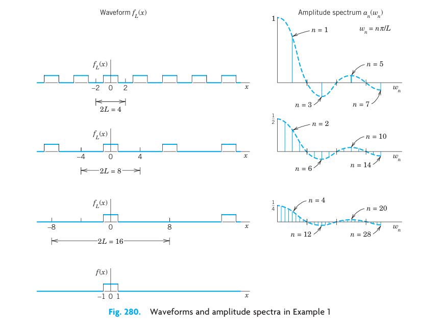{#fig-11-280}

### From Fourier Series to Fourier Integral
We now consider any periodic function $f_L(x)$ of period $2L$ that can be represented by a Fourier series
$$
f_L(x) = a_0 + \sum_{n=1}^{\infty} \left( a_n \cos w_n x + b_n \sin w_n x \right), \quad w_n = \frac{n\pi}{L}
$$
and find out what happens if we let $L \to \infty$. Together with Example 1 the present calculation will suggest that we should expect an integral (instead of a series) involving $\cos wx$ and $\sin wx$ with $w$ no longer restricted to integer multiples $w = w_n = n\pi/L$ of $\pi/L$ but taking all values. We shall also see what form such an integral might have.

If we insert $a_n$ and $b_n$ from the Euler formulas (6), @sec-arbitrary-period-even-odd-functions, and denote the variable of integration by $v$, the Fourier series of $f_L(x)$ becomes
$$
f_L(x) = \frac{1}{2L} \int_{-L}^{L} f_L(v) \, dv + \frac{1}{L} \sum_{n=1}^{\infty} \left[ \cos w_n x \int_{-L}^{L} f_L(v) \cos w_n v \, dv + \sin w_n x \int_{-L}^{L} f_L(v) \sin w_n v \, dv \right]
$$
We now set
$$
\Delta w = w_{n+1} - w_n = \frac{(n+1)\pi}{L} - \frac{n\pi}{L} = \frac{\pi}{L}
$$
Then $1/L = \Delta w / \pi$, and we may write the Fourier series in the form
$$
f_L(x) = \frac{1}{2L} \int_{-L}^{L} f_L(v) \, dv + \frac{1}{\pi} \sum_{n=1}^{\infty} \left[ \cos w_n x \, \Delta w \int_{-L}^{L} f_L(v) \cos w_n v \, dv + \sin w_n x \, \Delta w \int_{-L}^{L} f_L(v) \sin w_n v \, dv \right]
$$ {#eq-11-7-1}
This representation is valid for any fixed $L$, arbitrarily large, but finite.

We now let $L \to \infty$ and assume that the resulting nonperiodic function
$$
f(x) = \lim_{L \to \infty} f_L(x)
$$
is **absolutely integrable** on the $x$-axis; that is, the following (finite!) limit exists:
$$
\int_{-\infty}^{\infty} |f(x)| \, dx < \infty
$$ {#eq-11-7-2}

Then $\Delta w = \pi/L \to 0$, and the value of the first term on the right side of (@eq-11-7-1) approaches zero. Also, since $\Delta w \to 0$, it seems plausible that the infinite series in (@eq-11-7-1) becomes an integral from $0$ to $\infty$ which represents $f(x)$, namely,
$$
f(x) = \frac{1}{\pi} \int_0^{\infty} \left[ \cos wx \int_{-\infty}^{\infty} f(v) \cos wv \, dv + \sin wx \int_{-\infty}^{\infty} f(v) \sin wv \, dv \right] dw
$$ {#eq-11-7-3}
If we introduce the notations
$$
A(w) = \frac{1}{\pi} \int_{-\infty}^{\infty} f(v) \cos wv \, dv, \quad B(w) = \frac{1}{\pi} \int_{-\infty}^{\infty} f(v) \sin wv \, dv
$$ {#eq-11-7-4}
we can write this in the form
$$
f(x) = \int_0^{\infty} \left[ A(w) \cos wx + B(w) \sin wx \right] dw
$$ {#eq-11-7-5}
This is called a representation of $f(x)$ by a **Fourier integral**.

It is clear that our naive approach merely suggests the representation (@eq-11-7-5), but by no means establishes it; in fact, the limit of the series in (@eq-11-7-1) as $\Delta w$ approaches zero is not the definition of the integral (@eq-11-7-3). Sufficient conditions for the validity of (@eq-11-7-5) are as follows.

### THEOREM 5 Fourier Integral {#thm-11-7-5}
If $f(x)$ is piecewise continuous (see <!-- TODO: replace Sec. 6.1 with actual link -->Sec. 6.1) in every finite interval and has a right-hand derivative and a left-hand derivative at every point (see @sec-fourier-series) and if the integral (@eq-11-7-2) exists, then $f(x)$ can be represented by a Fourier integral (@eq-11-7-5) with $A$ and $B$ given by (@eq-11-7-4). At a point where $f(x)$ is discontinuous the value of the Fourier integral equals the average of the left- and right-hand limits of $f(x)$ at that point. (Proof in <!-- TODO: replace Ref. [C12] with actual link -->Ref. [C12]; see App. 1.)

### Applications of Fourier Integrals
The main application of Fourier integrals is in solving ODEs and PDEs, as we shall see for PDEs in <!-- TODO: replace Sec. 12.6 with actual link -->Sec. 12.6. However, we can also use Fourier integrals in integration and in discussing functions defined by integrals, as in the next example.

### EXAMPLE 2 Single Pulse. Sine Integral. Dirichlet’s Discontinuous Factor. Gibbs Phenomenon {#ex-11-7-2}
Find the Fourier integral representation of the function
$$
f(x) = \begin{cases} 1 & \text{if } |x| < 1 \\ 0 & \text{if } |x| > 1 \end{cases}
$$

**Solution.** From (@eq-11-7-4) we obtain
$$
A(w) = \frac{1}{\pi} \int_{-1}^{1} 1 \cdot \cos wv \, dv = \left. \frac{\sin wv}{\pi w} \right|_{-1}^{1} = \frac{2 \sin w}{\pi w}
$$
$$
B(w) = \frac{1}{\pi} \int_{-1}^{1} 1 \cdot \sin wv \, dv = 0
$$
and (@eq-11-7-5) gives the answer
$$
f(x) = \frac{2}{\pi} \int_0^{\infty} \frac{\cos wx \sin w}{w} \, dw
$$ {#eq-11-7-6}

The average of the left- and right-hand limits of $f(x)$ at $x = 1$ is equal to $(1 + 0)/2 = 1/2$. Furthermore, from (@eq-11-7-6) and Theorem 5 we obtain (multiplying by $\pi/2$):
$$
\int_0^{\infty} \frac{\cos wx \sin w}{w} \, dw = \begin{cases} \pi/2 & \text{if } 0 \le x < 1 \\ \pi/4 & \text{if } x = 1 \\ 0 & \text{if } x > 1 \end{cases}
$$ {#eq-11-7-7}
We mention that this integral is called **Dirichlet’s discontinuous factor**. (For P. L. Dirichlet see <!-- TODO: replace Sec. 10.8 with actual link -->Sec. 10.8.)

The case $x = 0$ is of particular interest. If $x = 0$, then (@eq-11-7-7) gives
$$
\int_0^{\infty} \frac{\sin w}{w} \, dw = \frac{\pi}{2}
$$ {#eq-11-7-8-star}
We see that this integral is the limit of the so-called **sine integral**
$$
Si(u) = \int_0^u \frac{\sin w}{w} \, dw
$$ {#eq-11-7-8}
as $u \to \infty$. The graphs of $Si(u)$ and of the integrand are shown in @fig-11-282.

In the case of a Fourier series the graphs of the partial sums are approximation curves of the curve of the periodic function represented by the series. Similarly, in the case of the Fourier integral (@eq-11-7-5), approximations are obtained by replacing $\infty$ by a finite limit $a$. Hence the integral
$$
\frac{2}{\pi} \int_0^a \frac{\cos wx \sin w}{w} \, dw
$$ {#eq-11-7-9}
approximates the right side in (@eq-11-7-6) and therefore $f(x)$.

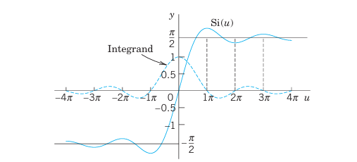{#fig-11-282}

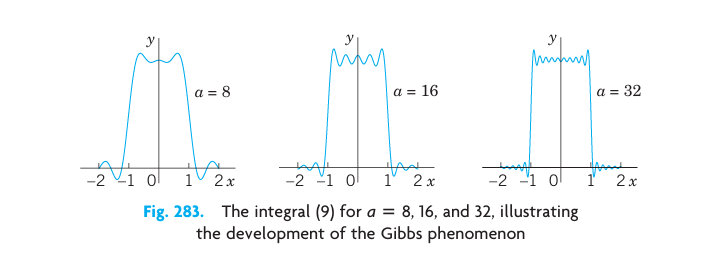{#fig-11-283}

@fig-11-283 shows oscillations near the points of discontinuity of $f(x)$. We might expect that these oscillations disappear as $a \to \infty$. But this is not true; with increasing $a$, they are shifted closer to the points $x = \pm 1$. This unexpected behavior, which also occurs in connection with Fourier series (see @sec-arbitrary-period-even-odd-functions), is known as the **Gibbs phenomenon**. We can explain it by representing (@eq-11-7-9) in terms of sine integrals as follows. Using formula (11) in <!-- TODO: replace App. A3.1 with actual link -->App. A3.1, we have
$$
\frac{2}{\pi} \int_0^a \frac{\cos wx \sin w}{w} \, dw = \frac{1}{\pi} \int_0^a \frac{\sin (w+wx)}{w} \, dw + \frac{1}{\pi} \int_0^a \frac{\sin (w-wx)}{w} \, dw
$$
In the first integral on the right we set $w + wx = t$. Then $dw/w = dt/t$, and $0 \le w \le a$ corresponds to $0 \le t \le a(x+1)$. In the last integral we set $w - wx = -t$ if $x > 1$ or $w(1-x) = t$. In both cases, this leads to:
$$
\frac{2}{\pi} \int_0^a \frac{\cos wx \sin w}{w} \, dw = \frac{1}{\pi} \int_0^{a(x+1)} \frac{\sin t}{t} \, dt - \frac{1}{\pi} \int_0^{a(x-1)} \frac{\sin t}{t} \, dt
$$
From this and (@eq-11-7-8) we see that our integral (@eq-11-7-9) equals
$$
\frac{1}{\pi} Si(a[x+1]) - \frac{1}{\pi} Si(a[x-1])
$$
and the oscillations in @fig-11-283 result from those in @fig-11-282. The increase of $a$ amounts to a transformation of the scale on the axis and causes the shift of the oscillations (the waves) toward the points of discontinuity $-1$ and $1$. $\blacksquare$

### Fourier Cosine Integral and Fourier Sine Integral
Just as Fourier series simplify if a function is even or odd (see @sec-arbitrary-period-even-odd-functions), so do Fourier integrals, and you can save work. Indeed, if $f$ has a Fourier integral representation and is even, then $B(w) = 0$ in (@eq-11-7-4). This holds because the integrand of $B(w)$ is odd. Then (@eq-11-7-5) reduces to a **Fourier cosine integral**
$$
f(x) = \int_0^{\infty} A(w) \cos wx \, dw \quad \text{where} \quad A(w) = \frac{2}{\pi} \int_0^{\infty} f(v) \cos wv \, dv
$$ {#eq-11-7-10}
Note the change in $A(w)$: for even $f$ the integrand is even, hence the integral from $-\infty$ to $\infty$ equals twice the integral from $0$ to $\infty$, just as in (@eq-11-2-7-a) of @sec-arbitrary-period-even-odd-functions.

Similarly, if $f$ has a Fourier integral representation and is odd, then $A(w) = 0$ in (@eq-11-7-4). This is true because the integrand of $A(w)$ is odd. Then (@eq-11-7-5) becomes a **Fourier sine integral**
$$
f(x) = \int_0^{\infty} B(w) \sin wx \, dw \quad \text{where} \quad B(w) = \frac{2}{\pi} \int_0^{\infty} f(v) \sin wv \, dv
$$ {#eq-11-7-11}
Note the change of $B(w)$ to an integral from $0$ to $\infty$ because the integrand is even (odd times odd is even).

Earlier in this section we pointed out that the main application of the Fourier integral representation is in differential equations. However, these representations also help in evaluating integrals, as the following example shows for integrals from $0$ to $\infty$.

### EXAMPLE 3 Laplace Integrals {#ex-11-7-3}
We shall derive the Fourier cosine and Fourier sine integrals of $f(x) = e^{-kx}$, where $x > 0$ and $k > 0$ (@fig-11-284). The result will be used to evaluate the so-called Laplace integrals.

**Solution.**
(a) From (@eq-11-7-10) we have $A(w) = \frac{2}{\pi} \int_0^{\infty} e^{-kv} \cos wv \, dv$. Now, by integration by parts,
$$
\int e^{-kv} \cos wv \, dv = \frac{e^{-kv}}{k^2 + w^2} \left( -k \cos wv + w \sin wv \right)
$$
If $v = 0$, the expression on the right equals $-k / (k^2 + w^2)$. If $v$ approaches infinity, that expression approaches zero because of the exponential factor. Thus:
$$
A(w) = \frac{2k/\pi}{k^2 + w^2}
$$ {#eq-11-7-12}
By substituting this into the first integral in (@eq-11-7-10) we thus obtain the Fourier cosine integral representation:
$$
e^{-kx} = \frac{2k}{\pi} \int_0^{\infty} \frac{\cos wx}{k^2 + w^2} \, dw \quad (x > 0, k > 0)
$$
From this representation we see that:
$$
\int_0^{\infty} \frac{\cos wx}{k^2 + w^2} \, dw = \frac{\pi}{2k} e^{-kx} \quad (x > 0, k > 0)
$$ {#eq-11-7-13}

(b) Similarly, from (@eq-11-7-11) we have $B(w) = \frac{2}{\pi} \int_0^{\infty} e^{-kv} \sin wv \, dv$. By integration by parts,
$$
\int e^{-kv} \sin wv \, dv = \frac{e^{-kv}}{k^2 + w^2} \left( -w \cos wv - k \sin wv \right)
$$
This equals $-w / (k^2 + w^2)$ if $v = 0$, and approaches $0$ as $v \to \infty$. Thus:
$$
B(w) = \frac{2w/\pi}{k^2 + w^2}
$$ {#eq-11-7-14}
From (@eq-11-7-14) we thus obtain the Fourier sine integral representation:
$$
e^{-kx} = \frac{2}{\pi} \int_0^{\infty} \frac{w \sin wx}{k^2 + w^2} \, dw \quad (x > 0, k > 0)
$$
From this we see that:
$$
\int_0^{\infty} \frac{w \sin wx}{k^2 + w^2} \, dw = \frac{\pi}{2} e^{-kx} \quad (x > 0, k > 0)
$$ {#eq-11-7-15}
The integrals (@eq-11-7-13) and (@eq-11-7-15) are called the **Laplace integrals**. $\blacksquare$

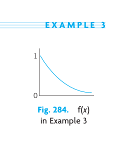{#fig-11-284}

---

## Problem Set 11.7 {#sec-problem-set-11-7}

### 1–6 EVALUATION OF INTEGRALS
Show that the integral represents the indicated function. Hint. Use (@eq-11-7-5), (@eq-11-7-10), or (@eq-11-7-11); the integral tells you which one, and its value tells you what function to consider. Show your work in detail.
1. $\int_0^{\infty} \frac{\cos xw + w \sin xw}{1 + w^2} \, dw = \begin{cases} \pi/2 & \text{if } x = 0 \\ \pi e^{-x} & \text{if } x > 0 \end{cases}$
2. $\int_0^{\infty} \frac{\sin \pi w \sin xw}{1 - w^2} \, dw = \begin{cases} \frac{\pi}{2} \sin x & \text{if } 0 \le x \le \pi \\ 0 & \text{if } x > \pi \end{cases}$
3. $\int_0^{\infty} \frac{1 - \cos \pi w}{w} \sin xw \, dw = \begin{cases} \pi/2 & \text{if } 0 < x < \pi \\ 0 & \text{if } x > \pi \end{cases}$
4. $\int_0^{\infty} \frac{\cos (\pi w / 2) \cos xw}{1 - w^2} \, dw = \begin{cases} \frac{\pi}{2} \cos x & \text{if } 0 < |x| < \pi/2 \\ 0 & \text{if } |x| \ge \pi/2 \end{cases}$
5. $\int_0^{\infty} \frac{\sin w - w \cos w}{w^2} \sin xw \, dw = \begin{cases} \pi x / 2 & \text{if } 0 < x < 1 \\ \pi/4 & \text{if } x = 1 \\ 0 & \text{if } x > 1 \end{cases}$
6. $\int_0^{\infty} \frac{w^3 \sin xw}{w^4 + 4} \, dw = \frac{\pi}{2} e^{-x} \cos x \quad (x > 0)$

### 7–12 FOURIER COSINE INTEGRAL REPRESENTATIONS
Represent $f(x)$ as an integral (@eq-11-7-10).
7. $f(x) = \begin{cases} 1 & \text{if } 0 < x < 1 \\ 0 & \text{if } x > 1 \end{cases}$
8. $f(x) = \begin{cases} x^2 & \text{if } 0 < x < 1 \\ 0 & \text{if } x > 1 \end{cases}$
9. $f(x) = \frac{1}{1 + x^2} \quad (x > 0)$. (Hint. See (@eq-11-7-13).)
10. $f(x) = \begin{cases} a^2 - x^2 & \text{if } 0 < x < a \\ 0 & \text{if } x > a \end{cases}$
11. $f(x) = \begin{cases} \cos x & \text{if } 0 < x < \pi \\ 0 & \text{if } x > \pi \end{cases}$
12. $f(x) = \begin{cases} e^{-x} & \text{if } 0 < x < 1 \\ 0 & \text{if } x > 1 \end{cases}$

13. **CAS EXPERIMENT. Approximate Fourier Cosine Integrals.** Graph the integrals in Probs. 7, 9, and 11 as functions of $x$. Graph approximations obtained by replacing $\infty$ with finite upper limits of your choice. Compare the quality of the approximations. Write a short report on your empirical results and observations.

### 14 PROJECT. Properties of Fourier Integrals {#proj-11-7-14}
(a) **Fourier cosine integral.** Show that (@eq-11-7-10) implies:
- (a1) $f(ax) = \int_0^{\infty} A^*(w) \cos xw \, dw$, where $A^*(w) = \frac{1}{a} A\left(\frac{w}{a}\right)$ ($a > 0$, Scale change).
- (a2) $x f(x) = \int_0^{\infty} B^*(w) \sin xw \, dw$, where $B^*(w) = - \frac{dA}{dw}$, with $A(w)$ as in (@eq-11-7-10).
- (a3) $x^2 f(x) = \int_0^{\infty} A^*(w) \cos xw \, dw$, where $A^*(w) = - \frac{d^2A}{dw^2}$.
(b) Solve Prob. 8 by applying (a3) to the result of Prob. 7.
(c) Verify (a2) for $f(x) = 1$ if $0 < x < a$ and $f(x) = 0$ if $x > a$.
(d) **Fourier sine integral.** Find formulas for the Fourier sine integral similar to those in (a).

15. **CAS EXPERIMENT. Sine Integral.** Plot $Si(u)$ for positive $u$. Does the sequence of the maximum and minimum values give the impression that it converges and has the limit $\pi/2$? Investigate the Gibbs phenomenon graphically.

### 16–20 FOURIER SINE INTEGRAL REPRESENTATIONS
Represent $f(x)$ as an integral (@eq-11-7-11).
16. $f(x) = \begin{cases} x & \text{if } 0 < x < a \\ 0 & \text{if } x > a \end{cases}$
17. $f(x) = \begin{cases} 1 & \text{if } 0 < x < 1 \\ 0 & \text{if } x > 1 \end{cases}$
18. $f(x) = \begin{cases} \sin x & \text{if } 0 < x < \pi \\ 0 & \text{if } x > \pi \end{cases}$
19. $f(x) = \begin{cases} e^{-x} & \text{if } 0 < x < a \\ 0 & \text{if } x > a \end{cases}$
20. $f(x) = \begin{cases} e^{-x} & \text{if } 0 < x < 1 \\ 0 & \text{if } x > 1 \end{cases}$

## Fourier Cosine and Sine Transforms {#sec-fourier-cosine-sine-transforms}

An integral transform is a transformation in the form of an integral that produces from given functions new functions depending on a different variable. One is mainly interested in these transforms because they can be used as tools in solving ODEs, PDEs, and integral equations and can often be of help in handling and applying special functions. The Laplace transform of <!-- TODO: replace Chap. 6 with actual link -->Chap. 6 serves as an example and is by far the most important integral transform in engineering.

Next in order of importance are Fourier transforms. They can be obtained from the Fourier integral in @sec-fourier-integral in a straightforward way. In this section we derive two such transforms that are real, and in @sec-fourier-transform a complex one.

### Fourier Cosine Transform
The Fourier cosine transform concerns even functions $f(x)$. We obtain it from the Fourier cosine integral (@eq-11-7-10) in @sec-fourier-integral:
$$
f(x) = \int_0^{\infty} A(w) \cos wx \, dw \quad \text{where} \quad A(w) = \frac{2}{\pi} \int_0^{\infty} f(v) \cos wv \, dv
$$
Namely, we set $A(w) = \sqrt{\frac{2}{\pi}} \hat{f}_c(w)$, where $c$ suggests "cosine." Then, writing $x$ instead of $v$ in the formula for $A(w)$, we have
$$
\hat{f}_c(w) = \sqrt{\frac{2}{\pi}} \int_0^{\infty} f(x) \cos wx \, dx
$$ {#eq-11-8-1a}
and
$$
f(x) = \sqrt{\frac{2}{\pi}} \int_0^{\infty} \hat{f}_c(w) \cos wx \, dw
$$ {#eq-11-8-1b}

Formula (@eq-11-8-1a) gives from $f(x)$ a new function $\hat{f}_c(w)$, called the **Fourier cosine transform** of $f(x)$. Formula (@eq-11-8-1b) gives us back $f(x)$ from $\hat{f}_c(w)$, and we therefore call $f(x)$ the **inverse Fourier cosine transform** of $\hat{f}_c(w)$.

The process of obtaining the transform $\hat{f}_c$ from a given $f$ is also called the **Fourier cosine transform** or the **Fourier cosine transform method**.

### Fourier Sine Transform
Similarly, in (@eq-11-7-11) of @sec-fourier-integral, we set $B(w) = \sqrt{\frac{2}{\pi}} \hat{f}_s(w)$, where $s$ suggests "sine." Then, writing $x$ instead of $v$, we have from (@eq-11-7-11) the **Fourier sine transform** of $f(x)$ given by
$$
\hat{f}_s(w) = \sqrt{\frac{2}{\pi}} \int_0^{\infty} f(x) \sin wx \, dx
$$ {#eq-11-8-2a}
and the **inverse Fourier sine transform** of $\hat{f}_s(w)$ given by
$$
f(x) = \sqrt{\frac{2}{\pi}} \int_0^{\infty} \hat{f}_s(w) \sin wx \, dw
$$ {#eq-11-8-2b}

The process of obtaining $\hat{f}_s(w)$ from $f(x)$ is also called the **Fourier sine transform** or the **Fourier sine transform method**.

Other notations are:
$$
\mathcal{F}_c(f) = \hat{f}_c, \quad \mathcal{F}_s(f) = \hat{f}_s
$$
and $\mathcal{F}_c^{-1}$ and $\mathcal{F}_s^{-1}$ for the inverses of $\hat{f}_c$ and $\hat{f}_s$, respectively.

### EXAMPLE 1 Fourier Cosine and Fourier Sine Transforms {#ex-11-8-1}
Find the Fourier cosine and Fourier sine transforms of the function
$$
f(x) = \begin{cases} k & \text{if } 0 < x < a \\ 0 & \text{if } x > a \end{cases} \quad (\text{see @fig-11-285}).
$$

**Solution.** From the definitions (@eq-11-8-1a) and (@eq-11-8-2a) we obtain by integration:
$$
\hat{f}_c(w) = \sqrt{\frac{2}{\pi}} \int_0^a k \cos wx \, dx = \sqrt{\frac{2}{\pi}} k \frac{\sin aw}{w}
$$
$$
\hat{f}_s(w) = \sqrt{\frac{2}{\pi}} \int_0^a k \sin wx \, dx = \sqrt{\frac{2}{\pi}} k \frac{1 - \cos aw}{w}
$$
This agrees with formulas 1 in the first two tables in @sec-tables-transforms (where $k = 1$). Note that for $f(x) = k = \text{const}$ ($0 < x < \infty$), these transforms do not exist. (Why?) $\blacksquare$

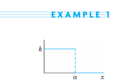{#fig-11-285}

### EXAMPLE 2 Fourier Cosine Transform of the Exponential Function {#ex-11-8-2}
Find $\mathcal{F}_c(e^{-x})$.

**Solution.** By integration by parts,
$$
\hat{f}_c(w) = \sqrt{\frac{2}{\pi}} \int_0^{\infty} e^{-x} \cos wx \, dx = \left. \sqrt{\frac{2}{\pi}} \frac{e^{-x}}{1 + w^2} (-\cos wx + w \sin wx) \right|_0^{\infty} = \sqrt{\frac{2}{\pi}} \frac{1}{1 + w^2}
$$
This agrees with formula 3 in Table I, @sec-tables-transforms, with $a = 1$. $\blacksquare$

What did we do to introduce the two integral transforms under consideration? Actually not much: We changed the notations $A$ and $B$ to get a "symmetric" distribution of the constant $\sqrt{2/\pi}$ in the original formulas. This redistribution is a standard convenience, but it is not essential. One could do without it.

What have we gained? We show next that these transforms have operational properties that permit them to convert differentiations into algebraic operations (just as the Laplace transform does). This is the key to their application in solving differential equations.

### Linearity. Transforms of Derivatives
If $f(x)$ is absolutely integrable on the positive $x$-axis and piecewise continuous on every finite interval, then the Fourier cosine and sine transforms of $f$ exist.

Furthermore, the Fourier cosine and sine transforms are **linear operations**; that is, for any constants $a$ and $b$:
$$
\begin{aligned}
(a) \quad \mathcal{F}_c(a f + b g) &= a \mathcal{F}_c(f) + b \mathcal{F}_c(g) \\
(b) \quad \mathcal{F}_s(a f + b g) &= a \mathcal{F}_s(f) + b \mathcal{F}_s(g)
\end{aligned}
$$ {#eq-11-8-3}

### THEOREM 7 Cosine and Sine Transforms of Derivatives {#thm-11-8-7}
Let $f(x)$ be continuous and absolutely integrable on the positive $x$-axis, let $f'(x)$ be piecewise continuous on every finite interval, and let $f(x) \to 0$ as $x \to \infty$. Then
$$
\begin{aligned}
(a) \quad \mathcal{F}_c\left\{ f'(x) \right\} &= w \mathcal{F}_s\left\{ f(x) \right\} - \sqrt{\frac{2}{\pi}} f(0) \\
(b) \quad \mathcal{F}_s\left\{ f'(x) \right\} &= -w \mathcal{F}_c\left\{ f(x) \right\}
\end{aligned}
$$ {#eq-11-8-4}

**PROOF** This follows from the definitions and by using integration by parts, namely,
$$
\mathcal{F}_c\left\{ f'(x) \right\} = \sqrt{\frac{2}{\pi}} \int_0^{\infty} f'(x) \cos wx \, dx = \left. \sqrt{\frac{2}{\pi}} f(x) \cos wx \right|_0^{\infty} + w \sqrt{\frac{2}{\pi}} \int_0^{\infty} f(x) \sin wx \, dx
$$
$$
= -\sqrt{\frac{2}{\pi}} f(0) + w \mathcal{F}_s\left\{ f(x) \right\}
$$
and similarly,
$$
\mathcal{F}_s\left\{ f'(x) \right\} = \sqrt{\frac{2}{\pi}} \int_0^{\infty} f'(x) \sin wx \, dx = \left. \sqrt{\frac{2}{\pi}} f(x) \sin wx \right|_0^{\infty} - w \sqrt{\frac{2}{\pi}} \int_0^{\infty} f(x) \cos wx \, dx
$$
$$
= -w \mathcal{F}_c\left\{ f(x) \right\} \quad \blacksquare
$$

Formula ((@eq-11-8-4)) with $f'$ instead of $f$ gives (when $f'$ and $f''$ satisfy the respective assumptions for $f$ and $f'$ in Theorem 7):
$$
\mathcal{F}_c\left\{ f''(x) \right\} = w \mathcal{F}_s\left\{ f'(x) \right\} - \sqrt{\frac{2}{\pi}} f'(0)
$$
hence by ((@eq-11-8-4)):
$$
\mathcal{F}_c\left\{ f''(x) \right\} = -w^2 \mathcal{F}_c\left\{ f(x) \right\} - \sqrt{\frac{2}{\pi}} f'(0)
$$ {#eq-11-8-5a}
Similarly,
$$
\mathcal{F}_s\left\{ f''(x) \right\} = -w^2 \mathcal{F}_s\left\{ f(x) \right\} + \sqrt{\frac{2}{\pi}} w f(0)
$$ {#eq-11-8-5b}

A basic application of (@eq-11-8-5a) and (@eq-11-8-5b) to PDEs will be given in <!-- TODO: replace Sec. 12.7 with actual link -->Sec. 12.7. For the time being we show how (@eq-11-8-5a) can be used for deriving transforms.

### EXAMPLE 3 An Application of the Operational Formula (5a) {#ex-11-8-3}
Find the Fourier cosine transform $\mathcal{F}_c(e^{-ax})$ of $f(x) = e^{-ax}$, where $a > 0$.

**Solution.** By differentiation, $(e^{-ax})'' = a^2 e^{-ax}$; thus
$$
f''(x) = a^2 f(x)
$$
From this, (@eq-11-8-5a), and the linearity ((@eq-11-8-3)),
$$
a^2 \mathcal{F}_c(f) = \mathcal{F}_c(f'') = -w^2 \mathcal{F}_c(f) - \sqrt{\frac{2}{\pi}} f'(0)
$$
Since $f(x) = e^{-ax}$, we have $f(0) = 1$ and $f'(0) = -a$. Thus:
$$
(a^2 + w^2) \mathcal{F}_c(e^{-ax}) = a \sqrt{\frac{2}{\pi}}
$$
The answer is (see Table I, @sec-tables-transforms):
$$
\mathcal{F}_c(e^{-ax}) = \sqrt{\frac{2}{\pi}} \frac{a}{a^2 + w^2} \quad \blacksquare
$$

Tables of Fourier cosine and sine transforms are included in @sec-tables-transforms.

---

## Problem Set 11.8 {#sec-problem-set-11-8}

### 1–8 FOURIER COSINE TRANSFORM
1. Find the cosine transform $\hat{f}_c(w)$ of $f(x) = 1$ if $0 < x < 1$, $f(x) = -1$ if $1 < x < 2$, and $f(x) = 0$ if $x > 2$.
2. Find $f(x)$ in Prob. 1 from the answer $\hat{f}_c(w)$.
3. Find $\hat{f}_c(w)$ for $f(x) = x$ if $0 < x < 2$, and $f(x) = 0$ if $x > 2$.
4. Derive formula 3 in Table I of @sec-tables-transforms by integration.
5. Find $\hat{f}_c(w)$ for $f(x) = x^2$ if $0 < x < 1$, and $f(x) = 0$ if $x > 1$.
6. **Continuity assumptions.** Find $\hat{g}_c(w)$ for $g(x) = 2$ if $0 < x < 1$, and $g(x) = 0$ if $x > 1$. Try to obtain from it $\hat{f}_c(w)$ for $f(x)$ in Prob. 5 by using (@eq-11-8-5a).
7. **Existence?** Does the Fourier cosine transform of $x^{-1} \sin x$ ($0 < x < \infty$) exist? Of $x^{-1} \cos x$? Give reasons.
8. **Existence?** Does the Fourier cosine transform of $f(x) = k = \text{const}$ ($0 < x < \infty$) exist? The Fourier sine transform?

### 9–15 FOURIER SINE TRANSFORM
9. Find $\mathcal{F}_s(e^{-ax})$, $a > 0$, by integration.
10. Obtain the answer to Prob. 9 from (@eq-11-8-5b).
11. Find $\hat{f}_s(w)$ for $f(x) = x^2$ if $0 < x < 1$, and $f(x) = 0$ if $x > 1$.
12. Find $\mathcal{F}_s(x e^{-x^2/2})$ from ((@eq-11-8-4)) and a suitable formula in Table I of @sec-tables-transforms.
13. Find $\mathcal{F}_s(e^{-x})$ from ((@eq-11-8-4)) and formula 3 of Table I in @sec-tables-transforms.
14. **Gamma function.** Using formulas 2 and 4 in Table II of @sec-tables-transforms, prove $\Gamma(1/2) = \sqrt{\pi}$ (formula (30) in <!-- TODO: replace App. A3.1 with actual link -->App. A3.1), a value needed for Bessel functions and other applications.
15. **WRITING PROJECT. Finding Fourier Cosine and Sine Transforms.** Write a short report on ways of obtaining these transforms, with illustrations by examples of your own.

## Fourier Transform. Discrete Fourier Transform {#sec-fourier-transform}

In @sec-fourier-cosine-sine-transforms we derived two real transforms. Now we want to derive a complex transform that is called the **Fourier transform**. It will be obtained from the complex Fourier integral, which will be discussed next.

### Complex Form of the Fourier Integral
The (real) Fourier integral is [see (4), (5) in @sec-fourier-integral]
$$
f(x) = \int_0^{\infty} \left[ A(w) \cos wx + B(w) \sin wx \right] dw
$$
where
$$
A(w) = \frac{1}{\pi} \int_{-\infty}^{\infty} f(v) \cos wv \, dv, \quad B(w) = \frac{1}{\pi} \int_{-\infty}^{\infty} f(v) \sin wv \, dv
$$
Substituting $A$ and $B$ into the integral for $f$, we have
$$
f(x) = \frac{1}{\pi} \int_0^{\infty} \left[ \int_{-\infty}^{\infty} f(v) \left( \cos wv \cos wx + \sin wv \sin wx \right) dv \right] dw
$$
By the addition formula for the cosine, the expression in the brackets equals $\cos(wv - wx)$ or, since the cosine is even, $\cos(wx - wv)$. We thus obtain
$$
f(x) = \frac{1}{\pi} \int_0^{\infty} \left[ \int_{-\infty}^{\infty} f(v) \cos(wx - wv) \, dv \right] dw
$$ {#eq-11-9-1-star}

The integral in brackets is an even function of $w$, call it $F(w)$, because $\cos(wx - wv)$ is an even function of $w$, the function $f(v)$ does not depend on $w$, and we integrate with respect to $v$ (not $w$). Hence the integral of $F(w)$ from $w = 0$ to $\infty$ is $1/2$ times the integral of $F(w)$ from $-\infty$ to $\infty$. Thus (note the change of the integration limit!):
$$
f(x) = \frac{1}{2\pi} \int_{-\infty}^{\infty} \left[ \int_{-\infty}^{\infty} f(v) \cos(wx - wv) \, dv \right] dw
$$ {#eq-11-9-1}
We claim that the integral of the form (@eq-11-9-1) with $\sin$ instead of $\cos$ is zero:
$$
\frac{1}{2\pi} \int_{-\infty}^{\infty} \left[ \int_{-\infty}^{\infty} f(v) \sin(wx - wv) \, dv \right] dw = 0
$$ {#eq-11-9-2}
This is true since $\sin(wx - wv)$ is an odd function of $w$, which makes the integral in brackets an odd function of $w$, call it $G(w)$. Hence the integral of $G(w)$ from $-\infty$ to $\infty$ is zero, as claimed.

We now take the integrand of (@eq-11-9-1) plus $i$ times the integrand of (@eq-11-9-2) and use the Euler formula:
$$
e^{ix} = \cos x + i \sin x
$$ {#eq-11-9-3}
Taking $wx - wv$ instead of $x$ in (@eq-11-9-3) and multiplying by $f(v)$ gives:
$$
f(v) \cos (wx - wv) + i f(v) \sin (wx - wv) = f(v) e^{iw(x - v)}
$$
Hence the result of adding (@eq-11-9-1) plus $i$ times (@eq-11-9-2), called the **complex Fourier integral**, is:
$$
f(x) = \frac{1}{2\pi} \int_{-\infty}^{\infty} \left[ \int_{-\infty}^{\infty} f(v) e^{iw(x-v)} \, dv \right] dw
$$ {#eq-11-9-4}
To obtain the desired Fourier transform will take only a very short step from here.

### Fourier Transform and Its Inverse
Writing the exponential function in (@eq-11-9-4) as a product of exponential functions, we have:
$$
f(x) = \frac{1}{\sqrt{2\pi}} \int_{-\infty}^{\infty} \left[ \frac{1}{\sqrt{2\pi}} \int_{-\infty}^{\infty} f(v) e^{-iwv} \, dv \right] e^{iwx} \, dw
$$ {#eq-11-9-5}
The expression in brackets is a function of $w$, is denoted by $\hat{f}(w)$, and is called the **Fourier transform** of $f$; writing $x$ instead of $v$, we have
$$
\hat{f}(w) = \mathcal{F}(f) = \frac{1}{\sqrt{2\pi}} \int_{-\infty}^{\infty} f(x) e^{-iwx} \, dx
$$ {#eq-11-9-6}
With this, (@eq-11-9-5) becomes:
$$
f(x) = \mathcal{F}^{-1}(\hat{f}) = \frac{1}{\sqrt{2\pi}} \int_{-\infty}^{\infty} \hat{f}(w) e^{iwx} \, dw
$$ {#eq-11-9-7}
and is called the **inverse Fourier transform** of $\hat{f}(w)$.

Another notation for the Fourier transform is $\hat{f} = \mathcal{F}(f)$, so that $f = \mathcal{F}^{-1}(\hat{f})$. The process of obtaining the Fourier transform $\mathcal{F}(f) = \hat{f}$ from a given $f$ is also called the **Fourier transform** or the **Fourier transform method**.

Using concepts defined in <!-- TODO: replace Sec. 6.1 with actual link -->Sec. 6.1 and @sec-fourier-integral we now state (without proof) conditions that are sufficient for the existence of the Fourier transform.

### THEOREM 8 Existence of the Fourier Transform {#thm-11-9-8}
If $f(x)$ is absolutely integrable on the $x$-axis and piecewise continuous on every finite interval, then the Fourier transform $\hat{f}(w)$ of $f(x)$ given by (@eq-11-9-6) exists.

### EXAMPLE 1 Fourier Transform of a Rectangular Pulse {#ex-11-9-1}
Find the Fourier transform of $f(x) = 1$ if $|x| < 1$ and $f(x) = 0$ otherwise.

**Solution.** Using (@eq-11-9-6) and integrating, we obtain:
$$
\hat{f}(w) = \frac{1}{\sqrt{2\pi}} \int_{-1}^{1} e^{-iwx} \, dx = \left. \frac{1}{\sqrt{2\pi}} \frac{e^{-iwx}}{-iw} \right|_{-1}^{1} = \frac{1}{-iw\sqrt{2\pi}} \left( e^{-iw} - e^{iw} \right)
$$
As in (@eq-11-9-3) we have $e^{iw} = \cos w + i \sin w$, $e^{-iw} = \cos w - i \sin w$, and by subtraction:
$$
e^{iw} - e^{-iw} = 2i \sin w
$$
Substituting this in the previous formula on the right, we see that $i$ drops out and we obtain the answer:
$$
\hat{f}(w) = \sqrt{\frac{2}{\pi}} \frac{\sin w}{w} \quad \blacksquare
$$

### EXAMPLE 2 Fourier Transform of a One-Sided Exponential {#ex-11-9-2}
Find the Fourier transform $\mathcal{F}(e^{-ax})$ of $f(x) = e^{-ax}$ if $x > 0$ and $f(x) = 0$ if $x < 0$, where $a > 0$.

**Solution.** From the definition (@eq-11-9-6) we obtain by integration:
$$
\mathcal{F}\left( e^{-ax} \right) = \frac{1}{\sqrt{2\pi}} \int_0^{\infty} e^{-ax} e^{-iwx} \, dx = \frac{1}{\sqrt{2\pi}} \int_0^{\infty} e^{-(a + iw)x} \, dx
$$
$$
= \left. \frac{1}{\sqrt{2\pi}} \frac{e^{-(a+iw)x}}{-(a+iw)} \right|_0^{\infty} = \frac{1}{\sqrt{2\pi}(a + iw)}
$$
This proves formula 5 of Table III in @sec-tables-transforms. $\blacksquare$

### Physical Interpretation: Spectrum
The nature of the representation (@eq-11-9-7) of $f(x)$ becomes clear if we think of it as a superposition of sinusoidal oscillations of all possible frequencies, called a **spectral representation**. This name is suggested by optics, where light is such a superposition of colors (frequencies). In (@eq-11-9-7), the "spectral density" $\hat{f}(w)$ measures the intensity of $f(x)$ in the frequency interval between $w$ and $w + \Delta w$ ($\Delta w$ small, fixed). We claim that, in connection with vibrations, the integral
$$
\int_{-\infty}^{\infty} |\hat{f}(w)|^2 \, dw
$$
can be interpreted as the total energy of the physical system. Hence an integral of $|\hat{f}(w)|^2$ from $a$ to $b$ gives the contribution of the frequencies $w$ between $a$ and $b$ to the total energy.

To make this plausible, we begin with a mechanical system giving a single frequency, namely, the harmonic oscillator (mass on a spring, <!-- TODO: replace Sec. 2.4 with actual link -->Sec. 2.4):
$$
m y'' + k y = 0
$$
Here we denote time $t$ by $x$. Multiplication by $y'$ gives $m y' y'' + k y' y = 0$. By integration:
$$
\frac{1}{2} m v^2 + \frac{1}{2} k y^2 = E_0 = \text{const}
$$
where $v = y'$ is the velocity. The first term is the kinetic energy, the second the potential energy, and $E_0$ the total energy of the system. Now a general solution is:
$$
y = a \cos w_0 x + b \sin w_0 x = c_1 e^{iw_0x} + c_2 e^{-iw_0x}, \quad w_0^2 = \frac{k}{m}
$$
where $c_1 = (a - ib)/2, c_2 = (a + ib)/2$. We write simply $A = c_1 e^{iw_0x}, B = c_2 e^{-iw_0x}$. Then $y = A + B$. By differentiation, $v = y' = A' + B' = iw_0(A - B)$. Substitution of $v$ and $y$ on the left side of the equation for $E_0$ gives:
$$
E_0 = \frac{1}{2} m v^2 + \frac{1}{2} k y^2 = \frac{1}{2} m (iw_0)^2 (A - B)^2 + \frac{1}{2} k (A + B)^2
$$
Here $w_0^2 = k/m$, so $m w_0^2 = k$. Also $i^2 = -1$, so that:
$$
E_0 = \frac{1}{2} k \left[ -(A - B)^2 + (A + B)^2 \right] = 2 k A B = 2 k c_1 e^{iw_0x} c_2 e^{-iw_0x} = 2 k c_1 c_2 = 2 k |c_1|^2
$$
Hence the energy is proportional to the square of the amplitude $|c_1|^2$.

As the next step, if a more complicated system leads to a periodic solution $y = f(x)$ that can be represented by a Fourier series, then instead of the single energy term $|c_1|^2$ we get a series of squares $|c_n|^2$ of Fourier coefficients $c_n$ given by (6) in @sec-approximation-trigonometric-polynomials. In this case we have a "discrete spectrum" (or "point spectrum") consisting of countably many isolated frequencies (infinitely many, in general), the corresponding $|c_n|^2$ being the contributions to the total energy.

Finally, a system whose solution can be represented by an integral (@eq-11-9-7) leads to the above integral for the energy, as is plausible from the cases just discussed.

### Linearity. Fourier Transform of Derivatives
New transforms can be obtained from given ones by using:

### THEOREM 9 Linearity of the Fourier Transform {#thm-11-9-9}
The Fourier transform is a linear operation; that is, for any functions $f(x)$ and $g(x)$ whose Fourier transforms exist and any constants $a$ and $b$, the Fourier transform of $a f + b g$ exists, and:
$$
\mathcal{F}(a f + b g) = a \mathcal{F}(f) + b \mathcal{F}(g)
$$ {#eq-11-9-8}

**PROOF** This is true because integration is a linear operation, so that (@eq-11-9-6) gives:
$$
\mathcal{F}\{a f(x) + b g(x)\} = \frac{1}{\sqrt{2\pi}} \int_{-\infty}^{\infty} \left[ a f(x) + b g(x) \right] e^{-iwx} \, dx
$$
$$
= a \frac{1}{\sqrt{2\pi}} \int_{-\infty}^{\infty} f(x) e^{-iwx} \, dx + b \frac{1}{\sqrt{2\pi}} \int_{-\infty}^{\infty} g(x) e^{-iwx} \, dx = a \mathcal{F}\{f(x)\} + b \mathcal{F}\{g(x)\} \quad \blacksquare
$$

In applying the Fourier transform to differential equations, the key property is that differentiation of functions corresponds to multiplication of transforms by $iw$:

### THEOREM 10 Fourier Transform of the Derivative of $f(x)$ {#thm-11-9-10}
Let $f(x)$ be continuous on the $x$-axis and $f(x) \to 0$ as $|x| \to \infty$. Furthermore, let $f'(x)$ be absolutely integrable on the $x$-axis. Then
$$
\mathcal{F}\left\{ f'(x) \right\} = iw \mathcal{F}\left\{ f(x) \right\}
$$ {#eq-11-9-9}

**PROOF** From the definition of the Fourier transform we have:
$$
\mathcal{F}\left\{ f'(x) \right\} = \frac{1}{\sqrt{2\pi}} \int_{-\infty}^{\infty} f'(x) e^{-iwx} \, dx
$$
Integrating by parts, we obtain:
$$
\mathcal{F}\left\{ f'(x) \right\} = \left. \frac{1}{\sqrt{2\pi}} f(x) e^{-iwx} \right|_{-\infty}^{\infty} - \frac{-iw}{\sqrt{2\pi}} \int_{-\infty}^{\infty} f(x) e^{-iwx} \, dx
$$
Since $f(x) \to 0$ as $|x| \to \infty$, the first term is zero, and the desired result follows:
$$
\mathcal{F}\left\{ f'(x) \right\} = iw \mathcal{F}\left\{ f(x) \right\} \quad \blacksquare
$$

Two successive applications of (@eq-11-9-9) give $\mathcal{F}(f'') = iw \mathcal{F}(f') = (iw)^2 \mathcal{F}(f)$. Since $(iw)^2 = -w^2$, we have for the transform of the second derivative of $f$:
$$
\mathcal{F}\left\{ f''(x) \right\} = -w^2 \mathcal{F}\left\{ f(x) \right\}
$$ {#eq-11-9-10}
Similarly for higher derivatives. An application of (@eq-11-9-10) to differential equations will be given in <!-- TODO: replace Sec. 12.6 with actual link -->Sec. 12.6. For the time being we show how (@eq-11-9-9) can be used to derive transforms.

### EXAMPLE 3 Application of the Operational Formula (9) {#ex-11-9-3}
Find the Fourier transform of $x e^{-x^2}$ from Table III, @sec-tables-transforms.

**Solution.** We use (@eq-11-9-9). By differentiation:
$$
x e^{-x^2} = -\frac{1}{2} (e^{-x^2})'
$$
Thus,
$$
\mathcal{F}\left\{ x e^{-x^2} \right\} = \mathcal{F}\left\{ -\frac{1}{2} (e^{-x^2})' \right\} = -\frac{1}{2} \mathcal{F}\left\{ (e^{-x^2})' \right\} = -\frac{1}{2} iw \mathcal{F}\left( e^{-x^2} \right)
$$
Using formula 9 in Table III of @sec-tables-transforms, $\mathcal{F}(e^{-x^2}) = \frac{1}{\sqrt{2}} e^{-w^2/4}$. This gives:
$$
\mathcal{F}\left\{ x e^{-x^2} \right\} = -\frac{1}{2} iw \left( \frac{1}{\sqrt{2}} e^{-w^2/4} \right) = -\frac{iw}{2\sqrt{2}} e^{-w^2/4} \quad \blacksquare
$$

### Convolution
The **convolution** $f * g$ of functions $f$ and $g$ is defined by
$$
(f * g)(x) = \int_{-\infty}^{\infty} f(p) g(x-p) \, dp = \int_{-\infty}^{\infty} f(x-p) g(p) \, dp
$$ {#eq-11-9-11}
The purpose is the same as in the case of Laplace transforms (<!-- TODO: replace Sec. 6.5 with actual link -->Sec. 6.5): taking the convolution of two functions and then taking the transform of the convolution is the same as multiplying the transforms of these functions (and multiplying them by $\sqrt{2\pi}$):

### THEOREM 11 Convolution Theorem {#thm-11-9-11}
Suppose that $f(x)$ and $g(x)$ are piecewise continuous, bounded, and absolutely integrable on the $x$-axis. Then
$$
\mathcal{F}(f * g) = \sqrt{2\pi} \mathcal{F}(f) \mathcal{F}(g)
$$ {#eq-11-9-12}

**PROOF** By definition:
$$
\mathcal{F}(f * g) = \frac{1}{\sqrt{2\pi}} \int_{-\infty}^{\infty} \left[ \int_{-\infty}^{\infty} f(p) g(x-p) \, dp \right] e^{-iwx} \, dx
$$
An interchange of the order of integration gives:
$$
\mathcal{F}(f * g) = \frac{1}{\sqrt{2\pi}} \int_{-\infty}^{\infty} f(p) \left[ \int_{-\infty}^{\infty} g(x-p) e^{-iwx} \, dx \right] dp
$$
Instead of $x$ we now take $q = x - p$ as a new variable of integration. Then $x = p + q$ and $dx = dq$:
$$
\mathcal{F}(f * g) = \frac{1}{\sqrt{2\pi}} \int_{-\infty}^{\infty} f(p) \left[ \int_{-\infty}^{\infty} g(q) e^{-iw(p+q)} \, dq \right] dp
$$
This double integral can be written as a product of two integrals and gives the desired result:
$$
\mathcal{F}(f * g) = \frac{1}{\sqrt{2\pi}} \int_{-\infty}^{\infty} f(p) e^{-iwp} \, dp \int_{-\infty}^{\infty} g(q) e^{-iwq} \, dq = \sqrt{2\pi} \mathcal{F}(f) \mathcal{F}(g) \quad \blacksquare
$$

By taking the inverse Fourier transform on both sides of (@eq-11-9-12), writing $\hat{f} = \mathcal{F}(f)$ and $\hat{g} = \mathcal{F}(g)$ as before, we obtain:
$$
(f * g)(x) = \int_{-\infty}^{\infty} \hat{f}(w) \hat{g}(w) e^{iwx} \, dw
$$ {#eq-11-9-13}
a formula that will help us in solving partial differential equations (<!-- TODO: replace Sec. 12.6 with actual link -->Sec. 12.6).

### Discrete Fourier Transform (DFT). Fast Fourier Transform (FFT)
In using Fourier series, Fourier transforms, and trigonometric approximations (@sec-orthogonal-series) we have to assume that a function $f(x)$, to be developed or transformed, is given on some interval, over which we integrate in the Euler formulas, etc. Now very often a function $f(x)$ is given only in terms of values at finitely many points, and one is interested in extending Fourier analysis to this case.

The main application of such a "discrete Fourier analysis" concerns large amounts of equally spaced data, as they occur in telecommunication, time series analysis, and various simulation problems. In these situations, dealing with sampled values rather than with functions, we can replace the Fourier transform by the so-called **discrete Fourier transform (DFT)** as follows.

Let $f(x)$ be periodic, for simplicity of period $2\pi$. We assume that $N$ measurements of $f(x)$ are taken over the interval $0 \le x \le 2\pi$ at regularly spaced points
$$
x_k = \frac{2\pi k}{N}, \quad k = 0, 1, \dots, N-1
$$ {#eq-11-9-14}
We also say that $f(x)$ is being sampled at these points. We now want to determine a complex trigonometric polynomial
$$
q(x) = \sum_{n=0}^{N-1} c_n e^{inx}
$$ {#eq-11-9-15}
that interpolates $f(x)$ at the nodes (@eq-11-9-14), that is, $q(x_k) = f(x_k)$, written out, with $f_k$ denoting $f(x_k)$:
$$
f_k = q(x_k) = \sum_{n=0}^{N-1} c_n e^{inx_k}, \quad k = 0, 1, \dots, N-1
$$ {#eq-11-9-16}

Hence we must determine the coefficients $c_0, \dots, c_{N-1}$ such that (@eq-11-9-16) holds. We do this by an idea similar to that in @sec-fourier-series for deriving the Fourier coefficients by using the orthogonality of the trigonometric system. Instead of integrals we now take sums. Namely, we multiply (@eq-11-9-16) by $e^{-imx_k}$ and sum over $k$ from $0$ to $N-1$. Then we interchange the order of the two summations and insert $x_k$ from (@eq-11-9-14). This gives:
$$
\sum_{k=0}^{N-1} f_k e^{-imx_k} = \sum_{k=0}^{N-1} \sum_{n=0}^{N-1} c_n e^{i(n-m)x_k} = \sum_{n=0}^{N-1} c_n \sum_{k=0}^{N-1} e^{i(n-m)2\pi k/N}
$$ {#eq-11-9-17}
Now:
$$
e^{i(n-m)2\pi k/N} = \left[ e^{i(n-m)2\pi/N} \right]^k
$$
We denote $[ \dots ]$ by $r$. For $n = m$ we have $r = e^0 = 1$. The sum of these terms over $k$ equals $N$. For $n \neq m$ we have $r \neq 1$ and by the formula for a geometric sum (formula (6) in <!-- TODO: replace Sec. 15.1 with actual link -->Sec. 15.1 with $q = r$ and $n = N-1$):
$$
\sum_{k=0}^{N-1} r^k = \frac{1 - r^N}{1 - r} = 0
$$
because $r^N = 1$; indeed, since $m, n, k$ are integers:
$$
r^N = e^{i(n-m)2\pi} = \cos 2\pi(n-m) + i \sin 2\pi(n-m) = 1 + 0i = 1
$$
This shows that the right side of (@eq-11-9-17) equals $c_m N$. Writing $n$ for $m$ and dividing by $N$, we thus obtain the desired coefficient formula:
$$
c_n = \frac{1}{N} \sum_{k=0}^{N-1} f_k e^{-inx_k}, \quad n = 0, 1, \dots, N-1
$$ {#eq-11-9-18-star}

Since computation of the $c_n$ (by the fast Fourier transform, below) involves successive halving of the problem size $N$, it is practical to drop the factor $1/N$ from $c_n$ and define the **discrete Fourier transform** of the given signal $\mathbf{f} = [f_0 \ \dots \ f_{N-1}]^T$ to be the vector $\hat{\mathbf{f}} = [\hat{f}_0 \ \dots \ \hat{f}_{N-1}]^T$ with components:
$$
\hat{f}_n = N c_n = \sum_{k=0}^{N-1} f_k e^{-inx_k}, \quad n = 0, \dots, N-1
$$ {#eq-11-9-18}
This is the frequency spectrum of the signal.

In vector notation, $\hat{\mathbf{f}} = \mathbf{F}_N \mathbf{f}$, where the $N \times N$ Fourier matrix $\mathbf{F}_N = [w_N^{nk}]$ has the entries given in (@eq-11-9-18):
$$
w_N^{nk} = e^{-inx_k} = e^{-in(2\pi k/N)} = w_N^{nk}, \quad w_N = e^{-i 2\pi/N}
$$ {#eq-11-9-19}
where $n, k = 0, \dots, N-1$.

### EXAMPLE 4 Discrete Fourier Transform (DFT). Sample of $N = 4$ Values {#ex-11-9-4}
Let $N = 4$ measurements (sample values) be given. Then $w_4 = e^{-i 2\pi / 4} = e^{-i\pi/2} = -i$, and thus $w_4^{nk} = (-i)^{nk}$. Let the sample values be, say $\mathbf{f} = [0 \ 1 \ 4 \ 9]^T$. Then by (@eq-11-9-18) and (@eq-11-9-19):
$$
\hat{\mathbf{f}} = \mathbf{F}_4 \mathbf{f} = \begin{bmatrix}
w_4^0 & w_4^0 & w_4^0 & w_4^0 \\
w_4^0 & w_4^1 & w_4^2 & w_4^3 \\
w_4^0 & w_4^2 & w_4^4 & w_4^6 \\
w_4^0 & w_4^3 & w_4^6 & w_4^9
\end{bmatrix} \begin{bmatrix} 0 \\ 1 \\ 4 \\ 9 \end{bmatrix} = \begin{bmatrix}
1 & 1 & 1 & 1 \\
1 & -i & -1 & i \\
1 & -1 & 1 & -1 \\
1 & i & -1 & -i
\end{bmatrix} \begin{bmatrix} 0 \\ 1 \\ 4 \\ 9 \end{bmatrix} = \begin{bmatrix} 14 \\ -4 + 8i \\ -6 \\ -4 - 8i \end{bmatrix}
$$ {#eq-11-9-20}
$\blacksquare$

From the DFT (the frequency spectrum) $\hat{\mathbf{f}} = \mathbf{F}_N \mathbf{f}$ we can recreate the given signal:
$$
\mathbf{f} = \mathbf{F}_N^{-1} \hat{\mathbf{f}}
$$
Here $\mathbf{F}_N$ and its complex conjugate $\overline{\mathbf{F}}_N = [\bar{w}_N^{nk}] = [w_N^{-nk}]$ satisfy:
$$
\mathbf{F}_N \overline{\mathbf{F}}_N = \overline{\mathbf{F}}_N \mathbf{F}_N = N \mathbf{I}
$$ {#eq-11-9-21a}
where $\mathbf{I}$ is the $N \times N$ unit matrix; hence $\mathbf{F}_N$ has the inverse:
$$
\mathbf{F}_N^{-1} = \frac{1}{N} \overline{\mathbf{F}}_N
$$ {#eq-11-9-21b}

**PROOF** We prove (@eq-11-9-21a). By the multiplication rule (row times column) the product matrix $\mathbf{G} = \mathbf{F}_N \overline{\mathbf{F}}_N = [g_{jk}]$ has the entries $g_{jk}$ equal to Row $j$ of $\mathbf{F}_N$ times Column $k$ of $\overline{\mathbf{F}}_N$. That is, writing $W = w_N^j w_N^{-k} = w_N^{j-k}$, we prove that:
$$
g_{jk} = W^0 + W^1 + \dots + W^{N-1} = \begin{cases} 0 & \text{if } j \neq k \\ N & \text{if } j = k \end{cases}
$$
Indeed, when $j = k$, then $W = w_N^0 = 1$, so that the sum of these $N$ terms equals $N$; these are the diagonal entries of $\mathbf{G}$. Also, when $j \neq k$, then $W \neq 1$ and we have a geometric sum:
$$
W^0 + W^1 + \dots + W^{N-1} = \frac{1 - W^N}{1 - W} = 0
$$
because $W^N = (w_N^{j-k})^N = (e^{-i 2\pi})^j (e^{i 2\pi})^k = 1^j \cdot 1^k = 1$. $\blacksquare$

We have seen that $\hat{\mathbf{f}}$ is the frequency spectrum of the signal $f(x)$. Thus the components $\hat{f}_n$ of $\hat{\mathbf{f}}$ give a resolution of the $2\pi$-periodic function $f(x)$ into simple (complex) harmonics. Here one should use only $n$'s that are much smaller than $N/2$, to avoid **aliasing**. By this we mean the effect caused by sampling at too few (equally spaced) points, so that, for instance, in a motion picture, rotating wheels appear as rotating too slowly or even in the wrong sense.

Hence in applications, $N$ is usually large. But this poses a problem. Equation (@eq-11-9-18) requires $O(N)$ operations for any particular $n$, hence $O(N^2)$ operations for all $n = 0, \dots, N-1$. Thus, already for 1000 sample points the straightforward calculation would involve millions of operations.

However, this difficulty can be overcome by the so-called **fast Fourier transform (FFT)**, for which codes are readily available. The FFT is a computational method for the DFT that needs only $O(N \log_2 N)$ operations instead of $O(N^2)$. It makes the DFT a practical tool for large $N$. Here one chooses $N = 2^p$ ($p$ integer) and uses the special form of the Fourier matrix to break down the given problem into smaller problems. For instance, when $N = 1024$, the operations are reduced by a factor $1024 / \log_2(1024) \approx 100$.

The breakdown produces two problems of size $M = N/2$. This breakdown is possible because for $N = 2M$ we have in (@eq-11-9-19):
$$
w_N^2 = \left( e^{-i 2\pi / N} \right)^2 = e^{-i 4\pi / (2M)} = e^{-i 2\pi / M} = w_M
$$
The given vector $\mathbf{f} = [f_0 \ \dots \ f_{N-1}]^T$ is split into two vectors with $M$ components each, namely:
$$
\mathbf{f}_{ev} = [f_0 \ f_2 \ \dots \ f_{N-2}]^T
$$
containing the even components of $\mathbf{f}$, and
$$
\mathbf{f}_{od} = [f_1 \ f_3 \ \dots \ f_{N-1}]^T
$$
containing the odd components of $\mathbf{f}$. For $\mathbf{f}_{ev}$ and $\mathbf{f}_{od}$ we determine the DFTs:
$$
\hat{\mathbf{f}}_{ev} = \mathbf{F}_M \mathbf{f}_{ev} \quad \text{and} \quad \hat{\mathbf{f}}_{od} = \mathbf{F}_M \mathbf{f}_{od}
$$
involving the same $M \times M$ matrix $\mathbf{F}_M$. From these vectors we obtain the components of the DFT of the given vector $\mathbf{f}$ by the formulas:
$$
\begin{aligned}
(a) \quad \hat{f}_n &= \hat{f}_{ev, n} + w_N^n \hat{f}_{od, n}, \quad n = 0, \dots, M-1 \\
(b) \quad \hat{f}_{n+M} &= \hat{f}_{ev, n} - w_N^n \hat{f}_{od, n}, \quad n = 0, \dots, M-1
\end{aligned}
$$ {#eq-11-9-22}

For $N = 2^p$ this breakdown can be repeated $p-1$ times in order to finally arrive at $N/2$ problems of size 2 each, so that the number of multiplications is reduced as indicated above.

We show the reduction from $N = 4$ to $M = N/2 = 2$ and then prove (@eq-11-9-22).

### EXAMPLE 5 Fast Fourier Transform (FFT). Sample of $N = 4$ Values {#ex-11-9-5}
When $N = 4$, then $w_4 = -i$ as in Example 4 and $M = N/2 = 2$, hence $w_2 = e^{-i 2\pi / 2} = e^{-i\pi} = -1$. Consequently,
$$
\hat{\mathbf{f}}_{ev} = \mathbf{F}_2 \mathbf{f}_{ev} = \begin{bmatrix} 1 & 1 \\ 1 & -1 \end{bmatrix} \begin{bmatrix} f_0 \\ f_2 \end{bmatrix} = \begin{bmatrix} f_0 + f_2 \\ f_0 - f_2 \end{bmatrix}
$$
$$
\hat{\mathbf{f}}_{od} = \mathbf{F}_2 \mathbf{f}_{od} = \begin{bmatrix} 1 & 1 \\ 1 & -1 \end{bmatrix} \begin{bmatrix} f_1 \\ f_3 \end{bmatrix} = \begin{bmatrix} f_1 + f_3 \\ f_1 - f_3 \end{bmatrix}
$$
From this and ((@eq-11-9-22)) we obtain:
$$
\hat{f}_0 = \hat{f}_{ev, 0} + w_4^0 \hat{f}_{od, 0} = (f_0 + f_2) + 1 \cdot (f_1 + f_3) = f_0 + f_1 + f_2 + f_3
$$
$$
\hat{f}_1 = \hat{f}_{ev, 1} + w_4^1 \hat{f}_{od, 1} = (f_0 - f_2) + (-i) \cdot (f_1 - f_3) = f_0 - i f_1 - f_2 + i f_3
$$
Similarly, by ((@eq-11-9-22)):
$$
\hat{f}_2 = \hat{f}_{ev, 0} - w_4^0 \hat{f}_{od, 0} = (f_0 + f_2) - 1 \cdot (f_1 + f_3) = f_0 - f_1 + f_2 - f_3
$$
$$
\hat{f}_3 = \hat{f}_{ev, 1} - w_4^1 \hat{f}_{od, 1} = (f_0 - f_2) - (-i) \cdot (f_1 - f_3) = f_0 + i f_1 - f_2 - i f_3
$$
This agrees with Example 4, as can be seen by replacing $f_0, f_1, f_2, f_3$ with $0, 1, 4, 9$. $\blacksquare$

**PROOF** We prove (@eq-11-9-22). From (@eq-11-9-18) and (@eq-11-9-19) we have for the components of the DFT:
$$
\hat{f}_n = \sum_{k=0}^{N-1} f_k w_N^{kn}
$$
Splitting into two sums of $M = N/2$ terms each gives:
$$
\hat{f}_n = \sum_{k=0}^{M-1} f_{2k} w_N^{2kn} + \sum_{k=0}^{M-1} f_{2k+1} w_N^{(2k+1)n}
$$
We now use $w_N^2 = w_M$ and pull out $w_N^n$ from under the second sum, obtaining:
$$
\hat{f}_n = \sum_{k=0}^{M-1} f_{ev, k} w_M^{kn} + w_N^n \sum_{k=0}^{M-1} f_{od, k} w_M^{kn}
$$ {#eq-11-9-23}
The two sums are $\hat{f}_{ev, n}$ and $\hat{f}_{od, n}$, the components of the "half-size" transforms $\mathbf{F}_M \mathbf{f}_{ev}$ and $\mathbf{F}_M \mathbf{f}_{od}$. Formula ((@eq-11-9-22)) is the same as (@eq-11-9-23).

In ((@eq-11-9-22)) we have $n + M$ instead of $n$. This causes a sign change in (@eq-11-9-23), namely $-w_N^n$ before the second sum because:
$$
w_N^{M} = e^{-i 2\pi M / N} = e^{-i \pi} = -1
$$
This gives the minus in ((@eq-11-9-22)) and completes the proof. $\blacksquare$

---

## Problem Set 11.9 {#sec-problem-set-11-9}

1. **Review in complex.** Show that $1/i = -i$, $e^{-ix} + e^{ix} = 2 \cos x$, $e^{ix} - e^{-ix} = 2i \sin x$, $e^{ikx} = \cos kx + i \sin kx$.

### 2–11 FOURIER TRANSFORMS BY INTEGRATION
Find the Fourier transform of $f(x)$ (without using Table III in @sec-tables-transforms). Show details.
2. $f(x) = \begin{cases} e^{2ix} & \text{if } -1 < x < 1 \\ 0 & \text{otherwise} \end{cases}$
3. $f(x) = \begin{cases} 1 & \text{if } a < x < b \\ 0 & \text{otherwise} \end{cases}$
4. $f(x) = \begin{cases} e^{kx} & \text{if } x < 0 \ (k > 0) \\ 0 & \text{if } x > 0 \end{cases}$
5. $f(x) = \begin{cases} e^x & \text{if } -a < x < a \\ 0 & \text{otherwise} \end{cases}$
6. $f(x) = e^{-|x|} \quad (-\infty < x < \infty)$
7. $f(x) = \begin{cases} x & \text{if } 0 < x < a \\ 0 & \text{otherwise} \end{cases}$
8. $f(x) = \begin{cases} x e^{-x} & \text{if } x > 0 \\ 0 & \text{otherwise} \end{cases}$
9. $f(x) = \begin{cases} |x| & \text{if } -1 < x < 1 \\ 0 & \text{otherwise} \end{cases}$
10. $f(x) = \begin{cases} x & \text{if } -1 < x < 1 \\ 0 & \text{otherwise} \end{cases}$
11. $f(x) = \begin{cases} -1 & \text{if } -1 < x < 0 \\ 1 & \text{if } 0 < x < 1 \\ 0 & \text{otherwise} \end{cases}$

### 12–17 USE OF TABLE III IN SEC. 11.10. OTHER METHODS
12. Find $\mathcal{F}(x e^{-x})$ for $x > 0$ and $f(x) = 0$ for $x < 0$, by (@eq-11-9-9) and formula 5 in Table III (with $a = 1$). (Hint. Consider $x e^{-x}$ and $e^{-x}$.)
13. Obtain $\mathcal{F}(x e^{-x^2/2})$ from Table III.
14. In Table III obtain formula 7 from formula 8.
15. In Table III obtain formula 1 from formula 2.
16. **TEAM PROJECT. Shifting.**
    - (a) Show that if $f(x)$ has a Fourier transform, so does $f(x - a)$, and
      $$
      \mathcal{F}\{f(x - a)\} = e^{-iwa} \mathcal{F}\{f(x)\}
      $$
    - (b) Using (a), obtain formula 1 in Table III of @sec-tables-transforms from formula 2.
    - (c) **Shifting on the $w$-axis.** Show that if $\hat{f}(w)$ is the Fourier transform of $f(x)$, then $\hat{f}(w - a)$ is the Fourier transform of $e^{iax} f(x)$.
    - (d) Using (c), obtain formula 7 in Table III from formula 1, and formula 8 from formula 2.
17. What could give you the idea to solve Prob. 11 by using the solution of Prob. 9 and formula (@eq-11-9-9)? Would this work?

### 18–25 DISCRETE FOURIER TRANSFORM
18. Verify the calculations in Example 4 of the text.
19. Find the transform of a general signal $\mathbf{f} = [f_0 \ f_1 \ f_2 \ f_3]^T$ of four values.
20. Find the inverse matrix $\mathbf{F}_4^{-1}$ in Example 4 of the text and use it to recover the given signal.
21. Find the transform (the frequency spectrum) of a general signal of two values $[f_0 \ f_1]^T$.
22. Recreate the given signal in Prob. 21 from the frequency spectrum obtained.
23. Show that for a signal of eight sample values, $w_8 = e^{-i\pi/4} = \frac{1 - i}{\sqrt{2}}$. Check by squaring.
24. Write the Fourier matrix $\mathbf{F}_8$ for a sample of eight values explicitly.
25. **CAS Problem.** Calculate the inverse of the $8 \times 8$ Fourier matrix. Transform a general sample of eight values and transform it back to the given data.

## Tables of Transforms {#sec-tables-transforms}

### Table I. Fourier Cosine Transforms
See (@eq-11-8-1a) in @sec-fourier-cosine-sine-transforms.
$$
\hat{f}_c(w) = \mathcal{F}_c(f) = \sqrt{\frac{2}{\pi}} \int_0^{\infty} f(x) \cos wx \, dx
$$

| | $f(x)$ | $\hat{f}_c(w)$ |
|---|---|---|
| 1 | $\begin{cases} 1 & \text{if } 0 < x < a \\ 0 & \text{otherwise} \end{cases}$ | $\sqrt{\frac{2}{\pi}} \frac{\sin aw}{w}$ |
| 2 | $x^{a-1} \quad (0 < a < 1)$ | $\sqrt{\frac{2}{\pi}} \frac{\Gamma(a)}{w^a} \cos \frac{a\pi}{2}$ |
| 3 | $e^{-ax} \quad (a > 0)$ | $\sqrt{\frac{2}{\pi}} \frac{a}{a^2 + w^2}$ |
| 4 | $e^{-x^2 / 2}$ | $e^{-w^2 / 2}$ |
| 5 | $e^{-ax^2} \quad (a > 0)$ | $\frac{1}{\sqrt{2a}} e^{-w^2 / (4a)}$ |
| 6 | $x^n e^{-ax} \quad (a > 0)$ | $\sqrt{\frac{2}{\pi}} \frac{n!}{\left(a^2 + w^2\right)^{n+1}} \text{Re} \left[ (a + iw)^{n+1} \right]$ |
| 7 | $\begin{cases} \cos x & \text{if } 0 < x < a \\ 0 & \text{otherwise} \end{cases}$ | $\frac{1}{\sqrt{2\pi}} \left[ \frac{\sin a(1-w)}{1-w} + \frac{\sin a(1+w)}{1+w} \right]$ |
| 8 | $\cos (ax^2) \quad (a > 0)$ | $\frac{1}{\sqrt{2a}} \cos \left( \frac{w^2}{4a} - \frac{\pi}{4} \right)$ |
| 9 | $\sin (ax^2) \quad (a > 0)$ | $\frac{1}{\sqrt{2a}} \cos \left( \frac{w^2}{4a} + \frac{\pi}{4} \right)$ |
| 10 | $\frac{\sin ax}{x}$ | $\sqrt{\frac{\pi}{2}} [1 - u(w - a)]$ (where $u$ is step function) |
| 11 | $\frac{e^{-x} \sin x}{x}$ | $\frac{1}{\sqrt{2\pi}} \arctan \frac{2}{w^2}$ |
| 12 | $J_0(ax) \quad (a > 0)$ | $\sqrt{\frac{2}{\pi}} \frac{1}{\sqrt{a^2 - w^2}} [1 - u(w - a)]$ |

---

### Table II. Fourier Sine Transforms
See (@eq-11-8-2a) in @sec-fourier-cosine-sine-transforms.
$$
\hat{f}_s(w) = \mathcal{F}_s(f) = \sqrt{\frac{2}{\pi}} \int_0^{\infty} f(x) \sin wx \, dx
$$

| | $f(x)$ | $\hat{f}_s(w)$ |
|---|---|---|
| 1 | $\begin{cases} 1 & \text{if } 0 < x < a \\ 0 & \text{otherwise} \end{cases}$ | $\sqrt{\frac{2}{\pi}} \frac{1 - \cos aw}{w}$ |
| 2 | $\frac{1}{\sqrt{x}}$ | $\frac{1}{\sqrt{w}}$ |
| 3 | $\frac{1}{x^{3/2}}$ | $2 \sqrt{w}$ |
| 4 | $x^{a-1} \quad (0 < a < 1)$ | $\sqrt{\frac{2}{\pi}} \frac{\Gamma(a)}{w^a} \sin \frac{a\pi}{2}$ |
| 5 | $e^{-ax} \quad (a > 0)$ | $\sqrt{\frac{2}{\pi}} \frac{w}{a^2 + w^2}$ |
| 6 | $\frac{e^{-ax}}{x} \quad (a > 0)$ | $\sqrt{\frac{2}{\pi}} \arctan \frac{w}{a}$ |
| 7 | $x^n e^{-ax} \quad (a > 0)$ | $\sqrt{\frac{2}{\pi}} \frac{n!}{\left(a^2 + w^2\right)^{n+1}} \text{Im} \left[ (a + iw)^{n+1} \right]$ |
| 8 | $x e^{-x^2 / 2}$ | $w e^{-w^2 / 2}$ |
| 9 | $x e^{-ax^2} \quad (a > 0)$ | $\frac{w}{(2a)^{3/2}} e^{-w^2 / (4a)}$ |
| 10 | $\begin{cases} \sin x & \text{if } 0 < x < a \\ 0 & \text{otherwise} \end{cases}$ | $\frac{1}{\sqrt{2\pi}} \left[ \frac{\sin a(1-w)}{1-w} - \frac{\sin a(1+w)}{1+w} \right]$ |
| 11 | $\frac{\cos ax}{x}$ | $\sqrt{\frac{\pi}{2}} u(w - a)$ (where $u$ is step function) |
| 12 | $\arctan \frac{2a}{x}$ | $\sqrt{\frac{2}{\pi}} \frac{e^{-aw} \sin aw}{w}$ |

---

### Table III. Fourier Transforms
See (@eq-11-9-6) in @sec-fourier-transform.
$$
\hat{f}(w) = \mathcal{F}(f) = \frac{1}{\sqrt{2\pi}} \int_{-\infty}^{\infty} f(x) e^{-iwx} \, dx
$$

| | $f(x)$ | $\hat{f}(w)$ |
|---|---|---|
| 1 | $\begin{cases} 1 & \text{if } -b < x < b \\ 0 & \text{otherwise} \end{cases}$ | $\sqrt{\frac{2}{\pi}} \frac{\sin bw}{w}$ |
| 2 | $\begin{cases} 1 & \text{if } b < x < c \\ 0 & \text{otherwise} \end{cases}$ | $\frac{e^{-ibw} - e^{-icw}}{iw \sqrt{2\pi}}$ |
| 3 | $\frac{1}{x^2 + a^2} \quad (a > 0)$ | $\sqrt{\frac{\pi}{2}} \frac{e^{-a\|w\|}}{a}$ |
| 4 | $\begin{cases} x & \text{if } 0 < x < b \\ 2b - x & \text{if } b < x < 2b \\ 0 & \text{otherwise} \end{cases}$ | $\frac{-1 + 2e^{-ibw} - e^{-2ibw}}{w^2 \sqrt{2\pi}}$ |
| 5 | $\begin{cases} e^{-ax} & \text{if } x > 0 \\ 0 & \text{otherwise} \end{cases} \quad (a > 0)$ | $\frac{1}{\sqrt{2\pi}(a + iw)}$ |
| 6 | $\begin{cases} e^{ax} & \text{if } b < x < c \\ 0 & \text{otherwise} \end{cases}$ | $\frac{e^{(a - iw)c} - e^{(a - iw)b}}{\sqrt{2\pi}(a - iw)}$ |
| 7 | $\begin{cases} e^{iax} & \text{if } -b < x < b \\ 0 & \text{otherwise} \end{cases}$ | $\sqrt{\frac{2}{\pi}} \frac{\sin b(w - a)}{w - a}$ |
| 8 | $\begin{cases} e^{iax} & \text{if } b < x < c \\ 0 & \text{otherwise} \end{cases}$ | $\frac{i \left[ e^{ib(a-w)} - e^{ic(a-w)} \right]}{\sqrt{2\pi}(a - w)}$ |
| 9 | $e^{-ax^2} \quad (a > 0)$ | $\frac{1}{\sqrt{2a}} e^{-w^2 / (4a)}$ |
| 10 | $\frac{\sin ax}{x}$ | $\begin{cases} \sqrt{\frac{\pi}{2}} & \text{if } \|w\| < a \\ 0 & \text{if } \|w\| > a \end{cases}$ |

## Review Questions and Problems {#sec-review-questions-problems-chapter-11}

1. What is a Fourier series? A Fourier cosine series? A half-range expansion? Answer from memory.
2. What are the Euler formulas? By what very important idea did we obtain them?
3. How did we proceed from $2\pi$-periodic to general-periodic functions?
4. Can a discontinuous function have a Fourier series? A Taylor series? Why are such functions of interest to the engineer?
5. What do you know about convergence of a Fourier series? About the Gibbs phenomenon?
6. The output of an ODE can oscillate several times as fast as the input. How come?
7. What is approximation by trigonometric polynomials? What is the minimum square error?
8. What is a Fourier integral? A Fourier sine integral? Give simple examples.
9. What is the Fourier transform? The discrete Fourier transform?
10. What are Sturm–Liouville problems? By what idea are they related to Fourier series?

### 11–20 FOURIER SERIES
In Probs. 11, 13, 16, 20 find the Fourier series of $f(x)$ as given over one period and sketch $f(x)$ and partial sums. In Probs. 12, 14, 15, 17–19 give answers, with reasons. Show details of your work.
11. $f(x) = \begin{cases} 0 & \text{if } -2 < x < 0 \\ 2 & \text{if } 0 < x < 2 \end{cases} \quad (p = 4)$
12. Why does the series in Prob. 11 have no cosine terms?
13. $f(x) = \begin{cases} 0 & \text{if } -1 < x < 0 \\ e^x & \text{if } 0 < x < 1 \end{cases} \quad (p = 2)$
14. What function does the series of the cosine terms in Prob. 13 represent? The series of the sine terms?
15. What function do the series of the cosine terms and the series of the sine terms in the Fourier series of $e^x$ ($-5 < x < 5$) represent?
16. $f(x) = |x| \quad (-\pi < x < \pi)$
17. Find a Fourier series from which you can conclude that $1 - 1/3 + 1/5 - 1/7 + \dots = \pi/4$.
18. What function and series do you obtain in Prob. 16 by (termwise) differentiation?
19. Find the half-range expansions of $f(x) = x \quad (0 < x < 1)$.
20. $f(x) = 3x^2 \quad (-\pi < x < \pi)$

### 21–22 GENERAL SOLUTION
Solve $y'' + \omega^2 y = r(t)$, where $\omega \neq 0, 1, 2, \dots$, and $r(t)$ is $2\pi$-periodic.
21. $r(t) = 3t^2 \quad (-\pi < t < \pi)$
22. $r(t) = |t| \quad (-\pi < t < \pi)$

### 23–25 MINIMUM SQUARE ERROR
23. Compute the minimum square error for $f(x) = x \quad (-\pi < x < \pi)$ and trigonometric polynomials of degree $N = 1, \dots, 5$.
24. How does the minimum square error change if you multiply $f(x)$ by a constant $k$?
25. Same task as in Prob. 23, for $f(x) = |x| \quad (-\pi < x < \pi)$. Why is $E^*$ now much smaller (by a factor of 100, approximately)?

### 26–30 FOURIER INTEGRALS AND TRANSFORMS
Sketch the given function and represent it as indicated. If you have a CAS, graph approximate curves obtained by replacing $\infty$ with finite limits; also look for Gibbs phenomena.
26. $f(x) = 1 - x$ if $0 < x < 1$ and $0$ otherwise; by the Fourier sine transform
27. $f(x) = x$ if $0 < x < 1$ and $0$ otherwise; by the Fourier integral
28. $f(x) = k$ if $a < x < b$ and $0$ otherwise; by the Fourier transform
29. $f(x) = x$ if $1 < x < a$ and $0$ otherwise; by the Fourier cosine transform
30. $f(x) = e^{-2x}$ if $x > 0$ and $0$ otherwise; by the Fourier transform

## Summary {#sec-summary-chapter-11}

**Fourier series** concern periodic functions $f(x)$ of period $p = 2L$, that is, by definition $f(x + p) = f(x)$ for all $x$ and some fixed $p \neq 0$; thus, $f(x + np) = f(x)$ for any integer $n$. These series are of the form (@sec-arbitrary-period-even-odd-functions)
$$
f(x) = a_0 + \sum_{n=1}^{\infty} \left( a_n \cos \frac{n\pi x}{L} + b_n \sin \frac{n\pi x}{L} \right)
$$ {#eq-11-sum-1}
with coefficients, called the **Fourier coefficients** of $f(x)$, given by the **Euler formulas** (@sec-arbitrary-period-even-odd-functions):
$$
a_0 = \frac{1}{2L} \int_{-L}^{L} f(x) \, dx, \quad a_n = \frac{1}{L} \int_{-L}^{L} f(x) \cos \frac{n\pi x}{L} \, dx, \quad b_n = \frac{1}{L} \int_{-L}^{L} f(x) \sin \frac{n\pi x}{L} \, dx
$$ {#eq-11-sum-2}
where $n = 1, 2, \dots$. For period $2\pi$ we simply have (@sec-fourier-series)
$$
f(x) = a_0 + \sum_{n=1}^{\infty} \left( a_n \cos nx + b_n \sin nx \right)
$$ {#eq-11-sum-1-star}
with the Fourier coefficients of $f(x)$ (@sec-fourier-series):
$$
a_0 = \frac{1}{2\pi} \int_{-\pi}^{\pi} f(x) \, dx, \quad a_n = \frac{1}{\pi} \int_{-\pi}^{\pi} f(x) \cos nx \, dx, \quad b_n = \frac{1}{\pi} \int_{-\pi}^{\pi} f(x) \sin nx \, dx
$$

Fourier series are fundamental in connection with periodic phenomena, particularly in models involving differential equations (@sec-forced-oscillations, <!-- TODO: replace Chap. 12 with actual link -->Chap. 12). If $f(x)$ is even [$f(-x) = f(x)$] or odd [$f(-x) = -f(x)$], they reduce to Fourier cosine or Fourier sine series, respectively (@sec-arbitrary-period-even-odd-functions). If $f(x)$ is given for $0 < x < L$ only, it has two **half-range expansions** of period $2L$, namely, a cosine and a sine series (@sec-arbitrary-period-even-odd-functions).

The set of cosine and sine functions in (@eq-11-sum-1) is called the **trigonometric system**. Its most basic property is its **orthogonality** on an interval of length $2L$; that is, for all integers $m \neq n$ we have
$$
\int_{-L}^{L} \cos \frac{m\pi x}{L} \cos \frac{n\pi x}{L} \, dx = 0, \quad \int_{-L}^{L} \sin \frac{m\pi x}{L} \sin \frac{n\pi x}{L} \, dx = 0
$$
and for all integers $m$ and $n$:
$$
\int_{-L}^{L} \cos \frac{m\pi x}{L} \sin \frac{n\pi x}{L} \, dx = 0
$$
This orthogonality was crucial in deriving the Euler formulas (@eq-11-sum-2).

Partial sums of Fourier series **minimize the square error** (@sec-approximation-trigonometric-polynomials).

Replacing the trigonometric system in (@eq-11-sum-1) by other orthogonal systems first leads to **Sturm–Liouville problems** (@sec-sturm-liouville-problems), which are boundary value problems for ODEs. These problems are eigenvalue problems and as such involve a parameter $\lambda$ that is often related to frequencies and energies. The solutions to Sturm–Liouville problems are called **eigenfunctions**. Similar considerations lead to other orthogonal series such as **Fourier–Legendre series** and **Fourier–Bessel series** classified as **generalized Fourier series** (@sec-orthogonal-series).

Ideas and techniques of Fourier series extend to nonperiodic functions $f(x)$ defined on the entire real line; this leads to the **Fourier integral** (@sec-fourier-integral):
$$
f(x) = \int_0^{\infty} \left[ A(w) \cos wx + B(w) \sin wx \right] dw
$$ {#eq-11-sum-3}
where
$$
A(w) = \frac{1}{\pi} \int_{-\infty}^{\infty} f(v) \cos wv \, dv, \quad B(w) = \frac{1}{\pi} \int_{-\infty}^{\infty} f(v) \sin wv \, dv
$$ {#eq-11-sum-4}

or, in complex form (@sec-fourier-transform):
$$
f(x) = \frac{1}{\sqrt{2\pi}} \int_{-\infty}^{\infty} \hat{f}(w) e^{iwx} \, dw \quad (i = \sqrt{-1})
$$ {#eq-11-sum-5}
where
$$
\hat{f}(w) = \frac{1}{\sqrt{2\pi}} \int_{-\infty}^{\infty} f(x) e^{-iwx} \, dx
$$ {#eq-11-sum-6}

Formula (@eq-11-sum-6) transforms $f(x)$ into its **Fourier transform** $\hat{f}(w)$, and (@eq-11-sum-5) is the **inverse transform**.

Related to this are the **Fourier cosine transform** (@sec-fourier-cosine-sine-transforms):
$$
\hat{f}_c(w) = \sqrt{\frac{2}{\pi}} \int_0^{\infty} f(x) \cos wx \, dx
$$ {#eq-11-sum-7}
and the **Fourier sine transform** (@sec-fourier-cosine-sine-transforms):
$$
\hat{f}_s(w) = \sqrt{\frac{2}{\pi}} \int_0^{\infty} f(x) \sin wx \, dx
$$ {#eq-11-sum-8}

The **discrete Fourier transform (DFT)** and a practical method of computing it, called the **fast Fourier transform (FFT)**, are discussed in @sec-fourier-transform.

