# Numerics for ODEs and PDEs {#ch-numerics-odes-pdes}

Ordinary differential equations (ODEs) and partial differential equations (PDEs) play a central role in modeling problems of engineering, mathematics, physics, aeronautics, astronomy, dynamics, elasticity, biology, medicine, chemistry, environmental science, economics, and many other areas. <!-- TODO: replace Chapters 1-6 and 12 with actual chapter labels -->Chapters 1–6 and 12 explained the major approaches to solving ODEs and PDEs analytically. However, in your career as an engineer, applied mathematician, or physicist you will encounter ODEs and PDEs that cannot be solved by those analytic methods or whose solutions are so difficult that other approaches are needed. It is precisely in these real-world projects that numeric methods for ODEs and PDEs are used, often as part of a software package. Indeed, numeric software has become an indispensable tool for the engineer.

This chapter is evenly divided between numerics for ODEs and numerics for PDEs. We start with ODEs and discuss, in @sec-methods-first-order-odes, methods for first-order ODEs. The main initial idea is that we can obtain approximations to the solution of such an ODE at points that are a distance $h$ apart by using the first two terms of Taylor’s formula from calculus. We use these approximations to construct the iteration formula for a method known as Euler’s method. While this method is rather unstable and of little practical use, it serves as a pedagogical tool and a starting point toward understanding more sophisticated methods such as the Runge–Kutta method and its variant the Runge–Kutta–Fehlberg (RKF) method, which are popular and useful in practice. As is usual in mathematics, one tends to generalize mathematical ideas. The methods of @sec-methods-first-order-odes are one-step methods, that is, the current approximation uses only the approximation from the previous step. Multistep methods, such as the Adams–Bashforth methods and Adams–Moulton methods, use values computed from several previous steps. We conclude numerics for ODEs with applying Runge–Kutta–Nyström methods and other methods to higher order ODEs and systems of ODEs.

Numerics for PDEs are perhaps even more exciting and ingenious than those for ODEs. We first consider PDEs of the elliptic type (Laplace, Poisson). Again, Taylor’s formula serves as a starting point and lets us replace partial derivatives by difference quotients. The end result leads to a mesh and an evaluation scheme that uses the Gauss–Seidel method (here also known as Liebmann’s method). We continue with methods that use grids to solve Neumann and mixed problems (@sec-neumann-mixed-problems) and conclude with the important Crank–Nicolson method for parabolic PDEs in @sec-methods-parabolic-pdes.

@sec-methods-first-order-odes and @sec-multistep-methods may be studied immediately after <!-- TODO: replace Chapter 1 with actual chapter label -->Chapter 1, and @sec-methods-systems-higher-order immediately after <!-- TODO: replace Chapters 2-4 with actual chapter labels -->Chapters 2–4, because these sections are independent of <!-- TODO: replace Chapters 19 and 20 with actual chapter labels -->Chapters 19 and 20. @sec-methods-elliptic-pdes, @sec-neumann-mixed-problems, @sec-methods-parabolic-pdes, and @sec-methods-hyperbolic-pdes on PDEs may be studied immediately after <!-- TODO: replace Chapter 12 with actual chapter label -->Chapter 12 if students have some knowledge of linear systems of algebraic equations.

**Prerequisite:** <!-- TODO: replace Secs. 1.1-1.5 with actual cross-reference label --> for ODEs, <!-- TODO: replace Secs. 12.1-12.3, 12.5, 12.10 with actual cross-reference label --> for PDEs.  
**References and Answers to Problems:** App. 1 Part E (see also Parts A and C), App. 2.

## Methods for First-Order ODEs {#sec-methods-first-order-odes}

Take a look at <!-- TODO: replace Sec. 1.2 with actual cross-reference label -->, where we briefly introduced Euler’s method with an example. We shall develop Euler’s method more rigorously. Pay close attention to the derivation that uses Taylor’s formula from calculus to approximate the solution to a first-order ODE at points that are a distance $h$ apart. If you understand this approach, which is typical for numerics for ODEs, then you will understand other methods more easily.

From <!-- TODO: replace Chapter 1 with actual chapter label -->Chapter 1 we know that an ODE of the first order is of the form $F(x, y, y') = 0$ and can often be written in the explicit form $y' = f(x, y)$. An initial value problem for this equation is of the form

$$y' = f(x, y), \quad y(x_0) = y_0$$ {#eq-sec211-1}

where $x_0$ and $y_0$ are given and we assume that the problem has a unique solution on some open interval $a < x < b$ containing $x_0$.

In this section we shall discuss methods of computing approximate numeric values of the solution $y(x)$ of (@eq-sec211-1) at the equidistant points on the $x$-axis

$$x_1 = x_0 + h, \quad x_2 = x_0 + 2h, \quad x_3 = x_0 + 3h, \quad \dots$$

where the step size $h$ is a fixed number, for instance, $0.2$ or $0.1$ or $0.01$, whose choice we discuss later in this section. Those methods are step-by-step methods, using the same formula in each step. Such formulas are suggested by the Taylor series

$$y(x + h) = y(x) + hy'(x) + \frac{h^2}{2}y''(x) + \dots$$ {#eq-sec211-2}

Formula (@eq-sec211-2) is the key idea that lets us develop Euler’s method and its variant called—you guessed it—improved Euler method, also known as Heun’s method. Let us start by deriving Euler’s method.

For small $h$ the higher powers $h^2, h^3, \dots$ in (@eq-sec211-2) are very small. Dropping all of them gives the crude approximation

$$y(x + h) \approx y(x) + hy'(x) = y(x) + hf(x, y)$$

and the corresponding Euler method (or Euler–Cauchy method)

$$y_{n+1} = y_n + hf(x_n, y_n) \quad (n = 0, 1, \dots)$$ {#eq-sec211-3}

discussed in <!-- TODO: replace Sec. 1.2 with actual cross-reference label -->. Geometrically, this is an approximation of the curve of $y(x)$ by a polygon whose first side is tangent to this curve at $x_0$ (see <!-- TODO: replace Fig. 8 in Sec. 1.2 with actual cross-reference label -->Fig. 8 in Sec. 1.2).

### Error of the Euler Method
Recall from calculus that Taylor’s formula with remainder has the form

$$y(x + h) = y(x) + hy'(x) + \frac{1}{2}h^2y''(\xi)$$

(where $x \le \xi \le x + h$). It shows that, in the Euler method, the truncation error in each step or local truncation error is proportional to $h^2$, written $O(h^2)$, where $O$ suggests order (see also <!-- TODO: replace Sec. 20.1 with actual cross-reference label -->). Now, over a fixed $x$-interval in which we want to solve an ODE, the number of steps is proportional to $1/h$. Hence the total error or global error is proportional to $h^2(1/h) = h^1$. For this reason, the Euler method is called a first-order method. In addition, there are roundoff errors in this and other methods, which may affect the accuracy of the values $y_1, y_2, \dots$ more and more as $n$ increases.

### Automatic Variable Step Size Selection in Modern Software
The idea of adaptive integration, as motivated and explained in <!-- TODO: replace Sec. 19.5 with actual cross-reference label -->, applies equally well to the numeric solution of ODEs. It now concerns automatically changing the step size $h$ depending on the variability of $y' = f$ determined by

$$y'' = f' = f_x + f_y y' = f_x + f_y f$$ {#eq-sec211-4star}

Accordingly, modern software automatically selects variable step sizes $h_n$ so that the error of the solution will not exceed a given maximum size $\text{TOL}$ (suggesting tolerance). Now for the Euler method, when the step size is $h = h_n$, the local error at $x_n$ is about $\frac{1}{2}h_n^2 |y''(\xi_n)|$. We require that this be equal to a given tolerance $\text{TOL}$,

$$\frac{1}{2} h_n^2 |y''(\xi_n)| = \text{TOL}$$ {#eq-sec211-4a}

thus

$$h_n = \sqrt{\frac{2\text{TOL}}{|y''(\xi_n)|}}$$ {#eq-sec211-4b}

$y''(x)$ must not be zero on the interval $J: x_0 \le x \le x_N$ on which the solution is wanted. Let $K$ be the minimum of $|y''(x)|$ on $J$ and assume that $K > 0$. Minimum $|y''(x)|$ corresponds to maximum $h = H = \sqrt{2\text{TOL}/K}$ by (@eq-sec211-4b). Thus, $\frac{1}{2}\text{TOL} = H^2 K$. We can insert this into (@eq-sec211-4b), obtaining by straightforward algebra

$$h_n = \phi(x_n)H$$ {#eq-sec211-5}

where

$$\phi(x_n) = \sqrt{\frac{K}{|y''(\xi_n)|}}$$

For other methods, automatic step size selection is based on the same principle.

### Improved Euler Method. Predictor, Corrector
Euler’s method is generally much too inaccurate. For a large $h$ ($0.2$) this is illustrated in <!-- TODO: replace Sec. 1.2 with actual cross-reference label --> by the computation for

$$y' = y + x, \quad y(0) = 0$$ {#eq-sec211-6}

And for small $h$ the computation becomes prohibitive; also, roundoff in so many steps may result in meaningless results. Clearly, methods of higher order and precision are obtained by taking more terms in (@eq-sec211-2) into account. But this involves an important practical problem. Namely, if we substitute $y' = f(x, y(x))$ into (@eq-sec211-2), we have

$$y(x + h) = y(x) + hf + \frac{1}{2}h^2f' + \frac{1}{6}h^3f'' + \dots$$ {#eq-sec211-2star}

Now $y$ in $f$ depends on $x$, so that we have $f'$ as shown in (@eq-sec211-4star) and $f'', f'''$ even much more cumbersome. The general strategy now is to avoid the computation of these derivatives and to replace it by computing $f$ for one or several suitably chosen auxiliary values of $(x, y)$. “Suitably” means that these values are chosen to make the order of the method as high as possible (to have high accuracy). Let us discuss two such methods that are of practical importance, namely, the improved Euler method and the (classical) Runge–Kutta method.

In each step of the improved Euler method we compute two values, first the predictor

$$y_{n+1}^* = y_n + hf(x_n, y_n)$$ {#eq-sec211-7a}

which is an auxiliary value, and then the new $y$-value, the corrector

$$y_{n+1} = y_n + \frac{1}{2}h[f(x_n, y_n) + f(x_{n+1}, y_{n+1}^*)]$$ {#eq-sec211-7b}

Hence the improved Euler method is a predictor–corrector method: In each step we predict a value (@eq-sec211-7a) and then we correct it by (@eq-sec211-7b).

In algorithmic form, using the notations $k_1 = hf(x_n, y_n)$ in (@eq-sec211-7a) and $k_2 = hf(x_{n+1}, y_{n+1}^*)$ in (@eq-sec211-7b), we can write this method as shown in @tbl-improved-euler-heun.

::: {#tbl-improved-euler-heun}
***
***
```{.algorithm}
**ALGORITHM EULER ($f, x_0, y_0, h, N$)**  
This algorithm computes the solution of the initial value problem $y' = f(x, y)$, $y(x_0) = y_0$ at equidistant points $x_1 = x_0 + h, x_2 = x_0 + 2h, \dots, x_N = x_0 + Nh$; here $f$ is such that this problem has a unique solution on the interval $[x_0, x_N]$ (see <!-- TODO: replace Sec. 1.6 with actual cross-reference label -->).  

**INPUT:** Initial values $x_0, y_0$, step size $h$, number of steps $N$  
**OUTPUT:** Approximation $y_{n+1}$ to the solution $y(x_{n+1})$ at $x_{n+1} = x_0 + (n+1)h$, where $n = 0, \dots, N-1$  

For $n = 0, 1, \dots, N-1$ do:
$$
\begin{aligned}
 x_{n+1} \&= x_n + h \\
 k_1 \&= hf(x_n, y_n) \\
 k_2 \&= hf(x_{n+1}, y_n + k_1) \\
 y_{n+1} \&= y_n + \frac{1}{2}(k_1 + k_2)
\end{aligned}
$$

**OUTPUT** $x_{n+1}, y_{n+1}$  
**End**  
**Stop**  
**End EULER**  
```
***
This algorithm computes the solution of the initial value problem $y' = f(x, y)$, $y(x_0) = y_0$ at equidistant points x_1 = x_0 + h, x_2 = x_0 + 2h, \dots, x_N = x_0 + Nh$; here $f$ is such that this problem has a unique solution on the interval $[x_0, x_N]$ (see <!-- TODO: replace Sec. 1.6 with actual cross-reference label -->).  

**INPUT:** Initial values $x_0, y_0$, step size $h$, number of steps $N$  
**OUTPUT:** Approximation $y_{n+1}$ to the solution $y(x_{n+1})$ at $x_{n+1} = x_0 + (n+1)h$, where $n = 0, \dots, N-1$  

For $n = 0, 1, \dots, N-1$ do:
$$
\begin{aligned}
x_{n+1} &= x_n + h \\
k_1 &= hf(x_n, y_n) \\
k_2 &= hf(x_{n+1}, y_n + k_1) \\
y_{n+1} &= y_n + \frac{1}{2}(k_1 + k_2)
\end{aligned}
$$
**OUTPUT** $x_{n+1}, y_{n+1}$  
**End**  
**Stop**  
**End EULER**  
***

Improved Euler Method (Heun’s Method)
:::

### EXAMPLE 1: Improved Euler Method. Comparison with Euler Method
Apply the improved Euler method to the initial value problem (@eq-sec211-6), choosing $h = 0.2$ as in <!-- TODO: replace Sec. 1.2 with actual cross-reference label -->.

**Solution.**  
For the present problem we have in @tbl-improved-euler-heun:
$$
\begin{aligned}
k_1 &= 0.2(x_n + y_n) \\
k_2 &= 0.2(x_n + 0.2 + y_n + 0.2(x_n + y_n)) \\
y_{n+1} &= y_n + \frac{0.2}{2}(2.2x_n + 2.2y_n + 0.2) = y_n + 0.22(x_n + y_n) + 0.02
\end{aligned}
$$

@tbl-improved-euler-errors shows that our present results are much more accurate than those for Euler’s method in <!-- TODO: replace Table 1.1 with actual table reference -->Table 1.1 but at the cost of more computations. $\blacksquare$

| $n$ | $x_n$ | $y_n$ | Exact Values (4D) | Error of Improved Euler | Error of Euler |
|---|---|---|---|---|---|
| 0 | 0.0 | 0.0000 | 0.0000 | 0.0000 | 0.000 |
| 1 | 0.2 | 0.0200 | 0.0214 | 0.0014 | 0.021 |
| 2 | 0.4 | 0.0884 | 0.0918 | 0.0034 | 0.052 |
| 3 | 0.6 | 0.2158 | 0.2221 | 0.0063 | 0.094 |
| 4 | 0.8 | 0.4153 | 0.4255 | 0.0102 | 0.152 |
| 5 | 1.0 | 0.7027 | 0.7183 | 0.0156 | 0.230 |

: Improved Euler Method for (@eq-sec211-6). Errors {#tbl-improved-euler-errors}

### Error of the Improved Euler Method
The local error is of order $h^3$ and the global error of order $h^2$, so that the method is a second-order method.

**Proof.**  
Setting $\tilde{f}_n = f(x_n, y(x_n))$ and using (@eq-sec211-2star) (after (@eq-sec211-6)), we have

$$y(x_n + h) - y(x_n) = h\tilde{f}_n + \frac{1}{2}h^2\tilde{f}'_n + \frac{1}{6}h^3\tilde{f}''_n + \dots$$ {#eq-sec211-8a}

Approximating the expression in the brackets in (@eq-sec211-7b) by $\tilde{f}_n + \tilde{f}_{n+1}$ and again using the Taylor expansion, we obtain from (@eq-sec211-7b):

$$
\begin{aligned}
y_{n+1} - y_n &\approx \frac{1}{2}h[\tilde{f}_n + \tilde{f}_{n+1}] \\
&= \frac{1}{2}h[\tilde{f}_n + (\tilde{f}_n + h\tilde{f}'_n + \frac{1}{2}h^2\tilde{f}''_n + \dots)] \\
&= h\tilde{f}_n + \frac{1}{2}h^2\tilde{f}'_n + \frac{1}{4}h^3\tilde{f}''_n + \dots
\end{aligned}
$$ {#eq-sec211-8b}

(where $f' = df/dx_n$, etc.). Subtraction of (@eq-sec211-8b) from (@eq-sec211-8a) gives the local error:

$$\frac{h^3}{6}\tilde{f}''_n - \frac{h^3}{4}\tilde{f}''_n + \dots = -\frac{h^3}{12}\tilde{f}''_n + \dots$$

Since the number of steps over a fixed $x$-interval is proportional to $1/h$, the global error is of order $h^3/h = h^2$, so that the method is of second order. $\blacksquare$

Since the Euler method was an attractive pedagogical tool to teach the beginning of solving first-order ODEs numerically but had its drawbacks in terms of accuracy and could even produce wrong answers, we studied the improved Euler method and thereby introduced the idea of a predictor–corrector method. Although improved Euler is better than Euler, there are better methods that are used in industrial settings. Thus the practicing engineer has to know about the Runge–Kutta methods and its variants.

### Runge–Kutta Methods (RK Methods)
A method of great practical importance and much greater accuracy than that of the improved Euler method is the classical Runge–Kutta method of fourth order, which we call briefly the Runge–Kutta method.^1^ It is shown in @tbl-classical-runge-kutta. We see that in each step we first compute four auxiliary quantities $k_1, k_2, k_3, k_4$ and then the new value $y_{n+1}$. The method is well suited to the computer because it needs no special starting procedure, makes light demand on storage, and repeatedly uses the same straightforward computational procedure. It is numerically stable.

Note that, if $f$ depends only on $x$, this method reduces to Simpson’s rule of integration (<!-- TODO: replace Sec. 19.5 with actual cross-reference label -->). Note further that $k_1, \dots, k_4$ depend on $n$ and generally change from step to step.

> ^1^ Named after the German mathematicians KARL RUNGE (<!-- TODO: replace Sec. 19.4 with actual cross-reference label -->) and WILHELM KUTTA (1867–1944). Runge [Math. Annalen 46 (1895), 167–178], the German mathematician KARL HEUN (1859–1929) [Zeitschr. Math. Phys. 45 (1900), 23–38], and Kutta [Zeitschr. Math. Phys. 46 (1901), 435–453] developed various similar methods. Theoretically, there are infinitely many fourth-order methods using four function values per step. The method in @tbl-classical-runge-kutta is most popular from a practical viewpoint because of its “symmetrical” form and its simple coefficients. It was given by Kutta.

::: {#tbl-classical-runge-kutta}
***
**ALGORITHM RUNGE–KUTTA ($f, x_0, y_0, h, N$)**  
This algorithm computes the solution of the initial value problem $y' = f(x, y)$, $y(x_0) = y_0$ at equidistant points $x_1 = x_0 + h, x_2 = x_0 + 2h, \dots, x_N = x_0 + Nh$; here $f$ is such that this problem has a unique solution on the interval $[x_0, x_N]$ (see <!-- TODO: replace Sec. 1.7 with actual cross-reference label -->).  

**INPUT:** Function $f$, initial values $x_0, y_0$, step size $h$, number of steps $N$  
**OUTPUT:** Approximation $y_{n+1}$ to the solution $y(x_{n+1})$ at $x_{n+1} = x_0 + (n+1)h$, where $n = 0, 1, \dots, N-1$  

For $n = 0, 1, \dots, N-1$ do:
$$
\begin{aligned}
k_1 &= hf(x_n, y_n) \\
k_2 &= hf(x_n + \frac{1}{2}h, y_n + \frac{1}{2}k_1) \\
k_3 &= hf(x_n + \frac{1}{2}h, y_n + \frac{1}{2}k_2) \\
k_4 &= hf(x_n + h, y_n + k_3) \\
x_{n+1} &= x_n + h \\
y_{n+1} &= y_n + \frac{1}{6}(k_1 + 2k_2 + 2k_3 + k_4)
\end{aligned}
$$ {#eq-sec211-9}
**OUTPUT** $x_{n+1}, y_{n+1}$  
**End**  
**Stop**  
**End RUNGE–KUTTA**  
***

Classical Runge–Kutta Method of Fourth Order
:::

### EXAMPLE 2: Classical Runge–Kutta Method
Apply the Runge–Kutta method to the initial value problem in Example 1, choosing $h = 0.2$, as before, and computing five steps.

**Solution.**  
For the present problem we have $f(x, y) = x + y$. Hence
$$
\begin{aligned}
k_1 &= 0.2(x_n + y_n) \\
k_2 &= 0.2(x_n + 0.1 + y_n + 0.5k_1) \\
k_3 &= 0.2(x_n + 0.1 + y_n + 0.5k_2) \\
k_4 &= 0.2(x_n + 0.2 + y_n + k_3)
\end{aligned}
$$

@tbl-rk-applied shows the results and their errors, which are smaller by factors $10^3$ and $10^4$ than those for the two Euler methods. See also @tbl-accuracy-comparison. We mention in passing that since the present $k_1, \dots, k_4$ are simple, operations were saved by substituting $k_1$ into $k_2$, then $k_2$ into $k_3$, etc.; the resulting formula is shown in Column 4 of @tbl-rk-applied. Keep in mind that we have four function evaluations at each step. $\blacksquare$

| $n$ | $x_n$ | $y_n$ | $y_{n+1} - y_n = 0.2214(x_n + y_n) + 0.0214$ | Exact Values (6D) $y = e^x - x - 1$ | $10^6 \times \text{Error of } y_n$ |
|---|---|---|---|---|---|
| 0 | 0.0 | 0.000000 | 0.021400 | 0.000000 | 0 |
| 1 | 0.2 | 0.021400 | 0.070418 | 0.021403 | 3 |
| 2 | 0.4 | 0.091818 | 0.130289 | 0.091825 | 7 |
| 3 | 0.6 | 0.222107 | 0.203414 | 0.222119 | 12 |
| 4 | 0.8 | 0.425521 | 0.292730 | 0.425541 | 20 |
| 5 | 1.0 | 0.718251 | | 0.718282 | 31 |

: Runge–Kutta Method Applied to (@eq-sec211-6) {#tbl-rk-applied}

| $x$ | $y = e^x - x - 1$ | Euler (<!-- TODO: replace Table 1.1 with actual table reference -->Table 1.1) | Improved Euler (@tbl-improved-euler-errors) | Runge–Kutta (@tbl-rk-applied) |
|---|---|---|---|---|
| 0.2 | 0.021403 | 0.021 | 0.0014 | 0.000003 |
| 0.4 | 0.091825 | 0.052 | 0.0034 | 0.000007 |
| 0.6 | 0.222119 | 0.094 | 0.0063 | 0.000011 |
| 0.8 | 0.425541 | 0.152 | 0.0102 | 0.000020 |
| 1.0 | 0.718282 | 0.230 | 0.0156 | 0.000031 |

: Comparison of the Accuracy of the Three Methods under Consideration in the Case of the Initial Value Problem (@eq-sec211-6), with $h = 0.2$ {#tbl-accuracy-comparison}

### Error and Step Size Control. RKF (Runge–Kutta–Fehlberg)
The idea of adaptive integration (<!-- TODO: replace Sec. 19.5 with actual cross-reference label -->) has analogs for Runge–Kutta (and other) methods. In @tbl-classical-runge-kutta for RK (Runge–Kutta), if we compute in each step approximations $\tilde{y}$ and $\tilde{\tilde{y}}$ with step sizes $h$ and $2h$, respectively, the latter has error per step equal to $2^5 = 32$ times that of the former; however, since we have only half as many steps for $2h$, the actual factor is $2^5/2 = 16$, so that, say,

$$\epsilon(2h) \approx 16\epsilon(h)$$

and thus

$$y(h) - y(2h) = \epsilon(2h) - \epsilon(h) \approx (16 - 1)\epsilon(h)$$

Hence the error $\epsilon = \epsilon(h)$ for step size $h$ is about

$$\epsilon \approx \frac{1}{15}(\tilde{y} - \tilde{\tilde{y}})$$ {#eq-sec211-10}

where $\tilde{y} - \tilde{\tilde{y}} = y(h) - y(2h)$, as said before. @tbl-rk-applied-error-estimate illustrates (@eq-sec211-10) for the initial value problem

$$y' = (y - x - 1)^2 + 2, \quad y(0) = 1$$ {#eq-sec211-11}

the step size $h = 0.1$ and $0 \le x \le 0.4$. We see that the estimate is close to the actual error. This method of error estimation is simple but may be unstable.

| $x$ | $\tilde{y}$ (Step size $h$) | $\tilde{\tilde{y}}$ (Step size $2h$) | Error Estimate (@eq-sec211-10) | Actual Error | Exact Solution (9D) |
|---|---|---|---|---|---|
| 0.0 | 1.000000000 | 1.000000000 | 0.000000000 | 0.000000000 | 1.000000000 |
| 0.1 | 1.200334589 | | | 0.000000083 | 1.200334672 |
| 0.2 | 1.402709878 | 1.402707408 | 0.000000165 | 0.000000157 | 1.402710036 |
| 0.3 | 1.609336039 | | | 0.000000210 | 1.609336250 |
| 0.4 | 1.822792993 | 1.822788993 | 0.000000267 | 0.000000226 | 1.822793219 |

: Runge–Kutta Method Applied to the Initial Value Problem (@eq-sec211-11) and Error Estimate (@eq-sec211-10). Exact Solution $y = \tan x + x + 1$ {#tbl-rk-applied-error-estimate}

### RKF (Runge–Kutta–Fehlberg Method)
E. Fehlberg [Computing 6 (1970), 61–71] proposed and developed error control by using two RK methods of different orders to go from $(x_n, y_n)$ to $(x_{n+1}, y_{n+1})$. The difference of the computed $y$-values at $x_{n+1}$ gives an error estimate to be used for step size control. Fehlberg discovered two RK formulas that together need only six function evaluations per step. We present these formulas here because RKF has become quite popular. For instance, Maple uses it (also for systems of ODEs).

Fehlberg’s fifth-order RK method is

$$y_{n+1} = y_n + \gamma_1k_1 + \dots + \gamma_6k_6$$ {#eq-sec211-12a}

with coefficient vector $\gamma = [\gamma_1 \dots \gamma_6]$,

$$\gamma = \left[ \frac{16}{135} \quad 0 \quad \frac{6656}{12825} \quad \frac{28561}{56430} \quad -\frac{9}{50} \quad \frac{2}{55} \right]$$ {#eq-sec211-12b}

His fourth-order RK method is

$$y_{n+1}^* = y_n + \gamma_1^*k_1 + \dots + \gamma_5^*k_5$$ {#eq-sec211-13a}

with coefficient vector $\gamma^* = [\gamma_1^* \dots \gamma_5^*]$,

$$\gamma^* = \left[ \frac{25}{216} \quad 0 \quad \frac{1408}{2565} \quad \frac{2197}{4104} \quad -\frac{1}{5} \right]$$ {#eq-sec211-13b}

In both formulas we use only six different function evaluations altogether, namely,

$$
\begin{aligned}
k_1 &= hf(x_n, y_n) \\
k_2 &= hf\left(x_n + \frac{1}{4}h, y_n + \frac{1}{4}k_1\right) \\
k_3 &= hf\left(x_n + \frac{3}{8}h, y_n + \frac{3}{32}k_1 + \frac{9}{32}k_2\right) \\
k_4 &= hf\left(x_n + \frac{12}{13}h, y_n + \frac{1932}{2197}k_1 - \frac{7200}{2197}k_2 + \frac{7296}{2197}k_3\right) \\
k_5 &= hf\left(x_n + h, y_n + \frac{439}{216}k_1 - 8k_2 + \frac{3680}{513}k_3 - \frac{845}{4104}k_4\right) \\
k_6 &= hf\left(x_n + \frac{1}{2}h, y_n - \frac{8}{27}k_1 + 2k_2 - \frac{3544}{2565}k_3 + \frac{1859}{4104}k_4 - \frac{11}{40}k_5\right)
\end{aligned}
$$ {#eq-sec211-14}

The difference of (@eq-sec211-12a) and (@eq-sec211-13a) gives the error estimate

$$P_{n+1} \approx y_{n+1} - y_{n+1}^* = \frac{1}{360}k_1 - \frac{128}{4275}k_3 - \frac{2197}{75240}k_4 + \frac{1}{50}k_5 + \frac{2}{55}k_6$$ {#eq-sec211-15}

### EXAMPLE 3: Runge–Kutta–Fehlberg
For the initial value problem (@eq-sec211-11) we obtain from (@eq-sec211-12a)–(@eq-sec211-14) with $h = 0.1$ in the first step the 12S-values:
$$
\begin{aligned}
k_1 &= 0.200000000000 \\
k_2 &= 0.200062500000 \\
k_3 &= 0.200140756867 \\
k_4 &= 0.200856926154 \\
k_5 &= 0.201006676700 \\
k_6 &= 0.200250418651
\end{aligned}
$$
and
$$
\begin{aligned}
y_1^* &= 1.20033466949 \\
y_1 &= 1.20033467253
\end{aligned}
$$
and the error estimate
$$P_1 \approx y_1 - y_1^* = 0.00000000304$$
The exact 12S-value is $y(0.1) = 1.20033467209$. Hence the actual error of $y_1$ is $-4.4 \cdot 10^{-10}$, smaller than that in @tbl-rk-applied-error-estimate by a factor of 200. $\blacksquare$

@tbl-methods-order summarizes essential features of the methods in this section. It can be shown that these methods are numerically stable (definition in <!-- TODO: replace Sec. 19.1 with actual cross-reference label -->). They are one-step methods because in each step we use the data of just one preceding step, in contrast to multistep methods where in each step we use data from several preceding steps, as we shall see in the next section.

| Method | Function Evaluations per Step | Global Error | Local Error |
|---|---|---|---|
| Euler | 1 | $O(h)$ | $O(h^2)$ |
| Improved Euler | 2 | $O(h^2)$ | $O(h^3)$ |
| RK (fourth order) | 4 | $O(h^4)$ | $O(h^5)$ |
| RKF | 6 | $O(h^5)$ | $O(h^6)$ |

: Methods Considered and Their Order (= Their Global Error) {#tbl-methods-order}

### Backward Euler Method. Stiff ODEs
The backward Euler formula for numerically solving (@eq-sec211-1) is

$$y_{n+1} = y_n + hf(x_{n+1}, y_{n+1}) \quad (n = 0, 1, \dots)$$ {#eq-sec211-16}

This formula is obtained by evaluating the right side at the new location $(x_{n+1}, y_{n+1})$; this is called the backward Euler scheme. For known $y_n$ it gives $y_{n+1}$ implicitly, so it defines an implicit method, in contrast to the Euler method (@eq-sec211-3), which gives $y_{n+1}$ explicitly. Hence (@eq-sec211-16) must be solved for $y_{n+1}$. How difficult this is depends on $f$ in (@eq-sec211-1). For a linear ODE this provides no problem, as Example 4 (below) illustrates. The method is particularly useful for “stiff” ODEs, as they occur quite frequently in the study of vibrations, electric circuits, chemical reactions, etc. The situation of stiffness is roughly as follows; for details, see, for example, [E5], [E25], [E26] in App. 1.

Error terms of the methods considered so far involve a higher derivative. And we ask what happens if we let $h$ increase. Now if the error (the derivative) grows fast but the desired solution also grows fast, nothing will happen. However, if that solution does not grow fast, then with growing $h$ the error term can take over to an extent that the numeric result becomes completely nonsensical, as in @fig-21-451. Such an ODE for which $h$ must thus be restricted to small values, and the physical system the ODE models, are called stiff. This term is suggested by a mass–spring system with a stiff spring (spring with a large $k$; see Sec. 2.4). Example 4 illustrates that implicit methods remove the difficulty of increasing $h$ in the case of stiffness: It can be shown that in the application of an implicit method the solution remains stable under any increase of $h$, although the accuracy decreases with increasing $h$.

### EXAMPLE 4: Backward Euler Method. Stiff ODE
The initial value problem

$$y' = f(x, y) = -20y + 20x^2 + 2x, \quad y(0) = 1$$

has the solution (verify!)

$$y = e^{-20x} + x^2$$

The backward Euler formula (@eq-sec211-16) is

$$y_{n+1} = y_n + hf(x_{n+1}, y_{n+1}) = y_n + h(-20y_{n+1} + 20x_{n+1}^2 + 2x_{n+1})$$

Noting that $x_{n+1} = x_n + h$, taking the term $-20y_{n+1}$ to the left, and dividing, we obtain

$$y_{n+1} = \frac{y_n + 20h(x_n + h)^2 + 2h(x_n + h)}{1 + 20h}$$ {#eq-sec211-16star}

The numeric results in @tbl-backward-euler show the following:
1. Stability of the backward Euler method for $h = 0.05$ and also for $h = 0.2$ with an error increase by about a factor $4$ for $h = 0.2$,
2. Stability of the Euler method for $h = 0.05$ but instability for $h = 0.1$ (@fig-21-451),
3. Stability of RK for $h = 0.1$ but instability for $h = 0.2$.

This illustrates that the ODE is stiff. Note that even in the case of stability the approximation of the solution near $x = 0$ is poor. $\blacksquare$

Stiffness will be considered further in @sec-methods-systems-higher-order in connection with systems of ODEs.

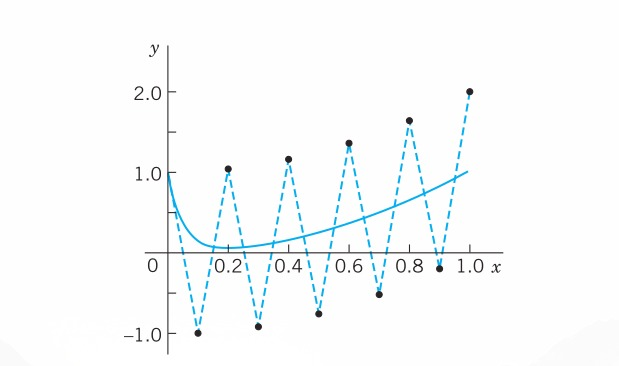{#fig-21-451}

| $x$ | BEM $h = 0.05$ | BEM $h = 0.2$ | Euler $h = 0.05$ | Euler $h = 0.1$ | RK $h = 0.1$ | RK $h = 0.2$ | Exact |
|---|---|---|---|---|---|---|---|
| 0.0 | 1.00000 | 1.00000 | 1.00000 | 1.00000 | 1.00000 | 1.00000 | 1.00000 |
| 0.1 | 0.26188 | | 0.00750 | -1.00000 | 0.34500 | | 0.14534 |
| 0.2 | 0.10484 | 0.24800 | 0.03750 | 1.04000 | 0.15333 | 5.093 | 0.05832 |
| 0.3 | 0.10809 | | 0.08750 | -0.92000 | 0.12944 | | 0.09248 |
| 0.4 | 0.16640 | 0.20960 | 0.15750 | 1.16000 | 0.17482 | 25.48 | 0.16034 |
| 0.5 | 0.25347 | | 0.24750 | -0.76000 | 0.25660 | | 0.25004 |
| 0.6 | 0.36274 | 0.37792 | 0.35750 | 1.36000 | 0.36387 | 127.0 | 0.36001 |
| 0.7 | 0.49256 | | 0.48750 | -0.52000 | 0.49296 | | 0.49001 |
| 0.8 | 0.64252 | 0.65158 | 0.63750 | 1.64000 | 0.64265 | 634.0 | 0.64000 |
| 0.9 | 0.81250 | | 0.80750 | -0.20000 | 0.81255 | | 0.81000 |
| 1.0 | 1.00250 | 1.01032 | 0.99750 | 2.00000 | 1.00252 | 3168.0 | 1.00000 |

: Backward Euler Method (BEM) for Example 4. Comparison with Euler and RK {#tbl-backward-euler}

### PROBLEM SET {#sec-ps-21-1}

#### 1–4: EULER METHOD
Do 10 steps. Solve exactly. Compute the error. Show details.
1. $y' + 0.2y = 0, \quad y(0) = 5, \quad h = 0.2$
2. $y' = \frac{1}{2}\pi \sqrt{1 - y^2}, \quad y(0) = 0, \quad h = 0.1$
3. $y' = (y - x)^2, \quad y(0) = 0, \quad h = 0.1$
4. $y' = (y + x)^2, \quad y(0) = 0, \quad h = 0.1$

#### 5–10: IMPROVED EULER METHOD
Do 10 steps. Solve exactly. Compute the error. Show details.
5. $y' = y, \quad y(0) = 1, \quad h = 0.1$
6. $y' = 2(1 + y^2), \quad y(0) = 0, \quad h = 0.05$
7. $y' - xy^2 = 0, \quad y(0) = 1, \quad h = 0.1$
8. Logistic population model: $y' = y - y^2, \quad y(0) = 0.2, \quad h = 0.1$
9. Do Prob. 7 using Euler's method with $h = 0.1$ and compare the accuracy.
10. Do Prob. 7 using the improved Euler method, 20 steps with $h = 0.05$. Compare.

#### 11–17: CLASSICAL RUNGE–KUTTA METHOD OF FOURTH ORDER
Do 10 steps. Compare as indicated. Show details.
11. $y' - xy^2 = 0, \quad y(0) = 1, \quad h = 0.1$. Compare with Prob. 7. Apply the error estimate (@eq-sec211-10) to $y_{10}$.
12. $y' = y - y^2, \quad y(0) = 0.2, \quad h = 0.1$. Compare with Prob. 8.
13. $y' = 1 + y^2, \quad y(0) = 0, \quad h = 0.1$
14. $y' = (1 - x^{-1})y, \quad y(1) = 1, \quad h = 0.1$
15. $y' + y \tan x = \sin 2x, \quad y(0) = 1, \quad h = 0.1$
16. Do Prob. 15 with $h = 0.2$, 5 steps, and compare the errors with those in Prob. 15.
17. $y' = 4x^3y^2, \quad y(0) = 0.5, \quad h = 0.1$
18. Kutta’s third-order method is defined by $y_{n+1} = y_n + \frac{1}{6}(k_1 + 4k_2 + k_3^*)$ with $k_1$ and $k_2$ as in RK (@tbl-classical-runge-kutta) and $k_3^* = hf(x_{n+1}, y_n - k_1 + 2k_2)$. Apply this method to (@eq-sec211-6) in Example 1. Choose $h = 0.2$ and do 5 steps. Compare with @tbl-accuracy-comparison.
19. **CAS EXPERIMENT. Euler–Cauchy vs. RK.** Consider the initial value problem
$$y' = (y - 0.01x^2)^2 \sin(x^2) + 0.02x, \quad y(0) = 0.4$$ {#eq-sec211-17}
(solution: $y = 1/(2.5 - S(x)) + 0.01x^2$ where $S(x)$ is the Fresnel integral (38) in App. 3.1).  
(a) Solve (@eq-sec211-17) by Euler, improved Euler, and RK methods for $0 \le x \le 5$ with step $h = 0.2$. Compare the errors for $x = 1, 3, 5$ and comment.  
(b) Graph solution curves of the ODE in (@eq-sec211-17) for various positive and negative initial values.  
(c) Do a similar experiment as in (a) for an initial value problem that has a monotone increasing or monotone decreasing solution. Compare the behavior of the error with that in (a). Comment.
20. **CAS EXPERIMENT. RKF.**  
(a) Write a program for RKF that gives $x_n, y_n$, the estimate (@eq-sec211-10), and, if the solution is known, the actual error $P_n$.  
(b) Apply the program to Example 3 in the text (10 steps, $h = 0.1$).  
(c) $P_n$ in (b) gives a relatively good idea of the size of the actual error. Is this typical or accidental? Find out, by experimentation with other problems, on what properties of the ODE or solution this might depend.

## Multistep Methods {#sec-multistep-methods}

In a one-step method we compute $y_{n+1}$ using only a single step, namely, the previous value $y_n$. One-step methods are “self-starting,” they need no help to get going because they obtain $y_1$ from the initial value $y_0$, etc. All methods in @sec-methods-first-order-odes are one-step.

In contrast, a multistep method uses, in each step, values from two or more previous steps. These methods are motivated by the expectation that the additional information will increase accuracy and stability. But to get started, one needs values, say, $y_0, y_1, y_2, y_3$ in a 4-step method, obtained by Runge–Kutta or another accurate method. Thus, multistep methods are not self-starting. Such methods are obtained as follows.

### Adams–Bashforth Methods
We consider an initial value problem

$$y' = f(x, y), \quad y(x_0) = y_0$$ {#eq-sec212-1}

as before, with $f$ such that the problem has a unique solution on some open interval containing $x_0$. We integrate $y' = f(x, y)$ from $x_n$ to $x_{n+1} = x_n + h$. This gives

$$\int_{x_n}^{x_{n+1}} y'(x) \, dx = y(x_{n+1}) - y(x_n) = \int_{x_n}^{x_{n+1}} f(x, y(x)) \, dx$$

Now comes the main idea. We replace $f(x, y(x))$ by an interpolation polynomial $p(x)$ (see <!-- TODO: replace Sec. 19.3 with actual cross-reference label -->), so that we can later integrate. This gives approximations $y_{n+1}$ of $y(x_{n+1})$ and $y_n$ of $y(x_n)$,

$$y_{n+1} = y_n + \int_{x_n}^{x_{n+1}} p(x) \, dx$$ {#eq-sec212-2}

Different choices of $p(x)$ will now produce different methods. We explain the principle by taking a cubic polynomial, namely, the polynomial $p_3(x)$ that at (equidistant) $x_n, x_{n-1}, x_{n-2}, x_{n-3}$ has the respective values

$$
\begin{aligned}
f_n &= f(x_n, y_n) \\
f_{n-1} &= f(x_{n-1}, y_{n-1}) \\
f_{n-2} &= f(x_{n-2}, y_{n-2}) \\
f_{n-3} &= f(x_{n-3}, y_{n-3})
\end{aligned}
$$ {#eq-sec212-3}

This will lead to a practically useful formula. We can obtain $p_3(x)$ from Newton’s backward difference formula (18), <!-- TODO: replace Sec. 19.3 with actual cross-reference label -->:

$$p_3(x) = f_n + r\nabla f_n + \frac{1}{2}r(r + 1)\nabla^2 f_n + \frac{1}{6}r(r + 1)(r + 2)\nabla^3 f_n$$

where

$$r = \frac{x - x_n}{h}$$

We integrate $p_3(x)$ over $x$ from $x_n$ to $x_{n+1} = x_n + h$, thus over $r$ from 0 to 1. Since $x = x_n + hr$, we have $dx = h \, dr$. The integral of $\frac{1}{2}r(r + 1)$ is $\frac{5}{12}$ and that of $\frac{1}{6}r(r + 1)(r + 2)$ is $\frac{3}{8}$. We thus obtain

$$\int_{x_n}^{x_{n+1}} p_3 \, dx = h \int_{0}^{1} p_3 \, dr = h \left( f_n + \frac{1}{2}\nabla f_n + \frac{5}{12}\nabla^2 f_n + \frac{3}{8}\nabla^3 f_n \right)$$ {#eq-sec212-4}

It is practical to replace these differences by their expressions in terms of $f$:

$$
\begin{aligned}
\nabla f_n &= f_n - f_{n-1} \\
\nabla^2 f_n &= f_n - 2f_{n-1} + f_{n-2} \\
\nabla^3 f_n &= f_n - 3f_{n-1} + 3f_{n-2} - f_{n-3}
\end{aligned}
$$

We substitute this into (@eq-sec212-4) and collect terms. This gives the multistep formula of the Adams–Bashforth method^2^ of fourth order

$$y_{n+1} = y_n + \frac{h}{24}(55f_n - 59f_{n-1} + 37f_{n-2} - 9f_{n-3})$$ {#eq-sec212-5}

It expresses the new value $y_{n+1}$ [approximation of the solution $y$ of (@eq-sec212-1) at $x_{n+1}$] in terms of 4 values of $f$ computed from the $y$-values obtained in the preceding 4 steps. The local truncation error is of order $h^5$, as can be shown, so that the global error is of order $h^4$; hence (@eq-sec212-5) does define a fourth-order method.

> ^2^ Named after JOHN COUCH ADAMS (1819–1892), English astronomer and mathematician, one of the predictors of the existence of the planet Neptune (using mathematical calculations), director of the Cambridge Observatory; and FRANCIS BASHFORTH (1819–1912), English mathematician.

### Adams–Moulton Methods
Adams–Moulton methods are obtained if for $p(x)$ in (@eq-sec212-2) we choose a polynomial that interpolates $f(x, y(x))$ at $x_{n+1}, x_n, x_{n-1}, \dots$ (as opposed to $x_n, x_{n-1}, \dots$ used before; this is the main point). We explain the principle for the cubic polynomial $\tilde{p}_3(x)$ that interpolates at $x_{n+1}, x_n, x_{n-1}, x_{n-2}$. (Before we had $x_n, x_{n-1}, x_{n-2}, x_{n-3}$.) Again using (18) in <!-- TODO: replace Sec. 19.3 with actual cross-reference label --> but now setting $r = (x - x_{n+1})/h$, we have

$$\tilde{p}_3(x) = f_{n+1} + r\nabla f_{n+1} + \frac{1}{2}r(r + 1)\nabla^2 f_{n+1} + \frac{1}{6}r(r + 1)(r + 2)\nabla^3 f_{n+1}$$

We now integrate over $x$ from $x_n$ to $x_{n+1}$ as before. This corresponds to integrating over $r$ from $-1$ to $0$. We obtain

$$\int_{x_n}^{x_{n+1}} \tilde{p}_3(x) \, dx = h \left( f_{n+1} - \frac{1}{2}\nabla f_{n+1} - \frac{1}{12}\nabla^2 f_{n+1} - \frac{1}{24}\nabla^3 f_{n+1} \right)$$

Replacing the differences as before gives

$$y_{n+1} = y_n + \int_{x_n}^{x_{n+1}} \tilde{p}_3(x) \, dx = y_n + \frac{h}{24}(9f_{n+1} + 19f_n - 5f_{n-1} + f_{n-2})$$ {#eq-sec212-6}

This is usually called an Adams–Moulton formula.^3^ It is an implicit formula because $f_{n+1} = f(x_{n+1}, y_{n+1})$ appears on the right, so that it defines $y_{n+1}$ only implicitly, in contrast to (@eq-sec212-5), which is an explicit formula, not involving $y_{n+1}$ on the right. To use (@eq-sec212-6) we must predict a value $y_{n+1}^*$, for instance, by using (@eq-sec212-5), that is,

$$y_{n+1}^* = y_n + \frac{h}{24}(55f_n - 59f_{n-1} + 37f_{n-2} - 9f_{n-3})$$ {#eq-sec212-7a}

The corrected new value $y_{n+1}$ is then obtained from (@eq-sec212-6) with $f_{n+1}$ replaced by $f_{n+1}^* = f(x_{n+1}, y_{n+1}^*)$ and the other $f$’s as in (@eq-sec212-6); thus,

$$y_{n+1} = y_n + \frac{h}{24}(9f_{n+1}^* + 19f_n - 5f_{n-1} + f_{n-2})$$ {#eq-sec212-7b}

This predictor–corrector method (@eq-sec212-7a), (@eq-sec212-7b) is usually called the Adams–Moulton method of fourth order. It has the advantage over RK that (@eq-sec212-7a), (@eq-sec212-7b) gives the error estimate

$$P_{n+1} \approx \frac{1}{15}(y_{n+1} - y_{n+1}^*)$$

as can be shown. This is the analog of (@eq-sec211-10) in @sec-methods-first-order-odes.

> ^3^ FOREST RAY MOULTON (1872–1952), American astronomer at the University of Chicago. For ADAMS see footnote 2.

Sometimes the name Adams–Moulton method is reserved for the method with several corrections per step by (@eq-sec212-7b) until a specific accuracy is reached. Popular codes exist for both versions of the method.

**Getting Started.** In (@eq-sec212-5) we need $f_0, f_1, f_2, f_3$. Hence from (@eq-sec212-3) we see that we must first compute $y_1, y_2, y_3$ by some other method of comparable accuracy, for instance, by RK or by RKF. For other choices see Ref. [E26] listed in App. 1.

### EXAMPLE 1: Adams–Bashforth Prediction (@eq-sec212-7a), Adams–Moulton Correction (@eq-sec212-7b)
Solve the initial value problem

$$y' = x + y, \quad y(0) = 0$$ {#eq-sec212-8}

by (@eq-sec212-7a), (@eq-sec212-7b) on the interval $0 \le x \le 2$, choosing $h = 0.2$.

**Solution.**  
The problem is the same as in Examples 1 and 2, @sec-methods-first-order-odes, so that we can compare the results. We compute starting values $y_1, y_2, y_3$ by the classical Runge–Kutta method. Then in each step we predict by (@eq-sec212-7a) and make one correction by (@eq-sec212-7b) before we execute the next step. The results are shown and compared with the exact values in @tbl-adams-moulton. We see that the corrections improve the accuracy considerably. This is typical. $\blacksquare$

| $n$ | $x_n$ | Starting $y_n$ | Predicted $y_n^*$ | Corrected $y_n$ | Exact Values | $10^6 \times \text{Error}$ |
|---|---|---|---|---|---|---|
| 0 | 0.0 | 0.000000 | | | 0.000000 | 0 |
| 1 | 0.2 | 0.021400 | | | 0.021403 | 3 |
| 2 | 0.4 | 0.091818 | | | 0.091825 | 7 |
| 3 | 0.6 | 0.222107 | | | 0.222119 | 12 |
| 4 | 0.8 | | 0.425361 | 0.425529 | 0.425541 | 12 |
| 5 | 1.0 | | 0.718066 | 0.718270 | 0.718282 | 12 |
| 6 | 1.2 | | 1.119855 | 1.120106 | 1.120117 | 11 |
| 7 | 1.4 | | 1.654885 | 1.655191 | 1.655200 | 9 |
| 8 | 1.6 | | 2.352653 | 2.353026 | 2.353032 | 6 |
| 9 | 1.8 | | 3.249190 | 3.249646 | 3.249647 | 1 |
| 10 | 2.0 | | 4.388505 | 4.389062 | 4.389056 | -6 |

: Adams–Moulton Method Applied to the Initial Value Problem (@eq-sec212-8); Predicted Values Computed by (@eq-sec212-7a) and Corrected Values by (@eq-sec212-7b) {#tbl-adams-moulton}

### Comments on Comparison of Methods
An Adams–Moulton formula is generally much more accurate than an Adams–Bashforth formula of the same order. This justifies the greater complication and expense in using the former. The method (@eq-sec212-7a), (@eq-sec212-7b) is numerically stable, whereas the exclusive use of (@eq-sec212-7a) might cause instability. Step size control is relatively simple. If $| \text{Corrector} - \text{Predictor} | > \text{TOL}$, use interpolation to generate “old” results at half the current step size and then try $h/2$ as the new step.

Whereas the Adams–Moulton formula (@eq-sec212-7a), (@eq-sec212-7b) needs only 2 evaluations per step, Runge–Kutta needs 4; however, with Runge–Kutta one may be able to take a step size more than twice as large, so that a comparison of this kind (widespread in the literature) is meaningless.

For more details, see Refs. [E25], [E26] listed in App. 1.

### PROBLEM SET {#sec-ps-21-2}

#### 1–10: ADAMS–MOULTON METHOD
Solve the initial value problem by Adams–Moulton (@eq-sec212-7a), (@eq-sec212-7b), 10 steps with 1 correction per step. Solve exactly and compute the error. Use RK where no starting values are given.
1. $y' = y, \quad y(0) = 1, \quad h = 0.1$, starting values: $(1.105171, 1.221403, 1.349858)$
2. $y' = 2xy, \quad y(0) = 1, \quad h = 0.1$
3. $y' = 1 + y^2, \quad y(0) = 0, \quad h = 0.1$, starting values: $(0.100335, 0.202710, 0.309336)$
4. Do Prob. 2 by RK, 5 steps, $h = 0.2$. Compare the errors.
5. Do Prob. 3 by RK, 5 steps, $h = 0.2$. Compare the errors.
6. $y' = (y - x - 1)^2 + 2, \quad y(0) = 1, \quad h = 0.1$, 10 steps
7. $y' = 3y - 12y^2, \quad y(0) = 0.2, \quad h = 0.1$
8. $y' = 1 - 4y^2, \quad y(0) = 0, \quad h = 0.1$
9. $y' = 3x^2(1 + y), \quad y(0) = 0, \quad h = 0.05$
10. $y' = x/y, \quad y(1) = 3, \quad h = 0.2$
11. Do and show the calculations leading to (4)–(7) in the text.
12. **Quadratic polynomial.** Apply the method in the text to a polynomial of second degree. Show that this leads to the predictor and corrector formulas
$$y_{n+1}^* = y_n + \frac{h}{12}(23f_n - 16f_{n-1} + 5f_{n-2})$$
$$y_{n+1} = y_n + \frac{h}{12}(5f_{n+1}^* + 8f_n - f_{n-1})$$
13. Using Prob. 12, solve $y' = 2xy, \quad y(0) = 1$ (10 steps, $h = 0.1$, RK starting values). Compare with the exact solution and comment.
14. How much can you reduce the error in Prob. 13 by halving $h$ (20 steps, $h = 0.05$)? First guess, then compute.
(d) The classical RK method often gives the same accuracy with step $2h$ as Adams–Moulton with step $h$, so that the total number of function evaluations is the same in both cases. Illustrate this with Prob. 8. (Hence corresponding comparisons in the literature in favor of Adams–Moulton are not valid. See also Probs. 6 and 7.)

## Methods for Systems and Higher Order ODEs {#sec-methods-systems-higher-order}

Initial value problems for first-order systems of ODEs are of the form

$$\mathbf{y}' = \mathbf{f}(x, \mathbf{y}), \quad \mathbf{y}(x_0) = \mathbf{y}_0$$ {#eq-sec213-1}

in components:

$$
\begin{aligned}
y_1' &= f_1(x, y_1, \dots, y_m), \quad y_1(x_0) = y_{10} \\
y_2' &= f_2(x, y_1, \dots, y_m), \quad y_2(x_0) = y_{20} \\
&\dots \\
y_m' &= f_m(x, y_1, \dots, y_m), \quad y_m(x_0) = y_{m0}
\end{aligned}
$$

Here, $\mathbf{f}$ is assumed to be such that the problem has a unique solution $\mathbf{y}(x)$ on some open $x$-interval containing $x_0$. Our discussion will be independent of <!-- TODO: replace Chapter 4 with actual chapter label -->Chapter 4 on systems.

Before explaining solution methods it is important to note that (@eq-sec213-1) includes initial value problems for single $m$th-order ODEs,

$$y^{(m)} = f(x, y, y', y'', \dots, y^{(m-1)})$$ {#eq-sec213-2}

and initial conditions $y(x_0) = K_1, y'(x_0) = K_2, \dots, y^{(m-1)}(x_0) = K_m$ as special cases. Indeed, the connection is achieved by setting

$$y_1 = y, \quad y_2 = y', \quad y_3 = y'', \quad \dots, \quad y_m = y^{(m-1)}$$ {#eq-sec213-3}

Then we obtain the system

$$
\begin{aligned}
y_1' &= y_2 \\
y_2' &= y_3 \\
&\dots \\
y_{m-1}' &= y_m \\
y_m' &= f(x, y_1, \dots, y_m)
\end{aligned}
$$ {#eq-sec213-4}

and the initial conditions $y_1(x_0) = K_1, y_2(x_0) = K_2, \dots, y_m(x_0) = K_m$.

### Euler Method for Systems
Methods for single first-order ODEs can be extended to systems (@eq-sec213-1) simply by writing vector functions $\mathbf{y}$ and $\mathbf{f}$ instead of scalar functions $y$ and $f$, whereas $x$ remains a scalar variable. We begin with the Euler method. Just as for a single ODE, this method will not be accurate enough for practical purposes, but it nicely illustrates the extension principle.

### EXAMPLE 1: Euler Method for a Second-Order ODE. Mass–Spring System
Solve the initial value problem for a damped mass–spring system

$$y'' + 2y' + 0.75y = 0, \quad y(0) = 3, \quad y'(0) = -2.5$$

by the Euler method for systems with step $h = 0.2$ for $x$ from 0 to 1 (where $x$ is time).

**Solution.**  
The Euler method (@eq-sec211-3), @sec-methods-first-order-odes, generalizes to systems in the form

$$\mathbf{y}_{n+1} = \mathbf{y}_n + h\mathbf{f}(x_n, \mathbf{y}_n)$$ {#eq-sec213-5}

in components:

$$
\begin{aligned}
y_{1,n+1} &= y_{1,n} + h f_1(x_n, y_{1,n}, y_{2,n}) \\
y_{2,n+1} &= y_{2,n} + h f_2(x_n, y_{1,n}, y_{2,n})
\end{aligned}
$$

and similarly for systems of more than two equations. By (@eq-sec213-4) the given ODE converts to the system

$$
\begin{aligned}
y_1' &= f_1(x, y_1, y_2) = y_2 \\
y_2' &= f_2(x, y_1, y_2) = -2y_2 - 0.75y_1
\end{aligned}
$$

Hence (@eq-sec213-5) becomes

$$
\begin{aligned}
y_{1,n+1} &= y_{1,n} + 0.2y_{2,n} \\
y_{2,n+1} &= y_{2,n} + 0.2(-2y_{2,n} - 0.75y_{1,n})
\end{aligned}
$$

The initial conditions are $y(0) = y_1(0) = 3, y'(0) = y_2(0) = -2.5$. The calculations are shown in @tbl-euler-systems. As for single ODEs, the results would not be accurate enough for practical purposes. The example merely serves to illustrate the method because the problem can be readily solved exactly,

$$y = y_1 = 2e^{-0.5x} + e^{-1.5x}, \quad \text{thus} \quad y' = y_2 = -e^{-0.5x} - 1.5e^{-1.5x}$$  $\blacksquare$

| $n$ | $x_n$ | $y_{1,n}$ | $y_1$ Exact (5D) | Error $\epsilon_1 = y_1 - y_{1,n}$ | $y_{2,n}$ | $y_2$ Exact (5D) | Error $\epsilon_2 = y_2 - y_{2,n}$ |
|---|---|---|---|---|---|---|---|
| 0 | 0.0 | 3.00000 | 3.00000 | 0.00000 | -2.50000 | -2.50000 | 0.00000 |
| 1 | 0.2 | 2.50000 | 2.55049 | 0.05049 | -1.95000 | -2.01606 | -0.06606 |
| 2 | 0.4 | 2.11000 | 2.18627 | 0.07627 | -1.54500 | -1.64195 | -0.09695 |
| 3 | 0.6 | 1.80100 | 1.88821 | 0.08721 | -1.24350 | -1.35067 | -0.10717 |
| 4 | 0.8 | 1.55230 | 1.64183 | 0.08953 | -1.01625 | -1.12211 | -0.10586 |
| 5 | 1.0 | 1.34905 | 1.43619 | 0.08714 | -0.84260 | -0.94123 | -0.09863 |

: Euler Method for Systems in Example 1 (Mass–Spring System) {#tbl-euler-systems}

### Runge–Kutta Methods for Systems
As for Euler methods, we obtain RK methods for an initial value problem (@eq-sec213-1) simply by writing vector formulas for vectors with $m$ components, which, for $m = 1$, reduce to the previous scalar formulas.

Thus, for the classical RK method of fourth order in @tbl-classical-runge-kutta, we obtain

$$\mathbf{y}(x_0) = \mathbf{y}_0$$ {#eq-sec213-6a}

and for each step $n = 0, 1, \dots, N-1$ we obtain the 4 auxiliary quantities

$$
\begin{aligned}
\mathbf{k}_1 &= h\mathbf{f}(x_n, \mathbf{y}_n) \\
\mathbf{k}_2 &= h\mathbf{f}(x_n + \frac{1}{2}h, \mathbf{y}_n + \frac{1}{2}\mathbf{k}_1) \\
\mathbf{k}_3 &= h\mathbf{f}(x_n + \frac{1}{2}h, \mathbf{y}_n + \frac{1}{2}\mathbf{k}_2) \\
\mathbf{k}_4 &= h\mathbf{f}(x_n + h, \mathbf{y}_n + \mathbf{k}_3)
\end{aligned}
$$ {#eq-sec213-6b}

and the new value [approximation of the solution $\mathbf{y}(x)$ at $x_{n+1} = x_0 + (n+1)h$]

$$\mathbf{y}_{n+1} = \mathbf{y}_n + \frac{1}{6}(\mathbf{k}_1 + 2\mathbf{k}_2 + 2\mathbf{k}_3 + \mathbf{k}_4)$$ {#eq-sec213-6c}

### EXAMPLE 2: RK Method for Systems. Airy’s Equation. Airy Function $\text{Ai}(x)$
Solve the initial value problem

$$y'' = xy, \quad y(0) = \frac{1}{3^{2/3}\Gamma(2/3)} \approx 0.35502805, \quad y'(0) = -\frac{1}{3^{1/3}\Gamma(1/3)} \approx -0.25881940$$

by the Runge–Kutta method for systems with $h = 0.2$; do 5 steps. This is Airy’s equation,^4^ which arose in optics (see Ref. [A13], p. 188, listed in App. 1). $\Gamma$ is the gamma function (see App. A3.1). The initial conditions are such that we obtain a standard solution, the Airy function $\text{Ai}(x)$, a special function that has been thoroughly investigated; for numeric values, see Ref. [GenRef1], pp. 446, 475.

**Solution.**  
For $y'' = xy$, setting $y_1 = y, y_2 = y_1' = y'$ we obtain the system (@eq-sec213-4):

$$
\begin{aligned}
y_1' &= y_2 \\
y_2' &= xy_1
\end{aligned}
$$

Hence $\mathbf{f} = [f_1 \quad f_2]^T$ in (@eq-sec213-1) has the components $f_1(x, \mathbf{y}) = y_2, f_2(x, \mathbf{y}) = xy_1$. We now write (@eq-sec213-6b) in components. The initial conditions (@eq-sec213-6a) are $y_{1,0} = 0.35502805, y_{2,0} = -0.25881940$. In (@eq-sec213-6b) we have fewer subscripts by simply writing $\mathbf{k}_1 = \mathbf{a}, \mathbf{k}_2 = \mathbf{b}, \mathbf{k}_3 = \mathbf{c}, \mathbf{k}_4 = \mathbf{d}$, so that $\mathbf{a} = [a_1 \quad a_2]^T$, etc. Then (@eq-sec213-6b) takes the form

$$
\begin{aligned}
\mathbf{a} &= h \begin{pmatrix} y_{2,n} \\ x_n y_{1,n} \end{pmatrix} \\
\mathbf{b} &= h \begin{pmatrix} y_{2,n} + \frac{1}{2}a_2 \\ (x_n + \frac{1}{2}h)(y_{1,n} + \frac{1}{2}a_1) \end{pmatrix} \\
\mathbf{c} &= h \begin{pmatrix} y_{2,n} + \frac{1}{2}b_2 \\ (x_n + \frac{1}{2}h)(y_{1,n} + \frac{1}{2}b_1) \end{pmatrix} \\
\mathbf{d} &= h \begin{pmatrix} y_{2,n} + c_2 \\ (x_n + h)(y_{1,n} + c_1) \end{pmatrix}
\end{aligned}
$$ {#eq-sec213-6bstar}

For example, the second component of $\mathbf{b}$ is obtained as follows. $\mathbf{f}(x, \mathbf{y})$ has the second component $f_2(x, \mathbf{y}) = xy_1$. Now in $\mathbf{b}$ ($= \mathbf{k}_2$) the first argument is $x_n + \frac{1}{2}h$. The second argument in $\mathbf{b}$ is $\mathbf{y}_n + \frac{1}{2}\mathbf{a}$, and the first component of this is $y_{1,n} + \frac{1}{2}a_1$. Together, $xy_1 = (x_n + \frac{1}{2}h)(y_{1,n} + \frac{1}{2}a_1)$. Similarly for the other components in (@eq-sec213-6bstar). Finally,

$$\mathbf{y}_{n+1} = \mathbf{y}_n + \frac{1}{6}(\mathbf{a} + 2\mathbf{b} + 2\mathbf{c} + \mathbf{d})$$ {#eq-sec213-6cstar}

@tbl-rk-systems shows the values $y(x) = y_1(x)$ of the Airy function $\text{Ai}(x)$ and of its derivative $y'(x) = y_2(x)$ as well as of the (rather small!) error of $y(x)$.  $\blacksquare$

> ^4^ Named after Sir GEORGE BIDELL AIRY (1801–1892), English mathematician, who is known for his work in elasticity and in PDEs.

| $n$ | $x_n$ | $y_{1,n}(x_n)$ | $y_1(x_n)$ Exact (8D) | $10^8 \times \text{Error of } y_1$ | $y_{2,n}(x_n)$ |
|---|---|---|---|---|---|
| 0 | 0.0 | 0.35502805 | 0.35502805 | 0 | -0.25881940 |
| 1 | 0.2 | 0.30370303 | 0.30370315 | 12 | -0.25240464 |
| 2 | 0.4 | 0.25474211 | 0.25474235 | 24 | -0.23583073 |
| 3 | 0.6 | 0.20979973 | 0.20980006 | 33 | -0.21279185 |
| 4 | 0.8 | 0.16984596 | 0.16984632 | 36 | -0.18641171 |
| 5 | 1.0 | 0.13529207 | 0.13529242 | 35 | -0.15914687 |

: RK Method for Systems: Values $y_{1,n}(x_n)$ of the Airy Function $\text{Ai}(x)$ in Example 2 {#tbl-rk-systems}

### Runge–Kutta–Nyström Methods (RKN Methods)
RKN methods are direct extensions of RK methods (Runge–Kutta methods) to second-order ODEs $y'' = f(x, y, y')$, as given by the Finnish mathematician E. J. Nyström [Acta Soc. Sci. fenn., 1925, L, No. 13]. The best known of these uses the following formulas, where $n = 0, 1, \dots, N-1$ ($N$ the number of steps):

$$
\begin{aligned}
k_1 &= \frac{1}{2}hf(x_n, y_n, y'_n) \\
k_2 &= \frac{1}{2}hf\left(x_n + \frac{1}{2}h, y_n + K, y'_n + k_1\right) \quad \text{where } K = \frac{1}{2}h\left(y'_n + \frac{1}{2}k_1\right) \\
k_3 &= \frac{1}{2}hf\left(x_n + \frac{1}{2}h, y_n + K, y'_n + k_2\right) \\
k_4 &= \frac{1}{2}hf\left(x_n + h, y_n + L, y'_n + 2k_3\right) \quad \text{where } L = h(y'_n + k_3)
\end{aligned}
$$ {#eq-sec213-7a}

From this we compute the approximation $y_{n+1}$ of $y(x_{n+1})$ at $x_{n+1} = x_0 + (n+1)h$,

$$y_{n+1} = y_n + h \left(y'_n + \frac{1}{3}(k_1 + k_2 + k_3)\right)$$ {#eq-sec213-7b}

and the approximation $y'_{n+1}$ of the derivative $y'(x_{n+1})$ needed in the next step,

$$y'_{n+1} = y'_n + \frac{1}{3}(k_1 + 2k_2 + 2k_3 + k_4)$$ {#eq-sec213-7c}

**RKN for ODEs $y'' = f(x, y)$ Not Containing $y'$.** Then $k_2 = k_3$ in (@eq-sec213-7a), which makes the method particularly advantageous and reduces (@eq-sec213-7a)–(@eq-sec213-7c) to:

$$
\begin{aligned}
k_1 &= \frac{1}{2}hf(x_n, y_n) \\
k_2 &= \frac{1}{2}hf\left(x_n + \frac{1}{2}h, y_n + \frac{1}{2}h\left(y'_n + \frac{1}{2}k_1\right)\right) \\
k_4 &= \frac{1}{2}hf\left(x_n + h, y_n + h(y'_n + k_2)\right) \\
y_{n+1} &= y_n + h\left(y'_n + \frac{1}{3}(k_1 + 2k_2)\right) \\
y'_{n+1} &= y'_n + \frac{1}{3}(k_1 + 4k_2 + k_4)
\end{aligned}
$$ {#eq-sec213-7star}

### EXAMPLE 3: RKN Method. Airy’s Equation. Airy Function $\text{Ai}(x)$
For the problem in Example 2 and $h = 0.2$ as before we obtain from (@eq-sec213-7star) simply $k_1 = 0.1x_n y_n$ and

$$
\begin{aligned}
k_2 &= 0.1(x_n + 0.1)(y_n + 0.1y'_n + 0.05k_1) \\
k_4 &= 0.1(x_n + 0.2)(y_n + 0.2y'_n + 0.2k_2)
\end{aligned}
$$

@tbl-rkn-applied shows the results. The accuracy is the same as in Example 2, but the work was much less. $\blacksquare$

| $x_n$ | $y_n$ | $y'_n$ | $y(x)$ Exact (8D) | $10^8 \times \text{Error of } y_n$ |
|---|---|---|---|---|
| 0.0 | 0.35502805 | -0.25881940 | 0.35502805 | 0 |
| 0.2 | 0.30370304 | -0.25240464 | 0.30370315 | 11 |
| 0.4 | 0.25474211 | -0.23583070 | 0.25474235 | 24 |
| 0.6 | 0.20979974 | -0.21279172 | 0.20980006 | 32 |
| 0.8 | 0.16984599 | -0.18641134 | 0.16984632 | 33 |
| 1.0 | 0.13529218 | -0.15914609 | 0.13529242 | 24 |

: Runge–Kutta–Nyström Method Applied to Airy’s Equation, Computation of the Airy Function $y = \text{Ai}(x)$ {#tbl-rkn-applied}

Our work in Examples 2 and 3 also illustrates that usefulness of methods for ODEs in the computation of values of “higher transcendental functions.”

### Backward Euler Method for Systems. Stiff Systems
The backward Euler formula (@eq-sec211-16) in @sec-methods-first-order-odes generalizes to systems in the form

$$\mathbf{y}_{n+1} = \mathbf{y}_n + h\mathbf{f}(x_{n+1}, \mathbf{y}_{n+1}) \quad (n = 0, 1, \dots)$$ {#eq-sec213-8}

This is again an implicit method, giving $\mathbf{y}_{n+1}$ implicitly for given $\mathbf{y}_n$. Hence (@eq-sec213-8) must be solved for $\mathbf{y}_{n+1}$. For a linear system this is shown in the next example. This example also illustrates that, similar to the case of a single ODE in @sec-methods-first-order-odes, the method is very useful for stiff systems. These are systems of ODEs whose matrix has eigenvalues $\lambda$ of very different magnitudes, having the effect that, just as in @sec-methods-first-order-odes, the step in direct methods, RK for example, cannot be increased beyond a certain threshold without losing stability. ($\lambda = -1$ and $-10$ in Example 4, but larger differences do occur in applications.)

### EXAMPLE 4: Backward Euler Method for Systems of ODEs. Stiff Systems
Compare the backward Euler method (@eq-sec213-8) with the Euler and the RK methods for numerically solving the initial value problem

$$y'' + 11y' + 10y = 10x + 11, \quad y(0) = 2, \quad y'(0) = -10$$

converted to a system of first-order ODEs.

**Solution.**  
The given problem can easily be solved, obtaining

$$y = e^{-x} + e^{-10x} + x$$

so that we can compute errors. Conversion to a system by setting $y = y_1, y' = y_2$ [see (@eq-sec213-3)] gives

$$
\begin{aligned}
y_1' &= y_2, \quad y_1(0) = 2 \\
y_2' &= -10y_1 - 11y_2 + 10x + 11, \quad y_2(0) = -10
\end{aligned}
$$

The coefficient matrix

$$\mathbf{A} = \begin{pmatrix} 0 & 1 \\ -10 & -11 \end{pmatrix}$$

has the characteristic determinant

$$\det(\mathbf{A} - \lambda\mathbf{I}) = \begin{vmatrix} -\lambda & 1 \\ -10 & -\lambda - 11 \end{vmatrix} = \lambda^2 + 11\lambda + 10 = (\lambda + 1)(\lambda + 10)$$

Hence the eigenvalues are $\lambda = -1$ and $-10$ as claimed above. The backward Euler formula is

$$\mathbf{y}_{n+1} = \begin{pmatrix} y_{1,n+1} \\ y_{2,n+1} \end{pmatrix} = \begin{pmatrix} y_{1,n} \\ y_{2,n} \end{pmatrix} + h \begin{pmatrix} y_{2,n+1} \\ -10y_{1,n+1} - 11y_{2,n+1} + 10x_{n+1} + 11 \end{pmatrix}$$

Reordering terms gives the linear system in the unknowns $y_{1,n+1}$ and $y_{2,n+1}$:

$$
\begin{aligned}
y_{1,n+1} - hy_{2,n+1} &= y_{1,n} \\
10hy_{1,n+1} + (1 + 11h)y_{2,n+1} &= y_{2,n} + 10h(x_n + h) + 11h
\end{aligned}
$$

The coefficient determinant is $D = 1 + 11h + 10h^2$, and Cramer’s rule (in <!-- TODO: replace Sec. 7.6 with actual cross-reference label -->) gives the solution

$$\mathbf{y}_{n+1} = \frac{1}{D} \begin{pmatrix} (1 + 11h)y_{1,n} + hy_{2,n} + 10h^2 x_n + 11h^2 + 10h^3 \\ -10hy_{1,n} + y_{2,n} + 10hx_n + 11h + 10h^2 \end{pmatrix}$$

@tbl-backward-euler-systems shows the results.

| $x$ | BEM $h = 0.2$ | BEM $h = 0.4$ | Euler $h = 0.1$ | Euler $h = 0.2$ | RK $h = 0.2$ | RK $h = 0.3$ | Exact |
|---|---|---|---|---|---|---|---|
| 0.0 | 2.00000 | 2.00000 | 2.00000 | 2.00000 | 2.00000 | 2.00000 | 2.00000 |
| 0.2 | 1.36667 | | 1.01000 | 0.00000 | 1.35207 | | 1.15407 |
| 0.4 | 1.20556 | 1.31429 | 1.56100 | 2.04000 | 1.18144 | | 1.08864 |
| 0.6 | 1.21574 | | 1.13144 | 0.11200 | 1.18585 | 1.35020 | 1.15129 |
| 0.8 | 1.29460 | 1.35020 | 1.23047 | 2.20960 | 1.26168 | | 1.24966 |
| 1.0 | 1.40599 | | 1.34868 | 0.32768 | 1.37200 | | 1.36792 |
| 1.2 | 1.53627 | 1.57243 | 1.48243 | 2.46214 | 1.50257 | 1.86191 | 1.50120 |
| 1.4 | 1.67954 | | 1.62877 | 0.60972 | 1.64706 | | 1.64660 |
| 1.6 | 1.83272 | 1.86191 | 1.78530 | 2.76777 | 1.80205 | | 1.80190 |
| 1.8 | 1.99386 | | 1.95009 | 0.93422 | 1.96535 | 3.03947 | 1.96530 |
| 2.0 | 2.16152 | 2.18625 | 2.12158 | 3.10737 | 2.13536 | | 2.13534 |

: Backward Euler Method (BEM) for Example 4. Comparison with Euler and RK {#tbl-backward-euler-systems}

@tbl-backward-euler-systems shows the following:
1. Stability of the backward Euler method for $h = 0.2$ and $0.4$ (and in fact for any $h$; try $h = 5.0$) with decreasing accuracy for increasing $h$.
2. Stability of the Euler method for $h = 0.1$ but instability for $h = 0.2$.
3. Stability of RK for $h = 0.2$ but instability for $h = 0.3$.

@fig-21-452 shows the Euler method for $h = 0.18$, an interesting case with initial jumping (for about $x > 3$) but later monotone following the solution curve of $y = y_1$. See also CAS Experiment 15. $\blacksquare$

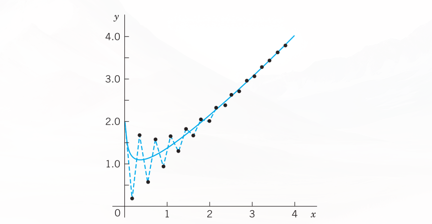{#fig-21-452}

### PROBLEM SET {#sec-ps-21-3}

#### 1–6: EULER FOR SYSTEMS AND SECOND-ORDER ODEs
Solve by the Euler method. Graph the solution in the $y_1 y_2$-plane. Calculate the errors.
1. $y_1' = 2y_1 - 4y_2, \quad y_2' = y_1 - 3y_2, \quad y_1(0) = 3, \quad y_2(0) = 0, \quad h = 0.1, \quad 10$ steps.
2. **Spiral.** $y_1' = -y_1 + y_2, \quad y_2' = -y_1 - y_2, \quad y_1(0) = 0, \quad y_2(0) = 4, \quad h = 0.2, \quad 5$ steps.
3. $y'' + \frac{1}{4}y = 0, \quad y(0) = 1, \quad y'(0) = 0, \quad h = 0.2, \quad 5$ steps.
4. $y_1' = -3y_1 + y_2, \quad y_2' = y_1 - 3y_2, \quad y_1(0) = 2, \quad y_2(0) = 0, \quad h = 0.1, \quad 5$ steps.
5. $y'' - y = x, \quad y(0) = 1, \quad y'(0) = -2, \quad h = 0.1, \quad 5$ steps.
6. $y_1' = y_1, \quad y_2' = -y_2, \quad y_1(0) = 2, \quad y_2(0) = 2, \quad h = 0.1, \quad 10$ steps.

#### 7–10: RK FOR SYSTEMS
Solve by the classical RK.
7. The ODE in Prob. 5. By what factor did the error decrease?
8. The system in Prob. 2.
9. The system in Prob. 1.
10. The system in Prob. 4.
11. **Pendulum equation.** $y'' + \sin y = 0, \quad y(\pi) = 0, \quad y'(\pi) = 1$, as a system, $h = 0.2$, 20 steps. How does your result fit into <!-- TODO: replace Fig. 93 with actual figure reference -->Fig. 93 in <!-- TODO: replace Sec. 4.5 with actual cross-reference label -->Sec. 4.5?
12. **Bessel Function $J_0$.** $xy'' + y' + xy = 0, \quad y(1) = 0.765198, \quad y'(1) = -0.440051, \quad h = 0.5$, 5 steps. (This gives the standard solution $J_0(x)$ in <!-- TODO: replace Fig. 110 with actual figure reference -->Fig. 110 in <!-- TODO: replace Sec. 5.4 with actual cross-reference label -->Sec. 5.4.)
13. Verify the formulas and calculations for the Airy equation in Example 2 of the text.
14. **RKN.** The classical RK for a first-order ODE extends to second-order ODEs (E. J. Nyström, Acta fenn. No 13, 1925). If the ODE is $y'' = f(x, y)$, not containing $y'$, then
$$
\begin{aligned}
k_1 &= \frac{1}{2}hf(x_n, y_n) \\
k_2 &= \frac{1}{2}hf\left(x_n + \frac{1}{2}h, y_n + \frac{1}{2}h\left(y'_n + \frac{1}{2}k_1\right)\right) \\
k_4 &= \frac{1}{2}hf\left(x_n + h, y_n + h(y'_n + k_2)\right) \\
y_{n+1} &= y_n + h\left(y'_n + \frac{1}{3}(k_1 + 2k_2)\right) \\
y'_{n+1} &= y'_n + \frac{1}{3}(k_1 + 4k_2 + k_4)
\end{aligned}
$$
Apply this RKN (Runge–Kutta–Nyström) method to the Airy ODE in Example 2 with $h = 0.2$ as before, to obtain approximate values of $\text{Ai}(x)$.
(d) Compute and graph backward Euler values for large $h$; confirm stability and investigate the error increase for growing $h$.

## Methods for Elliptic PDEs {#sec-methods-elliptic-pdes}

We have arrived at the second half of this chapter, which is devoted to numerics for partial differential equations (PDEs). As we have seen in <!-- TODO: replace Chapter 12 with actual chapter label -->Chapter 12, there are many applications of PDEs, such as in dynamics, elasticity, heat transfer, electromagnetic theory, quantum mechanics, and others. Selected because of their importance in applications, the PDEs covered here include the Laplace equation, the Poisson equation, the heat equation, and the wave equation. By covering these equations based on their importance in applications we also selected equations that are important for theoretical considerations. Indeed, these equations serve as models for elliptic, parabolic, and hyperbolic PDEs. For example, the Laplace equation is a representative example of an elliptic type of PDE, and so forth.

Recall, from <!-- TODO: replace Sec. 12.4 with actual cross-reference label -->, that a PDE is called quasilinear if it is linear in the highest derivatives. Hence a second-order quasilinear PDE in two independent variables $x, y$ is of the form

$$au_{xx} + 2bu_{xy} + cu_{yy} = F(x, y, u, u_x, u_y)$$ {#eq-sec214-1}

$u$ is an unknown function of $x$ and $y$ (a solution sought). $F$ is a given function of the indicated variables. Depending on the discriminant $ac - b^2$, the PDE (@eq-sec214-1) is said to be of:
- **elliptic type** if $ac - b^2 > 0$ (example: Laplace equation)
- **parabolic type** if $ac - b^2 = 0$ (example: heat equation)
- **hyperbolic type** if $ac - b^2 < 0$ (example: wave equation).

Here, in the heat and wave equations, $y$ is time $t$. The coefficients $a, b, c$ may be functions of $x, y$, so that the type of (@eq-sec214-1) may be different in different regions of the $xy$-plane. This classification is not merely a formal matter but is of great practical importance because the general behavior of solutions differs from type to type and so do the additional conditions (boundary and initial conditions) that must be taken into account.

Applications involving elliptic equations usually lead to boundary value problems in a region $R$:
- **Dirichlet problem** (first boundary value problem) if $u$ is prescribed on the boundary curve $C$ of $R$.
- **Neumann problem** (second boundary value problem) if $u_n = \partial u/\partial n$ (normal derivative of $u$) is prescribed on $C$.
- **Mixed problem** (third boundary value problem) if $u$ is prescribed on a part of $C$ and $u_n$ on the remaining part.

$C$ usually is a closed curve (or sometimes consists of two or more such curves).

### Difference Equations for the Laplace and Poisson Equations
In this section we develop numeric methods for the two most important elliptic PDEs that appear in applications. The two PDEs are the Laplace equation

$$\nabla^2 u = u_{xx} + u_{yy} = 0$$ {#eq-sec214-2}

and the Poisson equation

$$\nabla^2 u = u_{xx} + u_{yy} = f(x, y)$$ {#eq-sec214-3}

The starting point for developing our numeric methods is the idea that we can replace the partial derivatives of these PDEs by corresponding difference quotients. Details are as follows:

To develop this idea, we start with the Taylor formula and obtain

$$u(x + h, y) = u(x, y) + hu_x(x, y) + \frac{1}{2}h^2u_{xx}(x, y) + \frac{1}{6}h^3u_{xxx}(x, y) + \dots$$ {#eq-sec214-4a}

$$u(x - h, y) = u(x, y) - hu_x(x, y) + \frac{1}{2}h^2u_{xx}(x, y) - \frac{1}{6}h^3u_{xxx}(x, y) + \dots$$ {#eq-sec214-4b}

We subtract (@eq-sec214-4b) from (@eq-sec214-4a), neglect terms in $h^3, h^4, \dots$, and solve for $u_x$. Then

$$u_x(x, y) \approx \frac{1}{2h}[u(x + h, y) - u(x - h, y)]$$ {#eq-sec214-5a}

Similarly,

$$u(x, y + k) = u(x, y) + ku_y(x, y) + \frac{1}{2}k^2u_{yy}(x, y) + \dots$$

$$u(x, y - k) = u(x, y) - ku_y(x, y) + \frac{1}{2}k^2u_{yy}(x, y) + \dots$$

By subtracting, neglecting terms in $k^3, k^4, \dots$, and solving for $u_y$ we obtain

$$u_y(x, y) \approx \frac{1}{2k}[u(x, y + k) - u(x, y - k)]$$ {#eq-sec214-5b}

We now turn to second derivatives. Adding (@eq-sec214-4a) and (@eq-sec214-4b) and neglecting terms in $h^4, h^5, \dots$, we obtain $u(x + h, y) + u(x - h, y) \approx 2u(x, y) + h^2u_{xx}(x, y)$. Solving for $u_{xx}$ we have

$$u_{xx}(x, y) \approx \frac{1}{h^2}[u(x + h, y) - 2u(x, y) + u(x - h, y)]$$ {#eq-sec214-6a}

Similarly,

$$u_{yy}(x, y) \approx \frac{1}{k^2}[u(x, y + k) - 2u(x, y) + u(x, y - k)]$$ {#eq-sec214-6b}

We shall not need

$$u_{xy}(x, y) \approx \frac{1}{4hk}[u(x + h, y + k) - u(x - h, y + k) - u(x + h, y - k) + u(x - h, y - k)]$$ {#eq-sec214-6c}

@fig-21-453 shows the points $(x + h, y), (x - h, y), \dots$ in (@eq-sec214-5a) and (@eq-sec214-6a). We now substitute (@eq-sec214-6a) and (@eq-sec214-6b) into the Poisson equation (@eq-sec214-3), choosing $k = h$ to obtain a simple formula:

$$u(x + h, y) + u(x, y + h) + u(x - h, y) + u(x, y - h) - 4u(x, y) = h^2f(x, y)$$ {#eq-sec214-7}

This is a difference equation corresponding to (@eq-sec214-3). Hence for the Laplace equation (@eq-sec214-2) the corresponding difference equation is

$$u(x + h, y) + u(x, y + h) + u(x - h, y) + u(x, y - h) - 4u(x, y) = 0$$ {#eq-sec214-8}

$h$ is called the mesh size. Equation (@eq-sec214-8) relates $u$ at $(x, y)$ to $u$ at the four neighboring points shown in @fig-21-453. It has a remarkable interpretation: $u$ at $(x, y)$ equals the mean of the values of $u$ at the four neighboring points. This is an analog of the mean value property of harmonic functions (Sec. 18.6).

Those neighbors are often called $E$ (East), $N$ (North), $W$ (West), $S$ (South). Then @fig-21-453 becomes @fig-21-453 and (@eq-sec214-7) is

$$u(E) + u(N) + u(W) + u(S) - 4u(x, y) = h^2f(x, y)$$ {#eq-sec214-7star}

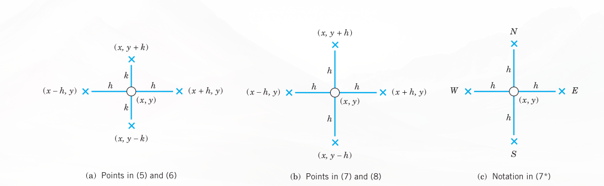{#fig-21-453}

Our approximation of $h^2\nabla^2 u$ in (@eq-sec214-7) and (@eq-sec214-8) is a 5-point approximation with the coefficient scheme or stencil (also called pattern, molecule, or star)

$$\left\{ \begin{matrix} & 1 & \\ 1 & -4 & 1 \\ & 1 & \end{matrix} \right\}$$ {#eq-sec214-9}

We may now write (@eq-sec214-7) as

$$\left\{ \begin{matrix} & 1 & \\ 1 & -4 & 1 \\ & 1 & \end{matrix} \right\} u = h^2f(x, y)$$

### Dirichlet Problem
In numerics for the Dirichlet problem in a region $R$ we choose an $h$ and introduce a square grid of horizontal and vertical straight lines of distance $h$. Their intersections are called mesh points (or lattice points or nodes). See @fig-21-454.

Then we approximate the given PDE by a difference equation [(@eq-sec214-8) for the Laplace equation], which relates the unknown values of $u$ at the mesh points in $R$ to each other and to the given boundary values (details in Example 1). This gives a linear system of algebraic equations. By solving it we get approximations of the unknown values of $u$ at the mesh points in $R$.

We shall see that the number of equations equals the number of unknowns. Now comes an important point. If the number of internal mesh points, call it $p$, is small, say, $p < 100$, then a direct solution method may be applied to that linear system of $p < 100$ equations in $p$ unknowns. However, if $p$ is large, a storage problem will arise. Now since each unknown $u$ is related to only 4 of its neighbors, the coefficient matrix of the system is a sparse matrix, that is, a matrix with relatively few nonzero entries (for instance, 500 of 10,000 when $p = 100$). Hence for large $p$ we may avoid storage difficulties by using an iteration method, notably the Gauss–Seidel method (<!-- TODO: replace Sec. 20.3 with actual cross-reference label -->), which in PDEs is also called Liebmann’s method (note the strict diagonal dominance). Remember that in this method we have the storage convenience that we can overwrite any solution component (value of $u$) as soon as a “new” value is available.

Both cases, large $p$ and small $p$, are of interest to the engineer, large $p$ if a fine grid is used to achieve high accuracy, and small $p$ if the boundary values are known only rather inaccurately, so that a coarse grid will do it because in this case it would be meaningless to try for great accuracy in the interior of the region $R$.

We illustrate this approach with an example, keeping the number of equations small, for simplicity. As convenient notations for mesh points and corresponding values of the solution (and of approximate solutions) we use (see also @fig-21-454):

$$P_{ij} = (ih, jh), \quad u_{ij} = u(ih, jh)$$ {#eq-sec214-10}

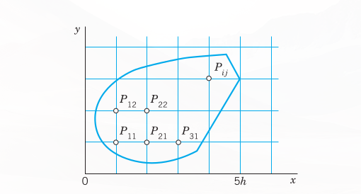{#fig-21-454}

With this notation we can write (@eq-sec214-8) for any mesh point $P_{ij}$ in the form

$$u_{i+1,j} + u_{i,j+1} + u_{i-1,j} + u_{i,j-1} - 4u_{ij} = 0$$ {#eq-sec214-11}

**Remark.** Our current discussion and the example that follows illustrate what we may call the reusability of mathematical ideas and methods. Recall that we applied the Gauss–Seidel method to a system of ODEs in <!-- TODO: replace Sec. 20.3 with actual cross-reference label --> and that we can now apply it again to elliptic PDEs. This shows that engineering mathematics has a structure and important mathematical ideas and methods will appear again and again in different situations. The student should find this attractive in that previous knowledge can be reapplied.

### EXAMPLE 1: Laplace Equation. Liebmann’s Method
The four sides of a square plate of side 12 cm, made of homogeneous material, are kept at constant temperature $0^\circ\text{C}$ and $100^\circ\text{C}$ as shown in @fig-21-455. Using a (very wide) grid of mesh 4 cm and applying Liebmann’s method (that is, Gauss–Seidel iteration), find the (steady-state) temperature at the mesh points.

**Solution.**  
In the case of independence of time, the heat equation (see Sec. 10.8) $u_t = c^2(u_{xx} + u_{yy})$ reduces to the Laplace equation. Hence our problem is a Dirichlet problem for the latter. We choose the grid shown in @fig-21-455 and consider the mesh points in the order $P_{11}, P_{21}, P_{12}, P_{22}$. We use (@eq-sec214-11) and, in each equation, take to the right all the terms resulting from the given boundary values. Then we obtain the system

$$
\begin{aligned}
-4u_{11} + u_{21} + u_{12} &= -200 \\
u_{11} - 4u_{21} + u_{22} &= -200 \\
u_{11} - 4u_{12} + u_{22} &= -100 \\
u_{21} + u_{12} - 4u_{22} &= -100
\end{aligned}
$$ {#eq-sec214-12}

In practice, one would solve such a small system by the Gauss elimination, finding $u_{11} = u_{21} = 87.5, u_{12} = u_{22} = 62.5$. More exact values (exact to 3S) of the solution of the actual problem [as opposed to its model (@eq-sec214-12)] are 88.1 and 61.9, respectively. (These were obtained by using Fourier series.) Hence the error is about 1%, which is surprisingly accurate for a grid of such a large mesh size $h$. If the system of equations were large, one would solve it by an indirect method, such as Liebmann’s method. For (@eq-sec214-12) this is as follows. We write (@eq-sec214-12) in the form (divide by $-4$ and take terms to the right):

$$
\begin{aligned}
u_{11} &= 0.25u_{21} + 0.25u_{12} + 50 \\
u_{21} &= 0.25u_{11} + 0.25u_{22} + 50 \\
u_{12} &= 0.25u_{11} + 0.25u_{22} + 25 \\
u_{22} &= 0.25u_{21} + 0.25u_{12} + 25
\end{aligned}
$$

These equations are now used for the Gauss–Seidel iteration. They are identical with (2) in <!-- TODO: replace Sec. 20.3 with actual cross-reference label -->, where $u_{11} = x_1, u_{21} = x_2, u_{12} = x_3, u_{22} = x_4$, and the iteration is explained there, with 100, 100, 100, 100 chosen as starting values. Some work can be saved by better starting values, usually by taking the average of the boundary values that enter into the linear system. The exact solution of the system is $u_{11} = u_{21} = 87.5, u_{12} = u_{22} = 62.5$, as you may verify. $\blacksquare$

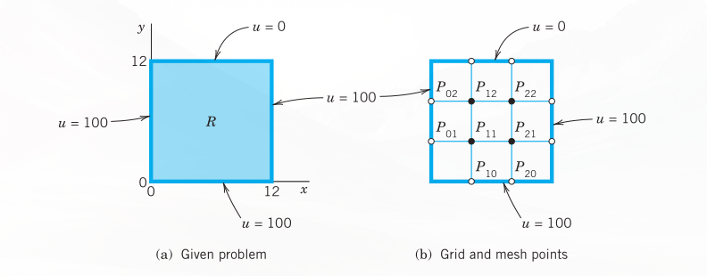{#fig-21-455}

**Remark.** It is interesting to note that, if we choose mesh $h = L/n$ ($L$ = side of $R$) and consider the $(n - 1)^2$ internal mesh points (i.e., mesh points not on the boundary) row by row in the order $P_{11}, P_{21}, \dots, P_{n-1,1}, P_{12}, P_{22}, \dots, P_{n-2,2}, \dots$, then the system of equations has the $(n - 1)^2 \times (n - 1)^2$ coefficient matrix

$$\mathbf{A} = \begin{pmatrix} \mathbf{B} & \mathbf{I} & & & \\ \mathbf{I} & \mathbf{B} & \mathbf{I} & & \\ & \dots & \dots & \dots & \\ & & \mathbf{I} & \mathbf{B} & \mathbf{I} \\ & & & \mathbf{I} & \mathbf{B} \end{pmatrix}$$ {#eq-sec214-13}

Here, $\mathbf{B}$ is the $(n - 1) \times (n - 1)$ matrix:

$$\mathbf{B} = \begin{pmatrix} -4 & 1 & & & \\ 1 & -4 & 1 & & \\ & \dots & \dots & \dots & \\ & & 1 & -4 & 1 \\ & & & 1 & -4 \end{pmatrix}$$

(In (@eq-sec214-12) we have $n = 3$, $(n - 1)^2 = 4$ internal mesh points, two submatrices $\mathbf{B}$, and two submatrices $\mathbf{I}$.) The matrix $\mathbf{A}$ is nonsingular. This follows by noting that the off-diagonal entries in each row of $\mathbf{A}$ have the sum 3 (or 2), whereas each diagonal entry of $\mathbf{A}$ equals $-4$, so that nonsingularity is implied by Gerschgorin’s theorem in <!-- TODO: replace Sec. 20.7 with actual cross-reference label --> because no Gerschgorin disk can include 0. $\blacksquare$

A matrix is called a band matrix if it has all its nonzero entries on the main diagonal and on sloping lines parallel to it (separated by sloping lines of zeros or not). For example, $\mathbf{A}$ in (@eq-sec214-13) is a band matrix. Although the Gauss elimination does not preserve zeros between bands, it does not introduce nonzero entries outside the limits defined by the original bands. Hence a band structure is advantageous. In (@eq-sec214-13) it has been achieved by carefully ordering the mesh points.

### ADI Method
A matrix is called a tridiagonal matrix if it has all its nonzero entries on the main diagonal and on the two sloping parallels immediately above or below the diagonal. (See also <!-- TODO: replace Sec. 20.9 with actual cross-reference label -->.) In this case the Gauss elimination is particularly simple.

This raises the question of whether, in the solution of the Dirichlet problem for the Laplace or Poisson equations, one could obtain a system of equations whose coefficient matrix is tridiagonal. The answer is yes, and a popular method of that kind, called the ADI method (alternating direction implicit method) was developed by Peaceman and Rachford. The idea is as follows. The stencil in (@eq-sec214-9) shows that we could obtain a tridiagonal matrix if there were only the three points in a row (or only the three points in a column). This suggests that we write (@eq-sec214-11) in the form

$$u_{i-1,j} - 4u_{ij} + u_{i+1,j} = -u_{i,j-1} - u_{i,j+1}$$ {#eq-sec214-14a}

so that the left side belongs to $y$-Row $j$ only and the right side to $x$-Column $i$. Of course, we can also write (@eq-sec214-11) in the form

$$u_{i,j-1} - 4u_{ij} + u_{i,j+1} = -u_{i-1,j} - u_{i+1,j}$$ {#eq-sec214-14b}

so that the left side belongs to Column $i$ and the right side to Row $j$. In the ADI method we proceed by iteration. At every mesh point we choose an arbitrary starting value $u_{ij}^{(0)}$. In each step we compute new values at all mesh points. In one step we use an iteration formula resulting from (@eq-sec214-14a) and in the next step an iteration formula resulting from (@eq-sec214-14b), and so on in alternating order.

In detail: suppose approximations $u_{ij}^{(m)}$ have been computed. Then, to obtain the next approximations $u_{ij}^{(m+1)}$, we substitute the $u_{ij}^{(m)}$ on the right side of (@eq-sec214-14a) and solve for the $u_{ij}^{(m+1)}$ on the left side; that is, we use

$$u_{i-1,j}^{(m+1)} - 4u_{ij}^{(m+1)} + u_{i+1,j}^{(m+1)} = -u_{i,j-1}^{(m)} - u_{i,j+1}^{(m)}$$ {#eq-sec214-15a}

We use (@eq-sec214-15a) for a fixed $j$, that is, for a fixed row $j$, and for all internal mesh points in this row. This gives a linear system of $N$ algebraic equations ($N$ = number of internal mesh points per row) in $N$ unknowns, the new approximations of $u$ at these mesh points. Note that (@eq-sec214-15a) involves not only approximations computed in the previous step but also given boundary values. We solve the system (@eq-sec214-15a) ($j$ fixed!) by Gauss elimination. Then we go to the next row, obtain another system of $N$ equations and solve it by Gauss, and so on, until all rows are done. In the next step we alternate direction, that is, we compute the next approximations $u_{ij}^{(m+2)}$ column by column from the $u_{ij}^{(m+1)}$ and the given boundary values, using a formula obtained from (@eq-sec214-14b) by substituting the $u_{ij}^{(m+1)}$ on the right:

$$u_{i,j-1}^{(m+2)} - 4u_{ij}^{(m+2)} + u_{i,j+1}^{(m+2)} = -u_{i-1,j}^{(m+1)} - u_{i+1,j}^{(m+1)}$$ {#eq-sec214-15b}

For each fixed $i$, that is, for each column, this is a system of $M$ equations ($M$ = number of internal mesh points per column) in $M$ unknowns, which we solve by Gauss elimination. Then we go to the next column, and so on, until all columns are done.

Let us consider an example that merely serves to explain the entire method.

### EXAMPLE 2: Dirichlet Problem. ADI Method
Explain the procedure and formulas of the ADI method in terms of the problem in Example 1, using the same grid and starting values 100, 100, 100, 100.

**Solution.**  
While working, we keep an eye on @fig-21-455 and the given boundary values. We obtain first approximations $u_{11}^{(1)}, u_{21}^{(1)}, u_{12}^{(1)}, u_{22}^{(1)}$ from (@eq-sec214-15a) with $m = 0$. We write boundary values contained in (@eq-sec214-15a) without an upper index, for better identification and to indicate that these given values remain the same during the iteration. From (@eq-sec214-15a) with $m = 0$ we have for $j = 1$ (first row) the system:

$$
\begin{aligned}
(i = 1) \quad u_{01} - 4u_{11}^{(1)} + u_{21}^{(1)} &= -u_{10} - u_{12}^{(0)} \\
(i = 2) \quad u_{11}^{(1)} - 4u_{21}^{(1)} + u_{31} &= -u_{20} - u_{22}^{(0)}
\end{aligned}
$$

The solution is $u_{11}^{(1)} = u_{21}^{(1)} = 100$. For $j = 2$ (second row) we obtain from (@eq-sec214-15a) the system:

$$
\begin{aligned}
(i = 1) \quad u_{02} - 4u_{12}^{(1)} + u_{22}^{(1)} &= -u_{11}^{(0)} - u_{13} \\
(i = 2) \quad u_{12}^{(1)} - 4u_{22}^{(1)} + u_{32} &= -u_{21}^{(0)} - u_{23}
\end{aligned}
$$

The solution is $u_{12}^{(1)} = u_{22}^{(1)} = 66.667$.

Second approximations $u_{11}^{(2)}, u_{21}^{(2)}, u_{12}^{(2)}, u_{22}^{(2)}$ are now obtained from (@eq-sec214-15b) with $m = 1$ by using the first approximations just computed and the boundary values. For $i = 1$ (first column) we obtain from (@eq-sec214-15b) the system:

$$
\begin{aligned}
(j = 1) \quad u_{10} - 4u_{11}^{(2)} + u_{12}^{(2)} &= -u_{01} - u_{21}^{(1)} \\
(j = 2) \quad u_{11}^{(2)} - 4u_{12}^{(2)} + u_{13} &= -u_{02} - u_{22}^{(1)}
\end{aligned}
$$

The solution is $u_{11}^{(2)} = 91.11, u_{12}^{(2)} = 64.44$. For $i = 2$ (second column) we obtain from (@eq-sec214-15b) the system:

$$
\begin{aligned}
(j = 1) \quad u_{20} - 4u_{21}^{(2)} + u_{22}^{(2)} &= -u_{11}^{(1)} - u_{31} \\
(j = 2) \quad u_{21}^{(2)} - 4u_{22}^{(2)} + u_{23} &= -u_{12}^{(1)} - u_{32}
\end{aligned}
$$

The solution is $u_{21}^{(2)} = 91.11, u_{22}^{(2)} = 64.44$.

In this example, which merely serves to explain the practical procedure in the ADI method, the accuracy of the second approximations is about the same as that of two Gauss–Seidel steps in <!-- TODO: replace Sec. 20.3 with actual cross-reference label -->, as the following table shows:

| Method | $u_{11}$ | $u_{21}$ | $u_{12}$ | $u_{22}$ |
|---|---|---|---|---|
| ADI, 2nd approximations | 91.11 | 91.11 | 64.44 | 64.44 |
| Gauss–Seidel, 2nd approximations | 93.75 | 90.62 | 65.62 | 64.06 |
| Exact solution of (@eq-sec214-12) | 87.50 | 87.50 | 62.50 | 62.50 |  $\blacksquare$

### Improving Convergence
Additional improvement of the convergence of the ADI method results from the following interesting idea. Introducing a parameter $p$, we can also write (@eq-sec214-11) in the form:

$$
\begin{aligned}
u_{i-1,j} - (2+p)u_{ij} + u_{i+1,j} &= -u_{i,j-1} + (2-p)u_{ij} - u_{i,j+1} \\
u_{i,j-1} - (2+p)u_{ij} + u_{i,j+1} &= -u_{i-1,j} + (2-p)u_{ij} - u_{i+1,j}
\end{aligned}
$$ {#eq-sec214-16}

This gives the more general ADI iteration formulas:

$$u_{i-1,j}^{(m+1)} - (2+p)u_{ij}^{(m+1)} + u_{i+1,j}^{(m+1)} = -u_{i,j-1}^{(m)} + (2-p)u_{ij}^{(m)} - u_{i,j+1}^{(m)}$$ {#eq-sec214-17a}

$$u_{i,j-1}^{(m+2)} - (2+p)u_{ij}^{(m+2)} + u_{i,j+1}^{(m+2)} = -u_{i-1,j}^{(m+1)} + (2-p)u_{ij}^{(m+1)} - u_{i+1,j}^{(m+1)}$$ {#eq-sec214-17b}

For $p = 2$, this is (@eq-sec214-15a) and (@eq-sec214-15b). The parameter $p$ may be used for improving convergence. Indeed, one can show that the ADI method converges for positive $p$, and that the optimum value for maximum rate of convergence is

$$p_0 = 2 \sin \frac{\pi}{K}$$ {#eq-sec214-18}

where $K$ is the larger of $M + 1$ and $N + 1$ (see above). Even better results can be achieved by letting $p$ vary from step to step. More details of the ADI method and variants are discussed in Ref. [E25] listed in App. 1.

### PROBLEM SET {#sec-ps-21-4}

1. Derive (@eq-sec214-5b), (@eq-sec214-6b), and (@eq-sec214-6c).
2. Verify the calculations in Example 1 of the text. Find out experimentally how many steps you need to obtain the solution of the linear system with an accuracy of 3S.
3. **Use of symmetry.** Conclude from the boundary values in Example 1 that $u_{21} = u_{11}$ and $u_{22} = u_{12}$. Show that this leads to a system of two equations and solve it.
4. **Finer grid of $3 \times 3$ inner points.** Solve Example 1, choosing $h = 12/4 = 3$ (instead of $h = 12/3 = 4$) and the same starting values.

#### 5–10: GAUSS ELIMINATION, GAUSS–SEIDEL ITERATION
For the grid in @fig-21-456 compute the potential at the four internal points by Gauss elimination and by 5 Gauss–Seidel steps with starting values 100, 100, 100, 100 (showing the details of your work) if the boundary values on the edges are:
5. $u(1, 0) = 60, u(2, 0) = 300, u = 100$ on the other three edges.
6. $u = 0$ on the left, $x^3$ on the lower edge, $27 - 9y^2$ on the right, $x^3 - 27x$ on the upper edge.
7. $U_0$ on the upper and lower edges, $-U_0$ on the left and right. Sketch the equipotential lines.
8. $u = 220$ on the upper and lower edges, $110$ on the left and right.
9. $u = \sin \frac{1}{3}\pi x$ on the upper edge, 0 on the other edges, 10 steps.
10. $u = x^4$ on the lower edge, $81 - 54y^2 + y^4$ on the right, $x^4 - 54x^2y^2 + y^4$ on the upper edge, $y^4$ on the left. Verify the exact solution $x^4 - 6x^2y^2 + y^4$ and determine the error.

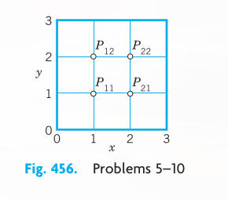{#fig-21-456}

11. Find the potential in @fig-21-457 using (a) the coarse grid, (b) the fine grid $5 \times 3$, and Gauss elimination. *Hint:* In (b), use symmetry; take $u = 0$ as boundary value at the two points at which the potential has a jump.

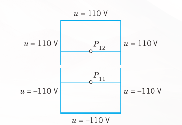{#fig-21-457}

12. **Influence of starting values.** Do Prob. 9 by Gauss–Seidel, starting from 0. Compare and comment.
13. For the square $0 \le x \le 4, \ 0 \le y \le 4$ let the boundary temperatures be $0^\circ\text{C}$ on the horizontal and $50^\circ\text{C}$ on the vertical edges. Find the temperatures at the interior points of a square grid with $h = 1$.
14. Using the answer to Prob. 13, try to sketch some isotherms.
15. Find the isotherms for the square and grid in Prob. 13 if $u = \sin \frac{1}{4}\pi x$ on the horizontal and $-\sin \frac{1}{4}\pi y$ on the vertical edges. Try to sketch some isotherms.
16. **ADI.** Apply the ADI method to the Dirichlet problem in Prob. 9, using the grid in @fig-21-456, as before and starting values zero.
17. What $p_0$ in (@eq-sec214-18) should we choose for Prob. 16? Apply the ADI formulas (@eq-sec214-17a), (@eq-sec214-17b) with that value of $p_0$ to Prob. 16, performing 1 step. Illustrate the improved convergence by comparing with the corresponding values 0.077, 0.308 after the first step in Prob. 16. (Use the starting values zero.)
18. **CAS PROJECT. Laplace Equation.**  
(a) Write a program for Gauss–Seidel with 16 equations in 16 unknowns, composing the matrix (@eq-sec214-13) from the indicated $4 \times 4$ submatrices and including a transformation of the vector of the boundary values into the vector $\mathbf{b}$ of $\mathbf{A}\mathbf{x} = \mathbf{b}$.  
(b) Apply the program to the square grid in $0 \le x \le 5, \ 0 \le y \le 5$ with $h = 1$ and $u = 220$ on the upper and lower edges, $u = 110$ on the left edge and $u = -10$ on the right edge. Solve the linear system also by Gauss elimination. What accuracy is reached in the 20th Gauss–Seidel step?

## Neumann and Mixed Problems. Irregular Boundary {#sec-neumann-mixed-problems}

We continue our discussion of boundary value problems for elliptic PDEs in a region $R$ in the $xy$-plane. The Dirichlet problem was studied in the last section. In solving Neumann and mixed problems (defined in the last section) we are confronted with a new situation, because there are boundary points at which the (outer) normal derivative $u_n = \partial u/\partial n$ of the solution is given, but $u$ itself is unknown since it is not given. To handle such points we need a new idea. This idea is the same for Neumann and mixed problems. Hence we may explain it in connection with one of these two types of problems. We shall do so and consider a typical example as follows.

### EXAMPLE 1: Mixed Boundary Value Problem for a Poisson Equation
Solve the mixed boundary value problem for the Poisson equation

$$\nabla^2 u = u_{xx} + u_{yy} = f(x, y) = 12xy$$

shown in @fig-21-458.

**Solution.**  
We use the grid shown in @fig-21-458, where $h = 0.5$. We recall that (7) in @sec-methods-elliptic-pdes has the right side $h^2f(x, y) = 0.5^2 \cdot 12xy = 3xy$. From the formulas $u = 3y^3$ and $u_n = 6x$ given on the boundary we compute the boundary data:

$$u_{31} = 0.375, \quad \frac{\partial u_{12}}{\partial n} = \frac{\partial u}{\partial y}\Big|_{12} = 6 \cdot 0.5 = 3$$

$$u_{32} = 3, \quad \frac{\partial u_{22}}{\partial n} = \frac{\partial u}{\partial y}\Big|_{22} = 6 \cdot 1 = 6$$

$P_{11}$ and $P_{21}$ are internal mesh points and can be handled as in the last section. Indeed, from (@eq-sec214-7), @sec-methods-elliptic-pdes, with $h^2 = 0.25$ and $h^2 f(x, y) = 3xy$ and from the given boundary values we obtain two equations corresponding to $P_{11}$ and $P_{21}$, as follows (with $-0$ resulting from the left boundary):

$$
-4u_{11} + u_{21} + u_{12} + u_{22} = 12(0.5 \cdot 0.5) \cdot \frac{1}{4} - 0 = 0.75
$$ {#eq-sec215-2a_1}

$$
u_{11} - 4u_{21} + u_{22} = 12(1 \cdot 0.5) \cdot \frac{1}{4} - 0.375 = 1.125
$$ {#eq-sec215-2a_2}

The only difficulty with these equations seems to be that they involve the unknown values $u_{12}$ and $u_{22}$ of $u$ at $P_{12}$ and $P_{22}$ on the boundary, where the normal derivative $u_n = \partial u/\partial n = \partial u/\partial y$ is given, instead of $u$; but we shall overcome this difficulty as follows.

We consider $P_{12}$ and $P_{22}$. The idea that will help us here is this. We imagine the region $R$ to be extended above to the first row of external mesh points (corresponding to $y = 1.5$), and we assume that the Poisson equation also holds in the extended region. Then we can write down two more equations as before (see @fig-21-458):

$$
\begin{aligned}
u_{11} - 4u_{12} + u_{22} + u_{13} &= 1.5 - 0 = 1.5 \\
u_{21} + u_{12} - 4u_{22} + u_{23} &= 3 - 3 = 0
\end{aligned}
$$ {#eq-sec215-2b}

On the right, $1.5$ is $12xyh^2$ at $(0.5, 1)$ and $3$ is $12xyh^2$ at $(1, 1)$ and 0 (at $P_{02}$) and 3 (at $P_{32}$) are given boundary values. We remember that we have not yet used the boundary condition on the upper part of the boundary of $R$, and we also notice that in (@eq-sec215-2b) we have introduced two more unknowns $u_{13}, u_{23}$. But we can now use that condition and get rid of $u_{13}, u_{23}$ by applying the central difference formula for $\partial u/\partial y$. From the boundary conditions we then obtain (see @fig-21-458):

$$3 = \frac{\partial u_{12}}{\partial y} \approx \frac{u_{13} - u_{11}}{2h} = u_{13} - u_{11}, \quad \text{hence} \quad u_{13} = u_{11} + 3$$

$$6 = \frac{\partial u_{22}}{\partial y} \approx \frac{u_{23} - u_{21}}{2h} = u_{23} - u_{21}, \quad \text{hence} \quad u_{23} = u_{21} + 6$$

Substituting these results into (@eq-sec215-2b) and simplifying, we have:

$$
\begin{aligned}
2u_{11} - 4u_{12} + u_{22} &= 1.5 - 3 = -1.5 \\
2u_{21} + u_{12} - 4u_{22} &= 3 - 3 - 6 = -6
\end{aligned}
$$

Together with (@eq-sec215-2a_1), (@eq-sec215-2a_2) this yields, written in matrix form:

$$\begin{pmatrix} -4 & 1 & 1 & 0 \\ 1 & -4 & 0 & 1 \\ 2 & 0 & -4 & 1 \\ 0 & 2 & 1 & -4 \end{pmatrix} \begin{pmatrix} u_{11} \\ u_{21} \\ u_{12} \\ u_{22} \end{pmatrix} = \begin{pmatrix} 0.75 \\ 1.125 \\ -1.5 \\ -6 \end{pmatrix}$$ {#eq-sec215-3}

(The entries 2 come from $u_{13}$ and $u_{23}$, and so do $-3$ and $-6$ on the right). The solution of (@eq-sec215-3) (obtained by Gauss elimination) is as follows; the exact values of the problem are given in parentheses:

$$
\begin{aligned}
u_{12} &= 0.866 \quad (\text{exact } 1.0) \\
u_{22} &= 1.812 \quad (\text{exact } 2.0) \\
u_{11} &= 0.077 \quad (\text{exact } 0.125) \\
u_{21} &= 0.191 \quad (\text{exact } 0.25)
\end{aligned}
$$  $\blacksquare$

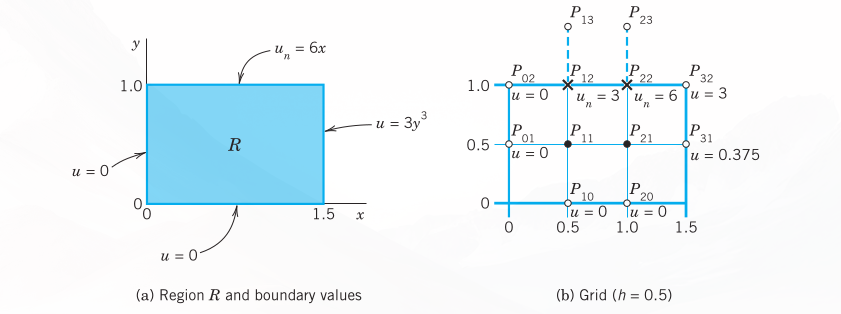{#fig-21-458}

### Irregular Boundary
We continue our discussion of boundary value problems for elliptic PDEs in a region $R$ in the $xy$-plane. If $R$ has a simple geometric shape, we can usually arrange for certain mesh points to lie on the boundary $C$ of $R$, and then we can approximate partial derivatives as explained in the last section. However, if $C$ intersects the grid at points that are not mesh points, then at points close to the boundary we must proceed differently, as follows.

The mesh point $O$ in @fig-21-459 is of that kind. For $O$ and its neighbors $A$ and $P$ we obtain from Taylor’s theorem:

$$u_A = u_O + ah \frac{\partial u_O}{\partial x} + \frac{1}{2}(ah)^2 \frac{\partial^2 u_O}{\partial x^2} + \dots$$ {#eq-sec215-4a}

$$u_P = u_O - h \frac{\partial u_O}{\partial x} + \frac{1}{2}h^2 \frac{\partial^2 u_O}{\partial x^2} + \dots$$ {#eq-sec215-4b}

We disregard the terms marked by dots and eliminate $\partial u_O/\partial x$. Equation (@eq-sec215-4b) times $a$ plus equation (@eq-sec215-4a) gives:

$$u_A + au_P \approx (1 + a)u_O + \frac{1}{2}a(a + 1)h^2 \frac{\partial^2 u_O}{\partial x^2}$$

We solve this last equation algebraically for the derivative, obtaining:

$$\frac{\partial^2 u_O}{\partial x^2} \approx \frac{2}{h^2} \left[ \frac{u_A}{a(1 + a)} + \frac{u_P}{1 + a} - \frac{u_O}{a} \right]$$

Similarly, by considering the points $O, B,$ and $Q$,

$$\frac{\partial^2 u_O}{\partial y^2} \approx \frac{2}{h^2} \left[ \frac{u_B}{b(1 + b)} + \frac{u_Q}{1 + b} - \frac{u_O}{b} \right]$$

By addition,

$$\nabla^2 u_O \approx \frac{2}{h^2} \left[ \frac{u_A}{a(1 + a)} + \frac{u_B}{b(1 + b)} + \frac{u_P}{1 + a} + \frac{u_Q}{1 + b} - \frac{a + b}{ab} u_O \right]$$ {#eq-sec215-5}

For example, if $a = \frac{1}{2}, b = \frac{1}{2}$, instead of the stencil (see @sec-methods-elliptic-pdes)

$$\left\{ \begin{matrix} & 1 & \\ 1 & -4 & 1 \\ & 1 & \end{matrix} \right\}$$

we now have

$$\left\{ \begin{matrix} & \frac{4}{3} & \\ \frac{2}{3} & -4 & \frac{4}{3} \\ & \frac{2}{3} & \end{matrix} \right\}$$

because $1/[a(1 + a)] = 4/3$, etc. The sum of all five terms still being zero (which is useful for checking).

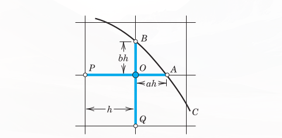{#fig-21-459}

Using the same ideas, you may show that in the case of @fig-21-460:

$$\nabla^2 u_O \approx \frac{2}{h^2} \left[ \frac{u_A}{a(a + p)} + \frac{u_B}{b(b + q)} + \frac{u_P}{p(p + a)} + \frac{u_Q}{q(q + b)} - \left( \frac{ap + bq}{abpq} \right) u_O \right]$$ {#eq-sec215-6}

a formula that takes care of all conceivable cases.

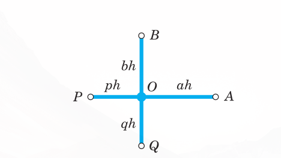{#fig-21-460}

### EXAMPLE 2: Dirichlet Problem for the Laplace Equation. Curved Boundary
Find the potential $u$ in the region in @fig-21-461 that has the boundary values given in that figure; here the curved portion of the boundary is an arc of the circle of radius 10 about $(0,0)$. Use the grid in the figure.

$u$ is a solution of the Laplace equation. From the given formulas for the boundary values $u = x^3, u = 512 - 24y^2, \dots$ we compute the values at the points where we need them; the result is shown in the figure. For $P_{11}$ and $P_{12}$ we have the usual regular stencil, and for $P_{21}$ and $P_{22}$ we use (@eq-sec215-6), obtaining stencils:

$$
\begin{aligned}
P_{11}, P_{12}: & \quad \left\{ \begin{matrix} & 1 & \\ 1 & -4 & 1 \\ & 0.5 & \end{matrix} \right\} \\
P_{21}: & \quad \left\{ \begin{matrix} & 0.6 & \\ 0.5 & -2.5 & 0.9 \\ & 0.9 & \end{matrix} \right\} \\
P_{22}: & \quad \left\{ \begin{matrix} & 0.6 & \\ 0.6 & -3 & 0.9 \\ & & \end{matrix} \right\}
\end{aligned}
$$ {#eq-sec215-7}

We use this and the boundary values and take the mesh points in the usual order $P_{11}, P_{21}, P_{12}, P_{22}$. Then we obtain the system:

$$
\begin{aligned}
-4u_{11} + u_{21} + u_{12} &= 0 - 27 = -27 \\
0.6u_{11} - 2.5u_{21} + 0.5u_{22} &= -0.9 \cdot 296 - 0.5 \cdot 216 = -374.4 \\
u_{11} - 4u_{12} + u_{22} &= -702 + 0 = -702 \\
0.6u_{21} + 0.6u_{12} - 3u_{22} &= -0.9 \cdot 352 - 0.9 \cdot 936 = 1159.2
\end{aligned}
$$

In matrix form:

$$\begin{pmatrix} -4 & 1 & 1 & 0 \\ 0.6 & -2.5 & 0 & 0.5 \\ 1 & 0 & -4 & 1 \\ 0 & 0.6 & 0.6 & -3 \end{pmatrix} \begin{pmatrix} u_{11} \\ u_{21} \\ u_{12} \\ u_{22} \end{pmatrix} = \begin{pmatrix} -27 \\ -374.4 \\ -702 \\ 1159.2 \end{pmatrix}$$ {#eq-sec215-8}

Gauss elimination yields the (rounded) values:

$$u_{11} = -55.6, \quad u_{21} = 49.2, \quad u_{12} = -298.5, \quad u_{22} = -436.3$$

Clearly, from a grid with so few mesh points we cannot expect great accuracy. The exact solution of the PDE (not of the difference equation) having the given boundary values is $u = x^3 - 3xy^2$ and yields the values:

$$u_{11} = -54, \quad u_{21} = 54, \quad u_{12} = -297, \quad u_{22} = -432$$

In practice one would use a much finer grid and solve the resulting large system by an indirect method. $\blacksquare$

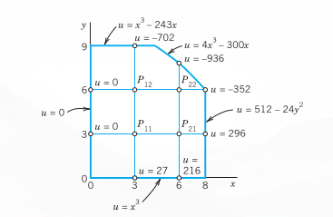{#fig-21-461}

### PROBLEM SET {#sec-ps-21-5}

#### 1–7: MIXED BOUNDARY VALUE PROBLEMS
1. Check the values for the Poisson equation at the end of Example 1 by solving (@eq-sec215-3) by Gauss elimination.
2. Solve the mixed boundary value problem for the Poisson equation $\nabla^2 u = 2(x^2 + y^2)$ in the region and for the boundary conditions shown in @fig-21-462, using the indicated grid.
3. **CAS EXPERIMENT. Mixed Problem.** Do Example 1 in the text with finer and finer grids of your choice and study the accuracy of the approximate values by comparing with the exact solution $u = 2xy^3$. Verify the latter.
4. Solve the mixed boundary value problem for the Laplace equation $\nabla^2 u = 0$ in the rectangle in @fig-21-458 (using the grid in @fig-21-458) and the boundary conditions $u_x = 0$ on the left edge, $u_x = 3$ on the right edge, $u = x^2$ on the lower edge, and $u = x^2 - 1$ on the upper edge.
5. Do Example 1 in the text for the Laplace equation (instead of the Poisson equation) with grid and boundary data as before.
6. Solve $\nabla^2 u = -\pi^2 y \sin \frac{1}{3}\pi x$ for the grid in @fig-21-462 and $u_y(1, 3) = u_y(2, 3) = \frac{1}{2}\sqrt{243}, u = 0$ on the other three sides of the square.
7. Solve Prob. 4 when $u_n = 110$ on the upper edge and $u = 110$ on the other edges.

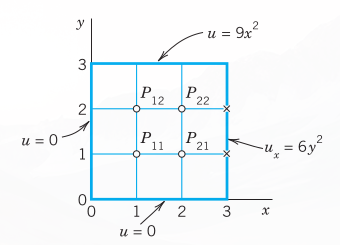{#fig-21-462}

#### 8–16: IRREGULAR BOUNDARY
8. Verify the stencil shown after (@eq-sec215-5).
9. Derive (@eq-sec215-5) in the general case.
10. Derive the general formula (@eq-sec215-6) in detail.
11. Derive the linear system in Example 2 of the text.
12. Verify the solution in Example 2.
13. Solve the Laplace equation in the region and for the boundary values shown in @fig-21-463, using the indicated grid. (The sloping portion of the boundary is $y = 4.5 - x$.)

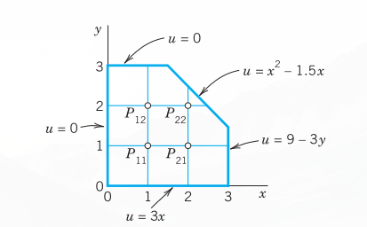{#fig-21-463}

14. If, in Prob. 13, the axes are grounded ($u = 0$), what constant potential must the other portion of the boundary have in order to produce 220 V at $P_{11}$?
15. What potential do we have in Prob. 13 if $u = 100\text{ V}$ on the axes and $u = 0$ on the other portion of the boundary?
16. Solve the Poisson equation $\nabla^2 u = 2$ in the region and for the boundary values shown in @fig-21-464, using the grid also shown in the figure.

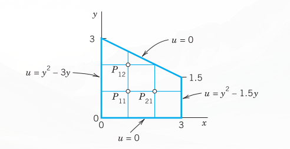{#fig-21-464}

## Methods for Parabolic PDEs {#sec-methods-parabolic-pdes}

The last two sections concerned elliptic PDEs, and we now turn to parabolic PDEs. Recall that the definitions of elliptic, parabolic, and hyperbolic PDEs were given in @sec-methods-elliptic-pdes. There it was also mentioned that the general behavior of solutions differs from type to type, and so do the problems of practical interest. This reflects on numerics as follows. For all three types, one replaces the PDE by a corresponding difference equation, but for parabolic and hyperbolic PDEs this does not automatically guarantee the convergence of the approximate solution to the exact solution as the mesh $h \to 0$; in fact, it does not even guarantee convergence at all. For these two types of PDEs one needs additional conditions (inequalities) to assure convergence and stability, the latter meaning that small perturbations in the initial data (or small errors at any time) cause only small changes at later times.

In this section we explain the numeric solution of the prototype of parabolic PDEs, the one-dimensional heat equation

$$u_t = c^2 u_{xx}$$

($c$ constant).

This PDE is usually considered for $x$ in some fixed interval, say, $0 \le x \le L$, and time $t \ge 0$, and one prescribes the initial temperature $u(x, 0) = f(x)$ ($f$ given) and boundary conditions at $x = 0$ and $x = L$ for all $t \ge 0$, for instance, $u(0, t) = 0, u(L, t) = 0$. We may assume $c = 1$ and $L = 1$; this can always be accomplished by a linear transformation of $x$ and $t$ (Prob. 1). Then the heat equation and those conditions are

$$u_t = u_{xx} \quad (0 \le x \le 1, t \ge 0)$$ {#eq-sec216-1}

$$u(x, 0) = f(x) \quad \text{(Initial condition)}$$ {#eq-sec216-2}

$$u(0, t) = u(1, t) = 0 \quad \text{(Boundary conditions)}$$ {#eq-sec216-3}

A simple finite difference approximation of (@eq-sec216-1) is [see (6a) in @sec-methods-elliptic-pdes; $j$ is the number of the time step]

$$\frac{1}{k} (u_{i, j+1} - u_{ij}) = \frac{1}{h^2} (u_{i+1, j} - 2u_{ij} + u_{i-1, j})$$ {#eq-sec216-4}

@fig-21-465 shows a corresponding grid and mesh points. The mesh size is $h$ in the $x$-direction and $k$ in the $t$-direction. Formula (@eq-sec216-4) involves the four points shown in @fig-21-466. On the left in (@eq-sec216-4) we have used a forward difference quotient since we have no information for negative $t$ at the start. From (@eq-sec216-4) we calculate $u_{i, j+1}$, which corresponds to time row $j + 1$, in terms of the three other $u$ that correspond to time row $j$. Solving (@eq-sec216-4) for $u_{i, j+1}$, we have

$$u_{i, j+1} = (1 - 2r)u_{ij} + r(u_{i+1, j} + u_{i-1, j}) \quad \left(r = \frac{k}{h^2}\right)$$ {#eq-sec216-5}

Computations by this explicit method based on (@eq-sec216-5) are simple. However, it can be shown that crucial to the convergence of this method is the condition

$$r = \frac{k}{h^2} \le \frac{1}{2}$$ {#eq-sec216-6}

That is, $u_{ij}$ should have a positive coefficient in (@eq-sec216-5) or (for $r = \frac{1}{2}$) be absent from (@eq-sec216-5). Intuitively, (@eq-sec216-6) means that we should not move too fast in the $t$-direction. An example is given below.

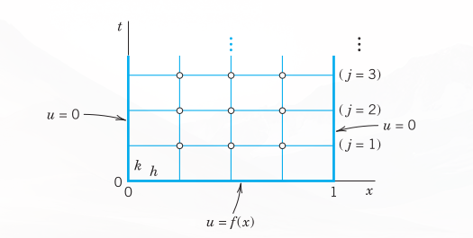{#fig-21-465}

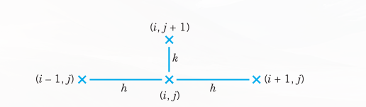{#fig-21-466}

### Crank–Nicolson Method
Condition (@eq-sec216-6) is a handicap in practice. Indeed, to attain sufficient accuracy, we have to choose $h$ small, which makes $k$ very small by (@eq-sec216-6). For example, if $h = 0.1$, then $k \le 0.005$. Accordingly, we should look for a more satisfactory discretization of the heat equation.

A method that imposes no restriction on $r = k/h^2$ is the Crank–Nicolson (CN) method,[^5] which uses values of $u$ at the six points in @fig-21-467. The idea of the method is the replacement of the difference quotient on the right side of (@eq-sec216-4) by $\frac{1}{2}$ times the sum of two such difference quotients at two time rows (see @fig-21-467). Instead of (@eq-sec216-4) we then have

$$\frac{1}{k} (u_{i, j+1} - u_{ij}) = \frac{1}{2h^2} (u_{i+1, j} - 2u_{ij} + u_{i-1, j}) + \frac{1}{2h^2} (u_{i+1, j+1} - 2u_{i, j+1} + u_{i-1, j+1})$$ {#eq-sec216-7}

Multiplying by $2k$ and writing $r = k/h^2$ as before, we collect the terms corresponding to time row $j + 1$ on the left and the terms corresponding to time row $j$ on the right:

$$(2 + 2r)u_{i, j+1} - r(u_{i+1, j+1} + u_{i-1, j+1}) = (2 - 2r)u_{ij} + r(u_{i+1, j} + u_{i-1, j})$$ {#eq-sec216-8}

How do we use (@eq-sec216-8)? In general, the three values on the left are unknown, whereas the three values on the right are known. If we divide the $x$-interval $0 \le x \le 1$ in (@eq-sec216-1) into $n$ equal intervals, we have $n - 1$ internal mesh points per time row (see @fig-21-465, where $n = 4$). Then for $j = 0$ and $i = 1, \dots, n - 1$, formula (@eq-sec216-8) gives a linear system of $n - 1$ equations for the $n - 1$ unknown values $u_{11}, u_{21}, \dots, u_{n-1,1}$ in the first time row in terms of the initial values $u_{00}, u_{10}, \dots, u_{n0}$ and the boundary values $u_{01} (= 0), u_{n1} (= 0)$. Similarly for $j = 1, j = 2$, and so on; that is, for each time row we have to solve such a linear system of $n - 1$ equations resulting from (@eq-sec216-8).

Although $r = k/h^2$ is no longer restricted, smaller $r$ will still give better results. In practice, one chooses a $k$ by which one can save a considerable amount of work, without making $r$ too large. For instance, often a good choice is $r = 1$ (which would be impossible in the previous method). Then (@eq-sec216-8) becomes simply

$$4u_{i, j+1} - u_{i+1, j+1} - u_{i-1, j+1} = u_{i+1, j} + u_{i-1, j}$$ {#eq-sec216-9}

[^5]: JOHN CRANK (1916–2006), English mathematician and physicist at Courtaulds Fundamental Research Laboratory, professor at Brunel University, England. Student of Sir WILLIAM LAWRENCE BRAGG (1890–1971), Australian British physicist, who with his father, Sir WILLIAM HENRY BRAGG (1862–1942) won the Nobel Prize in physics in 1915 for their fundamental work in X-ray crystallography. (This is the only case where a father and a son shared the Nobel Prize for the same research. Furthermore, W. L. Bragg is the youngest Nobel laureate ever.) PHYLLIS NICOLSON (1917–1968), English mathematician, professor at the University of Leeds, England.

{#fig-21-467}

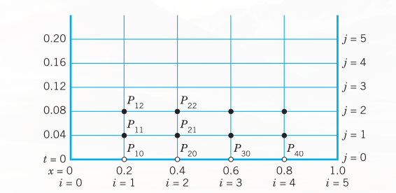{#fig-21-468}

### EXAMPLE 1: Temperature in a Metal Bar. Crank–Nicolson Method, Explicit Method
Consider a laterally insulated metal bar of length 1 and such that $c^2 = 1$ in the heat equation. Suppose that the ends of the bar are kept at temperature $u = 0^\circ\text{C}$ and the temperature in the bar at some instant—call it $t = 0$—is $f(x) = \sin \pi x$. Applying the Crank–Nicolson method with $h = 0.2$ and $r = 1$, find the temperature $u(x, t)$ in the bar for $0 \le t \le 0.2$. Compare the results with the exact solution. Also apply (@eq-sec216-5) with an $r$ satisfying (@eq-sec216-6), say, $r = 0.25$, and with values not satisfying (@eq-sec216-6), say, $r = 1$ and $r = 2.5$.

**Solution by Crank–Nicolson.** Since $r = 1$, formula (@eq-sec216-8) takes the form (@eq-sec216-9). Since $h = 0.2$ and $r = k/h^2 = 1$, we have $k = h^2 = 0.04$. Hence we have to do 5 steps. @fig-21-468 shows the grid. We shall need the initial values

$$u_{10} = \sin 0.2\pi = 0.587785, \quad u_{20} = \sin 0.4\pi = 0.951057$$

Also, $u_{30} = u_{20}$ and $u_{40} = u_{10}$. (Recall that $u_{10}$ means $u$ at $P_{10}$ in @fig-21-468, etc.) In each time row in @fig-21-468 there are 4 internal mesh points. Hence in each time step we would have to solve 4 equations in 4 unknowns. But since the initial temperature distribution is symmetric with respect to $x = 0.5$, and $u = 0$ at both ends for all $t$, we have $u_{31} = u_{21}, u_{41} = u_{11}$ in the first time row and similarly for the other rows. This reduces each system to 2 equations in 2 unknowns. By (@eq-sec216-9), since $u_{31} = u_{21}$ and $u_{01} = 0$, for $j = 0$ these equations are

$$
\begin{aligned}
(i = 1) \quad 4u_{11} - u_{21} &= u_{00} + u_{20} = 0.951057 \\
(i = 2) \quad -u_{11} + 3u_{21} &= u_{10} + u_{20} = 1.538842
\end{aligned}
$$

The solution is $u_{11} = 0.399274, u_{21} = 0.646039$. Similarly, for time row $j = 1$ we have the system

$$
\begin{aligned}
(i = 1) \quad 4u_{12} - u_{22} &= u_{01} + u_{21} = 0.646039 \\
(i = 2) \quad -u_{12} + 3u_{22} &= u_{11} + u_{21} = 1.045313
\end{aligned}
$$

The solution is $u_{12} = 0.271221, u_{22} = 0.438844$, and so on. This gives the temperature distribution (@fig-21-469):

| $t$ | $x = 0$ | $x = 0.2$ | $x = 0.4$ | $x = 0.6$ | $x = 0.8$ | $x = 1.0$ |
|---|---|---|---|---|---|---|
| 0.00 | 0 | 0.588 | 0.951 | 0.951 | 0.588 | 0 |
| 0.04 | 0 | 0.399 | 0.646 | 0.646 | 0.399 | 0 |
| 0.08 | 0 | 0.271 | 0.439 | 0.439 | 0.271 | 0 |
| 0.12 | 0 | 0.184 | 0.298 | 0.298 | 0.184 | 0 |
| 0.16 | 0 | 0.125 | 0.202 | 0.202 | 0.125 | 0 |
| 0.20 | 0 | 0.085 | 0.138 | 0.138 | 0.085 | 0 |

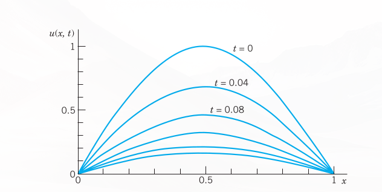{#fig-21-469}

**Comparison with the exact solution.** The present problem can be solved exactly by separating variables (<!-- TODO: replace Sec. 12.5 with actual cross-reference label -->); the result is

$$u(x, t) = \sin \pi x \, e^{-\pi^2 t}$$ {#eq-sec216-10}

**Solution by the explicit method (@eq-sec216-5) with $r = 0.25$.** For $h = 0.2$ and $r = k/h^2 = 0.25$ we have $k = rh^2 = 0.25 \cdot 0.04 = 0.01$. Hence we have to perform 4 times as many steps as with the Crank–Nicolson method! Formula (@eq-sec216-5) with $r = 0.25$ is

$$u_{i, j+1} = 0.25(u_{i-1, j} + 2u_{ij} + u_{i+1, j})$$ {#eq-sec216-11}

We can again make use of the symmetry. For $j = 0$ we need $u_{00} = 0, u_{10} = 0.587785$ (see p. 939), $u_{20} = u_{30} = 0.951057$ and compute

$$
\begin{aligned}
u_{11} &= 0.25(u_{00} + 2u_{10} + u_{20}) = 0.531657 \\
u_{21} &= 0.25(u_{10} + 2u_{20} + u_{30}) = 0.25(u_{10} + 3u_{20}) = 0.860239
\end{aligned}
$$

Of course we can omit the boundary terms $u_{01} = 0, u_{02} = 0, \dots$ from the formulas. For $j = 1$ we compute

$$
\begin{aligned}
u_{12} &= 0.25(2u_{11} + u_{21}) = 0.480888 \\
u_{22} &= 0.25(u_{11} + 3u_{21}) = 0.778094
\end{aligned}
$$

and so on. We have to perform 20 steps instead of the 5 CN steps, but the numeric values show that the accuracy is only about the same as that of the Crank–Nicolson values CN. The exact values follow from (@eq-sec216-10).

| $t$ | $x = 0.2$ | | | $x = 0.4$ | | |
|---|---|---|---|---|---|---|
| | **CN** | **By (@eq-sec216-11)** | **Exact** | **CN** | **By (@eq-sec216-11)** | **Exact** |
| 0.04 | 0.399 | 0.393 | 0.396 | 0.646 | 0.637 | 0.641 |
| 0.08 | 0.271 | 0.263 | 0.267 | 0.439 | 0.426 | 0.432 |
| 0.12 | 0.184 | 0.176 | 0.180 | 0.298 | 0.285 | 0.291 |
| 0.16 | 0.125 | 0.118 | 0.121 | 0.202 | 0.191 | 0.196 |
| 0.20 | 0.085 | 0.079 | 0.082 | 0.138 | 0.128 | 0.132 |

**Failure of (@eq-sec216-5) with $r$ violating (@eq-sec216-6).** Formula (@eq-sec216-5) with $h = 0.2$ and $r = 1$—which violates (@eq-sec216-6)—is

$$u_{i, j+1} = u_{i-1, j} - u_{ij} + u_{i+1, j}$$

and gives very poor values; some of these are:

| $t$ | $x = 0.2$ | | $x = 0.4$ | |
|---|---|---|---|---|
| | **By (@eq-sec216-5) ($r=1$)** | **Exact** | **By (@eq-sec216-5) ($r=1$)** | **Exact** |
| 0.04 | 0.363 | 0.396 | 0.588 | 0.641 |
| 0.12 | 0.139 | 0.180 | 0.225 | 0.291 |
| 0.20 | 0.053 | 0.082 | 0.086 | 0.132 |

Formula (@eq-sec216-5) with an even larger $r = 2.5$ (and $h = 0.2$ as before) gives completely nonsensical results; some of these are:

| $t$ | $x = 0.2$ | | $x = 0.4$ | |
|---|---|---|---|---|
| | **By (@eq-sec216-5) ($r=2.5$)** | **Exact** | **By (@eq-sec216-5) ($r=2.5$)** | **Exact** |
| 0.1 | 0.0265 | 0.2191 | 0.0429 | 0.3545 |
| 0.3 | 0.0001 | 0.0304 | 0.0001 | 0.0492 |

$\blacksquare$

### PROBLEM SET {#sec-ps-21-6}

1. **Nondimensional form.** Show that the heat equation $\tilde{u}_{\tilde{t}} = c^2 \tilde{u}_{\tilde{x}\tilde{x}}, 0 \le \tilde{x} \le L$, can be transformed to the "nondimensional" standard form $u_t = u_{xx}, 0 \le x \le 1$, by setting $x = \tilde{x}/L, t = c^2 \tilde{t}/L^2, u = \tilde{u}/u_0$, where $u_0$ is any constant temperature.
2. **Difference equation.** Derive the difference approximation (@eq-sec216-4) of the heat equation.
3. **Explicit method.** Derive (@eq-sec216-5) by solving (@eq-sec216-4) for $u_{i, j+1}$.
4. **CAS EXPERIMENT. Comparison of Methods.**
   a. Write programs for the explicit and the Crank–Nicolson methods.
   b. Apply the programs to the heat problem of a laterally insulated bar of length 1 with $u(x, 0) = \sin \pi x$ and $u(0, t) = u(1, t) = 0$ for all $t$, using $h = 0.2, k = 0.01$ for the explicit method (20 steps), $h = 0.2$ and (@eq-sec216-9) for the Crank–Nicolson method (5 steps). Obtain exact 6D-values from a series and compare.
   c. Graph temperature curves in (b) in two figures similar to <!-- TODO: replace Fig. 299 with actual figure reference -->Fig. 299 in <!-- TODO: replace Sec. 12.7 with actual cross-reference label -->Sec. 12.7.
   d. Experiment with smaller $h$ (0.1, 0.05, etc.) for both methods to find out to what extent accuracy increases under systematic changes of $h$ and $k$.

#### 5–10: EXPLICIT METHOD
5. Using (@eq-sec216-5) with $h = 1$ and $k = 0.5$, solve the heat problem (@eq-sec216-1)–(@eq-sec216-3) to find the temperature at $t = 2$ in a laterally insulated bar of length $10\text{ ft}$ and initial temperature $f(x) = x(1 - 0.1x)$.
6. Solve the heat problem (@eq-sec216-1)–(@eq-sec216-3) by the explicit method with $h = 0.2$ and $k = 0.01$, 8 time steps, when $f(x) = x$ if $0 \le x < \frac{1}{2}, f(x) = 1 - x$ if $\frac{1}{2} \le x \le 1$. Compare with the 3S-values 0.108, 0.175 for $t = 0.08, x = 0.2, 0.4$ obtained from the series (2 terms) in <!-- TODO: replace Sec. 12.5 with actual cross-reference label -->.
7. The accuracy of the explicit method depends on $r$ ($\le \frac{1}{2}$). Illustrate this for Prob. 6, choosing $r = \frac{1}{2}$ (and $h = 0.2$ as before). Do 4 steps. Compare the values for $t = 0.04$ and $0.08$ with the 3S-values in Prob. 6, which are 0.156, 0.254 ($t = 0.04$), 0.105, 0.170 ($t = 0.08$).
8. In a laterally insulated bar of length 1 let the initial temperature be $f(x) = x$ if $0 \le x < 0.5, f(x) = 1 - x$ if $0.5 \le x \le 1$. Let (@eq-sec216-1) and (@eq-sec216-3) hold. Apply the explicit method with $h = 0.2, k = 0.01$, 5 steps. Can you expect the solution to satisfy $u(x, t) = u(1 - x, t)$ for all $t$?
9. Solve Prob. 8 with $f(x) = x$ if $0 \le x \le 0.2, f(x) = 0.25(1 - x)$ if $0.2 < x \le 1$, the other data being as before.
10. **Insulated end.** If the left end of a laterally insulated bar extending from $x = 0$ to $x = 1$ is insulated, the boundary condition at $x = 0$ is $u_n(0, t) = u_x(0, t) = 0$. Show that, in the application of the explicit method given by (@eq-sec216-5), we can compute $u_{0, j+1}$ by the formula
    $$u_{0, j+1} = (1 - 2r)u_{0j} + 2ru_{1j}$$
    Apply this with $h = 0.2$ and $r = 0.25$ to determine the temperature $u(x, t)$ in a laterally insulated bar extending from $x = 0$ to $1$ if $u(x, 0) = 0$, the left end is insulated and the right end is kept at temperature $g(t) = \sin \frac{50}{3}\pi t$.  
    *Hint.* Use $0 = \partial u_{0j}/\partial x \approx (u_{1j} - u_{-1, j})/2h$.

#### 11–15: CRANK–NICOLSON METHOD
11. Solve Prob. 9 by (@eq-sec216-9) with $h = 0.2$, 2 steps. Compare with exact values obtained from the series in <!-- TODO: replace Sec. 12.5 with actual cross-reference label --> (2 terms) with suitable coefficients.
12. Solve the heat problem (@eq-sec216-1)–(@eq-sec216-3) by Crank–Nicolson for $0 \le t \le 0.20$ with $h = 0.2$ and $k = 0.04$ when $f(x) = x$ if $0 \le x < \frac{1}{2}, f(x) = 1 - x$ if $\frac{1}{2} \le x \le 1$. Compare with the exact values for $t = 0.20$ obtained from the series (2 terms) in <!-- TODO: replace Sec. 12.5 with actual cross-reference label -->.
13. Solve (@eq-sec216-1)–(@eq-sec216-3) by Crank–Nicolson with $r = 1$ (5 steps), where $f(x) = 5x$ if $0 \le x < 0.25, f(x) = 1.25(1 - x)$ if $0.25 \le x \le 1, h = 0.2$.
14. Solve (@eq-sec216-1)–(@eq-sec216-3) by Crank–Nicolson with $r = 1$ (5 steps), where $f(x) = x(1 - x), h = 0.1$. (Compare with Prob. 15.)
15. Solve (@eq-sec216-1)–(@eq-sec216-3) by Crank–Nicolson with $r = 1$ (5 steps), where $f(x) = x(1 - x), h = 0.2$.

## Method for Hyperbolic PDEs {#sec-methods-hyperbolic-pdes}

In this section we consider the numeric solution of problems involving hyperbolic PDEs. We explain a standard method in terms of a typical setting for the prototype of a hyperbolic PDE, the wave equation:

$$u_{tt} = u_{xx} \quad (0 \le x \le 1, t \ge 0)$$ {#eq-sec217-1}

$$u(x, 0) = f(x) \quad \text{(Given initial displacement)}$$ {#eq-sec217-2}

$$u_t(x, 0) = g(x) \quad \text{(Given initial velocity)}$$ {#eq-sec217-3}

$$u(0, t) = u(1, t) = 0 \quad \text{(Boundary conditions)}$$ {#eq-sec217-4}

Note that an equation $u_{tt} = c^2 u_{xx}$ and another $x$-interval can be reduced to the form (@eq-sec217-1) by a linear transformation of $x$ and $t$. This is similar to @sec-methods-parabolic-pdes, Prob. 1.

For instance, (@eq-sec217-1)–(@eq-sec217-4) is the model of a vibrating elastic string with fixed ends at $x = 0$ and $x = 1$ (see <!-- TODO: replace Sec. 12.2 with actual cross-reference label -->). Although an analytic solution of the problem is given in <!-- TODO: verify equation reference -->(13), <!-- TODO: replace Sec. 12.4 with actual cross-reference label -->, we use the problem for explaining basic ideas of the numeric approach that are also relevant for more complicated hyperbolic PDEs.

Replacing the derivatives by difference quotients as before, we obtain from (@eq-sec217-1) [see (@eq-sec214-6a) and (@eq-sec214-6b) in @sec-methods-elliptic-pdes with $y = t$]

$$\frac{1}{k^2} (u_{i, j+1} - 2u_{ij} + u_{i, j-1}) = \frac{1}{h^2} (u_{i+1, j} - 2u_{ij} + u_{i-1, j})$$ {#eq-sec217-5}

where $h$ is the mesh size in $x$, and $k$ is the mesh size in $t$. This difference equation relates 5 points as shown in @fig-21-470. It suggests a rectangular grid similar to the grids for parabolic equations in the preceding section. We choose $r^* = k^2/h^2 = 1$. Then $u_{ij}$ drops out and we have

$$u_{i, j+1} = u_{i-1, j} + u_{i+1, j} - u_{i, j-1}$$ {#eq-sec217-6}

(see @fig-21-470).

It can be shown that for $0 < r^* \le 1$ the present explicit method is stable, so that from (@eq-sec217-6) we may expect reasonable results for initial data that have no discontinuities. (For a hyperbolic PDE the latter would propagate into the solution domain—a phenomenon that would be difficult to deal with on our present grid. For unconditionally stable implicit methods see [E1] in App. 1.)

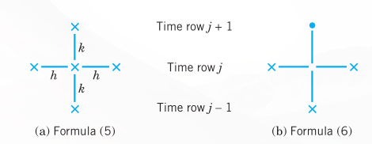{#fig-21-470}

Equation (@eq-sec217-6) still involves 3 time steps $j - 1, j, j + 1$, whereas the formulas in the parabolic case involved only 2 time steps. Furthermore, we now have 2 initial conditions. So we ask how we get started and how we can use the initial condition (@eq-sec217-3). This can be done as follows.

From $u_t(x, 0) = g(x)$ we derive the difference formula

$$\frac{1}{2k} (u_{i1} - u_{i, -1}) = g_i$$ {#eq-sec217-7}

hence

$$u_{i, -1} = u_{i1} - 2kg_i$$

where $g_i = g(ih)$. For $t = 0$, that is, $j = 0$, equation (@eq-sec217-6) is

$$u_{i1} = u_{i-1, 0} + u_{i+1, 0} - u_{i, -1}$$

Into this we substitute $u_{i, -1}$ as given in (@eq-sec217-7). We obtain $u_{i1} = u_{i-1, 0} + u_{i+1, 0} - u_{i1} + 2kg_i$ and by simplification

$$u_{i1} = \frac{1}{2} (u_{i-1, 0} + u_{i+1, 0}) + kg_i$$ {#eq-sec217-8}

This expresses $u_{i1}$ in terms of the initial data. It is for the beginning only. Then use (@eq-sec217-6).

### EXAMPLE 1: Vibrating String, Wave Equation
Apply the present method with $h = k = 0.2$ to the problem (@eq-sec217-1)–(@eq-sec217-4), where $f(x) = \sin \pi x, g(x) = 0$.

**Solution.** The grid is the same as in @fig-21-468, @sec-methods-parabolic-pdes, except for the values of $t$, which now are $0.2, 0.4, \dots$ (instead of $0.04, 0.08, \dots$). The initial values $u_{00}, u_{10}, \dots$ are the same as in Example 1, @sec-methods-parabolic-pdes. From (@eq-sec217-8) and $g(x) = 0$ we have

$$u_{i1} = \frac{1}{2} (u_{i-1, 0} + u_{i+1, 0})$$

From this we compute, using $u_{10} = u_{40} = \sin 0.2\pi = 0.587785, u_{20} = u_{30} = \sin 0.4\pi = 0.951057$,

$$
\begin{aligned}
(i = 1) \quad u_{11} &= \frac{1}{2} (u_{00} + u_{20}) = \frac{1}{2} \cdot 0.951057 = 0.475528 \\
(i = 2) \quad u_{21} &= \frac{1}{2} (u_{10} + u_{30}) = \frac{1}{2} \cdot 1.538842 = 0.769421
\end{aligned}
$$

and $u_{31} = u_{21}, u_{41} = u_{11}$ by symmetry as in @sec-methods-parabolic-pdes, Example 1. From (@eq-sec217-6) with $j = 1$ we now compute, using $u_{01} = u_{02} = \dots = 0$,

$$
\begin{aligned}
(i = 1) \quad u_{12} &= u_{01} + u_{21} - u_{10} = 0.769421 - 0.587785 = 0.181636 \\
(i = 2) \quad u_{22} &= u_{11} + u_{31} - u_{20} = 0.475528 + 0.769421 - 0.951057 = 0.293892
\end{aligned>
$$

and $u_{32} = u_{22}, u_{42} = u_{12}$ by symmetry; and so on. We thus obtain the following values of the displacement $u(x, t)$ of the string over the first half-cycle:

| $t$ | $x = 0$ | $x = 0.2$ | $x = 0.4$ | $x = 0.6$ | $x = 0.8$ | $x = 1.0$ |
|---|---|---|---|---|---|---|
| 0.0 | 0 | 0.588 | 0.951 | 0.951 | 0.588 | 0 |
| 0.2 | 0 | 0.476 | 0.769 | 0.769 | 0.476 | 0 |
| 0.4 | 0 | 0.182 | 0.294 | 0.294 | 0.182 | 0 |
| 0.6 | 0 | -0.182 | -0.294 | -0.294 | -0.182 | 0 |
| 0.8 | 0 | -0.476 | -0.769 | -0.769 | -0.476 | 0 |
| 1.0 | 0 | -0.588 | -0.951 | -0.951 | -0.588 | 0 |

These values are exact to 3D (3 decimals), the exact solution of the problem being (see <!-- TODO: replace Sec. 12.3 with actual cross-reference label -->)

$$u(x, t) = \sin \pi x \cos \pi t$$

The reason for the exactness follows from d'Alembert's solution <!-- TODO: verify equation reference -->(4), <!-- TODO: replace Sec. 12.4 with actual cross-reference label -->. (See Prob. 10, below.) $\blacksquare$

This is the end of @ch-numerics-odes-pdes on numerics for ODEs and PDEs, a field that continues to develop rapidly in both applications and theoretical research. Much of the activity in the field is due to the computer serving as an invaluable tool for solving large-scale and complicated practical problems as well as for testing and experimenting with innovative ideas. These ideas could be small or major improvements on existing numeric algorithms or testing new algorithms as well as other ideas.

### PROBLEM SET {#sec-ps-21-7}

#### 1–3: VIBRATING STRING
Using the present method, solve (@eq-sec217-1)–(@eq-sec217-4) with $h = k = 0.2$ for the given initial deflection $f(x)$ and initial velocity 0 on the given $t$-interval.
1. $f(x) = x$ if $0 \le x < 0.2$, $f(x) = 0.25(1 - x)$ if $0.2 \le x \le 1$, $0 \le t \le 1.0$
2. $f(x) = x^2 - x^3$, $0 \le t \le 2.0$
3. $f(x) = 0.2(x - x^2)$, $0 \le t \le 2.0$

4. **Another starting formula.** Show that <!-- TODO: verify equation reference -->(12) in <!-- TODO: replace Sec. 12.4 with actual cross-reference label --> gives the starting formula
   $$u_{i1} = \frac{1}{2} (u_{i+1, 0} + u_{i-1, 0}) + \frac{1}{2} \int_{x_i - k}^{x_i + k} g(s) \, ds$$
   (where one can evaluate the integral numerically if necessary). In what case is this identical with (@eq-sec217-8)?
5. **Nonzero initial displacement and speed.** Illustrate the starting procedure when both $f$ and $g$ are not identically zero, say, $f(x) = 1 - \cos 2\pi x, g(x) = x(1 - x), h = k = 0.1$, 2 time steps.
6. Solve (1)–(3) ($h = k = 0.2, 5$ time steps) subject to $f(x) = x^2, g(x) = 2x, u_x(0, t) = 2t, u(1, t) = (1 + t)^2$.
7. **Zero initial displacement.** If the string governed by the wave equation (1) starts from its equilibrium position with initial velocity $g(x) = \sin \pi x$, what is its displacement at time $t = 0.4$ and $x = 0.2, 0.4, 0.6, 0.8$? (Use the present method with $h = 0.2, k = 0.2$. Use (@eq-sec217-8). Compare with the exact values obtained from <!-- TODO: verify equation reference -->(12) in <!-- TODO: replace Sec. 12.4 with actual cross-reference label -->.)
8. Compute approximate values in Prob. 7, using a finer grid ($h = 0.1, k = 0.1$), and notice the increase in accuracy.
9. Compute $u$ in Prob. 5 for $t = 0.1$ and $x = 0.1, 0.2, \dots, 0.9$, using the formula in Prob. 8, and compare the values.
10. Show that from d’Alembert’s solution <!-- TODO: verify equation reference -->(13) in <!-- TODO: replace Sec. 12.4 with actual cross-reference label --> with $c = 1$ it follows that (@eq-sec217-6) in the present section gives the exact value $u_{i, j+1} = u(ih, (j + 1)h)$.

## Review Questions and Problems {#sec-ch21-review}

### Review Questions
1. Explain the Euler and improved Euler methods in geometrical terms. Why did we consider these methods?
2. How did we obtain numeric methods from the Taylor series?
3. What are the local and the global orders of a method? Give examples.
4. Why did we compute auxiliary values in each Runge–Kutta step? How many?
5. What is adaptive integration? How does its idea extend to Runge–Kutta?
6. What are one-step methods? Multistep methods? The underlying ideas? Give examples.
7. What does it mean that a method is not self-starting? How do we overcome this problem?
8. What is a predictor–corrector method? Give an important example.
9. What is automatic step size control? When is it needed? How is it done in practice?
10. How do we extend Runge–Kutta to systems of ODEs?
11. Why did we have to treat the main types of PDEs in separate sections? Make a list of types of problems and numeric methods.
12. When and how did we use finite differences? Give as many details as you can remember without looking into the text.
13. How did we approximate the Laplace and Poisson equations?
14. How many initial conditions did we prescribe for the wave equation? For the heat equation?
15. Can we expect a difference equation to give the exact solution of the corresponding PDE?
16. In what method for PDEs did we have convergence problems?

### Problems
17. Solve $y' = y, y(0) = 1$ by Euler’s method, 10 steps, $h = 0.1$.
18. Do Prob. 17 with $h = 0.01, 10$ steps. Compute the errors. Compare the error for $x = 0.1$ with that in Prob. 17.
19. Solve $y' = 1 + y^2, y(0) = 0$ by the improved Euler method, $h = 0.1, 10$ steps.
20. Solve $y' + y = (x + 1)^2, y(0) = 3$ by the improved Euler method, 10 steps with $h = 0.1$. Determine the errors.
21. Solve Prob. 19 by RK with $h = 0.1, 5$ steps. Compute the error. Compare with Prob. 19.
22. **Fair comparison.** Solve $y' = 2x^{-1}y - \ln x + x^{-1}, y(1) = 0$ for $1 \le x \le 1.8$ (a) by the Euler method with $h = 0.1$, (b) by the improved Euler method with $h = 0.2$, and (c) by RK with $h = 0.4$. Verify that the exact solution is $y = (\ln x)^2 + \ln x$. Compute and compare the errors. Why is the comparison fair?
23. Apply the Adams–Moulton method to $y' = \frac{1}{2}(1 - y^2), y(0) = 0, h = 0.2, x = 0, \dots, 1$, starting with $0.198668, 0.389416, 0.564637$.
24. Apply the A–M method to $y' = (x + y - 4)^2, y(0) = 4, h = 0.2, x = 0, \dots, 1$, starting with $4.00271, 4.02279, 4.08413$.
25. Apply Euler’s method for systems to $y'' = x^2 y, y(0) = 1, y'(0) = 0, h = 0.1, 5$ steps.
26. Apply Euler’s method for systems to $y_1' = y_2, y_2' = -4y_1, y_1(0) = 2, y_2(0) = 0, h = 0.2, 10$ steps. Sketch the solution.
27. Apply Runge–Kutta for systems to $y'' + y = 2e^x, y(0) = 0, y'(0) = 1, h = 0.2, 5$ steps. Determine the errors.
28. Apply Runge–Kutta for systems to $y_1' = 6y_1 + 9y_2, y_2' = y_1 + 6y_2, y_1(0) = -3, y_2(0) = -3, h = 0.05, 3$ steps.
29. Find rough approximate values of the electrostatic potential at $P_{11}, P_{12}, P_{13}$ in @fig-21-471 that lie in a field between conducting plates (in @fig-21-471 appearing as sides of a rectangle) kept at potentials 0 and $220\text{ V}$ as shown. (Use the indicated grid.)

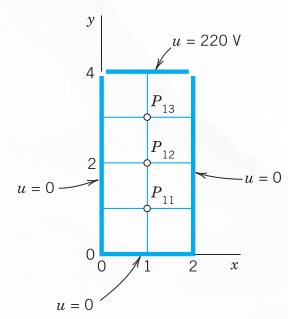{#fig-21-471}

30. A laterally insulated homogeneous bar with ends at $x = 0$ and $x = 1$ has initial temperature 0. Its left end is kept at 0, whereas the temperature at the right end varies sinusoidally according to
    $$u(t, 1) = g(t) = \sin \frac{25}{3}\pi t$$
    Find the temperature $u(x, t)$ in the bar [solution of (@eq-sec216-1)] by the explicit method with $h = 0.2$ and $r = 0.5$ (one period, that is, $0 \le t \le 0.24$).
31. Find the solution of the vibrating string problem $u_{tt} = u_{xx}, u(x, 0) = x(1 - x), u_t = 0, u(0, t) = u(1, t) = 0$ by the method in @sec-methods-hyperbolic-pdes with $h = 0.1$ and $k = 0.1$ for $t = 0.3$.

#### 32–34: POTENTIAL
Find the potential in @fig-21-472, using the given grid and the boundary values:
32. $u(P_{01}) = u(P_{03}) = u(P_{41}) = u(P_{43}) = 200$, $u(P_{10}) = u(P_{30}) = -400$, $u(P_{20}) = 1600$, $u(P_{02}) = u(P_{42}) = u(P_{14}) = u(P_{24}) = u(P_{34}) = 0$
33. $u(P_{10}) = u(P_{30}) = 960, u(P_{20}) = -480, u = 0$ elsewhere on the boundary
34. $u = 70$ on the upper and left sides, $u = 0$ on the lower and right sides

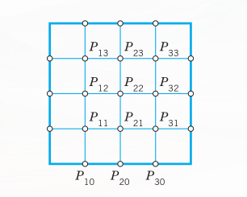{#fig-21-472}

35. Solve $u_t = u_{xx} \ (0 \le x \le 1, t \ge 0), u(x, 0) = x^2(1 - x), u(0, t) = u(1, t) = 0$ by Crank–Nicolson with $h = 0.2, k = 0.04, 5$ time steps.

## Summary {#sec-ch21-summary}

In this chapter we discussed numerics for ODEs (@sec-methods-first-order-odes, @sec-multistep-methods, and @sec-methods-systems-higher-order) and PDEs (@sec-methods-elliptic-pdes, @sec-neumann-mixed-problems, @sec-methods-parabolic-pdes, and @sec-methods-hyperbolic-pdes). Methods for initial value problems

$$y' = f(x, y), \quad y(x_0) = y_0$$ {#eq-sum21-1}

involving a first-order ODE are obtained by truncating the Taylor series

$$y(x + h) = y(x) + hy'(x) + \frac{h^2}{2}y''(x) + \dots$$

where, by (@eq-sum21-1), $y' = f, y'' = f' = \partial f/\partial x + (\partial f/\partial y)y'$, etc. Truncating after the term $hy'$, we get the Euler method, in which we compute step by step

$$y_{n+1} = y_n + hf(x_n, y_n) \quad (n = 0, 1, \dots)$$ {#eq-sum21-2}

Taking one more term into account, we obtain the improved Euler method. Both methods show the basic idea but are too inaccurate in most cases.

Truncating after the term in $h^4$, we get the important classical Runge–Kutta (RK) method of fourth order. The crucial idea in this method is the replacement of the cumbersome evaluation of derivatives by the evaluation of $f(x, y)$ at suitable points $(x, y)$; thus in each step we first compute four auxiliary quantities (@sec-methods-first-order-odes)

$$
\begin{aligned}
k_1 &= hf(x_n, y_n) \\
k_2 &= hf\left(x_n + \frac{1}{2}h, y_n + \frac{1}{2}k_1\right) \\
k_3 &= hf\left(x_n + \frac{1}{2}h, y_n + \frac{1}{2}k_2\right) \\
k_4 &= hf(x_n + h, y_n + k_3)
\end{aligned}
$$ {#eq-sum21-3a}

and then the new value

$$y_{n+1} = y_n + \frac{1}{6}(k_1 + 2k_2 + 2k_3 + k_4)$$ {#eq-sum21-3b}

Error and step size control are possible by step halving or by RKF (Runge–Kutta–Fehlberg).

The methods in @sec-methods-first-order-odes are one-step methods since they get $y_{n+1}$ from the result $y_n$ of a single step. A multistep method (@sec-multistep-methods) uses the values $y_n, y_{n-1}, \dots$ of several steps for computing $y_{n+1}$. Integrating cubic interpolation polynomials gives the Adams–Bashforth predictor (@sec-multistep-methods)

$$y^*_{n+1} = y_n + \frac{1}{24}h(55f_n - 59f_{n-1} + 37f_{n-2} - 9f_{n-3})$$ {#eq-sum21-4a}

where $f_j = f(x_j, y_j)$, and an Adams–Moulton corrector (the actual new value)

$$y_{n+1} = y_n + \frac{1}{24}h(9f^*_{n+1} + 19f_n - 5f_{n-1} + f_{n-2})$$ {#eq-sum21-4b}

where $f^*_{n+1} = f(x_{n+1}, y^*_{n+1})$. Here, to get started, $y_1, y_2, y_3$ must be computed by the Runge–Kutta method or by some other accurate method.

@sec-methods-systems-higher-order concerned the extension of Euler and RK methods to systems

$$\mathbf{y}' = \mathbf{f}(x, \mathbf{y})$$

thus

$$y'_j = f_j(x, y_1, \dots, y_m), \quad j = 1, \dots, m$$

This includes single $m\text{th}$-order ODEs, which are reduced to systems. Second-order equations can also be solved by RKN (Runge–Kutta–Nyström) methods. These are particularly advantageous for $y'' = f(x, y)$ with $f$ not containing $y'$.

Numeric methods for PDEs are obtained by replacing partial derivatives by difference quotients. This leads to approximating difference equations, for the Laplace equation to

$$u_{i+1, j} + u_{i, j+1} + u_{i-1, j} + u_{i, j-1} - 4u_{ij} = 0 \quad \text{(@sec-methods-elliptic-pdes)}$$ {#eq-sum21-5}

for the heat equation to

$$\frac{1}{k}(u_{i, j+1} - u_{ij}) = \frac{1}{h^2}(u_{i+1, j} - 2u_{ij} + u_{i-1, j}) \quad \text{(@sec-methods-parabolic-pdes)}$$ {#eq-sum21-6}

and for the wave equation to

$$\frac{1}{k^2}(u_{i, j+1} - 2u_{ij} + u_{i, j-1}) = \frac{1}{h^2}(u_{i+1, j} - 2u_{ij} + u_{i-1, j}) \quad \text{(@sec-methods-hyperbolic-pdes)}$$ {#eq-sum21-7}

here $h$ and $k$ are the mesh sizes of a grid in the $x$- and $y$-directions, respectively, where in (@eq-sum21-6) and (@eq-sum21-7) the variable $y$ is time $t$.

These PDEs are elliptic, parabolic, and hyperbolic, respectively. Corresponding numeric methods differ, for the following reason. For elliptic PDEs we have boundary value problems, and we discussed for them the Gauss–Seidel method (also known as Liebmann’s method) and the ADI method (@sec-methods-elliptic-pdes, @sec-neumann-mixed-problems). For parabolic PDEs we are given one initial condition and boundary conditions, and we discussed an explicit method and the Crank–Nicolson method (@sec-methods-parabolic-pdes). For hyperbolic PDEs, the problems are similar but we are given a second initial condition (@sec-methods-hyperbolic-pdes).

