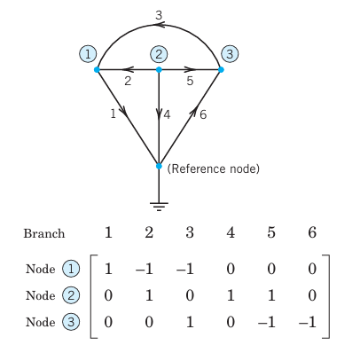
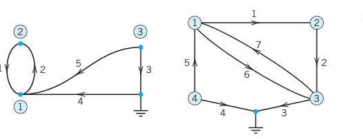
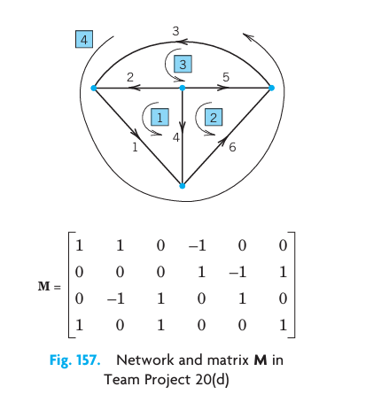
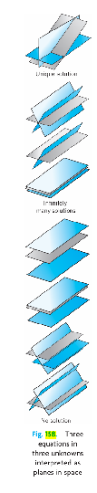
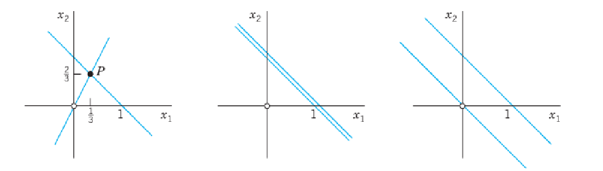

Linear algebra is a fairly extensive subject that covers vectors and matrices, determinants, systems of linear equations, vector spaces and linear transformations, eigenvalue problems, and other topics. As an area of study it has a broad appeal in that it has many applications in engineering, physics, geometry, computer science, economics, and other areas. It also contributes to a deeper understanding of mathematics itself.

Matrices, which are rectangular arrays of numbers or functions, and vectors are the main tools of linear algebra. Matrices are important because they let us express large amounts of data and functions in an organized and concise form. Furthermore, since matrices are single objects, we denote them by single letters and calculate with them directly. All these features have made matrices and vectors very popular for expressing scientific and mathematical ideas.

The chapter keeps a good mix between applications (electric networks, Markov processes, traffic flow, etc.) and theory. @ch-linear-algebra-matrices-vectors-determinants-linear-systems is structured as follows: @sec-matrices-vectors-addition-scalar-multiplication and @sec-matrix-multiplication provide an intuitive introduction to matrices and vectors and their operations, including matrix multiplication. The next block of sections, that is, @sec-linear-systems-equations-gauss-elimination to @sec-solutions-linear-systems-existence-uniqueness provide the most important method for solving systems of linear equations by the Gauss elimination method. This method is a cornerstone of linear algebra, and the method itself and variants of it appear in different areas of mathematics and in many applications. It leads to a consideration of the behavior of solutions and concepts such as rank of a matrix, linear independence, and bases. We shift to determinants, a topic that has declined in importance, in @sec-reference-second-third-order-determinants and @sec-determinants-cramer-rule. @sec-inverse-matrix-gauss-jordan-elimination covers inverses of matrices. The chapter ends with vector spaces, inner product spaces, linear transformations, and composition of linear transformations. Eigenvalue problems follow in <!-- TODO: replace Chap. 8 with actual chapter label -->Chap. 8.

**COMMENT.** Numeric linear algebra (<!-- TODO: replace Secs. 20.1–20.5 with actual cross-reference label -->Secs. 20.1–20.5) can be studied immediately after this chapter.

**Prerequisite:** None.

**Sections that may be omitted in a short course:** @sec-solutions-linear-systems-existence-uniqueness, @sec-vector-spaces-inner-product-spaces-linear-transformations.

**References and Answers to Problems:** App. 1 Part B, and App. 2.

---

## Matrices, Vectors: Addition and Scalar Multiplication {#sec-matrices-vectors-addition-scalar-multiplication}

The basic concepts and rules of matrix and vector algebra are introduced in @sec-matrices-vectors-addition-scalar-multiplication and @sec-matrix-multiplication and are followed by **linear systems** (systems of linear equations), a main application, in @sec-linear-systems-equations-gauss-elimination.

Let us first take a leisurely look at matrices before we formalize our discussion. A **matrix** is a rectangular array of numbers or functions which we will enclose in brackets. For example,

$$
\begin{bmatrix} 0.3 & 1 & -5 \\ 0 & -0.2 & 16 \end{bmatrix},
\quad
\begin{bmatrix} a_{11} & a_{12} & a_{13} \\ a_{21} & a_{22} & a_{23} \\ a_{31} & a_{32} & a_{33} \end{bmatrix},
\quad
\begin{bmatrix} e^{-x} & 2x^2 & 4 \\ e^{6x} & 4x & 2 \end{bmatrix},
\quad
\begin{bmatrix} a_1 & a_2 & a_3 \end{bmatrix},
\quad
\begin{bmatrix} 1 \\ 2 \end{bmatrix}
$$ {#eq-7-1}

are matrices. The numbers (or functions) are called **entries** or, less commonly, **elements** of the matrix. The first matrix in (@eq-7-1) has two **rows**, which are the horizontal lines of entries. Furthermore, it has three **columns**, which are the vertical lines of entries. The second and third matrices are **square matrices**, which means that each has as many rows as columns — 3 and 2, respectively. The entries of the second matrix have two indices, signifying their location within the matrix. The first index is the number of the row and the second is the number of the column, so that together the entry's position is uniquely identified. For example, $a_{23}$ (read $a$ two three) is in Row 2 and Column 3, etc. The notation is standard and applies to all matrices, including those that are not square.

Matrices having just a single row or column are called **vectors**. Thus, the fourth matrix in (@eq-7-1) has just one row and is called a **row vector**. The last matrix in (@eq-7-1) has just one column and is called a **column vector**. Because the goal of the indexing of entries was to uniquely identify the position of an element within a matrix, one index suffices for vectors, whether they are row or column vectors. Thus, the third entry of the row vector in (@eq-7-1) is denoted by $a_3$.

Matrices are handy for storing and processing data in applications. Consider the following two common examples.

### EXAMPLE 1 Linear Systems, a Major Application of Matrices

We are given a system of linear equations, briefly a **linear system**, such as

$$
\begin{aligned}
4x_1 + 6x_2 + 9x_3 &= 6\\
6x_1 \hphantom{{}+6x_2} - 2x_3 &= 20\\
5x_1 - 8x_2 + x_3 &= 10
\end{aligned}
$$

where $x_1, x_2, x_3$ are the unknowns. We form the **coefficient matrix**, call it **A**, by listing the coefficients of the unknowns in the position in which they appear in the linear equations. In the second equation, there is no unknown $x_2$, which means that the coefficient of $x_2$ is 0 and hence in matrix **A**, $a_{22} = 0$. Thus,

$$
\mathbf{A} = \begin{bmatrix} 4 & 6 & 9 \\ 6 & 0 & -2 \\ 5 & -8 & 1 \end{bmatrix}.
\quad
\text{We form another matrix } \tilde{\mathbf{A}} = \begin{bmatrix} 4 & 6 & 9 & 6 \\ 6 & 0 & -2 & 20 \\ 5 & -8 & 1 & 10 \end{bmatrix}
$$

by augmenting **A** with the right sides of the linear system and call it the **augmented matrix** of the system. Since we can go back and recapture the system of linear equations directly from the augmented matrix $\tilde{\mathbf{A}}$, $\tilde{\mathbf{A}}$ contains all the information of the system and can thus be used to solve the linear system. This means that we can just use the augmented matrix to do the calculations needed to solve the system. We shall explain this in detail in @sec-linear-systems-equations-gauss-elimination. Meanwhile you may verify by substitution that the solution is $x_1 = 3$, $x_2 = 1$, $x_3 = -1$.

The notation $x_1, x_2, x_3$ for the unknowns is practical but not essential; we could choose $x, y, z$ or some other letters. $\square$

### EXAMPLE 2 Sales Figures in Matrix Form

Sales figures for three products I, II, III in a store on Monday (Mon), Tuesday (Tues), … may for each week be arranged in a matrix

$$
\mathbf{A} = \begin{bmatrix} 40 & 33 & 81 & 0 & 21 & 47 & 33 \\ 0 & 12 & 78 & 50 & 50 & 96 & 90 \\ 10 & 0 & 0 & 27 & 43 & 78 & 56 \end{bmatrix}
\begin{matrix} \text{I} \\ \text{II} \\ \text{III} \end{matrix}
$$

If the company has 10 stores, we can set up 10 such matrices, one for each store. Then, by adding corresponding entries of these matrices, we can get a matrix showing the total sales of each product on each day. Can you think of other data which can be stored in matrix form? For instance, in transportation or storage problems? Or in listing distances in a network of roads? $\square$

### General Concepts and Notations

We shall denote matrices by capital boldface letters **A**, **B**, **C**, …, or by writing the general entry in brackets; thus $\mathbf{A} = [a_{jk}]$, and so on. By an $m \times n$ **matrix** (read $m$ by $n$ matrix) we mean a matrix with $m$ rows and $n$ columns — rows always come first! $m \times n$ is called the **size** of the matrix. Thus an $m \times n$ matrix is of the form

$$
\mathbf{A} = [a_{jk}] = \begin{bmatrix} a_{11} & a_{12} & \cdots & a_{1n} \\ a_{21} & a_{22} & \cdots & a_{2n} \\ \vdots & \vdots & & \vdots \\ a_{m1} & a_{m2} & \cdots & a_{mn} \end{bmatrix}
$$ {#eq-7-2}

The matrices in (@eq-7-1) are of sizes $2\times3$, $3\times3$, $2\times2$, $1\times3$, and $2\times1$, respectively.

Each entry in (@eq-7-2) has two subscripts. The first is the **row number** and the second is the **column number**. Thus $a_{21}$ is the entry in Row 2 and Column 1.

If $m = n$, we call **A** an $n \times n$ **square matrix**. Then its diagonal containing the entries $a_{11}, a_{22}, \ldots, a_{nn}$ is called the **main diagonal** of **A**. Thus the main diagonals of the two square matrices in (@eq-7-1) are $a_{11}, a_{22}, a_{33}$ and $e^{-x}, 4x$, respectively.

Square matrices are particularly important, as we shall see. A matrix of any size $m \times n$ is called a **rectangular matrix**; this includes square matrices as a special case.

### Vectors

A **vector** is a matrix with only one row or column. Its entries are called the **components** of the vector. We shall denote vectors by lowercase boldface letters **a**, **b**, … or by its general component in brackets, $\mathbf{a} = [a_j]$, and so on. Our special vectors in (@eq-7-1) suggest that a (general) **row vector** is of the form

$$
\mathbf{a} = [a_1 \quad a_2 \quad \cdots \quad a_n]. \quad \text{For instance, } \mathbf{a} = [-2 \quad 5 \quad 0.8 \quad 0 \quad 1].
$$

A **column vector** is of the form

$$
\mathbf{b} = \begin{bmatrix} b_1 \\ b_2 \\ \vdots \\ b_m \end{bmatrix}. \quad \text{For instance, } \mathbf{b} = \begin{bmatrix} 4 \\ 0 \\ -7 \end{bmatrix}.
$$

### Addition and Scalar Multiplication of Matrices and Vectors

What makes matrices and vectors really useful and particularly suitable for computers is the fact that we can calculate with them almost as easily as with numbers. Indeed, we now introduce rules for **addition** and for **scalar multiplication** (multiplication by numbers) that were suggested by practical applications. (Multiplication of matrices by matrices follows in the next section.) We first need the concept of equality.

**DEFINITION: Equality of Matrices.** Two matrices $\mathbf{A} = [a_{jk}]$ and $\mathbf{B} = [b_{jk}]$ are **equal**, written $\mathbf{A} = \mathbf{B}$, if and only if they have the same size and the corresponding entries are equal, that is, $a_{11} = b_{11}$, $a_{12} = b_{12}$, and so on. Matrices that are not equal are called **different**. Thus, matrices of different sizes are always different.

### EXAMPLE 3 Equality of Matrices

Let

$$
\mathbf{A} = \begin{bmatrix} a_{11} & a_{12} \\ a_{21} & a_{22} \end{bmatrix} \quad \text{and} \quad \mathbf{B} = \begin{bmatrix} 4 & 0 \\ 3 & -1 \end{bmatrix}.
$$

Then

$$
\mathbf{A} = \mathbf{B} \quad \text{if and only if} \quad a_{11} = 4,\; a_{12} = 0,\; a_{21} = 3,\; a_{22} = -1.
$$

The following matrices are all different. Explain!

$$
\begin{bmatrix} 1 & 3 \\ 4 & 2 \end{bmatrix}, \quad
\begin{bmatrix} 4 & 2 \\ 1 & 3 \end{bmatrix}, \quad
\begin{bmatrix} 4 & 1 \\ 2 & 3 \end{bmatrix}, \quad
\begin{bmatrix} 1 & 3 & 0 \\ 0 & 4 & 2 \end{bmatrix}, \quad
\begin{bmatrix} 0 & 1 & 3 \\ 0 & 4 & 2 \end{bmatrix} \quad \square
$$

**DEFINITION: Addition of Matrices.** The **sum** of two matrices $\mathbf{A} = [a_{jk}]$ and $\mathbf{B} = [b_{jk}]$ of the same size is written $\mathbf{A} + \mathbf{B}$ and has the entries $a_{jk} + b_{jk}$ obtained by adding the corresponding entries of **A** and **B**. Matrices of different sizes cannot be added.

As a special case, the sum $\mathbf{a} + \mathbf{b}$ of two row vectors or two column vectors, which must have the same number of components, is obtained by adding the corresponding components.

### EXAMPLE 4 Addition of Matrices and Vectors

If $\mathbf{A} = \begin{bmatrix} -4 & 6 & 3 \\ 0 & 1 & 2 \end{bmatrix}$ and $\mathbf{B} = \begin{bmatrix} 5 & -1 & 0 \\ 3 & 1 & 0 \end{bmatrix}$, then $\mathbf{A} + \mathbf{B} = \begin{bmatrix} 1 & 5 & 3 \\ 3 & 2 & 2 \end{bmatrix}$.

**A** in Example 3 and our present **A** cannot be added. If $\mathbf{a} = [5 \quad 7 \quad 2]$ and $\mathbf{b} = [-6 \quad 2 \quad 0]$, then

$$
\mathbf{a} + \mathbf{b} = [-1 \quad 9 \quad 2]. \quad \square
$$

An application of matrix addition was suggested in Example 2. Many others will follow.

**DEFINITION: Scalar Multiplication (Multiplication by a Number).** The **product** of any $m \times n$ matrix $\mathbf{A} = [a_{jk}]$ and any scalar $c$ (number $c$) is written $c\mathbf{A}$ and is the $m \times n$ matrix $c\mathbf{A} = [ca_{jk}]$ obtained by multiplying each entry of **A** by $c$.

Here $(-1)\mathbf{A}$ is simply written $-\mathbf{A}$ and is called the **negative** of **A**. Similarly, $(-k)\mathbf{A}$ is written $-k\mathbf{A}$. Also, $\mathbf{A} + (-\mathbf{B})$ is written $\mathbf{A} - \mathbf{B}$ and is called the **difference** of **A** and **B** (which must have the same size!).

### EXAMPLE 5 Scalar Multiplication

If $\mathbf{A} = \begin{bmatrix} 2.7 & -1.8 \\ 0 & 0.9 \\ 9.0 & -4.5 \end{bmatrix}$, then $-\mathbf{A} = \begin{bmatrix} -2.7 & 1.8 \\ 0 & -0.9 \\ -9.0 & 4.5 \end{bmatrix}$, $\dfrac{10}{9}\mathbf{A} = \begin{bmatrix} 3 & -2 \\ 0 & 1 \\ 10 & -5 \end{bmatrix}$, $0\mathbf{A} = \begin{bmatrix} 0 & 0 \\ 0 & 0 \\ 0 & 0 \end{bmatrix}$.

If a matrix **B** shows the distances between some cities in miles, $1.609\mathbf{B}$ gives these distances in kilometers. $\square$

**Rules for Matrix Addition and Scalar Multiplication.** From the familiar laws for the addition of numbers we obtain similar laws for the addition of matrices of the same size $m \times n$, namely,

$$
\begin{aligned}
\text{(a)}\quad &\mathbf{A} + \mathbf{B} = \mathbf{B} + \mathbf{A}\\
\text{(b)}\quad &(\mathbf{A} + \mathbf{B}) + \mathbf{C} = \mathbf{A} + (\mathbf{B} + \mathbf{C}) \quad \text{(written } \mathbf{A}+\mathbf{B}+\mathbf{C}\text{)}\\
\text{(c)}\quad &\mathbf{A} + \mathbf{0} = \mathbf{A}\\
\text{(d)}\quad &\mathbf{A} + (-\mathbf{A}) = \mathbf{0}.
\end{aligned}
$$ {#eq-7-3}

Here **0** denotes the **zero matrix** (of size $m \times n$), that is, the $m \times n$ matrix with all entries zero. If $m = 1$ or $n = 1$, this is a vector, called a **zero vector**.

Hence matrix addition is commutative and associative [by (@eq-7-3)(a) and (@eq-7-3)(b)].

Similarly, for scalar multiplication we obtain the rules

$$
\begin{aligned}
\text{(a)}\quad &c(\mathbf{A} + \mathbf{B}) = c\mathbf{A} + c\mathbf{B}\\
\text{(b)}\quad &(c + k)\mathbf{A} = c\mathbf{A} + k\mathbf{A}\\
\text{(c)}\quad &c(k\mathbf{A}) = (ck)\mathbf{A} \quad \text{(written } ck\mathbf{A}\text{)}\\
\text{(d)}\quad &1\mathbf{A} = \mathbf{A}.
\end{aligned}
$$ {#eq-7-4}

### Problem Set 7.1

**1–7 GENERAL QUESTIONS**

**1.** Equality. Give reasons why the five matrices in Example 3 are all different.

**2.** Double subscript notation. If you write the matrix in Example 2 in the form $\mathbf{A} = [a_{jk}]$, what is $a_{31}$? $a_{13}$? $a_{26}$? $a_{33}$?

**3.** Sizes. What sizes do the matrices in Examples 1, 2, 3, and 5 have?

**4.** Main diagonal. What is the main diagonal of **A** in Example 1? Of **A** and **B** in Example 3?

**5.** Scalar multiplication. If **A** in Example 2 shows the number of items sold, what is the matrix **B** of units sold if a unit consists of (a) 5 items and (b) 10 items?

**6.** If a $12 \times 12$ matrix **A** shows the distances between 12 cities in kilometers, how can you obtain from **A** the matrix **B** showing these distances in miles?

**7.** Addition of vectors. Can you add: A row and a column vector with different numbers of components? With the same number of components? Two row vectors with the same number of components but different numbers of zeros? A vector and a scalar? A vector with four components and a $2 \times 2$ matrix?

**8–16 ADDITION AND SCALAR MULTIPLICATION OF MATRICES AND VECTORS**

Let

$$
\mathbf{A} = \begin{bmatrix} 0 & 2 & 4 \\ 6 & 5 & 5 \\ 1 & 0 & -3 \end{bmatrix},\quad
\mathbf{B} = \begin{bmatrix} 0 & 5 & 2 \\ 5 & 3 & 4 \\ -2 & 4 & -2 \end{bmatrix},\quad
\mathbf{C} = \begin{bmatrix} 5 & 2 & -4 \\ -2 & 4 & 1 \end{bmatrix},\quad
\mathbf{D} = \begin{bmatrix} 1 & 0 \\ 5 & 0 \\ 2 & -1 \end{bmatrix},\quad
\mathbf{E} = \begin{bmatrix} 0 & 2 \\ 3 & 4 \\ 3 & -1 \end{bmatrix},
$$

$$
\mathbf{u} = \begin{bmatrix} 0 \\ -3.0 \\ 2 \end{bmatrix},\quad
\mathbf{v} = \begin{bmatrix} 3 \\ 2 \\ 10 \end{bmatrix},\quad
\mathbf{w} = \begin{bmatrix} 1.5 & -1 & -5 \\ -30 \end{bmatrix}^T \!.
$$

Find the following expressions, indicating which of the rules in (@eq-7-3) or (@eq-7-4) they illustrate, or give reasons why they are not defined.

**8.** $2\mathbf{A} + 4\mathbf{B}$, $4\mathbf{B} + 2\mathbf{A}$, $0\mathbf{A} + \mathbf{B}$, $0.4\mathbf{B} - 4.2\mathbf{A}$

**9.** $3\mathbf{A}$, $0.5\mathbf{B}$, $3\mathbf{A} + 0.5\mathbf{B}$, $3\mathbf{A} + 0.5\mathbf{B} + \mathbf{C}$

**10.** $(4 \cdot 3)\mathbf{A}$, $4(3\mathbf{A})$, $14\mathbf{B} - 3\mathbf{B}$, $11\mathbf{B}$

**11.** $8\mathbf{C} + 10\mathbf{D}$, $2(5\mathbf{D} + 4\mathbf{C})$, $0.6\mathbf{C} - 0.6\mathbf{D}$, $0.6(\mathbf{C} - \mathbf{D})$

**12.** $(\mathbf{C} + \mathbf{D}) + \mathbf{E}$, $(\mathbf{D} + \mathbf{E}) + \mathbf{C}$, $0(\mathbf{C} - \mathbf{E}) + 4\mathbf{D}$, $\mathbf{A} - 0\mathbf{C}$

**13.** $(2 \cdot 7)\mathbf{C}$, $2(7\mathbf{C})$, $-\mathbf{D} + 0\mathbf{E}$, $\mathbf{E} - \mathbf{D} + \mathbf{C} + \mathbf{u}$

**14.** $(5\mathbf{u} + \mathbf{v}) - (u + 5\mathbf{v})$, $\frac{1}{2}\mathbf{w}$, $0(\mathbf{u} + \mathbf{v}) + 20(\mathbf{u} + \mathbf{v}) + 2\mathbf{w}$

**15.** $(\mathbf{u} + \mathbf{v}) - \mathbf{w}$, $\mathbf{u} + (\mathbf{v} - \mathbf{w})$, $\mathbf{C} + 0\mathbf{w}$, $0\mathbf{E} + \mathbf{u} - \mathbf{v}$

**16.** $15\mathbf{v} - 3\mathbf{w} - 0\mathbf{u}$, $-3\mathbf{w} + 15\mathbf{v}$, $\mathbf{D} - \mathbf{u} + 3\mathbf{C}$, $8.5\mathbf{w} - 11.1\mathbf{u} + 0.4\mathbf{v}$

**17.** Resultant of forces. If the above vectors **u**, **v**, **w** represent forces in space, their sum is called their resultant. Calculate it.

**18.** Equilibrium. By definition, forces are in equilibrium if their resultant is the zero vector. Find a force **p** such that the above **u**, **v**, **w**, and **p** are in equilibrium.

**19.** General rules. Prove (@eq-7-3) and (@eq-7-4) for general $2 \times 3$ matrices and scalars $c$ and $k$.

**20.** TEAM PROJECT. Matrices for Networks.

(a) **Nodal Incidence Matrix.** The network in @fig-7-155 consists of six branches (connections) and four nodes (points where two or more branches come together). One node is the reference node (grounded node, whose voltage is zero). We number the other nodes and number and direct the branches. The network can now be described by a matrix $\mathbf{A} = [a_{jk}]$, where

$$
a_{jk} = \begin{cases} +1 & \text{if branch } k \text{ leaves node } j \\ -1 & \text{if branch } k \text{ enters node } j \\ 0 & \text{if branch } k \text{ does not touch node } j. \end{cases}
$$

**A** is called the **nodal incidence matrix** of the network. Show that for the network in @fig-7-155 the matrix **A** has the given form.

{#fig-7-155}

$$
\mathbf{A} = \begin{bmatrix}
1 & -1 & -1 & 0 & 0 & 0 \\
0 & 1 & 0 & 1 & 1 & 0 \\
0 & 0 & 1 & 0 & -1 & -1
\end{bmatrix}
$$

(b) Find the nodal incidence matrices of the networks in @fig-7-156.

{#fig-7-156}

(c) Sketch the three networks corresponding to the nodal incidence matrices given in the textbook.

(d) **Mesh Incidence Matrix.** A network can also be characterized by the mesh incidence matrix $\mathbf{M} = [m_{jk}]$, where

$$
m_{jk} = \begin{cases} +1 & \text{if branch } k \text{ is in mesh } j \text{ and has the same orientation} \\ -1 & \text{if branch } k \text{ is in mesh } j \text{ and has the opposite orientation} \\ 0 & \text{if branch } k \text{ is not in mesh } j \end{cases}
$$

and a mesh is a loop with no branch in its interior (or in its exterior). Show that for the network in @fig-7-157, the matrix **M** has the given form.

{#fig-7-157}

---

## Matrix Multiplication {#sec-matrix-multiplication}

Matrix multiplication means that one multiplies matrices by matrices. Its definition is standard but it looks artificial. Thus you have to study matrix multiplication carefully, multiply a few matrices together for practice until you can understand how to do it. Here then is the definition. (Motivation follows later.)

**DEFINITION: Multiplication of a Matrix by a Matrix.** The **product** $\mathbf{C} = \mathbf{AB}$ (in this order) of an $m \times n$ matrix $\mathbf{A} = [a_{jk}]$ times an $r \times p$ matrix $\mathbf{B} = [b_{jk}]$ is defined **if and only if** $r = n$ and is then the $m \times p$ matrix $\mathbf{C} = [c_{jk}]$ with entries

$$
c_{jk} = \sum_{l=1}^{n} a_{jl}\,b_{lk} = a_{j1}b_{1k} + a_{j2}b_{2k} + \cdots + a_{jn}b_{nk},
\qquad j = 1, \ldots, m;\quad k = 1, \ldots, p.
$$ {#eq-7-5}

The condition $r = n$ means that the second factor **B** must have as many rows as the first factor has columns, namely $n$. A diagram of sizes that shows when matrix multiplication is possible is as follows:

$$
\underbrace{\mathbf{A}}_{m\times n}\;\underbrace{\mathbf{B}}_{n\times p} = \underbrace{\mathbf{C}}_{m\times p}.
$$

The entry $c_{jk}$ in (@eq-7-5) is obtained by multiplying each entry in the $j$th row of **A** by the corresponding entry in the $k$th column of **B** and then adding these $n$ products. For instance, $c_{21} = a_{21}b_{11} + a_{22}b_{21} + \cdots + a_{2n}b_{n1}$, and so on. One calls this briefly a **multiplication of rows into columns**.

Matrix multiplication will be motivated by its use in linear transformations in this section and more fully in @sec-vector-spaces-inner-product-spaces-linear-transformations.

Note that matrix multiplication also includes multiplying a matrix by a vector, since, after all, a vector is a special matrix.

### EXAMPLE 1 Matrix Multiplication

$$
\mathbf{AB} = \begin{bmatrix} 3 & 5 & -1 \\ 4 & 0 & 2 \\ -6 & -3 & 2 \end{bmatrix} \begin{bmatrix} 2 & -2 & 3 & 1 \\ 5 & 0 & 7 & 8 \\ 9 & -4 & 1 & 1 \end{bmatrix} = \begin{bmatrix} 22 & -2 & 43 & 42 \\ 26 & -16 & 14 & 6 \\ -9 & 4 & -37 & -28 \end{bmatrix}
$$

Here $c_{11} = 3 \cdot 2 + 5 \cdot 5 + (-1) \cdot 9 = 22$, and so on. The entry in the box is $c_{23} = 4 \cdot 3 + 0 \cdot 7 + 2 \cdot 1 = 14$.

The product **BA** is not defined. $\square$

### EXAMPLE 2 Multiplication of a Matrix and a Vector

$$
\begin{bmatrix} 4 & 2 \\ 1 & 8 \end{bmatrix} \begin{bmatrix} 3 \\ 5 \end{bmatrix} = \begin{bmatrix} 4 \cdot 3 + 2 \cdot 5 \\ 1 \cdot 3 + 8 \cdot 5 \end{bmatrix} = \begin{bmatrix} 22 \\ 43 \end{bmatrix} \quad \text{whereas} \quad \begin{bmatrix} 3 \\ 5 \end{bmatrix} \begin{bmatrix} 4 & 2 \\ 1 & 8 \end{bmatrix} \text{ is undefined.} \quad \square
$$

### EXAMPLE 3 Products of Row and Column Vectors

$$
[3 \quad 6 \quad 1] \begin{bmatrix} 1 \\ 2 \\ 4 \end{bmatrix} = 19, \qquad
\begin{bmatrix} 1 \\ 2 \\ 4 \end{bmatrix} [3 \quad 6 \quad 1] = \begin{bmatrix} 3 & 6 & 1 \\ 6 & 12 & 2 \\ 12 & 24 & 4 \end{bmatrix}. \quad \square
$$

### EXAMPLE 4 CAUTION! Matrix Multiplication Is Not Commutative, $\mathbf{AB} \neq \mathbf{BA}$ in General

This is illustrated by Examples 1 and 2, where one of the two products is not even defined, and by Example 3, where the two products have different sizes. But it also holds for square matrices. For instance,

$$
\begin{bmatrix} 1 & 1 \\ 100 & 100 \end{bmatrix} \begin{bmatrix} -1 & 1 \\ 1 & -1 \end{bmatrix} = \begin{bmatrix} 0 & 0 \\ 0 & 0 \end{bmatrix}
\quad \text{but} \quad
\begin{bmatrix} -1 & 1 \\ 1 & -1 \end{bmatrix} \begin{bmatrix} 1 & 1 \\ 100 & 100 \end{bmatrix} = \begin{bmatrix} 99 & 99 \\ -99 & -99 \end{bmatrix}.
$$

It is interesting that this also shows that $\mathbf{AB} = \mathbf{0}$ does **not** necessarily imply $\mathbf{BA} = \mathbf{0}$ or $\mathbf{A} = \mathbf{0}$ or $\mathbf{B} = \mathbf{0}$. $\square$

Our examples show that in matrix products the **order of factors** must always be observed very carefully. Otherwise matrix multiplication satisfies rules similar to those for numbers, namely,

$$
\begin{aligned}
\text{(a)}\quad &(k\mathbf{A})\mathbf{B} = k(\mathbf{AB}) = \mathbf{A}(k\mathbf{B}) \quad \text{written } k\mathbf{AB} \text{ or } \mathbf{A}k\mathbf{B}\\
\text{(b)}\quad &\mathbf{A}(\mathbf{BC}) = (\mathbf{AB})\mathbf{C} \quad \text{written } \mathbf{ABC}\\
\text{(c)}\quad &(\mathbf{A} + \mathbf{B})\mathbf{C} = \mathbf{AC} + \mathbf{BC}\\
\text{(d)}\quad &\mathbf{C}(\mathbf{A} + \mathbf{B}) = \mathbf{CA} + \mathbf{CB}
\end{aligned}
$$ {#eq-7-6}

provided **A**, **B**, and **C** are such that the expressions on the left are defined; here, $k$ is any scalar. (@eq-7-6)(b) is called the **associative law**. (@eq-7-6)(c) and (@eq-7-6)(d) are called the **distributive laws**.

Since matrix multiplication is a multiplication of rows into columns, we can write the defining formula (@eq-7-5) more compactly as

$$
c_{jk} = \mathbf{a}_j \mathbf{b}_k, \quad j = 1,\ldots,m;\quad k = 1,\ldots,p,
$$ {#eq-7-7}

where $\mathbf{a}_j$ is the $j$th row vector of **A** and $\mathbf{b}_k$ is the $k$th column vector of **B**, so that in agreement with (@eq-7-5),

$$
\mathbf{a}_j \mathbf{b}_k = [a_{j1} \quad a_{j2} \quad \cdots \quad a_{jn}] \begin{bmatrix} b_{1k} \\ \vdots \\ b_{nk} \end{bmatrix} = a_{j1}b_{1k} + a_{j2}b_{2k} + \cdots + a_{jn}b_{nk}.
$$

### EXAMPLE 5 Product in Terms of Row and Column Vectors

If $\mathbf{A} = [a_{jk}]$ is of size $3 \times 3$ and $\mathbf{B} = [b_{jk}]$ is of size $3 \times 4$, then

$$
\mathbf{AB} = \begin{bmatrix} \mathbf{a}_1\mathbf{b}_1 & \mathbf{a}_1\mathbf{b}_2 & \mathbf{a}_1\mathbf{b}_3 & \mathbf{a}_1\mathbf{b}_4 \\ \mathbf{a}_2\mathbf{b}_1 & \mathbf{a}_2\mathbf{b}_2 & \mathbf{a}_2\mathbf{b}_3 & \mathbf{a}_2\mathbf{b}_4 \\ \mathbf{a}_3\mathbf{b}_1 & \mathbf{a}_3\mathbf{b}_2 & \mathbf{a}_3\mathbf{b}_3 & \mathbf{a}_3\mathbf{b}_4 \end{bmatrix}.
$$

Taking $\mathbf{a}_1 = [3 \quad 5 \quad -1]$, $\mathbf{a}_2 = [4 \quad 0 \quad 2]$, etc., verify this for the product in Example 1. $\square$

Parallel processing of products on the computer is facilitated by a variant of (@eq-7-7) for computing $\mathbf{C} = \mathbf{AB}$, which is used by standard algorithms (such as in LAPACK). In this method, **A** is used as given, **B** is taken in terms of its column vectors, and the product is computed columnwise; thus,

$$
\mathbf{AB} = \mathbf{A}[\mathbf{b}_1 \quad \mathbf{b}_2 \quad \cdots \quad \mathbf{b}_p] = [\mathbf{Ab}_1 \quad \mathbf{Ab}_2 \quad \cdots \quad \mathbf{Ab}_p].
$$ {#eq-7-8}

### EXAMPLE 6 Computing Products Columnwise by (@eq-7-8)

To obtain

$$
\mathbf{AB} = \begin{bmatrix} 4 & 1 \\ -5 & 2 \end{bmatrix} \begin{bmatrix} 3 & 0 & 7 \\ -1 & 4 & 6 \end{bmatrix} = \begin{bmatrix} 11 & 4 & 34 \\ -17 & 8 & -23 \end{bmatrix}
$$

from (@eq-7-8), calculate the columns

$$
\begin{bmatrix} 4 & 1 \\ -5 & 2 \end{bmatrix}\begin{bmatrix} 3 \\ -1 \end{bmatrix} = \begin{bmatrix} 11 \\ -17 \end{bmatrix}, \quad
\begin{bmatrix} 4 & 1 \\ -5 & 2 \end{bmatrix}\begin{bmatrix} 0 \\ 4 \end{bmatrix} = \begin{bmatrix} 4 \\ 8 \end{bmatrix}, \quad
\begin{bmatrix} 4 & 1 \\ -5 & 2 \end{bmatrix}\begin{bmatrix} 7 \\ 6 \end{bmatrix} = \begin{bmatrix} 34 \\ -23 \end{bmatrix}
$$

of **AB** and then write them as a single matrix, as shown in the first formula on the right. $\square$

### Motivation of Multiplication by Linear Transformations

Let us now motivate the "unnatural" matrix multiplication by its use in linear transformations. For $n = 2$ variables these transformations are of the form

$$
y_1 = a_{11}x_1 + a_{12}x_2, \qquad y_2 = a_{21}x_1 + a_{22}x_2
$$ {#eq-7-9star}

and suffice to explain the idea. For instance, (@eq-7-9star) may relate an $x_1 x_2$-coordinate system to a $y_1 y_2$-coordinate system in the plane. In vectorial form we can write (@eq-7-9star) as

$$
\mathbf{y} = \begin{bmatrix} y_1 \\ y_2 \end{bmatrix} = \mathbf{Ax} = \begin{bmatrix} a_{11} & a_{12} \\ a_{21} & a_{22} \end{bmatrix} \begin{bmatrix} x_1 \\ x_2 \end{bmatrix} = \begin{bmatrix} a_{11}x_1 + a_{12}x_2 \\ a_{21}x_1 + a_{22}x_2 \end{bmatrix}.
$$ {#eq-7-9}

Now suppose further that the $x_1 x_2$-system is related to a $w_1 w_2$-system by another linear transformation, say,

$$
\mathbf{x} = \begin{bmatrix} x_1 \\ x_2 \end{bmatrix} = \mathbf{Bw} = \begin{bmatrix} b_{11} & b_{12} \\ b_{21} & b_{22} \end{bmatrix} \begin{bmatrix} w_1 \\ w_2 \end{bmatrix} = \begin{bmatrix} b_{11}w_1 + b_{12}w_2 \\ b_{21}w_1 + b_{22}w_2 \end{bmatrix}.
$$ {#eq-7-10}

Then the $y_1 y_2$-system is related to the $w_1 w_2$-system indirectly via the $x_1 x_2$-system, and we wish to express this relation directly. Substitution shows that this direct relation is a linear transformation, too, say $\mathbf{y} = \mathbf{Cw}$. Indeed, substituting (@eq-7-10) into (@eq-7-9) and comparing, we see that $\mathbf{C} = \mathbf{AB}$ with the product defined as in (@eq-7-5). This motivates matrix multiplication.

### Transposition

We obtain the **transpose** of a matrix by writing its rows as columns (or equivalently its columns as rows). This also applies to vectors: a row vector becomes a column vector and vice versa. If **A** is the given matrix, then we denote its transpose by $\mathbf{A}^T$.

### EXAMPLE 7 Transposition of Matrices and Vectors

If $\mathbf{A} = \begin{bmatrix} 5 & -8 & 1 \\ 4 & 0 & 0 \end{bmatrix}$, then $\mathbf{A}^T = \begin{bmatrix} 5 & 4 \\ -8 & 0 \\ 1 & 0 \end{bmatrix}$.

Also:

$$
\begin{bmatrix} 5 & 4 & 3 & 0 & 7 \\ 8 & -1 & 5 & 1 & -9 \end{bmatrix}^T = \begin{bmatrix} 5 & 8 \\ 4 & -1 \\ 3 & 5 \\ 0 & 1 \\ 7 & -9 \end{bmatrix},
$$

and $[6 \quad 2 \quad 3]^T = \begin{bmatrix} 6 \\ 2 \\ 3 \end{bmatrix}$, conversely $\begin{bmatrix} 6 \\ 2 \\ 3 \end{bmatrix}^T = [6 \quad 2 \quad 3]$. $\square$

**DEFINITION: Transposition of Matrices and Vectors.** The transpose of an $m \times n$ matrix $\mathbf{A} = [a_{jk}]$ is the $n \times m$ matrix $\mathbf{A}^T$ (read **A** transpose) that has the first row of **A** as its first column, the second row of **A** as its second column, and so on. Thus the transpose of **A** in (@eq-7-2) is $\mathbf{A}^T = [a_{kj}]$, written out:

$$
\mathbf{A}^T = [a_{kj}] = \begin{bmatrix} a_{11} & a_{21} & \cdots & a_{m1} \\ a_{12} & a_{22} & \cdots & a_{m2} \\ \vdots & \vdots & & \vdots \\ a_{1n} & a_{2n} & \cdots & a_{mn} \end{bmatrix}
$$ {#eq-7-11}

As a special case, transposition converts row vectors to column vectors and conversely.

Rules for transposition are

$$
\begin{aligned}
\text{(a)}\quad &(\mathbf{A}^T)^T = \mathbf{A}\\
\text{(b)}\quad &(\mathbf{A} + \mathbf{B})^T = \mathbf{A}^T + \mathbf{B}^T\\
\text{(c)}\quad &(c\mathbf{A})^T = c\mathbf{A}^T\\
\text{(d)}\quad &(\mathbf{AB})^T = \mathbf{B}^T\mathbf{A}^T.
\end{aligned}
$$ {#eq-7-12}

**CAUTION!** Note that in (@eq-7-12)(d) the transposed matrices are in **reversed order**.

### Special Matrices

**Symmetric and Skew-Symmetric Matrices.** Transposition gives rise to two useful classes of matrices. **Symmetric** matrices are square matrices whose transpose equals the matrix itself. **Skew-symmetric** matrices are square matrices whose transpose equals minus the matrix. Both cases are defined in (@eq-7-13) and illustrated by Example 8.

$$
\mathbf{A}^T = \mathbf{A} \;\; (\text{thus } a_{kj} = a_{jk}), \qquad \mathbf{A}^T = -\mathbf{A} \;\; (\text{thus } a_{kj} = -a_{jk}, \text{ hence } a_{jj} = 0).
$$ {#eq-7-13}

### EXAMPLE 8 Symmetric and Skew-Symmetric Matrices

$$
\mathbf{A} = \begin{bmatrix} 20 & 120 & 200 \\ 120 & 10 & 150 \\ 200 & 150 & 30 \end{bmatrix} \text{ is symmetric,} \qquad
\mathbf{B} = \begin{bmatrix} 0 & 1 & -3 \\ -1 & 0 & -2 \\ 3 & 2 & 0 \end{bmatrix} \text{ is skew-symmetric.}
$$

For instance, if a company has three building supply centers $C_1, C_2, C_3$, then **A** could show costs, say $a_{jj}$ for handling 1000 bags of cement at center $C_j$, and $a_{jk}$ ($j \neq k$) the cost of shipping 1000 bags from $C_j$ to $C_k$. Clearly, $a_{jk} = a_{kj}$ if we assume shipping in the opposite direction will cost the same.

Symmetric matrices have several general properties which make them important. $\square$

**Triangular Matrices.** **Upper triangular matrices** are square matrices that can have nonzero entries only on and above the main diagonal, whereas any entry below the diagonal must be zero. Similarly, **lower triangular matrices** can have nonzero entries only on and below the main diagonal. Any entry on the main diagonal of a triangular matrix may be zero or not.

### EXAMPLE 9 Upper and Lower Triangular Matrices

$$
\begin{bmatrix} 1 & 3 \\ 0 & 2 \end{bmatrix},\quad
\begin{bmatrix} 1 & 4 & 2 \\ 0 & 3 & 2 \\ 0 & 0 & 6 \end{bmatrix},\quad
\begin{bmatrix} 1 & -3 & 9 \\ 0 & -1 & 2 \\ 0 & 0 & 5 \end{bmatrix}
\quad \text{(Upper triangular)}
$$

$$
\begin{bmatrix} 2 & 0 \\ 0 & 0 \end{bmatrix},\quad
\begin{bmatrix} 8 & 0 & 0 \\ -1 & 0 & 0 \\ 7 & 6 & 8 \end{bmatrix},\quad
\begin{bmatrix} 3 & 0 & 0 & 0 \\ 1 & -3 & 0 & 0 \\ 0 & 1 & 0 & 0 \\ 1 & 9 & 3 & 6 \end{bmatrix}
\quad \text{(Lower triangular)} \quad \square
$$

**Diagonal Matrices.** These are square matrices that can have nonzero entries only on the main diagonal. Any entry above or below the main diagonal must be zero.

If all the diagonal entries of a diagonal matrix $\mathbf{S}$ are equal, say, $c$, we call $\mathbf{S}$ a **scalar matrix** because multiplication of any square matrix **A** of the same size by **S** has the same effect as the multiplication by a scalar, that is,

$$
\mathbf{AS} = \mathbf{SA} = c\mathbf{A}.
$$ {#eq-7-14}

In particular, a scalar matrix whose entries on the main diagonal are all 1 is called a **unit matrix** (or **identity matrix**) and is denoted by $\mathbf{I}_n$ or simply by $\mathbf{I}$. For $\mathbf{I}$, formula (@eq-7-14) becomes

$$
\mathbf{AI} = \mathbf{IA} = \mathbf{A}.
$$ {#eq-7-15}

### EXAMPLE 10 Diagonal Matrix D. Scalar Matrix S. Unit Matrix I

$$
\mathbf{D} = \begin{bmatrix} 2 & 0 & 0 \\ 0 & -3 & 0 \\ 0 & 0 & 0 \end{bmatrix},\quad
\mathbf{S} = \begin{bmatrix} c & 0 & 0 \\ 0 & c & 0 \\ 0 & 0 & c \end{bmatrix},\quad
\mathbf{I} = \begin{bmatrix} 1 & 0 & 0 \\ 0 & 1 & 0 \\ 0 & 0 & 1 \end{bmatrix} \quad \square
$$

### Some Applications of Matrix Multiplication

### EXAMPLE 11 Computer Production. Matrix Times Matrix

Supercomp Ltd produces two computer models PC1086 and PC1186. The matrix **A** shows the cost per computer (in thousands of dollars) and **B** the production figures for the year 2010 (in multiples of 10,000 units). Find a matrix **C** that shows the shareholders the cost per quarter (in millions of dollars) for raw material, labor, and miscellaneous.

$$
\mathbf{A} = \begin{bmatrix} 1.2 & 1.6 \\ 0.3 & 0.4 \\ 0.5 & 0.6 \end{bmatrix}
\begin{matrix} \text{Raw Components} \\ \text{Labor} \\ \text{Miscellaneous} \end{matrix}, \qquad
\mathbf{B} = \begin{bmatrix} 3 & 8 & 6 & 9 \\ 6 & 2 & 4 & 3 \end{bmatrix}
\begin{matrix} \text{PC1086} \\ \text{PC1186} \end{matrix}
$$

**Solution.**

$$
\mathbf{C} = \mathbf{AB} = \begin{bmatrix} 13.2 & 12.8 & 13.6 & 15.6 \\ 3.3 & 3.2 & 3.4 & 3.9 \\ 5.1 & 5.2 & 5.4 & 6.3 \end{bmatrix}
\begin{matrix} \text{Raw Components} \\ \text{Labor} \\ \text{Miscellaneous} \end{matrix}
$$

Since cost is given in multiples of \$1000 and production in multiples of 10,000 units, the entries of **C** are multiples of \$10 millions; thus $c_{11} = 13.2$ means \$132 million, etc. $\square$

### EXAMPLE 12 Weight Watching. Matrix Times Vector

Suppose that in a weight-watching program, a person of 185 lb burns 350 cal/hr in walking (3 mph), 500 in bicycling (13 mph), and 950 in jogging (5.5 mph). Bill, weighing 185 lb, plans to exercise according to the matrix shown. Verify the calculations ($\text{W} = \text{Walking}$, $\text{B} = \text{Bicycling}$, $\text{J} = \text{Jogging}$):

$$
\begin{bmatrix} 1.0 & 0 & 0.5 \\ 1.0 & 1.0 & 0.5 \\ 1.5 & 0 & 0.5 \\ 2.0 & 1.5 & 1.0 \end{bmatrix}
\begin{bmatrix} 350 \\ 500 \\ 950 \end{bmatrix} =
\begin{bmatrix} 825 \\ 1325 \\ 1000 \\ 2400 \end{bmatrix}
\begin{matrix} \text{MON} \\ \text{WED} \\ \text{FRI} \\ \text{SAT} \end{matrix} \quad \square
$$

### EXAMPLE 13 Markov Process. Powers of a Matrix. Stochastic Matrix

Suppose that the 2004 state of land use in a city of 60 mi² of built-up area is: C: Commercially Used 25%, I: Industrially Used 20%, R: Residentially Used 55%. Find the states in 2009, 2014, and 2019, assuming that the transition probabilities for 5-year intervals are given by the matrix **A** and remain practically the same over the time considered.

$$
\mathbf{A} = \begin{bmatrix} 0.7 & 0.1 & 0 \\ 0.2 & 0.9 & 0.2 \\ 0.1 & 0 & 0.8 \end{bmatrix}
\begin{matrix} \text{To C} \\ \text{To I} \\ \text{To R} \end{matrix}
\quad
\begin{matrix} \text{From C} & \text{From I} & \text{From R} \end{matrix}
$$

**A** is a **stochastic matrix**, that is, a square matrix with all entries nonnegative and all column sums equal to 1. Our example concerns a **Markov process**,[^1] that is, a process for which the probability of entering a certain state depends only on the last state occupied (and the matrix **A**), not on any earlier state.

**Solution.** From the matrix **A** and the 2004 state vector $\mathbf{x} = [25\quad 20\quad 55]^T$ we can compute the 2009 state:

$$
\mathbf{y} = \mathbf{Ax} = \begin{bmatrix} 0.7 & 0.1 & 0 \\ 0.2 & 0.9 & 0.2 \\ 0.1 & 0 & 0.8 \end{bmatrix}\begin{bmatrix} 25 \\ 20 \\ 55 \end{bmatrix} = \begin{bmatrix} 19.5 \\ 34.0 \\ 46.5 \end{bmatrix}.
$$

The 2009 figure for C equals $25\% \cdot 0.7 + 20\% \cdot 0.1 + 55\% \cdot 0 = 19.5\%$. Similarly, for 2014 and 2019:

$$
\mathbf{z} = \mathbf{A}^2\mathbf{x} = [17.05\quad 43.80\quad 39.15]^T, \qquad \mathbf{u} = \mathbf{A}^3\mathbf{x} = [16.315\quad 50.660\quad 33.025]^T.
$$

**Answer.** In 2009 the commercial area will be 19.5% (11.7 mi²), the industrial 34% (20.4 mi²), and the residential 46.5% (27.9 mi²). For 2014 the corresponding figures are 17.05%, 43.80%, and 39.15%. For 2019 they are 16.315%, 50.660%, and 33.025%. $\square$

[^1]: ANDREI ANDREJEVITCH MARKOV (1856–1922), Russian mathematician, known for his work in probability theory.

### Problem Set 7.2

**1–10 GENERAL QUESTIONS**

**1.** Multiplication. Why is multiplication of matrices restricted by conditions on the factors?

**2.** Square matrix. What form does a $3\times3$ matrix have if it is symmetric as well as skew-symmetric?

**3.** Product of vectors. Can every $3\times3$ matrix be represented by two vectors as in Example 3?

**4.** Skew-symmetric matrix. How many different entries can a $4\times4$ skew-symmetric matrix have? An $n\times n$ skew-symmetric matrix?

**5.** Same questions as in Prob. 4 for symmetric matrices.

**6.** Triangular matrix. If $\mathbf{U}_1, \mathbf{U}_2$ are upper triangular and $\mathbf{L}_1, \mathbf{L}_2$ are lower triangular, which of the following are triangular? $\mathbf{U}_1 + \mathbf{U}_2$, $\mathbf{U}_1\mathbf{U}_2$, $\mathbf{U}_1^2$, $\mathbf{U}_1 + \mathbf{L}_1$, $\mathbf{U}_1\mathbf{L}_1$, $\mathbf{L}_1 + \mathbf{L}_2$

**7.** Idempotent matrix, defined by $\mathbf{A}^2 = \mathbf{A}$. Can you find four $2\times2$ idempotent matrices?

**8.** Nilpotent matrix, defined by $\mathbf{B}^m = \mathbf{0}$ for some $m$. Can you find three $2\times2$ nilpotent matrices?

**9.** Transposition. Can you prove (@eq-7-12)(a)–(c) for $3\times3$ matrices? For $m\times n$ matrices?

**10.** Transposition. (a) Illustrate (@eq-7-12)(d) by simple examples. (b) Prove (@eq-7-12)(d).

**11–20 MULTIPLICATION, ADDITION, AND TRANSPOSITION OF MATRICES AND VECTORS**

Let

$$
\mathbf{A} = \begin{bmatrix} 4 & -2 & 3 \\ -2 & 1 & 6 \\ 1 & 2 & 2 \end{bmatrix}, \quad
\mathbf{B} = \begin{bmatrix} 1 & -3 & 0 \\ -3 & 1 & 0 \\ 0 & 0 & -2 \end{bmatrix}, \quad
\mathbf{C} = \begin{bmatrix} 1 & 0 \\ 3 & 2 \\ -2 & 0 \end{bmatrix}, \quad
\mathbf{a} = [1 \quad -2 \quad 0], \quad
\mathbf{b} = \begin{bmatrix} 1 \\ -1 \\ 3 \end{bmatrix}.
$$

Showing all intermediate results, calculate the following expressions or give reasons why they are undefined:

**11.** $\mathbf{AB}$, $\mathbf{AB}^T$, $\mathbf{BA}$, $\mathbf{B}^T\mathbf{A}$ **12.** $\mathbf{AA}^T$, $\mathbf{A}^2$, $\mathbf{BB}^T$, $\mathbf{B}^2$

**13.** $\mathbf{CC}^T$, $\mathbf{BC}$, $\mathbf{CB}$, $\mathbf{C}^T\mathbf{B}$ **14.** $3\mathbf{A} - 2\mathbf{B}$, $(3\mathbf{A}-2\mathbf{B})^T$, $3\mathbf{A}^T - 2\mathbf{B}^T$, $(3\mathbf{A}-2\mathbf{B})^T\mathbf{a}^T$

**15.** $\mathbf{Aa}$, $\mathbf{Aa}^T$, $(\mathbf{Ab})^T$, $\mathbf{b}^T\mathbf{A}^T$ **16.** $\mathbf{BC}$, $\mathbf{BC}^T$, $\mathbf{Bb}$, $\mathbf{b}^T\mathbf{B}$

**17.** $\mathbf{ABC}$, $\mathbf{ABa}$, $\mathbf{ABb}$, $\mathbf{Ca}^T$ **18.** $\mathbf{ab}$, $\mathbf{ba}$, $\mathbf{aA}$, $\mathbf{Bb}$

**19.** $1.5\mathbf{a} + 3.0\mathbf{b}$, $1.5\mathbf{a}^T + 3.0\mathbf{b}$, $(\mathbf{A}-\mathbf{B})\mathbf{b}$, $\mathbf{Ab} - \mathbf{Bb}$ **20.** $\mathbf{b}^T\mathbf{Ab}$, $\mathbf{aBa}^T$, $\mathbf{aCC}^T$, $\mathbf{C}^T\mathbf{ba}$

**21.** General rules. Prove (@eq-7-6) for $2\times2$ matrices $\mathbf{A} = [a_{jk}]$, $\mathbf{B} = [b_{jk}]$, $\mathbf{C} = [c_{jk}]$, and a general scalar.

**22.** Product. Write $\mathbf{AB}$ in Prob. 11 in terms of row and column vectors.

**23.** Product. Calculate $\mathbf{AB}$ in Prob. 11 columnwise. See Example 6.

**24.** Commutativity. Find all $2\times2$ matrices $\mathbf{A} = [a_{jk}]$ that commute with $\mathbf{B} = [b_{jk}]$, where $b_{jk} = j + k + 3$.

**25.** TEAM PROJECT. Symmetric and Skew-Symmetric Matrices.

(a) Verify the claims in (@eq-7-13) that $a_{kj} = a_{jk}$ for a symmetric matrix, and $a_{kj} = -a_{jk}$ for a skew-symmetric matrix. Give examples.

(b) Show that for every square matrix **C** the matrix $\mathbf{C} + \mathbf{C}^T$ is symmetric and $\mathbf{C} - \mathbf{C}^T$ is skew-symmetric. Write **C** in the form $\mathbf{C} = \mathbf{S} + \mathbf{T}$, where **S** is symmetric and **T** is skew-symmetric and find **S** and **T** in terms of **C**. Represent **A** and **B** in Probs. 11–20 in this form.

(c) A **linear combination** of matrices $\mathbf{A}, \mathbf{B}, \mathbf{C}, \ldots, \mathbf{M}$ of the same size is an expression of the form $a\mathbf{A} + b\mathbf{B} + c\mathbf{C} + \cdots + m\mathbf{M}$, where $a,\ldots,m$ are any scalars. Show that if these matrices are square and symmetric, so is the linear combination; similarly, if they are skew-symmetric, so is the linear combination.

(d) Show that $\mathbf{AB}$ with symmetric **A** and **B** is symmetric if and only if **A** and **B** commute, that is, $\mathbf{AB} = \mathbf{BA}$.

(e) Under what condition is the product of skew-symmetric matrices skew-symmetric?

**26–30 FURTHER APPLICATIONS**

**26.** Production. In a production process, let N mean "no trouble" and T "trouble." Let the transition probabilities from one day to the next be 0.8 for N→N, hence 0.2 for N→T, and 0.5 for T→N, hence 0.5 for T→T. If today there is no trouble, what is the probability of trouble two days after today? Three days after today?

**27.** CAS Experiment. Markov Process. Write a program for a Markov process. Use it to calculate further steps in Example 13 of the text. Experiment with other stochastic $3\times3$ matrices, also using different starting values.

**28.** Concert subscription. In a community of 100,000 adults, subscribers to a concert series tend to renew their subscription with probability 90% and persons presently not subscribing will subscribe for the next season with probability 0.2%. If the present number of subscribers is 1200, can one predict an increase, decrease, or no change over each of the next three seasons?

**29.** Profit vector. Two factory outlets $F_1$ and $F_2$ in New York and Los Angeles sell sofas (S), chairs (C), and tables (T) with a profit of \$35, \$62, and \$30, respectively. Let the sales in a certain week be given by the matrix

$$
\mathbf{A} = \begin{bmatrix} 400 & 60 & 240 \\ 100 & 120 & 500 \end{bmatrix}
\begin{matrix} F_1 \\ F_2 \end{matrix}
$$

Introduce a "profit vector" **p** such that the components of $\mathbf{v} = \mathbf{Ap}$ give the total profits of $F_1$ and $F_2$.

**30.** TEAM PROJECT. Special Linear Transformations. Rotations have various applications. We show in this project how they can be handled by matrices.

(a) Rotation in the plane. Show that the linear transformation $\mathbf{y} = \mathbf{Ax}$ with $\mathbf{A} = \begin{bmatrix} \cos\theta & -\sin\theta \\ \sin\theta & \cos\theta \end{bmatrix}$ is a counterclockwise rotation of the Cartesian $x_1 x_2$-coordinate system in the plane about the origin, where $\theta$ is the angle of rotation.

(b) Rotation through $n\theta$. Show that in (a), $\mathbf{A}^n = \begin{bmatrix} \cos n\theta & -\sin n\theta \\ \sin n\theta & \cos n\theta \end{bmatrix}$.

(c) Addition formulas for cosine and sine. Derive from $\begin{bmatrix}\cos\alpha & -\sin\alpha\\\sin\alpha&\cos\alpha\end{bmatrix}\begin{bmatrix}\cos\beta&-\sin\beta\\\sin\beta&\cos\beta\end{bmatrix}=\begin{bmatrix}\cos(\alpha+\beta)&-\sin(\alpha+\beta)\\\sin(\alpha+\beta)&\cos(\alpha+\beta)\end{bmatrix}$ the addition formulas for cosine and sine.

(d) Computer graphics. Show that a diagonal matrix **D** with main diagonal entries 3, 1, 1 gives from $\mathbf{x} = [x_j]$ the new position vector $\mathbf{y} = \mathbf{Dx}$, where $y_1 = 3x_1$ (stretch), $y_2 = x_2$ (unchanged), $y_3 = x_3$ (unchanged). What effect would a scalar matrix have?

(e) Rotations in space. Explain $\mathbf{y} = \mathbf{Ax}$ geometrically when **A** is one of the three rotation matrices for rotations about the coordinate axes.

---

## Linear Systems of Equations. Gauss Elimination {#sec-linear-systems-equations-gauss-elimination}

We now come to one of the most important uses of matrices, that is, using matrices to solve systems of linear equations. We showed informally, in Example 1 of @sec-matrices-vectors-addition-scalar-multiplication, how to represent the information contained in a system of linear equations by a matrix, called the augmented matrix. This matrix will then be used in solving the linear system of equations. Our approach to solving linear systems is called the **Gauss elimination method**. Since this method is so fundamental to linear algebra, the student should be alert.

A shorter term for systems of linear equations is just **linear systems**. Linear systems model many applications in engineering, economics, statistics, and many other areas. Electrical networks, traffic flow, and commodity markets may serve as specific examples of applications.

### Linear System, Coefficient Matrix, Augmented Matrix

A linear system of $m$ equations in $n$ unknowns $x_1, \ldots, x_n$ is a set of equations of the form

$$
\begin{aligned}
a_{11}x_1 + \cdots + a_{1n}x_n &= b_1\\
a_{21}x_1 + \cdots + a_{2n}x_n &= b_2\\
&\;\vdots\\
a_{m1}x_1 + \cdots + a_{mn}x_n &= b_m.
\end{aligned}
$$ {#eq-7-16}

The system is called **linear** because each variable $x_j$ appears in the first power only, just as in the equation of a straight line. $a_{11}, \ldots, a_{mn}$ are given numbers, called the **coefficients** of the system. $b_1, \ldots, b_m$ on the right are also given numbers. If all the $b_j$ are zero, then (@eq-7-16) is called a **homogeneous system**. If at least one $b_j$ is not zero, then (@eq-7-16) is called a **nonhomogeneous system**.

A **solution** of (@eq-7-16) is a set of numbers $x_1, \ldots, x_n$ that satisfies all the $m$ equations. A **solution vector** of (@eq-7-16) is a vector **x** whose components form a solution of (@eq-7-16). If the system (@eq-7-16) is homogeneous, it always has at least the **trivial solution** $x_1 = 0, \ldots, x_n = 0$.

**Matrix Form of the Linear System (@eq-7-16).** The $m$ equations may be written as a single vector equation

$$
\mathbf{Ax} = \mathbf{b}
$$ {#eq-7-17}

where the **coefficient matrix** $\mathbf{A} = [a_{jk}]$ is the $m \times n$ matrix and **x**, **b** are column vectors. The matrix

$$
\tilde{\mathbf{A}} = \begin{bmatrix} a_{11} & \cdots & a_{1n} & | & b_1 \\ \vdots & & \vdots & | & \vdots \\ a_{m1} & \cdots & a_{mn} & | & b_m \end{bmatrix}
$$ {#eq-7-18}

is called the **augmented matrix** of the system (@eq-7-16). The dashed vertical line is merely a reminder that the last column of $\tilde{\mathbf{A}}$ did not come from matrix **A** but came from vector **b**. Note that the augmented matrix $\tilde{\mathbf{A}}$ determines the system (@eq-7-16) completely.

### EXAMPLE 1 Geometric Interpretation. Existence and Uniqueness of Solutions

If $m = n = 2$, we have two equations in two unknowns $x_1, x_2$:

$$
a_{11}x_1 + a_{12}x_2 = b_1, \qquad a_{21}x_1 + a_{22}x_2 = b_2.
$$

If we interpret $x_1, x_2$ as coordinates in the $x_1 x_2$-plane, then each of the two equations represents a straight line, and $(x_1, x_2)$ is a solution if and only if the point $P$ with coordinates $x_1, x_2$ lies on both lines. Hence there are three possible cases (see @fig-7-158):

(a) Precisely one solution if the lines intersect
(b) Infinitely many solutions if the lines coincide
(c) No solution if the lines are parallel

{#fig-7-158}

For instance:

| Case (a) | Case (b) | Case (c) |
|---|---|---|
| $x_1 + x_2 = 1$, $2x_1 - x_2 = 0$ | $x_1 + x_2 = 1$, $2x_1 + 2x_2 = 2$ | $x_1 + x_2 = 1$, $x_1 + x_2 = 0$ |
| Unique solution | Infinitely many solutions | No solution |

If the system is homogeneous, Case (c) cannot happen, because those two straight lines pass through the origin. $\square$

### Gauss Elimination and Back Substitution

The **Gauss elimination method** can be motivated as follows. Consider a linear system that is in **triangular form** (in full, upper triangular form) such as

$$
2x_1 + 5x_2 = 2, \qquad 13x_2 = -26.
$$

Triangular means that all the nonzero entries of the corresponding coefficient matrix lie above the diagonal and form an upside-down 90° triangle. Then we can solve the system by **back substitution**, that is, we solve the last equation for the last variable, $x_2 = -26/13 = -2$, and then work backward, substituting $x_2 = -2$ into the first equation and solving it for $x_1$, obtaining $x_1 = \frac{1}{2}(2 - 5x_2) = \frac{1}{2}(2 - 5(-2)) = 6$.

This gives us the idea of first reducing a general system to triangular form. For instance, let the given system be

$$
2x_1 + 5x_2 = 2, \qquad -4x_1 + 3x_2 = -30. \qquad \text{Its augmented matrix is } \begin{bmatrix} 2 & 5 & 2 \\ -4 & 3 & -30 \end{bmatrix}.
$$

We leave the first equation as it is. We eliminate $x_1$ from the second equation by adding twice the first equation to the second, and we do the same operation on the rows of the augmented matrix:

$$
2x_1 + 5x_2 = 2 \qquad \begin{bmatrix} 2 & 5 & 2 \end{bmatrix}
$$
$$
13x_2 = -26 \quad \text{Row 2} + 2\cdot\text{Row 1} \qquad \begin{bmatrix} 0 & 13 & -26 \end{bmatrix}
$$

This is the Gauss elimination (for 2 equations in 2 unknowns) giving the triangular form, from which back substitution yields $x_2 = -2$ and $x_1 = 6$, as before.

### EXAMPLE 2 Gauss Elimination. Electrical Network

Solve the linear system

$$
\begin{aligned}
x_1 - x_2 + x_3 &= 0\\
-x_1 + x_2 - x_3 &= 0\\
10x_2 + 25x_3 &= 90\\
20x_1 + 10x_2 &= 80.
\end{aligned}
$$

**Derivation from the circuit (Optional).** This is the system for the unknown currents $x_1 = i_1$, $x_2 = i_2$, $x_3 = i_3$ in the electrical network in @fig-7-159. The equations result from Kirchhoff's laws:

**Kirchhoff's Current Law (KCL).** At any point of a circuit, the sum of the inflowing currents equals the sum of the outflowing currents.

**Kirchhoff's Voltage Law (KVL).** In any closed loop, the sum of all voltage drops equals the impressed electromotive force.

Node P gives the first equation, node Q the second, the right loop the third, and the left loop the fourth.

{#fig-7-159}

**Solution by Gauss Elimination.** We write the augmented matrix of the system first and then the system itself:

$$
\tilde{\mathbf{A}} = \begin{bmatrix} 1 & -1 & 1 & | & 0 \\ -1 & 1 & -1 & | & 0 \\ 0 & 10 & 25 & | & 90 \\ 20 & 10 & 0 & | & 80 \end{bmatrix}
$$

**Step 1.** Elimination of $x_1$: Add 1 times the pivot row (Row 1) to Row 2; add $-20$ times Row 1 to Row 4:

$$
\begin{bmatrix} 1 & -1 & 1 & | & 0 \\ 0 & 0 & 0 & | & 0 \\ 0 & 10 & 25 & | & 90 \\ 0 & 30 & -20 & | & 80 \end{bmatrix}
\quad \begin{matrix} \\ \text{Row 2} - \text{Row 1} \\ \\ \text{Row 4} + 20\,\text{Row 1} \end{matrix}
$$

**Step 2.** Partial pivoting (move $0=0$ to end) then elimination of $x_2$. Add $-3$ times the pivot row (new Row 2) to Row 3:

$$
\begin{bmatrix} 1 & -1 & 1 & | & 0 \\ 0 & 10 & 25 & | & 90 \\ 0 & 0 & -95 & | & -190 \\ 0 & 0 & 0 & | & 0 \end{bmatrix}
\quad \begin{matrix} \\ \\ \text{Row 3} + 3\,\text{Row 2} \\ \end{matrix}
$$ {#eq-7-19}

**Back Substitution.** Determination of $x_3, x_2, x_1$ (in this order):

$$
-95x_3 = -190 \implies x_3 = i_3 = 2\text{ A}
$$
$$
10x_2 + 25 \cdot 2 = 90 \implies x_2 = i_2 = 4\text{ A}
$$
$$
x_1 - 4 + 2 = 0 \implies x_1 = i_1 = 2\text{ A}
$$

where A stands for "amperes." This is the answer to our problem. The solution is unique. $\square$

### Elementary Row Operations. Row-Equivalent Systems

Example 2 illustrates the operations of the Gauss elimination. These are the first two of three operations, which are called

**Elementary Row Operations for Matrices:**

1. Interchange of two rows
2. Addition of a constant multiple of one row to another row
3. Multiplication of a row by a nonzero constant $c$

**CAUTION!** These operations are for rows, not for columns! They correspond to the following

**Elementary Operations for Equations:**

1. Interchange of two equations
2. Addition of a constant multiple of one equation to another equation
3. Multiplication of an equation by a nonzero constant $c$

We now call a linear system $S_1$ **row-equivalent** to a linear system $S_2$ if $S_1$ can be obtained from $S_2$ by (finitely many) row operations.

**THEOREM 1: Row-Equivalent Systems.** Row-equivalent linear systems have the same set of solutions.

Because of this theorem, systems having the same solution sets are often called **equivalent systems**. But note well that we are dealing with row operations. No column operations on the augmented matrix are permitted in this context because they would generally alter the solution set.

A linear system (@eq-7-16) is called **overdetermined** if it has more equations than unknowns, **determined** if $m = n$, and **underdetermined** if it has fewer equations than unknowns.

Furthermore, a system (@eq-7-16) is called **consistent** if it has at least one solution (thus, one solution or infinitely many solutions), but **inconsistent** if it has no solutions at all, as $x_1 + x_2 = 1$, $x_1 + x_2 = 0$ in Example 1, Case (c).

### Gauss Elimination: The Three Possible Cases of Systems

We have seen, in Example 2, that Gauss elimination can solve linear systems that have a unique solution. This leaves us to apply Gauss elimination to a system with infinitely many solutions (in Example 3) and one with no solution (in Example 4).

### EXAMPLE 3 Gauss Elimination if Infinitely Many Solutions Exist

Solve the following linear system of three equations in four unknowns whose augmented matrix is

$$
\begin{bmatrix} 3.0 & 2.0 & 2.0 & -5.0 & | & 8.0 \\ 0.6 & 1.5 & 1.5 & -5.4 & | & 2.7 \\ 1.2 & -0.3 & -0.3 & 2.4 & | & 2.1 \end{bmatrix}
$$

**Solution.** Step 1: Elimination of $x_1$ from Rows 2 and 3 by adding $-0.2$ times Row 1 to Row 2, and $-0.4$ times Row 1 to Row 3:

$$
\begin{bmatrix} 3.0 & 2.0 & 2.0 & -5.0 & | & 8.0 \\ 0 & 1.1 & 1.1 & -4.4 & | & 1.1 \\ 0 & -1.1 & -1.1 & 4.4 & | & -1.1 \end{bmatrix}
$$

Step 2: Elimination of $x_2$ from Row 3 by adding 1 times Row 2 to Row 3:

$$
\begin{bmatrix} 3.0 & 2.0 & 2.0 & -5.0 & | & 8.0 \\ 0 & 1.1 & 1.1 & -4.4 & | & 1.1 \\ 0 & 0 & 0 & 0 & | & 0 \end{bmatrix}
$$

**Back Substitution.** From the second equation, $x_2 = 1 - x_3 + 4x_4$. From this and the first equation, $x_1 = 2 - x_4$. Since $x_3$ and $x_4$ remain arbitrary, we have infinitely many solutions. If we choose a value of $x_3$ and a value of $x_4$, then the corresponding values of $x_1$ and $x_2$ are uniquely determined.

On Notation. If unknowns remain arbitrary, it is also customary to denote them by other letters $t_1, t_2, \ldots$ In this example we may thus write $x_1 = 2 - t_2$, $x_2 = 1 - t_1 + 4t_2$, $x_3 = t_1$ (first arbitrary unknown), $x_4 = t_2$ (second arbitrary unknown). $\square$

### EXAMPLE 4 Gauss Elimination if No Solution Exists

What will happen if we apply the Gauss elimination to a linear system that has no solution? The answer is that in this case the method will show this fact by producing a contradiction. For instance, consider

$$
\begin{bmatrix} 3 & 2 & 1 & | & 3 \\ 2 & 1 & 1 & | & 0 \\ 6 & 2 & 4 & | & 6 \end{bmatrix}
$$

Step 1: Adding $-\frac{2}{3}$ times Row 1 to Row 2 and $-2$ times Row 1 to Row 3:

$$
\begin{bmatrix} 3 & 2 & 1 & | & 3 \\ 0 & -\frac{1}{3} & \frac{1}{3} & | & -2 \\ 0 & -2 & 2 & | & 0 \end{bmatrix}
$$

Step 2: Elimination of $x_2$ from Row 3 gives $0 = 12$ — a false statement. This shows that the system has no solution. $\square$

### Row Echelon Form and Information From It

At the end of the Gauss elimination the form of the coefficient matrix, the augmented matrix, and the system itself are called the **row echelon form**. In it, rows of zeros, if present, are the last rows, and, in each nonzero row, the leftmost nonzero entry is farther to the right than in the previous row. For instance, in Example 4 the coefficient matrix and its augmented matrix in row echelon form are

$$
\begin{bmatrix} 3 & 2 & 1 \\ 0 & -\frac{1}{3} & \frac{1}{3} \\ 0 & 0 & 0 \end{bmatrix}
\quad \text{and} \quad
\begin{bmatrix} 3 & 2 & 1 & | & 3 \\ 0 & -\frac{1}{3} & \frac{1}{3} & | & -2 \\ 0 & 0 & 0 & | & 12 \end{bmatrix}.
$$

The original system of $m$ equations in $n$ unknowns has augmented matrix $[\mathbf{A} \mid \mathbf{b}]$. This is to be row reduced to matrix $[\mathbf{R} \mid \mathbf{f}]$. The two systems $\mathbf{Ax} = \mathbf{b}$ and $\mathbf{Rx} = \mathbf{f}$ are equivalent: if either one has a solution, so does the other, and the solutions are identical.

The **number of nonzero rows**, $r$, in the row-reduced coefficient matrix $\mathbf{R}$ is called the **rank** of $\mathbf{R}$ and also the **rank** of $\mathbf{A}$. Here is the method for determining whether $\mathbf{Ax} = \mathbf{b}$ has solutions and what they are:

**(a) No solution.** If $r < m$ and at least one of the numbers $f_{r+1}, f_{r+2}, \ldots, f_m$ is not zero, then the system $\mathbf{Rx} = \mathbf{f}$ is **inconsistent**: no solution is possible. See Example 4, where $r = 2 < m = 3$ and $f_3 = 12$.

**(b) Unique solution.** If the system is consistent and $r = n$, there is exactly one solution, which can be found by back substitution. See Example 2, where $r = n = 3$ and $m = 4$.

**(c) Infinitely many solutions.** To obtain any of these solutions, choose values of $x_{r+1}, \ldots, x_n$ arbitrarily. Then solve the $r$th equation for $x_r$ (in terms of those arbitrary values), then the $(r-1)$st equation for $x_{r-1}$, and so on up the line. See Example 3.

**Orientation.** Gauss elimination is reasonable in computing time and storage demand. We shall consider those aspects in <!-- TODO: replace Sec. 20.1 with actual cross-reference label -->Sec. 20.1.

### Problem Set 7.3

**1–14 GAUSS ELIMINATION**

Solve the linear system given explicitly or by its augmented matrix. Show details.

**1.** $4x - 6y = -11$, $-3x + 8y = 10$

**2.** $\begin{bmatrix} 3.0 & -0.5 \\ 1.5 & 4.5 \end{bmatrix} \begin{bmatrix} 0.6 \\ 6.0 \end{bmatrix}$

**3.** $x + y - z = 9$, $8y + 6z = -6$, $-2x + 4y - 6z = 40$

**4.** $\begin{bmatrix} 4 & 1 & 0 & 4 \\ 5 & -3 & 1 & 2 \\ -9 & 2 & -1 & 5 \end{bmatrix}$

**5.** $\begin{bmatrix} 13 & 12 & -6 \\ -4 & 7 & -73 \\ 11 & -13 & 157 \end{bmatrix}$

**6.** $\begin{bmatrix} 4 & -8 & 3 & 1 \\ -1 & 2 & -5 & -21 \\ 3 & -6 & 1 & 7 \end{bmatrix}$

**7.** $\begin{bmatrix} 2 & 4 & 1 \end{bmatrix}$ with equations $4y + 3z = 8$, $2x - z = 2$, $3x + 2y = 5$

**8.** $-x_1 + x_2 - 2x_3 = 0$, $4x_1 + 0x_2 + 6x_3 = 0$

**9.** $-2y - 2z = -8$, $3x + 4y - 5z = 13$

**10.** $\begin{bmatrix} 5 & -7 & 3 & 17 \\ -15 & 21 & -9 & 50 \end{bmatrix}$

**11.** $\begin{bmatrix} 0 & 5 & 5 & -10 & 0 \\ 2 & -3 & -3 & 6 & 2 \\ 4 & 1 & 1 & -2 & 4 \end{bmatrix}$

**12.** $\begin{bmatrix} 2 & -2 & 4 & 0 & 0 \\ -3 & 3 & -6 & 5 & 15 \\ 1 & -1 & 2 & 0 & 0 \end{bmatrix}$

**13.** $10x + 4y - 2z = -4$, $-3w - 17x + y + 2z = 2$, $w + x + y = 6$, $8w - 34x + 16y - 10z = 4$

**14.** $\begin{bmatrix} 2 & 3 & 1 & -11 & 1 \\ 6 & 5 & -2 & 5 & -4 \\ 5 & 1 & -1 & 3 & -3 \\ 3 & 4 & -7 & 2 & -7 \end{bmatrix}$

**15.** Equivalence relation. By definition, an equivalence relation on a set is a relation satisfying three conditions: (i) Reflexivity: each element **A** is equivalent to itself. (ii) Symmetry: if **A** is equivalent to **B**, then **B** is equivalent to **A**. (iii) Transitivity: if **A** is equivalent to **B** and **B** is equivalent to **C**, then **A** is equivalent to **C**. Show that row equivalence of matrices satisfies these three conditions.

**16.** CAS PROJECT. Gauss Elimination and Back Substitution. Write a program for Gauss elimination and back substitution (a) that does not include pivoting and (b) that does include pivoting. Apply the programs to Probs. 11–14 and to some larger systems of your choice.

**17–21 MODELS OF NETWORKS**

In Probs. 17–19, using Kirchhoff's laws (see Example 2) and showing the details, find the currents.

**17.** Network with 16 V battery and resistors 2 Ω, 2 Ω, 1 Ω, 4 Ω.

**18.** Network with 12 V and 24 V batteries and resistors 4 Ω, 12 Ω, 8 Ω.

**19.** Network with parameters $E_0$, $V$, $R$, $R_0$, $2$ Ω.

**20.** Wheatstone bridge. Show that if $R_x/R_3 = R_1/R_2$ in the figure, then $I = 0$. This bridge is a method for determining $R_x$. $R_1, R_2, R_3$ are known. $R_3$ is variable. To get $R_x$, make $I = 0$ by varying $R_3$. Then calculate $R_x = R_3 R_1/R_2$.

**21.** Traffic flow. Using the analog of Kirchhoff's Current Law, find the traffic flow (cars per hour) in the net of one-way streets shown in the figure. Is the solution unique?

**22.** Models of markets. Determine the equilibrium solution ($D_1 = S_1$, $D_2 = S_2$) of the two-commodity market with linear model: $D_1 = 40 - 2P_1 - P_2$, $S_1 = 4P_1 - P_2 + 4$, $D_2 = 5P_1 - 2P_2 + 16$, $S_2 = 3P_2 - 4$.

**23.** Balancing a chemical equation $x_1\text{C}_3\text{H}_8 + x_2\text{O}_2 = x_3\text{CO}_2 + x_4\text{H}_2\text{O}$ means finding integer $x_1, x_2, x_3, x_4$ such that the numbers of atoms of carbon (C), hydrogen (H), and oxygen (O) are the same on both sides of this reaction, in which propane $\text{C}_3\text{H}_8$ and $\text{O}_2$ give carbon dioxide and water. Find the smallest positive integers $x_1, \ldots, x_4$.

**24.** PROJECT. Elementary Matrices. If **A** is an $m \times n$ matrix on which we want to do an elementary operation, then there is a matrix **E** such that $\mathbf{EA}$ is the new matrix after the operation. Such an **E** is called an **elementary matrix**. (a) Show that the following are elementary matrices, for interchanging Rows 2 and 3, for adding $-5$ times the first row to the third, and for multiplying the fourth row by 8. (b) Conclude that they are obtained by doing the corresponding elementary operations on the $4 \times 4$ unit matrix. Prove that if **M** is obtained from **A** by an elementary row operation, then $\mathbf{M} = \mathbf{EA}$, where **E** is obtained from $\mathbf{I}_n$ by the same row operation.

---

## Linear Independence. Rank of a Matrix. Vector Space {#sec-linear-independence-rank-matrix-vector-space}

Since our next goal is to fully characterize the behavior of linear systems in terms of existence and uniqueness of solutions (@sec-solutions-linear-systems-existence-uniqueness), we have to introduce new fundamental linear algebraic concepts that will aid us in doing so. Foremost among these are **linear independence** and the **rank of a matrix**. Keep in mind that these concepts are intimately linked with the important Gauss elimination method and how it works.

### Linear Independence and Dependence of Vectors

Given any set of $m$ vectors $\mathbf{a}_{(1)}, \ldots, \mathbf{a}_{(m)}$ (with the same number of components), a **linear combination** of these vectors is an expression of the form

$$
c_1\mathbf{a}_{(1)} + c_2\mathbf{a}_{(2)} + \cdots + c_m\mathbf{a}_{(m)}
$$

where $c_1, c_2, \ldots, c_m$ are any scalars. Now consider the equation

$$
c_1\mathbf{a}_{(1)} + c_2\mathbf{a}_{(2)} + \cdots + c_m\mathbf{a}_{(m)} = \mathbf{0}.
$$ {#eq-7-20}

Clearly, (@eq-7-20) holds if we choose all $c_j$ zero. If this is the only $m$-tuple of scalars for which (@eq-7-20) holds, then our vectors $\mathbf{a}_{(1)}, \ldots, \mathbf{a}_{(m)}$ are said to form a **linearly independent** set or, more briefly, we call them **linearly independent**. Otherwise, if (@eq-7-20) also holds with scalars not all zero, we call these vectors **linearly dependent**. This means that we can express at least one of the vectors as a linear combination of the other vectors. For instance, if (@eq-7-20) holds with, say, $c_1 \neq 0$, we can solve (@eq-7-20) for $\mathbf{a}_{(1)}$:

$$
\mathbf{a}_{(1)} = k_2\mathbf{a}_{(2)} + \cdots + k_m\mathbf{a}_{(m)}, \quad \text{where } k_j = -c_j/c_1.
$$

Why is linear independence important? Well, if a set of vectors is linearly dependent, then we can get rid of at least one or perhaps more of the vectors until we get a linearly independent set. This set is then the smallest "truly essential" set with which we can work. Thus, we cannot express any of the vectors of this set linearly in terms of the others.

### EXAMPLE 1 Linear Independence and Dependence

The three vectors

$$
\mathbf{a}_{(1)} = [3\quad 0\quad 2\quad 2], \quad \mathbf{a}_{(2)} = [-6\quad 42\quad 24\quad 54], \quad \mathbf{a}_{(3)} = [21\quad -21\quad 0\quad -15]
$$

are linearly dependent because

$$
6\mathbf{a}_{(1)} - \tfrac{1}{2}\mathbf{a}_{(2)} - \mathbf{a}_{(3)} = \mathbf{0}.
$$

Although this is easily checked by vector arithmetic (do it!), it is not so easy to discover. However, a systematic method for finding out about linear independence and dependence follows below.

The first two of the three vectors are linearly independent because $c_1\mathbf{a}_{(1)} + c_2\mathbf{a}_{(2)} = \mathbf{0}$ implies $c_2 = 0$ (from the second components) and then $c_1 = 0$ (from any other component of $\mathbf{a}_{(1)}$). $\square$

### Rank of a Matrix

**DEFINITION.** The **rank** of a matrix **A** is the maximum number of linearly independent row vectors of **A**. It is denoted by rank **A**.

Our further discussion will show that the rank of a matrix is an important key concept for understanding general properties of matrices and linear systems of equations.

### EXAMPLE 2 Rank

The matrix

$$
\mathbf{A} = \begin{bmatrix} 3 & 0 & 2 & 2 \\ -6 & 42 & 24 & 54 \\ 21 & -21 & 0 & -15 \end{bmatrix}
$$

has rank 2, because Example 1 shows that the first two row vectors are linearly independent, whereas all three row vectors are linearly dependent.

Note further that rank $\mathbf{A} = 0$ if and only if $\mathbf{A} = \mathbf{0}$. This follows directly from the definition. $\square$

We call a matrix $\mathbf{A}_1$ **row-equivalent** to a matrix $\mathbf{A}_2$ if $\mathbf{A}_1$ can be obtained from $\mathbf{A}_2$ by (finitely many) elementary row operations.

Now the maximum number of linearly independent row vectors of a matrix does not change if we change the order of rows or multiply a row by a nonzero $c$ or take a linear combination by adding a multiple of a row to another row. This shows that rank is invariant under elementary row operations:

**THEOREM 1: Row-Equivalent Matrices.** Row-equivalent matrices have the same rank.

Hence we can determine the rank of a matrix by reducing the matrix to row-echelon form. Once the matrix is in row-echelon form, we count the number of nonzero rows, which is precisely the rank of the matrix.

### EXAMPLE 3 Determination of Rank

For the matrix in Example 2 we obtain successively:

$$
\mathbf{A} = \begin{bmatrix} 3 & 0 & 2 & 2 \\ -6 & 42 & 24 & 54 \\ 21 & -21 & 0 & -15 \end{bmatrix}
\xrightarrow{\substack{\text{Row 2} + 2\,\text{Row 1}\\\text{Row 3} - 7\,\text{Row 1}}}
\begin{bmatrix} 3 & 0 & 2 & 2 \\ 0 & 42 & 28 & 58 \\ 0 & -21 & -14 & -29 \end{bmatrix}
\xrightarrow{\text{Row 3} + \frac{1}{2}\text{Row 2}}
\begin{bmatrix} 3 & 0 & 2 & 2 \\ 0 & 42 & 28 & 58 \\ 0 & 0 & 0 & 0 \end{bmatrix}
$$

The last matrix is in row-echelon form and has **two** nonzero rows. Hence rank $\mathbf{A} = 2$, as before. $\square$

Examples 1–3 illustrate the following useful theorem (with $p = 3$, $n = 3$, and the rank of the matrix $= 2$).

**THEOREM 2: Linear Independence and Dependence of Vectors.** Consider $p$ vectors that each have $n$ components. Then these vectors are **linearly independent** if the matrix formed, with these vectors as row vectors, has rank $p$. However, these vectors are **linearly dependent** if that matrix has rank less than $p$.

Further important properties will result from the basic:

**THEOREM 3: Rank in Terms of Column Vectors.** The rank $r$ of a matrix **A** equals the maximum number of linearly independent **column** vectors of **A**. Hence **A** and its transpose $\mathbf{A}^T$ have the same rank.

**PROOF.** Let **A** be an $m \times n$ matrix of rank $r$. Then **A** has $r$ linearly independent rows $\mathbf{v}_{(1)}, \ldots, \mathbf{v}_{(r)}$, and all the rows $\mathbf{a}_{(1)}, \ldots, \mathbf{a}_{(m)}$ of **A** are linear combinations of those, say $\mathbf{a}_{(i)} = c_{i1}\mathbf{v}_{(1)} + \cdots + c_{ir}\mathbf{v}_{(r)}$. Writing these in terms of components (for the $k$th column, $k = 1,\ldots,n$):

$$
a_{1k} = c_{11}v_{1k} + \cdots + c_{1r}v_{rk}, \quad a_{2k} = c_{21}v_{1k} + \cdots + c_{2r}v_{rk}, \quad \ldots
$$

This shows that the $k$th column vector of **A** is a linear combination of $r$ fixed column vectors. Hence **A** cannot have more linearly independent columns than rows, whose number is rank $\mathbf{A} = r$. Similarly for $\mathbf{A}^T$. Together, the number of linearly independent columns of **A** must be $r$. $\blacksquare$

### EXAMPLE 4 Illustration of Theorem 3

The matrix in (@eq-7-20) has rank 2. From Example 3 we see that the first two row vectors are linearly independent and by "working backward" we can verify that Row 3 $= 6\,\text{Row 1} - \frac{1}{2}\,\text{Row 2}$. Similarly, the first two columns are linearly independent, and by reducing the last matrix in Example 3 by columns we find that Column 3 $= \frac{2}{3}$Column 1 $+ \frac{2}{3}$Column 2 and Column 4 $= \frac{2}{3}$Column 1 $+ \frac{29}{21}$Column 2. $\square$

Combining Theorems 2 and 3 we obtain:

**THEOREM 4: Linear Dependence of Vectors.** Consider $p$ vectors each having $n$ components. If $n < p$, then these vectors are **linearly dependent**.

**PROOF.** The matrix **A** with those $p$ vectors as row vectors has $p$ rows and $n < p$ columns; hence by Theorem 3 it has rank $\mathbf{A} \leq n < p$, which implies linear dependence by Theorem 2. $\blacksquare$

### Vector Space

Consider a nonempty set $V$ of vectors where each vector has the same number of components. If, for any two vectors **a** and **b** in $V$, we have that all their linear combinations $\alpha\mathbf{a} + \beta\mathbf{b}$ ($\alpha, \beta$ any real numbers) are also elements of $V$, and if furthermore **a** and **b** satisfy the laws (@eq-7-3)(a), (c), (d) and (@eq-7-4) in @sec-matrices-vectors-addition-scalar-multiplication, as well as any vectors **a**, **b**, **c** in $V$ satisfy (@eq-7-3)(b), then $V$ is a **vector space**. More on vector spaces in @sec-vector-spaces-inner-product-spaces-linear-transformations.

The maximum number of linearly independent vectors in $V$ is called the **dimension** of $V$ and is denoted by dim $V$.

A linearly independent set in $V$ consisting of a maximum possible number of vectors in $V$ is called a **basis** for $V$. In other words, any largest possible set of independent vectors in $V$ forms a basis for $V$. That means, if we add one or more vectors to that set, the set will be linearly dependent. Thus, the number of vectors of a basis for $V$ equals dim $V$.

The set of all linear combinations of given vectors $\mathbf{a}_{(1)}, \ldots, \mathbf{a}_{(p)}$ with the same number of components is called the **span** of these vectors. Obviously, a span is a vector space. If in addition, the given vectors $\mathbf{a}_{(1)}, \ldots, \mathbf{a}_{(p)}$ are linearly independent, then they form a basis for that vector space.

A set of vectors is a **basis** for a vector space $V$ if (1) the vectors in the set are linearly independent, and if (2) any vector in $V$ can be expressed as a linear combination of the vectors in the set. If (2) holds, we also say that the set of vectors **spans** the vector space $V$.

By a **subspace** of a vector space $V$ we mean a nonempty subset of $V$ (including $V$ itself) that forms a vector space with respect to the two algebraic operations defined for the vectors of $V$.

### EXAMPLE 5 Vector Space, Dimension, Basis

The span of the three vectors in Example 1 is a vector space of dimension 2. A basis of this vector space consists of any two of those three vectors, for instance, $\mathbf{a}_{(1)}, \mathbf{a}_{(2)}$, or $\mathbf{a}_{(1)}, \mathbf{a}_{(3)}$, etc. $\square$

We further note the simple:

**THEOREM 5: Vector Space $\mathbb{R}^n$.** The vector space $\mathbb{R}^n$ consisting of all vectors with $n$ components ($n$ real numbers) has dimension $n$.

**PROOF.** A basis of $n$ vectors is $\mathbf{a}_{(1)} = [1\;0\;\cdots\;0]$, $\mathbf{a}_{(2)} = [0\;1\;0\;\cdots\;0]$, …, $\mathbf{a}_{(n)} = [0\;\cdots\;0\;1]$. $\blacksquare$

For a matrix **A**, we call the span of the row vectors the **row space** of **A**. Similarly, the span of the column vectors of **A** is called the **column space** of **A**.

Now, Theorem 3 shows that a matrix **A** has as many linearly independent rows as columns. By the definition of dimension, their number is the dimension of the row space or the column space of **A**. This proves:

**THEOREM 6: Row Space and Column Space.** The row space and the column space of a matrix **A** have the same dimension, equal to rank **A**.

Finally, for a given matrix **A** the solution set of the homogeneous system $\mathbf{Ax} = \mathbf{0}$ is a vector space, called the **null space** of **A**, and its dimension is called the **nullity** of **A**. In the next section we motivate and prove the basic relation

$$
\text{rank}\,\mathbf{A} + \text{nullity}\,\mathbf{A} = \text{Number of columns of } \mathbf{A}.
$$ {#eq-7-21}

### Problem Set 7.4

**1–10 RANK, ROW SPACE, COLUMN SPACE**

Find the rank. Find a basis for the row space. Find a basis for the column space. (*Hint.* Row-reduce the matrix and its transpose.)

**1.** $\begin{bmatrix} 4 & -2 & 6 \\ -2 & 1 & -3 \end{bmatrix}$ **2.** $\begin{bmatrix} a & b \\ b & a \end{bmatrix}$ **3.** $\begin{bmatrix} 0 & 3 & 5 \\ 3 & 5 & 0 \\ 5 & 0 & 10 \end{bmatrix}$ **4.** $\begin{bmatrix} 6 & -4 & 0 \\ -4 & 0 & 2 \\ 0 & 2 & 6 \end{bmatrix}$

**5.** $\begin{bmatrix} 0.2 & -0.1 & 0.4 \\ 0 & 1.1 & -0.3 \\ 0.1 & 0 & -2.1 \end{bmatrix}$ **6.** $\begin{bmatrix} 0 & 1 & 0 \\ -1 & 0 & -4 \\ 0 & 4 & 0 \end{bmatrix}$

**7.** $\begin{bmatrix} 8 & 0 & 4 & 0 \\ 0 & 2 & 0 & 4 \\ 4 & 8 & 16 & 2 \\ 16 & 8 & 4 & 2 \end{bmatrix}$ **8.** $\begin{bmatrix} 1 & 16 & -12 & -22 \\ 2 & 4 & 8 & 16 \end{bmatrix}$

**9.** $\begin{bmatrix} 9 & 0 & 1 & 0 \\ 2 & 0 & 1 & 0 \\ 0 & 0 & 1 & 0 \\ 1 & 1 & 1 & 1 \end{bmatrix}$ **10.** $\begin{bmatrix} 5 & -2 & 1 & 0 \\ 0 & -4 & -11 & 2 \\ 0 & 1 & 2 & 0 \\ 0 & 0 & 1 & 2 \end{bmatrix}$

**11.** CAS Experiment. Rank. (a) Show experimentally that the $n\times n$ matrix $\mathbf{A} = [a_{jk}]$ with $a_{jk} = j + k - 1$ has rank 2 for any $n$. Try to prove it. (b) Do the same when $a_{jk} = j + k + c$, where $c$ is any positive integer. (c) What is rank **A** if $a_{jk} = 2j + k + 2$? Try to find other large matrices of low rank independent of $n$.

**12–16 GENERAL PROPERTIES OF RANK**

Show the following:

**12.** rank $\mathbf{B}^T\mathbf{A}^T$ = rank $\mathbf{AB}$.

**13.** rank $\mathbf{A}$ = rank $\mathbf{B}$ does not imply rank $\mathbf{A}^2$ = rank $\mathbf{B}^2$. (Give a counterexample.)

**14.** If **A** is not square, either the row vectors or the column vectors of **A** are linearly dependent.

**15.** If the row vectors of a square matrix are linearly independent, so are the column vectors, and conversely.

**16.** Give examples showing that the rank of a product of matrices cannot exceed the rank of either factor.

**17–25 LINEAR INDEPENDENCE**

Are the following sets of vectors linearly independent? Show the details of your work.

**17.** $[3\;4\;0\;2]$, $[2\;-1\;3\;7]$, $[2\;4\;8\;16]$

**18.** $[1\;1\;1\;1]$, $[1\;1\;1\;1]$ (same twice — what do you conclude?), $[1\;1\;1\;1]$, $[1\;1\;1\;1]$

**19.** $[3\;0\;1\;1]$, $[1\;1\;1\;1]$, $[0\;0\;1\;0]$

**20.** $[1\;2\;3\;4]$, $[2\;3\;4\;5]$, $[3\;4\;5\;6]$, $[4\;5\;6\;7]$

**21.** $[2\;0\;0\;7]$, $[2\;0\;0\;8]$, $[2\;0\;0\;9]$

**22.** $[0.4\;-0.2\;0.2]$, $[0\;0\;0]$, $[3.0\;-0.6\;1.5]$

**23.** $[9\;8\;7\;6\;5]$, $[9\;7\;5\;3\;1]$

**24.** $[4\;-1\;3]$, $[0\;8\;1]$, $[1\;3\;-5]$, $[2\;6\;1]$

**25.** $[6\;0\;-1\;3]$, $[2\;2\;5\;0]$, $[-4\;-4\;-4\;-4]$

**26.** Linearly independent subset. Beginning with the last of the vectors $[3\;0\;1\;2]$, $[6\;1\;0\;0]$, $[12\;1\;2\;4]$, $[6\;0\;2\;4]$, and $[9\;0\;1\;2]$, omit one after another until you get a linearly independent set.

**27–35 VECTOR SPACE**

Is the given set of vectors a vector space? Give reasons. If your answer is yes, determine the dimension and find a basis. ($v_1, v_2, \ldots$ denote components.)

**27.** All vectors in $\mathbb{R}^3$ with $v_1 - v_2 + 2v_3 = 0$

**28.** All vectors in $\mathbb{R}^3$ with $3v_2 + v_3 = k$

**29.** All vectors in $\mathbb{R}^2$ with $v_2 \geq v_1$

**30.** All vectors in $\mathbb{R}^n$ with the first $n - 2$ components zero

**31.** All vectors in $\mathbb{R}^5$ with positive components

**32.** All vectors in $\mathbb{R}^3$ with $3v_1 - 2v_2 + v_3 = 0$, $4v_1 + 5v_2 = 0$

**33.** All vectors in $\mathbb{R}^3$ with $3v_1 - v_3 = 0$, $2v_1 + 3v_2 - 4v_3 = 0$

**34.** All vectors in $\mathbb{R}^n$ with $|v_j| \leq 1$ for $j = 1, \ldots, n$

**35.** All vectors in $\mathbb{R}^4$ with $v_1 = 2v_2 = 3v_3 = 4v_4$

---

## Solutions of Linear Systems: Existence, Uniqueness {#sec-solutions-linear-systems-existence-uniqueness}

Rank, as just defined, gives complete information about existence, uniqueness, and general structure of the solution set of linear systems as follows.

A linear system of equations in $n$ unknowns has a unique solution if the coefficient matrix and the augmented matrix have the same rank $n$, and infinitely many solutions if that common rank is less than $n$. The system has no solution if those two matrices have different rank.

To state this precisely and prove it, we shall use the generally important concept of a **submatrix** of **A**. By this we mean any matrix obtained from **A** by omitting some rows or columns (or both). By definition this includes **A** itself (as the matrix obtained by omitting no rows or columns); this is practical.

**THEOREM 1: Fundamental Theorem for Linear Systems.**

**(a) Existence.** A linear system of $m$ equations in $n$ unknowns (@eq-7-16) is consistent, that is, has solutions, **if and only if** the coefficient matrix **A** and the augmented matrix $\tilde{\mathbf{A}}$ have the **same rank**.

**(b) Uniqueness.** The system (@eq-7-16) has precisely one solution if and only if this common rank $r$ of **A** and $\tilde{\mathbf{A}}$ equals $n$.

**(c) Infinitely many solutions.** If this common rank $r < n$, the system (@eq-7-16) has infinitely many solutions. All of these solutions are obtained by determining $r$ suitable unknowns (whose submatrix of coefficients must have rank $r$) in terms of the remaining $n - r$ unknowns, to which arbitrary values can be assigned.

**(d) Gauss elimination** (@sec-linear-systems-equations-gauss-elimination). If solutions exist, they can all be obtained by the Gauss elimination. (This method will automatically reveal whether or not solutions exist.)

**PROOF.**

(a) We can write the system (@eq-7-16) in vector form $\mathbf{Ax} = \mathbf{b}$ or in terms of column vectors $\mathbf{c}_{(1)}, \ldots, \mathbf{c}_{(n)}$ of **A**:

$$
\mathbf{c}_{(1)}x_1 + \mathbf{c}_{(2)}x_2 + \cdots + \mathbf{c}_{(n)}x_n = \mathbf{b}.
$$ {#eq-7-22}

$\tilde{\mathbf{A}}$ is obtained by augmenting **A** by a single column **b**. Hence by Theorem 3 in @sec-linear-independence-rank-matrix-vector-space, rank $\tilde{\mathbf{A}}$ equals rank $\mathbf{A}$ or rank $\mathbf{A} + 1$. Now if (@eq-7-16) has a solution **x**, then (@eq-7-22) shows that **b** must be a linear combination of those column vectors, so that **A** and $\tilde{\mathbf{A}}$ have the same maximum number of linearly independent column vectors and thus the same rank.

Conversely, if rank $\mathbf{A}$ = rank $\tilde{\mathbf{A}}$, then **b** must be a linear combination of the column vectors of **A**, say $\mathbf{b} = \alpha_1\mathbf{c}_{(1)} + \cdots + \alpha_n\mathbf{c}_{(n)}$; since otherwise rank $\tilde{\mathbf{A}} = $ rank $\mathbf{A} + 1$. But this means that (@eq-7-16) has a solution, namely, $x_1 = \alpha_1, \ldots, x_n = \alpha_n$.

(b) If rank $\mathbf{A} = n$, the $n$ column vectors in (@eq-7-22) are linearly independent by Theorem 3 in @sec-linear-independence-rank-matrix-vector-space. Then the representation (@eq-7-22) of **b** is unique, meaning the solution of (@eq-7-16) is unique.

(c) If rank $\mathbf{A} = r < n$, there is a linearly independent set of $r$ column vectors of **A** such that the other $n - r$ column vectors of **A** are linear combinations of those vectors. We can choose $x_{r+1}, \ldots, x_n$ arbitrarily and determine the remaining $r$ unknowns uniquely. This gives infinitely many solutions. (d) Was discussed in @sec-linear-systems-equations-gauss-elimination. $\blacksquare$

The theorem is illustrated in @sec-linear-systems-equations-gauss-elimination. In Example 2 there is a unique solution since rank $\mathbf{A}$ = rank $\tilde{\mathbf{A}}$ = $n$ = 3. In Example 3 we have rank $\mathbf{A}$ = rank $\tilde{\mathbf{A}}$ = 2 < $n$ = 4 and can choose $x_3$ and $x_4$ arbitrarily. In Example 4 there is no solution because rank $\mathbf{A}$ = 2 < rank $\tilde{\mathbf{A}}$ = 3.

### Homogeneous Linear System

**THEOREM 2: Homogeneous Linear System.** A homogeneous linear system

$$
\mathbf{Ax} = \mathbf{0}
$$ {#eq-7-23}

always has the **trivial solution** $x_1 = 0, \ldots, x_n = 0$. Nontrivial solutions exist if and only if rank $\mathbf{A} < n$. If rank $\mathbf{A} = r < n$, these solutions, together with $\mathbf{x} = \mathbf{0}$, form a vector space of dimension $n - r$ called the **solution space** of (@eq-7-23).

In particular, if $\mathbf{x}_{(1)}$ and $\mathbf{x}_{(2)}$ are solution vectors of (@eq-7-23), then $\mathbf{x} = c_1\mathbf{x}_{(1)} + c_2\mathbf{x}_{(2)}$ with any scalars $c_1$ and $c_2$ is a solution vector of (@eq-7-23). (This does not hold for nonhomogeneous systems.)

**PROOF.** The first proposition can be seen directly from the system. If rank $\mathbf{A} = n$, the trivial solution is the unique solution according to (b) in Theorem 1. If rank $\mathbf{A} < n$, there are nontrivial solutions according to (c) in Theorem 1. The solutions form a vector space because if $\mathbf{x}_{(1)}$ and $\mathbf{x}_{(2)}$ are any of them, then $\mathbf{A}\mathbf{x}_{(1)} = \mathbf{0}$, $\mathbf{A}\mathbf{x}_{(2)} = \mathbf{0}$, and this implies $\mathbf{A}(\mathbf{x}_{(1)} + \mathbf{x}_{(2)}) = \mathbf{0}$ as well as $\mathbf{A}(c\mathbf{x}_{(1)}) = c\mathbf{A}\mathbf{x}_{(1)} = \mathbf{0}$. If rank $\mathbf{A} = r < n$, Theorem 1(c) implies that we can choose $n - r$ suitable unknowns $x_{r+1}, \ldots, x_n$ in an arbitrary fashion, and every solution is obtained in this way. A basis for the solution space is $\mathbf{y}_{(1)}, \ldots, \mathbf{y}_{(n-r)}$, where the basis vector $\mathbf{y}_{(j)}$ is obtained by choosing $x_{r+j} = 1$ and the other $x_{r+1}, \ldots, x_n$ zero. Thus the solution space has dimension $n - r$. $\blacksquare$

The solution space of (@eq-7-23) is also called the **null space** of **A** because $\mathbf{Ax} = \mathbf{0}$ for every **x** in the solution space. Its dimension is called the **nullity** of **A**. Hence Theorem 2 states that

$$
\text{rank}\,\mathbf{A} + \text{nullity}\,\mathbf{A} = n
$$ {#eq-7-24}

where $n$ is the number of unknowns (number of columns of **A**).

Furthermore, by the definition of rank we have rank $\mathbf{A} \leq m$ in (@eq-7-23). Hence if $m < n$, then rank $\mathbf{A} < n$. By Theorem 2 this gives the practically important:

**THEOREM 3: Homogeneous Linear System with Fewer Equations Than Unknowns.** A homogeneous linear system with **fewer equations than unknowns** always has nontrivial solutions.

### Nonhomogeneous Linear Systems

The characterization of all solutions of the linear system (@eq-7-16) is now quite simple, as follows.

**THEOREM 4: Nonhomogeneous Linear System.** If a nonhomogeneous linear system (@eq-7-16) is consistent, then all of its solutions are obtained as

$$
\mathbf{x} = \mathbf{x}_0 + \mathbf{x}_h
$$ {#eq-7-25}

where $\mathbf{x}_0$ is any (fixed) particular solution of (@eq-7-16) and $\mathbf{x}_h$ runs through all the solutions of the corresponding homogeneous system (@eq-7-23).

**PROOF.** The difference $\mathbf{x}_h = \mathbf{x} - \mathbf{x}_0$ of any two solutions of (@eq-7-16) is a solution of (@eq-7-23) because $\mathbf{A}\mathbf{x}_h = \mathbf{A}(\mathbf{x} - \mathbf{x}_0) = \mathbf{Ax} - \mathbf{Ax}_0 = \mathbf{b} - \mathbf{b} = \mathbf{0}$. Since $\mathbf{x}_0$ is any solution of (@eq-7-16), we get all the solutions of (@eq-7-16) if in (@eq-7-25) we take any solution $\mathbf{x}_0$ of (@eq-7-16) and let $\mathbf{x}_h$ vary throughout the solution space of (@eq-7-23). $\blacksquare$

---

## For Reference: Second- and Third-Order Determinants {#sec-reference-second-third-order-determinants}

We created this section as a quick general reference section on second- and third-order determinants. It is completely independent of the theory in @sec-determinants-cramer-rule and suffices as a reference for many of our examples and problems. Since this section is for reference, go on to the next section, consulting this material only when needed.

### Second-Order Determinants

A **determinant of second order** is denoted and defined by

$$
D = \det\mathbf{A} = \begin{vmatrix} a_{11} & a_{12} \\ a_{21} & a_{22} \end{vmatrix} = a_{11}a_{22} - a_{12}a_{21}.
$$ {#eq-7-26}

So here we have bars (whereas a matrix has brackets).

**Cramer's rule** for solving linear systems of two equations in two unknowns

$$
a_{11}x_1 + a_{12}x_2 = b_1, \qquad a_{21}x_1 + a_{22}x_2 = b_2
$$ {#eq-7-27}

is

$$
x_1 = \frac{\begin{vmatrix} b_1 & a_{12} \\ b_2 & a_{22} \end{vmatrix}}{D} = \frac{b_1 a_{22} - a_{12}b_2}{D}, \qquad
x_2 = \frac{\begin{vmatrix} a_{11} & b_1 \\ a_{21} & b_2 \end{vmatrix}}{D} = \frac{a_{11}b_2 - b_1 a_{21}}{D}
$$ {#eq-7-28}

with $D$ as in (@eq-7-26), provided $D \neq 0$.

The value $D = 0$ appears for homogeneous systems with nontrivial solutions.

**PROOF.** To eliminate $x_2$ multiply (@eq-7-27)(a) by $a_{22}$ and (@eq-7-27)(b) by $-a_{12}$ and add:

$(a_{11}a_{22} - a_{12}a_{21})x_1 = b_1 a_{22} - a_{12}b_2$.

Similarly, to eliminate $x_1$ multiply (@eq-7-27)(a) by $-a_{21}$ and (@eq-7-27)(b) by $a_{11}$ and add:

$(a_{11}a_{22} - a_{12}a_{21})x_2 = a_{11}b_2 - b_1 a_{21}$.

Assuming $D = a_{11}a_{22} - a_{12}a_{21} \neq 0$, dividing and writing the right sides as determinants gives (@eq-7-28). $\blacksquare$

### EXAMPLE 1 Cramer's Rule for Two Equations

If $4x_1 + 3x_2 = 12$ and $2x_1 + 5x_2 = -8$:

$$
x_1 = \frac{\begin{vmatrix} 12 & 3 \\ -8 & 5 \end{vmatrix}}{\begin{vmatrix} 4 & 3 \\ 2 & 5 \end{vmatrix}} = \frac{60 + 24}{20 - 6} = \frac{84}{14} = 6, \qquad
x_2 = \frac{\begin{vmatrix} 4 & 12 \\ 2 & -8 \end{vmatrix}}{14} = \frac{-32 - 24}{14} = \frac{-56}{14} = -4. \quad \square
$$

### Third-Order Determinants

A determinant of third order can be defined by

$$
D = \begin{vmatrix} a_{11} & a_{12} & a_{13} \\ a_{21} & a_{22} & a_{23} \\ a_{31} & a_{32} & a_{33} \end{vmatrix} = a_{11}\begin{vmatrix} a_{22} & a_{23} \\ a_{32} & a_{33} \end{vmatrix} - a_{21}\begin{vmatrix} a_{12} & a_{13} \\ a_{32} & a_{33} \end{vmatrix} + a_{31}\begin{vmatrix} a_{12} & a_{13} \\ a_{22} & a_{23} \end{vmatrix}
$$ {#eq-7-29}

Note the following. The signs on the right are $+\,-\,+$. Each of the three terms on the right is an entry in the first column of $D$ times its **minor**, that is, the second-order determinant obtained from $D$ by deleting the row and column of that entry. If we write out the minors in (@eq-7-29), we obtain:

$$
D = a_{11}a_{22}a_{33} - a_{11}a_{23}a_{32} - a_{21}a_{13}a_{32} - a_{21}a_{12}a_{33} + a_{31}a_{12}a_{23} - a_{31}a_{13}a_{22}.
$$ {#eq-7-30}

**Cramer's rule** for linear systems of three equations:

$$
a_{11}x_1 + a_{12}x_2 + a_{13}x_3 = b_1, \quad a_{21}x_1 + a_{22}x_2 + a_{23}x_3 = b_2, \quad a_{31}x_1 + a_{32}x_2 + a_{33}x_3 = b_3
$$ {#eq-7-31}

is

$$
x_1 = \frac{D_1}{D}, \quad x_2 = \frac{D_2}{D}, \quad x_3 = \frac{D_3}{D} \quad (D \neq 0)
$$ {#eq-7-32}

with the determinant $D$ of the system given by (@eq-7-29) and

$$
D_1 = \begin{vmatrix} b_1 & a_{12} & a_{13} \\ b_2 & a_{22} & a_{23} \\ b_3 & a_{32} & a_{33} \end{vmatrix}, \quad
D_2 = \begin{vmatrix} a_{11} & b_1 & a_{13} \\ a_{21} & b_2 & a_{23} \\ a_{31} & b_3 & a_{33} \end{vmatrix}, \quad
D_3 = \begin{vmatrix} a_{11} & a_{12} & b_1 \\ a_{21} & a_{22} & b_2 \\ a_{31} & a_{32} & b_3 \end{vmatrix}.
$$

Note that $D_1, D_2, D_3$ are obtained by replacing Columns 1, 2, 3, respectively, by the column of the right sides of (@eq-7-31).

---

## Determinants. Cramer's Rule {#sec-determinants-cramer-rule}

Determinants were originally introduced for solving linear systems. Although impractical in computations, they have important engineering applications in eigenvalue problems (<!-- TODO: replace Sec. 8.1 with actual cross-reference label -->Sec. 8.1), differential equations, vector algebra (<!-- TODO: replace Sec. 9.3 with actual cross-reference label -->Sec. 9.3), and in other areas.

A **determinant of order $n$** is a scalar associated with an $n \times n$ (hence square!) matrix $\mathbf{A} = [a_{jk}]$, and is denoted by

$$
D = \det\mathbf{A} = \begin{vmatrix} a_{11} & a_{12} & \cdots & a_{1n} \\ a_{21} & a_{22} & \cdots & a_{2n} \\ \vdots & \vdots & & \vdots \\ a_{n1} & a_{n2} & \cdots & a_{nn} \end{vmatrix}
$$ {#eq-7-33}

For $n = 1$, this determinant is defined by $D = a_{11}$.

For $n \geq 2$ by **cofactor expansion**:

$$
D = \sum_{k=1}^{n} a_{jk}C_{jk} \quad (j = 1, 2, \ldots, \text{or } n) \quad \text{(expansion by row } j\text{)}
$$ {#eq-7-34a}

$$
D = \sum_{j=1}^{n} a_{jk}C_{jk} \quad (k = 1, 2, \ldots, \text{or } n) \quad \text{(expansion by column } k\text{)}
$$ {#eq-7-34b}

Here,

$$
C_{jk} = (-1)^{j+k}M_{jk}
$$

and $M_{jk}$ is a determinant of order $n-1$, namely, the determinant of the submatrix of **A** obtained from **A** by omitting the row and column of the entry $a_{jk}$, that is, the $j$th row and the $k$th column.

$M_{jk}$ is called the **minor** of $a_{jk}$ in $D$, and $C_{jk}$ the **cofactor** of $a_{jk}$ in $D$.

This definition is unambiguous, that is, it yields the same value for $D$ no matter which columns or rows we choose in expanding.

### EXAMPLE 1 Minors and Cofactors of a Third-Order Determinant

In (@eq-7-29) of the previous section the minors and cofactors of the entries in the first column can be seen directly. For the entries in the second row, the minors are

$$
M_{21} = \begin{vmatrix} a_{12} & a_{13} \\ a_{32} & a_{33} \end{vmatrix}, \quad
M_{22} = \begin{vmatrix} a_{11} & a_{13} \\ a_{31} & a_{33} \end{vmatrix}, \quad
M_{23} = \begin{vmatrix} a_{11} & a_{12} \\ a_{31} & a_{32} \end{vmatrix}
$$

and the cofactors are $C_{21} = -M_{21}$, $C_{22} = +M_{22}$, and $C_{23} = -M_{23}$. Similarly for the third row — write these down yourself. And verify that the signs in $C_{jk}$ form a checkerboard pattern:

$$
\begin{pmatrix} + & - & + \\ - & + & - \\ + & - & + \end{pmatrix} \quad \square
$$

### EXAMPLE 2 Expansions of a Third-Order Determinant

$$
D = \begin{vmatrix} 1 & 3 & 0 \\ 2 & 6 & 4 \\ -1 & 0 & 2 \end{vmatrix} = 1\begin{vmatrix}6&4\\0&2\end{vmatrix} - 3\begin{vmatrix}2&4\\-1&2\end{vmatrix} + 0 = 1(12-0) - 3(4+4) + 0 = 12 - 24 = -12.
$$

This is the expansion by the first row. The expansion by the third column is

$$
D = 0 - 4\begin{vmatrix}1&3\\-1&0\end{vmatrix} + 2\begin{vmatrix}1&3\\2&6\end{vmatrix} = 0 - 4(0+3) + 2(6-6) = -12.
$$

Verify that the other four expansions also give the value $-12$. $\square$

### EXAMPLE 3 Determinant of a Triangular Matrix

$$
\begin{vmatrix} -3 & 0 & 0 \\ 6 & 4 & 0 \\ -1 & 2 & 5 \end{vmatrix} = -3 \begin{vmatrix} 4 & 0 \\ 2 & 5 \end{vmatrix} = -3 \cdot 4 \cdot 5 = -60.
$$

Inspired by this, can you formulate a little theorem on determinants of triangular matrices? Of diagonal matrices? $\square$

### General Properties of Determinants

There is an attractive way of finding determinants (@eq-7-33) that consists of applying elementary row operations to reduce them to upper triangular form, whose value is then very easy to compute — being just the product of its diagonal entries. Be aware that interchanging two rows introduces a multiplicative factor of $-1$.

**THEOREM 1: Behavior of an $n$th-Order Determinant under Elementary Row Operations.**

**(a)** Interchange of two rows **multiplies** the value of the determinant by $-1$.

**(b)** Addition of a multiple of a row to another row **does not alter** the value of the determinant.

**(c)** Multiplication of a row by a nonzero constant $c$ **multiplies** the value of the determinant by $c$.

**CAUTION!** $\det(c\mathbf{A}) = c^n\det\mathbf{A}$ (not $c\det\mathbf{A}$). Explain why.

**PROOF.** (a) By induction. The statement holds for $n = 2$ because $\begin{vmatrix}a&b\\c&d\end{vmatrix} = ad - bc$ but $\begin{vmatrix}c&d\\a&b\end{vmatrix} = bc - ad$. We now make the induction hypothesis that (a) holds for determinants of order $n-1 \geq 2$ and show that it then holds for determinants of order $n$. Expanding $D$ and $E$ (obtained from $D$ by the interchange of two rows) by a row that is not one of those interchanged, the minors differ by that same row interchange and are of order $n-1$, so by the induction hypothesis $N_{jk} = -M_{jk}$. Thus $E = -D$.

(b) Add $c$ times Row $i$ to Row $j$. The new determinant $D^*$ can be written as $D^* = D_1 + cD_2$, where $D_1 = D$ has in Row $j$ the $a_{jk}$, whereas $D_2$ has in that Row $j$ the $a_{ik}$ from the addition. Hence $D_2$ has $a_{ik}$ in both Row $i$ and Row $j$. Interchanging these two rows gives $D_2$ back, but on the other hand gives $-D_2$ by (a). Together $D_2 = 0$, so that $D^* = D$.

(c) Expand the determinant by the row that has been multiplied. $\blacksquare$

### EXAMPLE 4 Evaluation of Determinants by Reduction to Triangular Form

$$
D = \begin{vmatrix} 2 & 0 & -4 & 6 \\ 4 & 5 & 1 & 0 \\ 0 & 2 & 6 & -1 \\ -3 & 8 & 9 & 1 \end{vmatrix}
\xrightarrow{\substack{\text{Row 2}-2\,\text{Row 1}\\\text{Row 4}+1.5\,\text{Row 1}}}
\begin{vmatrix} 2 & 0 & -4 & 6 \\ 0 & 5 & 9 & -12 \\ 0 & 2 & 6 & -1 \\ 0 & 8 & 3 & 10 \end{vmatrix}
\xrightarrow{\substack{\text{Row 3}-0.4\,\text{Row 2}\\\text{Row 4}-1.6\,\text{Row 2}}}
\begin{vmatrix} 2 & 0 & -4 & 6 \\ 0 & 5 & 9 & -12 \\ 0 & 0 & 2.4 & 3.8 \\ 0 & 0 & -11.4 & 29.2 \end{vmatrix}
$$

$$
\xrightarrow{\text{Row 4}+4.75\,\text{Row 3}}
\begin{vmatrix} 2 & 0 & -4 & 6 \\ 0 & 5 & 9 & -12 \\ 0 & 0 & 2.4 & 3.8 \\ 0 & 0 & 0 & 47.25 \end{vmatrix}
= 2 \cdot 5 \cdot 2.4 \cdot 47.25 = 1134. \quad \square
$$

**THEOREM 2: Further Properties of $n$th-Order Determinants.**

**(a)–(c)** in Theorem 1 hold also for **columns**.

**(d)** Transposition leaves the value of a determinant unaltered.

**(e)** A zero row or column renders the value of a determinant zero.

**(f)** Proportional rows or columns render the value of a determinant zero. In particular, a determinant with two identical rows or columns has the value zero.

**PROOF.**
**(a)–(e)** follow directly from the fact that a determinant can be expanded by any row or column. In **(d)**, transposition is defined as for matrices, that is, the $j$th row becomes the $j$th column of the transpose.

**(f)** If Row $j = c\,\text{Row } i$, then $D = cD_1$, where $D_1$ has Row $j = \text{Row } i$. Hence an interchange of these rows reproduces $D_1$, but it also gives $-D_1$ by Theorem 1(a). Hence $D_1 = 0$ and $D = cD_1 = 0$. Similarly for columns. $\blacksquare$

**THEOREM 3: Rank in Terms of Determinants.**

Consider an $m \times n$ matrix $\mathbf{A} = [a_{jk}]$:

1. **A** has rank $r \geq 1$ if and only if **A** has an $r \times r$ submatrix with a **nonzero** determinant.
2. The determinant of any square submatrix with **more than** $r$ rows, contained in **A** (if such a matrix exists!) has a value equal to **zero**.

Furthermore, if $m = n$, we have:

3. An $n \times n$ square matrix **A** has rank $n$ if and only if $\det\mathbf{A} \neq 0$.

**PROOF.** The key idea is that elementary row operations (@sec-linear-systems-equations-gauss-elimination) alter neither rank (by Theorem 1 in @sec-linear-independence-rank-matrix-vector-space) nor the property of a determinant being nonzero (by Theorem 1 in this section). The echelon form $\mathbf{\hat{A}}$ of **A** (see @sec-linear-systems-equations-gauss-elimination) has $r$ nonzero row vectors (which are the first $r$ row vectors) if and only if rank $\mathbf{A} = r$. Without loss of generality, we can assume that $r \geq 1$. Let $\mathbf{\hat{R}}$ be the $r \times r$ submatrix in the left upper corner of $\mathbf{\hat{A}}$ (so that the entries of $\mathbf{\hat{R}}$ are in both the first $r$ rows and $r$ columns of $\mathbf{\hat{A}}$). Now $\mathbf{\hat{R}}$ is triangular, with all diagonal entries $\hat{a}_{jj}$ nonzero. Thus, $\det\mathbf{\hat{R}} = \hat{a}_{11} \cdots \hat{a}_{rr} \neq 0$. Also $\det\mathbf{R} \neq 0$ for the corresponding $r \times r$ submatrix **R** of **A** because $\mathbf{\hat{R}}$ results from **R** by elementary row operations. This proves part (1).

Similarly, $\det\mathbf{S} = 0$ for any square submatrix **S** of $r + 1$ or more rows perhaps contained in **A** because the corresponding submatrix $\mathbf{\hat{S}}$ of $\mathbf{\hat{A}}$ must contain a row of zeros (otherwise we would have rank $\mathbf{A} \geq r + 1$), so that $\det\mathbf{\hat{S}} = 0$ by Theorem 2. This proves part (2). Furthermore, we have proven the theorem for an $m \times n$ matrix.

For an $n \times n$ square matrix **A** we proceed as follows. To prove (3), we apply part (1) (already proven!). This gives us that rank $\mathbf{A} = n \geq 1$ if and only if **A** contains an $n \times n$ submatrix with nonzero determinant. But the only such submatrix contained in our square matrix **A** is **A** itself, hence $\det\mathbf{A} \neq 0$. This proves part (3). $\blacksquare$

### Cramer's Rule

**THEOREM 4: Cramer's Theorem (Solution of Linear Systems by Determinants).**[^2]

**(a)** If a linear system of $n$ equations in the same number of unknowns $x_1, \ldots, x_n$:

$$
a_{11}x_1 + \cdots + a_{1n}x_n = b_1, \quad \ldots, \quad a_{n1}x_1 + \cdots + a_{nn}x_n = b_n
$$ {#eq-7-35}

has a **nonzero** coefficient determinant $D = \det\mathbf{A}$, the system has precisely one solution. This solution is given by the formulas

$$
x_1 = \frac{D_1}{D}, \quad x_2 = \frac{D_2}{D}, \quad \ldots, \quad x_n = \frac{D_n}{D} \quad \textbf{(Cramer's rule)}
$$ {#eq-7-36}

where $D_k$ is the determinant obtained from $D$ by replacing in $D$ the $k$th column by the column with the entries $b_1, \ldots, b_n$.

**(b)** Hence if the system (@eq-7-35) is homogeneous and $D \neq 0$, it has only the trivial solution $x_1 = 0, x_2 = 0, \ldots, x_n = 0$. If $D = 0$, the homogeneous system also has nontrivial solutions.

[^2]: GABRIEL CRAMER (1704–1752), Swiss mathematician.

**PROOF.** If $D = \det\mathbf{A} \neq 0$, then rank $\mathbf{A} = n$ by Theorem 3, so rank $\mathbf{A}$ = rank $\tilde{\mathbf{A}}$. Hence by the Fundamental Theorem (@sec-solutions-linear-systems-existence-uniqueness), the system has a unique solution. To prove (@eq-7-36): Expanding $D$ by its $k$th column, $D = \sum_{i=1}^n a_{ik}C_{ik}$. Multiplying the $i$th equation in (@eq-7-35) by $C_{ik}$ and adding all equations gives $x_k D = b_1 C_{1k} + b_2 C_{2k} + \cdots + b_n C_{nk} = D_k$ (the right side is $D_k$ expanded by its $k$th column). Division by $D$ gives (@eq-7-36). $\blacksquare$

### Problem Set 7.7

**1–6 GENERAL PROBLEMS**

**1.** General Properties. Illustrate each statement in Theorems 1 and 2 with an example of your choice.

**2.** Second-Order Determinant. Expand a general second-order determinant in four possible ways and show that the results agree.

**3.** Third-Order Determinant. Evaluate by reduction to triangular form.

**4.** Expansion Numerically Impractical. Show that computation of an $n$th-order determinant by expansion involves $n!$ multiplications.

**5.** Multiplication by Scalar. Show that $\det(k\mathbf{A}) = k^n\det\mathbf{A}$ (not $k\det\mathbf{A}$). Give an example.

**6.** Minors, cofactors. Complete the list in Example 1.

**7–15 EVALUATION OF DETERMINANTS**

Showing the details, evaluate:

**7.** $\begin{vmatrix}\cos a & \sin a\\\sin b & \cos b\end{vmatrix}$ **8.** $\begin{vmatrix}0.4 & 4.9\\1.5 & -1.3\end{vmatrix}$

**9.** $\begin{vmatrix}\cos n\theta & \sin n\theta\\-\sin n\theta & \cos n\theta\end{vmatrix}$ **10.** $\begin{vmatrix}\cosh t & \sinh t\\\sinh t & \cosh t\end{vmatrix}$

**11.** $\begin{vmatrix}4 & -1 & 8\\2 & 0 & 2\\0 & 0 & 5\end{vmatrix}$ **12.** $\begin{vmatrix}a & b & c\\c & a & b\\b & c & a\end{vmatrix}$

**13.** $\begin{vmatrix}0 & 4 & -1 & 5\\-4 & 0 & 3 & -2\\1 & -3 & 0 & 1\\-5 & 2 & -1 & 0\end{vmatrix}$ **14.** $\begin{vmatrix}0 & 0 & 1 & 5\\0 & 0 & -2 & 2\\0 & 0 & 0 & 0\end{vmatrix}$

**15.** $\begin{vmatrix}1 & 2 & 0 & 0\\2 & 4 & 2 & 0\\0 & 2 & 9 & 2\\0 & 0 & 2 & 16\end{vmatrix}$

**16.** CAS EXPERIMENT. Determinant of Zeros and Ones. Find the value of the determinant of the $n \times n$ matrix $\mathbf{A}_n$ with main diagonal entries all 0 and all others 1. Try to find a formula for this. Try to prove it by induction. Interpret $\mathbf{A}_3$ and $\mathbf{A}_4$ as incidence matrices of a triangle and a tetrahedron, respectively.

**17–19 RANK BY DETERMINANTS**

Find the rank by Theorem 3 (which is not very practical) and check by row reduction. Show details.

**17.** $\begin{bmatrix} 4 & 9 & 0 \\ -8 & -6 & 16 \\ 12 & 12 \end{bmatrix}$ **18.** $\begin{bmatrix}4 & -6 \\ 4 & 0 & 10 \\ -6 & 10 & 0\end{bmatrix}$

**19.** $\begin{bmatrix}1 & 3 & 2 & 6\\4 & 0 & 8 & 48\\1 & 5 & 2 & ?\\?\end{bmatrix}$

**20.** TEAM PROJECT. Geometric Applications: Curves and Surfaces Through Given Points. Use the vanishing of a determinant as the condition for a nontrivial solution in Cramer's theorem to derive:

(a) The equation of a line through two points $P_1(x_1,y_1)$ and $P_2(x_2,y_2)$: derive the familiar formula $\frac{x-x_1}{x_2-x_1} = \frac{y-y_1}{y_2-y_1}$.

(b) Plane through three given points.

(c) Circle through three given points in the plane.

(d) Sphere through four given points.

(e) General conic section (vanishing of a 6th-order determinant).

**21–25 CRAMER'S RULE**

Solve by Cramer's rule. Check by Gauss elimination and back substitution. Show details.

**21.** $3x - 5y = 15.5$, $6x + 16y = 5.0$

**22.** $2x - 4y = -24$, $5x + 2y = 0$

**23.** $3y - 4z = 16$, $2x - 5y + 7z = -27$, $-x - 9z = 9$

**24.** $3x - 2y + z = 13$, $-2x + y + 4z = 11$, $x + 4y - 5z = -31$

**25.** $-4w + x + y = -10$, $w - 4x + z = 1$, $w - 4y + z = -7$, $x + y - 4z = 10$

---

## Inverse of a Matrix. Gauss–Jordan Elimination {#sec-inverse-matrix-gauss-jordan-elimination}

In this section we consider square matrices exclusively.

The **inverse** of an $n \times n$ matrix $\mathbf{A} = [a_{jk}]$ is denoted by $\mathbf{A}^{-1}$ and is an $n \times n$ matrix such that

$$
\mathbf{A}\mathbf{A}^{-1} = \mathbf{A}^{-1}\mathbf{A} = \mathbf{I}
$$ {#eq-7-37}

where **I** is the $n \times n$ unit matrix (see @sec-matrix-multiplication).

If **A** has an inverse, then **A** is called a **nonsingular matrix**. If **A** has no inverse, then **A** is called a **singular matrix**.

**If A has an inverse, the inverse is unique.** Indeed, if both **B** and **C** are inverses of **A**, then $\mathbf{AB} = \mathbf{I}$ and $\mathbf{CA} = \mathbf{I}$, so that

$$
\mathbf{B} = \mathbf{IB} = (\mathbf{CA})\mathbf{B} = \mathbf{C}(\mathbf{AB}) = \mathbf{CI} = \mathbf{C}.
$$

We prove next that **A** has an inverse (is nonsingular) if and only if it has maximum possible rank $n$.

**THEOREM 1: Existence of the Inverse.** The inverse $\mathbf{A}^{-1}$ of an $n \times n$ matrix **A** exists if and only if rank $\mathbf{A} = n$, thus (by Theorem 3, @sec-determinants-cramer-rule) **if and only if** $\det\mathbf{A} \neq 0$. Hence **A** is nonsingular if rank $\mathbf{A} = n$, and is **singular** if rank $\mathbf{A} < n$.

**PROOF.** If the inverse $\mathbf{A}^{-1}$ exists, then multiplication of $\mathbf{Ax} = \mathbf{b}$ from the left by $\mathbf{A}^{-1}$ gives $\mathbf{x} = \mathbf{A}^{-1}\mathbf{b}$. This shows that (@eq-7-17) has a solution **x**, which is unique. Hence **A** must have rank $n$ by the Fundamental Theorem in @sec-solutions-linear-systems-existence-uniqueness.

Conversely, let rank $\mathbf{A} = n$. Then by the same theorem, the system $\mathbf{Ax} = \mathbf{b}$ has a unique solution **x** for any **b**. The back substitution following the Gauss elimination shows that the components $x_j$ of **x** are linear combinations of those of **b**. Hence we can write $\mathbf{x} = \mathbf{Bb}$ with **B** to be determined. Substitution into $\mathbf{Ax} = \mathbf{b}$ gives $\mathbf{A}(\mathbf{Bb}) = (\mathbf{AB})\mathbf{b} = \mathbf{b}$ for any **b**. Hence $\mathbf{AB} = \mathbf{I}$. Similarly $\mathbf{BA} = \mathbf{I}$. Together, $\mathbf{B} = \mathbf{A}^{-1}$ exists. $\blacksquare$

### Determination of the Inverse by the Gauss–Jordan Method

To actually determine the inverse $\mathbf{A}^{-1}$ of a nonsingular $n \times n$ matrix **A**, we can use a variant of the Gauss elimination (@sec-linear-systems-equations-gauss-elimination), called the **Gauss–Jordan elimination**.[^3] The idea of the method is as follows.

Using **A**, we form $n$ linear systems $\mathbf{Ax}_{(1)} = \mathbf{e}_{(1)}, \ldots, \mathbf{Ax}_{(n)} = \mathbf{e}_{(n)}$ where the vectors $\mathbf{e}_{(1)}, \ldots, \mathbf{e}_{(n)}$ are the columns of the $n \times n$ unit matrix **I**. We combine them into a single matrix equation $\mathbf{AX} = \mathbf{I}$, with the unknown matrix **X** having the columns $\mathbf{x}_{(1)}, \ldots, \mathbf{x}_{(n)}$.

Correspondingly, we combine the $n$ augmented matrices $[\mathbf{A} \mid \mathbf{e}_{(1)}], \ldots, [\mathbf{A} \mid \mathbf{e}_{(n)}]$ into one wide $n \times 2n$ "augmented matrix" $[\mathbf{A} \mid \mathbf{I}]$. Multiplication of $\mathbf{AX} = \mathbf{I}$ by $\mathbf{A}^{-1}$ from the left gives $\mathbf{X} = \mathbf{A}^{-1}\mathbf{I} = \mathbf{A}^{-1}$.

Hence, to solve $\mathbf{AX} = \mathbf{I}$ for $\mathbf{X}$, we apply the Gauss elimination to $[\mathbf{A} \mid \mathbf{I}]$. This gives $[\mathbf{U} \mid \mathbf{H}]$ with upper triangular **U**. The Gauss–Jordan method reduces **U** by further elementary row operations to the unit matrix **I** (eliminating entries above the main diagonal and making the diagonal entries all 1). Of course, the method operates on the entire matrix $[\mathbf{U} \mid \mathbf{H}]$, transforming **H** into some matrix **K**, hence the entire matrix to $[\mathbf{I} \mid \mathbf{K}]$. This is the "augmented matrix" of $\mathbf{IX} = \mathbf{K}$. Now $\mathbf{IX} = \mathbf{X} = \mathbf{A}^{-1}$, so by comparison, $\mathbf{K} = \mathbf{A}^{-1}$, and we can read $\mathbf{A}^{-1}$ directly from $[\mathbf{I} \mid \mathbf{A}^{-1}]$.

[^3]: WILHELM JORDAN (1842–1899), German geodesist and mathematician. He did important geodesic work in Africa, where he surveyed oases.

### EXAMPLE 1 Finding the Inverse of a Matrix by Gauss–Jordan Elimination

Determine the inverse $\mathbf{A}^{-1}$ of

$$
\mathbf{A} = \begin{bmatrix} -1 & 1 & 2 \\ 3 & -1 & 1 \\ -1 & 3 & 4 \end{bmatrix}.
$$

**Solution.** We apply the Gauss elimination to the following $n \times 2n = 3 \times 6$ matrix, where **BLUE** always refers to the previous matrix.

$$
[\mathbf{A} \mid \mathbf{I}] = \begin{bmatrix} -1 & 1 & 2 & 1 & 0 & 0 \\ 3 & -1 & 1 & 0 & 1 & 0 \\ -1 & 3 & 4 & 0 & 0 & 1 \end{bmatrix}
$$

$$
\xrightarrow{\substack{\text{Row 2}+3\,\text{Row 1}\\\text{Row 3}-\text{Row 1}}}
\begin{bmatrix} -1 & 1 & 2 & 1 & 0 & 0 \\ 0 & 2 & 7 & 3 & 1 & 0 \\ 0 & 2 & 2 & -1 & 0 & 1 \end{bmatrix}
\xrightarrow{\text{Row 3}-\text{Row 2}}
\begin{bmatrix} -1 & 1 & 2 & 1 & 0 & 0 \\ 0 & 2 & 7 & 3 & 1 & 0 \\ 0 & 0 & -5 & -4 & -1 & 1 \end{bmatrix}
$$

This is $[\mathbf{U} \mid \mathbf{H}]$ as produced by the Gauss elimination. Now follow the additional Gauss–Jordan steps, reducing **U** to **I**:

$$
\xrightarrow{\substack{-\text{Row 1}\\0.5\,\text{Row 2}\\-0.2\,\text{Row 3}}}
\begin{bmatrix} 1 & -1 & -2 & -1 & 0 & 0 \\ 0 & 1 & 3.5 & 1.5 & 0.5 & 0 \\ 0 & 0 & 1 & 0.8 & 0.2 & -0.2 \end{bmatrix}
$$

$$
\xrightarrow{\substack{\text{Row 1}+2\,\text{Row 3}\\\text{Row 2}-3.5\,\text{Row 3}}}
\begin{bmatrix} 1 & -1 & 0 & 0.6 & 0.4 & -0.4 \\ 0 & 1 & 0 & -1.3 & -0.2 & 0.7 \\ 0 & 0 & 1 & 0.8 & 0.2 & -0.2 \end{bmatrix}
$$

$$
\xrightarrow{\text{Row 1}+\text{Row 2}}
\begin{bmatrix} 1 & 0 & 0 & -0.7 & 0.2 & 0.3 \\ 0 & 1 & 0 & -1.3 & -0.2 & 0.7 \\ 0 & 0 & 1 & 0.8 & 0.2 & -0.2 \end{bmatrix}
= [\mathbf{I} \mid \mathbf{A}^{-1}]
$$

The last three columns constitute $\mathbf{A}^{-1}$. **Check:**

$$
\begin{bmatrix} -1 & 1 & 2 \\ 3 & -1 & 1 \\ -1 & 3 & 4 \end{bmatrix} \begin{bmatrix} -0.7 & 0.2 & 0.3 \\ -1.3 & -0.2 & 0.7 \\ 0.8 & 0.2 & -0.2 \end{bmatrix} = \begin{bmatrix} 1 & 0 & 0 \\ 0 & 1 & 0 \\ 0 & 0 & 1 \end{bmatrix}. \quad \square
$$

### Formulas for Inverses

**THEOREM 2: Inverse of a Matrix by Determinants.** The inverse of a nonsingular $n \times n$ matrix $\mathbf{A} = [a_{jk}]$ is given by

$$
\mathbf{A}^{-1} = \frac{1}{\det\mathbf{A}} [C_{jk}]^T = \frac{1}{\det\mathbf{A}} \begin{bmatrix} C_{11} & C_{21} & \cdots & C_{n1} \\ C_{12} & C_{22} & \cdots & C_{n2} \\ \vdots & \vdots & & \vdots \\ C_{1n} & C_{2n} & \cdots & C_{nn} \end{bmatrix}
$$ {#eq-7-38}

where $C_{jk}$ is the cofactor of $a_{jk}$ in $\det\mathbf{A}$. (**CAUTION!** Note well that in $\mathbf{A}^{-1}$, the cofactor $C_{jk}$ occupies the same place as $a_{kj}$ (not $a_{jk}$) does in **A**.)

In particular, the inverse of $\mathbf{A} = \begin{bmatrix} a_{11} & a_{12} \\ a_{21} & a_{22} \end{bmatrix}$ is

$$
\mathbf{A}^{-1} = \frac{1}{\det\mathbf{A}} \begin{bmatrix} a_{22} & -a_{12} \\ -a_{21} & a_{11} \end{bmatrix}.
$$ {#eq-7-39}

**PROOF.** We denote the right side of (@eq-7-38) by **B** and show that $\mathbf{BA} = \mathbf{I}$. We first write

$$
\mathbf{BA} = \mathbf{G} = [g_{kl}]
$$

and then show that $\mathbf{G} = \mathbf{I}$. Now by the definition of matrix multiplication and because of the form of **B** in (@eq-7-38), we obtain (**CAUTION!** $C_{sk}$, not $C_{ks}$)

$$
g_{kl} = \sum_{s=1}^n b_{ks} a_{sl} = \frac{1}{\det\mathbf{A}} \sum_{s=1}^n a_{sl} C_{sk}.
$$

Now (9) and (10) in @sec-determinants-cramer-rule show that the sum on the right is $D = \det\mathbf{A}$ when $l = k$, and is zero when $l \neq k$. Hence

$$
g_{kk} = \frac{1}{\det\mathbf{A}} \det\mathbf{A} = 1, \qquad g_{kl} = 0 \quad (l \neq k).
$$

In particular, for $n = 2$ we have in (@eq-7-38), in the first row, $C_{11} = a_{22}$, $C_{21} = -a_{12}$ and, in the second row, $C_{12} = -a_{21}$, $C_{22} = a_{11}$. This gives (@eq-7-39). $\blacksquare$

### EXAMPLE 2 Inverse of a $2 \times 2$ Matrix by Determinants

$$
\mathbf{A} = \begin{bmatrix} 3 & 1 \\ 2 & 4 \end{bmatrix}, \qquad \mathbf{A}^{-1} = \frac{1}{10} \begin{bmatrix} 4 & -1 \\ -2 & 3 \end{bmatrix} = \begin{bmatrix} 0.4 & -0.1 \\ -0.2 & 0.3 \end{bmatrix}. \quad \square
$$

**Diagonal matrices** $\mathbf{A} = [a_{jk}]$, $a_{jk} = 0$ when $j \neq k$, have an inverse if and only if all $a_{jj} \neq 0$. Then $\mathbf{A}^{-1}$ is diagonal, too, with entries $1/a_{11}, \ldots, 1/a_{nn}$.

**Products** can be inverted by taking the inverse of each factor and multiplying these inverses in **reverse order**:

$$
(\mathbf{AC})^{-1} = \mathbf{C}^{-1}\mathbf{A}^{-1}.
$$ {#eq-7-40}

Hence for more than two factors: $(\mathbf{AC} \cdots \mathbf{PQ})^{-1} = \mathbf{Q}^{-1}\mathbf{P}^{-1} \cdots \mathbf{C}^{-1}\mathbf{A}^{-1}$.

Also: $(\mathbf{A}^{-1})^{-1} = \mathbf{A}$.

### Unusual Properties of Matrix Multiplication. Cancellation Laws

**[1]** Matrix multiplication is not commutative, that is, in general $\mathbf{AB} \neq \mathbf{BA}$.

**[2]** $\mathbf{AB} = \mathbf{0}$ does not generally imply $\mathbf{A} = \mathbf{0}$ or $\mathbf{B} = \mathbf{0}$ (or $\mathbf{BA} = \mathbf{0}$).

**[3]** $\mathbf{AC} = \mathbf{AD}$ does not generally imply $\mathbf{C} = \mathbf{D}$ (even when $\mathbf{A} \neq \mathbf{0}$).

Complete answers to [2] and [3] are contained in the following theorem.

**THEOREM 3: Cancellation Laws.** Let **A**, **B**, **C** be $n \times n$ matrices. Then:

**(a)** If rank $\mathbf{A} = n$ and $\mathbf{AB} = \mathbf{AC}$, then $\mathbf{B} = \mathbf{C}$.

**(b)** If rank $\mathbf{A} = n$, then $\mathbf{AB} = \mathbf{0}$ implies $\mathbf{B} = \mathbf{0}$. Hence if $\mathbf{AB} = \mathbf{0}$, but $\mathbf{A} \neq \mathbf{0}$ as well as $\mathbf{B} \neq \mathbf{0}$, then rank $\mathbf{A} < n$ and rank $\mathbf{B} < n$.

**(c)** If **A** is singular, so are **BA** and **AB**.

**PROOF.**
**(a)** The inverse of **A** exists by Theorem 1. Multiplication by $\mathbf{A}^{-1}$ from the left gives $\mathbf{A}^{-1}\mathbf{AB} = \mathbf{A}^{-1}\mathbf{AC}$, hence $\mathbf{B} = \mathbf{C}$.

**(b)** Let rank $\mathbf{A} = n$. Then $\mathbf{A}^{-1}$ exists, and $\mathbf{AB} = \mathbf{0}$ implies $\mathbf{A}^{-1}\mathbf{AB} = \mathbf{B} = \mathbf{0}$. Similarly when rank $\mathbf{B} = n$. This implies the second statement in (b).

**(c)** Rank $\mathbf{A} < n$ by Theorem 1. Hence $\mathbf{Ax} = \mathbf{0}$ has nontrivial solutions by Theorem 2 in @sec-solutions-linear-systems-existence-uniqueness. Multiplication by **B** shows that these solutions are also solutions of $\mathbf{BAx} = \mathbf{0}$, so that rank $(\mathbf{BA}) < n$ by Theorem 2 in @sec-solutions-linear-systems-existence-uniqueness and $\mathbf{BA}$ is singular by Theorem 1.

$\mathbf{A}^T$ is singular by Theorem 2(d) in @sec-determinants-cramer-rule. Hence $\mathbf{B}^T\mathbf{A}^T$ is singular by the first part of (c), and is equal to $(\mathbf{AB})^T$ by (@eq-7-12)(d) in @sec-matrix-multiplication. Hence **AB** is singular by Theorem 2(d) in @sec-determinants-cramer-rule. $\blacksquare$

**THEOREM 4: Determinant of a Product of Matrices.** For any $n \times n$ matrices **A** and **B**:

$$
\det(\mathbf{AB}) = \det(\mathbf{BA}) = \det\mathbf{A} \cdot \det\mathbf{B}.
$$ {#eq-7-41}

**PROOF.** If **A** or **B** is singular, so are **AB** and **BA** by Theorem 3(c), and (@eq-7-41) reduces to $0 = 0$ by Theorem 3 in @sec-determinants-cramer-rule.

Now let **A** and **B** be nonsingular. Then we can reduce **A** to a diagonal matrix $\mathbf{\hat{A}} = [\hat{a}_{jk}]$ by Gauss–Jordan steps. Under these operations, $\det\mathbf{A}$ retains its value, by Theorem 1 in @sec-determinants-cramer-rule, (a) and (b) [not (c)] except perhaps for a sign reversal in row interchanging when pivoting. But the same operations reduce **AB** to $\mathbf{\hat{A}B}$ with the same effect on $\det(\mathbf{AB})$. Hence it remains to prove (@eq-7-41) for $\mathbf{\hat{A}B}$; written out,

$$
\mathbf{\hat{A}B} = \begin{bmatrix} \hat{a}_{11} & 0 & \cdots & 0 \\ 0 & \hat{a}_{22} & \cdots & 0 \\ \vdots & \vdots & \ddots & \vdots \\ 0 & 0 & \cdots & \hat{a}_{nn} \end{bmatrix} \begin{bmatrix} b_{11} & b_{12} & \cdots & b_{1n} \\ b_{21} & b_{22} & \cdots & b_{2n} \\ \vdots & \vdots & \ddots & \vdots \\ b_{n1} & b_{n2} & \cdots & b_{nn} \end{bmatrix} = \begin{bmatrix} \hat{a}_{11}b_{11} & \hat{a}_{11}b_{12} & \cdots & \hat{a}_{11}b_{1n} \\ \hat{a}_{22}b_{21} & \hat{a}_{22}b_{22} & \cdots & \hat{a}_{22}b_{2n} \\ \vdots & \vdots & \ddots & \vdots \\ \hat{a_{nn}}b_{n1} & \hat{a_{nn}}b_{n2} & \cdots & \hat{a_{nn}}b_{nn} \end{bmatrix}.
$$

We now take the determinant $\det(\mathbf{\hat{A}B})$. On the right we can take out a factor $\hat{a}_{11}$ from the first row, $\hat{a}_{22}$ from the second, ..., $\hat{a}_{nn}$ from the $n$th. But this product $\hat{a}_{11}\hat{a}_{22} \cdots \hat{a}_{nn}$ equals $\det\mathbf{\hat{A}}$ because $\mathbf{\hat{A}}$ is diagonal. The remaining determinant is $\det\mathbf{B}$. This proves (@eq-7-41) for $\det(\mathbf{AB})$, and the proof for $\det(\mathbf{BA})$ follows by the same idea. $\blacksquare$

### Problem Set 7.8

**1–10 INVERSE**

Find the inverse by Gauss–Jordan (or by (@eq-7-39) if $n = 2$). Check by using (@eq-7-37).

**1.** $\begin{bmatrix} 1.80 & -2.32 \\ -0.25 & 0.60 \end{bmatrix}$ **2.** $\begin{bmatrix} \cos 2\theta & \sin 2\theta \\ -\sin 2\theta & \cos 2\theta \end{bmatrix}$ **3.** $\begin{bmatrix} 0.3 & -0.1 & 0.5 \\ 2 & 6 & 4 \\ 5 & 0 & 9 \end{bmatrix}$

**4.** $\begin{bmatrix} 0 & 0.1 \\ -0.4 & 0 \\ 2.5 & 0 \end{bmatrix}$ **5.** $\begin{bmatrix} 1 & 0 & 0 \\ 2 & 1 & 0 \\ 5 & 4 & 1 \end{bmatrix}$ **6.** $\begin{bmatrix} -4 & 0 & 0 \\ 0 & 8 & 13 \\ 0 & 3 & 5 \end{bmatrix}$

**7.** $\begin{bmatrix} 0 & 1 & 0 \\ 1 & 0 & 0 \\ 0 & 0 & 1 \end{bmatrix}$ **8.** $\begin{bmatrix} 1 & 2 & 3 \\ 4 & 5 & 6 \\ 7 & 8 & 9 \end{bmatrix}$ **9.** $\begin{bmatrix} 0 & 0 & 4 \\ 0 & 0 & 0 \\ 2 & 0 & 0 \end{bmatrix}$ **10.** $\begin{bmatrix} -2 & 2 & 1 \\ 2 & 1 & 2 \\ 1 & 2 & -2 \end{bmatrix}$

**11–18 SOME GENERAL FORMULAS**

**11.** Inverse of the square. Verify $(\mathbf{A}^2)^{-1} = (\mathbf{A}^{-1})^2$ for **A** in Prob. 1.

**12.** Prove the formula in Prob. 11.

**13.** Inverse of the transpose. Verify $(\mathbf{A}^T)^{-1} = (\mathbf{A}^{-1})^T$ for **A** in Prob. 1.

**14.** Prove the formula in Prob. 13.

**15.** Inverse of the inverse. Prove that $(\mathbf{A}^{-1})^{-1} = \mathbf{A}$.

**16.** Rotation. Give an application of the matrix in Prob. 2 that makes the form of the inverse obvious.

**17.** Triangular matrix. Is the inverse of a triangular matrix always triangular (as in Prob. 5)? Give reason.

**18.** Row interchange. Same task as in Prob. 16 for the matrix in Prob. 7.

**19–20 FORMULA (@eq-7-38)**

Formula (@eq-7-38) is occasionally needed in theory. To understand it, apply it and check the result by Gauss–Jordan.

**19.** In Prob. 3. **20.** In Prob. 6.

---

## Vector Spaces, Inner Product Spaces, Linear Transformations (Optional) {#sec-vector-spaces-inner-product-spaces-linear-transformations}

We have captured the essence of vector spaces in @sec-linear-independence-rank-matrix-vector-space. There we dealt with special vector spaces that arose quite naturally in the context of matrices and linear systems. The elements of these vector spaces, called vectors, satisfied rules (@eq-7-3) and (@eq-7-4) of @sec-matrices-vectors-addition-scalar-multiplication (which were similar to those for numbers). These special vector spaces were generated by spans, that is, linear combinations of finitely many vectors. Furthermore, each such vector had $n$ real numbers as components. Review this material before going on.

We can generalize this idea by taking all vectors with $n$ real numbers as components and obtain the very important real $n$-dimensional vector space $\mathbb{R}^n$. The vectors are known as "real vectors." Thus, each vector in $\mathbb{R}^n$ is an ordered $n$-tuple of real numbers.

Now we can consider special values for $n$. For $n = 2$, we obtain $\mathbb{R}^2$, the vector space of all ordered pairs, which correspond to the vectors in the plane. For $n = 3$, we obtain $\mathbb{R}^3$, the vector space of all ordered triples, which are the vectors in 3-space. These vectors have wide applications in mechanics, geometry, and calculus and are basic to the engineer and physicist.

Similarly, if we take all ordered $n$-tuples of complex numbers as vectors and complex numbers as scalars, we obtain the complex vector space $\mathbb{C}^n$, which we shall consider in <!-- TODO: replace Sec. 8.5 with actual cross-reference label -->Sec. 8.5.

It is perhaps not too great an intellectual jump to create, from the concrete model $\mathbb{R}^n$, the abstract concept of a real vector space $V$ by taking the basic properties (@eq-7-3) and (@eq-7-4) in @sec-matrices-vectors-addition-scalar-multiplication as axioms. In this way, the definition of a real vector space arises.

**DEFINITION: Real Vector Space.** A nonempty set $V$ of elements **a**, **b**, … is called a **real vector space** (or real linear space), and these elements are called **vectors** (regardless of their nature) if, in $V$, there are defined two algebraic operations (called **vector addition** and **scalar multiplication**) as follows.

**I. Vector addition** associates with every pair of vectors **a** and **b** of $V$ a unique vector of $V$, called the **sum** of **a** and **b** and denoted by **a** + **b**, such that the following axioms are satisfied.

**I.1 Commutativity.** For any two vectors **a** and **b** of $V$: $\mathbf{a} + \mathbf{b} = \mathbf{b} + \mathbf{a}$.

**I.2 Associativity.** For any three vectors **a**, **b**, **c** of $V$: $(\mathbf{a} + \mathbf{b}) + \mathbf{c} = \mathbf{a} + (\mathbf{b} + \mathbf{c})$ (written $\mathbf{a} + \mathbf{b} + \mathbf{c}$).

**I.3** There is a unique vector in $V$, called the **zero vector** and denoted by **0**, such that for every **a** in $V$: $\mathbf{a} + \mathbf{0} = \mathbf{a}$.

**I.4** For every **a** in $V$ there is a unique vector in $V$ that is denoted by $-\mathbf{a}$ and is such that $\mathbf{a} + (-\mathbf{a}) = \mathbf{0}$.

**II. Scalar multiplication.** The real numbers are called **scalars**. Scalar multiplication associates with every **a** in $V$ and every scalar $c$ a unique vector of $V$, called the **product** of $c$ and **a** and denoted by $c\mathbf{a}$ (or $\mathbf{a}c$) such that the following axioms are satisfied.

**II.1 Distributivity.** For every scalar $c$ and vectors **a** and **b** in $V$: $c(\mathbf{a} + \mathbf{b}) = c\mathbf{a} + c\mathbf{b}$.

**II.2 Distributivity.** For all scalars $c$ and $k$ and every **a** in $V$: $(c + k)\mathbf{a} = c\mathbf{a} + k\mathbf{a}$.

**II.3 Associativity.** For all scalars $c$ and $k$ and every **a** in $V$: $c(k\mathbf{a}) = (ck)\mathbf{a}$ (written $ck\mathbf{a}$).

**II.4** For every **a** in $V$: $1\mathbf{a} = \mathbf{a}$.

If, in the above definition, we take complex numbers as scalars instead of real numbers, we obtain the axiomatic definition of a **complex vector space**.

$V$ has **dimension** $n$, or is **$n$-dimensional**, if it contains a linearly independent set of $n$ vectors, whereas any set of more than $n$ vectors in $V$ is linearly dependent. That set of $n$ linearly independent vectors is called a **basis** for $V$. Then every vector in $V$ can be written as a linear combination of the basis vectors. Furthermore, for a given basis, this representation is unique.

### EXAMPLE 1 Vector Space of Matrices

The real $2 \times 2$ matrices form a four-dimensional real vector space. A basis is

$$
\mathbf{B}_{11} = \begin{bmatrix}1&0\\0&0\end{bmatrix}, \quad
\mathbf{B}_{12} = \begin{bmatrix}0&1\\0&0\end{bmatrix}, \quad
\mathbf{B}_{21} = \begin{bmatrix}0&0\\1&0\end{bmatrix}, \quad
\mathbf{B}_{22} = \begin{bmatrix}0&0\\0&1\end{bmatrix}
$$

because any $2 \times 2$ matrix $\mathbf{A} = [a_{jk}]$ has a unique representation $\mathbf{A} = a_{11}\mathbf{B}_{11} + a_{12}\mathbf{B}_{12} + a_{21}\mathbf{B}_{21} + a_{22}\mathbf{B}_{22}$.

Similarly, the real $m \times n$ matrices with fixed $m$ and $n$ form an $mn$-dimensional vector space. What is the dimension of the vector space of all $3 \times 3$ skew-symmetric matrices? Can you find a basis? $\square$

### EXAMPLE 2 Vector Space of Polynomials

The set of all constant, linear, and quadratic polynomials in $x$ together is a vector space of dimension 3 with basis $\{1, x, x^2\}$ under the usual addition and multiplication by real numbers. What is the dimension of the vector space of all polynomials of degree not exceeding a given fixed $n$? Can you find a basis? $\square$

If a vector space $V$ contains a linearly independent set of $n$ vectors for every $n$, no matter how large, then $V$ is called **infinite dimensional**. An example is the space of all continuous functions on some interval $[a, b]$ of the $x$-axis.

### Inner Product Spaces

If **a** and **b** are vectors in $\mathbb{R}^n$, regarded as column vectors, we can form the product $\mathbf{a}^T\mathbf{b}$. This is a $1 \times 1$ matrix, which we identify with its single entry, that is, with a number. This product is called the **inner product** or **dot product** of **a** and **b**. Other notations for it are $(\mathbf{a}, \mathbf{b})$ and $\mathbf{a} \cdot \mathbf{b}$. Thus

$$
\mathbf{a}^T\mathbf{b} = (\mathbf{a}, \mathbf{b}) = \mathbf{a} \cdot \mathbf{b} = \sum_{l=1}^{n} a_l b_l = a_1 b_1 + \cdots + a_n b_n.
$$ {#eq-7-42}

We now extend this concept to general real vector spaces by taking basic properties of $(\mathbf{a}, \mathbf{b})$ as axioms for an "abstract inner product" $(\mathbf{a}, \mathbf{b})$ as follows.

**DEFINITION: Real Inner Product Space.** A real vector space $V$ is called a **real inner product space** (or real pre-Hilbert[^4] space) if it has the following property. With every pair of vectors **a** and **b** in $V$ there is associated a real number, which is denoted by $(\mathbf{a}, \mathbf{b})$ and is called the **inner product** of **a** and **b**, such that the following axioms are satisfied.

**I.** For all scalars $q_1$ and $q_2$ and all vectors **a**, **b**, **c** in $V$:

$$
(q_1\mathbf{a} + q_2\mathbf{b},\, \mathbf{c}) = q_1(\mathbf{a}, \mathbf{c}) + q_2(\mathbf{b}, \mathbf{c}) \qquad \textbf{(Linearity)}.
$$

**II.** For all vectors **a** and **b** in $V$:

$$
(\mathbf{a}, \mathbf{b}) = (\mathbf{b}, \mathbf{a}) \qquad \textbf{(Symmetry)}.
$$

**III.** For every **a** in $V$:

$$
(\mathbf{a}, \mathbf{a}) \geq 0, \quad (\mathbf{a}, \mathbf{a}) = 0 \text{ if and only if } \mathbf{a} = \mathbf{0} \qquad \textbf{(Positive-definiteness)}.
$$

[^4]: DAVID HILBERT (1862–1943), great German mathematician, taught at Königsberg and Göttingen and was the creator of the famous Göttingen mathematical school. He is known for his basic work in algebra, the calculus of variations, integral equations, functional analysis, and mathematical logic. His "Foundations of Geometry" helped the axiomatic method to gain general recognition.

Vectors whose inner product is zero are called **orthogonal**.

The **length** or **norm** of a vector in $V$ is defined by

$$
\|\mathbf{a}\| = \sqrt{(\mathbf{a},\mathbf{a})} \geq 0.
$$ {#eq-7-43}

A vector of norm 1 is called a **unit vector**.

From these axioms and from (@eq-7-43) one can derive the basic inequality

$$
|(\mathbf{a}, \mathbf{b})| \leq \|\mathbf{a}\|\cdot\|\mathbf{b}\| \qquad \textbf{(Cauchy–Schwarz inequality)}
$$ {#eq-7-44}

From this follows

$$
\|\mathbf{a} + \mathbf{b}\| \leq \|\mathbf{a}\| + \|\mathbf{b}\| \qquad \textbf{(Triangle inequality)}
$$ {#eq-7-45}

A simple direct calculation gives

$$
\|\mathbf{a} + \mathbf{b}\|^2 + \|\mathbf{a} - \mathbf{b}\|^2 = 2\left(\|\mathbf{a}\|^2 + \|\mathbf{b}\|^2\right) \qquad \textbf{(Parallelogram equality)}
$$ {#eq-7-46}

### EXAMPLE 3 $n$-Dimensional Euclidean Space

$\mathbb{R}^n$ with the inner product

$$
(\mathbf{a}, \mathbf{b}) = \mathbf{a}^T\mathbf{b} = a_1b_1 + \cdots + a_nb_n
$$ {#eq-7-47}

(where both **a** and **b** are column vectors) is called the **$n$-dimensional Euclidean space** and is denoted by $E^n$ or again simply by $\mathbb{R}^n$. Axioms I–III hold, as direct calculation shows. Equation (@eq-7-43) gives the "Euclidean norm"

$$
\|\mathbf{a}\| = \sqrt{\mathbf{a}^T\mathbf{a}} = \sqrt{a_1^2 + \cdots + a_n^2}. \quad \square
$$ {#eq-7-48}

### EXAMPLE 4 An Inner Product for Functions. Function Space

The set of all real-valued continuous functions $f(x), g(x), \ldots$ on a given interval $a \leq x \leq b$ is a real vector space under the usual addition of functions and multiplication by scalars. On this "function space" we can define an inner product by the integral

$$
(f, g) = \int_a^b f(x)\,g(x)\,dx.
$$ {#eq-7-49}

Axioms I–III can be verified by direct calculation. Equation (@eq-7-43) gives the norm

$$
\|f\| = \sqrt{(f,f)} = \sqrt{\int_a^b [f(x)]^2\,dx}. \quad \square
$$ {#eq-7-50}

### Linear Transformations

Let $X$ and $Y$ be any vector spaces. To each vector **x** in $X$ we assign a unique vector **y** in $Y$. Then we say that a **mapping** (or **transformation** or **operator**) of $X$ into $Y$ is given. Such a mapping is denoted by a capital letter, say $F$. The vector **y** in $Y$ assigned to a vector **x** in $X$ is called the **image** of **x** under $F$ and is denoted by $F(\mathbf{x})$ [or $F\mathbf{x}$, without parentheses].

$F$ is called a **linear mapping** or **linear transformation** if, for all vectors **v** and **x** in $X$ and scalars $c$,

$$
F(\mathbf{v} + \mathbf{x}) = F(\mathbf{v}) + F(\mathbf{x}), \qquad F(c\mathbf{x}) = cF(\mathbf{x}).
$$ {#eq-7-51}

**Linear Transformation of Space $\mathbb{R}^n$ into Space $\mathbb{R}^m$.** From now on we let $X = \mathbb{R}^n$ and $Y = \mathbb{R}^m$. Then any real $m \times n$ matrix $\mathbf{A} = [a_{jk}]$ gives a transformation of $\mathbb{R}^n$ into $\mathbb{R}^m$,

$$
\mathbf{y} = \mathbf{Ax}.
$$ {#eq-7-52}

Since $\mathbf{A}(\mathbf{u} + \mathbf{x}) = \mathbf{Au} + \mathbf{Ax}$ and $\mathbf{A}(c\mathbf{x}) = c\mathbf{Ax}$, this transformation is linear.

We show that, conversely, every linear transformation $F$ of $\mathbb{R}^n$ into $\mathbb{R}^m$ can be given in terms of an $m \times n$ matrix **A**, after a basis for $\mathbb{R}^n$ and a basis for $\mathbb{R}^m$ have been chosen. Let $\mathbf{e}_{(1)}, \ldots, \mathbf{e}_{(n)}$ be any basis for $\mathbb{R}^n$. Then every **x** in $\mathbb{R}^n$ has a unique representation $\mathbf{x} = x_1\mathbf{e}_{(1)} + \cdots + x_n\mathbf{e}_{(n)}$. Since $F$ is linear:

$$
F(\mathbf{x}) = x_1 F(\mathbf{e}_{(1)}) + \cdots + x_n F(\mathbf{e}_{(n)}).
$$

Hence $F$ is uniquely determined by the images of the vectors of a basis for $\mathbb{R}^n$. We now choose for $\mathbb{R}^n$ the **standard basis**:

$$
\mathbf{e}_{(1)} = \begin{bmatrix}1\\0\\\vdots\\0\end{bmatrix}, \quad
\mathbf{e}_{(2)} = \begin{bmatrix}0\\1\\\vdots\\0\end{bmatrix}, \quad \ldots, \quad
\mathbf{e}_{(n)} = \begin{bmatrix}0\\\vdots\\0\\1\end{bmatrix}
$$ {#eq-7-53}

where $\mathbf{e}_{(j)}$ has its $j$th component equal to 1 and all others 0. We can determine an $m \times n$ matrix $\mathbf{A} = [a_{jk}]$ such that for every **x** in $\mathbb{R}^n$ and image $\mathbf{y} = F(\mathbf{x})$ in $\mathbb{R}^m$: $\mathbf{y} = F(\mathbf{x}) = \mathbf{Ax}$. From the image $\mathbf{y}^{(1)} = F(\mathbf{e}_{(1)})$ of $\mathbf{e}_{(1)}$ we get the first column of **A**, and so on.

We say that **A represents** $F$, or is a **representation** of $F$, with respect to the bases for $\mathbb{R}^n$ and $\mathbb{R}^m$.

In three-dimensional Euclidean space $E^3$ the standard basis is usually written $\mathbf{e}_{(1)} = \mathbf{i}$, $\mathbf{e}_{(2)} = \mathbf{j}$, $\mathbf{e}_{(3)} = \mathbf{k}$. Thus,

$$
\mathbf{i} = \begin{bmatrix}1\\0\\0\end{bmatrix}, \quad \mathbf{j} = \begin{bmatrix}0\\1\\0\end{bmatrix}, \quad \mathbf{k} = \begin{bmatrix}0\\0\\1\end{bmatrix}.
$$ {#eq-7-54}

These are the three unit vectors in the positive direction of the axes of the Cartesian coordinate system in space.

### EXAMPLE 5 Linear Transformations

Interpreted as transformations of Cartesian coordinates in the plane, the matrices

$$
\begin{bmatrix}0&1\\1&0\end{bmatrix}, \quad
\begin{bmatrix}1&0\\0&-1\end{bmatrix}, \quad
\begin{bmatrix}-1&0\\0&-1\end{bmatrix}, \quad
\begin{bmatrix}a&0\\0&1\end{bmatrix}
$$

represent a reflection in the line $x_1 = x_2$, a reflection in the $x_1$-axis, a reflection in the origin, and a stretch (when $a > 1$, or a contraction when $0 < a < 1$) in the $x_1$-direction, respectively. $\square$

### EXAMPLE 6 Linear Transformations

Find **A** representing the linear transformation that maps $(x_1, x_2)$ onto $(2x_1 - 5x_2,\; 3x_1 + 4x_2)$.

**Solution.** The transformation is $y_1 = 2x_1 - 5x_2$, $y_2 = 3x_1 + 4x_2$. From this we can directly see that the matrix is

$$
\mathbf{A} = \begin{bmatrix}2 & -5\\3 & 4\end{bmatrix}.
\quad \text{Check: } \begin{bmatrix}y_1\\y_2\end{bmatrix} = \begin{bmatrix}2&-5\\3&4\end{bmatrix}\begin{bmatrix}x_1\\x_2\end{bmatrix} = \begin{bmatrix}2x_1-5x_2\\3x_1+4x_2\end{bmatrix}. \quad \square
$$

If **A** in (@eq-7-52) is square, $n \times n$, then (@eq-7-52) maps $\mathbb{R}^n$ into $\mathbb{R}^n$. If this **A** is nonsingular, so that $\mathbf{A}^{-1}$ exists (see @sec-inverse-matrix-gauss-jordan-elimination), then multiplication of (@eq-7-52) by $\mathbf{A}^{-1}$ from the left gives the **inverse transformation**

$$
\mathbf{x} = \mathbf{A}^{-1}\mathbf{y}.
$$ {#eq-7-55}

It maps every $\mathbf{y} = \mathbf{y}_0$ onto that **x**, which by (@eq-7-52) is mapped onto $\mathbf{y}_0$. The inverse of a linear transformation is itself linear, because it is given by a matrix.

### Composition of Linear Transformations

The last operation we want to discuss is **composition** of linear transformations. Let $X, Y, W$ be general vector spaces. Let $F$ be a linear transformation from $X$ to $Y$. Let $G$ be a linear transformation from $W$ to $X$. Then we denote, by $H$, the composition of $F$ and $G$, that is,

$$
H = F \circ G = FG = F(G),
$$ {#eq-7-56}

which means we take transformation $G$ and then apply transformation $F$ to it. Now, to give this a more concrete meaning, if we let **w** be a vector in $W$, then $G(\mathbf{w})$ is a vector in $X$ and $F(G(\mathbf{w}))$ is a vector in $Y$. Thus, $H$ maps $W$ to $Y$, and we can write

$$
H(\mathbf{w}) = (F \circ G)(\mathbf{w}) = F(G(\mathbf{w})).
$$ {#eq-7-57}

### EXAMPLE 7 The Composition of Linear Transformations Is Linear

To show that $H$ is indeed linear we must show that (@eq-7-51) holds. We have, for two vectors $\mathbf{w}_1, \mathbf{w}_2$ in $W$:

$$
\begin{aligned}
H(\mathbf{w}_1 + \mathbf{w}_2) &= F(G(\mathbf{w}_1 + \mathbf{w}_2)) = F(G(\mathbf{w}_1) + G(\mathbf{w}_2)) \quad \text{(by linearity of } G\text{)}\\
&= F(G(\mathbf{w}_1)) + F(G(\mathbf{w}_2)) \quad \text{(by linearity of } F\text{)}\\
&= H(\mathbf{w}_1) + H(\mathbf{w}_2).
\end{aligned}
$$

Similarly, $H(c\mathbf{w}_2) = F(G(c\mathbf{w}_2)) = F(c\,G(\mathbf{w}_2)) = c\,F(G(\mathbf{w}_2)) = c\,H(\mathbf{w}_2)$. $\square$

We defined composition as a linear transformation in a general vector space setting and showed that the composition of linear transformations is indeed linear.

Next we relate composition of linear transformations to matrix multiplication. We let $X = \mathbb{R}^n$, $Y = \mathbb{R}^m$, and $W = \mathbb{R}^p$. Thus $F$ can be represented by a general real $m \times n$ matrix **A** and $G$ by an $n \times p$ matrix **B**. Then for $F$: $\mathbf{y} = \mathbf{Ax}$, and for $G$: $\mathbf{x} = \mathbf{Bw}$. Substituting gives

$$
\mathbf{y} = \mathbf{Ax} = \mathbf{A}(\mathbf{Bw}) = (\mathbf{AB})\mathbf{w} = \mathbf{ABw} = \mathbf{Cw} \quad \text{where } \mathbf{C} = \mathbf{AB}.
$$ {#eq-7-58}

This is (@eq-7-57) in a matrix setting: we can define the composition of linear transformations in Euclidean spaces as multiplication by matrices. Hence the real $m \times p$ matrix $\mathbf{C} = \mathbf{AB}$ represents the linear transformation $H$ which maps $\mathbb{R}^p$ to $\mathbb{R}^m$.

**Remarks.** Our discussion is similar to the one in @sec-matrix-multiplication, where we motivated the "unnatural" matrix multiplication for the case of dimension $m = 2, n = 2, p = 2$.

### EXAMPLE 8 Linear Transformations. Composition

In Example 5 of @sec-vector-spaces-inner-product-spaces-linear-transformations, let **A** be the first matrix and **B** be the fourth matrix with $a > 1$. Then, applying **B** to a vector $\mathbf{w} = [w_1\;w_2]^T$ stretches the element $w_1$ by $a$ in the $x_1$-direction. Next, applying **A** to the "stretched" vector reflects the vector along the line $x_1 = x_2$, resulting in $\mathbf{y} = [w_2\;aw_1]^T$. Now show that:

$$
\mathbf{AB} = \begin{bmatrix}0&1\\1&0\end{bmatrix}\begin{bmatrix}a&0\\0&1\end{bmatrix} = \begin{bmatrix}0&1\\a&0\end{bmatrix}, \qquad
\mathbf{ABw} = \begin{bmatrix}0&1\\a&0\end{bmatrix}\begin{bmatrix}w_1\\w_2\end{bmatrix} = \begin{bmatrix}w_2\\aw_1\end{bmatrix}.
$$

This shows that $\mathbf{AB} = \mathbf{C}$, and we see that composition of linear transformations can be represented by a linear transformation. It also shows that the order of matrix multiplication is important. You may want to try applying **A** first and then **B**, resulting in **BA**. What do you see? Does it make geometric sense? Is it the same result as **AB**? $\square$

This concludes @ch-linear-algebra-matrices-vectors-determinants-linear-systems. The central theme was the Gaussian elimination of @sec-linear-systems-equations-gauss-elimination from which most of the other concepts and theory flowed. The next chapter again has a central theme, that is, eigenvalue problems, an area very rich in applications such as in engineering, modern physics, and other areas.

### Problem Set 7.9

**1–2 BASIS, UNIQUENESS**

**1.** Basis. Find three bases of $\mathbb{R}^2$.

**2.** Uniqueness. Show that the representation of any given vector in an $n$-dimensional vector space $V$ in terms of a given basis $\mathbf{a}_{(1)}, \ldots, \mathbf{a}_{(n)}$ for $V$ is unique. (*Hint.* Take two representations and consider the difference.)

**3–10 VECTOR SPACE**

Is the given set, taken with the usual addition and scalar multiplication, a vector space? Give reason. If your answer is yes, find the dimension and a basis.

**3.** All vectors in $\mathbb{R}^3$ satisfying $-v_1 + 2v_2 + 3v_3 = 0$, $4v_1 + v_2 + v_3 = 0$

**4.** All skew-symmetric $3 \times 3$ matrices.

**5.** All polynomials in $x$ of degree 4 or less with nonnegative coefficients.

**6.** All functions $y(x) = a\cos 2x + b\sin 2x$ with arbitrary constants $a$ and $b$.

**7.** All functions $y(x) = (ax + b)e^{-x}$ with any constants $a$ and $b$.

**8.** All $n \times n$ matrices **A** with fixed $n$ and $\det\mathbf{A} = 0$.

**9.** All $2 \times 2$ matrices $[a_{jk}]$ with $a_{11} + a_{22} = 0$.

**10.** All $3 \times 2$ matrices $[a_{jk}]$ with first column any multiple of $[3\;0\;-5]^T$.

**11–14 LINEAR TRANSFORMATIONS**

Find the inverse transformation. Show the details.

**11.** $y_1 = 0.5x_1 - 0.5x_2$, $y_2 = 1.5x_1 - 2.5x_2$

**12.** $y_1 = 3x_1 + 2x_2$, $y_2 = 4x_1 + x_2$

**13.** $y_1 = 5x_1 + 3x_2 - 3x_3$, $y_2 = 3x_1 + 2x_2 - 2x_3$, $y_3 = 2x_1 - x_2 + 2x_3$

**14.** $y_1 = 0.2x_1 - 0.1x_2$, $y_2 = -0.2x_2 + 0.1x_3$, $y_3 = 0.1x_1 + 0.1x_3$

**15–20 EUCLIDEAN NORM**

Find the Euclidean norm of the vectors:

**15.** $[1\;0\;-4\;0]^T$ **16.** $[0\;1\;2\;-1\;-1\;2]^T$ **17.** $[3\;0\;1\;2\;-1\;3\;1\;-1\;1]^T$

**18.** $[-4\;8\;-1]^T$ **19.** $[2\;2\;1\;4\;0]^T$ **20.** $[\frac{1}{2}\;\frac{-1}{2}\;\frac{-1}{2}\;\frac{1}{2}]^T$

**21–25 INNER PRODUCT. ORTHOGONALITY**

**21.** Orthogonality. For what value(s) of $k$ are the vectors $[2\;1\;-4\;0]^T$ and $[5\;k\;0\;1]^T$ orthogonal?

**22.** Orthogonality. Find all vectors in $\mathbb{R}^3$ orthogonal to $[2\;0\;1]^T$. Do they form a vector space?

**23.** Triangle inequality. Verify (@eq-7-45) for the vectors in Probs. 15 and 18.

**24.** Cauchy–Schwarz inequality. Verify (@eq-7-44) for the vectors in Probs. 16 and 19.

**25.** Parallelogram equality. Verify (@eq-7-46) for the first two column vectors of the coefficient matrix in Prob. 13.

---

## Review Questions and Problems {#sec-review-questions-problems}

**1.** What properties of matrix multiplication differ from those of the multiplication of numbers?

**2.** Let **A** be a $100 \times 100$ matrix and **B** a $100 \times 50$ matrix. Are the following expressions defined or not? $\mathbf{A} + \mathbf{B}$, $\mathbf{A}^2$, $\mathbf{B}^2$, $\mathbf{AB}$, $\mathbf{BA}$, $\mathbf{AA}^T$, $\mathbf{B}^T\mathbf{A}$, $\mathbf{B}^T\mathbf{B}$, $\mathbf{BB}^T$, $\mathbf{B}^T\mathbf{AB}$. Give reasons.

**3.** Are there any linear systems without solutions? With one solution? With more than one solution? Give simple examples.

**4.** Let **C** be a $10 \times 10$ matrix and **a** a column vector with 10 components. Are the following expressions defined or not? $\mathbf{Ca}$, $\mathbf{C}^T\mathbf{a}$, $\mathbf{Ca}^T$, $\mathbf{aC}$, $\mathbf{a}^T\mathbf{C}$, $(\mathbf{Ca}^T)^T$.

**5.** Motivate the definition of matrix multiplication.

**6.** Explain the use of matrices in linear transformations.

**7.** How can you give the rank of a matrix in terms of row vectors? Of column vectors? Of determinants?

**8.** What is the role of rank in connection with solving linear systems?

**9.** What is the idea of Gauss elimination and back substitution?

**10.** What is the inverse of a matrix? When does it exist? How would you determine it?

**11–20 MATRIX AND VECTOR CALCULATIONS**

Showing the details, calculate the following expressions or give reason why they are not defined, when

$$
\mathbf{A} = \begin{bmatrix}3&1&-3\\1&4&2\\-3&2&5\end{bmatrix}, \quad
\mathbf{B} = \begin{bmatrix}0&4&1\\-4&0&-2\\-1&2&0\end{bmatrix}, \quad
\mathbf{u} = \begin{bmatrix}2\\0\\-5\end{bmatrix}, \quad
\mathbf{v} = \begin{bmatrix}7\\-3\\3\end{bmatrix}.
$$

**11.** $\mathbf{AB}$, $\mathbf{BA}$ **12.** $\mathbf{A}^T$, $\mathbf{B}^T$ **13.** $\mathbf{Au}$, $\mathbf{u}^T\mathbf{A}$ **14.** $\mathbf{u}^T\mathbf{v}$, $\mathbf{uv}^T$

**15.** $\mathbf{u}^T\mathbf{Au}$, $\mathbf{v}^T\mathbf{Bv}$ **16.** $\mathbf{A}^{-1}$, $\mathbf{B}^{-1}$ **17.** $\det\mathbf{A}$, $\det\mathbf{A}^2$, $(\det\mathbf{A})^2$, $\det\mathbf{B}$

**18.** $(\mathbf{A}^2)^{-1}$, $(\mathbf{A}^{-1})^2$ **19.** $\mathbf{AB} - \mathbf{BA}$ **20.** $(\mathbf{A} + \mathbf{A}^T)(\mathbf{B} - \mathbf{B}^T)$

**21–28 LINEAR SYSTEMS**

Showing the details, find all solutions or indicate that no solution exists.

**21.** $4y + z = 0$, $12x - 5y - 3z = 34$, $-6x + 4z = 8$

**22.** $5x - 3y + z = 7$, $2x + 3y - z = 0$, $8x + 9y - 3z = 2$

**23.** $9x + 3y - 6z = 60$

**24.** $2x - 4y + 8z = 4$, $-6x + 39y - 9z = -12$, $2x - 13y + 3z = 4$

**25.** $0.3x - 0.7y + 1.3z = 3.24$, $0.9y - 0.8z = -2.53$, $0.7z = 1.19$

**26.** $2x + 3y - 7z = 3$, $-4x - 6y + 14z = 7$

**27.** $x + 2y = 6$, $3x + 5y = 20$, $-4x + y = -42$

**28.** $-8x + 2z = 1$, $6y + 4z = 3$, $12x + 2y = 2$

**29–32 RANK**

Determine the ranks of the coefficient matrix and the augmented matrix and state how many solutions the linear system will have.

**29.** In Prob. 23 **30.** In Prob. 24 **31.** In Prob. 27 **32.** In Prob. 26

**33–35 NETWORKS**

Find the currents.

**33.** Network with 110 V battery and resistors 20 Ω and 10 Ω (see figure in textbook).

**34.** Network with 220 V battery and resistors 5 Ω, 10 Ω, 20 Ω.

**35.** Network with 10 V and 130 V batteries and resistors 10 Ω, 20 Ω, 30 Ω.

---

## Summary {#sec-summary-chapter-7}

An **$m \times n$ matrix** $\mathbf{A} = [a_{jk}]$ is a rectangular array of numbers or functions ("entries," "elements") arranged in $m$ horizontal rows and $n$ vertical columns. If $m = n$, the matrix is called **square**. A $1 \times n$ matrix is called a **row vector** and an $m \times 1$ matrix a **column vector** (@sec-matrices-vectors-addition-scalar-multiplication).

The **sum** $\mathbf{A} + \mathbf{B}$ of matrices of the same size (i.e., both $m \times n$) is obtained by adding corresponding entries. The **product** of **A** by a scalar $c$ is obtained by multiplying each $a_{jk}$ by $c$ (@sec-matrices-vectors-addition-scalar-multiplication).

The **product** $\mathbf{C} = \mathbf{AB}$ of an $m \times n$ matrix **A** by an $n \times p$ matrix $\mathbf{B} = [b_{jk}]$ is defined only when $r = n$, and is the $m \times p$ matrix $\mathbf{C} = [c_{jk}]$ with entries

$$
c_{jk} = a_{j1}b_{1k} + a_{j2}b_{2k} + \cdots + a_{jn}b_{nk} \qquad \text{(row } j \text{ of } \mathbf{A} \text{ times column } k \text{ of } \mathbf{B}\text{).}
$$

This multiplication is motivated by the composition of linear transformations (@sec-matrix-multiplication, @sec-vector-spaces-inner-product-spaces-linear-transformations). It is associative, but **is not commutative**: if **AB** is defined, **BA** may not be defined, but even if **BA** is defined, $\mathbf{AB} \neq \mathbf{BA}$ in general. Also $\mathbf{AB} = \mathbf{0}$ may not imply $\mathbf{A} = \mathbf{0}$ or $\mathbf{B} = \mathbf{0}$ or $\mathbf{BA} = \mathbf{0}$ (@sec-matrix-multiplication, @sec-inverse-matrix-gauss-jordan-elimination).

The **transpose** $\mathbf{A}^T$ of a matrix $\mathbf{A} = [a_{jk}]$ is $\mathbf{A}^T = [a_{kj}]$: rows become columns (@sec-matrix-multiplication). Here, **A** need not be square. If it is and $\mathbf{A} = \mathbf{A}^T$, then **A** is called **symmetric**; if $\mathbf{A} = -\mathbf{A}^T$, it is called **skew-symmetric**. For a product: $(\mathbf{AB})^T = \mathbf{B}^T\mathbf{A}^T$ (@sec-matrix-multiplication).

A main application of matrices concerns **linear systems** of equations

$$
\mathbf{Ax} = \mathbf{b} \qquad \text{(@sec-linear-systems-equations-gauss-elimination)}
$$

($m$ equations in $n$ unknowns $x_1, \ldots, x_n$; **A** and **b** given). The most important method of solution is the **Gauss elimination** (@sec-linear-systems-equations-gauss-elimination), which reduces the system to "triangular" form by elementary row operations, which leave the set of solutions unchanged.

**Cramer's rule** (@sec-reference-second-third-order-determinants, @sec-determinants-cramer-rule) represents the unknowns in a system of $n$ equations in $n$ unknowns as quotients of determinants; for numeric work it is impractical. **Determinants** (@sec-determinants-cramer-rule) have decreased in importance, but will retain their place in eigenvalue problems, elementary geometry, etc.

The **inverse** $\mathbf{A}^{-1}$ of a square matrix satisfies $\mathbf{A}\mathbf{A}^{-1} = \mathbf{A}^{-1}\mathbf{A} = \mathbf{I}$. It exists if and only if $\det\mathbf{A} \neq 0$. It can be computed by the **Gauss–Jordan elimination** (@sec-inverse-matrix-gauss-jordan-elimination).

The **rank** $r$ of a matrix **A** is the maximum number of linearly independent rows or columns of **A** or, equivalently, the number of rows of the largest square submatrix of **A** with nonzero determinant (@sec-linear-independence-rank-matrix-vector-space, @sec-determinants-cramer-rule).

The system $\mathbf{Ax} = \mathbf{b}$ has solutions if and only if rank $\mathbf{A}$ = rank $[\mathbf{A}\mid\mathbf{b}]$, where $[\mathbf{A}\mid\mathbf{b}]$ is the **augmented matrix** (**Fundamental Theorem**, @sec-solutions-linear-systems-existence-uniqueness).

The **homogeneous system** $\mathbf{Ax} = \mathbf{0}$ has solutions $\mathbf{x} \neq \mathbf{0}$ ("nontrivial solutions") if and only if rank $\mathbf{A} < n$, in the case $m = n$ equivalently if and only if $\det\mathbf{A} = 0$ (@sec-reference-second-third-order-determinants, @sec-determinants-cramer-rule).

**Vector spaces, inner product spaces, and linear transformations** are discussed in @sec-vector-spaces-inner-product-spaces-linear-transformations. See also @sec-linear-independence-rank-matrix-vector-space.
