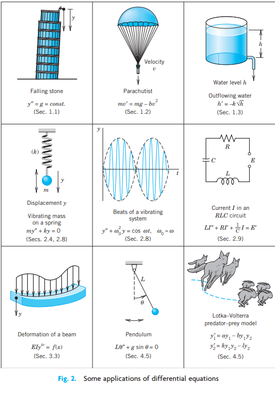
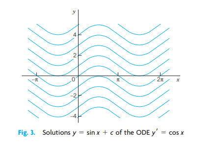

# CHAPTER 01: First-Order ODEs {#chap-first-order-odes}

Chapter 1 begins the study of ordinary differential equations (ODEs) by deriving them from physical or other problems (modeling), solving them by standard mathematical methods, and interpreting solutions and their graphs in terms of a given problem.

The simplest ODEs to be discussed are ODEs of the first order because they involve only the first derivative of the unknown function and no higher derivatives.

Understanding the basics of ODEs requires solving problems by hand (paper and pencil, or typing on your computer, but first without the aid of a CAS).

::: {.callout-note}
Numerics for first-order ODEs can be studied immediately after this chapter. See Sections 21.1–21.2.
:::

**Prerequisite:** Integral calculus.

**Sections that may be omitted in a shorter course:** 1.6, 1.7.

## Basic Concepts. Modeling {#sec-basic-concepts}

{#fig-modeling}

If we want to solve an engineering problem (usually of a physical nature), we first have to formulate the problem as a mathematical expression in terms of variables, functions, and equations.

Such an expression is known as a **mathematical model** of the given problem.

The process of

1. setting up a model,
2. solving it mathematically,
3. interpreting the result,

is called **mathematical modeling**.

Modeling needs experience, which we shall gain by discussing various examples and problems.

Now many physical concepts, such as velocity and acceleration, are derivatives. Hence a model is very often an equation containing derivatives of an unknown function.

Such a model is called a **differential equation**.

{#fig-applications}

An **ordinary differential equation (ODE)** is an equation that contains one or several derivatives of an unknown function, which we usually call \(y(x)\) (or sometimes \(y(t)\) if the independent variable is time).

For example

\[
y' = \cos x
\tag{1}
\]

\[
y'' + 9y = e^{-2x}
\tag{2}
\]

\[
y''' - \frac{3}{2}y^2 = 0
\tag{3}
\]

are ordinary differential equations.

The term *ordinary* distinguishes them from **partial differential equations (PDEs)**, which involve partial derivatives of an unknown function of two or more variables.

For instance,

\[
\frac{\partial^2 u}{\partial x^2}
+
\frac{\partial^2 u}{\partial y^2}
=
0
\]

is a PDE.

An ODE is said to be of **order \(n\)** if the \(n\)-th derivative of the unknown function is the highest derivative appearing in the equation.

Thus:

- Equation (1) is first order.
- Equation (2) is second order.
- Equation (3) is third order.

For first-order ODEs we write

\[
F(x,y,y') = 0
\tag{4}
\]

or explicitly as

\[
y' = f(x,y)
\]

### Concept of Solution {#sec-concept-solution}

A function

\[
y = h(x)
\]

is called a **solution** of a given ODE if it satisfies the equation throughout an interval.

The graph of \(h(x)\) is called a **solution curve**.

### Example 1: Verification of Solution {#ex-verification}

Verify that

\[
y = \frac{c}{x}
\]

is a solution of

\[
xy' + y = 0,
\qquad x \neq 0.
\]

Differentiating gives

\[
y' = -\frac{c}{x^2}.
\]

Multiplying by \(x\),

\[
xy' = -\frac{c}{x}.
\]

Since

\[
y = \frac{c}{x},
\]

we obtain

\[
xy' + y = 0.
\]

Hence the given function is a solution.