Chapter 1 begins the study of ordinary differential equations (ODEs) by deriving them from physical or other problems (modeling), solving them by standard mathematical methods, and interpreting solutions and their graphs in terms of a given problem. The simplest ODEs to be discussed are ODEs of the first order because they involve only the first derivative of the unknown function and no higher derivatives. These unknown functions will usually be denoted by $y(x)$ or $y(t)$ when the independent variable denotes time $t$. The chapter ends with a study of the existence and uniqueness of solutions of ODEs in Sec. 1.7.

Understanding the basics of ODEs requires solving problems by hand (paper and pencil, or typing on your computer, but first without the aid of a CAS). In doing so, you will gain an important conceptual understanding and feel for the basic terms, such as ODEs, direction field, and initial value problem. If you wish, you can use your Computer Algebra System (CAS) for checking solutions.

**COMMENT.** Numerics for first-order ODEs can be studied immediately after this chapter. See Secs. 21.1-21.2, which are independent of other sections on numerics.

**Prerequisite:** Integral calculus.
**Sections that may be omitted in a shorter course:** 1.6, 1.7.
**References and Answers to Problems:** App. 1 Part A, and App. 2.

## 1.1 Basic Concepts. Modeling

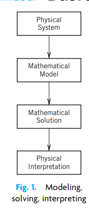{#fig-1-1}

If we want to solve an engineering problem (usually of a physical nature), we first have to formulate the problem as a mathematical expression in terms of variables, functions, and equations. Such an expression is known as a mathematical model of the given problem. The process of setting up a model, solving it mathematically, and interpreting the result in physical or other terms is called mathematical modeling or, briefly, modeling.

Modeling needs experience, which we shall gain by discussing various examples and problems. (Your computer may often help you in solving but rarely in setting up models.)

Now many physical concepts, such as velocity and acceleration, are derivatives. Hence a model is very often an equation containing derivatives of an unknown function. Such a model is called a differential equation. Of course, we then want to find a solution (a function that satisfies the equation), explore its properties, graph it, find values of it, and interpret it in physical terms so that we can understand the behavior of the physical system in our given problem. However, before we can turn to methods of solution, we must first define some basic concepts needed throughout this chapter.

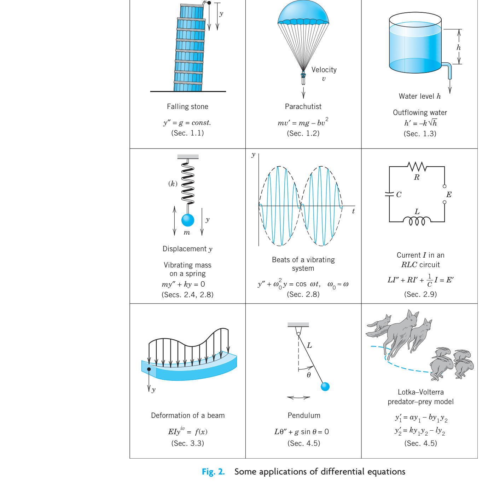{#fig-1-2}

An ordinary differential equation (ODE) is an equation that contains one or several derivatives of an unknown function, which we usually call $y(x)$ (or sometimes $y(t)$ if the independent variable is time $t$). The equation may also contain $y$ itself, known functions of $x$ (or $t$), and constants. For example,

$$y' = \cos x$$ {#eq-1}

$$y'' + 9y = e^{-2x}$$ {#eq-2}

$$y'y''' - \frac{3}{2}y'^2 = 0$$ {#eq-3}

are ordinary differential equations (ODEs). Here, as in calculus, $y'$ denotes $dy/dx$, $y'' = d^2y/dx^2$, etc. The term ordinary distinguishes them from partial differential equations (PDEs), which involve partial derivatives of an unknown function of two or more variables. For instance, a PDE with unknown function $u$ of two variables $x$ and $y$ is

$$\frac{\partial^2 u}{\partial x^2} + \frac{\partial^2 u}{\partial y^2} = 0$$

PDEs have important engineering applications, but they are more complicated than ODEs; they will be considered in Chap. 12.

An ODE is said to be of order $n$ if the $n$th derivative of the unknown function $y$ is the highest derivative of $y$ in the equation. The concept of order gives a useful classification into ODEs of first order, second order, and so on. Thus, (1) is of first order, (2) of second order, and (3) of third order.

In this chapter we shall consider first-order ODEs. Such equations contain only the first derivative $y'$ and may contain $y$ and any given functions of $x$. Hence we can write them as

$$F(x, y, y') = 0$$ {#eq-4}

or often in the form

$$y' = f(x, y)$$

This is called the explicit form, in contrast to the implicit form (4). For instance, the implicit ODE $x^{-3}y' - 4y^2 = 0$ (where $x \neq 0$) can be written explicitly as $y' = 4x^3y^2$.

### Concept of Solution

A function

$$y = h(x)$$

is called a solution of a given ODE (4) on some open interval $a < x < b$ if $h(x)$ is defined and differentiable throughout the interval and is such that the equation becomes an identity if $y$ and $y'$ are replaced with $h$ and $h'$ respectively. The curve (the graph) of $h$ is called a solution curve.

Here, open interval $a < x < b$ means that the endpoints $a$ and $b$ are not regarded as points belonging to the interval. Also, $a < x < b$ includes infinite intervals $-\infty < x < b$, $a < x < \infty$, $-\infty < x < \infty$ (the real line) as special cases.

### EXAMPLE 1 Verification of Solution

Verify that $y = c/x$ ($c$ an arbitrary constant) is a solution of the ODE $xy' = -y$ for all $x \neq 0$. Indeed, differentiate $y = c/x$ to get $y' = -c/x^2$. Multiply this by $x$, obtaining $xy' = -c/x$; thus, $xy' = -y$, the given ODE.

### EXAMPLE 2 Solution by Calculus. Solution Curves

The ODE $y' = dy/dx = \cos x$ can be solved directly by integration on both sides. Indeed, using calculus, we obtain $y = \int \cos x \, dx = \sin x + c$, where $c$ is an arbitrary constant. This is a family of solutions. Each value of $c$, for instance, 2.75 or 0 or -8, gives one of these curves. Figure 3 shows some of them, for $c = -3, -2, -1, 0, 1, 2, 3, 4$.

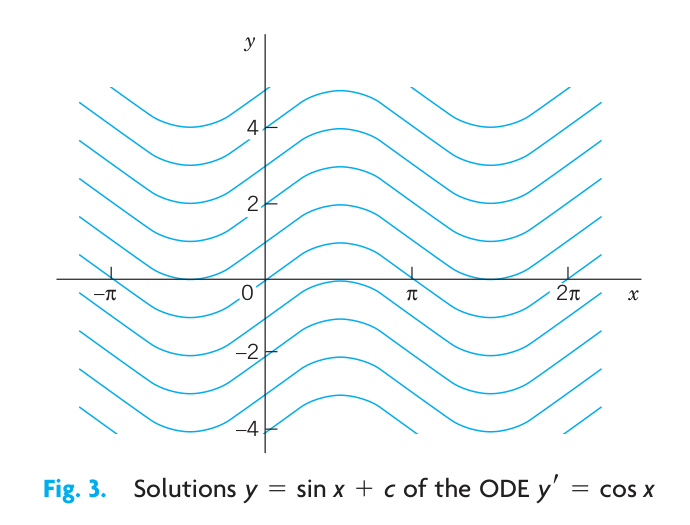{#fig-1-3}

### EXAMPLE 3 (A) Exponential Growth. (B) Exponential Decay

From calculus we know that $y = ce^{0.2t}$ has the derivative

$$y' = \frac{dy}{dt} = 0.2e^{0.2t} = 0.2y$$

Hence $y$ is a solution of $y' = 0.2y$ (Fig. 4A). This ODE is of the form $y' = ky$. With positive-constant $k$ it can model exponential growth, for instance, of colonies of bacteria or populations of animals. It also applies to humans for small populations in a large country (e.g., the United States in early times) and is then known as Malthus's law.^1^ We shall say more about this topic in Sec. 1.5.

(B) Similarly, $y' = -0.2y$ (with a minus on the right) has the solution $y = ce^{-0.2t}$ (Fig. 4B) modeling exponential decay, as, for instance, of a radioactive substance (see Example 5).

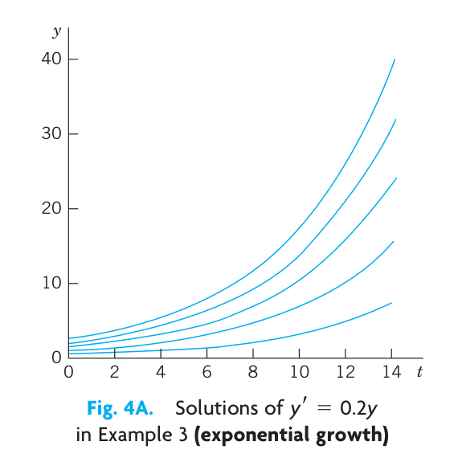{#fig-1-4a}

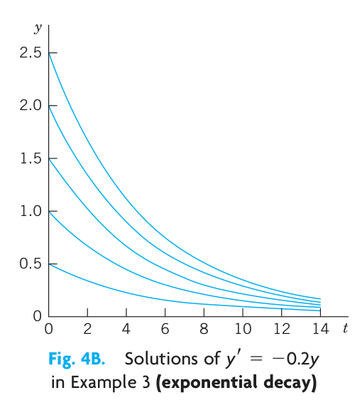{#fig-1-4b}

> ^1^ Named after the English pioneer in classic economics, THOMAS ROBERT MALTHUS (1766-1834).

We see that each ODE in these examples has a solution that contains an arbitrary constant $c$. Such a solution containing an arbitrary constant $c$ is called a general solution of the ODE.

(We shall see that $c$ is sometimes not completely arbitrary but must be restricted to some interval to avoid complex expressions in the solution.)

We shall develop methods that will give general solutions uniquely (perhaps except for notation). Hence we shall say the general solution of a given ODE (instead of *a* general solution).

Geometrically, the general solution of an ODE is a family of infinitely many solution curves, one for each value of the constant $c$. If we choose a specific $c$ (e.g., $c = 6.45$ or 0 or -2.01) we obtain what is called a particular solution of the ODE. A particular solution does not contain any arbitrary constants.

In most cases, general solutions exist, and every solution not containing an arbitrary constant is obtained as a particular solution by assigning a suitable value to $c$. Exceptions to these rules occur but are of minor interest in applications; see Prob. 16 in Problem Set 1.1.

### Initial Value Problem

In most cases the unique solution of a given problem, hence a particular solution, is obtained from a general solution by an initial condition $y(x_0) = y_0$ with given values $x_0$ and $y_0$, that is used to determine a value of the arbitrary constant $c$. Geometrically this condition means that the solution curve should pass through the point $(x_0, y_0)$ in the $xy$-plane. An ODE, together with an initial condition, is called an initial value problem. Thus, if the ODE is explicit, $y' = f(x, y)$, the initial value problem is of the form

$$y' = f(x,y), \quad y(x_0) = y_0$$ {#eq-5}

### EXAMPLE 4 Initial Value Problem

Solve the initial value problem

$$y' = \frac{dy}{dx} = 3y, \quad y(0) = 5.7$$

**Solution.** The general solution is $y(x) = ce^{3x}$; see Example 3. From this solution and the initial condition we obtain $y(0) = ce^0 = c = 5.7$. Hence the initial value problem has the solution $y(x) = 5.7e^{3x}$. This is a particular solution.

The general importance of modeling to the engineer and physicist was emphasized at the beginning of this section. We shall now consider a basic physical problem that will show the details of the typical steps of modeling. Step 1: the transition from the physical situation (the physical system) to its mathematical formulation (its mathematical model); Step 2: the solution by a mathematical method; and Step 3: the physical interpretation of the result. This may be the easiest way to obtain a first idea of the nature and purpose of differential equations and their applications. Realize at the outset that your computer (your CAS) may perhaps give you a hand in Step 2, but Steps 1 and 3 are basically your work.

And Step 2 requires a solid knowledge and good understanding of solution methods available to you—you have to choose the method for your work by hand or by the computer. Keep this in mind, and always check computer results for errors (which may arise, for instance, from false inputs).

### EXAMPLE 5 Radioactivity. Exponential Decay

Given an amount of a radioactive substance, say, 0.5 g (gram), find the amount present at any later time.

**Physical Information.** Experiments show that at each instant a radioactive substance decomposes—and is thus decaying in time—proportional to the amount of substance present.

**Step 1. Setting up a mathematical model of the physical process.** Denote by $y(t)$ the amount of substance still present at any time $t$. By the physical law, the time rate of change $y'(t) = dy/dt$ is proportional to $y(t)$. This gives the first-order ODE

$$
\frac{dy}{dt} = -ky
$$ {#eq-6}

where the constant $k$ is positive, so that, because of the minus, we do get decay (as in [B] of Example 3). The value of $k$ is known from experiments for various radioactive substances (e.g., $k \approx 1.4 \cdot 10^{-11} \text{ sec}^{-1}$, approximately, for radium $_{88}^{226}\text{Ra}$).

Now the given initial amount is 0.5 g, and we can call the corresponding instant $t = 0$. Then we have the initial condition $y(0) = 0.5$. This is the instant at which our observation of the process begins. It motivates the term initial condition (which, however, is also used when the independent variable is not time or when we choose a $t$ other than $t = 0$). Hence the mathematical model of the physical process is the initial value problem

$$
\frac{dy}{dt} = -ky, \quad y(0) = 0.5
$$ {#eq-7}

**Step 2. Mathematical solution.** As in (B) of Example 3 we conclude that the ODE (@eq-6) models exponential decay and has the general solution (with arbitrary constant $c$ but definite given $k$)

$$
y(t) = ce^{-kt}
$$ {#eq-8}

We now determine $c$ by using the initial condition. Since $y(0) = c$ from (@eq-8), this gives $y(0) = c = 0.5$. Hence the particular solution governing our process is (cf. Fig. 5)

$$
y(t) = 0.5e^{-kt} \quad (k > 0)
$$ {#eq-9}

**Always check your result**—it may involve human or computer errors! Verify by differentiation (chain rule!) that your solution (@eq-9) satisfies (@eq-7) as well as $y(0) = 0.5$:

$$
\frac{dy}{dt} = -0.5ke^{-kt} = -k \cdot 0.5e^{-kt} = -ky, \quad y(0) = 0.5e^0 = 0.5
$$

**Step 3. Interpretation of result.** Formula (@eq-9) gives the amount of radioactive substance at time $t$. It starts from the correct initial amount and decreases with time because $k$ is positive. The limit of $y$ as $t \to \infty$ is zero.

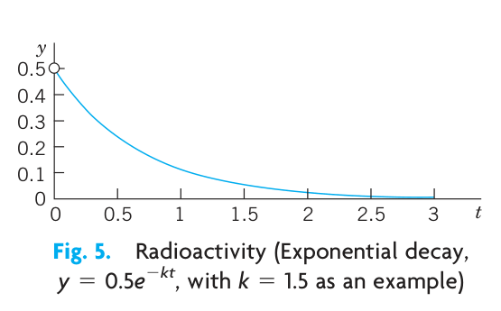{#fig-1-5}

## PROBLEM SET 1.1

### 1–8 CALCULUS
Solve the ODE by integration or by remembering a differentiation formula.

1. $y' + 2 \sin 2\pi x = 0$
2. $y' + xe^{-x^2/2} = 0$
3. $y' = y$
4. $y' = -1.5y$
5. $y' = 4e^{-x} \cos x$
6. $y'' = -y$
7. $y' = \cosh 5.13x$
8. $y''' = e^{-0.2x}$

### 9–15 VERIFICATION. INITIAL VALUE PROBLEM (IVP)
(a) Verify that $y$ is a solution of the ODE. (b) Determine from $y$ the particular solution of the IVP. (c) Graph the solution of the IVP.

9. $y' + 4y = 1.4, \quad y = ce^{-4x} + 0.35, \quad y(0) = 2$
10. $y' + 5xy = 0, \quad y = ce^{-2.5x^2}, \quad y(0) = \pi$
11. $y' = y + e^x, \quad y = (x + c)e^x, \quad y(0) = \frac{1}{2}$
12. $yy' = 4x, \quad y^2 - 4x^2 = c \ (y > 0), \quad y(1) = 4$
13. $y' = y - y^2, \quad y = \frac{1}{1 + ce^{-x}}, \quad y(0) = 0.25$
14. $y' \tan x = 2y - 8, \quad y = c \sin^2 x + 4, \quad y(\frac{1}{2}\pi) = 0$
15. Find two constant solutions of the ODE in Prob. 13 by inspection.
16. **Singular solution.** An ODE may sometimes have an additional solution that cannot be obtained from the general solution and is then called a **singular solution**. The ODE $y'^2 - xy' + y = 0$ is of this kind. Show by differentiation and substitution that it has the general solution $y = cx - c^2$ and the singular solution $y = x^2/4$. Explain Fig. 6.

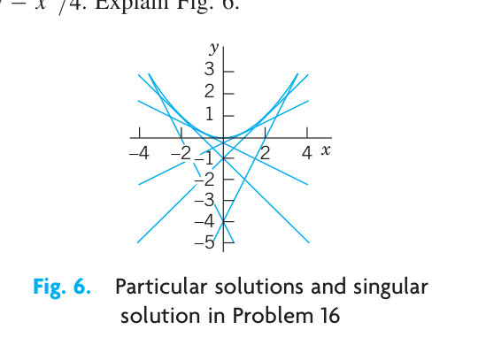{#fig-1-6}

### 17–20 MODELING, APPLICATIONS
These problems will give you a first impression of modeling. Many more problems on modeling follow throughout this chapter.

17. **Half-life.** The *half-life* measures exponential decay. It is the time in which half of the given amount of radioactive substance will disappear. What is the half-life of $_{88}^{226}\text{Ra}$ (in years) in Example 5?
18. **Half-life.** Radium $_{88}^{224}\text{Ra}$ has a half-life of about 3.6 days.
    (a) Given 1 gram, how much will still be present after 1 day?
    (b) After 1 year?
19. **Free fall.** In dropping a stone or an iron ball, air resistance is practically negligible. Experiments show that the acceleration of the motion is constant (equal to $g = 9.80 \text{ m/sec}^2 = 32 \text{ ft/sec}^2$, called the **acceleration of gravity**). Model this as an ODE for $y(t)$, the distance fallen as a function of time $t$. If the motion starts at time $t = 0$ from rest (i.e., with velocity $v = y' = 0$), show that you obtain the familiar law of free fall
    $$
    y = \frac{1}{2}gt^2
    $$
20. **Exponential decay. Subsonic flight.** The efficiency of the engines of subsonic airplanes depends on air pressure and is usually maximum near 35,000 ft. Find the air pressure at this height. *Physical information.* The rate of change $y'(x)$ is proportional to the pressure. At 18,000 ft it is half its value $y_0 = y(0)$ at sea level. *Hint.* Remember from calculus that if $y = e^{kx}$, then $y' = ke^{kx} = ky$. Can you see without calculation that the answer should be close to $y_0/4$?

## 1.2 Geometric Meaning of $y' = f(x, y)$. Direction Fields, Euler's Method {#sec-geometric-meaning}

A first-order ODE

$$
y' = f(x, y)
$$ {#eq-sec12-1}

has a simple geometric interpretation. From calculus you know that the derivative $y'(x)$ of $y(x)$ is the slope of $y(x)$. Hence a solution curve of (@eq-sec12-1) that passes through a point $(x_0, y_0)$ must have, at that point, the slope $y'(x_0)$ equal to the value of $f$ at that point; that is,

$$
y'(x_0) = f(x_0, y_0).
$$

Using this fact, we can develop graphic or numeric methods for obtaining approximate solutions of ODEs (@eq-sec12-1). This will lead to a better conceptual understanding of an ODE (@eq-sec12-1). Moreover, such methods are of practical importance since many ODEs have complicated solution formulas or no solution formulas at all, whereby numeric methods are needed.

### Graphic Method of Direction Fields. Practical Example Illustrated in Fig. 7

We can show directions of solution curves of a given ODE (@eq-sec12-1) by drawing short straight-line segments (lineal elements) in the $xy$-plane. This gives a **direction field** (or **slope field**) into which you can then fit (approximate) solution curves. This may reveal typical properties of the whole family of solutions.

Figure 7 shows a direction field for the ODE

$$
y' = y + x
$$ {#eq-sec12-2}

obtained by a CAS (Computer Algebra System) and some approximate solution curves fitted in.

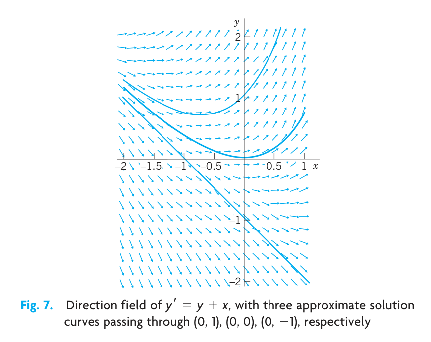{#fig-1-7}

If you have no CAS, first draw a few level curves $f(x, y) = \text{const}$ of $f(x, y)$, then parallel lineal elements along each such curve (which is also called an **isocline**, meaning a curve of equal inclination), and finally draw approximation curves fit to the lineal elements.

We shall now illustrate how numeric methods work by applying the simplest numeric method, that is Euler's method, to an initial value problem involving ODE (@eq-sec12-2). First we give a brief description of Euler's method.

### Numeric Method by Euler

Given an ODE (@eq-sec12-1) and an initial value $y(x_0) = y_0$, **Euler's method** yields approximate solution values $y_1, y_2, \dots$ at equidistant $x$-values $x_0, x_1 = x_0 + h, x_2 = x_0 + 2h, \dots$, namely,

$$
\begin{aligned}
y_1 &= y_0 + hf(x_0, y_0) \quad \text{(Fig. 8)} \\
y_2 &= y_1 + hf(x_1, y_1), \quad \text{etc.}
\end{aligned}
$$

In general,

$$
y_n = y_{n-1} + hf(x_{n-1}, y_{n-1})
$$

where the step $h$ equals, e.g., 0.1 or 0.2 (as in Table 1.1) or a smaller value for greater accuracy.

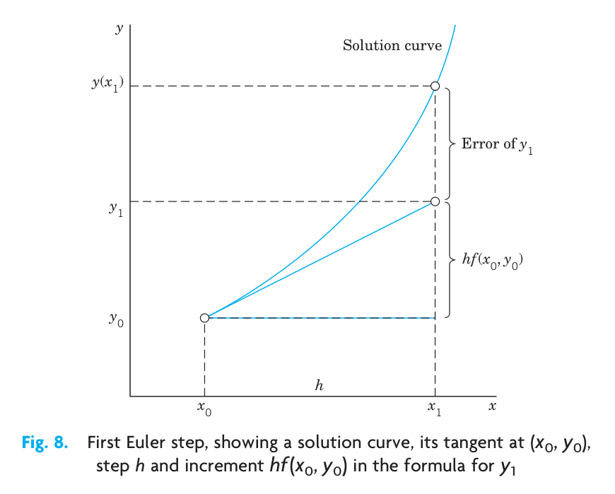{#fig-1-8}

Table 1.1 shows the computation of $n = 5$ steps with step $h = 0.2$ for the ODE (@eq-sec12-2) and initial condition $y(0) = 0$, corresponding to the middle curve in the direction field. We shall solve the ODE exactly in Sec. 1.5. For the time being, verify that the initial value problem has the solution $y = e^x - x - 1$. The solution curve and the values in Table 1.1 are shown in Fig. 9. These values are rather inaccurate. The errors $y(x_n) - y_n$ are shown in Table 1.1 as well as in Fig. 9. Decreasing $h$ would improve the values, but would soon require an impractical amount of computation. Much better methods of a similar nature will be discussed in Sec. 21.1.

Table 1.1. Euler method for $y' = y + x, \ y(0) = 0$ with step $h = 0.2$ for $x = 0, \dots, 1.0$

| $n$ | $x_n$ | $y_n$ | $y(x_n)$ | Error |
|-----|-------|-------|----------|-------|
| 0   | 0.0   | 0.000 | 0.000    | 0.000 |
| 1   | 0.2   | 0.000 | 0.021    | 0.021 |
| 2   | 0.4   | 0.040 | 0.092    | 0.052 |
| 3   | 0.6   | 0.128 | 0.222    | 0.094 |
| 4   | 0.8   | 0.274 | 0.426    | 0.152 |
| 5   | 1.0   | 0.488 | 0.718    | 0.230 |

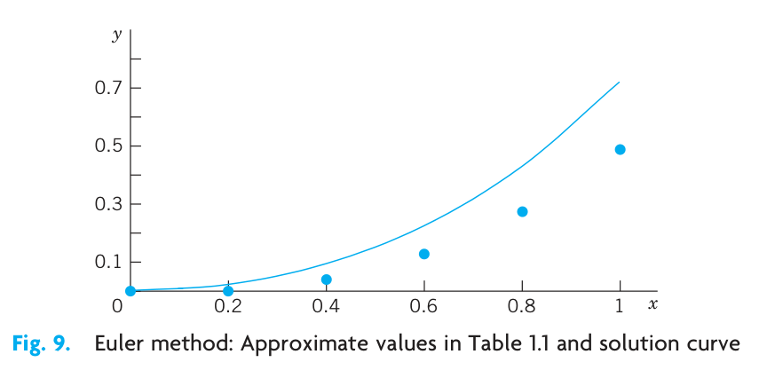{#fig-1-9}

## PROBLEM SET 1.2

### 1–8 DIRECTION FIELDS, SOLUTION CURVES
Graph a direction field (by a CAS or by hand). In the field graph several solution curves by hand, particularly those passing through the given points $(x, y)$.

1. $y' = 1 + y^2, \quad (\frac{1}{4}\pi, 1)$
2. $yy' + 4x = 0, \quad (1, 1), (0, 2)$
3. $y' = 1 - y^2, \quad (0, 0), (2, \frac{1}{2})$
4. $y' = 2y - y^2, \quad (0, 0), (0, 1), (0, 2), (0, 3)$
5. $y' = x - 1/y, \quad (1, \frac{1}{2})$
6. $y' = \sin^2 y, \quad (0, -0.4), (0, 1)$
7. $y' = e^{y/x}, \quad (2, 2), (3, 3)$
8. $y' = -2xy, \quad (0, \frac{1}{2}), (0, 1), (0, 2)$

### 9–10 ACCURACY OF DIRECTION FIELDS
Direction fields are very useful because they can give you an impression of all solutions without solving the ODE, which may be difficult or even impossible. To get a feel for the accuracy of the method, graph a field, sketch solution curves in it, and compare them with the exact solutions.

9. $y' = \cos \pi x$
10. $y' = -5y^{1/2} \quad (\text{Sol. } \sqrt{y} + \frac{5}{2}x = c)$
11. **Autonomous ODE.** This means an ODE not showing $x$ (the independent variable) explicitly. (The ODEs in Probs. 6 and 10 are autonomous.) What will the level curves $f(x, y) = \text{const}$ (also called **isoclines** = curves of equal inclination) of an autonomous ODE look like? Give reason.

### 12–15 MOTIONS
Model the motion of a body $B$ on a straight line with velocity as given, $y(t)$ being the distance of $B$ from a point $y = 0$ at time $t$. Graph a direction field of the model (the ODE). In the field sketch the solution curve satisfying the given initial condition.

12. Product of velocity times distance constant, equal to 2, $y(0) = 2$.
13. Distance = Velocity $\times$ Time, $y(1) = 1$
14. Square of the distance plus square of the velocity equal to 1, initial distance $1/\sqrt{2}$
15. **Parachutist.** Two forces act on a parachutist, the attraction by the earth $mg$ ($m$ = mass of person plus equipment, $g = 9.8 \text{ m/sec}^2$, the acceleration of gravity) and the air resistance, assumed to be proportional to the square of the velocity $v(t)$. Using Newton's second law of motion ($\text{mass} \times \text{acceleration} = \text{resultant of the forces}$), set up a model (an ODE for $v(t)$). Graph a direction field (choosing $m$ and the constant of proportionality equal to 1). Assume that the parachute opens when $v = 10 \text{ m/sec}$. Graph the corresponding solution in the field. What is the limiting velocity? Would the parachute still be sufficient if the air resistance were only proportional to $v(t)$?

16. **CAS PROJECT. Direction Fields.** Discuss direction fields as follows.
    (a) Graph portions of the direction field of the ODE (2) (see Fig. 7), for instance, $-5 \leqq x \leqq 2, \ -1 \leqq y \leqq 5$. Explain what you have gained by this enlargement of the portion of the field.
    (b) Using implicit differentiation, find an ODE with the general solution $x^2 + 9y^2 = c \ (y > 0)$. Graph its direction field. Does the field give the impression that the solution curves may be semi-ellipses? Can you do similar work for circles? Hyperbolas? Parabolas? Other curves?
    (c) Make a conjecture about the solutions of $y' = -x/y$ from the direction field.
    (d) Graph the direction field of $y' = -\frac{1}{2}y$ and some solutions of your choice. How do they behave? Why do they decrease for $y > 0$?

### 17–20 EULER'S METHOD
This is the simplest method to explain numerically solving an ODE, more precisely, an initial value problem (IVP). (More accurate methods based on the same principle are explained in Sec. 21.1.) Using the method, to get a feel for numerics as well as for the nature of IVPs, solve the IVP numerically with a PC or a calculator, 10 steps. Graph the computed values and the solution curve on the same coordinate axes.

17. $y' = y, \quad y(0) = 1, \quad h = 0.1$
18. $y' = y, \quad y(0) = 1, \quad h = 0.01$
19. $y' = (y - x)^2, \quad y(0) = 0, \quad h = 0.1$  
    Sol. $y = x - \tanh x$
20. $y' = -5x^4y^2, \quad y(0) = 1, \quad h = 0.2$  
    Sol. $y = 1/(1 + x)^5$

## 1.3 Separable ODEs. Modeling {#sec-separable-odes}

Many practically useful ODEs can be reduced to the form

$$
g(y)y' = f(x)
$$ {#eq-sec13-1}

by purely algebraic manipulations. Then we can integrate on both sides with respect to $x$, obtaining

$$
\int g(y) y' \, dx = \int f(x) \, dx + c.
$$ {#eq-sec13-2}

On the left we can switch to $y$ as the variable of integration. By calculus, $y' \, dx = dy$, so that

$$
\int g(y) \, dy = \int f(x) \, dx + c.
$$ {#eq-sec13-3}

If $f$ and $g$ are continuous functions, the integrals in (@eq-sec13-3) exist, and by evaluating them we obtain a general solution of (@eq-sec13-1). This method of solving ODEs is called the **method of separating variables**, and (@eq-sec13-1) is called a **separable equation**, because in (@eq-sec13-3) the variables are now separated: $x$ appears only on the right and $y$ only on the left.

### EXAMPLE 1 Separable ODE

The ODE $y' = 1 + y^2$ is separable because it can be written

$$
\frac{dy}{1 + y^2} = dx.
$$

By integration, $\arctan y = x + c$ or $y = \tan (x + c)$.

It is very important to introduce the constant of integration immediately when the integration is performed. If we wrote $\arctan y = x$, then $y = \tan x$, and then introduced $c$, we would have obtained $y = \tan x + c$, which is not a solution (when $c \neq 0$). Verify this.

### EXAMPLE 2 Separable ODE

The ODE $y' = (x + 1)e^{-x}y^2$ is separable; we obtain $y^{-2} \, dy = (x + 1)e^{-x} \, dx$.

By integration, $-y^{-1} = -(x + 2)e^{-x} + c$, or $y = \frac{1}{(x + 2)e^{-x} - c}$.

### EXAMPLE 3 Initial Value Problem (IVP). Bell-Shaped Curve

Solve

$$
y' = -2xy, \quad y(0) = 1.8.
$$

**Solution.** By separation and integration,

$$
\frac{dy}{y} = -2x \, dx, \quad \ln y = -x^2 + \tilde{c}, \quad y = ce^{-x^2}.
$$

This is the general solution. From it and the initial condition, $y(0) = ce^0 = c = 1.8$. Hence the IVP has the solution $y = 1.8e^{-x^2}$. This is a particular solution, representing a bell-shaped curve (Fig. 10).

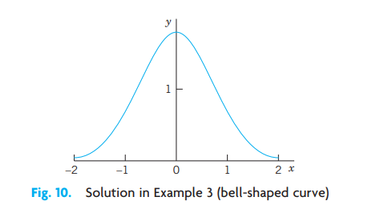{#fig-1-10}

### Modeling

The importance of modeling was emphasized in Sec. 1.1, and separable equations yield various useful models. Let us discuss this in terms of some typical examples.

### EXAMPLE 4 Radiocarbon Dating^2^

In September 1991 the famous Iceman (Oetzi), a mummy from the Neolithic period of the Stone Age found in the ice of the Oetztal Alps (hence the name “Oetzi”) in Southern Tyrolia near the Austrian–Italian border, caused a scientific sensation. When did Oetzi approximately live and die if the ratio of carbon $^{14}_{\phantom{0}6}\text{C}$ to carbon $^{12}_{\phantom{0}6}\text{C}$ in this mummy is 52.5% of that of a living organism?

**Physical Information.** In the atmosphere and in living organisms, the ratio of radioactive carbon (made radioactive by cosmic rays) to ordinary carbon is constant. When an organism dies, its absorption of $^{14}_{\phantom{0}6}\text{C}$ by breathing and eating terminates. Hence one can estimate the age of a fossil by comparing the radioactive carbon ratio in the fossil with that in the atmosphere. To do this, one needs to know the half-life of $^{14}_{\phantom{0}6}\text{C}$, which is 5715 years (*CRC Handbook of Chemistry and Physics*, 83rd ed., Boca Raton: CRC Press, 2002, page 11–52, line 9).

**Solution. Modeling.** Radioactive decay is governed by the ODE $y' = ky$ (see Sec. 1.1, Example 5). By separation and integration (where $t$ is time and $y_0$ is the initial ratio of $^{14}_{\phantom{0}6}\text{C}$ to $^{12}_{\phantom{0}6}\text{C}$):

$$
\frac{dy}{y} = k \, dt, \quad \ln |y| = kt + c, \quad y = y_0 e^{kt} \quad (y_0 = e^c).
$$

Next we use the half-life $H = 5715$ to determine $k$. When $t = H$, half of the original substance is still present. Thus,

$$
y_0 e^{kH} = 0.5y_0, \quad e^{kH} = 0.5, \quad k = \frac{\ln 0.5}{H} = -\frac{0.693}{5715} = -0.0001213.
$$

Finally, we use the ratio 52.5% for determining the time $t$ when Oetzi died (actually, was killed),

$$
e^{kt} = e^{-0.0001213t} = 0.525, \quad t = \frac{\ln 0.525}{-0.0001213} = 5312. \quad \text{Answer: About 5300 years ago.}
$$

Other methods show that radiocarbon dating values are usually too small. According to recent research, this is due to a variation in that carbon ratio because of industrial pollution and other factors, such as nuclear testing.

> ^2^ Method by WILLARD FRANK LIBBY (1908–1980), American chemist, who was awarded for this work the 1960 Nobel Prize in chemistry.

### EXAMPLE 5 Mixing Problem

Mixing problems occur quite frequently in chemical industry. We explain here how to solve the basic model involving a single tank. The tank in Fig. 11 contains 1000 gal of water in which initially 100 lb of salt is dissolved. Brine runs in at a rate of 10 gal/min, and each gallon contains 5 lb of dissolved salt. The mixture in the tank is kept uniform by stirring. Brine runs out at 10 gal/min. Find the amount of salt in the tank at any time $t$.

**Solution. Step 1. Setting up a model.** Let $y(t)$ denote the amount of salt in the tank at time $t$. Its time rate of change is

$$
y' = \text{Salt inflow rate} - \text{Salt outflow rate} \qquad \text{\textbf{Balance law.}}
$$

5 lb times 10 gal gives an inflow of 50 lb of salt. Now, the outflow is 10 gal of brine. This is $10/1000 = 0.01$ (= 1%) of the total brine content in the tank, hence 0.01 of the salt content $y(t)$, that is, $0.01y(t)$. Thus the model is the ODE

$$
y' = 50 - 0.01y = -0.01(y - 5000).
$$ {#eq-sec13-4}

**Step 2. Solution of the model.** The ODE (@eq-sec13-4) is separable. Separation, integration, and taking exponents on both sides gives

$$
\frac{dy}{y - 5000} = -0.01 \, dt, \quad \ln |y - 5000| = -0.01t + c^*, \quad y - 5000 = ce^{-0.01t}.
$$

Initially the tank contains 100 lb of salt. Hence $y(0) = 100$ is the initial condition that will give the unique solution. Substituting $y = 100$ and $t = 0$ in the last equation gives $100 - 5000 = ce^0 = c$. Hence $c = -4900$. Hence the amount of salt in the tank at time $t$ is

$$
y(t) = 5000 - 4900e^{-0.01t}.
$$ {#eq-sec13-5}

This function shows an exponential approach to the limit 5000 lb; see Fig. 11. Can you explain physically that $y(t)$ should increase with time? That its limit is 5000 lb? Can you see the limit directly from the ODE?

The model discussed becomes more realistic in problems on pollutants in lakes (see Problem Set 1.5, Prob. 35) or drugs in organs. These types of problems are more difficult because the mixing may be imperfect and the flow rates (in and out) may be different and known only very roughly.

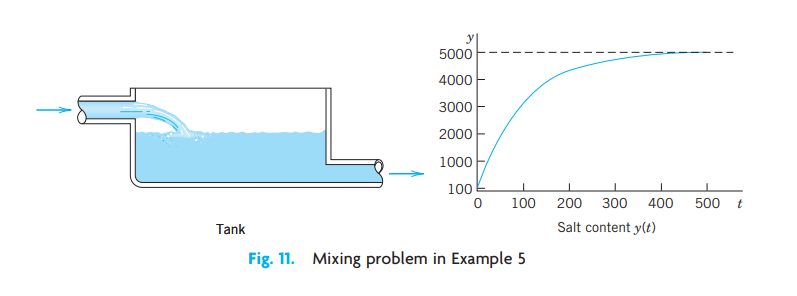{#fig-1-11}

### EXAMPLE 6 Heating an Office Building (Newton’s Law of Cooling³)

Suppose that in winter the daytime temperature in a certain office building is maintained at 70°F. The heating is shut off at 10 P.M. and turned on again at 6 A.M. On a certain day the temperature inside the building at 2 A.M. was found to be 65°F. The outside temperature was 50°F at 10 P.M. and had dropped to 40°F by 6 A.M. What was the temperature inside the building when the heat was turned on at 6 A.M.?

**Physical information.** Experiments show that the time rate of change of the temperature $T$ of a body $B$ (which conducts heat well, for example, as a copper ball does) is proportional to the difference between $T$ and the temperature of the surrounding medium (**Newton’s law of cooling**).

**Solution. Step 1. Setting up a model.** Let $T(t)$ be the temperature inside the building and $T_A$ the outside temperature (assumed to be constant in Newton’s law). Then by Newton’s law,

$$
\frac{dT}{dt} = k(T - T_A).
$$ {#eq-sec13-6}

Such experimental laws are derived under idealized assumptions that rarely hold exactly. However, even if a model seems to fit the reality only poorly (as in the present case), it may still give valuable qualitative information. To see how good a model is, the engineer will collect experimental data and compare them with calculations from the model.

**Step 2. General solution.** We cannot solve (@eq-sec13-6) because we do not know $T_A$, just that it varied between 50°F and 40°F, so we follow the **Golden Rule:** *If you cannot solve your problem, try to solve a simpler one.* We solve (@eq-sec13-6) with the unknown function $T_A$ replaced with the average of the two known values, or 45°F. For physical reasons we may expect that this will give us a reasonable approximate value of $T$ in the building at 6 A.M.

For constant $T_A = 45$ (or any other *constant* value) the ODE (@eq-sec13-6) is separable. Separation, integration, and taking exponents gives the general solution

$$
\frac{dT}{T - 45} = k \, dt, \quad \ln |T - 45| = kt + c^*, \quad T(t) = 45 + ce^{kt} \quad (c = e^{c^*}).
$$

**Step 3. Particular solution.** We choose 10 P.M. to be $t = 0$. Then the given initial condition is $T(0) = 70$ and yields a particular solution, call it $T_p$. By substitution,

$$
T(0) = 45 + ce^0 = 70, \quad c = 70 - 45 = 25, \quad T_p(t) = 45 + 25e^{kt}.
$$

**Step 4. Determination of $k$.** We use $T(4) = 65$, where $t = 4$ is 2 A.M. Solving algebraically for $k$ and inserting $k$ into $T_p(t)$ gives (Fig. 12)

$$
T_p(4) = 45 + 25e^{4k} = 65, \quad e^{4k} = 0.8, \quad k = \frac{1}{4} \ln 0.8 = -0.056, \quad T_p(t) = 45 + 25e^{-0.056t}.
$$

**Step 5. Answer and interpretation.** 6 A.M. is $t = 8$ (namely, 8 hours after 10 P.M.), and

$$
T_p(8) = 45 + 25e^{-0.056 \cdot 8} = 61 \ [{}^\circ\text{F}].
$$

Hence the temperature in the building dropped 9°F, a result that looks reasonable.

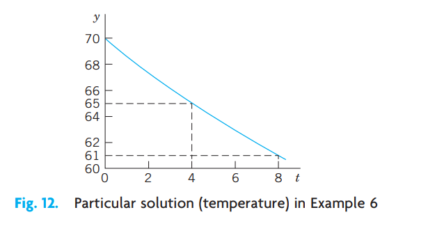{#fig-1-12}

> ³Sir ISAAC NEWTON (1642–1727), great English physicist and mathematician, became a professor at Cambridge in 1669 and Master of the Mint in 1699. He and the German mathematician and philosopher GOTTFRIED WILHELM LEIBNIZ (1646–1716) invented (independently) the differential and integral calculus. Newton discovered many basic physical laws and created the method of investigating physical problems by means of calculus. His *Philosophiae naturalis principia mathematica* (*Mathematical Principles of Natural Philosophy*, 1687) contains the development of classical mechanics. His work is of greatest importance to both mathematics and physics.

### EXAMPLE 7 Leaking Tank. Outflow of Water Through a Hole (Torricelli’s Law)

This is another prototype engineering problem that leads to an ODE. It concerns the outflow of water from a cylindrical tank with a hole at the bottom (Fig. 13). You are asked to find the height of the water in the tank at any time if the tank has diameter 2 m, the hole has diameter 1 cm, and the initial height of the water when the hole is opened is 2.25 m. When will the tank be empty?

**Physical information.** Under the influence of gravity the outflowing water has velocity

$$
v(t) = 0.600 \sqrt{2gh(t)} \qquad \text{(Torricelli's law⁴),}
$$ {#eq-sec13-7}

where $h(t)$ is the height of the water above the hole at time $t$, and $g = 980 \text{ cm/sec}^2 = 32.17 \text{ ft/sec}^2$ is the acceleration of gravity at the surface of the earth.

**Solution. Step 1. Setting up the model.** To get an equation, we relate the decrease in water level $h(t)$ to the outflow. The volume $\Delta V$ of the outflow during a short time $\Delta t$ is

$$
\Delta V = Av \, \Delta t \qquad (A = \text{Area of hole}).
$$

$\Delta V$ must equal the change $\Delta V^*$ of the volume of the water in the tank. Now

$$
\Delta V^* = -B \, \Delta h \qquad (B = \text{Cross-sectional area of tank})
$$

where $\Delta h$ ($> 0$) is the decrease of the height $h(t)$ of the water. The minus sign appears because the volume of the water in the tank decreases. Equating $\Delta V$ and $\Delta V^*$ gives

$$
-B \, \Delta h = Av \, \Delta t.
$$

We now express $v$ according to Torricelli’s law and then let $\Delta t$ (the length of the time interval considered) approach 0—this is a *standard way* of obtaining an ODE as a model. That is, we have

$$
\frac{Δh}{Δt} = -\frac{A}{B}v = -\frac{A}{B} 0.600 \sqrt{2gh(t)}
$$

and by letting $\Delta t \to 0$ we obtain the ODE

$$
\frac{dh}{dt} = -26.56 \frac{A}{B} \sqrt{h},
$$ {#eq-sec13-8c}

where $26.56 = 0.600 \sqrt{2 \cdot 980}$. This is our model, a first-order ODE.

**Step 2. General solution.** Our ODE is separable. $A/B$ is constant. Separation and integration gives

$$
\frac{dh}{\sqrt{h}} = -26.56 \frac{A}{B} \, dt \qquad \text{and} \qquad 2\sqrt{h} = c^* - 26.56 \frac{A}{B}t.
$$

Dividing by 2 and squaring gives $h = (c - 13.28At/B)^2$. Inserting $13.28A/B = 13.28 \cdot 0.5^2 \pi / 100^2 \pi = 0.000332$ yields the general solution

$$
h(t) = (c - 0.000332t)^2.
$$

**Step 3. Particular solution.** The initial height (the initial condition) is $h(0) = 225 \text{ cm}$. Substitution of $t = 0$ and $h = 225$ gives from the general solution $c^2 = 225, \ c = 15.00$ and thus the particular solution (Fig. 13)

$$
h_p(t) = (15.00 - 0.000332t)^2.
$$

**Step 4. Tank empty.** $h_p(t) = 0$ if $t = 15.00 / 0.000332 = 45,181 \ [\text{sec}] = 12.6 \ [\text{hours}]$.

Here you see distinctly the *importance of the choice of units*—we have been working with the cgs system, in which time is measured in seconds! We used $g = 980 \text{ cm/sec}^2$.

**Step 5. Checking.** Check the result.

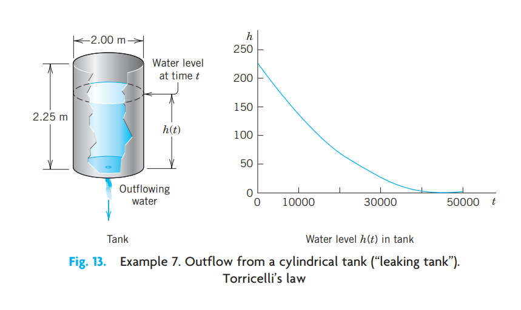{#fig-1-13}

> ⁴EVANGELISTA TORRICELLI (1608–1647), Italian physicist, pupil and successor of GALILEO GALILEI (1564–1642) at Florence. The “contraction factor” 0.600 was introduced by J. C. BORDA in 1766 because the stream has a smaller cross section than the area of the hole.

### Extended Method: Reduction to Separable Form

Certain nonseparable ODEs can be made separable by transformations that introduce for $y$ a new unknown function. We discuss this technique for a class of ODEs of practical importance, namely, for equations

$$
y' = f\left(\frac{y}{x}\right).
$$ {#eq-sec13-8d}

Here, $f$ is any (differentiable) function of $y/x$, such as $\sin(y/x)$, $(y/x)^4$, and so on. (Such an ODE is sometimes called a *homogeneous ODE*, a term we shall not use but reserve for a more important purpose in Sec. 1.5.)

The form of such an ODE suggests that we set $y/x = u$; thus,

$$
y = ux \qquad \text{and by product differentiation} \qquad y' = u'x + u.
$$ {#eq-sec13-9b}

Substitution into $y' = f(y/x)$ then gives $u'x + u = f(u)$ or $u'x = f(u) - u$. We see that if $f(u) - u \neq 0$, this can be separated:

$$
\frac{du}{f(u) - u} = \frac{dx}{x}.
$$ {#eq-sec13-10b}

### EXAMPLE 8 Reduction to Separable Form

Solve

$$
2xyy' = y^2 - x^2.
$$

**Solution.** To get the usual explicit form, divide the given equation by $2xy$,

$$
y' = \frac{y^2 - x^2}{2xy} = \frac{y}{2x} - \frac{x}{2y}.
$$

Now substitute $y$ and $y'$ from (@eq-sec13-9b) and then simplify by subtracting $u$ on both sides,

$$
u'x + u = \frac{u}{2} - \frac{1}{2u}, \qquad u'x = -\frac{u}{2} - \frac{1}{2u} = \frac{-u^2 - 1}{2u}.
$$

You see that in the last equation you can now separate the variables,

$$
\frac{2u \, du}{1 + u^2} = -\frac{dx}{x}. \qquad \text{By integration,} \qquad \ln(1 + u^2) = -\ln |x| + c^* = \ln \left| \frac{1}{x} \right| + c^*.
$$

Take exponents on both sides to get $1 + u^2 = c/x$ or $1 + (y/x)^2 = c/x$. Multiply the last equation by $x^2$ to obtain (Fig. 14)

$$
x^2 + y^2 = cx. \qquad \text{Thus} \qquad \left(x - \frac{c}{2}\right)^2 + y^2 = \frac{c^2}{4}.
$$

This general solution represents a family of circles passing through the origin with centers on the $x$-axis.

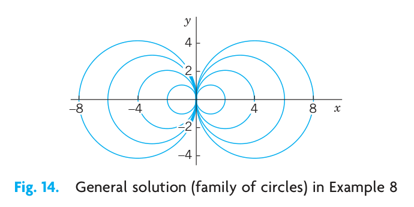{#fig-1-14}

## PROBLEM SET 1.3

### 1. CAUTION! Constant of integration.
Why is it important to introduce the constant of integration immediately when you integrate?

### 2–10 GENERAL SOLUTION
Find a general solution. Show the steps of derivation. Check your answer by substitution.

2. $y^3 y' + x^3 = 0$
3. $y' = \sec^2 y$
4. $y' \sin 2\pi x = \pi y \cos 2\pi x$
5. $yy' + 36x = 0$
6. $y' = e^{2x - 1} y^2$
7. $xy' = y + 2x^3 \sin^2 \frac{y}{x} \quad (\text{Set } y/x = u)$
8. $y' = (y + 4x)^2 \quad (\text{Set } y + 4x = v)$
9. $xy' = y^2 + y \quad (\text{Set } y/x = u)$
10. $xy' = x + y \quad (\text{Set } y/x = u)$

### 11–17 INITIAL VALUE PROBLEMS (IVPs)
Solve the IVP. Show the steps of derivation, beginning with the general solution.

11. $xy' + y = 0, \quad y(4) = 6$
12. $y' = 1 + 4y^2, \quad y(1) = 0$
13. $y' \cosh^2 x = \sin^2 y, \quad y(0) = \frac{1}{2}\pi$
14. $dr/dt = -2tr, \quad r(0) = r_0$
15. $y' = -4x/y, \quad y(2) = 3$
16. $y' = (x + y - 2)^2, \quad y(0) = 2 \quad (\text{Set } v = x + y - 2)$
17. $xy' = y + 3x^4 \cos^2(y/x), \quad y(1) = 0 \quad (\text{Set } y/x = u)$
18. **Particular solution.** Introduce limits of integration in (3) such that $y$ obtained from (3) satisfies the initial condition $y(x_0) = y_0$.

### 19–36 MODELING, APPLICATIONS

19. **Exponential growth.** If the growth rate of the number of bacteria at any time $t$ is proportional to the number present at $t$ and doubles in 1 week, how many bacteria can be expected after 2 weeks? After 4 weeks?
20. **Another population model.**
    (a) If the birth rate and death rate of the number of bacteria are proportional to the number of bacteria present, what is the population as a function of time.
    (b) What is the limiting situation for increasing time? Interpret it.
21. **Radiocarbon dating.** What should be the $^{14}_{\phantom{0}6}\text{C}$ content (in percent of $y_0$) of a fossilized tree that is claimed to be 3000 years old? (See Example 4.)
22. **Linear accelerators** are used in physics for accelerating charged particles. Suppose that an alpha particle enters an accelerator and undergoes a constant acceleration that increases the speed of the particle from $10^3 \text{ m/sec}$ to $10^4 \text{ m/sec}$ in $10^{-3} \text{ sec}$. Find the acceleration $a$ and the distance traveled during that period of $10^{-3} \text{ sec}$.
23. **Boyle–Mariotte’s law for ideal gases.⁵** Experiments show for a gas at low pressure $p$ (and constant temperature) the rate of change of the volume $V(p)$ equals $-V/p$. Solve the model.

    > ⁵ROBERT BOYLE (1627–1691), English physicist and chemist, one of the founders of the Royal Society. EDME MARIOTTE (about 1620–1684), French physicist and prior of a monastery near Dijon. They found the law experimentally in 1662 and 1676, respectively.

24. **Mixing problem.** A tank contains 400 gal of brine in which 100 lb of salt are dissolved. Fresh water runs into the tank at a rate of 2 gal/min. The mixture, kept practically uniform by stirring, runs out at the same rate. How much salt will there be in the tank at the end of 1 hour?
25. **Newton’s law of cooling.** A thermometer, reading 5°C, is brought into a room whose temperature is 22°C. One minute later the thermometer reading is 12°C. How long does it take until the reading is practically 22°C, say, 21.9°C?
26. **Gompertz growth in tumors.** The Gompertz model is $y' = -Ay \ln y$ ($A > 0$), where $y(t)$ is the mass of tumor cells at time $t$. The model agrees well with clinical observations. The declining growth rate with increasing $y > 1$ corresponds to the fact that cells in the interior of a tumor may die because of insufficient oxygen and nutrients. Use the ODE to discuss the growth and decline of solutions (tumors) and to find constant solutions. Then solve the ODE.
27. **Dryer.** If a wet sheet in a dryer loses its moisture at a rate proportional to its moisture content, and if it loses half of its moisture during the first 10 min of drying, when will it be practically dry, say, when will it have lost 99% of its moisture? First guess, then calculate.
28. **Estimation.** Could you see, practically without calculation, that the answer in Prob. 27 must lie between 60 and 70 min? Explain.
29. **Alibi?** Jack, arrested when leaving a bar, claims that he has been inside for at least half an hour (which would provide him with an alibi). The police check the water temperature of his car (parked near the entrance of the bar) at the instant of arrest and again 30 min later, obtaining the values 190°F and 110°F, respectively. Do these results give Jack an alibi? (Solve by inspection.)
30. **Rocket.** A rocket is shot straight up from the earth, with a net acceleration (= acceleration by the rocket engine minus gravitational pullback) of $7t \text{ m/sec}^2$ during the initial stage of flight until the engine cut out at $t = 10 \text{ sec}$. How high will it go, air resistance neglected?
31. **Solution curves of $y' = g(y/x)$.** Show that any (nonvertical) straight line through the origin of the $xy$-plane intersects all these curves of a given ODE at the same angle.
32. **Friction.** If a body slides on a surface, it experiences friction $F$ (a force against the direction of motion). Experiments show that $|F| = \mu |N|$ (Coulomb’s⁶ law of kinetic friction without lubrication), where $N$ is the normal force (force that holds the two surfaces together; see Fig. 15) and the constant of proportionality $\mu$ is called the *coefficient of kinetic friction*. In Fig. 15 assume that the body weighs 45 nt (about 10 lb; see front cover for conversion). $\mu = 0.20$ (corresponding to steel on steel), $\alpha = 30^\circ$, the slide is 10 m long, the initial velocity is zero, and air resistance is negligible. Find the velocity of the body at the end of the slide.

    > ⁶CHARLES AUGUSTIN DE COULOMB (1736–1806), French physicist and engineer.

    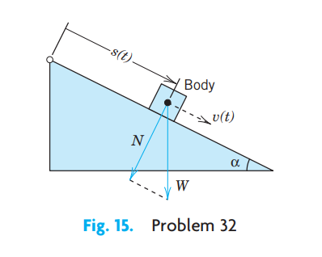{#fig-1-15}

33. **Rope.** To tie a boat in a harbor, how many times must a rope be wound around a bollard (a vertical rough cylindrical post fixed on the ground) so that a man holding one end of the rope can resist a force exerted by the boat 1000 times greater than the man can exert? First guess. Experiments show that the change $\Delta S$ of the force $S$ in a small portion of the rope is proportional to $S$ and to the small angle $\Delta \phi$ in Fig. 16. Take the proportionality constant 0.15. The result should surprise you!

    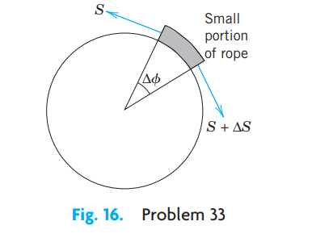{#fig-1-16}

34. **TEAM PROJECT. Family of Curves.** A family of curves can often be characterized as the general solution of $y' = f(x, y)$.
    (a) Show that for the circles with center at the origin we get $y' = -x/y$.
    (b) Graph some of the hyperbolas $xy = c$. Find an ODE for them.
    (c) Find an ODE for the straight lines through the origin.
    (d) You will see that the product of the right sides of the ODEs in (a) and (c) equals $-1$. Do you recognize this as the condition for the two families to be orthogonal (i.e., to intersect at right angles)? Do your graphs confirm this?
    (e) Sketch families of curves of your own choice and find their ODEs. Can every family of curves be given by an ODE?
35. **CAS PROJECT. Graphing Solutions.** A CAS can usually graph solutions, even if they are integrals that cannot be evaluated by the usual analytical methods of calculus.
    (a) Show this for the five initial value problems $y' = e^{-x^2}, \ y(0) = 0, \pm 1, \pm 2$ graphing all five curves on the same axes.
    (b) Graph approximate solution curves, using the first few terms of the Maclaurin series (obtained by termwise integration of that of $y'$) and compare with the exact curves.
    (c) Repeat the work in (a) for another ODE and initial conditions of your own choice, leading to an integral that cannot be evaluated as indicated.
36. **TEAM PROJECT. Torricelli's Law.** Suppose that the tank in Example 7 is hemispherical, of radius $R$, initially full of water, and has an outlet of $5 \text{ cm}^2$ cross-sectional area at the bottom. (Make a sketch.) Set up the model for outflow. Indicate what portion of your work in Example 7 you can use (so that it can become part of the general method independent of the shape of the tank). Find the time $t$ to empty the tank (a) for any $R$, (b) for $R = 1 \text{ m}$. Plot $t$ as function of $R$. Find the time when $h = R/2$ (a) for any $R$, (b) for $R = 1 \text{ m}$.

## 1.4 Exact ODEs. Integrating Factors {#sec-exact-odes}

We recall from calculus that if a function $u(x, y)$ has continuous partial derivatives, its **differential** (also called its **total differential**) is

$$
du = \frac{\partial u}{\partial x}dx + \frac{\partial u}{\partial y}dy.
$$

From this it follows that if $u(x, y) = c = \text{const}$, then $du = 0$.

For example, if $u = x + x^2y^3 = c$, then

$$
du = (1 + 2xy^3)dx + 3x^2y^2dy = 0
$$

or

$$
y' = \frac{dy}{dx} = -\frac{1 + 2xy^3}{3x^2y^2},
$$

an ODE that we can solve by going backward. This idea leads to a powerful solution method as follows.

A first-order ODE $M(x, y) + N(x, y)y' = 0$, written as (use $dy = y'dx$ as in Sec. 1.3)

$$
M(x, y) \, dx + N(x, y) \, dy = 0
$$ {#eq-sec14-1}

is called an **exact differential equation** if the differential form $M(x, y) \, dx + N(x, y) \, dy$ is **exact**, that is, this form is the differential

$$
du = \frac{\partial u}{\partial x}dx + \frac{\partial u}{\partial y}dy
$$ {#eq-sec14-2}

of some function $u(x, y)$. Then (@eq-sec14-1) can be written

$$
du = 0.
$$

By integration we immediately obtain the general solution of (@eq-sec14-1) in the form

$$
u(x, y) = c.
$$ {#eq-sec14-3}

This is called an **implicit solution**, in contrast to a solution $y = h(x)$ as defined in Sec. 1.1, which is also called an *explicit solution*, for distinction. Sometimes an implicit solution can be converted to explicit form. (Do this for $x^2 + y^2 = 1$.) If this is not possible, your CAS may graph a figure of the **contour lines** (3) of the function $u(x, y)$ and help you in understanding the solution.

Comparing (@eq-sec14-1) and (@eq-sec14-2), we see that (@eq-sec14-1) is an exact differential equation if there is some function $u(x, y)$ such that

$$
(a) \quad \frac{\partial u}{\partial x} = M, \qquad (b) \quad \frac{\partial u}{\partial y} = N.
$$ {#eq-sec14-4}

From this we can derive a formula for checking whether (@eq-sec14-1) is exact or not, as follows.

Let $M$ and $N$ be continuous and have continuous first partial derivatives in a region in the $xy$-plane whose boundary is a closed curve without self-intersections. Then by partial differentiation of (@eq-sec14-4) (see App. 3.2 for notation),

$$
\begin{aligned}
\frac{\partial M}{\partial y} &= \frac{\partial^2 u}{\partial y \partial x}, \\
\frac{\partial N}{\partial x} &= \frac{\partial^2 u}{\partial x \partial y}.
\end{aligned}
$$

By the assumption of continuity the two second partial derivatives are equal. Thus

$$
\frac{\partial M}{\partial y} = \frac{\partial N}{\partial x}.
$$ {#eq-sec14-5}

This condition is not only necessary but also sufficient for (@eq-sec14-1) to be an exact differential equation. (We shall prove this in Sec. 10.2 in another context. Some calculus books, for instance, [GenRef 12] in App. 1, also contain a proof.)

If (@eq-sec14-1) is exact, the function $u(x, y)$ can be found by inspection or in the following systematic way. From (@eq-sec14-4)a we have by integration with respect to $x$

$$
u = \int M \, dx + k(y);
$$ {#eq-sec14-6}

in this integration, $y$ is to be regarded as a constant, and $k(y)$ plays the role of a “constant” of integration. To determine $k(y)$, we derive $\partial u/\partial y$ from (@eq-sec14-6), use (@eq-sec14-4)b to get $dk/dy$, and integrate $dk/dy$ to get $k$. (See Example 1, below.)

Formula (@eq-sec14-6) was obtained from (@eq-sec14-4)a. Instead of (@eq-sec14-4)a we may equally well use (@eq-sec14-4)b. Then, instead of (@eq-sec14-6), we first have by integration with respect to $y$

$$
u = \int N \, dy + l(x).
$$ {#eq-sec14-6star}

To determine $l(x)$, we derive $\partial u/\partial x$ from (@eq-sec14-6star), use (@eq-sec14-4)a to get $dl/dx$, and integrate. We illustrate all this by the following typical examples.

### EXAMPLE 1 An Exact ODE

Solve

$$
\cos (x + y) \, dx + (3y^2 + 2y + \cos (x + y)) \, dy = 0.
$$ {#eq-sec14-7}

**Solution. Step 1. Test for exactness.** Our equation is of the form (@eq-sec14-1) with

$$
\begin{aligned}
M &= \cos (x + y), \\
N &= 3y^2 + 2y + \cos (x + y).
\end{aligned}
$$

Thus

$$
\begin{aligned}
\frac{\partial M}{\partial y} &= -\sin (x + y), \\
\frac{\partial N}{\partial x} &= -\sin (x + y).
\end{aligned}
$$

From this and (@eq-sec14-5) we see that (@eq-sec14-7) is exact.

**Step 2. Implicit general solution.** From (@eq-sec14-6) we obtain by integration

$$
u = \int M \, dx + k(y) = \int \cos (x + y) \, dx + k(y) = \sin (x + y) + k(y).
$$ {#eq-sec14-8}

To find $k(y)$, we differentiate this formula with respect to $y$ and use formula (@eq-sec14-4)b, obtaining

$$
\frac{\partial u}{\partial y} = \cos (x + y) + \frac{dk}{dy} = N = 3y^2 + 2y + \cos (x + y).
$$

Hence $dk/dy = 3y^2 + 2y$. By integration, $k = y^3 + y^2 + c^*$. Inserting this result into (@eq-sec14-8) and observing (@eq-sec14-3), we obtain the answer

$$
u(x, y) = \sin (x + y) + y^3 + y^2 = c.
$$

**Step 3. Checking an implicit solution.** We can check by differentiating the implicit solution $u(x, y) = c$ implicitly and see whether this leads to the given ODE (@eq-sec14-7):

$$
du = \frac{\partial u}{\partial x} \, dx + \frac{\partial u}{\partial y} \, dy = \cos(x + y) \, dx + (\cos(x + y) + 3y^2 + 2y) \, dy = 0.
$$ {#eq-sec14-9}

This completes the check.

### EXAMPLE 2 An Initial Value Problem

Solve the initial value problem

$$
(\cos y \sinh x + 1) \, dx - \sin y \cosh x \, dy = 0, \quad y(1) = 2.
$$ {#eq-sec14-10}

**Solution.** You may verify that the given ODE is exact. We find $u$. For a change, let us use (@eq-sec14-6star),

$$
u = -\int \sin y \cosh x \, dy + l(x) = \cos y \cosh x + l(x).
$$

From this, $\partial u/\partial x = \cos y \sinh x + dl/dx = M = \cos y \sinh x + 1$. Hence $dl/dx = 1$. By integration, $l(x) = x + c^*$. This gives the general solution $u(x, y) = \cos y \cosh x + x = c$. From the initial condition, $\cos 2 \cosh 1 + 1 = 0.358 = c$. Hence the answer is $\cos y \cosh x + x = 0.358$. Figure 17 shows the particular solutions for $c = 0, 0.358$ (thicker curve), 1, 2, 3. Check that the answer satisfies the ODE. (Proceed as in Example 1.) Also check that the initial condition is satisfied.

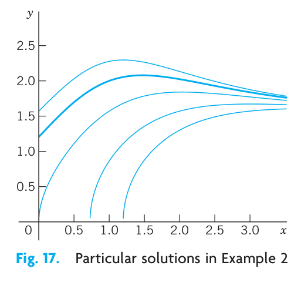{#fig-1-17}

### EXAMPLE 3 WARNING! Breakdown in the Case of Nonexactness

The equation $-y \, dx + x \, dy = 0$ is not exact because $M = -y$ and $N = x$, so that in (@eq-sec14-5), $\partial M/\partial y = -1$ but $\partial N/\partial x = 1$. Let us show that in such a case the present method does not work. From (@eq-sec14-6),

$$
u = \int M \, dx + k(y) = -xy + k(y), \qquad \text{hence} \qquad \frac{\partial u}{\partial y} = -x + \frac{dk}{dy}.
$$

Now, $\partial u/\partial y$ should equal $N = x$, by (@eq-sec14-4)b. However, this is impossible because $k(y)$ can depend only on $y$. Try (@eq-sec14-6star); it will also fail. Solve the equation by another method that we have discussed.

### Reduction to Exact Form. Integrating Factors

The ODE in Example 3 is $-y \, dx + x \, dy = 0$. It is not exact. However, if we multiply it by $1/x^2$, we get an exact equation [check exactness by (@eq-sec14-5)!],

$$
\frac{-y \, dx + x \, dy}{x^2} = -\frac{y}{x^2} \, dx + \frac{1}{x} \, dy = d\left(\frac{y}{x}\right) = 0.
$$ {#eq-sec14-11}

Integration of (@eq-sec14-11) then gives the general solution $y/x = c = \text{const}$.

This example gives the idea. All we did was to multiply a given nonexact equation, say,

$$
P(x, y) \, dx + Q(x, y) \, dy = 0,
$$ {#eq-sec14-12}

by a function $F$ that, in general, will be a function of both $x$ and $y$. The result was an equation

$$
FP \, dx + FQ \, dy = 0
$$ {#eq-sec14-13}

that is exact, so we can solve it as just discussed. Such a function $F(x, y)$ is then called an **integrating factor** of (@eq-sec14-12).

### EXAMPLE 4 Integrating Factor

The integrating factor in (@eq-sec14-11) is $F = 1/x^2$. Hence in this case the exact equation (@eq-sec14-13) is

$$
FP \, dx + FQ \, dy = \frac{-y \, dx + x \, dy}{x^2} = d\left(\frac{y}{x}\right) = 0. \qquad \text{Solution} \qquad \frac{y}{x} = c.
$$

These are straight lines $y = cx$ through the origin. (Note that $x = 0$ is also a solution of $-y \, dx + x \, dy = 0$.)

It is remarkable that we can readily find other integrating factors for the equation $-y \, dx + x \, dy = 0$, namely, $1/y^2$, $1/(xy)$, and $1/(x^2 + y^2)$, because

$$
\frac{-y \, dx + x \, dy}{y^2} = d\left(\frac{x}{y}\right), \quad \frac{-y \, dx + x \, dy}{xy} = -d\left(\ln \frac{x}{y}\right), \quad \frac{-y \, dx + x \, dy}{x^2 + y^2} = d\left(\arctan \frac{y}{x}\right).
$$ {#eq-sec14-14}

### How to Find Integrating Factors

In simpler cases we may find integrating factors by inspection or perhaps after some trials, keeping (@eq-sec14-14) in mind. In the general case, the idea is the following.

For $M \, dx + N \, dy = 0$ the exactness condition (@eq-sec14-5) is $\partial M/\partial y = \partial N/\partial x$. Hence for (@eq-sec14-13), $FP \, dx + FQ \, dy = 0$, the exactness condition is

$$
\frac{\partial}{\partial y}(FP) = \frac{\partial}{\partial x}(FQ).
$$ {#eq-sec14-15}

By the product rule, with subscripts denoting partial derivatives, this gives

$$
F_y P + F P_y = F_x Q + F Q_x.
$$

In the general case, this would be complicated and useless. So we follow the **Golden Rule:** *If you cannot solve your problem, try to solve a simpler one*—the result may be useful (and may also help you later on). Hence we look for an integrating factor depending only on *one* variable: fortunately, in many practical cases, there are such factors, as we shall see. Thus, let $F = F(x)$. Then $F_y = 0$, and $F_x = F' = dF/dx$, so that (@eq-sec14-15) becomes

$$
F P_y = F' Q + F Q_x.
$$

Dividing by $FQ$ and reshuffling terms, we have

$$
\frac{1}{F}\frac{dF}{dx} = R, \qquad \text{where} \qquad R = \frac{1}{Q}\left(\frac{\partial P}{\partial y} - \frac{\partial Q}{\partial x}\right).
$$ {#eq-sec14-16}

This proves the following theorem.

### THEOREM 1 Integrating Factor $F(x)$

If (@eq-sec14-12) is such that the right side $R$ of (@eq-sec14-16) depends only on $x$, then (@eq-sec14-12) has an integrating factor $F = F(x)$, which is obtained by integrating (@eq-sec14-16) and taking exponents on both sides.

$$
F(x) = \exp \int R(x) \, dx.
$$ {#eq-sec14-17}

Similarly, if $F^* = F^*(y)$, then instead of (@eq-sec14-16) we get

$$
\frac{1}{F^*}\frac{dF^*}{dy} = R^*, \qquad \text{where} \qquad R^* = \frac{1}{P}\left(\frac{\partial Q}{\partial x} - \frac{\partial P}{\partial y}\right).
$$ {#eq-sec14-18}

and we have the companion

### THEOREM 2 Integrating Factor $F^*(y)$

If (@eq-sec14-12) is such that the right side $R^*$ of (@eq-sec14-18) depends only on $y$, then (@eq-sec14-12) has an integrating factor $F^* = F^*(y)$, which is obtained from (@eq-sec14-18) in the form

$$
F^*(y) = \exp \int R^*(y) \, dy.
$$ {#eq-sec14-19}

### EXAMPLE 5 Application of Theorems 1 and 2. Initial Value Problem

Using Theorem 1 or 2, find an integrating factor and solve the initial value problem

$$
(e^{x+y} + ye^y) \, dx + (xe^y - 1) \, dy = 0, \quad y(0) = -1.
$$ {#eq-sec14-20}

**Solution. Step 1. Nonexactness.** The exactness check fails:

$$
\frac{\partial P}{\partial y} = \frac{\partial}{\partial y}(e^{x+y} + ye^y) = e^{x+y} + e^y + ye^y \qquad \text{but} \qquad \frac{\partial Q}{\partial x} = \frac{\partial}{\partial x}(xe^y - 1) = e^y.
$$

**Step 2. Integrating factor. General solution.** Theorem 1 fails because $R$ [the right side of (@eq-sec14-16)] depends on both $x$ and $y$.

$$
R = \frac{1}{Q}\left(\frac{\partial P}{\partial y} - \frac{\partial Q}{\partial x}\right) = \frac{1}{xe^y - 1}(e^{x+y} + e^y + ye^y - e^y).
$$

Try Theorem 2. The right side of (@eq-sec14-18) is

$$
R^* = \frac{1}{P}\left(\frac{\partial Q}{\partial x} - \frac{\partial P}{\partial y}\right) = \frac{1}{e^{x+y} + ye^y}(e^y - e^{x+y} - e^y - ye^y) = -1.
$$

Hence (@eq-sec14-19) gives the integrating factor $F^*(y) = e^{-y}$. From this result and (@eq-sec14-20) you get the exact equation

$$
(e^x + y) \, dx + (x - e^{-y}) \, dy = 0.
$$

Test for exactness; you will get 1 on both sides of the exactness condition. By integration, using (@eq-sec14-4)a,

$$
u = \int (e^x + y) \, dx = e^x + xy + k(y).
$$

Differentiate this with respect to $y$ and use (@eq-sec14-4)b to get

$$
\frac{\partial u}{\partial y} = x + \frac{dk}{dy} = N = x - e^{-y}, \qquad \frac{dk}{dy} = -e^{-y}, \qquad k = e^{-y} + c^{*}.
$$

Hence the general solution is

$$
u(x, y) = e^x + xy + e^{-y} = c.
$$

**Step 3. Particular solution.** The initial condition $y(0) = -1$ gives $u(0, -1) = 1 + 0 + e = 3.72$. Hence the answer is $e^x + xy + e^{-y} = 1 + e \approx 3.72$. Figure 18 shows several particular solutions obtained as level curves of $u(x, y) = c$, obtained by a CAS, a convenient way in cases in which it is impossible or difficult to cast a solution into explicit form. Note the curve that (nearly) satisfies the initial condition.

**Step 4. Checking.** Check by substitution that the answer satisfies the given equation as well as the initial condition.

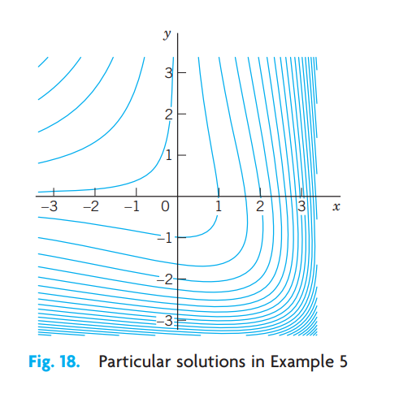{#fig-1-18}

## PROBLEM SET 1.4

### 1–14 ODEs. INTEGRATING FACTORS
Test for exactness. If exact, solve. If not, use an integrating factor as given or obtained by inspection or by the theorems in the text. Also, if an initial condition is given, find the corresponding particular solution.

1. $2xy \, dx + x^2 \, dy = 0$
2. $x^3 \, dx + y^3 \, dy = 0$
3. $\sin x \cos y \, dx + \cos x \sin y \, dy = 0$
4. $e^{3\theta}(dr + 3r \, d\theta) = 0$
5. $(x^2 + y^2) \, dx - 2xy \, dy = 0$
6. $3(y + 1) \, dx = 2x \, dy, \quad (y + 1)x^{-4}$
7. $2x \tan y \, dx + \sec^2 y \, dy = 0$
8. $e^x(\cos y \, dx - \sin y \, dy) = 0$
9. $e^{2x}(2 \cos y \, dx - \sin y \, dy) = 0, \quad y(0) = 0$
10. $y \, dx + [y + \tan(x + y)] \, dy = 0, \quad \cos(x + y)$
11. $2 \cosh x \cos y \, dx = \sinh x \sin y \, dy$
12. $(2xy \, dx + dy)e^{x^2} = 0, \quad y(0) = 2$
13. $e^{-y} \, dx + e^{-x}(-e^{-y} + 1) \, dy = 0, \quad F = e^{x+y}$
14. $(a + 1)y \, dx + (b + 1)x \, dy = 0, \quad y(1) = 1, \quad F = x^a y^b$
15. **Exactness.** Under what conditions for the constants $a, b, k, l$ is $(ax + by) \, dx + (kx + ly) \, dy = 0$ exact? Solve the exact ODE.

16. **TEAM PROJECT. Solution by Several Methods.** Show this as indicated. Compare the amount of work.
    (a) $e^y(\sinh x \, dx + \cosh x \, dy) = 0$ as an exact ODE and by separation.
    (b) $(1 - 2x) \cos y \, dx + dy/\cos y = 0$ by Theorem 2 and by separation.
    (c) $(x^2 + y^2) \, dx - 2xy \, dy = 0$ by Theorem 1 or 2 and by separation with $v = y/x$.
    (d) $3x^2 y \, dx + 4x^3 \, dy = 0$ by Theorems 1 and 2 and by separation.
    (e) Search the text and the problems for further ODEs that can be solved by more than one of the methods discussed so far. Make a list of these ODEs. Find further cases of your own.

17. **WRITING PROJECT. Working Backward.** Working backward from the solution to the problem is useful in many areas. Euler, Lagrange, and other great masters did it. To get additional insight into the idea of integrating factors, start from a $u(x, y)$ of your choice, find $du = 0$, destroy exactness by division by some $F(x, y)$, and see what ODEs solvable by integrating factors you can get. Can you proceed systematically, beginning with the simplest $F(x, y)$?

18. **CAS PROJECT. Graphing Particular Solutions.** Graph particular solutions of the following ODE, proceeding as explained.

    $$
    dy - y^2 \sin x \, dx = 0
    $$ {#eq-sec14-21}

    (a) Show that (@eq-sec14-21) is not exact. Find an integrating factor using either Theorem 1 or 2. Solve (@eq-sec14-21).
    (b) Solve (@eq-sec14-21) by separating variables. Is this simpler than (a)?
    (c) Graph the seven particular solutions satisfying the following initial conditions (see figure below).

        $y(0) = 1, \quad y(\frac{1}{2}\pi) = \frac{1}{2}, \quad y(\pi) = \frac{1}{3}, \quad y(\frac{3}{2}\pi) = \frac{2}{5}, \quad y(2\pi) = \frac{1}{2}, \quad y(\frac{5}{2}\pi) = \frac{2}{3}, \quad y(3\pi) = 1$

    (d) Which solution of (@eq-sec14-21) do we not get in (a) or (b)?

## 1.5 Linear ODEs. Bernoulli Equation. Population Dynamics {#sec-linear-odes}

Linear ODEs or ODEs that can be transformed to linear form are models of various phenomena, for instance, in physics, biology, population dynamics, and ecology, as we shall see. A first-order ODE is said to be **linear** if it can be brought into the form

$$
y' + p(x)y = r(x)
$$ {#eq-sec15-1}

by algebra, and **nonlinear** if it cannot be brought into this form.

The defining feature of the linear ODE (@eq-sec15-1) is that it is linear in both the unknown function $y$ and its derivative $y' = dy/dx$, whereas $p(x)$ and $r(x)$ may be any given functions of $x$. If in an application the independent variable is time, we write $t$ instead of $x$.

If the first term is $f(x)y'$ (instead of $y'$), divide the equation by $f(x)$ to get the standard form (@eq-sec15-1), with $y'$ as the first term, which is practical.

For instance, $y' \cos x + y \sin x = x$ is a linear ODE, and its standard form is $y' + y \tan x = x \sec x$.

The function $r(x)$ on the right may be a force, and the solution $y(x)$ a displacement in a motion or an electrical current or some other physical quantity. In engineering, $r(x)$ is frequently called the **input**, and $y(x)$ is called the **output** or the **response** to the input (and, if given, to the initial condition).

### Homogeneous Linear ODE

We want to solve (@eq-sec15-1) in some interval, call it $J$, and we begin with the simpler special case that $r(x)$ is zero for all $x$ in $J$. (This is sometimes written $r(x) \equiv 0$.) Then the ODE (@eq-sec15-1) becomes

$$
y' + p(x)y = 0
$$ {#eq-sec15-2}

and is called **homogeneous**. By separating variables and integrating we then obtain

$$
\frac{dy}{y} = -p(x) \, dx,
$$

thus

$$
\ln |y| = -\int p(x) \, dx + c^*.
$$

Taking exponents on both sides, we obtain the general solution of the homogeneous ODE (@eq-sec15-2),

$$
y(x) = ce^{-\int p(x) \, dx}
$$ {#eq-sec15-3}

(where $c = \pm e^{c^*}$ when $y \neq 0$); here we may also choose $c = 0$ and obtain the trivial solution $y(x) \equiv 0$ for all $x$ in that interval.

### Nonhomogeneous Linear ODE

We now solve (@eq-sec15-1) in the case that $r(x)$ in (@eq-sec15-1) is not everywhere zero in the interval $J$ considered. Then the ODE (@eq-sec15-1) is called **nonhomogeneous**. It turns out that in this case, (@eq-sec15-1) has a pleasant property; namely, it has an integrating factor depending only on $x$. We can find this factor by Theorem 1 in the previous section or we can proceed directly, as follows. We multiply (@eq-sec15-1) by $F(x)$, obtaining

$$
F y' + p F y = r F.
$$ {#eq-sec15-1-star}

The left side is the derivative of the product $F y$, $(F y)' = F' y + F y'$, if $p F y = F' y$, thus

$$
p F = F'.
$$

By separating variables, $dF/F = p \, dx$. By integration, writing $h = \int p \, dx$,

$$
\ln |F| = h = \int p \, dx, \quad \text{thus} \quad F = e^h.
$$

With this $F$ and $h' = p$, Eq. (@eq-sec15-1-star) becomes

$$
e^h y' + h' e^h y = e^h y' + (e^h)' y = (e^h y)' = r e^h.
$$

By integration,

$$
e^h y = \int e^h r \, dx + c.
$$

Dividing by $e^h$, we obtain the desired solution formula

$$
y(x) = e^{-h} \left[ \int e^h r \, dx + c \right], \quad h = \int p(x) \, dx.
$$ {#eq-sec15-4}

This reduces solving (@eq-sec15-1) to the generally simpler task of evaluating integrals. For ODEs for which this is still difficult, you may have to use a numeric method for integrals from Sec. 19.5 or for the ODE itself from Sec. 21.1. We mention that $h$ has nothing to do with $h$ in Euler's method and that the constant of integration in $h$ does not matter; see Prob. 2.

The structure of (@eq-sec15-4) is interesting. The only quantity depending on a given initial condition is $c$. Accordingly, writing (@eq-sec15-4) as a sum of two terms,

$$
y(x) = e^{-h} \int e^h r \, dx + c e^{-h},
$$ {#eq-sec15-4-star}

we see the following:

$$
\text{Total Output} = \text{Response to the Input } r + \text{Response to the Initial Data}.
$$ {#eq-sec15-5}

### EXAMPLE 1 First-Order ODE, General Solution, Initial Value Problem

Solve the initial value problem

$$
y' + y \tan x = \sin 2x, \quad y(0) = 1.
$$

**Solution.** Here $p = \tan x$, $r = \sin 2x = 2 \sin x \cos x$, and

$$
h = \int p \, dx = \int \tan x \, dx = \ln |\sec x|.
$$

From this we see that in (@eq-sec15-4),

$$
e^h = \sec x, \quad e^{-h} = \cos x, \quad e^h r = (\sec x)(2 \sin x \cos x) = 2 \sin x,
$$

and the general solution of our equation is

$$
y(x) = \cos x \left[ \int 2 \sin x \, dx + c \right] = c \cos x - 2 \cos^2 x.
$$

From this and the initial condition, $y(0) = c - 2 = 1$; thus $c = 3$, and the solution of our initial value problem is

$$
y(x) = 3 \cos x - 2 \cos^2 x.
$$

Here $3 \cos x$ is the response to the initial data, and $-2 \cos^2 x$ is the response to the input $\sin 2x$.

### EXAMPLE 2 Electric Circuit

Model the RL-circuit in Fig. 19 and solve the resulting ODE for the current $I(t)$ A (amperes), where $t$ is time. Assume that the circuit contains as an EMF (electromotive force) a battery of $E = 48 \text{ V}$ (volts), which is constant, a resistor of $R = 11\ \Omega$ (ohms), and an inductor of $L = 0.1 \text{ H}$ (henrys), and that the current is initially zero.

**Physical Laws.** A current $I$ in the circuit causes a voltage drop $RI$ across the resistor (Ohm's law) and a voltage drop $L(dI/dt)$ across the inductor, and the sum of these two voltage drops equals the EMF (Kirchhoff's Voltage Law, KVL).

> **Remark.** In general, KVL states that “The voltage (the electromotive force EMF) impressed on a closed loop is equal to the sum of the voltage drops across all the other elements of the loop.” For Kirchhoff’s Current Law (KCL) and historical information, see footnote 7 in Sec. 2.9.

**Solution.** According to these laws the model of the RL-circuit is $L I' + R I = E(t)$, in standard form

$$
I' + \frac{R}{L}I = \frac{E(t)}{L}.
$$ {#eq-sec15-6}

We can solve this linear ODE by (@eq-sec15-4) with $x = t$, $y = I$, $p = R/L$, $h = (R/L)t$, obtaining the general solution

$$
I = e^{-(R/L)t} \left[ \int e^{(R/L)t} \frac{E(t)}{L} \, dt + c \right] = \frac{E}{R} + ce^{-(R/L)t}.
$$

In our case, $E(t) = 48 \text{ V} = \text{const}$; $R/L = 11/0.1 = 110$ and $E/R = 48/11\text{ A}$, thus,

$$
I = \frac{48}{11} + ce^{-110t}.
$$ {#eq-sec15-7}

In modeling, one often gets better insight into the nature of a solution (and smaller roundoff errors) by inserting given numeric data only near the end. Here, the general solution (@eq-sec15-7) shows that the current approaches the limit $E/R = 48/11\text{ A}$ faster the larger $R/L$ is, in our case, $R/L = 110$, and the approach is very fast, from below if $I(0) < 48/11$ or from above if $I(0) > 48/11$. If $I(0) = 48/11\text{ A}$, the solution is constant ($48/11\text{ A}$). See Fig. 19.

The initial value $I(0) = 0$ gives $I(0) = E/R + c = 0$, thus $c = -E/R$, and the particular solution

$$
I = \frac{E}{R}(1 - e^{-(R/L)t}), \quad \text{thus} \quad I = \frac{48}{11}(1 - e^{-110t}).
$$ {#eq-sec15-8}

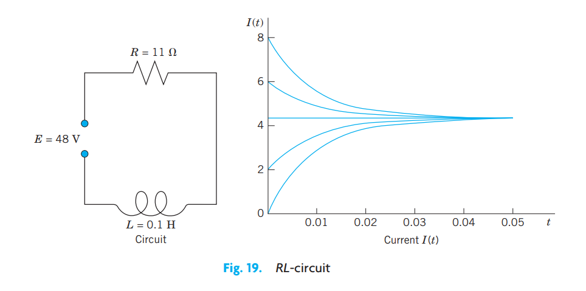{#fig-1-19}

### EXAMPLE 3 Hormone Level

Assume that the level of a certain hormone in the blood of a patient varies with time. Suppose that the time rate of change is the difference between a sinusoidal input of a 24-hour period from the thyroid gland and a continuous removal rate proportional to the level present. Set up a model for the hormone level in the blood and find its general solution. Find the particular solution satisfying a suitable initial condition.

**Solution. Step 1. Setting up a model.** Let $y(t)$ be the hormone level at time $t$. Then the removal rate is $Ky(t)$. The input rate is $A + B \cos \omega t$, where $\omega = 2\pi/24 = \pi/12$ and $A \ge B$ to make the input rate nonnegative. The constants $A$, $B$, $K$ can be determined from measurements. Hence the model is the linear ODE

$$
y' = \text{In} - \text{Out} = A + B \cos \omega t - Ky(t), \quad \text{thus} \quad y' + Ky = A + B \cos \omega t.
$$

The initial condition for a particular solution is $y_{\text{part}}(0) = y_0$ with $t = 0$ suitably chosen, for example, 6:00 A.M.

**Step 2. General solution.** In (@eq-sec15-4) we have $p = K = \text{const}$, $h = Kt$, and $r = A + B \cos \omega t$. Hence (@eq-sec15-4) gives the general solution (evaluate $\int e^{Kt} \cos \omega t \, dt$ by integration by parts)

$$
\begin{aligned}
y(t) &= e^{-Kt} \left[ \int e^{Kt} (A + B \cos \omega t) \, dt + c \right] \\
&= \frac{A}{K} + \frac{B}{K^2 + \omega^2}\left( K \cos \omega t + \omega \sin \omega t \right) + ce^{-Kt}.
\end{aligned}
$$

The last term decreases to 0 as $t$ increases, practically after a short time and regardless of $c$ (that is, of the initial condition). The other part of $y(t)$ is called the **steady-state solution** because it consists of constant and periodic terms. The entire solution is called the **transient-state solution** because it models the transition from rest to the steady state. These terms are used quite generally for physical and other systems whose behavior depends on time.

**Step 3. Particular solution.** Setting $t = 0$ in $y(t)$ and choosing $y_0 = 0$, we have

$$
y(0) = \frac{A}{K} + \frac{KB}{K^2 + \omega^2} + c = 0, \quad \text{thus} \quad c = -\frac{A}{K} - \frac{KB}{K^2 + \omega^2}.
$$

Inserting this result into $y(t)$, we obtain the particular solution

$$
y_{\text{part}}(t) = \frac{A}{K} + \frac{B}{K^2 + (\pi/12)^2}\left( K \cos \frac{\pi}{12}t + \frac{\pi}{12} \sin \frac{\pi}{12}t \right) - \left( \frac{A}{K} + \frac{KB}{K^2 + (\pi/12)^2} \right)e^{-Kt}
$$

with the steady-state part as before. To plot $y_{\text{part}}$ we must specify values for the constants, say, $A = B = 1$, $K = 0.05$. Figure 20 shows this solution. Notice that the transition period is relatively short (although $K$ is small), and the curve soon looks sinusoidal; this is the response to the input $1 + \cos (\pi t / 12)$.

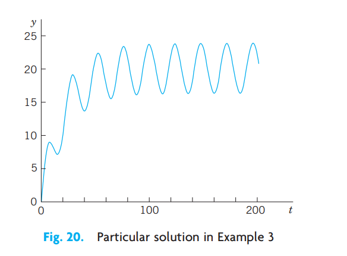{#fig-1-20}

### Reduction to Linear Form. Bernoulli Equation

Numerous applications can be modeled by ODEs that are nonlinear but can be transformed to linear ODEs. One of the most useful ones of these is the **Bernoulli equation**⁷

$$
y' + p(x)y = g(x)y^a \qquad (a \text{ any real number}).
$$ {#eq-sec15-9}

> ⁷JAKOB BERNOULLI (1654–1705), Swiss mathematician, professor at Basel, also known for his contribution to elasticity theory and mathematical probability. The method for solving Bernoulli’s equation was discovered by Leibniz in 1696. Jakob Bernoulli’s students included his nephew NIKLAUS BERNOULLI (1687–1759), who contributed to probability theory and infinite series, and his youngest brother JOHANN BERNOULLI (1667–1748), who had profound influence on the development of calculus, became Jakob’s successor at Basel, and had among his students GABRIEL CRAMER (see Sec. 7.7) and LEONHARD EULER (see Sec. 2.5). His son DANIEL BERNOULLI (1700–1782) is known for his basic work in fluid flow and the kinetic theory of gases.

If $a = 0$ or $a = 1$, Equation (@eq-sec15-9) is linear. Otherwise it is nonlinear. Then we set

$$
u(x) = [y(x)]^{1-a}.
$$

We differentiate this and substitute $y'$ from (@eq-sec15-9), obtaining

$$
u' = (1 - a)y^{-a}y' = (1 - a)y^{-a}(g y^a - p y).
$$

Simplification gives

$$
u' = (1 - a)(g - p y^{1-a})
$$

where $y^{1-a} = u$ on the right, so that we get the linear ODE

$$
u' + (1 - a)pu = (1 - a)g.
$$ {#eq-sec15-10}

For further ODEs reducible to linear form, see Ince’s classic [A11] listed in App. 1. See also Team Project 30 in Problem Set 1.5.

### EXAMPLE 4 Logistic Equation

Solve the following Bernoulli equation, known as the **logistic equation** (or **Verhulst equation**⁸):

$$
y' = Ay - By^2.
$$ {#eq-sec15-11}

> ⁸PIERRE-FRANÇOIS VERHULST, Belgian statistician, who introduced Eq. (8) as a model for human population growth in 1838.

**Solution.** Write (@eq-sec15-11) in the form (@eq-sec15-9), that is,

$$
y' - Ay = -By^2
$$

to see that $a = 2$, so that $u = y^{1-a} = y^{-1}$. Differentiate this $u$ and substitute $y'$ from (@eq-sec15-11),

$$
u' = -y^{-2}y' = -y^{-2}(Ay - By^2) = -Ay^{-1} + B.
$$

The last term is $-Au + B$. Hence we have obtained the linear ODE

$$
u' + Au = B.
$$

The general solution is [by (@eq-sec15-4)]

$$
u = ce^{-At} + B/A.
$$

Since $u = 1/y$, this gives the general solution of (@eq-sec15-11),

$$
y = \frac{1}{ce^{-At} + B/A}.
$$ {#eq-sec15-12}

Directly from (@eq-sec15-11) we see that $y \equiv 0$ ($y(t) = 0$ for all $t$) is also a solution.

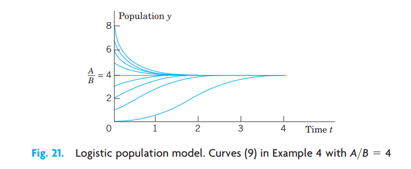{#fig-1-21}

### Population Dynamics

The logistic equation (@eq-sec15-11) plays an important role in population dynamics, a field that models the evolution of populations of plants, animals, or humans over time $t$. If $B = 0$, then (@eq-sec15-11) is $y' = dy/dt = Ay$. In this case its solution (@eq-sec15-12) is $y = (1/c)e^{At}$ and gives exponential growth, as for a small population in a large country (the United States in early times!). This is called **Malthus's law**. (See also Example 3 in Sec. 1.1.)

The term $-By^2$ in (@eq-sec15-11) is a “braking term” that prevents the population from growing without bound. Indeed, if we write $y' = Ay(1 - \frac{B}{A}y)$, we see that if $y < A/B$, then $y' > 0$, so that an initially small population keeps growing as long as $y < A/B$. But if $y > A/B$, then $y' < 0$, and the population is decreasing as long as $y > A/B$. The limit is the same in both cases, namely, $A/B$. See Fig. 21.

We see that in the logistic equation (@eq-sec15-11) the independent variable $t$ does not occur explicitly. An ODE in which $t$ does not occur explicitly is of the form

$$
y' = f(y)
$$ {#eq-sec15-13}

and is called an **autonomous ODE**. Thus the logistic equation (@eq-sec15-11) is autonomous.

Equation (@eq-sec15-13) has constant solutions, called **equilibrium solutions** or **equilibrium points**. These are determined by the zeros of $f(y)$ because $y = \text{const}$ gives $y' = 0$ by (@eq-sec15-13); hence $f(y) = 0$. These zeros are known as **critical points** of (@eq-sec15-13). An equilibrium solution is called **stable** if solutions close to it for some $t$ remain close to it for all further $t$. It is called **unstable** if solutions initially close to it do not remain close to it as $t$ increases. For instance, in Fig. 21, $y = 0$ is an unstable equilibrium solution, and $y = A/B$ is a stable one. Note that (@eq-sec15-11) has the critical points $y = 0$ and $y = A/B$.

### EXAMPLE 5 Stable and Unstable Equilibrium Solutions. “Phase Line Plot”

The ODE $y' = (y - 1)(y - 2)$ has the stable equilibrium solution $y_1 = 1$ and the unstable $y_2 = 2$, as the direction field in Fig. 22 suggests. The values $y_1$ and $y_2$ are the zeros of the parabola $f(y) = (y - 1)(y - 2)$ in the figure. Now, since the ODE is autonomous, we can “condense” the direction field to a “phase line plot” giving $y_1$ and $y_2$ and the direction (upward or downward) of the arrows in the field, and thus giving information about the stability or instability of the equilibrium solutions.

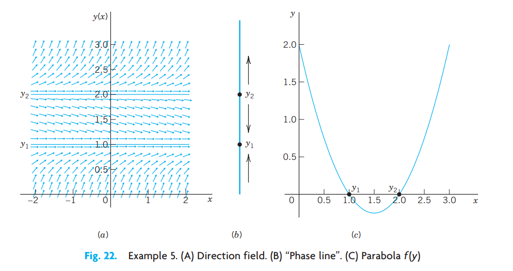{#fig-1-22}

A few further population models will be discussed in the problem set. For some more details of population dynamics, see C. W. Clark, *Mathematical Bioeconomics: The Mathematics of Conservation*, 3rd ed. Hoboken, NJ: Wiley, 2010.

Further applications of linear ODEs follow in the next section.

## PROBLEM SET 1.5

### 1. CAUTION!
Show that $e^{-\ln x} = 1/x$ (not $-x$) and $e^{-\ln(\sec x)} = \cos x$.

### 2. Integration constant.
Give a reason why in (@eq-sec15-4) you may choose the constant of integration in $\int p \, dx$ to be zero.

### 3–13 GENERAL SOLUTION. INITIAL VALUE PROBLEMS
Find the general solution. If an initial condition is given, find also the corresponding particular solution and graph or sketch it. (Show the details of your work.)

3. $y' - y = 5.2$
4. $y' = 2y - 4x$
5. $y' + ky = e^{-kx}$
6. $y' + 2y = 4 \cos 2x, \quad y(\frac{1}{4}\pi) = 3$
7. $xy' = 2y + x^3e^x$
8. $y' + y \tan x = e^{-0.01x}\cos x, \quad y(0) = 0$
9. $y' + y \sin x = e^{\cos x}, \quad y(0) = -2.5$
10. $y' \cos x + (3y - 1)\sec x = 0, \quad y(\frac{1}{4}\pi) = 4/3$
11. $y' = (y - 2)\cot x$
12. $xy' + 4y = 8x^4, \quad y(1) = 2$
13. $y' = 6(y - 2.5)\tanh 1.5x$

### 14. CAS EXPERIMENT.
(a) Solve the ODE $y' - y/x = -x^{-1}\cos (1/x)$. Find an initial condition for which the arbitrary constant becomes zero. Graph the resulting particular solution, experimenting to obtain a good figure near $x = 0$.
(b) Generalizing (a) from $n = 1$ to arbitrary $n$, solve the ODE $y' - ny/x = -x^{n-2}\cos (1/x)$. Find an initial condition as in (a) and experiment with the graph.

### 15–20 GENERAL PROPERTIES OF LINEAR ODEs
These properties are of practical and theoretical importance because they enable us to obtain new solutions from given ones. Thus in modeling, whenever possible, we prefer linear ODEs over nonlinear ones, which have no similar properties. Show that nonhomogeneous linear ODEs (@eq-sec15-1) and homogeneous linear ODEs (@eq-sec15-2) have the following properties. Illustrate each property by a calculation for two or three equations of your choice. Give proofs.

15. The sum $y_1 + y_2$ of two solutions $y_1$ and $y_2$ of the homogeneous equation (@eq-sec15-2) is a solution of (@eq-sec15-2), and so is a scalar multiple $ay_1$ for any constant $a$. These properties are not true for (@eq-sec15-1)!
16. $y \equiv 0$ (that is, $y(x) = 0$ for all $x$, also written $y(x) \equiv 0$) is a solution of (@eq-sec15-2) [not of (@eq-sec15-1) if $r(x) \not\equiv 0$!], called the **trivial solution**.
17. The sum of a solution of (@eq-sec15-1) and a solution of (@eq-sec15-2) is a solution of (@eq-sec15-1).
18. The difference of two solutions of (@eq-sec15-1) is a solution of (@eq-sec15-2).
19. If $y_1$ is a solution of (@eq-sec15-1), what can you say about $cy_1$?
20. If $y_1$ and $y_2$ are solutions of $y_1' + py_1 = r_1$ and $y_2' + py_2 = r_2$, respectively (with the same $p$!), what can you say about the sum $y_1 + y_2$?
21. **Variation of parameter.** Another method of obtaining (@eq-sec15-4) results from the following idea. Write (@eq-sec15-3) as $y = c y^*$, where $y^*$ is the exponential function, which is a solution of the homogeneous linear ODE $y^{*\prime} + py^* = 0$. Replace the arbitrary constant $c$ in (@eq-sec15-3) with a function $u$ to be determined so that the resulting function $y = u y^*$ is a solution of the nonhomogeneous linear ODE $y' + py = r$.

### 22–28 NONLINEAR ODEs
Using a method of this section or separating variables, find the general solution. If an initial condition is given, find also the particular solution and sketch or graph it.

22. $y' + y = y^2, \quad y(0) = -\frac{1}{3}$
23. $y' + xy = xy^{-1}, \quad y(0) = 3$
24. $y' + y = -x/y$
25. $y' = 3.2y - 10y^2$
26. $y' = (\tan y)/(x - 1), \quad y(0) = \frac{1}{2}\pi$
27. $y' = 1/(6e^y - 2x)$
28. $2xyy' + (x - 1)y^2 = x^2e^x \quad (\text{Set } y^2 = z)$

### 29. REPORT PROJECT. Transformation of ODEs.
We have transformed ODEs to separable form, to exact form, and to linear form. The purpose of such transformations is an extension of solution methods to larger classes of ODEs. Describe the key idea of each of these transformations and give three typical examples of your choice for each transformation. Show each step (not just the transformed ODE).

### 30. TEAM PROJECT. Riccati Equation. Clairaut Equation. Singular Solution.
A **Riccati equation** is of the form
$$
y' + p(x)y = g(x)y^2 + h(x).
$$ {#eq-sec15-14}
A **Clairaut equation** is of the form
$$
y = xy' + g(y').
$$ {#eq-sec15-15}
(a) Apply the transformation $y = Y + 1/u$ to the Riccati equation (@eq-sec15-14), where $Y$ is a solution of (@eq-sec15-14), and obtain for $u$ the linear ODE
$$
u' + (2Yg - p)u = -g.
$$
Explain the effect of the transformation by writing it as $y = Y + v$, $v = 1/u$.
(b) Show that $y = Y = x$ is a solution of the ODE $y' - (2x^3 + 1)y = -x^2y^2 - x^4 - x + 1$ and solve this Riccati equation, showing the details.
(c) Solve the Clairaut equation (@eq-sec15-15) as follows. Differentiate it with respect to $x$, obtaining $y''(xy'' + g'(y')) = 0$. Then solve (A) $y'' = 0$ and (B) $x + g'(y') = 0$ separately and substitute the two solutions (a) and (b) of (A) and (B) into the given ODE. Thus obtain (a) a general solution (straight lines) and (b) a parabola for which those lines (a) are tangents (Fig. 6 in Prob. Set 1.1); so (b) is the envelope of (a). Such a solution (b) that cannot be obtained from a general solution is called a **singular solution**.
(d) Show that the Clairaut equation (@eq-sec15-15) has as solutions a family of straight lines $y = cx + g(c)$ and a singular solution determined by $g'(s) = -x$, where $s = y'$, that forms the envelope of that family.

### 31–40 MODELING. FURTHER APPLICATIONS

31. **Newton’s law of cooling.** If the temperature of a cake is 300°F when it leaves the oven and is 200°F ten minutes later, when will it be practically equal to the room temperature of 60°F, say, when will it be 61°F?
32. **Heating and cooling of a building.** Heating and cooling of a building can be modeled by the ODE
    $$
    T' = k_1(T - T_a) + k_2(T - T_w) + P,
    $$
    where $T = T(t)$ is the temperature in the building at time $t$, $T_a$ the outside temperature, $T_w$ the temperature wanted in the building, and $P$ the rate of increase of $T$ due to machines and people in the building, and $k_1$ and $k_2$ are (negative) constants. Solve this ODE, assuming $P = \text{const}$, $T_w = \text{const}$, $T_a$ varying sinusoidally over 24 hours, say, $T_a = A - C \cos(2\pi/24)t$. Discuss the effect of each term of the equation on the solution.
33. **Drug injection.** Find and solve the model for drug injection into the bloodstream if, beginning at $t = 0$, a constant amount $A\text{ g/min}$ is injected and the drug is simultaneously removed at a rate proportional to the amount of the drug present at time $t$.
34. **Epidemics.** A model for the spread of contagious diseases is obtained by assuming that the rate of spread is proportional to the number of contacts between infected and noninfected persons, who are assumed to move freely among each other. Set up the model. Find the equilibrium solutions and indicate their stability or instability. Solve the ODE. Find the limit of the proportion of infected persons as $t \to \infty$ and explain what it means.
35. **Lake Erie.** Lake Erie has a water volume of about $450\text{ km}^3$ and a flow rate (in and out) of about $175\text{ km}^3$ per year. If at some instant the lake has pollution concentration $p_0 = 0.04\%$, how long, approximately, will it take to decrease it to $p_0 / 2$, assuming that the inflow is much cleaner, say, it has pollution concentration $p_0 / 4$, and the mixture is uniform (an assumption that is only imperfectly true)? First guess.
36. **Harvesting renewable resources. Fishing.** Suppose that the population of a certain kind of fish is given by the logistic equation (@eq-sec15-11), and fish are caught at a rate $Hy$ proportional to $y$. Solve this so-called Schaefer model. Find the equilibrium solutions $y_1$ and $y_2$ ($\ge 0$) when $H < A$. The expression $Y = Hy$ is called the equilibrium harvest or sustainable yield corresponding to $H$. Why?
37. **Harvesting.** In Prob. 36 find and graph the solution satisfying $y(0) = 2$ when (for simplicity) $A = B = 1$ and $H = 0.2$. What is the limit? What does it mean? What if there were no fishing?
38. **Intermittent harvesting.** In Prob. 36 assume that you fish for 3 years, then fishing is banned for the next 3 years. Thereafter you start again. And so on. This is called intermittent harvesting. Describe qualitatively how the population will develop if intermitting is continued periodically. Find and graph the solution for the first 9 years, assuming that $A = B = 1, H = 0.2$, and $y(0) = 2$.

    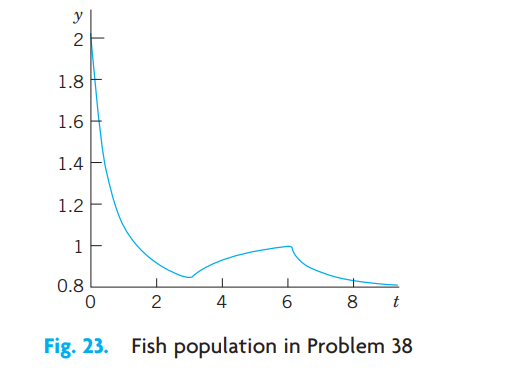{#fig-1-23}

39. **Extinction vs. unlimited growth.** If in a population the death rate is proportional to the population, and the birth rate is proportional to the chance encounters of meeting mates for reproduction, what will the model be? Without solving, find out what will eventually happen to a small initial population. To a large one. Then solve the model.
40. **Air circulation.** In a room containing $20,000\text{ ft}^3$ of air, $600\text{ ft}^3$ of fresh air flows in per minute, and the mixture (made practically uniform by circulating fans) is exhausted at a rate of 600 cubic feet per minute (cfm). What is the amount of fresh air $y(t)$ at any time if $y(0) = 0$? After what time will 90% of the air be fresh?

## 1.6 Orthogonal Trajectories. Optional {#sec-orthogonal-trajectories}

An important type of problem in physics or geometry is to find a family of curves that intersects a given family of curves at right angles. The new curves are called **orthogonal trajectories** of the given curves (and conversely). Examples are curves of equal temperature (isotherms) and curves of heat flow, curves of equal altitude (contour lines) on a map and curves of steepest descent on that map, curves of equal potential (equipotential curves, curves of equal voltage—the ellipses in Fig. 24) and curves of electric force (the parabolas in Fig. 24).

Here the angle of intersection between two curves is defined to be the angle between the tangents of the curves at the intersection point. Orthogonal is another word for perpendicular.

In many cases orthogonal trajectories can be found using ODEs. In general, if we consider $G(x, y, c) = 0$ to be a given family of curves in the $xy$-plane, then each value of $c$ gives a particular curve. Since $c$ is one parameter, such a family is called a **one-parameter family of curves**.

In detail, let us explain this method by a family of ellipses

$$
\frac{1}{2}x^2 + y^2 = c \qquad (c > 0)
$$ {#eq-sec16-1}

and illustrated in Fig. 24. We assume that this family of ellipses represents electric equipotential curves between the two black ellipses (equipotential surfaces between two elliptic cylinders in space, of which Fig. 24 shows a cross-section). We seek the orthogonal trajectories, the curves of electric force. Equation (@eq-sec16-1) is a one-parameter family with parameter $c$. Each value of $c$ corresponds to one of these ellipses.

**Step 1. Find an ODE for which the given family is a general solution.** Of course, this ODE must no longer contain the parameter $c$. Differentiating (@eq-sec16-1), we have $x + 2yy' = 0$. Hence the ODE of the given curves is

$$
y' = f(x, y) = -\frac{x}{2y}.
$$ {#eq-sec16-2}

**Step 2. Find an ODE for the orthogonal trajectories.** This ODE is

$$
\tilde{y}' = -\frac{1}{f(x, \tilde{y})} = +\frac{2\tilde{y}}{x}
$$ {#eq-sec16-3}

with the same $f$ as in (@eq-sec16-2). Why? Well, a given curve passing through a point $(x_0, y_0)$ has slope $f(x_0, y_0)$ at that point, by (@eq-sec16-2). The trajectory through $(x_0, y_0)$ has slope $-1/f(x_0, y_0)$ by (@eq-sec16-3). The product of these slopes is $-1$, as we see. From calculus it is known that this is the condition for orthogonality (perpendicularity) of two straight lines (the tangents at $(x_0, y_0)$), hence of the curve and its orthogonal trajectory at $(x_0, y_0)$.

**Step 3. Solve (@eq-sec16-3)** by separating variables, integrating, and taking exponents:

$$
\frac{d\tilde{y}}{\tilde{y}} = \frac{2 \, dx}{x}, \qquad \ln |\tilde{y}| = 2\ln x + c, \qquad \tilde{y} = c^* x^2.
$$

This is the family of orthogonal trajectories, the quadratic parabolas along which electrons or other charged particles (of very small mass) would move in the electric field between the black ellipses (elliptic cylinders).

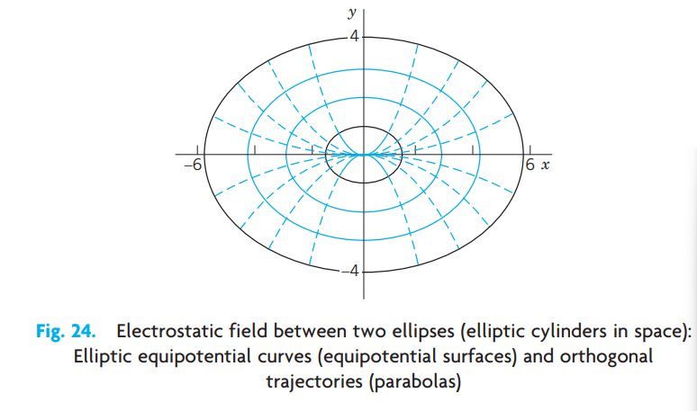{#fig-1-24}

## PROBLEM SET 1.6

### 1–3 FAMILIES OF CURVES
Represent the given family of curves in the form $G(x, y; c) = 0$ and sketch some of the curves.

1. All ellipses with foci $-3$ and $3$ on the $x$-axis.
2. All circles with centers on the cubic parabola $y = x^3$ and passing through the origin $(0, 0)$.
3. The catenaries obtained by translating the catenary $y = \cosh x$ in the direction of the straight line $y = -2x + c$.

### 4–10 ORTHOGONAL TRAJECTORIES (OTs)
Sketch or graph some of the given curves. Guess what their OTs may look like. Find these OTs.

4. $y = cx$
5. $y = x^2 + c$
6. $y = ce^{x^2}$
7. $xy = c$
8. $y = x + c$
9. $x^2 + (y - c)^2 = c^2$
10. $y = c \cosh x$

### 11–16 APPLICATIONS, EXTENSIONS

11. **Electric field.** Let the electric equipotential lines (curves of constant potential) between two concentric cylinders with the $z$-axis in space be given by $u(x, y) = x^2 + y^2 = c$ (these are circular cylinders in the $xyz$-space). Using the method in the text, find their orthogonal trajectories (the curves of electric force).
12. **Electric field.** The lines of electric force of two opposite charges of the same strength at $(-1, 0)$ and $(1, 0)$ are the circles through $(-1, 0)$ and $(1, 0)$. Show that these circles are given by $x^2 + (y - c)^2 = 1 + c^2$. Show that the equipotential lines (which are orthogonal trajectories of those circles) are the circles given by $(x + c^*)^2 + y^2 = c^{*2} - 1$ (dashed in Fig. 25).

    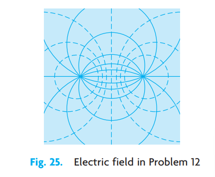{#fig-1-25}

13. **Temperature field.** Let the isotherms (curves of constant temperature) in a body in the upper half-plane be given by $4x^2 + 9y^2 = c \ (y > 0)$. Find the orthogonal trajectories (the curves along which heat will flow in regions filled with heat-conducting material and free of heat sources or heat sinks).
14. **Conic sections.** Find the conditions under which the orthogonal trajectories of families of ellipses $x^2/a^2 + y^2/b^2 = c$ are again conic sections. Illustrate your result graphically by sketches or by using your CAS. What happens if $a = 0$? If $b = 0$?
15. **Cauchy–Riemann equations.** Show that for a family $u(x, y) = c = \text{const}$ the orthogonal trajectories $v(x, y) = c^* = \text{const}$ can be obtained from the following Cauchy–Riemann equations (which are basic in complex analysis in Chap. 13) and use them to find the orthogonal trajectories of $e^x \sin y = \text{const}$. (Here, subscripts denote partial derivatives.)
    $$
    u_x = v_y, \qquad u_y = -v_x.
    $$
16. **Congruent OTs.** If $y' = f(x)$ with $f$ independent of $y$, show that the curves of the corresponding family are congruent, and so are their OTs.

## 1.7 Existence and Uniqueness of Solutions for Initial Value Problems {#sec-existence-uniqueness}

The initial value problem $|y'| + |y| = 0, \ y(0) = 1$ has no solution because $y = 0$ (that is, $y(x) = 0$ for all $x$) is the only solution of the ODE.

The initial value problem $y' = 2x, \ y(0) = 1$ has precisely one solution, namely, $y = x^2 + 1$. The initial value problem $y' = y - 1, \ y(0) = 1$ has infinitely many solutions, namely, $y = 1 + cx$, where $c$ is an arbitrary constant because $y(0) = 1$ for all $c$.

From these examples we see that an initial value problem

$$
y' = f(x, y), \qquad y(x_0) = y_0
$$ {#eq-sec17-1}

may have no solution, precisely one solution, or more than one solution. This fact leads to the following two fundamental questions.

**Problem of Existence**

Under what conditions does an initial value problem of the form (@eq-sec17-1) have at least one solution (hence one or several solutions)?

**Problem of Uniqueness**

Under what conditions does that problem have at most one solution (hence excluding the case that it has more than one solution)?

Theorems that state such conditions are called **existence theorems** and **uniqueness theorems**, respectively.

Of course, for our simple examples, we need no theorems because we can solve these examples by inspection; however, for complicated ODEs such theorems may be of considerable practical importance. Even when you are sure that your physical or other system behaves uniquely, occasionally your model may be oversimplified and may not give a faithful picture of reality.

### THEOREM 1 Existence Theorem

Let the right side $f(x, y)$ of the ODE in the initial value problem

$$
y' = f(x, y), \qquad y(x_0) = y_0
$$

be continuous at all points $(x, y)$ in some rectangle

$$
R: \quad |x - x_0| < a, \qquad |y - y_0| < b
$$

(Fig. 26) and bounded in $R$; that is, there is a number $K$ such that

$$
|f(x, y)| \le K \qquad \text{for all } (x, y) \text{ in } R.
$$ {#eq-sec17-2}

Then the initial value problem (@eq-sec17-1) has at least one solution $y(x)$. This solution exists at least for all $x$ in the subinterval $|x - x_0| < \alpha$ of the interval $|x - x_0| < a$; here, $\alpha$ is the smaller of the two numbers $a$ and $b/K$.

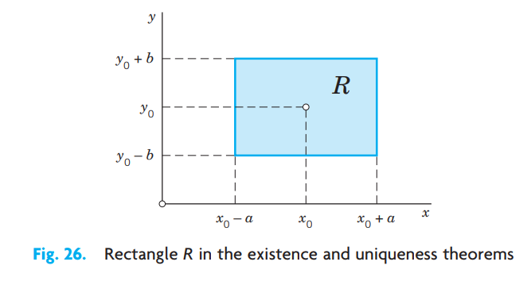{#fig-1-26}

(Example of Boundedness. The function $f(x, y) = x^2 + y^2$ is bounded (with $K = 2$) in the square $|x| \le 1, |y| \le 1$. The function $f(x, y) = \tan(x + y)$ is not bounded for $|x + y| \le \pi/2$. Explain!)

### THEOREM 2 Uniqueness Theorem

Let $f$ and its partial derivative $\partial f/\partial y$ be continuous for all $(x, y)$ in the rectangle $R$ (Fig. 26) and bounded, say,

$$
\text{(a)} \quad |f(x, y)| \le K, \qquad \text{(b)} \quad \left|\frac{\partial f}{\partial y}(x, y)\right| \le M \qquad \text{for all } (x, y) \text{ in } R.
$$ {#eq-sec17-3}

Then the initial value problem (@eq-sec17-1) has at most one solution $y(x)$. Thus, by Theorem 1, the problem has precisely one solution. This solution exists at least for all $x$ in that subinterval $|x - x_0| < \alpha$.

### Understanding These Theorems

These two theorems take care of almost all practical cases. Theorem 1 says that if $f(x, y)$ is continuous in some region in the $xy$-plane containing the point $(x_0, y_0)$, then the initial value problem (@eq-sec17-1) has at least one solution.

Theorem 2 says that if, moreover, the partial derivative of $f$ with respect to $y$ exists and is continuous in that region, then (@eq-sec17-1) can have at most one solution; hence, by Theorem 1, it has precisely one solution.

Read again what you have just read—these are entirely new ideas in our discussion.

Proofs of these theorems are beyond the level of this book (see Ref. [A11] in App. 1); however, the following remarks and examples may help you to a good understanding of the theorems.

Since $y' = f(x, y)$, the condition (@eq-sec17-2) implies that $|y'| \le K$; that is, the slope of any solution curve $y(x)$ in $R$ is at least $-K$ and at most $K$. Hence a solution curve that passes through the point $(x_0, y_0)$ must lie in the colored region in Fig. 27 bounded by the lines $l_1$ and $l_2$ whose slopes are $-K$ and $K$, respectively. Depending on the form of $R$, two different cases may arise. In the first case, shown in Fig. 27a, we have $b/K \ge a$ and therefore $\alpha = a$ in the existence theorem, which then asserts that the solution exists for all $x$ between $x_0 - a$ and $x_0 + a$. In the second case, shown in Fig. 27b, we have $b/K < a$. Therefore, $\alpha = b/K < a$ and all we can conclude from the theorems is that the solution exists for all $x$ between $x_0 - b/K$ and $x_0 + b/K$. For larger or smaller $x$'s the solution curve may leave the rectangle $R$, and since nothing is assumed about $f$ outside $R$, nothing can be concluded about the solution for those larger or smaller $x$'s; that is, for such $x$'s the solution may or may not exist—we don't know.

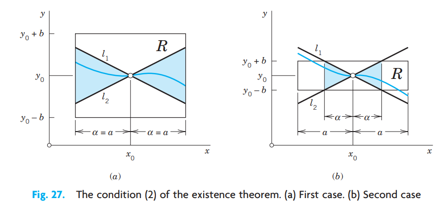{#fig-1-27}

Let us illustrate our discussion with a simple example. We shall see that our choice of a rectangle $R$ with a large base (a long $x$-interval) will lead to the case in Fig. 27b.

### EXAMPLE 1 Choice of a Rectangle

Consider the initial value problem $y' = 1 + y^2, \ y(0) = 0$ and take the rectangle $R; |x| < 5, |y| < 3$. Then $|f(x, y)| = |1 + y^2| \le K = 10$, and

$$
\left|\frac{\partial f}{\partial y}\right| = |2y| \le M = 6.
$$

Indeed, the solution of the problem is $y = \tan x$ (see Sec. 1.3, Example 1). This solution is discontinuous at $\pm \pi/2$, and there is no continuous solution valid in the entire interval $|x| < 5$ from which we started.

The conditions in the two theorems are sufficient conditions rather than necessary ones, and can be lessened. In particular, by the mean value theorem of differential calculus we have

$$
f(x, y_2) - f(x, y_1) = (y_2 - y_1)\frac{\partial f}{\partial y}\bigg|_{y = \tilde{y}}
$$

where $(x, y_1)$ and $(x, y_2)$ are assumed to be in $R$, and $\tilde{y}$ is a suitable value between $y_1$ and $y_2$. From this and (@eq-sec17-3)b it follows that

$$
|f(x, y_2) - f(x, y_1)| \le M |y_2 - y_1|.
$$ {#eq-sec17-4}

It can be shown that (@eq-sec17-3)b may be replaced by the weaker condition (@eq-sec17-4), which is known as a **Lipschitz condition**.^[RUDOLF LIPSCHITZ (1832–1903), German mathematician. Lipschitz and similar conditions are important in modern theories, for instance, in partial differential equations.] However, continuity of $f(x, y)$ is not enough to guarantee the uniqueness of the solution. This may be illustrated by the following example.

### EXAMPLE 2 Nonuniqueness

The initial value problem $y' = 2\sqrt{|y|}, \ y(0) = 0$ has the two solutions

$$
y = 0 \qquad \text{and} \qquad y^* = \begin{cases} x^2/4 & \text{if } x \ge 0 \\ -x^2/4 & \text{if } x < 0 \end{cases}
$$

although $f(x, y) = 2\sqrt{|y|}$ is continuous for all $y$. The Lipschitz condition (@eq-sec17-4) is violated in any region that includes the line $y = 0$, because for $y_1 = 0$ and $y_2 > 0$ we have

$$
\frac{|f(x, y_2) - f(x, y_1)|}{|y_2 - y_1|} = \frac{2\sqrt{y_2}}{y_2} = \frac{2}{\sqrt{y_2}},
$$ {#eq-sec17-5}

and this can be made as large as we please by choosing $y_2$ sufficiently small, whereas (@eq-sec17-4) requires that the quotient on the left side of (@eq-sec17-5) should not exceed a fixed constant $M$. $\blacksquare$

## PROBLEM SET 1.7

1. **Linear ODE.** If $p$ and $r$ in $y' + p(x)y = r(x)$ are continuous for all $x$ in an interval $|x - x_0| \le a$, show that in this ODE $f(x, y)$ satisfies the conditions of our present theorems, so that a corresponding initial value problem has a unique solution. Do you actually need these theorems for this ODE?
2. **Existence?** Does the initial value problem $(x - 2)y' = y, \ y(2) = 1$ have a solution? Does your result contradict our present theorems?
3. **Vertical strip.** If the assumptions of Theorems 1 and 2 are satisfied not merely in a rectangle but in a vertical infinite strip $|x - x_0| < a$, in what interval will the solution of (@eq-sec17-1) exist?
4. **Change of initial condition.** What happens in Prob. 2 if you replace $y(2) = 1$ with $y(2) = k$?
5. **Length of $x$-interval.** In most cases the solution of an initial value problem (@eq-sec17-1) exists in an $x$-interval larger than that guaranteed by the present theorems. Show this fact for $y' = 2y^2, \ y(1) = 1$ by finding the best possible $\alpha$ (choosing $b$ optimally) and comparing the result with the actual solution.
6. **CAS PROJECT. Picard Iteration.** (a) Show that by integrating the ODE in (@eq-sec17-1) and observing the initial condition you obtain

    $$
    y(x) = y_0 + \int_{x_0}^{x} f(t, y(t)) \, dt.
    $$ {#eq-sec17-6}

    This form (@eq-sec17-6) of (@eq-sec17-1) suggests **Picard's Iteration Method**^[EMILE PICARD (1856–1941), French mathematician, also known for his important contributions to complex analysis (see Sec. 16.2 for his famous theorem). Picard used his method to prove Theorems 1 and 2 as well as the convergence of the sequence (@eq-sec17-7) to the solution of (@eq-sec17-1). In precomputer times, the iteration was of little practical value because of the integrations.] which is defined by

    $$
    y_n(x) = y_0 + \int_{x_0}^{x} f(t, y_{n-1}(t)) \, dt, \qquad n = 1, 2, \ldots.
    $$ {#eq-sec17-7}

    It gives approximations $y_1, y_2, y_3, \ldots$ of the unknown solution $y$ of (@eq-sec17-1). Indeed, you obtain $y_1$ by substituting $y = y_0$ on the right and integrating—this is the first step—then $y_2$ by substituting $y = y_1$ on the right and integrating—this is the second step—and so on. Write a program of the iteration that gives a printout of the first $y_0, y_1, \ldots, y_N$ approximations as well as their graphs on common axes. Try your program on two initial value problems of your own choice.
    (b) Apply the iteration to $y' = x + y, \ y(0) = 0$. Also solve the problem exactly.
    (c) Apply the iteration to $y' = 2y^2, \ y(0) = 1$. Also solve the problem exactly.
    (d) Find all solutions of $y' = 2\sqrt{y}, \ y(1) = 0$. Which of them does Picard's iteration approximate?
    (e) Experiment with the conjecture that Picard's iteration converges to the solution of the problem for any initial choice of $y$ in the integrand in (@eq-sec17-7) (leaving $y_0$ outside the integral as it is). Begin with a simple ODE and see what happens. When you are reasonably sure, take a slightly more complicated ODE and give it a try.
7. **Maximum $\alpha$.** What is the largest possible $\alpha$ in Example 1 in the text?
8. **Lipschitz condition.** Show that for a linear ODE $y' + p(x)y = r(x)$ with continuous $p$ and $r$ in $|x - x_0| \le a$ a Lipschitz condition holds. This is remarkable because it means that for a linear ODE the continuity of $f(x, y)$ guarantees not only the existence but also the uniqueness of the solution of an initial value problem. (Of course, this also follows directly from (4) in Sec. 1.5.)
9. **Common points.** Can two solution curves of the same ODE have a common point in a rectangle in which the assumptions of the present theorems are satisfied?
10. **Three possible cases.** Find all initial conditions such that $(x^2 - x)y' = (2x - 1)y$ has no solution, precisely one solution, and more than one solution.

## CHAPTER 1 REVIEW QUESTIONS AND PROBLEMS {#sec-ch1-review}

1. Explain the basic concepts ordinary and partial differential equations (ODEs, PDEs), order, general and particular solutions, initial value problems (IVPs). Give examples.
2. What is a linear ODE? Why is it easier to solve than a nonlinear ODE?
3. Does every first-order ODE have a solution? A solution formula? Give examples.
4. What is a direction field? A numeric method for first-order ODEs?
5. What is an exact ODE? Is $f(x) \, dx + g(y) \, dy = 0$ always exact?
6. Explain the idea of an integrating factor. Give two examples.
7. What other solution methods did we consider in this chapter?
8. Can an ODE sometimes be solved by several methods? Give three examples.
9. What does modeling mean? Can a CAS solve a model given by a first-order ODE? Can a CAS set up a model?
10. Give problems from mechanics, heat conduction, and population dynamics that can be modeled by first-order ODEs.

### 11–16 DIRECTION FIELD: NUMERIC SOLUTION
Graph a direction field (by a CAS or by hand) and sketch some solution curves. Solve the ODE exactly and compare. In Prob. 16 use Euler's method.

11. $y' + 2y = 0$
12. $y' = 1 - y^2$
13. $y' = y - 4y^2$
14. $xy' = y + x^2$
15. $y' + y = 1.01\cos 10x$
16. Solve by Euler's method $y' = y - y^2, \ y(0) = 0.2$ (10 steps, $h = 0.1$). Solve exactly and compute the error.

### 17–21 GENERAL SOLUTION
Find the general solution. Indicate which method in this chapter you are using. Show the details of your work.

17. $y' - 0.4y = 29\sin x$
18. $y' + 2.5y = 1.6x$
19. $25yy' - 4x = 0$
20. $y' = ay + by^2 \quad (a \ne 0)$
21. $(3xe^y + 2y) \, dx + (x^2e^y + x) \, dy = 0$

### 22–26 INITIAL VALUE PROBLEM (IVP)
Solve the IVP. Indicate the method used. Show the details of your work.

22. $y' + 4xy = e^{-2x^2}, \quad y(0) = -4.3$
23. $y' = \sqrt{1 - y^2}, \quad y(0) = 1/\sqrt{2}$
24. $y' + \frac{1}{2}y = y^3, \quad y(0) = \frac{1}{3}$
25. $3\sec x \, dy + 3\sec y \, dx = 0, \quad y(0) = 0$
26. $x \sinh y \, dy = \cosh y \, dx, \quad y(3) = 0$

### 27–30 MODELING, APPLICATIONS

27. **Exponential growth.** If the growth rate of a culture of bacteria is proportional to the number of bacteria present and after 1 day is 1.25 times the original number, within what interval of time will the number of bacteria (a) double, (b) triple?
28. **Mixing problem.** The tank in Fig. 28 contains 80 lb of salt dissolved in 500 gal of water. The inflow per minute is 20 lb of salt dissolved in 20 gal of water. The outflow is 20 gal/min of the uniform mixture. Find $y(t)$ and the time when the salt content in the tank reaches 95% of its limiting value (as $t \to \infty$).

    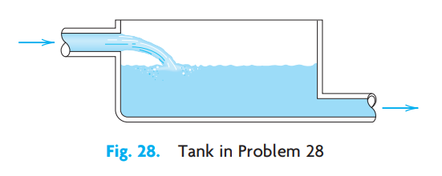{#fig-1-28}

29. **Half-life.** If in a reactor, uranium ${}^{237}_{\ 97}\text{U}$ loses 10% of its weight within one day, what is its half-life? How long would it take for 99% of the original amount to disappear?
30. **Newton's law of cooling.** A metal bar whose temperature is $20°\text{C}$ is placed in boiling water. How long does it take to heat the bar to practically $100°\text{C}$, say, to $99.9°\text{C}$, if the temperature of the bar after 1 min of heating is $51.5°\text{C}$? First guess, then calculate.

## SUMMARY OF CHAPTER 1 {#sec-ch1-summary}

### First-Order ODEs

This chapter concerns ordinary differential equations (ODEs) of first order and their applications. These are equations of the form

$$
F(x, y, y') = 0 \qquad \text{or in explicit form} \qquad y' = f(x, y)
$$ {#eq-summary-1}

involving the derivative $y' = dy/dx$ of an unknown function $y$, given functions of $x$, and, perhaps, $y$ itself. If the independent variable $x$ is time, we denote it by $t$.

In Sec. 1.1 we explained the basic concepts and the process of modeling, that is, of expressing a physical or other problem in some mathematical form and solving it. Then we discussed the method of direction fields (Sec. 1.2), solution methods and models (Secs. 1.3–1.6), and, finally, ideas on existence and uniqueness of solutions (Sec. 1.7).

A first-order ODE usually has a **general solution**, that is, a solution involving an arbitrary constant, which we denote by $c$. In applications we usually have to find a unique solution by determining a value of $c$ from an **initial condition** $y(x_0) = y_0$. Together with the ODE this is called an **initial value problem**

$$
y' = f(x, y), \qquad y(x_0) = y_0 \qquad (x_0, y_0 \text{ given numbers})
$$ {#eq-summary-2}

and its solution is a **particular solution** of the ODE. Geometrically, a general solution represents a family of curves, which can be graphed by using direction fields (Sec. 1.2). And each particular solution corresponds to one of these curves.

A **separable ODE** is one that we can put into the form

$$
g(y) \, dy = f(x) \, dx \qquad \text{(Sec. 1.3)}
$$ {#eq-summary-3}

by algebraic manipulations (possibly combined with transformations, such as $y/x = u$) and solve by integrating on both sides.

An **exact ODE** is of the form

$$
M(x, y) \, dx + N(x, y) \, dy = 0 \qquad \text{(Sec. 1.4)}
$$ {#eq-summary-4}

where $M \, dx + N \, dy = du$ is the differential of a function $u(x, y)$, so that from $du = 0$ we immediately get the implicit general solution $u(x, y) = c$. This method extends to nonexact ODEs that can be made exact by multiplying them by some function $F(x, y)$, called an **integrating factor** (Sec. 1.4).

**Linear ODEs**

$$
y' + p(x)y = r(x)
$$ {#eq-summary-5}

are very important. Their solutions are given by the integral formula (4), Sec. 1.5. Certain nonlinear ODEs can be transformed to linear form in terms of new variables. This holds for the **Bernoulli equation** $y' + p(x)y = g(x)y^a$ (Sec. 1.5).

Applications and modeling are discussed throughout the chapter, in particular in Secs. 1.1, 1.3, 1.5 (population dynamics, etc.), and 1.6 (trajectories).

**Picard's existence and uniqueness theorems** are explained in Sec. 1.7 (and Picard's iteration in Problem Set 1.7).

Numeric methods for first-order ODEs can be studied in Secs. 21.1 and 21.2 immediately after this chapter, as indicated in the chapter opening.
