<!-- TODO: replace Chapter 13 with actual chapter label --> laid the groundwork for the study of complex analysis, covered complex numbers in the complex plane, limits, and differentiation, and introduced the most important concept of analyticity. A complex function is analytic in some domain if it is differentiable in that domain. Complex analysis deals with such functions and their applications. The Cauchy–Riemann equations, in <!-- TODO: replace Sec. 13.4 with actual cross-reference label -->, were the heart of <!-- TODO: replace Chapter 13 with actual chapter label --> and allowed a means of checking whether a function is indeed analytic. In that section, we also saw that analytic functions satisfy Laplace’s equation, the most important PDE in physics.

We now consider the next part of complex calculus, that is, we shall discuss the first approach to complex integration. It centers around the very important Cauchy integral theorem (also called the Cauchy–Goursat theorem) in @sec-cauchy-integral-theorem. This theorem is important because it allows, through its implied Cauchy integral formula of @sec-cauchy-integral-formula, the evaluation of integrals having an analytic integrand. Furthermore, the Cauchy integral formula shows the surprising result that analytic functions have derivatives of all orders. Hence, in this respect, complex analytic functions behave much more simply than real-valued functions of real variables, which may have derivatives only up to a certain order.

Complex integration is attractive for several reasons. Some basic properties of analytic functions are difficult to prove by other methods. This includes the existence of derivatives of all orders just discussed. A main practical reason for the importance of integration in the complex plane is that such integration can evaluate certain real integrals that appear in applications and that are not accessible by real integral calculus.

Finally, complex integration is used in connection with special functions, such as gamma functions (consult [GenRef1]), the error function, and various polynomials (see [GenRef10]). These functions are applied to problems in physics.

The second approach to complex integration is integration by residues, which we shall cover in <!-- TODO: replace Chapter 16 with actual chapter label -->.

**Prerequisite:** <!-- TODO: replace Chap. 13 with actual chapter label -->.

**Section that may be omitted in a shorter course:** 14.1, 14.5.

**References and Answers to Problems:** App. 1 Part D, App. 2.

## Line Integral in the Complex Plane {#sec-line-integral}

As in calculus, in complex analysis we distinguish between definite integrals and indefinite integrals or antiderivatives. Here an indefinite integral is a function whose derivative equals a given analytic function in a region. By inverting known differentiation formulas we may find many types of indefinite integrals.

Complex definite integrals are called (complex) line integrals. They are written
$$
\int_C f(z) \, dz
$$
Here the integrand $f(z)$ is integrated over a given curve $C$ or a portion of it (an arc, but we shall say "curve" in either case, for simplicity). This curve $C$ in the complex plane is called the path of integration. We may represent $C$ by a parametric representation
$$
z(t) = x(t) + i y(t) \quad (a \le t \le b)
$$ {#eq-14-1-1}

The sense of increasing $t$ is called the positive sense on $C$, and we say that $C$ is oriented by @eq-14-1-1.

For instance, $z(t) = t + 3it \quad (0 \le t \le 2)$ gives a portion (a segment) of the line $y = 3x$. The function $z(t) = 4\cos t + 4i\sin t \quad (-\pi \le t \le \pi)$ represents the circle $|z| = 4$, and so on. More examples follow below.

We assume $C$ to be a smooth curve, that is, $C$ has a continuous and nonzero derivative
$$
\dot{z}(t) = \frac{dz}{dt} = \dot{x}(t) + i \dot{y}(t)
$$
at each point. Geometrically this means that $C$ has everywhere a continuously turning tangent, as follows directly from the definition
$$
\dot{z}(t) = \lim_{\Delta t \to 0} \frac{z(t + \Delta t) - z(t)}{\Delta t}
$$
(see @fig-14-01). Here we use a dot since a prime denotes the derivative with respect to $z$.

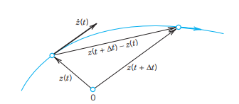{#fig-14-01}

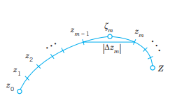{#fig-14-02}

### Definition of the Complex Line Integral

This is similar to the method in calculus. Let $C$ be a smooth curve in the complex plane given by @eq-14-1-1, and let $f(z)$ be a continuous function given (at least) at each point of $C$. We now subdivide (we "partition") the interval $a \le t \le b$ in @eq-14-1-1 by points
$$
t_0 \ (< t_1 < \dots < t_{n-1} < t_n)
$$
where $t_0 = a$ and $t_n = b$. To this subdivision there corresponds a subdivision of $C$ by points
$$
z_0, z_1, \dots, z_{n-1}, z_n \quad (z_n = Z)
$$
(see @fig-14-02). On each portion of subdivision of $C$ we choose an arbitrary point, say, a point $\zeta_m$ between $z_{m-1}$ and $z_m$ (that is, $\zeta_m = z(t)$ where $t$ satisfies $t_{m-1} \le t \le t_m$). Then we form the sum
$$
S_n = \sum_{m=1}^n f(\zeta_m) \Delta z_m \quad \text{where} \quad \Delta z_m = z_m - z_{m-1}.
$$ {#eq-14-1-2}

We do this for each $n = 2, 3, \dots$ in a completely independent manner, but so that the greatest $|\Delta t_m| = |t_m - t_{m-1}|$ approaches zero as $n \to \infty$. This implies that the greatest $|\Delta z_m|$ also approaches zero. Indeed, it cannot exceed the length of the arc of $C$ from $z_{m-1}$ to $z_m$ and the latter goes to zero since the arc length of the smooth curve $C$ is a continuous function of $t$. The limit of the sequence of complex numbers $S_2, S_3, \dots$ thus obtained is called the line integral (or simply the integral) of $f(z)$ over the path of integration $C$ with the orientation given by @eq-14-1-1. This line integral is denoted by
$$
\int_C f(z) \, dz, \quad \text{or by} \quad \oint_C f(z) \, dz
$$ {#eq-14-1-3}
if $C$ is a closed path (one whose terminal point $Z$ coincides with its initial point $z_0$, as for a circle or for a curve shaped like an 8).

**General Assumption.** All paths of integration for complex line integrals are assumed to be piecewise smooth, that is, they consist of finitely many smooth curves joined end to end.

### Basic Properties Directly Implied by the Definition

1. **Linearity.** Integration is a linear operation, that is, we can integrate sums term by term and can take out constant factors from under the integral sign. This means that if the integrals of $f_1$ and $f_2$ over a path $C$ exist, so does the integral of $k_1 f_1 + k_2 f_2$ over the same path and
$$
\int_C [k_1 f_1(z) + k_2 f_2(z)] \, dz = k_1 \int_C f_1(z) \, dz + k_2 \int_C f_2(z) \, dz.
$$ {#eq-14-1-4}

2. **Sense reversal** in integrating over the same path, from $z_0$ to $Z$ (left) and from $Z$ to $z_0$ (right), introduces a minus sign as shown,
$$
\int_{z_0}^Z f(z) \, dz = -\int_Z^{z_0} f(z) \, dz.
$$ {#eq-14-1-5}

3. **Partitioning of path** (see @fig-14-03)
$$
\int_C f(z) \, dz = \int_{C_1} f(z) \, dz + \int_{C_2} f(z) \, dz.
$$ {#eq-14-1-6}

![Fig. 341. Partitioning of path [formula (6)]](../images/chapter14/fig-14-03.png){#fig-14-03}

### Existence of the Complex Line Integral

Our assumptions that $f(z)$ is continuous and $C$ is piecewise smooth imply the existence of the line integral @eq-14-1-3. This can be seen as follows.

As in the preceding chapter let us write $f(z) = u(x, y) + i v(x, y)$. We also set
$$
\zeta_m = \xi_m + i \eta_m \quad \text{and} \quad \Delta z_m = \Delta x_m + i \Delta y_m.
$$
Then @eq-14-1-2 may be written
$$
S_n = \sum_{m=1}^n (u_m + i v_m)(\Delta x_m + i \Delta y_m)
$$ {#eq-14-1-7}
where $u_m = u(\xi_m, \eta_m)$, $v_m = v(\xi_m, \eta_m)$ and we sum over $m$ from 1 to $n$. Performing the multiplication, we may now split up $S_n$ into four sums:
$$
S_n = \sum_{m=1}^n u_m \Delta x_m - \sum_{m=1}^n v_m \Delta y_m + i \left[ \sum_{m=1}^n u_m \Delta y_m + \sum_{m=1}^n v_m \Delta x_m \right].
$$
These sums are real. Since $f$ is continuous, $u$ and $v$ are continuous. Hence, if we let $n$ approach infinity in the aforementioned way, then the greatest $\Delta x_m$ and $\Delta y_m$ will approach zero and each sum on the right becomes a real line integral:
$$
\lim_{n \to \infty} S_n = \int_C f(z) \, dz = \int_C u \, dx - \int_C v \, dy + i \left[ \int_C u \, dy + \int_C v \, dx \right].
$$ {#eq-14-1-8}
This shows that under our assumptions on $f$ and $C$ the line integral @eq-14-1-3 exists and its value is independent of the choice of subdivisions and intermediate points $\zeta_m$.

### First Evaluation Method: Indefinite Integration and Substitution of Limits

This method is the analog of the evaluation of definite integrals in calculus by the well-known formula
$$
\int_a^b f(x) \, dx = F(b) - F(a)
$$
where $[F'(x) = f(x)]$.

It is simpler than the next method, but it is suitable for analytic functions only. To formulate it, we need the following concept of general interest.

A domain $D$ is called **simply connected** if every simple closed curve (closed curve without self-intersections) encloses only points of $D$.

For instance, a circular disk is simply connected, whereas an annulus (<!-- TODO: replace Sec. 13.3 with actual cross-reference label -->) is not simply connected. (Explain!)

### THEOREM 1 Indefinite Integration of Analytic Functions
Let $f(z)$ be analytic in a simply connected domain $D$. Then there exists an indefinite integral of $f(z)$ in the domain $D$, that is, an analytic function $F(z)$ such that $F'(z) = f(z)$ in $D$, and for all paths in $D$ joining two points $z_0$ and $z_1$ in $D$ we have
$$
\int_{z_0}^{z_1} f(z) \, dz = F(z_1) - F(z_0) \quad [F'(z) = f(z)].
$$ {#eq-14-1-9}
(Note that we can write $z_0$ and $z_1$ instead of $C$, since we get the same value for all those $C$ from $z_0$ to $z_1$.)

This theorem will be proved in the next section.

Simple connectedness is quite essential in Theorem 1, as we shall see in Example 5. Since analytic functions are our main concern, and since differentiation formulas will often help in finding $F(z)$ for a given $f(z) = F'(z)$, the present method is of great practical interest. If $f(z)$ is entire (<!-- TODO: replace Sec. 13.5 with actual cross-reference label -->), we can take for $D$ the complex plane (which is certainly simply connected).

### EXAMPLE 1
$$
\int_0^{1+i} z^2 \, dz = \left. \frac{1}{3} z^3 \right|_0^{1+i} = \frac{1}{3}(1+i)^3 = -\frac{2}{3} + \frac{2}{3}i
$$

### EXAMPLE 2
$$
\int_{-\pi i}^{\pi i} \cos z \, dz = \left. \sin z \right|_{-\pi i}^{\pi i} = 2 \sin \pi i = 2i \sinh \pi \approx 23.097i
$$

### EXAMPLE 3
$$
\int_{8 + \pi i}^{8 - 3\pi i} e^{z/2} \, dz = \left. 2e^{z/2} \right|_{8 + \pi i}^{8 - 3\pi i} = 2(e^{4 - 3\pi i / 2} - e^{4 + \pi i / 2}) = 0
$$
since $e^z$ is periodic with period $2\pi i$.

### EXAMPLE 4
$$
\int_{-i}^i \frac{dz}{z} = \text{Ln } i - \text{Ln }(-i) = i\frac{\pi}{2} - \left(-i\frac{\pi}{2}\right) = i\pi.
$$
Here $D$ is the complex plane without $0$ and the negative real axis (where $\text{Ln } z$ is not analytic). Obviously, $D$ is a simply connected domain.

### Second Evaluation Method: Use of a Representation of a Path

This method is not restricted to analytic functions but applies to any continuous complex function.

### THEOREM 2 Integration by the Use of the Path
Let $C$ be a piecewise smooth path, represented by $z = z(t)$, where $a \le t \le b$. Let $f(z)$ be a continuous function on $C$. Then
$$
\int_C f(z) \, dz = \int_a^b f[z(t)] \dot{z}(t) \, dt \quad \left( \dot{z} = \frac{dz}{dt} \right).
$$ {#eq-14-1-10}

**PROOF** The left side of @eq-14-1-10 is given by @eq-14-1-8 in terms of real line integrals, and we show that the right side of @eq-14-1-10 also equals @eq-14-1-8. We have $z = x + iy$, hence $\dot{z} = \dot{x} + i\dot{y}$. We simply write $u$ for $u[x(t), y(t)]$ and $v$ for $v[x(t), y(t)]$. We also have $dx = \dot{x} \, dt$ and $dy = \dot{y} \, dt$. Consequently, in @eq-14-1-10
$$
\int_a^b f[z(t)] \dot{z}(t) \, dt = \int_a^b (u + iv)(\dot{x} + i\dot{y}) \, dt = \int_C (u \, dx - v \, dy) + i \int_C (u \, dy + v \, dx). \quad \square
$$

**COMMENT.** In @eq-14-1-7 and @eq-14-1-8 of the existence proof of the complex line integral we referred to real line integrals. If one wants to avoid this, one can take @eq-14-1-10 as a definition of the complex line integral.

### Steps in Applying Theorem 2
(A) Represent the path $C$ in the form $z(t) \quad (a \le t \le b)$.  
(B) Calculate the derivative $\dot{z}(t) = dz/dt$.  
(C) Substitute $z(t)$ for every $z$ in $f(z)$ (hence $x(t)$ for $x$ and $y(t)$ for $y$).  
(D) Integrate $f[z(t)]\dot{z}(t)$ over $t$ from $a$ to $b$.

### EXAMPLE 5 A Basic Result: Integral of $1/z$ Around the Unit Circle
We show that by integrating $1/z$ counterclockwise around the unit circle (the circle of radius 1 and center 0; see <!-- TODO: replace Sec. 13.3 with actual cross-reference label -->) we obtain
$$
\oint_C \frac{dz}{z} = 2\pi i \quad (C \text{ the unit circle, counterclockwise}).
$$ {#eq-14-1-11}
This is a very important result that we shall need quite often.

**Solution.**  
(A) We may represent the unit circle $C$ in @fig-13-330 of <!-- TODO: replace Sec. 13.3 with actual cross-reference label --> by
$$
z(t) = \cos t + i \sin t = e^{it} \quad (0 \le t \le 2\pi),
$$
so that counterclockwise integration corresponds to an increase of $t$ from 0 to $2\pi$.  
(B) Differentiation gives $\dot{z}(t) = i e^{it}$ (chain rule!).  
(C) By substitution, $f(z(t)) = 1/z(t) = e^{-it}$.  
(D) From @eq-14-1-10 we thus obtain the result
$$
\oint_C \frac{dz}{z} = \int_0^{2\pi} e^{-it} i e^{it} \, dt = i \int_0^{2\pi} \, dt = 2\pi i.
$$
Check this result by using $z(t) = \cos t + i \sin t$.

Simple connectedness is essential in Theorem 1. Equation @eq-14-1-9 in Theorem 1 gives 0 for any closed path because then $z_1 = z_0$, so that $F(z_1) - F(z_0) = 0$. Now $1/z$ is not analytic at $z = 0$. But any simply connected domain containing the unit circle must contain $z = 0$, so that Theorem 1 does not apply—it is not enough that $1/z$ is analytic in an annulus, say, $1/2 < |z| < 3/2$, because an annulus is not simply connected! $\square$

### EXAMPLE 6 Integral of $1/z^m$ with Integer Power $m$
Let $f(z) = (z - z_0)^m$ where $m$ is an integer and $z_0$ a constant. Integrate counterclockwise around the circle $C$ of radius $\rho$ with center at $z_0$ (see @fig-14-04).

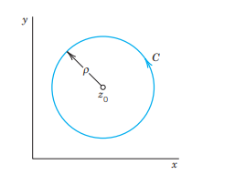{#fig-14-04}

**Solution.** We may represent $C$ in the form
$$
z(t) = z_0 + \rho(\cos t + i \sin t) = z_0 + \rho e^{it} \quad (0 \le t \le 2\pi).
$$
Then we have
$$
(z - z_0)^m = \rho^m e^{imt}, \quad dz = i \rho e^{it} \, dt
$$
and obtain
$$
\oint_C (z - z_0)^m \, dz = \int_0^{2\pi} \rho^m e^{imt} i \rho e^{it} \, dt = i \rho^{m+1} \int_0^{2\pi} e^{i(m+1)t} \, dt.
$$
By the Euler formula (5) in <!-- TODO: replace Sec. 13.6 with actual cross-reference label --> the right side equals
$$
i \rho^{m+1} \left[ \int_0^{2\pi} \cos(m+1)t \, dt + i \int_0^{2\pi} \sin(m+1)t \, dt \right].
$$
If $m = -1$, we have $\rho^{m+1} = 1$, $\cos 0 = 1$, $\sin 0 = 0$. We thus obtain $2\pi i$. For integer $m \neq -1$ each of the two integrals is zero because we integrate over an interval of length $2\pi$, equal to a period of sine and cosine. Hence the result is
$$
\oint_C (z - z_0)^m \, dz = \begin{cases} 2\pi i & (m = -1), \\ 0 & (m \neq -1 \text{ and integer}). \end{cases}
$$ {#eq-14-1-12}

**Dependence on path.** Now comes a very important fact. If we integrate a given function $f(z)$ from a point $z_0$ to a point $z_1$ along different paths, the integrals will in general have different values. In other words, a complex line integral depends not only on the endpoints of the path but in general also on the path itself. The next example gives a first impression of this, and a systematic discussion follows in the next section.

### EXAMPLE 7 Integral of a Nonanalytic Function. Dependence on Path
Integrate $f(z) = \text{Re } z = x$ from 0 to $1 + 2i$ (a) along $C^*$ in @fig-14-05, (b) along $C$ consisting of $C_1$ and $C_2$.

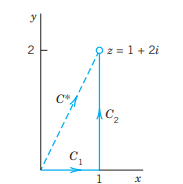{#fig-14-05}

**Solution.**  
(a) $C^*$ can be represented by $z(t) = t + 2it \quad (0 \le t \le 1)$. Hence $\dot{z}(t) = 1 + 2i$ and $f[z(t)] = x(t) = t$ on $C^*$. We now calculate
$$
\int_{C^*} \text{Re } z \, dz = \int_0^1 t(1 + 2i) \, dt = (1 + 2i) \left. \frac{t^2}{2} \right|_0^1 = \frac{1}{2} + i.
$$
(b) We now have
$$
C_1 : z(t) = t, \quad \dot{z}(t) = 1, \quad f(z(t)) = x(t) = t \quad (0 \le t \le 1)
$$
$$
C_2 : z(t) = 1 + it, \quad \dot{z}(t) = i, \quad f(z(t)) = x(t) = 1 \quad (0 \le t \le 2).
$$
Using @eq-14-1-6 we calculate
$$
\int_C \text{Re } z \, dz = \int_{C_1} \text{Re } z \, dz + \int_{C_2} \text{Re } z \, dz = \int_0^1 t \, dt + \int_0^2 1 \cdot i \, dt = \frac{1}{2} + 2i.
$$
Note that this result differs from the result in (a).

### Bounds for Integrals. ML-Inequality

There will be a frequent need for estimating the absolute value of complex line integrals. The basic formula is
$$
\left| \int_C f(z) \, dz \right| \le ML \quad \text{(ML-inequality)};
$$ {#eq-14-1-13}
$L$ is the length of $C$ and $M$ a constant such that $|f(z)| \le M$ everywhere on $C$.

**PROOF** Taking the absolute value in @eq-14-1-2 and applying the generalized inequality (6*) in <!-- TODO: replace Sec. 13.2 with actual cross-reference label -->, we obtain
$$
|S_n| = \left| \sum_{m=1}^n f(\zeta_m) \Delta z_m \right| \le \sum_{m=1}^n |f(\zeta_m)| |\Delta z_m| \le M \sum_{m=1}^n |\Delta z_m|.
$$
Now $|\Delta z_m|$ is the length of the chord whose endpoints are $z_{m-1}$ and $z_m$ (see @fig-14-02). Hence the sum on the right represents the length $L^*$ of the broken line of chords whose endpoints are $z_0, z_1, \dots, z_n \ (= Z)$. If $n$ approaches infinity in such a way that the greatest $|\Delta t_m|$ and thus $|\Delta z_m|$ approach zero, then $L^*$ approaches the length $L$ of the curve $C$, by the definition of the length of a curve. From this the inequality @eq-14-1-13 follows. $\square$

We cannot see from @eq-14-1-13 how close to the bound $ML$ the actual absolute value of the integral is, but this will be no handicap in applying @eq-14-1-13. For the time being we explain the practical use of @eq-14-1-13 by a simple example.

### EXAMPLE 8 Estimation of an Integral
Find an upper bound for the absolute value of the integral
$$
\int_C z^2 \, dz, \quad C \text{ the straight-line segment from 0 to } 1+i \text{ (see @fig-14-06).}
$$

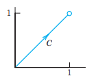{#fig-14-06}

**Solution.** $L = \sqrt{2}$ and $|f(z)| = |z^2| \le 2$ on $C$ gives by @eq-14-1-13
$$
\left| \int_C z^2 \, dz \right| \le 2\sqrt{2} \approx 2.8284.
$$
The absolute value of the integral is $|-2/3 + 2i/3| = \frac{2}{3}\sqrt{2} \approx 0.9428$ (see Example 1). $\square$

**Summary on Integration.** Line integrals of $f(z)$ can always be evaluated by @eq-14-1-10, using a representation @eq-14-1-1 of the path of integration. If $f(z)$ is analytic, indefinite integration by @eq-14-1-9 as in calculus will be simpler (proof in the next section).

## PROBLEM SET 14.1 {#sec-problem-set-14-1}

### 1–10 FIND THE PATH and sketch it.
1. $z(t) = (1 + i)t \quad (2 \le t \le 5)$
2. $z(t) = 3 + i - (1 - i)t \quad (0 \le t \le 3)$
3. $z(t) = t + 2it^2 \quad (1 \le t \le 2)$
4. $z(t) = t + (1 - t)^2 i \quad (-1 \le t \le 1)$
5. $z(t) = 3 - i + \frac{1}{10} e^{-it} \quad (0 \le t \le 2\pi)$
6. $z(t) = 1 + i + e^{-\pi i t} \quad (0 \le t \le 2)$
7. $z(t) = 2 + 4e^{\pi i t / 2} \quad (0 \le t \le 2)$
8. $z(t) = 5e^{-it} \quad (0 \le t \le \pi/2)$
9. $z(t) = t + it^3 \quad (-2 \le t \le 2)$
10. $z(t) = 2 \cos t + i \sin t \quad (0 \le t \le 2\pi)$

### 11–20 FIND A PARAMETRIC REPRESENTATION and sketch the path.
11. Segment from $(-1, 1)$ to $(1, 3)$
12. From $(0, 0)$ to $(2, 1)$ along the axes
13. Upper half of $|z - 2 + i| = 2$ from $(4, -1)$ to $(0, -1)$
14. Unit circle, clockwise
15. $x^2 - 4y^2 = 4$, the branch through $(2, 0)$ clockwise
16. Ellipse $4x^2 + 9y^2 = 36$, counterclockwise
17. $|z - a - ib| = r$, clockwise
18. $y = 1/x$ from $(1, 1)$ to $(5, 1/5)$
19. Parabola $y = 1 - \frac{1}{4} x^2 \quad (-2 \le x \le 2)$
20. $4(x-2)^2 + 5(y+1)^2 = 20$

### 21–30 INTEGRATION
Integrate by the first method or state why it does not apply and use the second method. Show the details.
21. $\int_C \text{Re } z \, dz$, $C$ the shortest path from $1 + i$ to $3 + 3i$
22. $\int_C \text{Re } z \, dz$, $C$ the parabola $y = 1 + \frac{1}{2}(x - 1)^2$ from $1 + i$ to $3 + 3i$
23. $\int_C e^z \, dz$, $C$ the shortest path from $\pi i$ to $2\pi i$
24. $\int_C \cos 2z \, dz$, $C$ the semicircle $|z| = \pi, x \ge 0$ from $-\pi i$ to $\pi i$
25. $\int_C z \exp(z^2) \, dz$, $C$ from 1 along the axes to $i$
26. $\int_C (z + z^{-1}) \, dz$, $C$ the unit circle, counterclockwise
27. $\int_C \sec^2 z \, dz$, any path from $-\pi/4$ to $\pi/4$
28. $\int_C \left( \frac{5}{z - 2i} - \frac{6}{(z - 2i)^2} \right) \, dz$, $C$ the circle $|z - 2i| = 4$, counterclockwise
29. $\oint_C \text{Im } z^2 \, dz$ counterclockwise around the triangle with vertices 0, 1, $i$
30. $\oint_C \text{Re } z^2 \, dz$ clockwise around the boundary of the square with vertices 0, $i$, $1 + i$, 1

### 31–35
31. **CAS PROJECT. Integration.** Write programs for the two integration methods. Apply them to problems of your choice. Could you make them into a joint program that also decides which of the two methods to use in a given case?
32. **Sense reversal.** Verify @eq-14-1-5 for $f(z) = z^2$, where $C$ is the segment from $-1 - i$ to $1 + i$.
33. **Path partitioning.** Verify @eq-14-1-6 for $f(z) = 1/z$ and $C_1$ and $C_2$ the upper and lower halves of the unit circle.
34. **TEAM EXPERIMENT. Integration.**  
    (a) **Comparison.** First write a short report comparing the essential points of the two integration methods.  
    (b) **Comparison.** Evaluate $\int_C f(z) \, dz$ by Theorem 1 and check the result by Theorem 2, where:  
        (i) $f(z) = z^4$ and $C$ is the semicircle $|z| = 2$ from $-2i$ to $2i$ in the right half-plane,  
        (ii) $f(z) = e^{2z}$ and $C$ is the shortest path from 0 to $1 + 2i$.  
    (c) **Continuous deformation of path.** Experiment with a family of paths with common endpoints, say, $z(t) = t + i a \sin t, \ 0 \le t \le \pi$, with real parameter $a$. Integrate nonanalytic functions ($\text{Re } z$, $\text{Re}(z^2)$, etc.) and explore how the result depends on $a$. Then take analytic functions of your choice. (Show the details of your work.) Compare and comment.  
    (d) **Continuous deformation of path.** Choose another family, for example, semi-ellipses $z(t) = a \cos t + i \sin t, \ -\pi/2 \le t \le \pi/2$, and experiment as in (c).
35. **ML-inequality.** Find an upper bound of the absolute value of the integral in Prob. 21.

## Cauchy’s Integral Theorem {#sec-cauchy-integral-theorem}

This section is the focal point of the chapter. We have just seen in @sec-line-integral that a line integral of a function $f(z)$ generally depends not merely on the endpoints of the path, but also on the choice of the path itself. This dependence often complicates situations. Hence conditions under which this does not occur are of considerable importance. Namely, if $f(z)$ is analytic in a domain $D$ and $D$ is simply connected (see @sec-line-integral and also below), then the integral will not depend on the choice of a path between given points. This result (Theorem 2) follows from Cauchy’s integral theorem, along with other basic consequences that make Cauchy’s integral theorem the most important theorem in this chapter and fundamental throughout complex analysis.

Let us continue our discussion of simple connectedness which we started in @sec-line-integral.

1. **A simple closed path** is a closed path (defined in @sec-line-integral) that does not intersect or touch itself as shown in @fig-14-07. For example, a circle is simple, but a curve shaped like an 8 is not simple.

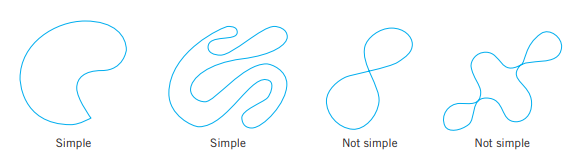{#fig-14-07}

2. **A simply connected domain** $D$ in the complex plane is a domain (<!-- TODO: replace Sec. 13.3 with actual cross-reference label -->) such that every simple closed path in $D$ encloses only points of $D$. Examples: The interior of a circle ("open disk"), ellipse, or any simple closed curve. A domain that is not simply connected is called **multiply connected**. Examples: An annulus (<!-- TODO: replace Sec. 13.3 with actual cross-reference label -->), a disk without the center, for example, $0 < |z| < 1$. See also @fig-14-08.

More precisely, a bounded domain $D$ (that is, a domain that lies entirely in some circle about the origin) is called **$p$-fold connected** if its boundary consists of $p$ closed connected sets without common points. These sets can be curves, segments, or single points (such as $z = 0$ for $0 < |z| < 1$, for which $p = 2$). Thus, $D$ has $p - 1$ "holes," where "hole" may also mean a segment or even a single point. Hence an annulus is doubly connected ($p = 2$).

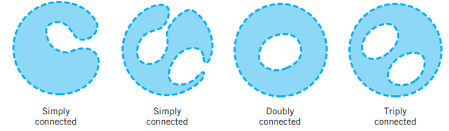{#fig-14-08}

### THEOREM 1 Cauchy’s Integral Theorem
If $f(z)$ is analytic in a simply connected domain $D$, then for every simple closed path $C$ in $D$,
$$
\oint_C f(z) \, dz = 0.
$$ {#eq-14-2-1}
See @fig-14-09.

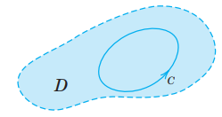{#fig-14-09}

Before we prove the theorem, let us consider some examples in order to really understand what is going on. A simple closed path is sometimes called a **contour** and an integral over such a path a **contour integral**. Thus, @eq-14-2-1 and our examples involve contour integrals.

### EXAMPLE 1 Entire Functions
$$
\oint_C e^z \, dz = 0, \quad \oint_C \cos z \, dz = 0, \quad \oint_C z^n \, dz = 0 \quad (n = 0, 1, \dots)
$$
for any closed path, since these functions are entire (analytic for all $z$).

### EXAMPLE 2 Points Outside the Contour Where $f(z)$ is Not Analytic
$$
\oint_C \sec z \, dz = 0, \quad \oint_C \frac{dz}{z^2 + 4} = 0
$$
where $C$ is the unit circle. $\sec z = 1/\cos z$ is not analytic at $z = \pm\pi/2, \pm3\pi/2, \dots$, but all these points lie outside $C$; none lies on $C$ or inside $C$. Similarly for the second integral, whose integrand is not analytic at $z = \pm 2i$ outside $C$. $\square$

### EXAMPLE 3 Nonanalytic Function
$$
\oint_C \bar{z} \, dz = \int_0^{2\pi} e^{-it} i e^{it} \, dt = 2\pi i
$$
where $C: z(t) = e^{it}$ is the unit circle. This does not contradict Cauchy’s theorem because $f(z) = \bar{z}$ is not analytic. $\square$

### EXAMPLE 4 Analyticity Sufficient, Not Necessary
$$
\oint_C \frac{dz}{z^2} = 0
$$
where $C$ is the unit circle. This result does not follow from Cauchy’s theorem, because $f(z) = 1/z^2$ is not analytic at $z = 0$. Hence the condition that $f$ be analytic in $D$ is sufficient rather than necessary for @eq-14-2-1 to be true. $\square$

### EXAMPLE 5 Simple Connectedness Essential
$$
\oint_C \frac{dz}{z} = 2\pi i
$$
for counterclockwise integration around the unit circle (see @sec-line-integral). $C$ lies in the annulus $1/2 < |z| < 3/2$ where $1/z$ is analytic, but this domain is not simply connected, so that Cauchy’s theorem cannot be applied. Hence the condition that the domain $D$ be simply connected is essential.

In other words, by Cauchy’s theorem, if $f(z)$ is analytic on a simple closed path $C$ and everywhere inside $C$, with no exception, not even a single point, then @eq-14-2-1 holds. The point that causes trouble here is $z = 0$ where $1/z$ is not analytic. $\square$

**PROOF** Cauchy proved his integral theorem under the additional assumption that the derivative $f'(z)$ is continuous (which is true, but would need an extra proof). His proof proceeds as follows. From @eq-14-1-8 in @sec-line-integral we have
$$
\oint_C f(z) \, dz = \oint_C (u \, dx - v \, dy) + i \oint_C (u \, dy + v \, dx).
$$
Since $f(z)$ is analytic in $D$, its derivative $f'(z)$ exists in $D$. Since $f'(z)$ is assumed to be continuous, (4) and (5) in <!-- TODO: replace Sec. 13.4 with actual cross-reference label --> imply that $u$ and $v$ have continuous partial derivatives in $D$. Hence Green’s theorem (<!-- TODO: replace Sec. 10.4 with actual cross-reference label -->) (with $u$ and $-v$ instead of $F_1$ and $F_2$) is applicable and gives
$$
\oint_C (u \, dx - v \, dy) = \iint_R \left( -\frac{\partial v}{\partial x} - \frac{\partial u}{\partial y} \right) \, dx \, dy
$$
where $R$ is the region bounded by $C$. The second Cauchy–Riemann equation (<!-- TODO: replace Sec. 13.4 with actual cross-reference label -->) shows that the integrand on the right is identically zero. Hence the integral on the left is zero. In the same fashion it follows by the use of the first Cauchy–Riemann equation that the last integral in the above formula is zero. This completes Cauchy’s proof. $\square$

Goursat’s proof without the condition that $f'(z)$ is continuous[^1] is much more complicated. We leave it optional and include it in App. 4.

[^1]: ÉDOUARD GOURSAT (1858–1936), French mathematician who made important contributions to complex analysis and PDEs. Cauchy published the theorem in 1825. The removal of that condition by Goursat (see *Transactions Amer. Math. Soc.*, vol. 1, 1900) is quite important because, for instance, derivatives of analytic functions are also analytic. Because of this, Cauchy’s integral theorem is also called the Cauchy–Goursat theorem.

### Independence of Path

We know from the preceding section that the value of a line integral of a given function $f(z)$ from a point $z_0$ to a point $z_1$ will in general depend on the path $C$ over which we integrate, not merely on $z_0$ and $z_1$. It is important to characterize situations in which this difficulty of path dependence does not occur. This task suggests the following concept.

We call an integral of $f(z)$ **independent of path** in a domain $D$ if for every $z_0, z_1$ in $D$ its value depends (besides on $f(z)$, of course) only on the initial point $z_0$ and the terminal point $z_1$, but not on the choice of the path $C$ in $D$ [so that every path in $D$ from $z_0$ to $z_1$ gives the same value of the integral of $f(z)$].

### THEOREM 2 Independence of Path
If $f(z)$ is analytic in a simply connected domain $D$, then the integral of $f(z)$ is independent of path in $D$.

**PROOF** Let $z_0$ and $z_1$ be any points in $D$. Consider two paths $C_1$ and $C_2$ in $D$ from $z_0$ to $z_1$ without further common points, as in @fig-14-10. Denote by $C_2^*$ the path $C_2$ with the orientation reversed (see @fig-14-11). Integrate from $z_0$ over $C_1$ to $z_1$ and over $C_2^*$ back to $z_0$. This is a simple closed path, and Cauchy’s theorem applies under our assumptions of the present theorem and gives zero:
$$
\int_{C_1} f \, dz + \int_{C_2^*} f \, dz = 0, \quad \text{thus} \quad \int_{C_1} f \, dz = -\int_{C_2^*} f \, dz.
$$
But the minus sign on the right disappears if we integrate in the reverse direction, from $z_0$ to $z_1$, which shows that the integrals of $f(z)$ over $C_1$ and $C_2$ are equal,
$$
\int_{C_1} f(z) \, dz = \int_{C_2} f(z) \, dz
$$ {#eq-14-2-2}
(see @fig-14-10). This proves the theorem for paths that have only the endpoints in common. For paths that have finitely many further common points, apply the present argument to each “loop” (portions of $C_1$ and $C_2$ between consecutive common points; four loops in @fig-14-12). For paths with infinitely many common points we would need additional argumentation not to be presented here. $\square$

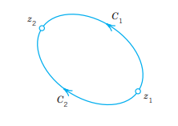{#fig-14-10}

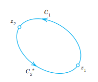{#fig-14-11}

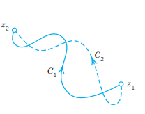{#fig-14-12}

### Principle of Deformation of Path

This idea is related to path independence. We may imagine that the path $C_2$ in @eq-14-2-2 was obtained from $C_1$ by continuously moving $C_1$ (with ends fixed!) until it coincides with $C_2$. @fig-14-13 shows two of the infinitely many intermediate paths for which the integral always retains its value (because of Theorem 2). Hence we may impose a continuous deformation of the path of an integral, keeping the ends fixed. As long as our deforming path always contains only points at which $f(z)$ is analytic, the integral retains the same value. This is called the **principle of deformation of path**.

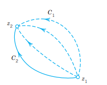{#fig-14-13}

### EXAMPLE 6 A Basic Result: Integral of Integer Powers
From Example 6 in @sec-line-integral and the principle of deformation of path it follows that
$$
\oint_C (z - z_0)^m \, dz = \begin{cases} 2\pi i & (m = -1), \\ 0 & (m \neq -1 \text{ and integer}) \end{cases}
$$ {#eq-14-2-3}
for counterclockwise integration around any simple closed path $C$ containing $z_0$ in its interior. Indeed, the circle $|z - z_0| = \rho$ in Example 6 of @sec-line-integral can be continuously deformed in two steps into a path as just indicated, namely, by first deforming, say, one semicircle and then the other one. (Make a sketch). $\square$

### Existence of Indefinite Integral

We shall now justify our indefinite integration method in the preceding section [formula @eq-14-1-9 in @sec-line-integral]. The proof will need Cauchy’s integral theorem.

### THEOREM 3 Existence of Indefinite Integral
If $f(z)$ is analytic in a simply connected domain $D$, then there exists an indefinite integral $F(z)$ of $f(z)$ in $D$—thus, $F'(z) = f(z)$—which is analytic in $D$, and for all paths in $D$ joining any two points $z_0$ and $z_1$ in $D$, the integral of $f(z)$ from $z_0$ to $z_1$ can be evaluated by formula @eq-14-1-9 in @sec-line-integral.

**PROOF** The conditions of Cauchy’s integral theorem are satisfied. Hence the line integral of $f(z)$ from any $z_0$ in $D$ to any $z$ in $D$ is independent of path in $D$. We keep $z_0$ fixed. Then this integral becomes a function of $z$, call it $F(z)$,
$$
F(z) = \int_{z_0}^z f(z^*) \, dz^*
$$ {#eq-14-2-4}
which is uniquely determined. We show that this $F(z)$ is analytic in $D$ and $F'(z) = f(z)$. Using @eq-14-2-4 we form the difference quotient
$$
\frac{F(z + \Delta z) - F(z)}{\Delta z} = \frac{1}{\Delta z} \left[ \int_{z_0}^{z + \Delta z} f(z^*) \, dz^* - \int_{z_0}^z f(z^*) \, dz^* \right] = \frac{1}{\Delta z} \int_z^{z + \Delta z} f(z^*) \, dz^*.
$$ {#eq-14-2-5}
We now subtract $f(z)$ from @eq-14-2-5 and show that the resulting expression approaches zero as $\Delta z \to 0$. The details are as follows.

We keep $z$ fixed. Then we choose $z + \Delta z$ in $D$ so that the whole segment with endpoints $z$ and $z + \Delta z$ is in $D$ (see @fig-14-14). This can be done because $D$ is a domain, hence it contains a neighborhood of $z$. We use this segment as the path of integration in @eq-14-2-5. Now we subtract $f(z)$. This is a constant because $z$ is kept fixed. Hence we can write
$$
\frac{1}{\Delta z} \int_z^{z + \Delta z} f(z) \, dz^* = \frac{f(z)}{\Delta z} \int_z^{z + \Delta z} \, dz^* = \frac{f(z)}{\Delta z} \Delta z = f(z).
$$
Thus
$$
f(z) = \frac{1}{\Delta z} \int_z^{z + \Delta z} f(z) \, dz^*.
$$
By this trick and from @eq-14-2-5 we get a single integral:
$$
\frac{F(z + \Delta z) - F(z)}{\Delta z} - f(z) = \frac{1}{\Delta z} \int_z^{z + \Delta z} [f(z^*) - f(z)] \, dz^*.
$$
Since $f(z)$ is analytic, it is continuous (see Team Project (24d) in <!-- TODO: replace Sec. 13.3 with actual cross-reference label -->). An $\epsilon > 0$ being given, we can thus find a $\delta > 0$ such that $|f(z^*) - f(z)| < \epsilon$ when $|z^* - z| < \delta$. Hence, letting $|\Delta z| < \delta$, we see that the ML-inequality (@sec-line-integral) yields
$$
\left| \frac{F(z + \Delta z) - F(z)}{\Delta z} - f(z) \right| = \left| \frac{1}{\Delta z} \int_z^{z + \Delta z} [f(z^*) - f(z)] \, dz^* \right| \le \frac{1}{|\Delta z|} \epsilon |\Delta z| = \epsilon.
$$
By the definition of limit and derivative, this proves that
$$
F'(z) = \lim_{\Delta z \to 0} \frac{F(z + \Delta z) - F(z)}{\Delta z} = f(z).
$$
Since $z$ is any point in $D$, this implies that $F(z)$ is analytic in $D$ and is an indefinite integral or antiderivative of $f(z)$ in $D$, written
$$
F(z) = \int f(z) \, dz.
$$

The relationship between $F(z)$ and any other indefinite integral $G(z)$ of $f(z)$ is as in real calculus: $G(z) = F(z) + C$, where $C$ is a constant. (Prove it). This follows because their difference has a derivative that is identically zero, which implies that it must be a constant. (See Example 3 in <!-- TODO: replace Sec. 13.4 with actual cross-reference label -->).

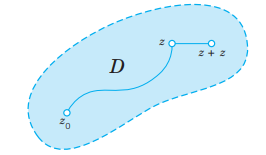{#fig-14-14}

### Cauchy’s Theorem for Multiply Connected Domains

Cauchy’s theorem applies to multiply connected domains. We first explain this for a doubly connected domain $D$ with outer boundary curve $C_1$ and inner $C_2$ (see @fig-14-15). If a function $f(z)$ is analytic in any domain $D^*$ that contains $D$ and its boundary curves, we claim that
$$
\oint_{C_1} f(z) \, dz = \oint_{C_2} f(z) \, dz
$$ {#eq-14-2-6}
both integrals being taken counterclockwise (or both clockwise, and regardless of whether the boundary curves are simple or not, though we assume them to be simple for convenience).

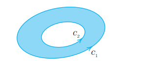{#fig-14-15}

**PROOF** By two cuts $C_a$ and $C_b$ (see @fig-14-16) we cut $D$ into two simply connected domains $D_1$ and $D_2$ in which and on whose boundaries $f(z)$ is analytic. By Cauchy’s integral theorem the integral over the entire boundary of $D_1$ (taken in the sense of the arrows in @fig-14-16) is zero, and so is the integral over the boundary of $D_2$, and thus their sum. In this sum the integrals over the cuts $C_a$ and $C_b$ are taken twice, but in opposite directions—this is the key—and we are left with the integrals over $C_1$ (counterclockwise) and $C_2$ (clockwise; see @fig-14-16); hence by reversing the integration over $C_2$ (to counterclockwise) we have
$$
\oint_{C_1} f \, dz - \oint_{C_2} f \, dz = 0,
$$
which is @eq-14-2-6. $\square$

For domains of higher connectivity the idea remains the same. Thus, for a triply connected domain we use three cuts $C_a, C_b, C_c$ (see @fig-14-17). Adding integrals as before, the integrals over the cuts cancel and the sum of the integrals over $C_1$ (counterclockwise) and $C_2, C_3$ (clockwise) is zero. Reversing the orientation of $C_2, C_3$ to counterclockwise, we obtain:
$$
\oint_{C_1} f(z) \, dz = \oint_{C_2} f(z) \, dz + \oint_{C_3} f(z) \, dz.
$$ {#eq-14-2-7}

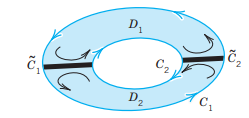{#fig-14-16}

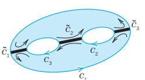{#fig-14-17}

## PROBLEM SET 14.2 {#sec-problem-set-14-2}

### 1–8 COMMENTS ON TEXT AND EXAMPLES
1. **Deformation range.** Find the edit range of the path of integration in Example 5 (unit circle) for which the value of the integral is still $2\pi i$.
2. **Deformation range.** For what boundaries of the region of analyticity of the integrand is the value of the integral in Example 6 still $2\pi i$? For $m \neq -1$?
3. **Cauchy-Goursat proof.** What assumptions are omitted in Goursat's proof? Why is this important?
4. **Simply connected domain.** Is the domain $D: 1 < |z| < 3$ simply connected? Give reason.
5. **Path independence.** Under what conditions is a complex line integral independent of path?
6. **Morera's Theorem.** What is the converse of Cauchy's integral theorem?
7. **Liouville's Theorem.** What entire functions are bounded?
8. **Summary.** In your own words, summarize Cauchy's integral theorem and its consequences.

### 9–20 CAUCHY’S THEOREM APPLICABLE?
Integrate $f(z)$ counterclockwise around the unit circle. State whether Cauchy’s theorem applies. Show the details.
9. $f(z) = e^{-z^2}$
10. $f(z) = \tan z$
11. $f(z) = 1/(2z - 1)$
12. $f(z) = \bar{z}^3$
13. $f(z) = 1/(z^4 - 1.2)$
14. $f(z) = 1/z$
15. $f(z) = 1/\bar{z}$
16. $f(z) = \text{Im } z$
17. $f(z) = 1/(z^2 - 9)$
18. $f(z) = z^3 \cot z$
19. $f(z) = 1/(z^2 + 0.5)$
20. $f(z) = z^2 \sec z$

### 21–30 CONTOUR INTEGRATION
Integrate counterclockwise around the boundary of the region $D$ (where $D$ is the domain bounded by the given curves).
21. $f(z) = z/(z^2 - 1)$, boundary of the square with vertices $\pm 2, \pm 2i$
22. $f(z) = \text{Re } z$, boundary of the triangle with vertices 0, 1, $i$
23. $f(z) = 1/(z^2 - 4)$, boundary of the annulus $1 < |z| < 3$
24. $f(z) = 1/(z^2 - 4)$, boundary of the square with vertices $\pm 1, \pm i$
25. $f(z) = z^2 - 3iz$, boundary of the disk $|z - 3i| \le 2$
26. $f(z) = \cot z$, boundary of the square with vertices $\pm 1, \pm i$
27. $f(z) = 1/(z^2 + 1)$, boundary of the annulus $1.5 < |z| < 2.5$
28. $f(z) = z^2 \exp(-z)$, boundary of the unit disk $|z| \le 1$
29. $f(z) = \bar{z}$, boundary of the square with vertices 0, 1, $1+i$, $i$
30. $f(z) = 1/(z^2 + 2z)$, boundary of the disk $|z + 1| \le 1.5$

## Cauchy’s Integral Formula {#sec-cauchy-integral-formula}

The most important consequence of Cauchy's integral theorem is Cauchy’s integral formula. It expresses the value of an analytic function $f(z)$ at any point $z_0$ in a simply connected domain $D$ in terms of the values of $f(z)$ on a simple closed path $C$ in $D$ that encloses $z_0$. This is a very surprising result. It means that the values of an analytic function on the boundary of a domain determine the values of the function in the interior of the domain!

### THEOREM 1 Cauchy’s Integral Formula
Let $f(z)$ be analytic in a simply connected domain $D$, and let $C$ be a simple closed path in $D$, taken counterclockwise. Then for any point $z_0$ inside $C$,
$$
f(z_0) = \frac{1}{2\pi i} \oint_C \frac{f(z)}{z - z_0} \, dz
$$ {#eq-14-3-1}
or, written as a formula for evaluating contour integrals,
$$
\oint_C \frac{f(z)}{z - z_0} \, dz = 2\pi i f(z_0).
$$ {#eq-14-3-1star}
See @fig-14-18.

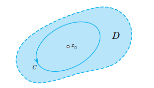{#fig-14-18}

**PROOF** By assumption, $f(z)$ is analytic in $D$. Hence the integrand $f(z)/(z - z_0)$ is analytic in $D$ except at $z_0$. By @eq-14-2-6 in @sec-cauchy-integral-theorem, we can replace $C$ by a small circle $K$ of radius $r$ and center $z_0$ (see @fig-14-19), without altering the value of the integral. Since $f(z)$ is analytic, it is continuous at $z_0$. Hence, an $\epsilon > 0$ being given, we can find a $\delta > 0$ such that $|f(z) - f(z_0)| < \epsilon$ for all $z$ in the disk $|z - z_0| < \delta$. We choose $r < \delta$. We can now write $f(z) = f(z_0) + [f(z) - f(z_0)]$. Substituting this into the integral over $K$, we obtain
$$
\oint_K \frac{f(z)}{z - z_0} \, dz = \oint_K \frac{f(z_0) + [f(z) - f(z_0)]}{z - z_0} \, dz = f(z_0) \oint_K \frac{dz}{z - z_0} + \oint_K \frac{f(z) - f(z_0)}{z - z_0} \, dz.
$$
The first term on the right equals $f(z_0) \cdot 2\pi i$, which follows from Example 6 in @sec-cauchy-integral-theorem. In the second term, $|f(z) - f(z_0)| < \epsilon$ at each point of $K$. The length of $K$ is $2\pi r$. Hence, by the ML-inequality in @sec-line-integral,
$$
\left| \oint_K \frac{f(z) - f(z_0)}{z - z_0} \, dz \right| \le \frac{\epsilon}{r} \cdot 2\pi r = 2\pi \epsilon.
$$
Since $\epsilon > 0$ was arbitrary, this integral must be zero. This proves (1). $\square$

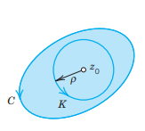{#fig-14-19}

### EXAMPLE 1 Cauchy’s Integral Formula
$$
\oint_C \frac{e^z}{z - 2} \, dz = \left. 2\pi i e^z \right|_{z=2} = 2\pi i e^2 \approx 46.4268i
$$
for any contour enclosing $z_0 = 2$ (counterclockwise). $\square$

### EXAMPLE 2 Cauchy’s Integral Formula
$$
\oint_C \frac{z^3 - 6}{2z - i} \, dz = \oint_C \frac{\frac{1}{2} z^3 - 3}{z - i/2} \, dz = \left. 2\pi i \left( \frac{1}{2} z^3 - 3 \right) \right|_{z=i/2} = 2\pi i \left( \frac{i}{16} - 3 \right) = -\frac{\pi}{8} - 6\pi i
$$
for any contour enclosing $z_0 = i/2$ (counterclockwise). $\square$

### EXAMPLE 3 Integration Around Different Contours
Integrate
$$
g(z) = \frac{z^2 + 1}{z^2 - 1} = \frac{z^2 + 1}{(z - 1)(z + 1)}
$$
counterclockwise around each of the four circles in @fig-14-20.

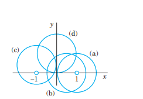{#fig-14-20}

**Solution.**  
(a) The circle $|z - 1| = 1$ encloses $z_0 = 1$ but not $z_0 = -1$. Hence the integrand is analytic except at $z_0 = 1$ in the disk. We write the integrand in the form
$$
g(z) = \frac{\frac{z^2 + 1}{z + 1}}{z - 1}.
$$
Thus $f(z) = (z^2 + 1)/(z + 1)$, which is analytic inside the contour. By (1) we obtain
$$
\oint_{C_1} g(z) \, dz = 2\pi i f(1) = 2\pi i \left. \frac{z^2 + 1}{z + 1} \right|_{z=1} = 2\pi i \cdot \frac{2}{2} = 2\pi i.
$$
(b) The circle $|z + 1| = 1$ encloses $z_0 = -1$ but not $z_0 = 1$. Hence we write
$$
g(z) = \frac{\frac{z^2 + 1}{z - 1}}{z + 1}.
$$
Thus $f(z) = (z^2 + 1)/(z - 1)$, which is analytic inside the contour. By (1) we obtain
$$
\oint_{C_2} g(z) \, dz = 2\pi i f(-1) = 2\pi i \left. \frac{z^2 + 1}{z - 1} \right|_{z=-1} = 2\pi i \cdot \frac{2}{-2} = -2\pi i.
$$
(c) The circle $|z| = 1/2$ encloses neither $z_0 = 1$ nor $z_0 = -1$. Hence the integrand is analytic inside and on the contour. By Cauchy’s integral theorem (@sec-cauchy-integral-theorem)
$$
\oint_{C_3} g(z) \, dz = 0.
$$
(d) The circle $|z| = 2$ encloses both $z_0 = 1$ and $z_0 = -1$. We can separate the singularities by partial fractions:
$$
g(z) = 1 + \frac{2}{z^2 - 1} = 1 + \frac{1}{z - 1} - \frac{1}{z + 1}.
$$
By linearity of integration
$$
\oint_{C_4} g(z) \, dz = \oint_{C_4} \, dz + \oint_{C_4} \frac{dz}{z - 1} - \oint_{C_4} \frac{dz}{z + 1} = 0 + 2\pi i - 2\pi i = 0.
$$
Can you verify this using @eq-14-2-6 in @sec-cauchy-integral-theorem? Yes, by deforming $C_4$ into two small circles around 1 and -1 (see @fig-14-21). $\square$

Multiply connected domains can be handled as in @sec-cauchy-integral-theorem. For instance, if $f(z)$ is analytic on $C_1$ and $C_2$ and in the ring-shaped domain bounded by $C_1$ and $C_2$ (see @fig-14-21) and $z_0$ is any point in this domain, then
$$
f(z_0) = \frac{1}{2\pi i} \oint_{C_1} \frac{f(z)}{z - z_0} \, dz - \frac{1}{2\pi i} \oint_{C_2} \frac{f(z)}{z - z_0} \, dz
$$ {#eq-14-3-3}
where both integrals are taken counterclockwise.

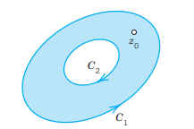{#fig-14-21}

## PROBLEM SET 14.3 {#sec-problem-set-14-3}

### 1–8 INTEGRATION
Evaluate the contour integral counterclockwise. Show the details.
1. $\oint_C \frac{\sin z}{z - \pi} \, dz$, $C$ the circle $|z| = 4$
2. $\oint_C \frac{z^2 - 1}{z^2 + 1} \, dz$, $C$ the circle $|z - i| = 1$
3. $\oint_C \frac{e^z}{z - 2i} \, dz$, $C$ the circle $|z| = 3$
4. $\oint_C \frac{\cos z}{z^2 - 1} \, dz$, $C$ the circle $|z - 1| = 1$
5. $\oint_C \frac{\tan z}{z - i/2} \, dz$, $C$ the boundary of the square with vertices $\pm 1, \pm i$
6. $\oint_C \frac{z^3 - 6}{2z - i} \, dz$, $C$ the boundary of the square with vertices $\pm 2, \pm 2i$
7. $\oint_C \frac{z^2 + 1}{z^2 - 1} \, dz$, $C$ the boundary of the square with vertices $\pm 1.5, \pm 1.5i$
8. $\oint_C \frac{e^z}{z^2 + 4} \, dz$, $C$ the circle $|z - 2i| = 1.5$

### 9–15 CONTOUR INTEGRATION
Evaluate the contour integral counterclockwise around the given contour.
9. $\oint_C \frac{\cos z}{z(z - 1)} \, dz$, $C$ the circle $|z| = 2$
10. $\oint_C \frac{z^2 + 1}{z(z - 1)} \, dz$, $C$ the circle $|z - 1| = 0.5$
11. $\oint_C \frac{\sin\pi z}{z^2 - 1} \, dz$, $C$ the circle $|z - 1| = 1$
12. $\oint_C \frac{\tan z}{z^2 - 1} \, dz$, $C$ the circle $|z - 1| = 0.5$
13. $\oint_C \frac{e^z}{z(z - 1)} \, dz$, $C$ the boundary of the square with vertices $\pm 2, \pm 2i$
14. $\oint_C \frac{4z^2 - 8iz}{z - 2i} \, dz$, $C$ the boundary of the square with vertices $\pm 2, \pm 2i$
15. $\oint_C \frac{e^{z^2}}{z(z - 2i)} \, dz$, $C$ the boundary of the square with vertices $\pm 1, \pm 2i$

### 16–20
16. **Cauchy's integral formula.** Prove @eq-14-3-1 by writing $f(z) = f(z_0) + (z - z_0)g(z)$, where $g(z)$ is analytic, enclosing $z_0$ by a small circle $K$ of radius $r$ (as in @fig-14-18) and taking the limit as $r \to 0$.
17. **Indefinite integration.** Show that the method in @sec-line-integral can be applied to the integral in Example 2.
18. **Continuous deformation.** Show that the integral in Example 2 is independent of the path of integration.
19. **Team Project.** Show that @eq-14-3-3 follows from Cauchy's integral theorem.
20. **Self-intersection.** If $C$ is a closed curve with a double point (self-intersection), say, like an 8, can we apply Cauchy's integral formula? Explain.

## Derivatives of Analytic Functions {#sec-derivatives-analytic-functions}

As another surprising consequence of Cauchy's integral formula, we shall now show that an analytic function has derivatives of all orders. This is a very important result, which has no analog in real calculus (where a function may have a first derivative but no second derivative, etc.).

### THEOREM 1 Derivatives of an Analytic Function
If $f(z)$ is analytic in a domain $D$, then it has derivatives of all orders in $D$, which are themselves analytic functions in $D$. The values of these derivatives at any point $z_0$ in $D$ are given by
$$
f'(z_0) = \frac{1}{2\pi i} \oint_C \frac{f(z)}{(z - z_0)^2} \, dz
$$ {#eq-14-4-1}
$$
f''(z_0) = \frac{2!}{2\pi i} \oint_C \frac{f(z)}{(z - z_0)^3} \, dz
$$ {#eq-14-4-2}
and in general
$$
f^{(n)}(z_0) = \frac{n!}{2\pi i} \oint_C \frac{f(z)}{(z - z_0)^{n+1}} \, dz \quad (n = 1, 2, \dots)
$$ {#eq-14-4-3}
where $C$ is any simple closed path in $D$ that encloses $z_0$ and whose interior belongs to $D$; and we integrate counterclockwise around $C$ (see @fig-14-22).

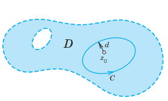{#fig-14-22}

**PROOF** We prove @eq-14-4-1 and leave the general proof by induction to the reader. By definition of the derivative,
$$
f'(z_0) = \lim_{\Delta z \to 0} \frac{f(z_0 + \Delta z) - f(z_0)}{\Delta z}.
$$
On the right we represent $f(z_0 + \Delta z)$ and $f(z_0)$ by Cauchy’s integral formula:
$$
\frac{f(z_0 + \Delta z) - f(z_0)}{\Delta z} = \frac{1}{2\pi i \Delta z} \left[ \oint_C \frac{f(z)}{z - (z_0 + \Delta z)} \, dz - \oint_C \frac{f(z)}{z - z_0} \, dz \right].
$$
Simplifying the difference in the bracket, we have:
$$
\frac{1}{z - z_0 - \Delta z} - \frac{1}{z - z_0} = \frac{(z - z_0) - (z - z_0 - \Delta z)}{(z - z_0 - \Delta z)(z - z_0)} = \frac{\Delta z}{(z - z_0 - \Delta z)(z - z_0)}.
$$
Hence the difference quotient is:
$$
\frac{f(z_0 + \Delta z) - f(z_0)}{\Delta z} = \frac{1}{2\pi i} \oint_C \frac{f(z)}{(z - z_0 - \Delta z)(z - z_0)} \, dz.
$$
Clearly, we can now establish @eq-14-4-1 by showing that, as $\Delta z \to 0$, the integral on the right approaches the integral in @eq-14-4-1, that is, the difference between these two integrals approaches zero:
$$
\oint_C \frac{f(z)}{(z - z_0 - \Delta z)(z - z_0)} \, dz - \oint_C \frac{f(z)}{(z - z_0)^2} \, dz = \oint_C f(z) \left[ \frac{1}{(z - z_0 - \Delta z)(z - z_0)} - \frac{1}{(z - z_0)^2} \right] \, dz.
$$
Simplifying the expression in the bracket, we have:
$$
\frac{1}{(z - z_0 - \Delta z)(z - z_0)} - \frac{1}{(z - z_0)^2} = \frac{(z - z_0) - (z - z_0 - \Delta z)}{(z - z_0 - \Delta z)(z - z_0)^2} = \frac{\Delta z}{(z - z_0 - \Delta z)(z - z_0)^2}.
$$
Hence the difference is:
$$
\oint_C \frac{f(z) \Delta z}{(z - z_0 - \Delta z)(z - z_0)^2} \, dz.
$$
We show by the ML-inequality (@sec-line-integral) that the integral on the right approaches zero as $\Delta z \to 0$. Since $f(z)$ is analytic on $C$ and $C$ is closed, $|f(z)|$ is bounded, say, $|f(z)| \le K$. Let $d$ be the smallest distance from $z_0$ to the points of $C$ (see @fig-14-22). Then for all $z$ on $C$ we have $|z - z_0| \ge d$, hence
$$
\frac{1}{|z - z_0|^2} \le \frac{1}{d^2}.
$$
By the triangle inequality,
$$
d \le |z - z_0| = |z - z_0 - \Delta z + \Delta z| \le |z - z_0 - \Delta z| + |\Delta z|.
$$
We now subtract $|\Delta z|$ on both sides and let $|\Delta z| \le d/2$, so that $-|\Delta z| \ge -d/2$. Then
$$
\frac{1}{2}d \le d - |\Delta z| \le |z - z_0 - \Delta z|. \quad \text{Hence} \quad \frac{1}{|z - z_0 - \Delta z|} \le \frac{2}{d}.
$$
Let $L$ be the length of $C$. If $|\Delta z| \le d/2$, then by the ML-inequality
$$
\left| \oint_C \frac{f(z) \Delta z}{(z - z_0 - \Delta z)(z - z_0)^2} \, dz \right| \le K L |\Delta z| \frac{2}{d} \frac{1}{d^2} = \frac{2 K L}{d^3} |\Delta z|.
$$
This approaches zero as $\Delta z \to 0$. Formula @eq-14-4-1 is proved. $\square$

Note that we used Cauchy’s integral formula @eq-14-3-1star, @sec-cauchy-integral-formula, but if all we had known about $f(z_0)$ is the fact that it can be represented by @eq-14-3-1star, @sec-cauchy-integral-formula, our argument would still have worked! This means that if a continuous function $f(z)$ can be represented by @eq-14-3-1star, @sec-cauchy-integral-formula, then it is analytic! We shall use this fact in proving Morera’s theorem.

### Applications of Theorem 1

### EXAMPLE 1 Evaluation of Line Integrals
$$
\oint_C \frac{\cos z}{(z - \pi i)^2} \, dz = \left. 2\pi i (\cos z)' \right|_{z=\pi i} = \left. 2\pi i (-\sin z) \right|_{z=\pi i} = 2\pi \sinh \pi \approx 72.33i
$$
for any contour enclosing $z_0 = \pi i$ (counterclockwise). $\square$

### EXAMPLE 2
For any contour enclosing the point $-i$ (counterclockwise), we obtain by @eq-14-4-2
$$
\oint_C \frac{z^4 - 3z^2 + 6}{(z + i)^3} \, dz = \left. \frac{2\pi i}{2!} (z^4 - 3z^2 + 6)'' \right|_{z=-i} = \left. \pi i (12z^2 - 6) \right|_{z=-i} = \pi i (-12 - 6) = -18\pi i.
$$

### EXAMPLE 3
For any contour for which 1 lies inside and $\pm 2i$ lie outside (counterclockwise),
$$
\oint_C \frac{e^z}{(z - 1)^2 (z^2 + 4)} \, dz = \left. 2\pi i \left( \frac{e^z}{z^2 + 4} \right)' \right|_{z=1} = \left. 2\pi i \left( \frac{e^z(z^2 + 4) - e^z(2z)}{(z^2 + 4)^2} \right) \right|_{z=1} = \frac{6e\pi i}{25} \approx 2.050i.
$$

### Cauchy’s Inequality. Liouville’s and Morera’s Theorems

We develop other general results about analytic functions, further showing the versatility of Cauchy’s integral theorem.

**Cauchy's Inequality.** Theorem 1 yields a basic inequality that has many applications. To get it, all we have to do is to choose for $C$ in @eq-14-4-3 a circle of radius $r$ and center $z_0$ and apply the ML-inequality (@sec-line-integral); with $|f(z)| \le M$ on $C$ we obtain from @eq-14-4-3
$$
|f^{(n)}(z_0)| = \frac{n!}{2\pi} \left| \oint_C \frac{f(z)}{(z - z_0)^{n+1}} \, dz \right| \le \frac{n!}{2\pi} \frac{M}{r^{n+1}} 2\pi r = \frac{n! M}{r^n}.
$$
This gives **Cauchy’s inequality**
$$
|f^{(n)}(z_0)| \le \frac{n! M}{r^n}.
$$ {#eq-14-4-4}

To gain a first impression of the importance of this inequality, let us prove a famous theorem on entire functions (definition in <!-- TODO: replace Sec. 13.5 with actual cross-reference label -->).

### THEOREM 2 Liouville’s Theorem
If an entire function is bounded in absolute value in the whole complex plane, then this function must be a constant.

**PROOF** By assumption, $|f(z)| \le K$ for all $z$. Using @eq-14-4-4 with $n = 1$, we see that $|f'(z_0)| \le K/r$. Since $f(z)$ is entire, this holds for every $r$, so that we can take $r$ as large as we please and conclude that $f'(z_0) = 0$. Since $z_0$ is arbitrary, $f'(z) = u_x + i v_x = 0$ for all $z$ (see (4) in <!-- TODO: replace Sec. 13.4 with actual cross-reference label -->), hence $u_x = v_x = 0$, and $u_y = v_y = 0$ by the Cauchy–Riemann equations. Thus $u = \text{const}$, $v = \text{const}$, and $f = u + iv = \text{const}$ for all $z$. This completes the proof. $\square$

Another very interesting consequence of Theorem 1 is the converse of Cauchy’s integral theorem:

### THEOREM 3 Morera’s Theorem (Converse of Cauchy’s Integral Theorem) [^2]
If $f(z)$ is continuous in a simply connected domain $D$ and if
$$
\oint_C f(z) \, dz = 0
$$ {#eq-14-4-5}
for every closed path $C$ in $D$, then $f(z)$ is analytic in $D$.

**PROOF** In @sec-cauchy-integral-theorem we showed that if $f(z)$ is analytic in a simply connected domain $D$, then
$$
F(z) = \int_{z_0}^z f(z^*) \, dz^*
$$
is analytic in $D$ and $F'(z) = f(z)$. In the proof we used only the continuity of $f(z)$ and the property that its integral around every closed path in $D$ is zero; from these assumptions we proved that $F(z)$ is analytic in $D$ and $F'(z) = f(z)$. Now, by Theorem 1 of the present section, the derivative of an analytic function is itself analytic. Hence $F'(z) = f(z)$ is analytic in $D$. This completes the proof. $\square$

[^2]: GIACINTO MORERA (1856–1909), Italian mathematician who made important contributions to elasticity and complex analysis.

## PROBLEM SET 14.4 {#sec-problem-set-14-4}

### 1–8 EVALUATION OF INTEGRALS
Integrate counterclockwise around the circle $|z| = 2$. Show the details.
1. $\oint_C \frac{\sin 3z}{(z - \pi/4)^3} \, dz$
2. $\oint_C \frac{ze^{iz}}{(z - i)^4} \, dz$
3. $\oint_C \frac{\cosh z}{z^{n+1}} \, dz \quad (n = 1, 2, \dots)$
4. $\oint_C \frac{\sin z}{z^4} \, dz$
5. $\oint_C \frac{z^3 \cos z}{(z - 1)^2} \, dz$
6. $\oint_C \frac{e^z \cos z}{(z - 0.5)^2} \, dz$
7. $\oint_C \frac{1}{(z - i)^2 (z + i)} \, dz$
8. $\oint_C \frac{\text{Ln}(z - 1)}{z^2} \, dz$ (use Principal Branch)

### 9–19 CONTOUR INTEGRATION
Evaluate the contour integral counterclockwise around the given contour.
9. $\oint_C \frac{z^6}{(2z - 1)^6} \, dz$, $C$ the unit circle
10. $\oint_C \frac{z^3 + \sin z}{(z - i)^3} \, dz$, $C$ the boundary of the square with vertices $\pm 2, \pm 2i$
11. $\oint_C \frac{(1 + z)\sin z}{(2z - 1)^2} \, dz$, $C: |z - i| = 2$
12. $\oint_C \frac{\exp(z^2)}{z(z - 2i)^2} \, dz$, $C: |z - 3i| = 2$ clockwise
13. $\oint_C \frac{\text{Ln } z}{(z - 2)^2} \, dz$, $C: |z - 3| = 2$
14. $\oint_C \frac{\text{Ln }(z + 3)}{(z - 2)(z + 1)^2} \, dz$, $C$ the boundary of the square with vertices $\pm 1.5, \pm 1.5i$
15. $\oint_C \frac{\cosh 4z}{(z - 4)^3} \, dz$, $C$ consists of $|z| = 6$ counterclockwise and $|z - 3| = 2$ clockwise
16. $\oint_C \frac{e^{4z}}{z(z - 2i)^2} \, dz$, $C$ consists of $|z - i| = 3$ counterclockwise and $|z| = 1$ clockwise
17. $\oint_C \frac{e^{-z}\sin z}{(z - 4)^3} \, dz$, $C$ consists of $|z| = 5$ counterclockwise and $|z - 3| = 3$ clockwise
18. $\oint_C \frac{\sinh z}{z^n} \, dz$, $C: |z| = 1$ counterclockwise, $n$ integer
19. $\oint_C \frac{e^{3z}}{(4z - \pi i)^3} \, dz$, $C: |z| = 1$, counterclockwise

### TEAM PROJECT. Theory on Growth
(a) **Growth of entire functions.** If $f(z)$ is not a constant and is analytic for all (finite) $z$, and $R$ and $M$ are any positive real numbers (no matter how large), show that there exist values of $z$ for which $|z| > R$ and $|f(z)| > M$. *Hint.* Use Liouville’s theorem.  
(b) **Growth of polynomials.** If $f(z)$ is a polynomial in $z$ of degree $n > 0$ and $M$ is an arbitrary positive real number (no matter how large), show that there exists a positive real number $R$ such that $|f(z)| > M$ for all $|z| > R$.  
(c) **Exponential function.** Show that $f(z) = e^z$ has the property characterized in (a) but does not have that characterized in (b).  
(d) **Fundamental theorem of algebra.** If $f(z)$ is a polynomial in $z$, not a constant, then $f(z) = 0$ for at least one value of $z$. Prove this. *Hint.* Use (a).

## CHAPTER 14 REVIEW QUESTIONS AND PROBLEMS {#sec-chapter-14-review-questions-and-problems}

1. What is a parametric representation of a curve? What is its advantage?
2. What did we assume about paths of integration $z = z(t)$? What is $\dot{z} = dz/dt$ geometrically?
3. State the definition of a complex line integral from memory.
4. Can you remember the relationship between complex and real line integrals discussed in this chapter?
5. How can you evaluate a line integral of an analytic function? Of an arbitrary continuous complex function?
6. What value do you get by counterclockwise integration of $1/z$ around the unit circle? You should remember this. It is basic.
7. Which theorem in this chapter do you regard as most important? State it precisely from memory.
8. What is independence of path? Its importance? State a basic theorem on independence of path in complex.
9. What is deformation of path? Give a typical example.
10. Don’t confuse Cauchy’s integral theorem (also known as Cauchy–Goursat theorem) and Cauchy’s integral formula. State both. How are they related?
11. What is a doubly connected domain? How can you extend Cauchy’s integral theorem to it?
12. What do you know about derivatives of analytic functions?
13. How did we use integral formulas for derivatives in evaluating integrals?
14. How does the situation for analytic functions differ with respect to derivatives from that in calculus?
15. What is Liouville’s theorem? To what complex functions does it apply?
16. What is Morera’s theorem?
17. If the integrals of a function $f(z)$ over each of the two boundary circles of an annulus $D$ taken in the same sense have different values, can $f(z)$ be analytic everywhere in $D$? Give reason.
18. Is $\text{Im} \oint_C f(z) \, dz = \oint_C \text{Im } f(z) \, dz$? Give reason.
19. Is $\left| \oint_C f(z) \, dz \right| = \oint_C |f(z)| \, dz$?
20. How would you find a bound for the left side in Prob. 19?

### 21–30 INTEGRATION
Integrate by a suitable method.
21. $\int_C z \sinh(z^2) \, dz$ from $0$ to $\pi i/2$.
22. $\oint_C (|z| + z) \, dz$ clockwise around the unit circle.
23. $\oint_C \frac{5e^z}{z} \, dz$ counterclockwise around $|z| = \pi$.
24. $\int_C \text{Re } z \, dz$ from $0$ to $3 + 27i$ along $y = x^3$.
25. $\oint_C \frac{\tan \pi z}{(z - 1)^2} \, dz$ clockwise around $|z - 1| = 0.1$.
26. $\int_C (z^2 + \bar{z}^2) \, dz$ from $z = 0$ horizontally to $z = 2$, then vertically upward to $2 + 2i$.
27. $\int_C (z^2 + \bar{z}^2) \, dz$ from $0$ to $2 + 2i$, shortest path.
28. $\oint_C \frac{\text{Ln } z}{(z - 2i)^2} \, dz$ counterclockwise around $|z - 1| = 1/2$.
29. $\oint_C \left[ \frac{2}{z - 2i} - \frac{1}{z - 4i} \right] \, dz$ clockwise around $|z - 1| = 2.5$.
30. $\int_C \sin z \, dz$ from 0 to $(1 + i)$.

## SUMMARY OF CHAPTER 14 {#sec-summary-of-chapter-14}

### Complex Integration
The complex line integral of a function $f(z)$ taken over a path $C$ is denoted by
$$
\int_C f(z) \, dz \quad \text{or, if $C$ is closed, also by} \quad \oint_C f(z) \, dz
$$ {#eq-sum-1}
(@sec-line-integral).

If $f(z)$ is analytic in a simply connected domain $D$, then we can evaluate @eq-sum-1 as in calculus by indefinite integration and substitution of limits, that is,
$$
\int_C f(z) \, dz = F(z_1) - F(z_0) \quad [F'(z) = f(z)]
$$ {#eq-sum-2}
for every path $C$ in $D$ from a point $z_0$ to a point $z_1$ (see @sec-line-integral). These assumptions imply independence of path, that is, @eq-sum-2 depends only on $z_0$ and $z_1$ (and on $f(z)$, of course) but not on the choice of $C$ (@sec-cauchy-integral-theorem). The existence of an $F(z)$ such that $F'(z) = f(z)$ is proved in @sec-cauchy-integral-theorem by Cauchy’s integral theorem (see below).

A general method of integration, not restricted to analytic functions, uses the equation $z = z(t)$ of $C$, where $a \le t \le b$,
$$
\int_C f(z) \, dz = \int_a^b f(z(t)) \dot{z}(t) \, dt \quad \left( \dot{z} = \frac{dz}{dt} \right).
$$ {#eq-sum-3}

**Cauchy’s integral theorem** is the most important theorem in this chapter. It states that if $f(z)$ is analytic in a simply connected domain $D$, then for every closed path $C$ in $D$ (@sec-cauchy-integral-theorem),
$$
\oint_C f(z) \, dz = 0.
$$ {#eq-sum-4}

Under the same assumptions and for any $z_0$ in $D$ and closed path $C$ in $D$ containing $z_0$ in its interior we also have **Cauchy’s integral formula**
$$
f(z_0) = \frac{1}{2\pi i} \oint_C \frac{f(z)}{z - z_0} \, dz.
$$ {#eq-sum-5}

Furthermore, under these assumptions $f(z)$ has derivatives of all orders in $D$ that are themselves analytic functions in $D$ and (@sec-derivatives-analytic-functions)
$$
f^{(n)}(z_0) = \frac{n!}{2\pi i} \oint_C \frac{f(z)}{(z - z_0)^{n+1}} \, dz \quad (n = 1, 2, \dots).
$$ {#eq-sum-6}

This implies Morera’s theorem (the converse of Cauchy’s integral theorem) and Cauchy’s inequality (@sec-derivatives-analytic-functions), which in turn implies Liouville’s theorem that an entire function that is bounded in the whole complex plane must be constant.
