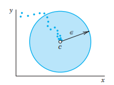
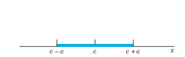
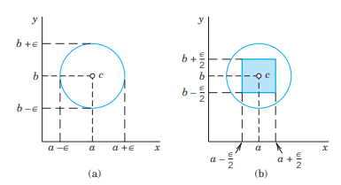
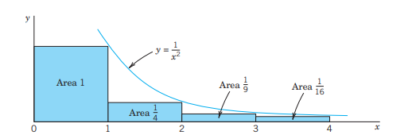
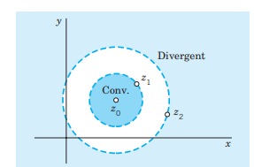
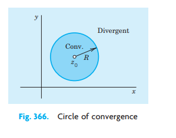
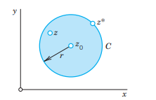
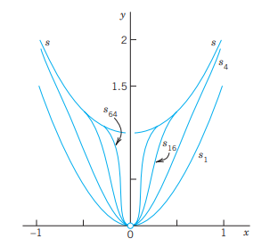
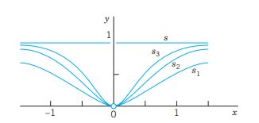

In <!-- TODO: replace Chapter 14 with actual chapter label -->, we evaluated complex integrals directly by using Cauchy’s integral formula, which was derived from the famous Cauchy integral theorem. We now shift from the approach of Cauchy and Goursat to another approach of evaluating complex integrals, that is, evaluating them by residue integration. This approach, discussed in <!-- TODO: replace Chapter 16 with actual chapter label -->, first requires a thorough understanding of power series and, in particular, Taylor series. (To develop the theory of residue integration, we still use Cauchy’s integral theorem!)

In this chapter, we focus on complex power series and in particular Taylor series. They are analogs of real power series and Taylor series in calculus. @sec-sequences-series-tests discusses convergence tests for complex series, which are quite similar to those for real series. Thus, if you are familiar with convergence tests from calculus, you may use @sec-sequences-series-tests as a reference section. The main results of this chapter are that complex power series represent analytic functions, as shown in @sec-functions-given-by-power-series, and that, conversely, every analytic function can be represented by power series, called a Taylor series, as shown in @sec-taylor-maclaurin-series. The last section (15.5) on uniform convergence is optional.

**Prerequisite:** <!-- TODO: replace Chaps. 13 with actual chapter label -->, 14.  
**Sections that may be omitted in a shorter course:** 15.1, 15.5.  
**References and Answers to Problems:** App. 1 Part D, App. 2.

## Sequences, Series, Convergence Tests {#sec-sequences-series-tests}

The basic concepts for complex sequences and series and tests for convergence and divergence are very similar to those concepts in (real) calculus. Thus if you feel at home with real sequences and series and want to take for granted that the ratio test also holds in complex, skip this section and go to @sec-power-series.

### Sequences

The basic definitions are as in calculus. An infinite sequence or, briefly, a **sequence**, is obtained by assigning to each positive integer $n$ a number $z_n$, called a **term** of the sequence, and is written
$$
z_1, z_2, \dots
$$
or
$$
\{z_1, z_2, \dots\} \quad 	ext{or briefly} \quad \{z_n\}.
$$
We may also write $z_0, z_1, z_2, \dots$ or $z_3, z_4, \dots$ or start with some other integer if convenient. A **real sequence** is one whose terms are real.

**Convergence.** A **convergent sequence** $z_1, z_2, \dots$ is one that has a limit $c$, written
$$
\lim_{n 	o \infty} z_n = c \quad 	ext{or simply} \quad z_n 	o c.
$$
By definition of limit this means that for every $\epsilon > 0$ we can find an $N$ such that
$$
|z_n - c| < \epsilon \quad 	ext{for all} \quad n \ge N;
$$ {#eq-15-1}
geometrically, all terms $z_n$ with $n \ge N$ lie in the open disk of radius $\epsilon$ and center $c$ (@fig-15-01) and only finitely many terms do not lie in that disk. [For a real sequence, @eq-15-1 gives an open interval of length $2\epsilon$ and real midpoint $c$ on the real line as shown in @fig-15-02.]

A **divergent sequence** is one that does not converge.

{#fig-15-01}

{#fig-15-02}

### EXAMPLE 1 Convergent and Divergent Sequences
The sequence $\{i^n / n\} = \{i, -1/2, -i/3, 1/4, \dots\}$ is convergent with limit 0.  
The sequence $\{i^n\} = \{i, -1, -i, 1, \dots\}$ is divergent, and so is $\{z_n\}$ with $z_n = (1 + i)^n$. $\square$

### EXAMPLE 2 Sequences of the Real and the Imaginary Parts
The sequence $\{z_n\}$ with $z_n = x_n + i y_n = 1 - rac{1}{n^2} + i \left(2 + rac{4}{n}
ight)$ is
$$
6i, rac{3}{4} + 4i, rac{8}{9} + rac{10}{3}i, rac{15}{16} + 3i, \dots
$$
(Sketch it.) It converges with the limit $c = 1 + 2i$. Observe that $\{x_n\}$ has the limit $1 = 	ext{Re } c$ and $\{y_n\}$ has the limit $2 = 	ext{Im } c$. This is typical. It illustrates the following theorem by which the convergence of a complex sequence can be referred back to that of the two real sequences of the real parts and the imaginary parts.

### THEOREM 1 Sequences of the Real and the Imaginary Parts
*A sequence $z_1, z_2, \dots, z_n, \dots$ of complex numbers $z_n = x_n + i y_n$ (where $n = 1, 2, \dots$) converges to $c = a + ib$ if and only if the sequence of the real parts $x_1, x_2, \dots$ converges to $a$ and the sequence of the imaginary parts $y_1, y_2, \dots$ converges to $b$.*

**PROOF** Convergence $z_n 	o c = a + ib$ implies convergence $x_n 	o a$ and $y_n 	o b$ because if $|z_n - c| < \epsilon$, then $z_n$ lies within the circle of radius $\epsilon$ about $c = a + ib$, so that (@fig-15-03)
$$
|x_n - a| < \epsilon, \quad |y_n - b| < \epsilon.
$$
Conversely, if $x_n 	o a$ and $y_n 	o b$ as $n 	o \infty$, then for a given $\epsilon > 0$ we can choose $N$ so large that, for every $n \ge N$,
$$
|x_n - a| < rac{\epsilon}{2}, \quad |y_n - b| < rac{\epsilon}{2}.
$$
These two inequalities imply that $z_n = x_n + i y_n$ lies in a square with center $c$ and side $\epsilon$. Hence, $z_n$ must lie within a circle of radius $\epsilon$ with center $c$ (@fig-15-03). $\square$

{#fig-15-03}

### Series

Given a sequence $z_1, z_2, \dots, z_m, \dots$, we may form the sequence of the sums
$$
s_1 = z_1, \quad s_2 = z_1 + z_2, \quad s_3 = z_1 + z_2 + z_3, \dots
$$
and in general
$$
s_n = z_1 + z_2 + \dots + z_n \quad (n = 1, 2, \dots).
$$ {#eq-15-2}
Here $s_n$ is called the **$n$th partial sum** of the infinite series or **series**
$$
\sum_{m=1}^{\infty} z_m = z_1 + z_2 + \dots.
$$ {#eq-15-3}
The $z_1, z_2, \dots$ are called the **terms** of the series. (Our usual summation letter is $n$, unless we need $n$ for another purpose, as here, and we then use $m$ as the summation letter.)

A **convergent series** is one whose sequence of partial sums converges, say,
$$
\lim_{n 	o \infty} s_n = s.
$$
Then we write
$$
s = \sum_{m=1}^{\infty} z_m = z_1 + z_2 + \dots
$$
and call $s$ the **sum** or **value** of the series. A series that is not convergent is called a **divergent series**.

If we omit the terms of $s_n$ from @eq-15-3, there remains
$$
R_n = z_{n+1} + z_{n+2} + z_{n+3} + \dots.
$$ {#eq-15-4}
This is called the **remainder** of the series @eq-15-3 after the term $z_n$. Clearly, if @eq-15-3 converges and has the sum $s$, then
$$
s = s_n + R_n, \quad 	ext{thus} \quad R_n = s - s_n.
$$
Now $s_n 	o s$ by the definition of convergence; hence $R_n 	o 0$. In applications, when $s$ is unknown and we compute an approximation $s_n$ of $s$, then $|R_n|$ is the error, and $R_n 	o 0$ means that we can make $|R_n|$ as small as we please, by choosing $n$ large enough.

An application of Theorem 1 to the partial sums immediately relates the convergence of a complex series to that of the two series of its real parts and of its imaginary parts:

### THEOREM 2 Real and Imaginary Parts
*A series @eq-15-3 with $z_m = x_m + i y_m$ converges and has the sum $s = u + i v$ if and only if $x_1 + x_2 + \dots$ converges and has the sum $u$ and $y_1 + y_2 + \dots$ converges and has the sum $v$.*

### Tests for Convergence and Divergence of Series

Convergence tests in complex are practically the same as in calculus. We apply them before we use a series, to make sure that the series converges.

Divergence can often be shown very simply as follows.

### THEOREM 3 Divergence
*If a series $z_1 + z_2 + \dots$ converges, then $\lim_{m 	o \infty} z_m = 0$. Hence if this does not hold, the series diverges.*

**PROOF** If $z_1 + z_2 + \dots$ converges, with the sum $s$, then, since $z_m = s_m - s_{m-1}$,
$$
\lim_{m 	o \infty} z_m = \lim_{m 	o \infty} (s_m - s_{m-1}) = \lim_{m 	o \infty} s_m - \lim_{m 	o \infty} s_{m-1} = s - s = 0.
$$ $\square$

**CAUTION!** $z_m 	o 0$ is *necessary* for convergence but *not sufficient*, as we see from the harmonic series
$$
1 + rac{1}{2} + rac{1}{3} + rac{1}{4} + \dots,
$$
which satisfies this condition but diverges, as is shown in calculus (see, for example, Ref. [GenRef11] in App. 1).

The practical difficulty in proving convergence is that, in most cases, the sum of a series is unknown. Cauchy overcame this by showing that a series converges if and only if its partial sums eventually get close to each other:

### THEOREM 4 Cauchy’s Convergence Principle for Series
*A series $z_1 + z_2 + \dots$ is convergent if and only if for every given $\epsilon > 0$ (no matter how small) we can find an $N$ (which depends on $\epsilon$, in general) such that*
$$
|z_{n+1} + z_{n+2} + \dots + z_{n+p}| < \epsilon \quad 	ext{for every} \quad n \ge N \quad 	ext{and} \quad p = 1, 2, \dots.
$$ {#eq-15-5}
The somewhat involved proof is left optional (see App. 4).

**Absolute Convergence.** A series $z_1 + z_2 + \dots$ is called **absolutely convergent** if the series of the absolute values of the terms
$$
\sum_{m=1}^{\infty} |z_m| = |z_1| + |z_2| + \dots
$$
is convergent.

If $z_1 + z_2 + \dots$ converges but $|z_1| + |z_2| + \dots$ diverges, then the series $z_1 + z_2 + \dots$ is called, more precisely, **conditionally convergent**.

### EXAMPLE 3 A Conditionally Convergent Series
The series $1 - 1/2 + 1/3 - 1/4 + \dots$ converges, but only conditionally since the harmonic series diverges, as mentioned above (after Theorem 3). $\square$

*If a series is absolutely convergent, it is convergent.*
This follows readily from Cauchy’s principle (see Prob. 29). This principle also yields the following general convergence test.

### THEOREM 5 Comparison Test
*If a series $z_1 + z_2 + \dots$ is given and we can find a convergent series $b_1 + b_2 + \dots$ with nonnegative real terms such that $|z_1| \le b_1, |z_2| \le b_2, \dots$, then the given series converges, even absolutely.*

**PROOF** By Cauchy’s principle, since $b_1 + b_2 + \dots$ converges, for any given $\epsilon > 0$ we can find an $N$ such that
$$
b_{n+1} + \dots + b_{n+p} < \epsilon \quad 	ext{for every} \quad n \ge N \quad 	ext{and} \quad p = 1, 2, \dots.
$$
From this and $|z_1| \le b_1, |z_2| \le b_2, \dots$, we conclude that for those $n$ and $p$,
$$
|z_{n+1}| + \dots + |z_{n+p}| \le b_{n+1} + \dots + b_{n+p} < \epsilon.
$$
Hence, again by Cauchy’s principle, $|z_1| + |z_2| + \dots$ converges, so that $z_1 + z_2 + \dots$ is absolutely convergent. $\square$

A good comparison series is the geometric series, which behaves as follows.

### THEOREM 6 Geometric Series
*The geometric series*
$$
\sum_{m=0}^{\infty} q^m = 1 + q + q^2 + \dots
$$ {#eq-15-6star}
*converges with the sum $1 / (1 - q)$ if $|q| < 1$ and diverges if $|q| \ge 1$.*

**PROOF** If $|q| \ge 1$, then $|q^m| \ge 1$ and Theorem 3 implies divergence.
Now let $|q| < 1$. The $n$th partial sum is
$$
s_n = 1 + q + \dots + q^n.
$$
From this,
$$
q s_n = q + \dots + q^n + q^{n+1}.
$$
On subtraction, most terms on the right cancel in pairs, and we are left with
$$
s_n - q s_n = (1 - q) s_n = 1 - q^{n+1}.
$$
Now $1 - q 
eq 0$ since $q 
eq 1$, and we may solve for $s_n$, finding
$$
s_n = rac{1 - q^{n+1}}{1 - q} = rac{1}{1 - q} - rac{q^{n+1}}{1 - q}.
$$ {#eq-15-6}
Since $|q| < 1$, the last term approaches zero as $n 	o \infty$. Hence if $|q| < 1$, the series is convergent and has the sum $1 / (1 - q)$. This completes the proof. $\square$

### Ratio Test

This is the most important test in our further work. We get it by taking the geometric series as comparison series $b_1 + b_2 + \dots$ in Theorem 5:

### THEOREM 7 Ratio Test
*If a series $z_1 + z_2 + \dots$ with $z_n 
eq 0$ ($n = 1, 2, \dots$) has the property that for every $n$ greater than some $N$,*
$$
\left| rac{z_{n+1}}{z_n} 
ight| \le q < 1 \quad (n \ge N)
$$ {#eq-15-7}
*(where $q < 1$ is fixed), this series converges absolutely. If for every $n \ge N$,*
$$
\left| rac{z_{n+1}}{z_n} 
ight| \ge 1 \quad (n \ge N),
$$ {#eq-15-8}
*the series diverges.*

**PROOF** If @eq-15-8 holds, then $|z_{n+1}| \ge |z_n|$ for $n \ge N$, so that divergence of the series follows from Theorem 3.
If @eq-15-7 holds, then $|z_{n+1}| \le |z_n| q$ for $n \ge N$, in particular,
$$
|z_{N+1}| \le |z_N| q, \quad |z_{N+2}| \le |z_{N+1}| q \le |z_N| q^2, \quad \dots
$$
and in general, $|z_{N+p}| \le |z_N| q^p$. Since $q < 1$, we obtain from this and Theorem 6
$$
|z_{N+1}| + |z_{N+2}| + |z_{N+3}| + \dots \le |z_N| (q + q^2 + q^3 + \dots) = |z_N| rac{q}{1 - q}.
$$
Absolute convergence of $z_1 + z_2 + \dots$ now follows from Theorem 5. $\square$

**CAUTION!** The inequality @eq-15-7 implies $|z_{n+1}/z_n| < 1$, but this does not imply convergence, as we see from the harmonic series, which satisfies $z_{n+1}/z_n = n / (n + 1) < 1$ for all $n$ but diverges.

If the sequence of the ratios in @eq-15-7 and @eq-15-8 converges, we get the more convenient:

### THEOREM 8 Ratio Test
*If a series $z_1 + z_2 + \dots$ with $z_n 
eq 0$ ($n = 1, 2, \dots$) is such that $\lim_{n 	o \infty} \left| rac{z_{n+1}}{z_n} 
ight| = L$, then:*  
*(a) If $L < 1$, the series converges absolutely.*  
*(b) If $L > 1$, the series diverges.*  
*(c) If $L = 1$, the series may converge or diverge, so that the test fails and permits no conclusion.*

**PROOF** (a) We write $k_n = |z_{n+1}/z_n|$ and let $L = 1 - 2eta < 1$. Then by the definition of limit, the $k_n$ must eventually get close to $L$, say, $k_n \le q = 1 - eta < 1$ for all $n$ greater than some $N$. Convergence of $z_1 + z_2 + \dots$ now follows from Theorem 7.  
(b) Similarly, for $L = 1 + 2\gamma > 1$ we have $k_n \ge 1 + \gamma > 1$ for all $n \ge N^*$ (sufficiently large), which implies divergence of $z_1 + z_2 + \dots$ by Theorem 7.  
(c) The harmonic series $1 + 1/2 + 1/3 + \dots$ has $z_{n+1}/z_n = n/(n+1)$, hence $L = 1$, and diverges. The series
$$
1 + rac{1}{4} + rac{1}{9} + rac{1}{16} + rac{1}{25} + \dots \quad 	ext{has} \quad rac{z_{n+1}}{z_n} = rac{n^2}{(n+1)^2},
$$
hence also $L = 1$, but it converges. Convergence follows from (@fig-15-04)
$$
s_n = 1 + rac{1}{4} + \dots + rac{1}{n^2} \le 1 + \int_1^n rac{dx}{x^2} = 2 - rac{1}{n},
$$
so that $s_1, s_2, \dots$ is a bounded sequence and is monotone increasing (since the terms of the series are all positive); both properties together are sufficient for the convergence of the real sequence $s_1, s_2, \dots$. (In calculus this is proved by the so-called integral test, whose idea we have used.) $\square$

{#fig-15-04}

### EXAMPLE 4 Ratio Test
Is the following series convergent or divergent? (First guess, then calculate.)
$$
\sum_{n=0}^{\infty} rac{(100 + 75i)^n}{n!} = 1 + (100 + 75i) + rac{1}{2!} (100 + 75i)^2 + \dots
$$
**Solution.** By Theorem 8, the series is convergent, since
$$
\left| rac{z_{n+1}}{z_n} 
ight| = rac{|100 + 75i|^{n+1}}{(n+1)!} \cdot rac{n!}{|100 + 75i|^n} = rac{|100 + 75i|}{n+1} = rac{125}{n+1} 	o L = 0 \quad 	ext{as} \quad n 	o \infty.
$$ $\square$

### EXAMPLE 5 Theorem 7 More General Than Theorem 8
Let $a_n = i / 2^{3n}$ and $b_n = 1 / 2^{3n+1}$. Is the following series convergent or divergent?
$$
a_0 + b_0 + a_1 + b_1 + \dots = i + rac{1}{2} + rac{i}{8} + rac{1}{16} + rac{i}{64} + rac{1}{128} + \dots
$$
**Solution.** The ratios of the absolute values of successive terms are $1/2, 1/4, 1/2, 1/4, \dots$. Hence convergence follows from Theorem 7 (with $q = 1/2$). Since the sequence of these ratios has no limit, Theorem 8 is not applicable. $\square$

### Root Test

The ratio test and the root test are the two practically most important tests. The ratio test is usually simpler, but the root test is somewhat more general.

### THEOREM 9 Root Test
*If a series $z_1 + z_2 + \dots$ is such that for every $n$ greater than some $N$,*
$$
\sqrt[n]{|z_n|} \le q < 1 \quad (n \ge N)
$$ {#eq-15-9}
*(where $q < 1$ is fixed), this series converges absolutely. If for infinitely many $n$,*
$$
\sqrt[n]{|z_n|} \ge 1,
$$ {#eq-15-10}
*the series diverges.*

**PROOF** If @eq-15-9 holds, then $|z_n| \le q^n$ for all $n \ge N$. Hence the series $|z_1| + |z_2| + \dots$ converges by comparison with the geometric series, so that the series $z_1 + z_2 + \dots$ converges absolutely. If @eq-15-10 holds, then $|z_n| \ge 1$ for infinitely many $n$. Divergence of $z_1 + z_2 + \dots$ now follows from Theorem 3. $\square$

**CAUTION!** Equation @eq-15-9 implies $\sqrt[n]{|z_n|} < 1$, but this does not imply convergence, as we see from the harmonic series, which satisfies $\sqrt[n]{1/n} < 1$ (for $n > 1$) but diverges.

If the sequence of the roots in @eq-15-9 and @eq-15-10 converges, we more conveniently have:

### THEOREM 10 Root Test
*If a series $z_1 + z_2 + \dots$ is such that $\lim_{n 	o \infty} \sqrt[n]{|z_n|} = L$, then:*  
*(a) The series converges absolutely if $L < 1$.*  
*(b) The series diverges if $L > 1$.*  
*(c) If $L = 1$, the test fails; that is, no conclusion is possible.*

**PROOF** (a) We write $k_n = \sqrt[n]{|z_n|}$ and let $L = 1 - 2eta < 1$. Then by the definition of limit, the $k_n$ must eventually get close to $L$, say, $k_n \le q = 1 - eta < 1$ for all $n > N$. Convergence of $z_1 + z_2 + \dots$ now follows from Theorem 9.  
(b) Similarly, for $L > 1$ we have $k_n \ge 1$ for infinitely many $n$, which implies divergence of $z_1 + z_2 + \dots$ by Theorem 9.  
(c) The harmonic series converges to $L = \lim \sqrt[n]{1/n} = 1$ and diverges. The series $1 + 1/4 + 1/9 + \dots$ converges to $L = \lim \sqrt[n]{1/n^2} = 1$ and converges. $\square$

## PROBLEM SET 15.1 {#sec-problem-set-15-1}

### 1–10 SEQUENCES
Is the given sequence $z_n$ bounded? Convergent? Find its limit points. Show your work in detail.

1. $z_n = rac{(1+i)^{2n}}{2^n}$
2. $z_n = rac{(3+4i)^n}{n!}$
3. $z_n = rac{n \pi}{4 + 2 n i}$
4. $z_n = rac{(1+2i)^n}{5^n}$
5. $z_n = rac{(-1)^n}{n} + 10i$
6. $z_n = rac{\cos(n\pi/2)}{n}$
7. $z_n = rac{n^2 + i^n}{n^2}$
8. $z_n = \left(rac{1+3i}{\sqrt{10}}
ight)^n$
9. $z_n = (3+3i)^{-n}$
10. $z_n = \sin\left(rac{n\pi}{4}
ight) + rac{i^n}{n}$

11. **CAS EXPERIMENT. Sequences.** Write a program for graphing complex sequences. Use the program to discover sequences that have interesting “geometric” properties, e.g., lying on an ellipse, spiraling to its limit, having infinitely many limit points, etc.

12. **Addition of sequences.** If $z_1, z_2, \dots$ converges with the limit $l$ and $z_1^*, z_2^*, \dots$ converges with the limit $l^*$, show that $z_1 + z_1^*, z_2 + z_2^*, \dots$ is convergent with the limit $l + l^*$.

13. **Bounded sequence.** Show that a complex sequence is bounded if and only if the two corresponding sequences of the real parts and of the imaginary parts are bounded.

14. **On Theorem 1.** Illustrate Theorem 1 by an example of your own.

15. **On Theorem 2.** Give another example illustrating Theorem 2.

### 16–25 SERIES
Is the given series convergent or divergent? Give a reason. Show details.

16. $\sum_{n=0}^{\infty} rac{(20 + 30i)^n}{n!}$
17. $\sum_{n=2}^{\infty} rac{(-i)^n}{\ln n}$
18. $\sum_{n=1}^{\infty} rac{i^n}{n^2}$
19. $\sum_{n=0}^{\infty} rac{i^n}{n^2 - i}$
20. $\sum_{n=0}^{\infty} rac{n + i}{3n^2 + 2i}$
21. $\sum_{n=0}^{\infty} rac{(\pi + \pi i)^{2n+1}}{(2n+1)!}$
22. $\sum_{n=1}^{\infty} rac{1}{n^n}$
23. $\sum_{n=0}^{\infty} rac{(-1)^n (1+i)^{2n}}{(2n)!}$
24. $\sum_{n=1}^{\infty} rac{(3i)^n n!}{n^n}$
25. $\sum_{n=1}^{\infty} rac{i^n}{n}$

26. **Significance of (7).** What is the difference between @eq-15-7 and just stating $|z_{n+1}/z_n| < 1$?

27. **On Theorems 7 and 8.** Give another example showing that Theorem 7 is more general than Theorem 8.

28. **CAS EXPERIMENT. Series.** Write a program for computing and graphing numeric values of the first $n$ partial sums of a series of complex numbers. Use the program to experiment with the rapidity of convergence of series of your choice.

29. **Absolute convergence.** Show that if a series converges absolutely, it is convergent.

30. **Remainder.** Let the series $z_1 + z_2 + \dots$ converge by the ratio test @eq-15-7. Show that the remainder $R_n = z_{n+1} + z_{n+2} + \dots$ satisfies the inequality $|R_n| \le |z_{n+1}| / (1 - q)$. Using this, find how many terms suffice for computing the sum $s$ of the series
$$
\sum_{n=1}^{\infty} rac{n + i}{2^n n}
$$
with an error not exceeding 0.05 and compute $s$ to this accuracy.

## Power Series {#sec-power-series}

The student should pay close attention to the material because we shall show how power series play an important role in complex analysis. Indeed, they are the most important series in complex analysis because their sums are analytic functions (Theorem 5, @sec-functions-given-by-power-series), and every analytic function can be represented by power series (Theorem 1, @sec-taylor-maclaurin-series).

A **power series** in powers of $z - z_0$ is a series of the form
$$
\sum_{n=0}^{\infty} a_n (z - z_0)^n = a_0 + a_1(z - z_0) + a_2(z - z_0)^2 + \dots
$$ {#eq-15-2-1}
where $z$ is a complex variable, $a_0, a_1, \dots$ are complex (or real) constants, called the **coefficients** of the series, and $z_0$ is a complex (or real) constant, called the **center** of the series. This generalizes real power series of calculus.

If $z_0 = 0$, we obtain as a particular case a power series in powers of $z$:
$$
\sum_{n=0}^{\infty} a_n z^n = a_0 + a_1 z + a_2 z^2 + \dots.
$$ {#eq-15-2-2}

### Convergence Behavior of Power Series

Power series have variable terms (functions of $z$), but if we fix $z$, then all the concepts for series with constant terms in the last section apply. Usually a series with variable terms will converge for some $z$ and diverge for others. For a power series the situation is simple. The series @eq-15-2-1 may converge in a disk with center $z_0$ or in the whole $z$-plane or only at $z_0$. We illustrate this with typical examples and then prove it.

### EXAMPLE 1 Convergence in a Disk. Geometric Series
The geometric series
$$
\sum_{n=0}^{\infty} z^n = 1 + z + z^2 + \dots
$$
converges absolutely if $|z| < 1$ and diverges if $|z| \ge 1$ (see Theorem 6 in @sec-sequences-series-tests). $\square$

### EXAMPLE 2 Convergence for Every $z$
The power series (which will be the Maclaurin series of $e^z$ in @sec-taylor-maclaurin-series)
$$
\sum_{n=0}^{\infty} rac{z^n}{n!} = 1 + z + rac{z^2}{2!} + rac{z^3}{3!} + \dots
$$
is absolutely convergent for every $z$. In fact, by the ratio test, for any fixed $z$,
$$
\left| rac{z^{n+1}/(n+1)!}{z^n/n!} 
ight| = rac{|z|}{n+1} 	o 0 \quad 	ext{as} \quad n 	o \infty.
$$ $\square$

### EXAMPLE 3 Convergence Only at the Center. (Useless Series)
The following power series converges only at $z = 0$, but diverges for every $z 
eq 0$, as we shall show.
$$
\sum_{n=0}^{\infty} n! z^n = 1 + z + 2z^2 + 6z^3 + \dots
$$
In fact, from the ratio test we have
$$
\left| rac{(n+1)! z^{n+1}}{n! z^n} 
ight| = (n+1)|z| 	o \infty \quad 	ext{as} \quad n 	o \infty \quad (z 	ext{ fixed and } 
eq 0).
$$ $\square$

### THEOREM 1 Convergence of a Power Series
*(a) Every power series @eq-15-2-1 converges at the center $z_0$.*  
*(b) If @eq-15-2-1 converges at a point $z_1 
eq z_0$, it converges absolutely for every $z$ closer to $z_0$ than $z_1$, that is, $|z - z_0| < |z_1 - z_0|$. See @fig-15-05.*  
*(c) If @eq-15-2-1 diverges at $z_2$, it diverges for every $z$ farther away from $z_0$ than $z_2$. See @fig-15-05.*

{#fig-15-05}

**PROOF** (a) For $z = z_0$ the series reduces to the single term $a_0$.  
(b) Convergence at $z = z_1$ gives by Theorem 3 in @sec-sequences-series-tests $a_n (z_1 - z_0)^n 	o 0$ as $n 	o \infty$. This implies boundedness in absolute value,
$$
|a_n (z_1 - z_0)^n| \le M \quad 	ext{for every} \quad n = 0, 1, \dots.
$$
Multiplying and dividing $a_n (z - z_0)^n$ by $(z_1 - z_0)^n$ we obtain from this
$$
|a_n (z - z_0)^n| = \left| a_n (z_1 - z_0)^n \left( rac{z - z_0}{z_1 - z_0} 
ight)^n 
ight| \le M \left| rac{z - z_0}{z_1 - z_0} 
ight|^n.
$$
Summation over $n$ gives
$$
\sum_{n=0}^{\infty} |a_n (z - z_0)^n| \le M \sum_{n=0}^{\infty} \left| rac{z - z_0}{z_1 - z_0} 
ight|^n.
$$ {#eq-15-2-3}
Now our assumption $|z - z_0| < |z_1 - z_0|$ implies that $\left| rac{z - z_0}{z_1 - z_0} 
ight| < 1$. Hence the series on the right side of @eq-15-2-3 is a converging geometric series (see Theorem 6 in @sec-sequences-series-tests). Absolute convergence of @eq-15-2-1 as stated in (b) now follows by the comparison test in @sec-sequences-series-tests.  
(c) If this were false, we would have convergence at a $z_3$ farther away from $z_0$ than $z_2$. This would imply convergence at $z_2$, by (b), a contradiction to our assumption of divergence at $z_2$. $\square$

### Radius of Convergence of a Power Series

Convergence for every $z$ (the nicest case, Example 2) or for no $z 
eq z_0$ (the useless case, Example 3) needs no further discussion, and we put these cases aside for a moment. We consider the smallest circle with center $z_0$ that includes all the points at which a given power series @eq-15-2-1 converges. Let $R$ denote its radius. The circle
$$
|z - z_0| = R
$$ {#eq-15-2-4star}
(@fig-15-06) is called the **circle of convergence** and its radius $R$ the **radius of convergence** of @eq-15-2-1. Theorem 1 then implies convergence everywhere within that circle, that is, for all $z$ for which
$$
|z - z_0| < R
$$ {#eq-15-2-4}
(the open disk with center $z_0$ and radius $R$). Also, since $R$ is as small as possible, the series @eq-15-2-1 diverges for all $z$ for which
$$
|z - z_0| > R.
$$ {#eq-15-2-5}

No general statements can be made about the convergence of a power series @eq-15-2-1 on the circle of convergence itself. The series @eq-15-2-1 may converge at some or all or none of the points. Details will not be important to us. Hence a simple example may just give us the idea.

{#fig-15-06}

### EXAMPLE 4 Behavior on the Circle of Convergence
On the circle of convergence (radius $R = 1$ in all three series),
*   $\sum_{n=1}^{\infty} rac{z^n}{n^2}$ converges everywhere on the circle since $\sum_{n=1}^{\infty} rac{1}{n^2}$ converges,
*   $\sum_{n=1}^{\infty} rac{z^n}{n}$ converges at $-1$ (by Leibniz’s test) but diverges at $1$,
*   $\sum_{n=0}^{\infty} z^n$ diverges everywhere on the circle. $\square$

**Notations $R = \infty$ and $R = 0$.** To incorporate these two excluded cases in the present notation, we write:
*   $R = \infty$ if the series @eq-15-2-1 converges for all $z$ (as in Example 2),
*   $R = 0$ if @eq-15-2-1 converges only at the center $z = z_0$ (as in Example 3).
These are convenient notations, but nothing else.

**Real Power Series.** In this case in which powers, coefficients, and center are real, formula @eq-15-2-4 gives the convergence interval $x_0 - R < x < x_0 + R$ of length $2R$ on the real line.

**Determination of the Radius of Convergence from the Coefficients.** For this important practical task we can use:

### THEOREM 2 Radius of Convergence $R$
*Suppose that the sequence $|a_{n+1}/a_n|$, $n = 1, 2, \dots$, converges with limit $L^*$. If $L^* = 0$, then $R = \infty$; that is, the power series @eq-15-2-1 converges for all $z$. If $L^* 
eq 0$ (hence $L^* > 0$), then*
$$
R = rac{1}{L^*} = \lim_{n 	o \infty} \left| rac{a_n}{a_{n+1}} 
ight| \quad 	ext{(Cauchy–Hadamard formula).}
$$ {#eq-15-2-6}
*If $|a_{n+1}/a_n| 	o \infty$, then $R = 0$ (convergence only at the center $z_0$).*

**PROOF** For @eq-15-2-1 the ratio of the terms in the ratio test (@sec-sequences-series-tests) is
$$
\left| rac{a_{n+1}(z - z_0)^{n+1}}{a_n(z - z_0)^n} 
ight| = \left| rac{a_{n+1}}{a_n} 
ight| |z - z_0|.
$$
The limit is $L = L^*|z - z_0|$.

Let $L^* > 0$. We have convergence if $L = L^*|z - z_0| < 1$, thus $|z - z_0| < 1/L^*$, and divergence if $|z - z_0| > 1/L^*$. By @eq-15-2-4 and @eq-15-2-5 this shows that $1/L^*$ is the convergence radius and proves @eq-15-2-6.

If $L^* = 0$, then $L = 0$ for every $z$, which gives convergence for all $z$ by the ratio test.

If $|a_{n+1}/a_n| 	o \infty$, then $\left| rac{a_{n+1}}{a_n} 
ight||z - z_0| > 1$ for any $z 
eq z_0$ and all sufficiently large $n$. This implies divergence for all $z 
eq z_0$ by the ratio test (Theorem 7, @sec-sequences-series-tests). $\square$

Formula @eq-15-2-6 will not help if $L^*$ does not exist, but extensions of Theorem 2 are still possible, as we discuss in Example 6 below.

### EXAMPLE 5 Radius of Convergence
By @eq-15-2-6 the radius of convergence of the power series $\sum_{n=0}^{\infty} rac{(2n)!}{(n!)^2} (z - 3i)^n$ is
$$
R = \lim_{n 	o \infty} rac{(2n)!}{(n!)^2} rac{((n+1)!)^2}{(2n+2)!} = \lim_{n 	o \infty} rac{(n+1)^2}{(2n+2)(2n+1)} = \lim_{n 	o \infty} rac{n+1}{2(2n+1)} = rac{1}{4}.
$$
The series converges in the open disk $|z - 3i| < 1/4$ of radius $1/4$ and center $3i$. $\square$

### EXAMPLE 6 Extension of Theorem 2
Find the radius of convergence $R$ of the power series
$$
\sum_{n=0}^{\infty} \left( 1 + (-1)^n + rac{1}{2^n} 
ight) z^n.
$$
**Solution.** The sequence of the coefficients is $a_n = 1 + (-1)^n + rac{1}{2^n}$.
If $n$ is even, $a_n = 2 + 2^{-n}$. If $n$ is odd, $a_n = 2^{-n}$.
The sequence of the ratios $|a_n / a_{n+1}|$ does not converge because for even $n$,
$$
rac{a_n}{a_{n+1}} = rac{2 + 2^{-n}}{2^{-n-1}} = 2^{n+2} + 2 	o \infty,
$$
whereas for odd $n$,
$$
rac{a_n}{a_{n+1}} = rac{2^{-n}}{2 + 2^{-n-1}} 	o 0.
$$
Hence Theorem 2 is of no help. However, we can use the root test:
$$
\sqrt[n]{|a_n|} = \sqrt[n]{2 + 2^{-n}} 	o 1 \quad 	ext{for even } n,
$$
and
$$
\sqrt[n]{|a_n|} = \sqrt[n]{2^{-n}} = rac{1}{2} \quad 	ext{for odd } n.
$$
The greatest limit point of the sequence $\{\sqrt[n]{|a_n|}\}$ is $L = 1$. The radius of convergence is $R = 1/L = 1$, and the series converges for $|z| < 1$. $\square$

**Summary.** Power series converge in an open circular disk (or the whole $z$-plane, or only at the center). Except for the useless ones, power series have sums that are analytic functions (as we show in the next section); this explains their importance in complex analysis.

## PROBLEM SET 15.2 {#sec-problem-set-15-2}

1. **Power series.** Are $\sum_{n=1}^{\infty} z^n$, $\sum_{n=1}^{\infty} z^{2n}$, and $\sum_{n=1}^{\infty} z^{n^2}$ power series? Explain.
2. **Radius of convergence.** What is it? Its role? What motivates its name? How can you find it?
3. **Convergence.** What are the only basically different possibilities for the convergence of a power series?
4. **On Examples 1–3.** Extend them to power series in powers of $z - 4 + 3\pi i$. Extend Example 1 to the case of radius of convergence 6.
5. **Powers $z^{2n}$.** Show that if $\sum_{n=0}^{\infty} a_n z^n$ has radius of convergence $R$ (assumed finite), then $\sum_{n=0}^{\infty} a_n z^{2n}$ has radius of convergence $\sqrt{R}$.

### 6–18 RADIUS OF CONVERGENCE
Find the center and the radius of convergence.
6. $\sum_{n=0}^{\infty} 4^n (z + 1)^n$
7. $\sum_{n=0}^{\infty} rac{(-1)^n}{(2n)!} \left( z - rac{\pi}{2} 
ight)^{2n}$
8. $\sum_{n=0}^{\infty} rac{(z - \pi i)^n}{n!}$
9. $\sum_{n=0}^{\infty} rac{n(n - 1)}{3^n} (z - i)^{2n}$
10. $\sum_{n=0}^{\infty} (z - 2i)^n$
11. $\sum_{n=0}^{\infty} rac{2 - i}{1 + 5i} z^n$
12. $\sum_{n=0}^{\infty} rac{(-1)^n n}{8^n} z^n$
13. $\sum_{n=0}^{\infty} 16^n (z + i)^{4n}$
14. $\sum_{n=0}^{\infty} rac{(-1)^n}{2^{2n} (n!)^2} z^{2n}$
15. $\sum_{n=0}^{\infty} rac{(2n)!}{4^n (n!)^2} (z - 2i)^n$
16. $\sum_{n=0}^{\infty} rac{(3n)!}{2^n (n!)^3} z^n$
17. $\sum_{n=1}^{\infty} rac{2^n}{n(n+1)} z^{2n-1}$
18. $\sum_{n=0}^{\infty} rac{2(-1)^n}{\pi(2n+1)} z^{2n+1}$

19. **CAS PROJECT. Radius of Convergence.** Write a program for computing $R$ from @eq-15-2-6 or other methods, depending on the existence of the limits. Test the program on some series of your choice.

20. **TEAM PROJECT. Radius of Convergence.**  
    (a) **Understanding @eq-15-2-6.** Formula @eq-15-2-6 for $R$ contains $|a_n / a_{n+1}|$, not $|a_{n+1} / a_n|$. How could you memorize this by using a qualitative argument?  
    (b) **Change of coefficients.** What happens to $R$ ($0 < R < \infty$) if you (i) multiply all $a_n$ by $k 
eq 0$, (ii) multiply all $a_n$ by $k^n 
eq 0$, (iii) replace $a_n$ by $1/a_n$?  
    (c) **Understanding Example 6.** Make up further examples of the principle of "mixing" by which Example 6 was obtained.  
    (d) **Understanding (b) and (c) in Theorem 1.** Does there exist a power series in powers of $z$ that converges at $z = 30 + 10i$ and diverges at $z = 31 - 6i$? Give a reason.

## Functions Given by Power Series {#sec-functions-given-by-power-series}

Here, our main goal is to show that power series represent analytic functions. This fact (Theorem 5) and the fact that power series behave nicely under addition, multiplication, differentiation, and integration accounts for their usefulness.

To simplify the formulas in this section, we take $z_0 = 0$ and write
$$
\sum_{n=0}^{\infty} a_n z^n.
$$ {#eq-15-3-1}
There is no loss of generality because a series in powers of $\hat{z} - z_0$ with any $z_0$ can always be reduced to the form @eq-15-3-1 if we set $z = \hat{z} - z_0$.

**Terminology and Notation.** If any given power series @eq-15-3-1 has a nonzero radius of convergence $R > 0$, its sum is a function of $z$, say $f(z)$. Then we write
$$
f(z) = \sum_{n=0}^{\infty} a_n z^n = a_0 + a_1 z + a_2 z^2 + \dots \quad (|z| < R).
$$ {#eq-15-3-2}
We say that $f(z)$ is **represented** by the power series or that it is **developed** in the power series. For instance, the geometric series represents the function $f(z) = 1 / (1 - z)$ in the interior of the unit circle $|z| < 1$. (See Theorem 6 in @sec-sequences-series-tests.)

**Uniqueness of a Power Series Representation.** This is our next goal. It means that a function $f(z)$ cannot be represented by two different power series with the same center. We claim that if $f(z)$ can at all be developed in a power series with center $z_0$, the development is unique. This important fact is frequently used in complex analysis (as well as in calculus). We shall prove it in Theorem 2. The proof will follow from:

### THEOREM 1 Continuity of the Sum of a Power Series
*If a function $f(z)$ can be represented by a power series @eq-15-3-2 with radius of convergence $R > 0$, then $f(z)$ is continuous at $z = 0$.*

**PROOF** From @eq-15-3-2 with $z = 0$ we have $f(0) = a_0$. Hence by the definition of continuity we must show that $\lim_{z 	o 0} f(z) = f(0) = a_0$. That is, we must show that for a given $\epsilon > 0$ there is a $\delta > 0$ such that $|z| < \delta$ implies $|f(z) - a_0| < \epsilon$. Now @eq-15-3-2 converges absolutely for $|z| \le r$ with any $r$ such that $0 < r < R$, by Theorem 1 in @sec-power-series. Hence the series
$$
\sum_{n=1}^{\infty} |a_n| r^{n-1} = rac{1}{r} \sum_{n=1}^{\infty} |a_n| r^n
$$
converges. Let $S \ge 0$ be its sum. (If $S = 0$, the proof is trivial.) Then for $0 < |z| \le r$,
$$
|f(z) - a_0| = \left| \sum_{n=1}^{\infty} a_n z^n 
ight| \le |z| \sum_{n=1}^{\infty} |a_n| |z|^{n-1} \le |z| \sum_{n=1}^{\infty} |a_n| r^{n-1} = |z| S
$$
and $|z| S < \epsilon$ when $|z| < \delta$, where $\delta$ is chosen smaller than $r$ and smaller than $\epsilon / S$. Hence $|f(z) - a_0| < \delta S < (\epsilon / S) S = \epsilon$. This proves the theorem. $\square$

From this theorem we can now readily obtain the desired uniqueness theorem:

### THEOREM 2 Identity Theorem for Power Series. Uniqueness
*Let the power series $a_0 + a_1 z + a_2 z^2 + \dots$ and $b_0 + b_1 z + b_2 z^2 + \dots$ both be convergent for $|z| < R$, where $R > 0$, and let them both have the same sum for all these $z$. Then the series are identical, that is, $a_0 = b_0$, $a_1 = b_1$, $a_2 = b_2$, $\dots$. Hence if a function $f(z)$ can be represented by a power series with any center $z_0$, this representation is unique.*

**PROOF** We proceed by induction. By assumption,
$$
a_0 + a_1 z + a_2 z^2 + \dots = b_0 + b_1 z + b_2 z^2 + \dots \quad (|z| < R).
$$
The sums of these two power series are continuous at $z = 0$, by Theorem 1. Hence if we consider $z 	o 0$ on both sides, we see that $a_0 = b_0$: the assertion is true for $n = 0$. Now assume that $a_n = b_n$ for $n = 0, 1, \dots, m$. Then on both sides we may omit the terms that are equal and divide the result by $z^{m+1}$ ($z 
eq 0$); this gives
$$
a_{m+1} + a_{m+2} z + a_{m+3} z^2 + \dots = b_{m+1} + b_{m+2} z + b_{m+3} z^2 + \dots.
$$
Similarly as before, by letting $z 	o 0$ we conclude from this that $a_{m+1} = b_{m+1}$. This completes the proof. $\square$

### Operations on Power Series

Termwise addition or subtraction of two power series with radii of convergence $R_1$ and $R_2$ yields a power series with radius of convergence at least equal to the smaller of $R_1$ and $R_2$. Proof: Add (or subtract) the partial sums $s_n$ and $s_n^*$ term by term and use $\lim (s_n \pm s_n^*) = \lim s_n \pm \lim s_n^*$.

Termwise multiplication of two power series
$$
f(z) = \sum_{k=0}^{\infty} a_k z^k = a_0 + a_1 z + \dots
$$
and
$$
g(z) = \sum_{m=0}^{\infty} b_m z^m = b_0 + b_1 z + \dots
$$
means the multiplication of each term of the first series by each term of the second series and the collection of like powers of $z$. This gives a power series, which is called the **Cauchy product** of the two series and is given by
$$
a_0 b_0 + (a_0 b_1 + a_1 b_0) z + (a_0 b_2 + a_1 b_1 + a_2 b_0) z^2 + \dots = \sum_{n=0}^{\infty} (a_0 b_n + a_1 b_{n-1} + \dots + a_n b_0) z^n.
$$
This power series converges absolutely for each $z$ within the smaller circle of convergence of the two given series and has the sum $s(z) = f(z) g(z)$. For a proof, see [D5] listed in App. 1.

Termwise differentiation and integration of power series is permissible, as we show next. We call **derived series** of the power series @eq-15-3-1 the power series obtained from @eq-15-3-1 by termwise differentiation, that is,
$$
\sum_{n=1}^{\infty} n a_n z^{n-1} = a_1 + 2 a_2 z + 3 a_3 z^2 + \dots.
$$ {#eq-15-3-3}

### THEOREM 3 Termwise Differentiation of a Power Series
*The derived series of a power series has the same radius of convergence as the original series.*

**PROOF** This follows from @eq-15-2-6 in @sec-power-series because
$$
\lim_{n 	o \infty} rac{n|a_n|}{(n+1)|a_{n+1}|} = \lim_{n 	o \infty} rac{n}{n+1} \lim_{n 	o \infty} \left| rac{a_n}{a_{n+1}} 
ight| = \lim_{n 	o \infty} \left| rac{a_n}{a_{n+1}} 
ight|
$$
or, if the limit does not exist, from the root test by noting that $\sqrt[n]{n} 	o 1$ as $n 	o \infty$. $\square$

### EXAMPLE 1 Application of Theorem 3
Find the radius of convergence $R$ of the following series by applying Theorem 3:
$$
\sum_{n=2}^{\infty} rac{n(n-1)}{2} z^n = z^2 + 3z^3 + 6z^4 + 10z^5 + \dots.
$$
**Solution.** Differentiate the geometric series $\sum_{n=0}^{\infty} z^n = rac{1}{1-z}$ twice term by term:
$$
rac{d^2}{dz^2}\left( rac{1}{1-z} 
ight) = rac{2}{(1-z)^3} = \sum_{n=2}^{\infty} n(n-1)z^{n-2}.
$$
Multiply the result by $z^2 / 2$:
$$
\sum_{n=2}^{\infty} rac{n(n-1)}{2} z^n = rac{z^2}{(1-z)^3}.
$$
Hence $R = 1$ by Theorem 3, since the geometric series has radius of convergence 1. $\square$

### THEOREM 4 Termwise Integration of Power Series
*The power series*
$$
\sum_{n=0}^{\infty} rac{a_n}{n+1} z^{n+1} = a_0 z + rac{a_1}{2} z^2 + rac{a_2}{3} z^3 + \dots
$$
*obtained by integrating the series $a_0 + a_1 z + a_2 z^2 + \dots$ term by term has the same radius of convergence as the original series.*

The proof is similar to that of Theorem 3.

### Power Series Represent Analytic Functions

With the help of Theorem 3, we establish the main result in this section:

### THEOREM 5 Analytic Functions. Their Derivatives
*A power series with a nonzero radius of convergence $R$ represents an analytic function at every point interior to its circle of convergence. The derivatives of this function are obtained by differentiating the original series term by term. All the series thus obtained have the same radius of convergence as the original series. Hence, by the first statement, each of them represents an analytic function.*

**PROOF** (a) We consider any power series @eq-15-3-1 with positive radius of convergence $R$. Let $f(z)$ be its sum and $f_1(z)$ the sum of its derived series:
$$
f(z) = \sum_{n=0}^{\infty} a_n z^n \quad 	ext{and} \quad f_1(z) = \sum_{n=1}^{\infty} n a_n z^{n-1}.
$$ {#eq-15-3-4}
We show that $f(z)$ is analytic and has the derivative $f_1(z)$ in the interior of the circle of convergence. We do this by proving that for any fixed $z$ with $|z| < R$ and $\Delta z 	o 0$ the difference quotient $[f(z + \Delta z) - f(z)] / \Delta z$ approaches $f_1(z)$. By termwise addition we first have from @eq-15-3-4
$$
rac{f(z + \Delta z) - f(z)}{\Delta z} - f_1(z) = \sum_{n=2}^{\infty} a_n \left[ rac{(z + \Delta z)^n - z^n}{\Delta z} - n z^{n-1} 
ight].
$$ {#eq-15-3-5}
Note that the summation starts with 2, since the constant term drops out in taking the difference $f(z + \Delta z) - f(z)$, and so does the linear term when we subtract $f_1(z)$ from the difference quotient.

(b) We claim that the series on the right side of @eq-15-3-5 can be written as:
$$
\sum_{n=2}^{\infty} a_n \Delta z \left[ (z + \Delta z)^{n-2} + 2 z (z + \Delta z)^{n-3} + \dots + (n-1) z^{n-2} 
ight].
$$ {#eq-15-3-6}
The somewhat technical proof of this algebraic identity is given in App. 4.

(c) We consider @eq-15-3-6. The term in brackets contains $n-1$ terms, and the largest coefficient is $n-1$. Since $|z| \le R_0$ and $|z + \Delta z| \le R_0$ for some $R_0 < R$, the absolute value of this series @eq-15-3-6 cannot exceed
$$
|\Delta z| \sum_{n=2}^{\infty} |a_n| n(n-1) R_0^{n-2}.
$$ {#eq-15-3-7}
This series is the second derived series of $\sum a_n z^n$ at $z = R_0$ and converges absolutely by Theorem 3 of this section and Theorem 1 of @sec-power-series. Hence our present series @eq-15-3-7 converges. Let the sum of @eq-15-3-7 (without the factor $|\Delta z|$) be $K(R_0)$. Since $K(R_0)$ is a constant, our present result is:
$$
\left| rac{f(z + \Delta z) - f(z)}{\Delta z} - f_1(z) 
ight| \le |\Delta z| K(R_0).
$$
Letting $\Delta z 	o 0$ and noting that $R_0$ ($|z| < R_0 < R$) is arbitrary, we conclude that $f(z)$ is analytic at any point interior to the circle of convergence and its derivative is represented by the derived series. From this the statements about the higher derivatives follow by induction. $\square$

**Summary.** The results in this section show that power series are about as nice as we could hope for: we can differentiate and integrate them term by term (Theorems 3 and 4). Theorem 5 accounts for the great importance of power series in complex analysis: the sum of such a series (with a nonzero radius of convergence) is an analytic function and has derivatives of all orders, which thus in turn are analytic functions. But this is only part of the story. In the next section we show that, conversely, every given analytic function $f(z)$ can be represented by power series, called Taylor series, which are the complex analogs of real Taylor series.

## PROBLEM SET 15.3 {#sec-problem-set-15-3}

1. **Relation to Calculus.** Material in this section generalizes calculus. Give details.
2. **Termwise addition.** Write out the details of the proof on termwise addition and subtraction of power series.
3. **On Theorem 3.** Prove that $\lim_{n 	o \infty} \sqrt[n]{n} = 1$, as claimed.
4. **Cauchy product.** Show that $(1 - z)^{-2} = \sum_{n=0}^{\infty} (n + 1) z^n$ (a) by using the Cauchy product, (b) by differentiating a suitable series.

### 5–15 RADIUS OF CONVERGENCE BY DIFFERENTIATION OR INTEGRATION
Find the radius of convergence in two ways: (a) directly by the Cauchy–Hadamard formula in @sec-power-series, and (b) from a series of simpler terms by using Theorem 3 or Theorem 4.

5. $\sum_{n=2}^{\infty} n(n-1) 2^n (z - 2i)^n$
6. $\sum_{n=1}^{\infty} rac{(-1)^n}{(2n-1)!} \left( z - rac{\pi}{2} 
ight)^{2n-1}$
7. $\sum_{n=1}^{\infty} rac{n}{3^n} (z - 2i)^{2n}$
8. $\sum_{n=1}^{\infty} rac{5^n}{n(n+1)} z^n$
9. $\sum_{n=1}^{\infty} rac{(-1)^n}{n(n+1)(n+2)} z^{2n}$
10. $\sum_{n=k}^{\infty} inom{n}{k} z^n$
11. $\sum_{n=1}^{\infty} rac{3^n n(n+1)}{7^n} (z + 2)^{2n}$
12. $\sum_{n=1}^{\infty} rac{2n(2n-1)}{n^n} z^{2n-2}$
13. $\sum_{n=0}^{\infty} inom{n+k}{k}^{-1} z^{n+k}$
14. $\sum_{n=0}^{\infty} inom{n+m}{m} z^n$
15. $\sum_{n=2}^{\infty} rac{4^n n(3n-1)}{2} (z - i)^n$

### 16–20 APPLICATIONS OF THE IDENTITY THEOREM
State clearly and explicitly where and how you are using Theorem 2.

16. **Even functions.** If $f(z)$ in @eq-15-3-2 is even (i.e., $f(-z) = f(z)$), show that $a_n = 0$ for odd $n$. Give examples.
17. **Odd functions.** If $f(z)$ in @eq-15-3-2 is odd (i.e., $f(-z) = -f(z)$), show that $a_n = 0$ for even $n$. Give examples.
18. **Binomial coefficients.** Using $(1+z)^p (1+z)^q = (1+z)^{p+q}$, obtain the basic relation
$$
\sum_{n=0}^{r} inom{p}{n} inom{q}{r-n} = inom{p+q}{r}.
$$
19. Find applications of Theorem 2 in differential equations and elsewhere.
20. **Fibonacci numbers.**  
    (a) Fibonacci's sequence is defined by $a_0 = 0, a_1 = 1$, and $a_{n+1} = a_n + a_{n-1}$ for $n = 1, 2, \dots$. Find the limit of the sequence $a_{n+1}/a_n$.  
    (b) **Fibonacci's rabbit problem.** Compute a list of the number of pairs of rabbits in the first 12 months, if initially there is 1 pair and each pair generates 1 pair per month, beginning in the second month of existence (no deaths occurring).  
    (c) **Generating function.** Show that the generating function of the Fibonacci numbers is $f(z) = rac{z}{1 - z - z^2}$; that is, if a power series @eq-15-3-1 represents $f(z)$, its coefficients must be the Fibonacci numbers, and conversely. *Hint.* Start from $f(z)(1 - z - z^2) = z$ and use Theorem 2.

## Taylor and Maclaurin Series {#sec-taylor-maclaurin-series}

The Taylor series of a function $f(z)$, the complex analog of the real Taylor series, is
$$
f(z) = \sum_{n=0}^{\infty} a_n (z - z_0)^n \quad 	ext{where} \quad a_n = rac{1}{n!} f^{(n)}(z_0)
$$ {#eq-15-4-1}
or, by Cauchy's integral formula for derivatives (<!-- TODO: replace Sec. 14.4 with actual cross-reference label -->),
$$
a_n = rac{1}{2\pi i} \oint_C rac{f(z^*)}{(z^* - z_0)^{n+1}} \, dz^*.
$$ {#eq-15-4-2}
In @eq-15-4-2 we integrate counterclockwise around a simple closed path $C$ that contains $z_0$ in its interior and is such that $f(z)$ is analytic in a domain containing $C$ and every point inside $C$.

A **Maclaurin series** is a Taylor series with center $z_0 = 0$.

The remainder of the Taylor series @eq-15-4-1 after the term $a_n (z - z_0)^n$ is
$$
R_n(z) = rac{(z - z_0)^{n+1}}{2\pi i} \oint_C rac{f(z^*)}{(z^* - z_0)^{n+1}(z^* - z)} \, dz^*
$$ {#eq-15-4-3}
(proof below). Writing out the corresponding partial sum of @eq-15-4-1, we thus have:
$$
f(z) = f(z_0) + rac{z - z_0}{1!} f'(z_0) + rac{(z - z_0)^2}{2!} f''(z_0) + \dots + rac{(z - z_0)^n}{n!} f^{(n)}(z_0) + R_n(z).
$$ {#eq-15-4-4}
This is called **Taylor’s formula with remainder**.

We see that Taylor series are power series. From the last section we know that power series represent analytic functions. And we now show that every analytic function can be represented by power series, namely, by Taylor series (with various centers). This makes Taylor series very important in complex analysis. Indeed, they are more fundamental in complex analysis than their real counterparts are in calculus.

### THEOREM 1 Taylor’s Theorem
*Let $f(z)$ be analytic in a domain $D$, and let $z_0$ be any point in $D$. Then there exists precisely one Taylor series @eq-15-4-1 with center $z_0$ that represents $f(z)$. This representation is valid in the largest open disk with center $z_0$ in which $f(z)$ is analytic. The remainders $R_n(z)$ of @eq-15-4-1 can be represented in the form @eq-15-4-3. The coefficients satisfy the inequality*
$$
|a_n| \le rac{M}{r^n}
$$ {#eq-15-4-5}
*where $M$ is the maximum of $|f(z)|$ on a circle $|z - z_0| = r$ in $D$ whose interior is also in $D$.*

**PROOF** The key tool is Cauchy’s integral formula in <!-- TODO: replace Sec. 14.3 with actual cross-reference label -->; writing $z$ and $z^*$ instead of $z_0$ and $z$ (so that $z^*$ is the variable of integration), we have
$$
f(z) = rac{1}{2\pi i} \oint_C rac{f(z^*)}{z^* - z} \, dz^*.
$$ {#eq-15-4-6}
$z$ lies inside $C$, for which we take a circle of radius $r$ with center $z_0$ and interior in $D$ (@fig-15-07). We develop $1 / (z^* - z)$ in @eq-15-4-6 in powers of $z - z_0$. By a standard algebraic manipulation we first have
$$
rac{1}{z^* - z} = rac{1}{z^* - z_0 - (z - z_0)} = rac{1}{(z^* - z_0) \left( 1 - rac{z - z_0}{z^* - z_0} 
ight)}.
$$ {#eq-15-4-7}

{#fig-15-07}

For later use we note that since $z^*$ is on $C$ while $z$ is inside $C$, we have
$$
\left| rac{z - z_0}{z^* - z_0} 
ight| < 1 \quad 	ext{(@fig-15-07).}
$$ {#eq-15-4-7star}
To @eq-15-4-7 we now apply the sum formula for a finite geometric sum
$$
1 + q + \dots + q^n = rac{1 - q^{n+1}}{1 - q} = rac{1}{1 - q} - rac{q^{n+1}}{1 - q} \quad (q 
eq 1),
$$
which we use in the form
$$
rac{1}{1 - q} = 1 + q + \dots + q^n + rac{q^{n+1}}{1 - q}.
$$ {#eq-15-4-8}
Applying this with $q = (z - z_0) / (z^* - z_0)$ to the right side of @eq-15-4-7, we get
$$
rac{1}{z^* - z} = rac{1}{z^* - z_0} \left[ 1 + rac{z - z_0}{z^* - z_0} + \left( rac{z - z_0}{z^* - z_0} 
ight)^2 + \dots + \left( rac{z - z_0}{z^* - z_0} 
ight)^n 
ight] + rac{1}{z^* - z} \left( rac{z - z_0}{z^* - z_0} 
ight)^{n+1}.
$$
We insert this into @eq-15-4-6. Powers of $z - z_0$ do not depend on the variable of integration $z^*$, so that we may take them out from under the integral sign. This yields
$$
f(z) = rac{1}{2\pi i} \oint_C rac{f(z^*)}{z^* - z_0} \, dz^* + rac{z - z_0}{2\pi i} \oint_C rac{f(z^*)}{(z^* - z_0)^2} \, dz^* + \dots + rac{(z - z_0)^n}{2\pi i} \oint_C rac{f(z^*)}{(z^* - z_0)^{n+1}} \, dz^* + R_n(z)
$$
with $R_n(z)$ given by @eq-15-4-3. The integrals are those in @eq-15-4-2 related to the derivatives, so that we have proved the Taylor formula @eq-15-4-4.

Since analytic functions have derivatives of all orders, we can take $n$ in @eq-15-4-4 as large as we please. If we let $n$ approach infinity, we obtain @eq-15-4-1. Clearly, @eq-15-4-1 will converge and represent $f(z)$ if and only if
$$
\lim_{n 	o \infty} R_n(z) = 0.
$$ {#eq-15-4-9}
We prove @eq-15-4-9 as follows. Since $z^*$ lies on $C$, whereas $z$ lies inside $C$ (@fig-15-07), we have $|z^* - z| > 0$. Since $f(z)$ is analytic inside and on $C$, it is bounded, and so is the function $f(z^*) / (z^* - z)$, say,
$$
\left| rac{f(z^*)}{z^* - z} 
ight| \le 	ilde{M}
$$
for all $z^*$ on $C$. Also, $C$ has the radius $r = |z^* - z_0|$ and the length $2\pi r$. Hence by the ML-inequality (<!-- TODO: replace Sec. 14.1 with actual cross-reference label -->) we obtain from @eq-15-4-3
$$
|R_n(z)| = \left| rac{(z - z_0)^{n+1}}{2\pi i} \oint_C rac{f(z^*)}{(z^* - z_0)^{n+1}(z^* - z)} \, dz^* 
ight| \le rac{|z - z_0|^{n+1}}{2\pi} 	ilde{M} rac{1}{r^{n+1}} 2\pi r = 	ilde{M} r \left( rac{|z - z_0|}{r} 
ight)^{n+1}.
$$ {#eq-15-4-10}
Now $|z - z_0| < r$ because $z$ lies inside $C$. Thus $|z - z_0| / r < 1$, so that the right side of @eq-15-4-10 approaches 0 as $n 	o \infty$. This proves that the Taylor series converges and has the sum $f(z)$. Uniqueness follows from Theorem 2 in the last section. Finally, @eq-15-4-5 follows from $a_n$ in @eq-15-4-1 and the Cauchy inequality in <!-- TODO: replace Sec. 14.4 with actual cross-reference label -->. This proves Taylor’s theorem. $\square$

**Accuracy of Approximation.** We can achieve any preassigned accuracy in approximating $f(z)$ by a partial sum of @eq-15-4-1 by choosing $n$ large enough. This is the practical use of formula @eq-15-4-9.

**Singularity, Radius of Convergence.** On the circle of convergence of @eq-15-4-1 there is at least one singular point of $f(z)$, that is, a point $z = c$ at which $f(z)$ is not analytic (but such that every disk with center $c$ contains points at which $f(z)$ is analytic). We also say that $f(z)$ is **singular** at $c$ or has a **singularity** at $c$. Hence the radius of convergence $R$ of @eq-15-4-1 is usually equal to the distance from $z_0$ to the nearest singular point of $f(z)$.

(Sometimes $R$ can be greater than that distance: $\text{Ln } z$ is singular on the negative real axis, whose distance from $z_0 = -1 + i$ is 1, but the Taylor series of $\text{Ln } z$ with center $z_0 = -1 + i$ has radius of convergence $\sqrt{2}$.)

### Power Series as Taylor Series

Taylor series are power series—of course! Conversely, we have:

### THEOREM 2 Relation to the Previous Section
*A power series with a nonzero radius of convergence is the Taylor series of its sum.*

**PROOF** Given the power series
$$
f(z) = a_0 + a_1(z - z_0) + a_2(z - z_0)^2 + a_3(z - z_0)^3 + \dots.
$$
Then $f(z_0) = a_0$. By Theorem 5 in @sec-functions-given-by-power-series we obtain
$$
f'(z) = a_1 + 2 a_2(z - z_0) + 3 a_3(z - z_0)^2 + \dots, \quad 	ext{thus} \quad f'(z_0) = a_1
$$
$$
f''(z) = 2 a_2 + 3 \cdot 2 a_3(z - z_0) + \dots, \quad 	ext{thus} \quad f''(z_0) = 2! a_2
$$
and in general $f^{(n)}(z_0) = n! a_n$. With these coefficients the given series becomes the Taylor series of $f(z)$ with center $z_0$. $\square$

**Comparison with Real Functions.** One surprising property of complex analytic functions is that they have derivatives of all orders, and now we have discovered the other surprising property that they can always be represented by power series of the form @eq-15-4-1. This is not true in general for real functions; there are real functions that have derivatives of all orders but cannot be represented by a power series. (Example: $f(x) = \exp(-1/x^2)$ if $x 
eq 0$ and $f(0) = 0$; this function cannot be represented by a Maclaurin series in an open disk with center 0 because all its derivatives at 0 are zero.)

### Important Special Taylor Series

These are as in calculus, with $x$ replaced by complex $z$. Can you see why? (Answer: The coefficient formulas are the same.)

### EXAMPLE 1 Geometric Series
Let $f(z) = 1 / (1 - z)$. Then we have $f^{(n)}(z) = n! / (1 - z)^{n+1}$, $f^{(n)}(0) = n!$. Hence the Maclaurin expansion of $1 / (1 - z)$ is the geometric series
$$
rac{1}{1 - z} = \sum_{n=0}^{\infty} z^n = 1 + z + z^2 + \dots \quad (|z| < 1).
$$ {#eq-15-4-11}
$f(z)$ is singular at $z = 1$; this point lies on the circle of convergence. $\square$

### EXAMPLE 2 Exponential Function
We know that the exponential function $e^z$ (<!-- TODO: replace Sec. 13.5 with actual cross-reference label -->) is analytic for all $z$, and $(e^z)' = e^z$. Hence from @eq-15-4-1 with $z_0 = 0$ we obtain the Maclaurin series
$$
e^z = \sum_{n=0}^{\infty} rac{z^n}{n!} = 1 + z + rac{z^2}{2!} + \dots.
$$ {#eq-15-4-12}
This series is also obtained if we replace $x$ in the familiar Maclaurin series of $e^x$ by $z$.

Furthermore, by setting $z = iy$ in @eq-15-4-12 and separating the series into the real and imaginary parts (see Theorem 2, @sec-sequences-series-tests) we obtain
$$
e^{iy} = \sum_{n=0}^{\infty} rac{(iy)^n}{n!} = \sum_{k=0}^{\infty} (-1)^k rac{y^{2k}}{(2k)!} + i \sum_{k=0}^{\infty} (-1)^k rac{y^{2k+1}}{(2k+1)!}.
$$
Since the series on the right are the familiar Maclaurin series of the real functions $\cos y$ and $\sin y$, this shows that we have rediscovered the Euler formula
$$
e^{iy} = \cos y + i \sin y.
$$ {#eq-15-4-13}
Indeed, one may use @eq-15-4-12 for defining $e^z$ and derive from @eq-15-4-12 the basic properties of $e^z$. For instance, the differentiation formula $(e^z)' = e^z$ follows readily from @eq-15-4-12 by termwise differentiation. $\square$

### EXAMPLE 3 Trigonometric and Hyperbolic Functions
By substituting @eq-15-4-12 into (1) of <!-- TODO: replace Sec. 13.6 with actual cross-reference label --> we obtain
$$
\cos z = \sum_{n=0}^{\infty} rac{(-1)^n}{(2n)!} z^{2n} = 1 - rac{z^2}{2!} + rac{z^4}{4!} - \dots,
$$ {#eq-15-4-14}
$$
\sin z = \sum_{n=0}^{\infty} rac{(-1)^n}{(2n+1)!} z^{2n+1} = z - rac{z^3}{3!} + rac{z^5}{5!} - \dots.
$$
When $z = x$ these are the familiar Maclaurin series of the real functions $\cos x$ and $\sin x$. Similarly, by substituting @eq-15-4-12 into (11), <!-- TODO: replace Sec. 13.6 with actual cross-reference label -->, we obtain
$$
\cosh z = \sum_{n=0}^{\infty} rac{z^{2n}}{(2n)!} = 1 + rac{z^2}{2!} + rac{z^4}{4!} + \dots,
$$ {#eq-15-4-15}
$$
\sinh z = \sum_{n=0}^{\infty} rac{z^{2n+1}}{(2n+1)!} = z + rac{z^3}{3!} + rac{z^5}{5!} + \dots.
$$ $\square$

### EXAMPLE 4 Logarithm
From @eq-15-4-11 it follows that by integration (Theorem 4, @sec-functions-given-by-power-series) we obtain
$$
	ext{Ln}(1 + z) = z - rac{z^2}{2} + rac{z^3}{3} - \dots \quad (|z| < 1).
$$ {#eq-15-4-16}
Replacing $z$ by $-z$ and multiplying both sides by $-1$, we get
$$
-	ext{Ln}(1 - z) = 	ext{Ln}\left(rac{1}{1-z}
ight) = z + rac{z^2}{2} + rac{z^3}{3} + \dots \quad (|z| < 1).
$$ {#eq-15-4-17}
By adding both series we obtain
$$
	ext{Ln}\left(rac{1+z}{1-z}
ight) = 2\left( z + rac{z^3}{3} + rac{z^5}{5} + \dots 
ight) \quad (|z| < 1).
$$ {#eq-15-4-18}
$\square$

### Practical Methods

The following examples show ways of obtaining Taylor series more quickly than by the use of the coefficient formulas. Regardless of the method used, the result will be the same. This follows from the uniqueness (see Theorem 1).

### EXAMPLE 5 Substitution
Find the Maclaurin series of $f(z) = 1 / (1 + z^2)$.

**Solution.** By substituting $-z^2$ for $z$ in @eq-15-4-11 we obtain
$$
\frac{1}{1 + z^2} = \sum_{n=0}^{\infty} (-z^2)^n = \sum_{n=0}^{\infty} (-1)^n z^{2n} = 1 - z^2 + z^4 - z^6 + \dots \quad (|z| < 1).
$$ {#eq-15-4-19}
$\square$

### EXAMPLE 6 Integration
Find the Maclaurin series of $f(z) = \arctan z$.

**Solution.** We have $f'(z) = 1 / (1 + z^2)$. Integrating @eq-15-4-19 term by term and using $f(0) = 0$ we get
$$
\arctan z = \sum_{n=0}^{\infty} \frac{(-1)^n}{2n+1} z^{2n+1} = z - \frac{z^3}{3} + \frac{z^5}{5} - \dots \quad (|z| < 1);
$$
this series represents the principal value of $w = u + iv = \arctan z$ defined as that value for which $|u| < \pi/2$. $\square$

### EXAMPLE 7 Development by Using the Geometric Series
Develop $1 / (c - z)$ in powers of $z - z_0$, where $c - z_0 \neq 0$.

**Solution.** This was done in the proof of Theorem 1, where $c = z^*$. The beginning was simple algebra and then the use of @eq-15-4-11 with $z$ replaced by $(z - z_0) / (c - z_0)$:
$$
\frac{1}{c - z} = \frac{1}{c - z_0 - (z - z_0)} = \frac{1}{c - z_0} \frac{1}{1 - \frac{z - z_0}{c - z_0}} = \frac{1}{c - z_0} \sum_{n=0}^{\infty} \left( \frac{z - z_0}{c - z_0} \right)^n = \sum_{n=0}^{\infty} \frac{(z - z_0)^n}{(c - z_0)^{n+1}}.
$$
This series converges for
$$
\left| \frac{z - z_0}{c - z_0} \right| < 1, \quad \text{that is,} \quad |z - z_0| < |c - z_0|.
$$ $\square$

### EXAMPLE 8 Binomial Series, Reduction by Partial Fractions
Find the Taylor series of the following function with center $z_0 = 1$:
$$
f(z) = \frac{2z^2 + 9z + 5}{z^3 + z^2 - 8z - 12}.
$$
**Solution.** We develop $f(z)$ in partial fractions and the first fraction in a binomial series
$$
\frac{1}{(1 + z)^m} = (1 + z)^{-m} = \sum_{n=0}^{\infty} \binom{-m}{n} z^n = 1 - m z + \frac{m(m+1)}{2!} z^2 - \frac{m(m+1)(m+2)}{3!} z^3 + \dots
$$ {#eq-15-4-20}
with $m = 2$ and the second fraction in a geometric series, and then add the two series term by term. This gives
$$
f(z) = \frac{1}{(z+2)^2} + \frac{2}{z-3} = \frac{1}{[3 + (z-1)]^2} - \frac{2}{2 - (z-1)} = \frac{1}{9}\left[1 + \frac{z-1}{3}\right]^{-2} - \frac{1}{1 - \frac{z-1}{2}}.
$$
$$
f(z) = \frac{1}{9} \sum_{n=0}^{\infty} \binom{-2}{n} \left( \frac{z-1}{3} \right)^n - \sum_{n=0}^{\infty} \left( \frac{z-1}{2} \right)^n = \frac{1}{9} \sum_{n=0}^{\infty} (-1)^n (n+1) \frac{(z-1)^n}{3^n} - \sum_{n=0}^{\infty} \frac{(z-1)^n}{2^n}.
$$
$$
f(z) = \sum_{n=0}^{\infty} \left[ \frac{(-1)^n(n+1)}{3^{n+2}} - \frac{1}{2^n} \right] (z-1)^n.
$$
$$
f(z) = -\frac{8}{9} - \frac{31}{54} (z-1) - \frac{23}{108} (z-1)^2 - \frac{275}{1944} (z-1)^3 - \dots.
$$
We see that the first series converges for $|z-1| < 3$ and the second for $|z-1| < 2$. This had to be expected because $1 / (z+2)^2$ is singular at $-2$ and $2 / (z-3)$ at $3$, and these points have distance $3$ and $2$, respectively, from the center $z_0 = 1$. Hence the whole series converges for $|z-1| < 2$. $\square$

## PROBLEM SET 15.4 {#sec-problem-set-15-4}

1. **Calculus.** Which of the series in this section have you discussed in calculus? What is new?
2. **On Examples 5 and 6.** Give all the details in the derivation of the series in those examples.

### 3–10 MACLAURIN SERIES
Find the Maclaurin series and its radius of convergence.

3. $\sin 2z^2$
4. $rac{z + 2}{1 - z^2}$
5. $rac{1}{2 + z^4}$
6. $rac{1}{1 + 3iz}$
7. $\cos^2\left(rac{z}{2}
ight)$
8. $\sin^2 z$
9. $\int_0^z \exp(-t^2) \, dt$
10. $\exp(z^2) \int_0^z \exp(-t^2) \, dt$

### 11–14 HIGHER TRANSCENDENTAL FUNCTIONS
Find the Maclaurin series by termwise integrating the integrand. (The integrals cannot be evaluated by the usual methods of calculus. They define the error function $	ext{erf } z$, sine integral $	ext{Si}(z)$, and Fresnel integrals $S(z)$ and $C(z)$, which occur in statistics, heat conduction, optics, and other applications. These are special so-called higher transcendental functions.)

11. $S(z) = \int_0^z \sin(t^2) \, dt$
12. $C(z) = \int_0^z \cos(t^2) \, dt$
13. $	ext{erf } z = rac{2}{\sqrt{\pi}} \int_0^z e^{-t^2} \, dt$
14. $	ext{Si}(z) = \int_0^z rac{\sin t}{t} \, dt$

15. **CAS Project. sec, tan.**  
    (a) **Euler numbers.** The Maclaurin series
    $$
    \sec z = E_0 - rac{E_2}{2!} z^2 + rac{E_4}{4!} z^4 - \dots = \sum_{n=0}^{\infty} (-1)^n rac{E_{2n}}{(2n)!} z^{2n}
    $$ {#eq-15-4-21}
    defines the Euler numbers $E_{2n}$. Show that $E_0 = 1, E_2 = -1, E_4 = 5, E_6 = -61$. Write a program that computes the $E_{2n}$ from the coefficient formula in (1) or extracts them as a list from the series.  
    (b) **Bernoulli numbers.** The Maclaurin series
    $$
    rac{z}{e^z - 1} = 1 + B_1 z + rac{B_2}{2!} z^2 + rac{B_3}{3!} z^3 + \dots = \sum_{n=0}^{\infty} rac{B_n}{n!} z^n
    $$ {#eq-15-4-22}
    defines the Bernoulli numbers $B_n$. Using undetermined coefficients, show that
    $$
    B_1 = -rac{1}{2}, \quad B_2 = rac{1}{6}, \quad B_3 = 0, \quad B_4 = -rac{1}{30}, \quad B_5 = 0, \quad B_6 = rac{1}{42}, \quad \dots.
    $$ {#eq-15-4-23}
    Write a program for computing $B_n$.  
    (c) **Tangent.** Show that $	an z$ has the following Maclaurin series and calculate from it a table of $B_0, \dots, B_{20}$:
    $$
    	an z = \sum_{n=1}^{\infty} (-1)^{n-1} rac{2^{2n}(2^{2n} - 1)}{(2n)!} B_{2n} z^{2n-1}.
    $$ {#eq-15-4-24}

16. **Inverse sine.** Developing $1 / \sqrt{1 - z^2}$ and integrating, show that
    $$
    rcsin z = z + rac{1}{2}rac{z^3}{3} + rac{1 \cdot 3}{2 \cdot 4}rac{z^5}{5} + rac{1 \cdot 3 \cdot 5}{2 \cdot 4 \cdot 6}rac{z^7}{7} + \dots \quad (|z| < 1).
    $$
    Show that this series represents the principal value of $rcsin z$.

17. **TEAM PROJECT. Properties from Maclaurin Series.** Clearly, from series we can compute function values. In this project we show that properties of functions can often be discovered from their Taylor or Maclaurin series. Using suitable series, prove the following:  
    (a) The formulas for the derivatives of $e^z, \cos z, \sin z, \cosh z, \sinh z$, and $	ext{Ln}(1 + z)$.  
    (b) $rac{1}{2}(e^{iz} + e^{-iz}) = \cos z$.  
    (c) $\sin z 
eq 0$ for all pure imaginary $z = iy 
eq 0$.

### 18–25 TAYLOR SERIES
Find the Taylor series with center $z_0$ and its radius of convergence.

18. $rac{1}{z}, \quad z_0 = i$
19. $rac{1}{1 - z}, \quad z_0 = i$
20. $\cos^2 z, \quad z_0 = rac{\pi}{2}$
21. $\sin z, \quad z_0 = rac{\pi}{2}$
22. $\cosh(z - \pi i), \quad z_0 = \pi i$
23. $rac{1}{(z + i)^2}, \quad z_0 = i$
24. $e^z (z - 2), \quad z_0 = 1$
25. $\sinh(2z - i), \quad z_0 = rac{i}{2}$

## Uniform Convergence. Optional {#sec-uniform-convergence}

We know that power series are absolutely convergent (@sec-power-series, Theorem 1) and, as another basic property, we now show that they are uniformly convergent. Since uniform convergence is of general importance, for instance, in connection with termwise integration of series, we shall discuss it quite thoroughly.

To define uniform convergence, we consider a series whose terms are any complex functions $f_0(z), f_1(z), \dots$

$$
\sum_{m=0}^{\infty} f_m(z) = f_0(z) + f_1(z) + f_2(z) + \dots.
$$ {#eq-15-5-1}
(This includes power series as a special case in which $f_m(z) = a_m(z - z_0)^m$.) We assume that the series @eq-15-5-1 converges for all $z$ in some region $G$. We call its sum $s(z)$ and its $n$th partial sum $s_n(z)$; thus
$$
s_n(z) = f_0(z) + f_1(z) + \dots + f_n(z).
$$

Convergence in $G$ means the following. If we pick a $z = z_1$ in $G$, then, by the definition of convergence at $z_1$, for given $\epsilon > 0$ we can find an $N_1(\epsilon)$ such that
$$
|s(z_1) - s_n(z_1)| < \epsilon \quad \text{for all} \quad n \ge N_1(\epsilon).
$$
If we pick a $z_2$ in $G$, keeping $\epsilon$ as before, we can find an $N_2(\epsilon)$ such that
$$
|s(z_2) - s_n(z_2)| < \epsilon \quad \text{for all} \quad n \ge N_2(\epsilon),
$$
and so on. Hence, given an $\epsilon > 0$, to each $z$ in $G$ there corresponds a number $N_z(\epsilon)$. This number tells us how many terms we need (what $s_n$ we need) at a $z$ to make $|s(z) - s_n(z)|$ smaller than $\epsilon$. Thus this number $N_z(\epsilon)$ measures the speed of convergence.

Small $N_z(\epsilon)$ means rapid convergence, large $N_z(\epsilon)$ means slow convergence at the point $z$ considered. Now, if we can find an $N(\epsilon)$ larger than all these $N_z(\epsilon)$ for all $z$ in $G$, we say that the convergence of the series @eq-15-5-1 in $G$ is **uniform**. Hence this basic concept is defined as follows.

### DEFINITION Uniform Convergence
*A series @eq-15-5-1 with sum $s(z)$ is called **uniformly convergent** in a region $G$ if for every $\epsilon > 0$ we can find an $N = N(\epsilon)$, not depending on $z$, such that*
$$
|s(z) - s_n(z)| < \epsilon \quad \text{for all} \quad n \ge N(\epsilon) \quad \text{and all} \quad z \quad \text{in} \quad G.
$$
Uniformity of convergence is thus a property that always refers to an infinite set in the $z$-plane, that is, a set consisting of infinitely many points.

### EXAMPLE 1 Geometric Series
Show that the geometric series $1 + z + z^2 + \dots$ is (a) uniformly convergent in any closed disk $|z| \le r < 1$, (b) not uniformly convergent in its whole disk of convergence $|z| < 1$.

**Solution.** (a) For $z$ in that closed disk we have $|1 - z| \ge 1 - r$ (sketch it). This implies that $1 / |1 - z| \le 1 / (1 - r)$. Hence (remember @eq-15-4-8 in @sec-taylor-maclaurin-series with $q = z$)
$$
|s(z) - s_n(z)| = \left| \sum_{m=n+1}^{\infty} z^m \right| = \left| \frac{z^{n+1}}{1 - z} \right| \le \frac{r^{n+1}}{1 - r}.
$$
Since $r < 1$, we can make the right side as small as we want by choosing $n$ large enough, and since the right side does not depend on $z$ (in the closed disk considered), this means that the convergence is uniform.

(b) For given real $K$ (no matter how large) and $n$ we can always find a $z$ in the disk $|z| < 1$ such that
$$
\left| \frac{z^{n+1}}{1 - z} \right| = \frac{|z|^{n+1}}{|1 - z|} \ge K,
$$
simply by taking $z$ close enough to 1. Hence no single $N(\epsilon)$ will suffice to make $|s(z) - s_n(z)|$ smaller than a given $\epsilon > 0$ throughout the whole disk. By definition, this shows that the convergence of the geometric series in $|z| < 1$ is not uniform. $\square$

This example suggests that for a power series, the uniformity of convergence may at most be disturbed near the circle of convergence. This is true:

### THEOREM 1 Uniform Convergence of Power Series
*A power series*
$$
\sum_{m=0}^{\infty} a_m(z - z_0)^m
$$ {#eq-15-5-2}
*with a nonzero radius of convergence $R$ is uniformly convergent in every circular disk $|z - z_0| \le r$ of radius $r < R$.*

**PROOF** For $|z - z_0| \le r$ and any positive integers $n$ and $p$ we have
$$
|a_{n+1}(z - z_0)^{n+1} + \dots + a_{n+p}(z - z_0)^{n+p}| \le |a_{n+1}| r^{n+1} + \dots + |a_{n+p}| r^{n+p}.
$$ {#eq-15-5-3}
Now @eq-15-5-2 converges absolutely if $|z - z_0| = r < R$ (by Theorem 1 in @sec-power-series). Hence it follows from the Cauchy convergence principle (@sec-sequences-series-tests) that, an $\epsilon > 0$ being given, we can find an $N(\epsilon)$ such that
$$
|a_{n+1}| r^{n+1} + \dots + |a_{n+p}| r^{n+p} < \epsilon \quad \text{for} \quad n \ge N(\epsilon) \quad \text{and} \quad p = 1, 2, \dots.
$$
From this and @eq-15-5-3 we obtain
$$
|a_{n+1}(z - z_0)^{n+1} + \dots + a_{n+p}(z - z_0)^{n+p}| < \epsilon
$$
for all $z$ in the disk $|z - z_0| \le r$, every $n \ge N(\epsilon)$, and every $p = 1, 2, \dots$. Since $N(\epsilon)$ is independent of $z$, this shows uniform convergence, and the theorem is proved. $\square$

Thus we have established uniform convergence of power series, the basic concern of this section. We now shift from power series to arbitrary series of variable terms and examine uniform convergence in this more general setting. This will give a deeper understanding of uniform convergence.

### Properties of Uniformly Convergent Series

Uniform convergence derives its main importance from two facts:

1. If a series of continuous terms is uniformly convergent, its sum is also continuous (Theorem 2, below).
2. Under the same assumptions, termwise integration is permissible (Theorem 3).

This raises two questions:

1. How can a converging series of continuous terms manage to have a discontinuous sum? (Example 2)
2. How can something go wrong in termwise integration? (Example 3)

Another natural question is:

3. What is the relation between absolute convergence and uniform convergence? The surprising answer: none. (Example 5)

These are the ideas we shall discuss.

If we add finitely many continuous functions, we get a continuous function as their sum. Example 2 will show that this is no longer true for an infinite series, even if it converges absolutely. However, if it converges uniformly, this cannot happen, as follows.

### THEOREM 2 Continuity of the Sum
*Let the series*
$$
\sum_{m=0}^{\infty} f_m(z) = f_0(z) + f_1(z) + \dots
$$
*be uniformly convergent in a region $G$. Let $F(z)$ be its sum. Then if each term $f_m(z)$ is continuous at a point $z_1$ in $G$, the function $F(z)$ is continuous at $z_1$.*

**PROOF** Let $s_n(z)$ be the $n$th partial sum of the series and $R_n(z)$ the corresponding remainder:
$$
s_n = f_0 + f_1 + \dots + f_n, \quad R_n = f_{n+1} + f_{n+2} + \dots.
$$
Since the series converges uniformly, for a given $\epsilon > 0$ we can find an $N = N(\epsilon)$ such that
$$
|R_N(z)| < \frac{\epsilon}{3} \quad \text{for all} \quad z \quad \text{in} \quad G.
$$
Since $s_N(z)$ is a sum of finitely many functions that are continuous at $z_1$, this sum is continuous at $z_1$. Therefore, we can find a $\delta > 0$ such that
$$
|s_N(z) - s_N(z_1)| < \frac{\epsilon}{3} \quad \text{for all} \quad z \quad \text{in} \quad G \quad \text{for which} \quad |z - z_1| < \delta.
$$
Using $F = s_N + R_N$ and the triangle inequality (<!-- TODO: replace Sec. 13.2 with actual cross-reference label -->), for these $z$ we thus obtain
$$
|F(z) - F(z_1)| = |s_N(z) + R_N(z) - [s_N(z_1) + R_N(z_1)]| \le |s_N(z) - s_N(z_1)| + |R_N(z)| + |R_N(z_1)| < \frac{\epsilon}{3} + \frac{\epsilon}{3} + \frac{\epsilon}{3} = \epsilon.
$$
This implies that $F(z)$ is continuous at $z_1$, and the theorem is proved. $\square$

### EXAMPLE 2 Series of Continuous Terms with a Discontinuous Sum
Consider the series
$$
x^2 + \frac{x^2}{1 + x^2} + \frac{x^2}{(1 + x^2)^2} + \frac{x^2}{(1 + x^2)^3} + \dots \quad (x \text{ real}).
$$
This is a geometric series with $q = 1 / (1 + x^2)$ times a factor $x^2$. Its $n$th partial sum is
$$
s_n(x) = x^2 \left[ 1 + \frac{1}{1 + x^2} + \frac{1}{(1 + x^2)^2} + \dots + \frac{1}{(1 + x^2)^n} \right].
$$
By the standard technique for summing a geometric series, we obtain
$$
s_n(x) = 1 + x^2 - \frac{1}{(1 + x^2)^n}.
$$
The exciting @fig-15-08 "explains" what is going on. We see that if $x \neq 0$, the sum is
$$
s(x) = \lim_{n \to \infty} s_n(x) = 1 + x^2,
$$
but for $x = 0$ we have $s_n(0) = 1 - 1 = 0$ for all $n$, hence $s(0) = 0$. So we have the surprising fact that the sum is discontinuous (at $x = 0$), although all the terms are continuous and the series converges even absolutely (its terms are nonnegative, thus equal to their absolute value!).

Theorem 2 now tells us that the convergence cannot be uniform in an interval containing $x = 0$. We can also verify this directly. Indeed, for $x \neq 0$ the remainder has the absolute value
$$
|R_n(x)| = |s(x) - s_n(x)| = \frac{1}{(1 + x^2)^n}
$$
and we see that for a given $\epsilon$ ($< 1$) we cannot find an $N$ depending only on $\epsilon$ such that $|R_n| < \epsilon$ for all $n \ge N(\epsilon)$ and all $x$, say, in the interval $0 < x < 1$. $\square$

{#fig-15-08}

### Termwise Integration

This is our second topic in connection with uniform convergence, and we begin with an example to become aware of the danger of just blindly integrating term-by-term.

### EXAMPLE 3 Series for Which Termwise Integration Is Not Permissible
Let $u_m(x) = mxe^{-mx^2}$ and consider the series
$$
\sum_{m=0}^{\infty} f_m(x) \quad \text{where} \quad f_m(x) = u_m(x) - u_{m-1}(x)
$$
in the interval $0 \le x \le 1$. The $n$th partial sum is
$$
s_n = u_1 - u_0 + u_2 - u_1 + \dots + u_n - u_{n-1} = u_n - u_0 = u_n.
$$
Hence the series has the sum $F(x) = \lim_{n \to \infty} s_n(x) = \lim_{n \to \infty} u_n(x) = 0$ ($0 \le x \le 1$). From this we obtain
$$
\int_0^1 F(x) \, dx = 0.
$$
On the other hand, by integrating term by term and using $f_1 + f_2 + \dots + f_n = s_n$, we have
$$
\sum_{m=1}^{\infty} \int_0^1 f_m(x) \, dx = \lim_{n \to \infty} \sum_{m=1}^n \int_0^1 f_m(x) \, dx = \lim_{n \to \infty} \int_0^1 s_n(x) \, dx.
$$
Now $s_n = u_n$ and the expression on the right becomes
$$
\lim_{n \to \infty} \int_0^1 u_n(x) \, dx = \lim_{n \to \infty} \int_0^1 nxe^{-nx^2} \, dx = \lim_{n \to \infty} \frac{1}{2}(1 - e^{-n}) = \frac{1}{2},
$$
but not 0. This shows that the series under consideration cannot be integrated term by term from $x = 0$ to $x = 1$. $\square$

The series in Example 3 is not uniformly convergent in the interval of integration, and we shall now prove that in the case of a uniformly convergent series of continuous functions we may integrate term by term.

### THEOREM 3 Termwise Integration
*Let*
$$
F(z) = \sum_{m=0}^{\infty} f_m(z) = f_0(z) + f_1(z) + \dots
$$
*be a uniformly convergent series of continuous functions in a region $G$. Let $C$ be any path in $G$. Then the series*
$$
\sum_{m=0}^{\infty} \int_C f_m(z) \, dz = \int_C f_0(z) \, dz + \int_C f_1(z) \, dz + \dots
$$ {#eq-15-5-4}
*is convergent and has the sum $\int_C F(z) \, dz$.*

**PROOF** From Theorem 2 it follows that $F(z)$ is continuous. Let $s_n(z)$ be the $n$th partial sum of the given series and $R_n(z)$ the corresponding remainder. Then $F = s_n + R_n$ and by integration,
$$
\int_C F(z) \, dz = \int_C s_n(z) \, dz + \int_C R_n(z) \, dz.
$$
Let $L$ be the length of $C$. Since the given series converges uniformly, for every given $\epsilon > 0$ we can find a number $N$ such that $|R_n(z)| < \epsilon / L$ for all $n \ge N$ and all $z$ in $G$. By applying the ML-inequality (<!-- TODO: replace Sec. 14.1 with actual cross-reference label -->) we thus obtain
$$
\left| \int_C R_n(z) \, dz \right| \le \frac{\epsilon}{L} \cdot L = \epsilon \quad \text{for all} \quad n \ge N.
$$
Since $R_n = F - s_n$, this means that
$$
\left| \int_C F(z) \, dz - \int_C s_n(z) \, dz \right| < \epsilon \quad \text{for all} \quad n \ge N.
$$
Hence, the series @eq-15-5-4 converges and has the sum indicated in the theorem. $\square$

Theorems 2 and 3 characterize the two most important properties of uniformly convergent series. Also, since differentiation and integration are inverse processes, Theorem 3 implies:

### THEOREM 4 Termwise Differentiation
*Let the series $f_0(z) + f_1(z) + f_2(z) + \dots$ be convergent in a region $G$ and let $F(z)$ be its sum. Suppose that the series $f_0'(z) + f_1'(z) + f_2'(z) + \dots$ converges uniformly in $G$ and its terms are continuous in $G$. Then*
$$
F'(z) = f_0'(z) + f_1'(z) + f_2'(z) + \dots \quad \text{for all} \quad z \quad \text{in} \quad G.
$$

### Test for Uniform Convergence

Uniform convergence is usually proved by the following comparison test.

### THEOREM 5 Weierstrass M-Test for Uniform Convergence
*Consider a series of the form @eq-15-5-1 in a region $G$ of the $z$-plane. Suppose that one can find a convergent series of constant terms,*
$$
M_0 + M_1 + M_2 + \dots,
$$ {#eq-15-5-5}
*such that $|f_m(z)| \le M_m$ for all $z$ in $G$ and every $m = 0, 1, \dots$. Then @eq-15-5-1 is uniformly convergent in $G$.*

The simple proof is left to the student (Team Project 18).

### EXAMPLE 4 Weierstrass M-Test
Does the following series converge uniformly in the disk $|z| \le 1$?
$$
\sum_{m=1}^{\infty} \frac{z^{m+1}}{m^2 + \cosh(m|z|)}.
$$
**Solution.** Uniform convergence follows by the Weierstrass M-test and the convergence of $\sum 1/m^2$ (see @sec-sequences-series-tests, in the proof of Theorem 8) because
$$
\left| \frac{z^{m+1}}{m^2 + \cosh(m|z|)} \right| \le \frac{|z|^{m+1}}{m^2} \le \frac{1}{m^2}.
$$ $\square$

### No Relation Between Absolute and Uniform Convergence

We finally show the surprising fact that there are series that converge absolutely but not uniformly, and others that converge uniformly but not absolutely, so that there is no relation between the two concepts.

### EXAMPLE 5 No Relation Between Absolute and Uniform Convergence
The series in Example 2 converges absolutely but not uniformly, as we have shown. On the other hand, the series
$$
\sum_{m=1}^{\infty} \frac{(-1)^{m-1}}{x^2 + m} = \frac{1}{x^2 + 1} - \frac{1}{x^2 + 2} + \frac{1}{x^2 + 3} - \dots \quad (x \text{ real})
$$
converges uniformly on the whole real line but not absolutely.

**Proof.** By the familiar Leibniz test of calculus (see App. A3.3) the remainder $R_n$ does not exceed its first term in absolute value, since we have a series of alternating terms whose absolute values form a monotone decreasing sequence with limit zero. Hence for given $\epsilon > 0$, for all $x$ we have
$$
|R_n(x)| \le \frac{1}{x^2 + n + 1} \le \frac{1}{n+1} < \epsilon \quad \text{if} \quad n \ge N(\epsilon) > \frac{1}{\epsilon}.
$$
This proves uniform convergence, since $N(\epsilon)$ does not depend on $x$.
The convergence is not absolute because for any fixed $x$ we have
$$
\left| \frac{(-1)^{m-1}}{x^2 + m} \right| = \frac{1}{x^2 + m} \ge \frac{k}{m}
$$
where $k$ is a suitable constant, and $k \sum 1/m$ diverges.  $\square$

## PROBLEM SET 15.5 {#sec-problem-set-15-5}

1. **CAS EXPERIMENT. Graphs of Partial Sums.**
   (a) **@fig-15-08.** Produce this exciting figure (cf. @fig-15-08) using your CAS. Add further curves, say, those of $s_{256}$, $s_{1024}$, etc. on the same screen.
   (b) **Power series.** Study the nonuniformity of convergence experimentally by graphing partial sums near the endpoints of the convergence interval for real $z = x$.

### 2–9 POWER SERIES
Where does the power series converge uniformly? Give reason.

2. $\sum_{n=0}^{\infty} \left(\frac{n+2}{7n-3}\right)^n z^n$
3. $\sum_{n=0}^{\infty} \frac{1}{3^n} (z + i)^{2n}$
4. $\sum_{n=0}^{\infty} \frac{3^n(1 - i)^n}{n!} (z - i)^n$
5. $\sum_{n=2}^{\infty} \binom{n}{2} (4z + 2i)^n$
6. $\sum_{n=0}^{\infty} 2^n(\tanh n^2) z^{2n}$
7. $\sum_{n=1}^{\infty} \frac{n!}{n^2} \left(z + \frac{1}{2}i\right)^n$
8. $\sum_{n=1}^{\infty} \frac{3^n}{n(n+1)} (z - 1)^{2n}$
9. $\sum_{n=1}^{\infty} \frac{(-1)^n}{2^n n^2} (z - 2i)^n$

### 10–17 UNIFORM CONVERGENCE
Prove that the series converges uniformly in the indicated region.

10. $\sum_{n=0}^{\infty} \frac{z^{2n}}{(2n)!}, \quad |z| \le 10^{20}$
11. $\sum_{n=1}^{\infty} \frac{z^n}{n^2}, \quad |z| \le 1$
12. $\sum_{n=1}^{\infty} \frac{z^n}{n^3 \cosh n|z|}, \quad |z| \le 1$
13. $\sum_{n=1}^{\infty} \frac{\sin^n |z|}{n^2}, \quad \text{all } z$
14. $\sum_{n=0}^{\infty} \frac{z^n}{|z|^{2n} + 1}, \quad 2 \le |z| \le 10$
15. $\sum_{n=0}^{\infty} \frac{(n!)^2}{(2n)!} z^n, \quad |z| \le 3$
16. $\sum_{n=1}^{\infty} \frac{\tanh^n |z|}{n(n+1)}, \quad \text{all } z$
17. $\sum_{n=1}^{\infty} \frac{\pi^n}{n^4} z^{2n}, \quad |z| \le 0.56$

18. **TEAM PROJECT. Uniform Convergence.**  
    (a) **Weierstrass M-test.** Give a proof.  
    (b) **Termwise differentiation.** Derive Theorem 4 from Theorem 3.  
    (c) **Subregions.** Prove that uniform convergence of a series in a region $G$ implies uniform convergence in any portion of $G$. Is the converse true?  
    (d) **Example 2.** Find the precise region of convergence of the series in Example 2 with $x$ replaced by a complex variable $z$.  
    (e) **@fig-15-09.** Show that $x^2 \sum_{m=1}^{\infty} (1 + x^2)^{-m} = 1$ if $x \neq 0$ and $0$ if $x = 0$. Verify by computation that the partial sums $s_1, s_2, s_3$ look as shown in @fig-15-09.

{#fig-15-09}

### 19–20 HEAT EQUATION
Show that (9) in <!-- TODO: replace Sec. 12.6 with actual cross-reference label --> with coefficients (10) is a solution of the heat equation for $t > 0$, assuming that $f(x)$ is continuous on the interval $0 \le x \le L$ and has one-sided derivatives at all interior points of that interval. Proceed as follows.

19. Show that $|B_n|$ is bounded, say $|B_n| < K$ for all $n$. Conclude that
    $$
    |u_n| < K e^{-\lambda_n^2 t_0} \quad \text{if} \quad t \ge t_0 > 0
    $$
    and, by the Weierstrass test, the series (9) converges uniformly with respect to $x$ and $t$ for $t \ge t_0$, $0 \le x \le L$. Using Theorem 2, show that $u(x, t)$ is continuous for $t \ge t_0$ and thus satisfies the boundary conditions (2) for $t \ge t_0$.
20. Show that $|\partial u_n / \partial t| < \lambda_n^2 K e^{-\lambda_n^2 t_0}$ if $t \ge t_0$ and the series of the expressions on the right converges, by the ratio test. Conclude from this, the Weierstrass test, and Theorem 4 that the series (9) can be differentiated term by term with respect to $t$ and the resulting series has the sum $\partial u / \partial t$. Show that (9) can be differentiated twice with respect to $x$ and the resulting series has the sum $\partial^2 u / \partial x^2$. Conclude from this and the result to Prob. 19 that (9) is a solution of the heat equation for all $t \ge t_0$. (The proof that (9) satisfies the given initial condition can be found in Ref. [C10] listed in App. 1.)

## CHAPTER 15 REVIEW QUESTIONS AND PROBLEMS {#sec-chapter-15-review}

1. What is convergence test for series? State two tests from memory. Give examples.
2. What is a power series? Why are these series very important in complex analysis?
3. What is absolute convergence? Conditional convergence? Uniform convergence?
4. What do you know about convergence of power series?
5. What is a Taylor series? Give some basic examples.
6. What do you know about adding and multiplying power series?
7. Does every function have a Taylor series development? Explain.
8. Can properties of functions be discovered from Maclaurin series? Give examples.
9. What do you know about termwise integration of series?
10. How did we obtain Taylor’s formula from Cauchy’s formula?

### 11–15 RADIUS OF CONVERGENCE
Find the radius of convergence.

11. $\sum_{n=2}^{\infty} \frac{n + 1}{n^2 + 1} (z + 1)^n$
12. $\sum_{n=2}^{\infty} \frac{4^n}{n - 1} (z - \pi i)^n$
13. $\sum_{n=2}^{\infty} \frac{n(n - 1)}{3^n} (z - i)^n$
14. $\sum_{n=1}^{\infty} \frac{n^5}{n!} (z - 3i)^{2n}$
15. $\sum_{n=1}^{\infty} \frac{(-2)^{n+1}}{2n} z^n$

### 16–20 RADIUS OF CONVERGENCE
Find the radius of convergence. Try to identify the sum of the series as a familiar function.

16. $\sum_{n=1}^{\infty} \frac{z^n}{n}$
17. $\sum_{n=0}^{\infty} \frac{z^n}{n!}$
18. $\sum_{n=0}^{\infty} \frac{(-1)^n}{(2n + 1)!} (\pi z)^{2n+1}$
19. $\sum_{n=0}^{\infty} \frac{z^n}{(2n)!}$
20. $\sum_{n=0}^{\infty} \frac{z^n}{(3 + 4i)^n}$

### 21–25 MACLAURIN SERIES
Find the Maclaurin series and its radius of convergence. Show details.

21. $(\sinh z^2)/z^2$
22. $1/(1 - z)^3$
23. $\cos^2 z$
24. $1/(\pi z + 1)$
25. $-(\exp(-z^2) - 1)/z^2$

### 26–30 TAYLOR SERIES
Find the Taylor series with the given point as center and its radius of convergence.

26. $z^4, \quad \text{center } i$
27. $\cos z, \quad \text{center } \frac{1}{2}\pi$
28. $1/z, \quad \text{center } 2i$
29. $\text{Ln } z, \quad \text{center } 3$
30. $e^z, \quad \text{center } \pi i$

## SUMMARY OF CHAPTER 15 {#sec-ch15-summary}

### Power Series, Taylor Series

Sequences, series, and convergence tests are discussed in @sec-sequences-series-tests. A power series is of the form (@sec-power-series)

$$
\sum_{n=0}^{\infty} a_n(z - z_0)^n = a_0 + a_1(z - z_0) + a_2(z - z_0)^2 + \cdots;
$$ {#eq-summary-15-1}

$z_0$ is its center. The series (@eq-summary-15-1) converges for $|z - z_0| < R$ and diverges for $|z - z_0| > R$, where $R$ is the **radius of convergence**. Some power series converge for all $z$ (then we write $R = \infty$). In exceptional cases a power series may converge only at the center; such a series is practically useless. Also, $R = \lim |a_n / a_{n+1}|$ if this limit exists.

The series (@eq-summary-15-1) converges absolutely (@sec-power-series) and uniformly (@sec-uniform-convergence) in every closed disk $|z - z_0| \le r < R$ ($R > 0$). It represents an **analytic function** $f(z)$ for $|z - z_0| < R$. The derivatives $f'(z), f''(z), \dots$ are obtained by termwise differentiation of (@eq-summary-15-1), and these series have the same radius of convergence $R$ as (@eq-summary-15-1) (see @sec-functions-given-by-power-series).

Conversely, every analytic function $f(z)$ can be represented by power series. These **Taylor series** of $f(z)$ are of the form (@sec-taylor-maclaurin-series)

$$
f(z) = \sum_{n=0}^{\infty} \frac{1}{n!} f^{(n)}(z_0)(z - z_0)^n \qquad (|z - z_0| < R),
$$ {#eq-summary-15-2}

as in calculus. They converge for all $z$ in the open disk with center $z_0$ and radius generally equal to the distance from $z_0$ to the nearest **singularity** of $f(z)$ (point at which $f(z)$ ceases to be analytic as defined in @sec-taylor-maclaurin-series). If $f(z)$ is **entire** (analytic for all $z$; see <!-- TODO: replace Sec. 13.5 with actual cross-reference label -->), then (@eq-summary-15-2) converges for all $z$. The functions $e^z, \cos z, \sin z$, etc. have **Maclaurin series**, that is, Taylor series with center 0, similar to those in calculus (@sec-taylor-maclaurin-series).

