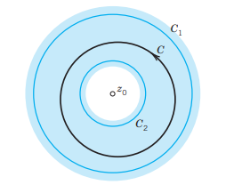
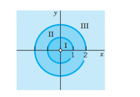
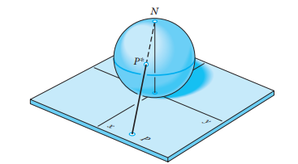

The main purpose of this chapter is to learn about another powerful method for evaluating complex integrals and certain real integrals. It is called **residue integration**. Recall that the first method of evaluating complex integrals consisted of directly applying Cauchy’s integral formula of @sec-cauchy-integral-formula. Then we learned about Taylor series (Chap. 15) and will now generalize Taylor series. The beauty of residue integration, the second method of integration, is that it brings together a lot of the previous material.

Laurent series generalize Taylor series. Indeed, whereas a Taylor series has positive integer powers (and a constant term) and converges in a disk, a Laurent series (@sec-laurent-series-sec) is a series of positive and negative integer powers of $z - z_0$ and converges in an annulus (a circular ring) with center $z_0$. Hence, by a Laurent series, we can represent a given function $f(z)$ that is analytic in an annulus and may have singularities outside the ring as well as in the “hole” of the annulus.

We know that for a given function the Taylor series with a given center is unique. We shall see that, in contrast, a function can have several Laurent series with the same center and valid in several concentric annuli. The most important of these series is the one that converges for $0 < |z - z_0| < R$, that is, everywhere near the center $z_0$ except at $z_0$ itself, where $z_0$ is a singular point of $f(z)$. The series (or finite sum) of the negative powers of this Laurent series is called the **principal part** of the singularity of $f(z)$ at $z_0$ and is used to classify this singularity (@sec-singularities-zeros). The coefficient of the $1/(z - z_0)$ power of this series is called the **residue** of $f(z)$ at $z_0$. Residues are used in an elegant and powerful integration method, called **residue integration**, for complex contour integrals (@sec-residue-integration-method) as well as for certain complicated real integrals (@sec-residue-real-integrals).

**Prerequisite:** Chaps. 13, 14, Sec. 15.2.  
**Sections that may be omitted in a shorter course:** 16.2, 16.4.  
**References and Answers to Problems:** App. 1 Part D, App. 2.

## 16.1 Laurent Series {#sec-laurent-series-sec}

Laurent series generalize Taylor series. If, in an application, we want to develop a function $f(z)$ in powers of $z - z_0$ when $f(z)$ is singular at $z_0$ (as defined in @sec-power-series), we cannot use a Taylor series. Instead we can use a new kind of series, called **Laurent series**,[^1] consisting of positive integer powers of $z - z_0$ (and a constant) as well as negative integer powers of $z - z_0$; this is the new feature.

Laurent series are also used for classifying singularities (@sec-singularities-zeros) and in a powerful integration method (“residue integration,” @sec-residue-integration-method).

A Laurent series of $f(z)$ converges in an annulus (in the “hole” of which $f(z)$ may have singularities), as follows.

### THEOREM 1 Laurent’s Theorem
*Let $f(z)$ be analytic in a domain containing two concentric circles $C_1$ and $C_2$ with center $z_0$ and the annulus between them (blue in @fig-16-370). Then $f(z)$ can be represented by the Laurent series*
$$
f(z) = \sum_{n=0}^{\infty} a_n(z - z_0)^n + \sum_{n=1}^{\infty} \frac{b_n}{(z - z_0)^n}
$$ {#eq-16-1-1}
*consisting of nonnegative and negative powers. The coefficients of this Laurent series are given by the integrals*
$$
a_n = \frac{1}{2\pi i} \oint_C \frac{f(z^*)}{(z^* - z_0)^{n+1}} \, dz^*, \quad b_n = \frac{1}{2\pi i} \oint_C (z^* - z_0)^{n-1} f(z^*) \, dz^*
$$ {#eq-16-1-2}
*taken counterclockwise around any simple closed path $C$ that lies in the annulus and encircles the inner circle, as in @fig-16-370. [The variable of integration is denoted by $z^*$ since $z$ is used in (@eq-16-1-1).]*

*This series converges and represents $f(z)$ in the enlarged open annulus obtained from the given annulus by continuously increasing the outer circle $C_1$ and decreasing $C_2$ until each of the two circles reaches a point where $f(z)$ is singular.*

*In the important special case that $z_0$ is the only singular point of $f(z)$ inside $C_2$, this circle can be shrunk to the point $z_0$, giving convergence in a disk except at the center. In this case the series (or finite sum) of the negative powers of (@eq-16-1-1) is called the **principal part** of $f(z)$ at $z_0$ [or of that Laurent series (@eq-16-1-1)].*

{#fig-16-370 width=35%}

**COMMENT.** Obviously, instead of (@eq-16-1-1), (@eq-16-1-2) we may write (denoting $b_n$ by $a_{-n}$)
$$
f(z) = \sum_{n=-\infty}^{\infty} a_n (z - z_0)^n
$$ {#eq-16-1-3}
where all the coefficients are now given by a single integral formula, namely,
$$
a_n = \frac{1}{2\pi i} \oint_C \frac{f(z^*)}{(z^* - z_0)^{n+1}} \, dz^* \quad (n = 0, \pm 1, \pm 2, \dots).
$$ {#eq-16-1-4}

Let us now prove Laurent’s theorem.

**PROOF**  
**(a) The nonnegative powers are those of a Taylor series.**  
To see this, we use Cauchy’s integral formula in @sec-cauchy-integral-formula with $z^*$ (instead of $z$) as the variable of integration and $z$ instead of $z_0$. Let $g(z)$ and $h(z)$ denote the functions represented by the two terms in Cauchy's formula for a doubly connected domain:
$$
f(z) = g(z) + h(z) = \frac{1}{2\pi i} \oint_{C_1} \frac{f(z^*)}{z^* - z} \, dz^* - \frac{1}{2\pi i} \oint_{C_2} \frac{f(z^*)}{z^* - z} \, dz^*
$$ {#eq-16-1-5}
Here $z$ is any point in the given annulus and we integrate counterclockwise over both $C_1$ and $C_2$, so that the minus sign appears since in Cauchy's formula for a doubly connected domain the integration over $C_2$ is taken clockwise. We transform each of these two integrals as in @sec-taylor-laurent-series. The first integral is precisely as in @sec-taylor-laurent-series. Hence we get exactly the same result, namely, the Taylor series of $g(z)$:
$$
g(z) = \sum_{n=0}^{\infty} a_n (z - z_0)^n
$$ {#eq-16-1-6}
with coefficients [see @sec-taylor-laurent-series, counterclockwise integration]
$$
a_n = \frac{1}{2\pi i} \oint_{C_1} \frac{f(z^*)}{(z^* - z_0)^{n+1}} \, dz^*
$$ {#eq-16-1-7}
Here we can replace $C_1$ by $C$ (see @fig-16-370), by the principle of deformation of path, since the point where the integrand in (@eq-16-1-7) is not analytic, is not a point of the annulus. This proves the formula for the $a_n$ in (@eq-16-1-2).

**(b) The negative powers in (@eq-16-1-1) and the formula for $b_n$ in (@eq-16-1-2) are obtained if we consider $h(z)$.**  
It consists of the second integral times $-1$ in (@eq-16-1-5). Since $z$ lies in the annulus, it lies in the exterior of the path $C_2$. Hence the situation differs from that for the first integral. The essential point is that instead of $|(z - z_0)/(z^* - z_0)| < 1$ we now have
$$
\left| \frac{z^* - z_0}{z - z_0} \right| < 1
$$ {#eq-16-1-8}
Consequently, we must develop the expression $1/(z^* - z)$ in the integrand of the second integral in (@eq-16-1-5) in powers of $(z^* - z_0)/(z - z_0)$ (instead of the reciprocal of this) to get a convergent series. We find
$$
\frac{1}{z^* - z} = -\frac{1}{z - z_0} \frac{1}{1 - \frac{z^* - z_0}{z - z_0}}
$$ {#eq-16-1-9}
Compare this for a moment with the expansion of $1/(z^* - z)$ in @sec-taylor-laurent-series, to really understand the difference. Then go on and apply formula for a finite geometric sum in @sec-sequences-series-tests, obtaining
$$
\frac{1}{z - z^*} = \frac{1}{z - z_0} \left[ 1 + \frac{z^* - z_0}{z - z_0} + \left(\frac{z^* - z_0}{z - z_0}\right)^2 + \dots + \left(\frac{z^* - z_0}{z - z_0}\right)^n \right] + \frac{1}{z - z^*} \left(\frac{z^* - z_0}{z - z_0}\right)^{n+1}
$$ {#eq-16-1-10}
Multiplication by $f(z^*)/2\pi i$ and integration over $C_2$ on both sides now yield
$$
h(z) = \frac{b_1}{z - z_0} + \frac{b_2}{(z - z_0)^2} + \dots + \frac{b_n}{(z - z_0)^n} + R_n^*(z)
$$ {#eq-16-1-11}
with the coefficients given by
$$
b_n = \frac{1}{2\pi i} \oint_{C_2} (z^* - z_0)^{n-1} f(z^*) \, dz^*
$$ {#eq-16-1-12}
and the remainder
$$
R_n^*(z) = \frac{1}{2\pi i (z - z_0)^{n+1}} \oint_{C_2} \frac{(z^* - z_0)^{n+1}}{z - z^*} f(z^*) \, dz^*
$$ {#eq-16-1-13}
As before, we can integrate over $C$ instead of $C_2$ in the integrals on the right. We see that on the right, the power $1/(z - z_0)^n$ is multiplied by $b_n$ as given in (@eq-16-1-2). This establishes Laurent’s theorem, provided
$$
\lim_{n \to \infty} R_n^*(z) = 0
$$ {#eq-16-1-14}

**(c) Convergence proof of (@eq-16-1-14).**  
Very often (@eq-16-1-1) will have only finitely many negative powers. Then there is nothing to be proved. Otherwise, we begin by noting that in (@eq-16-1-13) the expression $f(z^*)/(z - z^*)$ is bounded in absolute value, say,
$$
\left| \frac{f(z^*)}{z - z^*} \right| \le M^*
$$
for all $z^*$ on $C_2$, because $f(z^*)$ is analytic in the annulus and on $C_2$, and $z^*$ lies on $C_2$ and $z$ outside, so that $z - z^* \neq 0$. From this and the ML-inequality (@sec-line-integral) applied to (@eq-16-1-13) we get the inequality ($L = 2\pi r_2 = \text{length of } C_2$, $r_2 = |z^* - z_0| = \text{radius of } C_2$):
$$
|R_n^*(z)| \le \frac{1}{2\pi |z - z_0|^{n+1}} M^* L r_2^{n+1} = \frac{M^* L}{2\pi} \left( \frac{r_2}{|z - z_0|} \right)^{n+1}
$$ {#eq-16-1-15}
From (@eq-16-1-8) we see that the expression on the right approaches zero as $n$ approaches infinity. This proves (@eq-16-1-14). The representation (@eq-16-1-1) with coefficients (@eq-16-1-2) is now established in the given annulus.

**(d) Convergence of (@eq-16-1-1) in the enlarged annulus.**  
The first series in (@eq-16-1-1) is a Taylor series [representing $g(z)$]; hence it converges in the disk $D$ with center $z_0$ whose radius $r_1$ equals the distance of the singularity (or singularities) closest to $z_0$. Also, $f(z)$ must be singular at all points outside $D$ where $f(z)$ is singular.

The second series in (@eq-16-1-1), representing $h(z)$, is a power series in $Z = 1/(z - z_0)$. Let the given annulus be $r_2 < |z - z_0| < r_1$, where $r_2$ and $r_1$ are the radii of $C_2$ and $C_1$ respectively (@fig-16-370). This corresponds to $1/r_1 < |Z| < 1/r_2$. Hence this power series in $Z$ must converge at least in the disk $|Z| < 1/r_2$. This corresponds to the exterior of $C_2$, so that $h(z)$ is analytic for all $z$ outside $C_2$. Also, $f(z)$ must be singular inside $C_2$ where $f(z)$ is singular, and the series of the negative powers of (@eq-16-1-1) converges for all $z$ in the exterior $E$ of the circle with center $z_0$ and radius equal to the maximum distance from $z_0$ to the singularities of $f(z)$ inside $C_2$. The domain common to $D$ and $E$ is the enlarged open annulus characterized near the end of Laurent’s theorem, whose proof is now complete.

**Uniqueness.** The Laurent series of a given analytic function in its annulus of convergence is unique (see Team Project 18). However, $f(z)$ may have different Laurent series in two annuli with the same center $z_0$; see the examples below. The uniqueness is essential. As for a Taylor series, to obtain the coefficients of Laurent series, we do not generally use the integral formulas (@eq-16-1-2); instead, we use various other methods, some of which we shall illustrate in our examples. If a Laurent series has been found by any such process, the uniqueness guarantees that it must be the Laurent series of the given function in the given annulus.

### EXAMPLE 1 Use of Maclaurin Series
Find the Laurent series of $z^{-5} \sin z$ with center 0.

**Solution.** From the Maclaurin series of $\sin z$ in @sec-taylor-laurent-series, we obtain
$$
z^{-5} \sin z = \frac{1}{z^5} \left( z - \frac{z^3}{3!} + \frac{z^5}{5!} - \frac{z^7}{7!} + \dots \right) = \frac{1}{z^4} - \frac{1}{6z^2} + \frac{1}{120} - \frac{z^2}{5040} + \dots
$$
Here the “annulus” of convergence is the whole complex plane without the origin ($0 < |z| < \infty$), and the principal part of the series at 0 is
$$
\frac{1}{z^4} - \frac{1}{6z^2}. \quad \square
$$

### EXAMPLE 2 Substitution
Find the Laurent series of $z^2 e^{1/z}$ with center 0.

**Solution.** From the Maclaurin series of $e^z$ in @sec-taylor-laurent-series with $z$ replaced by $1/z$, we obtain a Laurent series whose principal part is an infinite series:
$$
z^2 e^{1/z} = z^2 \left( 1 + \frac{1}{1! z} + \frac{1}{2! z^2} + \frac{1}{3! z^3} + \dots \right) = z^2 + z + \frac{1}{2} + \frac{1}{6z} + \frac{1}{24z^2} + \dots \quad (|z| > 0). \quad \square
$$

### EXAMPLE 3 Development of $1/(1 - z)$
Develop $1/(1 - z)$ (a) in nonnegative powers of $z$, (b) in negative powers of $z$.

**Solution.**  
(a)
$$
\frac{1}{1 - z} = \sum_{n=0}^{\infty} z^n = 1 + z + z^2 + \dots \quad (\text{valid if } |z| < 1)
$$
(b)
$$
\frac{1}{1 - z} = -\frac{1}{z(1 - 1/z)} = -\frac{1}{z} \sum_{n=0}^{\infty} \frac{1}{z^n} = -\frac{1}{z} - \frac{1}{z^2} - \frac{1}{z^3} - \dots \quad (\text{valid if } |z| > 1). \quad \square
$$

### EXAMPLE 4 Laurent Expansions in Different Concentric Annuli
Find all Laurent series of $1/(z^3 - z^4)$ with center 0.

**Solution.** Multiplying by $1/z^3$ we get from Example 3:
(I)
$$
\frac{1}{z^3 - z^4} = \frac{1}{z^3(1 - z)} = \sum_{n=0}^{\infty} z^{n-3} = \frac{1}{z^3} + \frac{1}{z^2} + \frac{1}{z} + 1 + z + \dots \quad (0 < |z| < 1)
$$
(II)
$$
\frac{1}{z^3 - z^4} = -\sum_{n=0}^{\infty} \frac{1}{z^{n+4}} = -\frac{1}{z^4} - \frac{1}{z^5} - \frac{1}{z^6} - \dots \quad (|z| > 1). \quad \square
$$

### EXAMPLE 5 Use of Partial Fractions
Find all Taylor and Laurent series of $f(z) = \frac{-2z + 3}{z^2 - 3z + 2}$ with center 0.

**Solution.** In terms of partial fractions,
$$
f(z) = -\frac{1}{z - 1} - \frac{1}{z - 2} = \frac{1}{1 - z} - \frac{1}{2 - z}
$$
(a) and (b) in Example 3 take care of the first fraction. For the second fraction,
(c)
$$
-\frac{1}{z - 2} = \frac{1}{2} \frac{1}{1 - z/2} = \sum_{n=0}^{\infty} \frac{1}{2^{n+1}} z^n \quad (\text{valid if } |z| < 2)
$$
(d)
$$
-\frac{1}{z - 2} = -\frac{1}{z} \frac{1}{1 - 2/z} = -\sum_{n=0}^{\infty} \frac{2^n}{z^{n+1}} \quad (\text{valid if } |z| > 2)
$$

(I) From (a) and (c), valid for $|z| < 1$ (see @fig-16-371),
$$
f(z) = \sum_{n=0}^{\infty} \left( 1 + \frac{1}{2^{n+1}} \right) z^n = \frac{3}{2} + \frac{5}{4} z + \frac{9}{8} z^2 + \dots
$$
(II) From (c) and (b), valid for $1 < |z| < 2$,
$$
f(z) = \sum_{n=0}^{\infty} \frac{1}{2^{n+1}} z^n - \sum_{n=0}^{\infty} \frac{1}{z^{n+1}} = \frac{1}{2} + \frac{1}{4} z + \frac{1}{8} z^2 + \dots - \frac{1}{z} - \frac{1}{z^2} - \dots
$$
(III) From (d) and (b), valid for $|z| > 2$,
$$
f(z) = -\sum_{n=0}^{\infty} \frac{2^n + 1}{z^{n+1}} = -\frac{2}{z} - \frac{3}{z^2} - \frac{5}{z^3} - \frac{9}{z^4} - \dots
$$
If in Laurent’s theorem $f(z)$ is analytic inside $C_2$, the coefficients $b_n$ in (@eq-16-1-2) are zero by Cauchy’s integral theorem, so that the Laurent series reduces to a Taylor series. Examples 3(a) and 5(I) illustrate this. $\square$

{#fig-16-371 width=30%}

***

## PROBLEM SET 16.1

### 1–8 LAURENT SERIES NEAR A SINGULARITY AT 0
Expand the function in a Laurent series that converges for $0 < |z| < R$ and determine the precise region of convergence. Show the details of your work.

1. $\frac{\cos z}{z^4}$
2. $\frac{\exp(z^2)}{z^3}$
3. $\frac{\exp(-1/z^2)}{z^2}$
4. $\frac{\sin \pi z}{z^2}$
5. $\frac{1}{z^2 - z^3}$
6. $z^3 \cosh(1/z)$
7. $\frac{\sinh 2z}{z^2}$
8. $\frac{e^z}{z^2 - z^3}$

### 9–16 LAURENT SERIES NEAR A SINGULARITY AT $z_0$
Find the Laurent series that converges for $0 < |z - z_0| < R$ and determine the precise region of convergence. Show details.

9. $\frac{e^z}{(z - 1)^2}, \quad z_0 = 1$
10. $\frac{z^2 - 3i}{(z - 3)^2}, \quad z_0 = 3$
11. $\frac{z^2}{(z - \pi)^4}, \quad z_0 = \pi$
12. $\frac{1}{z^2(z - i)}, \quad z_0 = i$
13. $\frac{z^3}{(z - i)^2}, \quad z_0 = i$
14. $\frac{e^{az}}{z - b}, \quad z_0 = b$
15. $\frac{\cos z}{(z - \pi)^2}, \quad z_0 = \pi$
16. $\frac{\sin z}{(z - \pi/4)^3}, \quad z_0 = \frac{\pi}{4}$

### 17–18 PROJECTS
17. **CAS PROJECT. Partial Fractions.** Write a program for obtaining Laurent series by the use of partial fractions. Using the program, verify the calculations in Example 5 of the text. Apply the program to two other functions of your choice.
18. **TEAM PROJECT. Laurent Series.**  
    (a) **Uniqueness.** Prove that the Laurent expansion of a given analytic function in a given annulus is unique.  
    (b) **Accumulation of singularities.** Does $\tan(1/z)$ have a Laurent series that converges in a region $0 < |z| < R$? (Give a reason.)  
    (c) **Integrals.** Expand the following functions in a Laurent series that converges for $|z| > 0$:
    $$
    \int_0^z \frac{e^t - 1}{t} \, dt, \quad \frac{1}{z^3} \int_0^z \frac{\sin t}{t} \, dt.
    $$

### 19–25 TAYLOR AND LAURENT SERIES
Find all Taylor and Laurent series with center $z_0$. Determine the precise regions of convergence. Show details.

19. $\frac{1}{1 - z^2}, \quad z_0 = 0$
20. $\frac{1}{z}, \quad z_0 = 1$
21. $\frac{\sin z}{z + \pi/2}, \quad z_0 = -\frac{\pi}{2}$
22. $\frac{1}{z^2}, \quad z_0 = i$
23. $\frac{z^8}{1 - z^4}, \quad z_0 = 0$
24. $\frac{\sinh z}{(z - 1)^4}, \quad z_0 = 1$
25. $\frac{z^3 - 2iz^2}{(z - i)^2}, \quad z_0 = i$

[^1]: PIERRE ALPHONSE LAURENT (1813–1854), French military engineer and mathematician, published the theorem in 1843.

## 16.2 Singularities and Zeros. Infinity {#sec-singularities-zeros}

Roughly, a singular point of an analytic function is a $z_0$ at which $f(z)$ ceases to be analytic, and a zero is a $z_0$ at which $f(z_0) = 0$. Precise definitions follow below. In this section we show that Laurent series can be used for classifying singularities and Taylor series for discussing zeros.

Singularities were defined in @sec-power-series, as we shall now recall and extend. We also remember that, by definition, a function is a single-valued relation, as was emphasized in @sec-polar-form.

We say that a function $f(z)$ is **singular** or has a **singularity** at a point $z_0$ if $f(z)$ is not analytic (perhaps not even defined) at $z_0$, but every neighborhood of $z_0$ contains points at which $f(z)$ is analytic. We also say that $z_0$ is a **singular point** of $f(z)$.

We call $z_0$ an **isolated singularity** of $f(z)$ if $z_0$ has a neighborhood without further singularities of $f(z)$. Example: $\tan z$ has isolated singularities at $\pm \pi/2, \pm 3\pi/2, \dots$; $\tan(1/z)$ has a nonisolated singularity at 0. (Explain!)

Isolated singularities of $f(z)$ at $z_0$ can be classified by the Laurent series
$$
f(z) = \sum_{n=0}^{\infty} a_n(z - z_0)^n + \sum_{n=1}^{\infty} \frac{b_n}{(z - z_0)^n}
$$ {#eq-16-2-1}
valid in the immediate neighborhood of the singular point $z_0$ except at $z_0$ itself, that is, in a region of the form
$$
0 < |z - z_0| < R.
$$
The sum of the first series is analytic at $z_0$, as we know from the last section. The second series, containing the negative powers, is called the **principal part** of (@eq-16-2-1), as we remember from the last section. If it has only finitely many terms, it is of the form
$$
\frac{b_1}{z - z_0} + \dots + \frac{b_m}{(z - z_0)^m} \quad (b_m \neq 0).
$$ {#eq-16-2-2}
Then the singularity of $f(z)$ at $z_0$ is called a **pole**, and $m$ is called its **order**. Poles of the first order are also known as **simple poles**.

If the principal part of (@eq-16-2-1) has infinitely many terms, we say that $f(z)$ has at $z_0$ an **isolated essential singularity**.

We leave aside nonisolated singularities.

### EXAMPLE 1 Poles. Essential Singularities
The function
$$
f(z) = \frac{1}{z(z-2)^5} + \frac{3}{(z-2)^2}
$$
has a simple pole at $z = 0$ and a pole of fifth order at $z = 2$. Examples of functions having an isolated essential singularity at $z = 0$ are
$$
e^{1/z} = \sum_{n=0}^{\infty} \frac{1}{n! z^n} = 1 + \frac{1}{z} + \frac{1}{2!z^2} + \dots
$$
and
$$
\sin \frac{1}{z} = \sum_{n=0}^{\infty} \frac{(-1)^n}{(2n+1)! z^{2n+1}} = \frac{1}{z} - \frac{1}{6z^3} + \frac{1}{120z^5} - \dots \quad \square
$$

**Removable Singularities.** We say that a function $f(z)$ has a **removable singularity** at $z_0$ if $f(z)$ is not analytic at $z_0$ but can be made analytic there by assigning a suitable value $f(z_0)$. Such singularities are of no interest since they can be removed as just indicated. Example: $f(z) = (\sin z)/z$ becomes analytic at $z = 0$ if we define $f(0) = 1$.

### EXAMPLE 2 Behavior Near a Pole
$f(z) = 1/z^2$ has a pole at $z = 0$, and $|f(z)| \to \infty$ as $z \to 0$ in any manner. This illustrates the following theorem. $\square$

### THEOREM 1 Poles
*If $f(z)$ is analytic and has a pole at $z_0$, then $|f(z)| \to \infty$ as $z \to z_0$ in any manner.*

### EXAMPLE 3 Behavior Near an Essential Singularity
The function $f(z) = e^{1/z}$ has an essential singularity at $z = 0$. It has no limit for approach along the imaginary axis; it becomes infinite if $z \to 0$ through positive real values, but it approaches zero if $z \to 0$ through negative real values. It takes on any given value $c \neq 0$ in an arbitrarily small neighborhood of $z = 0$.

To see the latter, we set $c = c_0 e^{i\alpha} \neq 0$ and $z = r e^{i\theta}$, and then obtain the following complex equation for $r$ and $\theta$, which we must solve:
$$
e^{1/z} = e^{(\cos \theta - i \sin \theta)/r} = c_0 e^{i\alpha}
$$
Equating the absolute values and the arguments, we have
$$
e^{(\cos \theta)/r} = c_0, \quad \text{that is,} \quad \frac{\cos \theta}{r} = \ln c_0
$$
and
$$
-\frac{\sin \theta}{r} = \alpha + 2n\pi \quad (n = 0, \pm 1, \pm 2, \dots)
$$
respectively. From these two equations and $\cos^2 \theta + \sin^2 \theta = 1$ we obtain the formulas
$$
\tan \theta = -\frac{\alpha + 2n\pi}{\ln c_0} \quad \text{and} \quad r = \frac{\cos \theta}{\ln c_0}.
$$
Hence $r$ can be made arbitrarily small by adding multiples of $2\pi$ to $\alpha$, leaving $c$ unaltered. This illustrates Picard's theorem. $\square$

### THEOREM 2 Picard’s Theorem
*If $f(z)$ is analytic and has an isolated essential singularity at a point $z_0$, it takes on every value, with at most one exceptional value, in an arbitrarily small neighborhood of $z_0$.*

For the rather complicated proof, see Ref. [D4] in App. 1.

### Zeros of Analytic Functions
A **zero** of an analytic function $f(z)$ in a domain $D$ is a $z_0$ in $D$ such that $f(z_0) = 0$. A zero has **order** $n$ if not only $f$ but also the derivatives $f', f'', \dots, f^{(n-1)}$ are all 0 at $z_0$, but $f^{(n)}(z_0) \neq 0$. A first-order zero is also called a **simple zero**. For a second-order zero, $f(z_0) = f'(z_0) = 0$, but $f''(z_0) \neq 0$. And so on.

### EXAMPLE 4 Zeros
- The function $1 + z^2$ has simple zeros at $\pm i$.
- The function $(1 - z^4)^2$ has second-order zeros at $\pm 1$ and $\pm i$.
- The function $(z - a)^3$ has a third-order zero at $z = a$.
- The function $e^z$ has no zeros.
- The function $\sin^2 z$ has second-order zeros at $0, \pm \pi, \pm 2\pi, \dots$.
- The function $\sin z^2$ has a second-order zero at 0, and simple zeros at $\pm \sqrt{n\pi}$ ($n = 1, 2, \dots$).
- The function $(1 - \cos z)^2$ has fourth-order zeros at $0, \pm 2\pi, \pm 4\pi, \dots$. $\square$

**Taylor Series at a Zero.** At an $n$-th order zero of $f(z)$, the derivatives $f(z_0), \dots, f^{(n-1)}(z_0)$ are zero, by definition. Hence the first few coefficients of the Taylor series in @sec-taylor-laurent-series are zero, too, whereas $a_n = f^{(n)}(z_0)/n! \neq 0$, so that this series takes the form
$$
f(z) = a_n(z - z_0)^n + a_{n+1}(z - z_0)^{n+1} + \dots = (z - z_0)^n [a_n + a_{n+1}(z - z_0) + \dots]
$$ {#eq-16-2-3}
where $a_n \neq 0$. This is characteristic of such a zero, because, if $f(z)$ has such a Taylor series, it has an $n$-th order zero at $z_0$, as follows by differentiation.

Whereas nonisolated singularities may occur, for zeros we have:

### THEOREM 3 Zeros
*The zeros of an analytic function $f(z) \neq 0$ are isolated; that is, each of them has a neighborhood that contains no further zeros of $f(z)$.*

**PROOF** The factor $(z - z_0)^n$ in (@eq-16-2-3) is zero only at $z = z_0$. The power series in the brackets represents an analytic function (by Theorem 5 in @sec-functions-given-by-power-series), call it $g(z)$. Now $g(z_0) = a_n \neq 0$, since an analytic function is continuous, and because of this continuity, $g(z) \neq 0$ also in some neighborhood of $z_0$. Hence the same holds for $f(z) = (z - z_0)^n g(z)$. $\square$

Poles are often caused by zeros in the denominator. (Example: $\tan z$ has poles where $\cos z$ is zero.) This is a major reason for the importance of zeros. The key to the connection is the following theorem, whose proof follows from (@eq-16-2-3).

### THEOREM 4 Poles and Zeros
*Let $f(z)$ be analytic at $z_0$ and have a zero of $n$-th order at $z_0$. Then $1/f(z)$ has a pole of $n$-th order at $z_0$. And so does $h(z)/f(z)$, provided $h(z)$ is analytic at $z_0$ and $h(z_0) \neq 0$.*

### Riemann Sphere. Point at Infinity
When we want to study complex functions for large $|z|$, the complex plane will generally become rather inconvenient. Then it may be better to use a representation of complex numbers on the so-called **Riemann sphere**. This is a sphere $S$ of diameter 1 touching the complex $z$-plane at $z = 0$ (@fig-16-372), and we let the image of a point $P$ (a number $z$ in the plane) be the intersection of the segment $PN$ with $S$, where $N$ is the “North Pole” diametrically opposite to the origin in the plane. Then to each $z$ there corresponds a point $P^*$ on $S$.

Conversely, each point $P^*$ on $S$ represents a complex number $z$, except for $N$, which does not correspond to any point in the complex plane. This suggests that we introduce an additional point, called the **point at infinity** and denoted $\infty$ (“infinity”), and let its image be $N$. The complex plane together with $\infty$ is called the **extended complex plane**. The complex plane is often called the **finite complex plane**, for distinction, or simply the complex plane as before. The sphere $S$ is called the **Riemann sphere**. The mapping of the extended complex plane onto the sphere is known as a **stereographic projection**.

*(What is the image of the Northern Hemisphere? Of the Western Hemisphere? Of a straight line through the origin?)*

{#fig-16-372 width=30%}

### Analytic or Singular at Infinity
If we want to investigate a function $f(z)$ for large $z$, we may now set $z = 1/w$ and investigate
$$
g(w) = f(1/w)
$$
in a neighborhood of $w = 0$. We define $f(z)$ to be **analytic** or **singular at infinity** if $g(w)$ is analytic or singular, respectively, at $w = 0$. We also define
$$
f(\infty) = g(0)
$$ {#eq-16-2-4}
if this limit exists.

Furthermore, we say that $f(z)$ has an **$n$-th order zero at infinity** if $g(w)$ has such a zero at $w = 0$. Similarly for poles and essential singularities.

### EXAMPLE 5 Functions Analytic or Singular at Infinity. Entire and Meromorphic Functions
- The function $f(z) = 1/z^2$ is analytic at $\infty$ since $g(w) = f(1/w) = w^2$ is analytic at $w = 0$ and has a second-order zero at $w = 0$.
- The function $f(z) = z^3$ is singular at $\infty$ and has a third-order pole there since the function $g(w) = f(1/w) = 1/w^3$ has such a pole at $w = 0$.
- The function $e^z$ has an essential singularity at $\infty$ since $g(w) = e^{1/w}$ has such a singularity at $w = 0$. Similarly, $\sin z$ and $\cos z$ have an essential singularity at $\infty$. $\square$

Recall that an **entire function** is one that is analytic everywhere in the (finite) complex plane. Liouville’s theorem (@sec-line-integral) tells us that the only bounded entire functions are the constants, hence any nonconstant entire function must be unbounded. Hence it has a singularity at $\infty$: a pole if it is a polynomial or an essential singularity if it is not. The functions just considered are typical in this respect.

An analytic function whose only singularities in the finite plane are poles is called a **meromorphic function**. Examples are rational functions with nonconstant denominator, $\tan z$, $\cot z$, $\sec z$, and $\csc z$.

***

## PROBLEM SET 16.2

### 1–10 ZEROS
Determine the location and order of the zeros.

1. $\sin 2z$
2. $\cos 2z$
3. $(\sin z - 1)^3$
4. $z^4 + (1 - 8i)z^2 - 8i$
5. $\cosh^4 z$
6. $z^2 \sin 2\pi z$
7. $\tan^2 2z (z - 81i)^4$
8. $(z^4 - 81)^3$
9. $\sin^4 \frac{z}{2}$
10. $(z^2 - 8)^3 (\exp(z^2) - 1)$

### 11–12 PROJECTS
11. **Zeros.** If $f(z)$ is analytic and has a zero of order $n$ at $z_0$, show that $f^2(z)$ has a zero of order $2n$ at $z_0$.
12. **TEAM PROJECT. Zeros.**  
    (a) **Derivative.** Show that if $f(z)$ has a zero of order $n$ at $z_0$, then $f'(z)$ has a zero of order $n - 1$ at $z_0$ (where $n > 1$).  
    (b) **Poles and zeros.** Prove Theorem 4.  
    (c) **Isolated $k$-points.** Show that the points at which a nonconstant analytic function has a given value $k$ are isolated.  
    (d) **Identical functions.** If $f_1(z)$ and $f_2(z)$ are analytic in a domain $D$ and equal at a sequence of points in $D$ that converges in $D$, show that $f_1(z) = f_2(z)$ in $D$.

### 13–22 SINGULARITIES
Determine the location of the singularities, including those at infinity. For poles also state the order. Give reasons.

13. $\frac{1}{z^2 + 1}$
14. $\frac{z^3 - z}{z^2 + 1}$
15. $\frac{1}{(z - i)^3}$
16. $\frac{z^2 + 1}{(z - i)^2}$
17. $\frac{e^z - 1}{z^2 + 4}$
18. $\frac{\sin z}{z^2 - z}$
19. $z^3 e^{1/(z-1)}$
20. $\tan \pi z$
21. $\cot^4 z$
22. $\exp(1/(z - 1 - i)^2)$

### 23–25 GENERAL PROBLEMS
23. **Essential singularity.** Discuss $e^{1/z^2}$ in a similar way as $e^{1/z}$ is discussed in Example 3 of the text.
24. **Poles.** Verify Theorem 1 for $f(z) = z^{-3} - z^{-1}$. Prove Theorem 1.
25. **Riemann sphere.** Assuming that we let the image of the $x$-axis be the meridians $0^\circ$ and $180^\circ$, describe and sketch (or graph) the images of the following regions on the Riemann sphere:  
    (a) $|z| > 100$,  
    (b) the lower half-plane,  
    (c) $1/2 < |z| < 2$.

## 16.3 Residue Integration Method {#sec-16-3}

If $f(z)$ is analytic everywhere on a simple closed path $C$ and inside $C$, then by Cauchy's integral theorem (Sec. 14.2),
$$
\oint_C f(z)\,dz = 0.
$$

The situation changes if $f(z)$ has a singularity at a point $z_0$ inside $C$ but is otherwise analytic on $C$ and inside $C$ as before. Then $f(z)$ has a Laurent series
$$
f(z) = \sum_{n=0}^{\infty} a_n (z - z_0)^n + \frac{b_1}{z - z_0} + \frac{b_2}{(z - z_0)^2} + \cdots \quad (0 < |z - z_0| < R).
$$
that converges for all points near $z_0$ (except at $z_0$ itself), in some domain of the form $0 < |z - z_0| < R$ (sometimes called a *deleted neighborhood*, an old-fashioned term that we shall not use). Now comes the key idea. The coefficient $b_1$ of the first negative power $1/(z - z_0)$ of this Laurent series is given by the integral formula (2) in Sec. 16.1 with $n = 1$, namely,
$$
b_1 = \frac{1}{2\pi i} \oint_C f(z)\,dz.
$$

Now, since we can obtain Laurent series by various methods, without using the integral formulas for the coefficients (see the examples in Sec. 16.1), we can find $b_1$ by one of those methods and then use the formula for $b_1$ for evaluating the integral, that is,

$$
\oint_C f(z)\,dz = 2\pi i\, b_1.
$$ {#eq-16-3-1}

Here we integrate counterclockwise around a simple closed path $C$ that contains $z_0$ in its interior (but no other singular points of $f(z)$ on or inside $C$!).

The coefficient $b_1$ is called the **residue** of $f(z)$ at $z_0$ and we denote it by

$$
b_1 = \operatorname{Res}_{z=z_0} f(z).
$$ {#eq-16-3-2}

### EXAMPLE 1 Evaluation of an Integral by Means of a Residue

Integrate the function $f(z) = z^{-4} \sin z$ counterclockwise around the unit circle $C$.

**Solution.** From (14) in Sec. 15.4 we obtain the Laurent series
$$
f(z) = \frac{\sin z}{z^4} = \frac{1}{z^3} - \frac{1}{3!\,z} + \frac{1}{5!} - \frac{z^2}{7!} + \cdots
$$
which converges for $|z| > 0$ (that is, for all $z \ne 0$). This series shows that $f(z)$ has a pole of third order at $z = 0$ and the residue $b_1 = -1/3! = -1/6$. From @eq-16-3-1 we thus obtain the answer
$$
\oint_C \frac{\sin z}{z^4}\,dz = 2\pi i\,b_1 = -\frac{\pi i}{3}. \quad \blacksquare
$$

### EXAMPLE 2 CAUTION! Use the Right Laurent Series!

Integrate $f(z) = 1/(z^3 - z^4)$ clockwise around the circle $C$: $|z| = \tfrac{1}{2}$.

**Solution.** $z^3 - z^4 = z^3(1 - z)$ shows that $f(z)$ is singular at $z = 0$ and $z = 1$. Now $z = 1$ lies outside $C$. Hence it is of no interest here. So we need the residue of $f(z)$ at 0. We find it from the Laurent series that converges for $0 < |z| < 1$. This is series (I) in Example 4, Sec. 16.1,
$$
\frac{1}{z^3 - z^4} = \frac{1}{z^3} + \frac{1}{z^2} + \frac{1}{z} + 1 + z + \cdots \quad (0 < |z| < 1).
$$
We see from it that this residue is 1. Clockwise integration thus yields
$$
\oint_C \frac{dz}{z^3 - z^4} = -2\pi i \operatorname{Res}_{z=0} f(z) = -2\pi i.
$$

**CAUTION!** Had we used the wrong series (II) in Example 4, Sec. 16.1,
$$
\frac{1}{z^3 - z^4} = -\frac{1}{z^4} - \frac{1}{z^5} - \frac{1}{z^6} - \cdots \quad (|z| > 1),
$$
we would have obtained the wrong answer, 0, because this series has no power $1/z$. $\blacksquare$

### Formulas for Residues

To calculate a residue at a pole, we need not produce a whole Laurent series, but, more economically, we can derive formulas for residues once and for all.

**Simple Poles at $z_0$.** A first formula for the residue at a simple pole is

$$
\operatorname{Res}_{z=z_0} f(z) = b_1 = \lim_{z \to z_0} (z - z_0)\,f(z).
$$ {#eq-16-3-3}

A second formula for the residue at a simple pole is

$$
\operatorname{Res}_{z=z_0} f(z) = \operatorname{Res}_{z=z_0} \frac{p(z)}{q(z)} = \frac{p(z_0)}{q'(z_0)}.
$$ {#eq-16-3-4}

In @eq-16-3-4 we assume that $f(z) = p(z)/q(z)$ with $p(z_0) \ne 0$ and $q(z)$ has a simple zero at $z_0$, so that $f(z)$ has a simple pole at $z_0$ by Theorem 4 in Sec. 16.2.

**PROOF** We prove @eq-16-3-3. For a simple pole at $z_0$ the Laurent series (1), Sec. 16.1, is
$$
f(z) = \frac{b_1}{z - z_0} + a_0 + a_1(z - z_0) + a_2(z - z_0)^2 + \cdots \quad (0 < |z - z_0| < R).
$$
Here $b_1 \ne 0$. (Why?) Multiplying both sides by $z - z_0$ and then letting $z \to z_0$, we obtain the formula @eq-16-3-3:
$$
\lim_{z \to z_0} (z - z_0)\,f(z) = b_1 + \lim_{z \to z_0} (z - z_0)[a_0 + a_1(z - z_0) + \cdots] = b_1
$$
where the last equality follows from continuity (Theorem 1, Sec. 15.3).

We prove @eq-16-3-4. The Taylor series of $q(z)$ at a simple zero $z_0$ is
$$
q(z) = (z - z_0)\,q'(z_0) + \frac{(z - z_0)^2}{2!}\,q''(z_0) + \cdots.
$$
Substituting this into $f = p/q$ and then $f$ into @eq-16-3-3 gives
$$
\operatorname{Res}_{z=z_0} f(z) = \lim_{z \to z_0} (z - z_0) \frac{p(z)}{q(z)} = \lim_{z \to z_0} \frac{(z - z_0)\,p(z)}{(z - z_0)[q'(z_0) + (z - z_0)\,q''(z_0)/2 + \cdots]}.
$$
$z - z_0$ cancels. By continuity, the limit of the denominator is $q'(z_0)$ and @eq-16-3-4 follows. $\blacksquare$

### EXAMPLE 3 Residue at a Simple Pole

$f(z) = (9z + i)/(z^3 + z)$ has a simple pole at $z = i$ because $z^2 + 1 = (z + i)(z - i)$, and @eq-16-3-3 gives the residue
$$
\operatorname{Res}_{z=i} \frac{9z + i}{z(z^2 + 1)} = \lim_{z \to i} (z - i) \frac{9z + i}{z(z + i)(z - i)} = \left[\frac{9z + i}{z(z + i)}\right]_{z=i} = \frac{10i}{-2} = -5i.
$$

By @eq-16-3-4 with $p(i) = 9i + i = 10i$ and $q'(z) = 3z^2 + 1$, we confirm the result,
$$
\operatorname{Res}_{z=i} \frac{9z + i}{z(z^2 + 1)} = \left[\frac{9z + i}{3z^2 + 1}\right]_{z=i} = \frac{10i}{-2} = -5i. \quad \blacksquare
$$

**Poles of Any Order at $z_0$.** The residue of $f(z)$ at an $m$th-order pole at $z_0$ is

$$
\operatorname{Res}_{z=z_0} f(z) = \frac{1}{(m-1)!} \lim_{z \to z_0} \frac{d^{m-1}}{dz^{m-1}} \left[(z - z_0)^m f(z)\right].
$$ {#eq-16-3-5}

In particular, for a **second-order pole** $(m = 2)$,

$$
\operatorname{Res}_{z=z_0} f(z) = \lim_{z \to z_0} \left\{ \left[(z - z_0)^2 f(z)\right]' \right\}.
$$ {#eq-16-3-5star}

**PROOF** We prove @eq-16-3-5. The Laurent series of $f(z)$ converging near $z_0$ (except at $z_0$ itself) is (Sec. 16.2)
$$
f(z) = \frac{b_m}{(z - z_0)^m} + \frac{b_{m-1}}{(z - z_0)^{m-1}} + \cdots + \frac{b_1}{z - z_0} + a_0 + a_1(z - z_0) + \cdots
$$
where $b_m \ne 0$. The residue wanted is $b_1$. Multiplying both sides by $(z - z_0)^m$ gives
$$
(z - z_0)^m f(z) = b_m + b_{m-1}(z - z_0) + \cdots + b_1(z - z_0)^{m-1} + a_0(z - z_0)^m + \cdots.
$$
We see that $b_1$ is now the coefficient of the $(m-1)$th power $(z - z_0)^{m-1}$ of the power series of $g(z) = (z - z_0)^m f(z)$. Hence Taylor's theorem (Sec. 15.4) gives @eq-16-3-5:
$$
b_1 = \frac{1}{(m-1)!}\,g^{(m-1)}(z_0) = \frac{1}{(m-1)!} \lim_{z \to z_0} \frac{d^{m-1}}{dz^{m-1}}\left[(z - z_0)^m f(z)\right]. \quad \blacksquare
$$

### EXAMPLE 4 Residue at a Pole of Higher Order

$f(z) = 50z/(z^3 + 2z^2 - 7z + 4)$ has a pole of second order at $z = 1$ because the denominator equals $(z + 4)(z - 1)^2$ (verify!). From @eq-16-3-5star we obtain the residue
$$
\operatorname{Res}_{z=1} f(z) = \lim_{z \to 1} \frac{d}{dz}\left[(z - 1)^2 f(z)\right] = \lim_{z \to 1} \frac{d}{dz}\left(\frac{50z}{z + 4}\right) = \frac{200}{25} = 8. \quad \blacksquare
$$

### Several Singularities Inside the Contour. Residue Theorem

Residue integration can be extended from the case of a single singularity to the case of several singularities within the contour $C$. This is the purpose of the residue theorem. The extension is surprisingly simple.

### THEOREM 1 Residue Theorem {#thm-16-3-residue}

*Let $f(z)$ be analytic inside a simple closed path $C$ and on $C$, except for finitely many singular points $z_1, z_2, \ldots, z_k$ inside $C$. Then the integral of $f(z)$ taken counterclockwise around $C$ equals $2\pi i$ times the sum of the residues of $f(z)$ at $z_1, \ldots, z_k$:*

$$
\oint_C f(z)\,dz = 2\pi i \sum_{j=1}^{k} \operatorname{Res}_{z=z_j} f(z).
$$ {#eq-16-3-6}

{#fig-16-373}

**PROOF** We enclose each of the singular points $z_j$ in a circle $C_j$ with radius small enough that those $k$ circles and $C$ are all separated (@fig-16-373 where $k = 3$). Then $f(z)$ is analytic in the multiply connected domain $D$ bounded by $C$ and $C_1, \ldots, C_k$ and on the entire boundary of $D$. From Cauchy's integral theorem we thus have

$$
\oint_C f(z)\,dz + \oint_{C_1} f(z)\,dz + \oint_{C_2} f(z)\,dz + \cdots + \oint_{C_k} f(z)\,dz = 0,
$$ {#eq-16-3-7}

the integral along $C$ being taken counterclockwise and the other integrals clockwise (as in Figs. 354 and 355, Sec. 14.2). We take the integrals over $C_1, \ldots, C_k$ to the right and compensate the resulting minus sign by reversing the sense of integration. Thus,

$$
\oint_C f(z)\,dz = \oint_{C_1} f(z)\,dz + \oint_{C_2} f(z)\,dz + \cdots + \oint_{C_k} f(z)\,dz
$$ {#eq-16-3-8}

where all the integrals are now taken counterclockwise. By @eq-16-3-1 and @eq-16-3-2,
$$
\oint_{C_j} f(z)\,dz = 2\pi i \operatorname{Res}_{z=z_j} f(z), \quad j = 1, \ldots, k,
$$
so that @eq-16-3-8 gives @eq-16-3-6 and the residue theorem is proved. $\blacksquare$

This important theorem has various applications in connection with complex and real integrals. Let us first consider some complex integrals. (Real integrals follow in the next section.)

### EXAMPLE 5 Integration by the Residue Theorem. Several Contours

Evaluate the following integral counterclockwise around any simple closed path such that (a) 0 and 1 are inside $C$, (b) 0 is inside, 1 outside, (c) 1 is inside, 0 outside, (d) 0 and 1 are outside.

$$
\oint_C \frac{4 - 3z}{z^2 - z}\,dz
$$

**Solution.** The integrand has simple poles at 0 and 1, with residues [by @eq-16-3-3]
$$
\operatorname{Res}_{z=0} \frac{4 - 3z}{z(z - 1)} = \left[\frac{4 - 3z}{z - 1}\right]_{z=0} = -4, \qquad \operatorname{Res}_{z=1} \frac{4 - 3z}{z(z - 1)} = \left[\frac{4 - 3z}{z}\right]_{z=1} = 1.
$$
[Confirm this by @eq-16-3-4.] **Answer:** (a) $2\pi i(-4 + 1) = -6\pi i$, (b) $-8\pi i$, (c) $2\pi i$, (d) 0. $\blacksquare$

### EXAMPLE 6 Another Application of the Residue Theorem

Integrate $(\tan z)/(z^2 - 1)$ counterclockwise around the circle $C$: $|z| = \tfrac{3}{2}$.

**Solution.** $\tan z$ is not analytic at $\pm \pi/2, \pm 3\pi/2, \ldots$, but all these points lie outside the contour $C$. Because of the denominator $z^2 - 1 = (z - 1)(z + 1)$, the given function has simple poles at $\pm 1$. We thus obtain from @eq-16-3-4 and the residue theorem
$$
\oint_C \frac{\tan z}{z^2 - 1}\,dz = 2\pi i \left[\frac{\tan z}{2z}\bigg|_{z=1} + \frac{\tan z}{2z}\bigg|_{z=-1}\right] = 2\pi i \cdot \tan 1 \approx 9.7855i. \quad \blacksquare
$$

### EXAMPLE 7 Poles and Essential Singularities

Evaluate the following integral, where $C$ is the ellipse $9x^2 + y^2 = 9$ (counterclockwise, sketch it).

$$
\oint_C \left(\frac{z\,e^{\pi z}}{z^4 - 16} + z\,e^{\pi/z}\right)\,dz.
$$

**Solution.** Since $z^4 - 16 = 0$ at $z = \pm 2$ and $z = \pm 2i$, the first term of the integrand has simple poles at $\pm 2i$ inside $C$, with residues [by @eq-16-3-4; note that $e^{2\pi i} = 1$]
$$
\operatorname{Res}_{z=2i} \frac{z\,e^{\pi z}}{z^4 - 16} = \left[\frac{z\,e^{\pi z}}{4z^3}\right]_{z=2i} = -\frac{1}{16}, \qquad \operatorname{Res}_{z=-2i} \frac{z\,e^{\pi z}}{z^4 - 16} = \left[\frac{z\,e^{\pi z}}{4z^3}\right]_{z=-2i} = -\frac{1}{16},
$$
and simple poles at $\pm 2$, which lie outside $C$, so that they are of no interest here. The second term of the integrand has an essential singularity at 0, with residue $\pi^2/2$ as obtained from
$$
z\,e^{\pi/z} = z\left(1 + \frac{\pi}{z} + \frac{\pi^2}{2!\,z^2} + \frac{\pi^3}{3!\,z^3} + \cdots\right) = z + \pi + \frac{\pi^2}{2} \cdot \frac{1}{z} + \cdots \quad (|z| > 0).
$$

**Answer:** by the residue theorem,
$$
2\pi i\left(-\frac{1}{16} - \frac{1}{16} + \frac{\pi^2}{2}\right) = \pi\left(\pi^2 - \frac{1}{4}\right)i \approx 30.221i. \quad \blacksquare
$$

### Problem Set 16.3 {#sec-ps-16-3}

**1.** Verify the calculations in Example 3 and find the other residues.

**2.** Verify the calculations in Example 4 and find the other residue.

### 3–12 RESIDUES
Find all the singularities in the finite plane and the corresponding residues. Show the details.

3. $\dfrac{\sin 2z}{z^6}$
4. $\dfrac{\cos z}{z^4}$
5. $\tan z$
6. $\dfrac{8}{1 + z^2}$
7. $\cot \pi z$
8. $\dfrac{\pi}{(z^2 + 1)^2}$
9. $\dfrac{1}{1 - e^z}$
10. $\dfrac{z^4}{z^2 - iz + 2}$
11. $e^{1/(1-z)}$
12. $\dfrac{(z - \pi i)^3}{e^z}$

**13. CAS PROJECT. Residue at a Pole.** Write a program for calculating the residue at a pole of any order in the finite plane. Use it for solving Probs. 5–10.

### 14–25 RESIDUE INTEGRATION
Evaluate (counterclockwise). Show the details.

14. $\displaystyle\oint_C \frac{z - 23}{z^2 - 4z + 5}\,dz$, $C$: $|z - 2 - i| = 3.2$

15. $\displaystyle\oint_C \tan 2\pi z\,dz$, $C$: $|z - 0.2| = 0.2$

16. $\displaystyle\oint_C \frac{\sinh z}{2z - i}\,dz$, the unit circle

17. $\displaystyle\oint_C \frac{z + 1}{z^4 - 2z^3}\,dz$, $C$: $|z - 1| = 2$

18. $\displaystyle\oint_C \frac{e^z}{\cos z}\,dz$, $C$: $|z - \pi/2| = 4.5$

19. $\displaystyle\oint_C e^{1/z}\,dz$, $C$: the unit circle

20. $\displaystyle\oint_C \frac{\cos \pi z}{z^5}\,dz$, $C$: $|z| = \tfrac{1}{2}$

21. $\displaystyle\oint_C \frac{dz}{(z^2 + 1)^3}$, $C$: $|z - i| = 3$

22. $\displaystyle\oint_C \frac{z\,\cosh \pi z}{z^4 - 13z^2 + 36}\,dz$, the unit circle

23. $\displaystyle\oint_C \frac{z^2 \sin z}{4z^2 - 1}\,dz$, $C$: $|z| = \pi$

24. $\displaystyle\oint_C \frac{30z^2 - 23z + 5}{(2z - 1)^2(3z - 1)}\,dz$, $C$: the unit circle

25. $\displaystyle\oint_C \frac{\exp(-z^2)}{\sin 4z}\,dz$, $C$: $|z| = 1.5$

## 16.4 Residue Integration of Real Integrals {#sec-16-4}

Surprisingly, residue integration can also be used to evaluate certain classes of complicated real integrals. This shows an advantage of complex analysis over real analysis or calculus.

### Integrals of Rational Functions of $\cos\theta$ and $\sin\theta$

We first consider integrals of the type

$$
J = \int_0^{2\pi} F(\cos\theta,\, \sin\theta)\,d\theta
$$ {#eq-16-4-1}

where $F$ is a real rational function of $\cos\theta$ and $\sin\theta$ [for example, $(\sin^2\theta)/\sin\theta$, $(5 - 4\cos\theta)$] and is finite (does not become infinite) on the interval of integration. Setting $e^{i\theta} = z$, we obtain

$$
\cos\theta = \frac{1}{2}\left(z + \frac{1}{z}\right), \qquad \sin\theta = \frac{1}{2i}\left(z - \frac{1}{z}\right), \qquad d\theta = \frac{dz}{iz}.
$$ {#eq-16-4-2}

Since $F$ is rational in $\cos\theta$ and $\sin\theta$, @eq-16-4-2 shows that $F$ is now a rational function of $z$, say, $f(z)$. Since $d\theta = dz/(iz)$, we have $J = \oint_C f(z)\,dz/iz$, and, as $\theta$ ranges from 0 to $2\pi$ in @eq-16-4-1, the variable $z$ ranges counterclockwise once around the unit circle $C$. (Review Sec. 13.5 if necessary.)

$$
J = \oint_C \frac{f(z)}{iz}\,dz.
$$ {#eq-16-4-3}

### EXAMPLE 1 An Integral of the Type (1)

Show by the present method that
$$
\int_0^{2\pi} \frac{d\theta}{\frac{1}{2} - \cos\theta} = 2\pi.
$$

**Solution.** We use $\cos\theta = \frac{1}{2}(z + 1/z)$ and $d\theta = dz/(iz)$. Then the integral becomes
$$
\oint_C \frac{dz/iz}{\frac{1}{2} - \frac{1}{2}(z + 1/z)} = \oint_C \frac{dz}{-\frac{i}{2}(z^2 - 2\tfrac{1}{2}z + 1)} = -\frac{2}{i} \oint_C \frac{dz}{(z^2 - \frac{1}{2}z + 1)(z^2 - \frac{1}{2}z - 1)}.
$$
We see that the integrand has a simple pole at $z_1 = \frac{1}{2} + 1$ outside the unit circle $C$, so that it is of no interest here, and another simple pole at $z_2 = \frac{1}{2} - 1$ (where $|z_2| < 1$) inside $C$ with residue [by @eq-16-3-3]
$$
\operatorname{Res}_{z=z_2} \frac{1}{(z^2 - \frac{1}{2}z + 1)(z^2 - \frac{1}{2}z - 1)} = -\frac{1}{2}.
$$

**Answer:** $(-2/i) \cdot 2\pi i \cdot (-1/2) = 2\pi$. (Here $-2/i$ is the factor in front of the last integral.) $\blacksquare$

### Improper Integrals from $-\infty$ to $\infty$

As another large class, let us consider real integrals of the form

$$
\int_{-\infty}^{\infty} f(x)\,dx.
$$ {#eq-16-4-4}

Such an integral, whose interval of integration is not finite, is called an **improper integral**, and it has the meaning

$$
\int_{-\infty}^{\infty} f(x)\,dx = \lim_{a \to -\infty} \int_0^{a} f(x)\,dx + \lim_{b \to \infty} \int_0^{b} f(x)\,dx.
$$ {#eq-16-4-5r}

If both limits exist, we may couple the two independent passages to $-\infty$ and $\infty$, and write

$$
\int_{-\infty}^{\infty} f(x)\,dx = \lim_{R \to \infty} \int_{-R}^{R} f(x)\,dx.
$$ {#eq-16-4-5}

The limit in @eq-16-4-5 is called the **Cauchy principal value** of the integral. It is written

$$
\text{pr.\ v.} \int_{-\infty}^{\infty} f(x)\,dx.
$$

It may exist even if the limits in @eq-16-4-5r do not. Example:
$$
\lim_{R \to \infty} \int_{-R}^{R} x\,dx = \lim_{R \to \infty} \left(\frac{R^2}{2} - \frac{R^2}{2}\right) = 0, \quad \text{but} \quad \lim_{b \to \infty} \int_0^b x\,dx = \infty.
$$

We assume that the function $f(x)$ in @eq-16-4-4 is a real rational function whose denominator is different from zero for all real $x$ and is of degree at least two units higher than the degree of the numerator. Then the limits in @eq-16-4-5r exist, and we may start from @eq-16-4-5. We consider the corresponding contour integral

$$
\oint_C f(z)\,dz
$$ {#eq-16-4-5star}

around a path $C$ in @fig-16-374. Since $f(x)$ is rational, $f(z)$ has finitely many poles in the upper half-plane, and if we choose $R$ large enough, then $C$ encloses all these poles. By the residue theorem we then obtain

$$
\oint_C f(z)\,dz = \int_S f(z)\,dz + \int_{-R}^{R} f(x)\,dx = 2\pi i \sum \operatorname{Res} f(z)
$$

where the sum consists of all the residues of $f(z)$ at the points in the upper half-plane at which $f(z)$ has a pole. From this we have

$$
\int_{-R}^{R} f(x)\,dx = 2\pi i \sum \operatorname{Res} f(z) - \int_S f(z)\,dz.
$$ {#eq-16-4-6}

{#fig-16-374}

We prove that, if $R \to \infty$, the value of the integral over the semicircle $S$ approaches zero. If we set $z = Re^{i\theta}$, then $S$ is represented by $R = \text{const}$, and as $z$ ranges along $S$, the variable $\theta$ ranges from 0 to $\pi$. Since, by assumption, the degree of the denominator of $f(z)$ is at least two units higher than the degree of the numerator, we have

$$
|f(z)| \le \frac{k}{|z|^2} \qquad (|z| = R > R_0)
$$

for sufficiently large constants $k$ and $R_0$. By the ML-inequality in Sec. 14.1,

$$
\left|\int_S f(z)\,dz\right| \le \frac{k}{R^2} \cdot \pi R = \frac{k\pi}{R} \qquad (R > R_0).
$$

Hence, as $R$ approaches infinity, the value of the integral over $S$ approaches zero, and @eq-16-4-5 and @eq-16-4-6 yield the result

$$
\int_{-\infty}^{\infty} f(x)\,dx = 2\pi i \sum \operatorname{Res} f(z)
$$ {#eq-16-4-7}

where we sum over all the residues of $f(z)$ at the poles of $f(z)$ in the upper half-plane.

### EXAMPLE 2 An Improper Integral from 0 to $\infty$

Using @eq-16-4-7, show that
$$
\int_0^{\infty} \frac{dx}{1 + x^4} = \frac{\pi}{2\sqrt{2}}.
$$

**Solution.** Indeed, $f(z) = 1/(1 + z^4)$ has four simple poles at the points (make a sketch)
$$
z_1 = e^{i\pi/4}, \quad z_2 = e^{3i\pi/4}, \quad z_3 = e^{-3i\pi/4}, \quad z_4 = e^{-i\pi/4}.
$$

{#fig-16-375}

The first two of these poles lie in the upper half-plane (@fig-16-375). From @eq-16-3-4 in the last section we find the residues
$$
\operatorname{Res}_{z=z_1} f(z) = \left[\frac{1}{4z^3}\right]_{z=z_1} = \frac{1}{4}\,e^{-3i\pi/4} = -\frac{1}{4}\,e^{i\pi/4},
$$
$$
\operatorname{Res}_{z=z_2} f(z) = \left[\frac{1}{4z^3}\right]_{z=z_2} = \frac{1}{4}\,e^{-9i\pi/4} = \frac{1}{4}\,e^{-i\pi/4}.
$$

(Here we used $e^{i\pi} = -1$ and $e^{-2\pi i} = 1$.) By (1) in Sec. 13.6 and @eq-16-4-7 in this section,
$$
\int_{-\infty}^{\infty} \frac{dx}{1 + x^4} = -\frac{2\pi i}{4}\left(e^{i\pi/4} - e^{-i\pi/4}\right) = -\frac{2\pi i}{4} \cdot 2i\sin\frac{\pi}{4} = \pi\sin\frac{\pi}{4} = \frac{\pi}{\sqrt{2}}.
$$

Since $1/(1 + x^4)$ is an even function, we thus obtain, as asserted,
$$
\int_0^{\infty} \frac{dx}{1 + x^4} = \frac{1}{2} \int_{-\infty}^{\infty} \frac{dx}{1 + x^4} = \frac{\pi}{2\sqrt{2}}. \quad \blacksquare$
$$

### Fourier Integrals

The method of evaluating @eq-16-4-4 by creating a closed contour (@fig-16-374) and "blowing it up" extends to integrals

$$
\int_{-\infty}^{\infty} f(x)\cos sx\,dx \qquad \text{and} \qquad \int_{-\infty}^{\infty} f(x)\sin sx\,dx \qquad (s \text{ real})
$$ {#eq-16-4-8}

as they occur in connection with the Fourier integral (Sec. 11.7).

If $f(x)$ is a rational function satisfying the assumption on the degree as for @eq-16-4-4, we may consider the corresponding integral

$$
\oint_C f(z)\,e^{isz}\,dz \qquad (s \text{ real and positive})
$$

over the contour $C$ in @fig-16-374. Instead of @eq-16-4-7 we now get

$$
\int_{-\infty}^{\infty} f(x)\,e^{isx}\,dx = 2\pi i \sum \operatorname{Res}\left[f(z)\,e^{isz}\right] \qquad (s > 0)
$$ {#eq-16-4-9}

where we sum the residues of $f(z)\,e^{isz}$ at its poles in the upper half-plane. Equating the real and the imaginary parts on both sides of @eq-16-4-9, we have

$$
\int_{-\infty}^{\infty} f(x)\cos sx\,dx = -2\pi \sum \operatorname{Im}\operatorname{Res}\left[f(z)\,e^{isz}\right],
$$
$$
\int_{-\infty}^{\infty} f(x)\sin sx\,dx = 2\pi \sum \operatorname{Re}\operatorname{Res}\left[f(z)\,e^{isz}\right].
$$ {#eq-16-4-10}

To establish @eq-16-4-9, we must show [as for @eq-16-4-4] that the value of the integral over the semicircle $S$ in @fig-16-374 approaches 0 as $R \to \infty$. Now $s > 0$ and $S$ lies in the upper half-plane $y \ge 0$. Hence

$$
|e^{isz}| = |e^{is(x+iy)}| = |e^{isx}|\,|e^{-sy}| = 1 \cdot e^{-sy} \le 1 \qquad (s > 0,\; y \ge 0).
$$

From this we obtain the inequality $|f(z)\,e^{isz}| = |f(z)|\,|e^{isz}| \le |f(z)|$ $(s > 0,\; y \ge 0)$. This reduces our present problem to that for @eq-16-4-4. Continuing as before gives @eq-16-4-9 and @eq-16-4-10.

### EXAMPLE 3 An Application of (10)

Show that
$$
\int_{-\infty}^{\infty} \frac{\cos sx}{k^2 + x^2}\,dx = \frac{\pi}{k}\,e^{-ks}, \qquad \int_{-\infty}^{\infty} \frac{\sin sx}{k^2 + x^2}\,dx = 0 \qquad (s > 0,\; k > 0).
$$

**Solution.** In fact, $e^{isz}/(k^2 + z^2)$ has only one pole in the upper half-plane, namely, a simple pole at $z = ik$, and from @eq-16-3-4 in Sec. 16.3 we obtain

$$
\operatorname{Res}_{z=ik} \frac{e^{isz}}{k^2 + z^2} = \left[\frac{e^{isz}}{2z}\right]_{z=ik} = \frac{e^{-ks}}{2ik}.
$$

Thus
$$
\int_{-\infty}^{\infty} \frac{e^{isx}}{k^2 + x^2}\,dx = 2\pi i \cdot \frac{e^{-ks}}{2ik} = \frac{\pi}{k}\,e^{-ks}.
$$

Since $e^{isx} = \cos sx + i\sin sx$, this yields the above results [see also (15) in Sec. 11.7.] $\blacksquare$

### Another Kind of Improper Integral

We consider an improper integral

$$
\int_A^B f(x)\,dx
$$ {#eq-16-4-11}

whose integrand becomes infinite at a point $a$ in the interval of integration, $\lim_{x \to a} |f(x)| = \infty$. By definition, this integral @eq-16-4-11 means

$$
\int_A^B f(x)\,dx = \lim_{\varepsilon \to 0} \int_A^{a-\varepsilon} f(x)\,dx + \lim_{h \to 0} \int_{a+h}^B f(x)\,dx
$$ {#eq-16-4-12}

where both $\varepsilon$ and $h$ approach zero independently and through positive values. It may happen that neither of these two limits exists if $\varepsilon$ and $h$ go to 0 independently, but the limit

$$
\lim_{\varepsilon \to 0} \left[\int_A^{a-\varepsilon} f(x)\,dx + \int_{a+\varepsilon}^B f(x)\,dx\right]
$$ {#eq-16-4-13}

exists. This is called the **Cauchy principal value** of the integral. It is written

$$
\text{pr.\ v.} \int_A^B f(x)\,dx.
$$

For example,
$$
\text{pr.\ v.} \int_{-1}^{1} \frac{dx}{x^3} = \lim_{\varepsilon \to 0} \left[\int_{-1}^{-\varepsilon} \frac{dx}{x^3} + \int_{\varepsilon}^{1} \frac{dx}{x^3}\right] = 0;
$$
the principal value exists, although the integral itself has no meaning.

In the case of simple poles on the real axis we shall obtain a formula for the principal value of an integral from $-\infty$ to $\infty$. This formula will result from the following theorem.

### THEOREM 1 Simple Poles on the Real Axis {#thm-16-4-poles-real}

*If $f(z)$ has a simple pole at $z = a$ on the real axis, then (@fig-16-376)*
$$
\lim_{r \to 0} \int_{C_2} f(z)\,dz = \pi i\,\operatorname{Res}_{z=a} f(z).
$$

{#fig-16-376}

**PROOF** By the definition of a simple pole (Sec. 16.2) the integrand has for $0 < |z - a| < R$ the Laurent series
$$
f(z) = \frac{b_1}{z - a} + g(z), \qquad b_1 = \operatorname{Res}_{z=a} f(z).
$$
Here $g(z)$ is analytic on the semicircle of integration (@fig-16-376)
$$
C_2: \quad z = a + re^{i\theta}, \qquad 0 \le \theta \le \pi
$$
and for all $z$ between $C_2$ and the $x$-axis, and thus bounded on $C_2$, say, $|g(z)| \le M$. By integration,
$$
\int_{C_2} f(z)\,dz = \int_0^{\pi} \frac{b_1}{re^{i\theta}}\,ire^{i\theta}\,d\theta + \int_{C_2} g(z)\,dz = b_1\pi i + \int_{C_2} g(z)\,dz.
$$
The second integral on the right cannot exceed $M\pi r$ in absolute value, by the ML-inequality (Sec. 14.1), and $M\pi r \to 0$ as $r \to 0$. $\blacksquare$

{#fig-16-377}

@fig-16-377 shows the idea of applying Theorem 1 to obtain the principal value of the integral of a rational function from $-\infty$ to $\infty$. For sufficiently large $R$ the integral over the entire contour in @fig-16-377 has the value $J$ given by $2\pi i$ times the sum of the residues of $f(z)$ at the singularities in the upper half-plane. We assume that $f(x)$ satisfies the degree condition imposed in connection with @eq-16-4-4. Then the value of the integral over the large semicircle $S$ approaches 0 as $R \to \infty$. For the integral over $C_2$ (clockwise!) $r \to 0$ approaches the value

$$
K = -\pi i\,\operatorname{Res}_{z=a} f(z)
$$

by Theorem 1. Together this shows that the principal value $P$ of the integral from $-\infty$ to $\infty$ plus $K$ equals $J$; hence $P = J - K = J + \pi i\,\operatorname{Res}_{z=a} f(z)$. If $f(z)$ has several simple poles on the real axis, then $K$ will be $-\pi i$ times the sum of the corresponding residues. Hence the desired formula is

$$
\text{pr.\ v.} \int_{-\infty}^{\infty} f(x)\,dx = 2\pi i \sum \operatorname{Res} f(z) + \pi i \sum \operatorname{Res} f(z)
$$ {#eq-16-4-14}

where the first sum extends over all poles in the upper half-plane and the second over all poles on the real axis, the latter being simple by assumption.

### EXAMPLE 4 Poles on the Real Axis

Find the principal value
$$
\text{pr.\ v.} \int_{-\infty}^{\infty} \frac{dx}{(x^2 - 3x + 2)(x^2 + 1)}.
$$

**Solution.** Since $x^2 - 3x + 2 = (x - 1)(x - 2)$, the integrand $f(x)$, considered for complex $z$, has simple poles at
$$
z = 1, \quad \operatorname{Res}_{z=1} f(z) = \left[\frac{1}{(z - 2)(z^2 + 1)}\right]_{z=1} = -\frac{1}{2} + \frac{1}{5},
$$
$$
z = 2, \quad \operatorname{Res}_{z=2} f(z) = \left[\frac{1}{(z - 1)(z^2 + 1)}\right]_{z=2} = \frac{1}{5},
$$
$$
z = i, \quad \operatorname{Res}_{z=i} f(z) = \left[\frac{1}{(z^2 - 3z + 2)(z + i)}\right]_{z=i} = \frac{3 - i}{20},
$$
and at $z = -i$ in the lower half-plane, which is of no interest here. From @eq-16-4-14 we get the answer
$$
\text{pr.\ v.} \int_{-\infty}^{\infty} \frac{dx}{(x^2 - 3x + 2)(x^2 + 1)} = 2\pi i\left(\frac{3 - i}{20}\right) + \pi i\left(-\frac{1}{2} + \frac{1}{5}\right) = \frac{\pi}{10}. \quad \blacksquare$
$$

More integrals of the kind considered in this section are included in the problem set. Try also your CAS, which may sometimes give you false results on complex integrals.

### Problem Set 16.4 {#sec-ps-16-4}

### 1–9 INTEGRALS INVOLVING COSINE AND SINE
Evaluate the following integrals and show the details of your work.

1. $\displaystyle\int_0^{\pi} \frac{2\,d\theta}{k - \cos\theta}$

2. $\displaystyle\int_0^{\pi} \frac{d\theta}{\pi + 3\cos\theta}$

3. $\displaystyle\int_0^{2\pi} \frac{1 + \sin\theta}{3 + \cos\theta}\,d\theta$

4. $\displaystyle\int_0^{2\pi} \frac{1 + 4\cos\theta}{17 - 8\cos\theta}\,d\theta$

5. $\displaystyle\int_0^{2\pi} \frac{\cos^2\theta}{5 - 4\cos\theta}\,d\theta$

6. $\displaystyle\int_0^{2\pi} \frac{\sin^2\theta}{5 - 4\cos\theta}\,d\theta$

7. $\displaystyle\int_0^{2\pi} \frac{a}{a - \sin\theta}\,d\theta$

8. $\displaystyle\int_0^{2\pi} \frac{1}{8 - 2\sin\theta}\,d\theta$

9. $\displaystyle\int_0^{2\pi} \frac{\cos\theta}{13 - 12\cos 2\theta}\,d\theta$

### 10–22 IMPROPER INTEGRALS: INFINITE INTERVAL OF INTEGRATION
Evaluate the following integrals and show details of your work.

10. $\displaystyle\int_{-\infty}^{\infty} \frac{dx}{(1 + x^2)^2}$

11. $\displaystyle\int_{-\infty}^{\infty} \frac{dx}{(1 + x^2)^3}$

12. $\displaystyle\int_{-\infty}^{\infty} \frac{dx}{(x^2 - 2x + 5)^2}$

13. $\displaystyle\int_{-\infty}^{\infty} \frac{x}{(x^2 + 1)(x^2 + 4)}\,dx$

14. $\displaystyle\int_{-\infty}^{\infty} \frac{x^2 + 1}{x^4 + 1}\,dx$

15. $\displaystyle\int_{-\infty}^{\infty} \frac{x^2}{x^6 + 1}\,dx$

16. $\displaystyle\int_{-\infty}^{\infty} \frac{\cos 2x}{(x^2 + 1)^2}\,dx$

17. $\displaystyle\int_{-\infty}^{\infty} \frac{\sin 3x}{x^4 + 1}\,dx$

18. $\displaystyle\int_{-\infty}^{\infty} \frac{\cos 4x}{x^4 + 5x^2 + 4}\,dx$

19. $\displaystyle\int_{-\infty}^{\infty} \frac{dx}{x^4 + 1}$

20. $\displaystyle\int_{-\infty}^{\infty} \frac{x}{8 - x^3}\,dx$

21. $\displaystyle\int_{-\infty}^{\infty} \frac{\sin x}{(x + 1)(x^2 + 4)}\,dx$

22. $\displaystyle\int_{-\infty}^{\infty} \frac{dx}{x^2 - ix}$

### 23–26 IMPROPER INTEGRALS: POLES ON THE REAL AXIS
Find the Cauchy principal value (showing details):

23. $\displaystyle\text{pr.\ v.} \int_{-\infty}^{\infty} \frac{dx}{x^4 + 1}$

24. $\displaystyle\text{pr.\ v.} \int_{-\infty}^{\infty} \frac{dx}{x^4 + 3x^2 - 4}$

25. $\displaystyle\text{pr.\ v.} \int_{-\infty}^{\infty} \frac{x + 5}{x^3 - x}\,dx$

26. $\displaystyle\text{pr.\ v.} \int_{-\infty}^{\infty} \frac{x^2}{x^4 + 1}\,dx$

**27. CAS EXPERIMENT. Simple Poles on the Real Axis.** Experiment with integrals $\int_{-\infty}^{\infty} f(x)\,dx$, $f(x) = [(x - a_1)(x - a_2) \cdots (x - a_k)]^{-1}$, $a_j$ real and all different, $k \ge 1$. Conjecture that the principal value of these integrals is 0. Try to prove this for a special $k$, say, $k = 3$. For general $k$.

**28. TEAM PROJECT. Comments on Real Integrals.**

(a) Formula @eq-16-4-10 follows from @eq-16-4-9. Give the details.

(b) **Use of auxiliary results.** Integrating $e^{-z^2}$ around the boundary $C$ of the rectangle with vertices $-a, a, a + ib, -a + ib$, letting $a \to \infty$, and using
$$
\int_0^{\infty} e^{-x^2}\,dx = \frac{\sqrt{\pi}}{2},
$$
show that
$$
\int_0^{\infty} e^{-x^2}\cos 2bx\,dx = \frac{\sqrt{\pi}}{2}\,e^{-b^2}.
$$
(This integral is needed in heat conduction in Sec. 12.7.)

(c) **Inspection.** Solve Probs. 13 and 17 without calculation.

## Chapter 16 Review Questions and Problems {#sec-16-review}

1. What is a Laurent series? Its principal part? Its use? Give simple examples.

2. What kind of singularities did we discuss? Give definitions and examples.

3. What is the residue? Its role in integration? Explain methods to obtain it.

4. Can the residue at a singularity be zero? At a simple pole? Give reason.

5. State the residue theorem and the idea of its proof from memory.

6. How did we evaluate real integrals by residue integration? How did we obtain the closed paths needed?

7. What are improper integrals? Their principal value? Why did they occur in this chapter?

8. What do you know about zeros of analytic functions? Give examples.

9. What is the extended complex plane? The Riemann sphere $\hat{\mathbb{R}}$? Sketch on $\hat{\mathbb{R}}$.

10. What is an entire function? Can it be analytic at infinity? Explain the definitions.

### 11–18 COMPLEX INTEGRALS
Integrate counterclockwise around $C$. Show the details.

11. $\dfrac{\sin 3z}{z^2}$, $C$: $|z| = \pi$, $z = 1 + i$

12. $e^{2/z}$, $C$: $|z - 1 - i| = 2$

13. $\dfrac{5z^3}{z^2 + 4}$, $C$: $|z| = 3$

14. $\dfrac{5z^3}{z^2 + 4}$, $C$: $|z - i| = \pi/2$

15. $\dfrac{25z^2}{(z - 5)^2}$, $C$: $|z - 5| = 1$

16. $\dfrac{15z + 9}{z^3 + 9z}$, $C$: $|z| = 4$

17. $\dfrac{\cos z}{z^n}$, $n = 0, 1, 2, \ldots$, $C$: $|z| = 1$

18. $\cot 4z$, $C$: $|z| = \tfrac{3}{4}$

### 19–25 REAL INTEGRALS
Evaluate by the methods of this chapter. Show details.

19. $\displaystyle\int_0^{2\pi} \frac{d\theta}{13 - 5\sin\theta}$

20. $\displaystyle\int_0^{2\pi} \frac{\sin\theta}{3 + \cos\theta}\,d\theta$

21. $\displaystyle\int_0^{2\pi} \frac{\sin\theta}{34 - 16\sin\theta}\,d\theta$

22. $\displaystyle\int_{-\infty}^{\infty} \frac{dx}{1 + 4x^4}$

23. $\displaystyle\int_{-\infty}^{\infty} \frac{x}{(1 + x^2)^2}\,dx$

24. $\displaystyle\int_{-\infty}^{\infty} \frac{\cos x}{x^2 + 1}\,dx$

25. $\displaystyle\text{pr.\ v.} \int_{-\infty}^{\infty} \frac{dx}{x^2 - 4ix}$

## Summary of Chapter 16 {#sec-16-summary}

A **Laurent series** is a series of the form

$$
f(z) = \sum_{n=0}^{\infty} a_n(z - z_0)^n + \sum_{n=1}^{\infty} \frac{b_n}{(z - z_0)^n}
$$ {#eq-16-sum-1}

or, more briefly written [but this means the same as @eq-16-sum-1!]

$$
f(z) = \sum_{n=-\infty}^{\infty} a_n(z - z_0)^n, \qquad a_n = \frac{1}{2\pi i} \oint_C \frac{f(z^*)}{(z^* - z_0)^{n+1}}\,dz^*
$$ {#eq-16-sum-1star}

where $n = 0, \pm 1, \pm 2, \ldots$. This series converges in an open annulus (ring) $A$ with center $z_0$. In $A$ the function $f(z)$ is analytic. At points not in $A$ it may have singularities. The first series in @eq-16-sum-1 is a power series. In a given annulus, a Laurent series of $f(z)$ is unique, but $f(z)$ may have different Laurent series in different annuli with the same center.

Of particular importance is the Laurent series @eq-16-sum-1 that converges in a neighborhood of $z_0$ except at $z_0$ itself, say, for $0 < |z - z_0| < R$ ($R > 0$, suitable). The series (or finite sum) of the negative powers in this Laurent series is called the **principal part** of $f(z)$ at $z_0$. The coefficient $b_1$ of $1/(z - z_0)$ in this series is called the **residue** of $f(z)$ at $z_0$ and is given by [see @eq-16-sum-1 and @eq-16-sum-1star]

$$
b_1 = \operatorname{Res}_{z=z_0} f(z) = \frac{1}{2\pi i} \oint_C f(z^*)\,dz^*.
$$

Thus
$$
\oint_C f(z^*)\,dz^* = 2\pi i\,\operatorname{Res}_{z=z_0} f(z).
$$

$b_1$ can be used for integration as shown because it can be found from

$$
\operatorname{Res}_{z=z_0} f(z) = \frac{1}{(m-1)!} \lim_{z \to z_0} \frac{d^{m-1}}{dz^{m-1}}\left[(z - z_0)^m f(z)\right],
$$

provided $f(z)$ has at $z_0$ a pole of order $m$; by definition this means that the principal part has $1/(z - z_0)^m$ as its highest negative power. Thus for a **simple pole** $(m = 1)$,

$$
\operatorname{Res}_{z=z_0} f(z) = \lim_{z \to z_0} (z - z_0)\,f(z);
$$

also,
$$
\operatorname{Res}_{z=z_0} \frac{p(z)}{q(z)} = \frac{p(z_0)}{q'(z_0)}.
$$

If the principal part is an infinite series, the singularity of $f(z)$ at $z_0$ is called an **essential singularity** (Sec. 16.2).

Section 16.2 also discusses the **extended complex plane**, that is, the complex plane with an improper point ("infinity") attached.

**Residue integration** may also be used to evaluate certain classes of complicated real integrals (Sec. 16.4).
