Many important applications in mechanical and electrical engineering, as shown in Secs. 2.4, 2.8, and 2.9, are modeled by linear ordinary differential equations (linear ODEs) of the second order. Their theory is representative of all linear ODEs as is seen when compared to linear ODEs of third and higher order, respectively. However, the solution formulas for second-order linear ODEs are simpler than those of higher order, so it is a natural progression to study ODEs of second order first in this chapter and then of higher order in Chap. 3.

Although ordinary differential equations (ODEs) can be grouped into linear and nonlinear ODEs, nonlinear ODEs are difficult to solve in contrast to linear ODEs for which many beautiful standard methods exist.

Chapter 2 includes the derivation of general and particular solutions, the latter in connection with initial value problems.

For those interested in solution methods for Legendre's, Bessel's, and the hypergeometric equations consult Chap. 5 and for Sturm–Liouville problems Chap. 11.

**COMMENT.** Numerics for second-order ODEs can be studied immediately after this chapter. See Sec. 21.3, which is independent of other sections in Chaps. 19–21.

**Prerequisite:** Chap. 1, in particular, Sec. 1.5.
**Sections that may be omitted in a shorter course:** 2.3, 2.9, 2.10.
**References and Answers to Problems:** App. 1 Part A, and App. 2.

## 2.1 Homogeneous Linear ODEs of Second Order {#sec-2-1}

We have already considered first-order linear ODEs (Sec. 1.5) and shall now define and discuss linear ODEs of second order. These equations have important engineering applications, especially in connection with mechanical and electrical vibrations (Secs. 2.4, 2.8, 2.9) as well as in wave motion, heat conduction, and other parts of physics, as we shall see in Chap. 12.

A second-order ODE is called **linear** if it can be written

$$
y'' + p(x)y' + q(x)y = r(x)
$$ {#eq-2-1}

and **nonlinear** if it cannot be written in this form.

The distinctive feature of (@eq-2-1) is that it is linear in $y$ and its derivatives, whereas the functions $p$, $q$, and $r$ on the right may be any given functions of $x$. If the equation begins with, say, $f(x)y''$, we can divide by $f(x)$ to obtain the standard form (@eq-2-1) with $y''$ as the first term.

The definitions of homogeneous and nonhomogeneous second-order linear ODEs are very similar to those of first-order ODEs discussed in Sec. 1.5. Indeed, if $r(x) \equiv 0$ (that is, $r(x) = 0$ for all $x$ considered; read "$r$ is identically zero"), then (@eq-2-1) reduces to

$$
y'' + p(x)y' + q(x)y = 0
$$ {#eq-2-2}

and is called **homogeneous**. If $r(x) \not\equiv 0$, then (@eq-2-1) is called **nonhomogeneous**. This is similar to Sec. 1.5.

An example of a nonhomogeneous linear ODE is

$$
y'' + 25y = e^{-x} \cos x,
$$

and a homogeneous linear ODE is

$$
xy'' + y' + xy = 0, \quad \text{written in standard form} \quad y'' + \frac{1}{x}y' + y = 0.
$$

Finally, an example of a nonlinear ODE is

$$
y''y + (y')^2 = 0.
$$

The functions $p$ and $q$ in (@eq-2-1) and (@eq-2-2) are called the **coefficients** of the ODEs.

Solutions are defined similarly as for first-order ODEs in Chap. 1. A function

$$
y = h(x)
$$

is called a **solution** of a (linear or nonlinear) second-order ODE on some open interval $I$ if $h$ is defined and twice differentiable throughout that interval and is such that the ODE becomes an identity if we replace the unknown $y$ by $h$, the derivative $y'$ by $h'$, and the second derivative $y''$ by $h''$. Examples are given below.

### Homogeneous Linear ODEs: Superposition Principle

Sections 2.1–2.6 will be devoted to homogeneous linear ODEs (@eq-2-2) and the remaining sections of the chapter to nonhomogeneous linear ODEs.

Linear ODEs have a rich solution structure. For the homogeneous equation the backbone of this structure is the **superposition principle** or **linearity principle**, which says that we can obtain further solutions from given ones by adding them or by multiplying them with any constants. Of course, this is a great advantage of homogeneous linear ODEs. Let us first discuss an example.

### EXAMPLE 1 Homogeneous Linear ODEs: Superposition of Solutions
The functions $y = \cos x$ and $y = \sin x$ are solutions of the homogeneous linear ODE

$$
y'' + y = 0
$$

for all $x$. We verify this by differentiation and substitution. We obtain $(\cos x)'' = -\cos x$; hence

$$
y'' + y = (\cos x)'' + \cos x = -\cos x + \cos x = 0.
$$

Similarly for $y = \sin x$ (verify!). We can go an important step further. We multiply $\cos x$ by any constant, for instance, 4.7, and $\sin x$ by, say, $-2$, and take the sum of the results, claiming that it is a solution. Indeed, differentiation and substitution gives

$$
(4.7\cos x - 2\sin x)'' + (4.7\cos x - 2\sin x) = -4.7\cos x + 2\sin x + 4.7\cos x - 2\sin x = 0.
$$

In this example we have obtained from $y_1 = \cos x$ and $y_2 = \sin x$ a function of the form

$$
y = c_1 y_1 + c_2 y_2
$$ {#eq-2-3}

($c_1, c_2$ arbitrary constants). This is called a **linear combination** of $y_1$ and $y_2$. In terms of this concept we can now formulate the result suggested by our example, often called the superposition principle or linearity principle.

### THEOREM 1 Fundamental Theorem for the Homogeneous Linear ODE (2)
For a homogeneous linear ODE (@eq-2-2), any linear combination of two solutions on an open interval $I$ is again a solution of (@eq-2-2) on $I$. In particular, for such an equation, sums and constant multiples of solutions are again solutions.

**PROOF** Let $y_1$ and $y_2$ be solutions of (@eq-2-2) on $I$. Then by substituting $y = c_1 y_1 + c_2 y_2$ and its derivatives into (@eq-2-2), and using the familiar rule $(c_1 y_1 + c_2 y_2)' = c_1 y_1' + c_2 y_2'$, etc., we get

$$
\begin{aligned}
y'' + py' + qy &= (c_1 y_1 + c_2 y_2)'' + p(c_1 y_1 + c_2 y_2)' + q(c_1 y_1 + c_2 y_2) \\
&= c_1 y_1'' + c_2 y_2'' + p(c_1 y_1' + c_2 y_2') + q(c_1 y_1 + c_2 y_2) \\
&= c_1(y_1'' + py_1' + qy_1) + c_2(y_2'' + py_2' + qy_2) = 0,
\end{aligned}
$$

since $y_1'' + py_1' + qy_1 = 0$ and $y_2'' + py_2' + qy_2 = 0$ because $y_1$ and $y_2$ are solutions, by assumption. This shows that $y$ is a solution of (@eq-2-2) on $I$. $\square$

**CAUTION!** Don't forget that this highly important theorem holds for homogeneous linear ODEs only but does not hold for nonhomogeneous linear or nonlinear ODEs, as the following two examples illustrate.

### EXAMPLE 2 A Nonhomogeneous Linear ODE
Verify by substitution that the functions $y = 1 + \cos x$ and $y = 1 + \sin x$ are solutions of the nonhomogeneous linear ODE

$$
y'' + y = 1,
$$

but their sum $y = 2 + \cos x + \sin x$ is not a solution. Neither is, for instance, $5(1 + \cos x)$ or $5(1 + \sin x)$. (Verify!)

### EXAMPLE 3 A Nonlinear ODE
Verify by substitution that the functions $y_1 = x^2$ and $y_2 = 1$ are solutions of the nonlinear ODE

$$
y''y - xy' = 0,
$$

but their sum $y = x^2 + 1$ is not a solution. Neither is $cy_1 = cx^2$ (for $c \neq 0, 1$), so you cannot even multiply a solution by a constant! $\square$

### Initial Value Problem. Basis. General Solution

Recall from Chap. 1 that for a first-order ODE, an initial value problem consists of the ODE and one initial condition $y(x_0) = y_0$. The initial condition is used to determine the arbitrary constant $c$ in the general solution of the ODE. This results in a unique solution, as we need it in most applications. That solution is called a particular solution of the ODE. These ideas extend to second-order ODEs as follows.

For a second-order homogeneous linear ODE (@eq-2-2) an initial value problem consists of (@eq-2-2) and two initial conditions

$$
y(x_0) = K_0, \quad y'(x_0) = K_1.
$$ {#eq-2-4}

These conditions prescribe given values $K_0$ and $K_1$ of the solution and its first derivative (the slope of its curve) at the same given $x_0$ in the open interval considered.

The conditions (@eq-2-4) are used to determine the two arbitrary constants $c_1$ and $c_2$ in a **general solution**

$$
y = c_1 y_1 + c_2 y_2
$$ {#eq-2-5}

of the ODE; here, $y_1$ and $y_2$ are suitable solutions of the ODE, with "suitable" to be explained after the next example. This results in a unique solution, passing through the point $(x_0, K_0)$ with $K_1$ as the tangent direction (the slope) at that point. That solution is called a **particular solution** of the ODE (@eq-2-2).

### EXAMPLE 4 Initial Value Problem
Solve the initial value problem

$$
y'' + y = 0, \quad y(0) = 3.0, \quad y'(0) = -0.5.
$$

**Solution.**
**Step 1. General solution.** The functions $y_1 = \cos x$ and $y_2 = \sin x$ are solutions of the ODE (by Example 1), and we take

$$
y = c_1 \cos x + c_2 \sin x.
$$

This will turn out to be a general solution as defined below.

**Step 2. Particular solution.** We need the derivative $y' = -c_1 \sin x + c_2 \cos x$. From this and the initial values we obtain, since $\cos 0 = 1$ and $\sin 0 = 0$,

$$
y(0) = c_1 = 3.0 \quad \text{and} \quad y'(0) = c_2 = -0.5.
$$

This gives as the solution of our initial value problem the particular solution

$$
y = 3.0 \cos x - 0.5 \sin x.
$$

Figure 29 shows that at $x = 0$ it has the value $3.0$ and the slope $-0.5$, so that its tangent intersects the $x$-axis at $x = 3.0 / 0.5 = 6.0$. (The scales on the axes differ!)

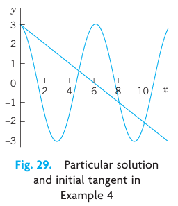{#fig-2-29}

**Observation.** Our choice of $y_1$ and $y_2$ was general enough to satisfy both initial conditions. Now let us take instead two proportional solutions $y_1 = \cos x$ and $y_2 = k \cos x$, so that $y_2 / y_1 = k = \text{const}$. Then we can write $y = c_1 y_1 + c_2 y_2$ in the form

$$
y = c_1 \cos x + c_2 (k \cos x) = C \cos x \quad \text{where} \quad C = c_1 + c_2 k.
$$

Hence we are no longer able to satisfy two initial conditions with only one arbitrary constant $C$. Consequently, in defining the concept of a general solution, we must exclude proportionality. And we see at the same time why the concept of a general solution is of importance in connection with initial value problems. $\square$

**DEFINITION: General Solution, Basis, Particular Solution**
A **general solution** of an ODE (@eq-2-2) on an open interval $I$ is a solution (@eq-2-5) in which $y_1$ and $y_2$ are solutions of (@eq-2-2) on $I$ that are not proportional, and $c_1$ and $c_2$ are arbitrary constants. These $y_1, y_2$ are called a **basis** (or a **fundamental system**) of solutions of (@eq-2-2) on $I$.

A **particular solution** of (@eq-2-2) on $I$ is obtained if we assign specific values to $c_1$ and $c_2$ in (@eq-2-5).

Furthermore, as usual, $y_1$ and $y_2$ are called **proportional** on $I$ if for all $x$ on $I$,

$$
y_1 = k y_2 \quad \text{or} \quad y_2 = l y_1
$$ {#eq-2-6}

where $k$ and $l$ are numbers, zero or not. (Note that $y_1 = k y_2$ implies $y_2 = l y_1$ if and only if $k \neq 0$).

Actually, we can reformulate our definition of a basis by using a concept of general importance. Namely, two functions $y_1$ and $y_2$ are called **linearly independent** on an interval $I$ where they are defined if

$$
k_1 y_1(x) + k_2 y_2(x) = 0
$$ {#eq-2-7}

everywhere on $I$ implies $k_1 = 0$ and $k_2 = 0$.

And $y_1$ and $y_2$ are called **linearly dependent** on $I$ if (@eq-2-7) also holds for some constants $k_1, k_2$, not both zero. Then, if $k_1 \neq 0$ or $k_2 \neq 0$, we can divide and see that $y_1$ and $y_2$ are proportional,

$$
y_1 = -\frac{k_2}{k_1} y_2 \quad \text{or} \quad y_2 = -\frac{k_1}{k_2} y_1.
$$

In contrast, in the case of linear independence these functions are not proportional because then we cannot divide in (@eq-2-7). This gives the following:

**DEFINITION: Basis (Reformulated)**
A **basis** of solutions of (@eq-2-2) on an open interval $I$ is a pair of linearly independent solutions of (@eq-2-2) on $I$.

If the coefficients $p$ and $q$ of (@eq-2-2) are continuous on some open interval $I$, then (@eq-2-2) has a general solution. It yields the unique solution of any initial value problem (@eq-2-2), (@eq-2-4). It includes all solutions of (@eq-2-2) on $I$; hence (@eq-2-2) has no singular solutions (solutions not obtainable from a general solution; see also Problem Set 1.1). All this will be shown in Sec. 2.6.

### EXAMPLE 5 Basis, General Solution, Particular Solution
$\cos x$ and $\sin x$ in Example 4 form a basis of solutions of the ODE $y'' + y = 0$ for all $x$ because their quotient is $\cot x \neq \text{const}$ (or $\tan x \neq \text{const}$). Hence $y = c_1 \cos x + c_2 \sin x$ is a general solution. The solution $y = 3.0 \cos x - 0.5 \sin x$ of the initial value problem is a particular solution.

### EXAMPLE 6 Basis, General Solution, Particular Solution
Verify by substitution that $y_1 = e^x$ and $y_2 = e^{-x}$ are solutions of the ODE $y'' - y = 0$. Then solve the initial value problem

$$
y'' - y = 0, \quad y(0) = 6, \quad y'(0) = -2.
$$

**Solution.**
$(e^x)'' - e^x = 0$ and $(e^{-x})'' - e^{-x} = 0$ show that $e^x$ and $e^{-x}$ are solutions. They are not proportional, $e^x / e^{-x} = e^{2x} \neq \text{const}$. Hence $e^x, e^{-x}$ form a basis for all $x$. We now write down the corresponding general solution and its derivative and equate their values at $0$ to the given initial conditions,

$$
y = c_1 e^x + c_2 e^{-x}, \quad y' = c_1 e^x - c_2 e^{-x}, \quad y(0) = c_1 + c_2 = 6, \quad y'(0) = c_1 - c_2 = -2.
$$

By addition and subtraction, $c_1 = 2, c_2 = 4$, so that the answer is $y = 2e^x + 4e^{-x}$. This is the particular solution satisfying the two initial conditions. $\square$

### Find a Basis if One Solution Is Known. Reduction of Order

It happens quite often that one solution can be found by inspection or in some other way. Then a second linearly independent solution can be obtained by solving a first-order ODE. This is called the method of **reduction of order**.[^1] We first show how this method works in an example and then in general.

[^1]: Credited to the great mathematician JOSEPH LOUIS LAGRANGE (1736–1813), who was born in Turin, of French extraction, got his first professorship when he was 19 (at the Military Academy of Turin), became director of the mathematical section of the Berlin Academy in 1766, and moved to Paris in 1787. His important major work was in the calculus of variations, celestial mechanics, general mechanics (*Mécanique analytique*, Paris, 1788), differential equations, approximation theory, algebra, and number theory.

### EXAMPLE 7 Reduction of Order if a Solution Is Known. Basis
Find a basis of solutions of the ODE

$$
(x^2 - x)y'' - xy' + y = 0.
$$

**Solution.**
Inspection shows that $y_1 = x$ is a solution because $y_1' = 1$ and $y_1'' = 0$, so that the first term vanishes identically and the second and third terms cancel. The idea of the method is to substitute $y_2 = u y_1 = ux$ into the ODE. This gives $y_2' = u'x + u$, $y_2'' = u''x + 2u'$. Substitute these expressions into the ODE:

$$
(x^2 - x)(u''x + 2u') - x(u'x + u) + ux = 0.
$$

$ux$ and $-xu$ cancel and we are left with the following ODE, which we divide by $x$, order, and simplify,

$$
(x^2 - x)(u''x + 2u') - x^2 u' = 0.
$$

$$
(x^2 - x)u''x + [2(x^2 - x) - x^2]u' = 0
$$

$$
x(x^2 - x)u'' + (x^2 - 2x)u' = 0.
$$

We divide by $x$, obtaining

$$
(x^2 - x)u'' + (x - 2)u' = 0.
$$

This ODE is of first order in $v = u'$, namely,

$$
(x^2 - x)v' + (x - 2)v = 0.
$$

Separation of variables and integration gives

$$
\frac{dv}{v} = -\frac{x-2}{x^2-x} dx = \left( \frac{2}{x} - \frac{1}{x-1} \right) dx
$$

$$
\ln|v| = 2\ln|x| - \ln|x-1| = \ln\left| \frac{x^2}{x-1} \right|.
$$

Taking exponents and integrating again, we obtain

$$
v = u' = \frac{x^2}{x-1} = x + 1 + \frac{1}{x-1}
$$

$$
u = \int v dx = \frac{x^2}{2} + x + \ln|x-1|,
$$

hence $y_2 = ux = \frac{x^3}{2} + x^2 + x\ln|x-1|$.

Since $y_1 = x$ and $y_2$ are linearly independent (their quotient $y_2 / y_1 = u$ is not constant), we have obtained a basis of solutions, valid for all positive $x$ (excluding $x = 1$). $\square$

Let us show how the method works in general. We consider a homogeneous linear ODE in standard form

$$
y'' + p(x)y' + q(x)y = 0
$$ {#eq-2-8}

Note that we now take the ODE in standard form, with $y''$ as the first term, not $f(x)y''$ — this is essential in applying our subsequent formulas. We assume a solution $y_1(x)$ of (@eq-2-8), on an open interval $I$, to be known and want to find a basis. For this we need a second linearly independent solution $y_2(x)$ of (@eq-2-8) on $I$. To get $y_2$, we substitute $y = y_2 = uy_1$, $y' = u'y_1 + uy_1'$, $y'' = u''y_1 + 2u'y_1' + uy_1''$ into (@eq-2-8). This gives

$$
(u''y_1 + 2u'y_1' + uy_1'') + p(u'y_1 + uy_1') + quy_1 = 0.
$$

Collecting terms in $u''$, $u'$, and $u$, we have

$$
u''y_1 + u'(2y_1' + py_1) + u(y_1'' + py_1' + qy_1) = 0.
$$

Now comes the main point. Since $y_1$ is a solution of (@eq-2-8), the expression in the last parentheses is zero. Hence $u$ is gone, and we are left with an ODE in $u''$ and $u'$. We divide this remaining ODE by $y_1$ and set $U = u'$, thus $U' = u''$. This gives

$$
U'y_1 + U(2y_1' + py_1) = 0, \quad \text{hence} \quad U' + U\left( 2\frac{y_1'}{y_1} + p \right) = 0.
$$

This is the desired first-order ODE, the reduced ODE. Separation of variables and integration gives

$$
\frac{dU}{U} = -\left( 2\frac{y_1'}{y_1} + p \right) dx = -2\frac{dy_1}{y_1} - p dx
$$

$$
\ln|U| = -2\ln|y_1| - \int p dx.
$$

By taking exponents we finally obtain

$$
U = u' = \frac{1}{y_1^2} e^{-\int p dx}.
$$

Here $y_1 \neq 0$ so that we can divide. Hence the desired second solution is

$$
y_2 = y_1 u = y_1 \int U dx = y_1 \int \frac{e^{-\int p dx}}{y_1^2} dx.
$$ {#eq-2-9}

The quotient $y_2 / y_1 = u$ cannot be constant since $U = u' = \frac{e^{-\int p dx}}{y_1^2} \neq 0$, so that $y_1$ and $y_2$ form a basis of solutions.

## PROBLEM SET 2.1

### 1–2 REDUCTION OF ORDER
1. **Reduction.** Show that a general second-order ODE $F(x, y', y'') = 0$, linear or not, in which $y$ does not occur explicitly, can be reduced to a first-order ODE in $z = y'$ (from which $y$ follows by integration). Give two examples of your own.
2. **Reduction.** Show that a general second-order ODE $F(y, y', y'') = 0$, linear or not, in which $x$ does not occur explicitly, can be reduced to a first-order ODE with $y$ as the independent variable and $y'' = z \frac{dz}{dy}$ (where $z = y'$). Derive this by the chain rule. Give two examples of your own.

### 3–10 REDUCTION OF ORDER
Reduce to first order and solve, showing each step in detail. (For variable coefficients, a solution $y_1$ is given.)
3. $yy'' = 3(y')^2$
4. $2xy'' = 3y'$
5. $y'' + (y')^3 \sin y = 0$
6. $y'' = 1 + (y')^2$
7. $x^2 y'' - 5xy' + 9y = 0, \quad y_1 = x^3$
8. $x^2 y'' + 2xy' + xy = 0, \quad y_1 = \frac{\cos x}{x}$
9. $y'' + y' = 0$
10. $y'' = 2y'$

### 11–14 APPLICATIONS OF REDUCIBLE ODEs
11. **Curve.** Find the curve through the origin in the $xy$-plane which satisfies $y'' = 2y'$ and whose tangent at the origin has slope 1.
12. **Hanging cable.** It can be shown that the curve $y(x)$ of an inextensible flexible homogeneous cable hanging between two fixed points is obtained by solving $y'' = k \sqrt{1 + (y')^2}$, where the constant $k$ depends on the weight. Find and graph $y(x)$, assuming that $k = 1$ and those fixed points are $(-1, 0)$ and $(1, 0)$ in a vertical $xy$-plane.
13. **Motion.** If, in the motion of a small body on a straight line, the sum of velocity and acceleration equals a positive constant, how will the distance depend on the initial velocity and position?
14. **Motion.** In a straight-line motion, let the velocity be the reciprocal of the acceleration. Find the distance for arbitrary initial position and velocity.

### 15–19 GENERAL SOLUTION. INITIAL VALUE PROBLEM (IVP)
(a) Verify that the given functions are linearly independent and form a basis of solutions of the given ODE. (b) Solve the IVP. Graph or sketch the solution.
15. $4y'' + 25y = 0, \quad y(0) = 3.0, \quad y'(0) = -2.5, \quad \text{basis: } \cos 2.5x, \sin 2.5x$
16. $y'' + 0.6y' + 0.09y = 0, \quad y(0) = 2.2, \quad y'(0) = 0.14, \quad \text{basis: } e^{-0.3x}, xe^{-0.3x}$
17. $4x^2 y'' - 3y = 0, \quad y(1) = -3, \quad y'(1) = 0, \quad \text{basis: } x^{3/2}, x^{-1/2}$
18. $x^2 y'' - xy' + y = 0, \quad y(1) = 4.3, \quad y'(1) = 0.5, \quad \text{basis: } x, x \ln x$
19. $y'' + 2y' + 2y = 0, \quad y(0) = 0, \quad y'(0) = 15, \quad \text{basis: } e^{-x} \sin x, e^{-x} \cos x$

20. **CAS PROJECT. Linear Independence.** Write a program for testing linear independence and dependence. Try it out on some of the problems in this and the next problem set and on examples of your own.

## 2.2 Homogeneous Linear ODEs with Constant Coefficients {#sec-2-2}

We shall now consider second-order homogeneous linear ODEs whose coefficients $a$ and $b$ are constant,

$$
y'' + ay' + by = 0.
$$ {#eq-2-10}

These equations have important applications in mechanical and electrical vibrations, as we shall see in Secs. 2.4, 2.8, and 2.9.

To solve (@eq-2-10), we recall from Sec. 1.5 that the solution of the first-order linear ODE with a constant coefficient $k$

$$
y' + ky = 0
$$

is an exponential function $y = c e^{-kx}$. This gives us the idea to try as a solution of (@eq-2-10) the function

$$
y = e^{\lambda x}.
$$ {#eq-2-11}

Substituting (@eq-2-11) and its derivatives $y' = \lambda e^{\lambda x}$ and $y'' = \lambda^2 e^{\lambda x}$ into our equation (@eq-2-10), we obtain

$$
(\lambda^2 + a\lambda + b)e^{\lambda x} = 0.
$$

Hence if $\lambda$ is a solution of the important **characteristic equation** (or **auxiliary equation**)

$$
\lambda^2 + a\lambda + b = 0,
$$ {#eq-2-12}

then the exponential function (@eq-2-11) is a solution of the ODE (@eq-2-10). Now from algebra we recall that the roots of this quadratic equation (@eq-2-12) are

$$
\lambda_1 = -\frac{a}{2} + \sqrt{\frac{a^2}{4} - b}, \qquad \lambda_2 = -\frac{a}{2} - \sqrt{\frac{a^2}{4} - b}.
$$ {#eq-2-13}

(@eq-2-12) and (@eq-2-13) will be basic because our derivation shows that the functions

$$
y_1 = e^{\lambda_1 x} \quad \text{and} \quad y_2 = e^{\lambda_2 x}
$$

are solutions of (@eq-2-10). Verify this by substituting $y_1$ and $y_2$ into (@eq-2-10).

From algebra we further know that the quadratic equation (@eq-2-12) may have three kinds of roots, depending on the sign of the discriminant $a^2 - 4b$, namely:

*   **(Case I)** Two distinct real roots if $a^2 - 4b > 0$,
*   **(Case II)** A real double root if $a^2 - 4b = 0$,
*   **(Case III)** Complex conjugate roots if $a^2 - 4b < 0$.

### Case I. Two Distinct Real Roots $\lambda_1$ and $\lambda_2$

In this case, a basis of solutions of (@eq-2-10) on any interval is

$$
y_1 = e^{\lambda_1 x} \quad \text{and} \quad y_2 = e^{\lambda_2 x}
$$

because $y_1$ and $y_2$ are defined (and real) for all $x$ and their quotient is not constant. The corresponding general solution is

$$
y = c_1 e^{\lambda_1 x} + c_2 e^{\lambda_2 x}.
$$ {#eq-2-14}

### EXAMPLE 1 General Solution in the Case of Distinct Real Roots
We can now solve the ODE $y'' - y = 0$ in Example 6 of Sec. 2.1 systematically. The characteristic equation is $\lambda^2 - 1 = 0$. Its roots are $\lambda_1 = 1$ and $\lambda_2 = -1$. Hence a basis of solutions is $e^x$ and $e^{-x}$ and gives the same general solution as before,

$$
y = c_1 e^x + c_2 e^{-x}.
$$

### EXAMPLE 2 Initial Value Problem in the Case of Distinct Real Roots
Solve the initial value problem

$$
y'' + y' - 2y = 0, \quad y(0) = 4, \quad y'(0) = -5.
$$

**Solution.**
**Step 1. General solution.** The characteristic equation is

$$
\lambda^2 + \lambda - 2 = 0.
$$

Its roots are

$$
\lambda_1 = 1 \quad \text{and} \quad \lambda_2 = -2
$$

so that we obtain the general solution

$$
y = c_1 e^x + c_2 e^{-2x}.
$$

**Step 2. Particular solution.** Since $y' = c_1 e^x - 2c_2 e^{-2x}$, we obtain from the general solution and the initial conditions

$$
y(0) = c_1 + c_2 = 4, \quad y'(0) = c_1 - 2c_2 = -5.
$$

Hence $c_1 = 1$ and $c_2 = 3$. This gives the answer $y = e^x + 3e^{-2x}$. Figure 30 shows that the curve begins at $(0, 4)$ with a negative slope (but note that the axes have different scales!), in agreement with the initial conditions.

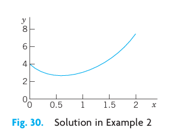{#fig-2-30}

### Case II. Real Double Root

If the discriminant is zero, we see directly from (@eq-2-13) that we get only one root, $\lambda = -a/2$, hence only one solution,

$$
y_1 = e^{-ax/2}.
$$

To obtain a second independent solution (needed for a basis), we use the method of reduction of order discussed in the last section, setting $y_2 = u y_1$. Substituting this and its derivatives $y_2' = u'y_1 + uy_1'$ and $y_2'' = u''y_1 + 2u'y_1' + uy_1''$ into (@eq-2-10), we first have

$$
(u''y_1 + 2u'y_1' + uy_1'') + a(u'y_1 + uy_1') + buy_1 = 0.
$$

Collecting terms in $u''$, $u'$, and $u$, as in the last section, we obtain

$$
u''y_1 + u'(2y_1' + a y_1) + u(y_1'' + a y_1' + b y_1) = 0.
$$

The expression in the last parentheses is zero, since $y_1$ is a solution of (@eq-2-10). The expression in the first parentheses is zero, too, since

$$
2y_1' + a y_1 = 2 \left( -\frac{a}{2} y_1 \right) + a y_1 = 0.
$$

We are thus left with $u'' y_1 = 0$. Hence $u'' = 0$. By two integrations, $u = c_1 x + c_2$. To get a second independent solution $y_2$, we can simply choose $c_1 = 1$ and $c_2 = 0$ and take $u = x$. Then $y_2 = x y_1$. Since these solutions are not proportional, they form a basis.

Hence in the case of a double root of (@eq-2-12) a basis of solutions of (@eq-2-10) on any interval is

$$
e^{-ax/2}, \quad x e^{-ax/2}.
$$

The corresponding general solution is

$$
y = (c_1 + c_2 x) e^{-ax/2}.
$$ {#eq-2-15}

**WARNING!** If $\lambda$ is a simple root of (@eq-2-12), then $y = (c_1 + c_2 x) e^{\lambda x}$ is not a solution of (@eq-2-10).

### EXAMPLE 3 General Solution in the Case of a Double Root
The characteristic equation of the ODE $y'' + 6y' + 9y = 0$ is $\lambda^2 + 6\lambda + 9 = (\lambda + 3)^2 = 0$. It has the double root $\lambda = -3$. Hence a basis is $e^{-3x}$ and $x e^{-3x}$. The corresponding general solution is $y = (c_1 + c_2 x) e^{-3x}$.

### EXAMPLE 4 Initial Value Problem in the Case of a Double Root
Solve the initial value problem

$$
y'' + y' + 0.25y = 0, \quad y(0) = 3.0, \quad y'(0) = -3.5.
$$

**Solution.**
The characteristic equation is $\lambda^2 + \lambda + 0.25 = (\lambda + 0.5)^2 = 0$. It has the double root $\lambda = -0.5$. This gives the general solution

$$
y = (c_1 + c_2 x) e^{-0.5x}.
$$

We need its derivative

$$
y' = c_2 e^{-0.5x} - 0.5(c_1 + c_2 x) e^{-0.5x}.
$$

From this and the initial conditions we obtain

$$
y(0) = c_1 = 3.0, \quad y'(0) = c_2 - 0.5 c_1 = -3.5.
$$

Hence $c_2 = -3.5 + 1.5 = -2$. The particular solution of the initial value problem is $y = (3.0 - 2x) e^{-0.5x}$. See Fig. 31.

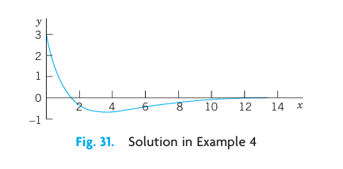{#fig-2-31}

### Case III. Complex Roots

This case occurs if the discriminant of the characteristic equation (@eq-2-12) is negative, $a^2 - 4b < 0$.

In this case, the roots of (@eq-2-12) are the complex conjugate pair

$$
\lambda_1 = -\frac{a}{2} + i\omega, \qquad \lambda_2 = -\frac{a}{2} - i\omega
$$

where $\omega = \sqrt{b - \frac{1}{4} a^2} > 0$. These give the complex solutions of the ODE (@eq-2-10). However, we will show that we can obtain a basis of real solutions

$$
y_1 = e^{-ax/2} \cos \omega x, \qquad y_2 = e^{-ax/2} \sin \omega x.
$$ {#eq-2-16}

It can be verified by substitution that these are solutions in the present case. We shall derive them systematically using the complex exponential function. They form a basis on any interval since their quotient is not constant. Hence a real general solution in Case III is

$$
y = e^{-ax/2} (A \cos \omega x + B \sin \omega x)
$$ {#eq-2-17}

($A, B$ arbitrary constants).

### EXAMPLE 5 Complex Roots. Initial Value Problem
Solve the initial value problem

$$
y'' + 0.4y' + 9.04y = 0, \quad y(0) = 0, \quad y'(0) = 3.
$$

**Solution.**
**Step 1. General solution.** The characteristic equation is $\lambda^2 + 0.4\lambda + 9.04 = 0$. It has the roots

$$
\lambda = -0.2 \pm 3i.
$$

Hence $a/2 = 0.2, \omega = 3$, and a general solution (@eq-2-17) is

$$
y = e^{-0.2x} (A \cos 3x + B \sin 3x).
$$

**Step 2. Particular solution.** The first initial condition gives $y(0) = A = 0$. The remaining expression is $y = B e^{-0.2x} \sin 3x$. We need the derivative (chain rule!)

$$
y' = B ( -0.2 e^{-0.2x} \sin 3x + 3 e^{-0.2x} \cos 3x ).
$$

From this and the second initial condition we obtain $y'(0) = 3B = 3$. Hence $B = 1$. Our solution is

$$
y = e^{-0.2x} \sin 3x.
$$

Figure 32 shows $y$ and the curves of $e^{-0.2x}$ and $-e^{-0.2x}$ (dashed), between which the curve of $y$ oscillates. Such "damped vibrations" (with $x$ being time $t$) have important mechanical and electrical applications, as we shall soon see (in Sec. 2.4).

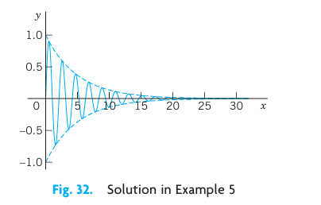{#fig-2-32}

### EXAMPLE 6 Complex Roots
A general solution of the ODE

$$
y'' + \omega^2 y = 0
$$

($\omega$ constant, not zero) is

$$
y = A \cos \omega x + B \sin \omega x.
$$

With $\omega = 1$ this confirms Example 4 in Sec. 2.1. $\square$

| Case | Roots of (@eq-2-12) | Basis of (@eq-2-10) | General Solution of (@eq-2-10) |
|---|---|---|---|
| **I** | Distinct real $\lambda_1, \lambda_2$ | $e^{\lambda_1 x}, e^{\lambda_2 x}$ | $y = c_1 e^{\lambda_1 x} + c_2 e^{\lambda_2 x}$ |
| **II** | Real double root $\lambda = -a/2$ | $e^{-ax/2}, x e^{-ax/2}$ | $y = (c_1 + c_2 x) e^{-ax/2}$ |
| **III** | Complex conjugate $\lambda_1, \lambda_2 = -\frac{a}{2} \pm i\omega$ | $e^{-ax/2} \cos \omega x, e^{-ax/2} \sin \omega x$ | $y = e^{-ax/2} (A \cos \omega x + B \sin \omega x)$ |

: **Summary of Cases I–III** {#tbl-cases}

### Derivation in Case III. Complex Exponential Function

If verification of the solutions in (@eq-2-16) satisfies you, skip this systematic derivation of these real solutions from the complex solutions by means of the complex exponential function of a complex variable $z = r + it$. We write $z = r + it$, not $x + iy$ because $x$ and $y$ occur in the ODE. The definition of $e^z$ in terms of the real functions $e^r$, $\cos t$, and $\sin t$ is

$$
e^z = e^{r + it} = e^r e^{it} = e^r (\cos t + i \sin t).
$$ {#eq-2-18}

This is motivated as follows. For real $z$, hence $t = 0$, $\cos 0 = 1$, $\sin 0 = 0$, we get the real exponential function $e^r$. It can be shown that $e^{z_1 + z_2} = e^{z_1} e^{z_2}$, just as in the real case (Proof in Sec. 13.5). Finally, if we use the Maclaurin series of $e^{it}$ with $i^2 = -1, i^3 = -i, i^4 = 1, i^5 = i$, etc., and reorder the terms as shown (this is permissible, as can be proved), we obtain the series

$$
e^{it} = \sum_{n=0}^{\infty} \frac{(it)^n}{n!} = 1 + it - \frac{t^2}{2!} - i \frac{t^3}{3!} + \frac{t^4}{4!} + \cdots = \left( 1 - \frac{t^2}{2!} + \frac{t^4}{4!} - \cdots \right) + i \left( t - \frac{t^3}{3!} + \frac{t^5}{5!} - \cdots \right).
$$

We see that we have obtained the formula

$$
e^{it} = \cos t + i \sin t,
$$ {#eq-2-19}

called **Euler's formula**. Multiplication by $e^r$ gives (@eq-2-18).

For later use we note that $e^{-it} = \cos(-t) + i \sin(-t) = \cos t - i \sin t$, so that by addition and subtraction of this and (@eq-2-19),

$$
\cos t = \frac{1}{2}(e^{it} + e^{-it}), \qquad \sin t = \frac{1}{2i}(e^{it} - e^{-it}).
$$ {#eq-2-20}

After these comments on the definition (@eq-2-18), let us now turn to Case III.

In Case III the radicand in (@eq-2-13) is negative. Hence $4b - a^2$ is positive and, using $\sqrt{-1} = i$, we obtain in (@eq-2-13)

$$
\sqrt{\frac{a^2}{4} - b} = \sqrt{-\left( b - \frac{a^2}{4} \right)} = i \omega
$$

with $\omega$ defined as in (@eq-2-16). Hence in (@eq-2-13), $\lambda_1 = -a/2 + i\omega$ and $\lambda_2 = -a/2 - i\omega$.

Using (@eq-2-18) with $r = -ax/2$ and $t = \omega x$, we thus obtain

$$
y_1 = e^{\lambda_1 x} = e^{-ax/2} (\cos \omega x + i \sin \omega x), \qquad y_2 = e^{\lambda_2 x} = e^{-ax/2} (\cos \omega x - i \sin \omega x).
$$

We now add these two lines and multiply the result by $1/2$. This gives $e^{-ax/2} \cos \omega x$ as in (@eq-2-16). Then we subtract the second line from the first and multiply the result by $1/(2i)$. This gives $e^{-ax/2} \sin \omega x$ as in (@eq-2-16). These results obtained by addition and multiplication by constants are again solutions, as follows from the superposition principle in Sec. 2.1. This concludes the derivation of these real solutions in Case III.

## PROBLEM SET 2.2

### 1–15 GENERAL SOLUTION
Find a general solution. Check your answer by substitution.
1. $4y'' - 25y = 0$
2. $y'' + 36y = 0$
3. $y'' + 6y' + 8.96y = 0$
4. $y'' + 4y' + (\pi^2 + 4)y = 0$
5. $y'' + 2\pi y' + \pi^2 y = 0$
6. $10y'' - 32y' + 25.6y = 0$
7. $y'' + 4.5y' = 0$
8. $y'' + y' + 3.25y = 0$
9. $y'' + 1.8y' - 2.08y = 0$
10. $100y'' + 240y' + (196\pi^2 + 144)y = 0$
11. $4y'' - 4y' - 3y = 0$
12. $y'' + 9y' + 20y = 0$
13. $9y'' - 30y' + 25y = 0$
14. $y'' + 0.54y' + (0.0729 + \pi)y = 0$
15. $y'' + 2k^2 y' + k^4 y = 0$

### 16–20 FIND AN ODE
Find an ODE $y'' + ay' + by = 0$ for the given basis.
16. $e^{-4.3x}, e^{2.6x}$
17. $e^{-2.5x}, xe^{-2.5x}$
18. $\cos 2\pi x, \sin 2\pi x$
19. $e^{(-2-i)x}, e^{(-2+i)x}$
20. $e^{-3.1x}\cos 2.1x, e^{-3.1x}\sin 2.1x$

### 21–30 INITIAL VALUE PROBLEMS
Solve the IVP. Check that your answer satisfies the ODE as well as the initial conditions. Show the details of your work.
21. $y'' - y = 0, \quad y(0) = 2, \quad y'(0) = -2$
22. The ODE in Prob. 11, $y(-2) = e, \quad y'(-2) = -e/2$
23. $y'' + y' - 6y = 0, \quad y(0) = 10, \quad y'(0) = 0$
24. $y'' + 25y = 0, \quad y(0) = 4.6, \quad y'(0) = -1.2$
25. $y'' + 4y' + 4y = 0, \quad y(0) = 1, \quad y'(0) = -24$
26. $y'' - k^2 y = 0 \ (k \neq 0), \quad y(0) = 1, \quad y'(0) = 1$
27. The ODE in Prob. 5, $y(0) = 4.5, \quad y'(0) = 1 - 4.5\pi \approx -13.137$
28. The ODE in Prob. 13, $y(0) = 3.3, \quad y'(0) = 10.09$
29. The ODE in Prob. 9, $y(0) = -0.2, \quad y'(0) = -0.3258$
30. The ODE in Prob. 10, $y(0) = 0, \quad y'(0) = 115$

### 31–36 LINEAR INDEPENDENCE
Are the following functions linearly independent on the given interval? Show the details of your work.
31. $e^{kx}, x e^{kx}$ on any interval
32. $e^{ax}, e^{-ax}$ on any interval
33. $x^2, x^2 \ln x$ on $x > 0$
34. $\ln x, \ln(x^3)$ on $x > 1$
35. $\sin 2x, \cos x \sin x$ on any interval
36. $e^{-x}\cos \frac{1}{2}x, e^{-x}\sin \frac{1}{2}x$ on any interval

37. **Instability.** Solve $y'' - y = 0$ for the initial conditions $y(0) = 1, y'(0) = -1$. Then change the initial conditions to $y(0) = 1.001, y'(0) = -0.999$, and explain why this small change of 0.001 at $t=0$ causes a large change later, e.g., $y \approx 22$ at $t=10$. This is instability: a small initial difference in setting a quantity (a current, for instance) becomes larger and larger with time $t$.

38. **TEAM PROJECT. General Properties of Solutions.**
    (a) **Coefficient formulas.** Show how $a$ and $b$ in (@eq-2-10) can be expressed in terms of $\lambda_1$ and $\lambda_2$. Explain how these formulas can be used in constructing equations for given bases.
    (b) **Root zero.** Solve $y'' + 4y' = 0$ (i) by the present method, and (ii) by reduction to first order. Can you explain why the result must be the same in both cases? Can you do the same for a general ODE $y'' + ay' = 0$?
    (c) **Double root.** Verify directly that $x e^{\lambda x}$ with $\lambda = -a/2$ is a solution of (@eq-2-10) in the case of a double root. Verify and explain why $y = x e^{-2x}$ is a solution of $y'' - y' - 6y = 0$ but $y = e^{-2x}$ is not.
    (d) **Limits.** Double roots should be limiting cases of distinct roots $\lambda_1, \lambda_2$ as, say, $\lambda_2 \to \lambda_1$. Experiment with this idea using $\frac{e^{\lambda_2 x} - e^{\lambda_1 x}}{\lambda_2 - \lambda_1}$. (Remember l'Hôpital's rule.) Can you arrive at $x e^{\lambda_1 x}$?

## 2.3 Differential Operators {#sec-2-3}

*This short section can be omitted without interrupting the flow of ideas. It will not be used subsequently, except for the notations $Dy, D^2y$, etc. to stand for $y', y''$, etc.*

Operational calculus means the technique and application of operators. Here, an **operator** is a transformation that transforms a function into another function. Hence differential calculus involves an operator, the **differential operator** $D$, which transforms a (differentiable) function into its derivative. In operator notation we write $D = \frac{d}{dx}$ and

$$
Dy = y' = \frac{dy}{dx}.
$$ {#eq-2-21}

Similarly, for the higher derivatives we write $D^2 y = D(Dy) = y''$, and so on. For example, $D \sin x = \cos x$, $D^2 \sin x = -\sin x$, etc.

For a homogeneous linear ODE with constant coefficients

$$
y'' + ay' + by = 0
$$

we can now introduce the second-order differential operator

$$
L = P(D) = D^2 + aD + bI,
$$

where $I$ is the **identity operator** defined by $Iy = y$. Then we can write that ODE as

$$
Ly = P(D)y = (D^2 + aD + bI)y = 0.
$$ {#eq-2-22}

$P$ suggests "polynomial." $L$ is a **linear operator**. By definition this means that if $Ly$ and $Lw$ exist (this is the case if $y$ and $w$ are twice differentiable), then $L(cy + kw)$ exists for any constants $c$ and $k$, and

$$
L(cy + kw) = cLy + kLw.
$$

Let us show that from (@eq-2-22) we reach agreement with the results in Sec. 2.2. Since $D e^{\lambda x} = \lambda e^{\lambda x}$ and $D^2 e^{\lambda x} = \lambda^2 e^{\lambda x}$, we obtain

$$
L e^{\lambda x} = P(D) e^{\lambda x} = (D^2 + aD + bI) e^{\lambda x} = (\lambda^2 + a\lambda + b) e^{\lambda x} = P(\lambda) e^{\lambda x} = 0.
$$ {#eq-2-23}

This confirms our result of Sec. 2.2 that $e^{\lambda x}$ is a solution of the ODE (@eq-2-22) if and only if $\lambda$ is a solution of the characteristic equation $P(\lambda) = 0$.

$P(\lambda)$ is a polynomial in the usual sense of algebra. If we replace $\lambda$ by the operator $D$, we obtain the "operator polynomial" $P(D)$. The point of this operational calculus is that $P(D)$ can be treated just like an algebraic quantity. In particular, we can factor it.

### EXAMPLE 1 Factorization, Solution of an ODE
Factor and solve $P(D)y = (D^2 - 3D - 40I)y = 0$.

**Solution.**
$D^2 - 3D - 40I = (D - 8I)(D + 5I)$ because $I^2 = I$. Now $(D - 8I)y = y' - 8y = 0$ has the solution $y_1 = e^{8x}$. Similarly, the solution of $(D + 5I)y = y' + 5y = 0$ is $y_2 = e^{-5x}$. This is a basis of solutions on any interval. From the factorization we obtain the ODE, as expected:

$$
\begin{aligned}
(D - 8I)(D + 5I)y &= (D - 8I)(y' + 5y) = D(y' + 5y) - 8(y' + 5y) \\
&= y'' + 5y' - 8y' - 40y = y'' - 3y' - 40y = 0.
\end{aligned}
$$

Verify that this agrees with the result of our method in Sec. 2.2. This is not unexpected because we factored $P(D)$ in the same way as the characteristic polynomial $P(\lambda) = \lambda^2 - 3\lambda - 40$.

It was essential that $L$ in (@eq-2-22) had constant coefficients. Extension of operator methods to variable-coefficient ODEs is more difficult and will not be considered here.

If operational methods were limited to the simple situations illustrated in this section, it would perhaps not be worth mentioning. Actually, the power of the operator approach appears in more complicated engineering problems, as we shall see in Chap. 6. $\square$

## PROBLEM SET 2.3

### 1–5 APPLICATION OF DIFFERENTIAL OPERATORS
Apply the given operator to the given functions. Show all steps in detail.
1. $D^2 + 2D$; $\quad \cosh 2x, \quad e^{-x} + e^{2x}, \quad \cos x$
2. $D - 3I$; $\quad 3x^2 + 3x, \quad 3e^{3x}, \quad \cos 4x - \sin 4x$
3. $(D - 2I)^2$; $\quad e^{2x}, \quad x e^{2x}, \quad e^{-2x}$
4. $(D + 6I)^2$; $\quad 6x + \sin 6x, \quad x e^{-6x}$
5. $(D - 2I)(D + 3I)$; $\quad e^{2x}, \quad x e^{2x}, \quad e^{-3x}$

### 6–12 GENERAL SOLUTION
Factor as in the text and solve.
6. $(D^2 + 4.00D + 3.36I)y = 0$
7. $(4D^2 - I)y = 0$
8. $(D^2 + 3I)y = 0$
9. $(D^2 - 4.20D + 4.41I)y = 0$
10. $(D^2 + 4.80D + 5.76I)y = 0$
11. $(D^2 - 4.00D + 3.84I)y = 0$
12. $(D^2 + 3.0D + 2.5I)y = 0$

13. **Linear operator.** Illustrate the linearity of $L$ in (@eq-2-22) by taking $y = e^{2x}$, $w = \cos 2x$, $c = 4$, $k = -6$, for $L = D^2 + aD + bI$. Prove that $L$ is linear.
14. **Double root.** If $D^2 + aD + bI$ has distinct roots $\lambda$ and $\mu$, show that a particular solution of $(D - \lambda I)(D - \mu I)y = 0$ is $y = \frac{e^{\mu x} - e^{\lambda x}}{\mu - \lambda}$. Obtain from this a solution for a double root by letting $\mu \to \lambda$ and applying l'Hôpital's rule.
15. **Definition of linearity.** Show that the definition of linearity in the text is equivalent to the following: If $Ly$ and $Lw$ exist, then $L(y + w)$ and $L[kw]$ exist for all constants $k$, and $L[y + w] = Ly + Lw$ as well as $L[ky] = kLy$.

## 2.4 Modeling of Free Oscillations of a Mass–Spring System {#sec-2-4}

Linear ODEs with constant coefficients have important applications in mechanics, as we show in this section as well as in Sec. 2.8, and in electrical circuits as we show in Sec. 2.9. In this section we model and solve a basic mechanical system consisting of a mass on an elastic spring (a so-called "mass–spring system," @fig-2-33), which moves up and down.

### Setting Up the Model

We take an ordinary coil spring that resists extension as well as compression. We suspend it vertically from a fixed support and attach a body at its lower end, for instance, an iron ball, as shown in @fig-2-33. We let $y = 0$ denote the position of the ball when the system is at rest (@fig-2-33b). Furthermore, we choose the downward direction as positive, thus regarding downward forces as positive and upward forces as negative.

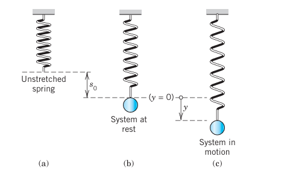{#fig-2-33}

We now let the ball move, as follows. We pull it down by an amount $y > 0$ (@fig-2-33c). This causes a spring force

$$
F_1 = -ky
$$ {#eq-2-24}

(Hooke's law) proportional to the stretch $y$, with $k$ called the spring constant. The minus sign indicates that $F_1$ points upward, against the displacement. It is a restoring force: it wants to restore the system, that is, to pull it back to $y = 0$. Stiff springs have large $k$.

Note that an additional force is present in the spring, caused by stretching it in fastening the ball, but has no effect on the motion because it is in equilibrium with the weight $W$ of the ball, $-F_0 = W = mg$, where $g = 9.8\text{ m/sec}^2 = 980\text{ cm/sec}^2 = 32.17\text{ ft/sec}^2$ is the acceleration of gravity at the Earth's surface.

The motion of our mass–spring system is determined by Newton's second law

$$
\text{Mass} \times \text{Acceleration} = m y'' = \text{Force}
$$ {#eq-2-25}

where $y'' = d^2y/dt^2$ and "Force" is the resultant of all the forces acting on the ball.

### ODE of the Undamped System

Every system has damping. Otherwise it would keep moving forever. But if the damping is small and the motion of the system is considered over a relatively short time, we may disregard damping. Then Newton's law with $\text{Force} = -F_1 = -ky$ gives the model $my'' = -ky$, thus

$$
my'' + ky = 0.
$$ {#eq-2-26}

This is a homogeneous linear ODE with constant coefficients. A general solution is obtained as in Sec. 2.2, namely:

$$
y(t) = A \cos \omega_0 t + B \sin \omega_0 t
$$ {#eq-2-27}

where $\omega_0 = \sqrt{k/m}$. This motion is called a **harmonic oscillation** (@fig-2-34). Its frequency is $f = \omega_0 / 2\pi$ Hertz (cycles/sec) because $\cos \omega_0 t$ and $\sin \omega_0 t$ in (@eq-2-27) have the period $2\pi/\omega_0$. The frequency $f$ is called the natural frequency of the system. (We write $\omega_0$ to reserve $\omega$ for Sec. 2.8.)

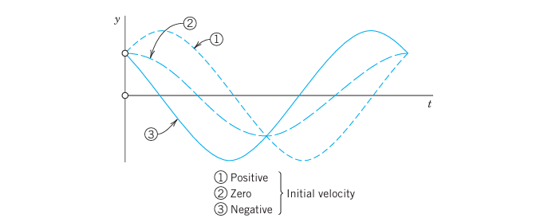{#fig-2-34}

An alternative representation of (@eq-2-27), which shows the physical characteristics of amplitude and phase shift, is

$$
y(t) = C \cos (\omega_0 t - \delta)
$$ {#eq-2-27star}

with amplitude $C = \sqrt{A^2 + B^2}$ and phase angle $\delta$, where $\tan \delta = B/A$. This follows from the addition formula (6) in App. 3.1.

### EXAMPLE 1 Harmonic Oscillation of an Undamped Mass–Spring System
If a mass–spring system with an iron ball of weight $W = 98\text{ nt}$ (about 22 lb) can be regarded as undamped, and the spring is such that the ball stretches it $1.09\text{ m}$ (about 43 in.), how many cycles per minute will the system execute? What will its motion be if we pull the ball down from rest by $16\text{ cm}$ (about 6 in.) and let it start with zero initial velocity?

**Solution.**
Hooke's law (@eq-2-24) with $W$ as the force and $1.09\text{ meter}$ as the stretch gives $W = 1.09 k$; thus $k = W / 1.09 = 98 / 1.09 = 90\text{ nt/meter}$. The mass is $m = W/g = 98/9.8 = 10\text{ kg}$. This gives the frequency $\omega_0 / (2\pi) = \sqrt{k/m} / (2\pi) = 3 / (2\pi) \approx 0.48\text{ Hz} \approx 29\text{ cycles/min}$.

From (@eq-2-27) and the initial conditions, $y(0) = A = 0.16\text{ [meter]}$ and $y'(0) = \omega_0 B = 0$. Hence the motion is

$$
y(t) = 0.16 \cos 3t\text{ [meter]} \quad (\text{or } 0.52 \cos 3t\text{ [ft]})
$$

(@fig-2-35). If you have a chance of experimenting with a mass–spring system, don't miss it. You will be surprised about the good agreement between theory and experiment, usually within a fraction of one percent if you measure carefully. $\square$

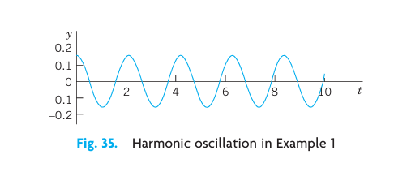{#fig-2-35}

### ODE of the Damped System

To our model we now add a damping force $F_2 = -c y'$, obtaining $my'' = -ky - cy'$; thus the ODE of the **damped mass–spring system** is

$$
my'' + cy' + ky = 0.
$$ {#eq-2-28}

Physically this can be done by connecting the ball to a dashpot; see @fig-2-36. We assume this damping force to be proportional to the velocity $y' = dy/dt$. This is generally a good approximation for small velocities.

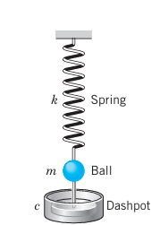{#fig-2-36}

The constant $c$ is called the damping constant. Let us show that $c$ is positive. Indeed, the damping force acts against the motion; hence for a downward motion we have $y' > 0$ which for positive $c$ makes $F_2$ negative (an upward force), as it should be. Similarly, for an upward motion we have $y' < 0$ which makes $F_2$ positive (a downward force).

The ODE (@eq-2-28) is homogeneous linear and has constant coefficients. Hence we can solve it by the method in Sec. 2.2. The characteristic equation is (divide (@eq-2-28) by $m$)

$$
\lambda^2 + \frac{c}{m} \lambda + \frac{k}{m} = 0.
$$

By the usual formula for the roots of a quadratic equation we obtain

$$
\lambda_1 = -\alpha + \beta, \qquad \lambda_2 = -\alpha - \beta,
$$ {#eq-2-29}

where $\alpha = \frac{c}{2m}$ and $\beta = \frac{1}{2m} \sqrt{c^2 - 4mk}$.

It is now interesting that depending on the amount of damping present—whether a lot of damping, a medium amount of damping or little damping—three types of motions occur, respectively:

*   **Case I.** $c^2 > 4mk$. Distinct real roots $\lambda_1, \lambda_2$. (**Overdamping**)
*   **Case II.** $c^2 = 4mk$. A real double root. (**Critical damping**)
*   **Case III.** $c^2 < 4mk$. Complex conjugate roots. (**Underdamping**)

They correspond to the three Cases I, II, III in Sec. 2.2.

### Discussion of the Three Cases

#### Case I. Overdamping

If the damping constant $c$ is so large that $c^2 > 4mk$, then $\lambda_1$ and $\lambda_2$ are distinct real roots. In this case the corresponding general solution of (@eq-2-28) is

$$
y(t) = c_1 e^{-(\alpha - \beta)t} + c_2 e^{-(\alpha + \beta)t}.
$$ {#eq-2-30}

We see that in this case, damping takes out energy so quickly that the body does not oscillate. For both exponents in (@eq-2-30) are negative because $\alpha > 0$, $\beta > 0$, and $\beta^2 = \alpha^2 - k/m < \alpha^2 \Rightarrow \beta < \alpha$. Hence both terms in (@eq-2-30) approach zero as $t \to \infty$. Practically speaking, after a sufficiently long time the mass will be at rest at the static equilibrium position ($y = 0$). @fig-2-37 shows (@eq-2-30) for some typical initial conditions.

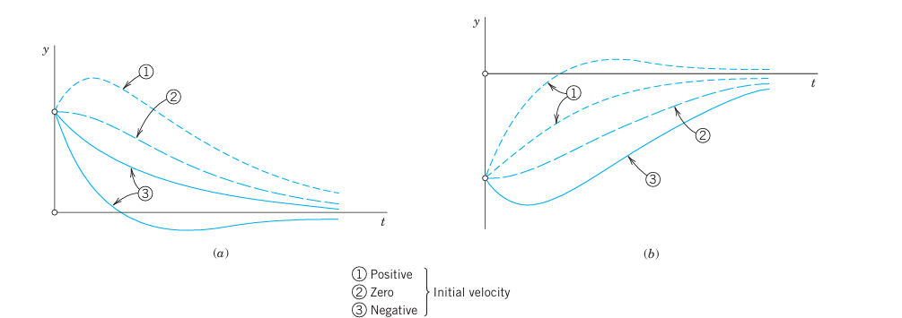{#fig-2-37}

#### Case II. Critical Damping

Critical damping is the border case between nonoscillatory motions (Case I) and oscillations (Case III). It occurs if the characteristic equation has a double root, that is, if $c^2 = 4mk$, so that $\beta = 0, \lambda_1 = \lambda_2 = -\alpha$. Then the corresponding general solution of (@eq-2-28) is

$$
y(t) = (c_1 + c_2 t) e^{-\alpha t}.
$$ {#eq-2-31}

This solution can pass through the equilibrium position at most once because $e^{-\alpha t}$ is never zero and $c_1 + c_2 t$ can have at most one positive zero. If both $c_1$ and $c_2$ are positive (or both negative), it has no positive zero, so that $y$ does not pass through $0$ at all. @fig-2-38 shows typical forms of (@eq-2-31). Note that they look almost like those in @fig-2-37.

![Fig. 38. Critical damping [see (8)]](../images/chapter2/fig-2-38.png){#fig-2-38}

#### Case III. Underdamping

This is the most interesting case. It occurs if the damping constant $c$ is so small that $c^2 < 4mk$. Then $\beta$ in (@eq-2-29) is no longer real but pure imaginary, say,

$$
\beta = i \omega^* \quad \text{where} \quad \omega^* = \frac{1}{2m}\sqrt{4mk - c^2} = \sqrt{\frac{k}{m} - \frac{c^2}{4m^2}} > 0.
$$ {#eq-2-32}

(We write $\omega^*$ to reserve $\omega$ for driving and electromotive forces in Secs. 2.8 and 2.9.)

The roots of the characteristic equation are now complex conjugates, $\lambda_1 = -\alpha + i\omega^*$ and $\lambda_2 = -\alpha - i\omega^*$ with $\alpha = c/(2m)$. Hence the corresponding general solution is

$$
y(t) = e^{-\alpha t} (A \cos \omega^* t + B \sin \omega^* t) = C e^{-\alpha t} \cos (\omega^* t - \delta)
$$ {#eq-2-33}

where $C^2 = A^2 + B^2$ and $\tan \delta = B/A$, as in (@eq-2-27star).

This represents **damped oscillations**. Their curve lies between the dashed curves $y = C e^{-\alpha t}$ and $y = -C e^{-\alpha t}$ in @fig-2-39, touching them when $\omega^* t - \delta$ is an integer multiple of $\pi$ because these are the points at which $\cos(\omega^* t - \delta)$ equals $1$ or $-1$.

The frequency is $\omega^* / (2\pi)\text{ Hz}$. From (@eq-2-32) we see that the smaller $c$ is, the larger is $\omega^*$ and the more rapid the oscillations become. If $c$ approaches $0$, then $\omega^*$ approaches $\omega_0 = \sqrt{k/m}$, giving the harmonic oscillation (@eq-2-27), whose frequency is the natural frequency of the system.

![Fig. 39. Damped oscillation in Case III [see (10)]](../images/chapter2/fig-2-39.png){#fig-2-39}

### EXAMPLE 2 The Three Cases of Damped Motion
How does the motion in Example 1 change if we change the damping constant $c$ from one to another of the following three values, with $y(0) = 0.16\text{ [meter]}$ and $y'(0) = 0$ as before?
(I) $c = 100\text{ kg/sec}$, (II) $c = 60\text{ kg/sec}$, (III) $c = 10\text{ kg/sec}$.

**Solution.**
It is interesting to see how the behavior of the system changes due to the effect of the damping, which takes energy from the system, so that the oscillations decrease in amplitude (Case III) or even disappear (Cases II and I).

**(I) Overdamping.** With $c = 100\text{ [kg/sec]}$, the model is the initial value problem

$$
10y'' + 100y' + 90y = 0, \quad y(0) = 0.16, \quad y'(0) = 0.
$$

The characteristic equation is $\lambda^2 + 10\lambda + 9 = (\lambda + 9)(\lambda + 1) = 0$. It has the roots $\lambda_1 = -1$ and $\lambda_2 = -9$. This gives the general solution

$$
y(t) = c_1 e^{-t} + c_2 e^{-9t}, \quad \text{with derivative} \quad y'(t) = -c_1 e^{-t} - 9c_2 e^{-9t}.
$$

The initial conditions give $c_1 + c_2 = 0.16$ and $-c_1 - 9c_2 = 0 \Rightarrow c_1 = -9c_2$. Hence $-8c_2 = 0.16 \Rightarrow c_2 = -0.02$, and $c_1 = 0.18$. Thus the solution is

$$
y(t) = 0.18 e^{-t} - 0.02 e^{-9t}.
$$

It approaches 0 as $t \to \infty$. The approach is rapid; after a few seconds the solution is practically 0, that is, the iron ball is at rest.

**(II) Critical Damping.** The model is as before, with $c = 60\text{ [kg/sec]}$ instead of 100. The characteristic equation now has the form $\lambda^2 + 6\lambda + 9 = (\lambda + 3)^2 = 0$. It has the double root $\lambda = -3$. Hence the corresponding general solution is

$$
y(t) = (c_1 + c_2 t) e^{-3t}, \quad \text{with derivative} \quad y'(t) = (c_2 - 3c_1 - 3c_2 t) e^{-3t}.
$$

The initial conditions give $y(0) = c_1 = 0.16$ and $y'(0) = c_2 - 3c_1 = 0 \Rightarrow c_2 = 0.48$. Hence in the critical case the solution is

$$
y(t) = (0.16 + 0.48 t) e^{-3t}.
$$

It is always positive and decreases to 0 in a monotone fashion.

**(III) Underdamping.** The model now is $10y'' + 10y' + 90y = 0$. Since $c = 10\text{ [kg/sec]}$ is smaller than the critical $c = 60$, we shall get oscillations. The characteristic equation is $\lambda^2 + \lambda + 9 = 0$. It has the complex roots

$$
\lambda = -0.5 \pm i \sqrt{8.75} \approx -0.5 \pm 2.96i.
$$

This gives the general solution

$$
y(t) = e^{-0.5t} (A \cos 2.96t + B \sin 2.96t).
$$

Thus $y(0) = A = 0.16$. We also need the derivative

$$
y'(t) = e^{-0.5t} [ (-0.5A + 2.96B) \cos 2.96t - (2.96A + 0.5B) \sin 2.96t ].
$$

Hence $y'(0) = -0.5A + 2.96B = 0 \Rightarrow B = 0.5A / 2.96 \approx 0.027$. This gives the solution

$$
y(t) = e^{-0.5t} (0.16 \cos 2.96t + 0.027 \sin 2.96t) \approx 0.162 e^{-0.5t} \cos (2.96t - 0.17).
$$

We see that these damped oscillations have a smaller frequency than the harmonic oscillations in Example 1 by about 1% (since 2.96 is smaller than 3.00 by about 1.3%). Their amplitude goes to zero. See @fig-2-40. $\square$

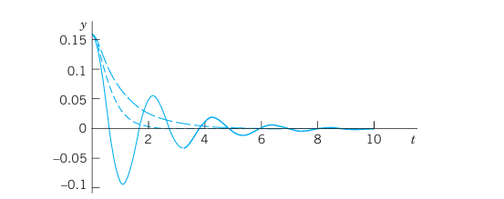{#fig-2-40}

This section concerned free motions of mass–spring systems. Their models are homogeneous linear ODEs. Nonhomogeneous linear ODEs will arise as models of forced motions, that is, motions under the influence of a "driving force." We shall study them in Sec. 2.8, after we have learned how to solve those ODEs.

## PROBLEM SET 2.4

### 1–10 HARMONIC OSCILLATIONS (UNDAMPED MOTION)
1. **Initial value problem.** Find the harmonic motion (@eq-2-27) that starts from $y(0) = y_0$ with initial velocity $y'(0) = v_0$. Graph or sketch the solutions for $\omega_0 = \pi$, $y_0 = 1$, and various $v_0$ of your choice on common axes. At what $t$-values do all these curves intersect? Why?
2. **Frequency.** If a weight of $20\text{ nt}$ (about 4.5 lb) stretches a certain spring by $2\text{ cm}$, what will the frequency of the corresponding harmonic oscillation be? The period?
3. **Frequency.** How does the frequency of the harmonic oscillation change if we (i) double the mass, (ii) take a spring of twice the modulus? First find qualitative answers by physics, then look at formulas.
4. **Initial velocity.** Could you make a harmonic oscillation move faster by giving the body a greater initial push?
5. **Springs in parallel.** What are the frequencies of vibration of a body of mass $m = 5\text{ kg}$ (i) on a spring of modulus $k_1 = 20\text{ nt/m}$, (ii) on a spring of modulus $k_2 = 45\text{ nt/m}$, (iii) on the two springs in parallel? See @fig-2-41.

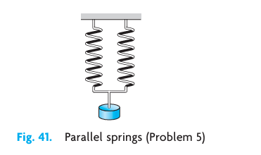{#fig-2-41}

6. **Springs in series.** If a body hangs on a spring of modulus $k_1$, which in turn hangs on a spring of modulus $k_2$, what is the modulus $k$ of this combination of springs?
7. **Pendulum.** Find the frequency of oscillation of a pendulum of length $L$ (@fig-2-42), neglecting air resistance and the weight of the rod, and assuming the angle of displacement $\theta$ to be so small that $\sin \theta$ practically equals $\theta$.

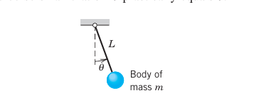{#fig-2-42}

8. **Archimedean principle.** This principle states that the buoyancy force equals the weight of the water displaced by the body (partly or totally submerged). A cylindrical buoy of diameter $60\text{ cm}$ in @fig-2-43 is floating in water with its axis vertical. When depressed downward in the water and released, it vibrates with period $2\text{ sec}$. What is its weight?

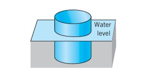{#fig-2-43}

9. **Vibration of water in a U-tube.** If 1 liter of water (about 1.06 US quart) is vibrating up and down under the influence of gravitation in a U-shaped tube of diameter $2\text{ cm}$ (@fig-2-44), what is the frequency? Neglect friction.

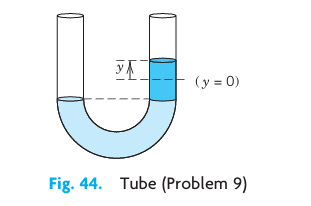{#fig-2-44}

10. **TEAM PROJECT. Harmonic Motions of Similar Models.** The unifying power of mathematical methods results to a large extent from the fact that different physical (or other) systems may have the same or very similar models. Illustrate this for the following three systems:
    (a) **Pendulum clock.** A clock has a 1-meter pendulum. The clock ticks once for each time the pendulum completes a full swing, returning to its original position. How many times a minute does the clock tick?
    (b) **Flat spring.** The harmonic oscillations of a flat spring (@fig-2-45) with a body attached at one end and horizontally clamped at the other are also governed by (@eq-2-26). Find its motions, assuming that the body weighs $8\text{ nt}$ (about 1.8 lb), the system has its static equilibrium $1\text{ cm}$ below the horizontal line, and we let it start from this position with initial velocity $10\text{ cm/sec}$.
    (c) **Torsional vibrations.** Undamped torsional vibrations (rotations back and forth) of a wheel attached to an elastic thin rod or wire (@fig-2-46) are governed by the equation $I_0 \theta'' + K \theta = 0$, where $\theta$ is the angle measured from the state of equilibrium. Solve this equation for $K/I_0 = 13.69\text{ sec}^{-2}$, initial angle $\theta(0) = 30^\circ\text{ (= 0.5235 rad)}$ and initial angular velocity $\theta'(0) = 20^\circ/\text{sec (= 0.349 rad/sec)}$.

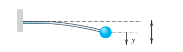{#fig-2-45}

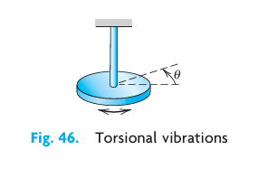{#fig-2-46}

### 11–20 DAMPED MOTION
11. **Overdamping.** Show that for (@eq-2-30) to satisfy initial conditions $y(0) = y_0$ and $y'(0) = v_0$ we must have $c_1 = \frac{1}{2}[(1 + \alpha/\beta)y_0 + v_0/\beta]$ and $c_2 = \frac{1}{2}[(1 - \alpha/\beta)y_0 - v_0/\beta]$.
12. **Overdamping.** Show that in the overdamped case, the body can pass through the equilibrium position $y = 0$ at most once (@fig-2-37).
13. **Initial value problem.** Find the critical motion (@eq-2-31) that starts from $y(0) = y_0$ with initial velocity $y'(0) = v_0$. Graph solution curves for $\alpha = 1$, $y_0 = 1$, and several $v_0$ such that (i) the curve does not intersect the $t$-axis, (ii) it intersects it at $t = 1, 2, \ldots, 5$, respectively.
14. **Shock absorber.** What is the smallest value of the damping constant of a shock absorber in the suspension of a wheel of a car (consisting of a spring and an absorber) that will provide (theoretically) an oscillation-free ride if the mass of the car is $2000\text{ kg}$ and the spring constant equals $4500\text{ kg/sec}^2$?
15. **Frequency.** Find an approximation formula for $\omega^*$ in terms of $\omega_0$ by applying the binomial theorem in (@eq-2-32) and retaining only the first two terms. How good is the approximation in Example 2, III?
16. **Maxima.** Show that the maxima of an underdamped motion occur at equidistant $t$-values and find the distance.
17. **Underdamping.** Determine the values of $t$ corresponding to the maxima and minima of the oscillation $y(t) = e^{-t} \sin t$. Check your result by graphing $y(t)$.
18. **Logarithmic decrement.** Show that the ratio of two consecutive maximum amplitudes of a damped oscillation (@eq-2-33) is constant, and the natural logarithm of this ratio, called the **logarithmic decrement**, equals $\Delta = 2\pi\alpha/\omega^*$. Find $\Delta$ for the solutions of $y'' + 2y' + 5y = 0$.
19. **Damping constant.** Consider an underdamped motion of a body of mass $m = 0.5\text{ kg}$. If the time between two consecutive maxima is $3\text{ sec}$ and the maximum amplitude decreases to $1/2$ its initial value after 10 cycles, what is the damping constant of the system?
20. **CAS PROJECT. Transition Between Cases I, II, III.** Study this transition in terms of graphs of typical solutions (cf. @fig-2-47).
    (a) Avoiding unnecessary generality is part of good modeling. Show that the initial value problems (A) and (B),
    (A) $y'' + cy' + y = 0, \quad y(0) = 1, \quad y'(0) = 0$,
    (B) the same with different $y(0)$ and $y'(0) \neq 0$ instead of 0,
    will give practically as much information as a problem with other $m, k$.
    (b) Consider (A). Choose suitable values of $c$, perhaps better ones than in @fig-2-47, for the transition from Case III to II and I. Guess $c$ for the curves in the figure.
    (c) **Time to go to rest.** Theoretically, this time is infinite (why?). Practically, the system is at rest when its motion has become very small, say, less than 0.1% of the initial displacement, that is in our case,
    (11) $|y(t)| < 0.001$ for all $t$ greater than some $t_1$.
    In engineering constructions, damping can often be varied without too much trouble. Experimenting with your graphs, find empirically a relation between $t_1$ and $c$.
    (d) Solve (A) analytically. Give a reason why the solution $t_2$ of $y(t_2) = -0.001$, with $y(t)$ being the solution of (A), will give you the best possible $c$ satisfying (11).
    (e) Consider (B) empirically as in (a) and (b). What is the main difference between (B) and (A)?

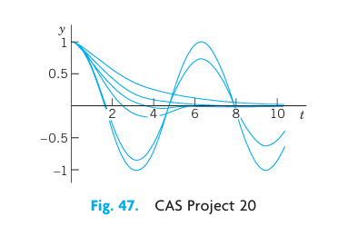{#fig-2-47}

## 2.5 Euler–Cauchy Equations {#sec-2-5}

**Euler–Cauchy equations** are ODEs of the form

$$
x^2 y'' + a x y' + b y = 0
$$ {#eq-2-34}

with given constants $a$ and $b$ and unknown function $y(x)$. We substitute

$$
y = x^m
$$

into (@eq-2-34). Differentiating, we have $y' = m x^{m-1}$ and $y'' = m(m-1) x^{m-2}$. Substitute these expressions into (@eq-2-34):

$$
x^2 m(m-1) x^{m-2} + a x m x^{m-1} + b x^m = 0,
$$

$$
m(m-1) x^m + a m x^m + b x^m = 0.
$$

We now see that $y = x^m$ was a rather natural choice because we have obtained a common factor $x^m$. Dropping it, we have the **auxiliary equation**

$$
m^2 + (a - 1)m + b = 0.
$$ {#eq-2-35}

(Note: $a - 1$, not $a$). Hence $y = x^m$ is a solution of (@eq-2-34) if and only if $m$ is a root of (@eq-2-35). The roots of (@eq-2-35) are

$$
m_1 = \frac{1-a}{2} + \sqrt{\frac{(1-a)^2}{4} - b}, \qquad m_2 = \frac{1-a}{2} - \sqrt{\frac{(1-a)^2}{4} - b}.
$$ {#eq-2-36}

### Case I. Real Distinct Roots

Real different roots $m_1$ and $m_2$ give two real solutions

$$
y_1(x) = x^{m_1} \quad \text{and} \quad y_2(x) = x^{m_2}.
$$

These are linearly independent since their quotient is not constant. Hence they constitute a basis of solutions of (@eq-2-34) for all $x$ for which they are real. The corresponding general solution for all these $x$ is

$$
y = c_1 x^{m_1} + c_2 x^{m_2}.
$$ {#eq-2-37}

### EXAMPLE 1 General Solution in the Case of Different Real Roots
The Euler–Cauchy equation $x^2 y'' + 1.5xy' - 0.5y = 0$ has the auxiliary equation $m^2 + 0.5m - 0.5 = 0$. The roots are $0.5$ and $-1$. Hence a basis of solutions for all positive $x$ is $y_1 = x^{0.5}$ and $y_2 = 1/x$ and gives the general solution

$$
y = c_1 \sqrt{x} + \frac{c_2}{x} \quad (x > 0).

### Case II. A Real Double Root
A real double root of (@eq-2-35) occurs if and only if the discriminant is zero, which means $(1 - a)^2 - 4b = 0 \Rightarrow b = \frac{1}{4}(1 - a)^2$. Then the auxiliary equation has the double root $m_1 = m_2 = m = \frac{1 - a}{2}$.

This gives one solution $y_1 = x^m$. To find a second linearly independent solution $y_2$, we use the method of reduction of order. We set $y_2 = u y_1$. The formula for reduction of order in standard form (from Sec. 2.1) is

$$
u = \int U dx \quad \text{where} \quad U = \frac{1}{y_1^2} e^{-\int p(x) dx}.
$$

In standard form, our Euler-Cauchy equation is $y'' + \frac{a}{x} y' + \frac{b}{x^2} y = 0$. Here $p(x) = a/x$. Thus, $\int p(x) dx = a \ln x \Rightarrow e^{-\int p(x) dx} = e^{-a \ln x} = x^{-a}$. Using $y_1 = x^m$ with $m = (1-a)/2$, we have $y_1^2 = x^{2m} = x^{1-a}$. Substituting these into the expression for $U$ gives:

$$
U = \frac{x^{-a}}{x^{1-a}} = \frac{1}{x}.
$$

Hence, $u = \int \frac{1}{x} dx = \ln x$. Thus $y_2 = u y_1 = x^m \ln x$.

Since $y_1 = x^m$ and $y_2 = x^m \ln x$ are linearly independent (their quotient is $\ln x \neq \text{const}$), they form a basis of solutions for all $x > 0$. The corresponding general solution is

$$
y = (c_1 + c_2 \ln x) x^m.
$$ {#eq-2-38}

### EXAMPLE 2 General Solution in the Case of a Double Root
Solve the Euler-Cauchy equation $x^2 y'' - 5xy' + 9y = 0$ for $x > 0$.

**Solution.**
The auxiliary equation is $m^2 - 6m + 9 = (m - 3)^2 = 0$. It has the double root $m = 3$. Hence a general solution is

$$
y = (c_1 + c_2 \ln x) x^3.
$$ $\square$

### Case III. Complex Conjugate Roots
Complex conjugate roots occur if the discriminant in (@eq-2-36) is negative, $(1 - a)^2 - 4b < 0$. Then the roots are $m_1 = \mu + i\nu$ and $m_2 = \mu - i\nu$ where $\mu = \frac{1-a}{2}$ and $\nu = \sqrt{b - \frac{1}{4}(1-a)^2} > 0$.

These give complex solutions $y_1 = x^{\mu + i\nu}$ and $y_2 = x^{\mu - i\nu}$. Using $x = e^{\ln x}$, we can write $x^{i\nu} = e^{i \nu \ln x}$. Applying Euler's formula, we obtain

$$
x^{\mu + i\nu} = x^\mu (\cos(\nu \ln x) + i \sin(\nu \ln x)), \qquad x^{\mu - i\nu} = x^\mu (\cos(\nu \ln x) - i \sin(\nu \ln x)).
$$

As in Sec. 2.2, by adding and subtracting these solutions (and multiplying by appropriate constants), we obtain a basis of real solutions:

$$
y_1 = x^\mu \cos(\nu \ln x), \qquad y_2 = x^\mu \sin(\nu \ln x).
$$ {#eq-2-39}

These solutions are linearly independent for $x > 0$ since their quotient is $\cot(\nu \ln x) \neq \text{const}$. Thus a real general solution in Case III is

$$
y = x^\mu [ A \cos(\nu \ln x) + B \sin(\nu \ln x) ]
$$ {#eq-2-40}

where $A, B$ are arbitrary constants.

### EXAMPLE 3 Real General Solution in the Case of Complex Roots
Solve the Euler-Cauchy equation $x^2 y'' + 0.6xy' + 16.04y = 0$ for $x > 0$.

**Solution.**
The auxiliary equation is $m^2 - 0.4m + 16.04 = 0$ (since $a-1 = 0.6-1 = -0.4$). The roots are $m = 0.2 \pm 4i$. Here $\mu = 0.2$ and $\nu = 4$. This gives the real general solution

$$
y = x^{0.2} [ A \cos(4 \ln x) + B \sin(4 \ln x) ].
$$ $\square$

### EXAMPLE 4 Boundary Value Problem. Electric Potential Field Between Two Concentric Spheres
Find the electrostatic potential $v(r)$ between two concentric spheres of radii $r_1 = 5\text{ cm}$ and $r_2 = 10\text{ cm}$ kept at potentials $v_1 = 110\text{ V}$ and $v_2 = 0\text{ V}$, respectively.

**Physical Information.** The potential $v(r)$ is a solution of the Euler-Cauchy equation $r v'' + 2 v' = 0$ (or $r^2 v'' + 2 r v' = 0$), where $r$ is the radial distance.

**Solution.**
The auxiliary equation is $m^2 + m = m(m+1) = 0$ (since $a-1 = 2-1 = 1$). It has the roots $0$ and $-1$. This gives the general solution

$$
v(r) = c_1 + \frac{c_2}{r}$.
$$

From the boundary conditions (the potentials on the spheres) we obtain

$$
v(5) = c_1 + \frac{c_2}{5} = 110, \qquad v(10) = c_1 + \frac{c_2}{10} = 0.
$$

Subtracting the second equation from the first, we get $\frac{c_2}{10} = 110 \Rightarrow c_2 = 1100$. Substituting this into the second equation gives $c_1 + 110 = 0 \Rightarrow c_1 = -110$. Thus the potential is

$$
v(r) = -110 + \frac{1100}{r}\text{ V}.
$$

Figure 49 shows that the potential is not a straight line, as it would be for a potential between two parallel plates. For example, on the sphere of radius $7.5\text{ cm}$ it is not $55\text{ V}$, but considerably less: $v(7.5) = -110 + 1100/7.5 \approx 36.7\text{ V}$. $\square$

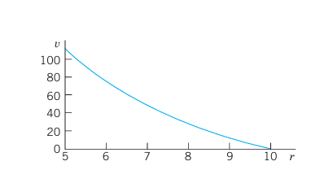{#fig-2-49}

## PROBLEM SET 2.5

1. **Double root.** Verify directly by substitution that $y = x^m \ln x$ is a solution of (@eq-2-34) if (@eq-2-35) has a double root, but $y = x^{m_1}\ln x$ and $y = x^{m_2}\ln x$ are not solutions if the roots $m_1$ and $m_2$ are different.

### 2–11 GENERAL SOLUTION
Find a real general solution. Show the details of your work.
2. $x^2 y'' - 20y = 0$
3. $5x^2 y'' + 23xy' + 16.2y = 0$
4. $(x^2 D^2 - 3xD + 10I)y = 0$
5. $(x^2 D^2 - xD + 5I)y = 0$
6. $(x^2 D^2 - 0.2xD + 0.36I)y = 0$
7. $(x^2 D^2 - 3xD + 4I)y = 0$
8. $(x^2 D^2 - 4xD + 6I)y = 0$
9. $x^2 y'' + 0.7xy' - 0.1y = 0$
10. $4x^2 y'' + 5y = 0$
11. $xy'' + 2y' = 0$

### 12–19 INITIAL VALUE PROBLEMS
Solve and graph the solution. Show the details of your work.
12. $x^2 y'' - xy' - 15y = 0, \quad y(1) = 0.1, \quad y'(1) = -4.5$
13. $9x^2 y'' + 3xy' + y = 0, \quad y(1) = 1, \quad y'(1) = 0$
14. $x^2 y'' + xy' + y = 0, \quad y(1) = 1, \quad y'(1) = 1$
15. $x^2 y'' - 3xy' + 4y = 0, \quad y(1) = -\pi, \quad y'(1) = 2\pi$
16. $x^2 y'' + 3xy' + y = 0, \quad y(1) = 3.6, \quad y'(1) = 0.4$
17. $x^2 y'' + xy' + 9y = 0, \quad y(1) = 0, \quad y'(1) = 2.5$
18. $x^2 y'' + 3xy' + 0.75y = 0, \quad y(1) = 1, \quad y'(1) = -1.5$
19. $x^2 y'' - 4xy' + 6y = 0, \quad y(1) = 0.4, \quad y'(1) = 0$

20. **TEAM PROJECT. Double Root.**
    (a) Derive a second linearly independent solution of (@eq-2-34) by reduction of order directly (performing all steps rather than using the formula).
    (b) Obtain $x^m \ln x$ by considering the solutions $x^m$ and $x^{m+s}$ of a suitable Euler-Cauchy equation and letting $s \to 0$.
    (c) Verify by substitution that $x^m \ln x$ is a solution in the critical case.
    (d) Transform the Euler-Cauchy equation (@eq-2-34) into an ODE with constant coefficients by setting $x = e^t$ (for $x > 0$).
    (e) Obtain the second solution in the critical case from that of a constant-coefficient ODE.

## 2.6 Existence and Uniqueness of Solutions. Wronskian {#sec-2-6}

In this section we shall discuss the general theory of homogeneous linear ODEs

$$
y'' + p(x)y' + q(x)y = 0
$$ {#eq-2-41}

with continuous, but otherwise arbitrary, variable coefficients $p$ and $q$. This will concern the existence and form of a general solution of (@eq-2-41) as well as the uniqueness of the solution of initial value problems consisting of (@eq-2-41) and two initial conditions

$$
y(x_0) = K_0, \quad y'(x_0) = K_1
$$ {#eq-2-42}

with given $x_0, K_0, K_1$.

The two main results will be Theorem 1, stating that such an initial value problem always has a solution which is unique, and Theorem 4, stating that a general solution

$$
y = c_1 y_1 + c_2 y_2
$$ {#eq-2-43}

includes all solutions. Hence linear ODEs with continuous coefficients have no "singular solutions" (solutions not obtainable from a general solution).

Central to our present discussion is the following theorem.

### THEOREM 1 Existence and Uniqueness Theorem for Initial Value Problems
If $p(x)$ and $q(x)$ are continuous functions on some open interval $I$ and $x_0$ is in $I$, then the initial value problem consisting of (@eq-2-41) and (@eq-2-42) has a unique solution $y(x)$ on the interval $I$.

The proof of existence uses the same prerequisites as the existence proof in Sec. 1.7; it can be found in Ref. [A11] listed in App. 1. Uniqueness is proved in App. 4.

### Linear Independence of Solutions

A general solution on an open interval $I$ is made up from a basis on $I$, that is, from a pair of linearly independent solutions on $I$. We call $y_1$ and $y_2$ **linearly independent** on $I$ if the equation

$$
k_1 y_1(x) + k_2 y_2(x) = 0
$$ {#eq-2-44}

everywhere on $I$ implies $k_1 = 0$ and $k_2 = 0$.

We call $y_1, y_2$ **linearly dependent** on $I$ if (@eq-2-44) also holds for constants $k_1, k_2$, not both 0. In this case, and only in this case, $y_1$ and $y_2$ are proportional on $I$, that is, $y_1 = k y_2$ or $y_2 = l y_1$ for all $x$ on $I$.

### THEOREM 2 Linear Dependence and Independence of Solutions
Let the ODE (@eq-2-41) have continuous coefficients $p(x)$ and $q(x)$ on an open interval $I$. Then two solutions $y_1$ and $y_2$ of (@eq-2-41) on $I$ are linearly dependent on $I$ if and only if their **Wronskian**

$$
W(y_1, y_2) = y_1 y_2' - y_2 y_1'
$$ {#eq-2-45}

is 0 at some $x_0$ in $I$. Furthermore, if $W(y_1, y_2) = 0$ at an $x_0$ in $I$, then $W \equiv 0$ on $I$; hence, if there is an $x_1$ in $I$ at which $W$ is not 0, then $y_1, y_2$ are linearly independent on $I$.

**PROOF**
(a) Let $y_1, y_2$ be linearly dependent on $I$. Then $y_1 = k y_2$ (or $y_2 = l y_1$) holds on $I$. If $y_1 = k y_2$ holds, then

$$
W(y_1, y_2) = y_1 y_2' - y_2 y_1' = k y_2 y_2' - y_2 k y_2' = 0.
$$

Similarly if $y_2 = l y_1$ holds.

(b) Conversely, let $W(y_1, y_2) = 0$ for some $x_0$ in $I$. We show that this implies linear dependence of $y_1, y_2$ on $I$. We consider the linear system of equations in the unknowns $k_1, k_2$:

$$
\begin{aligned}
k_1 y_1(x_0) + k_2 y_2(x_0) &= 0 \\
k_1 y_1'(x_0) + k_2 y_2'(x_0) &= 0.
\end{aligned}
$$ {#eq-2-46}

To eliminate $k_2$, multiply the first equation by $y_2'(x_0)$ and the second by $-y_2(x_0)$ and add. This gives

$$
k_1 (y_1(x_0) y_2'(x_0) - y_1'(x_0) y_2(x_0)) = k_1 W(y_1(x_0), y_2(x_0)) = 0.
$$

Similarly, to eliminate $k_1$, multiply the first equation by $-y_1'(x_0)$ and the second by $y_1(x_0)$ and add. This gives $k_2 W(y_1(x_0), y_2(x_0)) = 0$.
Since $W = 0$ at $x_0$, division by $W$ is not possible, and the system has a solution for which $k_1, k_2$ are not both 0. Using these numbers $k_1, k_2$, we introduce the function

$$
y(x) = k_1 y_1(x) + k_2 y_2(x).
$$

Since (@eq-2-41) is homogeneous linear, Theorem 1 in Sec. 2.1 (the superposition principle) implies that $y(x)$ is a solution of (@eq-2-41) on $I$. From (@eq-2-46) we see that it satisfies the initial conditions $y(x_0) = 0, y'(x_0) = 0$. Now another solution of (@eq-2-41) satisfying the same initial conditions is $y^* \equiv 0$. Since the coefficients $p$ and $q$ of (@eq-2-41) are continuous, Theorem 1 applies and gives uniqueness, that is, $y(x) \equiv y^*(x) \equiv 0$, written out:

$$
k_1 y_1(x) + k_2 y_2(x) = 0
$$

on $I$. Since $k_1$ and $k_2$ are not both zero, this means $y_1$ and $y_2$ are linearly dependent on $I$.

(c) We prove the last statement. If $W \equiv 0$ is not true, there is some $x_1$ in $I$ where $W(x_1) \neq 0$. If $y_1, y_2$ were linearly dependent, then $W$ would be 0 everywhere by part (a), including at $x_1$, which contradicts $W(x_1) \neq 0$. Thus, $y_1, y_2$ must be linearly independent. $\square$

For calculations, the following formulas are often simpler than (@eq-2-45):

$$
\text{(a)} \quad W(y_1, y_2) = \left( \frac{y_2}{y_1} \right)' y_1^2 \quad (y_1 \neq 0), \qquad \text{(b)} \quad W(y_1, y_2) = -\left( \frac{y_1}{y_2} \right)' y_2^2 \quad (y_2 \neq 0).
$$ {#eq-2-47}

These formulas follow from the quotient rule of differentiation.

**Remark. Determinants.** The Wronskian can be written as a second-order determinant:

$$
W(y_1, y_2) = \begin{vmatrix} y_1 & y_2 \\ y_1' & y_2' \end{vmatrix} = y_1 y_2' - y_2 y_1'.
$$ {#eq-2-48}

This determinant is called the **Wronski determinant** or, briefly, the **Wronskian**.

### EXAMPLE 1 Illustration of Theorem 2
The functions $y_1 = \cos \omega x$ and $y_2 = \sin \omega x$ are solutions of $y'' + \omega^2 y = 0$. Their Wronskian is

$$
W(\cos \omega x, \sin \omega x) = \begin{vmatrix} \cos \omega x & \sin \omega x \\ -\omega \sin \omega x & \omega \cos \omega x \end{vmatrix} = \omega (\cos^2 \omega x + \sin^2 \omega x) = \omega.
$$

Theorem 2 shows that these solutions are linearly independent if and only if $\omega \neq 0$. Of course, we can see this directly since their quotient is $\tan \omega x \neq \text{const}$ when $\omega \neq 0$.

### EXAMPLE 2 Illustration of Theorem 2 for a Double Root
A general solution of $y'' - 2y' + y = 0$ on any interval is $y = (c_1 + c_2 x) e^x$. The corresponding Wronskian of $y_1 = e^x$ and $y_2 = x e^x$ is:

$$
W(e^x, x e^x) = \begin{vmatrix} e^x & x e^x \\ e^x & (x+1)e^x \end{vmatrix} = e^{2x} (x + 1 - x) = e^{2x} \neq 0.
$$

This Wronskian is never 0, confirming that $e^x$ and $x e^x$ are linearly independent on any interval. $\square$

### THEOREM 3 Existence of a General Solution
If $p(x)$ and $q(x)$ are continuous on an open interval $I$, then (@eq-2-41) has a general solution on $I$.

**PROOF**
By Theorem 1, the ODE (@eq-2-41) has a solution $y_1$ on $I$ satisfying the initial conditions $y_1(x_0) = 1, y_1'(x_0) = 0$ and a solution $y_2$ on $I$ satisfying the initial conditions $y_2(x_0) = 0, y_2'(x_0) = 1$. The Wronskian of these two solutions has at $x_0$ the value

$$
W(y_1(x_0), y_2(x_0)) = y_1(x_0) y_2'(x_0) - y_2(x_0) y_1'(x_0) = 1 \cdot 1 - 0 \cdot 0 = 1.
$$

Hence, by Theorem 2, these solutions are linearly independent on $I$. They form a basis of solutions of (@eq-2-41) on $I$, and $y = c_1 y_1 + c_2 y_2$ is a general solution of (@eq-2-41) on $I$. $\square$

### THEOREM 4 A General Solution Includes All Solutions
If the ODE (@eq-2-41) has continuous coefficients $p(x)$ and $q(x)$ on some open interval $I$, then every solution of (@eq-2-41) on $I$ is of the form

$$
Y(x) = C_1 y_1(x) + C_2 y_2(x)
$$

where $y_1, y_2$ is any basis of solutions of (@eq-2-41) on $I$ and $C_1, C_2$ are suitable constants.

**PROOF**
Let $Y(x)$ be any solution of (@eq-2-41) on $I$. We choose any $x_0$ in $I$ and show that we can find values of $c_1, c_2$ in the general solution $y(x) = c_1 y_1(x) + c_2 y_2(x)$ such that $y(x_0) = Y(x_0)$ and $y'(x_0) = Y'(x_0)$. That is,

$$
\begin{aligned}
c_1 y_1(x_0) + c_2 y_2(x_0) &= Y(x_0) \\
c_1 y_1'(x_0) + c_2 y_2'(x_0) &= Y'(x_0).
\end{aligned}
$$ {#eq-2-49}

To solve for $c_1$ and $c_2$, we multiply the first equation by $y_2'(x_0)$ and the second by $-y_2(x_0)$ and add to get:

$$
c_1 (y_1(x_0) y_2'(x_0) - y_2(x_0) y_1'(x_0)) = Y(x_0) y_2'(x_0) - y_2(x_0) Y'(x_0),
$$

$$
c_1 W(y_1(x_0), y_2(x_0)) = Y(x_0) y_2'(x_0) - y_2(x_0) Y'(x_0).
$$

Similarly, multiplying the first by $-y_1'(x_0)$ and the second by $y_1(x_0)$ and adding, we get:

$$
c_2 W(y_1(x_0), y_2(x_0)) = y_1(x_0) Y'(x_0) - Y(x_0) y_1'(x_0).
$$

Since $y_1, y_2$ is a basis, $W \neq 0$ and we can solve for $c_1, c_2$ uniquely. Let these unique values be $C_1, C_2$. By substituting them into the general solution we obtain the particular solution $y^*(x) = C_1 y_1(x) + C_2 y_2(x)$.
Since $y^*(x_0) = Y(x_0)$ and $y^{*'}(x_0) = Y'(x_0)$, by the uniqueness in Theorem 1 we conclude that $Y(x) \equiv y^*(x)$ everywhere on $I$. $\square$

## PROBLEM SET 2.6

1. **Abel's formula.** Prove Abel's formula: $W(y_1(x), y_2(x)) = C e^{-\int p(x) dx}$ for two solutions $y_1, y_2$ of (@eq-2-41). Hint: Differentiate the Wronskian $W = y_1 y_2' - y_2 y_1$ and substitute $y_i'' = -p y_i' - q y_i$ to obtain $W' = -p W$. Solve this first-order ODE.

### 2–8 BASIS OF SOLUTIONS. WRONSKIAN
Find the Wronskian. Show linear independence by using quotients and confirm it by Theorem 2.
2. $e^{4.0x}, e^{-1.5x}$
3. $e^{-0.4x}, e^{-2.6x}$
4. $x, 1/x$
5. $x^3, x^2$
6. $e^{-x}\cos \omega x, e^{-x}\sin \omega x$
7. $\cosh ax, \sinh ax$
8. $x^k \cos(\ln x), x^k \sin(\ln x)$

### 9–15 ODE FOR GIVEN BASIS. WRONSKIAN. IVP
(a) Find a second-order homogeneous linear ODE for which the given functions are solutions. (b) Show linear independence by the Wronskian. (c) Solve the initial value problem.
9. $e^{4x}, e^{-1.5x}, \quad y(0) = 3, \quad y'(0) = -7.5$
10. $e^{-0.4x}, e^{-2.6x}, \quad y(0) = -2, \quad y'(0) = -0.3258$
11. $x, 1/x, \quad y(1) = 4, \quad y'(1) = 6$
12. $x^2, x^2 \ln x, \quad y(1) = 4, \quad y'(1) = 6$
13. $e^{-kx}\cos \pi x, e^{-kx}\sin \pi x, \quad y(0) = 1, \quad y'(0) = -k-\pi$
14. $1, e^{-2x}, \quad y(0) = 1, \quad y'(0) = -1$
15. $\cosh 1.8x, \sinh 1.8x, \quad y(0) = 14.20, \quad y'(0) = 16.38$

16. **TEAM PROJECT. Consequences of the Present Theory.**
    (a) Solve $y'' - y = 0$ (i) by exponential functions, (ii) by hyperbolic functions. How are the constants related?
    (b) Prove that the solutions of a basis cannot be 0 at the same point.
    (c) Prove that the solutions of a basis cannot have a maximum or minimum at the same point.
    (d) Why is it likely that formulas of the form (@eq-2-47) should exist?
    (e) Sketch $y_1(x) = x^3$ if $x \ge 0$ (and $0$ if $x < 0$), and $y_2(x) = 0$ if $x \ge 0$ (and $x^3$ if $x < 0$). Show linear independence on $[-1, 1]$. What is their Wronskian? What Euler-Cauchy equation do they satisfy? Is there a contradiction to Theorem 2?

## 2.7 Nonhomogeneous ODEs

We now advance from homogeneous to nonhomogeneous linear ODEs. Consider the second-order nonhomogeneous linear ODE

$$
y'' + p(x)y' + q(x)y = r(x) \tag{1}
$$

where $r(x) \not\equiv 0$. We shall see that a "general solution" of (1) is the sum of a general solution of the corresponding homogeneous ODE

$$
y'' + p(x)y' + q(x)y = 0 \tag{2}
$$

and a "particular solution" of (1). These two new terms "general solution of (1)" and "particular solution of (1)" are defined as follows.

::: {.callout-note appearance="simple" icon=false}
**DEFINITION &emsp; General Solution, Particular Solution**

A **general solution** of the nonhomogeneous ODE (1) on an open interval $I$ is a solution of the form

$$
y(x) = y_h(x) + y_p(x); \tag{3}
$$

here, $y_h = c_1 y_1 + c_2 y_2$ is a general solution of the homogeneous ODE (2) on $I$ and $y_p$ is any solution of (1) on $I$ containing no arbitrary constants. A **particular solution** of (1) on $I$ is a solution obtained from (3) by assigning specific values to the arbitrary constants $c_1$ and $c_2$ in $y_h$.
:::

Our task is now twofold, first to justify these definitions and then to develop a method for finding a solution of (1). Accordingly, we first show that a general solution as just defined satisfies (1) and that the solutions of (1) and (2) are related in a very simple way.

### THEOREM 1 Relations of Solutions of (1) to Those of (2)

**(a)** The sum of a solution $y$ of (1) on some open interval $I$ and a solution $\tilde{y}$ of (2) on $I$ is a solution of (1) on $I$. In particular, (3) is a solution of (1) on $I$.

**(b)** The difference of two solutions of (1) on $I$ is a solution of (2) on $I$.

**PROOF** (a) Let $L[y]$ denote the left side of (1). Then for any solutions $y$ of (1) and $\tilde{y}$ of (2) on $I$,
$$
L[y + \tilde{y}] = L[y] + L[\tilde{y}] = r + 0 = r.
$$
(b) For any solutions $y$ and $y^*$ of (1) on $I$ we have $L[y - y^*] = L[y] - L[y^*] = r - r = 0$. $\square$

Now for homogeneous ODEs (2) we know that general solutions include all solutions. We show that the same is true for nonhomogeneous ODEs (1).

### THEOREM 2 A General Solution of a Nonhomogeneous ODE Includes All Solutions

If the coefficients $p(x)$, $q(x)$, and the function $r(x)$ in (1) are continuous on some open interval $I$, then every solution of (1) on $I$ is obtained by assigning suitable values to the arbitrary constants $c_1$ and $c_2$ in a general solution (3) of (1) on $I$.

**PROOF** Let $y^*$ be any solution of (1) on $I$ and $x_0$ any $x$ in $I$. Let (3) be any general solution of (1) on $I$. This solution exists: $y_h = c_1 y_1 + c_2 y_2$ exists by Theorem 3 in Sec. 2.6 because of the continuity assumption, and $y_p$ exists according to a construction to be shown in Sec. 2.10. Now, by Theorem 1(b) just proved, the difference $Y = y^* - y_p$ is a solution of (2) on $I$. At $x_0$ we have
$$
Y(x_0) = y^*(x_0) - y_p(x_0), \qquad Y'(x_0) = y^{*'}(x_0) - y_p'(x_0).
$$
Theorem 1 in Sec. 2.6 implies that for these conditions, as for any other initial conditions in $I$, there exists a unique particular solution of (2) obtained by assigning suitable values to $c_1, c_2$ in $y_h$. From this and $y^* = Y + y_p$ the statement follows. $\square$

### Method of Undetermined Coefficients

Our discussion suggests the following. To solve the nonhomogeneous ODE (1) or an initial value problem for (1), we have to solve the homogeneous ODE (2) and find any solution $y_p$ of (1), so that we obtain a general solution (3) of (1).

How can we find a solution $y_p$ of (1)? One method is the so-called **method of undetermined coefficients**. It is much simpler than another, more general, method (given in Sec. 2.10). Since it applies to models of vibrational systems and electric circuits to be shown in the next two sections, it is frequently used in engineering.

More precisely, the method of undetermined coefficients is suitable for linear ODEs with constant coefficients $a$ and $b$

$$
y'' + ay' + by = r(x) \tag{4}
$$

when $r(x)$ is an exponential function, a power of $x$, a cosine or sine, or sums or products of such functions. These functions have derivatives similar to $r(x)$ itself. This gives the idea. We choose a form for $y_p$ similar to $r(x)$, but with unknown coefficients to be determined by substituting that $y_p$ and its derivatives into the ODE. **Table 2.1** on p. 82 shows the choice of $y_p$ for practically important forms of $r(x)$. Corresponding rules are as follows.

**Choice Rules for the Method of Undetermined Coefficients**

**(a) Basic Rule.** If $r(x)$ in (4) is one of the functions in the first column in Table 2.1, choose $y_p$ in the same line and determine its undetermined coefficients by substituting $y_p$ and its derivatives into (4).

**(b) Modification Rule.** If a term in your choice for $y_p$ happens to be a solution of the homogeneous ODE corresponding to (4), multiply this term by $x$ (or by $x^2$ if this solution corresponds to a double root of the characteristic equation of the homogeneous ODE).

**(c) Sum Rule.** If $r(x)$ is a sum of functions in the first column of Table 2.1, choose for $y_p$ the sum of the functions in the corresponding lines of the second column.

The Basic Rule applies when $r(x)$ is a single term. The Modification Rule helps in the indicated case, and to recognize such a case, we have to solve the homogeneous ODE first. The Sum Rule follows by noting that the sum of two solutions of (1) with $r = r_1$ and $r = r_2$ (and the same left side!) is a solution of (1) with $r = r_1 + r_2$. (Verify!)

The method is self-correcting. A false choice for $y_p$ or one with too few terms will lead to a contradiction. A choice with too many terms will give a correct result, with superfluous coefficients coming out zero.

Let us illustrate Rules (a)–(c) by the typical Examples 1–3.

| Term in $r(x)$ | Choice for $y_p(x)$ |
|:---|:---|
| $ke^{\gamma x}$ | $Ce^{\gamma x}$ |
| $kx^n$ ($n = 0, 1, \ldots$) | $K_n x^n + K_{n-1}x^{n-1} + \cdots + K_1 x + K_0$ |
| $k\cos \omega x$ | $K\cos \omega x + M\sin \omega x$ |
| $k\sin \omega x$ | $K\cos \omega x + M\sin \omega x$ |
| $ke^{\alpha x}\cos \omega x$ | $e^{\alpha x}(K\cos \omega x + M\sin \omega x)$ |
| $ke^{\alpha x}\sin \omega x$ | $e^{\alpha x}(K\cos \omega x + M\sin \omega x)$ |

: Table 2.1 Method of Undetermined Coefficients {#tbl-2-1}

### EXAMPLE 1 Application of the Basic Rule (a)

Solve the initial value problem

$$
y'' + y = 0.001x^2, \qquad y(0) = 0,\quad y'(0) = 1.5. \tag{5}
$$

**Solution.** **Step 1. General solution of the homogeneous ODE.** The ODE $y'' + y = 0$ has the general solution
$$
y_h = A\cos x + B\sin x.
$$

**Step 2. Solution of the nonhomogeneous ODE.** We first try $y_p = Kx^2$. Then $y_p'' = 2K$. By substitution,
$$
2K + Kx^2 = 0.001x^2.
$$
For this to hold for all $x$, the coefficient of each power of $x$ must be the same on both sides; thus $K = 0.001$ and $2K = 0$, a contradiction. The second line in Table 2.1 suggests the choice
$$
y_p = K_2 x^2 + K_1 x + K_0.
$$
Then $y_p'' + y_p = 2K_2 + K_2 x^2 + K_1 x + K_0 = 0.001x^2$. Equating the coefficients of $x^2$, $x$, $x^0$ on both sides, we have $K_2 = 0.001$, $K_1 = 0$, $2K_2 + K_0 = 0$. Hence
$$
y_p = 0.001x^2 - 0.002, \qquad K_0 = -2K_2 = -0.002.
$$
This gives $y = y_h + y_p = A\cos x + B\sin x + 0.001x^2 - 0.002$.

**Step 3. Solution of the initial value problem.** Setting $x = 0$ and using the first initial condition gives $y(0) = A - 0.002 = 0$, hence $A = 0.002$. By differentiation and from the second initial condition, $y'(0) = B = 1.5$. This gives the answer (Fig. 50)

$$
y = 0.002\cos x + 1.5\sin x + 0.001x^2 - 0.002.
$$

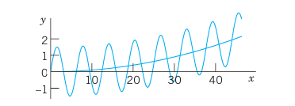{#fig-2-50}

Figure 50 shows $y$ as well as the quadratic parabola $y_p$ about which $y$ is oscillating, practically like a sine curve since the cosine term is smaller by a factor of about $1/1000$. $\square$

### EXAMPLE 2 Application of the Modification Rule (b)

Solve the initial value problem

$$
y'' + 3y' + 2.25y = -10e^{-1.5x}, \qquad y(0) = 1,\quad y'(0) = 0. \tag{6}
$$

**Solution.** **Step 1. General solution of the homogeneous ODE.** The characteristic equation of the homogeneous ODE is $\lambda^2 + 3\lambda + 2.25 = (\lambda + 1.5)^2 = 0$. Hence the homogeneous ODE has the general solution
$$
y_h = (c_1 + c_2 x)e^{-1.5x}.
$$

**Step 2. Solution of the nonhomogeneous ODE.** The function on the right would normally require the choice $y_p = Ce^{-1.5x}$. But we see from $y_h$ that this function is a solution of the homogeneous ODE, which corresponds to a double root of the characteristic equation. Hence, according to the Modification Rule we have to multiply our choice function by $x^2$. That is, we choose $y_p = Cx^2 e^{-1.5x}$. Then
$$
y_p' = C(2x - 1.5x^2)e^{-1.5x}, \qquad y_p'' = C(2 - 6x + 2.25x^2)e^{-1.5x}.
$$
We substitute these expressions into the given ODE and omit the factor $e^{-1.5x}$. This yields
$$
C(2 - 6x + 2.25x^2) + 3C(2x - 1.5x^2) + 2.25Cx^2 = -10.
$$
Comparing the coefficients of $x^2$, $x$, $x^0$ gives $0 = 0$, $0 = 0$, $2C = -10$, hence $C = -5.0$. This gives the particular solution $y_p = -5x^2 e^{-1.5x}$. Hence the given ODE has the general solution
$$
y = y_h + y_p = (c_1 + c_2 x)e^{-1.5x} - 5x^2 e^{-1.5x}.
$$

**Step 3. Solution of the initial value problem.** Setting $x = 0$ in $y$ and using the first initial condition, we obtain $y(0) = c_1 = 1$. Differentiation of $y$ gives
$$
y' = (c_2 - 1.5c_1 - 1.5c_2 x)e^{-1.5x} - 10xe^{-1.5x} + 7.5x^2 e^{-1.5x}.
$$
From this and the second initial condition we have $y'(0) = c_2 - 1.5c_1 = 0$, hence $c_2 = 1.5c_1 = 1.5$. This gives the answer (Fig. 51)

$$
y = (1 + 1.5x - 5x^2)e^{-1.5x}.
$$

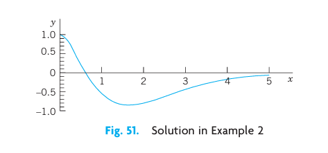{#fig-2-51}

The curve begins with a horizontal tangent, crosses the $x$-axis at $x \approx 0.6217$ (where $1 + 1.5x - 5x^2 = 0$) and approaches the axis from below as $x$ increases. $\square$

### EXAMPLE 3 Application of the Sum Rule (c)

Solve the initial value problem

$$
y'' + 2y' + 0.75y = 2\cos x - 0.25\sin x + 0.09x, \qquad y(0) = 2.78,\quad y'(0) = -0.43. \tag{7}
$$

**Solution.** **Step 1. General solution of the homogeneous ODE.** The characteristic equation of the homogeneous ODE is
$$
\lambda^2 + 2\lambda + 0.75 = \left(\lambda + \tfrac{1}{2}\right)\!\left(\lambda + \tfrac{3}{2}\right) = 0,
$$
which gives the general solution $y_h = c_1 e^{-x/2} + c_2 e^{-3x/2}$.

**Step 2. Particular solution of the nonhomogeneous ODE.** We write $y_p = y_{p1} + y_{p2}$ and, following Table 2.1 (columns C and B),
$$
y_{p1} = K\cos x + M\sin x \qquad \text{and} \qquad y_{p2} = K_1 x + K_0.
$$
Differentiation gives $y_{p1}' = -K\sin x + M\cos x$ and $y_{p1}'' = -K\cos x - M\sin x$. Substitution of $y_{p1}$ into the ODE in (7) gives, by comparing the cosine and sine terms,
$$
-K + 2M + 0.75K = 2 \implies -0.25K + 2M = 2,
$$
$$
-M - 2K + 0.75M = -0.25 \implies -2K - 0.25M = -0.25,
$$
hence $K = 0$ and $M = 1$. Substituting $y_{p2}$ into the ODE in (7) and comparing the $x$- and $x^0$-terms gives $0.75K_1 = 0.09$, thus $K_1 = 0.12$, and $2K_1 + 0.75K_0 = 0$, thus $K_0 = -0.32$.

Hence a general solution of the ODE in (7) is
$$
y = c_1 e^{-x/2} + c_2 e^{-3x/2} + \sin x + 0.12x - 0.32.
$$

**Step 3. Solution of the initial value problem.** From $y, y'$ and the initial conditions we obtain $y(0) = c_1 + c_2 - 0.32 = 2.78$ and $y'(0) = -\tfrac{1}{2}c_1 - \tfrac{3}{2}c_2 + 1 + 0.12 = -0.43$. Hence $c_1 = 3.1$, $c_2 = 0$. This gives the solution of the IVP (Fig. 52)

$$
y = 3.1e^{-x/2} + \sin x + 0.12x - 0.32.
$$

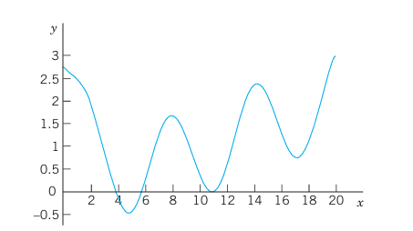{#fig-2-52}

$\square$

**Stability.** The following is important. If (and only if) all the roots of the characteristic equation of the homogeneous ODE in (4) are negative, or have a negative real part, then a general solution $y_h$ of this ODE goes to 0 as $x \to \infty$, so that the "transient solution" $y = y_h + y_p$ of (4) approaches the "steady-state solution" $y_p$. In this case the nonhomogeneous ODE and the physical or other system modeled by the ODE are called **stable**; otherwise they are called **unstable**. For instance, the ODE in Example 1 is unstable. Applications follow in the next two sections.

## PROBLEM SET 2.7

### 1–10 NONHOMOGENEOUS LINEAR ODEs: GENERAL SOLUTION
Find a (real) general solution. State which rule you are using. Show each step of your work.

1. $y'' + 5y' + 4y = 10e^{-3x}$
2. $10y'' + 50y' + 57.6y = \cos x$
3. $y'' + 3y' + 2y = 12x^2$
4. $y'' - 9y = 18\cos \pi x$
5. $y'' + 4y' + 4y = e^{-x}\cos x$
6. $y'' + y' + \left(\pi^2 + \tfrac{1}{4}\right)y = e^{-x/2}\sin \pi x$
7. $(3D^2 - 27I)y = 3\cos x + \cos 3x$
8. $(D^2 - 16I)y = 9.6e^{4x} + 30e^x$
9. $(D^2 + 2D + I)y = 2x\sin x$
10. $\left(D^2 + 2D + \tfrac{3}{4}I\right)y = 3e^x + \tfrac{9}{2}x$

### 11–18 NONHOMOGENEOUS LINEAR ODEs: IVPs
Solve the initial value problem. State which rule you are using. Show each step of your calculation in detail.

11. $y'' + 3y = 18x^2, \quad y(0) = -3,\quad y'(0) = 0$
12. $y'' + 4y = -12\sin 2x, \quad y(0) = 1.8,\quad y'(0) = 5.0$
13. $8y'' - 6y' + y = 6\cosh x, \quad y(0) = 0.2,\quad y'(0) = 0.05$
14. $y'' + 4y' + 4y = e^{-2x}\sin 2x, \quad y(0) = 1,\quad y'(0) = -1.5$
15. $(x^2 D^2 - 3xD + 3I)y = 3\ln x - 4, \quad y_p = \ln x, \quad y(1) = 0,\quad y'(1) = 1$
16. $(D^2 - 2D)y = 6e^{2x} - 4e^{-2x}, \quad y(0) = -1,\quad y'(0) = 6$
17. $(D^2 - 0.2D - 0.26I)y = 1.22e^{0.5x}, \quad y(0) = 3.5,\quad y'(0) = 0.35$
18. $(D^2 + 2D + 10I)y = 17\sin x - 37\sin 3x, \quad y(0) = 6.6,\quad y'(0) = -2.2$

19. **CAS PROJECT. Structure of Solutions of Initial Value Problems.** Using the present method, find, graph, and discuss the solutions $y$ of initial value problems of your own choice. Explore effects on solutions caused by changes of initial conditions. Graph $y_p$, $y$, $y - y_p$ separately, to see the separate effects. Find a problem in which (a) the part of $y$ resulting from $y_h$ decreases to zero, (b) increases, (c) is not present in the answer $y$. Study a problem with $y(0) = 0$, $y'(0) = 0$. Consider a problem in which you need the Modification Rule (a) for a simple root, (b) for a double root. Make sure that your problems cover all three Cases I, II, III (see Sec. 2.2).

20. **TEAM PROJECT. Extensions of the Method of Undetermined Coefficients.** (a) Extend the method to products of the functions in Table 2.1. (b) Extend the method to Euler–Cauchy equations. Comment on the practical significance of such extensions.

---

## 2.8 Modeling: Forced Oscillations. Resonance {#sec-forced-oscillations}

In Sec. 2.4 we considered vertical motions of a mass–spring system (vibration of a mass $m$ on an elastic spring, as in Figs. 33 and 53) and modeled it by the homogeneous linear ODE

$$
m y'' + c y' + k y = 0 \tag{1}
$$

Here $y(t)$ as a function of time $t$ is the displacement of the body of mass $m$ from rest.

The mass–spring system of Sec. 2.4 exhibited only free motion. This means no external forces (outside forces) but only internal forces controlled the motion. The internal forces are forces within the system. They are the force of inertia $m y''$, the damping force $c y'$ (if $c > 0$), and the spring force $k y$, a restoring force.

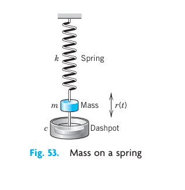{#fig-2-53}

We now extend our model by including an additional force, that is, the external force $r(t)$ on the right. Then we have

$$
m y'' + c y' + k y = r(t) \tag{2*}
$$

Mechanically this means that at each instant $t$ the resultant of the internal forces is in equilibrium with $r(t)$. The resulting motion is called a **forced motion** with forcing function $r(t)$, which is also known as **input** or **driving force**, and the solution $y(t)$ to be obtained is called the **output** or the **response** of the system to the driving force.

Of special interest are periodic external forces, and we shall consider a driving force of the form $r(t) = F_0 \cos \omega t$ ($F_0 > 0$, $\omega > 0$). Then we have the nonhomogeneous ODE

$$
m y'' + c y' + k y = F_0 \cos \omega t \tag{2}
$$

Its solution will reveal facts that are fundamental in engineering mathematics and allow us to model resonance.

### Solving the Nonhomogeneous ODE (2)

From Sec. 2.7 we know that a general solution of (2) is the sum of a general solution $y_h$ of the homogeneous ODE (1) plus any particular solution $y_p$ of (2). To find $y_p$ we use the method of undetermined coefficients (Sec. 2.7), starting from

$$
y_p(t) = a \cos \omega t + b \sin \omega t \tag{3}
$$

By differentiating this function (chain rule!) we obtain

$$
y_p'(t) = -\omega a \sin \omega t + \omega b \cos \omega t,
$$

$$
y_p''(t) = -\omega^2 a \cos \omega t - \omega^2 b \sin \omega t.
$$

Substituting $y_p, y_p', y_p''$ into (2) and collecting the cosine and the sine terms, we get

$$
[(k - m\omega^2)a + \omega c b] \cos \omega t + [-\omega c a + (k - m\omega^2)b] \sin \omega t = F_0 \cos \omega t.
$$

The cosine terms on both sides must be equal, and the coefficient of the sine term on the left must be zero since there is no sine term on the right. This gives the two equations

$$
(k - m\omega^2)a + \omega c b = F_0
$$

$$
-\omega c a + (k - m\omega^2)b = 0 \tag{4}
$$

for determining the unknown coefficients $a$ and $b$. This is a linear system. We can solve it by elimination. To eliminate $b$, multiply the first equation by $(k - m\omega^2)$ and the second by $-\omega c$, and add the results, obtaining

$$
[(k - m\omega^2)^2 + \omega^2 c^2]a = (k - m\omega^2)F_0.
$$

Similarly, to eliminate $a$, multiply the first equation by $\omega c$ and the second by $(k - m\omega^2)$, and add to get

$$
[(k - m\omega^2)^2 + \omega^2 c^2]b = \omega c F_0.
$$

If the factor $(k - m\omega^2)^2 + \omega^2 c^2$ is not zero, we can divide by this factor and solve for $a$ and $b$,

$$
a = F_0 \frac{k - m\omega^2}{(k - m\omega^2)^2 + \omega^2 c^2}, \qquad b = F_0 \frac{\omega c}{(k - m\omega^2)^2 + \omega^2 c^2}.
$$

If we set $\omega_0 = \sqrt{k/m}$ as in Sec. 2.4, then $k = m\omega_0^2$ and we obtain

$$
a = F_0 \frac{m(\omega_0^2 - \omega^2)}{m^2(\omega_0^2 - \omega^2)^2 + \omega^2 c^2}, \qquad b = F_0 \frac{\omega c}{m^2(\omega_0^2 - \omega^2)^2 + \omega^2 c^2} \tag{5}
$$

We thus obtain the general solution of the nonhomogeneous ODE (2) in the form

$$
y(t) = y_h(t) + y_p(t) \tag{6}
$$

Here $y_h$ is a general solution of the homogeneous ODE (1) and $y_p$ is given by (3) with coefficients (5).

We shall now discuss the behavior of the mechanical system, distinguishing between the two cases $c = 0$ (no damping) and $c > 0$ (damping). These cases will correspond to two basically different types of output.

### Case 1. Undamped Forced Oscillations. Resonance

If the damping of the physical system is so small that its effect can be neglected over the time interval considered, we can set $c = 0$. Then (5) reduces to $a = F_0/[m(\omega_0^2 - \omega^2)]$ and $b = 0$. Hence (3) becomes (use $k = m\omega_0^2$)

$$
y_p(t) = \frac{F_0}{m(\omega_0^2 - \omega^2)} \cos \omega t = \frac{F_0}{k[1 - (\omega/\omega_0)^2]} \cos \omega t \tag{7}
$$

Here we must assume that $\omega^2 \neq \omega_0^2$; physically, the frequency $\omega/(2\pi)$ [cycles/sec] of the driving force is different from the natural frequency $\omega_0/(2\pi)$ of the system, which is the frequency of the free undamped motion [see (4) in Sec. 2.4]. From (7) and from (4*) in Sec. 2.4 we have the general solution of the "undamped system"

$$
y(t) = C \cos (\omega_0 t - \delta) + \frac{F_0}{m(\omega_0^2 - \omega^2)} \cos \omega t \tag{8}
$$

We see that this output is a superposition of two harmonic oscillations of the frequencies just mentioned.

**Resonance.** We discuss (7). We see that the maximum amplitude of $y_p$ is (put $\cos \omega t = 1$)

$$
a_0 = \frac{F_0}{k} \rho \tag{9}
$$

where

$$
\rho = \frac{1}{\left|1 - \left(\frac{\omega}{\omega_0}\right)^2\right|} \tag{9*}
$$

depends on $\omega$ and $\omega_0$. If $\omega \to \omega_0$, then $\rho$ and $a_0$ tend to infinity. This excitation of large oscillations by matching input and natural frequencies is called **resonance**. $\rho$ is called the **resonance factor** (Fig. 54), and from (9) we see that $\rho$ is the ratio of the amplitude $a_0$ of the particular solution $y_p$ and the static displacement $F_0/k$ under a constant force $F_0$. We shall see later in this section that resonance is of basic importance in the study of vibrating systems.

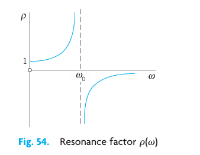{#fig-2-54}

In the case of resonance the nonhomogeneous ODE (2) becomes

$$
y'' + \omega_0^2 y = \frac{F_0}{m} \cos \omega_0 t \tag{10}
$$

Then (7) is no longer valid, and, from the Modification Rule in Sec. 2.7, we conclude that a particular solution of (10) is of the form

$$
y_p(t) = t(a \cos \omega_0 t + b \sin \omega_0 t).
$$

By substituting this into (10) we find $a = 0$ and $b = F_0 / (2m\omega_0)$. Hence (Fig. 55)

$$
y_p(t) = \frac{F_0}{2m\omega_0} t \sin \omega_0 t \tag{11}
$$

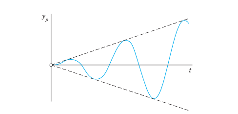{#fig-2-55}

We see that, because of the factor $t$, the amplitude of the vibration becomes larger and larger. Practically speaking, systems with very little damping may undergo large vibrations that can destroy the system. We shall return to this practical aspect of resonance later in this section.

**Beats.** Another interesting and highly important type of oscillation is obtained if $\omega$ is close to $\omega_0$. Take, for example, the particular solution [see (8)]

$$
y(t) = \frac{F_0}{m(\omega_0^2 - \omega^2)} (\cos \omega t - \cos \omega_0 t) \tag{12}
$$

satisfying the initial conditions $y(0) = 0, y'(0) = 0$ (when $\omega \neq \omega_0$). Using formula (12) in App. 3.1 [which is $\cos \alpha - \cos \beta = 2 \sin \frac{\beta + \alpha}{2} \sin \frac{\beta - \alpha}{2}$], we may write this as

$$
y(t) = \frac{2F_0}{m(\omega_0^2 - \omega^2)} \sin \left( \frac{\omega_0 + \omega}{2} t \right) \sin \left( \frac{\omega_0 - \omega}{2} t \right)
$$

Since $\omega$ is close to $\omega_0$, the difference $\omega_0 - \omega$ is small. Hence the period of the last sine function is large, and we obtain an oscillation of the type shown in Fig. 56, the dashed curve resulting from the first sine factor. This is what musicians are listening to when they tune their instruments.

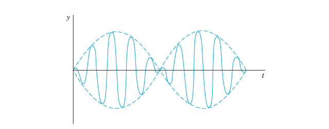{#fig-2-56}

### Case 2. Damped Forced Oscillations

If the damping of the mass–spring system is not negligibly small, we have $c > 0$ and a damping term $c y'$ in (1) and (2). Then the general solution $y_h$ of the homogeneous ODE (1) approaches zero as $t$ goes to infinity, as we know from Sec. 2.4. Practically, it is zero after a sufficiently long time. Hence the "transient solution" (6) of (2), given by $y = y_h + y_p$, approaches the "steady-state solution" $y_p$. This proves the following.

::: {.callout-note appearance="simple" icon=false}
### THEOREM 1 Steady-State Solution
After a sufficiently long time the output of a damped vibrating system under a purely sinusoidal driving force [see (2)] will practically be a harmonic oscillation whose frequency is that of the input.
:::

**Amplitude of the Steady-State Solution. Practical Resonance.** Whereas in the undamped case the amplitude of $y_p$ approaches infinity as $\omega$ approaches $\omega_0$, this will not happen in the damped case. In this case the amplitude will always be finite. But it may have a maximum for some $\omega_{max}$ depending on the damping constant $c$. This may be called **practical resonance**. It is of great importance because if $c$ is not too large, then some input may excite oscillations large enough to damage or even destroy the system. Machines, cars, ships, airplanes, bridges, and high-rising buildings are vibrating mechanical systems, and it is sometimes rather difficult to find constructions that are completely free of undesired resonance effects, caused, for instance, by an engine or by strong winds.

To study the amplitude of $y_p$ as a function of $\omega$, we write (3) in the form

$$
y_p(t) = C^* \cos (\omega t - \eta) \tag{13}
$$

$C^*$ is called the amplitude of $y_p$ and $\eta$ the phase angle or phase lag because it measures the lag of the output behind the input. According to (5), these quantities are

$$
C^*(\omega) = \sqrt{a^2 + b^2} = \frac{F_0}{\sqrt{m^2(\omega_0^2 - \omega^2)^2 + \omega^2 c^2}} \tag{14}
$$

$$
\tan \eta(\omega) = \frac{b}{a} = \frac{\omega c}{m(\omega_0^2 - \omega^2)} \tag{14*}
$$

Let us see whether $C^*(\omega)$ has a maximum and, if so, find its location and then its size. We denote the radicand in the denominator of $C^*$ by $R$. Equating the derivative of $C^*$ to zero, we obtain

$$
\frac{dC^*}{d\omega} = F_0 \left( -\frac{1}{2} R^{-3/2} \right) [2m^2(\omega_0^2 - \omega^2)(-2\omega) + 2\omega c^2] = 0.
$$

The expression in the brackets $[\dots]$ is zero if

$$
2m^2(\omega_0^2 - \omega^2) - c^2 = 0 \tag{15}
$$

By reshuffling terms we have

$$
2m^2\omega^2 = 2m^2\omega_0^2 - c^2 = 2mk - c^2
$$

since $\omega_0^2 = k/m$. The right side of this equation becomes negative if $c^2 > 2mk$, so that then (15) has no real solution and $C^*$ decreases monotonically as $\omega$ increases, as the lowest curve in Fig. 57 shows. If $c$ is smaller, then (15) has a real solution at $\omega = \omega_{max}$ where

$$
\omega_{max}^2 = \omega_0^2 - \frac{c^2}{2m^2} \tag{15*}
$$

From (15*) we see that this solution increases as $c$ decreases and approaches $\omega_0$ as $c$ approaches zero. See also Fig. 57.

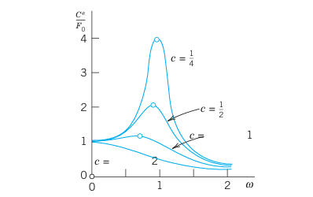{#fig-2-57}

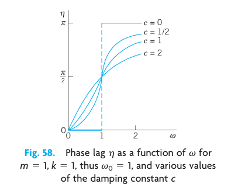{#fig-2-58}

The size of $C^*(\omega_{max})$ is obtained from (14), with $\omega^2$ given by (15*). For this we obtain in the radicand in the denominator of (14) from (15*):

$$
m^2(\omega_0^2 - \omega_{max}^2)^2 = m^2\left(\frac{c^2}{2m^2}\right)^2 = \frac{c^4}{4m^2}
$$

and

$$
\omega_{max}^2 c^2 = \left(\omega_0^2 - \frac{c^2}{2m^2}\right)c^2
$$

The sum of the right sides of these two formulas is

$$
\frac{c^4}{4m^2} + \omega_0^2 c^2 - \frac{c^4}{2m^2} = c^2 \left( \omega_0^2 - \frac{c^2}{4m^2} \right) = \frac{c^2}{4m^2}(4mk - c^2)
$$

Substitution into (14) gives

$$
C^*(\omega_{max}) = \frac{2m F_0}{c\sqrt{4m^2\omega_0^2 - c^2}} \tag{16}
$$

We see that $C^*(\omega_{max})$ is always finite when $c > 0$. Furthermore, since the expression in the denominator of (16) decreases monotonically to zero as $c$ goes to zero, the maximum amplitude (16) increases monotonically to infinity, in agreement with our result in Case 1. Figure 57 shows the amplification (ratio of the amplitudes of output and input) $C^*/F_0$ as a function of $\omega$ for $m=1, k=1$, hence $\omega_0 = 1$, and various values of the damping constant $c$. Figure 58 shows the phase angle $\eta$ (the lag of the output behind the input), which is less than $\pi/2$ when $\omega < \omega_0$, equal to $\pi/2$ when $\omega = \omega_0$, and greater than $\pi/2$ for $\omega > \omega_0$.

---

## PROBLEM SET 2.8

1. **WRITING REPORT. Free and Forced Vibrations.** Write a condensed report of 2–3 pages on the most important similarities and differences of free and forced vibrations, with examples of your own. No proofs.

2. Which of Probs. 1–18 in Sec. 2.7 (with time $t$) can be models of mass–spring systems with a harmonic oscillation as steady-state solution?

### 3–7 STEADY-STATE SOLUTIONS
Find the steady-state motion of the mass–spring system modeled by the ODE. Show the details of your work.

3. $y'' + 6y' + 8y = 42.5 \cos 2t$
4. $y'' + 2.5y' + 10y = -13.6 \sin 4t$
5. $(D^2 + D + 4.25I)y = 22.1 \cos 4.5t$
6. $y'' + 3y' + 3.25y = 3 \cos t - 1.5 \sin t$
7. $2y'' + 4y' + 6.5y = 4 \sin 1.5t$

### 8–15 TRANSIENT SOLUTIONS
Find the transient motion of the mass–spring system modeled by the ODE. Show the details of your work.

8. $y'' + 16y = 56 \cos 4t$
9. $(D^2 + 4D + 3I)y = \cos t + \frac{1}{3} \cos 3t$
10. $(4D^2 + 12D + 9I)y = 225 - 75 \sin 3t$
11. $(D^2 + 2D + 5I)y = 4 \cos t + 8 \sin t$
12. $(D^2 + 2I)y = \cos \sqrt{2}t + \sin \sqrt{2}t$
13. $(D^2 + I)y = \cos \omega t, \quad \omega^2 \neq 1$
14. $(D^2 + I)y = 5e^{-t} \cos t$
15. $(D^2 + 4D + 8I)y = 2 \cos 2t + \sin 2t$

### 16–20 INITIAL VALUE PROBLEMS
Find the motion of the mass–spring system modeled by the ODE and the initial conditions. Sketch or graph the solution curve. In addition, sketch or graph the curve of $y - y_p$ to see when the system practically reaches the steady state.

16. $y'' + 25y = 99 \cos 4.9t, \quad y(0) = 2, \quad y'(0) = 0$
17. $(D^2 + 5I)y = \cos \pi t - \sin \pi t, \quad y(0) = 0, \quad y'(0) = 1$
18. $(D^2 + 2D + 2I)y = e^{-t/2} \sin \frac{1}{2}t, \quad y(0) = 0, \quad y'(0) = 9.4$
19. $(D^2 + 8D + 17I)y = 474.5 \sin 0.5t, \quad y(0) = -5.4, \quad y'(0) = 3$
20. $y'' + 25y = 24 \sin t, \quad y(0) = 1, \quad y'(0) = 1$

21. **Beats.** Derive the formula after (12) from (12). Can we have beats in a damped system?

22. **Beats.** Solve $y'' + 25y = 99 \cos 4.9t, \quad y(0) = 2, \quad y'(0) = 0$ (which is Problem 16). How does the graph of the solution change if you change (a) $y(0)$, (b) the frequency of the driving force?

23. **TEAM EXPERIMENT. Practical Resonance.**
    (a) Derive, in detail, the crucial formula (16).
    (b) By considering $dC^*(\omega_{max})/dc$ show that $C^*(\omega_{max})$ increases as $c$ decreases (with $c^2 < 2mk$).
    (c) Illustrate practical resonance with an ODE of your own in which you vary $c$, and sketch or graph corresponding curves as in Fig. 57.
    (d) Take your ODE with $c$ fixed and an input of two terms, one with frequency close to the practical resonance frequency and the other not. Discuss and sketch or graph the output.
    (e) Give other applications (not in the book) in which resonance is important.

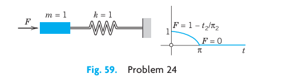{#fig-2-59}

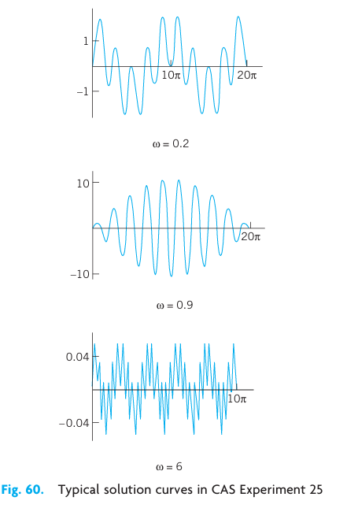{#fig-2-60}

24. **Gun barrel.** Solve $y'' + y = 1 - t^2/\pi^2$ if $0 \le t \le \pi$ and $0$ if $t > \pi$; here $y(0) = 0, y'(0) = 0$. This models an undamped system on which a force $F$ acts during some interval of time (see Fig. 59), for instance, the force on a gun barrel when a shell is fired, the barrel being braked by heavy springs (and then damped by a dashpot, which we disregard for simplicity). Hint: At $t = \pi$, both $y$ and $y'$ must be continuous.

25. **CAS EXPERIMENT. Undamped Vibrations.**
    (a) Solve the initial value problem $y'' + y = \cos \omega t, \quad \omega^2 \neq 1, \quad y(0) = 0, \quad y'(0) = 0$. Show that the solution can be written
    $$y(t) = \frac{2}{1 - \omega^2} \sin \left[ \frac{1}{2}(1 + \omega)t \right] \sin \left[ \frac{1}{2}(1 - \omega)t \right].$$
    (b) Experiment with the solution by changing $\omega$ to see the change of the curves from those for small $\omega$ to beats, to resonance, and to large values of $\omega$ (see Fig. 60).

---

## 2.9 Modeling: Electric Circuits {#sec-electric-circuits}

Designing good models is a task the computer cannot do. Hence setting up models has become an important task in modern applied mathematics. The best way to gain experience in successful modeling is to carefully examine the modeling process in various fields and applications. Accordingly, modeling electric circuits will be profitable for all students, not just for electrical engineers and computer scientists.

Figure 61 shows an RLC-circuit, as it occurs as a basic building block of large electric networks in computers and elsewhere. An RLC-circuit is obtained from an RL-circuit by adding a capacitor. Recall Example 2 on the RL-circuit in Sec. 1.5: The model of the RL-circuit is

$$
L I' + R I = E(t).
$$

It was obtained by KVL (Kirchhoff's Voltage Law)[^footnote1] by equating the voltage drops across the resistor and the inductor to the electromotive force (EMF) $E(t)$. Hence we obtain the model of the RLC-circuit simply by adding the voltage drop $Q/C$ across the capacitor. Here, $C$ (farads, F) is the capacitance of the capacitor, and $Q$ (coulombs) is the charge on the capacitor, related to the current $I(t)$ by

$$
I(t) = \frac{dQ}{dt}, \qquad \text{equivalently} \qquad Q(t) = \int I(t) \, dt.
$$

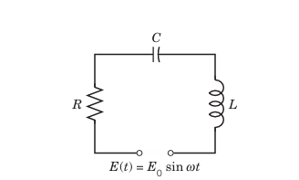{#fig-2-61}

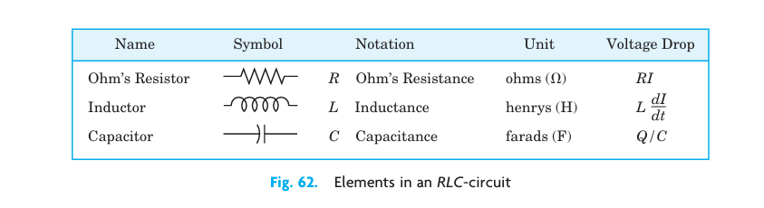{#fig-2-62}

| Name | Symbol Notation | Unit | Voltage Drop |
|:---|:---|:---|:---|
| Ohm's Resistor | $R$ Ohm's Resistance | ohms ($\Omega$) | $RI$ |
| Inductor | $L$ Inductance | henrys (H) | $L \frac{dI}{dt}$ |
| Capacitor | $C$ Capacitance | farads (F) | $Q/C$ |

: Elements in an RLC-circuit {#tbl-2-2-elements}

Assuming a sinusoidal EMF as in Fig. 61, we thus have the model of the RLC-circuit:

$$
L I' + R I + \frac{1}{C} \int I \, dt = E(t) = E_0 \sin \omega t \tag{1*}
$$

This is an "integro-differential equation." To get rid of the integral, we differentiate (1*) with respect to $t$, obtaining:

$$
L I'' + R I' + \frac{1}{C} I = E'(t) = E_0 \omega \cos \omega t \tag{1}
$$

This shows that the current in an RLC-circuit is obtained as the solution of this nonhomogeneous second-order ODE (1) with constant coefficients.

In connection with initial value problems, we shall occasionally use

$$
L Q'' + R Q' + \frac{1}{C} Q = E(t) \tag{1'}
$$

obtained from $I = Q'$ and (1*).

[^footnote1]: GUSTAV ROBERT KIRCHHOFF (1824–1887), German physicist. Later we shall also need Kirchhoff's Current Law (KCL): At any point of a circuit, the sum of the inflowing currents is equal to the sum of the outflowing currents. The units of measurement of electrical quantities are named after ANDRÉ MARIE AMPÈRE (1775–1836), French physicist, CHARLES AUGUSTIN DE COULOMB (1736–1806), French physicist and engineer, MICHAEL FARADAY (1791–1867), English physicist, JOSEPH HENRY (1797–1878), American physicist, GEORG SIMON OHM (1789–1854), German physicist, and ALESSANDRO VOLTA (1745–1827), Italian physicist.

### Solving the ODE (1) for the Current in an RLC-Circuit

A general solution of (1) is the sum $I = I_h + I_p$, where $I_h$ is a general solution of the homogeneous ODE corresponding to (1) and $I_p$ is a particular solution of (1). We first determine $I_p$ by the method of undetermined coefficients, proceeding as in the previous section. We substitute

$$
I_p(t) = a \cos \omega t + b \sin \omega t \tag{2}
$$

into (1). Then we collect the cosine terms and equate them to $E_0 \omega$ on the right, and we equate the sine terms to zero because there is no sine term on the right, obtaining:

$$
L\omega^2(-a) + R\omega b + \frac{a}{C} = E_0 \omega \qquad \text{(Cosine terms)}
$$

$$
L\omega^2(-b) - R\omega a + \frac{b}{C} = 0 \qquad \text{(Sine terms)}
$$

Before solving this system for $a$ and $b$, we first introduce a combination of $L$ and $C$, called the **reactance**:

$$
S = \omega L - \frac{1}{\omega C} \tag{3}
$$

Dividing the previous two equations by $\omega$, ordering them, and substituting $S$ gives:

$$
-S a + R b = E_0
$$

$$
-R a - S b = 0
$$

We now eliminate $b$ by multiplying the first equation by $S$ and the second by $R$, and adding. Then we eliminate $a$ by multiplying the first equation by $R$ and the second by $-S$, and adding. This gives:

$$
-(R^2 + S^2) a = E_0 S
$$

$$
(R^2 + S^2) b = E_0 R
$$

We can solve for $a$ and $b$:

$$
a = \frac{-E_0 S}{R^2 + S^2}, \qquad b = \frac{E_0 R}{R^2 + S^2} \tag{4}
$$

Equation (2) with coefficients $a$ and $b$ given by (4) is the desired particular solution of the nonhomogeneous ODE (1) governing the current $I$ in an RLC-circuit with sinusoidal electromotive force.

Using (4), we can write $I_p$ in terms of "physically visible" quantities, namely, amplitude $I_0$ and phase lag $\theta$ of the current behind the EMF, that is,

$$
I_p(t) = I_0 \sin(\omega t - \theta) \tag{5}
$$

where

$$
I_0 = \sqrt{a^2 + b^2} = \frac{E_0}{\sqrt{R^2 + S^2}}, \qquad \tan \theta = -\frac{a}{b} = \frac{S}{R} \tag{5*}
$$

The quantity $Z = \sqrt{R^2 + S^2}$ is called the **impedance**. Our formula shows that the impedance equals the ratio $E_0 / I_0$. This is somewhat analogous to $R = E/I$ (Ohm's law) and, because of this analogy, the impedance is also known as the **apparent resistance**.

A general solution of the homogeneous equation corresponding to (1) is

$$
I_h(t) = c_1 e^{\lambda_1 t} + c_2 e^{\lambda_2 t}
$$

where $\lambda_1$ and $\lambda_2$ are the roots of the characteristic equation

$$
\lambda^2 + \frac{R}{L} \lambda + \frac{1}{LC} = 0.
$$

We can write these roots in the form $\lambda_1 = -\alpha + \beta$ and $\lambda_2 = -\alpha - \beta$, where

$$
\alpha = \frac{R}{2L}, \qquad \beta = \sqrt{\frac{R^2}{4L^2} - \frac{1}{LC}} = \frac{1}{2L}\sqrt{R^2 - \frac{4L}{C}}.
$$

Now in an actual circuit, $R$ is never zero (hence $R > 0$). From this it follows that $I_h$ approaches zero, theoretically as $t \to \infty$, but practically after a relatively short time. Hence the transient current $I = I_h + I_p$ tends to the steady-state current $I_p$, and after some time the output will practically be a harmonic oscillation, which is given by (5) and whose frequency is that of the input (of the electromotive force).

### EXAMPLE 1 RLC-Circuit

Find the current in an RLC-circuit with $R = 11\ \Omega$, $L = 0.1\text{ H}$, $C = 10^{-2}\text{ F}$, which is connected to a source of EMF $E(t) = 110 \sin (60 \cdot 2\pi t) = 110 \sin 377t\text{ V}$ (hence $60\text{ Hz}$, the usual frequency in the U.S. and Canada; in Europe it would be $220\text{ V}$ and $50\text{ Hz}$). Assume that current and capacitor charge are $0$ when $t = 0$.

**Solution.** **Step 1. General solution of the homogeneous ODE.** Substituting $R, L, C$ and the derivative $E'(t)$ into (1), we obtain:

$$
0.1 I'' + 11 I' + 100 I = 110 \cdot 377 \cos 377 t.
$$

Hence the homogeneous ODE is $0.1 I'' + 11 I' + 100 I = 0$. Its characteristic equation is

$$
0.1 \lambda^2 + 11 \lambda + 100 = 0.
$$

The roots are $\lambda_1 = -10$ and $\lambda_2 = -100$. The corresponding general solution of the homogeneous ODE is

$$
I_h(t) = c_1 e^{-10t} + c_2 e^{-100t}.
$$

**Step 2. Particular solution of (1).** We calculate the reactance $S$ and the steady-state current $I_p(t) = a \cos 377t + b \sin 377t$:

$$
S = 377 \cdot 0.1 - \frac{1}{377 \cdot 10^{-2}} = 37.7 - 2.65 = 35.05.
$$

In the book, this is rounded to:

$$
S \approx 37.7 - 0.3 = 37.4\ \Omega.
$$

Let's check the coefficients $a$ and $b$ obtained from (4) (and rounded):

$$
a = \frac{-110 \cdot 37.4}{11^2 + 37.4^2} \approx -2.71, \qquad b = \frac{110 \cdot 11}{11^2 + 37.4^2} \approx 0.796.
$$

Hence in our present case, a general solution of the nonhomogeneous ODE (1) is:

$$
I(t) = c_1 e^{-10t} + c_2 e^{-100t} - 2.71 \cos 377t + 0.796 \sin 377t \tag{6}
$$

**Step 3. Particular solution satisfying the initial conditions.** How to use $Q(0) = 0$? We finally determine $c_1$ and $c_2$ from the initial conditions $I(0) = 0$ and $Q(0) = 0$. From the first condition and (6) we have:

$$
I(0) = c_1 + c_2 - 2.71 = 0, \qquad \text{hence} \qquad c_2 = 2.71 - c_1 \tag{7}
$$

We turn to $Q(0) = 0$. The integral in (1*) equals $Q(t)$, see near the beginning of this section. Hence for $t = 0$, Eq. (1*) becomes:

$$
L I'(0) + R I(0) + \frac{1}{C} Q(0) = E(0) = 0.
$$

Since $I(0) = 0$ and $Q(0) = 0$, this reduces to:

$$
L I'(0) = 0 \implies I'(0) = 0.
$$

Differentiating (6) and setting $t = 0$, we thus obtain:

$$
I'(0) = -10 c_1 - 100 c_2 + 377 \cdot 0.796 = 0.
$$

Since $377 \cdot 0.796 \approx 300.1$, this gives by (7):

$$
-10 c_1 - 100(2.71 - c_1) + 300.1 = 0 \implies 90 c_1 = 271 - 300.1 = -29.1 \implies c_1 \approx -0.323.
$$

Then $c_2 = 2.71 - (-0.323) = 3.033$. Hence the answer is:

$$
I(t) = -0.323 e^{-10t} + 3.033 e^{-100t} - 2.71 \cos 377t + 0.796 \sin 377t
$$

You may get slightly different values depending on the rounding. Figure 63 shows $I(t)$ as well as $I_p(t)$ which practically coincide, except for a very short time near $t = 0$ because the exponential terms go to zero very rapidly. Thus after a very short time the current will practically execute harmonic oscillations of the input frequency $60\text{ cycles/sec}$. Its maximum amplitude and phase lag can be seen from (5), which here takes the form:

$$
I_p(t) = 2.824 \sin(377t - 1.29). \qquad \square
$$

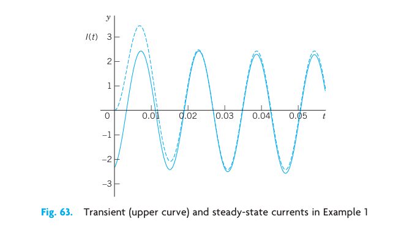{#fig-2-63}

### Analogy of Electrical and Mechanical Quantities

Entirely different physical or other systems may have the same mathematical model. For instance, we have seen this from the various applications of the ODE in Chap. 1. Another impressive demonstration of this unifying power of mathematics is given by the ODE (1) for an electric RLC-circuit and the ODE (2) in the last section for a mass–spring system. Both equations:

$$
L I'' + R I' + \frac{1}{C} I = E_0 \omega \cos \omega t
$$

and

$$
m y'' + c y' + k y = F_0 \cos \omega t
$$

are of the same form. Table 2.2 shows the analogy between the various quantities involved. The inductance $L$ corresponds to the mass $m$ and, indeed, an inductor opposes a change in current, having an "inertia effect" similar to that of a mass. The resistance $R$ corresponds to the damping constant $c$, and a resistor causes loss of energy, just as a damping dashpot does. And so on.

This analogy is strictly quantitative in the sense that to a given mechanical system we can construct an electric circuit whose current will give the exact values of the displacement in the mechanical system when suitable scale factors are introduced.

The practical importance of this analogy is almost obvious. The analogy may be used for constructing an "electrical model" of a given mechanical model, resulting in substantial savings of time and money because electric circuits are easy to assemble, and electric quantities can be measured much more quickly and accurately than mechanical ones.

| Electrical System | Mechanical System |
|:---|:---|
| Inductance $L$ | Mass $m$ |
| Resistance $R$ | Damping constant $c$ |
| Reciprocal $1/C$ of capacitance | Spring modulus $k$ |
| Electromotive force $E(t)$ (or its derivative $E'(t)$) | Driving force $F(t)$ (or $F_0 \cos \omega t$) |
| Current $I(t)$ | Displacement $y(t)$ |

: Analogy of Electrical and Mechanical Quantities {#tbl-2-2-analogy}

Related to this analogy are transducers, devices that convert changes in a mechanical quantity (for instance, in a displacement) into changes in an electrical quantity that can be monitored; see Ref. [GenRef11] in App. 1.

---

## PROBLEM SET 2.9

### 1–6 RLC-CIRCUITS: SPECIAL CASES

1. **RC-Circuit.** Model the RC-circuit in Fig. 64. Find the current due to a constant $E$.

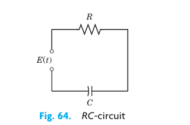{#fig-2-64}

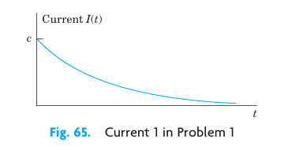{#fig-2-65}

2. **RC-Circuit.** Solve Prob. 1 when $E = E_0 \sin \omega t$, and $R, C, E_0$, and $\omega$ are arbitrary.

3. **RL-Circuit.** Model the RL-circuit in Fig. 66. Find a general solution when $R, L, E$ are any constants. Graph or sketch solutions when $R = 10\ \Omega$, $L = 0.25\text{ H}$, and $E = 48\text{ V}$.

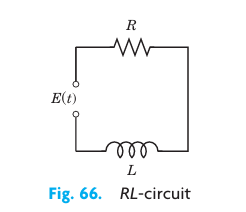{#fig-2-66}

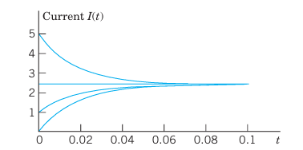{#fig-2-67}

4. **RL-Circuit.** Solve Prob. 3 when $E = E_0 \sin \omega t$ and $R, L$, and $E_0$ are arbitrary. Sketch a typical solution.

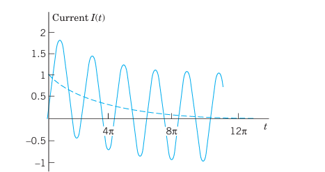{#fig-2-68}

5. **LC-Circuit.** This is an RLC-circuit with negligibly small $R$ (analog of an undamped mass–spring system). Find the current when $L = 0.5\text{ H}$, $C = 0.005\text{ F}$, and $E = \sin t\text{ V}$, assuming zero initial current and charge.

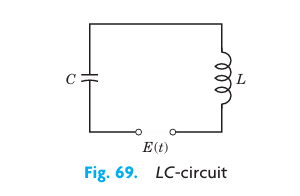{#fig-2-69}

6. **LC-Circuit.** Find the current when $L = 0.5\text{ H}$, $C = 0.005\text{ F}$, $E = 2 t^2\text{ V}$, and initial current and charge are zero.

### 7–18 GENERAL RLC-CIRCUITS

7. **Tuning.** In tuning a stereo system to a radio station, we adjust the tuning control (turn a knob) that changes $C$ (or perhaps $L$) in an RLC-circuit so that the amplitude of the steady-state current (5) becomes maximum. For what $C$ will this happen?

**8–13 Find the steady-state current in the RLC-circuit in Fig. 61 for the given data. Show the details of your work.**

8. $R = 4\ \Omega$, $L = 0.1\text{ H}$, $C = 0.05\text{ F}$, $E = 110\text{ V}$
9. $R = 2\ \Omega$, $L = 1\text{ H}$, $C = \frac{1}{20}\text{ F}$, $E = 157 \sin 3t\text{ V}$
10. $R = 4\ \Omega$, $L = 0.5\text{ H}$, $C = 0.1\text{ F}$, $E = 500 \sin 2t\text{ V}$
11. $R = 12\ \Omega$, $L = 1.2\text{ H}$, $C = \frac{20}{3} \times 10^{-3}\text{ F}$, $E = 12,000 \sin 25t\text{ V}$
12. $R = 0.2\ \Omega$, $L = 0.1\text{ H}$, $C = 2\text{ F}$, $E = 220 \sin 314t\text{ V}$
13. $R = 12\ \Omega$, $L = 0.4\text{ H}$, $C = \frac{1}{80}\text{ F}$, $E = 220 \sin 10t\text{ V}$

14. Prove the claim in the text that if $R > 0$ (hence $R \neq 0$), then the transient current approaches $0$ as $t \to \infty$.

15. **Cases of damping.** What are the conditions for an RLC-circuit to be (I) overdamped, (II) critically damped, (III) underdamped? What is the critical resistance $R_{crit}$ (the analog of the critical damping constant $c_0 = 2\sqrt{mk}$)?

**16–18 Solve the initial value problem for the RLC-circuit in Fig. 61 with the given data, assuming zero initial current and charge. Graph or sketch the solution. Show the details of your work.**

16. $R = 8\ \Omega$, $L = 0.2\text{ H}$, $C = 12.5 \times 10^{-3}\text{ F}$, $E = 100 \sin 10t\text{ V}$
17. $R = 6\ \Omega$, $L = 1\text{ H}$, $C = 0.04\text{ F}$, $E = 600(\cos t + 4\sin t)\text{ V}$
18. $R = 18\ \Omega$, $L = 1\text{ H}$, $C = 12.5 \times 10^{-3}\text{ F}$, $E = 820 \cos 10t\text{ V}$

19. **WRITING REPORT. Mechanic-Electric Analogy.** Explain Table 2.2 in a 1–2 page report with examples, e.g., the analog (with $L = 1\text{ H}$) of a mass–spring system of mass $5\text{ kg}$, damping constant $10\text{ kg/sec}$, spring constant $60\text{ kg/sec}^2$, and driving force $220 \cos 10t\text{ N}$.

20. **Complex Solution Method.** Solve $L I_p'' + R I_p' + \frac{1}{C} I_p = E_0 \omega \cos \omega t$ by substituting $I_p = K e^{i\omega t}$ ($K$ unknown) and its derivatives and taking the real part of the solution $\tilde{I}_p$. Show agreement with (2), (4). Hint: Use $e^{i\omega t} = \cos \omega t + i \sin \omega t$ and $i^2 = -1$.

---

## 2.10 Solution by Variation of Parameters {#sec-variation-of-parameters}

We continue our discussion of nonhomogeneous linear ODEs, that is:

$$
y'' + p(x) y' + q(x) y = r(x) \tag{1}
$$

In Sec. 2.6 we have seen that a general solution of (1) is the sum of a general solution $y_h$ of the corresponding homogeneous ODE and any particular solution $y_p$ of (1). To obtain $y_p$ when $r(x)$ is not too complicated, we can often use the method of undetermined coefficients, as we have shown in Sec. 2.7 and applied to basic engineering models in Secs. 2.8 and 2.9.

However, since this method is restricted to functions whose derivatives are of a form similar to itself (powers, exponential functions, etc.), it is desirable to have a method valid for more general ODEs (1), which we shall now develop. It is called the **method of variation of parameters** and is credited to Lagrange (Sec. 2.1). Here $p, q, r$ in (1) may be variable (given functions of $x$), but we assume that they are continuous on some open interval $I$.

Lagrange's method gives a particular solution of (1) on $I$ in the form:

$$
y_p(x) = -y_1 \int \frac{y_2 r}{W} \, dx + y_2 \int \frac{y_1 r}{W} \, dx \tag{2}
$$

where $y_1, y_2$ form a basis of solutions of the corresponding homogeneous ODE:

$$
y'' + p(x) y' + q(x) y = 0 \tag{3}
$$

on $I$, and $W$ is the Wronskian of $y_1, y_2$:

$$
W = y_1 y_2' - y_2 y_1' \tag{4}
$$

(see Sec. 2.6).

::: {.callout-caution}
The solution formula (2) is obtained under the assumption that the ODE is written in standard form, with $y''$ as the first term as shown in (1). If it starts with $f(x) y''$, divide first by $f(x)$.
:::

The integration in (2) may often cause difficulties, and so may the determination of $y_1, y_2$ if (1) has variable coefficients. If you have a choice, use the previous method. It is simpler. Before deriving (2) let us work an example for which you do need the new method. (Try otherwise.)

### EXAMPLE 1 Method of Variation of Parameters

Solve the nonhomogeneous ODE:

$$
y'' + y = \sec x \tag{5}
$$

**Solution.** A basis of solutions of the homogeneous ODE $y'' + y = 0$ on any interval is $y_1 = \cos x, \quad y_2 = \sin x$. This gives the Wronskian:

$$
W(y_1, y_2) = \cos x \cos x - \sin x (-\sin x) = \cos^2 x + \sin^2 x = 1.
$$

From (2), choosing zero constants of integration, we get the particular solution of the given ODE (Fig. 70):

$$
y_p = -\cos x \int \sin x \sec x \, dx + \sin x \int \cos x \sec x \, dx
$$

$$
= -\cos x \int \tan x \, dx + \sin x \int 1 \, dx
$$

$$
= \cos x \ln|\cos x| + x \sin x.
$$

Figure 70 shows $y_p$ and its first term, which is small, so that $x \sin x$ essentially determines the shape of the curve of $y_p$. (Recall from Sec. 2.8 that we have seen $x \sin x$ in connection with resonance, except for notation.) From $y_p$ and the general solution $y_h = c_1 \cos x + c_2 \sin x$ of the homogeneous ODE we obtain the answer:

$$
y = y_h + y_p = (c_1 + \ln|\cos x|) \cos x + (c_2 + x) \sin x. \tag{6}
$$

Had we included integration constants in (2), then (2) would have given the additional $c_1 y_1 + c_2 y_2$, that is, a general solution of the given ODE directly from (2). This will always be the case. $\square$

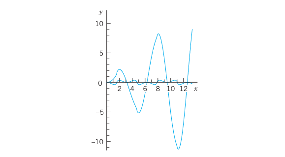{#fig-2-70}

### Idea of the Method. Derivation of (2)

What idea did Lagrange have? What gave the method the name? Where do we use the continuity assumptions?

The idea is to start from a general solution

$$
y_h(x) = c_1 y_1(x) + c_2 y_2(x)
$$

of the homogeneous ODE (3) on an open interval $I$ and to replace the constants ("the parameters") $c_1$ and $c_2$ by functions $u(x)$ and $v(x)$; this suggests the name of the method. We shall determine $u$ and $v$ so that the resulting function

$$
y_p(x) = u(x) y_1(x) + v(x) y_2(x) \tag{7}
$$

is a particular solution of the nonhomogeneous ODE (1). Note that $y_p$ exists by Theorem 3 in Sec. 2.6 because of the continuity of $p$ and $q$ on $I$. (The continuity of $r$ will be used later.)

We determine $u$ and $v$ by substituting (7) and its derivatives into (1). Differentiating (7), we obtain:

$$
y_p' = u' y_1 + u y_1' + v' y_2 + v y_2'
$$

Now $y_p$ must satisfy (1). This is one condition for two functions $u$ and $v$. It seems plausible that we may impose a second condition. Indeed, our calculation will show that we can determine $u$ and $v$ such that $y_p$ satisfies (1) and $u$ and $v$ satisfy as a second condition the equation:

$$
u' y_1 + v' y_2 = 0 \tag{8}
$$

This reduces the first derivative $y_p'$ to the simpler form:

$$
y_p' = u y_1' + v y_2' \tag{9}
$$

Differentiating (9), we obtain:

$$
y_p'' = u' y_1' + u y_1'' + v' y_2' + v y_2'' \tag{10}
$$

We now substitute $y_p$ and its derivatives according to (7), (9), and (10) into (1). Collecting terms in $u$ and terms in $v$, we obtain:

$$
u(y_1'' + p y_1' + q y_1) + v(y_2'' + p y_2' + q y_2) + u' y_1' + v' y_2' = r(x).
$$

Since $y_1$ and $y_2$ are solutions of the homogeneous ODE (3), the parenthetical expressions are zero, and this reduces to:

$$
u' y_1' + v' y_2' = r(x) \tag{11a}
$$

Equation (8) is:

$$
u' y_1 + v' y_2 = 0 \tag{11b}
$$

This is a linear system of two algebraic equations for the unknown functions $u'$ and $v'$. We can solve it by elimination as follows (or by Cramer's rule in Sec. 7.6). To eliminate $v'$, we multiply (11a) by $y_2$ and (11b) by $-y_2'$, and add, obtaining:

$$
u'(y_1' y_2 - y_1 y_2') = y_2 r.
$$

Hence

$$
u'(y_1 y_2' - y_2 y_1') = -y_2 r \implies u' W = -y_2 r \implies u' = -\frac{y_2 r}{W}.
$$

Here, $W$ is the Wronskian (4) of $y_1, y_2$. To eliminate $u'$, we multiply (11a) by $-y_1$ and (11b) by $y_1'$, and add, obtaining:

$$
v'(y_1 y_2' - y_2 y_1') = y_1 r \implies v' W = y_1 r \implies v' = \frac{y_1 r}{W}.
$$

Since $y_1, y_2$ form a basis, we have $W \neq 0$ (by Theorem 2 in Sec. 2.6) and can divide by $W$:

$$
u' = -\frac{y_2 r}{W}, \qquad v' = \frac{y_1 r}{W} \tag{12}
$$

By integration:

$$
u = -\int \frac{y_2 r}{W} \, dx, \qquad v = \int \frac{y_1 r}{W} \, dx.
$$

These integrals exist because $r(x)$ and the other functions are continuous. Inserting them into (7) gives (2) and completes the derivation. $\square$

---

## PROBLEM SET 2.10

### 1–13 GENERAL SOLUTION
Solve the given nonhomogeneous linear ODE by variation of parameters or undetermined coefficients. Show the details of your work.

1. $y'' + 9y = \csc 3x$
2. $y'' + 9y = \sec 3x$
3. $y'' - 4y' + 5y = e^{2x} \csc x$
4. $x^2 y'' - 2x y' + 2y = x^3 \sin x$
5. $y'' + y = \cos x - \sin x$
6. $(D^2 + 6D + 9I)y = 16e^{-3x} / (x^2 + 1)$
7. $(D^2 - 4D + 4I)y = 6e^{2x} / x^4$
8. $(D^2 + 4I)y = \cosh 2x$
9. $(D^2 - 2D + I)y = 35 x^{3/2} e^x$
10. $(D^2 + 2D + 2I)y = 4e^{-x} \sec^3 x$
11. $(x^2 D^2 + x D - 9I)y = 48 x^5$
12. $(D^2 - I)y = 1/\cosh x$
13. $(x^2 D^2 - 4x D + 6I)y = 21 x^{-4}$

14. **TEAM PROJECT. Comparison of Methods. Invention.** The undetermined-coefficient method should be used whenever possible because it is simpler. Compare it with the present method as follows.
    (a) Solve $y'' + 4y' + 3y = 65 \cos 2x$ by both methods, showing all details, and compare.
    (b) Solve $y'' - 2y' + y = r_1 + r_2$ where $r_1 = 35 x^{3/2} e^x$ and $r_2 = x^2$ by applying each method to a suitable function on the right.
    (c) Experiment to invent an undetermined-coefficient method for nonhomogeneous Euler–Cauchy equations.

---

## CHAPTER 2 REVIEW QUESTIONS AND PROBLEMS

1. Why are linear ODEs preferable to nonlinear ones in modeling?
2. What does an initial value problem of a second-order ODE look like? Why must you have a general solution to solve it?
3. By what methods can you get a general solution of a nonhomogeneous ODE from a general solution of a homogeneous one?
4. Describe applications of ODEs in mechanical systems. What are the electrical analogs of the latter?
5. What is resonance? How can you remove undesirable resonance of a construction, such as a bridge, a ship, or a machine?
6. What do you know about existence and uniqueness of solutions of linear second-order ODEs?

### 7–18 GENERAL SOLUTION
Find a general solution. Show the details of your calculation.

7. $4y'' - 12y' + 9y = 2e^{1.5x}$
8. $(D^2 + 2D + 2I)y = 3e^{-x} \cos 2x$
9. $(2D^2 - 3D - 2I)y = 13 - 2x^2$
10. $(x^2 D^2 + x D - 9I)y = 0$
11. $(x^2 D^2 + 2x D - 12I)y = 0$
12. $(D^2 + 4\pi D + 4\pi^2 I)y = 0$
13. $(100D^2 - 160D + 64I)y = 0$
14. $y'' + 0.20y' + 0.17y = 0$
15. $y'' + 6y' + 34y = 0$
16. $y'' + y' - 12y = 0$
17. $4y'' + 32y' + 63y = 0$
18. $y y'' = 2(y')^2$

### 19–22 INITIAL VALUE PROBLEMS
Solve the problem, showing the details of your work. Sketch or graph the solution.

19. $(x^2 D^2 + 1.5x D + 0.49I)y = 0, \quad y(1) = 2, \quad y'(1) = -1.1$
20. $(x^2 D^2 + x D - I)y = 16x^3, \quad y(1) = -1, \quad y'(1) = 1$
21. $y'' - 3y' + 2y = 10 \sin x, \quad y(0) = 1, \quad y'(0) = -6$
22. $y'' + 16y = 17e^x, \quad y(0) = 6, \quad y'(0) = -2$

### 23–30 APPLICATIONS
23. Find the steady-state current in the RLC-circuit in Fig. 71 when $R = 2\text{ k}\Omega$ ($2000\ \Omega$), $L = 1\text{ H}$, $C = 4 \times 10^{-3}\text{ F}$, and $E = 110 \sin 415 t\text{ V}$ ($66\text{ cycles/sec}$).
24. Find a general solution of the homogeneous linear ODE corresponding to the ODE in Prob. 23.
25. Find the steady-state current in the RLC-circuit in Fig. 71 when $R = 50\ \Omega$, $L = 30\text{ H}$, $C = 0.025\text{ F}$, and $E = 200 \sin 4t\text{ V}$.
26. Find the current in the RLC-circuit in Fig. 71 when $R = 40\ \Omega$, $L = 0.4\text{ H}$, $C = 10^{-4}\text{ F}$, and $E = 220 \sin 314 t\text{ V}$ ($50\text{ cycles/sec}$).
27. Find an electrical analog of the mass–spring system with mass $4\text{ kg}$, spring constant $10\text{ kg/sec}^2$, damping constant $20\text{ kg/sec}$, and driving force $100 \sin 4t\text{ N}$.
28. Find the motion of the mass–spring system in Fig. 72 with mass $0.125\text{ kg}$, damping $0$, spring constant $1.125\text{ kg/sec}^2$, and driving force $\cos t - 4\sin t\text{ N}$, assuming zero initial displacement and velocity. For what frequency of the driving force would you get resonance?
29. Show that the system in Fig. 72 with $m = 4\text{ kg}$, $c = 0$, $k = 36\text{ kg/sec}^2$, and driving force $r(t) = 61 \cos 3.1t\text{ N}$ exhibits beats. Hint: Choose zero initial conditions.
30. In Fig. 72, let $m = 1\text{ kg}$, $c = 4\text{ kg/sec}$, $k = 24\text{ kg/sec}^2$, and driving force $r(t) = 10 \cos \omega t\text{ N}$. Determine $\omega$ such that you get the steady-state vibration of maximum possible amplitude. Determine this amplitude. Then find the general solution with this $\omega$ and check whether the results are in agreement.

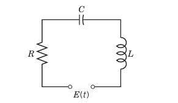{#fig-2-71}

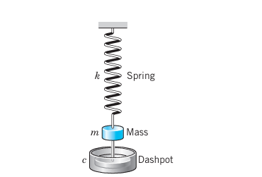{#fig-2-72}

---

## SUMMARY OF CHAPTER 2

Second-order linear ODEs are particularly important in applications, for instance, in mechanics (Secs. 2.4, 2.8) and electrical engineering (Sec. 2.9). A second-order ODE is called **linear** if it can be written:

$$
y'' + p(x) y' + q(x) y = r(x) \tag{1}
$$

(Sec. 2.1). If the first term is, say, $f(x) y''$, divide by $f(x)$ to get the "standard form" (1) with $y''$ as the first term.

Equation (1) is called **homogeneous** if $r(x)$ is zero for all $x$ considered, usually in some open interval; this is written:

$$
y'' + p(x) y' + q(x) y = 0 \tag{2}
$$

Equation (1) is called **nonhomogeneous** if $r(x) \neq 0$ (meaning $r(x)$ is not zero for some $x$ considered).

For the homogeneous ODE (2) we have the important **superposition principle** (Sec. 2.1) that a linear combination of two solutions is again a solution.

Two linearly independent solutions of (2) on an open interval $I$ form a **basis** (or fundamental system) of solutions on $I$, and $y = c_1 y_1 + c_2 y_2$ with arbitrary constants $c_1, c_2$ is a **general solution** of (2) on $I$. From it we obtain a **particular solution** if we specify numeric values for $c_1$ and $c_2$, usually by prescribing two **initial conditions**:

$$
y(x_0) = K_0, \qquad y'(x_0) = K_1 \tag{3}
$$

($x_0, K_0, K_1$ given numbers; Sec. 2.1). (2) and (3) together form an **initial value problem**. Similarly for (1) and (3).

For a nonhomogeneous ODE (1) a general solution is of the form:

$$
y = y_h + y_p \tag{4}
$$

(Sec. 2.7). Here $y_h$ is a general solution of (2) and $y_p$ is a particular solution of (1). Such a $y_p$ can be determined by a general method (variation of parameters, Sec. 2.10) or in many practical cases by the method of undetermined coefficients. The latter applies when (1) has constant coefficients $p$ and $q$, and $r(x)$ is a power of $x$, sine, cosine, exponential, etc. (Sec. 2.7). Then we write (1) as:

$$
y'' + a y' + b y = r(x) \tag{5}
$$

(Sec. 2.7). The corresponding homogeneous ODE has solutions $y = e^{\lambda x}$, where $\lambda$ is a root of the **characteristic equation**:

$$
\lambda^2 + a \lambda + b = 0 \tag{6}
$$

Hence there are three cases (Sec. 2.2):

| Case | Type of Roots | General Solution |
|:---|:---|:---|
| **I** | Distinct real $\lambda_1, \lambda_2$ | $y = c_1 e^{\lambda_1 x} + c_2 e^{\lambda_2 x}$ |
| **II** | Double root $\lambda = -a/2$ | $y = (c_1 + c_2 x) e^{-ax/2}$ |
| **III** | Complex roots $\lambda = -a/2 \pm i\omega^*$ | $y = e^{-ax/2}(A \cos \omega^* x + B \sin \omega^* x)$ |

: Summary of Cases for Constant-Coefficient Homogeneous ODEs {#tbl-2-3-summary}

Here $\omega^*$ is used since $\omega$ is needed for driving force frequency in Sec. 2.8.

Important applications of (5) in mechanical and electrical engineering in connection with vibrations and resonance are discussed in Secs. 2.4, 2.7, and 2.8.

Another large class of ODEs solvable "algebraically" consists of the **Euler–Cauchy equations**:

$$
x^2 y'' + a x y' + b y = 0 \tag{7}
$$

(Sec. 2.5). These have solutions of the form $y = x^m$, where $m$ is a solution of the auxiliary equation:

$$
m^2 + (a - 1)m + b = 0 \tag{8}
$$

Existence and uniqueness of solutions of (1) and (2) is discussed in Secs. 2.6 and 2.7, and reduction of order in Sec. 2.1.

