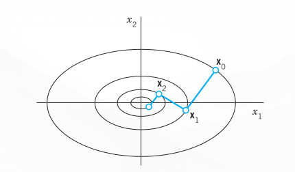
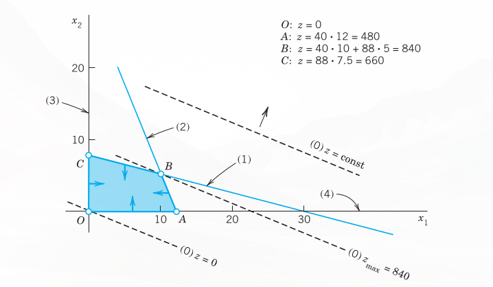
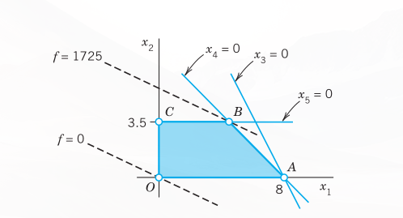
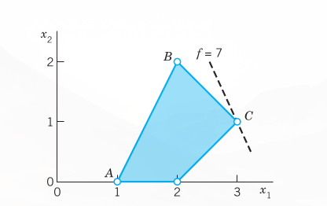

### PART F: Optimization, Graphs

**@ch-unconstrained-optimization-linear-programming**  
**<!-- TODO: replace CHAPTER 23 with actual chapter label -->CHAPTER 23: Graphs. Combinatorial Optimization**

The material of Part F is particularly useful in modeling large-scale real-world problems. Just as it is in numerics in Part E, where the greater availability of quality software and computing power is a deciding factor in the continued growth of the field, so it is also in the fields of optimization and combinatorial optimization. Problems, such as optimizing production plans for different industries (microchips, pharmaceuticals, cars, aluminum, steel, chemicals), optimizing usage of transportation systems (usage of runways in airports, tracks of subways), efficiency in running of power plants, optimal shipping (delivery services, shipping of containers, shipping goods from factories to warehouses and from warehouses to stores), designing optimal financial portfolios, and others are all examples where the size of the problem usually requires the use of optimization software. More recently, environmental concerns have put new aspects into the picture, where an important concern, added to these problems, is the minimization of environmental impact. The main task becomes to model these problems correctly. The purpose of Part F is to introduce the main ideas and methods of unconstrained and constrained optimization (@ch-unconstrained-optimization-linear-programming), and graphs and combinatorial optimization (<!-- TODO: replace Chap. 23 with actual chapter label -->Chap. 23).

@ch-unconstrained-optimization-linear-programming introduces unconstrained optimization by the method of steepest descent and constrained optimization by the versatile simplex method. The simplex method (@sec-simplex-method and @sec-simplex-difficulties) is very useful for solving many linear optimization problems (also called linear programming problems).

Graphs let us model problems in transportation logistics, efficient use of communication networks, best assignment of workers to jobs, and others. We consider shortest path problems (@sec-linear-programming and @sec-simplex-method), shortest spanning trees (<!-- TODO: replace Secs. 23.4, 23.5 with actual cross-reference labels -->Secs. 23.4, 23.5), flow problems in networks (<!-- TODO: replace Secs. 23.6, 23.7 with actual cross-reference labels -->Secs. 23.6, 23.7), and assignment problems (<!-- TODO: replace Sec. 23.8 with actual cross-reference label -->Sec. 23.8). We discuss algorithms of Moore, Dijkstra (both for shortest path), Kruskal, Prim (shortest spanning trees), and Ford–Fulkerson (for flow).

---

# Unconstrained Optimization. Linear Programming {#ch-unconstrained-optimization-linear-programming}

Optimization is a general term used to describe types of problems and solution techniques that are concerned with the best (“optimal”) allocation of limited resources in projects. The problems are called optimization problems and the methods optimization methods. Typical problems are concerned with planning and making decisions, such as selecting an optimal production plan. A company has to decide how many units of each product from a choice of (distinct) products it should make. The objective of the company may be to maximize overall profit when the different products have different individual profits. In addition, the company faces certain limitations (constraints). It may have a certain number of machines, it takes a certain amount of time and usage of these machines to make a product, it requires a certain number of workers to handle the machines, and other possible criteria. To solve such a problem, you assign the first variable to number of units to be produced of the first product, the second variable to the second product, up to the number of different (distinct) products the company makes. When you multiply these, for example, by the price, you obtain a linear function called the objective function. You also express the constraints in terms of these variables, thereby obtaining several inequalities, called the constraints. Because the variables in the objective function also occur in the constraints, the objective function and the constraints are tied mathematically to each other and you have set up a linear optimization problem, also called a linear programming problem.

The main focus of this chapter is to set up (@sec-linear-programming) and solve (@sec-simplex-method and @sec-simplex-difficulties) such linear programming problems. A famous and versatile method for doing so is the simplex method. In the simplex method, the objective function and the constraints are set up in the form of an augmented matrix as in <!-- TODO: replace Sec. 7.3 with actual cross-reference label -->Sec. 7.3, however, the method of solving such linear constrained optimization problems is a new approach.

The beauty of the simplex method is that it allows us to scale problems up to thousands or more constraints, thereby modeling real-world situations. We can start with a small model and gradually add more and more constraints. The most difficult part is modeling the problem correctly. The actual task of solving large optimization problems is done by software implementations for the simplex method or perhaps by other optimization methods.

Besides optimal production plans, problems in optimal shipping, optimal location of warehouses and stores, easing traffic congestion, efficiency in running power plants are all examples of applications of optimization. More recent applications are in minimizing environmental damages due to pollutants, carbon dioxide emissions, and other factors. Indeed, new fields of green logistics and green manufacturing are evolving and naturally make use of optimization methods.

**Prerequisite:** a modest working knowledge of linear systems of equations.  
**References and Answers to Problems:** App. 1 Part F, App. 2.

## Basic Concepts. Unconstrained Optimization: Method of Steepest Descent {#sec-basic-concepts-unconstrained}

In an optimization problem the objective is to optimize (maximize or minimize) some function $f$. This function $f$ is called the **objective function**. It is the focal point or goal of our optimization problem.

For example, an objective function $f$ to be maximized may be the revenue in a production of TV sets, the rate of return of a financial portfolio, the yield per minute in a chemical process, the mileage per gallon of a certain type of car, the hourly number of customers served in a bank, the hardness of steel, or the tensile strength of a rope.

Similarly, we may want to minimize $f$ if $f$ is the cost per unit of producing certain cameras, the operating cost of some power plant, the daily loss of heat in a heating system, $\text{CO}_2$ emissions from a fleet of trucks for freight transport, the idling time of some lathe, or the time needed to produce a fender.

In most optimization problems the objective function $f$ depends on several variables $x_1, \dots, x_n$. These are called **control variables** because we can “control” them, that is, choose their values. For example, the yield of a chemical process may depend on pressure $x_1$ and temperature $x_2$. The efficiency of a certain air-conditioning system may depend on temperature $x_1$, air pressure $x_2$, moisture content $x_3$, cross-sectional area of outlet $x_4$, and so on.

Optimization theory develops methods for optimal choices of $x_1, \dots, x_n$, which maximize (or minimize) the objective function $f$, that is, methods for finding optimal values of $x_1, \dots, x_n$.

In many problems the choice of values of $x_1, \dots, x_n$ is not entirely free but is subject to some **constraints**, that is, additional restrictions arising from the nature of the problem and the variables. For example, if $x_1$ is production cost, then $x_1 \ge 0$, and there are many other variables (time, weight, distance traveled by a salesman, etc.) that can take nonnegative values only. Constraints can also have the form of equations (instead of inequalities).

We first consider unconstrained optimization in the case of a function $f(x_1, \dots, x_n)$. We also write $\mathbf{x} = (x_1, \dots, x_n)$ and $f(\mathbf{x})$, for convenience.

By definition, $f$ has a **minimum** at a point $\mathbf{x} = \mathbf{X}_0$ in a region $R$ (where $f$ is defined) if
$$
f(\mathbf{x}) \ge f(\mathbf{X}_0)
$$
for all $\mathbf{x}$ in $R$. Similarly, $f$ has a **maximum** at $\mathbf{X}_0$ in $R$ if
$$
f(\mathbf{x}) \le f(\mathbf{X}_0)
$$
for all $\mathbf{x}$ in $R$. Minima and maxima together are called **extrema**.

Furthermore, $f$ is said to have a **local minimum** at $\mathbf{X}_0$ if
$$
f(\mathbf{x}) \ge f(\mathbf{X}_0)
$$
for all $\mathbf{x}$ in a neighborhood of $\mathbf{X}_0$, say, for all $\mathbf{x}$ satisfying
$$
\|\mathbf{x} - \mathbf{X}_0\| = \left[(x_1 - X_1)^2 + \dots + (x_n - X_n)^2\right]^{1/2} < r
$$
where $\mathbf{X}_0 = (X_1, \dots, X_n)$ and $r > 0$ is sufficiently small. Similarly, $f$ has a **local maximum** at $\mathbf{X}_0$ if $f(\mathbf{x}) \le f(\mathbf{X}_0)$ for all $\mathbf{x}$ satisfying $\|\mathbf{x} - \mathbf{X}_0\| < r$.

If $f$ is differentiable and has an extremum at a point $\mathbf{X}_0$ in the interior of a region $R$ (that is, not on the boundary), then the partial derivatives $\partial f/\partial x_1, \dots, \partial f/\partial x_n$ must be zero at $\mathbf{X}_0$. These are the components of a vector that is called the **gradient** of $f$ and denoted by $\operatorname{grad} f$ or $\nabla f$. Thus
$$
\nabla f(\mathbf{X}_0) = \mathbf{0}
$$ {#eq-sec221-1}

A point $\mathbf{X}_0$ at which (@eq-sec221-1) holds is called a **stationary point** of $f$.

Condition (@eq-sec221-1) is necessary for an extremum of $f$ at $\mathbf{X}_0$ in the interior of $R$, but is not sufficient. Indeed, if $n = 1$, then for $y = f(x)$, condition (@eq-sec221-1) is $y' = f'(X_0) = 0$; and, for instance, $y = x^3$ satisfies $y' = 3x^2 = 0$ at $x = X_0 = 0$ where $f$ has no extremum but a point of inflection. Similarly, for $f(\mathbf{x}) = x_1 x_2$ we have $\nabla f(\mathbf{0}) = \mathbf{0}$, and $f$ does not have an extremum but has a saddle point at $\mathbf{0}$. Hence, after solving (@eq-sec221-1), one must still find out whether one has obtained an extremum. In the case $n = 1$ the conditions $y'(X_0) = 0, y''(X_0) > 0$ guarantee a local minimum at $X_0$ and the conditions $y'(X_0) = 0, y''(X_0) < 0$ a local maximum, as is known from calculus. For $n > 1$ there exist similar criteria. However, in practice, even solving (@eq-sec221-1) will often be difficult. For this reason, one generally prefers solution by iteration, that is, by a search process that starts at some point and moves stepwise to points at which $f$ is smaller (if a minimum of $f$ is wanted) or larger (in the case of a maximum).

The **method of steepest descent** or **gradient method** is of this type. We present it here in its standard form. (For refinements see Ref. [E25] listed in App. 1.)

The idea of this method is to find a minimum of $f(\mathbf{x})$ by repeatedly computing minima of a function $g(t)$ of a single variable $t$, as follows. Suppose that $f$ has a minimum at $\mathbf{X}_0$ and we start at a point $\mathbf{x}$. Then we look for a minimum of $f$ closest to $\mathbf{x}$ along the straight line in the direction of $-\nabla f(\mathbf{x})$, which is the direction of steepest descent (= direction of maximum decrease) of $f$ at $\mathbf{x}$. That is, we determine the value of $t$ and the corresponding point
$$
\mathbf{z}(t) = \mathbf{x} - t\nabla f(\mathbf{x})
$$ {#eq-sec221-2}
at which the function
$$
g(t) = f(\mathbf{z}(t))
$$ {#eq-sec221-3}
has a minimum. We take this $\mathbf{z}(t)$ as our next approximation to $\mathbf{X}_0$.

### EXAMPLE 1: Method of Steepest Descent
Determine a minimum of
$$
f(\mathbf{x}) = x_1^2 + 3x_2^2
$$ {#eq-sec221-4}
starting from $\mathbf{x}_0 = (6, 3) = 6\mathbf{i} + 3\mathbf{j}$ and applying the method of steepest descent.

**Solution.**  
Clearly, inspection shows that $f(\mathbf{x})$ has a minimum at $\mathbf{0}$. Knowing the solution gives us a better feel of how the method works. We obtain $\nabla f(\mathbf{x}) = 2x_1\mathbf{i} + 6x_2\mathbf{j}$ and from this
$$
\begin{aligned}
\mathbf{z}(t) &= \mathbf{x} - t\nabla f(\mathbf{x}) = (1 - 2t)x_1\mathbf{i} + (1 - 6t)x_2\mathbf{j} \\
g(t) &= f(\mathbf{z}(t)) = (1 - 2t)^2x_1^2 + 3(1 - 6t)^2x_2^2
\end{aligned}
$$
We now calculate the derivative
$$
g'(t) = 2(1 - 2t)x_1^2(-2) + 6(1 - 6t)x_2^2(-6)
$$
set $g'(t) = 0$, and solve for $t$, finding
$$
t = \frac{x_1^2 + 9x_2^2}{2x_1^2 + 54x_2^2}
$$
Starting from $\mathbf{x}_0 = 6\mathbf{i} + 3\mathbf{j}$, we compute the values in @tbl-steepest-descent, which are shown in @fig-22-01. @fig-22-01 suggests that in the case of slimmer ellipses (“a long narrow valley”), convergence would be poor. You may confirm this by replacing the coefficient 3 in (@eq-sec221-4) with a large coefficient. For more sophisticated descent and other methods, some of them also applicable to vector functions of vector variables, we refer to the references listed in Part F of App. 1; see also [E25]. $\blacksquare$

{#fig-22-01}

| $n$ | $x_1$ | $x_2$ | $t$ | $1 - 2t$ | $1 - 6t$ |
|---|---|---|---|---|---|
| 0 | 6.000 | 3.000 | 0.210 | 0.581 | -0.258 |
| 1 | 3.484 | -0.774 | 0.310 | 0.381 | -0.857 |
| 2 | 1.327 | 0.664 | 0.210 | 0.581 | -0.258 |
| 3 | 0.771 | -0.171 | 0.310 | 0.381 | -0.857 |
| 4 | 0.294 | 0.147 | 0.210 | 0.581 | -0.258 |
| 5 | 0.170 | -0.038 | 0.310 | 0.381 | -0.857 |
| 6 | 0.065 | 0.032 | | | |

: Method of Steepest Descent, Computations in Example 1 {#tbl-steepest-descent}

### PROBLEM SET {#sec-ps-22-1}

1. **Orthogonality.** Show that in Example 1, successive gradients are orthogonal (perpendicular). Why?
2. What happens if you apply the method of steepest descent to $f(\mathbf{x}) = x_1^2 + x_2^2$? First guess, then calculate.

#### 3–9: STEEPEST DESCENT
Do steepest descent steps when:

3. $f(\mathbf{x}) = 2x_1^2 + x_2^2 - 4x_1 + 4x_2$, $\mathbf{x}_0 = \mathbf{0}$, 3 steps.
4. $f(\mathbf{x}) = x_1^2 + 0.5x_2^2 - 5.0x_1 - 3.0x_2 + 24.95$, $\mathbf{x}_0 = (3, 4)$, 5 steps.
5. $f(\mathbf{x}) = ax_1 + bx_2$, $a \ne 0, b \ne 0$. First guess, then compute.
6. $f(\mathbf{x}) = x_1^2 - x_2^2$, $\mathbf{x}_0 = (1, 2)$, 5 steps. First guess, then compute. Sketch the path. What if $\mathbf{x}_0 = (2, 1)$?
7. $f(\mathbf{x}) = x_1^2 + cx_2^2$, $\mathbf{x}_0 = (c, 1)$. Show that 2 steps give $(c, 1)$ times a factor, $-4c^2/(c^2 - 1)^2$. What can you conclude from this about the speed of convergence?
8. $f(\mathbf{x}) = x_1^2 - x_2$, $\mathbf{x}_0 = (1, 1)$, 3 steps. Sketch your path. Predict the outcome of further steps.
9. $f(\mathbf{x}) = 0.1x_1^2 + x_2^2 - 0.02x_1$, $\mathbf{x}_0 = (3, 3)$, 5 steps.

10. **CAS EXPERIMENT. Steepest Descent.**  
    (a) Write a program for the method.  
    (b) Apply your program to $f(\mathbf{x}) = x_1^2 + 4x_2^2$, experimenting with respect to speed of convergence depending on the choice of $\mathbf{x}_0$.  
    (c) Apply your program to $f(\mathbf{x}) = x_1^2 + x_2^4$ and to $f(\mathbf{x}) = x_1^4 + x_2^4$, $\mathbf{x}_0 = (2, 1)$. Graph level curves and your path of descent. (Try to include graphing directly in your program.)

## Linear Programming {#sec-linear-programming}

Linear programming or linear optimization consists of methods for solving optimization problems with constraints, that is, methods for finding a maximum (or a minimum) $\mathbf{x} = (x_1, \dots, x_n)$ of a linear objective function
$$
z = f(\mathbf{x}) = a_1x_1 + a_2x_2 + \dots + a_nx_n
$$ {#eq-sec222-1star}
satisfying the constraints. The latter are linear inequalities, such as $3x_1 + 4x_2 \le 36$, or $x_1 \ge 0$, etc. (examples below). Problems of this kind arise frequently, almost daily, for instance, in production, inventory management, bond trading, operation of power plants, routing delivery vehicles, airplane scheduling, and so on. Progress in computer technology has made it possible to solve programming problems involving hundreds or thousands or more variables. Let us explain the setting of a linear programming problem and the idea of a “geometric” solution, so that we shall see what is going on.

### EXAMPLE 1: Production Plan
Energy Savers, Inc., produces heaters of types S and L. The wholesale price is $40 per heater for S and $88 for L. Two time constraints result from the use of two machines $M_1$ and $M_2$. On $M_1$ one needs 2 min for an S heater and 8 min for an L heater. On $M_2$ one needs 5 min for an S heater and 2 min for an L heater. Determine production figures $x_1$ and $x_2$ for S and L, respectively (number of heaters produced per hour), so that the hourly revenue
$$
z = f(\mathbf{x}) = 40x_1 + 88x_2
$$ {#eq-sec222-2star}
is maximum.

**Solution.**  
Production figures $x_1$ and $x_2$ must be nonnegative. Hence the objective function (to be maximized) and the four constraints are:
$$
z = 40x_1 + 88x_2
$$ {#eq-sec222-eq0}
$$
2x_1 + 8x_2 \le 60 \quad \text{min time on machine } M_1
$$ {#eq-sec222-eq1}
$$
5x_1 + 2x_2 \le 60 \quad \text{min time on machine } M_2
$$ {#eq-sec222-eq2}
$$
x_1 \ge 0
$$ {#eq-sec222-eq3}
$$
x_2 \ge 0
$$ {#eq-sec222-eq4}

@fig-22-02 shows (@eq-sec222-eq0)–(@eq-sec222-eq4) as follows. Constancy lines $z = \text{const}$ are marked (0). These are lines of constant revenue. Their slope is $-40/88 = -5/11$. To increase $z$ we must move the line upward (parallel to itself), as the arrow shows. Equation (@eq-sec222-eq1) with the equality sign is marked (1). It intersects the coordinate axes at $x_1 = 60/2 = 30$ (set $x_2 = 0$) and $x_2 = 60/8 = 7.5$ (set $x_1 = 0$). The arrow marks the side on which the points $(x_1, x_2)$ lie that satisfy the inequality in (@eq-sec222-eq1). Similarly for Eqs. (@eq-sec222-eq2)–(@eq-sec222-eq4). The blue quadrangle thus obtained is called the **feasibility region**. It is the set of all feasible solutions, meaning solutions that satisfy all four constraints. The figure also lists the revenue at $O$, $A$, $B$, $C$. The optimal solution is obtained by moving the line of constant revenue up as much as possible without leaving the feasibility region completely. Obviously, this optimum is reached when that line passes through $B$, the intersection $(10, 5)$ of (@eq-sec222-eq1) and (@eq-sec222-eq2). We see that the optimal revenue
$$
z_{\max} = 40 \cdot 10 + 88 \cdot 5 = \$840
$$
is obtained by producing twice as many S heaters as L heaters. $\blacksquare$

{#fig-22-02}

Note well that the problem in Example 1 or similar optimization problems cannot be solved by setting certain partial derivatives equal to zero, because crucial to such problems is the region in which the control variables are allowed to vary.

Furthermore, our “geometric” or graphic method illustrated in Example 1 is confined to two variables $x_1$, $x_2$. However, most practical problems involve much more than two variables, so that we need other methods of solution.

### Normal Form of a Linear Programming Problem
To prepare for general solution methods, we show that constraints can be written more uniformly. Let us explain the idea in terms of (@eq-sec222-eq1),
$$
2x_1 + 8x_2 \le 60
$$
This inequality implies $60 - 2x_1 - 8x_2 \ge 0$ (and conversely), that is, the quantity
$$
x_3 = 60 - 2x_1 - 8x_2
$$
is nonnegative. Hence, our original inequality can now be written as an equation
$$
2x_1 + 8x_2 + x_3 = 60
$$
where $x_3 \ge 0$.

Here $x_3$ is a nonnegative auxiliary variable introduced for converting inequalities to equations. Such a variable is called a **slack variable**, because it “takes up the slack” or difference between the two sides of the inequality.

### EXAMPLE 2: Conversion of Inequalities by the Use of Slack Variables
With the help of two slack variables $x_3, x_4$ we can write the linear programming problem in Example 1 in the following form. Maximize
$$
f = 40x_1 + 88x_2
$$
subject to the constraints
$$
\begin{aligned}
2x_1 + 8x_2 + x_3 &= 60 \\
5x_1 + 2x_2 + x_4 &= 60
\end{aligned}
$$
$$
x_i \ge 0 \quad (i = 1, \dots, 4)
$$

We now have $n = 4$ variables and $m = 2$ (linearly independent) equations, so that two of the four variables, for example, $x_1, x_2$, determine the others. Also note that each of the four sides of the quadrangle in @fig-22-02 now has an equation of the form $x_i = 0$:
$$
\begin{aligned}
OA: \quad &x_2 = 0 \\
AB: \quad &x_4 = 0 \\
BC: \quad &x_3 = 0 \\
CO: \quad &x_1 = 0
\end{aligned}
$$
A vertex of the quadrangle is the intersection of two sides. Hence at a vertex, $n - m = 4 - 2 = 2$ of the variables are zero and the others are nonnegative. Thus at $A$ we have $x_2 = 0, x_4 = 0$, and so on. $\blacksquare$

Our example suggests that a general linear optimization problem can be brought to the following **normal form**. Maximize
$$
f = c_1x_1 + c_2x_2 + \dots + c_nx_n
$$ {#eq-sec222-5}
subject to the constraints
$$
\begin{aligned}
a_{11}x_1 + a_{12}x_2 + \dots + a_{1n}x_n &= b_1 \\
a_{21}x_1 + a_{22}x_2 + \dots + a_{2n}x_n &= b_2 \\
&\dots \\
a_{m1}x_1 + a_{m2}x_2 + \dots + a_{mn}x_n &= b_m
\end{aligned}
$$ {#eq-sec222-6}
$$
x_i \ge 0 \quad (i = 1, \dots, n)
$$
with all $b_j$ nonnegative. (If a $b_j < 0$, multiply the equation by $-1$.) Here $x_1, \dots, x_n$ include the slack variables (for which the $c_j$’s in $f$ are zero). We assume that the equations in (@eq-sec222-6) are linearly independent. Then, if we choose values for $n - m$ of the variables, the system uniquely determines the others. Of course, since we must have $x_1 \ge 0, \dots, x_n \ge 0$, this choice is not entirely free.

Our problem also includes the minimization of an objective function $f$ since this corresponds to maximizing $-f$ and thus needs no separate consideration.

An $n$-tuple $(x_1, \dots, x_n)$ that satisfies all the constraints in (@eq-sec222-6) is called a **feasible point** or **feasible solution**. A feasible solution is called an **optimal solution** if, for it, the objective function $f$ becomes maximum, compared with the values of $f$ at all feasible solutions.

Finally, by a **basic feasible solution** we mean a feasible solution for which at least $n - m$ of the variables $x_1, \dots, x_n$ are zero. For instance, in Example 2 we have $n = 4$, $m = 2$, and the basic feasible solutions are the four vertices $O, A, B, C$ in @fig-22-02. Here $B$ is an optimal solution (the only one in this example).

The following theorem is fundamental.

::: {.callout-note}
### THEOREM 1: Optimal Solution
Some optimal solution of a linear programming problem (@eq-sec222-5), (@eq-sec222-6) is also a basic feasible solution of (@eq-sec222-5), (@eq-sec222-6).
:::

For a proof, see Ref. [F5], Chap. 3 (listed in App. 1). A problem can have many optimal solutions and not all of them may be basic feasible solutions; but the theorem guarantees that we can find an optimal solution by searching through the basic feasible solutions only. This is a great simplification; but since there are $\binom{n}{n-m} = \binom{n}{m}$ different ways of equating $n - m$ of the $n$ variables to zero, considering all these possibilities, dropping those which are not feasible and then searching through the rest would still involve very much work, even when $n$ and $m$ are relatively small. Hence a systematic search is needed. We shall explain an important method of this type in the next section.

### PROBLEM SET {#sec-ps-22-2}

#### 1–6: REGIONS, CONSTRAINTS
Describe and graph the regions in the first quadrant of the $x_1x_2$-plane determined by the given inequalities.

1. $x_1 - 3x_2 \ge -6, \quad x_1 + x_2 \le 6$
2. $2x_1 - x_2 \ge -2, \quad 8x_1 + 10x_2 \le 80, \quad x_2 \ge 2$
3. $-0.5x_1 + x_2 \le 2, \quad x_1 + x_2 \ge 2, \quad -x_1 + 5x_2 \ge 5$
4. $-x_1 + 2x_2 \le 10, \quad 2x_1 + x_2 \ge 10, \quad x_2 \ge 4, \quad 10x_1 + 15x_2 \le 150$
5. $-x_1 + x_2 \ge 0, \quad x_1 + x_2 \le 5, \quad -2x_1 + x_2 \le 16$
6. $x_1 - 2x_2 \ge -3, \quad 3x_1 + 5x_2 \ge 15, \quad x_1 + x_2 \le 6$

7. **Location of maximum.** Could we find a profit $f(x_1, x_2) = a_1x_1 + a_2x_2$ whose maximum is at an interior point of the quadrangle in @fig-22-02? Give reason for your answer.
8. **Slack variables.** Why are slack variables always nonnegative? How many of them do we need?
9. What is the meaning of the slack variables $x_3, x_4$ in Example 2 in terms of the problem in Example 1?
10. **Uniqueness.** Can we always expect a unique solution (as in Example 1)?

#### 11–16: MAXIMIZATION, MINIMIZATION
Maximize or minimize the given objective function $f$ subject to the given constraints.

11. Maximize $f = 30x_1 + 10x_2$ in the region in Prob. 5.
12. Minimize $f = 45.0x_1 + 22.5x_2$ in the region in Prob. 4.
13. Maximize $f = 5x_1 + 25x_2$ in the region in Prob. 5.
14. Minimize $f = 5x_1 + 25x_2$ in the region in Prob. 3.
15. Maximize $f = 20x_1 + 30x_2$ subject to $4x_1 + 3x_2 \ge 12, \quad x_1 - x_2 \ge -3, \quad x_2 \le 6, \quad 2x_1 - 3x_2 \le 0$.
16. Maximize $f = -10x_1 + 2x_2$ subject to $x_1 \ge 0, \quad x_2 \ge 0, \quad -x_1 + x_2 \ge -1, \quad x_1 + x_2 \le 6, \quad x_2 \le 5$.

17. **Maximum profit.** United Metal, Inc., produces alloys $B_1$ (special brass) and $B_2$ (yellow tombac). $B_1$ contains 50% copper and 50% zinc. (Ordinary brass contains about 65% copper and 35% zinc.) $B_2$ contains 75% copper and 25% zinc. Net profits are \$120 per ton of $B_1$ and \$100 per ton of $B_2$. The daily copper supply is 45 tons. The daily zinc supply is 30 tons. Maximize the net profit of the daily production.
18. **Maximum profit.** The DC Drug Company produces two types of liquid pain killer, N (normal) and S (Super). Each bottle of N requires 2 units of drug A, 1 unit of drug B, and 1 unit of drug C. Each bottle of S requires 1 unit of A, 1 unit of B, and 3 units of C. The company is able to produce, each week, only 1400 units of A, 800 units of B, and 1800 units of C. The profit per bottle of N and S is \$11 and \$15, respectively. Maximize the total profit.
19. **Maximum output.** Giant Ladders, Inc., wants to maximize its daily total output of large step ladders by producing $x_1$ of them by a process $P_1$ and $x_2$ by a process $P_2$, where $P_1$ requires 2 hours of labor and 4 machine hours per ladder, and $P_2$ requires 3 hours of labor and 2 machine hours. For this kind of work, 1200 hours of labor and 1600 hours on the machines are, at most, available per day. Find the optimal $x_1$ and $x_2$.
20. **Minimum cost.** Hardbrick, Inc., has two kilns. Kiln I can produce 3000 gray bricks, 2000 red bricks, and 300 glazed bricks daily. For Kiln II the corresponding figures are 2000, 5000, and 1500. Daily operating costs of Kilns I and II are \$400 and \$600, respectively. Find the number of days of operation of each kiln so that the operation cost in filling an order of 18,000 gray, 34,000 red, and 9000 glazed bricks is minimized.
21. **Maximum profit.** Universal Electric, Inc., manufactures and sells two models of lamps, $L_1$ and $L_2$, the profit being \$150 and \$100, respectively. The process involves two workers $W_1$ and $W_2$ who are available for this kind of work 100 and 80 hours per month, respectively. $W_1$ assembles $L_1$ in 20 min and $L_2$ in 30 min. $W_2$ paints $L_1$ in 20 min and $L_2$ in 10 min. Assuming that all lamps made can be sold without difficulty, determine production figures that maximize the profit.
22. **Nutrition.** Foods A and B have 600 and 500 calories, contain 15 g and 30 g of protein, and cost \$1.80 and \$2.10 per unit, respectively. Find the minimum cost diet of at least 3900 calories containing at least 150 g of protein.

## Simplex Method {#sec-simplex-method}

From the last section we recall the following. A linear optimization problem (linear programming problem) can be written in normal form; that is: Maximize
$$
z = f(\mathbf{x}) = c_1x_1 + \dots + c_nx_n
$$ {#eq-sec223-1}
subject to the constraints
$$
\begin{aligned}
a_{11}x_1 + \dots + a_{1n}x_n &= b_1 \\
a_{21}x_1 + \dots + a_{2n}x_n &= b_2 \\
&\dots \\
a_{m1}x_1 + \dots + a_{mn}x_n &= b_m
\end{aligned}
$$ {#eq-sec223-2}
$$
x_i \ge 0 \quad (i = 1, \dots, n)
$$

For finding an optimal solution of this problem, we need to consider only the basic feasible solutions (defined in @sec-linear-programming), but there are still so many that we have to follow a systematic search procedure. In 1948 G. B. Dantzig[^1] published an iterative method, called the **simplex method**, for that purpose. In this method, one proceeds stepwise from one basic feasible solution to another in such a way that the objective function $f$ always increases its value. Let us explain this method in terms of the example in the last section.

[^1]: GEORGE BERNARD DANTZIG (1914–2005), American mathematician, who is one of the pioneers of linear programming and inventor of the simplex method. According to Dantzig himself (see G. B. Dantzig, *Linear programming: The story of how it began*, in J. K. Lenstra et al., *History of Mathematical Programming: A Collection of Personal Reminiscences*, Amsterdam: Elsevier, 1991, pp. 19–31), he was particularly fascinated by Wassily Leontief’s input–output model (<!-- TODO: replace Sec. 8.2 with actual cross-reference label -->Sec. 8.2) and invented his famous method to solve large-scale planning (logistics) problems. Besides Leontief, Dantzig credits others for their pioneering work in linear programming, that is, JOHN VON NEUMANN (1903–1957), Hungarian American mathematician, Institute for Advanced Study, Princeton University, who made major contributions to game theory, computer science, functional analysis, set theory, quantum mechanics, ergodic theory, and other areas; the Nobel laureates LEONID VITALIYEVICH KANTOROVICH (1912–1986), Russian economist, and TJALLING CHARLES KOOPMANS (1910–1985), Dutch–American economist, who shared the 1975 Nobel Prize in Economics for their contributions to the theory of optimal allocation of resources. Dantzig was a driving force in establishing the field of linear programming and became professor of transportation sciences, operations research, and computer science at Stanford University. For his work see R. W. Cottle (ed.), *The Basic George B. Dantzig*, Palo Alto, CA: Stanford University Press, 2003.

In its original form the problem concerned the maximization of the objective function $z = 40x_1 + 88x_2$ subject to
$$
\begin{aligned}
2x_1 + 8x_2 &\le 60 \\
5x_1 + 2x_2 &\le 60
\end{aligned}
$$
$$
x_1 \ge 0, \quad x_2 \ge 0
$$

Converting the first two inequalities to equations by introducing two slack variables $x_3, x_4$, we obtained the normal form of the problem in Example 2. Together with the objective function (written as an equation $z - 40x_1 - 88x_2 = 0$) this normal form is
$$
\begin{aligned}
z - 40x_1 - 88x_2 &= 0 \\
2x_1 + 8x_2 + x_3 &= 60 \\
5x_1 + 2x_2 + x_4 &= 60
\end{aligned}
$$ {#eq-sec223-3}
where $x_1 \ge 0, \dots, x_4 \ge 0$. This is a linear system of equations. To find an optimal solution of it, we may consider its augmented matrix (see <!-- TODO: replace Sec. 7.3 with actual cross-reference label -->Sec. 7.3)
$$
T_0 = \begin{array}{c|ccccc|c}
 & z & x_1 & x_2 & x_3 & x_4 & b \\
\hline
\text{Row 1} & 1 & -40 & -88 & 0 & 0 & 0 \\
\hline
\text{Row 2} & 0 & 2 & 8 & 1 & 0 & 60 \\
\text{Row 3} & 0 & 5 & 2 & 0 & 1 & 60
\end{array}
$$ {#eq-sec223-4}

This matrix is called a **simplex tableau** or **simplex table** (the initial simplex table). These are standard names. The dashed lines and the letters $z, x_1, \dots, b$ are for ease in further manipulation.

Every simplex table contains two kinds of variables $x_j$. By **basic variables** we mean those whose columns have only one nonzero entry. Thus $x_3, x_4$ in (@eq-sec223-4) are basic variables and $x_1, x_2$ are nonbasic variables.

Every simplex table gives a basic feasible solution. It is obtained by setting the nonbasic variables to zero. Thus (@eq-sec223-4) gives the basic feasible solution
$$
x_1 = 0, \quad x_2 = 0, \quad x_3 = \frac{60}{1} = 60, \quad x_4 = \frac{60}{1} = 60, \quad z = 0
$$
with $x_3$ obtained from the second row and $x_4$ from the third.

The optimal solution (its location and value) is now obtained stepwise by pivoting, designed to take us to basic feasible solutions with higher and higher values of $z$ until the maximum of $z$ is reached. Here, the choice of the pivot equation and pivot are quite different from that in the Gauss elimination. The reason is that $x_1, x_2, x_3, x_4$ are restricted to nonnegative values.

#### Step 1
**Operation O1: Selection of the Column of the Pivot.**  
Select as the column of the pivot the first column with a negative entry in Row 1. In (@eq-sec223-4) this is Column 2 (because of $-40 < 0$).

**Operation O2: Selection of the Row of the Pivot.**  
Divide the right sides [$60$ and $60$ in (@eq-sec223-4)] by the corresponding entries of the column just selected ($60/2 = 30$, $60/5 = 12$). Take as the pivot equation the equation that gives the smallest quotient. Thus the pivot is $5$ because $60/5$ is smallest.

**Operation O3: Elimination by Row Operations.**  
This gives zeros above and below the pivot (as in Gauss–Jordan, <!-- TODO: replace Sec. 7.8 with actual cross-reference label -->Sec. 7.8).

With the notation for row operations as introduced in <!-- TODO: replace Sec. 7.3 with actual cross-reference label -->Sec. 7.3, the calculations in Step 1 give from the simplex table $T_0$ in (@eq-sec223-4) the following simplex table (augmented matrix):
$$
T_1 = \begin{array}{c|ccccc|c|l}
 & z & x_1 & x_2 & x_3 & x_4 & b & \text{Row Operations} \\
\hline
\text{Row 1} & 1 & 0 & -72 & 0 & 8 & 480 & \text{Row 1} + 8 \text{Row 3} \\
\hline
\text{Row 2} & 0 & 0 & 7.2 & 1 & -0.4 & 36 & \text{Row 2} - 0.4 \text{Row 3} \\
\text{Row 3} & 0 & 5 & 2 & 0 & 1 & 60 & 
\end{array}
$$ {#eq-sec223-5}

We see that basic variables are now $x_1, x_3$ and nonbasic variables are $x_2, x_4$. Setting the latter to zero, we obtain the basic feasible solution given by $T_1$,
$$
x_1 = \frac{60}{5} = 12, \quad x_2 = 0, \quad x_3 = \frac{36}{1} = 36, \quad x_4 = 0, \quad z = 480
$$

This is $A$ in @fig-22-02 (@sec-linear-programming). We thus have moved from $O: (0, 0)$ with $z = 0$ to $A: (12, 0)$ with the greater $z = 480$. The reason for this increase is our elimination of a term ($-40x_1$) with a negative coefficient. Hence elimination is applied only to negative entries in Row 1 but to no others. This motivates the selection of the column of the pivot.

We now motivate the selection of the row of the pivot. Had we taken the second row of $T_0$ instead (thus $2$ as the pivot), we would have obtained $z = 1200$ (verify!), but this line of constant revenue $z = 1200$ lies entirely outside the feasibility region in @fig-22-02. This motivates our cautious choice of the entry $5$ as our pivot because it gave the smallest quotient ($60/5 = 12$).

#### Step 2
The basic feasible solution given by (@eq-sec223-5) is not yet optimal because of the negative entry $-72$ in Row 1. Accordingly, we perform the operations O1 to O3 again, choosing a pivot in the column of $-72$.

**Operation O1.** Select Column 3 of $T_1$ in (@eq-sec223-5) as the column of the pivot (because $-72 < 0$).

**Operation O2.** We have $36/7.2 = 5$ and $60/2 = 30$. Select $7.2$ as the pivot (because $5 < 30$).

**Operation O3.** Elimination by row operations gives:
$$
T_2 = \begin{array}{c|ccccc|c|l}
 & z & x_1 & x_2 & x_3 & x_4 & b & \text{Row Operations} \\
\hline
\text{Row 1} & 1 & 0 & 0 & 10 & 4 & 840 & \text{Row 1} + 10 \text{Row 2} \\
\hline
\text{Row 2} & 0 & 0 & 7.2 & 1 & -0.4 & 36 & \\
\text{Row 3} & 0 & 5 & 0 & -\frac{1}{3.6} & \frac{1}{0.9} & 50 & \text{Row 3} - \frac{2}{7.2} \text{Row 2}
\end{array}
$$ {#eq-sec223-6}

We see that now $x_1, x_2$ are basic and $x_3, x_4$ nonbasic. Setting the latter to zero, we obtain from $T_2$ the basic feasible solution
$$
x_1 = \frac{50}{5} = 10, \quad x_2 = \frac{36}{7.2} = 5, \quad x_3 = 0, \quad x_4 = 0, \quad z = 840
$$

This is $B$ in @fig-22-02 (@sec-linear-programming). In this step, $z$ has increased from $480$ to $840$, due to the elimination of $-72$ in $T_1$. Since $T_2$ contains no more negative entries in Row 1, we conclude that $z = f(10, 5) = 40 \cdot 10 + 88 \cdot 5 = 840$ is the maximum possible revenue. It is obtained if we produce twice as many S heaters as L heaters. This is the solution of our problem by the simplex method of linear programming. $\blacksquare$

**Minimization.** If we want to minimize $z = f(\mathbf{x})$ (instead of maximize), we take as the columns of the pivots those whose entry in Row 1 is positive (instead of negative). In such a Column $k$ we consider only positive entries $t_{jk}$ and take as pivot a $t_{jk}$ for which $b_j/t_{jk}$ is smallest (as before). For examples, see the problem set.

### PROBLEM SET {#sec-ps-22-3}

1. Verify the calculations in Example 1 of the text.

#### 2–14: SIMPLEX METHOD
Write in normal form and solve by the simplex method, assuming all $x_j$ to be nonnegative.

2. The problem in the example in the text with the constraints interchanged.
3. Maximize $f = 3x_1 + 2x_2$ subject to $3x_1 + 4x_2 \le 60, \quad 4x_1 + 3x_2 \le 60, \quad 10x_1 + 2x_2 \le 120$.
4. Maximize the daily output in producing $x_1$ chairs by Process $P_1$ and $x_2$ chairs by Process $P_2$ subject to $3x_1 + 4x_2 \le 550$ (machine hours), $5x_1 + 4x_2 \le 650$ (labor).
5. Minimize $f = 5x_1 - 20x_2$ subject to $-2x_1 + 10x_2 \le 5, \quad 2x_1 + 5x_2 \le 10$.
6. Prob. 19 in @sec-linear-programming.
7. Suppose we produce $x_1$ AA batteries by Process $P_1$ and $x_2$ by Process $P_2$, furthermore $x_3$ A batteries by Process $P_3$ and $x_4$ by Process $P_4$. Let the profit for 100 batteries be \$10 for AA and \$20 for A. Maximize the total profit subject to the constraints:
   $$
   \begin{aligned}
   12x_1 + 8x_2 + 6x_3 + 4x_4 &\le 120 \quad \text{(Material)} \\
   3x_1 + 6x_2 + 12x_3 + 24x_4 &\le 180 \quad \text{(Labor)}
   \end{aligned}
   $$
8. Maximize the daily profit in producing $x_1$ metal frames $F_1$ (profit \$90 per frame) and $x_2$ frames $F_2$ (profit \$50 per frame) subject to $x_1 + 3x_2 \le 18$ (material), $x_1 + x_2 \le 10$ (machine hours), $3x_1 + x_2 \le 24$ (labor).
9. Maximize $f = 2x_1 + x_2 + 3x_3$ subject to $4x_1 + 3x_2 + 6x_3 = 12$.
10. Minimize $f = 4x_1 - 10x_2 - 20x_3$ subject to $3x_1 + 4x_2 + 5x_3 \le 60, \quad 2x_1 + x_2 \le 20, \quad 2x_1 + 3x_3 \le 30$.
11. Prob. 22 in Problem Set 22.2.
12. Maximize $f = 2x_1 + 3x_2 + x_3$ subject to $x_1 + x_2 + x_3 \le 4.8, \quad 10x_1 + x_3 \le 9.9, \quad x_2 - x_3 \le 0.2$.
13. Maximize $f = 34x_1 + 29x_2 + 32x_3$ subject to $8x_1 + 2x_2 + x_3 \le 54, \quad 3x_1 + 8x_2 + 2x_3 \le 59, \quad x_1 + x_2 + 5x_3 \le 39$.
14. Maximize $f = 2x_1 + 3x_2$ subject to $5x_1 + 3x_2 \le 105, \quad 3x_1 + 6x_2 \le 126$.

15. **CAS PROJECT. Simplex Method.**  
    (a) Write a program for graphing a region R in the first quadrant of the $x_1x_2$-plane determined by linear constraints.  
    (b) Write a program for maximizing $z = a_1x_1 + a_2x_2$ in R.  
    (c) Write a program for maximizing $z = a_1x_1 + \dots + a_nx_n$ subject to linear constraints.  
    (d) Apply your programs to problems in this problem set and the previous one.

## Simplex Method: Difficulties {#sec-simplex-difficulties}

In solving a linear optimization problem by the simplex method, we proceed stepwise from one basic feasible solution to another. By so doing, we increase the value of the objective function $f$. We continue this stepwise procedure, until we reach an optimal solution. This was all explained in @sec-simplex-method. However, the method does not always proceed so smoothly. Occasionally, but rather infrequently in practice, we encounter two kinds of difficulties. The first one is degeneracy and the second one concerns difficulties in starting.

### Degeneracy
A **degenerate feasible solution** is a feasible solution at which more than the usual number $n - m$ of variables are zero. Here $n$ is the number of variables (slack and others) and $m$ the number of constraints (not counting the $x_j \ge 0$ conditions). In the last section, $n = 4$ and $m = 2$, and the occurring basic feasible solutions were nondegenerate; $n - m = 2$ variables were zero in each such solution.

In the case of a degenerate feasible solution we do an extra elimination step in which a basic variable that is zero for that solution becomes nonbasic (and a nonbasic variable becomes basic instead). We explain this in a typical case. For more complicated cases and techniques (rarely needed in practice) see Ref. [F5] in App. 1.

### EXAMPLE 1: Simplex Method, Degenerate Feasible Solution
AB Steel, Inc., produces two kinds of iron $I_1, I_2$ by using three kinds of raw material $R_1, R_2, R_3$ (scrap iron and two kinds of ore) as shown. Maximize the daily profit.

| Raw Material | Iron $I_1$ | Iron $I_2$ | Raw Material Available per Day (tons) |
|---|---|---|---|
| $R_1$ | 2 | 1 | 16 |
| $R_2$ | 1 | 1 | 8 |
| $R_3$ | 0 | 1 | 3.5 |
| **Net profit per ton** | \$150 | \$300 | |

**Solution.**  
Let $x_1$ and $x_2$ denote the amount (in tons) of iron $I_1$ and $I_2$, respectively, produced per day. Then our problem is as follows. Maximize
$$
z = f(\mathbf{x}) = 150x_1 + 300x_2
$$ {#eq-sec224-1}
subject to the constraints $x_1 \ge 0, x_2 \ge 0$ and
$$
\begin{aligned}
2x_1 + x_2 &\le 16 \quad \text{(raw material } R_1\text{)} \\
x_1 + x_2 &\le 8 \quad \text{(raw material } R_2\text{)} \\
x_2 &\le 3.5 \quad \text{(raw material } R_3\text{)}
\end{aligned}
$$

By introducing slack variables $x_3, x_4, x_5$ we obtain the normal form of the constraints
$$
\begin{aligned}
2x_1 + x_2 + x_3 &= 16 \\
x_1 + x_2 + x_4 &= 8 \\
x_2 + x_5 &= 3.5
\end{aligned}
$$ {#eq-sec224-2}
$x_i \ge 0 \quad (i = 1, \dots, 5)$.

As in the last section we obtain from (@eq-sec224-1) and (@eq-sec224-2) the initial simplex table:
$$
T_0 = \begin{array}{c|cccccc|c}
 & z & x_1 & x_2 & x_3 & x_4 & x_5 & b \\
\hline
\text{Row 1} & 1 & -150 & -300 & 0 & 0 & 0 & 0 \\
\hline
\text{Row 2} & 0 & 2 & 1 & 1 & 0 & 0 & 16 \\
\text{Row 3} & 0 & 1 & 1 & 0 & 1 & 0 & 8 \\
\text{Row 4} & 0 & 0 & 1 & 0 & 0 & 1 & 3.5
\end{array}
$$ {#eq-sec224-3}

We see that $x_1, x_2$ are nonbasic variables and $x_3, x_4, x_5$ are basic. With $x_1 = x_2 = 0$ we have from (@eq-sec224-3) the basic feasible solution
$$
x_1 = 0, \quad x_2 = 0, \quad x_3 = \frac{16}{1} = 16, \quad x_4 = \frac{8}{1} = 8, \quad x_5 = \frac{3.5}{1} = 3.5, \quad z = 0
$$
This is $O: (0, 0)$ in @fig-22-03. We have $n = 5$ variables $x_j$, $m = 3$ constraints, and $n - m = 2$ variables equal to zero in our solution, which thus is nondegenerate.

#### Step 1 of Pivoting
**Operation O1: Column Selection of Pivot.** Column 3 (since $-300 < 0$, which is the most negative entry in Row 1).  
**Operation O2: Row Selection of Pivot.** $16/1 = 16$, $8/1 = 8$, $3.5/1 = 3.5$. We choose Row 4 because $3.5$ is the smallest quotient. The pivot is $1$ in Row 4, Column 3.  
**Operation O3: Elimination by Row Operations.** This gives the simplex table:
$$
T_1 = \begin{array}{c|cccccc|c|l}
 & z & x_1 & x_2 & x_3 & x_4 & x_5 & b & \text{Row Operations} \\
\hline
\text{Row 1} & 1 & -150 & 0 & 0 & 0 & 300 & 1050 & \text{Row 1} + 300\text{Row 4} \\
\hline
\text{Row 2} & 0 & 2 & 0 & 1 & 0 & -1 & 12.5 & \text{Row 2} - \text{Row 4} \\
\text{Row 3} & 0 & 1 & 0 & 0 & 1 & -1 & 4.5 & \text{Row 3} - \text{Row 4} \\
\text{Row 4} & 0 & 0 & 1 & 0 & 0 & 1 & 3.5 & 
\end{array}
$$ {#eq-sec224-4}

We see that the basic variables are $x_3, x_4, x_2$ and the nonbasic are $x_1, x_5$. Setting the nonbasic variables to zero, we obtain from $T_1$ the basic feasible solution
$$
x_1 = 0, \quad x_2 = 3.5, \quad x_3 = 12.5, \quad x_4 = 4.5, \quad x_5 = 0, \quad z = 1050
$$
This is $C: (0, 3.5)$ in @fig-22-03. This solution is nondegenerate.

#### Step 2 of Pivoting
**Operation O1: Column Selection of Pivot.** Column 2 (since $-150 < 0$).  
**Operation O2: Row Selection of Pivot.** $12.5/2 = 6.25$, $4.5/1 = 4.5$, $3.5/0$ (not possible). We choose Row 3 because $4.5$ is the smallest quotient. The pivot is $1$ in Row 3, Column 2.  
**Operation O3: Elimination by Row Operations.** This gives the following simplex table:
$$
T_2 = \begin{array}{c|cccccc|c|l}
 & z & x_1 & x_2 & x_3 & x_4 & x_5 & b & \text{Row Operations} \\
\hline
\text{Row 1} & 1 & 0 & 0 & 0 & 150 & 150 & 1725 & \text{Row 1} + 150\text{Row 3} \\
\hline
\text{Row 2} & 0 & 0 & 0 & 1 & -2 & 1 & 3.5 & \text{Row 2} - 2\text{Row 3} \\
\text{Row 3} & 0 & 1 & 0 & 0 & 1 & -1 & 4.5 & \\
\text{Row 4} & 0 & 0 & 1 & 0 & 0 & 1 & 3.5 & 
\end{array}
$$ {#eq-sec224-5}

We see that the basic variables are $x_3, x_1, x_2$ and the nonbasic are $x_4, x_5$. By equating the nonbasic variables to zero we obtain from $T_2$ the basic feasible solution
$$
x_1 = 4.5, \quad x_2 = 3.5, \quad x_3 = 3.5, \quad x_4 = 0, \quad x_5 = 0, \quad z = 1725
$$
This is $B: (4.5, 3.5)$ in @fig-22-03. Since Row 1 of $T_2$ has no negative entries, we have reached the maximum daily profit $z_{\max} = f(4.5, 3.5) = 150 \cdot 4.5 + 300 \cdot 3.5 = \$1725$. This is obtained by using 4.5 tons of iron $I_1$ and 3.5 tons of iron $I_2$. $\blacksquare$

*Note:* The textbook lists another example of degeneracy where an intermediate step is degenerate. Let us include that path of pivoting too. If we started from $T_0$ and chose Column 2 first (for $x_1$, since $-150 < 0$):
Quotients are $16/2 = 8$, $8/1 = 8$, $3.5/0$ (not possible). If we chose Row 2 (with pivot 2):
$$
T_1' = \begin{array}{c|cccccc|c|l}
 & z & x_1 & x_2 & x_3 & x_4 & x_5 & b & \text{Row Operations} \\
\hline
\text{Row 1} & 1 & 0 & -225 & 75 & 0 & 0 & 1200 & \text{Row 1} + 75\text{Row 2} \\
\hline
\text{Row 2} & 0 & 2 & 1 & 1 & 0 & 0 & 16 & \\
\text{Row 3} & 0 & 0 & 0.5 & -0.5 & 1 & 0 & 0 & \text{Row 3} - 0.5\text{Row 2} \\
\text{Row 4} & 0 & 0 & 1 & 0 & 0 & 1 & 3.5 & 
\end{array}
$$
Setting nonbasic variables $x_2, x_3$ to zero:
$$
x_1 = 8, \quad x_2 = 0, \quad x_3 = 0, \quad x_4 = 0, \quad x_5 = 3.5, \quad z = 1200
$$
This is $A: (8, 0)$ in @fig-22-03. This solution is degenerate because $x_4 = 0$ (in addition to nonbasic $x_2 = 0, x_3 = 0$). Geometrically, the line $x_4 = 0$ also passes through $A$. This requires the next step, in which $x_4$ will become nonbasic.

**Step 2 of Pivoting (Degenerate path)**  
**Operation O1:** Column Selection of Pivot. Column 3 (since $-225 < 0$).  
**Operation O2:** Row Selection of Pivot. $16/1 = 16$, $0/0.5 = 0$. Hence $0.5$ in Row 3 must serve as the pivot.  
**Operation O3:** Elimination by Row Operations gives:
$$
T_2' = \begin{array}{c|cccccc|c|l}
 & z & x_1 & x_2 & x_3 & x_4 & x_5 & b & \text{Row Operations} \\
\hline
\text{Row 1} & 1 & 0 & 0 & -150 & 450 & 0 & 1200 & \text{Row 1} + 450\text{Row 3} \\
\hline
\text{Row 2} & 0 & 2 & 0 & 2 & -2 & 0 & 16 & \text{Row 2} - 2\text{Row 3} \\
\text{Row 3} & 0 & 0 & 0.5 & -0.5 & 1 & 0 & 0 & \\
\text{Row 4} & 0 & 0 & 0 & 1 & -2 & 1 & 3.5 & \text{Row 4} - 2\text{Row 3} \\
\end{array}
$$
We see that basic variables are $x_1, x_2, x_5$ and nonbasic are $x_3, x_4$. Hence $x_4$ has become nonbasic, as intended. By equating nonbasic variables to zero we get the basic feasible solution
$$
x_1 = 8, \quad x_2 = 0, \quad x_3 = 0, \quad x_4 = 0, \quad x_5 = 3.5, \quad z = 1200
$$
This is still $A: (8, 0)$ and $z$ has not increased. But this opens the way to the maximum, which we reach in the next step.

**Step 3 of Pivoting**  
**Operation O1:** Column Selection of Pivot. Column 4 (since $-150 < 0$).  
**Operation O2:** Row Selection of Pivot. $16/2 = 8$, $0/(-0.5)$ (negative, ignore), $3.5/1 = 3.5$. We take $1$ in Row 4 as the pivot.  
**Operation O3:** Elimination by Row Operations gives:
$$
T_3' = \begin{array}{c|cccccc|c|l}
 & z & x_1 & x_2 & x_3 & x_4 & x_5 & b & \text{Row Operations} \\
\hline
\text{Row 1} & 1 & 0 & 0 & 0 & 150 & 150 & 1725 & \text{Row 1} + 150\text{Row 4} \\
\hline
\text{Row 2} & 0 & 2 & 0 & 0 & 6 & -2 & 9 & \text{Row 2} - 2\text{Row 4} \\
\text{Row 3} & 0 & 0 & 0.5 & 0 & 0 & 0.5 & 1.75 & \text{Row 3} + 0.5\text{Row 4} \\
\text{Row 4} & 0 & 0 & 0 & 1 & -2 & 1 & 3.5 & 
\end{array}
$$
We see that basic variables are $x_1, x_2, x_3$ and nonbasic are $x_4, x_5$. Equating the latter to zero we obtain the basic feasible solution
$$
x_1 = 4.5, \quad x_2 = 3.5, \quad x_3 = 3.5, \quad x_4 = 0, \quad x_5 = 0, \quad z = 1725
$$
This is $B: (4.5, 3.5)$ in @fig-22-03. Since Row 1 has no negative entries, we have reached the maximum daily profit $z_{\max} = \$1725$.

{#fig-22-03}

### Difficulties in Starting
As a second kind of difficulty, it may sometimes be hard to find a basic feasible solution to start from. In such a case the idea of an **artificial variable** (or several such variables) is helpful. We explain this method in terms of a typical example.

### EXAMPLE 2: Simplex Method: Difficult Start, Artificial Variable
Maximize
$$
z = f(\mathbf{x}) = 2x_1 + x_2
$$ {#eq-sec224-7}
subject to the constraints $x_1 \ge 0, x_2 \ge 0$ and
$$
\begin{aligned}
x_1 - \frac{1}{2}x_2 &\ge 1 \\
x_1 - x_2 &\le 2 \\
x_1 + x_2 &\le 4
\end{aligned}
$$

**Solution.**  
By means of slack variables we achieve the normal form of the constraints:
$$
\begin{aligned}
z - 2x_1 - x_2 &= 0 \\
x_1 - \frac{1}{2}x_2 - x_3 &= 1 \\
x_1 - x_2 + x_4 &= 2 \\
x_1 + x_2 + x_5 &= 4
\end{aligned}
$$ {#eq-sec224-8}
$x_i \ge 0 \quad (i = 1, \dots, 5)$.

Note that the first slack variable is negative (or zero), which makes $x_3$ nonnegative within the feasibility region (and negative outside). From (@eq-sec224-7) and (@eq-sec224-8) we obtain the simplex table:
$$
T_0 = \begin{array}{c|cccccc|c}
 & z & x_1 & x_2 & x_3 & x_4 & x_5 & b \\
\hline
\text{Row 1} & 1 & -2 & -1 & 0 & 0 & 0 & 0 \\
\hline
\text{Row 2} & 0 & 1 & -0.5 & -1 & 0 & 0 & 1 \\
\text{Row 3} & 0 & 1 & -1 & 0 & 1 & 0 & 2 \\
\text{Row 4} & 0 & 1 & 1 & 0 & 0 & 1 & 4
\end{array}
$$
$x_1, x_2$ are nonbasic, and we would like to take $x_3, x_4, x_5$ as basic variables. By our usual process of equating the nonbasic variables to zero we obtain from this table:
$$
x_1 = 0, \quad x_2 = 0, \quad x_3 = -1, \quad x_4 = 2, \quad x_5 = 4, \quad z = 0
$$
$x_3 < 0$ indicates that $(0, 0)$ lies outside the feasibility region. Since $x_3 < 0$, we cannot proceed immediately.

Now, instead of searching for other basic variables, we use the following idea. Solving the second equation in (@eq-sec224-8) for $x_3$, we have:
$$
x_3 = -1 + x_1 - \frac{1}{2}x_2
$$
To this we now add a variable $x_6$ on the right,
$$
x_3 = -1 + x_1 - \frac{1}{2}x_2 + x_6
$$ {#eq-sec224-9}

Here $x_6$ is called an **artificial variable** and is subject to the constraint $x_6 \ge 0$.

We must take care that $x_6$ (which is not part of the given problem!) will disappear eventually. We shall see that we can accomplish this by adding a term $-Mx_6$ with very large $M$ to the objective function. Because of (@eq-sec224-7) and (@eq-sec224-9) (solved for $x_6$) this gives the modified objective function for this “extended problem”:
$$
\hat{z} = z - Mx_6 = 2x_1 + x_2 - Mx_6 = (2 + M)x_1 + \left(1 - \frac{1}{2}M\right)x_2 - Mx_3 - M
$$ {#eq-sec224-10}

We see that the simplex table corresponding to (@eq-sec224-10) and (@eq-sec224-8) is:
$$
T_0' = \begin{array}{c|ccccccc|c}
 & \hat{z} & x_1 & x_2 & x_3 & x_4 & x_5 & x_6 & b \\
\hline
\text{Row 1} & 1 & -2-M & -1+\frac{1}{2}M & M & 0 & 0 & 0 & -M \\
\hline
\text{Row 2} & 0 & 1 & -0.5 & -1 & 0 & 0 & 1 & 1 \\
\text{Row 3} & 0 & 1 & -1 & 0 & 1 & 0 & 0 & 2 \\
\text{Row 4} & 0 & 1 & 1 & 0 & 0 & 1 & 0 & 4
\end{array}
$$ {#eq-sec224-t0prime}

The last row of this table (when constraint 1 is placed at the bottom, or Constraint 1 row itself) results from (@eq-sec224-9) written as $x_1 - \frac{1}{2}x_2 - x_3 + x_6 = 1$. We see that we can now start, taking $x_4, x_5, x_6$ as the basic variables and $x_1, x_2, x_3$ as the nonbasic variables. Column 2 has a negative first entry. We can take the second entry (1 in Row 2) as the pivot. This gives:
$$
T_1' = \begin{array}{c|ccccccc|c|l}
 & \hat{z} & x_1 & x_2 & x_3 & x_4 & x_5 & x_6 & b & \text{Row Operations} \\
\hline
\text{Row 1} & 1 & 0 & -2 & -2 & 0 & 0 & 2+M & 2 & \text{Row 1} + (2+M)\text{Row 2} \\
\hline
\text{Row 2} & 0 & 1 & -0.5 & -1 & 0 & 0 & 1 & 1 & \\
\text{Row 3} & 0 & 0 & -0.5 & 1 & 1 & 0 & -1 & 1 & \text{Row 3} - \text{Row 2} \\
\text{Row 4} & 0 & 0 & 1.5 & 1 & 0 & 1 & -1 & 3 & \text{Row 4} - \text{Row 2}
\end{array}
$$ {#eq-sec224-t1prime}

This corresponds to $x_1 = 1, x_2 = 0$ (point $A$ in @fig-22-04), $x_3 = 0, x_4 = 1, x_5 = 3, x_6 = 0$. We can now drop Row 5 (the artificial row/column elements) and Column 7. In this way we get rid of $x_6$, as wanted, and obtain:
$$
T_2' = \begin{array}{c|cccccc|c}
 & z & x_1 & x_2 & x_3 & x_4 & x_5 & b \\
\hline
\text{Row 1} & 1 & 0 & -2 & -2 & 0 & 0 & 2 \\
\hline
\text{Row 2} & 0 & 1 & -0.5 & -1 & 0 & 0 & 1 \\
\text{Row 3} & 0 & 0 & -0.5 & 1 & 1 & 0 & 1 \\
\text{Row 4} & 0 & 0 & 1.5 & 1 & 0 & 1 & 3
\end{array}
$$ {#eq-sec224-t2prime}

In Column 3 we choose $1.5$ (or $3/2$) as the next pivot. We obtain:
$$
T_3' = \begin{array}{c|cccccc|c|l}
 & z & x_1 & x_2 & x_3 & x_4 & x_5 & b & \text{Row Operations} \\
\hline
\text{Row 1} & 1 & 0 & 0 & -\frac{2}{3} & 0 & \frac{4}{3} & 6 & \text{Row 1} + \frac{4}{3}\text{Row 4} \\
\hline
\text{Row 2} & 0 & 1 & 0 & -\frac{2}{3} & 0 & \frac{1}{3} & 2 & \text{Row 2} + \frac{1}{3}\text{Row 4} \\
\text{Row 3} & 0 & 0 & 0 & \frac{4}{3} & 1 & \frac{1}{3} & 2 & \text{Row 3} + \frac{1}{3}\text{Row 4} \\
\text{Row 4} & 0 & 0 & 1 & \frac{2}{3} & 0 & \frac{2}{3} & 2 & \frac{2}{3}\text{Row 4}
\end{array}
$$ {#eq-sec224-t3prime}

This corresponds to $x_1 = 2, x_2 = 2$ (this is $B$ in @fig-22-04), $x_3 = 0, x_4 = 2, x_5 = 0$. In Column 4 we choose $\frac{4}{3}$ as the pivot, by the usual principle. This gives:
$$
T_4' = \begin{array}{c|cccccc|c|l}
 & z & x_1 & x_2 & x_3 & x_4 & x_5 & b & \text{Row Operations} \\
\hline
\text{Row 1} & 1 & 0 & 0 & 0 & 0.5 & 1.5 & 7 & \text{Row 1} + 0.5\text{Row 3} \\
\hline
\text{Row 2} & 0 & 1 & 0 & 0 & 0.5 & 0.5 & 3 & \text{Row 2} + 0.5\text{Row 3} \\
\text{Row 3} & 0 & 0 & 0 & 1 & 0.75 & 0.25 & 1.5 & \frac{3}{4}\text{Row 3} \\
\text{Row 4} & 0 & 0 & 1 & 0 & -0.5 & 0.5 & 1 & \text{Row 4} - 0.5\text{Row 3}
\end{array}
$$ {#eq-sec224-t4prime}

This corresponds to $x_1 = 3, x_2 = 1$ (point $C$ in @fig-22-04), $x_3 = 1.5, x_4 = 0, x_5 = 0$. This is the maximum $f_{\max} = f(3, 1) = 7$. $\blacksquare$

{#fig-22-04}

We have reached the end of our discussion on linear programming. We have presented the simplex method in great detail as this method has many beautiful applications and works well on most practical problems. Indeed, problems of optimization appear in civil engineering, chemical engineering, environmental engineering, management science, logistics, strategic planning, operations management, industrial engineering, finance, and other areas. Furthermore, the simplex method allows your problem to be scaled up from a small modeling attempt to a larger modeling attempt, by adding more constraints and variables, thereby making your model more realistic. The area of optimization is an active field of development and research and optimization methods, besides the simplex method, are being explored and experimented with.

### PROBLEM SET {#sec-ps-22-4}

1. Maximize $z = f_1(\mathbf{x}) = 7x_1 + 14x_2$ subject to $0 \le x_1 \le 6, \quad 0 \le x_2 \le 3, \quad 7x_1 + 14x_2 \le 84$.
2. Do Prob. 1 with the last two constraints interchanged.
3. Maximize the daily output in producing $x_1$ steel sheets by process PA and $x_2$ steel sheets by process PB subject to the constraints of labor hours, machine hours, and raw material supply:
   $$
   \begin{aligned}
   3x_1 + 2x_2 &\le 180 \\
   4x_1 + 6x_2 &\le 200 \\
   5x_1 + 3x_2 &\le 160
   \end{aligned}
   $$
4. Maximize $z = 300x_1 + 500x_2$ subject to $2x_1 + 8x_2 \le 60, \quad 2x_1 + x_2 \le 30, \quad 4x_1 + 4x_2 \le 60$.
5. Do Prob. 4 with the last two constraints interchanged. Comment on the resulting simplification.
6. Maximize the total output $f = x_1 + x_2 + x_3$ (production from three distinct processes) subject to input constraints (limitation of time available for production):
   $$
   \begin{aligned}
   5x_1 + 6x_2 + 7x_3 &\le 12 \\
   7x_1 + 4x_2 + x_3 &\le 12
   \end{aligned}
   $$
7. Maximize $f = 5x_1 + 8x_2 + 4x_3$ subject to $x_j \ge 0 \quad (j = 1, \dots, 5)$ and
   $$
   \begin{aligned}
   x_1 + x_3 + x_5 &= 1 \\
   x_2 + x_3 + x_4 &= 1
   \end{aligned}
   $$
8. Using an artificial variable, minimize $f = 4x_1 - x_2$ subject to $x_1 + x_2 \ge 2, \quad -2x_1 + 3x_2 \le 1, \quad 5x_1 + 4x_2 \le 50$.
9. Maximize $f = 2x_1 + 3x_2 + 2x_3$, $x_1 \ge 0, \quad x_2 \ge 0, \quad x_3 \ge 0, \quad x_1 + 2x_2 - 4x_3 \le 2, \quad x_1 + 2x_2 + 2x_3 \le 5$.

## Review Questions and Problems {#sec-ch22-review}

1. What is unconstrained optimization? Constrained optimization? To which one do methods of calculus apply?
2. State the idea and the formulas of the method of steepest descent.
3. Write down an algorithm for the method of steepest descent.
4. Design a “method of steepest ascent” for determining maxima.
5. What is the method of steepest descent for a function of a single variable?
6. What is the basic idea of linear programming?
7. What is an objective function? A feasible solution?
8. What are slack variables? Why did we introduce them?
9. What happens in Example 1 of @sec-basic-concepts-unconstrained if you replace $f(\mathbf{x}) = x_1^2 + 3x_2^2$ with $f(\mathbf{x}) = x_1^2 + 5x_2^2$? Start from $\mathbf{x}_0 = [6 \quad 3]^T$. Do 5 steps. Is the convergence faster or slower?
10. Apply the method of steepest descent to $f(\mathbf{x}) = 9x_1^2 + x_2^2 + 18x_1 - 4x_2$, 5 steps. Start from $\mathbf{x}_0 = [2 \quad 4]^T$.
11. In Prob. 10, could you start from $[0 \quad 0]^T$ and do 5 steps?
12. Show that the gradients in Prob. 11 are orthogonal. Give a reason.

#### 13–16: REGIONS, CONSTRAINTS
Graph or sketch the region in the first quadrant of the $x_1x_2$-plane determined by the following inequalities.

13. $x_1 - 2x_2 \le -2, \quad 0.8x_1 + x_2 \le 6$
14. $x_1 - 2x_2 \ge -4, \quad 2x_1 + x_2 \le 12, \quad x_1 + x_2 \le 8$
15. $x_1 + x_2 \le 5, \quad x_2 \le 3, \quad -x_1 + x_2 \le 2$
16. $x_1 + x_2 \ge 2, \quad 2x_1 - 3x_2 \ge -12, \quad x_1 \le 15$

#### 17–20: MAXIMIZATION, MINIMIZATION
Maximize or minimize as indicated.

17. Maximize $f = 10x_1 + 20x_2$ subject to $x_1 \le 5, \quad x_1 + x_2 \le 6, \quad x_2 \le 4$.
18. Maximize $f = x_1 + x_2$ subject to $x_1 + 2x_2 \le 10, \quad 2x_1 + x_2 \le 10, \quad x_2 \le 4$.
19. Minimize $f = 2x_1 - 10x_2$ subject to $x_1 - x_2 \le 4, \quad 2x_1 + x_2 \le 14, \quad x_1 + x_2 \le 9, \quad -x_1 + 3x_2 \le 15$.
20. A factory produces two kinds of gaskets, $G_1, $G_2$, with net profit of \$60 and \$30, respectively. Maximize the total daily profit subject to the constraints ($x_j = \text{number of gaskets } G_j \text{ produced per day}$):
    $$
    \begin{aligned}
    40x_1 + 40x_2 &\le 1800 \quad \text{(Machine hours)} \\
    200x_1 + 20x_2 &\le 6300 \quad \text{(Labor)}
    \end{aligned}
    $$

## Summary {#sec-ch22-summary}

### Unconstrained Optimization. Linear Programming

In optimization problems we maximize or minimize an objective function $z = f(\mathbf{x})$ depending on control variables $x_1, \dots, x_m$ whose domain is either unrestricted (“unconstrained optimization,” @sec-basic-concepts-unconstrained) or restricted by constraints in the form of inequalities or equations or both (“constrained optimization,” @sec-linear-programming).

If the objective function is linear and the constraints are linear inequalities in $x_1, \dots, x_m$, then by introducing slack variables $x_{m+1}, \dots, x_n$ we can write the optimization problem in normal form with the objective function given by
$$
f_1 = c_1x_1 + \dots + c_nx_n
$$ {#eq-sec22summary-1}
(where $c_{m+1} = \dots = c_n = 0$) and the constraints given by
$$
\begin{aligned}
a_{11}x_1 + a_{12}x_2 + \dots + a_{1n}x_n &= b_1 \\
&\dots \\
a_{m1}x_1 + a_{m2}x_2 + \dots + a_{mn}x_n &= b_m
\end{aligned}
$$ {#eq-sec22summary-2}
$$
x_1 \ge 0, \dots, x_n \ge 0.
$$

In this case we can then apply the widely used simplex method (@sec-simplex-method), a systematic stepwise search through a very much reduced subset of all feasible solutions. @sec-simplex-difficulties shows how to overcome difficulties with this method.