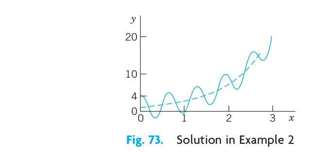
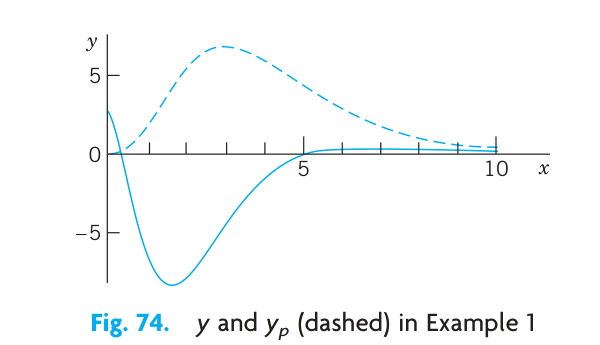
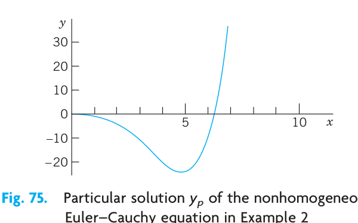
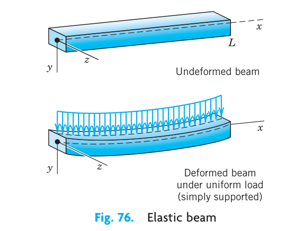
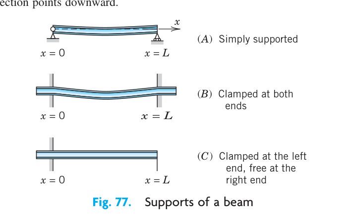

The concepts and methods of solving linear ODEs of order $n=2$ extend nicely to linear ODEs of higher order $n$, that is, $n=3, 4$, etc. This shows that the theory explained in Chap. 2 for second-order linear ODEs is attractive, since it can be extended in a straightforward way to arbitrary $n$. We do so in this chapter and notice that the formulas become more involved, the variety of roots of the characteristic equation (in Sec. 3.2) becomes much larger with increasing $n$, and the Wronskian plays a more prominent role.

The concepts and methods of solving second-order linear ODEs extend readily to linear ODEs of higher order.

This chapter follows Chap. 2 naturally, since the results of Chap. 2 can be readily extended to that of Chap. 3.

**Prerequisite:** Secs. 2.1, 2.2, 2.6, 2.7, 2.10.
**References and Answers to Problems:** App. 1 Part A, and App. 2.

## 3.1 Homogeneous Linear ODEs {#sec-3-1}

Recall from Sec. 1.1 that an ODE is of $n$th order if the $n$th derivative of the unknown function $y(x)$ is the highest occurring derivative. Thus the ODE is of the form

$$
F(x, y, y', \dots, y^{(n)}) = 0
$$

where $y^{(n)} = d^n y / dx^n$. lower order derivatives and $y$ itself may or may not occur. Such an ODE is called **linear** if it can be written

$$
y^{(n)} + p_{n-1}(x)y^{(n-1)} + \dots + p_1(x)y' + p_0(x)y = r(x).
$$ {#eq-3-1}

(For $n=2$ this is (1) in Sec. 2.1 with $p_1 = p$ and $p_0 = q$.) The coefficients $p_0, \dots, p_{n-1}$ and the function $r$ on the right are any given functions of $x$, and $y$ is unknown. $y^{(n)}$ has coefficient 1. We call this the **standard form**. (If you have $p_n(x)y^{(n)}$, divide by $p_n(x)$ to get this form.) An $n$th-order ODE that cannot be written in the form (@eq-3-1) is called **nonlinear**.

If $r(x)$ is identically zero, ($r(x) \equiv 0$ for all $x$ considered, usually in some open interval $I$), then (@eq-3-1) becomes

$$
y^{(n)} + p_{n-1}(x)y^{(n-1)} + \dots + p_1(x)y' + p_0(x)y = 0
$$ {#eq-3-2}

and is called **homogeneous**. If $r(x)$ is not identically zero, then the ODE is called **nonhomogeneous**. This is as in Sec. 2.1.

A solution of an $n$th-order (linear or nonlinear) ODE on some open interval $I$ is a function $y = h(x)$ that is defined and $n$ times differentiable on $I$ and is such that the ODE becomes an identity if we replace the unknown function $y$ and its derivatives by $h$ and its corresponding derivatives.

Sections 3.1–3.2 will be devoted to homogeneous linear ODEs and Section 3.3 to nonhomogeneous linear ODEs.

### Homogeneous Linear ODE: Superposition Principle, General Solution

The basic superposition or linearity principle of Sec. 2.1 extends to $n$th order homogeneous linear ODEs as follows.

**THEOREM 1 Fundamental Theorem for the Homogeneous Linear ODE (2)**
For a homogeneous linear ODE (2), sums and constant multiples of solutions on some open interval $I$ are again solutions on $I$. (This does not hold for a nonhomogeneous or nonlinear ODE!)

The proof is a simple generalization of that in Sec. 2.1 and we leave it to the student.

Our further discussion parallels and extends that for second-order ODEs in Sec. 2.1. So we next define a general solution of (@eq-3-2), which will require an extension of linear independence from 2 to $n$ functions.

**DEFINITION General Solution, Basis, Particular Solution**
A **general solution** of (@eq-3-2) on an open interval $I$ is a solution of (@eq-3-2) on $I$ of the form

$$
y(x) = c_1 y_1(x) + \dots + c_n y_n(x) \quad (c_1, \dots, c_n \text{ arbitrary})
$$ {#eq-3-3}

where $y_1, \dots, y_n$ is a **basis** (or fundamental system) of solutions of (@eq-3-2) on $I$; that is, these solutions are linearly independent on $I$, as defined below.

A **particular solution** of (@eq-3-2) on $I$ is obtained if we assign specific values to the $n$ constants in (@eq-3-3).

**DEFINITION Linear Independence and Dependence**
Consider $n$ functions $y_1(x), \dots, y_n(x)$ defined on some interval $I$.
These functions are called **linearly independent** on $I$ if the equation

$$
k_1 y_1(x) + \dots + k_n y_n(x) = 0 \quad \text{on } I
$$ {#eq-3-4}

implies that all $k_1, \dots, k_n$ are zero. These functions are called **linearly dependent** on $I$ if this equation also holds on $I$ for some $k_1, \dots, k_n$ not all zero.

If and only if $y_1, \dots, y_n$ are linearly dependent on $I$, we can express (at least) one of these functions on $I$ as a "linear combination" of the other functions, that is, as a sum of those functions, each multiplied by a constant (zero or not). This motivates the term "linearly dependent." For instance, if (@eq-3-4) holds with $k_1 \neq 0$, we can divide by $k_1$ and express $y_1$ as the linear combination

$$
y_1 = -\frac{1}{k_1} (k_2 y_2 + \dots + k_n y_n).
$$

Note that when $n = 2$ these concepts reduce to those defined in Sec. 2.1.

### EXAMPLE 1 Linear Dependence
Show that the functions $y_1 = x, y_2 = 5x, y_3 = 2x$ are linearly dependent on any interval.
**Solution.** $y_2 = 5y_1 + 0y_3$. This proves linear dependence on any interval.

### EXAMPLE 2 Linear Independence
Show that $y_1 = x, y_2 = x^2, y_3 = x^3$ are linearly independent on any interval, for instance, on $-1 \le x \le 2$.
**Solution.** Equation (@eq-3-4) is $k_1x + k_2x^2 + k_3x^3 = 0$. Taking (a) $x=-1$, (b) $x=1$, (c) $x=2$, we get
(a) $-k_1 + k_2 - k_3 = 0$
(b) $k_1 + k_2 + k_3 = 0$
(c) $2k_1 + 4k_2 + 8k_3 = 0$.

from (a) + (b) we get $k_2 = 0$. Then from (c) $2k_1 + 8k_3 = 0$. Then from (b) $k_1 + k_3 = 0$. This gives $k_1 = 0, k_3 = 0$. This proves linear independence.
A better method for testing linear independence of solutions of ODEs will soon be explained.

### EXAMPLE 3 General Solution. Basis
Solve the fourth-order ODE
$$
y^{iv} - 5y'' + 4y = 0
$$
(where $y^{iv} = d^4y/dx^4$).
**Solution.** As in Sec. 2.2 we substitute $y = e^{\lambda x}$. Omitting the common factor $e^{\lambda x}$ we obtain the characteristic equation
$$
\lambda^4 - 5\lambda^2 + 4 = 0.
$$
This is a quadratic equation in $\lambda^2$, namely, $(\lambda^2 - 1)(\lambda^2 - 4) = 0$.
The roots are $\pm 1$ and $\pm 2$. Hence $\lambda = -2, -1, 1, 2$. This gives four solutions. A general solution on any interval is
$$
y = c_1 e^{-2x} + c_2 e^{-x} + c_3 e^x + c_4 e^{2x}
$$
provided those four solutions are linearly independent. This is true but will be shown later.

### Initial Value Problem. Existence and Uniqueness

An initial value problem for the ODE (@eq-3-2) consists of (@eq-3-2) and $n$ initial conditions

$$
y(x_0) = K_0, \quad y'(x_0) = K_1, \dots, y^{(n-1)}(x_0) = K_{n-1}
$$ {#eq-3-5}

with $x_0$ given in the open interval $I$ considered, and $K_0, \dots, K_{n-1}$ given.

In extension of the existence and uniqueness theorem in Sec. 2.6 we now have the following.

**THEOREM 2 Existence and Uniqueness Theorem for Initial Value Problems**
If the coefficients $p_0(x), \dots, p_{n-1}(x)$ of (@eq-3-2) are continuous on some open interval $I$ and $x_0$ is in $I$, then the initial value problem (@eq-3-2), (@eq-3-5) has a unique solution $y(x)$ on $I$.

Existence is proved in Ref. [A11] in App. 1. Uniqueness can be proved by a slight generalization of the uniqueness proof at the beginning of App. 4.

### EXAMPLE 4 Initial Value Problem for a Third-Order Euler–Cauchy Equation
Solve the following initial value problem on any open interval $I$ on the positive $x$-axis containing $x=1$.
$$
x^3y''' - 3x^2y'' + 6xy' - 6y = 0, \quad y(1) = 2, \quad y'(1) = 1, \quad y''(1) = -4.
$$
**Solution.** **Step 1. General solution.** As in Sec. 2.5 we try $y = x^m$. By differentiation and substitution,
$$
x^3m(m-1)(m-2)x^{m-3} - 3x^2m(m-1)x^{m-2} + 6xmx^{m-1} - 6x^m = 0.
$$
Dropping $x^m$ and ordering gives $m^3 - 6m^2 + 11m - 6 = 0$. If we can guess the root $m = 1$, we can divide by $m-1$ and find the other roots 2 and 3, thus obtaining the solutions $x, x^2, x^3$, which are linearly independent on $I$ (see Example 2). [In general one shall need a root-finding method, such as Newton's (Sec. 19.2), also available in a CAS (Computer Algebra System).] Hence a general solution is
$$
y = c_1 x + c_2 x^2 + c_3 x^3
$$
valid on any interval $I$, even when it includes $x=0$ where the coefficients of the ODE divided by $x^3$ (to have the standard form) are not continuous.

**Step 2. Particular solution.** The derivatives are $y' = c_1 + 2c_2 x + 3c_3 x^2$ and $y'' = 2c_2 + 6c_3 x$. From this, and $y$ and the initial conditions, we get by setting $x=1$,
(a) $c_1 + c_2 + c_3 = 2$
(b) $c_1 + 2c_2 + 3c_3 = 1$
(c) $2c_2 + 6c_3 = -4$.
This is solved by Cramer's rule (Sec. 7.6), or by elimination, which is simple, as follows. (b) - (a) gives
(d) $c_2 + 2c_3 = -1$.
Then (c) - 2(d) gives $2c_3 = -2, c_3 = -1$. Then (d) gives $c_2 = 1$. Finally $c_1 = 2$ from (a).
**Answer:**
$$
y = 2x + x^2 - x^3.
$$

### Linear Independence of Solutions. Wronskian
Linear independence of solutions is crucial for obtaining general solutions. Although it can often be seen by inspection, it would be good to have a criterion for it. Now Theorem 2 in Sec. 2.6 extends from order $n=2$ to any $n$. This extended criterion uses the **Wronskian** $W$ of $n$ solutions $y_1, \dots, y_n$ defined as the $n$th-order determinant

$$
W(y_1, \dots, y_n) = \begin{vmatrix}
y_1 & y_2 & \dots & y_n \\
y_1' & y_2' & \dots & y_n' \\
\vdots & \vdots & \ddots & \vdots \\
y_1^{(n-1)} & y_2^{(n-1)} & \dots & y_n^{(n-1)}
\end{vmatrix}.
$$ {#eq-3-6}

Note that $W$ depends on $x$ since $y_1, \dots, y_n$ do. The criterion states that these solutions form a basis if and only if $W$ is not zero; more precisely:
**THEOREM 3 Linear Dependence and Independence of Solutions**
Let the ODE (@eq-3-2) have continuous coefficients on an open interval $I$. Then $n$ solutions of (@eq-3-2) on $I$ are linearly dependent on $I$ if and only if their Wronskian is zero for some $x_0$ in $I$. Furthermore, if $W$ is zero for $x=x_0$ then $W$ is identically zero on $I$. Hence if there is an $x_1$ in $I$ at which $W$ is not zero, then $y_1, \dots, y_n$ are linearly independent on $I$, so that they form a basis of solutions of (@eq-3-2) on $I$.

**PROOF** (a) Let $y_1, \dots, y_n$ be linearly dependent solutions of (@eq-3-2) on $I$. Then, by definition, there are constants $k_1, \dots, k_n$ not all zero, such that for all $x$ in $I$,
$$
k_1 y_1 + \dots + k_n y_n = 0
$$ {#eq-3-7}
By differentiations of (@eq-3-7) we obtain for all $x$ in $I$
$$
\begin{aligned}
k_1 y_1' + \dots + k_n y_n' &= 0 \\
&\vdots \\
k_1 y_1^{(n-1)} + \dots + k_n y_n^{(n-1)} &= 0.
\end{aligned}
$$ {#eq-3-8}
(@eq-3-7), (@eq-3-8) is a homogeneous linear system of algebraic equations with a nontrivial solution $k_1, \dots, k_n$. Hence its coefficient determinant must be zero for every $x$ on $I$, by Cramer's theorem (Sec. 7.7). But that determinant is the Wronskian $W$, as we see from (@eq-3-6). Hence $W$ is zero for every $x$ on $I$.

(b) Conversely, if $W$ is zero at an $x_0$ in $I$, then the system (@eq-3-7), (@eq-3-8) with $x = x_0$ has a solution $k_1^*, \dots, k_n^*$ not all zero, by the same theorem. With these constants we define the solution $y^* = k_1^*y_1 + \dots + k_n^*y_n$ of (@eq-3-2) on $I$. By (@eq-3-7), (@eq-3-8) this solution satisfies the initial conditions $y^*(x_0) = 0, \dots, y^{*(n-1)}(x_0) = 0$. But another solution satisfying the same conditions is $y \equiv 0$. Hence $y^* \equiv 0$ by Theorem 2, which applies since the coefficients of (@eq-3-2) are continuous. Together, $y^* = k_1^*y_1 + \dots + k_n^*y_n \equiv 0$ on $I$. This means linear dependence of $y_1, \dots, y_n$ on $I$.

(c) If $W$ is zero at an $x_0$ in $I$, we have linear dependence by (b) and then $W \equiv 0$ by (a). Hence if $W$ is not zero at an $x_1$ in $I$, the solutions $y_1, \dots, y_n$ must be linearly independent on $I$.

### EXAMPLE 5 Basis, Wronskian
We can now prove that in Example 3 we do have a basis. In evaluating $W$, pull out the exponential functions columnwise. In the result, subtract Column 1 from Columns 2, 3, 4 (without changing Column 1). Then expand by Row 1. In the resulting third-order determinant, subtract Column 1 from Column 2 and expand the result by Row 2:

$$
\begin{aligned}
W &= \begin{vmatrix}
e^{-2x} & e^{-x} & e^x & e^{2x} \\
-2e^{-2x} & -e^{-x} & e^x & 2e^{2x} \\
4e^{-2x} & e^{-x} & e^x & 4e^{2x} \\
-8e^{-2x} & -e^{-x} & e^x & 8e^{2x}
\end{vmatrix}
= e^{-2x}e^{-x}e^x e^{2x} \begin{vmatrix}
1 & 1 & 1 & 1 \\
-2 & -1 & 1 & 2 \\
4 & 1 & 1 & 4 \\
-8 & -1 & 1 & 8
\end{vmatrix} \\
&= \begin{vmatrix}
1 & 0 & 0 & 0 \\
-2 & 1 & 3 & 4 \\
4 & -3 & -3 & 0 \\
-8 & 7 & 9 & 16
\end{vmatrix}
= \begin{vmatrix}
1 & 3 & 4 \\
-3 & -3 & 0 \\
7 & 9 & 16
\end{vmatrix}
= \begin{vmatrix}
1 & 2 & 4 \\
-3 & 0 & 0 \\
7 & 2 & 16
\end{vmatrix}
= -(-3) \begin{vmatrix}
2 & 4 \\
2 & 16
\end{vmatrix} = 3(32 - 8) = 72.
\end{aligned}
$$

### A General Solution of (2) Includes All Solutions

Let us first show that general solutions always exist. Indeed, Theorem 3 in Sec. 2.6 extends as follows.

**THEOREM 4 Existence of a General Solution**
If the coefficients $p_0(x), \dots, p_{n-1}(x)$ of (@eq-3-2) are continuous on some open interval $I$, then (@eq-3-2) has a general solution on $I$.

**PROOF** We choose any fixed $x_0$ in $I$. By Theorem 2 the ODE (@eq-3-2) has $n$ solutions $y_1, \dots, y_n$ where $y_j$ satisfies initial conditions (@eq-3-5) with $K_{j-1} = 1$ and all other $K$'s equal to zero. Their Wronskian at $x_0$ equals 1. For instance, when $n=3$, then $y_1(x_0)=1, y_2'(x_0)=1, y_3''(x_0)=1$ and the other initial values are zero. Thus, as claimed,

$$
W(y_1(x_0), y_2(x_0), y_3(x_0)) = \begin{vmatrix}
y_1(x_0) & y_2(x_0) & y_3(x_0) \\
y_1'(x_0) & y_2'(x_0) & y_3'(x_0) \\
y_1''(x_0) & y_2''(x_0) & y_3''(x_0)
\end{vmatrix}
= \begin{vmatrix}
1 & 0 & 0 \\
0 & 1 & 0 \\
0 & 0 & 1
\end{vmatrix} = 1.
$$

Hence for any $n$ those solutions are linearly independent on $I$, by Theorem 3. They form a basis on $I$, and $y = c_1 y_1 + \dots + c_n y_n$ is a general solution of (@eq-3-2) on $I$.

We can now prove the basic property that, from a general solution of (@eq-3-2), every solution of (@eq-3-2) can be obtained by choosing suitable values of the arbitrary constants. Hence an $n$th-order linear ODE has no singular solutions, that is, solutions that cannot be obtained from a general solution.

**THEOREM 5 General Solution Includes All Solutions**
If the ODE (@eq-3-2) has continuous coefficients $p_0(x), \dots, p_{n-1}(x)$ on some open interval $I$, then every solution $y = Y(x)$ of (@eq-3-2) on $I$ is of the form
$$
Y(x) = C_1 y_1(x) + \dots + C_n y_n(x)
$$ {#eq-3-9}
where $y_1, \dots, y_n$ is a basis of solutions of (@eq-3-2) on $I$ and $C_1, \dots, C_n$ are suitable constants.

**PROOF** Let $Y$ be a given solution and $y = c_1 y_1 + \dots + c_n y_n$ a general solution of (@eq-3-2) on $I$. We choose any fixed $x_0$ in $I$ and show that we can find constants $c_1, \dots, c_n$ for which $y$ and its first $n-1$ derivatives agree with $Y$ and its corresponding derivatives at $x_0$. That is, we should have at $x = x_0$
$$
\begin{aligned}
c_1 y_1 + \dots + c_n y_n &= Y \\
c_1 y_1' + \dots + c_n y_n' &= Y' \\
&\vdots \\
c_1 y_1^{(n-1)} + \dots + c_n y_n^{(n-1)} &= Y^{(n-1)}.
\end{aligned}
$$ {#eq-3-10}
But this is a linear system of equations in the unknowns $c_1, \dots, c_n$. Its coefficient determinant is the Wronskian $W$ of $y_1, \dots, y_n$ at $x_0$. Since $y_1, \dots, y_n$ form a basis, they are linearly independent, so that $W$ is not zero by Theorem 3. Hence (@eq-3-10) has a unique solution (by Cramer's theorem in Sec. 7.7). With these values $c_1 = C_1, \dots, c_n = C_n$ we obtain the particular solution
$$
y^*(x) = C_1 y_1(x) + \dots + C_n y_n(x)
$$
on $I$. Equation (@eq-3-10) shows that $y^*$ and its first $n-1$ derivatives agree at $x_0$ with $Y$ and its corresponding derivatives. That is, $y^*$ and $Y$ satisfy, at $x_0$, the same initial conditions. The uniqueness theorem (Theorem 2) now implies that $y^* \equiv Y$ on $I$. This proves the theorem.

This completes our theory of the homogeneous linear ODE (@eq-3-2). Note that for $n = 2$ it is identical with that in Sec. 2.6. This had to be expected.

### PROBLEM SET 3.1

**1–6 BASES: TYPICAL EXAMPLES**
To get a feel for higher order ODEs, show that the given functions are solutions and form a basis on any interval. Use Wronskians. In Prob. 6, $x > 0$.
1. $1, x^2, x^4, \quad x^2y''' - 3xy'' + 3y' = 0$
2. $e^{-x}\cos 2x, e^{-x}\sin 2x, \quad y'' + 2y' + 5y = 0$
3. $e^{-4x}, xe^{-4x}, x^2e^{-4x}, \quad y''' + 12y'' + 48y' + 64y = 0$
4. $\cos x, \sin x, x \cos x, x \sin x, \quad y^{iv} + 2y'' + y = 0$
5. $e^x, e^{-x}, e^{2x}, \quad y''' - 2y'' - y' + 2y = 0$
6. $1, x, x^2, x^3, \quad y^{iv} = 0$

7. **TEAM PROJECT. General Properties of Solutions of Linear ODEs.** These properties are important in obtaining new solutions from given ones. Therefore extend Team Project 38 in Sec. 2.2 to $n$th-order ODEs. Explore statements on sums and multiples of solutions of (@eq-3-1) and (@eq-3-2) systematically and with proofs. Recognize clearly that no new ideas are needed in this extension from $n = 2$ to general $n$.

**8–15 LINEAR INDEPENDENCE**
Are the given functions linearly independent or dependent on the half-axis $x \ge 0$? Give reason.
8. $\tan x, \cot x, 1$
9. $x^2, 1/x^2, 0$
10. $\cosh 2x, \sinh 2x, e^{2x}$
11. $\sin^2 x, \cos^2 x, 2\pi$
12. $\sin x, \cos x, \sin 2x$
13. $\sin^2 x, \cos^2 x, \cos 2x$
14. $e^x \cos x, e^x \sin x, e^x$
15. $e^{2x}, xe^{2x}, x^2e^{2x}$

16. **TEAM PROJECT. Linear Independence and Dependence.** (a) Investigate the given question about a set $S$ of functions on an interval $I$. Give an example. Prove your answer.
(1) If $S$ contains the zero function, can $S$ be linearly independent?
(2) If $S$ is linearly independent on a subinterval $J$ of $I$, is it linearly independent on $I$?
(3) If $S$ is linearly dependent on a subinterval $J$ of $I$, is it linearly dependent on $I$?
(4) If $S$ is linearly independent on $I$, is it linearly independent on a subinterval $J$?
(5) If $S$ is linearly dependent on $I$, is it linearly independent on a subinterval $J$?
(6) If $S$ is linearly dependent on $I$, and if $T$ contains $S$, is $T$ linearly dependent on $I$?
(b) In what cases can you use the Wronskian for testing linear independence? By what other means can you perform such a test?

## 3.2 Homogeneous Linear ODEs with Constant Coefficients {#sec-3-2}

We proceed along the lines of Sec. 2.2, and generalize the results from $n = 2$ to arbitrary $n$. We want to solve an $n$th-order homogeneous linear ODE with constant coefficients, written as

$$
y^{(n)} + a_{n-1}y^{(n-1)} + \dots + a_1y' + a_0y = 0
$$ {#eq-3-11}

where $y^{(n)} = d^ny/dx^n$, etc. As in Sec. 2.2, we substitute $y = e^{\lambda x}$ to obtain the characteristic equation

$$
\lambda^n + a_{n-1}\lambda^{n-1} + \dots + a_1\lambda + a_0 = 0
$$ {#eq-3-12}

of (@eq-3-11). If $\lambda$ is a root of (@eq-3-12), then $y = e^{\lambda x}$ is a solution of (@eq-3-11). To find these roots, you may need a numeric method, such as Newton's in Sec. 19.2, also available on the usual CASs.

For general $n$ there are more cases than for $n=2$. We can have distinct real roots, simple complex roots, multiple roots, and multiple complex roots, respectively. This will be shown next and illustrated by examples.

### Distinct Real Roots

If all the $n$ roots $\lambda_1, \dots, \lambda_n$ of (@eq-3-12) are real and different, then the $n$ solutions

$$
y_1 = e^{\lambda_1 x}, \dots, y_n = e^{\lambda_n x}
$$ {#eq-3-13}

constitute a basis for all $x$. The corresponding general solution of (@eq-3-11) is

$$
y = c_1 e^{\lambda_1 x} + \dots + c_n e^{\lambda_n x}.
$$ {#eq-3-14}

Indeed, the solutions in (@eq-3-13) are linearly independent, as we shall see after the example.

### EXAMPLE 1 Distinct Real Roots
Solve the ODE $y''' - 2y'' - y' + 2y = 0$.
**Solution.** The characteristic equation is $\lambda^3 - 2\lambda^2 - \lambda + 2 = 0$. It has the roots $-1, 1, 2$; if you find one of them by inspection, you can obtain the other two roots by solving a quadratic equation (explain!). The corresponding general solution (@eq-3-14) is
$$
y = c_1 e^{-x} + c_2 e^x + c_3 e^{2x}.
$$

**Linear Independence of (13).** Students familiar with $n$th-order determinants may verify that, by pulling out all exponential functions from the columns and denoting their product by $E = \exp[(\lambda_1 + \dots + \lambda_n)x]$, the Wronskian of the solutions in (@eq-3-13) becomes

$$
W = \begin{vmatrix}
e^{\lambda_1 x} & e^{\lambda_2 x} & \dots & e^{\lambda_n x} \\
\lambda_1 e^{\lambda_1 x} & \lambda_2 e^{\lambda_2 x} & \dots & \lambda_n e^{\lambda_n x} \\
\lambda_1^2 e^{\lambda_1 x} & \lambda_2^2 e^{\lambda_2 x} & \dots & \lambda_n^2 e^{\lambda_n x} \\
\vdots & \vdots & \ddots & \vdots \\
\lambda_1^{n-1} e^{\lambda_1 x} & \lambda_2^{n-1} e^{\lambda_2 x} & \dots & \lambda_n^{n-1} e^{\lambda_n x}
\end{vmatrix} = E \begin{vmatrix}
1 & 1 & \dots & 1 \\
\lambda_1 & \lambda_2 & \dots & \lambda_n \\
\lambda_1^2 & \lambda_2^2 & \dots & \lambda_n^2 \\
\vdots & \vdots & \ddots & \vdots \\
\lambda_1^{n-1} & \lambda_2^{n-1} & \dots & \lambda_n^{n-1}
\end{vmatrix}.
$$ {#eq-3-15}

The exponential function $E$ is never zero. Hence $W = 0$ if and only if the determinant on the right is zero. This is a so-called Vandermonde or Cauchy determinant. It can be shown that it equals

$$
(-1)^{n(n-1)/2} V
$$ {#eq-3-16}

where $V$ is the product of all factors $\lambda_j - \lambda_k$ with $j < k \le n$; for instance, when $n = 3$ we get $-V = -(\lambda_1 - \lambda_2)(\lambda_1 - \lambda_3)(\lambda_2 - \lambda_3)$. This shows that the Wronskian is not zero if and only if all the $n$ roots of (@eq-3-12) are different and thus gives the following.

**THEOREM 1 Basis**
Solutions $y_1 = e^{\lambda_1 x}, \dots, y_n = e^{\lambda_n x}$ of (@eq-3-11) (with any real or complex $\lambda$'s) form a basis of solutions of (@eq-3-11) on any open interval if and only if all $n$ roots of (@eq-3-12) are different.

Actually, Theorem 1 is an important special case of our more general result obtained from (@eq-3-15) and (@eq-3-16):

**THEOREM 2 Linear Independence**
Any number of solutions of (@eq-3-11) of the form $e^{\lambda x}$ are linearly independent on an open interval $I$ if and only if the corresponding $\lambda$ are all different.

### Simple Complex Roots

If complex roots occur, they must occur in conjugate pairs since the coefficients of (@eq-3-11) are real. Thus, if $\lambda = \gamma + i\omega$ is a simple root of (@eq-3-12), so is the conjugate $\bar{\lambda} = \gamma - i\omega$ and two corresponding linearly independent solutions are (as in Sec. 2.2, except for notation)

$$
y_1 = e^{\gamma x} \cos \omega x, \quad y_2 = e^{\gamma x} \sin \omega x.
$$

### EXAMPLE 2 Simple Complex Roots. Initial Value Problem
Solve the initial value problem
$$
y''' - y'' + 100y' - 100y = 0, \quad y(0) = 4, \quad y'(0) = 11, \quad y''(0) = -299.
$$
**Solution.** The characteristic equation is $\lambda^3 - \lambda^2 + 100\lambda - 100 = 0$. It has the root 1, as can perhaps be seen by inspection. Then division by $\lambda - 1$ shows that the other roots are $\pm 10i$. Hence a general solution and its derivatives (obtained by differentiation) are
$$
\begin{aligned}
y &= c_1 e^x + A \cos 10x + B \sin 10x, \\
y' &= c_1 e^x - 10A \sin 10x + 10B \cos 10x, \\
y'' &= c_1 e^x - 100A \cos 10x - 100B \sin 10x.
\end{aligned}
$$
From this and the initial conditions we obtain, by setting $x = 0$,
(a) $c_1 + A = 4$
(b) $c_1 + 10B = 11$
(c) $c_1 - 100A = -299$
We solve this system for the unknowns $c_1, A, B$. Equation (a) minus Equation (c) gives $101A = 303, A = 3$. Then $c_1 = 1$ from (a) and $B = 1$ from (b). The solution is (@fig-01)
$$
y = e^x + 3\cos 10x + \sin 10x.
$$
This gives the solution curve, which oscillates about $e^x$ (dashed in @fig-01).

{#fig-01}

### Multiple Real Roots

If a real double root occurs, say, $\lambda_1 = \lambda_2$, then $y_1 = y_2$ in (@eq-3-13), and we take $e^{\lambda_1 x}$ and $xe^{\lambda_1 x}$ as corresponding linearly independent solutions. This is as in Sec. 2.2.
More generally, if $\lambda$ is a real root of order $m$, then $m$ corresponding linearly independent solutions are

$$
e^{\lambda x}, xe^{\lambda x}, x^2e^{\lambda x}, \dots, x^{m-1}e^{\lambda x}.
$$ {#eq-3-17}

We derive these solutions after the next example and indicate how to prove their linear independence.

### EXAMPLE 3 Real Double and Triple Roots
Solve the ODE $y^v - 3y^{iv} + 3y''' - y'' = 0$.
**Solution.** The characteristic equation $\lambda^5 - 3\lambda^4 + 3\lambda^3 - \lambda^2 = 0$ has the roots $\lambda_1 = \lambda_2 = 0$ and $\lambda_3 = \lambda_4 = \lambda_5 = 1$, and the answer is
$$
y = c_1 + c_2 x + (c_3 + c_4 x + c_5 x^2)e^x.
$$ {#eq-3-18}

**Derivation of (17).** We write the left side of (@eq-3-11) as
$$
L[y] = y^{(n)} + a_{n-1}y^{(n-1)} + \dots + a_0y.
$$
Let $y = e^{\lambda x}$. Then by performing the differentiations we have
$$
L[e^{\lambda x}] = (\lambda^n + a_{n-1}\lambda^{n-1} + \dots + a_0)e^{\lambda x}.
$$
Now let $\lambda_1$ be a root of $m$th order of the polynomial on the right, where $m \le n$. For $m < n$ let $\lambda_{m+1}, \dots, \lambda_n$ be the other roots, all different from $\lambda_1$. Writing the polynomial in product form, we then have
$$
L[e^{\lambda x}] = (\lambda - \lambda_1)^m h(\lambda) e^{\lambda x}
$$
with $h(\lambda) = (\lambda - \lambda_{m+1})\dots(\lambda - \lambda_n)$ if $m < n$ and $h(\lambda) = 1$ if $m = n$. Now comes the key idea: We differentiate on both sides with respect to $\lambda$:
$$
\frac{\partial}{\partial \lambda} L[e^{\lambda x}] = m(\lambda - \lambda_1)^{m-1} h(\lambda) e^{\lambda x} + (\lambda - \lambda_1)^m \frac{\partial}{\partial \lambda}[h(\lambda)e^{\lambda x}].
$$ {#eq-3-19}
The differentiations with respect to $x$ and $\lambda$ are independent and the resulting derivatives are continuous, so that we can interchange their order on the left:
$$
\frac{\partial}{\partial \lambda} L[e^{\lambda x}] = L\left[\frac{\partial}{\partial \lambda} e^{\lambda x}\right] = L[x e^{\lambda x}].
$$ {#eq-3-20}
The right side of (@eq-3-19) is zero for $\lambda = \lambda_1$ because of the factors $\lambda - \lambda_1$ (and since $m \ge 2$, we have a multiple root!). Hence $L[xe^{\lambda_1 x}] = 0$ by (@eq-3-19) and (@eq-3-20). This proves that $xe^{\lambda_1 x}$ is a solution of (@eq-3-11).
We can repeat this step and produce $x^2e^{\lambda_1 x}, \dots, x^{m-1}e^{\lambda_1 x}$ by another $m-2$ such differentiations with respect to $\lambda$. Going one step further would no longer give zero on the right because the lowest power of $\lambda - \lambda_1$ would then be multiplied by $m!$, and because $h(\lambda_1) \neq 0$ has no factors $\lambda - \lambda_1$, so we get precisely the solutions in (@eq-3-17).
We finally show that the solutions (@eq-3-17) are linearly independent. For a specific $n$ this can be seen by calculating their Wronskian, which turns out to be nonzero. For arbitrary $m$ we can pull out the exponential functions from the Wronskian. This gives $e^{m\lambda_1 x}$ times a determinant which by "row operations" can be reduced to the Wronskian of $1, x, \dots, x^{m-1}$. The latter is constant and different from zero (equal to $1!2!\dots(m-1)!$). These functions are solutions of the ODE $y^{(m)} = 0$, so that linear independence follows from Theorem 3 in Sec. 3.1.

### Multiple Complex Roots

In this case, real solutions are obtained as for complex simple roots above. Consequently, if $\lambda = \gamma + i\omega$ is a complex double root, so is the conjugate $\bar{\lambda} = \gamma - i\omega$. Corresponding linearly independent solutions are

$$
e^{\gamma x} \cos \omega x, \quad e^{\gamma x} \sin \omega x, \quad x e^{\gamma x} \cos \omega x, \quad x e^{\gamma x} \sin \omega x.
$$ {#eq-3-21}

The first two of these result from $e^{\lambda x}$ and $e^{\bar{\lambda} x}$ as before, and the second two from $x e^{\lambda x}$ and $x e^{\bar{\lambda} x}$ in the same fashion. Obviously, the corresponding general solution is

$$
y = e^{\gamma x} [(A_1 + A_2 x) \cos \omega x + (B_1 + B_2 x) \sin \omega x].
$$ {#eq-3-22}

For complex triple roots (which hardly ever occur in applications), one would obtain two more solutions $x^2 e^{\gamma x} \cos \omega x, x^2 e^{\gamma x} \sin \omega x$, and so on.

### PROBLEM SET 3.2

**1–6 GENERAL SOLUTION**
Solve the given ODE. Show the details of your work.
1. $y''' + 25y' = 0$
2. $y^{iv} + 2y'' + y = 0$
3. $y^{iv} + 4y'' = 0$
4. $(D^3 - D^2 - D + I)y = 0$
5. $(D^4 + 10D^2 + 9I)y = 0$
6. $(D^5 + 8D^3 + 16D)y = 0$

**7–13 INITIAL VALUE PROBLEM**
Solve the IVP by a CAS, giving a general solution and the particular solution and its graph.
7. $y''' + 3.2y'' + 4.81y' = 0, \quad y(0) = 3.4, \quad y'(0) = -4.6, \quad y''(0) = 9.91$
8. $y''' + 7.5y'' + 14.25y' - 9.125y = 0, \quad y(0) = 10.05, \quad y'(0) = -54.975, \quad y''(0) = 257.5125$
9. $4y''' + 8y'' + 41y' + 37y = 0, \quad y(0) = 9, \quad y'(0) = -6.5, \quad y''(0) = -39.75$
10. $y^{iv} + 4y = 0, \quad y(0) = 1/2, \quad y'(0) = -3/2, \quad y''(0) = 5/2, \quad y'''(0) = -7/2$
11. $y^{iv} - 9y'' - 400y = 0, \quad y(0) = 0, \quad y'(0) = 0, \quad y''(0) = 41, \quad y'''(0) = 0$
12. $y^v - 5y''' + 4y' = 0, \quad y(0) = 3, \quad y'(0) = -5, \quad y''(0) = 11, \quad y'''(0) = -23, \quad y^{iv}(0) = 47$
13. $y^{iv} + 0.45y''' - 0.165y'' + 0.0045y' - 0.00175y = 0, \quad y(0) = 17.4, \quad y'(0) = -2.82, \quad y''(0) = 2.0485, \quad y'''(0) = -1.458675$

14. **PROJECT. Reduction of Order.** This is of practical interest since a single solution of an ODE can often be guessed. For second order, see Example 7 in Sec. 2.1.
(a) How could you reduce the order of a linear constant-coefficient ODE if a solution is known?
(b) ethod to a variable-coefficient ODE
$$
y''' + p_2(x)y'' + p_1(x)y' + p_0(x)y = 0.
$$
Assuming a solution $y_1$ to be known, show that another solution is $y_2(x) = u(x)y_1(x)$ with $u(x) = \int z(x) dx$ and $z$ obtained by solving
$$
y_1 z'' + (3y_1' + p_2 y_1)z' + (3y_1'' + 2p_2 y_1' + p_1 y_1)z = 0.
$$
(c) Reduce
$$
x^3 y''' - 3x^2 y'' + (6 - x^2)x y' - (6 - x^2)y = 0,
$$
using $y_1 = x$ (perhaps obtainable by inspection).

15. **CAS EXPERIMENT. Reduction of Order.** Starting with a basis, find third-order linear ODEs with variable coefficients for which the reduction to second order turns out to be relatively simple.

## 3.3 Nonhomogeneous Linear ODEs {#sec-3-3}

We now turn from homogeneous to nonhomogeneous linear ODEs of $n$th order. We write them in standard form

$$
y^{(n)} + p_{n-1}(x)y^{(n-1)} + \dots + p_1(x)y' + p_0(x)y = r(x)
$$ {#eq-3-23}

with $y^{(n)} = d^ny/dx^n$ as the first term, and $r(x) \not\equiv 0$. As for second-order ODEs, a general solution of (@eq-3-23) on an open interval $I$ of the $x$-axis is of the form

$$
y(x) = y_h(x) + y_p(x).
$$ {#eq-3-24}

Here $y_h(x) = c_1 y_1(x) + \dots + c_n y_n(x)$ is a general solution of the corresponding homogeneous ODE

$$
y^{(n)} + p_{n-1}(x)y^{(n-1)} + \dots + p_1(x)y' + p_0(x)y = 0
$$ {#eq-3-25}

on $I$. Also, $y_p$ is any solution of (@eq-3-23) on $I$ containing no arbitrary constants. If (@eq-3-23) has continuous coefficients and a continuous $r$ on $I$, then a general solution of (@eq-3-23) exists and includes all solutions. Thus (@eq-3-23) has no singular solutions.

An initial value problem for (@eq-3-23) consists of (@eq-3-23) and $n$ initial conditions

$$
y(x_0) = K_0, \quad y'(x_0) = K_1, \dots, \quad y^{(n-1)}(x_0) = K_{n-1}
$$ {#eq-3-26}

with $x_0$ in $I$. Under those continuity assumptions it has a unique solution. The ideas of proof are the same as those for $n = 2$ in Sec. 2.7.

### Method of Undetermined Coefficients

Equation (@eq-3-24) shows that for solving (@eq-3-23) we have to determine a particular solution $y_p$ of (@eq-3-23). For a constant-coefficient equation

$$
y^{(n)} + a_{n-1}y^{(n-1)} + \dots + a_1y' + a_0y = r(x)
$$ {#eq-3-27}

($a_0, \dots, a_{n-1}$ constant) and special $r(x)$ as in Sec. 2.7, such a $y_p(x)$ can be determined by the method of undetermined coefficients, as in Sec. 2.7, using the following rules.

(A) **Basic Rule** as in Sec. 2.7.
(B) **Modification Rule**. If a term in your choice for $y_p(x)$ is a solution of the homogeneous equation (@eq-3-25), then multiply this term by $x^k$ where $k$ is the smallest positive integer such that this term times $x^k$ is not a solution of (@eq-3-25).
(C) **Sum Rule** as in Sec. 2.7.

The practical application of the method is the same as that in Sec. 2.7. It suffices to illustrate the typical steps of solving an initial value problem and, in particular, the new Modification Rule, which includes the old Modification Rule as a particular case (with $n = 2, k = 1$ or 2). We shall see that the technicalities are the same as for $n = 2$ except perhaps for the more involved determination of the constants.

### EXAMPLE 1 Initial Value Problem. Modification Rule
Solve the initial value problem
$$
y''' + 3y'' + 3y' + y = 30e^{-x}, \quad y(0) = 3, \quad y'(0) = -3, \quad y''(0) = -47.
$$ {#eq-3-28}
**Solution.** **Step 1.** The characteristic equation is $\lambda^3 + 3\lambda^2 + 3\lambda + 1 = (\lambda + 1)^3 = 0$. It has the triple root $\lambda = -1$. Hence a general solution of the homogeneous ODE is
$$
y_h = c_1 e^{-x} + c_2 x e^{-x} + c_3 x^2 e^{-x} = (c_1 + c_2 x + c_3 x^2)e^{-x}.
$$
**Step 2.** If we try $y_p = Ce^{-x}$ we get $C e^{-x} - 3C e^{-x} + 3C e^{-x} - C e^{-x} = 30 e^{-x}$, which has no solution. Try $C x e^{-x}$ and $C x^2 e^{-x}$. The Modification Rule calls for $C x^3 e^{-x}$. Then
$$
\begin{aligned}
y_p &= Cx^3e^{-x}, \\
y_p' &= C(3x^2 - x^3)e^{-x}, \\
y_p'' &= C(6x - 6x^2 + x^3)e^{-x}, \\
y_p''' &= C(6 - 18x + 9x^2 - x^3)e^{-x}.
\end{aligned}
$$
Substitution of these expressions into (@eq-3-28) and omission of the common factor $e^{-x}$ gives
$$
C(6 - 18x + 9x^2 - x^3) + 3C(6x - 6x^2 + x^3) + 3C(3x^2 - x^3) + Cx^3 = 30.
$$
The linear, quadratic, and cubic terms drop out, and $6C = 30$. Hence $C = 5$. This gives $y_p = 5x^3e^{-x}$.
**Step 3.** We now write down the general solution of the given ODE. From it we find $c_1$ by the first initial condition. We insert the value, differentiate, and determine $c_2$ from the second initial condition, insert the value, and finally determine $c_3$ from $y''$ and the third initial condition:
$$
\begin{aligned}
y &= y_h + y_p = (c_1 + c_2x + c_3x^2)e^{-x} + 5x^3e^{-x}, \quad y(0) = c_1 = 3 \\
y' &= [-3 + c_2 + (-c_2 + 2c_3)x + (15 - c_3)x^2 - 5x^3]e^{-x}, \quad y'(0) = -3 + c_2 = -3, \quad c_2 = 0 \\
y'' &= [3 + 2c_3 + (30 - 4c_3)x + (-30 + c_3)x^2 + 5x^3]e^{-x}, \quad y''(0) = 3 + 2c_3 = -47, \quad c_3 = -25.
\end{aligned}
$$
Hence the answer to our problem is (@fig-02)
$$
y = (3 - 25x^2)e^{-x} + 5x^3e^{-x}.
$$
The curve of $y$ begins at $(0, 3)$ with a negative slope, as expected from the initial values, and approaches zero as $x \to \infty$. The dashed curve in @fig-02 is $y_p$.

{#fig-02}

### Method of Variation of Parameters

The method of variation of parameters (see Sec. 2.10) also extends to arbitrary order $n$. It gives a particular solution $y_p$ for the nonhomogeneous equation (@eq-3-23) (in standard form with $y^{(n)}$ as the first term!) by the formula

$$
y_p(x) = \sum_{k=1}^n y_k(x) \int \frac{W_k(x)}{W(x)} r(x) dx
$$ {#eq-3-29}

$$
= y_1(x) \int \frac{W_1(x)}{W(x)} r(x) dx + \dots + y_n(x) \int \frac{W_n(x)}{W(x)} r(x) dx
$$

on an open interval $I$ on which the coefficients of (@eq-3-23) and $r(x)$ are continuous. In (@eq-3-29) the functions $y_1, \dots, y_n$ form a basis of the homogeneous ODE (@eq-3-25), with Wronskian $W$, and $W_j$ $(j = 1, \dots, n)$ is obtained from $W$ by replacing the $j$th column of $W$ by the column $[0 \quad 0 \quad \dots \quad 0 \quad 1]^T$. Thus, when $n = 2$, this becomes identical with (2) in Sec. 2.10,

$$
W = \begin{vmatrix}
y_1 & y_2 \\
y_1' & y_2'
\end{vmatrix}, \quad W_1 = \begin{vmatrix}
0 & y_2 \\
1 & y_2'
\end{vmatrix} = -y_2, \quad W_2 = \begin{vmatrix}
y_1 & 0 \\
y_1' & 1
\end{vmatrix} = y_1.
$$

The proof of (@eq-3-29) uses an extension of the idea of the proof of (2) in Sec. 2.10 and can be found in Ref [A11] listed in App. 1.

### EXAMPLE 2 Variation of Parameters. Nonhomogeneous Euler–Cauchy Equation
Solve the nonhomogeneous Euler–Cauchy equation
$$
x^3y''' - 3x^2y'' + 6xy' - 6y = x^4 \ln x \quad (x > 0).
$$
**Solution.** **Step 1.** General solution of the homogeneous ODE. Substitution of $y = x^m$ and the derivatives into the homogeneous ODE and deletion of the factor $x^m$ gives
$$
m(m-1)(m-2) - 3m(m-1) + 6m - 6 = 0.
$$
The roots are 1, 2, 3 and give as a basis
$$
y_1 = x, \quad y_2 = x^2, \quad y_3 = x^3.
$$
Hence the corresponding general solution of the homogeneous ODE is
$$
y_h = c_1 x + c_2 x^2 + c_3 x^3.
$$
**Step 2.** Determinants needed in (@eq-3-29). These are
$$
W = \begin{vmatrix}
x & x^2 & x^3 \\
1 & 2x & 3x^2 \\
0 & 2 & 6x
\end{vmatrix} = 2x^3
$$
$$
W_1 = \begin{vmatrix}
0 & x^2 & x^3 \\
0 & 2x & 3x^2 \\
1 & 2 & 6x
\end{vmatrix} = x^4, \quad W_2 = \begin{vmatrix}
x & 0 & x^3 \\
1 & 0 & 3x^2 \\
0 & 1 & 6x
\end{vmatrix} = -2x^3, \quad W_3 = \begin{vmatrix}
x & x^2 & 0 \\
1 & 2x & 0 \\
0 & 2 & 1
\end{vmatrix} = x^2.
$$
**Step 3.** Integration. In (@eq-3-29) we also need the right side of our ODE in standard form, obtained by division of the given equation by the coefficient $x^3$ of $y'''$; thus, $r(x) = (x^4 \ln x) / x^3 = x \ln x$. In (@eq-3-29) we have the simple quotients $W_1/W = x/2, W_2/W = -1, W_3/W = 1/(2x)$. Hence (@eq-3-29) becomes
$$
\begin{aligned}
y_p &= x \int \frac{x}{2} x \ln x dx - x^2 \int (-1) x \ln x dx + x^3 \int \frac{1}{2x} x \ln x dx \\
&= \frac{x}{2} \left( \frac{x^3}{3} \ln x - \frac{x^3}{9} \right) + x^2 \left( \frac{x^2}{2} \ln x - \frac{x^2}{4} \right) + \frac{x^3}{2} (x \ln x - x).
\end{aligned}
$$
Simplification gives $y_p = \frac{1}{6} x^4 (\ln x - \frac{11}{6})$. Hence the answer is
$$
y = y_h + y_p = c_1 x + c_2 x^2 + c_3 x^3 + \frac{1}{6} x^4 \left( \ln x - \frac{11}{6} \right).
$$
@fig-03 shows $y_p$. Can you explain the shape of this curve? Its behavior near $x = 0$? The occurrence of a minimum? Its rapid increase? Why would the method of undetermined coefficients not have given the solution?

{#fig-03}

### Application: Elastic Beams

Whereas second-order ODEs have various applications, of which we have discussed some of the more important ones, higher order ODEs have much fewer engineering applications. An important fourth-order ODE governs the bending of elastic beams, such as wooden or iron girders in a building or a bridge.
A related application of vibration of beams does not fit in here since it leads to PDEs and will therefore be discussed in Sec. 12.3.

### EXAMPLE 3 Bending of an Elastic Beam under a Load
We consider a beam $B$ of length $L$ and constant (e.g., rectangular) cross section and homogeneous elastic material (e.g., steel); see @fig-04. We assume that under its own weight the beam is bent so little that it is practically straight. If we apply a load to $B$ in a vertical plane through the axis of symmetry (the $x$-axis in @fig-04), $B$ is bent. Its axis is curved into the so-called elastic curve $C$ (or deflection curve). It is shown in elasticity theory that the bending moment $M(x)$ is proportional to the curvature $k(x)$ of $C$. We assume the bending to be small, so that the deflection $y(x)$ and its derivative $y'(x)$ (determining the tangent direction of $C$) are small. Then, by calculus, $k = y'' / (1 + y'^2)^{3/2} \approx y''$. Hence
$$
M(x) = EI y''(x).
$$
$EI$ is the constant of proportionality. $E$ is Young's modulus of elasticity of the material of the beam. $I$ is the moment of inertia of the cross section about the (horizontal) $z$-axis in @fig-04.
Elasticity theory shows further that $M''(x) = f(x)$, where $f(x)$ is the load per unit length. Together,
$$
EI y^{iv} = f(x).
$$ {#eq-3-30}

{#fig-04}

In applications the most important supports and corresponding boundary conditions are as follows and shown in @fig-05.
(A) Simply supported at $x = 0$ and $L$
(B) Clamped at both ends at $x = 0$ and $L$
(C) Clamped at $x = 0$, free at $x = L$

The boundary condition $y = 0$ means no displacement at that point, $y' = 0$ means a horizontal tangent, $y'' = 0$ means no bending moment, and $y''' = 0$ means no shear force.

{#fig-05}

Let us apply this to the uniformly loaded simply supported beam in @fig-04. The load is $f(x) \equiv f_0 = \text{const}$. Then (@eq-3-30) is
$$
y^{iv} = k, \quad k = \frac{f_0}{EI}.
$$ {#eq-3-31}
This can be solved simply by calculus. Two integrations give
$$
y'' = \frac{k}{2} x^2 + c_1 x + c_2.
$$
$y''(0) = 0$ gives $c_2 = 0$. Then $y''(L) = L(\frac{1}{2}kL + c_1) = 0$ (since $L \neq 0$), $c_1 = -kL/2$. Hence
$$
y'' = \frac{k}{2} (x^2 - Lx).
$$
Integrating this twice, we obtain
$$
y = \frac{k}{2} \left( \frac{1}{12} x^4 - \frac{L}{6} x^3 + c_3 x + c_4 \right)
$$
with $c_4 = 0$ from $y(0) = 0$. Then
$$
y(L) = \frac{k}{2} \left( \frac{L^4}{12} - \frac{L^4}{6} + c_3 L \right) = 0, \quad c_3 = \frac{L^3}{12}.
$$
Inserting the expression for $k$, we obtain as our solution
$$
y = \frac{f_0}{24EI} (x^4 - 2Lx^3 + L^3x).
$$
Since the boundary conditions at both ends are the same, we expect the deflection to be "symmetric" with respect to $L/2$, that is, $y(x) = y(L - x)$. Verify this directly or set $x = u + L/2$ and show that $y$ becomes an even function of $u$,
$$
y = \frac{f_0}{24EI} \left( u^2 - \frac{1}{4} L^2 \right) \left( u^2 - \frac{5}{4} L^2 \right).
$$
From this we can see that the maximum deflection in the middle at $u = 0$ ($x = L/2$) is $5f_0 L^4 / (384 EI)$. Recall that the positive direction points downward.

### PROBLEM SET 3.3

**1–7 GENERAL SOLUTION**
Solve the following ODEs, showing the details of your work.
1. $y''' + 3y'' + 3y' + y = e^x - x - 1$
2. $y''' + 2y'' - y' - 2y = 1 - 4x^3$
3. $(D^4 + 10D^2 + 9I) y = 6.5 \sinh 2x$
4. $(D^3 + 3D^2 - 5D - 39I) y = -300 \cos x$
5. $(x^3 D^3 + x^2 D^2 - 2xD + 2I) y = x^{-2}$
6. $(D^3 + 4D) y = \sin x$
7. $(D^3 - 9D^2 + 27D - 27I) y = 27 \sin 3x$

**8–13 INITIAL VALUE PROBLEM**
Solve the given IVP, showing the details of your work.
8. $y^{iv} - 5y'' + 4y = 10e^{-3x}, \quad y(0) = 1, \quad y'(0) = 0, \quad y''(0) = 0, \quad y'''(0) = 0$
9. $y^{iv} + 5y'' + 4y = 90 \sin 4x, \quad y(0) = 1, \quad y'(0) = 2, \quad y''(0) = -1, \quad y'''(0) = -32$
10. $x^3 y''' + x y' - y = x^2, \quad y(1) = 1, \quad y'(1) = 3, \quad y''(1) = 14$
11. $(D^3 - 2D^2 - 3D) y = 74e^{-3x} \sin x, \quad y(0) = -1.4, \quad y'(0) = 3.2, \quad y''(0) = -5.2$
12. $(D^3 - 2D^2 - 9D + 18I) y = e^{2x}, \quad y(0) = 4.5, \quad y'(0) = 8.8, \quad y''(0) = 17.2$
13. $y''' - 3y'' + 3y' - y = x^{1/2} e^x$

14. **CAS EXPERIMENT. Undetermined Coefficients.** Since variation of parameters is generally complicated, it seems worthwhile to try to extend the other method. Find out experimentally for what ODEs this is possible and for what not. Hint: Work backward, solving ODEs with a CAS and then looking whether the solution could be obtained by undetermined coefficients. For example, consider $3y''' + x^2y'' - 2xy' + 2y = x^3 \ln x$ and $y''' - 3y'' + 3y' - y = x^{1/2}e^x$.

15. **WRITING REPORT. Comparison of Methods.** Write a report on the method of undetermined coefficients and the method of variation of parameters, discussing and comparing the advantages and disadvantages of each method. Illustrate your findings with typical examples. Try to show that the method of undetermined coefficients, say, for a third-order ODE with constant coefficients and an exponential function on the right, can be derived from the method of variation of parameters.

### CHAPTER 3 REVIEW QUESTIONS AND PROBLEMS

1. What is the superposition or linearity principle? For what $n$th-order ODEs does it hold?
2. List some other basic theorems that extend from second-order to $n$th-order ODEs.
3. If you know a general solution of a homogeneous linear ODE, what do you need to obtain from it a general solution of a corresponding nonhomogeneous linear ODE?
4. What form does an initial value problem for an $n$th-order linear ODE have?
5. What is the Wronskian? What is it used for?

**6–15 GENERAL SOLUTION**
Solve the given ODE. Show the details of your work.
6. $y^{iv} - 3y'' - 4y = 0$
7. $y''' + 4y'' + 13y' = 0$
8. $y''' - 4y'' - y' + 4y = 30e^{2x}$
9. $(D^4 - 16I)y = -15 \cosh x$
10. $x^2 y''' + 3xy'' - 2y' = 0$
11. $y''' + 4.5y'' + 6.75y' + 3.375y = 0$
12. $(D^3 - D)y = \sinh 0.8x$
13. $(D^3 + 6D^2 + 12D + 8I)y = 8x^2$
14. $(D^4 - 13D^2 + 36I)y = 12e^x$
15. $4x^3 y''' + 3xy' - 3y = 10$

**16–20 INITIAL VALUE PROBLEM**
Solve the IVP. Show the details of your work.
16. $(D^3 - D^2 - D + I)y = 0, \quad y(0) = 0, \quad Dy(0) = 1, \quad D^2y(0) = 0$
17. $y''' + 5y'' + 24y' + 20y = x, \quad y(0) = 1.94, \quad y'(0) = -3.95, \quad y''(0) = -24$
18. $(D^4 - 26D^2 + 25I)y = 50(x + 1)^2, \quad y(0) = 12.16, \quad Dy(0) = -6, \quad D^2y(0) = 34, \quad D^3y(0) = -130$
19. $(D^3 + 9D^2 + 23D + 15I)y = 12\exp(-4x), \quad y(0) = 9, \quad Dy(0) = -41, \quad D^2y(0) = 189$
20. $(D^3 + 3D^2 + 3D + I)y = 8 \sin x, \quad y(0) = -1, \quad y'(0) = -3, \quad y''(0) = 5$

### SUMMARY OF CHAPTER 3
#### Higher Order Linear ODEs

Compare with the similar Summary of Chap. 2 (the case $n = 2$).

Chapter 3 extends Chap. 2 from order $n = 2$ to arbitrary order $n$. An $n$th-order linear ODE is an ODE that can be written

$$
y^{(n)} + p_{n-1}(x)y^{(n-1)} + \dots + p_1(x)y' + p_0(x)y = r(x)
$$ {#eq-3-32}

with $y^{(n)} = d^ny/dx^n$ as the first term; we again call this the **standard form**. Equation (@eq-3-32) is called **homogeneous** if $r(x) \equiv 0$ on a given open interval $I$ considered, **nonhomogeneous** if $r(x) \not\equiv 0$ on $I$. For the homogeneous ODE

$$
y^{(n)} + p_{n-1}(x)y^{(n-1)} + \dots + p_1(x)y' + p_0(x)y = 0
$$ {#eq-3-33}

the superposition principle (Sec. 3.1) holds, just as in the case $n = 2$. A **basis** or **fundamental system** of solutions of (@eq-3-33) on $I$ consists of $n$ linearly independent solutions $y_1, \dots, y_n$ of (@eq-3-33) on $I$. A **general solution** of (@eq-3-33) on $I$ is a linear combination of these,

$$
y = c_1 y_1 + \dots + c_n y_n \quad (c_1, \dots, c_n \text{ arbitrary constants}).
$$ {#eq-3-34}

A **general solution** of the nonhomogeneous ODE (@eq-3-32) on $I$ is of the form

$$
y = y_h + y_p \quad \text{(Sec. 3.3)}.
$$ {#eq-3-35}

Here, $y_p$ is a particular solution of (@eq-3-32) and is obtained by two methods (undetermined coefficients or variation of parameters) explained in Sec. 3.3.

An **initial value problem** for (@eq-3-32) or (@eq-3-33) consists of one of these ODEs and $n$ initial conditions (Secs. 3.1, 3.3)

$$
y(x_0) = K_0, \quad y'(x_0) = K_1, \quad \dots, \quad y^{(n-1)}(x_0) = K_{n-1}
$$ {#eq-3-36}

with $x_0$ given in $I$ and $K_0, \dots, K_{n-1}$ given. If $p_0, \dots, p_{n-1}, r$ are continuous on $I$, then general solutions of (@eq-3-32) and (@eq-3-33) on $I$ exist, and initial value problems (@eq-3-32), (@eq-3-36) or (@eq-3-33), (@eq-3-36) have a unique solution.

