Tying in with Chap. 3, we present another method of solving higher order ODEs in Sec. 4.1. This converts any $n$th-order ODE into a system of $n$ first-order ODEs. We also show some applications. Moreover, in the same section we solve systems of first-order ODEs that occur directly in applications, that is, not derived from an $n$th-order ODE but dictated by the application such as two tanks in mixing problems and two circuits in electrical networks. (The elementary aspects of vectors and matrices needed in this chapter are reviewed in Sec. 4.0 and are probably familiar to most students.)

In Sec. 4.3 we introduce a totally different way of looking at systems of ODEs. The method consists of examining the general behavior of whole families of solutions of ODEs in the phase plane, and aptly is called the phase plane method. It gives information on the stability of solutions. (Stability of a physical system is desirable and means roughly that a small change at some instant causes only a small change in the behavior of the system at later times.) This approach to systems of ODEs is a qualitative method because it depends only on the nature of the ODEs and does not require the actual solutions. This can be very useful because it is often difficult or even impossible to solve systems of ODEs. In contrast, the approach of actually solving a system is known as a quantitative method.

The phase plane method has many applications in control theory, circuit theory, population dynamics and so on. Its use in linear systems is discussed in Secs. 4.3, 4.4, and 4.6 and its even more important use in nonlinear systems is discussed in Sec. 4.5 with applications to the pendulum equation and the Lotka–Volterra population model. The chapter closes with a discussion of nonhomogeneous linear systems of ODEs.

**NOTATION.** We continue to denote unknown functions by $y$; thus, $y_1(t), y_2(t)$, analogous to Chaps. 1–3. (Note that some authors use $x$ for functions, when dealing with systems of ODEs, e.g., $x_1(t), x_2(t)$.)

**Prerequisite:** Chap. 2.

**References and Answers to Problems:** App. 1 Part A, and App. 2.

## 4.0 For Reference: Basics of Matrices and Vectors {#sec-4-0}

For clarity and simplicity of notation, we use matrices and vectors in our discussion of linear systems of ODEs. We need only a few elementary facts (and not the bulk of the material of Chaps. 7 and 8). Most students will very likely be already familiar with these facts. Thus this section is for reference only. Begin with Sec. 4.1 and consult Sec. 4.0 as needed.

Most of our linear systems will consist of two linear ODEs in two unknown functions $y_1(t), y_2(t)$,
$$
\begin{aligned}
y'_1 &= a_{11}y_1 + a_{12}y_2 \\
y'_2 &= a_{21}y_1 + a_{22}y_2
\end{aligned}
\quad \text{for example,} \quad
\begin{aligned}
y'_1 &= -5y_1 + 2y_2 \\
y'_2 &= -13y_1 + \frac{1}{2}y_2
\end{aligned}
$$ {#eq-4-1}
(perhaps with additional given functions $g_1(t), g_2(t)$ on the right in the two ODEs).

Similarly, a linear system of $n$ first-order ODEs in $n$ unknown functions $y_1(t), \dots, y_n(t)$ is of the form
$$
\begin{aligned}
y'_1 &= a_{11}y_1 + a_{12}y_2 + \dots + a_{1n}y_n \\
y'_2 &= a_{21}y_1 + a_{22}y_2 + \dots + a_{2n}y_n \\
&\ \ \dots \\
y'_n &= a_{n1}y_1 + a_{n2}y_2 + \dots + a_{nn}y_n
\end{aligned}
$$ {#eq-4-2}
(perhaps with an additional given function on the right in each ODE).

### Some Definitions and Terms

**Matrices.** In (@eq-4-1) the (constant or variable) coefficients form a $2 \times 2$ matrix $\mathbf{A}$, that is, an array
$$
\mathbf{A} = [a_{jk}] = \begin{bmatrix} a_{11} & a_{12} \\ a_{21} & a_{22} \end{bmatrix}, \quad \text{for example,} \quad \mathbf{A} = \begin{bmatrix} -5 & 2 \\ -13 & \frac{1}{2} \end{bmatrix}
$$ {#eq-4-3}
Similarly, the coefficients in (@eq-4-2) form an $n \times n$ matrix
$$
\mathbf{A} = [a_{jk}] = \begin{bmatrix}
a_{11} & a_{12} & \dots & a_{1n} \\
a_{21} & a_{22} & \dots & a_{2n} \\
\dots & \dots & \ddots & \dots \\
a_{n1} & a_{n2} & \dots & a_{nn}
\end{bmatrix}
$$ {#eq-4-4}
The $a_{jk}$ are called **entries**, the horizontal lines **rows**, and the vertical lines **columns**. Thus, in (@eq-4-3) the first row is $[a_{11}\ \ a_{12}]$, the second row is $[a_{21}\ \ a_{22}]$, and the first and second columns are
$$
\begin{bmatrix} a_{11} \\ a_{21} \end{bmatrix} \quad \text{and} \quad \begin{bmatrix} a_{12} \\ a_{22} \end{bmatrix}
$$
In the "double subscript notation" for entries, the first subscript denotes the row and the second the column in which the entry stands. Similarly in (@eq-4-4). The **main diagonal** is the diagonal $a_{11}, a_{22}, \dots, a_{nn}$ in (@eq-4-4), hence $a_{11}, a_{22}$ in (@eq-4-3).

We shall need only square matrices, that is, matrices with the same number of rows and columns, as in (@eq-4-3) and (@eq-4-4).

**Vectors.** A **column vector** $\mathbf{x}$ with $n$ components is of the form
$$
\mathbf{x} = \begin{bmatrix} x_1 \\ x_2 \\ \dots \\ x_n \end{bmatrix}, \quad \text{thus if } n = 2, \quad \mathbf{x} = \begin{bmatrix} x_1 \\ x_2 \end{bmatrix}
$$
Similarly, a **row vector** $\mathbf{v}$ is of the form
$$
\mathbf{v} = [v_1 \ \ \dots \ \ v_n], \quad \text{thus if } n = 2, \quad \mathbf{v} = [v_1 \ \ v_2]
$$

### Calculations with Matrices and Vectors

**Equality.** Two $n \times n$ matrices are equal if and only if corresponding entries are equal. Thus for $n = 2$, let
$$
\mathbf{A} = \begin{bmatrix} a_{11} & a_{12} \\ a_{21} & a_{22} \end{bmatrix} \quad \text{and} \quad \mathbf{B} = \begin{bmatrix} b_{11} & b_{12} \\ b_{21} & b_{22} \end{bmatrix}
$$
Then $\mathbf{A} = \mathbf{B}$ if and only if
$$
a_{11} = b_{11}, \quad a_{12} = b_{12}, \quad a_{21} = b_{21}, \quad a_{22} = b_{22}
$$
Two column vectors (or two row vectors) are equal if and only if they both have $n$ components and corresponding components are equal. Thus, let
$$
\mathbf{v} = \begin{bmatrix} v_1 \\ v_2 \end{bmatrix} \quad \text{and} \quad \mathbf{x} = \begin{bmatrix} x_1 \\ x_2 \end{bmatrix}
$$
Then $\mathbf{v} = \mathbf{x}$ if and only if $v_1 = x_1$, $v_2 = x_2$.

**Addition** is performed by adding corresponding entries (or components); here, matrices must both be $n \times n$, and vectors must both have the same number of components. Thus for $n = 2$,
$$
\mathbf{A} + \mathbf{B} = \begin{bmatrix} a_{11} + b_{11} & a_{12} + b_{12} \\ a_{21} + b_{21} & a_{22} + b_{22} \end{bmatrix}, \quad \mathbf{v} + \mathbf{x} = \begin{bmatrix} v_1 + x_1 \\ v_2 + x_2 \end{bmatrix}
$$ {#eq-4-5}

**Scalar multiplication** (multiplication by a number $c$) is performed by multiplying each entry (or component) by $c$. For example, if
$$
\mathbf{A} = \begin{bmatrix} 9 & 3 \\ -2 & 0 \end{bmatrix}, \quad \text{then} \quad -7\mathbf{A} = \begin{bmatrix} -63 & -21 \\ 14 & 0 \end{bmatrix}
$$
If $\mathbf{v} = \begin{bmatrix} 0.4 \\ -13 \end{bmatrix}$, then $10\mathbf{v} = \begin{bmatrix} 4 \\ -130 \end{bmatrix}$.

**Matrix Multiplication.** The product $\mathbf{C} = \mathbf{AB}$ (in this order) of two $n \times n$ matrices $\mathbf{A} = [a_{jk}]$ and $\mathbf{B} = [b_{jk}]$ is the $n \times n$ matrix with entries
$$
c_{jk} = \sum_{m=1}^n a_{jm} b_{mk}, \quad j = 1, \dots, n; \ k = 1, \dots, n
$$ {#eq-4-6}
that is, multiply each entry in the $j$th row of $\mathbf{A}$ by the corresponding entry in the $k$th column of $\mathbf{B}$ and then add these $n$ products. One says briefly that this is a "multiplication of rows into columns." For example,
$$
\begin{bmatrix} 9 & 3 \\ -2 & 0 \end{bmatrix} \begin{bmatrix} 1 & -4 \\ 2 & 5 \end{bmatrix} = \begin{bmatrix} 9 \cdot 1 + 3 \cdot 2 & 9 \cdot (-4) + 3 \cdot 5 \\ -2 \cdot 1 + 0 \cdot 2 & -2 \cdot (-4) + 0 \cdot 5 \end{bmatrix} = \begin{bmatrix} 15 & -21 \\ -2 & 8 \end{bmatrix}
$$
**CAUTION!** Matrix multiplication is not commutative, in general. In our example,
$$
\begin{bmatrix} 1 & -4 \\ 2 & 5 \end{bmatrix} \begin{bmatrix} 9 & 3 \\ -2 & 0 \end{bmatrix} = \begin{bmatrix} 1 \cdot 9 + (-4) \cdot (-2) & 1 \cdot 3 + (-4) \cdot 0 \\ 2 \cdot 9 + 5 \cdot (-2) & 2 \cdot 3 + 5 \cdot 0 \end{bmatrix} = \begin{bmatrix} 17 & 3 \\ 8 & 6 \end{bmatrix}
$$
Multiplication of an $n \times n$ matrix $\mathbf{A}$ by a vector $\mathbf{x}$ with $n$ components is defined by the same rule: $\mathbf{v} = \mathbf{Ax}$ is the vector with the $n$ components
$$
v_j = \sum_{m=1}^n a_{jm} x_m, \quad j = 1, \dots, n
$$
For example,
$$
\begin{bmatrix} 12 & 7 \\ -8 & 3 \end{bmatrix} \begin{bmatrix} x_1 \\ x_2 \end{bmatrix} = \begin{bmatrix} 12x_1 + 7x_2 \\ -8x_1 + 3x_2 \end{bmatrix}
$$

### Systems of ODEs as Vector Equations

**Differentiation.** The derivative of a matrix (or vector) with variable entries (or components) is obtained by differentiating each entry (or component). Thus, if
$$
\mathbf{y}(t) = \begin{bmatrix} y_1(t) \\ y_2(t) \end{bmatrix} = \begin{bmatrix} e^{-2t} \\ \sin t \end{bmatrix}, \quad \text{then} \quad \mathbf{y}'(t) = \begin{bmatrix} y'_1(t) \\ y'_2(t) \end{bmatrix} = \begin{bmatrix} -2e^{-2t} \\ \cos t \end{bmatrix}
$$
Using matrix multiplication and differentiation, we can now write (@eq-4-1) as
$$
\mathbf{y}' = \mathbf{Ay}
$$ {#eq-4-7}
Similarly for (@eq-4-2) by means of an $n \times n$ matrix $\mathbf{A}$ and a column vector $\mathbf{y}$ with $n$ components, namely, $\mathbf{y}' = \mathbf{Ay}$. The vector equation (@eq-4-7) is equivalent to two equations for the components, and these are precisely the two ODEs in (@eq-4-1).

### Some Further Operations and Terms

**Transposition** is the operation of writing columns as rows and conversely and is indicated by $^T$. Thus the transpose of the $2 \times 2$ matrix
$$
\mathbf{A} = \begin{bmatrix} a_{11} & a_{12} \\ a_{21} & a_{22} \end{bmatrix} = \begin{bmatrix} -5 & 2 \\ -13 & \frac{1}{2} \end{bmatrix}
$$
is
$$
\mathbf{A}^T = \begin{bmatrix} a_{11} & a_{21} \\ a_{12} & a_{22} \end{bmatrix} = \begin{bmatrix} -5 & -13 \\ 2 & \frac{1}{2} \end{bmatrix}
$$
The transpose of a column vector, say, $\mathbf{v} = \begin{bmatrix} v_1 \\ v_2 \end{bmatrix}$, is a row vector, $\mathbf{v}^T = [v_1\ \ v_2]$, and conversely.

**Inverse of a Matrix.** The $n \times n$ unit matrix $\mathbf{I}$ is the $n \times n$ matrix with main diagonal $1, 1, \dots, 1$ and all other entries zero. If, for a given $n \times n$ matrix $\mathbf{A}$, there is an $n \times n$ matrix $\mathbf{B}$ such that $\mathbf{AB} = \mathbf{BA} = \mathbf{I}$, then $\mathbf{A}$ is called **nonsingular** and $\mathbf{B}$ is called the **inverse** of $\mathbf{A}$ and is denoted by $\mathbf{A}^{-1}$; thus
$$
\mathbf{AA}^{-1} = \mathbf{A}^{-1}\mathbf{A} = \mathbf{I}
$$ {#eq-4-8}
The inverse exists if the determinant $\det \mathbf{A}$ of $\mathbf{A}$ is not zero.

If $\mathbf{A}$ has no inverse, it is called **singular**. For $n = 2$,
$$
\mathbf{A}^{-1} = \frac{1}{\det \mathbf{A}} \begin{bmatrix} a_{22} & -a_{12} \\ -a_{21} & a_{11} \end{bmatrix}
$$ {#eq-4-9}
where the determinant of $\mathbf{A}$ is
$$
\det \mathbf{A} = \begin{vmatrix} a_{11} & a_{12} \\ a_{21} & a_{22} \end{vmatrix} = a_{11}a_{22} - a_{12}a_{21}
$$ {#eq-4-10}
(For general $n$, see Sec. 7.7, but this will not be needed in this chapter.)

**Linear Independence.** $r$ given vectors $\mathbf{v}^{(1)}, \dots, \mathbf{v}^{(r)}$ with $n$ components are called a **linearly independent set** or, more briefly, **linearly independent**, if
$$
c_1 \mathbf{v}^{(1)} + \dots + c_r \mathbf{v}^{(r)} = \mathbf{0}
$$ {#eq-4-11}
implies that all scalars $c_1, \dots, c_r$ must be zero; here, $\mathbf{0}$ denotes the zero vector, whose $n$ components are all zero. If (@eq-4-11) also holds for scalars not all zero (so that at least one of these scalars is not zero), then these vectors are called a **linearly dependent set** or, briefly, **linearly dependent**, because then at least one of them can be expressed as a linear combination of the others; that is, if, for instance, $c_1 \neq 0$ in (@eq-4-11), then we can obtain
$$
\mathbf{v}^{(1)} = -\frac{1}{c_1} \left( c_2 \mathbf{v}^{(2)} + \dots + c_r \mathbf{v}^{(r)} \right)
$$

### Eigenvalues, Eigenvectors

Eigenvalues and eigenvectors will be very important in this chapter (and, as a matter of fact, throughout mathematics).

Let $\mathbf{A} = [a_{jk}]$ be an $n \times n$ matrix. Consider the equation
$$
\mathbf{Ax} = \lambda \mathbf{x}
$$ {#eq-4-12}
where $\lambda$ is a scalar (a real or complex number) to be determined and $\mathbf{x}$ is a vector to be determined. Now, for every $\lambda$, a solution is $\mathbf{x} = \mathbf{0}$. A scalar $\lambda$ such that (@eq-4-12) holds for some vector $\mathbf{x} \neq \mathbf{0}$ is called an **eigenvalue** of $\mathbf{A}$, and this vector $\mathbf{x}$ is called an **eigenvector** of $\mathbf{A}$ corresponding to this eigenvalue $\lambda$.

We can write (@eq-4-12) as $\mathbf{Ax} - \lambda \mathbf{x} = \mathbf{0}$ or
$$
(\mathbf{A} - \lambda \mathbf{I})\mathbf{x} = \mathbf{0}
$$ {#eq-4-13}
These are $n$ linear algebraic equations in the $n$ unknowns $x_1, \dots, x_n$ (the components of $\mathbf{x}$). For these equations to have a solution $\mathbf{x} \neq \mathbf{0}$, the determinant of the coefficient matrix $\mathbf{A} - \lambda \mathbf{I}$ must be zero. This is proved as a basic fact in linear algebra (Theorem 4 in Sec. 7.7). In this chapter we need this only for $n = 2$. Then (@eq-4-13) is
$$
(\mathbf{A} - \lambda \mathbf{I})\mathbf{x} = \mathbf{0}
$$ {#eq-4-14}
in components,
$$
\begin{aligned}
(a_{11} - \lambda)x_1 + a_{12}x_2 &= 0 \\
a_{21}x_1 + (a_{22} - \lambda)x_2 &= 0
\end{aligned}
$$ {#eq-4-14star}
Now $\mathbf{A} - \lambda \mathbf{I}$ is singular if and only if its determinant $\det(\mathbf{A} - \lambda \mathbf{I})$, called the **characteristic determinant** of $\mathbf{A}$ (also for general $n$), is zero. This gives
$$
\det(\mathbf{A} - \lambda \mathbf{I}) = \begin{vmatrix} a_{11} - \lambda & a_{12} \\ a_{21} & a_{22} - \lambda \end{vmatrix} = (a_{11} - \lambda)(a_{22} - \lambda) - a_{12}a_{21} = \lambda^2 - (a_{11} + a_{22})\lambda + a_{11}a_{22} - a_{12}a_{21} = 0
$$ {#eq-4-15}
This quadratic equation in $\lambda$ is called the **characteristic equation** of $\mathbf{A}$. Its solutions are the eigenvalues $\lambda_1$ and $\lambda_2$ of $\mathbf{A}$. First determine these. Then use (@eq-4-14star) with $\lambda = \lambda_1$ to determine an eigenvector $\mathbf{x}^{(1)}$ of $\mathbf{A}$ corresponding to $\lambda_1$. Finally use (@eq-4-14star) with $\lambda = \lambda_2$ to find an eigenvector $\mathbf{x}^{(2)}$ of $\mathbf{A}$ corresponding to $\lambda_2$. Note that if $\mathbf{x}$ is an eigenvector of $\mathbf{A}$, so is $k\mathbf{x}$ with any $k \neq 0$.

### EXAMPLE 1 Eigenvalue Problem

Find the eigenvalues and eigenvectors of the matrix
$$
\mathbf{A} = \begin{bmatrix} -4.0 & 4.0 \\ -1.6 & 1.2 \end{bmatrix}
$$ {#eq-4-16}

**Solution.** The characteristic equation is the quadratic equation
$$
\det(\mathbf{A} - \lambda \mathbf{I}) = \begin{vmatrix} -4.0 - \lambda & 4.0 \\ -1.6 & 1.2 - \lambda \end{vmatrix} = \lambda^2 + 2.8\lambda + 1.6 = 0
$$
It has the solutions $\lambda_1 = -2$ and $\lambda_2 = -0.8$. These are the eigenvalues of $\mathbf{A}$.

Eigenvectors are obtained from (@eq-4-14star). For $\lambda = \lambda_1 = -2$ we have from (@eq-4-14star)
$$
\begin{aligned}
(-4.0 + 2.0)x_1 + 4.0x_2 &= 0 \\
-1.6x_1 + (1.2 + 2.0)x_2 &= 0
\end{aligned}
$$
A solution of the first equation is $x_1 = 2, x_2 = 1$. This also satisfies the second equation. (Why?) Hence an eigenvector of $\mathbf{A}$ corresponding to $\lambda_1 = -2$ is
$$
\mathbf{x}^{(1)} = \begin{bmatrix} 2 \\ 1 \end{bmatrix}
$$ {#eq-4-17}
Similarly,
$$
\mathbf{x}^{(2)} = \begin{bmatrix} 1 \\ 0.8 \end{bmatrix}
$$
is an eigenvector of $\mathbf{A}$ corresponding to $\lambda_2 = -0.8$, as obtained from (@eq-4-14star) with $\lambda = \lambda_2 = -0.8$. Verify this. $\blacksquare$

## 4.1 Systems of ODEs as Models in Engineering Applications {#sec-4-1}

We show how systems of ODEs are of practical importance as follows. We first illustrate how systems of ODEs can serve as models in various applications. Then we show how a higher order ODE (with the highest derivative standing alone on one side) can be reduced to a first-order system.

### EXAMPLE 1 Mixing Problem Involving Two Tanks

A mixing problem involving a single tank is modeled by a single ODE, and you may first review the corresponding Example 3 in Sec. 1.3 because the principle of modeling will be the same for two tanks. The model will be a system of two first-order ODEs.

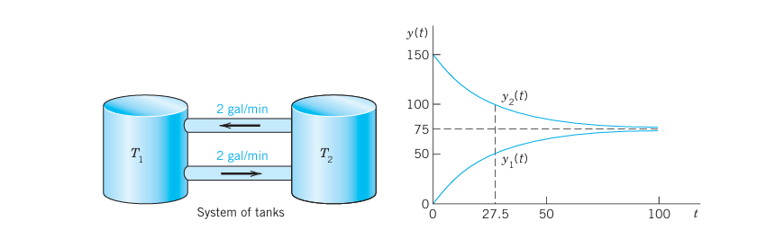{#fig-4-78}

Tanks $T_1$ and $T_2$ in @fig-4-78 contain initially 100 gal of water each. In $T_1$ the water is pure, whereas 150 lb of fertilizer are dissolved in $T_2$. By circulating liquid at a rate of 2 gal/min and stirring (to keep the mixture uniform) the amounts of fertilizer $y_1(t)$ in $T_1$ and $y_2(t)$ in $T_2$ change with time $t$. How long should we let the liquid circulate so that $T_1$ will contain at least half as much fertilizer as there will be left in $T_2$?

**Solution.**

**Step 1. Setting up the model.** As for a single tank, the time rate of change of $y_1(t)$ equals inflow minus outflow. Similarly for tank $T_2$. From @fig-4-78 we see that:
$$
\begin{aligned}
\text{Tank } T_1: \quad y'_1 &= \text{Inflow/min} - \text{Outflow/min} = 2 \frac{y_2}{100} - 2 \frac{y_1}{100} \\
\text{Tank } T_2: \quad y'_2 &= \text{Inflow/min} - \text{Outflow/min} = 2 \frac{y_1}{100} - 2 \frac{y_2}{100}
\end{aligned}
$$
Hence the mathematical model of our mixture problem is the system of first-order ODEs
$$
\begin{aligned}
\text{Tank } T_1: \quad y'_1 &= -0.02y_1 + 0.02y_2 \\
\text{Tank } T_2: \quad y'_2 &= 0.02y_1 - 0.02y_2
\end{aligned}
$$ {#eq-4-18}
As a vector equation with column vector $\mathbf{y} = \begin{bmatrix} y_1 \\ y_2 \end{bmatrix}$ and matrix $\mathbf{A}$ this becomes
$$
\mathbf{y}' = \mathbf{Ay}, \quad \text{where} \quad \mathbf{A} = \begin{bmatrix} -0.02 & 0.02 \\ 0.02 & -0.02 \end{bmatrix}
$$

**Step 2. General solution.** As for a single equation, we try an exponential function of $t$,
$$
\mathbf{y} = \mathbf{x} e^{\lambda t}, \quad \text{then} \quad \mathbf{y}' = \lambda \mathbf{x} e^{\lambda t} = \mathbf{Ax} e^{\lambda t}
$$
Dividing the last equation by $e^{\lambda t}$ and interchanging the left and right sides, we obtain
$$
\mathbf{Ax} = \lambda \mathbf{x}
$$
We need nontrivial solutions (solutions that are not identically zero). Hence we have to look for eigenvalues and eigenvectors of $\mathbf{A}$. The eigenvalues are the solutions of the characteristic equation
$$
\det(\mathbf{A} - \lambda\mathbf{I}) = \begin{vmatrix} -0.02 - \lambda & 0.02 \\ 0.02 & -0.02 - \lambda \end{vmatrix} = (-0.02 - \lambda)^2 - 0.02^2 = \lambda(\lambda + 0.04) = 0
$$ {#eq-4-19}
We see that $\lambda_1 = 0$ (which can very well happen—don't get mixed up—it is eigenvectors that must not be zero) and $\lambda_2 = -0.04$. Eigenvectors are obtained from $(\mathbf{A} - \lambda\mathbf{I})\mathbf{x} = \mathbf{0}$ as in Sec. 4.0 with $\lambda = \lambda_1$ and $\lambda = \lambda_2$. For our present $\mathbf{A}$ this gives (we need only the first equation in the system):
$$
\begin{aligned}
\text{For } \lambda_1 = 0: \quad -0.02x_1 + 0.02x_2 = 0 &\implies x_1 = x_2 \\
\text{For } \lambda_2 = -0.04: \quad (-0.02 + 0.04)x_1 + 0.02x_2 = 0 &\implies x_1 = -x_2
\end{aligned}
$$
respectively. Hence $x_1 = x_2$ and $x_1 = -x_2$, respectively, and we can take $\mathbf{x}^{(1)} = \begin{bmatrix} 1 \\ 1 \end{bmatrix}$ and $\mathbf{x}^{(2)} = \begin{bmatrix} 1 \\ -1 \end{bmatrix}$. This gives two eigenvectors corresponding to $\lambda_1$ and $\lambda_2$, respectively.

From $\mathbf{y} = \mathbf{x} e^{\lambda t}$ and the superposition principle (which continues to hold for systems of homogeneous linear ODEs) we thus obtain a solution
$$
\mathbf{y}(t) = c_1 \mathbf{x}^{(1)} e^{\lambda_1 t} + c_2 \mathbf{x}^{(2)} e^{\lambda_2 t} = c_1 \begin{bmatrix} 1 \\ 1 \end{bmatrix} + c_2 \begin{bmatrix} 1 \\ -1 \end{bmatrix} e^{-0.04t}
$$ {#eq-4-20}
where $c_1$ and $c_2$ are arbitrary constants. Later we shall call this a general solution.

**Step 3. Use of initial conditions.** The initial conditions are $y_1(0) = 0$ (no fertilizer in tank $T_1$) and $y_2(0) = 150$. From this and (@eq-4-20) with $t = 0$ we obtain
$$
\mathbf{y}(0) = c_1 \begin{bmatrix} 1 \\ 1 \end{bmatrix} + c_2 \begin{bmatrix} 1 \\ -1 \end{bmatrix} = \begin{bmatrix} c_1 + c_2 \\ c_1 - c_2 \end{bmatrix} = \begin{bmatrix} 0 \\ 150 \end{bmatrix}
$$
In components this is
$$
\begin{aligned}
c_1 + c_2 &= 0 \\
c_1 - c_2 &= 150
\end{aligned}
$$
The solution is $c_1 = 75, c_2 = -75$. This gives the answer
$$
\mathbf{y}(t) = 75 \begin{bmatrix} 1 \\ 1 \end{bmatrix} - 75 \begin{bmatrix} 1 \\ -1 \end{bmatrix} e^{-0.04t}
$$
In components,
$$
\begin{aligned}
y_1(t) &= 75 - 75e^{-0.04t} \quad \text{(Tank } T_1\text{, lower curve)} \\
y_2(t) &= 75 + 75e^{-0.04t} \quad \text{(Tank } T_2\text{, upper curve)}
\end{aligned}
$$
Figure 78 shows the exponential increase of $y_1$ and the exponential decrease of $y_2$ to the common limit 75 lb. Did you expect this for physical reasons? Can you physically explain why the curves look "symmetric"? Would the limit change if initially $T_1$ contained 100 lb of fertilizer and $T_2$ contained 50 lb?

**Step 4. Answer.** $T_1$ contains half the fertilizer amount of $T_2$ if it contains $1/3$ of the total amount, that is, 50 lb. Thus
$$
y_1(t) = 75 - 75e^{-0.04t} = 50 \implies e^{-0.04t} = \frac{1}{3} \implies t = \frac{\ln 3}{0.04} \approx 27.5 \text{ min}
$$
Hence the fluid should circulate for at least about half an hour. $\blacksquare$

### EXAMPLE 2 Electrical Network

Find the currents $I_1(t)$ and $I_2(t)$ in the network in @fig-4-79. Assume all currents and charges to be zero at $t = 0$, the instant when the switch is closed.

**Solution.**

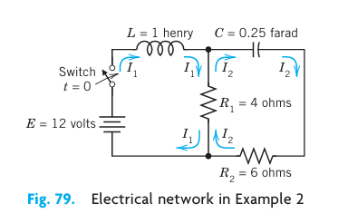{#fig-4-79}

**Step 1. Setting up the mathematical model.** The model of this network is obtained from Kirchhoff's Voltage Law, as in Sec. 2.9 (where we considered single circuits). Let $I_1(t)$ and $I_2(t)$ be the currents in the left and right loops, respectively. In the left loop, the voltage drops are over the inductor $L I'_1 = I'_1$ [V] and over the resistor $R_1(I_1 - I_2) = 4(I_1 - I_2)$ [V], the difference because $I_1$ and $I_2$ flow through the resistor in opposite directions. By Kirchhoff's Voltage Law the sum of these drops equals the voltage of the battery; that is, $I'_1 + 4(I_1 - I_2) = 12$, hence
$$
I'_1 = -4I_1 + 4I_2 + 12
$$ {#eq-4-21}
In the right loop, the voltage drops are $R_2 I_2 = 6I_2$ [V] and $R_1(I_2 - I_1) = 4(I_2 - I_1)$ [V] over the resistors and $\frac{1}{C}\int I_2 \, dt = 4\int I_2 \, dt$ [V] over the capacitor, and their sum is zero,
$$
6I_2 + 4(I_2 - I_1) + 4\int I_2 \, dt = 0
$$
or
$$
10I_2 - 4I_1 + 4\int I_2 \, dt = 0
$$
Division by 10 and differentiation gives $I'_2 - 0.4I'_1 + 0.4I_2 = 0$.

To simplify the solution process, we first get rid of $I'_1$, which by (@eq-4-21) equals $-4I_1 + 4I_2 + 12$. Substitution into the present ODE gives
$$
I'_2 - 0.4(-4I_1 + 4I_2 + 12) + 0.4I_2 = 0
$$
and by simplification
$$
I'_2 = -1.6I_1 + 1.2I_2 + 4.8
$$ {#eq-4-22}
In matrix form, (@eq-4-21) and (@eq-4-22) is (we write $\mathbf{J}$ since $\mathbf{I}$ is the unit matrix)
$$
\mathbf{J}' = \mathbf{AJ} + \mathbf{g}, \quad \text{where} \quad \mathbf{J} = \begin{bmatrix} I_1 \\ I_2 \end{bmatrix}, \quad \mathbf{A} = \begin{bmatrix} -4.0 & 4.0 \\ -1.6 & 1.2 \end{bmatrix}, \quad \mathbf{g} = \begin{bmatrix} 12.0 \\ 4.8 \end{bmatrix}
$$ {#eq-4-23}

**Step 2. Solving (@eq-4-23).** Because of the vector $\mathbf{g}$ this is a nonhomogeneous system, and we try to proceed as for a single ODE, solving first the homogeneous system $\mathbf{J}' = \mathbf{AJ}$ (thus $\mathbf{g} = \mathbf{0}$) by substituting $\mathbf{J} = \mathbf{x} e^{\lambda t}$. This gives
$$
\mathbf{J}' = \lambda \mathbf{x} e^{\lambda t} = \mathbf{Ax} e^{\lambda t}, \quad \text{hence} \quad \mathbf{Ax} = \lambda \mathbf{x}
$$
Hence, to obtain a nontrivial solution, we again need the eigenvalues and eigenvectors. For the present matrix $\mathbf{A}$ they are derived in Example 1 in Sec. 4.0:
$$
\lambda_1 = -2, \quad \mathbf{x}^{(1)} = \begin{bmatrix} 2 \\ 1 \end{bmatrix}; \quad \lambda_2 = -0.8, \quad \mathbf{x}^{(2)} = \begin{bmatrix} 1 \\ 0.8 \end{bmatrix}
$$
Hence a general solution of the homogeneous system is
$$
\mathbf{J}_h = c_1 \mathbf{x}^{(1)} e^{-2t} + c_2 \mathbf{x}^{(2)} e^{-0.8t}
$$
For a particular solution of the nonhomogeneous system (@eq-4-23), since $\mathbf{g}$ is constant, we try a constant column vector $\mathbf{J}_p = \mathbf{a}$ with components $a_1, a_2$. Then $\mathbf{J}'_p = \mathbf{0}$, and substitution into (@eq-4-23) gives $\mathbf{Aa} + \mathbf{g} = \mathbf{0}$; in components,
$$
\begin{aligned}
-4.0a_1 + 4.0a_2 + 12.0 &= 0 \\
-1.6a_1 + 1.2a_2 + 4.8 &= 0
\end{aligned}
$$
The solution is $a_1 = 3, a_2 = 0$; thus $\mathbf{a} = \begin{bmatrix} 3 \\ 0 \end{bmatrix}$. Hence
$$
\mathbf{J} = \mathbf{J}_h + \mathbf{J}_p = c_1 \mathbf{x}^{(1)} e^{-2t} + c_2 \mathbf{x}^{(2)} e^{-0.8t} + \mathbf{a}
$$
in components,
$$
\begin{aligned}
I_1(t) &= 2c_1e^{-2t} + c_2e^{-0.8t} + 3 \\
I_2(t) &= c_1e^{-2t} + 0.8c_2e^{-0.8t}
\end{aligned}
$$ {#eq-4-24}

The initial conditions give
$$
\begin{aligned}
I_1(0) &= 2c_1 + c_2 + 3 = 0 \\
I_2(0) &= c_1 + 0.8c_2 = 0
\end{aligned}
$$
Hence $c_1 = -4$ and $c_2 = 5$. As the solution of our problem we thus obtain
$$
\mathbf{J} = -4\mathbf{x}^{(1)}e^{-2t} + 5\mathbf{x}^{(2)}e^{-0.8t} + \mathbf{a}
$$
In components (cf. @fig-4-80),
$$
\begin{aligned}
I_1(t) &= -8e^{-2t} + 5e^{-0.8t} + 3 \\
I_2(t) &= -4e^{-2t} + 4e^{-0.8t}
\end{aligned}
$$ {#eq-4-25}

Now comes an important idea, on which we shall elaborate further, beginning in Sec. 4.3. @fig-4-80(a) shows $I_1(t)$ and $I_2(t)$ as two separate curves. @fig-4-80(b) shows these two currents as a single curve in the $I_1I_2$-plane. This is a parametric representation with time $t$ as the parameter. It is often important to know in which sense such a curve is traced. This can be indicated by an arrow in the sense of increasing $t$, as is shown.

The $I_1I_2$-plane is called the **phase plane** of our system (@eq-4-23), and the curve in @fig-4-80(b) is called a **trajectory**. We shall see that such "phase plane representations" are far more important than graphs as in @fig-4-80(a) because they will give a much better qualitative overall impression of the general behavior of whole families of solutions, not merely of one solution as in the present case. $\blacksquare$

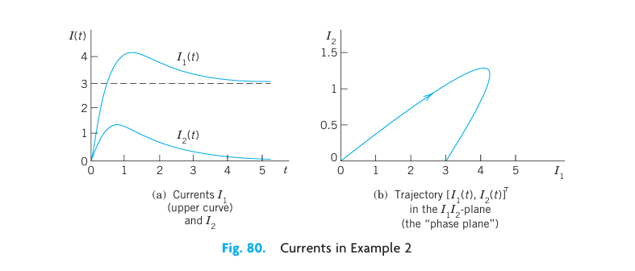{#fig-4-80}

**Remark.** In both examples, by growing the dimension of the problem (from one tank to two tanks or one circuit to two circuits) we also increased the number of ODEs (from one ODE to two ODEs). This "growth" in the problem being reflected by an "increase" in the mathematical model is attractive and affirms the quality of our mathematical modeling and theory.

### Conversion of an $n$th-Order ODE to a System

We show that an $n$th-order ODE of the general form (@eq-4-26) (see Theorem 1) can be converted to a system of $n$ first-order ODEs. This is practically and theoretically important—practically because it permits the study and solution of single ODEs by methods for systems, and theoretically because it opens a way of including the theory of higher order ODEs into that of first-order systems. This conversion is another reason for the importance of systems, in addition to their use as models in various basic applications. The idea of the conversion is simple and straightforward, as follows.

**THEOREM 1 Conversion of an ODE**

An $n$th-order ODE
$$
y^{(n)} = F(t, y, y', \dots, y^{(n-1)})
$$ {#eq-4-26}
can be converted to a system of $n$ first-order ODEs by setting
$$
y_1 = y, \quad y_2 = y', \quad y_3 = y'', \quad \dots, \quad y_n = y^{(n-1)}
$$ {#eq-4-27}
This system is of the form
$$
\begin{aligned}
y'_1 &= y_2 \\
y'_2 &= y_3 \\
&\ \ \vdots \\
y'_{n-1} &= y_n \\
y'_n &= F(t, y_1, y_2, \dots, y_n)
\end{aligned}
$$ {#eq-4-28}

**PROOF.** The first $n-1$ of these $n$ ODEs follow immediately from (@eq-4-27) by differentiation: $y'_1 = y' = y_2$, $y'_2 = y'' = y_3$, etc. Also, $y'_n = y^{(n)}$ by (@eq-4-27), so that the last equation in (@eq-4-28) results from the given ODE (@eq-4-26). $\blacksquare$

### EXAMPLE 3 Mass on a Spring

To gain confidence in the conversion method, let us apply it to an old friend of ours, modeling the free motions of a mass on a spring (see Sec. 2.4)
$$
my'' + cy' + ky = 0 \quad \text{or} \quad y'' = -\frac{c}{m}y' - \frac{k}{m}y
$$
For this ODE (@eq-4-26) the system (@eq-4-28) is linear and homogeneous,
$$
\begin{aligned}
y'_1 &= y_2 \\
y'_2 &= -\frac{k}{m}y_1 - \frac{c}{m}y_2
\end{aligned}
$$
Setting $\mathbf{y} = \begin{bmatrix} y_1 \\ y_2 \end{bmatrix}$, we get in matrix form
$$
\mathbf{y}' = \mathbf{Ay} = \begin{bmatrix} 0 & 1 \\ -k/m & -c/m \end{bmatrix} \mathbf{y}
$$ {#eq-4-29}
The characteristic equation is
$$
\det(\mathbf{A} - \lambda\mathbf{I}) = \begin{vmatrix} -\lambda & 1 \\ -k/m & -c/m - \lambda \end{vmatrix} = \lambda^2 + \frac{c}{m}\lambda + \frac{k}{m} = 0
$$
It agrees with that in Sec. 2.4. For an illustrative computation, let $m = 1$, $c = 2$, and $k = 0.75$. Then
$$
\lambda^2 + 2\lambda + 0.75 = (\lambda + 0.5)(\lambda + 1.5) = 0
$$
This gives the eigenvalues $\lambda_1 = -0.5$ and $\lambda_2 = -1.5$. Eigenvectors follow from the first equation in $(\mathbf{A} - \lambda\mathbf{I})\mathbf{x} = \mathbf{0}$, which is $(-\lambda)x_1 + x_2 = 0$. For $\lambda = \lambda_1 = -0.5$ this gives $0.5x_1 + x_2 = 0$, say, $\mathbf{x}^{(1)} = \begin{bmatrix} 2 \\ -1 \end{bmatrix}$. For $\lambda = \lambda_2 = -1.5$ it gives $1.5x_1 + x_2 = 0$, say, $\mathbf{x}^{(2)} = \begin{bmatrix} 1 \\ -1.5 \end{bmatrix}$. These eigenvectors give
$$
\mathbf{y} = c_1 \begin{bmatrix} 2 \\ -1 \end{bmatrix} e^{-0.5t} + c_2 \begin{bmatrix} 1 \\ -1.5 \end{bmatrix} e^{-1.5t}
$$
This vector solution has the first component
$$
y = y_1 = 2c_1e^{-0.5t} + c_2e^{-1.5t}
$$
which is the expected solution. The second component is its derivative
$$
y_2 = y'_1 = y' = -c_1e^{-0.5t} - 1.5c_2e^{-1.5t}
$$ $\blacksquare$

## PROBLEM SET 4.1 {#sec-4-1-problems}

### 1–6 MIXING PROBLEMS
1. Find out, without calculation, whether doubling the flow rate in Example 1 has the same effect as halving the tank sizes. (Give a reason.)
2. What happens in Example 1 if we replace $T_1$ by a tank containing 200 gal of water and 150 lb of fertilizer dissolved in it?
3. Derive the eigenvectors in Example 1 without consulting this book.
4. In Example 1 find a "general solution" for any ratio $a = \text{(flow rate)}/\text{(tank size)}$, tank sizes being equal. Comment on the result.
5. If you extend Example 1 by a tank $T_3$ of the same size as the others and connected to $T_1$ and $T_2$ by two tubes with flow rates as between $T_1$ and $T_2$, what system of ODEs will you get?
6. Find a "general solution" of the system in Prob. 5.

### 7–9 ELECTRICAL NETWORK
In Example 2 find the currents:
7. If the initial currents are 0 A and $-3$ A (minus meaning that $I_2$ flows against the direction of the arrow).
8. If the capacitance is changed to $C = 5/27$ F. (General solution only.)
9. If the initial currents in Example 2 are 28 A and 14 A.

### 10–13 CONVERSION TO SYSTEMS
Find a general solution of the given ODE (a) by first converting it to a system, (b) as given. Show the details of your work.
10. $y'' + 3y' + 2y = 0$
11. $4y'' - 15y' - 4y = 0$
12. $y''' + 2y'' - y' - 2y = 0$
13. $y'' + 2y' - 24y = 0$

### 14 TEAM PROJECT. Two Masses on Springs.
(a) Set up the model for the (undamped) system in @fig-4-81.
(b) Solve the system of ODEs obtained. *Hint.* Try $\mathbf{y} = \mathbf{x} e^{vt}$ and set $v^2 = \lambda$. Proceed as in Example 1 or 2.
(c) Describe the influence of initial conditions on the possible kind of motions.

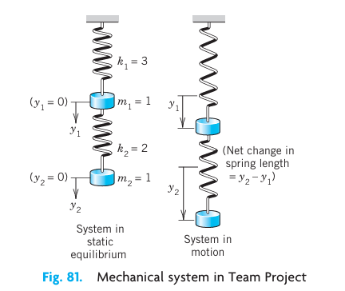{#fig-4-81}

### 15 CAS EXPERIMENT. Electrical Network.
(a) In Example 2 choose a sequence of values of $C$ that increases beyond bound, and compare the corresponding sequences of eigenvalues of $\mathbf{A}$. What limits of these sequences do your numeric values (approximately) suggest?
(b) Find these limits analytically.
(c) Explain your result physically.
(d) Below what value (approximately) must you decrease $C$ to get vibrations?

## 4.2 Basic Theory of Systems of ODEs. Wronskian {#sec-4-2}

In this section we discuss some basic concepts and facts about systems of ODEs that are quite similar to those for single ODEs.

The first-order systems in the last section were special cases of the more general system
$$
\begin{aligned}
y'_1 &= f_1(t, y_1, \dots, y_n) \\
y'_2 &= f_2(t, y_1, \dots, y_n) \\
&\ \ \vdots \\
y'_n &= f_n(t, y_1, \dots, y_n)
\end{aligned}
$$
We can write this system as a vector equation by introducing the column vectors $\mathbf{y} = [y_1\ \ \dots\ \ y_n]^T$ and $\mathbf{f} = [f_1\ \ \dots\ \ f_n]^T$ (where $T$ means transposition and saves us the space that would be needed for writing $\mathbf{y}$ and $\mathbf{f}$ as columns). This gives
$$
\mathbf{y}' = \mathbf{f}(t, \mathbf{y})
$$ {#eq-4-30}
This system (@eq-4-30) includes almost all cases of practical interest. For $n = 1$ it becomes $y'_1 = f_1(t, y_1)$ or, simply, $y' = f(t, y)$, well known to us from Chap. 1.

A **solution** of (@eq-4-30) on some interval $a < t < b$ is a set of $n$ differentiable functions $y_1 = h_1(t), \dots, y_n = h_n(t)$ on that interval that satisfy (@eq-4-30) throughout this interval. In vector form, introducing the "solution vector" $\mathbf{h} = [h_1\ \ \dots\ \ h_n]^T$ (a column vector!) we can write $\mathbf{y} = \mathbf{h}(t)$.

An **initial value problem** for (@eq-4-30) consists of (@eq-4-30) and $n$ given initial conditions
$$
y_1(t_0) = K_1, \quad y_2(t_0) = K_2, \quad \dots, \quad y_n(t_0) = K_n
$$ {#eq-4-31}
in vector form, $\mathbf{y}(t_0) = \mathbf{K}$, where $t_0$ is a specified value of $t$ in the interval considered and the components of $\mathbf{K} = [K_1\ \ \dots\ \ K_n]^T$ are given numbers. Sufficient conditions for the existence and uniqueness of a solution of an initial value problem (@eq-4-30), (@eq-4-31) are stated in the following theorem, which extends the theorems in Sec. 1.7 for a single equation. (For a proof, see Ref. [A7].)

**THEOREM 1 Existence and Uniqueness Theorem**
Let $f_1, \dots, f_n$ in (@eq-4-30) be continuous functions having continuous partial derivatives $\partial f_1/\partial y_1, \dots, \partial f_1/\partial y_n, \dots, \partial f_n/\partial y_n$ in some domain $R$ of $t y_1 y_2 \dots y_n$-space containing the point $(t_0, K_1, \dots, K_n)$. Then (@eq-4-30) has a solution on some interval $t_0 - \alpha < t < t_0 + \alpha$ satisfying the initial conditions, and this solution is unique.

### Linear Systems

Extending the notion of a linear ODE, we call (@eq-4-30) a **linear system** if it is linear in $y_1, \dots, y_n$, that is, if it can be written
$$
\begin{aligned}
y'_1 &= a_{11}(t)y_1 + \dots + a_{1n}(t)y_n + g_1(t) \\
&\ \ \vdots \\
y'_n &= a_{n1}(t)y_1 + \dots + a_{nn}(t)y_n + g_n(t)
\end{aligned}
$$
As a vector equation this becomes
$$
\mathbf{y}' = \mathbf{A}(t)\mathbf{y} + \mathbf{g}(t)
$$ {#eq-4-32}
where
$$
\mathbf{A} = \begin{bmatrix} a_{11} & \dots & a_{1n} \\ \vdots & \ddots & \vdots \\ a_{n1} & \dots & a_{nn} \end{bmatrix}, \quad \mathbf{y} = \begin{bmatrix} y_1 \\ \vdots \\ y_n \end{bmatrix}, \quad \mathbf{g} = \begin{bmatrix} g_1 \\ \vdots \\ g_n \end{bmatrix}
$$
This system is called **homogeneous** if $\mathbf{g}(t) = \mathbf{0}$, so that it is
$$
\mathbf{y}' = \mathbf{A}(t)\mathbf{y}
$$ {#eq-4-33}
If $\mathbf{g}(t) \neq \mathbf{0}$, then (@eq-4-32) is called **nonhomogeneous**. For example, the systems in Examples 1 and 3 of Sec. 4.1 are homogeneous. The system in Example 2 of that section is nonhomogeneous.

For a linear system (@eq-4-32) we have $\partial f_j/\partial y_k = a_{jk}(t)$ in Theorem 1. Hence for a linear system we simply obtain the following.

**THEOREM 2 Existence and Uniqueness in the Linear Case**
Let the $a_{jk}$'s and $g_j$'s in (@eq-4-32) be continuous functions of $t$ on an open interval $a < t < b$ containing the point $t_0$. Then (@eq-4-32) has a solution $\mathbf{y}(t)$ on this interval satisfying the initial conditions, and this solution is unique.

As for a single homogeneous linear ODE we have:

**THEOREM 3 Superposition Principle or Linearity Principle**
If $\mathbf{y}^{(1)}$ and $\mathbf{y}^{(2)}$ are solutions of the homogeneous linear system (@eq-4-33) on some interval, so is any linear combination $\mathbf{y} = c_1 \mathbf{y}^{(1)} + c_2 \mathbf{y}^{(2)}$.

**PROOF.** Differentiating and using (@eq-4-33), we obtain
$$
\mathbf{y}' = [c_1 \mathbf{y}^{(1)} + c_2 \mathbf{y}^{(2)}]' = c_1 \mathbf{y}^{(1)\prime} + c_2 \mathbf{y}^{(2)\prime} = c_1 \mathbf{A}\mathbf{y}^{(1)} + c_2 \mathbf{A}\mathbf{y}^{(2)} = \mathbf{A}(c_1 \mathbf{y}^{(1)} + c_2 \mathbf{y}^{(2)}) = \mathbf{A}\mathbf{y}
$$ $\blacksquare$

### Basis. General Solution. Wronskian

The general theory of linear systems of ODEs is quite similar to that of a single linear ODE in Secs. 2.6 and 2.7. To see this, we explain the most basic concepts and facts. For proofs we refer to more advanced texts, such as [A7].

By a **basis** or a **fundamental system** of solutions of the homogeneous system (@eq-4-33) on some interval $J$ we mean a linearly independent set of $n$ solutions of (@eq-4-33) on that interval. (We write $J$ because we need $I$ to denote the unit matrix.) We call a corresponding linear combination
$$
\mathbf{y} = c_1 \mathbf{y}^{(1)} + \dots + c_n \mathbf{y}^{(n)} \quad (c_1, \dots, c_n \text{ arbitrary})
$$ {#eq-4-34}
a **general solution** of (@eq-4-33) on $J$. It can be shown that if the $a_{jk}(t)$ in (@eq-4-33) are continuous on $J$, then (@eq-4-33) has a basis of solutions on $J$, hence a general solution, which includes every solution of (@eq-4-33) on $J$.

We can write $n$ solutions $\mathbf{y}^{(1)}, \dots, \mathbf{y}^{(n)}$ of (@eq-4-33) on some interval $J$ as columns of an $n \times n$ matrix
$$
\mathbf{Y} = \begin{bmatrix} \mathbf{y}^{(1)} & \dots & \mathbf{y}^{(n)} \end{bmatrix}
$$ {#eq-4-35}
The determinant of $\mathbf{Y}$ is called the **Wronskian** of $\mathbf{y}^{(1)}, \dots, \mathbf{y}^{(n)}$, written
$$
W(\mathbf{y}^{(1)}, \dots, \mathbf{y}^{(n)}) = \begin{vmatrix}
y_1^{(1)} & y_1^{(2)} & \dots & y_1^{(n)} \\
y_2^{(1)} & y_2^{(2)} & \dots & y_2^{(n)} \\
\vdots & \vdots & \ddots & \vdots \\
y_n^{(1)} & y_n^{(2)} & \dots & y_n^{(n)}
\end{vmatrix}
$$ {#eq-4-36}
The columns are these solutions, each in terms of components. These solutions form a basis on $J$ if and only if $W$ is not zero at any $t_1$ in this interval. $W$ is either identically zero or nowhere zero in $J$. (This is similar to Secs. 2.6 and 3.1.)

If the solutions in (@eq-4-34) form a basis (a fundamental system), then (@eq-4-35) is often called a **fundamental matrix**. Introducing a column vector $\mathbf{c} = [c_1\ \ \dots\ \ c_n]^T$, we can now write (@eq-4-34) simply as
$$
\mathbf{y} = \mathbf{Y}\mathbf{c}
$$ {#eq-4-37}
Furthermore, we can relate (@eq-4-36) to Sec. 2.6, as follows. If $y$ and $z$ are solutions of a second-order homogeneous linear ODE, their Wronskian is
$$
W(y, z) = \begin{vmatrix} y & z \\ y' & z' \end{vmatrix}
$$
To write this ODE as a system, we have to set $y = y_1, y' = y'_1 = y_2$, and similarly for $z$ (see Sec. 4.1). But then $W(y, z)$ becomes (@eq-4-36), except for notation.

## 4.3 Constant-Coefficient Systems. Phase Plane Method {#sec-4-3}

Continuing, we now assume that our homogeneous linear system
$$
\mathbf{y}' = \mathbf{A}\mathbf{y}
$$ {#eq-4-38}
under discussion has constant coefficients, so that the $n \times n$ matrix $\mathbf{A} = [a_{jk}]$ has entries not depending on $t$. We want to solve (@eq-4-38). Now a single ODE $y' = ky$ has the solution $y = C e^{kt}$. So let us try
$$
\mathbf{y} = \mathbf{x} e^{\lambda t}
$$ {#eq-4-39}
Substitution into (@eq-4-38) gives $\lambda \mathbf{x} e^{\lambda t} = \mathbf{Ax} e^{\lambda t}$. Dividing by $e^{\lambda t}$, we obtain the eigenvalue problem
$$
\mathbf{A}\mathbf{x} = \lambda \mathbf{x}
$$ {#eq-4-40}
Thus the nontrivial solutions of (@eq-4-38) (solutions that are not zero vectors) are of the form (@eq-4-39), where $\lambda$ is an eigenvalue of $\mathbf{A}$ and $\mathbf{x}$ is a corresponding eigenvector.

We assume that $\mathbf{A}$ has a linearly independent set of $n$ eigenvectors. This holds in most applications, in particular if $\mathbf{A}$ is symmetric or skew-symmetric ($\mathbf{A}^T = -\mathbf{A}$) or has $n$ different eigenvalues.

Let those eigenvectors be $\mathbf{x}^{(1)}, \dots, \mathbf{x}^{(n)}$ and let them correspond to eigenvalues $\lambda_1, \dots, \lambda_n$ (which may be all different, or some—or even all—may be equal). Then the corresponding solutions (@eq-4-39) are
$$
\mathbf{y}^{(1)} = \mathbf{x}^{(1)} e^{\lambda_1 t}, \quad \dots, \quad \mathbf{y}^{(n)} = \mathbf{x}^{(n)} e^{\lambda_n t}
$$ {#eq-4-41}
Their Wronskian $W = W(\mathbf{y}^{(1)}, \dots, \mathbf{y}^{(n)})$ is given by
$$
W = \begin{vmatrix}
x_1^{(1)} e^{\lambda_1 t} & \dots & x_1^{(n)} e^{\lambda_n t} \\
x_2^{(1)} e^{\lambda_1 t} & \dots & x_2^{(n)} e^{\lambda_n t} \\
\vdots & \ddots & \vdots \\
x_n^{(1)} e^{\lambda_1 t} & \dots & x_n^{(n)} e^{\lambda_n t}
\end{vmatrix} = e^{(\lambda_1 + \dots + \lambda_n)t} \begin{vmatrix}
x_1^{(1)} & \dots & x_1^{(n)} \\
x_2^{(1)} & \dots & x_2^{(n)} \\
\vdots & \ddots & \vdots \\
x_n^{(1)} & \dots & x_n^{(n)}
\end{vmatrix}
$$
On the right, the exponential function is never zero, and the determinant is not zero either because its columns are the $n$ linearly independent eigenvectors. This proves the following theorem, whose assumption is true if the matrix $\mathbf{A}$ is symmetric or skew-symmetric, or if the $n$ eigenvalues of $\mathbf{A}$ are all different.

**THEOREM 1 General Solution**
If the constant matrix $\mathbf{A}$ in the system (@eq-4-38) has a linearly independent set of $n$ eigenvectors, then the corresponding solutions in (@eq-4-41) form a basis of solutions of (@eq-4-38), and the corresponding general solution is
$$
\mathbf{y} = c_1 \mathbf{x}^{(1)} e^{\lambda_1 t} + \dots + c_n \mathbf{x}^{(n)} e^{\lambda_n t}
$$ {#eq-4-42}

### How to Graph Solutions in the Phase Plane

We shall now concentrate on systems (@eq-4-38) with constant coefficients consisting of two ODEs
$$
\mathbf{y}' = \mathbf{A}\mathbf{y}; \quad \text{in components,} \quad \begin{aligned} y'_1 &= a_{11} y_1 + a_{12} y_2 \\ y'_2 &= a_{21} y_1 + a_{22} y_2 \end{aligned}
$$
Of course, we can graph solutions of this system,
$$
\mathbf{y}(t) = \begin{bmatrix} y_1(t) \\ y_2(t) \end{bmatrix}
$$
as two curves over the $t$-axis, one for each component of $\mathbf{y}(t)$. (@fig-4-80(a) in Sec. 4.1 shows an example.) But we can also graph them as a single curve in the $y_1 y_2$-plane. This is a parametric representation (parametric equation) with parameter $t$. (See @fig-4-80(b) for an example. Many more follow. Parametric equations also occur in calculus.) Such a curve is called a **trajectory** (or sometimes an orbit or path) of the system. The $y_1 y_2$-plane is called the **phase plane**.^1^ If we fill the phase plane with trajectories, we obtain the so-called **phase portrait** of the system.

Studies of solutions in the phase plane have become quite important, along with advances in computer graphics, because a phase portrait gives a good general qualitative impression of the entire family of solutions. Consider the following example, in which we develop such a phase portrait.

> ^1^ A name that comes from physics, where it is the $y$-$(mv)$-plane, used to plot a motion in terms of position $y$ and velocity $y' = v$ ($m = \text{mass}$); but the name is now used quite generally for the $y_1 y_2$-plane. The use of the phase plane is a qualitative method, a method of obtaining general qualitative information on solutions without actually solving an ODE or a system. This method was created by HENRI POINCARÉ (1854–1912), a great French mathematician, whose work was also fundamental in complex analysis, divergent series, topology, and astronomy.

### EXAMPLE 1 Trajectories in the Phase Plane (Phase Portrait)

Find and graph solutions of the system
$$
\mathbf{y}' = \mathbf{A}\mathbf{y} = \begin{bmatrix} -3 & 1 \\ 1 & -3 \end{bmatrix} \mathbf{y}, \quad \text{thus} \quad \begin{aligned} y'_1 &= -3y_1 + y_2 \\ y'_2 &= y_1 - 3y_2 \end{aligned}
$$ {#eq-4-43}

**Solution.** By substituting $\mathbf{y} = \mathbf{x} e^{\lambda t}$ and $\mathbf{y}' = \lambda \mathbf{x} e^{\lambda t}$ and dropping the exponential function we get $\mathbf{Ax} = \lambda \mathbf{x}$. The characteristic equation is
$$
\det(\mathbf{A} - \lambda\mathbf{I}) = \begin{vmatrix} -3 - \lambda & 1 \\ 1 & -3 - \lambda \end{vmatrix} = \lambda^2 + 6\lambda + 8 = 0
$$
This gives the eigenvalues $\lambda_1 = -2$ and $\lambda_2 = -4$. Eigenvectors are then obtained from $(\mathbf{A} - \lambda\mathbf{I})\mathbf{x} = \mathbf{0}$.

For $\lambda_1 = -2$ this is $-x_1 + x_2 = 0$. Hence we can take $\mathbf{x}^{(1)} = [1\ \ 1]^T$.

For $\lambda_2 = -4$ this becomes $x_1 + x_2 = 0$, and an eigenvector is $\mathbf{x}^{(2)} = [1\ \ -1]^T$. This gives the general solution
$$
\mathbf{y} = \begin{bmatrix} y_1 \\ y_2 \end{bmatrix} = c_1 \mathbf{y}^{(1)} + c_2 \mathbf{y}^{(2)} = c_1 \begin{bmatrix} 1 \\ 1 \end{bmatrix} e^{-2t} + c_2 \begin{bmatrix} 1 \\ -1 \end{bmatrix} e^{-4t}
$$ {#eq-4-44}
@fig-4-82 shows a phase portrait of some of the trajectories (to which more trajectories could be added if so desired). The two straight trajectories correspond to $c_2 = 0$ and $c_1 = 0$, and the others to other choices of $c_1, c_2$.

The method of the phase plane is particularly valuable in the frequent cases when solving an ODE or a system is inconvenient or impossible. $\blacksquare$

### Critical Points of the System

The point $\mathbf{y} = \mathbf{0}$ in @fig-4-82 seems to be a common point of all trajectories, and we want to explore the reason for this remarkable observation. The answer will follow by calculus. Indeed, from our system we obtain
$$
\frac{dy_2}{dy_1} = \frac{y'_2}{y'_1} = \frac{a_{21}y_1 + a_{22}y_2}{a_{11}y_1 + a_{12}y_2}
$$ {#eq-4-45}
This associates with every point $P : (y_1, y_2)$ a unique tangent direction $dy_2/dy_1$ of the trajectory passing through $P$, except for the point $P_0 : (0,0)$, where the right side of (@eq-4-45) becomes $0/0$. This point $P_0$, at which $dy_2/dy_1$ becomes undetermined, is called a **critical point** of the system.

### Five Types of Critical Points

There are five types of critical points depending on the geometric shape of the trajectories near them. They are called **improper nodes**, **proper nodes**, **saddle points**, **centers**, and **spiral points**. We define and illustrate them in Examples 1–5.

### EXAMPLE 1 (Continued) Improper Node

An **improper node** is a critical point at which all the trajectories, except for two of them, have the same limiting direction of the tangent at the critical point. The two exceptional trajectories also have a limiting direction of the tangent at $P_0$ which, however, is different.

The system (@eq-4-43) has an improper node at $0$, as its phase portrait @fig-4-82 shows. The common limiting direction at $0$ is that of the eigenvector $\mathbf{x}^{(1)} = [1\ \ 1]^T$ because $e^{-4t}$ goes to zero faster than $e^{-2t}$ as $t$ increases. The two exceptional limiting tangent directions are those of $\mathbf{x}^{(2)} = [1\ \ -1]^T$ and $-\mathbf{x}^{(2)} = [-1\ \ 1]^T$. $\blacksquare$

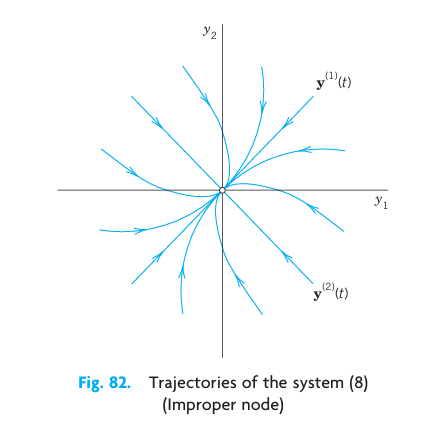{#fig-4-82}

### EXAMPLE 2 Proper Node

A **proper node** is a critical point at which every trajectory has a definite limiting direction and for any given direction $d$ at $P_0$ there is a trajectory having $d$ as its limiting direction.

The system
$$
\mathbf{y}' = \begin{bmatrix} 1 & 0 \\ 0 & 1 \end{bmatrix} \mathbf{y}, \quad \text{thus} \quad \begin{aligned} y'_1 &= y_1 \\ y'_2 &= y_2 \end{aligned}
$$ {#eq-4-46}
has a proper node at the origin (see @fig-4-83). Indeed, the matrix is the unit matrix. Its characteristic equation has the double root $\lambda = 1$. Any $\mathbf{x} \neq \mathbf{0}$ is an eigenvector, and we can take $\mathbf{x}^{(1)} = [1\ \ 0]^T$ and $\mathbf{x}^{(2)} = [0\ \ 1]^T$. Hence a general solution is
$$
\mathbf{y} = c_1 \begin{bmatrix} 1 \\ 0 \end{bmatrix} e^t + c_2 \begin{bmatrix} 0 \\ 1 \end{bmatrix} e^t \quad \text{or} \quad \begin{aligned} y_1 &= c_1 e^t \\ y_2 &= c_2 e^t \end{aligned} \quad \text{or} \quad c_1 y_2 = c_2 y_1
$$ $\blacksquare$

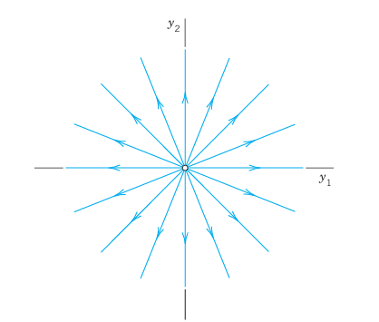{#fig-4-83}

### EXAMPLE 3 Saddle Point

A **saddle point** is a critical point at which there are two incoming trajectories, two outgoing trajectories, and all the other trajectories in a neighborhood of $P_0$ bypass $P_0$.

The system
$$
\mathbf{y}' = \begin{bmatrix} 1 & 0 \\ 0 & -1 \end{bmatrix} \mathbf{y}, \quad \text{thus} \quad \begin{aligned} y'_1 &= y_1 \\ y'_2 &= -y_2 \end{aligned}
$$ {#eq-4-47}
has a saddle point at the origin. Its characteristic equation has the roots $\lambda_1 = 1$ and $\lambda_2 = -1$. For $\lambda_1 = 1$ an eigenvector is $\mathbf{x}^{(1)} = [1\ \ 0]^T$. For $\lambda_2 = -1$ an eigenvector is $\mathbf{x}^{(2)} = [0\ \ 1]^T$. Hence a general solution is
$$
\mathbf{y} = c_1 \begin{bmatrix} 1 \\ 0 \end{bmatrix} e^t + c_2 \begin{bmatrix} 0 \\ 1 \end{bmatrix} e^{-t} \quad \text{or} \quad \begin{aligned} y_1 &= c_1 e^t \\ y_2 &= c_2 e^{-t} \end{aligned} \quad \text{or} \quad y_1 y_2 = \text{const}
$$
This is a family of hyperbolas (and the coordinate axes); see @fig-4-84. $\blacksquare$

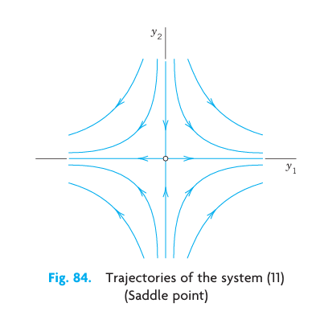{#fig-4-84}

### EXAMPLE 4 Center

A **center** is a critical point that is enclosed by infinitely many closed trajectories.

The system
$$
\mathbf{y}' = \begin{bmatrix} 0 & 1 \\ -4 & 0 \end{bmatrix} \mathbf{y}, \quad \text{thus} \quad \begin{aligned} y'_1 &= y_2 \\ y'_2 &= -4y_1 \end{aligned}
$$ {#eq-4-48}
has a center at the origin. The characteristic equation gives the eigenvalues $\lambda = \pm 2i$. For $\lambda_1 = 2i$ an eigenvector follows from the first equation of $(\mathbf{A} - \lambda\mathbf{I})\mathbf{x} = \mathbf{0}$, say, $\mathbf{x}^{(1)} = [1\ \ 2i]^T$. For $\lambda_2 = -2i$ that equation gives, say, $\mathbf{x}^{(2)} = [1\ \ -2i]^T$. Hence a complex general solution is
$$
\mathbf{y} = c_1 \begin{bmatrix} 1 \\ 2i \end{bmatrix} e^{2it} + c_2 \begin{bmatrix} 1 \\ -2i \end{bmatrix} e^{-2it}, \quad \text{thus} \quad \begin{aligned} y_1 &= c_1 e^{2it} + c_2 e^{-2it} \\ y_2 &= 2i c_1 e^{2it} - 2i c_2 e^{-2it} \end{aligned}
$$
A real solution is obtained by the Euler formula or directly from the system by a trick. Namely, the left side of (a) times the right side of (b) is $-4y_1 y'_1$. This must equal the left side of (b) times the right side of (a). Thus, $-4y_1 y'_1 = y_2 y'_2$. By integration, $2y_1^2 + \frac{1}{2}y_2^2 = \text{const}$. This is a family of ellipses (see @fig-4-85) enclosing the center at the origin. $\blacksquare$

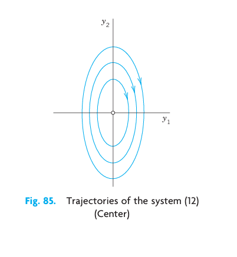{#fig-4-85}

### EXAMPLE 5 Spiral Point

A **spiral point** is a critical point about which the trajectories spiral, approaching $P_0$ as $t \to \infty$ (or tracing these spirals in the opposite sense, away from $P_0$).

The system
$$
\mathbf{y}' = \begin{bmatrix} -1 & 1 \\ -1 & -1 \end{bmatrix} \mathbf{y}, \quad \text{thus} \quad \begin{aligned} y'_1 &= -y_1 + y_2 \\ y'_2 &= -y_1 - y_2 \end{aligned}
$$ {#eq-4-49}
has a spiral point at the origin, as we shall see. The characteristic equation is $\lambda^2 + 2\lambda + 2 = 0$. It gives the eigenvalues $\lambda_1 = -1 + i$ and $\lambda_2 = -1 - i$. Corresponding eigenvectors are obtained from $(\mathbf{A} - \lambda\mathbf{I})\mathbf{x} = \mathbf{0}$. For $\lambda_1 = -1 + i$ this becomes $-ix_1 + x_2 = 0$ and we can take $\mathbf{x}^{(1)} = [1\ \ i]^T$ as an eigenvector. Similarly, an eigenvector corresponding to $\lambda_2 = -1 - i$ is $\mathbf{x}^{(2)} = [1\ \ -i]^T$. This gives the complex general solution
$$
\mathbf{y} = c_1 \begin{bmatrix} 1 \\ i \end{bmatrix} e^{(-1+i)t} + c_2 \begin{bmatrix} 1 \\ -i \end{bmatrix} e^{(-1-i)t}
$$
The next step would be the transformation of this complex solution to a real general solution by the Euler formula. But, as in the last example, we just wanted to see what eigenvalues to expect in the case of a spiral point. Accordingly, we start again from the beginning and instead of that rather lengthy systematic calculation we use a shortcut. We multiply the first equation in (@eq-4-49) by $y_1$, the second by $y_2$, and add, obtaining
$$
y_1 y'_1 + y_2 y'_2 = -(y_1^2 + y_2^2)
$$
We now introduce polar coordinates $r, \theta$, where $r^2 = y_1^2 + y_2^2$. Differentiating this with respect to $t$ gives $2r r' = 2y_1 y'_1 + 2y_2 y'_2$. Hence the previous equation can be written
$$
r r' = -r^2, \quad \text{Thus,} \quad r' = -r, \quad \frac{dr}{r} = -dt, \quad \ln |r| = -t + c^*, \quad r = c e^{-t}
$$
For each real $c$ this is a spiral, as claimed (see @fig-4-86). $\blacksquare$

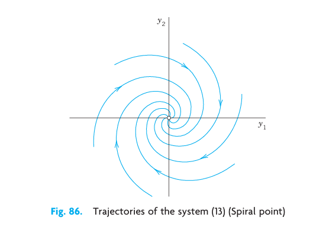{#fig-4-86}

### EXAMPLE 6 No Basis of Eigenvectors Available. Degenerate Node

This cannot happen if $\mathbf{A}$ in (@eq-4-38) is symmetric ($a_{kj} = a_{jk}$, as in Examples 1–3) or skew-symmetric ($a_{kj} = -a_{jk}$ thus $a_{jj} = 0$). And it does not happen in many other cases (see Examples 4 and 5). Hence it suffices to explain the method to be used by an example.

Find and graph a general solution of
$$
\mathbf{y}' = \mathbf{A}\mathbf{y} = \begin{bmatrix} 4 & 1 \\ -1 & 2 \end{bmatrix} \mathbf{y}
$$ {#eq-4-50}

**Solution.** $\mathbf{A}$ is not symmetric! Its characteristic equation is
$$
\det(\mathbf{A} - \lambda\mathbf{I}) = \begin{vmatrix} 4 - \lambda & 1 \\ -1 & 2 - \lambda \end{vmatrix} = \lambda^2 - 6\lambda + 9 = (\lambda - 3)^2 = 0
$$
It has a double root $\lambda = 3$. Hence eigenvectors are obtained from $(\mathbf{A} - 3\mathbf{I})\mathbf{x} = \mathbf{0}$, thus from
$$
(4 - 3)x_1 + x_2 = x_1 + x_2 = 0
$$
say, $\mathbf{x} = [1\ \ -1]^T$ and nonzero multiples of it (which do not help). The method now is to substitute
$$
\mathbf{y}^{(2)} = \mathbf{x} t e^{\lambda t} + \mathbf{u} e^{\lambda t}
$$
with constant $\mathbf{u} = [u_1\ \ u_2]^T$ into (@eq-4-50). (The $\mathbf{x}te^{\lambda t}$-term alone, the analog of what we did in Sec. 2.2 in the case of a double root, would not be enough. Try it.) This gives
$$
\mathbf{y}^{(2)\prime} = \mathbf{x} e^{\lambda t} + \lambda \mathbf{x} t e^{\lambda t} + \lambda \mathbf{u} e^{\lambda t} = \mathbf{A}\mathbf{y}^{(2)} = \mathbf{A}\mathbf{x} t e^{\lambda t} + \mathbf{A}\mathbf{u} e^{\lambda t}
$$
On the right, $\mathbf{A}\mathbf{x} = \lambda \mathbf{x}$. Hence the $t e^{\lambda t}$-terms cancel, and then division by $e^{\lambda t}$ gives
$$
\mathbf{x} + \lambda \mathbf{u} = \mathbf{A}\mathbf{u}, \quad \text{thus} \quad (\mathbf{A} - \lambda \mathbf{I})\mathbf{u} = \mathbf{x}
$$
Here $\lambda = 3$ and $\mathbf{x} = [1\ \ -1]^T$, so that
$$
(\mathbf{A} - 3\mathbf{I})\mathbf{u} = \begin{bmatrix} 4 - 3 & 1 \\ -1 & 2 - 3 \end{bmatrix} \begin{bmatrix} u_1 \\ u_2 \end{bmatrix} = \begin{bmatrix} 1 & 1 \\ -1 & -1 \end{bmatrix} \begin{bmatrix} u_1 \\ u_2 \end{bmatrix} = \begin{bmatrix} 1 \\ -1 \end{bmatrix}
$$
thus
$$
\begin{aligned}
u_1 + u_2 &= 1 \\
-u_1 - u_2 &= -1
\end{aligned}
$$
A solution is $u_1 = 0, u_2 = 1$, so that $\mathbf{u} = [0\ \ 1]^T$. A solution, linearly independent of $\mathbf{y}^{(1)}$, is $\mathbf{y}^{(2)} = \left(\mathbf{x} t + \mathbf{u}\right) e^{3t}$. This yields the answer (cf. @fig-4-87):
$$
\mathbf{y} = c_1 \mathbf{y}^{(1)} + c_2 \mathbf{y}^{(2)} = c_1 \begin{bmatrix} 1 \\ -1 \end{bmatrix} e^{3t} + c_2 \left( \begin{bmatrix} 1 \\ -1 \end{bmatrix} t + \begin{bmatrix} 0 \\ 1 \end{bmatrix} \right) e^{3t}
$$ {#eq-4-51}
The critical point at the origin is often called a **degenerate node**. $c_1 \mathbf{y}^{(1)}$ gives the heavy straight line, with $c_1 > 0$ the lower part and $c_1 < 0$ the upper part of it. $c_2 \mathbf{y}^{(2)}$ gives the right part of the heavy curve from $0$ through the second, first, and—finally—fourth quadrants. $-c_2 \mathbf{y}^{(2)}$ gives the other part of that curve. $\blacksquare$

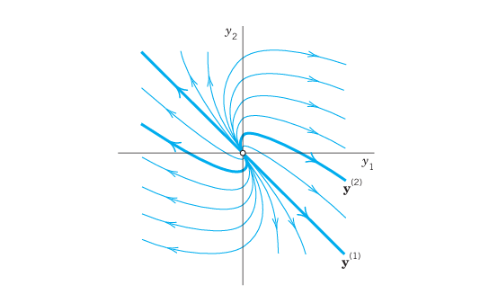{#fig-4-87}

We mention that for a system (@eq-4-38) with three or more equations and a triple eigenvalue $\lambda$ with only one linearly independent eigenvector, one will get two solutions, as just discussed, and a third linearly independent one from
$$
\mathbf{y}^{(3)} = \left( \frac{1}{2} \mathbf{x} t^2 + \mathbf{u} t + \mathbf{v} \right) e^{\lambda t}
$$
with $\mathbf{v}$ from $\mathbf{u} + \lambda \mathbf{v} = \mathbf{A}\mathbf{v}$.

## PROBLEM SET 4.3 {#sec-4-3-problems}

### 1–9 GENERAL SOLUTION
Find a real general solution of the following systems. Show the details.
1. $\begin{aligned} y'_1 &= y_1 + 2y_2 \\ y'_2 &= \frac{1}{2}y_1 + y_2 \end{aligned}$
2. $\begin{aligned} y'_1 &= 6y_1 + 9y_2 \\ y'_2 &= y_1 + 6y_2 \end{aligned}$
3. $\begin{aligned} y'_1 &= y_1 + y_2 \\ y'_2 &= y_1 - y_2 \end{aligned}$
4. $\begin{aligned} y'_1 &= -8y_1 - 2y_2 \\ y'_2 &= 2y_1 - 4y_2 \end{aligned}$
5. $\begin{aligned} y'_1 &= 2y_1 - 2y_2 \\ y'_2 &= 2y_1 + 2y_2 \end{aligned}$
6. $\begin{aligned} y'_1 &= -10y_1 + y_2 - 14y_3 \\ y'_2 &= -4y_1 - 14y_2 - 2y_3 \\ y'_3 &= 10y_1 - 10y_2 - 4y_3 \end{aligned}$
7. $\begin{aligned} y'_1 &= -y_1 + y_3 \\ y'_2 &= 8y_1 - y_2 \\ y'_3 &= -y_2 \end{aligned}$
8. $\begin{aligned} y'_1 &= 2y_1 + 5y_2 \\ y'_2 &= 5y_1 + 12.5y_2 \end{aligned}$
9. $\begin{aligned} y'_1 &= y_1 + 10y_2 \\ y'_2 &= -y_1 - y_2 \end{aligned}$

### 10–15 INITIAL VALUE PROBLEMS
Solve the following initial value problems.
10. $\begin{aligned} y'_1 &= y_2 \\ y'_2 &= y_1 \end{aligned}, \quad y_1(0) = 0, \ y_2(0) = 2$
11. $\begin{aligned} y'_1 &= y_1 + 3y_2 \\ y'_2 &= \frac{1}{3}y_1 + y_2 \end{aligned}, \quad y_1(0) = 12, \ y_2(0) = 2$
12. $\begin{aligned} y'_1 &= 2y_1 + 5y_2 \\ y'_2 &= -\frac{1}{2}y_1 - \frac{3}{2}y_2 \end{aligned}, \quad y_1(0) = -12, \ y_2(0) = 0$
13. $\begin{aligned} y'_1 &= 2y_1 + 2y_2 \\ y'_2 &= 5y_1 - y_2 \end{aligned}, \quad y_1(0) = 0, \ y_2(0) = 7$
14. $\begin{aligned} y'_1 &= -y_1 - y_2 \\ y'_2 &= y_1 - y_2 \end{aligned}, \quad y_1(0) = 1, \ y_2(0) = 0$
15. $\begin{aligned} y'_1 &= 3y_1 + 2y_2 \\ y'_2 &= 2y_1 + 3y_2 \end{aligned}, \quad y_1(0) = 0.5, \ y_2(0) = -0.5$

### 16–17 CONVERSION
Find a general solution by conversion to a single ODE.
16. The system in Prob. 8.
17. The system in Example 5 of the text.

### 18 MIXING PROBLEM
Each of the two tanks in @fig-4-88 contains 200 gal of water, in which initially 100 lb (Tank $T_1$) and 200 lb (Tank $T_2$) of fertilizer are dissolved. The inflow, circulation, and outflow are shown in @fig-4-88. The mixture is kept uniform by stirring. Find the fertilizer contents $y_1(t)$ in $T_1$ and $y_2(t)$ in $T_2$.

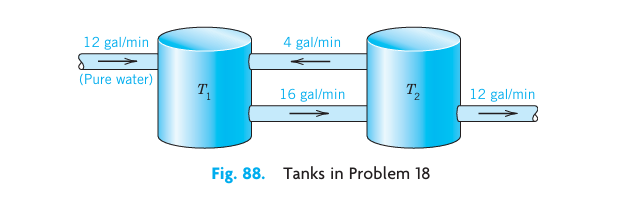{#fig-4-88}

### 19 ELECTRICAL NETWORK
Show that a model for the currents $I_1(t)$ and $I_2(t)$ in @fig-4-89 is
$$
\frac{1}{C}\int I_1 \, dt + R(I_1 - I_2) = 0, \quad L I'_2 + R(I_2 - I_1) = 0
$$
Find a general solution, assuming that $R = 3\ \Omega$, $L = 4$ H, $C = 1/12$ F.

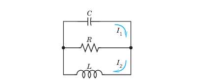{#fig-4-89}

### 20 CAS PROJECT. Phase Portraits.
Graph some of the figures in this section, in particular @fig-4-87 on the degenerate node, in which the vector $\mathbf{y}^{(2)}$ depends on $t$. In each figure highlight a trajectory that satisfies an initial condition of your choice.

## 4.4 Criteria for Critical Points. Stability {#sec-4-4}

We continue our discussion of homogeneous linear systems with constant coefficients
$$
\mathbf{y}' = \mathbf{A}\mathbf{y}
$$ {#eq-4-52}
Let us review where we are. From Sec. 4.3 we have:
$$
\begin{aligned}
y'_1 &= a_{11} y_1 + a_{12} y_2 \\
y'_2 &= a_{21} y_1 + a_{22} y_2
\end{aligned}
$$
From the examples in the last section, we have seen that we can obtain an overview of families of solution curves if we represent them parametrically as $\mathbf{y}(t) = [y_1(t)\ \ y_2(t)]^T$ and graph them as curves in the $y_1 y_2$-plane, called the phase plane. Such a curve is called a trajectory of (@eq-4-52), and their totality is known as the phase portrait of (@eq-4-52).

Now we have seen that solutions are of the form $\mathbf{y}(t) = \mathbf{x} e^{\lambda t}$. Substitution into (@eq-4-52) gives $\lambda \mathbf{x} e^{\lambda t} = \mathbf{Ax} e^{\lambda t}$. Dropping the common factor $e^{\lambda t}$, we have
$$
\mathbf{Ax} = \lambda \mathbf{x}
$$ {#eq-4-53}
Hence $\mathbf{y}(t) = \mathbf{x} e^{\lambda t}$ is a (nonzero) solution of (@eq-4-52) if $\lambda$ is an eigenvalue of $\mathbf{A}$ and $\mathbf{x}$ a corresponding eigenvector.

Our examples in the last section show that the general form of the phase portrait is determined to a large extent by the type of critical point of the system (@eq-4-52) defined as a point at which $dy_2/dy_1$ becomes undetermined, $0/0$; here [see (@eq-4-45) in Sec. 4.3]:
$$
\frac{dy_2}{dy_1} = \frac{y'_2}{y'_1} = \frac{a_{21}y_1 + a_{22}y_2}{a_{11}y_1 + a_{12}y_2}
$$ {#eq-4-54}
We also recall from Sec. 4.3 that there are various types of critical points.

What is now new, is that we shall see how these types of critical points are related to the eigenvalues. The latter are solutions $\lambda_1$ and $\lambda_2$ of the characteristic equation
$$
\det(\mathbf{A} - \lambda\mathbf{I}) = \begin{vmatrix} a_{11} - \lambda & a_{12} \\ a_{21} & a_{22} - \lambda \end{vmatrix} = \lambda^2 - (a_{11} + a_{22})\lambda + \det \mathbf{A} = 0
$$
which we write as
$$
\lambda^2 - p\lambda + q = 0
$$ {#eq-4-55}
This is a quadratic equation with coefficients $p$, $q$ and discriminant $\Delta$ given by
$$
p = a_{11} + a_{22}, \quad q = \det \mathbf{A} = a_{11}a_{22} - a_{12}a_{21}, \quad \Delta = p^2 - 4q
$$ {#eq-4-56}
From algebra we know that the solutions of this equation are
$$
\lambda_1 = \frac{1}{2}(p + \sqrt{\Delta}), \quad \lambda_2 = \frac{1}{2}(p - \sqrt{\Delta})
$$ {#eq-4-57}
Furthermore, the product representation of the equation gives
$$
\lambda^2 - p\lambda + q = (\lambda - \lambda_1)(\lambda - \lambda_2) = \lambda^2 - (\lambda_1 + \lambda_2)\lambda + \lambda_1\lambda_2
$$
Hence $p$ is the sum and $q$ the product of the eigenvalues. Also $\lambda_1 - \lambda_2 = \sqrt{\Delta}$ from (@eq-4-57). Together,
$$
p = \lambda_1 + \lambda_2, \quad q = \lambda_1\lambda_2, \quad \Delta = (\lambda_1 - \lambda_2)^2
$$ {#eq-4-58}
This gives the criteria in Table 4.1 for classifying critical points. A derivation will be indicated later in this section.

### Table 4.1: Eigenvalue Criteria for Critical Points
| Name | Real/Complex | Mathematical Conditions |
| --- | --- | --- |
| (a) Node | Real, same sign | $q > 0, \ \Delta \ge 0$ |
| (b) Saddle point | Real, opposite signs | $q < 0$ |
| (c) Center | Pure imaginary | $p = 0, \ q > 0$ |
| (d) Spiral point | Complex, not pure imaginary | $p \neq 0, \ \Delta < 0$ |

### Stability

Critical points may also be classified in terms of their stability. Stability concepts are basic in engineering and other applications. They are suggested by physics, where stability means, roughly speaking, that a small change (a small disturbance) of a physical system at some instant changes the behavior of the system only slightly at all future times $t$. For critical points, the following concepts are appropriate.

**DEFINITIONS: Stable, Unstable, Stable and Attractive**

A critical point $P_0$ of (@eq-4-52) is called **stable**^2^ if, roughly, all trajectories of (@eq-4-52) that at some instant are close to $P_0$ remain close to $P_0$ at all future times; precisely: if for every disk $D_\epsilon$ of radius $\epsilon > 0$ with center $P_0$ there is a disk $D_\delta$ of radius $\delta > 0$ with center $P_0$ such that every trajectory of (@eq-4-52) that has a point $P_1$ (corresponding to $t = t_1$, say) in $D_\delta$ has all its points $P(t)$ corresponding to $t > t_1$ in $D_\epsilon$. See @fig-4-90.

$P_0$ is called **unstable** if $P_0$ is not stable.

$P_0$ is called **stable and attractive** (or **asymptotically stable**) if $P_0$ is stable and every trajectory that has a point in $D_\delta$ approaches $P_0$ as $t \to \infty$. See @fig-4-91.

> ^2^ In the sense of the Russian mathematician ALEXANDER MICHAILOVICH LYAPUNOV (1857–1918), whose work was fundamental in stability theory for ODEs. This is perhaps the most appropriate definition of stability (and the only we shall use), but there are others, too.

Classification criteria for critical points in terms of stability are given in Table 4.2. Both tables are summarized in the stability chart in @fig-4-92. In this chart region of instability is dark blue.

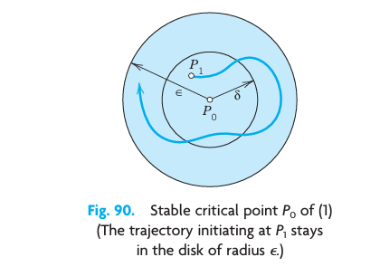{#fig-4-90}

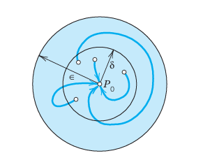{#fig-4-91}

### Table 4.2: Stability Criteria for Critical Points
| Type of Stability | Conditions on eigenvalues | Conditions on $p$ and $q$ |
| --- | --- | --- |
| (a) Stable and attractive | Real negative or complex with negative real part | $q > 0, \ p < 0$ |
| (b) Stable | Pure imaginary or stable and attractive | $q > 0, \ p \le 0$ |
| (c) Unstable | Positive real eigenvalues or positive real part | $q < 0$ or $p > 0$ |

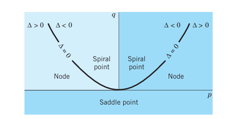{#fig-4-92}

We indicate how the criteria in Tables 4.1 and 4.2 are obtained. If $q = \lambda_1\lambda_2 > 0$, both of the eigenvalues are positive or both are negative or complex conjugates. If also $p = \lambda_1 + \lambda_2 < 0$, both are negative or have a negative real part. Hence $P_0$ is stable and attractive. The reasoning for the other two lines in Table 4.2 is similar.

If $\Delta < 0$, the eigenvalues are complex conjugates, say, $\lambda_1 = \alpha + i\beta$ and $\lambda_2 = \alpha - i\beta$. If also $p = \lambda_1 + \lambda_2 = 2\alpha < 0$, this gives a spiral point that is stable and attractive. If $p = 2\alpha > 0$, this gives an unstable spiral point.

If $p = 0$, then $\lambda_2 = -\lambda_1$ and $q = -\lambda_1^2$. If also $q > 0$, then $\lambda_1^2 < 0$, so that $\lambda_1$, and thus $\lambda_2$, must be pure imaginary. This gives periodic solutions, their trajectories being closed curves around $P_0$, which is a center.

### EXAMPLE 1 Application of the Criteria in Tables 4.1 and 4.2

In Example 1, Sec. 4.3, we have $\mathbf{y}' = \begin{bmatrix} -3 & 1 \\ 1 & -3 \end{bmatrix} \mathbf{y}$. Here $p = -6, \ q = 8, \ \Delta = 4$. By Table 4.1(a) we have a node, which is stable and attractive by Table 4.2(a). $\blacksquare$

### EXAMPLE 2 Free Motions of a Mass on a Spring

What kind of critical point does $my'' + cy' + ky = 0$ in Sec. 2.4 have?

**Solution.** Division by $m$ gives $y'' + \frac{c}{m}y' + \frac{k}{m}y = 0$. To get a system, set $y_1 = y, \ y_2 = y'$ (see Sec. 4.1). Then $y'_1 = y_2, \ y'_2 = -\frac{k}{m}y_1 - \frac{c}{m}y_2$. Hence
$$
\mathbf{y}' = \begin{bmatrix} 0 & 1 \\ -k/m & -c/m \end{bmatrix} \mathbf{y}
$$
The characteristic equation is $\lambda^2 + \frac{c}{m}\lambda + \frac{k}{m} = 0$. We see that
$$
p = -\frac{c}{m}, \quad q = \frac{k}{m}, \quad \Delta = \left(\frac{c}{m}\right)^2 - 4\frac{k}{m}
$$
From this and Tables 4.1 and 4.2 we obtain the following results. Note that in the last three cases the discriminant plays an essential role.

- **No damping.** $c = 0, \ p = 0, \ q > 0$, a center.
- **Underdamping.** $c^2 < 4mk, \ p < 0, \ q > 0, \ \Delta < 0$, a stable and attractive spiral point.
- **Critical damping.** $c^2 = 4mk, \ p < 0, \ q > 0, \ \Delta = 0$, a stable and attractive node.
- **Overdamping.** $c^2 > 4mk, \ p < 0, \ q > 0, \ \Delta > 0$, a stable and attractive node. $\blacksquare$

## PROBLEM SET 4.4 {#sec-4-4-problems}

### 1–10 TYPE AND STABILITY OF CRITICAL POINT
Determine the type and stability of the critical point. Then find a real general solution and sketch or graph some of the trajectories in the phase plane. Show the details of your work.
1. $\begin{aligned} y'_1 &= y_1 \\ y'_2 &= 2y_2 \end{aligned}$
2. $\begin{aligned} y'_1 &= -4y_1 \\ y'_2 &= -3y_2 \end{aligned}$
3. $\begin{aligned} y'_1 &= y_2 \\ y'_2 &= 2y_2 \end{aligned}$
4. $\begin{aligned} y'_1 &= 2y_1 + y_2 \\ y'_2 &= 5y_1 - 2y_2 \end{aligned}$
5. $\begin{aligned} y'_1 &= -6y_1 - y_2 \\ y'_2 &= -9y_1 - 6y_2 \end{aligned}$
6. $\begin{aligned} y'_1 &= y_1 + 2y_2 \\ y'_2 &= 2y_1 + y_2 \end{aligned}$
7. $\begin{aligned} y'_1 &= -2y_1 + 2y_2 \\ y'_2 &= -2y_1 - 2y_2 \end{aligned}$
8. $\begin{aligned} y'_1 &= -y_1 + 4y_2 \\ y'_2 &= 3y_1 - 2y_2 \end{aligned}$
9. $\begin{aligned} y'_1 &= y_2 \\ y'_2 &= -9y_1 \end{aligned}$
10. $\begin{aligned} y'_1 &= 4y_1 + y_2 \\ y'_2 &= 4y_1 + 4y_2 \end{aligned}$

### 11–18 TRAJECTORIES OF SYSTEMS AND SECOND-ORDER ODEs. CRITICAL POINTS
11. **Damped oscillations.** Solve $y'' + 2y' + 2y = 0$. What kind of curves are the trajectories?
12. **Harmonic oscillations.** Solve $y'' + 9y = 0$. Find the trajectories. Sketch or graph some of them.
13. **Types of critical points.** Discuss the critical points in Examples 2–5 of Sec. 4.3 by using Tables 4.1 and 4.2.
14. **Transformation of parameter.** What happens to the critical point in Example 1 if you introduce $\tau = -t$ as a new independent variable?
15. **Perturbation of center.** What happens in Example 4 of Sec. 4.3 if you change $\mathbf{A}$ to $\mathbf{A} + 0.1\mathbf{I}$, where $\mathbf{I}$ is the unit matrix?
16. **Perturbation of center.** If a system has a center as its critical point, what happens if you replace the matrix $\mathbf{A}$ by $\tilde{\mathbf{A}} = \mathbf{A} + k\mathbf{I}$ with any real number $k \neq 0$ (representing measurement errors in the diagonal entries)?
17. **Perturbation.** The system in Example 4 in Sec. 4.3 has a center as its critical point. Replace each $a_{jk}$ in Example 4, Sec. 4.3, by $a_{jk} + b$. Find values of $b$ such that you get (a) a saddle point, (b) a stable and attractive node, (c) a stable and attractive spiral, (d) an unstable spiral, (e) an unstable node.
18. **CAS EXPERIMENT. Phase Portraits.** Graph phase portraits for the systems in Prob. 17 with the values of $b$ suggested in the answer. Try to illustrate how the phase portrait changes "continuously" under a continuous change of $b$.
19. **WRITING PROBLEM. Stability.** Stability concepts are basic in physics and engineering. Write a two-part report of 3 pages each (A) on general applications in which stability plays a role (be as precise as you can), and (B) on material related to stability in this section. Use your own formulations and examples; do not copy.
20. **Stability chart.** Locate the critical points of the systems (10)–(14) in Sec. 4.3 and of Probs. 1, 3, 5 in this problem set on the stability chart.

## 4.5 Qualitative Methods for Nonlinear Systems {#sec-4-5}

Qualitative methods are methods of obtaining qualitative information on solutions without actually solving a system. These methods are particularly valuable for systems whose solution by analytic methods is difficult or impossible. This is the case for many practically important nonlinear systems
$$
\mathbf{y}' = \mathbf{f}(\mathbf{y}), \quad \text{thus} \quad \begin{aligned} y'_1 &= f_1(y_1, y_2) \\ y'_2 &= f_2(y_1, y_2) \end{aligned}
$$ {#eq-4-59}
In this section we extend phase plane methods, as just discussed, from linear systems to nonlinear systems (@eq-4-59). We assume that (@eq-4-59) is **autonomous**, that is, the independent variable $t$ does not occur explicitly. (All examples in the last section are autonomous.)

We shall again exhibit entire families of solutions. This is an advantage over numeric methods, which give only one (approximate) solution at a time.

Concepts needed from the last section are the **phase plane** (the $y_1 y_2$-plane), **trajectories** (solution curves of (@eq-4-59) in the phase plane), the **phase portrait** of (@eq-4-59) (the totality of these trajectories), and **critical points** of (@eq-4-59) (points $(y_1, y_2)$ at which both $f_1$ and $f_2$ are zero).

Now (@eq-4-59) may have several critical points. Our approach shall be to discuss one critical point after another. If a critical point is not at the origin, then, for technical convenience, we shall move this point to the origin before analyzing the point. More formally, if $P_0$ is a critical point with $(P_0: (a, b))$ not at the origin $(0, 0)$, then we apply the translation
$$
\tilde{y}_1 = y_1 - a, \quad \tilde{y}_2 = y_2 - b
$$
which moves $P_0$ to $(0, 0)$ as desired. Thus we can assume $P_0$ to be the origin $(0, 0)$, and for simplicity we continue to write $(y_1, y_2)$ (instead of $(\tilde{y}_1, \tilde{y}_2)$). We also assume that $P_0$ is **isolated**, that is, it is the only critical point of (@eq-4-59) within a (sufficiently small) disk with center at the origin. If (@eq-4-59) has only finitely many critical points, that is automatically true. (Explain!)

### Linearization of Nonlinear Systems

How can we determine the kind and stability property of a critical point $P_0: (0, 0)$ of (@eq-4-59)? In most cases this can be done by **linearization** of (@eq-4-59) near $P_0$, writing (@eq-4-59) as $\mathbf{y}' = \mathbf{f}(\mathbf{y}) = \mathbf{Ay} + \mathbf{h}(\mathbf{y})$ and dropping $\mathbf{h}$, as follows.

Since $P_0$ is critical, $f_1(0, 0) = 0$, $f_2(0, 0) = 0$, so that $f_1$ and $f_2$ have no constant terms and we can write
$$
\mathbf{y}' = \mathbf{Ay} + \mathbf{h}(\mathbf{y}), \quad \text{thus} \quad \begin{aligned} y'_1 &= a_{11}y_1 + a_{12}y_2 + h_1(y_1, y_2) \\ y'_2 &= a_{21}y_1 + a_{22}y_2 + h_2(y_1, y_2) \end{aligned}
$$ {#eq-4-60}
$\mathbf{A}$ is constant (independent of $t$) since (@eq-4-59) is autonomous. One can prove the following (proof in Ref. [A7], pp. 375–388, listed in App. 1).

**THEOREM 1 Linearization**
If $f_1$ and $f_2$ in (@eq-4-59) are continuous and have continuous partial derivatives in a neighborhood of the critical point $P_0: (0, 0)$, and if $\det \mathbf{A} \neq 0$ in (@eq-4-60), then the kind and stability of the critical point of (@eq-4-59) are the same as those of the linearized system
$$
\mathbf{y}' = \mathbf{Ay}, \quad \text{thus} \quad \begin{aligned} y'_1 &= a_{11}y_1 + a_{12}y_2 \\ y'_2 &= a_{21}y_1 + a_{22}y_2 \end{aligned}
$$ {#eq-4-61}
**Exceptions** occur if $\mathbf{A}$ has equal or pure imaginary eigenvalues; then (@eq-4-59) may have the same kind of critical point as (@eq-4-61) or a spiral point.

### EXAMPLE 1 Free Undamped Pendulum. Linearization

@fig-4-93(a) shows a pendulum consisting of a body of mass $m$ (the bob) and a rod of length $L$. Determine the locations and types of the critical points. Assume that the mass of the rod and air resistance are negligible.

**Solution.**

**Step 1. Setting up the mathematical model.** Let $u$ denote the angular displacement, measured counterclockwise from the equilibrium position. The weight of the bob is $mg$ ($g$ the acceleration of gravity). It causes a restoring force $-mg \sin u$ tangent to the curve of motion (circular arc) of the bob. By Newton's second law, at each instant this force is balanced by the force of acceleration $mL\ddot{u}$; hence the resultant of these two forces is zero, and we obtain as the mathematical model
$$
mL\ddot{u} + mg \sin u = 0
$$
Dividing this by $mL$, we have
$$
\ddot{u} + k \sin u = 0, \quad k = \frac{g}{L}
$$ {#eq-4-62}
When $u$ is very small, we can approximate $\sin u$ rather accurately by $u$ and obtain the approximate solution $u \approx A \cos \sqrt{k}\,t + B \sin \sqrt{k}\,t$, but the exact solution for any $u$ is not an elementary function.

**Step 2. Critical points. Linearization.** To obtain a system of ODEs, we set $u = y_1, \dot{u} = y_2$. Then from (@eq-4-62) we obtain a nonlinear system (@eq-4-59) of the form
$$
\begin{aligned}
y'_1 &= f_1(y_1, y_2) = y_2 \\
y'_2 &= f_2(y_1, y_2) = -k \sin y_1
\end{aligned}
$$ {#eq-4-62star}
The right sides are both zero when $y_2 = 0$ and $\sin y_1 = 0$. This gives infinitely many critical points $(n\pi, 0)$, where $n = 0, \pm 1, \pm 2, \dots$. We consider $(0, 0)$. Since the Maclaurin series is
$$
\sin y_1 = y_1 - \frac{1}{6}y_1^3 + \dots \approx y_1
$$
the linearized system at $(0, 0)$ is
$$
y'_1 = y_2, \quad y'_2 = -ky_1, \quad \text{thus} \quad \mathbf{y}' = \mathbf{Ay} = \begin{bmatrix} 0 & 1 \\ -k & 0 \end{bmatrix} \mathbf{y}
$$
To apply our criteria in Sec. 4.4 we calculate $p = a_{11} + a_{22} = 0$ and $q = \det \mathbf{A} = k = g/L > 0$, and $\Delta = p^2 - 4q = -4k < 0$. From this and Table 4.1(c) in Sec. 4.4 we conclude that $(0, 0)$ is a center, which is always stable. Since $\sin y_1$ is periodic with period $2\pi$, the critical points $(0, 0), (\pm 2\pi, 0), (\pm 4\pi, 0), \dots$ are all centers.

**Step 3. Critical points $(\pm \pi, 0), (\pm 3\pi, 0), \dots$. Linearization.** We now consider the critical point $(\pi, 0)$, setting $u - \pi = y_1$ and linearizing:
$$
\sin u = \sin(y_1 + \pi) = -\sin y_1 \approx -y_1
$$
$(u - \pi)' = \dot{u} = y_2$. This gives the new linearized system at $(\pi, 0)$:
$$
y'_1 = y_2, \quad y'_2 = ky_1, \quad \text{thus} \quad \mathbf{y}' = \mathbf{Ay} = \begin{bmatrix} 0 & 1 \\ k & 0 \end{bmatrix} \mathbf{y}
$$
We see that $p = 0, q = -k < 0$, and $\Delta = 4k > 0$. Hence, by Table 4.1(b), this gives a saddle point, which is always unstable. Because of periodicity, the critical points $(\pm\pi, 0), (\pm 3\pi, 0), \dots$ are all saddle points.

These results agree with the impression we get from @fig-4-93(b). $\blacksquare$

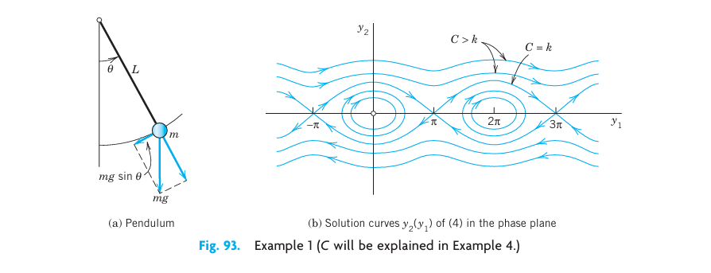{#fig-4-93}

### EXAMPLE 2 Linearization of the Damped Pendulum Equation

To gain further experience in investigating critical points, as another practically important case, let us see how Example 1 changes when we add a damping term (damping proportional to the angular velocity) to equation (@eq-4-62), so that it becomes
$$
\ddot{u} + c\dot{u} + k \sin u = 0
$$ {#eq-4-63}
where $c \geq 0$ and $k > 0$ (which includes our previous case of no damping, $c = 0$). Setting $u = y_1, \dot{u} = y_2$ as before, we obtain the nonlinear system (use $\ddot{u} = y'_2$)
$$
\begin{aligned}
y'_1 &= y_2 \\
y'_2 &= -k\sin y_1 - cy_2
\end{aligned}
$$
We see that the critical points have the same locations as before, namely $(0, 0), (\pm\pi, 0), (\pm 2\pi, 0), \dots$. We consider $(0, 0)$. Linearizing as in Example 1, we get the linearized system at $(0, 0)$:
$$
y'_1 = y_2, \quad y'_2 = -ky_1 - cy_2, \quad \text{thus} \quad \mathbf{y}' = \mathbf{Ay} = \begin{bmatrix} 0 & 1 \\ -k & -c \end{bmatrix} \mathbf{y}
$$ {#eq-4-64}
This is identical with the system in Example 2 of Sec. 4.4, except for the (positive!) factor $m$ (and except for the physical meaning of $y_1$). Hence for $c = 0$ (no damping) we have a center (see @fig-4-93(b)), for small damping we have a spiral point (see @fig-4-94), and so on.

We now consider the critical point $(\pi, 0)$. We set $u - \pi = y_1$ and linearize:
$$
\sin u = \sin(y_1 + \pi) = -\sin y_1 \approx -y_1
$$
$(u - \pi)' = \dot{u} = y_2$. This gives the new linearized system at $(\pi, 0)$:
$$
y'_1 = y_2, \quad y'_2 = ky_1 - cy_2, \quad \text{thus} \quad \mathbf{y}' = \mathbf{Ay} = \begin{bmatrix} 0 & 1 \\ k & -c \end{bmatrix} \mathbf{y}
$$ {#eq-4-65}
For our criteria in Sec. 4.4 we calculate $p = a_{11} + a_{22} = -c$ and $q = \det \mathbf{A} = -k$ and $\Delta = p^2 - 4q = c^2 + 4k$.

This gives the following results for the critical point at $(\pi, 0)$:

- **No damping.** $c = 0, \ p = 0, \ q = -k < 0, \ \Delta > 0$, a saddle point. See @fig-4-93(b).
- **Damping.** $c > 0, \ p = -c < 0, \ q = -k < 0, \ \Delta > 0$, a saddle point. See @fig-4-94.

Since $\sin y_1$ is periodic with period $2\pi$, the critical points $(0, 0), (\pm 2\pi, 0), \dots$ are of the same type as $(0, 0)$, and the critical points $(\pm\pi, 0), (\pm 3\pi, 0), \dots$ are of the same type as $(\pi, 0)$, so that our task is finished.

@fig-4-94 shows the trajectories in the case of damping. What we see agrees with our physical intuition. Indeed, damping means loss of energy. Hence instead of the closed trajectories of periodic solutions in @fig-4-93(b) we now have trajectories spiraling around one of the critical points $(0, 0), (\pm 2\pi, 0), \dots$. Even the wavy trajectories corresponding to whirly motions eventually spiral around one of these points. Furthermore, there are no more trajectories that connect critical points (as there were in the undamped case for the saddle points). $\blacksquare$

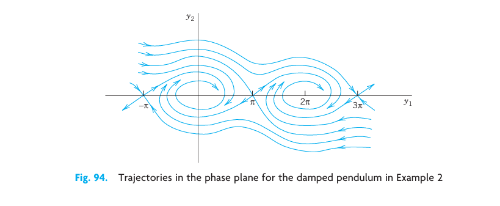{#fig-4-94}

### Lotka–Volterra Population Model

### EXAMPLE 3 Predator–Prey Population Model^3^

This model concerns two species, say, rabbits and foxes, and the foxes prey on the rabbits.

**Step 1. Setting up the model.** We assume the following.

1. Rabbits have unlimited food supply. Hence, if there were no foxes, their number $y_1(t)$ would grow exponentially, $y'_1 = ay_1$.
2. Actually, $y'_1$ is decreased because of the kill by foxes, say, at a rate proportional to $y_1 y_2$, where $y_2(t)$ is the number of foxes. Hence $y'_1 = ay_1 - by_1 y_2$, where $a > 0$ and $b > 0$.
3. If there were no rabbits, then $y_2(t)$ would exponentially decrease to zero, $y'_2 = -ly_2$. However, $y'_2$ is increased by a rate proportional to the number of encounters between predator and prey; together we have $y'_2 = -ly_2 + ky_1 y_2$, where $k > 0$ and $l > 0$.

This gives the (nonlinear!) **Lotka–Volterra system**
$$
\begin{aligned}
y'_1 &= f_1(y_1, y_2) = ay_1 - by_1 y_2 \\
y'_2 &= f_2(y_1, y_2) = ky_1 y_2 - ly_2
\end{aligned}
$$ {#eq-4-66}

> ^3^ Introduced by ALFRED J. LOTKA (1880–1949), American biophysicist, and VITO VOLTERRA (1860–1940), Italian mathematician, the initiator of functional analysis.

**Step 2. Critical point $(0, 0)$. Linearization.** We see from (@eq-4-66) that the critical points are the solutions of
$$
f_1(y_1, y_2) = y_1(a - by_2) = 0, \quad f_2(y_1, y_2) = y_2(ky_1 - l) = 0
$$ {#eq-4-66star}
The solutions are $(y_1, y_2) = (0, 0)$ and $(l/k,\ a/b)$. We consider $(0, 0)$. Dropping $by_1 y_2$ and $ky_1 y_2$ from (@eq-4-66) gives the linearized system
$$
\mathbf{y}' = \begin{bmatrix} a & 0 \\ 0 & -l \end{bmatrix} \mathbf{y}
$$
Its eigenvalues are $\lambda_1 = a > 0$ and $\lambda_2 = -l < 0$. They have opposite signs, so that we get a saddle point.

**Step 3. Critical point $(l/k, a/b)$. Linearization.** We set $y_1 = \tilde{y}_1 + l/k$, $y_2 = \tilde{y}_2 + a/b$. Then the critical point $(l/k, a/b)$ corresponds to $(\tilde{y}_1, \tilde{y}_2) = (0, 0)$. Since $y'_1 = \tilde{y}'_1, y'_2 = \tilde{y}'_2$, we obtain from (@eq-4-66) [factorized as in (@eq-4-66star)]
$$
\begin{aligned}
\tilde{y}'_1 &= a\tilde{y}_1 + \frac{l}{k}\left(a - b\left(\tilde{y}_2 + \frac{a}{b}\right)\right) = -\frac{bl}{k}\tilde{y}_2 - b\tilde{y}_1\tilde{y}_2 \\
\tilde{y}'_2 &= ak\tilde{y}_1 + \left(k\tilde{y}_1 - l + \frac{ak}{b}\right)\tilde{y}_2 \cdot\frac{k}{a}\tilde{y}_1
\end{aligned}
$$
Dropping the two nonlinear terms $k\tilde{y}_1\tilde{y}_2$ and $b\tilde{y}_1\tilde{y}_2$, we have the linearized system
$$
\begin{aligned}
\tilde{y}'_1 &= -\frac{bl}{k}\tilde{y}_2 \\
\tilde{y}'_2 &= \frac{ak}{b}\tilde{y}_1
\end{aligned}
$$ {#eq-4-66doublestar}
The left side of (a) times the right side of (b) must equal the right side of (a) times the left side of (b):
$$
-\frac{bl}{k}\tilde{y}_2\tilde{y}'_2 = \frac{ak}{b}\tilde{y}_1\tilde{y}'_1
$$
By integration,
$$
\frac{ak}{b}\tilde{y}_1^2 + \frac{bl}{k}\tilde{y}_2^2 = \text{const}
$$
This is a family of ellipses, so that the critical point of the linearized system (@eq-4-66doublestar) is a center (@fig-4-95). It can be shown, by a complicated analysis, that the nonlinear system (@eq-4-66) also has a center (rather than a spiral point) at $(l/k, a/b)$ surrounded by closed trajectories (not ellipses).

We see that the predators and prey have a cyclic variation about the critical point. Let us move counterclockwise around the ellipse, beginning at the right vertex, where the rabbits have a maximum number. Foxes are sharply increasing in number until they reach a maximum at the upper vertex, and the number of rabbits is then sharply decreasing until it reaches a minimum at the left vertex, and so on. Cyclic variations of this kind have been observed in nature, for example, for lynx and snowshoe hare near the Hudson Bay, with a cycle of about 10 years.

For models of more complicated situations and a systematic discussion, see C. W. Clark, *Mathematical Bioeconomics: The Mathematics of Conservation*, 3rd ed. Hoboken, NJ, Wiley, 2010. $\blacksquare$

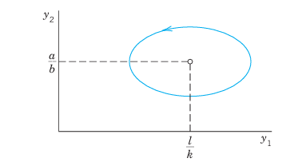{#fig-4-95}

### Transformation to a First-Order Equation in the Phase Plane

Another phase plane method is based on the idea of transforming a second-order autonomous ODE (an ODE in which $t$ does not occur explicitly)
$$
F\!\left(y, y', y''\right) = 0
$$ {#eq-4-67}
to first order by taking $y_1 = y$ as the independent variable, setting $y' = y_2$ and transforming $y'' = \ddot{y}$ by the chain rule,
$$
y'' = \ddot{y} = \frac{d^2 y}{dt^2} = \frac{dy'}{dt} = \frac{dy_2}{dt} = \frac{dy_2}{dy_1} \cdot \frac{dy_1}{dt} = \frac{dy_2}{dy_1} \cdot y_2
$$
Then the ODE (@eq-4-67) becomes of first order,
$$
F\!\left(y_1, y_2, \frac{dy_2}{dy_1} y_2\right) = 0
$$ {#eq-4-68}
and can sometimes be solved or treated by direction fields. We illustrate this for the equation in Example 1 and shall gain much more insight into the behavior of solutions.

### EXAMPLE 4 An ODE (8) for the Free Undamped Pendulum

If in (@eq-4-62) we set $y = y_1$ (the angular velocity) and use $\ddot{u} = \frac{dy_2}{dy_1} y_2$, we get $y_2\frac{dy_2}{dy_1} = -k\sin y_1$.

Separation of variables gives $y_2 \, dy_2 = -k\sin y_1 \, dy_1$. By integration,
$$
\frac{1}{2}y_2^2 = k\cos y_1 + C \quad (C \text{ constant})
$$ {#eq-4-69}
Multiplying this by $mL^2$, we get
$$
\frac{1}{2}m(Ly_2)^2 - mL^2 k \cos y_1 = mL^2 C
$$
We see that these three terms are energies. Indeed, $y_2$ is the angular velocity, so that $Ly_2$ is the velocity and the first term is the kinetic energy. The second term (including the minus sign) is the potential energy of the pendulum, and $mL^2 C$ is its total energy, which is constant, as expected from the law of conservation of energy, because there is no damping (no loss of energy). The type of motion depends on the total energy, hence on $C$, as follows.

@fig-4-93(b) shows trajectories for various values of $C$. These graphs continue periodically with period $2\pi$ to the left and to the right. We see that some of them are ellipse-like and closed, others are wavy, and there are two trajectories (passing through the saddle points $(\pm\pi, 0), (\pm 3\pi, 0), \dots$) that separate those two types of trajectories. From (@eq-4-69) we see that the smallest possible $C$ is $-k$; then $y_2 = 0$ and $\cos y_1 = 1$, so that the pendulum is at rest. The pendulum will change its direction of motion if there are points at which $y_2 = y'_1 = \dot{u} = 0$. Then by (@eq-4-69), $k\cos y_1 + C = 0$. If $|C| < k$, then $\cos y_1 = -C/k$ and $-1 < -C/k < 1$. Hence if $-k < C < k$, then the pendulum reverses its direction for an angle $y_1 = \pm \arccos(-C/k)$, and for these values of $C$ with $|C| < k$ the pendulum oscillates. This corresponds to the closed trajectories in the figure. However, if $C > k$, then $k\cos y_1 + C = 0$ is impossible and the pendulum makes a whirly motion that appears as a wavy trajectory in the $y_1 y_2$-plane. Finally, the value $C = k$ corresponds to the two "separating trajectories" in @fig-4-93(b) connecting the saddle points. $\blacksquare$

The phase plane method of deriving a single first-order equation (@eq-4-68) may be of practical interest not only when (@eq-4-68) can be solved (as in Example 4) but also when a solution is not possible and we have to utilize direction fields (Sec. 1.2). We illustrate this with a very famous example:

### EXAMPLE 5 Self-Sustained Oscillations. Van der Pol Equation

There are physical systems such that for small oscillations, energy is fed into the system, whereas for large oscillations, energy is taken from the system. In other words, large oscillations will be damped, whereas for small oscillations there is "negative damping" (feeding of energy into the system). For physical reasons we expect such a system to approach a periodic behavior, which will thus appear as a closed trajectory in the phase plane, called a **limit cycle**. A differential equation describing such vibrations is the famous **van der Pol equation**^4^
$$
\ddot{u} - \mu(1 - u^2)\dot{u} + u = 0 \quad (\mu > 0, \ \text{constant})
$$ {#eq-4-70}
It first occurred in the study of electrical circuits containing vacuum tubes. For $\mu = 0$ this becomes $\ddot{u} + u = 0$ and we obtain harmonic oscillations. Let $\mu > 0$. The damping term has the factor $(1 - u^2)$. This is negative for small oscillations, when $|u| < 1$, so that we have "negative damping," is zero for $|u| = 1$ (no damping), and is positive if $|u| > 1$ (positive damping, loss of energy). If $\mu$ is small, we expect a limit cycle that is almost a circle because then our equation differs but little from $\ddot{u} + u = 0$. If $\mu$ is large, the limit cycle will probably look different.

Setting $y = y_1, y' = y_2$ and using $y'' = \frac{dy_2}{dy_1}y_2$ as in (@eq-4-68), we have from (@eq-4-70)
$$
\frac{dy_2}{dy_1} y_2 - \mu(1 - y_1^2)y_2 + y_1 = 0
$$ {#eq-4-71}
The isoclines in the $y_1 y_2$-plane (the phase plane) are the curves $dy_2/dy_1 = K = \text{const}$, that is,
$$
\frac{dy_2}{dy_1} y_2 - \mu(1 - y_1^2)y_2 + y_1 = 0 \quad \Rightarrow \quad Ky_2 - \mu(1-y_1^2)y_2 + y_1 = 0
$$
Solving algebraically for $y_2$, we see that the isoclines are given by
$$
y_2 = \frac{y_1}{\mu(1 - y_1^2) - K} \quad (\text{Figs. 96, 97})
$$

@fig-4-96 shows some isoclines when $\mu$ is small, $\mu = 0.1$, the limit cycle (almost a circle), and two (blue) trajectories approaching it, one from the outside and the other from the inside, of which only the initial portion, a small spiral, is shown. Due to this approach by trajectories, a limit cycle differs conceptually from a closed curve (a trajectory) surrounding a center, which is not approached by trajectories. For larger $\mu$ the limit cycle no longer resembles a circle, and the trajectories approach it more rapidly than for smaller $\mu$. @fig-4-97 illustrates this for $\mu = 1$. $\blacksquare$

> ^4^ BALTHASAR VAN DER POL (1889–1959), Dutch physicist and engineer.

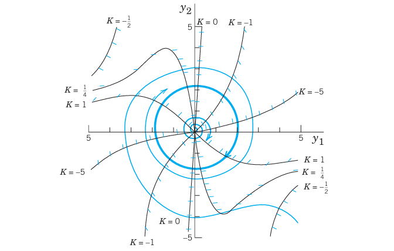{#fig-4-96}

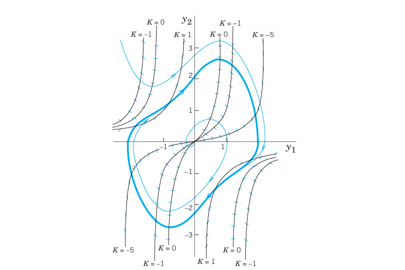{#fig-4-97}

## PROBLEM SET 4.5 {#sec-4-5-problems}

1. **Pendulum.** To what state (position, speed, direction of motion) do the four points of intersection of a closed trajectory with the axes in @fig-4-93(b) correspond? The point of intersection of a wavy curve with the $y_1$-axis?
2. **Limit cycle.** What is the essential difference between a limit cycle and a closed trajectory surrounding a center?
3. **CAS EXPERIMENT. Deformation of Limit Cycle.** Convert the van der Pol equation to a system. Graph the limit cycle and some approaching trajectories for $\mu = 0.2, 0.4, 0.6, 0.8, 1.0, 1.5, 2.0$. Try to observe how the limit cycle changes its form continuously if you vary $\mu$ continuously. Describe in words how the limit cycle is deformed with growing $\mu$.

### 4–8 CRITICAL POINTS. LINEARIZATION
Find the location and type of all critical points by linearization. Show the details of your work.
4. $\begin{aligned} y'_1 &= y_2 \\ y'_2 &= 4y_1 - y_1^2 \end{aligned}$
5. $\begin{aligned} y'_1 &= y_2 \\ y'_2 &= y_2 \end{aligned}$
6. $\begin{aligned} y'_1 &= -y_1 + y_2 - y_2^2 \\ y'_2 &= -y_1 - y_2 \end{aligned}$
7. $\begin{aligned} y'_1 &= y_2 \\ y'_2 &= -y_1 - y_1^2 \end{aligned}$
8. $\begin{aligned} y'_1 &= y_2 - y_2^2 \\ y'_2 &= y_1 - y_1^2 \end{aligned}$

### 9–13 CRITICAL POINTS OF ODEs
Find the location and type of all critical points by first converting the ODE to a system and then linearizing it.
9. $y'' + 9y - y^3 = 0$
10. $y'' - 9y + y^3 = 0$
11. $y'' + y - y^3 = 0$
12. $y'' + \cos y = 0$
13. $y'' + \sin y = 0$

14. **TEAM PROJECT. Self-sustained oscillations.**
(a) **Van der Pol equation.** Determine the type of the critical point at $(0, 0)$ when $\mu > 0, \ \mu = 0, \ \mu < 0$.
(b) **Rayleigh equation.**^5^ Show that the Rayleigh equation
$$
\ddot{Y} - \mu\!\left(1 - \tfrac{1}{3}\dot{Y}^2\right)\dot{Y} + Y = 0 \quad (\mu > 0)
$$
also describes self-sustained oscillations and that by differentiating it and setting $y = \dot{Y}$ one obtains the van der Pol equation.
(c) **Duffing equation.** The Duffing equation is
$$
\ddot{y} + \omega_0^2 y + by^3 = 0
$$
where usually $|b|$ is small, thus characterizing a small deviation of the restoring force from linearity. $b > 0$ and $b < 0$ are called the cases of a hard spring and a soft spring, respectively. Find the equation of the trajectories in the phase plane. (Note that for all $b > 0$ these curves are closed.)

> ^5^ LORD RAYLEIGH (JOHN WILLIAM STRUTT) (1842–1919), English physicist and mathematician, professor at Cambridge and London, known by his important contributions to the theory of waves, elasticity theory, hydrodynamics, and various other branches of applied mathematics and theoretical physics. In 1904 he was awarded the Nobel Prize in physics.

15. **Trajectories.** Write the ODE $y'' - 4y + y^3 = 0$ as a system, solve it for $y_2$ as a function of $y_1$, and sketch or graph some of the trajectories in the phase plane.

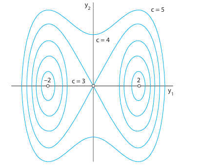{#fig-4-98}

def append_text(path, text):
    with open(path, "a", encoding="utf-8") as f:
        f.write("\n" + text + "\n")

text = r"""
## 4.6 Nonhomogeneous Linear Systems {#sec-4-6}

We continue with systems of ODEs, now turning from homogeneous to **nonhomogeneous linear systems**
$$
\mathbf{y}' = \mathbf{A}(t)\mathbf{y} + \mathbf{g}(t)
$$ {#eq-4-72}
where $\mathbf{A}(t)$ is an $n \times n$ matrix and $\mathbf{g}(t) \not\equiv \mathbf{0}$ is a given vector function (a vector with $n$ components). **Solutions** are vector functions $\mathbf{y}(t)$ satisfying (@eq-4-72) on some interval $J$.

The corresponding **homogeneous system** is $\mathbf{y}' = \mathbf{A}(t)\mathbf{y}$.

**THEOREM 1 General Solution**

If the homogeneous system corresponding to (@eq-4-72) has a fundamental matrix $\mathbf{\Phi}(t)$ on an open interval $J$ and $\mathbf{y}^{(p)}(t)$ is any particular solution of (@eq-4-72) on $J$, then every solution of (@eq-4-72) on $J$ is of the form
$$
\mathbf{y}(t) = \mathbf{\Phi}(t)\mathbf{c} + \mathbf{y}^{(p)}(t)
$$ {#eq-4-73}
where $\mathbf{c}$ is an arbitrary constant vector.

**Proof.** Let $\tilde{\mathbf{y}}$ be any solution of (@eq-4-72) on $J$. Then $\tilde{\mathbf{y}} - \mathbf{y}^{(p)}$ is a solution of the homogeneous system because
$$
(\tilde{\mathbf{y}} - \mathbf{y}^{(p)})' = \tilde{\mathbf{y}}' - \mathbf{y}^{(p)\prime} = (\mathbf{A}\tilde{\mathbf{y}} + \mathbf{g}) - (\mathbf{A}\mathbf{y}^{(p)} + \mathbf{g}) = \mathbf{A}(\tilde{\mathbf{y}} - \mathbf{y}^{(p)})
$$
Since $\mathbf{\Phi}(t)$ is a fundamental matrix, by Theorem 2 of Sec. 4.1, $\tilde{\mathbf{y}} - \mathbf{y}^{(p)} = \mathbf{\Phi}(t)\mathbf{c}$ for some constant vector $\mathbf{c}$, so that $\tilde{\mathbf{y}} = \mathbf{\Phi}(t)\mathbf{c} + \mathbf{y}^{(p)}$. This proves the theorem. $\square$

### Method of Undetermined Coefficients

In the case of constant $\mathbf{A}$ and a "simple" $\mathbf{g}(t)$, a particular solution can be found by the **method of undetermined coefficients**. In this method, one chooses for $\mathbf{y}^{(p)}$ a form similar to $\mathbf{g}$, substitutes into the system, and equates coefficients of like terms on both sides. This is completely analogous to the scalar case discussed in Sec. 2.7.

### EXAMPLE 1 Method of Undetermined Coefficients

Find a solution of
$$
\mathbf{y}' = \mathbf{A}\mathbf{y} + \mathbf{g}
$$
where $\mathbf{A} = \begin{bmatrix} 0 & 1 \\ 1 & 0 \end{bmatrix}$ and $\mathbf{g} = \begin{bmatrix} -1 \\ 2 \end{bmatrix}e^{2t}$.

**Solution.** We try $\mathbf{y}^{(p)} = \mathbf{u}e^{2t}$, where $\mathbf{u}$ is a constant vector. Substituting,
$$
2\mathbf{u}e^{2t} = \mathbf{A}\mathbf{u}e^{2t} + \mathbf{g}e^{2t}
$$
$$
(2\mathbf{I} - \mathbf{A})\mathbf{u} = \begin{bmatrix} -1 \\ 2 \end{bmatrix}
$$
$$
\begin{bmatrix} 2 & -1 \\ -1 & 2 \end{bmatrix}\mathbf{u} = \begin{bmatrix} -1 \\ 2 \end{bmatrix}
$$
This gives $2u_1 - u_2 = -1$ and $-u_1 + 2u_2 = 2$. Adding the equations, $u_1 + u_2 = 1$. Subtracting, $3u_1 - 3u_2 = -3$, i.e., $u_1 - u_2 = -1$. Thus $u_1 = 0, u_2 = 1$. Therefore $\mathbf{y}^{(p)} = \begin{bmatrix} 0 \\ 1 \end{bmatrix}e^{2t}$. $\blacksquare$

### Variation of Parameters

A general method for solving (@eq-4-72) on an interval $J$ is **variation of parameters**, analogous to that in Sec. 2.10. Here we have a fundamental matrix $\mathbf{\Phi}(t)$ of $\mathbf{y}' = \mathbf{A}\mathbf{y}$ and we replace the constant vector $\mathbf{c}$ in $\mathbf{\Phi}(t)\mathbf{c}$ by a variable vector $\mathbf{u}(t)$, obtaining a particular solution of (@eq-4-72) in the form
$$
\mathbf{y}^{(p)} = \mathbf{\Phi}(t)\mathbf{u}(t)
$$ {#eq-4-74}
We substitute into (@eq-4-72):
$$
\mathbf{y}^{(p)\prime} = \mathbf{\Phi}'\mathbf{u} + \mathbf{\Phi}\mathbf{u}' = \mathbf{A}\mathbf{\Phi}\mathbf{u} + \mathbf{g}
$$
Since $\mathbf{\Phi}$ is a fundamental matrix of $\mathbf{y}' = \mathbf{A}\mathbf{y}$, we have $\mathbf{\Phi}' = \mathbf{A}\mathbf{\Phi}$, so that $\mathbf{\Phi}'\mathbf{u} = \mathbf{A}\mathbf{\Phi}\mathbf{u}$, and the last equation reduces to
$$
\mathbf{\Phi}\mathbf{u}' = \mathbf{g}
$$
Since $\mathbf{\Phi}$ is a fundamental matrix, $\det\mathbf{\Phi} \neq 0$, so that $\mathbf{\Phi}^{-1}$ exists, and
$$
\mathbf{u}' = \mathbf{\Phi}^{-1}\mathbf{g}, \quad \text{thus} \quad \mathbf{u} = \int \mathbf{\Phi}^{-1}(t)\mathbf{g}(t)\, dt
$$
Substituting this into (@eq-4-74), we obtain

$$
\boxed{\mathbf{y}^{(p)} = \mathbf{\Phi}(t)\int \mathbf{\Phi}^{-1}(t)\mathbf{g}(t)\, dt}
$$ {#eq-4-75}

This is the formula for variation of parameters for systems.

### EXAMPLE 2 Variation of Parameters

Solve the system
$$
\mathbf{y}' = \mathbf{A}\mathbf{y} + \mathbf{g}, \quad \mathbf{A} = \begin{bmatrix} 2 & 1 \\ 0 & 2 \end{bmatrix}, \quad \mathbf{g} = \begin{bmatrix} e^{2t} \\ 0 \end{bmatrix}
$$

**Solution.** **Step 1. Homogeneous system.** The characteristic equation of $\mathbf{A}$ is $(\lambda - 2)^2 = 0$, giving the double eigenvalue $\lambda = 2$.

An eigenvector of $\mathbf{A}$ is $\mathbf{x}_1 = [1 \;\; 0]^T$. A generalized eigenvector: solve $(\mathbf{A} - 2\mathbf{I})\mathbf{x}_2 = \mathbf{x}_1$, getting $\mathbf{x}_2 = [0 \;\; 1]^T$. So
$$
\mathbf{y}^{(1)} = e^{2t}\begin{bmatrix}1\\0\end{bmatrix}, \quad \mathbf{y}^{(2)} = e^{2t}\!\left(\begin{bmatrix}0\\1\end{bmatrix} + t\begin{bmatrix}1\\0\end{bmatrix}\right) = e^{2t}\begin{bmatrix}t\\1\end{bmatrix}
$$
The fundamental matrix is
$$
\mathbf{\Phi} = e^{2t}\begin{bmatrix}1 & t\\0 & 1\end{bmatrix}
$$
**Step 2. Particular solution.** We compute $\mathbf{\Phi}^{-1}$. Since $\det\mathbf{\Phi} = e^{4t}$,
$$
\mathbf{\Phi}^{-1} = \frac{1}{e^{4t}} \cdot e^{2t}\begin{bmatrix}1 & -t\\0 & 1\end{bmatrix} = e^{-2t}\begin{bmatrix}1 & -t\\0 & 1\end{bmatrix}
$$
Then
$$
\mathbf{\Phi}^{-1}\mathbf{g} = e^{-2t}\begin{bmatrix}1 & -t\\0 & 1\end{bmatrix}\begin{bmatrix}e^{2t}\\0\end{bmatrix} = \begin{bmatrix}1\\0\end{bmatrix}
$$
Integrating, $\mathbf{u} = \begin{bmatrix}t\\0\end{bmatrix}$. Then by (@eq-4-75),
$$
\mathbf{y}^{(p)} = \mathbf{\Phi}\mathbf{u} = e^{2t}\begin{bmatrix}1&t\\0&1\end{bmatrix}\begin{bmatrix}t\\0\end{bmatrix} = e^{2t}\begin{bmatrix}t\\0\end{bmatrix}
$$
**Step 3. General solution.** From (@eq-4-73),
$$
\mathbf{y} = \mathbf{\Phi}\mathbf{c} + \mathbf{y}^{(p)} = e^{2t}\begin{bmatrix}1&t\\0&1\end{bmatrix}\begin{bmatrix}c_1\\c_2\end{bmatrix} + e^{2t}\begin{bmatrix}t\\0\end{bmatrix} = e^{2t}\begin{bmatrix}c_1 + c_2 t + t\\c_2\end{bmatrix}
$$
Thus $y_1 = (c_1 + t + c_2 t)e^{2t}$ and $y_2 = c_2 e^{2t}$. $\blacksquare$

### EXAMPLE 3 Forced Oscillations

Solve the system
$$
\mathbf{y}' = \begin{bmatrix}0&1\\-1&0\end{bmatrix}\mathbf{y} + \begin{bmatrix}0\\\cos t\end{bmatrix}
$$ {#eq-4-76}
**Solution.** The coefficient matrix $\mathbf{A} = \begin{bmatrix}0&1\\-1&0\end{bmatrix}$ has the characteristic equation $\lambda^2 + 1 = 0$, so $\lambda_{1,2} = \pm i$. The fundamental matrix is
$$
\mathbf{\Phi}(t) = \begin{bmatrix}\cos t & \sin t \\ -\sin t & \cos t\end{bmatrix}
$$
To apply (@eq-4-75), we need $\mathbf{\Phi}^{-1}$. We compute $\det \mathbf{\Phi} = \cos^2 t + \sin^2 t = 1$. By the standard formula,
$$
\mathbf{\Phi}^{-1} = \begin{bmatrix}\cos t & -\sin t \\ \sin t & \cos t\end{bmatrix}
$$
Then
$$
\mathbf{\Phi}^{-1}\mathbf{g} = \begin{bmatrix}\cos t & -\sin t \\ \sin t & \cos t\end{bmatrix}\begin{bmatrix}0\\\cos t\end{bmatrix} = \begin{bmatrix}-\sin t\cos t\\\cos^2 t\end{bmatrix} = \begin{bmatrix}-\tfrac{1}{2}\sin 2t\\ \tfrac{1}{2}(1+\cos 2t)\end{bmatrix}
$$
Integrating component-wise,
$$
\mathbf{u}(t) = \begin{bmatrix}\tfrac{1}{4}\cos 2t\\ \tfrac{1}{2}t + \tfrac{1}{4}\sin 2t\end{bmatrix}
$$
Applying (@eq-4-75):
$$
\mathbf{y}^{(p)} = \mathbf{\Phi}\mathbf{u} = \begin{bmatrix}\cos t & \sin t\\-\sin t & \cos t\end{bmatrix}\begin{bmatrix}\tfrac{1}{4}\cos 2t\\ \tfrac{1}{2}t + \tfrac{1}{4}\sin 2t\end{bmatrix}
$$
Expanding (using $\cos t\cos 2t + \sin t\sin 2t = \cos t$ and $-\sin t\cos 2t + \cos t \sin 2t = \sin t$):
$$
y_1^{(p)} = \tfrac{1}{4}\cos t + \tfrac{1}{2}t\sin t, \quad y_2^{(p)} = -\tfrac{1}{4}\sin t + \tfrac{1}{2}t\cos t + \tfrac{1}{2}\sin t = \tfrac{1}{2}t\cos t + \tfrac{1}{4}\sin t
$$
The general solution of (@eq-4-76) is
$$
\begin{aligned}
y_1 &= (c_1 + \tfrac{1}{4})\cos t + (c_2 + \tfrac{1}{2}t)\sin t \\
y_2 &= -(c_1 + \tfrac{1}{4})\sin t + (c_2 + \tfrac{1}{2}t)\cos t + \tfrac{1}{2}\sin t
\end{aligned}
$$
The terms with $t\sin t$ and $t\cos t$ represent **resonance**, analogous to the scalar case. $\blacksquare$

## PROBLEM SET 4.6 {#sec-4-6-problems}

### 1–8 UNDETERMINED COEFFICIENTS
Find a particular solution. Show all your work.
1. $y'_1 = y_1 + y_2 + 2e^t, \quad y'_2 = y_1 + y_2 + 2t$
2. $y'_1 = y_2 + e^{-t}, \quad y'_2 = -y_1 + t$
3. $y'_1 = y_2 + t^2, \quad y'_2 = y_1 - 1$
4. $y'_1 = 3y_1 - 2y_2 + e^t, \quad y'_2 = 4y_1 - y_2 - e^t$
5. $y'_1 = y_2 + \cos 2t, \quad y'_2 = -y_1 + \sin 2t$
6. $y'_1 = 2y_2 + 8e^t, \quad y'_2 = 2y_1 + 8e^t$
7. $y'_1 = y_2 + 1, \quad y'_2 = y_1 + t^2$
8. $y'_1 = y_2 + e^{2t}, \quad y'_2 = y_1 + e^{2t}$

### 9–16 VARIATION OF PARAMETERS
Solve the IVP using variation of parameters. Show all details.
9. $\mathbf{y}' = \begin{bmatrix}0&1\\-1&0\end{bmatrix}\mathbf{y} + \begin{bmatrix}0\\e^t\end{bmatrix}, \quad \mathbf{y}(0) = \begin{bmatrix}1\\0\end{bmatrix}$
10. $\mathbf{y}' = \begin{bmatrix}1&1\\0&1\end{bmatrix}\mathbf{y} + \begin{bmatrix}e^t\\t\end{bmatrix}$
11. $\mathbf{y}' = \begin{bmatrix}2&-5\\1&-2\end{bmatrix}\mathbf{y} + \begin{bmatrix}\cos t\\\sin t\end{bmatrix}$
12. $\mathbf{y}' = \begin{bmatrix}0&1\\-4&0\end{bmatrix}\mathbf{y} + \begin{bmatrix}0\\\sin 2t\end{bmatrix}, \quad \mathbf{y}(0) = \begin{bmatrix}0\\0\end{bmatrix}$
13. $\mathbf{y}' = \begin{bmatrix}1&0\\1&1\end{bmatrix}\mathbf{y} + \begin{bmatrix}e^t\\e^t\end{bmatrix}$
14. $\mathbf{y}' = \begin{bmatrix}0&1\\-1&0\end{bmatrix}\mathbf{y} + \begin{bmatrix}0\\\csc t\end{bmatrix}$
15. $\mathbf{y}' = \begin{bmatrix}0&1\\-1&0\end{bmatrix}\mathbf{y} + \begin{bmatrix}0\\\sec t\end{bmatrix}$
16. $\mathbf{y}' = \begin{bmatrix}1&1\\-1&1\end{bmatrix}\mathbf{y} + \begin{bmatrix}e^t\cos t\\e^t \sin t\end{bmatrix}$

17. **Electrical network.** Find the general solution of
$$
\mathbf{I}' = \mathbf{A}\mathbf{I} + \mathbf{g}(t)
$$
where $\mathbf{A} = \begin{bmatrix}-2 & 2 \\ 2 & -2\end{bmatrix}$ and $\mathbf{g}(t) = \begin{bmatrix}6\sin t\\ 0\end{bmatrix}$.

18. **Nonhomogeneous system.** Find the general solution of
$$
\mathbf{y}' = \begin{bmatrix}0 & 1 \\ -2 & -3\end{bmatrix}\mathbf{y} + \begin{bmatrix}e^t \\ -e^t\end{bmatrix}
$$

19. **Undetermined coefficients.** Verify that if $\mathbf{g}(t) = \mathbf{g}_1\cos\omega t + \mathbf{g}_2\sin\omega t$ and the matrix $\mathbf{A}$ has no eigenvalue $\pm i\omega$, then a particular solution of $\mathbf{y}' = \mathbf{A}\mathbf{y} + \mathbf{g}(t)$ has the form $\mathbf{y}^{(p)} = \mathbf{a}\cos\omega t + \mathbf{b}\sin\omega t$.

20. **IVP.** Solve the initial value problem
$$
\mathbf{y}' = \begin{bmatrix}1 & -1 \\ 1 & 1\end{bmatrix}\mathbf{y} + \begin{bmatrix}e^t \\ 0\end{bmatrix}, \quad \mathbf{y}(0) = \begin{bmatrix}0 \\ 2\end{bmatrix}
$$

## Chapter 4 Review Questions and Problems {#sec-ch4-review}

1. State some applications that can be modeled by systems of ODEs.
2. What is population dynamics? Give examples.
3. How can you transform an ODE into a system of ODEs?
4. What are qualitative methods for systems? Why are they important?
5. What is the phase plane? The phase plane method? A trajectory? The phase portrait of a system of ODEs?
6. What are critical points of a system of ODEs? How did we classify them? Why are they important?
7. What are eigenvalues? What role did they play in this chapter?
8. What does stability mean in general? In connection with critical points? Why is stability important in engineering?
9. What does linearization of a system mean?
10. Review the pendulum equations and their linearizations.

### 11–17 GENERAL SOLUTION. CRITICAL POINTS
Find a general solution. Determine the kind and stability of the critical point.
11. $y'_1 = 2y_2, \quad y'_2 = 8y_1$
12. $y'_1 = 5y_1, \quad y'_2 = y_2$
13. $y'_1 = -2y_1 + 5y_2, \quad y'_2 = -y_1 - 6y_2$
14. $y'_1 = 3y_1 + 4y_2, \quad y'_2 = 3y_1 + 2y_2$
15. $y'_1 = -3y_1 - 2y_2, \quad y'_2 = -2y_1 - 3y_2$
16. $y'_1 = 4y_2, \quad y'_2 = -4y_1$
17. $y'_1 = -y_1 + 2y_2, \quad y'_2 = -2y_1 - y_2$

### 18–19 CRITICAL POINT
What kind of critical point does $\mathbf{y}' = \mathbf{A}\mathbf{y}$ have if $\mathbf{A}$ has the eigenvalues
18. $-4$ and $-2$
19. $-2 + 3i, \quad -2 - 3i$

### 20–23 NONHOMOGENEOUS SYSTEMS
Find a general solution. Show the details of your work.
20. $y'_1 = 2y_1 + 2y_2 + e^t, \quad y'_2 = -2y_1 - 3y_2 + e^t$
21. $y'_1 = 4y_2, \quad y'_2 = 4y_1 + 32t^2$
22. $y'_1 = y_1 + y_2 + \sin t, \quad y'_2 = 4y_1 + y_2$
23. $y'_1 = y_1 + 4y_2 - 2\cos t, \quad y'_2 = y_1 + y_2 - \cos t + \sin t$

24. **Mixing problem.** Tank $T_1$ in Fig. 101 initially contains 200 gal of water in which 160 lb of salt are dissolved. Tank $T_2$ initially contains 100 gal of pure water. Liquid is pumped through the system as indicated, and the mixtures are kept uniform by stirring. Find the amounts of salt $y_1(t)$ and $y_2(t)$ in $T_1$ and $T_2$, respectively.

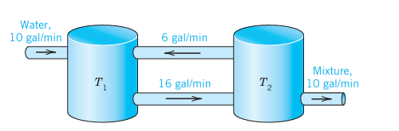{#fig-4-101}

25. **Network.** Find the currents in Fig. 102 when $R = 2.5\ \Omega$, $L = 1\text{ H}$, $C = 0.04\text{ F}$, $E(t) = 169\sin t\text{ V}$, $I_1(0) = 0$, $I_2(0) = 0$.

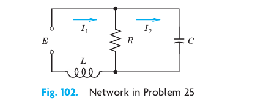{#fig-4-102}

26. **Network.** Find the currents in Fig. 103 when $R = 1\ \Omega$, $L = 1.25\text{ H}$, $C = 0.2\text{ F}$, $I_1(0) = 1\text{ A}$, $I_2(0) = 1\text{ A}$.

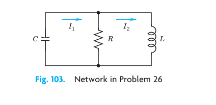{#fig-4-103}

### 27–30 LINEARIZATION
Find the location and kind of all critical points of the given nonlinear system by linearization.
27. $y'_1 = y_2, \quad y'_2 = y_1 - y_1^3$
28. $y'_1 = \cos y_2, \quad y'_2 = 3y_1$
29. $y'_1 = -4y_2, \quad y'_2 = \sin y_1$
30. $y'_1 = 2y_2 + 2y_2^2, \quad y'_2 = -8y_1$

## Summary of Chapter 4 {#sec-ch4-summary}
**Systems of ODEs. Phase Plane. Qualitative Methods**

Whereas single electric circuits or single mass–spring systems are modeled by single ODEs (Chap. 2), networks of several circuits, systems of several masses and springs, and other engineering problems lead to **systems of ODEs**, involving several unknown functions $y_1(t), \cdots, y_n(t)$. Of central interest are **first-order systems** (Sec. 4.2):
$$
\mathbf{y}' = \mathbf{f}(t, \mathbf{y}), \qquad \text{in components,} \qquad \begin{aligned} y'_1 &= f_1(t, y_1, \cdots, y_n) \\ &\ \ \vdots \\ y'_n &= f_n(t, y_1, \cdots, y_n), \end{aligned}
$$
to which higher order ODEs and systems of ODEs can be reduced (Sec. 4.1). In this summary we let $n = 2$, so that
$$
(1) \qquad \mathbf{y}' = \mathbf{f}(t, \mathbf{y}), \qquad \text{in components,} \qquad \begin{aligned} y'_1 &= f_1(t, y_1, y_2) \\ y'_2 &= f_2(t, y_1, y_2). \end{aligned}
$$
Then we can represent solution curves as **trajectories** in the **phase plane** (the $y_1 y_2$-plane), investigate their totality [the "**phase portrait**" of (1)], and study the kind and **stability** of the **critical points** (points at which both $f_1$ and $f_2$ are zero), and classify them as **nodes, saddle points, centers,** or **spiral points** (Secs. 4.3, 4.4). These phase plane methods are **qualitative**; with their use we can discover various general properties of solutions without actually solving the system. They are primarily used for **autonomous systems**, that is, systems in which $t$ does not occur explicitly.

A **linear system** is of the form
$$
(2) \qquad \mathbf{y}' = \mathbf{A}\mathbf{y} + \mathbf{g}, \qquad \text{where} \qquad \mathbf{A} = \begin{bmatrix} a_{11} & a_{12} \\ a_{21} & a_{22} \end{bmatrix}, \quad \mathbf{y} = \begin{bmatrix} y_1 \\ y_2 \end{bmatrix}, \quad \mathbf{g} = \begin{bmatrix} g_1 \\ g_2 \end{bmatrix}.
$$
If $\mathbf{g} = \mathbf{0}$, the system is called **homogeneous** and is of the form
$$
(3) \qquad \mathbf{y}' = \mathbf{A}\mathbf{y}.
$$
If $a_{11}, \cdots, a_{22}$ are constants, it has solutions $\mathbf{y} = \mathbf{x} e^{\lambda t}$, where $\lambda$ is a solution of the quadratic equation
$$
\begin{vmatrix} a_{11} - \lambda & a_{12} \\ a_{21} & a_{22} - \lambda \end{vmatrix} = (a_{11} - \lambda)(a_{22} - \lambda) - a_{12} a_{21} = 0
$$
and $\mathbf{x} \neq \mathbf{0}$ has components $x_1, x_2$ determined up to a multiplicative constant by
$$
(a_{11} - \lambda)x_1 + a_{12} x_2 = 0.
$$
(These $\lambda$'s are called the **eigenvalues** and these vectors $\mathbf{x}$ **eigenvectors** of the matrix $\mathbf{A}$. Further explanation is given in Sec. 4.0.)

A system (2) with $\mathbf{g} \neq \mathbf{0}$ is called **nonhomogeneous**. Its general solution is of the form $\mathbf{y} = \mathbf{y}_h + \mathbf{y}_p$, where $\mathbf{y}_h$ is a general solution of (3) and $\mathbf{y}_p$ a particular solution of (2). Methods of determining the latter are discussed in Sec. 4.6.

The discussion of critical points of linear systems based on eigenvalues is summarized in Tables 4.1 and 4.2 in Sec. 4.4. It also applies to nonlinear systems if the latter are first linearized. The key theorem for this is Theorem 1 in Sec. 4.5, which also includes three famous applications, namely the pendulum and van der Pol equations and the Lotka–Volterra predator–prey population model.
