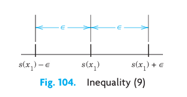
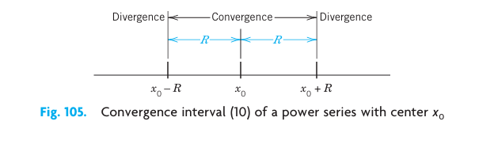
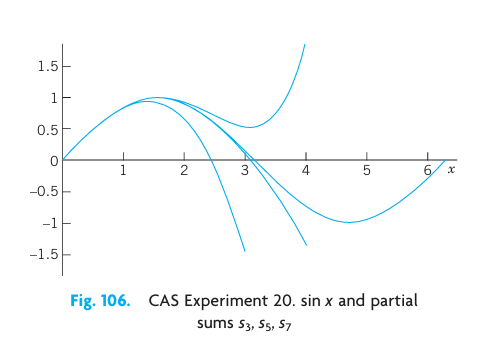
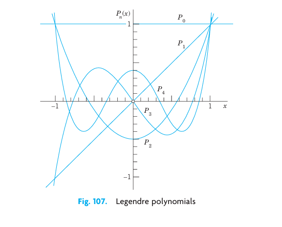
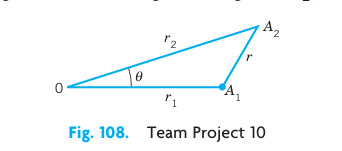
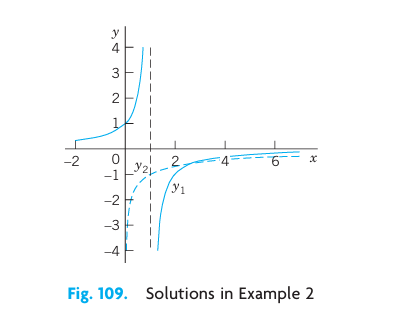
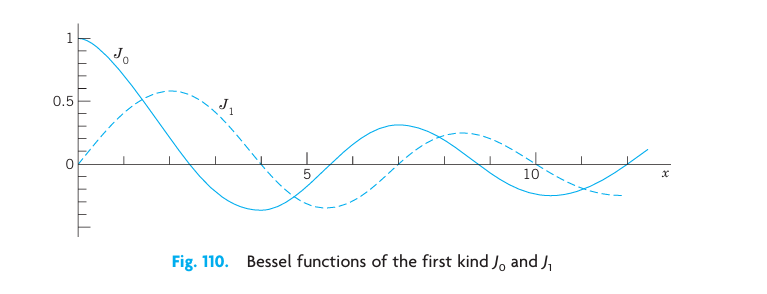
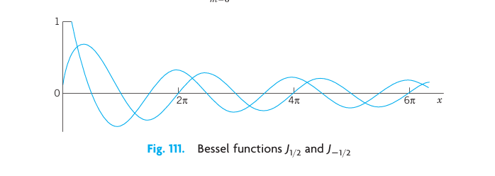
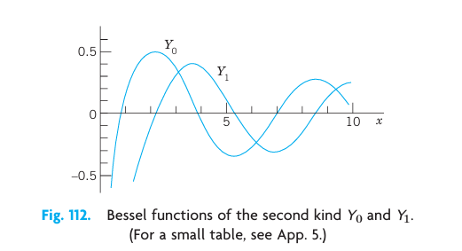

In the previous chapters, we have seen that linear ODEs with constant coefficients can be solved by algebraic methods, and that their solutions are elementary functions known from calculus. For ODEs with variable coefficients the situation is more complicated, and their solutions may be nonelementary functions. Legendre’s, Bessel’s, and the hypergeometric equations are important ODEs of this kind. Since these ODEs and their solutions, the Legendre polynomials, Bessel functions, and hypergeometric functions, play an important role in engineering modeling, we shall consider the two standard methods for solving such ODEs.

The first method is called the power series method because it gives solutions in the form of a power series $a_0 + a_1 x + a_2 x^2 + a_3 x^3 + \cdots$.

The second method is called the Frobenius method and generalizes the first; it gives solutions in power series, multiplied by a logarithmic term $\ln x$ or a fractional power $x^r$, in cases such as Bessel’s equation, in which the first method is not general enough.

All those more advanced solutions and various other functions not appearing in calculus are known as higher functions or special functions, which has become a technical term. Each of these functions is important enough to give it a name and investigate its properties and relations to other functions in great detail (take a look into Refs. [GenRef1], [GenRef10], or [All] in App. 1). Your CAS knows practically all functions you will ever need in industry or research labs, but it is up to you to find your way through this vast terrain of formulas. The present chapter may give you some help in this task.

**COMMENT.** You can study this chapter directly after Chap. 2 because it needs no material from Chaps. 3 or 4.

**Prerequisite:** Chap. 2.
**Section that may be omitted in a shorter course:** 5.5.
**References and Answers to Problems:** App. 1 Part A, and App. 2.

## 5.1 Power Series Method {#sec-power-series-method}

The power series method is the standard method for solving linear ODEs with variable coefficients. It gives solutions in the form of power series. These series can be used for computing values, graphing curves, proving formulas, and exploring properties of solutions, as we shall see. In this section we begin by explaining the idea of the power series method.

From calculus we remember that a power series (in powers of $x - x_0$) is an infinite series of the form
$$ \sum_{m=0}^{\infty} a_m (x - x_0)^m = a_0 + a_1(x - x_0) + a_2(x - x_0)^2 + \cdots $$ {#eq-sec51-1}

Here, $x$ is a variable, $a_0, a_1, a_2, \dots$ are constants, called the coefficients of the series, and $x_0$ is a constant, called the center of the series. In particular, if $x_0 = 0$, we obtain a power series in powers of $x$:
$$ \sum_{m=0}^{\infty} a_m x^m = a_0 + a_1 x + a_2 x^2 + a_3 x^3 + \cdots $$ {#eq-sec51-2}

We shall assume that all variables and constants are real.
We note that the term “power series” usually refers to a series of the form (@eq-sec51-1) [or (@eq-sec51-2)] but does not include series of negative or fractional powers of $x$. We use $m$ as the summation letter, reserving $n$ as a standard notation in the Legendre and Bessel equations for integer values of the parameter.

### EXAMPLE 1 Familiar Power Series
Familiar Power Series are the Maclaurin series:
$$ \frac{1}{1 - x} = \sum_{m=0}^{\infty} x^m = 1 + x + x^2 + \cdots \quad (|x| < 1, \text{ geometric series}) $$
$$ e^x = \sum_{m=0}^{\infty} \frac{x^m}{m!} = 1 + x + \frac{x^2}{2!} + \frac{x^3}{3!} + \cdots $$
$$ \cos x = \sum_{m=0}^{\infty} \frac{(-1)^m x^{2m}}{(2m)!} = 1 - \frac{x^2}{2!} + \frac{x^4}{4!} - \cdots $$
$$ \sin x = \sum_{m=0}^{\infty} \frac{(-1)^m x^{2m+1}}{(2m+1)!} = x - \frac{x^3}{3!} + \frac{x^5}{5!} - \cdots $$

### Idea and Technique of the Power Series Method
The idea of the power series method for solving linear ODEs seems natural, once we know that the most important ODEs in applied mathematics have solutions of this form. We explain the idea by an ODE that can readily be solved otherwise.

### EXAMPLE 2 Power Series Solution
Solve $y' - y = 0$.

**Solution.** In the first step we insert
$$ y = a_0 + a_1 x + a_2 x^2 + a_3 x^3 + \cdots = \sum_{m=0}^{\infty} a_m x^m $$
and the series obtained by termwise differentiation
$$ y' = a_1 + 2 a_2 x + 3 a_3 x^2 + \cdots = \sum_{m=1}^{\infty} m a_m x^{m-1} $$ {#eq-sec51-3}
into the ODE:
$$ (a_1 + 2 a_2 x + 3 a_3 x^2 + \cdots) - (a_0 + a_1 x + a_2 x^2 + \cdots) = 0 $$
Then we collect like powers of $x$, finding
$$ (a_1 - a_0) + (2 a_2 - a_1)x + (3 a_3 - a_2)x^2 + \cdots = 0 $$
Equating the coefficient of each power of $x$ to zero, we have
$$ a_1 - a_0 = 0, \quad 2 a_2 - a_1 = 0, \quad 3 a_3 - a_2 = 0, \quad \dots $$
Solving these equations, we may express $a_1, a_2, \dots$ in terms of $a_0$, which remains arbitrary:
$$ a_1 = a_0, \quad a_2 = \frac{a_1}{2} = \frac{a_0}{2!}, \quad a_3 = \frac{a_2}{3} = \frac{a_0}{3!}, \quad \dots $$
With these values of the coefficients, the series solution becomes the familiar general solution
$$ y = a_0 + a_0 x + \frac{a_0}{2!} x^2 + \frac{a_0}{3!} x^3 + \cdots = a_0 \left( 1 + x + \frac{x^2}{2!} + \frac{x^3}{3!} + \cdots \right) = a_0 e^x $$
Test your comprehension by solving $y'' + y = 0$ by power series. You should get the result $y = a_0 \cos x + a_1 \sin x$.

We now describe the method in general and justify it after the next example. For a given ODE
$$ y'' + p(x)y' + q(x)y = 0 $$ {#eq-sec51-4}
we first represent $p(x)$ and $q(x)$ by power series in powers of $x$ (or of $x - x_0$ if solutions in powers of $x - x_0$ are wanted). Often $p(x)$ and $q(x)$ are polynomials, and then nothing needs to be done in this first step. Next we assume a solution in the form of a power series (@eq-sec51-2) with unknown coefficients and insert it as well as (@eq-sec51-3) and
$$ y'' = 2a_2 + 3 \cdot 2 a_3 x + 4 \cdot 3 a_4 x^2 + \cdots = \sum_{m=2}^{\infty} m(m-1)a_m x^{m-2} $$ {#eq-sec51-5}
into the ODE. Then we collect like powers of $x$ and equate the sum of the coefficients of each occurring power of $x$ to zero, starting with the constant terms, then taking the terms containing $x$, then the terms in $x^2$, and so on. This gives equations from which we can determine the unknown coefficients of (@eq-sec51-2) successively.

### EXAMPLE 3 A Special Legendre Equation
The ODE
$$ (1 - x^2)y'' - 2xy' + 2y = 0 $$
occurs in models exhibiting spherical symmetry. Solve it.

**Solution.** Substitute (@eq-sec51-2), (@eq-sec51-3), and (@eq-sec51-5) into the ODE. $(1 - x^2)y''$ gives two series, one for $y''$ and one for $-x^2 y''$. In the term $-2xy'$ use (@eq-sec51-3) and in $2y$ use (@eq-sec51-2). Write like powers of $x$ vertically aligned. This gives
$$
\begin{aligned}
y'' &= 2 a_2 + 6 a_3 x + 12 a_4 x^2 + 20 a_5 x^3 + 30 a_6 x^4 + \cdots \\
-x^2 y'' &= \quad\quad\quad - 2 a_2 x^2 - 6 a_3 x^3 - 12 a_4 x^4 - \cdots \\
-2xy' &= \quad\quad - 2 a_1 x - 4 a_2 x^2 - 6 a_3 x^3 - 8 a_4 x^4 - \cdots \\
2y &= 2 a_0 + 2 a_1 x + 2 a_2 x^2 + 2 a_3 x^3 + 2 a_4 x^4 + \cdots
\end{aligned}
$$
Add terms of like powers of $x$. For each power $x^0, x, x^2, \dots$ equate the sum obtained to zero. Denote these sums by [0] (constant terms), [1] (first power of $x$), and so on:
| Sum | Power | Equations |
|---|---|---|
| [0] | [$x^0$] | $2 a_2 + 2 a_0 = 0$, hence $a_2 = -a_0$ |
| [1] | [$x$] | $6 a_3 = 0$, hence $a_3 = 0$ |
| [2] | [$x^2$] | $12 a_4 - 4 a_2 = 0$, hence $a_4 = \frac{4}{12} a_2 = -\frac{1}{3} a_0$ |
| [3] | [$x^3$] | $20 a_5 = 0$ since $a_3 = 0$, hence $a_5 = 0$ |
| [4] | [$x^4$] | $30 a_6 - 18 a_4 = 0$, hence $a_6 = \frac{18}{30} a_4 = \frac{18}{30} \left(-\frac{1}{3}\right)a_0 = -\frac{1}{5} a_0$ |

This gives the solution
$$ y = a_1 x + a_0 \left( 1 - x^2 - \frac{1}{3} x^4 - \frac{1}{5} x^6 - \cdots \right) $$
$a_0$ and $a_1$ remain arbitrary. Hence, this is a general solution that consists of two solutions: $x$ and $1 - x^2 - \frac{1}{3} x^4 - \frac{1}{5} x^6 - \cdots$. These two solutions are members of families of functions called Legendre polynomials $P_n(x)$ and Legendre functions $Q_n(x)$; here we have $x = P_1(x)$ and $1 - x^2 - \frac{1}{3} x^4 - \frac{1}{5} x^6 - \cdots = -Q_1(x)$. The minus is by convention. The index 1 is called the order of these two functions and here the order is 1. More on Legendre polynomials in the next section.

### Theory of the Power Series Method
The $n$th partial sum of (@eq-sec51-1) is
$$ s_n(x) = a_0 + a_1(x - x_0) + a_2(x - x_0)^2 + \cdots + a_n(x - x_0)^n $$ {#eq-sec51-6}
where $n = 0, 1, \dots$. If we omit the terms of $s_n$ from (@eq-sec51-1), the remaining expression is
$$ R_n(x) = a_{n+1}(x - x_0)^{n+1} + a_{n+2}(x - x_0)^{n+2} + \cdots $$ {#eq-sec51-7}
This expression is called the **remainder** of (@eq-sec51-1) after the term $a_n(x - x_0)^n$.
For example, in the case of the geometric series
$$ 1 + x + x^2 + \cdots + x^n + \cdots $$
we have
$$ \begin{aligned} s_0 &= 1, & R_0 &= x + x^2 + x^3 + \cdots \\ s_1 &= 1 + x, & R_1 &= x^2 + x^3 + x^4 + \cdots \\ s_2 &= 1 + x + x^2, & R_2 &= x^3 + x^4 + x^5 + \cdots, \quad \text{etc.} \end{aligned} $$

In this way we have now associated with (@eq-sec51-1) the sequence of the partial sums $s_0(x), s_1(x), s_2(x), \dots$. If for some $x = x_1$ this sequence converges, say,
$$ \lim_{n \to \infty} s_n(x_1) = s(x_1) $$
then the series (@eq-sec51-1) is called **convergent** at $x = x_1$, the number $s(x_1)$ is called the **value** or **sum** of (@eq-sec51-1) at $x_1$, and we write
$$ s(x_1) = \sum_{m=0}^{\infty} a_m (x_1 - x_0)^m $$
Then we have for every $n$,
$$ s(x_1) = s_n(x_1) + R_n(x_1) $$ {#eq-sec51-8}
If that sequence diverges at $x = x_1$, the series (@eq-sec51-1) is called **divergent** at $x = x_1$.
In the case of convergence, for any positive $\epsilon$ there is an $N$ (depending on $\epsilon$) such that, by (@eq-sec51-8)
$$ |R_n(x_1)| = |s(x_1) - s_n(x_1)| < \epsilon \quad \text{for all } n > N $$ {#eq-sec51-9}

Geometrically, this means that all $s_n(x_1)$ with $n > N$ lie between $s(x_1) - \epsilon$ and $s(x_1) + \epsilon$ (Fig. 104). Practically, this means that in the case of convergence we can approximate the sum $s(x_1)$ of (@eq-sec51-1) at $x_1$ by $s_n(x_1)$ as accurately as we please, by taking $n$ large enough.

{#fig-5-1}

Where does a power series converge? Now if we choose $x = x_0$ in (@eq-sec51-1), the series reduces to the single term $a_0$ because the other terms are zero. Hence the series converges at $x_0$. In some cases this may be the only value of $x$ for which (@eq-sec51-1) converges. If there are other values of $x$ for which the series converges, these values form an interval, the **convergence interval**. This interval may be finite, as in Fig. 105, with midpoint $x_0$. Then the series (@eq-sec51-1) converges for all $x$ in the interior of the interval, that is, for all $x$ for which
$$ |x - x_0| < R $$ {#eq-sec51-10}
and diverges for $|x - x_0| > R$. The interval may also be infinite, that is, the series may converge for all $x$.

{#fig-5-2}

The quantity $R$ in Fig. 105 is called the **radius of convergence** (because for a complex power series it is the radius of disk of convergence). If the series converges for all $x$, we set $R = \infty$ (and $1/R = 0$).
The radius of convergence can be determined from the coefficients of the series by means of each of the formulas
$$ \text{(a) } R = 1 \Big/ \lim_{m \to \infty} \sqrt[m]{|a_m|} \qquad \text{(b) } R = 1 \Big/ \lim_{m \to \infty} \left| \frac{a_{m+1}}{a_m} \right| $$ {#eq-sec51-11}
provided these limits exist and are not zero. [If these limits are infinite, then (@eq-sec51-1) converges only at the center $x_0$.]

### EXAMPLE 4 Convergence Radius $R = \infty, 1, 0$
For all three series let $m \to \infty$.
- $e^x = \sum_{m=0}^{\infty} \frac{x^m}{m!} = 1 + x + \frac{x^2}{2!} + \cdots$, $\left| \frac{a_{m+1}}{a_m} \right| = \frac{1/(m+1)!}{1/m!} = \frac{1}{m+1} \to 0$, $R = \infty$.
- $\frac{1}{1-x} = \sum_{m=0}^{\infty} x^m = 1 + x + x^2 + \cdots$, $\left| \frac{a_{m+1}}{a_m} \right| = \frac{1}{1} = 1$, $R = 1$.
- $\sum_{m=0}^{\infty} m! x^m = 1 + x + 2x^2 + \cdots$, $\left| \frac{a_{m+1}}{a_m} \right| = \frac{(m+1)!}{m!} = m+1 \to \infty$, $R = 0$.

Convergence for all $x$ ($R = \infty$) is the best possible case, convergence in some finite interval the usual, and convergence only at the center ($R = 0$) is useless.

When do power series solutions exist? *Answer:* if $p, q, r$ in the ODEs
$$ y'' + p(x)y' + q(x)y = r(x) $$ {#eq-sec51-12}
have power series representations (Taylor series). More precisely, a function $f(x)$ is called **analytic** at a point $x = x_0$ if it can be represented by a power series in powers of $x - x_0$ with positive radius of convergence. Using this concept, we can state the following basic theorem, in which the ODE (@eq-sec51-12) is **in standard form**, that is, it begins with the $y''$. If your ODE begins with, say, $h(x)y''$, divide it first by $h(x)$ and then apply the theorem to the resulting new ODE.

### THEOREM 1 Existence of Power Series Solutions
If $p, q,$ and $r$ in (@eq-sec51-12) are analytic at $x = x_0$, then every solution of (@eq-sec51-12) is analytic at $x = x_0$ and can thus be represented by a power series in powers of $x - x_0$ with radius of convergence $R > 0$.

The proof of this theorem requires advanced complex analysis and can be found in Ref. [A11] listed in App. 1.
We mention that the radius of convergence $R$ in Theorem 1 is at least equal to the distance from the point $x = x_0$ to the point (or points) closest to $x_0$ at which one of the functions $p, q, r$, as functions of a complex variable, is not analytic. (Note that that point may not lie on the $x$-axis but somewhere in the complex plane.)

### Further Theory: Operations on Power Series
In the power series method we differentiate, add, and multiply power series, and we obtain coefficient recursions (as, for instance, in Example 3) by equating the sum of the coefficients of each occurring power of $x$ to zero. These four operations are permissible in the sense explained in what follows. Proofs can be found in Sec. 15.3.

1. **Termwise Differentiation.** A power series may be differentiated term by term. More precisely: if
$$ y(x) = \sum_{m=0}^{\infty} a_m (x - x_0)^m $$
converges for $|x - x_0| < R$, where $R > 0$, then the series obtained by differentiating term by term also converges for those $x$ and represents the derivative $y'$ of $y$ for those $x$:
$$ y'(x) = \sum_{m=1}^{\infty} m a_m (x - x_0)^{m-1} \quad (|x - x_0| < R) $$
Similarly for the second and further derivatives.

2. **Termwise Addition.** Two power series may be added term by term. More precisely: if the series
$$ \sum_{m=0}^{\infty} a_m (x - x_0)^m \quad \text{and} \quad \sum_{m=0}^{\infty} b_m (x - x_0)^m $$ {#eq-sec51-13}
have positive radii of convergence and their sums are $f(x)$ and $g(x)$, then the series
$$ \sum_{m=0}^{\infty} (a_m + b_m)(x - x_0)^m $$
converges and represents $f(x) + g(x)$ for each $x$ that lies in the interior of the convergence interval common to each of the two given series.

3. **Termwise Multiplication.** Two power series may be multiplied term by term. More precisely: Suppose that the series (@eq-sec51-13) have positive radii of convergence and let $f(x)$ and $g(x)$ be their sums. Then the series obtained by multiplying each term of the first series by each term of the second series and collecting like powers of $x - x_0$, that is,
$$ a_0 b_0 + (a_0 b_1 + a_1 b_0)(x - x_0) + (a_0 b_2 + a_1 b_1 + a_2 b_0)(x - x_0)^2 + \cdots = \sum_{m=0}^{\infty} (a_0 b_m + a_1 b_{m-1} + \cdots + a_m b_0)(x - x_0)^m $$
converges and represents $f(x)g(x)$ for each $x$ in the interior of the convergence interval of each of the two given series.

4. **Vanishing of All Coefficients (“Identity Theorem for Power Series.”)** If a power series has a positive radius of convergence and a sum that is identically zero throughout its interval of convergence, then each coefficient of the series must be zero.

## PROBLEM SET 5.1

### 1. WRITING AND LITERATURE PROJECT. Power Series in Calculus
(a) Write a review (2–3 pages) on power series in calculus. Use your own formulations and examples—do not just copy from textbooks. No proofs.
(b) Collect and arrange Maclaurin series in a systematic list that you can use for your work.

### 2–5 REVIEW: RADIUS OF CONVERGENCE
Determine the radius of convergence. Show the details of your work.
2. $\sum_{m=0}^{\infty} (m+1)m x^m$
3. $\sum_{m=0}^{\infty} \frac{(-1)^m}{k^m} x^{2m}$
4. $\sum_{m=0}^{\infty} \frac{x^{2m+1}}{(2m+1)!}$
5. $\sum_{m=0}^{\infty} \left(\frac{2}{3}\right)^m x^{2m}$

### 6–9 SERIES SOLUTIONS BY HAND
Apply the power series method. Do this by hand, not by a CAS, to get a feel for the method, e.g., why a series may terminate, or has even powers only, etc. Show the details.
6. $(1 + x)y' = y$
7. $y' = -2xy$
8. $xy' - 3y = k$ ($k = \text{const}$)
9. $y'' + y = 0$

### 10–14 SERIES SOLUTIONS
Find a power series solution in powers of $x$. Show the details.
10. $y'' - y' + xy = 0$
11. $y'' - y' + x^2 y = 0$
12. $(1 - x^2)y'' - 2xy' + 2y = 0$
13. $y'' + (1 + x^2)y = 0$
14. $y'' - 4xy' + (4x^2 - 2)y = 0$

### 15. Shifting summation indices
Shifting summation indices is often convenient or necessary in the power series method. Shift the index so that the power under the summation sign is $x^m$. Check by writing the first few terms explicitly.
$$ \sum_{s=2}^{\infty} \frac{s(s+1)}{s^2 + 1} x^{s-1}, \qquad \sum_{p=1}^{\infty} \frac{p^2}{(p+1)!} x^{p+4} $$

### 16–19 CAS PROBLEMS. IVPs
Solve the initial value problem by a power series. Graph the partial sums of the powers up to and including $x^5$. Find the value of the sum $s$ (5 digits) at $x_1$.
16. $y' + 4y = 1, \quad y(0) = 1.25, \quad x_1 = 0.2$
17. $y'' + 3xy' + 2y = 0, \quad y(0) = 1, \quad y'(0) = 1, \quad x = 0.5$
18. $(1 - x^2)y'' - 2xy' + 30y = 0, \quad y(0) = 0, \quad y'(0) = 1.875, \quad x_1 = 0.5$
19. $(x - 2)y' = xy, \quad y(0) = 4, \quad x_1 = 2$

### 20. CAS Experiment. Information from Graphs of Partial Sums
In numerics we use partial sums of power series. To get a feel for the accuracy for various $x$, experiment with $\sin x$. Graph partial sums of the Maclaurin series of an increasing number of terms, describing qualitatively the “breakaway points” of these graphs from the graph of $\sin x$. Consider other Maclaurin series of your choice.

{#fig-5-3}

## 5.2 Legendre’s Equation. Legendre Polynomials $P_n(x)$ {#sec-legendres-equation}

Legendre’s differential equation[^1]
$$ (1 - x^2)y'' - 2xy' + n(n+1)y = 0 \quad (n \text{ constant}) $$ {#eq-sec52-1}
is one of the most important ODEs in physics. It arises in numerous problems, particularly in boundary value problems for spheres (take a quick look at Example 1 in Sec. 12.10).

The equation involves a parameter $n$, whose value depends on the physical or engineering problem. So (@eq-sec52-1) is actually a whole family of ODEs. For $n = 1$ we solved it in Example 3 of Sec. 5.1 (look back at it). Any solution of (@eq-sec52-1) is called a **Legendre function**. The study of these and other “higher” functions not occurring in calculus is called the **theory of special functions**. Further special functions will occur in the next sections.

Dividing (@eq-sec52-1) by $1 - x^2$, we obtain the standard form needed in Theorem 1 of Sec. 5.1 and we see that the coefficients $-2x/(1-x^2)$ and $n(n+1)/(1-x^2)$ of the new equation are analytic at $x = 0$, so that we may apply the power series method. Substituting
$$ y = \sum_{m=0}^{\infty} a_m x^m $$ {#eq-sec52-2}
and its derivatives into (@eq-sec52-1), and denoting the constant $n(n+1)$ simply by $k$, we obtain
$$ (1 - x^2) \sum_{m=2}^{\infty} m(m-1)a_m x^{m-2} - 2x \sum_{m=1}^{\infty} m a_m x^{m-1} + k \sum_{m=0}^{\infty} a_m x^m = 0 $$

By writing the first expression as two separate series we have the equation
$$ \sum_{m=2}^{\infty} m(m-1)a_m x^{m-2} - \sum_{m=2}^{\infty} m(m-1)a_m x^m - \sum_{m=1}^{\infty} 2m a_m x^m + \sum_{m=0}^{\infty} k a_m x^m = 0 $$

It may help you to write out the first few terms of each series explicitly, as in Example 3 of Sec. 5.1; or you may continue as follows. To obtain the same general power $x^s$ in all four series, set $m - 2 = s$ (thus $m = s + 2$) in the first series and simply write $s$ instead of $m$ in the other three series. This gives
$$ \sum_{s=0}^{\infty} (s+2)(s+1)a_{s+2} x^s - \sum_{s=2}^{\infty} s(s-1)a_s x^s - \sum_{s=1}^{\infty} 2s a_s x^s + \sum_{s=0}^{\infty} k a_s x^s = 0 $$

(Note that in the first series the summation begins with $s = 0$.) Since this equation with the right side 0 must be an identity in $x$ if (@eq-sec52-2) is to be a solution of (@eq-sec52-1), the sum of the coefficients of each power of $x$ on the left must be zero. Now $x^0$ occurs in the first and fourth series only, and gives [remember that $k = n(n+1)$]
$$ 2 \cdot 1 a_2 + n(n+1)a_0 = 0 $$ {#eq-sec52-3a}

$x^1$ occurs in the first, third, and fourth series and gives
$$ 3 \cdot 2 a_3 + [-2 + n(n+1)]a_1 = 0 $$ {#eq-sec52-3b}

The higher powers $x^2, x^3, \dots$ occur in all four series and give
$$ (s+2)(s+1)a_{s+2} + [-s(s-1) - 2s + n(n+1)]a_s = 0 $$ {#eq-sec52-3c}

The expression in the brackets $[\cdots]$ can be written $(n-s)(n+s+1)$, as you may readily verify. Solving (@eq-sec52-3a) for $a_2$ and (@eq-sec52-3b) for $a_3$ as well as (@eq-sec52-3c) for $a_{s+2}$, we obtain the general formula
$$ a_{s+2} = -\frac{(n-s)(n+s+1)}{(s+2)(s+1)} a_s \quad (s = 0, 1, \dots) $$ {#eq-sec52-4}

This is called a **recurrence relation** or **recursion formula**. (Its derivation you may verify with your CAS.) It gives each coefficient in terms of the second one preceding it, except for $a_0$ and $a_1$, which are left as arbitrary constants. We find successively
$$
\begin{aligned}
a_2 &= -\frac{n(n+1)}{2!} a_0, \qquad a_3 = -\frac{(n-1)(n+2)}{3!} a_1 \\
a_4 &= -\frac{(n-2)(n+3)}{4 \cdot 3} a_2 = \frac{(n-2)n(n+1)(n+3)}{4!} a_0, \qquad a_5 = -\frac{(n-3)(n+4)}{5 \cdot 4} a_3 = \frac{(n-3)(n-1)(n+2)(n+4)}{5!} a_1
\end{aligned}
$$
and so on. By inserting these expressions for the coefficients into (@eq-sec52-2) we obtain
$$ y(x) = a_0 y_1(x) + a_1 y_2(x) $$ {#eq-sec52-5}
where
$$ y_1(x) = 1 - \frac{n(n+1)}{2!} x^2 + \frac{(n-2)n(n+1)(n+3)}{4!} x^4 - \cdots $$ {#eq-sec52-6}
$$ y_2(x) = x - \frac{(n-1)(n+2)}{3!} x^3 + \frac{(n-3)(n-1)(n+2)(n+4)}{5!} x^5 - \cdots $$ {#eq-sec52-7}

These series converge for $|x| < 1$ (see Prob. 4; or they may terminate, see below). Since (@eq-sec52-6) contains even powers of $x$ only, while (@eq-sec52-7) contains odd powers of $x$ only, the ratio $y_1/y_2$ is not a constant, so that $y_1$ and $y_2$ are not proportional and are thus linearly independent solutions. Hence (@eq-sec52-5) is a general solution of (@eq-sec52-1) on the interval $-1 < x < 1$.

Note that $x = \pm 1$ are the points at which $1 - x^2 = 0$, so that the coefficients of the standardized ODE are no longer analytic. So it should not surprise you that we do not get a longer convergence interval of (@eq-sec52-6) and (@eq-sec52-7), unless these series terminate after finitely many powers. In that case, the series become polynomials.

### Polynomial Solutions. Legendre Polynomials $P_n(x)$
The reduction of power series to polynomials is a great advantage because then we have solutions for all $x$, without convergence restrictions. For special functions arising as solutions of ODEs this happens quite frequently, leading to various important families of polynomials; see Refs. [GenRef1], [GenRef10] in App. 1. For Legendre’s equation this happens when the parameter $n$ is a nonnegative integer because then the right side of (@eq-sec52-4) is zero for $s = n$, so that $a_{n+2} = 0, a_{n+4} = 0, a_{n+6} = 0, \dots$. Hence if $n$ is even, $y_1(x)$ reduces to a polynomial of degree $n$. If $n$ is odd, the same is true for $y_2(x)$. These polynomials, multiplied by some constants, are called **Legendre polynomials** and are denoted by $P_n(x)$. The standard choice of such constants is done as follows. We choose the coefficient $a_n$ of the highest power $x^n$ as
$$ a_n = \frac{(2n)!}{2^n (n!)^2} = \frac{1 \cdot 3 \cdot 5 \cdots (2n-1)}{n!} \quad (n \text{ a positive integer}) $$ {#eq-sec52-8}
(and $a_n = 1$ if $n = 0$). Then we calculate the other coefficients from (@eq-sec52-4), solved for $a_s$ in terms of $a_{s+2}$, that is,
$$ a_s = -\frac{(s+2)(s+1)}{(n-s)(n+s+1)} a_{s+2} \quad (s \le n - 2) $$ {#eq-sec52-9}

The choice (@eq-sec52-8) makes $P_n(1) = 1$ for every $n$ (see Fig. 107); this motivates (@eq-sec52-8). From (@eq-sec52-9) with $s = n - 2$ and (@eq-sec52-8) we obtain
$$ a_{n-2} = -\frac{n(n-1)}{2(2n-1)} a_n = -\frac{n(n-1)}{2(2n-1)} \cdot \frac{(2n)!}{2^n (n!)^2} $$

Using $(2n)! = 2n(2n-1)(2n-2)!$ in the numerator and $n! = n(n-1)!$ and $n! = n(n-1)(n-2)!$ in the denominator, we obtain
$$ a_{n-2} = -\frac{n(n-1)2n(2n-1)(2n-2)!}{2(2n-1)2^n n(n-1)! n(n-1)(n-2)!} $$
$n(n-1)2n(2n-1)$ cancels, so that we get
$$ a_{n-2} = -\frac{(2n-2)!}{2^n (n-1)! (n-2)!} $$

Similarly,
$$ a_{n-4} = -\frac{(n-2)(n-3)}{4(2n-3)} a_{n-2} = \frac{(2n-4)!}{2^n 2! (n-2)! (n-4)!} $$
and so on, and in general, when $n - 2m \ge 0$,
$$ a_{n-2m} = (-1)^m \frac{(2n-2m)!}{2^n m! (n-m)! (n-2m)!} $$ {#eq-sec52-10}

The resulting solution of Legendre’s differential equation (@eq-sec52-1) is called the **Legendre polynomial** of degree $n$ and is denoted by $P_n(x)$.
From (@eq-sec52-10) we obtain
$$ P_n(x) = \sum_{m=0}^{M} (-1)^m \frac{(2n-2m)!}{2^n m! (n-m)! (n-2m)!} x^{n-2m} = \frac{(2n)!}{2^n (n!)^2} x^n - \frac{(2n-2)!}{2^{n-1} 1! (n-1)! (n-2)!} x^{n-2} + - \cdots $$ {#eq-sec52-11}
where $M = n/2$ or $(n-1)/2$, whichever is an integer. The first few of these functions are (Fig. 107)
$$
\begin{aligned}
P_0(x) &= 1, & P_1(x) &= x \\
P_2(x) &= \frac{1}{2}(3x^2 - 1), & P_3(x) &= \frac{1}{2}(5x^3 - 3x) \\
P_4(x) &= \frac{1}{8}(35x^4 - 30x^2 + 3), & P_5(x) &= \frac{1}{8}(63x^5 - 70x^3 + 15x)
\end{aligned}
$$ {#eq-sec52-11prime}
and so on. You may now program (@eq-sec52-11) on your CAS and calculate $P_n(x)$ as needed.

{#fig-5-4}

The Legendre polynomials $P_n(x)$ are **orthogonal** on the interval $-1 \le x \le 1$, a basic property to be defined and used in making up “Fourier–Legendre series” in the chapter on Fourier series (see Secs. 11.5–11.6).

## PROBLEM SET 5.2

### 1–5 LEGENDRE POLYNOMIALS AND FUNCTIONS

1. **Legendre functions for $n = 0$.** Show that (@eq-sec52-6) with $n = 0$ gives $P_0(x) = 1$ and (@eq-sec52-7) gives (use $\ln(1+x) = x - \frac{1}{2} x^2 + \frac{1}{3} x^3 - \cdots$):
$$ y_2(x) = x + \frac{1}{3} x^3 + \frac{1}{5} x^5 + \cdots = \frac{1}{2} \ln \frac{1+x}{1-x} $$
Verify this by solving (@eq-sec52-1) with $n = 0$, setting $z = y'$ and separating variables.

2. **Legendre functions for $n = 1$.** Show that (@eq-sec52-7) with $n = 1$ gives $y_2(x) = P_1(x) = x$ and (@eq-sec52-6) gives
$$ y_1(x) = 1 - x^2 - \frac{1}{3} x^4 - \frac{1}{5} x^6 - \cdots = 1 - \frac{1}{2} x \ln \frac{1+x}{1-x} $$

3. **Special $n$.** Derive (@eq-sec52-11prime) from (@eq-sec52-11).
4. **Legendre’s ODE.** Verify that the polynomials in (@eq-sec52-11prime) satisfy (@eq-sec52-1).
5. Obtain $P_6$ and $P_7$.

### 6–9 CAS PROBLEMS
6. Graph $P_2(x), \dots, P_{10}(x)$ on common axes. For what $x$ (approximately) and $n = 2, \dots, 10$ is $|P_n(x)| < \frac{1}{2}$?
7. From what $n$ on will your CAS no longer produce faithful graphs of $P_n(x)$? Why?
8. Graph $Q_0(x), Q_1(x)$, and some further Legendre functions.
9. Substitute $a_s x^s + a_{s+1} x^{s+1} + a_{s+2} x^{s+2}$ into Legendre's equation and obtain the coefficient recursion (@eq-sec52-4).

10. **TEAM PROJECT. Generating Functions.** Generating functions play a significant role in modern applied mathematics (see [GenRef5]). The idea is simple. If we want to study a certain sequence $(f_n(x))$ and can find a function
$$ G(u, x) = \sum_{n=0}^{\infty} f_n(x) u^n $$
we may obtain properties of $(f_n(x))$ from those of $G$, which “generates” this sequence and is called a **generating function** of the sequence.

(a) **Legendre polynomials.** Show that
$$ G(u, x) = \frac{1}{\sqrt{1 - 2xu + u^2}} = \sum_{n=0}^{\infty} P_n(x) u^n $$ {#eq-sec52-12}
is a generating function of the Legendre polynomials.
*Hint:* Start from the binomial expansion of $1/\sqrt{1-v}$, then set $v = 2xu - u^2$, multiply the powers of $2xu - u^2$ out, collect all the terms involving $u^n$, and verify that the sum of these terms is $P_n(x) u^n$.

(b) **Potential theory.** Let $A_1$ and $A_2$ be two points in space (Fig. 108, $r_2 > 0$). Using (@eq-sec52-12), show that
$$ \frac{1}{r} = \frac{1}{\sqrt{r_1^2 + r_2^2 - 2r_1 r_2 \cos \theta}} = \frac{1}{r_2} \sum_{m=0}^{\infty} P_m(\cos \theta) \left( \frac{r_1}{r_2} \right)^m $$
This formula has applications in potential theory. ($Q/r$ is the electrostatic potential at $A_2$ due to a charge $Q$ located at $A_1$. And the series expresses $1/r$ in terms of the distances of $A_1$ and $A_2$ from any origin $O$ and the angle $\theta$ between the segments $OA_1$ and $OA_2$.)

{#fig-5-5}

(c) **Further applications of (@eq-sec52-12).** Show that $P_n(1) = 1$, $P_n(-1) = (-1)^n$, $P_{2n+1}(0) = 0$, and $P_{2n}(0) = (-1)^n \cdot 1 \cdot 3 \cdots (2n-1) / [2 \cdot 4 \cdots (2n)]$.

### 11–15 FURTHER FORMULAS
11. **ODE.** Find a solution of $(a^2 - x^2) y'' - 2xy' + n(n+1)y = 0$, $a \neq 0$, by reduction to the Legendre equation.
12. **Rodrigues’s formula**[^2] Applying the binomial theorem to $(x^2 - 1)^n$, differentiating it $n$ times term by term, and comparing the result with (@eq-sec52-11), show that
$$ P_n(x) = \frac{1}{2^n n!} \frac{d^n}{dx^n} [(x^2 - 1)^n] $$ {#eq-sec52-13}

13. **Rodrigues’s formula.** Obtain (@eq-sec52-11prime) from (@eq-sec52-13).
14. **Bonnet’s recursion**[^3] Differentiating (@eq-sec52-12) with respect to $u$, using (@eq-sec52-12) in the resulting formula, and comparing coefficients of $u^n$, obtain the Bonnet recursion:
$$ (n+1)P_{n+1}(x) = (2n+1)xP_n(x) - nP_{n-1}(x) \quad (n = 1, 2, \dots) $$ {#eq-sec52-14}
This formula is useful for computations, the loss of significant digits being small (except near zeros). Try (@eq-sec52-14) out for a few computations of your own choice.

15. **Associated Legendre functions $P_n^k(x)$** are needed, e.g., in quantum physics. They are defined by
$$ P_n^k(x) = (1 - x^2)^{k/2} \frac{d^k P_n(x)}{dx^k} $$ {#eq-sec52-15}
and are solutions of the ODE
$$ (1 - x^2) y'' - 2xy' + q(x)y = 0 $$ {#eq-sec52-16}
where $q(x) = n(n+1) - k^2/(1 - x^2)$. Find $P_1^1(x), P_2^1(x), P_2^2(x)$, and $P_4^2(x)$ and verify that they satisfy (@eq-sec52-16).

[^1]: ADRIEN-MARIE LEGENDRE (1752–1833), French mathematician, who became a professor in Paris in 1775 and made important contributions to special functions, elliptic integrals, number theory, and the calculus of variations. His book *Éléments de géométrie* (1794) became very famous and had 12 editions in less than 30 years. Formulas on Legendre functions may be found in Refs. [GenRef1] and [GenRef10].
[^2]: OLINDE RODRIGUES (1794–1851), French mathematician and economist.
[^3]: OSSIAN BONNET (1819–1892), French mathematician, whose main work was in differential geometry.

## 5.3 Extended Power Series Method: Frobenius Method {#sec-frobenius-method}

Several second-order ODEs of considerable practical importance—the famous Bessel equation among them—have coefficients that are not analytic (definition in Sec. 5.1), but are “not too bad,” so that these ODEs can still be solved by series (power series times a logarithm or times a fractional power of $x$, etc.). Indeed, the following theorem permits an extension of the power series method. The new method is called the **Frobenius method**.[^4] Both methods, that is, the power series method and the Frobenius method, have gained in significance due to the use of software in actual calculations.

### THEOREM 1 Frobenius Method
Let $b(x)$ and $c(x)$ be any functions that are analytic at $x = 0$. Then the ODE
$$ y'' + \frac{b(x)}{x}y' + \frac{c(x)}{x^2}y = 0 $$ {#eq-sec53-1}
has at least one solution that can be represented in the form
$$ y(x) = x^r \sum_{m=0}^{\infty} a_m x^m = x^r (a_0 + a_1 x + a_2 x^2 + \cdots) \quad (a_0 \neq 0) $$ {#eq-sec53-2}
where the exponent $r$ may be any (real or complex) number (and $r$ is chosen so that $a_0 \neq 0$).

The ODE (@eq-sec53-1) also has a second solution (such that these two solutions are linearly independent) that may be similar to (@eq-sec53-2) (with a different $r$ and different coefficients) or may contain a logarithmic term. (Details in Theorem 2 below.)

For example, Bessel’s equation (to be discussed in the next section)
$$ y'' + \frac{1}{x}y' + \left( \frac{x^2 - \nu^2}{x^2} \right) y = 0 \quad (\nu \text{ a parameter}) $$
is of the form (@eq-sec53-1) with $b(x) = 1$ and $c(x) = x^2 - \nu^2$ analytic at $x = 0$, so that the theorem applies. This ODE could not be handled in full generality by the power series method.

Similarly, the so-called hypergeometric differential equation (see Problem Set 5.3) also requires the Frobenius method.
The point is that in (@eq-sec53-2) we have a power series times a single power of $x$ whose exponent $r$ is not restricted to be a nonnegative integer. (The latter restriction would make the whole expression a power series, by definition; see Sec. 5.1.)
The proof of the theorem requires advanced methods of complex analysis and can be found in Ref. [A11] listed in App. 1.

### Regular and Singular Points
The following terms are practical and commonly used. A **regular point** of the ODE
$$ y'' + p(x)y' + q(x)y = 0 $$
is a point $x_0$ at which the coefficients $p$ and $q$ are analytic. Similarly, a **regular point** of the ODE
$$ \tilde{h}(x)y'' + \tilde{p}(x)y' + \tilde{q}(x)y = 0 $$
is an $x_0$ at which $\tilde{h}, \tilde{p}, \tilde{q}$ are analytic and $\tilde{h}(x_0) \neq 0$ (so that we can divide by $\tilde{h}$ and get the previous standard form). Then the power series method can be applied. If $x_0$ is not a regular point, it is called a **singular point**.

### Indicial Equation, Indicating the Form of Solutions
We shall now explain the Frobenius method for solving (@eq-sec53-1). Multiplication of (@eq-sec53-1) by $x^2$ gives the more convenient form
$$ x^2 y'' + x b(x)y' + c(x)y = 0 $$ {#eq-sec53-1prime}

We first expand $b(x)$ and $c(x)$ in power series,
$$ b(x) = b_0 + b_1 x + b_2 x^2 + \cdots, \qquad c(x) = c_0 + c_1 x + c_2 x^2 + \cdots $$
or we do nothing if $b(x)$ and $c(x)$ are polynomials. Then we differentiate (@eq-sec53-2) term by term, finding
$$ \begin{aligned} y'(x) &= \sum_{m=0}^{\infty} (m+r)a_m x^{m+r-1} = x^{r-1} [r a_0 + (r+1)a_1 x + \cdots] \\ y''(x) &= \sum_{m=0}^{\infty} (m+r)(m+r-1)a_m x^{m+r-2} = x^{r-2} [r(r-1)a_0 + (r+1)r a_1 x + \cdots] \end{aligned} $$ {#eq-sec53-2star}

By inserting all these series into (@eq-sec53-1prime) we obtain
$$ x^r [r(r-1)a_0 + \cdots] + (b_0 + b_1 x + \cdots) x^r (ra_0 + \cdots) + (c_0 + c_1 x + \cdots) x^r (a_0 + a_1 x + \cdots) = 0 $$ {#eq-sec53-3}

We now equate the sum of the coefficients of each power $x^r, x^{r+1}, x^{r+2}, \dots$ to zero. This yields a system of equations involving the unknown coefficients $a_m$. The smallest power is $x^r$ and the corresponding equation is
$$ [r(r-1) + b_0 r + c_0] a_0 = 0 $$

Since by assumption $a_0 \neq 0$, the expression in the brackets must be zero. This gives
$$ r(r-1) + b_0 r + c_0 = 0 $$ {#eq-sec53-4}

This important quadratic equation is called the **indicial equation** of the ODE (@eq-sec53-1). Its role is as follows.
The Frobenius method yields a basis of solutions. One of the two solutions will always be of the form (@eq-sec53-2), where $r$ is a root of (@eq-sec53-4). The other solution will be of a form indicated by the indicial equation. There are three cases:
- **Case 1.** Distinct roots not differing by an integer $1, 2, 3, \dots$.
- **Case 2.** A double root.
- **Case 3.** Roots differing by an integer $1, 2, 3, \dots$.

Cases 1 and 2 are not unexpected because of the Euler–Cauchy equation (Sec. 2.5), the simplest ODE of the form (@eq-sec53-1). Case 1 includes complex conjugate roots $r_1$ and $r_2 = \bar{r}_1$ because $r_1 - r_2 = r_1 - \bar{r}_1 = 2i \operatorname{Im} r_1$ is imaginary, so it cannot be a real integer. The form of a basis will be given in Theorem 2 (which is proved in App. 4), without a general theory of convergence, but convergence of the occurring series can be tested in each individual case as usual. Note that in Case 2 we *must* have a logarithm, whereas in Case 3 we *may* or *may not*.

### THEOREM 2 Frobenius Method. Basis of Solutions. Three Cases
Suppose that the ODE (@eq-sec53-1) satisfies the assumptions in Theorem 1. Let $r_1$ and $r_2$ be the roots of the indicial equation (@eq-sec53-4). Then we have the following three cases.

**Case 1. Distinct Roots Not Differing by an Integer.** A basis is
$$ y_1(x) = x^{r_1}(a_0 + a_1 x + a_2 x^2 + \cdots) $$ {#eq-sec53-5}
and
$$ y_2(x) = x^{r_2}(A_0 + A_1 x + A_2 x^2 + \cdots) $$ {#eq-sec53-6}
with coefficients obtained successively from (@eq-sec53-3) with $r = r_1$ and $r = r_2$, respectively.

**Case 2. Double Root $r_1 = r_2 = r$.** A basis is
$$ y_1(x) = x^r (a_0 + a_1 x + a_2 x^2 + \cdots) \quad \left[ r = \frac{1}{2}(1 - b_0) \right] $$ {#eq-sec53-7}
(of the same general form as before) and
$$ y_2(x) = y_1(x) \ln x + x^r (A_1 x + A_2 x^2 + \cdots) \quad (x > 0) $$ {#eq-sec53-8}

**Case 3. Roots Differing by an Integer.** A basis is
$$ y_1(x) = x^{r_1}(a_0 + a_1 x + a_2 x^2 + \cdots) $$ {#eq-sec53-9}
(of the same general form as before) and
$$ y_2(x) = k y_1(x) \ln x + x^{r_2} (A_0 + A_1 x + A_2 x^2 + \cdots) $$ {#eq-sec53-10}
where the roots are so denoted that $r_1 - r_2 > 0$ and $k$ may turn out to be zero.

### Typical Applications
Technically, the Frobenius method is similar to the power series method, once the roots of the indicial equation have been determined. However, (@eq-sec53-5)–(@eq-sec53-10) merely indicate the general form of a basis, and a second solution can often be obtained more rapidly by reduction of order (Sec. 2.1).

### EXAMPLE 1 Euler–Cauchy Equation, Illustrating Cases 1 and 2 and Case 3 without a Logarithm
For the Euler–Cauchy equation (Sec. 2.5)
$$ x^2 y'' + b_0 x y' + c_0 y = 0 \quad (b_0, c_0 \text{ constant}) $$
substitution of $y = x^r$ gives the auxiliary equation
$$ r(r - 1) + b_0 r + c_0 = 0 $$
which is the indicial equation [and $y = x^r$ is a very special form of (@eq-sec53-2)]. For different roots $r_1, r_2$ we get a basis $y_1 = x^{r_1}, y_2 = x^{r_2}$, and for a double root $r$ we get a basis $x^r, x^r \ln x$. Accordingly, for this simple ODE, Case 3 plays no extra role.

### EXAMPLE 2 Illustration of Case 2 (Double Root)
Solve the ODE
$$ x(x - 1)y'' + (3x - 1)y' + y = 0 $$ {#eq-sec53-11}
(This is a special hypergeometric equation, as we shall see in the problem set.)

**Solution.** Writing (@eq-sec53-11) in the standard form (1), we see that it satisfies the assumptions in Theorem 1. [What are $b(x)$ and $c(x)$ in (@eq-sec53-11)?] By inserting (@eq-sec53-2) and its derivatives (@eq-sec53-2star) into (@eq-sec53-11) we obtain
$$ \sum_{m=0}^{\infty} (m+r)(m+r-1)a_m x^{m+r} - \sum_{m=0}^{\infty} (m+r)(m+r-1)a_m x^{m+r-1} + 3 \sum_{m=0}^{\infty} (m+r)a_m x^{m+r} - \sum_{m=0}^{\infty} (m+r)a_m x^{m+r-1} + \sum_{m=0}^{\infty} a_m x^{m+r} = 0 $$ {#eq-sec53-12}

The smallest power is $x^{r-1}$, occurring in the second and the fourth series; by equating the sum of its coefficients to zero we have
$$ [-r(r-1) - r] a_0 = 0, \quad \text{thus} \quad r^2 = 0 $$
Hence this indicial equation has the double root $r = 0$.

**First Solution.** We insert this value $r = 0$ into (@eq-sec53-12) and equate the sum of the coefficients of the power $x^s$ to zero, obtaining
$$ s(s-1)a_s - (s+1)s a_{s+1} + 3s a_s - (s+1)a_{s+1} + a_s = 0 $$
thus $a_{s+1} = a_s$. Hence $a_0 = a_1 = a_2 = \dots$, and by choosing $a_0 = 1$ we obtain the solution
$$ y_1(x) = \sum_{m=0}^{\infty} x^m = \frac{1}{1 - x} \quad (|x| < 1) $$

**Second Solution.** We get a second independent solution $y_2$ by the method of reduction of order (Sec. 2.1), substituting $y_2 = u y_1$ and its derivatives into the equation. This leads to (9), Sec. 2.1, which we shall use in this example, instead of starting reduction of order from scratch (as we shall do in the next example). In (9) of Sec. 2.1 we have $p = (3x-1)/(x^2-x)$, the coefficient of $y'$ in (@eq-sec53-11) in standard form. By partial fractions,
$$ -\int p \, dx = -\int \frac{3x-1}{x(x-1)} \, dx = -\int \left( \frac{2}{x-1} + \frac{1}{x} \right) \, dx = -2 \ln(x-1) - \ln x $$

Hence (9), Sec. 2.1, becomes
$$ u' = U = y_1^{-2} e^{-\int p \, dx} = \frac{(x-1)^2}{(x-1)^2 x} = \frac{1}{x}, \quad u = \ln x, \quad y_2 = u y_1 = \frac{\ln x}{1 - x} $$
$y_1$ and $y_2$ are shown in Fig. 109. These functions are linearly independent and thus form a basis on the interval $0 < x < 1$ (as well as on $1 < x < \infty$).

{#fig-5-6}

### EXAMPLE 3 Case 3, Second Solution with Logarithmic Term
Solve the ODE
$$ (x^2 - x)y'' - xy' + y = 0 $$ {#eq-sec53-13}

**Solution.** Substituting (@eq-sec53-2) and (@eq-sec53-2star) into (@eq-sec53-13), we have
$$ (x^2 - x) \sum_{m=0}^{\infty} (m+r)(m+r-1)a_m x^{m+r-2} - x \sum_{m=0}^{\infty} (m+r)a_m x^{m+r-1} + \sum_{m=0}^{\infty} a_m x^{m+r} = 0 $$

We now take $x^2, x$, and $x$ inside the summations and collect all terms with power $x^{m+r}$ and simplify algebraically,
$$ \sum_{m=0}^{\infty} (m+r-1)^2 a_m x^{m+r} - \sum_{m=0}^{\infty} (m+r)(m+r-1)a_m x^{m+r-1} = 0 $$

In the first series we set $m = s$ and in the second $m = s+1$, thus $m = s - 1$. Then
$$ \sum_{s=0}^{\infty} (s+r-1)^2 a_s x^{s+r} - \sum_{s=-1}^{\infty} (s+r+1)(s+r)a_{s+1} x^{s+r} = 0 $$ {#eq-sec53-14}

The lowest power is $x^{r-1}$ (take $s = -1$ in the second series) and gives the indicial equation
$$ r(r-1) = 0 $$
The roots are $r_1 = 1$ and $r_2 = 0$. They differ by an integer. This is Case 3.

**First Solution.** From (@eq-sec53-14) with $r = r_1 = 1$ we have
$$ \sum_{s=0}^{\infty} [s^2 a_s - (s+2)(s+1)a_{s+1}] x^{s+1} = 0 $$
This gives the recurrence relation
$$ a_{s+1} = \frac{s^2}{(s+2)(s+1)} a_s \quad (s = 0, 1, \dots) $$
Hence $a_1 = 0, a_2 = 0, \dots$ successively. Taking $a_0 = 1$, we get as a first solution $y_1 = x^r a_0 = x$.

**Second Solution.** Applying reduction of order (Sec. 2.1), we substitute $y_2 = y_1 u = x u, y_2' = x u' + u$ and $y_2'' = x u'' + 2u'$ into the ODE, obtaining
$$ (x^2 - x)(x u'' + 2u') - x(x u' + u) + x u = 0 $$
$xu$ drops out. Division by $x$ and simplification give
$$ (x^2 - x) u'' + (x - 2) u' = 0 $$

From this, using partial fractions and integrating (taking the integration constant zero), we get
$$ \frac{u''}{u'} = -\frac{x-2}{x^2-x} = -\frac{2}{x} + \frac{1}{1-x}, \quad \ln u' = \ln \left| \frac{x-1}{x^2} \right| $$

Taking exponents and integrating (again taking the integration constant zero), we obtain
$$ u' = \frac{x-1}{x^2} = \frac{1}{x} - \frac{1}{x^2}, \qquad u = \ln x + \frac{1}{x}, \qquad y_2 = x u = x \ln x + 1 $$
$y_1$ and $y_2$ are linearly independent, and $y_2$ has a logarithmic term. Hence $y_1$ and $y_2$ constitute a basis of solutions for positive $x$.

The Frobenius method solves the **hypergeometric equation**, whose solutions include many known functions as special cases (see the problem set). In the next section we use the method for solving Bessel’s equation.

## PROBLEM SET 5.3

### 1. WRITING PROJECT. Power Series Method and Frobenius Method
Write a report of 2–3 pages explaining the difference between the two methods. No proofs. Give simple examples of your own.

### 2–13 FROBENIUS METHOD
Find a basis of solutions by the Frobenius method. Try to identify the series as expansions of known functions. Show the details of your work.
2. $(x + 2)^2 y'' + (x + 2)y' - y = 0$
3. $xy'' + 2y' + xy = 0$
4. $xy'' + y' = 0$
5. $xy'' + (2x + 1)y' + (x + 1)y = 0$
6. $xy'' + 2x^3 y' + (x^2 - 2)y = 0$
7. $y'' + (x - 1)y = 0$
8. $xy'' + y' - xy = 0$
9. $2x(x - 1)y'' - (x + 1)y' + y = 0$
10. $xy'' + 2y' + 4xy = 0$
11. $xy'' + (2 - 2x)y' + (x - 2)y = 0$
12. $x^2 y'' + 6xy' + (4x^2 + 6)y = 0$
13. $xy'' + (1 - 2x)y' + (x - 1)y = 0$

### 14. TEAM PROJECT. Hypergeometric Equation, Series, and Function
Gauss’s hypergeometric ODE[^5] is
$$ x(1 - x)y'' + [c - (a + b + 1)x]y' - ab y = 0 $$ {#eq-sec53-15}

Here, $a, b, c$ are constants. This ODE is of the form $p_2 y'' + p_1 y' + p_0 y = 0$, where $p_2, p_1, p_0$ are polynomials of degree 2, 1, 0, respectively. These polynomials are written so that the series solution takes a most practical form, namely,
$$ y_1(x) = 1 + \frac{ab}{1! c} x + \frac{a(a+1)b(b+1)}{2! c(c+1)} x^2 + \frac{a(a+1)(a+2)b(b+1)(b+2)}{3! c(c+1)(c+2)} x^3 + \cdots $$ {#eq-sec53-16}
This series is called the **hypergeometric series**. Its sum $y_1(x)$ is called the **hypergeometric function** and is denoted by $F(a, b, c; x)$. Here, $c \neq 0, -1, -2, \dots$. By choosing specific values of $a, b, c$ we can obtain an incredibly large number of special functions as solutions of (@eq-sec53-15) [see the small sample of elementary functions in part (c)]. This accounts for the importance of (@eq-sec53-15).

(a) **Hypergeometric series and function.** Show that the indicial equation of (@eq-sec53-15) has the roots $r_1 = 0$ and $r_2 = 1 - c$. Show that for $r_1 = 0$ the Frobenius method gives (@eq-sec53-16). Motivate the name for (@eq-sec53-16) by showing that
$$ F(1, 1, 1; x) = F(1, b, b; x) = F(a, 1, a; x) = \frac{1}{1 - x} $$

(b) **Convergence.** For what $a$ or $b$ will (@eq-sec53-16) reduce to a polynomial? Show that for any other $a, b, c$ ($c \neq 0, -1, -2, \dots$) the series (@eq-sec53-16) converges when $|x| < 1$.

(c) **Special cases.** Show that
$$ \begin{aligned} (1 + x)^n &= F(-n, b, b; -x) \\ (1 - x)^n &= 1 - n x F(1-n, 1, 2; x) \\ \arctan x &= x F\left( \frac{1}{2}, 1, \frac{3}{2}; -x^2 \right) \\ \arcsin x &= x F\left( \frac{1}{2}, \frac{1}{2}, \frac{3}{2}; x^2 \right) \\ \ln(1 + x) &= x F(1, 1, 2; -x) \\ \ln \frac{1+x}{1-x} &= 2 x F\left( \frac{1}{2}, 1, \frac{3}{2}; x^2 \right) \end{aligned} $$
Find more such relations from the literature on special functions, for instance, from [GenRef1] in App. 1.

(d) **Second solution.** Show that for $r_2 = 1 - c$ the Frobenius method yields the following solution (where $c \neq 2, 3, 4, \dots$):
$$ y_2(x) = x^{1-c} \left( 1 + \frac{(a-c+1)(b-c+1)}{1! (2-c)} x + \frac{(a-c+1)(a-c+2)(b-c+1)(b-c+2)}{2! (2-c)(3-c)} x^2 + \cdots \right) $$ {#eq-sec53-17}
Show that $y_2(x) = x^{1-c} F(a-c+1, b-c+1, 2-c; x)$.

(e) **On the generality of the hypergeometric equation.** Show that
$$ (t^2 + A t + B)\ddot{y} + (C t + D)\dot{y} + K y = 0 $$ {#eq-sec53-18}
with $\dot{y} = dy/dt$, etc., constant $A, B, C, D, K$, and $t^2 + A t + B = (t - t_1)(t - t_2), t_1 \neq t_2$, can be reduced to the hypergeometric equation with independent variable
$$ x = \frac{t - t_1}{t_2 - t_1} $$
and parameters related by $C t_1 + D = -c(t_2 - t_1)$, $C = a + b + 1$, $K = ab$. From this you see that (@eq-sec53-15) is a “normalized form” of the more general (@eq-sec53-18) and that various cases of (@eq-sec53-18) can thus be solved in terms of hypergeometric functions.

### 15–20 HYPERGEOMETRIC ODE
Find a general solution in terms of hypergeometric functions.
15. $2x(1 - x)y'' - (1 + 6x)y' - 2y = 0$
16. $x(1 - x)y'' + \left( \frac{1}{2} + 2x \right)y' - 2y = 0$
17. $4x(1 - x)y'' + y' + 8y = 0$
18. $4(t^2 - 3t + 2)\ddot{y} - 2\dot{y} + y = 0$
19. $2(t^2 - 5t + 6)\ddot{y} + (2t - 3)\dot{y} - 8y = 0$
20. $3t(1 + t)\ddot{y} + t\dot{y} - y = 0$

[^4]: GEORG FROBENIUS (1849–1917), German mathematician, professor at ETH Zurich and University of Berlin, student of Karl Weierstrass (see footnote, Sect. 15.5). He is also known for his work on matrices and in group theory. In this theorem we may replace $x$ by $x - x_0$ with any number $x_0$. The condition $a_0 \neq 0$ is no restriction; it simply means that we factor out the highest possible power of $x$. The singular point of (@eq-sec53-1) at $x = 0$ is often called a **regular singular point**, a term confusing to the student, which we shall not use.
[^5]: CARL FRIEDRICH GAUSS (1777–1855), great German mathematician. He already made the first of his great discoveries as a student at Helmstedt and Göttingen. In 1807 he became a professor and director of the Observatory at Göttingen. His work was of basic importance in algebra, number theory, differential equations, differential geometry, non-Euclidean geometry, complex analysis, numeric analysis, astronomy, geodesy, electromagnetism, and theoretical mechanics. He also paved the way for a general and systematic use of complex numbers.

## 5.4 Bessel’s Equation. Bessel Functions $J_\nu(x)$ {#sec-bessels-equation}

One of the most important ODEs in applied mathematics is Bessel’s equation,[^6]
$$ x^2 y'' + xy' + (x^2 - \nu^2)y = 0 $$ {#eq-sec54-1}
where the parameter $\nu$ (nu) is a given real number which is positive or zero. Bessel’s equation often appears if a problem shows cylindrical symmetry, for example, as the membranes in Sec. 12.9. The equation satisfies the assumptions of Theorem 1. To see this, divide (@eq-sec54-1) by $x^2$ to get the standard form $y'' + y'/x + (1 - \nu^2/x^2)y = 0$. Hence, according to the Frobenius theory, it has a solution of the form
$$ y(x) = \sum_{m=0}^{\infty} a_m x^{m+r} \quad (a_0 \neq 0) $$ {#eq-sec54-2}

Substituting (@eq-sec54-2) and its first and second derivatives into Bessel’s equation, we obtain
$$ \sum_{m=0}^{\infty} (m+r)(m+r-1)a_m x^{m+r} + \sum_{m=0}^{\infty} (m+r)a_m x^{m+r} + \sum_{m=0}^{\infty} a_m x^{m+r+2} - \nu^2 \sum_{m=0}^{\infty} a_m x^{m+r} = 0 $$

We equate the sum of the coefficients of $x^{s+r}$ to zero. Note that this power $x^{s+r}$ corresponds to $m = s$ in the first, second, and fourth series, and to $m = s - 2$ in the third series. Hence for $s = 0$ and $s = 1$, the third series does not contribute since $m \ge 0$.

For $s = 2, 3, \dots$ all four series contribute, so that we get a general formula for all these $s$. We find
$$
\begin{aligned}
\text{(a) } & r(r-1)a_0 + r a_0 - \nu^2 a_0 = 0 & (s = 0) \\
\text{(b) } & (r+1)r a_1 + (r+1)a_1 - \nu^2 a_1 = 0 & (s = 1) \\
\text{(c) } & (s+r)(s+r-1)a_s + (s+r)a_s + a_{s-2} - \nu^2 a_s = 0 & (s = 2, 3, \dots)
\end{aligned}
$$ {#eq-sec54-3}

From (@eq-sec54-3)(a) we obtain the indicial equation by dropping $a_0$,
$$ (r + \nu)(r - \nu) = 0 $$ {#eq-sec54-4}
The roots are $r_1 = \nu$ ($\ge 0$) and $r_2 = -\nu$.

### Coefficient Recursion for $r = r_1 = \nu$
For $r = \nu$, Eq. (@eq-sec54-3)(b) reduces to $(2\nu + 1)a_1 = 0$. Hence $a_1 = 0$ since $\nu \ge 0$. Substituting $r = \nu$ in (@eq-sec54-3)(c) and combining the three terms containing $a_s$ gives simply
$$ (s + 2\nu)s a_s + a_{s-2} = 0 $$ {#eq-sec54-5}

Since $a_1 = 0$ and $\nu \ge 0$, it follows from (@eq-sec54-5) that $a_3 = 0, a_5 = 0, \dots$. Hence we have to deal only with even-numbered coefficients $a_s$ with $s = 2m$. For $s = 2m$, Eq. (@eq-sec54-5) becomes
$$ (2m + 2\nu)2m a_{2m} + a_{2m-2} = 0 $$

Solving for $a_{2m}$ gives the recursion formula
$$ a_{2m} = -\frac{1}{2^2 m(\nu + m)} a_{2m-2}, \quad m = 1, 2, \dots $$ {#eq-sec54-6}

From (@eq-sec54-6) we can now determine $a_2, a_4, \dots$ successively. This gives
$$ a_2 = -\frac{a_0}{2^2 (\nu + 1)} $$
$$ a_4 = -\frac{a_2}{2^2 (\nu + 2)} = \frac{a_0}{2^4 2! (\nu + 1)(\nu + 2)} $$
and so on, and in general
$$ a_{2m} = \frac{(-1)^m a_0}{2^{2m} m! (\nu + 1)(\nu + 2)\cdots(\nu + m)}, \quad m = 1, 2, \dots $$ {#eq-sec54-7}

### Bessel Functions $J_n(x)$ for Integer $\nu = n$
Integer values of $\nu$ are denoted by $n$. This is standard. For $\nu = n$ the relation (@eq-sec54-7) becomes
$$ a_{2m} = \frac{(-1)^m a_0}{2^{2m} m! (n + 1)(n + 2)\cdots(n + m)}, \quad m = 1, 2, \dots $$ {#eq-sec54-8}

$a_0$ is still arbitrary, so that the series (@eq-sec54-2) with these coefficients would contain this arbitrary factor $a_0$. This would be a highly impractical situation for developing formulas or computing values of this new function. Accordingly, we have to make a choice. The choice $a_0 = 1$ would be possible. A simpler series (@eq-sec54-2) could be obtained if we could absorb the growing product $(n+1)(n+2)\cdots(n+m)$ into a factorial function $(n+m)!$. What should be our choice? Our choice should be
$$ a_0 = \frac{1}{2^n n!} $$ {#eq-sec54-9}
because then $n! (n+1)\cdots(n+m) = (n+m)!$ in (@eq-sec54-8), so that (@eq-sec54-8) simply becomes
$$ a_{2m} = \frac{(-1)^m}{2^{2m+n} m! (n+m)!}, \quad m = 1, 2, \dots $$ {#eq-sec54-10}

By inserting these coefficients into (@eq-sec54-2) and remembering that $a_1 = 0, a_3 = 0, \dots$ we obtain a particular solution of Bessel’s equation that is denoted by $J_n(x)$:
$$ J_n(x) = x^n \sum_{m=0}^{\infty} \frac{(-1)^m x^{2m}}{2^{2m+n} m! (n+m)!} \quad (n \ge 0) $$ {#eq-sec54-11}
$J_n(x)$ is called the **Bessel function of the first kind** of order $n$. The series (@eq-sec54-11) converges for all $x$, as the ratio test shows. Hence $J_n(x)$ is defined for all $x$. The series converges very rapidly because of the factorials in the denominator.

### EXAMPLE 1 Bessel Functions $J_0(x)$ and $J_1(x)$
For $n = 0$ we obtain from (@eq-sec54-11) the Bessel function of order 0:
$$ J_0(x) = \sum_{m=0}^{\infty} \frac{(-1)^m x^{2m}}{2^{2m}(m!)^2} = 1 - \frac{x^2}{2^2(1!)^2} + \frac{x^4}{2^4(2!)^2} - \frac{x^6}{2^6(3!)^2} + - \cdots $$ {#eq-sec54-12}
which looks similar to a cosine (Fig. 110). For $n = 1$ we obtain the Bessel function of order 1:
$$ J_1(x) = \sum_{m=0}^{\infty} \frac{(-1)^m x^{2m+1}}{2^{2m+1}m! (m+1)!} = \frac{x}{2} - \frac{x^3}{2^3 1! 2!} + \frac{x^5}{2^5 2! 3!} - \frac{x^7}{2^7 3! 4!} + - \cdots $$ {#eq-sec54-13}
which looks similar to a sine (Fig. 110). But the zeros of these functions are not completely regularly spaced (see also Table A1 in App. 5) and the height of the “waves” decreases with increasing $x$. Heuristically, $n^2/x^2$ in (@eq-sec54-1) in standard form [(@eq-sec54-1) divided by $x^2$] is zero (if $n = 0$) or small in absolute value for large $x$, and so is $y'/x$, so that then Bessel’s equation comes close to $y'' + y = 0$, the equation of $\cos x$ and $\sin x$; also $y'/x$ acts as a “damping term,” in part responsible for the decrease in height. One can show that for large $x$,
$$ J_n(x) \sim \sqrt{\frac{2}{\pi x}} \cos \left( x - \frac{n\pi}{2} - \frac{\pi}{4} \right) $$ {#eq-sec54-14}
where $\sim$ is read “asymptotically equal” and means that for fixed $n$ the quotient of the two sides approaches 1 as $x \to \infty$.

{#fig-5-7}

### Bessel Functions $J_\nu(x)$ for any $\nu \ge 0$. Gamma Function
We now proceed from integer $\nu = n$ to any $\nu \ge 0$. We had $a_0 = 1/(2^n n!)$ in (@eq-sec54-9). So we have to extend the factorial function $n!$ to any $\nu \ge 0$. For this we choose
$$ a_0 = \frac{1}{2^\nu \Gamma(\nu+1)} $$ {#eq-sec54-15}
with the **gamma function** $\Gamma(\nu+1)$ defined by
$$ \Gamma(\nu+1) = \int_{0}^{\infty} e^{-t} t^\nu \, dt \quad (\nu > -1) $$ {#eq-sec54-16}
(CAUTION! Note the convention $\nu+1$ on the left but $\nu$ in the integral.) Integration by parts gives
$$ \Gamma(\nu+1) = \left[ -e^{-t} t^\nu \right]_0^\infty + \nu \int_{0}^{\infty} e^{-t} t^{\nu-1} \, dt = 0 + \nu \Gamma(\nu) $$
This is the basic functional relation of the gamma function:
$$ \Gamma(\nu+1) = \nu \Gamma(\nu) $$ {#eq-sec54-17}

Now from (@eq-sec54-16) with $\nu = 0$ and then by (@eq-sec54-17) we obtain
$$ \Gamma(1) = \int_{0}^{\infty} e^{-t} \, dt = \left[ -e^{-t} \right]_0^\infty = 0 - (-1) = 1 $$
and then $\Gamma(2) = 1 \cdot \Gamma(1) = 1!$, $\Gamma(3) = 2 \Gamma(2) = 2!$ and in general
$$ \Gamma(n+1) = n! \quad (n = 0, 1, \dots) $$ {#eq-sec54-18}

Hence the **gamma function generalizes the factorial function** to arbitrary positive $\nu$.
Thus (@eq-sec54-15) with $\nu = n$ agrees with (@eq-sec54-9).
Furthermore, from (@eq-sec54-7) with $a_0$ given by (@eq-sec54-15) we first have
$$ a_{2m} = \frac{(-1)^m}{2^{2m} m! (\nu+1)(\nu+2)\cdots(\nu+m) 2^\nu \Gamma(\nu+1)} $$

Now (@eq-sec54-17) gives $(\nu+1)\Gamma(\nu+1) = \Gamma(\nu+2)$, $(\nu+2)\Gamma(\nu+2) = \Gamma(\nu+3)$ and so on, so that
$$ (\nu+1)(\nu+2)\cdots(\nu+m)\Gamma(\nu+1) = \Gamma(\nu+m+1) $$

Hence because of our (standard!) choice (@eq-sec54-15) of $a_0$ the coefficients (@eq-sec54-7) are simply
$$ a_{2m} = \frac{(-1)^m}{2^{2m+\nu} m! \Gamma(\nu+m+1)} $$ {#eq-sec54-19}

With these coefficients and $r = r_1 = \nu$ we get from (@eq-sec54-2) a particular solution of (@eq-sec54-1), denoted by $J_\nu(x)$ and given by
$$ J_\nu(x) = x^\nu \sum_{m=0}^{\infty} \frac{(-1)^m x^{2m}}{2^{2m+\nu} m! \Gamma(\nu+m+1)} $$ {#eq-sec54-20}
$J_\nu(x)$ is called the **Bessel function of the first kind** of order $\nu$. The series (@eq-sec54-20) converges for all $x$, as one can verify by the ratio test.

### Discovery of Properties from Series
Bessel functions are a model case for showing how to discover properties and relations of functions from series by which they are defined. Bessel functions satisfy an incredibly large number of relationships—look at Ref. [A13] in App. 1; also, find out what your CAS knows. In Theorem 3 we shall discuss four formulas that are backbones in applications and theory.

### THEOREM 3 Derivatives, Recursions
The derivative of $J_\nu(x)$ with respect to $x$ can be expressed by $J_{\nu-1}(x)$ or $J_{\nu+1}(x)$ by the formulas
$$ \text{(a) } [x^\nu J_\nu(x)]' = x^\nu J_{\nu-1}(x) \qquad \text{(b) } [x^{-\nu} J_\nu(x)]' = -x^{-\nu} J_{\nu+1}(x) $$ {#eq-sec54-21ab}

Furthermore, $J_\nu(x)$ and its derivative satisfy the recurrence relations
$$ \text{(c) } J_{\nu-1}(x) + J_{\nu+1}(x) = \frac{2\nu}{x} J_\nu(x) \qquad \text{(d) } J_{\nu-1}(x) - J_{\nu+1}(x) = 2 J_\nu'(x) $$ {#eq-sec54-21cd}

**PROOF**
(a) We multiply (@eq-sec54-20) by $x^\nu$ and take $x^{2\nu}$ under the summation sign. Then we have
$$ x^\nu J_\nu(x) = \sum_{m=0}^{\infty} \frac{(-1)^m x^{2m+2\nu}}{2^{2m+\nu} m! \Gamma(\nu+m+1)} $$

We now differentiate this, cancel a factor 2, pull $x^{2\nu-1}$ out, and use the functional relationship $\Gamma(\nu+m+1) = (\nu+m)\Gamma(\nu+m)$ [see (@eq-sec54-17)]. Then (@eq-sec54-20) with $\nu-1$ instead of $\nu$ shows that we obtain the right side of (@eq-sec54-21ab)(a). Indeed,
$$ (x^\nu J_\nu)' = \sum_{m=0}^{\infty} \frac{(-1)^m 2(m+\nu) x^{2m+2\nu-1}}{2^{2m+\nu} m! \Gamma(\nu+m+1)} = x^\nu x^{\nu-1} \sum_{m=0}^{\infty} \frac{(-1)^m x^{2m}}{2^{2m+\nu-1} m! \Gamma(\nu+m)} $$

(b) Similarly, we multiply (@eq-sec54-20) by $x^{-\nu}$, so that $x^\nu$ in (@eq-sec54-20) cancels. Then we differentiate, cancel $2m$, and use $m! = m(m-1)!$. This gives, with $m = s+1$,
$$ (x^{-\nu} J_\nu)' = \sum_{m=1}^{\infty} \frac{(-1)^m x^{2m-1}}{2^{2m+\nu-1} (m-1)! \Gamma(\nu+m+1)} = \sum_{s=0}^{\infty} \frac{(-1)^{s+1} x^{2s+1}}{2^{2s+\nu+1} s! \Gamma(\nu+s+2)} $$
Equation (@eq-sec54-20) with $\nu+1$ instead of $\nu$ and $s$ instead of $m$ shows that the expression on the right is $-x^{-\nu} J_{\nu+1}(x)$. This proves (@eq-sec54-21ab)(b).

(c), (d) We perform the differentiation in (@eq-sec54-21ab)(a). Then we do the same in (@eq-sec54-21ab)(b) and multiply the result on both sides by $x^\nu$. This gives
$$ \begin{aligned} \text{(a*)} & \quad \nu x^{\nu-1} J_\nu + x^\nu J_\nu' = x^\nu J_{\nu-1} \\ \text{(b*)} & \quad -\nu x^{-\nu-1} J_\nu + x^{-\nu} J_\nu' = -x^{-\nu} J_{\nu+1} \end{aligned} $$
Subtracting (b*) from (a*) and dividing the result by $x^\nu$ gives (@eq-sec54-21cd)(c). Adding (a*) and (b*) and dividing the result by $x^\nu$ gives (@eq-sec54-21cd)(d).

### EXAMPLE 2 Application of Theorem 1 in Evaluation and Integration
Formula (@eq-sec54-21cd)(c) can be used recursively in the form
$$ J_{\nu+1}(x) = \frac{2\nu}{x} J_\nu(x) - J_{\nu-1}(x) $$
for calculating Bessel functions of higher order from those of lower order. For instance, $J_2(x) = 2J_1(x)/x - J_0(x)$, so that $J_2$ can be obtained from tables of $J_0$ and $J_1$ (in App. 5 or, more accurately, in Ref. [GenRef1] in App. 1).

To illustrate how Theorem 3 helps in integration, we use (@eq-sec54-21ab)(b) with $\nu = 3$ integrated on both sides. This evaluates, for instance, the integral
$$ I = \int_{1}^{2} x^{-3} J_4(x) \, dx = \left[ -x^{-3} J_3(x) \right]_1^2 = -\frac{1}{8} J_3(2) + J_3(1) $$

A table of $J_3$ (on p. 398 of Ref. [GenRef1]) or your CAS will give you
$$ -\frac{1}{8} \cdot 0.128943 + 0.019563 = 0.003445 $$

Your CAS (or a human computer in precomputer times) obtains $J_3$ from (@eq-sec54-21cd), first using (@eq-sec54-21cd)(c) with $\nu = 2$, that is, $J_3 = 4x^{-1} J_2 - J_1$, then (@eq-sec54-21cd)(c) with $\nu = 1$, that is, $J_2 = 2x^{-1} J_1 - J_0$. Together,
$$ \begin{aligned} I &= \left. x^{-3} (4x^{-1}(2x^{-1} J_1 - J_0) - J_1) \right|_1^2 \\ &= -\frac{1}{8} [2J_1(2) - 2J_0(2) - J_1(2)] + [8J_1(1) - 4J_0(1) - J_1(1)] \\ &= -\frac{1}{8} J_1(2) + \frac{1}{4} J_0(2) + 7 J_1(1) - 4 J_0(1) \end{aligned} $$
This is what you get, for instance, with Maple if you type `int(...)`. And if you type `evalf(int(...))`, you obtain 0.003445448, in agreement with the result near the beginning of the example.

### Bessel Functions $J_\nu$ with Half-Integer $\nu$ Are Elementary
We discover this remarkable fact as another property obtained from the series (@eq-sec54-20) and confirm it in the problem set by using Bessel’s ODE.

### EXAMPLE 3 Elementary Bessel Functions $J_\nu$ with $\nu = \pm\frac{1}{2}, \pm\frac{3}{2}, \pm\frac{5}{2}, \dots$. The Value $\Gamma(\frac{1}{2})$
We first prove (Fig. 111)
$$ \text{(a) } J_{1/2}(x) = \sqrt{\frac{2}{\pi x}} \sin x \qquad \text{(b) } J_{-1/2}(x) = \sqrt{\frac{2}{\pi x}} \cos x $$ {#eq-sec54-22}

The series (@eq-sec54-20) with $\nu = \frac{1}{2}$ is
$$ J_{1/2}(x) = \sqrt{x} \sum_{m=0}^{\infty} \frac{(-1)^m x^{2m}}{2^{2m+1/2} m! \Gamma(m + \frac{3}{2})} = \sqrt{\frac{2}{x}} \sum_{m=0}^{\infty} \frac{(-1)^m x^{2m+1}}{2^{2m+1} m! \Gamma(m + \frac{3}{2})} $$

The denominator can be written as a product $AB$, where [use (@eq-sec54-17) in $B$]
$$ \begin{aligned} A &= 2^m m! = 2m(2m-2)(2m-4)\cdots 4 \cdot 2 \\ B &= 2^{m+1} \Gamma\left(m+\frac{3}{2}\right) = 2^{m+1} \left(m+\frac{1}{2}\right)\left(m-\frac{1}{2}\right)\cdots \frac{3}{2} \cdot \frac{1}{2} \Gamma\left(\frac{1}{2}\right) = (2m+1)(2m-1)\cdots 3 \cdot 1 \cdot \sqrt{\pi} \end{aligned} $$
here we used (proof below)
$$ \Gamma\left(\frac{1}{2}\right) = \sqrt{\pi} $$ {#eq-sec54-23}

The product of the right sides of $A$ and $B$ can be written
$$ AB = (2m+1)2m(2m-1)\cdots 3 \cdot 2 \cdot 1 \sqrt{\pi} = (2m+1)!\sqrt{\pi} $$

Hence
$$ J_{1/2}(x) = \sqrt{\frac{2}{\pi x}} \sum_{m=0}^{\infty} \frac{(-1)^m x^{2m+1}}{(2m+1)!} = \sqrt{\frac{2}{\pi x}} \sin x $$

{#fig-5-8}

This proves (@eq-sec54-22)(a). Differentiation and the use of (@eq-sec54-21ab)(a) with $\nu = \frac{1}{2}$ now gives
$$ [\sqrt{x} J_{1/2}(x)]' = \sqrt{\frac{2}{\pi}} \cos x = x^{1/2} J_{-1/2}(x) $$

This proves (@eq-sec54-22)(b). From (@eq-sec54-22) follow further formulas successively by (@eq-sec54-21cd)(c), used as in Example 2.
We finally prove $\Gamma(\frac{1}{2}) = \sqrt{\pi}$ by a standard trick worth remembering. In (@eq-sec54-16) we set $t = u^2$. Then $dt = 2u \, du$ and
$$ \Gamma\left(\frac{1}{2}\right) = \int_{0}^{\infty} e^{-t} t^{-1/2} \, dt = 2 \int_{0}^{\infty} e^{-u^2} \, du $$

We square on both sides, write $v$ instead of $u$ in the second integral, and then write the product of the integrals as a double integral:
$$ \left[\Gamma\left(\frac{1}{2}\right)\right]^2 = 4 \int_{0}^{\infty} e^{-u^2} \, du \int_{0}^{\infty} e^{-v^2} \, dv = 4 \int_{0}^{\infty} \int_{0}^{\infty} e^{-(u^2+v^2)} \, du \, dv $$

We now use polar coordinates $r, \theta$ by setting $u = r \cos \theta, v = r \sin \theta$. Then the element of area is $du \, dv = r \, dr \, d\theta$ and we have to integrate over $r$ from 0 to $\infty$ and over $\theta$ from 0 to $\pi/2$ (that is, over the first quadrant of the $uv$-plane):
$$ \left[\Gamma\left(\frac{1}{2}\right)\right]^2 = 4 \int_{0}^{\pi/2} \int_{0}^{\infty} e^{-r^2} r \, dr \, d\theta = 4 \cdot \frac{\pi}{2} \int_{0}^{\infty} e^{-r^2} r \, dr = 2 \left( -\frac{1}{2} \right) e^{-r^2} \Big|_0^\infty = \pi $$
By taking the square root on both sides we obtain (@eq-sec54-23).

### General Solution. Linear Dependence
For a general solution of Bessel’s equation (@eq-sec54-1) in addition to $J_\nu$ we need a second linearly independent solution. For $\nu$ not an integer this is easy. Replacing $\nu$ by $-\nu$ in (@eq-sec54-20), we have
$$ J_{-\nu}(x) = x^{-\nu} \sum_{m=0}^{\infty} \frac{(-1)^m x^{2m}}{2^{2m-\nu} m! \Gamma(m - \nu + 1)} $$ {#eq-sec54-24}

Since Bessel’s equation involves $\nu^2$, the functions $J_\nu$ and $J_{-\nu}$ are solutions of the equation for the same $\nu$. If $\nu$ is not an integer, they are linearly independent, because the first terms in (@eq-sec54-20) and in (@eq-sec54-24) are finite nonzero multiples of $x^\nu$ and $x^{-\nu}$. Thus, if $\nu$ is not an integer, a general solution of Bessel’s equation for all $x \neq 0$ is
$$ y(x) = c_1 J_\nu(x) + c_2 J_{-\nu}(x) $$

This cannot be the general solution for an integer $\nu = n$ because, in that case, we have linear dependence. It can be seen that the first terms in (@eq-sec54-20) and (@eq-sec54-24) are finite nonzero multiples of $x^n$ and $x^{-n}$, respectively. This means that, for any integer $\nu = n$, we have linear dependence because
$$ J_{-n}(x) = (-1)^n J_n(x) \quad (n = 1, 2, \dots) $$ {#eq-sec54-25}

**PROOF**
To prove (@eq-sec54-25), we use (@eq-sec54-24) and let $\nu$ approach a positive integer $n$. Then the gamma function in the coefficients of the first $n$ terms becomes infinite (see Fig. 553 in App. A3.1), the coefficients become zero, and the summation starts with $m = n$. Since in this case $\Gamma(m - n + 1) = (m - n)!$ by (@eq-sec54-18), we obtain
$$ J_{-n}(x) = \sum_{m=n}^{\infty} \frac{(-1)^m x^{2m-n}}{2^{2m-n} m! (m-n)!} = \sum_{s=0}^{\infty} \frac{(-1)^{n+s} x^{2s+n}}{2^{2s+n} (n+s)! s!} \quad (m = n+s) $$ {#eq-sec54-26}

The last series represents $(-1)^n J_n(x)$, as you can see from (@eq-sec54-11) with $m$ replaced by $s$. This completes the proof.

The difficulty caused by (@eq-sec54-25) will be overcome in the next section by introducing further Bessel functions, called of the second kind and denoted by $Y_\nu$.

## PROBLEM SET 5.4

### 1. Convergence
Show that the series (@eq-sec54-11) converges for all $x$. Why is the convergence very rapid?

### 2–10 ODES REDUCIBLE TO BESSEL’S ODE
This is just a sample of such ODEs; some more follow in the next problem set. Find a general solution in terms of $J_\nu$ and $J_{-\nu}$ or indicate when this is not possible. Use the indicated substitutions. Show the details of your work.
2. $x^2 y'' + xy' + (x^2 - \frac{4}{49})y = 0$
3. $xy'' + y' + \frac{1}{4} y = 0 \quad (\sqrt{x} = z)$
4. $y'' + (e^{-2x} - \frac{1}{9})y = 0 \quad (e^{-x} = z)$
5. **Two-parameter ODE** $x^2 y'' + xy' + (\lambda^2 x^2 - \nu^2)y = 0 \quad (\lambda x = z)$
6. $x^2 y'' + \frac{1}{4}(x + \frac{3}{4})y = 0 \quad (y = u\sqrt{x}, \sqrt{x} = z)$
7. $x^2 y'' + xy' + \frac{1}{4}(x^2 - 1)y = 0 \quad (x = 2z)$
8. $(2x + 1)^2 y'' + 2(2x + 1)y' + 16x(x+1)y = 0 \quad (2x + 1 = z)$
9. $xy'' + (2\nu + 1)y' + xy = 0 \quad (y = x^{-\nu} u)$
10. $x^2 y'' + (1 - 2\nu)xy' + \nu^2(x^{2\nu} + 1 - \nu^2)y = 0 \quad (y = x^\nu u, x^\nu = z)$

### 11. CAS EXPERIMENT. Change of Coefficient
Find and graph (on common axes) the solutions of
$$ y'' + kx^{-1}y' + y = 0, \quad y(0) = 1, \quad y'(0) = 0 $$
for $k = 0, 1, 2, \dots, 10$ (or as far as you get useful graphs). For what $k$ do you get elementary functions? Why? Try for noninteger $k$, particularly between 0 and 2, to see the continuous change of the curve. Describe the change of the location of the zeros and of the extrema as $k$ increases from 0. Can you interpret the ODE as a model in mechanics, thereby explaining your observations?

### 12. CAS EXPERIMENT. Bessel Functions for Large $x$
(a) Graph $J_n(x)$ for $n = 0, \dots, 5$ on common axes.
(b) Experiment with (@eq-sec54-14) for integer $n$. Using graphs, find out from which $x = x_n$ on the curves of (@eq-sec54-11) and (@eq-sec54-14) practically coincide. How does $x_n$ change with $n$?
(c) What happens in (b) if $n = \pm\frac{1}{2}$? (Our usual notation in this case would be $\nu$.)
(d) How does the error of (@eq-sec54-14) behave as a function of $x$ for fixed $n$? [Error = exact value minus approximation (@eq-sec54-14).]
(e) Show from the graphs that $J_0(x)$ has extrema where $J_1(x) = 0$. Which formula proves this? Find further relations between zeros and extrema.

### 13–15 ZEROS of Bessel functions play a key role in modeling (e.g. of vibrations; see Sec. 12.9)
13. **Interlacing of zeros.** Using (@eq-sec54-21ab) and Rolle’s theorem, show that between any two consecutive positive zeros of $J_n(x)$ there is precisely one zero of $J_{n+1}(x)$.
14. **Zeros.** Compute the first four positive zeros of $J_0(x)$ and $J_1(x)$ from (@eq-sec54-14). Determine the error and comment.
15. **Interlacing of zeros.** Using (@eq-sec54-21ab) and Rolle’s theorem, show that between any two consecutive zeros of $J_0(x)$ there is precisely one zero of $J_1(x)$.

### 16–18 HALF-INTEGER PARAMETER: APPROACH BY THE ODE
16. **Elimination of first derivative.** Show that $y = uv$ with $v(x) = \exp\left(-\frac{1}{2} \int p(x) \, dx\right)$ gives from the ODE $y'' + p(x)y' + q(x)y = 0$ the ODE
$$ u'' + \left[ q(x) - \frac{1}{4} p(x)^2 - \frac{1}{2} p'(x) \right] u = 0 $$
not containing the first derivative of $u$.

17. **Bessel’s equation.** Show that for (@eq-sec54-1) the substitution in Prob. 16 is $y = u x^{-1/2}$ and gives
$$ x^2 u'' + \left( x^2 + \frac{1}{4} - \nu^2 \right) u = 0 $$ {#eq-sec54-27}

18. **Elementary Bessel functions.** Derive (@eq-sec54-22) in Example 3 from (@eq-sec54-27).

### 19–25 APPLICATION OF (21): DERIVATIVES, INTEGRALS
Use the powerful formulas (@eq-sec54-21ab) and (@eq-sec54-21cd) to do Probs. 19–25. Show the details of your work.
19. **Derivatives.** Show that $J_0'(x) = -J_1(x)$, $J_1'(x) = J_0(x) - J_1(x)/x$, $J_2'(x) = \frac{1}{2}[J_1(x) - J_3(x)]$.
20. **Bessel’s equation.** Derive (@eq-sec54-1) from (@eq-sec54-21ab) and (@eq-sec54-21cd).
21. **Basic integral formula.** Show that
$$ \int x^\nu J_{\nu-1}(x) \, dx = x^\nu J_\nu(x) + c $$
22. **Basic integral formulas.** Show that
$$ \int x^{-\nu} J_{\nu+1}(x) \, dx = -x^{-\nu} J_\nu(x) + c, \qquad \int J_{\nu+1}(x) \, dx = \int J_{\nu-1}(x) \, dx - 2J_\nu(x) $$
23. **Integration.** Show that $\int x^2 J_0(x) \, dx = x^2 J_1(x) + x J_0(x) - \int J_0(x) \, dx$. (The last integral is nonelementary; tables exist, e.g., in Ref. [A13] in App. 1.)
24. **Integration.** Evaluate $\int x^{-1} J_4(x) \, dx$.
25. **Integration.** Evaluate $\int J_5(x) \, dx$.

[^6]: FRIEDRICH WILHELM BESSEL (1784–1846), German astronomer and mathematician, studied astronomy on his own in his spare time as an apprentice of a trade company and finally became director of the new Königsberg Observatory. Formulas on Bessel functions are contained in Ref. [GenRef10] and the standard treatise [A13].

## 5.5 Bessel Functions $Y_\nu(x)$. General Solution {#sec-bessel-functions-y-nu}

To obtain a general solution of Bessel’s equation (@eq-sec54-1), Sec. 5.4, for any $\nu$, we now introduce **Bessel functions of the second kind** $Y_\nu(x)$, beginning with the case $\nu = n = 0$.
When $n = 0$, Bessel’s equation can be written (divide by $x$)
$$ x y'' + y' + xy = 0 $$ {#eq-sec55-1}

Then the indicial equation (@eq-sec54-4) in Sec. 5.4 has a double root $r = 0$. This is Case 2 in Sec. 5.3. In this case we first have only one solution, $J_0(x)$. From (8) in Sec. 5.3 we see that the desired second solution must be of the form
$$ y_2(x) = J_0(x) \ln x + \sum_{m=1}^{\infty} A_m x^m $$ {#eq-sec55-2}

We substitute $y_2$ and its derivatives
$$ \begin{aligned} y_2' &= J_0' \ln x + \frac{J_0}{x} + \sum_{m=1}^{\infty} m A_m x^{m-1} \\ y_2'' &= J_0'' \ln x + \frac{2J_0'}{x} - \frac{J_0}{x^2} + \sum_{m=1}^{\infty} m(m - 1) A_m x^{m-2} \end{aligned} $$
into (@eq-sec55-1). Then the sum of the three logarithmic terms $x J_0'' \ln x$, $J_0' \ln x$, and $x J_0 \ln x$ is zero because $J_0$ is a solution of (@eq-sec55-1). The terms $-J_0/x$ and $J_0/x$ (from $x y_2''$ and $y_2'$) cancel. Hence we are left with
$$ 2 J_0' + \sum_{m=1}^{\infty} m(m - 1) A_m x^{m-1} + \sum_{m=1}^{\infty} m A_m x^{m-1} + \sum_{m=1}^{\infty} A_m x^{m+1} = 0 $$

Addition of the first and second series gives $\sum_{m=1}^{\infty} m^2 A_m x^{m-1}$. The power series of $J_0'(x)$ is obtained from (@eq-sec54-12) in Sec. 5.4 and the use of $m!/m = (m - 1)!$ in the form
$$ J_0'(x) = \sum_{m=1}^{\infty} \frac{(-1)^m 2m x^{2m-1}}{2^{2m}(m!)^2} = \sum_{m=1}^{\infty} \frac{(-1)^m x^{2m-1}}{2^{2m-1} m! (m - 1)!} $$

Together with $\sum_{m=1}^{\infty} m^2 A_m x^{m-1}$ and $\sum_{m=1}^{\infty} A_m x^{m+1}$ this gives
$$ \sum_{m=1}^{\infty} \frac{(-1)^m x^{2m-1}}{2^{2m-2} m! (m - 1)!} + \sum_{m=1}^{\infty} m^2 A_m x^{m-1} + \sum_{m=1}^{\infty} A_m x^{m+1} = 0 $$ {#eq-sec55-3star}

First, we show that the $A_m$ with odd subscripts are all zero. The power $x^0$ occurs only in the second series, with coefficient $A_1$. Hence $A_1 = 0$. Next, we consider the even powers $x^{2s}$. The first series contains none. In the second series, $m - 1 = 2s$ gives the term $(2s+1)^2 A_{2s+1} x^{2s}$. In the third series, $m + 1 = 2s$. Hence $m = 2s - 1$. Hence by equating the sum of the coefficients of $x^{2s}$ to zero we have
$$ (2s+1)^2 A_{2s+1} + A_{2s-1} = 0, \quad s = 1, 2, \dots $$

Since $A_1 = 0$, we thus obtain $A_3 = 0, A_5 = 0, \dots$ successively.
We now equate the sum of the coefficients of $x^{2s+1}$ to zero. For $s = 0$ this gives
$$ -1 + 4 A_2 = 0, \quad \text{thus} \quad A_2 = \frac{1}{4} $$

For the other values of $s$ we have in the first series in (@eq-sec55-3star) $2m - 1 = 2s+1$, hence $m = s+1$, in the second $m - 1 = 2s + 1$, and in the third $m + 1 = 2s + 1$. We thus obtain
$$ \frac{(-1)^{s+1}}{2^{2s} (s+1)! s!} + (2s+2)^2 A_{2s+2} + A_{2s} = 0 $$

For $s = 1$ this yields
$$ \frac{1}{8} + 16 A_4 + A_2 = 0, \quad \text{thus} \quad A_4 = -\frac{3}{128} $$
and in general
$$ A_{2m} = \frac{(-1)^{m-1}}{2^{2m}(m!)^2} \left( 1 + \frac{1}{2} + \frac{1}{3} + \cdots + \frac{1}{m} \right), \quad m = 1, 2, \dots $$ {#eq-sec55-3}

Using the short notations
$$ h_1 = 1, \quad h_m = 1 + \frac{1}{2} + \dots + \frac{1}{m} \quad m = 2, 3, \dots $$ {#eq-sec55-4}
and inserting (@eq-sec55-4) and $A_1 = A_3 = \dots = 0$ into (@eq-sec55-2), we obtain the result
$$ y_2(x) = J_0(x) \ln x + \sum_{m=1}^{\infty} \frac{(-1)^{m-1} h_m}{2^{2m}(m!)^2} x^{2m} = J_0(x) \ln x + \frac{1}{4} x^2 - \frac{3}{128} x^4 + \frac{11}{13,824} x^6 - \cdots $$ {#eq-sec55-5}

Since $J_0$ and $y_2$ are linearly independent functions, they form a basis of (@eq-sec55-1) for $x > 0$. Of course, another basis is obtained if we replace $y_2$ by an independent particular solution of the form $a(y_2 + b J_0)$, where $a \ (\neq 0)$ and $b$ are constants. It is customary to choose $a = 2/\pi$ and $b = \gamma - \ln 2$, where the number $\gamma = 0.57721566490\dots$ is the so-called **Euler constant**, which is defined as the limit of
$$ 1 + \frac{1}{2} + \cdots + \frac{1}{s} - \ln s $$
as $s$ approaches infinity. The standard particular solution thus obtained is called the **Bessel function of the second kind of order zero** (Fig. 112) or **Neumann’s function of order zero** and is denoted by $Y_0(x)$. Thus [see (@eq-sec55-4)]
$$ Y_0(x) = \frac{2}{\pi} \left[ J_0(x) \left( \ln \frac{x}{2} + \gamma \right) + \sum_{m=1}^{\infty} \frac{(-1)^{m-1} h_m}{2^{2m}(m!)^2} x^{2m} \right] $$ {#eq-sec55-6}
For small $x > 0$ the function $Y_0(x)$ behaves about like $\ln x$ (see Fig. 112, why?), and $Y_0(x) \to -\infty$ as $x \to 0$.

### Bessel Functions of the Second Kind $Y_n(x)$
For $\nu = n = 1, 2, \dots$ a second solution can be obtained by manipulations similar to those for $n = 0$, starting from (10), Sec. 5.4. It turns out that in these cases the solution also contains a logarithmic term.
The situation is not yet completely satisfactory, because the second solution is defined differently, depending on whether the order $\nu$ is an integer or not. To provide uniformity of formalism, it is desirable to adopt a form of the second solution that is valid for all values of the order. For this reason we introduce a standard second solution $Y_\nu(x)$ defined for all $\nu$ by the formula
$$ \text{(a) } Y_\nu(x) = \frac{1}{\sin \nu\pi} [J_\nu(x) \cos \nu\pi - J_{-\nu}(x)] \qquad \text{(b) } Y_n(x) = \lim_{\nu \to n} Y_\nu(x) $$ {#eq-sec55-7}

This function is called the **Bessel function of the second kind of order $\nu$** or **Neumann’s function**[^7] of order $\nu$. Figure 112 shows $Y_0(x)$ and $Y_1(x)$.
Let us show that $J_\nu$ and $Y_\nu$ are indeed linearly independent for all $\nu$ (and $x > 0$). For noninteger order $\nu$, the function $Y_\nu(x)$ is evidently a solution of Bessel’s equation because $J_\nu(x)$ and $J_{-\nu}(x)$ are solutions of that equation. Since for those $\nu$ the solutions $J_\nu$ and $J_{-\nu}$ are linearly independent and $Y_\nu$ involves $J_{-\nu}$, the functions $J_\nu$ and $Y_\nu$ are linearly independent.

Furthermore, it can be shown that the limit in (@eq-sec55-7)(b) exists and $Y_n$ is a solution of Bessel’s equation for integer order; see Ref. [A13] in App. 1. We shall see that the series development of $Y_n(x)$ contains a logarithmic term. Hence $J_n(x)$ and $Y_n(x)$ are linearly independent solutions of Bessel’s equation. The series development of $Y_n(x)$ can be obtained if we insert the series (@eq-sec54-20) in Sec. 5.4 and (@eq-sec55-2) in this section for $J_\nu(x)$ and $J_{-\nu}(x)$ into (@eq-sec55-7)(a) and then let $\nu$ approach $n$; for details see Ref. [A13]. The result is
$$ Y_n(x) = \frac{2}{\pi} J_n(x) \left( \ln \frac{x}{2} + \gamma \right) + \frac{x^n}{\pi} \sum_{m=0}^{\infty} \frac{(-1)^{m-1}(h_m + h_{m+n})}{2^{2m+n} m! (m+n)!} x^{2m} - \frac{x^{-n}}{\pi} \sum_{m=0}^{n-1} \frac{(n-m-1)!}{2^{2m-n} m!} x^{2m} $$ {#eq-sec55-8}
where $x > 0, n = 0, 1, \dots$, and [as in (@eq-sec55-4)] $h_0 = 0, h_1 = 1$,
$$ h_m = 1 + \frac{1}{2} + \dots + \frac{1}{m}, \qquad h_{m+n} = 1 + \frac{1}{2} + \dots + \frac{1}{m+n} $$
For $n = 0$ the last sum in (@eq-sec55-8) is to be replaced by 0 [giving agreement with (@eq-sec55-6)].

Furthermore, it can be shown that
$$ Y_{-n}(x) = (-1)^n Y_n(x) $$
Our main result may now be formulated as follows.

### THEOREM 1 General Solution of Bessel’s Equation
A general solution of Bessel’s equation for all values of $\nu$ (and $x > 0$) is
$$ y(x) = C_1 J_\nu(x) + C_2 Y_\nu(x) $$ {#eq-sec55-9}

We finally mention that there is a practical need for solutions of Bessel’s equation that are complex for real values of $x$. For this purpose the solutions
$$ H_\nu^{(1)}(x) = J_\nu(x) + i Y_\nu(x) \qquad \text{and} \qquad H_\nu^{(2)}(x) = J_\nu(x) - i Y_\nu(x) $$ {#eq-sec55-10}
are frequently used. These linearly independent functions are called **Bessel functions of the third kind of order $\nu$** or **first and second Hankel functions**[^8] of order $\nu$.
This finishes our discussion on Bessel functions, except for their “orthogonality,” which we explain in Sec. 11.6. Applications to vibrations follow in Sec. 12.10.

{#fig-5-9}

## PROBLEM SET 5.5

### 1–9 FURTHER ODEs REDUCIBLE TO BESSEL’S ODE
Find a general solution in terms of $J_\nu$ and $Y_\nu$. Indicate whether you could also use $J_{-\nu}$ instead of $Y_\nu$. Use the indicated substitution. Show the details of your work.
1. $x^2 y'' + xy' + (x^2 - 16)y = 0$
2. $xy'' + 5y' + xy = 0 \quad (y = u/x^2)$
3. $9x^2 y'' + 9xy' + (36x^4 - 16)y = 0 \quad (x^2 = z)$
4. $y'' + xy = 0 \quad (y = u\sqrt{x}, \frac{2}{3} x^{3/2} = z)$
5. $4xy'' + 4y' + y = 0 \quad (\sqrt{x} = z)$
6. $xy'' + y' + 36y = 0 \quad (12\sqrt{x} = z)$
7. $y'' + k^2 x^2 y = 0 \quad (y = u\sqrt{x}, \frac{1}{2} k x^2 = z)$
8. $y'' + k^2 x^4 y = 0 \quad (y = u\sqrt{x}, \frac{1}{3} k x^3 = z)$
9. $xy'' - 5y' + xy = 0 \quad (y = x^3 u)$

### 10. CAS EXPERIMENT. Bessel Functions for Large $x$
It can be shown that for large $x$,
$$ Y_n(x) \sim \sqrt{\frac{2}{\pi x}} \sin \left( x - \frac{1}{2} n \pi - \frac{1}{4} \pi \right) $$ {#eq-sec55-11}
with $\sim$ defined as in (14) of Sec. 5.4.
(a) Graph $Y_n(x)$ for $n = 0, \dots, 5$ on common axes. Are there relations between zeros of one function and extrema of another? For what functions?
(b) Find out from graphs from which $x = x_n$ on the curves of (@eq-sec55-8) and (@eq-sec55-11) (both obtained from your CAS) practically coincide. How does $x_n$ change with $n$?
(c) Calculate the first ten zeros $x_m, m = 1, \dots, 10$, of $Y_0(x)$ from your CAS and from (@eq-sec55-11). How does the error behave as $m$ increases?
(d) Do (c) for $Y_1(x)$ and $Y_2(x)$. How do the errors compare to those in (c)?

### 11–15 HANKEL AND MODIFIED BESSEL FUNCTIONS
11. **Hankel functions.** Show that the Hankel functions (@eq-sec55-10) form a basis of solutions of Bessel’s equation for any $\nu$.
12. **Modified Bessel functions of the first kind of order $\nu$** are defined by $I_\nu(x) = i^{-\nu} J_\nu(i x)$, $i = \sqrt{-1}$. Show that $I_\nu$ satisfies the ODE
$$ x^2 y'' + xy' - (x^2 + \nu^2)y = 0 $$ {#eq-sec55-12}

13. **Modified Bessel functions.** Show that $I_\nu(x)$ has the representation
$$ I_\nu(x) = \sum_{m=0}^{\infty} \frac{x^{2m+\nu}}{2^{2m+\nu} m! \Gamma(\nu+m+1)} $$ {#eq-sec55-13}

14. **Reality of $I_\nu$.** Show that $I_\nu(x)$ is real for all real $x$ (and real $\nu$), $I_\nu(x) \neq 0$ for all real $x \neq 0$, and $I_{-n}(x) = I_n(x)$, where $n$ is any integer.
15. **Modified Bessel functions of the third kind** (sometimes called of the second kind) are defined by the formula (@eq-sec55-14) below. Show that they satisfy the ODE (@eq-sec55-12).
$$ K_\nu(x) = \frac{\pi}{2 \sin \nu\pi} [I_{-\nu}(x) - I_\nu(x)] $$ {#eq-sec55-14}

[^7]: CARL NEUMANN (1832–1925), German mathematician and physicist. His work on potential theory using integer equation methods inspired VITO VOLTERRA (1800–1940) of Rome, ERIK IVAR FREDHOLM (1866–1927) of Stockholm, and DAVID HILBERT (1662–1943) of Göttingen (see the footnote in Sec. 7.9) to develop the field of integral equations. For details see Birkhoff, G. and E. Kreyszig, The Establishment of Functional Analysis, *Historia Mathematica* 11 (1984), pp. 258–321.
[^8]: HERMANN HANKEL (1839–1873), German mathematician.

## CHAPTER 5 REVIEW QUESTIONS AND PROBLEMS

1. Why are we looking for power series solutions of ODEs?
2. What is the difference between the two methods in this chapter? Why do we need two methods?
3. What is the indicial equation? Why is it needed?
4. List the three cases of the Frobenius method, and give examples of your own.
5. Write down the most important ODEs in this chapter from memory.
6. Can a power series solution reduce to a polynomial? When? Why is this important?
7. What is the hypergeometric equation? Where does the name come from?
8. List some properties of the Legendre polynomials.
9. Why did we introduce two kinds of Bessel functions?
10. Can a Bessel function reduce to an elementary function? When?

### 11–20 POWER SERIES METHOD OR FROBENIUS METHOD
Find a basis of solutions. Try to identify the series as expansions of known functions. Show the details of your work.
11. $y'' + 4y = 0$
12. $xy'' + (1 - 2x)y' + (x - 1)y = 0$
13. $(x - 1)^2 y'' - (x - 1)y' - 35y = 0$
14. $16(x - 1)^2 y'' + 3y = 0$
15. $x^2 y'' + xy' + (x^2 - 5)y = 0$
16. $x^2 y'' + 2x^3 y' + (x^2 - 2)y = 0$
17. $xy'' - (x + 1)y' + y = 0$
18. $xy'' + 3y' + 4x^3 y = 0$
19. $y'' + \frac{1}{4x} y = 0$
20. $xy'' + y' - xy = 0$

## SUMMARY OF CHAPTER 5: Series Solution of ODEs. Special Functions

The **power series method** gives solutions of linear ODEs
$$ y'' + p(x)y' + q(x)y = 0 $$
with **variable coefficients** $p$ and $q$ in the form of a power series (with any center $x_0$, e.g., $x_0 = 0$)
$$ y(x) = \sum_{m=0}^{\infty} a_m (x - x_0)^m = a_0 + a_1(x - x_0) + a_2(x - x_0)^2 + \cdots $$

Such a solution is obtained by substituting (2) and its derivatives into (1). This gives a **recurrence formula** for the coefficients. You may program this formula (or even obtain and graph the whole solution) on your CAS.
If $p$ and $q$ are **analytic** at $x_0$ (that is, representable by a power series in powers of $x - x_0$ with positive radius of convergence; Sec. 5.1), then (1) has solutions of this form (2). The same holds if $\tilde{h}, \tilde{p}, \tilde{q}$ in
$$ \tilde{h}(x)y'' + \tilde{p}(x)y' + \tilde{q}(x)y = 0 $$
are analytic at $x_0$ and $\tilde{h}(x_0) \neq 0$, so that we can divide by $\tilde{h}$ and obtain the standard form (1). *Legendre’s equation* is solved by the power series method in Sec. 5.2.

The **Frobenius method** (Sec. 5.3) extends the power series method to ODEs
$$ y'' + \frac{a(x)}{x - x_0} y' + \frac{b(x)}{(x - x_0)^2} y = 0 $$
whose coefficients are **singular** (i.e., not analytic) at $x_0$, but are “not too bad,” namely, such that $a$ and $b$ are analytic at $x_0$. Then (3) has at least one solution of the form
$$ y(x) = (x - x_0)^r \sum_{m=0}^{\infty} a_m (x - x_0)^m = a_0(x - x_0)^r + a_1(x - x_0)^{r+1} + \cdots $$
where $r$ can be any real (or even complex) number and is determined by substituting (4) into (3) from the **indicial equation** (Sec. 5.3), along with the coefficients of (4). A second linearly independent solution of (3) may be of a similar form (with different $r$ and $a_m$’s) or may involve a logarithmic term. *Bessel’s equation* is solved by the Frobenius method in Secs. 5.4 and 5.5.

**“Special functions”** is a common name for higher functions, as opposed to the usual functions of calculus. Most of them arise either as nonelementary integrals [see (24)–(44) in App. 3.1] or as solutions of (1) or (3). They get a name and notation and are included in the usual CASs if they are important in application or in theory. Of this kind, and particularly useful to the engineer and physicist, are **Legendre’s equation and polynomials** $P_0, P_1, \dots$ (Sec. 5.2), **Gauss’s hypergeometric equation and functions** $F(a, b, c; x)$ (Sec. 5.3), and **Bessel’s equation and functions** $J_\nu$ and $Y_\nu$ (Secs. 5.4, 5.5).
