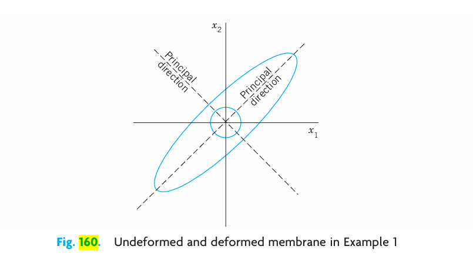
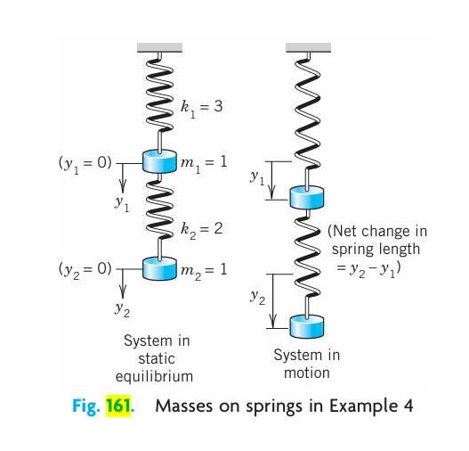
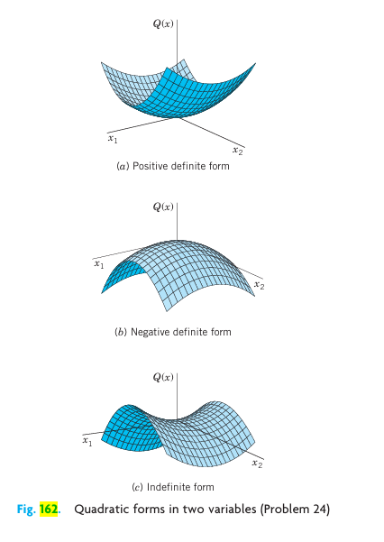
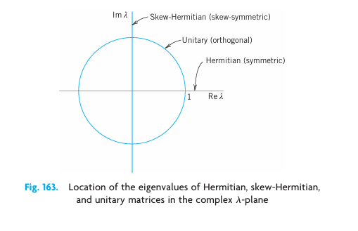

A matrix eigenvalue problem considers the vector equation

$$
\mathbf{Ax} = \lambda\mathbf{x}.
$$ {#eq-8-1}

Here $\mathbf{A}$ is a given square matrix, $\lambda$ an unknown scalar, and $\mathbf{x}$ an unknown vector. In a matrix eigenvalue problem, the task is to determine $\lambda$’s and $\mathbf{x}$’s that satisfy (@eq-8-1). Since $\mathbf{x} = \mathbf{0}$ is always a solution for any $\lambda$ and thus not interesting, we only admit solutions with $\mathbf{x} \neq \mathbf{0}$.

The solutions to (@eq-8-1) are given the following names: The $\lambda$’s that satisfy (@eq-8-1) are called **eigenvalues** of $\mathbf{A}$ and the corresponding nonzero $\mathbf{x}$’s that also satisfy (@eq-8-1) are called **eigenvectors** of $\mathbf{A}$.

From this rather innocent looking vector equation flows an amazing amount of relevant theory and an incredible richness of applications. Indeed, eigenvalue problems come up all the time in engineering, physics, geometry, numerics, theoretical mathematics, biology, environmental science, urban planning, economics, psychology, and other areas. Thus, in your career you are likely to encounter eigenvalue problems.

We start with a basic and thorough introduction to eigenvalue problems in Sec. 8.1 and explain (@eq-8-1) with several simple matrices. This is followed by a section devoted entirely to applications ranging from mass–spring systems of physics to population control models of environmental science. We show you these diverse examples to train your skills in modeling and solving eigenvalue problems. Eigenvalue problems for real symmetric, skew-symmetric, and orthogonal matrices are discussed in Sec. 8.3 and their complex counterparts (which are important in modern physics) in Sec. 8.5. In Sec. 8.4 we show how by diagonalizing a matrix, we obtain its eigenvalues.

**COMMENT.** Numerics for eigenvalues (Secs. 20.6–20.9) can be studied immediately after this chapter.

**Prerequisite:** Chap. 7.

**Sections that may be omitted in a shorter course:** 8.4, 8.5.

**References and Answers to Problems:** App. 1 Part B, App. 2.

---

| Topic | Where to find it |
| :--- | :--- |
| Matrix Eigenvalue Problem (algebraic eigenvalue problem) | Chap. 8 |
| Eigenvalue Problems in Numerics | Secs. 20.6–20.9 |
| Eigenvalue Problem for ODEs (Sturm–Liouville problems) | Secs. 11.5, 11.6 |
| Eigenvalue Problems for Systems of ODEs | Chap. 4 |
| Eigenvalue Problems for PDEs | Secs. 12.3–12.11 |

---

## 8.1 The Matrix Eigenvalue Problem. Determining Eigenvalues and Eigenvectors {#sec-8-1}

Consider multiplying nonzero vectors by a given square matrix, such as

$$
\begin{bmatrix} 6 & 3 \\ 4 & 7 \end{bmatrix} \begin{bmatrix} 5 \\ 1 \end{bmatrix} = \begin{bmatrix} 33 \\ 27 \end{bmatrix},
\quad
\begin{bmatrix} 6 & 3 \\ 4 & 7 \end{bmatrix} \begin{bmatrix} 3 \\ 4 \end{bmatrix} = \begin{bmatrix} 30 \\ 40 \end{bmatrix}.
$$

We want to see what influence the multiplication of the given matrix has on the vectors. In the first case, we get a totally new vector with a different direction and different length when compared to the original vector. This is what usually happens and is of no interest here. In the second case something interesting happens. The multiplication produces a vector $[30 \quad 40]^T = 10 [3 \quad 4]^T$, which means the new vector has the same direction as the original vector. The scale constant, which we denote by $\lambda$ is $10$. The problem of systematically finding such $\lambda$’s and nonzero vectors for a given square matrix will be the theme of this chapter. It is called the **matrix eigenvalue problem** or, more commonly, the **eigenvalue problem**.

We formalize our observation. Let $\mathbf{A} = [a_{jk}]$ be a given nonzero square matrix of dimension $n \times n$. Consider the following vector equation:

$$
\mathbf{Ax} = \lambda\mathbf{x}.
$$ {#eq-8-1-eq}

The problem of finding nonzero $\mathbf{x}$’s and $\lambda$’s that satisfy equation (@eq-8-1-eq) is called an **eigenvalue problem**.

**Remark.** So $\mathbf{A}$ is a given square (!) matrix, $\mathbf{x}$ is an unknown vector, and $\lambda$ is an unknown scalar. Our task is to find $\lambda$’s and nonzero $\mathbf{x}$’s that satisfy (@eq-8-1-eq). Geometrically, we are looking for vectors, $\mathbf{x}$, for which the multiplication by $\mathbf{A}$ has the same effect as the multiplication by a scalar $\lambda$; in other words, $\mathbf{Ax}$ should be proportional to $\mathbf{x}$. Thus, the multiplication has the effect of producing, from the original vector $\mathbf{x}$, a new vector $\lambda\mathbf{x}$ that has the same or opposite (minus sign) direction as the original vector. (This was all demonstrated in our intuitive opening example. Can you see that the second equation in that example satisfies (@eq-8-1-eq) with $\lambda = 10$ and $\mathbf{x} = [3 \quad 4]^T$, and $\mathbf{A}$ the given $2 \times 2$ matrix? Write it out.) Now why do we require $\mathbf{x}$ to be nonzero? The reason is that $\mathbf{x} = \mathbf{0}$ is always a solution of (@eq-8-1-eq) for any value of $\lambda$, because $\mathbf{A}\mathbf{0} = \mathbf{0}$. This is of no interest.

We introduce more terminology. A value of $\lambda$, for which (@eq-8-1-eq) has a solution $\mathbf{x} \neq \mathbf{0}$, is called an **eigenvalue** or **characteristic value** of the matrix $\mathbf{A}$. Another term for $\lambda$ is a **latent root**. (“Eigen” is German and means “proper” or “characteristic.”). The corresponding solutions $\mathbf{x} \neq \mathbf{0}$ of (@eq-8-1-eq) are called the **eigenvectors** or **characteristic vectors** of $\mathbf{A}$ corresponding to that eigenvalue $\lambda$. The set of all the eigenvalues of $\mathbf{A}$ is called the **spectrum** of $\mathbf{A}$. We shall see that the spectrum consists of at least one eigenvalue and at most of $n$ numerically different eigenvalues. The largest of the absolute values of the eigenvalues of $\mathbf{A}$ is called the **spectral radius** of $\mathbf{A}$, a name to be motivated later.

### How to Find Eigenvalues and Eigenvectors

Now, with the new terminology for (@eq-8-1-eq), we can just say that the problem of determining the eigenvalues and eigenvectors of a matrix is called an eigenvalue problem. (However, more precisely, we are considering an algebraic eigenvalue problem, as opposed to an eigenvalue problem involving an ODE or PDE, as considered in Sec. 11.5 and 12.3, or an integral equation.)

Eigenvalues have a very large number of applications in diverse fields such as in engineering, geometry, physics, mathematics, biology, environmental science, economics, psychology, and other areas. You will encounter applications for elastic membranes, Markov processes, population models, and others in this chapter.

Since, from the viewpoint of engineering applications, eigenvalue problems are the most important problems in connection with matrices, the student should carefully follow our discussion.

Example 1 demonstrates how to systematically solve a simple eigenvalue problem.

### EXAMPLE 1 Determination of Eigenvalues and Eigenvectors

We illustrate all the steps in terms of the matrix

$$
\mathbf{A} = \begin{bmatrix} -5 & 2 \\ 2 & -2 \end{bmatrix}.
$$

**Solution.**

**(a) Eigenvalues.** These must be determined first. Equation (@eq-8-1-eq) is

$$
\mathbf{Ax} = \begin{bmatrix} -5 & 2 \\ 2 & -2 \end{bmatrix} \begin{bmatrix} x_1 \\ x_2 \end{bmatrix} = \lambda \begin{bmatrix} x_1 \\ x_2 \end{bmatrix};
$$

in components,

$$
\begin{aligned}
-5x_1 + 2x_2 &= \lambda x_1 \\
2x_1 - 2x_2 &= \lambda x_2.
\end{aligned}
$$

Transferring the terms on the right to the left, we get

$$
\begin{aligned}
(-5-\lambda)x_1 + 2x_2 &= 0 \\
2x_1 + (-2-\lambda)x_2 &= 0.
\end{aligned}
$$ {#eq-8-2-star}

This can be written in matrix notation

$$
(\mathbf{A} - \lambda\mathbf{I})\mathbf{x} = \mathbf{0}
$$ {#eq-8-3-star}

because $\mathbf{Ax} - \lambda\mathbf{x} = \mathbf{Ax} - \lambda\mathbf{I}\mathbf{x} = (\mathbf{A} - \lambda\mathbf{I})\mathbf{x} = \mathbf{0}$, which gives (@eq-8-3-star). We see that this is a homogeneous linear system. By Cramer’s theorem in Sec. 7.7 it has a nontrivial solution $\mathbf{x} \neq \mathbf{0}$ (an eigenvector of $\mathbf{A}$ we are looking for) if and only if its coefficient determinant is zero, that is,

$$
D(\lambda) = \det(\mathbf{A} - \lambda\mathbf{I}) = \begin{vmatrix} -5-\lambda & 2 \\ 2 & -2-\lambda \end{vmatrix} = (-5-\lambda)(-2-\lambda) - 4 = \lambda^2 + 7\lambda + 6 = 0.
$$ {#eq-8-4-star}

We call $D(\lambda)$ the **characteristic determinant** or, if expanded, the **characteristic polynomial**, and $D(\lambda) = 0$ the **characteristic equation** of $\mathbf{A}$. The solutions of this quadratic equation are $\lambda_1 = -1$ and $\lambda_2 = -6$. These are the eigenvalues of $\mathbf{A}$.

**(b1) Eigenvector of $\mathbf{A}$ corresponding to $\lambda_1$.** This vector is obtained from (@eq-8-2-star) with $\lambda = \lambda_1 = -1$, that is,

$$
\begin{aligned}
-4x_1 + 2x_2 &= 0 \\
2x_1 - x_2 &= 0.
\end{aligned}
$$

A solution is $x_2 = 2x_1$, as we see from either of the two equations, so that we need only one of them. This determines an eigenvector corresponding to $\lambda_1 = -1$ up to a scalar multiple. If we choose $x_1 = 1$, we obtain the eigenvector

$$
\mathbf{x}_1 = \begin{bmatrix} 1 \\ 2 \end{bmatrix}.
\quad \text{Check:} \quad
\mathbf{Ax}_1 = \begin{bmatrix} -5 & 2 \\ 2 & -2 \end{bmatrix} \begin{bmatrix} 1 \\ 2 \end{bmatrix} = \begin{bmatrix} -1 \\ -2 \end{bmatrix} = (-1)\mathbf{x}_1 = \lambda_1\mathbf{x}_1.
$$

**(b2) Eigenvector of $\mathbf{A}$ corresponding to $\lambda_2$.** For $\lambda = \lambda_2 = -6$, equation (@eq-8-2-star) becomes

$$
\begin{aligned}
x_1 + 2x_2 &= 0 \\
2x_1 + 4x_2 &= 0.
\end{aligned}
$$

A solution is $x_1 = -2x_2$ with arbitrary $x_2$. If we choose $x_2 = 1$, we get $x_1 = -2$. Thus an eigenvector of $\mathbf{A}$ corresponding to $\lambda_2 = -6$ is

$$
\mathbf{x}_2 = \begin{bmatrix} -2 \\ 1 \end{bmatrix}.
\quad \text{Check:} \quad
\mathbf{Ax}_2 = \begin{bmatrix} -5 & 2 \\ 2 & -2 \end{bmatrix} \begin{bmatrix} -2 \\ 1 \end{bmatrix} = \begin{bmatrix} 12 \\ -6 \end{bmatrix} = (-6)\mathbf{x}_2 = \lambda_2\mathbf{x}_2.
$$

For the matrix in the intuitive opening example at the start of Sec. 8.1, the characteristic equation is $\lambda^2 - 13\lambda + 30 = (\lambda - 10)(\lambda - 3) = 0$. The eigenvalues are $\{10, 3\}$. Corresponding eigenvectors are $[3 \quad 4]^T$ and $[-1 \quad 1]^T$, respectively. The reader may want to verify this. $\square$

This example illustrates the general case as follows. Equation (@eq-8-1-eq) written in components is

$$
\begin{aligned}
a_{11}x_1 + a_{12}x_2 + \cdots + a_{1n}x_n &= \lambda x_1 \\
a_{21}x_1 + a_{22}x_2 + \cdots + a_{2n}x_n &= \lambda x_2 \\
&\;\,\vdots \\
a_{n1}x_1 + a_{n2}x_2 + \cdots + a_{nn}x_n &= \lambda x_n.
\end{aligned}
$$

Transferring the terms on the right side to the left side, we have

$$
\begin{aligned}
(a_{11} - \lambda)x_1 + a_{12}x_2 + \cdots + a_{1n}x_n &= 0 \\
a_{21}x_1 + (a_{22} - \lambda)x_2 + \cdots + a_{2n}x_n &= 0 \\
&\;\,\vdots \\
a_{n1}x_1 + a_{n2}x_2 + \cdots + (a_{nn} - \lambda)x_n &= 0.
\end{aligned}
$$ {#eq-8-2}

In matrix notation,

$$
(\mathbf{A} - \lambda\mathbf{I})\mathbf{x} = \mathbf{0}.
$$ {#eq-8-3}

By Cramer’s theorem in Sec. 7.7, this homogeneous linear system of equations has a nontrivial solution if and only if the corresponding determinant of the coefficients is zero:

$$
D(\lambda) = \det(\mathbf{A} - \lambda\mathbf{I}) = \begin{vmatrix}
a_{11} - \lambda & a_{12} & \cdots & a_{1n} \\
a_{21} & a_{22} - \lambda & \cdots & a_{2n} \\
\vdots & \vdots & \ddots & \vdots \\
a_{n1} & a_{n2} & \cdots & a_{nn} - \lambda
\end{vmatrix} = 0.
$$ {#eq-8-4}

$\mathbf{A} - \lambda\mathbf{I}$ is called the **characteristic matrix** and $D(\lambda)$ the **characteristic determinant** of $\mathbf{A}$. Equation (@eq-8-4) is called the **characteristic equation** of $\mathbf{A}$. By developing $D(\lambda)$ we obtain a polynomial of $n$-th degree in $\lambda$. This is called the **characteristic polynomial** of $\mathbf{A}$.

This proves the following important theorem.

**THEOREM 1: Eigenvalues**

The eigenvalues of a square matrix $\mathbf{A}$ are the roots of the characteristic equation (@eq-8-4) of $\mathbf{A}$.

Hence an $n \times n$ matrix has at least one eigenvalue and at most $n$ numerically different eigenvalues.

For larger $n$, the actual computation of eigenvalues will, in general, require the use of Newton’s method (Sec. 19.2) or another numeric approximation method in Secs. 20.7–20.9.

The eigenvalues must be determined first. Once these are known, corresponding eigenvectors are obtained from the system (@eq-8-2), for instance, by the Gauss elimination, where $\lambda$ is the eigenvalue for which an eigenvector is wanted. This is what we did in Example 1 and shall do again in the examples below. (To prevent misunderstandings: numeric approximation methods, such as in Sec. 20.8, may determine eigenvectors first.)

Eigenvectors have the following properties.

**THEOREM 2: Eigenvectors, Eigenspace**

If $\mathbf{w}$ and $\mathbf{x}$ are eigenvectors of a matrix $\mathbf{A}$ corresponding to the same eigenvalue $\lambda$, so are $\mathbf{w} + \mathbf{x}$ (provided $\mathbf{x} \neq -\mathbf{w}$) and $k\mathbf{x}$ for any $k \neq 0$.

Hence the eigenvectors corresponding to one and the same eigenvalue $\lambda$ of $\mathbf{A}$, together with $\mathbf{0}$, form a vector space (cf. Sec. 7.4), called the **eigenspace** of $\mathbf{A}$ corresponding to that $\lambda$.

**PROOF** $\mathbf{Aw} = \lambda\mathbf{w}$ and $\mathbf{Ax} = \lambda\mathbf{x}$ imply $\mathbf{A}(\mathbf{w} + \mathbf{x}) = \mathbf{Aw} + \mathbf{Ax} = \lambda\mathbf{w} + \lambda\mathbf{x} = \lambda(\mathbf{w} + \mathbf{x})$ and $\mathbf{A}(k\mathbf{w}) = k(\mathbf{Aw}) = k(\lambda\mathbf{w}) = \lambda(k\mathbf{w})$; hence $\mathbf{A}(k\mathbf{w} + l\mathbf{x}) = \lambda(k\mathbf{w} + l\mathbf{x})$. $\square$

In particular, an eigenvector $\mathbf{x}$ is determined only up to a constant factor. Hence we can normalize $\mathbf{x}$, that is, multiply it by a scalar to get a unit vector (see Sec. 7.9). For instance, $\mathbf{x}_1 = [1 \quad 2]^T$ in Example 1 has the length $\|\mathbf{x}_1\| = \sqrt{1^2 + 2^2} = \sqrt{5}$; hence $[1/\sqrt{5} \quad 2/\sqrt{5}]^T$ is a normalized eigenvector (a unit eigenvector).

Examples 2 and 3 will illustrate that an $n \times n$ matrix may have $n$ linearly independent eigenvectors, or it may have fewer than $n$. In Example 4 we shall see that a real matrix may have complex eigenvalues and eigenvectors.

### EXAMPLE 2 Multiple Eigenvalues

Find the eigenvalues and eigenvectors of

$$
\mathbf{A} = \begin{bmatrix} -2 & 2 & -3 \\ 2 & 1 & -6 \\ -1 & -2 & 0 \end{bmatrix}.
$$

**Solution.** For our matrix, the characteristic determinant gives the characteristic equation

$$
-\lambda^3 - \lambda^2 + 21\lambda + 45 = 0.
$$

The roots (eigenvalues of $\mathbf{A}$) are $\lambda_1 = 5$, $\lambda_2 = \lambda_3 = -3$. (If you have trouble finding roots, you may want to use a root finding algorithm such as Newton’s method (Sec. 19.2). Your CAS or scientific calculator can find roots. However, to really learn and remember this material, you have to do some exercises with paper and pencil.)

To find eigenvectors, we apply the Gauss elimination (Sec. 7.3) to the system $(\mathbf{A} - \lambda\mathbf{I})\mathbf{x} = \mathbf{0}$, first with $\lambda = 5$ and then with $\lambda = -3$. For $\lambda = 5$ the characteristic matrix is

$$
\mathbf{A} - 5\mathbf{I} = \begin{bmatrix} -7 & 2 & -3 \\ 2 & -4 & -6 \\ -1 & -2 & -5 \end{bmatrix}.
\quad \text{It row-reduces to} \quad
\begin{bmatrix} -7 & 2 & -3 \\ 0 & -24 & -48 \\ 0 & 0 & 0 \end{bmatrix}.
$$

Hence it has rank 2. Choosing $x_3 = -1$ we have $x_2 = 2$ from $-24x_2 - 48x_3 = 0$ and then $x_1 = 1$ from $-7x_1 + 2x_2 - 3x_3 = 0$. Hence an eigenvector of $\mathbf{A}$ corresponding to $\lambda = 5$ is $\mathbf{x}_1 = [1 \quad 2 \quad -1]^T$.

For $\lambda = -3$ the characteristic matrix

$$
\mathbf{A} - (-3\mathbf{I}) = \mathbf{A} + 3\mathbf{I} = \begin{bmatrix} 1 & 2 & -3 \\ 2 & 4 & -6 \\ -1 & -2 & 3 \end{bmatrix}
\quad \text{row-reduces to} \quad
\begin{bmatrix} 1 & 2 & -3 \\ 0 & 0 & 0 \\ 0 & 0 & 0 \end{bmatrix}.
$$

Hence it has rank 1. From $x_1 + 2x_2 - 3x_3 = 0$ we have $x_1 = -2x_2 + 3x_3$. Choosing $x_2 = 1, x_3 = 0$ and $x_2 = 0, x_3 = 1$, we obtain two linearly independent eigenvectors of $\mathbf{A}$ corresponding to $\lambda = -3$ [as they must exist by (5), Sec. 7.5, with $\text{rank} = 1$ and $n = 3$],

$$
\mathbf{x}_2 = \begin{bmatrix} -2 \\ 1 \\ 0 \end{bmatrix}
\quad \text{and} \quad
\mathbf{x}_3 = \begin{bmatrix} 3 \\ 0 \\ 1 \end{bmatrix}. \quad \square
$$

The order $M_\lambda$ of an eigenvalue $\lambda$ as a root of the characteristic polynomial is called the **algebraic multiplicity** of $\lambda$. The number $m_\lambda$ of linearly independent eigenvectors corresponding to $\lambda$ is called the **geometric multiplicity** of $\lambda$. Thus $m_\lambda$ is the dimension of the eigenspace corresponding to this $\lambda$.

Since the characteristic polynomial has degree $n$, the sum of all the algebraic multiplicities must equal $n$. In Example 2 for $\lambda = -3$ we have $m_\lambda = M_\lambda = 2$. In general, $m_\lambda \le M_\lambda$, as can be shown. The difference $\Delta_\lambda = M_\lambda - m_\lambda$ is called the **defect** of $\lambda$. Thus $\Delta_\lambda = 0$ in Example 2, but positive defects $\Delta_\lambda$ can easily occur:

### EXAMPLE 3 Algebraic Multiplicity, Geometric Multiplicity. Positive Defect

The characteristic equation of the matrix

$$
\mathbf{A} = \begin{bmatrix} 0 & 1 \\ 0 & 0 \end{bmatrix}
\quad \text{is} \quad
\det(\mathbf{A} - \lambda\mathbf{I}) = \begin{vmatrix} -\lambda & 1 \\ 0 & -\lambda \end{vmatrix} = \lambda^2 = 0.
$$

Hence $\lambda = 0$ is an eigenvalue of algebraic multiplicity $M_0 = 2$. But its geometric multiplicity is only $m_0 = 1$, since eigenvectors result from $-0x_1 + x_2 = 0$, hence $x_2 = 0$, in the form $[x_1 \quad 0]^T$. Hence for $\lambda = 0$ the defect is $\Delta_0 = 1$.

Similarly, the characteristic equation of the matrix

$$
\mathbf{A} = \begin{bmatrix} 3 & 2 \\ 0 & 3 \end{bmatrix}
\quad \text{is} \quad
\det(\mathbf{A} - \lambda\mathbf{I}) = \begin{vmatrix} 3-\lambda & 2 \\ 0 & 3-\lambda \end{vmatrix} = (3-\lambda)^2 = 0.
$$

Hence $\lambda = 3$ is an eigenvalue of algebraic multiplicity $M_3 = 2$, but its geometric multiplicity is only $m_3 = 1$, since eigenvectors result from $0x_1 + 2x_2 = 0$, hence $x_2 = 0$, in the form $[x_1 \quad 0]^T$. Thus the defect is $\Delta_3 = 1$. $\square$

### EXAMPLE 4 Real Matrices with Complex Eigenvalues and Eigenvectors

Since real polynomials may have complex roots (which then occur in conjugate pairs), a real matrix may have complex eigenvalues and eigenvectors. For instance, the characteristic equation of the skew-symmetric matrix

$$
\mathbf{A} = \begin{bmatrix} 0 & 1 \\ -1 & 0 \end{bmatrix}
\quad \text{is} \quad
\det(\mathbf{A} - \lambda\mathbf{I}) = \begin{vmatrix} -\lambda & 1 \\ -1 & -\lambda \end{vmatrix} = \lambda^2 + 1 = 0.
$$

It gives the eigenvalues $\lambda_1 = i$ and $\lambda_2 = -i$. Eigenvectors are obtained from $-ix_1 + x_2 = 0$ and $ix_1 + x_2 = 0$, respectively, and we can choose $x_1 = 1$ to get

$$
\mathbf{x}_1 = \begin{bmatrix} 1 \\ i \end{bmatrix}
\quad \text{and} \quad
\mathbf{x}_2 = \begin{bmatrix} 1 \\ -i \end{bmatrix}. \quad \square
$$

In the next section we shall need the following simple theorem.

**THEOREM 3: Eigenvalues of the Transpose**

The transpose $\mathbf{A}^T$ of a square matrix $\mathbf{A}$ has the same eigenvalues as $\mathbf{A}$.

**PROOF** Transposition does not change the value of the characteristic determinant, as follows from Theorem 2d in Sec. 7.7. $\square$

Having gained a first impression of matrix eigenvalue problems, we shall illustrate their importance with some typical applications in Sec. 8.2.

---

### Problem Set 8.1 {#sec-problem-set-8-1}

**1–16 EIGENVALUES, EIGENVECTORS**

Find the eigenvalues. Find the corresponding eigenvectors. Use the given $\lambda$ or factor in Probs. 11 and 15.

1. $\begin{bmatrix} 3.0 & 0 \\ 0 & -0.6 \end{bmatrix}$
2. $\begin{bmatrix} 0 & 0 \\ 0 & 0 \end{bmatrix}$
3. $\begin{bmatrix} 5 & -2 \\ 9 & -6 \end{bmatrix}$
4. $\begin{bmatrix} 1 & 2 \\ 2 & 4 \end{bmatrix}$
5. $\begin{bmatrix} 0 & 3 \\ -3 & 0 \end{bmatrix}$
6. $\begin{bmatrix} 1 & 2 \\ 0 & 3 \end{bmatrix}$
7. $\begin{bmatrix} 0 & 1 \\ 0 & 0 \end{bmatrix}$
8. $\begin{bmatrix} a & b \\ -b & a \end{bmatrix}$
9. $\begin{bmatrix} 0.8 & -0.6 \\ 0.6 & 0.8 \end{bmatrix}$
10. $\begin{bmatrix} \cos u & -\sin u \\ \sin u & \cos u \end{bmatrix}$
11. $\begin{bmatrix} 6 & 2 & -2 \\ 2 & 5 & 0 \\ -2 & 0 & 7 \end{bmatrix}, \quad \lambda = 3$
12. $\begin{bmatrix} 3 & 5 & 3 \\ 0 & 4 & 6 \\ 0 & 0 & 1 \end{bmatrix}$
13. $\begin{bmatrix} 13 & 5 & 2 \\ 2 & 7 & -8 \\ 5 & 4 & 7 \end{bmatrix}$
14. $\begin{bmatrix} 2 & 0 & -1 \\ 0 & 1/2 & 0 \\ 1 & 0 & 4 \end{bmatrix}$
15. $\begin{bmatrix} -1 & 0 & 12 & 0 \\ 0 & -1 & 0 & 12 \\ 0 & 0 & -1 & -4 \\ 0 & 0 & -4 & -1 \end{bmatrix}, \quad \text{hint: } (\lambda+1)^2$
16. $\begin{bmatrix} -3 & 0 & 4 & 2 \\ 0 & 1 & -2 & 4 \\ 2 & 4 & -1 & -2 \\ 0 & 2 & -2 & 3 \end{bmatrix}$

**17–20 LINEAR TRANSFORMATIONS AND EIGENVALUES**

Find the matrix $\mathbf{A}$ in the linear transformation $\mathbf{y} = \mathbf{Ax}$, where $\mathbf{x} = [x_1 \quad x_2]^T$ ($\mathbf{x} = [x_1 \quad x_2 \quad x_3]^T$) are Cartesian coordinates. Find the eigenvalues and eigenvectors and explain their geometric meaning.

17. Counterclockwise rotation through the angle $\pi/2$ about the origin in $\mathbb{R}^2$.
18. Reflection about the $x_1$-axis in $\mathbb{R}^2$.
19. Orthogonal projection (perpendicular projection) of $\mathbb{R}^2$ onto the $x_1$-axis.
20. Orthogonal projection of $\mathbb{R}^3$ onto the plane $x_2 = x_1$.

**21–25 GENERAL PROBLEMS**

21. **Nonzero defect.** Find further $2\times2$ and $3\times3$ matrices with positive defect. See Example 3.
22. **Multiple eigenvalues.** Find further $2\times2$ and $3\times3$ matrices with multiple eigenvalues. See Example 2.
23. **Complex eigenvalues.** Show that the eigenvalues of a real matrix are real or complex conjugate in pairs.
24. **Inverse matrix.** Show that $\mathbf{A}^{-1}$ exists if and only if the eigenvalues $\lambda_1, \ldots, \lambda_n$ are all nonzero, and then $\mathbf{A}^{-1}$ has the eigenvalues $1/\lambda_1, \ldots, 1/\lambda_n$.
25. **Transpose.** Illustrate Theorem 3 with examples of your own.

---

## 8.2 Some Applications of Eigenvalue Problems {#sec-8-2}

We have selected some typical examples from the wide range of applications of matrix eigenvalue problems. The last example, that is, Example 4, shows an application involving vibrating springs and ODEs. It falls into the domain of Chapter 4, which covers matrix eigenvalue problems related to ODE’s modeling mechanical systems and electrical networks. Example 4 is included to keep our discussion independent of Chapter 4. (However, the reader not interested in ODEs may want to skip Example 4 without loss of continuity.)

### EXAMPLE 1 Stretching of an Elastic Membrane

An elastic membrane in the $x_1x_2$-plane with boundary circle $x_1^2 + x_2^2 = 1$ (@fig-8-160) is stretched so that a point $P: (x_1, x_2)$ goes over into the point $Q: (y_1, y_2)$ given by

$$
\mathbf{y} = \begin{bmatrix} y_1 \\ y_2 \end{bmatrix} = \mathbf{Ax} = \begin{bmatrix} 5 & 3 \\ 3 & 5 \end{bmatrix} \begin{bmatrix} x_1 \\ x_2 \end{bmatrix};
\quad \text{in components,} \quad
\begin{aligned}
y_1 &= 5x_1 + 3x_2 \\
y_2 &= 3x_1 + 5x_2.
\end{aligned}
$$ {#eq-8-2-1}

Find the principal directions, that is, the directions of the position vector $\mathbf{x}$ of $P$ for which the direction of the position vector $\mathbf{y}$ of $Q$ is the same or exactly opposite. What shape does the boundary circle take under this deformation?

{#fig-8-160}

**Solution.** We are looking for vectors $\mathbf{x}$ such that $\mathbf{y} = \lambda\mathbf{x}$. Since $\mathbf{y} = \mathbf{Ax}$, this gives $\mathbf{Ax} = \lambda\mathbf{x}$, the equation of an eigenvalue problem. In components, $\mathbf{Ax} = \lambda\mathbf{x}$ is

$$
\begin{aligned}
5x_1 + 3x_2 &= \lambda x_1 \\
3x_1 + 5x_2 &= \lambda x_2
\end{aligned}
\quad \text{or} \quad
\begin{aligned}
(5-\lambda)x_1 + 3x_2 &= 0 \\
3x_1 + (5-\lambda)x_2 &= 0.
\end{aligned}
$$ {#eq-8-2-2}

The characteristic equation is

$$
\begin{vmatrix} 5-\lambda & 3 \\ 3 & 5-\lambda \end{vmatrix} = (5-\lambda)^2 - 9 = 0.
$$ {#eq-8-2-3}

Its solutions are $\lambda_1 = 8$ and $\lambda_2 = 2$. These are the eigenvalues of our problem. For $\lambda = \lambda_1 = 8$, our system (@eq-8-2-2) becomes

$$
\begin{aligned}
-3x_1 + 3x_2 &= 0, \\
3x_1 - 3x_2 &= 0.
\end{aligned}
\quad \text{Solution } x_2 = x_1, \text{ with arbitrary } x_1, \text{ for instance, } x_1 = x_2 = 1.
$$

For $\lambda = \lambda_2 = 2$, our system (@eq-8-2-2) becomes

$$
\begin{aligned}
3x_1 + 3x_2 &= 0, \\
3x_1 + 3x_2 &= 0.
\end{aligned}
\quad \text{Solution } x_2 = -x_1, \text{ with arbitrary } x_1, \text{ for instance, } x_1 = 1, x_2 = -1.
$$

We thus obtain as eigenvectors of $\mathbf{A}$, for instance, $[1 \quad 1]^T$ corresponding to $\lambda_1$ and $[1 \quad -1]^T$ corresponding to $\lambda_2$ (or a nonzero scalar multiple of these). These vectors make $45^\circ$ and $135^\circ$ angles with the positive $x_1$-direction. They give the principal directions, the answer to our problem. The eigenvalues show that in the principal directions the membrane is stretched by factors $8$ and $2$, respectively; see @fig-8-160.

Accordingly, if we choose the principal directions as directions of a new Cartesian $u_1u_2$-coordinate system, say, with the positive $u_1$-semi-axis in the first quadrant and the positive $u_2$-semi-axis in the second quadrant of the $x_1x_2$-system, and if we set $u_1 = r \cos \theta$, $u_2 = r \sin \theta$, then a boundary point of the unstretched circular membrane has coordinates $\cos \theta, \sin \theta$. Hence, after the stretch we have

$$
z_1 = 8 \cos \theta, \quad z_2 = 2 \sin \theta.
$$

Since $\cos^2 \theta + \sin^2 \theta = 1$, this shows that the deformed boundary is an ellipse (@fig-8-160)

$$
\frac{z_1^2}{8^2} + \frac{z_2^2}{2^2} = 1. \quad \square
$$ {#eq-8-2-4}

### EXAMPLE 2 Eigenvalue Problems Arising from Markov Processes

Markov processes as considered in Example 13 of Sec. 7.2 lead to eigenvalue problems if we ask for the limit state of the process in which the state vector $\mathbf{x}$ is reproduced under the multiplication by the stochastic matrix $\mathbf{A}$ governing the process, that is, $\mathbf{Ax} = \mathbf{x}$. Hence $\mathbf{A}$ should have the eigenvalue $1$, and $\mathbf{x}$ should be a corresponding eigenvector. This is of practical interest because it shows the long-term tendency of the development modeled by the process.

In that example,

$$
\mathbf{A} = \begin{bmatrix} 0.7 & 0.1 & 0 \\ 0.2 & 0.9 & 0.2 \\ 0.1 & 0 & 0.8 \end{bmatrix}.
\quad \text{For the transpose,} \quad
\mathbf{A}^T = \begin{bmatrix} 0.7 & 0.2 & 0.1 \\ 0.1 & 0.9 & 0 \\ 0 & 0.2 & 0.8 \end{bmatrix}.
$$

Since the column sums of $\mathbf{A}$ are $1$, the row sums of $\mathbf{A}^T$ are $1$. Hence $\mathbf{A}^T$ has the eigenvalue $1$, because multiplying $\mathbf{A}^T$ by a column vector of all ones $[1 \quad 1 \quad 1]^T$ gives $[1 \quad 1 \quad 1]^T$ itself:

$$
\mathbf{A}^T \begin{bmatrix} 1 \\ 1 \\ 1 \end{bmatrix} = \begin{bmatrix} 0.7 & 0.2 & 0.1 \\ 0.1 & 0.9 & 0 \\ 0 & 0.2 & 0.8 \end{bmatrix} \begin{bmatrix} 1 \\ 1 \\ 1 \end{bmatrix} = \begin{bmatrix} 1 \\ 1 \\ 1 \end{bmatrix}.
$$

Hence $\mathbf{A}^T$ has the eigenvalue $1$, and the same is true for $\mathbf{A}$ by Theorem 3 in Sec. 8.1. An eigenvector $\mathbf{x}$ of $\mathbf{A}$ for $\lambda = 1$ is obtained from

$$
\mathbf{A} - \mathbf{I} = \begin{bmatrix} -0.3 & 0.1 & 0 \\ 0.2 & -0.1 & 0.2 \\ 0.1 & 0 & -0.2 \end{bmatrix},
\quad \text{row-reduced to} \quad
\begin{bmatrix} -3 & 1 & 0 \\ 0 & -1 & 1 \\ 0 & 0 & 0 \end{bmatrix}.
$$

Taking $x_3 = 1$, we get $x_1 = 2$, and $x_2 = 6$ (from $-x_2 + 6x_3 = 0$ with row-scaling, or by solving the linear equations).
This gives $\mathbf{x} = [2 \quad 6 \quad 1]^T$. It means that in the long run, the ratio Commercial:Industrial:Residential will approach 2:6:1, provided that the probabilities given by $\mathbf{A}$ remain (about) the same. (We switched to ordinary fractions to avoid rounding errors.) $\square$

### EXAMPLE 3 Eigenvalue Problems Arising from Population Models. Leslie Model

The Leslie model describes age-specified population growth, as follows. Let the oldest age attained by the females in some animal population be 9 years. Divide the population into three age classes of 3 years each. Let the “Leslie matrix” be

$$
\mathbf{L} = [l_{jk}] = \begin{bmatrix} 0 & 2.3 & 0.4 \\ 0.6 & 0 & 0 \\ 0 & 0.3 & 0 \end{bmatrix}
$$ {#eq-8-2-5}

where $l_{1k}$ is the average number of daughters born to a single female during the time she is in age class $k$, and $l_{j, j-1}$ ($j = 2, 3$) is the fraction of females in age class $j-1$ that will survive and pass into class $j$.

(a) What is the number of females in each class after 3, 6, 9 years if each class initially consists of 400 females?
(b) For what initial distribution will the number of females in each class change by the same proportion? What is this rate of change?

**Solution.**

(a) Initially, $\mathbf{x}^{(0)} = [400 \quad 400 \quad 400]^T$. After 3 years,

$$
\mathbf{x}^{(3)} = \mathbf{L}\mathbf{x}^{(0)} = \begin{bmatrix} 0 & 2.3 & 0.4 \\ 0.6 & 0 & 0 \\ 0 & 0.3 & 0 \end{bmatrix} \begin{bmatrix} 400 \\ 400 \\ 400 \end{bmatrix} = \begin{bmatrix} 1080 \\ 240 \\ 120 \end{bmatrix}.
$$

Similarly, after 6 years the number of females in each class is given by $\mathbf{x}^{(6)} = \mathbf{L}\mathbf{x}^{(3)} = [600 \quad 648 \quad 72]^T$, and after 9 years we have $\mathbf{x}^{(9)} = \mathbf{L}\mathbf{x}^{(6)} = [1519.2 \quad 360 \quad 194.4]^T$.

(b) Proportional change means that we are looking for a distribution vector $\mathbf{x}$ such that $\mathbf{L}\mathbf{x} = \lambda\mathbf{x}$, where $\lambda$ is the rate of change (growth if $\lambda > 1$, decrease if $\lambda < 1$). The characteristic equation is (develop the characteristic determinant by the first column)

$$
\det(\mathbf{L} - \lambda\mathbf{I}) = -\lambda^3 - 0.6(-2.3\lambda - 0.3 \cdot 0.4) = -\lambda^3 + 1.38\lambda + 0.072 = 0.
$$

A positive root is found to be (for instance, by Newton’s method, Sec. 19.2) $\lambda = 1.2$. A corresponding eigenvector $\mathbf{x}$ can be determined from the characteristic matrix:

$$
\mathbf{L} - 1.2\mathbf{I} = \begin{bmatrix} -1.2 & 2.3 & 0.4 \\ 0.6 & -1.2 & 0 \\ 0 & 0.3 & -1.2 \end{bmatrix}.
$$

If we choose $x_3 = 0.125$, then $x_2 = 0.5$ follows from $0.3x_2 - 1.2x_3 = 0$, and $x_1 = 1$ follows from $-1.2x_1 + 2.3x_2 + 0.4x_3 = 0$. This gives the eigenvector

$$
\mathbf{x} = \begin{bmatrix} 1 \\ 0.5 \\ 0.125 \end{bmatrix}.
$$

To get an initial population of 1200 as before, we multiply $\mathbf{x}$ by $1200 / (1 + 0.5 + 0.125) = 738$.

**Answer:** Proportional growth of the numbers of females in the three classes will occur if the initial values are 738, 369, 92 in classes 1, 2, 3, respectively. The growth rate will be 1.2 per 3 years. $\square$

### EXAMPLE 4 Vibrating System of Two Masses on Two Springs (@fig-8-161)

Mass–spring systems involving several masses and springs can be treated as eigenvalue problems. For instance, the mechanical system in @fig-8-161 is governed by the system of ODEs

$$
\begin{aligned}
y_1'' &= -3y_1 - 2(y_1 - y_2) = -5y_1 + 2y_2 \\
y_2'' &= -2(y_2 - y_1) = 2y_1 - 2y_2
\end{aligned}
$$ {#eq-8-2-6}

where $y_1$ and $y_2$ are the displacements of the masses from rest, as shown in the figure, and primes denote derivatives with respect to time $t$. In vector form, this becomes

$$
\mathbf{y}'' = \begin{bmatrix} y_1'' \\ y_2'' \end{bmatrix} = \mathbf{A}\mathbf{y} = \begin{bmatrix} -5 & 2 \\ 2 & -2 \end{bmatrix} \begin{bmatrix} y_1 \\ y_2 \end{bmatrix}.
$$ {#eq-8-2-7}

{#fig-8-161}

We try a vector solution of the form

$$
\mathbf{y}(t) = \mathbf{x}e^{\omega t}.
$$ {#eq-8-2-8}

This is suggested by a mechanical system of a single mass on a spring (Sec. 2.4), whose motion is given by exponential functions (and sines and cosines). Substitution into (@eq-8-2-7) gives

$$
\omega^2\mathbf{x}e^{\omega t} = \mathbf{A}\mathbf{x}e^{\omega t}.
$$

Dividing by $e^{\omega t}$ and writing $\omega^2 = \lambda$, we see that our mechanical system leads to the eigenvalue problem

$$
\mathbf{Ax} = \lambda\mathbf{x} \quad \text{where} \quad \lambda = \omega^2.
$$ {#eq-8-2-9}

From Example 1 in Sec. 8.1 we see that $\mathbf{A}$ has the eigenvalues $\lambda_1 = -1$ and $\lambda_2 = -6$. Consequently,

$$
\omega = \pm\sqrt{-1} = \pm i \quad \text{and} \quad \omega = \pm\sqrt{-6} = \pm i\sqrt{6},
$$

respectively. Corresponding eigenvectors are

$$
\mathbf{x}_1 = \begin{bmatrix} 1 \\ 2 \end{bmatrix} \quad \text{and} \quad \mathbf{x}_2 = \begin{bmatrix} -2 \\ 1 \end{bmatrix}.
$$ {#eq-8-2-10}

From (@eq-8-2-8) we thus obtain the four complex solutions [see (10), Sec. 2.2]

$$
\begin{aligned}
\mathbf{x}_1 e^{\pm it} &= \mathbf{x}_1(\cos t \pm i \sin t), \\
\mathbf{x}_2 e^{\pm i\sqrt{6}t} &= \mathbf{x}_2(\cos \sqrt{6}t \pm i \sin \sqrt{6}t).
\end{aligned}
$$

By addition and subtraction (see Sec. 2.2) we get the four real solutions

$$
\mathbf{x}_1 \cos t, \quad \mathbf{x}_1 \sin t, \quad \mathbf{x}_2 \cos \sqrt{6}t, \quad \mathbf{x}_2 \sin \sqrt{6}t.
$$

A general solution is obtained by taking a linear combination of these,

$$
\mathbf{y}(t) = \mathbf{x}_1(a_1 \cos t + b_1 \sin t) + \mathbf{x}_2(a_2 \cos \sqrt{6}t + b_2 \sin \sqrt{6}t)
$$

with arbitrary constants $a_1, b_1, a_2, b_2$ (to which values can be assigned by prescribing initial displacement and initial velocity of each of the two masses). By (@eq-8-2-10), the components of $\mathbf{y}$ are

$$
\begin{aligned}
y_1 &= a_1 \cos t + b_1 \sin t - 2a_2 \cos \sqrt{6}t - 2b_2 \sin \sqrt{6}t \\
y_2 &= 2a_1 \cos t + 2b_1 \sin t + a_2 \cos \sqrt{6}t + b_2 \sin \sqrt{6}t.
\end{aligned}
$$

These functions describe harmonic oscillations of the two masses. Physically, this had to be expected because we have neglected damping. $\square$

---

### Problem Set 8.2 {#sec-problem-set-8-2}

**1–6 ELASTIC DEFORMATIONS**

Given $\mathbf{A}$ in a deformation $\mathbf{y} = \mathbf{Ax}$, find the principal directions and corresponding factors of extension or contraction. Show the details.

1. $\begin{bmatrix} 3.0 & 1.5 \\ 1.5 & 3.0 \end{bmatrix}$
2. $\begin{bmatrix} 2.0 & 0.4 \\ 0.4 & 2.0 \end{bmatrix}$
3. $\begin{bmatrix} 7 & 16 \\ 16 & 2 \end{bmatrix}$
4. $\begin{bmatrix} 5 & 2 \\ 2 & 13 \end{bmatrix}$
5. $\begin{bmatrix} 1 & 1/2 \\ 1/2 & 1 \end{bmatrix}$
6. $\begin{bmatrix} 1.25 & 0.75 \\ 0.75 & 1.25 \end{bmatrix}$

**7–9 MARKOV PROCESSES**

Find the limit state of the Markov process modeled by the given matrix. Show the details.

7. $\begin{bmatrix} 0.2 & 0.5 \\ 0.8 & 0.5 \end{bmatrix}$
8. $\begin{bmatrix} 0.4 & 0.3 & 0.3 \\ 0.3 & 0.6 & 0.1 \\ 0.3 & 0.1 & 0.6 \end{bmatrix}$
9. $\begin{bmatrix} 0.6 & 0.1 & 0.2 \\ 0.4 & 0.1 & 0.4 \\ 0 & 0.8 & 0.4 \end{bmatrix}$

**10–12 AGE-SPECIFIC POPULATION**

Find the growth rate in the Leslie model (see Example 3) with the matrix as given. Show the details.

10. $\begin{bmatrix} 0 & 9.0 & 5.0 \\ 0.4 & 0 & 0 \\ 0 & 0.4 & 0 \end{bmatrix}$
11. $\begin{bmatrix} 0 & 3.45 & 0.60 \\ 0.90 & 0 & 0 \\ 0 & 0.45 & 0 \end{bmatrix}$
12. $\begin{bmatrix} 0 & 3.0 & 2.0 & 2.0 \\ 0.5 & 0 & 0 & 0 \\ 0 & 0.5 & 0 & 0 \\ 0 & 0 & 0.1 & 0 \end{bmatrix}$

**13–15 LEONTIEF MODELS**

13. **Leontief input–output model.** Suppose that three industries are interrelated so that their outputs are used as inputs by themselves, according to the $3 \times 3$ consumption matrix
$$
\mathbf{A} = \begin{bmatrix} 0.1 & 0.5 & 0 \\ 0.8 & 0 & 0.4 \\ 0.1 & 0.5 & 0.6 \end{bmatrix}
$$
where $a_{jk}$ is the fraction of the output of industry $k$ consumed by industry $j$ (purchased by industry $j$ for its total output). Let $p_j$ be the price charged by industry $j$ for its total output. Find prices so that for each industry, total expenditures equal total income. Show that this leads to $\mathbf{Ap} = \mathbf{p}$, where $\mathbf{p} = [p_1 \quad p_2 \quad p_3]^T$, and find a solution $\mathbf{p}$ with nonnegative $p_1, p_2, p_3$.
14. Show that a consumption matrix as considered in Prob. 13 must have column sums $1$ and always has the eigenvalue $1$.
15. **Open Leontief input–output model.** If not the whole output but only a portion of it is consumed by the industries themselves, then instead of $\mathbf{Ax} = \mathbf{x}$ (as in Prob. 13), we have $\mathbf{x} - \mathbf{Ax} = \mathbf{y}$, where $\mathbf{x} = [x_1 \quad x_2 \quad x_3]^T$ is produced, $\mathbf{Ax}$ is consumed by the industries, and, thus, $\mathbf{y}$ is the net production available for other consumers. Find for what production $\mathbf{x}$ a given demand vector $\mathbf{y} = [0.1 \quad 0.3 \quad 0.1]^T$ can be achieved if the consumption matrix is
$$
\mathbf{A} = \begin{bmatrix} 0.1 & 0.4 & 0.2 \\ 0.5 & 0 & 0.1 \\ 0.1 & 0.4 & 0.4 \end{bmatrix}.
$$

**16–20 GENERAL PROPERTIES OF EIGENVALUE PROBLEMS**

Let $\mathbf{A} = [a_{jk}]$ be an $n \times n$ matrix with (not necessarily distinct) eigenvalues $\lambda_1, \ldots, \lambda_n$. Show:

16. **Trace.** The sum of the main diagonal entries, called the trace of $\mathbf{A}$, equals the sum of the eigenvalues of $\mathbf{A}$.
17. **“Spectral shift.”** $\mathbf{A} - k\mathbf{I}$ has the eigenvalues $\lambda_1 - k, \ldots, \lambda_n - k$ and the same eigenvectors as $\mathbf{A}$.
18. **Scalar multiples, powers.** $k\mathbf{A}$ has the eigenvalues $k\lambda_1, \ldots, k\lambda_n$. $\mathbf{A}^m$ ($m = 1, 2, \ldots$) has the eigenvalues $\lambda_1^m, \ldots, \lambda_n^m$. The eigenvectors are those of $\mathbf{A}$.
19. **Spectral mapping theorem.** The “polynomial matrix”
$$
p(\mathbf{A}) = k_m \mathbf{A}^m + k_{m-1} \mathbf{A}^{m-1} + \cdots + k_1 \mathbf{A} + k_0 \mathbf{I}
$$
has the eigenvalues
$$
p(\lambda_j) = k_m \lambda_j^m + k_{m-1} \lambda_j^{m-1} + \cdots + k_1 \lambda_j + k_0
$$
where $j = 1, \ldots, n$, and the same eigenvectors as $\mathbf{A}$.
20. **Perron’s theorem.** A Leslie matrix $\mathbf{L}$ with positive $l_{12}, l_{13}, l_{21}, l_{32}$ has a positive eigenvalue. (This is a special case of the Perron–Frobenius theorem in Sec. 20.7, which is difficult to prove in its general form.)

---

## 8.3 Symmetric, Skew-Symmetric, and Orthogonal Matrices {#sec-8-3}

We consider three classes of real square matrices that, because of their remarkable properties, occur quite frequently in applications. The first two matrices have already been mentioned in Sec. 7.2. The goal of Sec. 8.3 is to show their remarkable properties.

**DEFINITIONS: Symmetric, Skew-Symmetric, and Orthogonal Matrices**

A real square matrix $\mathbf{A} = [a_{jk}]$ is called:

- **symmetric** if transposition leaves it unchanged,
$$
\mathbf{A}^T = \mathbf{A}, \quad \text{thus} \quad a_{kj} = a_{jk},
$$ {#eq-8-3-1}
- **skew-symmetric** if transposition gives the negative of $\mathbf{A}$,
$$
\mathbf{A}^T = -\mathbf{A}, \quad \text{thus} \quad a_{kj} = -a_{jk},
$$ {#eq-8-3-2}
- **orthogonal** if transposition gives the inverse of $\mathbf{A}$,
$$
\mathbf{A}^T = \mathbf{A}^{-1}.
$$ {#eq-8-3-3}

### EXAMPLE 1 Symmetric, Skew-Symmetric, and Orthogonal Matrices

The matrices

$$
\mathbf{A} = \begin{bmatrix} -3 & 1 & 5 \\ 1 & 0 & -2 \\ 5 & -2 & 4 \end{bmatrix},
\quad
\mathbf{B} = \begin{bmatrix} 0 & 9 & -12 \\ -9 & 0 & 20 \\ 12 & -20 & 0 \end{bmatrix},
\quad
\mathbf{C} = \begin{bmatrix} 2/3 & 1/3 & 2/3 \\ -2/3 & 2/3 & 1/3 \\ 1/3 & 2/3 & -2/3 \end{bmatrix}
$$

are symmetric, skew-symmetric, and orthogonal, respectively, as you should verify. Every skew-symmetric matrix has all main diagonal entries zero. (Can you prove this?)

Any real square matrix $\mathbf{A}$ may be written as the sum of a symmetric matrix $\mathbf{R}$ and a skew-symmetric matrix $\mathbf{S}$, where

$$
\mathbf{R} = \frac{1}{2}(\mathbf{A} + \mathbf{A}^T) \quad \text{and} \quad \mathbf{S} = \frac{1}{2}(\mathbf{A} - \mathbf{A}^T).
$$ {#eq-8-3-4}

### EXAMPLE 2 Illustration of Formula (@eq-8-3-4)

$$
\mathbf{A} = \begin{bmatrix} 9 & 5 & 2 \\ 2 & 3 & -8 \\ 5 & 4 & 3 \end{bmatrix}
= \mathbf{R} + \mathbf{S}
= \begin{bmatrix} 9.0 & 3.5 & 3.5 \\ 3.5 & 3.0 & -2.0 \\ 3.5 & -2.0 & 3.0 \end{bmatrix}
+ \begin{bmatrix} 0 & 1.5 & -1.5 \\ -1.5 & 0 & -6.0 \\ 1.5 & 6.0 & 0 \end{bmatrix}. \quad \square
$$

**THEOREM 1: Eigenvalues of Symmetric and Skew-Symmetric Matrices**

(a) The eigenvalues of a symmetric matrix are real.
(b) The eigenvalues of a skew-symmetric matrix are pure imaginary or zero.

This basic theorem (and an extension of it) will be proved in Sec. 8.5.

### EXAMPLE 3 Eigenvalues of Symmetric and Skew-Symmetric Matrices

The matrices in (1) and (7) of Sec. 8.2 are symmetric and have real eigenvalues. The skew-symmetric matrix $\mathbf{B}$ in Example 1 has the eigenvalues $0$, $-25i$, and $25i$. (Verify this.) The following matrix has the real eigenvalues $1$ and $5$ but is not symmetric. Does this contradict Theorem 1?

$$
\begin{bmatrix} 3 & 4 \\ 1 & 3 \end{bmatrix}. \quad \square
$$

### Orthogonal Transformations and Orthogonal Matrices

Orthogonal transformations are transformations

$$
\mathbf{y} = \mathbf{Ax} \quad \text{where } \mathbf{A} \text{ is an orthogonal matrix.}
$$ {#eq-8-3-5}

With each vector $\mathbf{x}$ in $\mathbb{R}^n$ such a transformation assigns a vector $\mathbf{y}$ in $\mathbb{R}^n$. For instance, the plane rotation through an angle $\theta$

$$
\mathbf{y} = \begin{bmatrix} y_1 \\ y_2 \end{bmatrix} = \begin{bmatrix} \cos \theta & -\sin \theta \\ \sin \theta & \cos \theta \end{bmatrix} \begin{bmatrix} x_1 \\ x_2 \end{bmatrix}
$$ {#eq-8-3-6}

is an orthogonal transformation. It can be shown that any orthogonal transformation in the plane or in three-dimensional space is a rotation (possibly combined with a reflection in a straight line or a plane, respectively).

The main reason for the importance of orthogonal matrices is as follows.

**THEOREM 2: Invariance of Inner Product**

An orthogonal transformation preserves the value of the inner product of vectors $\mathbf{a}$ and $\mathbf{b}$ in $\mathbb{R}^n$, defined by

$$
\mathbf{a} \bullet \mathbf{b} = \mathbf{a}^T\mathbf{b} = \begin{bmatrix} a_1 & \cdots & a_n \end{bmatrix} \begin{bmatrix} b_1 \\ \vdots \\ b_n \end{bmatrix}.
$$ {#eq-8-3-7}

That is, for any $\mathbf{a}$ and $\mathbf{b}$ in $\mathbb{R}^n$, orthogonal $n \times n$ matrix $\mathbf{A}$, and $\mathbf{u} = \mathbf{Aa}$, $\mathbf{v} = \mathbf{Ab}$ we have $\mathbf{u} \bullet \mathbf{v} = \mathbf{a} \bullet \mathbf{b}$.

Hence the transformation also preserves the **length** or **norm** of any vector $\mathbf{a}$ in $\mathbb{R}^n$ given by

$$
\|\mathbf{a}\| = \sqrt{\mathbf{a} \bullet \mathbf{a}} = \sqrt{\mathbf{a}^T\mathbf{a}}.
$$ {#eq-8-3-8}

**PROOF** Let $\mathbf{A}$ be orthogonal. Let $\mathbf{u} = \mathbf{Aa}$ and $\mathbf{v} = \mathbf{Ab}$. We must show that $\mathbf{u} \bullet \mathbf{v} = \mathbf{a} \bullet \mathbf{b}$. Now $(\mathbf{Aa})^T = \mathbf{a}^T\mathbf{A}^T$ by (10d) in Sec. 7.2 and $\mathbf{A}^T\mathbf{A} = \mathbf{A}^{-1}\mathbf{A} = \mathbf{I}$ by (@eq-8-3-3). Hence

$$
\mathbf{u} \bullet \mathbf{v} = \mathbf{u}^T\mathbf{v} = (\mathbf{Aa})^T\mathbf{Ab} = \mathbf{a}^T\mathbf{A}^T\mathbf{Ab} = \mathbf{a}^T\mathbf{Ib} = \mathbf{a}^T\mathbf{b} = \mathbf{a} \bullet \mathbf{b}.
$$ {#eq-8-3-9}

From this the invariance of $\|\mathbf{a}\|$ follows if we set $\mathbf{b} = \mathbf{a}$. $\square$

Orthogonal matrices have further interesting properties as follows.

**THEOREM 3: Orthonormality of Column and Row Vectors**

A real square matrix is orthogonal if and only if its column vectors $\mathbf{a}_1, \ldots, \mathbf{a}_n$ (and also its row vectors) form an orthonormal system, that is,

$$
\mathbf{a}_j \bullet \mathbf{a}_k = \mathbf{a}_j^T\mathbf{a}_k = \begin{cases} 0 & \text{if } j \neq k \\ 1 & \text{if } j = k. \end{cases}
$$ {#eq-8-3-10}

**PROOF**

**(a)** Let $\mathbf{A}$ be orthogonal. Then $\mathbf{A}^{-1}\mathbf{A} = \mathbf{A}^T\mathbf{A} = \mathbf{I}$. In terms of column vectors $\mathbf{a}_1, \ldots, \mathbf{a}_n$,

$$
\mathbf{I} = \mathbf{A}^{-1}\mathbf{A} = \mathbf{A}^T\mathbf{A} = \begin{bmatrix} \mathbf{a}_1^T \\ \vdots \\ \mathbf{a}_n^T \end{bmatrix} \begin{bmatrix} \mathbf{a}_1 & \cdots & \mathbf{a}_n \end{bmatrix} = \begin{bmatrix}
\mathbf{a}_1^T\mathbf{a}_1 & \mathbf{a}_1^T\mathbf{a}_2 & \cdots & \mathbf{a}_1^T\mathbf{a}_n \\
\mathbf{a}_2^T\mathbf{a}_1 & \mathbf{a}_2^T\mathbf{a}_2 & \cdots & \mathbf{a}_2^T\mathbf{a}_n \\
\vdots & \vdots & \ddots & \vdots \\
\mathbf{a}_n^T\mathbf{a}_1 & \mathbf{a}_n^T\mathbf{a}_2 & \cdots & \mathbf{a}_n^T\mathbf{a}_n
\end{bmatrix}.
$$ {#eq-8-3-11}

The last equality implies (@eq-8-3-10), by the definition of the $n \times n$ unit matrix $\mathbf{I}$. From (@eq-8-3-3) it follows that the inverse of an orthogonal matrix is orthogonal (see CAS Exercise 12). Now the column vectors of $\mathbf{A}^{-1}$ ($= \mathbf{A}^T$) are the row vectors of $\mathbf{A}$. Hence the row vectors of $\mathbf{A}$ also form an orthonormal system.

**(b)** Conversely, if the column vectors of $\mathbf{A}$ satisfy (@eq-8-3-10), the off-diagonal entries in (@eq-8-3-11) must be $0$ and the diagonal entries $1$. Hence $\mathbf{A}^T\mathbf{A} = \mathbf{I}$, as (@eq-8-3-11) shows. Similarly, $\mathbf{A}\mathbf{A}^T = \mathbf{I}$. This implies $\mathbf{A}^T = \mathbf{A}^{-1}$ because also $\mathbf{A}^{-1}\mathbf{A} = \mathbf{A}\mathbf{A}^{-1} = \mathbf{I}$ and the inverse is unique. Hence $\mathbf{A}$ is orthogonal. Similarly when the row vectors of $\mathbf{A}$ form an orthonormal system, by what has been said at the end of part (a). $\square$

**THEOREM 4: Determinant of an Orthogonal Matrix**

The determinant of an orthogonal matrix has the value $+1$ or $-1$.

**PROOF** From $\det(\mathbf{AB}) = \det\mathbf{A} \det\mathbf{B}$ (Sec. 7.8, Theorem 4) and $\det\mathbf{A}^T = \det\mathbf{A}$ (Sec. 7.7, Theorem 2d), we get for an orthogonal matrix

$$
1 = \det\mathbf{I} = \det(\mathbf{A}\mathbf{A}^{-1}) = \det(\mathbf{A}\mathbf{A}^T) = \det\mathbf{A} \det\mathbf{A}^T = (\det\mathbf{A})^2. \quad \square
$$

### EXAMPLE 4 Illustration of Theorems 3 and 4

The last matrix in Example 1 and the matrix in (@eq-8-3-6) illustrate Theorems 3 and 4 because their determinants are $-1$ and $+1$, as you should verify. $\square$

**THEOREM 5: Eigenvalues of an Orthogonal Matrix**

The eigenvalues of an orthogonal matrix $\mathbf{A}$ are real or complex conjugates in pairs and have absolute value $1$.

**PROOF** The first part of the statement holds for any real matrix $\mathbf{A}$ because its characteristic polynomial has real coefficients, so that its zeros (the eigenvalues of $\mathbf{A}$) must be as indicated. The claim that $|\lambda| = 1$ will be proved in Sec. 8.5. $\square$

### EXAMPLE 5 Eigenvalues of an Orthogonal Matrix

The orthogonal matrix $\mathbf{C}$ in Example 1 has the characteristic equation

$$
-\lambda^3 + \frac{2}{3}\lambda^2 + \frac{2}{3}\lambda - 1 = 0.
$$

Now one of the eigenvalues must be real (why?), hence $+1$ or $-1$. Trying, we find $-1$. Division by $\lambda+1$ gives $-(\lambda^2 - \frac{5}{3}\lambda + 1) = 0$ and the two eigenvalues $(5 \pm i\sqrt{11})/6$, which have absolute value 1. Verify all of this. $\square$

Looking back at this section, you will find that the numerous basic results it contains have relatively short, straightforward proofs. This is typical of large portions of matrix eigenvalue theory.

---

### Problem Set 8.3 {#sec-problem-set-8-3}

**1–10 SPECTRUM**

Are the following matrices symmetric, skew-symmetric, or orthogonal? Find the spectrum of each, thereby illustrating Theorems 1 and 5. Show your work in detail.

1. $\begin{bmatrix} 0.8 & 0.6 \\ -0.6 & 0.8 \end{bmatrix}$
2. $\begin{bmatrix} a & b \\ -b & a \end{bmatrix}$
3. $\begin{bmatrix} 2 & 8 \\ -8 & 2 \end{bmatrix}$
4. $\begin{bmatrix} \cos u & -\sin u \\ \sin u & \cos u \end{bmatrix}$
5. $\begin{bmatrix} 6 & 0 & 0 \\ 0 & 2 & -2 \\ 0 & -2 & 5 \end{bmatrix}$
6. $\begin{bmatrix} a & k & k \\ k & a & k \\ k & k & a \end{bmatrix}$
7. $\begin{bmatrix} 0 & 9 & -12 \\ -9 & 0 & 20 \\ 12 & -20 & 0 \end{bmatrix}$
8. $\begin{bmatrix} 1 & 0 & 0 \\ 0 & \cos u & -\sin u \\ 0 & \sin u & \cos u \end{bmatrix}$
9. $\begin{bmatrix} 0 & 0 & 1 \\ 0 & 1 & 0 \\ -1 & 0 & 0 \end{bmatrix}$
10. $\frac{1}{9}\begin{bmatrix} 4 & 8 & 1 \\ -7 & 4 & -4 \\ -4 & 1 & 8 \end{bmatrix}$

**11. WRITING PROJECT. Section Summary.** Summarize the main concepts and facts in this section, giving illustrative examples of your own.

**12. CAS EXPERIMENT. Orthogonal Matrices.**

(a) **Products. Inverse.** Prove that the product of two orthogonal matrices is orthogonal, and so is the inverse of an orthogonal matrix. What does this mean in terms of rotations?
(b) **Rotation.** Show that (@eq-8-3-6) is an orthogonal transformation. Verify that it satisfies Theorem 3. Find the inverse transformation.
(c) **Powers.** Write a program for computing powers $\mathbf{A}^m$ ($m = 1, 2, \ldots$) of a $2 \times 2$ matrix $\mathbf{A}$ and their spectra. Apply it to the matrix in Prob. 1 (call it $\mathbf{A}$). To what rotation does $\mathbf{A}$ correspond? Do the eigenvalues of $\mathbf{A}^m$ have a limit as $m \to \infty$?
(d) Compute the eigenvalues of $(0.9\mathbf{A})^m$, where $\mathbf{A}$ is the matrix in Prob. 1. Plot them as points. What is their limit? Along what kind of curve do these points approach the limit?
(e) Find $\mathbf{A}$ such that $\mathbf{y} = \mathbf{Ax}$ is a counterclockwise rotation through $30^\circ$ in the plane.

**13–20 GENERAL PROPERTIES**

13. **Verification.** Verify the statements in Example 1.
14. Verify the statements in Examples 3 and 4.
15. **Sum.** Are the eigenvalues of $\mathbf{A}+\mathbf{B}$ sums of the eigenvalues of $\mathbf{A}$ and of $\mathbf{B}$?
16. **Orthogonality.** Prove that eigenvectors of a symmetric matrix corresponding to different eigenvalues are orthogonal. Give examples.
17. **Skew-symmetric matrix.** Show that the inverse of a skew-symmetric matrix is skew-symmetric.
18. Do there exist nonsingular skew-symmetric $n \times n$ matrices with odd $n$?
19. **Orthogonal matrix.** Do there exist skew-symmetric orthogonal $3 \times 3$ matrices?
20. **Symmetric matrix.** Do there exist nondiagonal symmetric $3 \times 3$ matrices that are orthogonal?

---

## 8.4 Eigenbases. Diagonalization. Quadratic Forms {#sec-8-4}

So far we have emphasized properties of eigenvalues. We now turn to general properties of eigenvectors. Eigenvectors of an $n \times n$ matrix $\mathbf{A}$ may (or may not!) form a basis for $\mathbb{R}^n$. If we are interested in a transformation $\mathbf{y} = \mathbf{Ax}$, such an “eigenbasis” (basis of eigenvectors)—if it exists—is of great advantage because then we can represent any $\mathbf{x}$ in $\mathbb{R}^n$ uniquely as a linear combination of the eigenvectors $\mathbf{x}_1, \ldots, \mathbf{x}_n$, say,

$$
\mathbf{x} = c_1\mathbf{x}_1 + c_2\mathbf{x}_2 + \cdots + c_n\mathbf{x}_n.
$$

And, denoting the corresponding (not necessarily distinct) eigenvalues of the matrix $\mathbf{A}$ by $\lambda_1, \ldots, \lambda_n$, we have $\mathbf{Ax}_j = \lambda_j\mathbf{x}_j$, so that we simply obtain

$$
\begin{aligned}
\mathbf{y} &= \mathbf{Ax} = \mathbf{A}(c_1\mathbf{x}_1 + \cdots + c_n\mathbf{x}_n) \\
&= c_1\mathbf{Ax}_1 + \cdots + c_n\mathbf{Ax}_n \\
&= c_1\lambda_1\mathbf{x}_1 + \cdots + c_n\lambda_n\mathbf{x}_n.
\end{aligned>
$$ {#eq-8-4-1}

This shows that we have decomposed the complicated action of $\mathbf{A}$ on an arbitrary vector $\mathbf{x}$ into a sum of simple actions (multiplication by scalars) on the eigenvectors of $\mathbf{A}$. This is the point of an eigenbasis.

Now if the $n$ eigenvalues are all different, we do obtain a basis:

**THEOREM 1: Basis of Eigenvectors**

If an $n \times n$ matrix $\mathbf{A}$ has $n$ distinct eigenvalues, then $\mathbf{A}$ has a basis of eigenvectors $\mathbf{x}_1, \ldots, \mathbf{x}_n$ for $\mathbb{R}^n$.

**PROOF** All we have to show is that $\mathbf{x}_1, \ldots, \mathbf{x}_n$ are linearly independent. Suppose they are not. Let $r$ be the largest integer such that $\{\mathbf{x}_1, \ldots, \mathbf{x}_r\}$ is a linearly independent set. Then $r < n$ and the set $\{\mathbf{x}_1, \ldots, \mathbf{x}_r, \mathbf{x}_{r+1}\}$ is linearly dependent. Thus there are scalars $c_1, \ldots, c_{r+1}$, not all zero, such that

$$
c_1\mathbf{x}_1 + \cdots + c_{r+1}\mathbf{x}_{r+1} = \mathbf{0}
$$ {#eq-8-4-2}

(see Sec. 7.4). Multiplying both sides by $\mathbf{A}$ and using $\mathbf{Ax}_j = \lambda_j\mathbf{x}_j$, we obtain

$$
\mathbf{A}(c_1\mathbf{x}_1 + \cdots + c_{r+1}\mathbf{x}_{r+1}) = c_1\lambda_1\mathbf{x}_1 + \cdots + c_{r+1}\lambda_{r+1}\mathbf{x}_{r+1} = \mathbf{A}\mathbf{0} = \mathbf{0;.
$$ {#eq-8-4-3}

To get rid of the last term, we subtract $\lambda_{r+1}$ times (@eq-8-4-2) from this, obtaining

$$
c_1(\lambda_1 - \lambda_{r+1})\mathbf{x}_1 + \cdots + c_r(\lambda_r - \lambda_{r+1})\mathbf{x}_r = \mathbf{0}.
$$

Here $c_1(\lambda_1 - \lambda_{r+1}) = 0, \ldots, c_r(\lambda_r - \lambda_{r+1}) = 0$ since $\{\mathbf{x}_1, \ldots, \mathbf{x}_r\}$ is linearly independent. Hence $c_1 = \cdots = c_r = 0$, since all the eigenvalues are distinct ($\lambda_j - \lambda_{r+1} \neq 0$ for $j \le r$). But with this, (@eq-8-4-2) reduces to $c_{r+1}\mathbf{x}_{r+1} = \mathbf{0}$, hence $c_{r+1} = 0$, since $\mathbf{x}_{r+1} \neq \mathbf{0}$ (an eigenvector!). This contradicts the fact that not all scalars in (@eq-8-4-2) are zero. Hence the conclusion of the theorem must hold. $\square$

### EXAMPLE 1 Eigenbasis. Nondistinct Eigenvalues. Nonexistence

The matrix $\mathbf{A} = \begin{bmatrix} 5 & 3 \\ 3 & 5 \end{bmatrix}$ has a basis of eigenvectors $\begin{bmatrix} 1 \\ 1 \end{bmatrix}, \begin{bmatrix} 1 \\ -1 \end{bmatrix}$ corresponding to the eigenvalues $\lambda_1 = 8$, $\lambda_2 = 2$. (See Example 1 in Sec. 8.2.)

Even if not all $n$ eigenvalues are different, a matrix $\mathbf{A}$ may still provide an eigenbasis for $\mathbb{R}^n$. See Example 2 in Sec. 8.1, where $n = 3$.

On the other hand, $\mathbf{A}$ may not have enough linearly independent eigenvectors to make up a basis. For instance, $\mathbf{A}$ in Example 3 of Sec. 8.1 is

$$
\mathbf{A} = \begin{bmatrix} 0 & 1 \\ 0 & 0 \end{bmatrix}
$$

and has only one eigenvector $[k \quad 0]^T$ ($k \neq 0$, arbitrary). $\square$

Actually, eigenbases exist under much more general conditions than those in Theorem 1. An important case is the following.

**THEOREM 2: Symmetric Matrices**

A symmetric matrix has an orthonormal basis of eigenvectors for $\mathbb{R}^n$.

For a proof (which is involved) see Ref. [B3], vol. 1, pp. 270–272.

### EXAMPLE 2 Orthonormal Basis of Eigenvectors

The first matrix in Example 1 is symmetric, and an orthonormal basis of eigenvectors is $[1/\sqrt{2} \quad 1/\sqrt{2}]^T, [1/\sqrt{2} \quad -1/\sqrt{2}]^T$. $\square$

### Similarity of Matrices. Diagonalization

Eigenbases also play a role in reducing a matrix $\mathbf{A}$ to a diagonal matrix whose entries are the eigenvalues of $\mathbf{A}$. This is done by a “similarity transformation,” which is defined as follows (and will have various applications in numerics in Chap. 20).

**DEFINITION: Similar Matrices. Similarity Transformation**

An $n \times n$ matrix $\hat{\mathbf{A}}$ is called **similar** to an $n \times n$ matrix $\mathbf{A}$ if

$$
\hat{\mathbf{A}} = \mathbf{P}^{-1}\mathbf{AP}
$$ {#eq-8-4-4}

for some (nonsingular!) $n \times n$ matrix $\mathbf{P}$. This transformation, which gives $\hat{\mathbf{A}}$ from $\mathbf{A}$, is called a **similarity transformation**.

The key property of this transformation is that it preserves the eigenvalues of $\mathbf{A}$:

**THEOREM 3: Eigenvalues and Eigenvectors of Similar Matrices**

If $\hat{\mathbf{A}}$ is similar to $\mathbf{A}$, then $\hat{\mathbf{A}}$ has the same eigenvalues as $\mathbf{A}$.

Furthermore, if $\mathbf{x}$ is an eigenvector of $\mathbf{A}$, then $\mathbf{y} = \mathbf{P}^{-1}\mathbf{x}$ is an eigenvector of $\hat{\mathbf{A}}$ corresponding to the same eigenvalue.

**PROOF** From $\mathbf{Ax} = \lambda\mathbf{x}$ ($\lambda$ an eigenvalue, $\mathbf{x} \neq \mathbf{0}$) we get $\mathbf{P}^{-1}\mathbf{Ax} = \lambda\mathbf{P}^{-1}\mathbf{x}$. Now $\mathbf{I} = \mathbf{P}\mathbf{P}^{-1}$. By this identity trick the equation $\mathbf{P}^{-1}\mathbf{Ax} = \lambda\mathbf{P}^{-1}\mathbf{x}$ gives

$$
\mathbf{P}^{-1}\mathbf{Ax} = \mathbf{P}^{-1}\mathbf{A}\mathbf{I}\mathbf{x} = \mathbf{P}^{-1}\mathbf{A}\mathbf{P}\mathbf{P}^{-1}\mathbf{x} = (\mathbf{P}^{-1}\mathbf{A}\mathbf{P})\mathbf{P}^{-1}\mathbf{x} = \hat{\mathbf{A}}(\mathbf{P}^{-1}\mathbf{x}) = \lambda\mathbf{P}^{-1}\mathbf{x}.
$$

Hence $\lambda$ is an eigenvalue of $\hat{\mathbf{A}}$ and $\mathbf{P}^{-1}\mathbf{x}$ a corresponding eigenvector. Indeed, $\mathbf{P}^{-1}\mathbf{x} \neq \mathbf{0}$ because $\mathbf{P}^{-1}\mathbf{x} = \mathbf{0}$ would give $\mathbf{x} = \mathbf{I}\mathbf{x} = \mathbf{P}\mathbf{P}^{-1}\mathbf{x} = \mathbf{P}\mathbf{0} = \mathbf{0}$, contradicting $\mathbf{x} \neq \mathbf{0}$. $\square$

### EXAMPLE 3 Eigenvalues and Vectors of Similar Matrices

Let

$$
\mathbf{A} = \begin{bmatrix} 6 & -3 \\ 4 & -1 \end{bmatrix} \quad \text{and} \quad \mathbf{P} = \begin{bmatrix} 1 & 3 \\ 1 & 4 \end{bmatrix}.
$$

Then

$$
\hat{\mathbf{A}} = \mathbf{P}^{-1}\mathbf{AP} = \begin{bmatrix} 4 & -3 \\ -1 & 1 \end{bmatrix} \begin{bmatrix} 6 & -3 \\ 4 & -1 \end{bmatrix} \begin{bmatrix} 1 & 3 \\ 1 & 4 \end{bmatrix} = \begin{bmatrix} 3 & 0 \\ 0 & 2 \end{bmatrix}.
$$

Here $\mathbf{P}^{-1}$ was obtained from (4*) in Sec. 7.8 with $\det \mathbf{P} = 1$. We see that $\hat{\mathbf{A}}$ has the eigenvalues $\lambda_1 = 3, \lambda_2 = 2$. The characteristic equation of $\mathbf{A}$ is $(6-\lambda)(-1-\lambda) + 12 = \lambda^2 - 5\lambda + 6 = 0$. It has the roots (the eigenvalues of $\mathbf{A}$) $\lambda_1 = 3, \lambda_2 = 2$, confirming the first part of Theorem 3.

We confirm the second part. From the first component of $(\mathbf{A} - \lambda\mathbf{I})\mathbf{x} = \mathbf{0}$ we have $(6-\lambda)x_1 - 3x_2 = 0$. For $\lambda = 3$ this gives $3x_1 - 3x_2 = 0$, say, $\mathbf{x}_1 = [1 \quad 1]^T$. For $\lambda = 2$ it gives $4x_1 - 3x_2 = 0$, say, $\mathbf{x}_2 = [3 \quad 4]^T$. In Theorem 3 we thus have

$$
\mathbf{y}_1 = \mathbf{P}^{-1}\mathbf{x}_1 = \begin{bmatrix} 4 & -3 \\ -1 & 1 \end{bmatrix} \begin{bmatrix} 1 \\ 1 \end{bmatrix} = \begin{bmatrix} 1 \\ 0 \end{bmatrix},
\quad
\mathbf{y}_2 = \mathbf{P}^{-1}\mathbf{x}_2 = \begin{bmatrix} 4 & -3 \\ -1 & 1 \end{bmatrix} \begin{bmatrix} 3 \\ 4 \end{bmatrix} = \begin{bmatrix} 0 \\ 1 \end{bmatrix;.
$$

Indeed, these are eigenvectors of the diagonal matrix $\hat{\mathbf{A}}$.

Perhaps we see that $\mathbf{x}_1$ and $\mathbf{x}_2$ are the columns of $\mathbf{P}$. This suggests the general method of transforming a matrix $\mathbf{A}$ to diagonal form $\mathbf{D}$ by using $\mathbf{X}$, the matrix with eigenvectors as columns. $\square$

By a suitable similarity transformation we can now transform a matrix $\mathbf{A}$ to a diagonal matrix $\mathbf{D}$ whose diagonal entries are the eigenvalues of $\mathbf{A}$:

**THEOREM 4: Diagonalization of a Matrix**

If an $n \times n$ matrix $\mathbf{A}$ has a basis of eigenvectors, then

$$
\mathbf{D} = \mathbf{X}^{-1}\mathbf{AX}
$$ {#eq-8-4-5}

is diagonal, with the eigenvalues of $\mathbf{A}$ as the entries on the main diagonal. Here $\mathbf{X}$ is the matrix with these eigenvectors as column vectors. Also,

$$
\mathbf{D}^m = \mathbf{X}^{-1}\mathbf{A}^m\mathbf{X} \quad (m = 2, 3, \ldots).
$$ {#eq-8-4-5-star}

**PROOF** Let $\mathbf{x}_1, \ldots, \mathbf{x}_n$ be a basis of eigenvectors of $\mathbf{A}$ for $\mathbb{R}^n$. Let the corresponding eigenvalues of $\mathbf{A}$ be $\lambda_1, \ldots, \lambda_n$, respectively, so that $\mathbf{Ax}_1 = \lambda_1\mathbf{x}_1, \ldots, \mathbf{Ax}_n = \lambda_n\mathbf{x}_n$. Then $\mathbf{X} = [\mathbf{x}_1 \quad \cdots \quad \mathbf{x}_n]$ has rank $n$, by Theorem 3 in Sec. 7.4. Hence $\mathbf{X}^{-1}$ exists by Theorem 1 in Sec. 7.8. We claim that

$$
\mathbf{AX} = \mathbf{A}[\mathbf{x}_1 \quad \cdots \quad \mathbf{x}_n] = [\mathbf{Ax}_1 \quad \cdots \quad \mathbf{Ax}_n] = [\lambda_1\mathbf{x}_1 \quad \cdots \quad \lambda_n\mathbf{x}_n] = \mathbf{XD}
$$ {#eq-8-4-6}

where $\mathbf{D}$ is the diagonal matrix as in (@eq-8-4-5). The fourth equality in (@eq-8-4-6) follows by direct calculation. (Try it for $n = 2$ and then for general $n$.) The third equality uses $\mathbf{Ax}_k = \lambda_k\mathbf{x}_k$. The second equality results if we note that the first column of $\mathbf{AX}$ is $\mathbf{A}$ times the first column of $\mathbf{X}$, which is $\mathbf{x}_1$, and so on. For instance, when $n = 2$ and we write $\mathbf{x}_1 = [x_{11} \quad x_{21}]^T, \mathbf{x}_2 = [x_{12} \quad x_{22}]^T$, we have

$$
\mathbf{AX} = \mathbf{A}[\mathbf{x}_1 \quad \mathbf{x}_2] = \begin{bmatrix} a_{11} & a_{12} \\ a_{21} & a_{22} \end{bmatrix} \begin{bmatrix} x_{11} & x_{12} \\ x_{21} & x_{22} \end{bmatrix} = \begin{bmatrix} a_{11}x_{11} + a_{12}x_{21} & a_{11}x_{12} + a_{12}x_{22} \\ a_{21}x_{11} + a_{22}x_{21} & a_{21}x_{12} + a_{22}x_{22} \end{bmatrix} = [\mathbf{Ax}_1 \quad \mathbf{Ax}_2].
$$

If we multiply (@eq-8-4-6) by $\mathbf{X}^{-1}$ from the left, we obtain (@eq-8-4-5). Since (@eq-8-4-5) is a similarity transformation, Theorem 3 implies that $\mathbf{D}$ has the same eigenvalues as $\mathbf{A}$. Equation (@eq-8-4-5-star) follows if we note that

$$
\mathbf{D}^2 = \mathbf{DD} = (\mathbf{X}^{-1}\mathbf{AX})(\mathbf{X}^{-1}\mathbf{AX}) = \mathbf{X}^{-1}\mathbf{A}(\mathbf{X}\mathbf{X}^{-1})\mathbf{AX} = \mathbf{X}^{-1}\mathbf{AAX} = \mathbf{X}^{-1}\mathbf{A}^2\mathbf{X}, \quad \text{etc.} \quad \square
$$

### EXAMPLE 4 Diagonalization

Diagonalize

$$
\mathbf{A} = \begin{bmatrix} 7.3 & 0.2 & -3.7 \\ -11.5 & 1.0 & 5.5 \\ 17.7 & 1.8 & -9.3 \end{bmatrix}.
$$

**Solution.** The characteristic determinant gives the characteristic equation $-\lambda^3 - \lambda^2 + 12\lambda = 0$. The roots (eigenvalues of $\mathbf{A}$) are $\lambda_1 = 3, \lambda_2 = -4, \lambda_3 = 0$. By the Gauss elimination applied to $(\mathbf{A} - \lambda\mathbf{I})\mathbf{x} = \mathbf{0}$ with $\lambda = \lambda_1, \lambda_2, \lambda_3$ we find eigenvectors and then $\mathbf{X}^{-1}$ by the Gauss–Jordan elimination (Sec. 7.8, Example 1). The results are

$$
\mathbf{x}_1 = \begin{bmatrix} -1 \\ 3 \\ -1 \end{bmatrix}, \quad
\mathbf{x}_2 = \begin{bmatrix} 1 \\ -1 \\ 3 \end{bmatrix}, \quad
\mathbf{x}_3 = \begin{bmatrix} 2 \\ 1 \\ 4 \end{bmatrix}, \quad
\mathbf{X} = \begin{bmatrix} -1 & 1 & 2 \\ 3 & -1 & 1 \\ -1 & 3 & 4 \end{bmatrix}, \quad
\mathbf{X}^{-1} = \begin{bmatrix} -0.7 & 0.2 & 0.3 \\ -1.3 & -0.2 & 0.7 \\ 0.8 & 0.2 & -0.2 \end{bmatrix}.
$$

Calculating $\mathbf{AX}$ and multiplying by $\mathbf{X}^{-1}$ from the left, we thus obtain

$$
\mathbf{D} = \mathbf{X}^{-1}\mathbf{AX} = \begin{bmatrix} -0.7 & 0.2 & 0.3 \\ -1.3 & -0.2 & 0.7 \\ 0.8 & 0.2 & -0.2 \end{bmatrix} \begin{bmatrix} -3 & -4 & 0 \\ 9 & 4 & 0 \\ -3 & -12 & 0 \end{bmatrix} = \begin{bmatrix} 3 & 0 & 0 \\ 0 & -4 & 0 \\ 0 & 0 & 0 \end{bmatrix}. \quad \square
$$

### Quadratic Forms. Transformation to Principal Axes

By definition, a **quadratic form** $Q$ in the components $x_1, \ldots, x_n$ of a vector $\mathbf{x}$ is a sum of $n^2$ terms, namely,

$$
Q = \mathbf{x}^T\mathbf{Ax} = \sum_{j=1}^{n} \sum_{k=1}^{n} a_{jk}x_j x_k
$$

$$
\begin{aligned}
= &a_{11}x_1^2 + a_{12}x_1x_2 + \cdots + a_{1n}x_1x_n \\
&+ a_{21}x_2x_1 + a_{22}x_2^2 + \cdots + a_{2n}x_2x_n \\
&\quad\vdots \\
&+ a_{n1}x_nx_1 + a_{n2}x_nx_2 + \cdots + a_{nn}x_n^2.
\end{aligned}
$$ {#eq-8-4-7}

$\mathbf{A} = [a_{jk}]$ is called the **coefficient matrix** of the form. We may assume that $\mathbf{A}$ is symmetric, because we can take off-diagonal terms together in pairs and write the result as a sum of two equal terms; see the following example.

### EXAMPLE 5 Quadratic Form. Symmetric Coefficient Matrix

Let

$$
\mathbf{x}^T\mathbf{Ax} = \begin{bmatrix} x_1 & x_2 \end{bmatrix} \begin{bmatrix} 3 & 4 \\ 6 & 2 \end{bmatrix} \begin{bmatrix} x_1 \\ x_2 \end{bmatrix} = 3x_1^2 + 4x_1x_2 + 6x_2x_1 + 2x_2^2 = 3x_1^2 + 10x_1x_2 + 2x_2^2.
$$

Here $4 + 6 = 10 = 5 + 5$. From the corresponding symmetric matrix $\mathbf{C} = [c_{jk}]$, where $c_{jk} = \frac{1}{2}(a_{jk} + a_{kj})$, thus $c_{11} = 3, c_{12} = c_{21} = 5, c_{22} = 2$, we get the same result; indeed,

$$
\mathbf{x}^T\mathbf{Cx} = \begin{bmatrix} x_1 & x_2 \end{bmatrix} \begin{bmatrix} 3 & 5 \\ 5 & 2 \end{bmatrix} \begin{bmatrix} x_1 \\ x_2 \end{bmatrix} = 3x_1^2 + 5x_1x_2 + 5x_2x_1 + 2x_2^2 = 3x_1^2 + 10x_1x_2 + 2x_2^2. \quad \square
$$

Quadratic forms occur in physics and geometry, for instance, in connection with conic sections (ellipses $x_1^2/a^2 + x_2^2/b^2 = 1$, etc.) and quadratic surfaces (cones, etc.). Their transformation to principal axes is an important practical task related to the diagonalization of matrices, as follows.

By Theorem 2, the symmetric coefficient matrix $\mathbf{A}$ of (@eq-8-4-7) has an orthonormal basis of eigenvectors. Hence if we take these as column vectors, we obtain a matrix $\mathbf{X}$ that is orthogonal, so that $\mathbf{X}^{-1} = \mathbf{X}^T$. From (@eq-8-4-5) we thus have $\mathbf{A} = \mathbf{X}\mathbf{D}\mathbf{X}^{-1} = \mathbf{X}\mathbf{D}\mathbf{X}^T$. Substitution into (@eq-8-4-7) gives

$$
Q = \mathbf{x}^T\mathbf{X}\mathbf{D}\mathbf{X}^T\mathbf{x}.
$$ {#eq-8-4-8}

If we set $\mathbf{X}^T\mathbf{x} = \mathbf{y}$, then, since $\mathbf{X}^T = \mathbf{X}^{-1}$, we have $\mathbf{X}\mathbf{y} = \mathbf{x}$ and thus obtain

$$
\mathbf{x} = \mathbf{X}\mathbf{y}.
$$ {#eq-8-4-9}

Furthermore, in (@eq-8-4-8) we have $\mathbf{x}^T\mathbf{X} = (\mathbf{X}^T\mathbf{x})^T = \mathbf{y}^T$ and $\mathbf{X}^T\mathbf{x} = \mathbf{y}$, so that $Q$ becomes simply

$$
Q = \mathbf{y}^T\mathbf{D}\mathbf{y} = \lambda_1 y_1^2 + \lambda_2 y_2^2 + \cdots + \lambda_n y_n^2.
$$ {#eq-8-4-10}

This proves the following basic theorem.

**THEOREM 5: Principal Axes Theorem**

The substitution (@eq-8-4-9) transforms a quadratic form

$$
Q = \mathbf{x}^T\mathbf{Ax} = \sum_{j=1}^{n} \sum_{k=1}^{n} a_{jk}x_j x_k \quad (a_{kj} = a_{jk})
$$

to the principal axes form or canonical form (@eq-8-4-10), where $\lambda_1, \ldots, \lambda_n$ are the (not necessarily distinct) eigenvalues of the (symmetric!) matrix $\mathbf{A}$, and $\mathbf{X}$ is an orthogonal matrix with corresponding eigenvectors $\mathbf{x}_1, \ldots, \mathbf{x}_n$, respectively, as column vectors.

### EXAMPLE 6 Transformation to Principal Axes. Conic Sections

Find out what type of conic section the following quadratic form represents and transform it to principal axes:

$$
Q = 17x_1^2 - 30x_1x_2 + 17x_2^2 = 128.
$$

**Solution.** We have $Q = \mathbf{x}^T\mathbf{Ax}$, where

$$
\mathbf{A} = \begin{bmatrix} 17 & -15 \\ -15 & 17 \end{bmatrix}, \quad \mathbf{x} = \begin{bmatrix} x_1 \\ x_2 \end{bmatrix}.
$$

This gives the characteristic equation $(17-\lambda)^2 - 15^2 = 0$. It has the roots $\lambda_1 = 2, \lambda_2 = 32$. Hence (@eq-8-4-10) becomes

$$
Q = 2y_1^2 + 32y_2^2.
$$

We see that $Q = 128$ represents the ellipse $2y_1^2 + 32y_2^2 = 128$, that is,

$$
\frac{y_1^2}{8^2} + \frac{y_2^2}{2^2} = 1.
$$

If we want to know the direction of the principal axes in the $x_1x_2$-coordinates, we have to determine normalized eigenvectors from $(\mathbf{A} - \lambda\mathbf{I})\mathbf{x} = \mathbf{0}$ with $\lambda = \lambda_1 = 2$ and $\lambda = \lambda_2 = 32$ and then use (@eq-8-4-9). We get

$$
\frac{1}{\sqrt{2}} \begin{bmatrix} 1 \\ 1 \end{bmatrix} \quad \text{and} \quad \frac{1}{\sqrt{2}} \begin{bmatrix} -1 \\ 1 \end{bmatrix},
$$

hence

$$
\mathbf{x} = \mathbf{X}\mathbf{y} = \begin{bmatrix} 1/\sqrt{2} & -1/\sqrt{2} \\ 1/\sqrt{2} & 1/\sqrt{2} \end{bmatrix} \begin{bmatrix} y_1 \\ y_2 \end{bmatrix},
\quad
\begin{aligned}
x_1 &= \frac{y_1}{\sqrt{2}} - \frac{y_2}{\sqrt{2}} \\
x_2 &= \frac{y_1}{\sqrt{2}} + \frac{y_2}{\sqrt{2}}.
\end{aligned}
$$

This is a $45^\circ$ rotation. Our results agree with those in Sec. 8.2, Example 1, except for the notations. See also @fig-8-160 in that example. $\square$

---

### Problem Set 8.4 {#sec-problem-set-8-4}

**1–5 SIMILAR MATRICES HAVE EQUAL EIGENVALUES**

Verify this for $\mathbf{A}$ and $\hat{\mathbf{A}} = \mathbf{P}^{-1}\mathbf{AP}$. If $\mathbf{y}$ is an eigenvector of $\hat{\mathbf{A}}$, show that $\mathbf{x} = \mathbf{Py}$ is an eigenvector of $\mathbf{A}$. Show the details of your work.

1. $\mathbf{A} = \begin{bmatrix} 3 & 4 \\ 4 & -3 \end{bmatrix}, \quad \mathbf{P} = \begin{bmatrix} -4 & 2 \\ 3 & -1 \end{bmatrix}$
2. $\mathbf{A} = \begin{bmatrix} 1 & 0 \\ 2 & -1 \end{bmatrix}, \quad \mathbf{P} = \begin{bmatrix} 7 & -5 \\ 10 & -7 \end{bmatrix}$
3. $\mathbf{A} = \begin{bmatrix} 8 & -4 \\ 2 & 2 \end{bmatrix}, \quad \mathbf{P} = \begin{bmatrix} 0.28 & 0.96 \\ -0.96 & 0.28 \end{bmatrix}$
4. $\mathbf{A} = \begin{bmatrix} 0 & 0 & 2 \\ 0 & 3 & 2 \\ 1 & 0 & 1 \end{bmatrix}, \quad \mathbf{P} = \begin{bmatrix} 2 & 0 & 3 \\ 0 & 1 & 0 \\ 3 & 0 & 5 \end{bmatrix}$
5. $\mathbf{A} = \begin{bmatrix} -5 & 0 & 15 \\ 3 & 4 & -9 \\ -5 & 0 & 15 \end{bmatrix}, \quad \mathbf{P} = \begin{bmatrix} 0 & 1 & 0 \\ 1 & 0 & 0 \\ 0 & 0 & 1 \end{bmatrix}$

**6. PROJECT. Similarity of Matrices.** Similarity is basic, for instance, in designing numeric methods.

(a) **Trace.** By definition, the trace of an $n \times n$ matrix $\mathbf{A} = [a_{jk}]$ is the sum of the diagonal entries, $\text{trace }\mathbf{A} = a_{11} + a_{22} + \cdots + a_{nn}$. Show that the trace equals the sum of the eigenvalues, each counted as often as its algebraic multiplicity indicates. Illustrate this with the matrices $\mathbf{A}$ in Probs. 1, 3, and 5.
(b) **Trace of product.** Let $\mathbf{B} = [b_{jk}]$ be $n \times n$. Show that similar matrices have equal traces, by first proving
$$
\text{trace }(\mathbf{AB}) = \sum_{i=1}^n \sum_{l=1}^n a_{il}b_{li} = \text{trace }(\mathbf{BA}).
$$
(c) Find a relationship between $\hat{\mathbf{A}}$ in (@eq-8-4-4) and $\hat{\mathbf{A}}' = \mathbf{PAP}^{-1}$.
(d) **Diagonalization.** What can you do in (@eq-8-4-5) if you want to change the order of the eigenvalues in $\mathbf{D}$, for instance, interchange $d_{11} = \lambda_1$ and $d_{22} = \lambda_2$?

**7. No basis.** Find further $2\times2$ and $3\times3$ matrices without eigenbasis.

**8. Orthonormal basis.** Illustrate Theorem 2 with further examples.

**9–16 DIAGONALIZATION OF MATRICES**

Find an eigenbasis (a basis of eigenvectors) and diagonalize. Show the details.

9. $\begin{bmatrix} 1 & 2 \\ 2 & 4 \end{bmatrix}$
10. $\begin{bmatrix} 1 & 0 \\ 2 & -1 \end{bmatrix}$
11. $\begin{bmatrix} -19 & 7 \\ -42 & 16 \end{bmatrix}$
12. $\begin{bmatrix} -4.3 & 7.7 \\ 1.3 & 9.3 \end{bmatrix}$
13. $\begin{bmatrix} 4 & 0 & 0 \\ 12 & -2 & 0 \\ 21 & -6 & 1 \end{bmatrix}$
14. $\begin{bmatrix} -5 & -6 & 6 \\ -9 & -8 & 12 \\ -12 & -12 & 16 \end{bmatrix}, \quad \lambda_1 = -2$
15. $\begin{bmatrix} 4 & 3 & 3 \\ 3 & 6 & 1 \\ 3 & 1 & 6 \end{bmatrix}, \quad \lambda_1 = 10$
16. $\begin{bmatrix} 1 & 1 & 0 \\ 1 & 1 & 0 \\ 0 & 0 & -4 \end{bmatrix}$

**17–23 PRINCIPAL AXES. CONIC SECTIONS**

What kind of conic section (or pair of straight lines) is given by the quadratic form? Transform it to principal axes. Express $\mathbf{x}^T = [x_1 \quad x_2]$ in terms of the new coordinate vector $\mathbf{y}^T = [y_1 \quad y_2]$, as in Example 6.

17. $7x_1^2 + 6x_1x_2 + 7x_2^2 = 200$
18. $3x_1^2 + 8x_1x_2 - 3x_2^2 = 10$
19. $3x_1^2 + 22x_1x_2 + 3x_2^2 = 0$
20. $9x_1^2 + 6x_1x_2 + x_2^2 = 10$
21. $x_1^2 - 12x_1x_2 + x_2^2 = 70$
22. $4x_1^2 + 12x_1x_2 + 13x_2^2 = 16$
23. $-11x_1^2 + 84x_1x_2 + 24x_2^2 = 156$

**24. Definiteness.** A quadratic form $Q(\mathbf{x}) = \mathbf{x}^T\mathbf{Ax}$ and its (symmetric!) matrix $\mathbf{A}$ are called (a) **positive definite** if $Q(\mathbf{x}) > 0$ for all $\mathbf{x} \neq \mathbf{0}$, (b) **negative definite** if $Q(\mathbf{x}) < 0$ for all $\mathbf{x} \neq \mathbf{0}$, (c) **indefinite** if $Q(\mathbf{x})$ takes both positive and negative values. (See @fig-8-162.)

[$Q(\mathbf{x})$ and $\mathbf{A}$ are called **positive semidefinite** (**negative semidefinite**) if $Q(\mathbf{x}) \ge 0$ ($Q(\mathbf{x}) \le 0$) for all $\mathbf{x}$.] Show that a necessary and sufficient condition for (a), (b), and (c) is that the eigenvalues of $\mathbf{A}$ are (a) all positive, (b) all negative, and (c) both positive and negative.

*Hint.* Use Theorem 5.

{#fig-8-162}

**25. Definiteness.** A necessary and sufficient condition for positive definiteness of a quadratic form $Q(\mathbf{x}) = \mathbf{x}^T\mathbf{Ax}$ with symmetric matrix $\mathbf{A}$ is that all the principal minors are positive (see Ref. [B3], vol. 1, p. 306), that is,

$$
a_{11} > 0, \quad
\begin{vmatrix} a_{11} & a_{12} \\ a_{21} & a_{22} \end{vmatrix} > 0, \quad
\begin{vmatrix} a_{11} & a_{12} & a_{13} \\ a_{21} & a_{22} & a_{23} \\ a_{31} & a_{32} & a_{33} \end{vmatrix} > 0, \quad \ldots, \quad \det\mathbf{A} > 0.
$$

Show that the form in Prob. 22 is positive definite, whereas that in Prob. 23 is indefinite.

---

## 8.5 Complex Matrices and Forms. Optional {#sec-8-5}

The three classes of matrices in Sec. 8.3 have complex counterparts which are of practical interest in certain applications, for instance, in quantum mechanics. This is mainly because of their spectra as shown in Theorem 1 in this section. The second topic is about extending quadratic forms of Sec. 8.4 to complex numbers. (The reader who wants to brush up on complex numbers may want to consult Sec. 13.1.)

### Notations

$\bar{\mathbf{A}} = [\bar{a}_{jk}]$ is obtained from $\mathbf{A} = [a_{jk}]$ by replacing each entry $a_{jk} = a + ib$ ($a, b$ real) with its complex conjugate $\bar{a}_{jk} = a - ib$. Also, $\bar{\mathbf{A}}^T = [\bar{a}_{kj}]$ is the transpose of $\bar{\mathbf{A}}$, hence the conjugate transpose of $\mathbf{A}$, which is often denoted by $\mathbf{A}^*$ or $\mathbf{A}^H$. We will use $\mathbf{A}^* = \bar{\mathbf{A}}^T$.

### EXAMPLE 1 Notations

If

$$
\mathbf{A} = \begin{bmatrix} 3+4i & 1-i \\ 6 & 2-5i \end{bmatrix},
\quad \text{then} \quad
\bar{\mathbf{A}} = \begin{bmatrix} 3-4i & 1+i \\ 6 & 2+5i \end{bmatrix}
\quad \text{and} \quad
\mathbf{A}^* = \bar{\mathbf{A}}^T = \begin{bmatrix} 3-4i & 6 \\ 1+i & 2+5i \end{bmatrix}. \quad \square
$$

**DEFINITION: Hermitian, Skew-Hermitian, and Unitary Matrices**

A square matrix $\mathbf{A} = [a_{jk}]$ is called:

- **Hermitian** if transposition and conjugation leaves it unchanged,
$$
\mathbf{A}^* = \bar{\mathbf{A}}^T = \mathbf{A}, \quad \text{thus} \quad \bar{a}_{kj} = a_{jk},
$$ {#eq-8-5-1}
- **skew-Hermitian** if transposition and conjugation gives the negative of $\mathbf{A}$,
$$
\mathbf{A}^* = \bar{\mathbf{A}}^T = -\mathbf{A}, \quad \text{thus} \quad \bar{a}_{kj} = -a_{jk},
$$ {#eq-8-5-2}
- **unitary** if transposition and conjugation gives the inverse of $\mathbf{A}$,
$$
\mathbf{A}^* = \bar{\mathbf{A}}^T = \mathbf{A}^{-1}.
$$ {#eq-8-5-3}

The first two classes are named after Hermite (see footnote 13 in Problem Set 5.8).

From the definitions we see the following. If $\mathbf{A}$ is Hermitian, the entries on the main diagonal must satisfy $\bar{a}_{jj} = a_{jj}$; that is, they are real. Similarly, if $\mathbf{A}$ is skew-Hermitian, then $\bar{a}_{jj} = -a_{jj}$. If we set $a_{jj} = a + ib$, this becomes $a - ib = -(a + ib)$. Hence $a = 0$, so that $a_{jj}$ must be pure imaginary or $0$.

### EXAMPLE 2 Hermitian, Skew-Hermitian, and Unitary Matrices

The matrices

$$
\mathbf{A} = \begin{bmatrix} 4 & 1-3i \\ 1+3i & 7 \end{bmatrix},
\quad
\mathbf{B} = \begin{bmatrix} 3i & 2+i \\ -2+i & -i \end{bmatrix},
\quad
\mathbf{C} = \begin{bmatrix} \frac{1}{2}i & \frac{1}{2}\sqrt{3} \\ \frac{1}{2}\sqrt{3} & \frac{1}{2}i \end{bmatrix}
$$

are Hermitian, skew-Hermitian, and unitary matrices, respectively, as you may verify by using the definitions.

If a Hermitian matrix is real, then $\mathbf{A}^* = \mathbf{A}^T = \mathbf{A}$. Hence a real Hermitian matrix is a symmetric matrix (Sec. 8.3). Similarly, if a skew-Hermitian matrix is real, then $\mathbf{A}^* = \mathbf{A}^T = -\mathbf{A}$. Hence a real skew-Hermitian matrix is a skew-symmetric matrix. Finally, if a unitary matrix is real, then $\mathbf{A}^* = \mathbf{A}^T = \mathbf{A}^{-1}$. Hence a real unitary matrix is an orthogonal matrix. This shows that Hermitian, skew-Hermitian, and unitary matrices generalize symmetric, skew-symmetric, and orthogonal matrices, respectively.

### Eigenvalues

It is quite remarkable that the matrices under consideration have spectra (sets of eigenvalues; see Sec. 8.1) that can be characterized in a general way as follows (see @fig-8-163).

{#fig-8-163}

**THEOREM 1: Eigenvalues**

(a) The eigenvalues of a Hermitian matrix (and thus of a symmetric matrix) are real.
(b) The eigenvalues of a skew-Hermitian matrix (and thus of a skew-symmetric matrix) are pure imaginary or zero.
(c) The eigenvalues of a unitary matrix (and thus of an orthogonal matrix) have absolute value 1.

### EXAMPLE 3 Illustration of Theorem 1

For the matrices in Example 2 we find by direct calculation:

| Matrix | Characteristic Equation | Eigenvalues |
| :--- | :--- | :--- |
| **A** Hermitian | $\lambda^2 - 11\lambda + 18 = 0$ | $9, 2$ |
| **B** Skew-Hermitian | $\lambda^2 - 2i\lambda - 8 = 0$ | $4i, -2i$ |
| **C** Unitary | $\lambda^2 - i\lambda - 1 = 0$ | $\frac{1}{2}\sqrt{3} + \frac{1}{2}i, -\frac{1}{2}\sqrt{3} + \frac{1}{2}i$ |

And we have $\left|\pm\frac{1}{2}\sqrt{3} + \frac{1}{2}i\right|^2 = \frac{3}{4} + \frac{1}{4} = 1$. $\square$

**PROOF** We prove Theorem 1. Let $\lambda$ be an eigenvalue and $\mathbf{x}$ an eigenvector of $\mathbf{A}$. Multiply $\mathbf{Ax} = \lambda\mathbf{x}$ from the left by $\mathbf{x}^*$, thus $\mathbf{x}^*\mathbf{Ax} = \lambda\mathbf{x}^*\mathbf{x}$, and divide by $\mathbf{x}^*\mathbf{x} = x_1\bar{x}_1 + \cdots + x_n\bar{x}_n = |x_1|^2 + \cdots + |x_n|^2$, which is real and not $0$ because $\mathbf{x} \neq \mathbf{0}$. This gives

$$
\lambda = \frac{\mathbf{x}^*\mathbf{Ax}}{\mathbf{x}^*\mathbf{x}}.
$$ {#eq-8-5-4}

**(a)** If $\mathbf{A}$ is Hermitian, $\mathbf{A}^* = \mathbf{A}$ and we show that then the numerator in (@eq-8-5-4) is real, which makes $\lambda$ real. $\mathbf{x}^*\mathbf{Ax}$ is a scalar; hence taking the conjugate transpose has no effect. Thus

$$
\mathbf{x}^*\mathbf{Ax} = (\mathbf{x}^*\mathbf{Ax})^* = \mathbf{x}^*\mathbf{A}^*\mathbf{x} = \mathbf{x}^*\mathbf{Ax}.
$$ {#eq-8-5-5}

Hence, $\mathbf{x}^*\mathbf{Ax}$ equals its complex conjugate, so that it must be real. ($a + ib = a - ib$ implies $b = 0$.)

**(b)** If $\mathbf{A}$ is skew-Hermitian, $\mathbf{A}^* = -\mathbf{A}$ and instead of (@eq-8-5-5) we obtain

$$
\mathbf{x}^*\mathbf{Ax} = -(\mathbf{x}^*\mathbf{Ax})^*
$$ {#eq-8-5-6}

so that $\mathbf{x}^*\mathbf{Ax}$ equals minus its complex conjugate and is pure imaginary or $0$. ($a + ib = -(a - ib)$ implies $a = 0$.)

**(c)** Let $\mathbf{A}$ be unitary. We take $\mathbf{Ax} = \lambda\mathbf{x}$ and its conjugate transpose

$$
(\mathbf{Ax})^* = (\lambda\mathbf{x})^* = \bar{\lambda}\mathbf{x}^*
$$

and multiply the two left sides and the two right sides,

$$
(\mathbf{Ax})^*\mathbf{Ax} = \bar{\lambda}\lambda\mathbf{x}^*\mathbf{x} = |\lambda|^2\mathbf{x}^*\mathbf{x}.
$$

But $\mathbf{A}$ is unitary, $\mathbf{A}^* = \mathbf{A}^{-1}$, so that on the left we obtain

$$
(\mathbf{Ax})^*\mathbf{Ax} = \mathbf{x}^*\mathbf{A}^*\mathbf{Ax} = \mathbf{x}^*\mathbf{A}^{-1}\mathbf{Ax} = \mathbf{x}^*\mathbf{Ix} = \mathbf{x}^*\mathbf{x}.
$$

Together, $\mathbf{x}^*\mathbf{x} = |\lambda|^2\mathbf{x}^*\mathbf{x}$. We now divide by $\mathbf{x}^*\mathbf{x}$ ($\neq 0$) to get $|\lambda|^2 = 1$. Hence $|\lambda| = 1$. This proves Theorem 1 as well as Theorems 1 and 5 in Sec. 8.3. $\square$

Key properties of orthogonal matrices (invariance of the inner product, orthonormality of rows and columns; see Sec. 8.3) generalize to unitary matrices in a remarkable way.

To see this, instead of $\mathbb{R}^n$ we now use the complex vector space $\mathbb{C}^n$ of all complex vectors with $n$ complex numbers as components, and complex numbers as scalars. For such complex vectors the inner product is defined by (note the overbar for the complex conjugate)

$$
\mathbf{a} \bullet \mathbf{b} = \mathbf{a}^T\bar{\mathbf{b}}.
$$ {#eq-8-5-7}

The length or norm of such a complex vector is a real number defined by

$$
\|\mathbf{a}\| = \sqrt{\mathbf{a} \bullet \mathbf{a}} = \sqrt{\mathbf{a}^T\bar{\mathbf{a}}} = \sqrt{|a_1|^2 + \cdots + |a_n|^2}.
$$ {#eq-8-5-8}

**THEOREM 2: Invariance of Inner Product**

A unitary transformation, that is, $\mathbf{y} = \mathbf{Ax}$ with a unitary matrix $\mathbf{A}$, preserves the value of the inner product (@eq-8-5-7), hence also the norm (@eq-8-5-8).

**PROOF** The proof is the same as that of Theorem 2 in Sec. 8.3, which the theorem generalizes. In the analog of (@eq-8-3-9), Sec. 8.3, we now have bars,

$$
\mathbf{u} \bullet \mathbf{v} = \mathbf{u}^T\bar{\mathbf{v}} = (\mathbf{Aa})^T\bar{\mathbf{Ab}} = \mathbf{a}^T\mathbf{A}^T\bar{\mathbf{A}}\bar{\mathbf{b}} = \mathbf{a}^T\mathbf{I}\bar{\mathbf{b}} = \mathbf{a}^T\bar{\mathbf{b}} = \mathbf{a} \bullet \mathbf{b}. \quad \square
$$

The complex analog of an orthonormal system of real vectors (see Sec. 8.3) is defined as follows.

**DEFINITION: Unitary System**

A unitary system is a set of complex vectors satisfying the relationships

$$
\mathbf{a}_j \bullet \mathbf{a}_k = \mathbf{a}_j^T\bar{\mathbf{a}}_k = \begin{cases} 0 & \text{if } j \neq k \\ 1 & \text{if } j = k. \end{cases}
$$ {#eq-8-5-9}

Theorem 3 in Sec. 8.3 extends to complex as follows.

**THEOREM 3: Unitary Systems of Column and Row Vectors**

A complex square matrix is unitary if and only if its column vectors (and also its row vectors) form a unitary system.

**PROOF** The proof is the same as that of Theorem 3 in Sec. 8.3, except for the bars required in $\mathbf{A}^* = \mathbf{A}^{-1}$ and in (@eq-8-5-7) and (@eq-8-5-9) of the present section. $\square$

**THEOREM 4: Determinant of a Unitary Matrix**

Let $\mathbf{A}$ be a unitary matrix. Then its determinant has absolute value one, that is,

$$
|\det\mathbf{A}| = 1.
$$

**PROOF** Similarly, as in Sec. 8.3, we obtain

$$
1 = \det(\mathbf{A}\mathbf{A}^{-1}) = \det(\mathbf{A}\mathbf{A}^*) = \det\mathbf{A} \det\bar{\mathbf{A}}^T = \det\mathbf{A} \det\bar{\mathbf{A}} = \det\mathbf{A} \overline{\det\mathbf{A}} = |\det\mathbf{A}|^2.
$$

Hence $|\det\mathbf{A}| = 1$ (where $\det\mathbf{A}$ may now be complex). $\square$

### EXAMPLE 4 Unitary Matrix Illustrating Theorems 1c and 2–4

For the vectors $\mathbf{a} = [2 \quad -i]^T$ and $\mathbf{b} = [1+i \quad 4i]^T$ we get $\mathbf{a}^T = [2 \quad -i]$ and $\mathbf{a}^T\bar{\mathbf{b}} = 2(1-i) - i(-4i) = 2 - 2i - 4 = -2 - 2i$. With

$$
\mathbf{A} = \begin{bmatrix} 0.8i & 0.6 \\ 0.6 & 0.8i \end{bmatrix}
$$

we also find

$$
\mathbf{Aa} = \begin{bmatrix} 0.8i(2) + 0.6(-i) \\ 0.6(2) + 0.8i(-i) \end{bmatrix} = \begin{bmatrix} i \\ 2 \end{bmatrix},
\quad
\mathbf{Ab} = \begin{bmatrix} 0.8i(1+i) + 0.6(4i) \\ 0.6(1+i) + 0.8i(4i) \end{bmatrix} = \begin{bmatrix} -0.8 + 3.2i \\ -2.6 + 0.6i \end{bmatrix},
$$

as one can readily verify. This gives $(\mathbf{Aa})^T\overline{\mathbf{Ab}} = [i \quad 2] \begin{bmatrix} -0.8 - 3.2i \\ -2.6 - 0.6i \end{bmatrix} = i(-0.8 - 3.2i) + 2(-2.6 - 0.6i) = -0.8i + 3.2 - 5.2 - 1.2i = -2 - 2i$, illustrating Theorem 2. The matrix is unitary. Its columns form a unitary system,

$$
\begin{aligned}
\mathbf{a}_1^T\bar{\mathbf{a}}_1 &= (-0.8i)(0.8i) + 0.6^2 = 0.64 + 0.36 = 1, \\
\mathbf{a}_1^T\bar{\mathbf{a}}_2 &= (-0.8i)(0.6) + 0.6(-0.8i) = -0.48i + 0.48i = 0, \\
\mathbf{a}_2^T\bar{\mathbf{a}}_2 &= 0.6^2 + (-0.8i)(0.8i) = 0.36 + 0.64 = 1
\end{aligned}
$$

and so do its rows. Also, $\det\mathbf{A} = -1$. The eigenvalues are $0.6 + 0.8i$ and $-0.6 + 0.8i$, with eigenvectors $[1 \quad 1]^T$ and $[1 \quad -1]^T$, respectively. $\square$

Theorem 2 in Sec. 8.4 on the existence of an eigenbasis extends to complex matrices as follows.

**THEOREM 5: Basis of Eigenvectors**

A Hermitian, skew-Hermitian, or unitary matrix has a basis of eigenvectors for $\mathbb{C}^n$ that is a unitary system.

For a proof see Ref. [B3], vol. 1, pp. 270–272 and p. 244 (Definition 2).

### EXAMPLE 5 Unitary Eigenbases

The matrices $\mathbf{A}, \mathbf{B}, \mathbf{C}$ in Example 2 have the following unitary systems of eigenvectors, as you should verify.

$$
\begin{aligned}
\mathbf{A}: \quad &\mathbf{x}_1 = \frac{1}{\sqrt{35}} \begin{bmatrix} 1-3i \\ 5 \end{bmatrix} \quad (\lambda_1 = 9), \quad \mathbf{x}_2 = \frac{1}{\sqrt{14}} \begin{bmatrix} 1-3i \\ -2 \end{bmatrix} \quad (\lambda_2 = 2) \\
\mathbf{B}: \quad &\mathbf{x}_1 = \frac{1}{\sqrt{30}} \begin{bmatrix} 1-2i \\ -5 \end{bmatrix} \quad (\lambda_1 = -2i), \quad \mathbf{x}_2 = \frac{1}{\sqrt{30}} \begin{bmatrix} 5 \\ 1+2i \end{bmatrix} \quad (\lambda_2 = 4i) \\
\mathbf{C}: \quad &\mathbf{x}_1 = \frac{1}{\sqrt{2}} \begin{bmatrix} 1 \\ 1 \end{bmatrix} \quad \left(\lambda_1 = \frac{1}{2}(\sqrt{3} + i)\right), \quad \mathbf{x}_2 = \frac{1}{\sqrt{2}} \begin{bmatrix} 1 \\ -1 \end{bmatrix} \quad \left(\lambda_2 = \frac{1}{2}(-\sqrt{3} + i)\right). \quad \square
\end{aligned}
$$

### Hermitian and Skew-Hermitian Forms

The concept of a quadratic form (Sec. 8.4) can be extended to complex. We call the numerator $\mathbf{x}^*\mathbf{Ax}$ in (@eq-8-5-4) a **form** in the components $x_1, \ldots, x_n$ of $\mathbf{x}$, which may now be complex. This form is again a sum of $n^2$ terms

$$
\mathbf{x}^*\mathbf{Ax} = \sum_{j=1}^{n} \sum_{k=1}^{n} a_{jk} \bar{x}_j x_k
$$

$$
\begin{aligned}
= &a_{11}\bar{x}_1 x_1 + a_{12}\bar{x}_1 x_2 + \cdots + a_{1n}\bar{x}_1 x_n \\
&+ a_{21}\bar{x}_2 x_1 + a_{22}\bar{x}_2 x_2 + \cdots + a_{2n}\bar{x}_2 x_n \\
&\quad\vdots \\
&+ a_{n1}\bar{x}_n x_1 + a_{n2}\bar{x}_n x_2 + \cdots + a_{nn}\bar{x}_n x_n.
\end{aligned}
$$ {#eq-8-5-10}

$\mathbf{A}$ is called its coefficient matrix. The form is called a **Hermitian** or **skew-Hermitian form** if $\mathbf{A}$ is Hermitian or skew-Hermitian, respectively. The value of a Hermitian form is real, and that of a skew-Hermitian form is pure imaginary or zero. This can be seen directly from (@eq-8-5-5) and (@eq-8-5-6) and accounts for the importance of these forms in physics. Note that (@eq-8-5-5) and (@eq-8-5-6) are valid for any vectors because, in the proof of (@eq-8-5-5) and (@eq-8-5-6), we did not use that $\mathbf{x}$ is an eigenvector but only that $\mathbf{x}^*\mathbf{x}$ is real and not $0$.

### EXAMPLE 6 Hermitian Form

For $\mathbf{A}$ in Example 2 and, say, $\mathbf{x} = [1+i \quad 5i]^T$ we get

$$
\mathbf{x}^*\mathbf{Ax} = \begin{bmatrix} 1-i & -5i \end{bmatrix} \begin{bmatrix} 4 & 1-3i \\ 1+3i & 7 \end{bmatrix} \begin{bmatrix} 1+i \\ 5i \end{bmatrix} = \begin{bmatrix} 1-i & -5i \end{bmatrix} \begin{bmatrix} 4(1+i) + 5i(1-3i) \\ (1+3i)(1+i) + 7(5i) \end{bmatrix} = 223. \quad \square
$$

Clearly, if $\mathbf{A}$ and $\mathbf{x}$ in (@eq-8-5-10) are real, then (@eq-8-5-10) reduces to a quadratic form, as discussed in the last section.

---

### Problem Set 8.5 {#sec-problem-set-8-5}

**1–6 EIGENVALUES AND VECTORS**

Is the given matrix Hermitian? Skew-Hermitian? Unitary? Find its eigenvalues and eigenvectors.

1. $\begin{bmatrix} 0 & i \\ -i & 0 \end{bmatrix}$
2. $\begin{bmatrix} 0 & 1+i \\ -1+i & 0 \end{bmatrix}$
3. $\begin{bmatrix} 1/2 & i\sqrt{3}/2 \\ i\sqrt{3}/2 & 1/2 \end{bmatrix}$
4. $\begin{bmatrix} 0 & i \\ i & 0 \end{bmatrix}$
5. $\begin{bmatrix} i & 0 & 0 \\ 0 & 0 & i \\ 0 & i & 0 \end{bmatrix}$
6. $\begin{bmatrix} 0 & 2+2i & 0 \\ 2-2i & 0 & 2+2i \\ 0 & 2-2i & 0 \end{bmatrix}$

**7. Pauli spin matrices.** Find the eigenvalues and eigenvectors of the so-called Pauli spin matrices and show that $\mathbf{S}_x\mathbf{S}_y = i\mathbf{S}_z$, $\mathbf{S}_y\mathbf{S}_x = -i\mathbf{S}_z$, $\mathbf{S}_x^2 = \mathbf{S}_y^2 = \mathbf{S}_z^2 = \mathbf{I}$, where

$$
\mathbf{S}_x = \begin{bmatrix} 0 & 1 \\ 1 & 0 \end{bmatrix}, \quad
\mathbf{S}_y = \begin{bmatrix} 0 & -i \\ i & 0 \end{bmatrix}, \quad
\mathbf{S}_z = \begin{bmatrix} 1 & 0 \\ 0 & -1 \end{bmatrix}.
$$

**8. Eigenvectors.** Find eigenvectors of $\mathbf{A}, \mathbf{B}, \mathbf{C}$ in Examples 2 and 3.

**9–12 COMPLEX FORMS**

Is the matrix $\mathbf{A}$ Hermitian or skew-Hermitian? Find $\mathbf{x}^*\mathbf{Ax}$. Show the details.

9. $\mathbf{A} = \begin{bmatrix} 4 & 3-2i \\ 3+2i & -4 \end{bmatrix}, \quad \mathbf{x} = \begin{bmatrix} -4i \\ 2+2i \end{bmatrix}$
10. $\mathbf{A} = \begin{bmatrix} i & -2+3i \\ 2+3i & 0 \end{bmatrix}, \quad \mathbf{x} = \begin{bmatrix} 2i \\ 8 \end{bmatrix}$
11. $\mathbf{A} = \begin{bmatrix} i & 1 & 2-i \\ -1 & 0 & 3i \\ -2-i & 3i & i \end{bmatrix}, \quad \mathbf{x} = \begin{bmatrix} 1 \\ i \\ -i \end{bmatrix}$
12. $\mathbf{A} = \begin{bmatrix} 1 & i & 4 \\ -i & 3 & 0 \\ 4 & 0 & 2 \end{bmatrix}, \quad \mathbf{x} = \begin{bmatrix} i \\ 1 \\ -i \end{bmatrix}$

**13–20 GENERAL PROBLEMS**

13. **Product.** Show that $(\mathbf{ABC})^* = \mathbf{C}^*\mathbf{B}^*\mathbf{A}^*$ for any $n \times n$ matrices $\mathbf{A}, \mathbf{B}, \mathbf{C}$.
14. **Product.** Show $(\mathbf{BA})^* = -\mathbf{AB}$ for $\mathbf{A}$ and $\mathbf{B}$ in Example 2. For any $n \times n$ Hermitian $\mathbf{A}$ and skew-Hermitian $\mathbf{B}$, show that the product $\mathbf{AB}$ is Hermitian if and only if they commute, and skew-Hermitian if and only if $\mathbf{AB} = -\mathbf{BA}$.
15. **Decomposition.** Show that any square matrix may be written as the sum of a Hermitian and a skew-Hermitian matrix. Give examples.
16. **Unitary matrices.** Prove that the product of two unitary $n \times n$ matrices and the inverse of a unitary matrix are unitary. Give examples.
17. Powers of unitary matrices in applications may sometimes be very simple. Show that $\mathbf{C}^{12} = \mathbf{I}$ in Example 2. Find further examples.
18. **Normal matrix.** This important concept denotes a matrix that commutes with its conjugate transpose, $\mathbf{A}\mathbf{A}^* = \mathbf{A}^*\mathbf{A}$. Prove that Hermitian, skew-Hermitian, and unitary matrices are normal. Give corresponding examples of your own.
19. **Normality criterion.** Prove that $\mathbf{A}$ is normal if and only if the Hermitian and skew-Hermitian matrices in Prob. 15 commute.
20. Find a simple matrix that is not normal. Find a normal matrix that is not Hermitian, skew-Hermitian, or unitary.

---

## Chapter 8 Review Questions and Problems {#sec-chapter-8-review}

1. In solving an eigenvalue problem, what is given and what is sought?
2. Give a few typical applications of eigenvalue problems.
3. Do there exist square matrices without eigenvalues?
4. Can a real matrix have complex eigenvalues? Can a complex matrix have real eigenvalues?
5. Does a $5 \times 5$ matrix always have a real eigenvalue?
6. What is algebraic multiplicity of an eigenvalue? Defect?
7. What is an eigenbasis? When does it exist? Why is it important?
8. When can we expect orthogonal eigenvectors?
9. State the definitions and main properties of the three classes of real matrices and of complex matrices that we have discussed.
10. What is diagonalization? Transformation to principal axes?

**11–15 SPECTRUM**

Find the eigenvalues. Find the eigenvectors.

11. $\begin{bmatrix} 2.5 & 0.5 \\ 0.5 & 2.5 \end{bmatrix}$
12. $\begin{bmatrix} -7 & 4 \\ -12 & 7 \end{bmatrix}$
13. $\begin{bmatrix} 8 & -1 \\ 5 & 2 \end{bmatrix}$
14. $\begin{bmatrix} 7 & 2 & -1 \\ 2 & 7 & 1 \\ -1 & 1 & 8.5 \end{bmatrix}$
15. $\begin{bmatrix} 0 & -3 & -6 \\ 3 & 0 & -6 \\ 6 & 6 & 0 \end{bmatrix}$

**16–18 SIMILARITY**

Verify that $\mathbf{A}$ and $\hat{\mathbf{A}} = \mathbf{P}^{-1}\mathbf{AP}$ have the same spectrum.

16. $\mathbf{A} = \begin{bmatrix} 19 & 12 \\ 12 & 1 \end{bmatrix}, \quad \mathbf{P} = \begin{bmatrix} 2 & 4 \\ 4 & 2 \end{bmatrix}$
17. $\mathbf{A} = \begin{bmatrix} 7 & -4 \\ 12 & -7 \end{bmatrix}, \quad \mathbf{P} = \begin{bmatrix} 5 & 3 \\ 3 & 5 \end{bmatrix}$
18. $\mathbf{A} = \begin{bmatrix} -4 & 6 & 6 \\ 0 & 2 & 0 \\ -1 & 1 & 1 \end{bmatrix}, \quad \mathbf{P} = \begin{bmatrix} 1 & 8 & -7 \\ 0 & 1 & 3 \\ 0 & 0 & 1 \end{bmatrix}$

**19–21 DIAGONALIZATION**

Find an eigenbasis and diagonalize.

19. $\begin{bmatrix} -1.4 & 1.0 \\ -1.0 & 1.1 \end{bmatrix}$
20. $\begin{bmatrix} 72 & -56 \\ -56 & 513 \end{bmatrix}$
21. $\begin{bmatrix} -12 & 22 & 6 \\ 8 & 2 & 6 \\ -8 & 20 & 16 \end{bmatrix}$

**22–25 CONIC SECTIONS. PRINCIPAL AXES**

Transform to canonical form (to principal axes). Express $\mathbf{x}^T = [x_1 \quad x_2]$ in terms of the new variables $\mathbf{y}^T = [y_1 \quad y_2]$.

22. $9x_1^2 - 6x_1x_2 + 17x_2^2 = 36$
23. $4x_1^2 + 24x_1x_2 - 14x_2^2 = 20$
24. $5x_1^2 + 24x_1x_2 - 5x_2^2 = 0$
25. $3.7x_1^2 + 3.2x_1x_2 + 1.3x_2^2 = 4.5$

---

## Summary of Chapter 8 {#sec-chapter-8-summary}

The practical importance of matrix eigenvalue problems can hardly be overrated. The problems are defined by the vector equation

$$
\mathbf{Ax} = \lambda\mathbf{x}.
$$ {#eq-8-summary-1}

$\mathbf{A}$ is a given square matrix. All matrices in this chapter are square. $\lambda$ is a scalar. To solve the problem (@eq-8-summary-1) means to determine values of $\lambda$, called **eigenvalues** (or characteristic values) of $\mathbf{A}$, such that (@eq-8-summary-1) has a nontrivial solution $\mathbf{x}$ (that is, $\mathbf{x} \neq \mathbf{0}$), called an **eigenvector of $\mathbf{A}$ corresponding to that $\lambda$. An $n \times n$ matrix has at least one and at most $n$ numerically different eigenvalues. These are the solutions of the **characteristic equation** (Sec. 8.1)

$$
D(\lambda) = \det(\mathbf{A} - \lambda\mathbf{I}) = \begin{vmatrix}
a_{11} - \lambda & a_{12} & \cdots & a_{1n} \\
a_{21} & a_{22} - \lambda & \cdots & a_{2n} \\
\vdots & \vdots & \ddots & \vdots \\
a_{n1} & a_{n2} & \cdots & a_{nn} - \lambda
\end{vmatrix} = 0.
$$ {#eq-8-summary-2}

$D(\lambda)$ is called the **characteristic determinant** of $\mathbf{A}$. By expanding it we get the **characteristic polynomial** of $\mathbf{A}$, which is of degree $n$ in $\lambda$. Some typical applications are shown in Sec. 8.2.

Section 8.3 is devoted to eigenvalue problems for symmetric ($\mathbf{A}^T = \mathbf{A}$), skew-symmetric ($\mathbf{A}^T = -\mathbf{A}$), and orthogonal matrices ($\mathbf{A}^T = \mathbf{A}^{-1}$). Section 8.4 concerns the diagonalization of matrices and the transformation of quadratic forms to principal axes and its relation to eigenvalues.

Section 8.5 extends Sec. 8.3 to the complex analogs of those real matrices, called Hermitian ($\mathbf{A}^* = \mathbf{A}$), skew-Hermitian ($\mathbf{A}^* = -\mathbf{A}$), and unitary matrices ($\mathbf{A}^* = \mathbf{A}^{-1}$). All the eigenvalues of a Hermitian matrix (and a symmetric one) are real. For a skew-Hermitian (and a skew-symmetric) matrix they are pure imaginary or zero. For a unitary (and an orthogonal) matrix they have absolute value 1.